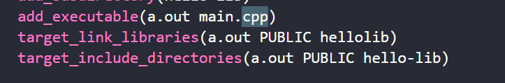
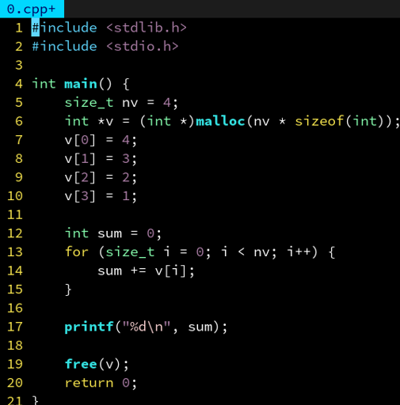
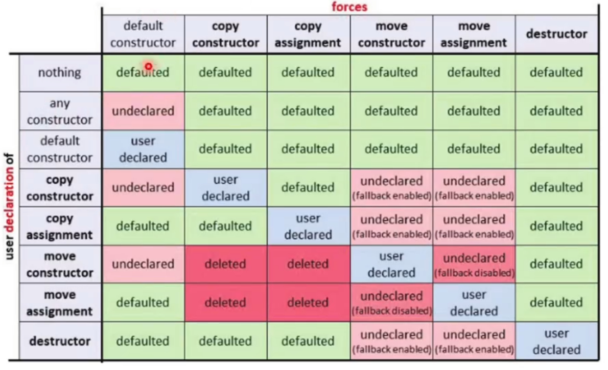
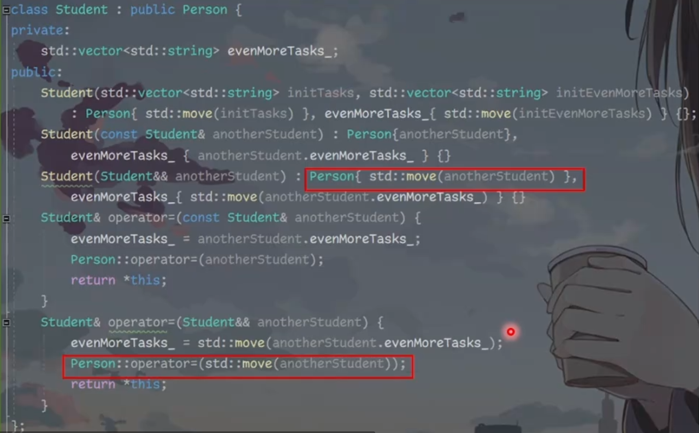
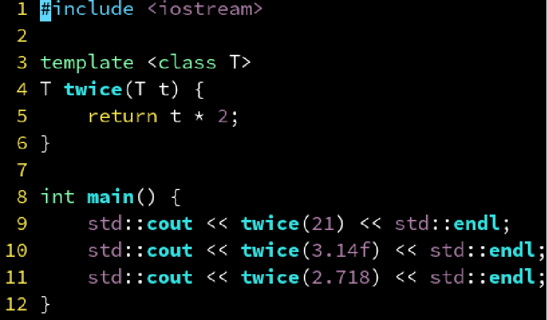
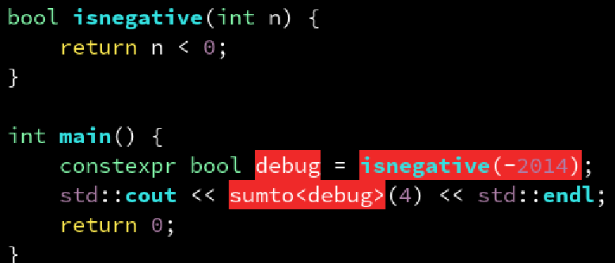
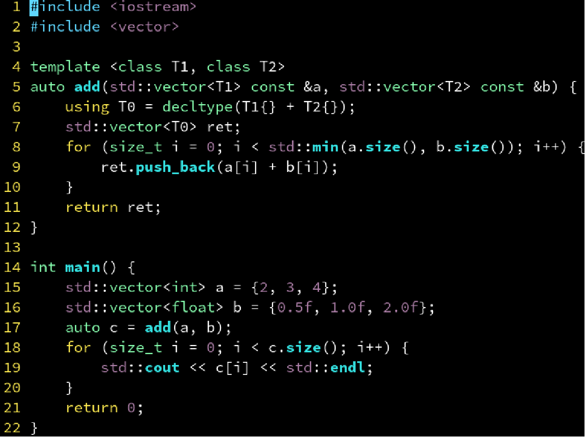
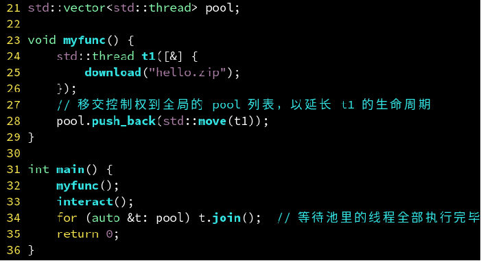
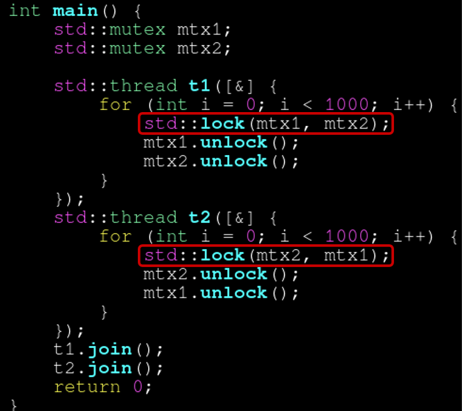

# C语法

### extern的作用

在c语言中，定义是分配空间，而声明通常是告诉编译器变量的类型和名字，定义只能出现一次，声明可以出现多次。

所以：

```c
int number; // 声明并定义一个名为number的整型变量（声明并定义）
int number = 10; // 声明并初始化变量number（声明并定义）
extern int number; // 在其他文件中定义的变量number的声明（纯声明）
int max(int x, int y); // 纯声明
int max(int x, int y){ // 声明并定义
	return 1;
}
```

extern是外部变量声明，**通过extern声明来使用作用域之外的变量**。**extern通常用于变量，因为在C语言中无法对变量进行纯声明，也就是变量的声明和定义无法分开，但是对于函数来说可以**。

**extern的常见用法还是用于声明外部变量，该变量可能是同一个文件中声明在后面的变量，也可能是另一个编译单元中的变量**：

- 如果全局变量不在文件的开头定义，有效的作用范围将只限于其定义处到文件结束。如果在定义点之前的函数想引用该全局变量，则应该在引用之前用关键字 extern 对该变量作“外部变量声明”。C语言中把函数声明写在文件的最前面也是同样的道理

  ```c
  #include <stdio.h>
  int max(int x,int y);
  int main(void)
  {
      int result;
      /*外部变量声明*/
      extern int g_X;
      extern int g_Y;
      result = max(g_X,g_Y);
      printf("the max value is %d\n",result);
      return 0;
  }
  /*定义两个全局变量*/
  int g_X = 10;
  int g_Y = 20;
  int max(int x, int y)
  {
      return (x>y ? x : y);
  }
  ```

- 如果整个工程由多个源文件组成，在一个源文件中想引用另外一个**源文件**中已经定义的外部变量，同样只需在引用变量的文件中用 extern 关键字加以声明即可（注意，这里是源文件，对于头文件是不行的）

  ```c
  /****max.c****/
  #include <stdio.h>
  /*外部变量声明*/
  extern int g_X ;
  extern int g_Y ;
  int max()
  {
      return (g_X > g_Y ? g_X : g_Y);
  }
  /***main.c****/
  #include <stdio.h>
  /*定义两个全局变量*/
  int g_X=10;
  int g_Y=20;
  int max();
  int main(void)
  {
      int result;
      result = max();
      printf("the max value is %d\n",result);
      return 0;
  }
  ```

但是在C语言项目中extern最常用的用法还是：为了避免多个源文件链接时重复定义，我们只能在头文件中写声明，在源文件中写定义。但是**对于变量来说，声明和定义无法分离，所以通常在源文件中定义，在头文件中用extern int声明，然后其他的源文件再包含头文件**。

本质上来说，在C语言中，**任何变量和函数在调用前都必须声明**，否则编译会报错。所以在最原始的情况下，一个项目中只需要源文件即可，根本不需要头文件。如果一个源文件a要调用源文件b中的func函数，那么直接在源文件a前面使用extern声明一下即可。但是如果一个函数被很多个文件都调用了，那么就需要在每个文件前面都extern声明一下，这样非常麻烦。所以就出现了include和头文件，直接将需要的声明在头文件中写好，然后在需要的源文件中include头文件即可。预处理时直接将头文件中的声明全部复制粘贴到include它的源文件中，**这样就相当于批量完成了extern的工作**。

### static变量的作用

```c
static tid_t
allocate_tid (void) 
{
  static tid_t next_tid = 1;
  tid_t tid;

  lock_acquire (&tid_lock);
  tid = next_tid++;
  lock_release (&tid_lock);

  return tid;
}
```

静态局部变量只在定义的函数体中可见，并且只被初始化一次，生命周期从第一次初始化到进程结束一直存在。所以**静态局部变量通常用来将局部变量的生命周期延长，但是又不想让局部变量的作用域太大**，所以不使用全局变量。

- 如上面这个例子：`next_tid`的生命周期是全局的，但是只能在allocate_tid函数内部访问。并且每次调用函数时不会被重新赋值，只有第一次调用时被赋值为1，后面每次调用时都是沿用之前的值

通常我们在一个源文件中定义的全局变量和函数是对这个项目中的所有文件可见的，这个可见指的是链接作用域，也就是说我们在文件a中定义的变量，在文件b中使用extern声明一下就可以使用了。

```c
// a.c文件
#include <stdio.h>
extern int num;
void func(void);
int main() {
    num = 20;
    func();
}
// b.c文件
#include<stdio.h>
int num = 10;
void func() {
    printf("%d\n", num); 
    return;
}
```

但是static限制了全局变量和函数的链接作用域，也就是**全局变量和函数只能在它的翻译单元内部被调用**，如果在其他源文件中被调用，则会导致链接错误：

- **翻译单元指的一个源文件和它所包含的所有头文件，本质上也就是经过编译和汇编之前的可重定位目标文件**。

```c
// a.c文件
#include <stdio.h>
extern int num;
void func(void);
int main() {
    num = 20;
    func();
}
// b.c文件
#include<stdio.h>
static int num = 10;
void func() {
    printf("%d\n", num); 
    return;
}
```

即使两个不同的文件定义了相同名字的静态全局变量，它们也是两个不同的变量。**静态全局变量通常用来限制全局变量的作用域**。

- 所以如果两个文件定义了相同名字的static变量，他们都存储在.data段，他们却不会产生冲突，因为他们在.data段中存储的名字是文件名+变量名；同理，如果两个函数中有相同名字的static变量，他们也不会产生冲突，他们在data段中存储的名字是文件名+函数名+变量名

所以总的来说，**static的主要作用是控制作用域**，一定要用好static，**永远将变量的作用域保持在最小的范围，实在不行再扩大作用域**，这样可以大量减少你的bug

注意！即使是全局变量，想要在文件外调用都必须提前声明！

#### static函数写在头文件中的结果

如果把static函数写在头文件中，由于static的链接作用域是在一个翻译单元中，被 include 进多个编译单元的 h 函数，在多个编译单元中分别编译，得到了多个副本；在链接的时候，链接器认为它们是其所属的编译单元私有的函数，**所有的副本都被保留**。比如说有三个源文件include了头文件，那么链接得到的可执行文件中就会有三份static函数的定义

所以，**static 关键字应修饰的是那些 “只供同文件的其他函数使用的函数”，将 static 函数置于头文件中，进而被多个源文件 include，企图使用这种方式绕过链接符号冲突错误，则是对 static 的误用、乱用**。

### function declaration isn't a prototype

在C语言中，使用这个写法会报错，因为在C语言中 `int foo()`和 `int foo(void)`是两个不同的函数，前者可以接受任意数量的参数，后者不能接受任何参数

```
int32_t cal_load_avg();
```

### inline的用法

其作用是将函数展开，把函数的代码复制到每一个调用处。这样调用函数的过程就可以直接执行函数代码，而不发生跳转、压栈、保存现场等一般性函数操作。可以节省时间，也会提高程序的执行速度。


**关键字inline必须与函数的定义体放在一起，才能使函数成为内联函数**，仅仅将inline放在函数声明前面不起作用

**inline函数的定义需要放在头文件中**，因为内联函数要在调用点展开，在每个用到内联函数的翻译单元中，都必须重复定义这个内联函数，所以**编译器必须随处可见内联函数的定义**，要不然就成了非内联函数的调用了。所以这要求每个调用了内联函数的文件都出现了该**内联函数的定义**。

inline函数仅仅是一个**对编译器的建议**，所以**最后能否真正内联，看编译器的意思**。现在的inline已经失去了内联的作用，编译器会忽略掉inline关键字，它唯一的作用就是语意上的作用。

inline和static函数都可以写在头文件中，二者的区别是：

- 被 include 进多个编译单元的 h 函数，在多个编译单元中分别编译，得到了多个副本；在链接的时候，**链接器随便选取其中的一个副本保留**，其余的被丢弃。
- 被 include 进多个编译单元的 h 函数，在多个编译单元中分别编译，得到了多个副本；在链接的时候，链接器认为它们是其所属的编译单元私有的函数，**所有的副本都被保留**。

static 关键字应修饰的是那些 “只供同文件的其他函数使用的函数”，将 static 函数置于头文件中，进而被多个源文件 include，企图使用这种方式绕过链接符号冲突错误，则是对 static 的误用、乱用。

而加 inline，可以保证你在不同的编译单元中调用的是同一个函数；而加 static，你在不同编译单元中调的是不同的分身！

### 头文件重复包含

如果b.h包含了a.h，而c.c同时包含了b.h和a.h，那么编译就会出错，因为预处理展开后c.c文件中包含了两次a.h。为了解决这个问题，我们在写a.h的时候使用如下的方式：

```c
#ifndef FIXED_POINT_H
#define FIXED_POINT_H

#endif
```

这样，一个文件如果包含了一次a.h，那么就会定义了FIXED_POINT_H，下一次就无法再包含a.h了

这种写法等同于 `#pragma once`

### 不要在头文件中定义任何变量!否则会链接出错！

### char *和char []的区别

**`char c[]`声明的是一个字符数组**，可以直接用字符串字面量来初始化数组，例如：`char c[] = "hello";`这会创建一个可以容纳字符串字面量的数组，包括终结符`'\0'`。**只有字符数组才会包括终结符**！**使用sizeof(c)获取的是整个数组的大小（包括终结符）**

而使用**char*c声明的是一个指向字符的指针**，这个指针可以指向任何位置的字符，包括另一个字符数组、一个字符串字面量等。但是使用char *指向字符串字面量时，不能使用strlen等函数，**因为字符串字面量不包括终结符**。**使用sizeof(c)获取的是char *指针的大小**

并且使用char[]声明的数组是可以修改的，而使用char*指向字符串字面量时，指针指向的内容是不可修改的。

二者最根本的区别就是：**一个是数组，一个是指针。并且数组会自动生成终结符**

并且数组是数组，指针是指针，二者是不一样的

### 函数形参中使用指针和数组没有任何区别

**向函数中传数组也会退化成指针**，比如sizeof传入的数组得到的不是数组大小而是指针大小。

### strlen和sizeof的区别

**strlen计算的是字符串的逻辑长度，不包括终结符；而sizeof关注的是数组的实际分配内存的大小，包括终结符**

### strlen用法

`strlen` 函数用于计算以空字符（`'\0'`）结尾的字符串的长度，长度不包括结尾的0

- **字符串以空字符结尾**：`strlen` 函数通过查找空字符（`'\0'`）来确定字符串的结束位置。如果没有空字符，`strlen` 将继续在内存中读取，直到遇到空字符，这可能导致越界访问，从而引发未定义的行为。

### 函数指针

`uint64_t (*syscalls[])(void)`：先从`(*syscalls[])`开始读起，表示声明了一个变量叫syscalls，先与`[]`结合，表示这个变量是一个数组，再与*结合，表示数组中的每一个元素是一个指针。

- `[]`优先级高于*号

最后再与`uint64_t (void)`结合，表示指针指向一个函数，函数的参数是`void`，返回值是`uint64_t`。

# C++学习


静态库会把代码直接插入到生成的可执行文件中，导致体积变大，但是只需要可执行文件一个文件就可以运行了；动态库会在生成的可执行文件中生成插桩函数，当可执行文件被加载到内存中时（exec），会将指定目录中的.dll文件加载到内存中的空闲的位置，并且将可执行文件的地址空间中插桩指向的地址替换为.dll文件加载后的地址。


其中 `<cstdio>` 这种形式表示不要在当前目录下搜索，只在系统目录里搜索，”hello.h” 这种形式则优先搜索当前目录下有没有这个文件，找不到再搜索系统目录。

- 用尖括号的地方可以用引号，但是用引号的地方不能用尖括号

CMake：

- `cmake_minimum_required(VERSION 3.12)`：指定了构建此项目所需的最低CMake版本，即版本3.12。
- `project(hellocmake LANGUAGES CXX)`：声明了一个项目，名称为`hellocmake`，并指出这个项目使用的语言是C++（由`CXX`标识符指定）。
- `add_library(hellolib STATIC hello.cpp)`：添加了一个名为`hellolib`的静态库，其源文件是`hello.cpp`。静态库是在编译时与其他对象文件链接，而不是在运行时动态加载。
- `add_executable(a.out main.cpp)`：添加了一个可执行目标（程序），命名为`a.out`，它将从源文件`main.cpp`编译得到；如果有其他的源文件可以继续添加，如 `add_executable(a.out main.cpp hello.cpp)`
- `target_link_libraries(a.out PUBLIC hellolib)`：这行指令将前面创建的静态库`hellolib`链接到可执行文件`a.out`。`PUBLIC`关键字指定链接类型，意味着`hellolib`的链接需求也会传递给任何链接到`a.out`的目标。

cmake命令调用：

- `cmake -B build`：读取当前目录的 CMakeLists.txt，并在 build 文件夹下生成（构建build） build/Makefile
- `make -C build`：让make读取build目录下的makefile，编译（c）生成a.out文件；或者等价于直接切换到build目录下使用make
- 执行a.out

复杂的工程中，我们需要划分子模块，通常一个库一个目录，比如把hellolib库的内容移动到hello-lib目录下，在hello-lib目录下再创建一个CMakeLists文件定义hellolib的生成规则；子目录的 CMakeLists.txt 里路径名（比如 hello.cpp）都是相对路径


要在根目录使用hellolib库，可以用 CMake 的 add_subdirectory 添加子目录，其中定义的库在 add_subdirectory 之后就可以在外面使用。


因为hello.h也被移动到了hello-lib子文件夹中，所以main.cpp里要修改include的路径；如果要避免修改代码，我们可以在根目录的CMakeLists中通过增加`target_include_directories` 指定a.out 的头文件搜索路径



但是这样如果另一个 b.out 也需要用 hellolib 这个库，也得再指定一遍搜索路径，这样比较麻烦，我们只需要在hellolib目录下的CMakeLists中指定头文件搜索路径，引用hellolib的CMake会自动添加这个路径

- 如果不希望让引用 hellolib 的可执行文件自动添加这个路径，把 PUBLIC 改成 PRIVATE 即可。这就是他们的用途：决定一个属性要不要在被 link 的时候传播


有时候我们不满足于 C++ 标准库的功能，难免会用到一些第三方库。最友好的一类库莫过于纯头文件库了，只需要把他们的 include 目录或头文件下载下来，然后在cmake中添加 `target_include_directories(spdlog/include)` ，再在文件中include头文件即可。缺点：函数直接实现在头文件里，没有提前编译，从而需要重复编译同样内容，编译时间长。


第二友好的方式则是作为 CMake 子模块（连接库）引入，方法就是把那个项目（以fmt为例）的源码放到你工程的根目录，然后在根目录的cmake中通过 `add_subdirectory`添加fmt子目录，再通过`target_link_libraries`将fmt库连接到目标文件


### 构造函数

C++的进化：

C语言：



C++98：


C++11：加入了列表初始化和range for


或者使用for_each算法模版：


为了避免定义全局函数，也可以使用lambda表达式：


C++17：stl容器可以使用编译期参数推断，在声明时不需要明确指定容器的数据类型


还引入了reduce


**代码规范**：构造函数建议使用初始化表达式，因为

1. 更有效率，前者是赋值了两遍，首先将成员变量初始化为0，然后再复制；
2. 如果成员变量没有默认构造函数，那么就会报错
3. 如果成员变量是const或者引用，也会出错，因为前者相当于对const或者引用赋值，而后者是初始化


**如果构造函数只接受单个参数，那么通常需要加上explicit，将其声明为显式的构造函数，不能接受等号赋值**（隐式的构造函数）。


注意！**等号的赋值不仅会出现在显式地用等号构造时，还会隐式地出现在函数参数的构造中**：


多个参数时，explicit 的作用体现在禁止从一个 {} 表达式初始化

{}和()都可以调用构造函数，二者的区别在于：

- int(3.14f) 不会出错，但是 int{3.14f} 会出错，因为 **{} 是非强制转换**，更加安全
- Pig(1, 2) 则 Pig 有可能是个函数，Pig{1, 2} 看起来更明确，可读性更强

**代码规范**：谷歌在其 Code Style 中也明确提出**别再通过 () 调用构造函数**，需要类型转换时应该用：

- `static_cast<int>(3.14f)` 而不是 int(3.14f)
- `reinterpret_cast<void *>(0xb8000)` 而不是 (void *)0xb8000

运算时隐式类型转换的规则：

- 范围小的类型转换成范围大的类型：如int转成long，double转成float
- 范围相同的，如无符号数和有符号数运算，将有符号数转成无符号数

默认构造函数：**当一个类没有定义任何构造函数，且所有非内置类型成员都有无参（默认）构造函数时，编译器会自动生成一个无参（默认）构造函数，他会调用每个成员的无参构造函数**；而对于内置类型（也叫做POD（plain-old-data））不会初始化为0，而是随机初始化。除非使用{}明确指定


**代码规范**：在定义类的时候始终在内置类型后面加上{0}，或者=0

列表初始化除了可以用来初始化vector，还可以用来初始化类的成员变量，会将 {} 内的内容，会按顺序赋值给对象的每一个成员。并且列表初始化只能对有默认构造函数的类生效，如果我们自己定义了构造函数，那么就不会生成默认构造函数，列表初始化就会出错。除非我们自己定义的构造函数的参数列表与列表初始化一致。


一个类会默认生成六个函数（默认构造、拷贝构造、移动构造、移动赋值、赋值、析构）

- 默认构造函数：只在用户没有定义其它类型构造函数时才会生成。如果定义的仅仅是无参构造函数，那么只会不生成默认构造函数，其他5个构造函数不影响生成
- 拷贝构造函数：只有用户没有定义 **移动构造函数**(5) 和 **移动赋值运算符**(6) 时，才会生成
- 拷贝赋值运算符：只有用户没有定义 **移动构造函数**(5) 和 **移动赋值运算符**(6) 时，才会生成
- 析构函数：无限制
- 移动构造函数：只有用户没有定义 **拷贝构造函数**(2), **拷贝赋值运算符**(3), **析构函数**(4) 和 **移动赋值运算符**(6) 时，才会生成
- 移动赋值运算符：只有用户没有定义 **拷贝构造函数**(2), **拷贝赋值运算符**(3), **析构函数**(4) 和 **移动构造函数**(5) 时，才会生成

所以**拷贝构造函数或赋值运算符会抑制移动函数的生成，但是相互之间不会抑制生成；而移动构造和移动赋值不仅会抑制普通构造和赋值的生成，相互之间也会抑制生成**。



实际上我们不需要记住这些规则，我们称析构、拷贝、赋值、移动拷贝、移动赋值为五大构造，有两条规则：

- 针对五大构造的规则（rule of zero和rule of five）：**五大构造要么全部定义，要么全部不定义，但凡定义其中任意一个都有可能导致其余的被抑制生成**。
- 针对默认构造的规则：定义任何构造函数都会抑制默认构造函数的生成


下面就是构造函数常用的实践方式：**不管定义再多的构造函数都不要糊涂了，它们只是普通的构造函数而已，不会抑制五大构造，只会抑制默认构造的生成，所以只需要显式声明一下让编译器生成默认构造即可**

```C++
class Tensor {
 public:
  explicit Tensor() = default;

  explicit Tensor(base::DataType data_type, int32_t dim0, bool need_alloc = false,
                  std::shared_ptr<base::DeviceAllocator> alloc = nullptr, void* ptr = nullptr);

  explicit Tensor(base::DataType data_type, int32_t dim0, int32_t dim1, bool need_alloc = false,
                  std::shared_ptr<base::DeviceAllocator> alloc = nullptr, void* ptr = nullptr);

  explicit Tensor(base::DataType data_type, int32_t dim0, int32_t dim1, int32_t dim2,
                  bool need_alloc = false, std::shared_ptr<base::DeviceAllocator> alloc = nullptr,
                  void* ptr = nullptr);

  explicit Tensor(base::DataType data_type, int32_t dim0, int32_t dim1, int32_t dim2, int32_t dim3,
                  bool need_alloc = false, std::shared_ptr<base::DeviceAllocator> alloc = nullptr,
                  void* ptr = nullptr);

  explicit Tensor(base::DataType data_type, std::vector<int32_t> dims, bool need_alloc = false,
                  std::shared_ptr<base::DeviceAllocator> alloc = nullptr, void* ptr = nullptr);
  
  // 其他成员函数和变量
};
```

= delete 和 = default 是一对。有时候记不住构造函数的生成规则，如果你不确定某个函数有没有被编译器默认生成，可以都用这两个显式地声明一下

编译器自动生成的所有函数：


- 为什么拷贝构造的引用要加const：因为拷贝构造不应该修改原对象，所以需要加const
- 为什么移动构造不需要加const：因为移动构造将原对象中的指针所有权转移了，原对象被修改了，所以不能标记为const

可以看到，默认生成的构造函数都是对对象中的字段逐元素进行操作的（拷贝或者移动）

**在继承中的构造函数的使用**：子类可以直接使用父类的构造函数（拷贝或移动）来初始化从父类继承来的字段，剩下的字段就还是使用之前的方法进行初始化（move或者拷贝）



构造函数的代码规范：

1. **如果一个类定义了解构函数，那么您必须同时定义或删除拷贝构造函数和拷贝赋值函数，**否则出错。

   - 因为类默认生成的拷贝构造函数和赋值运算符对指针成员变量进行的都是浅拷贝，即两个对象指向同一个地址。而我们自己定义的析构函数通常是直接将指针释放，那么就有可能出现对同一个空间的重复释放

   因此要么删除，要么自己定义：

   拷贝赋值函数和拷贝构造函数的写法基本一致，如果我们想简单一点写，那么可以先销毁自己本来的对象，然后再**在原来的地址上调用拷贝构造函数（placement new）直接构造新的对象**，这样能保证拷贝赋值运算符的语义，但是性能较差

   

2. 如果一个类定义了拷贝构造函数或拷贝赋值函数，那么您必须最好同时定义移动构造函数或移动赋值函数，否则低效。

3. 如果一个类定义了拷贝构造函数，那么您必须同时定义或删除拷贝赋值函数，否则出错，删除可导致低效。

4. 如果一个类定义了移动构造函数，那么您必须同时定义或删除移动赋值函数，否则出错，删除可导致低效。

**Move-only class**：

我们可以在拷贝构造和赋值函数后面加上=delete，来确保该类型只能进行移动，不能进行拷贝；在标准库中有很多这样的类型，比如unique_ptr，thread，表示这些类型是独占某些资源的，这些资源要么是不可拷贝的，要么是拷贝开销非常大的，所以设计成move only的；它们通常有一些共同的特性：

1. 有api来检查是否拥有资源，比如`thread::joinable()`
2. 有api来释放所拥有的资源，比如`thread::join()`, `unique_ptr::reset()`，`fstream::close()`
3. 不能使用auto for，因为auto for进行的是值拷贝
4. 不能使用初始化列表来初始化某个容器，比如 `std::vector<std::unique_ptr<int>> vec{new int{0}, new int{1}};`会编译报错，因为`std::initializer_list` 只提供一个只读的接口（视图）访问内部的元素，所以使用初始化列表来初始化容器时，只能进行逐元素的拷贝，然而容器内的元素是move only的 

我们需要关注被move后的对象的状态，通常来说，我们自定义的类型的对象被move后需要满足下面的条件：

- 对move后的对象进行析构不会出现错误
- 对move后的对象进行赋值不会出现错误，并且会再次变成正常的状态

### 拷贝构造和移动构造一定要使用表达式初始化！否则和拷贝赋值运算符有什么区别？

### 右值引用和右值

右值指的是一个表达式表示的对象，它不关联到一个明确的内存地址。右值通常是临时的，不能被赋值，也不能取地址。**它们是表达式的结果，比如字面量、返回值等**。

左值 lvalue 是有标识符、可以取地址的表达式

“值类别”（value category）和“值类型”（value type）是两个看似相似、却毫不相干的术语。前者指的是上面这些左值、右值相关的概念，后者则是与引用类型（reference type）相对而言，表明一个变量是代表实际数值，还是引用另外一个数值。

- 即，左右值和变量的类型是两个不同的系统：**所有的变量本身都是左值**，而左值的类型可以是student类型、student引用类型（student&）、student右值类型（student&&）等等（**比如`Func(std::string && s)`，这里的s就是左值**）。这三种类型的变量虽然他们都是student，但是他们匹配的变量是不一样的！

  - 比如对于函数调用来说，**用左值的变量调用就要匹配参数是左值的函数，用右值的变量调用就要匹配参数是右值的函数**，这就像调用构造函数一样，使用左值的变量不可能调用到移动构造函数，使用右值的变量也不可能调用到普通的构造函数（实际上const T&也可以捕获右值变量）

  而move的作用就是进行类型转换，把变量从左值转换成右值，等价于`(T&&)t`；但是**如果是用T&& 定义一个变量t，这个变量本身还是一个左值**，所以要想用t调用移动构造，还是需要将它变成右值才行。

  ```C++
  void fuck(Person&& another) {
    Person p(std::move(another)); // 调用移动构造
  }
  
  void fuck(Person&& another){
    Person p((Person&&)another);  // 调用移动构造
  }
  ```

  

右值引用是 C++11 新增的一种引用类型，用于绑定到右值。右值引用使用两个与号表示（`&&`），比如 `int&&`。右值引用可以绑定到一个将亡值，从而允许移动构造或移动赋值操作发生。

```c++
int getNumber() { return 42; } // getNumber() 返回的是一个右值

int&& rref = getNumber(); // rref 是一个右值引用，绑定到 getNumber() 的返回值上
```

**在没有被右值引用绑定的情况下，一个临时对象（右值）的生命周期通常是到当前语句的末尾**。

如果一个临时对象被绑定到一个函数作用域内的右值引用，那么这个**临时对象的生命周期将延长至这个右值引用的作用域结束**。相当于给了这个右值一个续命的名字

比如：

```C++
A func() {
  A a;
  return a;
}
int main() {
  A &&a = func();
}
```

**此时func返回的临时对象不会拷贝构造或者移动拷贝给a，而是给该临时对象取了一个名字，延长了它的生命周期**；不过一般不会这样写，而是直接用移动构造

**当&&在模版参数中时，它可以表示为通用引用，它可以绑定到左值或右值**

```c++
template<typename T>
void func(T&& arg) {
    // ...
}
```

在这个例子中，`T&&`的含义取决于`func`被调用时传入的参数类型：

- 如果传递给`func`的是左值，`T`会被推导为`Type&`，使得`T&&`实际上变成了`Type& &&`，根据引用折叠规则，最终会变成`Type&`，即左值引用。
- 如果传递给`func`的是右值，`T`会被推导为`Type`，使得`T&&`实际上就是`Type&&`，即右值引用。

但是，**在非模板代码的情况下，`&&`表示的是纯粹的右值引用**

#### 注意，右值引用也是引用

如果函数参数是右值引用，那么对它的修改也会影响到传入的对象；比如

```c++
void fuck(Person && p) {
  p.dick_length = 10;
}
int main() {
  Person sam_altman;  
  fuck(std::move(sam_altman));
  cout << sam_altman.dick_length << endl; // 长度变为10
}
```

### move

move：`std::move`本身并不移动任何东西。它仅仅将其参数转换为右值引用（`T&&`），所以 `std::move(t)`相当于 `(T &&)t`。这样就允许我们在赋值操作或构造函数中使用移动语义：**当一个对象被当作右值引用传递给构造函数或赋值操作符时，它会调用移动构造函数或者移动赋值运算符**，这两个函数**负责从源对象中将成员变量的所有权转移到新的对象中，而不是进行深拷贝**，**这相当于是从一个对象中窃取资源，而不是像拷贝构造函数一样拷贝资源**：

- 如果成员变量是指针类型的，那么直接将地址赋值给新的对象的指针，然后将源对象的指针置为null即可

  ```c++
  class MyClass {
  public:
      // 移动构造函数
      MyClass(MyClass&& other) noexcept {
          // 窃取other的资源
          this->resource = other.resource;
          // 将other的资源指针置为空，防止析构时释放资源
          other.resource = nullptr;
      }
      // 移动赋值运算符
      MyClass& operator=(MyClass&& other) noexcept {
          if (this != &other) { // 防止自赋值
              // 释放当前对象的资源
              delete this->resource;
              // 窃取other的资源
              this->resource = other.resource;
              // 将other的资源指针置为空，防止析构时释放资源
              other.resource = nullptr;
          }
          return *this;
      }
      // 其他成员
  private:
      ResourceType* resource;
  };
  ```

  


哪些东西使用移动是有意义的：

对于自定义并且内部有指针的数据类型来说，移动是有意义的，可以直接转移指针的所有权，而不是将指针指向的数据进行深拷贝。

但是对于基本数据类型（如`int`、`float`等）和内置类型数组，它们没有“所有权”这一概念。移动操作对这些类型而言，效果与拷贝相同，因为它们通常是直接按值存储的。

对于stl容器来说：

如果是vector，它的实现方式是在栈上分配一个小的空间，存放vector的size、capacity和指针，然后指针指向一段堆空间，在这个堆空间上存放着vector内部保存的对象；move操作会将源vector中data数组的size、capacity和指针直接赋值给新的vector，也就是数据所有权的转移，而不是直接进行数据的拷贝。所以move的时间复杂度是O(1)，而拷贝的时间复杂度是O(n)；但是move之后如果要访问原来的容器，就会出错


对于`std::array<T,N>`来说，它的实现方式是像数组一样，将T[N]分配在栈上；所以**它要移动只能对内部的每个元素逐个调用T的移动构造函数**，如果移动T没有意义，比如T是基本数据类型，那么移动array就没有意义；反之如果T是自定义类型并且内部有指针，那么移动array就有意义


swap函数也是通过move实现的，所以swap不止可以交换内置类型，还可以交换vector


还有，下面这两种情况也会触发移动构造函数：

- 将一个局部对象作为函数的返回值
- 将函数的返回值赋给另一个对象

因为这上面的两种情况都是将一个用完就会被销毁的临时值赋给另一个值，所以如果定义了移动构造函数就会触发移动构造，**如果没有定义移动构造函数就会触发拷贝构造，而这会造成不必要的拷贝，所以三五法则规定，定义了拷贝构造就一定要定义移动函数，否则会造成效率低下**


### rvo

```c++
class Obj {
public:
    Obj() { // 构造函数
    std::cout << "in Obj() " << " " << this << std::endl;
    }
    Obj(int n) {
    std::cout << "in Obj(int) " << " " << this << std::endl;
    }
    Obj(const Obj &obj) { // 拷贝构造函数
    std::cout << "in Obj(const Obj &obj) " << &obj << " " << this << std::endl;
    }
    Obj(const Obj &&obj) { // 移动构造函数
    std::cout << "in Obj(const Obj &&obj) " << &obj << " " << this << std::endl;
    }
    Obj &operator=(const Obj &obj) { // 赋值构造函数
    std::cout << "in operator=(const Obj &obj)" << std::endl;
    return *this;
    }
    Obj &operator=(const Obj &&obj) { // 移动赋值构造函数
    std::cout << "in operator=(const Obj &&obj)" << std::endl;
    return *this;
    }
    ~Obj() { // 析构函数
    std::cout << "in ~Obj() " << this << std::endl;
    }
private:
    int n;
};
```

```c++
//test28_RVO.cpp
Obj fun1() {
  Obj obj;
  // do sth;
  return obj;
}

int main() {
    Obj a = fun1();
    return 0;
}
```

关闭RVO的情况下：

只定义了拷贝构造，没定义移动构造的情况下：


```c++
//test28_RVO.cpp
Obj fun1() {
  Obj obj; // 默认构造
  // do sth;
  return obj; // 拷贝构造在main的栈上构造一个临时对象
    // 析构，将obj对象析构
}

int main() {
    Obj a = fun1(); // 拷贝构造，用main栈上的临时对象初始化对象a
    // 析构，临时对象被析构
    return 0; 
    // 析构，a对象被析构
}
```

既定义了移动构造又定义了拷贝构造的情况下：

- **返回obj和将func1的返回值赋值给a都是临时值**，所以都可以替换成移动构造函数
- **返回obj和将func1的返回值赋值给a都是临时值**，所以都可以替换成移动构造函数
- **返回obj和将func1的返回值赋值给a都是临时值**，所以都可以替换成移动构造函数


在`main`函数调用函数`fun1()`的时候，调用者会将一个main栈的地址传递给`fun1()`。在函数`fun1()`内，当调用构造函数创建`obj`之后，会将`obj`拷贝到这个栈的地址，作为一个临时对象。函数`fun()`调用结束之后，会再调用一次拷贝构造函数，临时对象拷贝到接收者即`a`中，然后再将main栈的临时对象析构。


在RVO下：启用RVO优化的情况下，只调用了一次构造函数，拷贝构造函数没有被调用。

从汇编代码结果可以看出，`main`函数将变量a的地址`-0x1c(%rbp)`传递给函数`fun1()`，之后，`fun1()`在调用`Obj`构造函数的时候，直接在变量a上进行构造，免去了临时对象的创建以及拷贝和析构。


**返回 std::move(a)** 会使 RVO 失效，会多产生一次拷贝和一次析构。


### 移动构造函数要加上noexcept

有些操作比如vector的`push_back`有异常安全性的保证（exception safety of guarantee），即强异常安全性保证，也就是说当push_back出现异常时，整个操作要进行回滚，原来的vector的内容不能发生任何变化（即保证原子性，要么是完成的状态，要么是原本的状态，没有中间的任何其他状态）；

对于下图中的情况：当向persons中push_back “SOAP”时会触发扩容，而Person又实现了移动构造，所以按照常理来说会把原persons中的Roach和Ghost移动到新的vector中，然而输出却显示调用的是拷贝构造，不是移动构造。


原因在于：move（**这里指的是移动构造还是std::move？**）是有可能抛出异常的，如果push_back调用移动构造来扩容，那么如果移动到Ghost时发生了异常，此时想要回滚，但是Roach已经被移动到新的vector中了，所以又要调用移动构造把新的vector中的Roach移动回原来的vector，但是移动构造依然是有可能抛出异常的，于是回滚时也有可能抛出异常导致回滚失败；所以**push_back为了保证强异常安全性，即为了保证回滚的成功，在知道移动构造有可能抛出异常的情况（即没有标记noexcept）下，它会选择调用拷贝构造，因为拷贝构造一定不会改变原来的元素，因此回滚一定可以成功**。

当为移动构造加上noexcept之后，移动构造就会被正常调用了


除了从优化上考虑之外，移动构造和移动赋值函数的操作本质上就是不会抛出异常的

### value category


prvalue（pure right value）表示在C++11的move语义出来之前的临时值，有以下这些东西：

- 字面量，比如42，true，nullptr，但是字符串字面量是lvalue
- 函数调用返回的非引用的返回值，比如`str.subttr(1,2)`，str1 + str2，it++，a + b,  a < b, a == b
- cast，比如`static_cast<double>(x)`，`(int)42`等，也相当于产生了一个临时值

xvalue（eXpiring value）表示右值引用，主要来源于产生右值引用的表达式：

- 函数调用返回的右值引用，比如`std::move(x)`产生对原来的对象的一个右值引用
- cast转成右值引用，比如`static_cast<char&&>(x)`，实际上std::move(x)就是用`static_cast<char&&>(x)`实现的

lvalue就是一种可以长期存在的数据 

## const

### const T&与T&&都可以捕获右值

const T&与T&&都可以捕获右值（临时值），也就是说二者都可以延长右值的生命周期

**实际上const T&必须要可以捕获右值，因为拷贝构造和赋值运算符的形参就是const T&，如果不能捕获右值那么临时对象就无法调用拷贝构造和赋值运算符了**，在没有引入移动构造函数的日子里（比如C++98），我们依然可以将临时值传入拷贝构造函数

但是const T&的优先级是比T&&的优先级低的，所以当一个类中既有拷贝构造又有移动构造时，会优先调用移动构造。

**当类中没有移动构造时，`obj o(std::move(obj))`也会调用类的拷贝构造函数**

### 常量成员函数

在类的成员函数声明或定义时，括号右边带有 `const` 关键字，例如 `void func() const;`，其含义是该成员函数是一个**常量成员函数**。

常量成员函数的含义：

1. **不修改成员变量**：常量成员函数保证不会对对象的状态做任何修改操作，也就是不会修改类的任何成员变量。
2. **对常量对象的支持**：常量成员函数可以被常量对象调用。如果一个对象是常量（即声明为 `const`），则只能调用它的常量成员函数，因为常量对象不允许调用普通的非常量成员函数（会导致对象状态改变的可能性）。注意，**常量成员函数也可以被非常量对象调用**

作用：**常量成员函数通常用于执行只读操作**，例如获取对象的状态信息或计算某些值，而不改变对象的内部状态。

## C++的访问权限控制是基于类的，而不是基于对象的

**同一类的对象可以相互访问其私有成员**

## 智能指针


`shared_ptr` 则允许拷贝，他解决重复释放的方式是通过引用计数。每当有一个人持有它的所有权时它的引用计数就加1，释放它的所有权时引用计数就减1。释放所有权的方式与unique_ptr相同，要么将它手动置为null，要么是作用域结束。


初始化shared_ptr的方式：

- 使用make_shared函数，在动态内存中分配一个对象并初始化它，返回指向此对象的`shared_ptr`。调用make_shared时传递的参数必须与所构造的类型的某个构造函数相匹配。

  make_shared**返回的`shared_ptr`是一个临时值**，赋值给等号左边的`shared_ptr`后就被销毁。所以下面第一条赋值语句结束后，shared_ptr的引用计数为1，而不是2.

  ```cpp
  //指向一个值为42的int的shared ptr
  shared_ptr<int> p3 = make_shared<int> (42) ;
  // p4 指向一个值为"9999999999"的string
  shared_ptr<string> p4 = make_shared<string>(10， '9') ;
  // p5指向一个值初始化的int，即值为0
  shared_ptr<int> p5 = make_shared<int>() ;
  ```

- 直接初始化：

  使用new int调用智能指针参数为普通指针的构造函数进行直接初始化

  ```cpp
  shared_ptr<int> p2(new int(1024));//正确，使用new int调用参数为指针的构造函数进行直接初始化
  ```

错误初始化方式：

普通指针无法隐式转化为智能指针，不能用普通指针初始化智能指针或赋值。

```cpp
shared_ptr<int> p1 =new int(1024);//错误，普通指针无法隐式转化为智能指针，无法调用拷贝构造函数

//错误，函数返回时要调用拷贝构造函数，而拷贝构造函数的参数为智能指针，普通指针无法转化为智能指针
std::shared_ptr<int> func_shared(std::shared_ptr<int> a) {
	std::shared_ptr<int> p(new int(9));
	return new int(10);
}
```

**每个`shared_ptr`都会记录自己所管理的对象被多少个shared_ptr引用**。

- 当我们拷贝一个shared_ptr时，引用计数会增加。比如：当用一个shared_ptr初始化另一个shared_ptr，或将它作为参数传递给一个函数，以及作为函数的返回值
- 当我们给shared_ptr 赋予一个新值（新的对象的引用计数增加，旧的对象的引用计数减少）或是shared_ptr 被销毁（例如一个局部的shared ptr离开其作用域时），计数器会递减

一旦一个shared_ptr的计数器变为0，它就会自动释放自己所管理的对象:

```cpp
auto r = make_shared<int>(42);//r指向的int只有一个引用者
r=q;	//给r赋值，令它指向另一个地址
		//递增q指向的对象的引用计数
		//递减r原来指向的对象的引用计数
		//r原来指向的对象已没有引用者，会自动释放
```

默认情况下，**一个用来初始化智能指针的普通指针必须指向动态内存**，因为智能指针默认使用delete释放它所关联的对象。

**我们可以用reset来将一个新的指针赋予一个shared_ptr**:

```cpp
p = new int (1024) ;
//错误:不能将一个指针赋予shared_ ptr
p.reset(new int(1024)); // 正确: p指向一个新对象
```

与赋值类似，reset会更新引用计数，如果需要的话，会释放p指向的对象。

reset 成员经常与unique一起使用，来控制多个`shared_ptr`共享的对象。**在改变底层对象之前，我们检查自己是否是当前对象仅有的用户。如果不是，在改变之前要制作一份新的拷贝，在新的拷贝上进行修改**:

```cpp
if (!p.unique())
	p.reset (new string(*p)); // 我们不是唯一用户;分配新的拷贝
*p += newVal; // 现在我们知道自己是唯一的用户，可以改变对象的值
```


#### 不要用普通指针来访问一个智能指针所负责的对象！

考虑下面对shared_ ptr进行操作的函数:

```cpp
//在函数被调用时ptr被创建并初始化
void process (shared_ptr<int> ptr)
//使用ptr
} // ptr离开作用域，被销毁
```

process的参数是传值方式传递的，因此实参会被拷贝到ptr中。拷贝一个shared_ptr会递增其引用计数，因此，在process运行过程中，引用计数值至少为2。当process结束时，ptr的引用计数会递减，但不会变为0。因此，当局部变量ptr被销毁时，ptr指向的内存不会被释放。

使用此函数的正确方法是传递给它一个 shared_ptr:

```cpp
shared_ptr<int> p(new int(42)); //引用计数为1
process(p); // 拷贝p会递增它的引用计数;在process中引用计数值为2.
int i=*p;//正确:引用计数值为1
```

我们也可以传递给它一个(临时的) shared_ptr,这个shared_ptr是用一个内置指针显式构造的。但是，这样做很可能会导致错误:

```cpp
int *x(new int (1024)) ;
//危险: x是一个普通指针，不是一个智能指针
process(x); // 错误:不能将int*转换为一个shared_ptr<int>
process (shared_ptr<int>(x)); // 合法的，但这个shared_ptr是临时值，在process内部引用计数为1，结束后引用计数为0
int j = *x; //未定义的: x是一个空悬指针!
```

在上面的调用中，我们将一个**临时 shared_ptr** 传递给process。当这个调用所在的表达式结束时，这个临时对象就被销毁了。销毁这个临时变量会递减引用计数,此时引用计数就变为0了。因此，当临时对象被销毁时，它所指向的内存会被释放。**由于使用的是临时shared_ptr，所以在process后只能直接使用普通指针x，但x继续指向(已经释放的)内存，从而变成一个空悬指针。如果试图使用x的值，其行为是未定义的**。

**当将一个shared_ptr绑定到一个普通指针时，我们就将内存的管理责任交给了这个shared_ptr，我们就不应该再使用内置指针来访问shared_ptr 所指向的内存了。**

！！不要用普通指针来访问一个智能指针所负责的对象！！

！！不要用普通指针来访问一个智能指针所负责的对象！！

！！不要用普通指针来访问一个智能指针所负责的对象！！

！！不要用普通指针来访问一个智能指针所负责的对象！！

#### unique_ptr

一个`unique_ptr`“拥有”它所指向的对象。**与shared_ptr 不同，某个时刻只能有一个unique_ptr 指向一个给定对象。当unique_ptr 被销毁时，它所指向的对象也被销毁**。

与shared_ptr的初始化方式类似：

- 使用`make_unique<C>`函数：可以理解为和`new C(...)`类似，括号里可以有其他构造函数的参数

- 直接初始化：

  定义一个unique_ptr 时，需要将其绑定到一个new返回的指针上

  ```cpp
  unique_ptr<double> pl; //可以指向一个double的unique_ ptr
  unique_ptr<int> p2 (new int(42)) ; // p2指向一个值为42的int
  ```


由于一个unique_ptr拥有它指向的对象，因此unique_ptr删除了拷贝构造函数，因此 `unique_ptr`禁止浅拷贝，因为浅拷贝会导致有多个unique_ptr拥有同一个对象的所有权：

```cpp
unique_ptr<string> p1 (new string ("Stegosaurus")) ;
unique_ptr<string> p2(p1); // 错误: unique_ ptr 不支持拷贝
unique_ptr<string> p3;
p3 = p2;//错误: unique_ptr不支持赋值
```

虽然我们不能拷贝或赋值unique_ ptr，但**可以通过调用release或reset或者move将指针的所有权从一个(非const) unique_ptr转移给另一个unique**:

- `release`**释放智能指针对所管理对象的所有权**，并返回该对象的原始指针。

  **release 返回的指针**通常被用来初始化另一个智能指针或给另一个智能指针赋值。如果我们不用另一个智能指针来保存release返回的指针，我们的程序就要负责资源的释放:

  - 注意：**`std::shared_ptr` 不提供 `release` 函数**，因为它采用共享所有权的管理方式，无法简单地释放单个引用。

  ```cpp
  p2.release () ;
  //错误: p2不会释放内存，而且我们丢失了指针
  auto P = p2.release() ;
  //正确，但我们必须记得delete (p) 
  ```


- `reset`成员接受一个 可选的指针参数，令unique_ptr重新指向给定的指针。如果unique_ptr 不为空，它原来指向的对象被释放。

  ```cpp
  //将所有权从p1 (指向string Stegosaurus)转移给p2
  // p1.release返回p1原来保存的指针，初始化p2，同时将p1置为空
  unique_ptr<string> p2(p1.release()); 
  unique_ptr<string> p3(new string ("Trex")) ;
  // p2指向p3原来保存的指针，p3置为空
  p2.reset(p3.release()); // reset 释放了p2原来指向的内存
  ```

- 通过move移动指针的所有权，也就是掏空一个unique_ptr，把东西给另一个unique_ptr

  

释放unique_ptr的方式是：

```CPP
p = nullptr // 实际上等价于p.reset()，旧对象被释放，又没有新对象
```

因此`unique_ptr`只允许一个人拥有指针的ownership，但是我们可以通过 `p.get()`获取内部的指针，然后通过裸指针调用它的函数，这样并不意味着它接管了指针的ownership


#### 所以unique_ptr与shared_ptr唯一的区别就是它没有拷贝构造和拷贝赋值

**unique_ptr可以move，不能copy。它没有拷贝构造，但是有move构造**。**我们可以拷贝或赋值一个将要被销毁的unique_ptr**。编译器知道要传递的对象将要被销毁，此时编译器会执行一种特殊的拷贝（而不是拷贝构造）。**当函数返回一个对象时，理论上会产生临时变量**，那必然是会导致新对象的构造和旧对象的析构，但是C++编译针对这种情况允许进行优化：

1. 如果支持move构造，那么调用move构造。
2. 如果不支持move，那就调用copy构造。
3. 如果不支持copy，那就报错。

所以unique_ptr的用法为：

- 它可以放入容器中，也可以作为函数返回值（对unique_ptr，以上两种情况不会调用拷贝构造函数），因为`std::unique_ptr<int> p(new int(9))`是在栈上开辟的对象，此函数结束后p就会被释放，所以这里是旧对象的析构和新对象的构造，实际上调用了move，相当于`unique_ptr<int>(std::move(p))`，最后内部的对象还是只有一个引用

  ```cpp
  std::unique_ptr<int> func(std::unique_ptr<int> a) {
  	std::unique_ptr<int> p(new int(9));
  	return p;
  }
  ```

- 但是不能作为函数参数（可以作为形参，不能作为实参传入函数）

  ```cpp
  std::unique_ptr<int> func(std::unique_ptr<int> a) {
  	std::unique_ptr<int> p(new int(9));
  	return p;
  }
  int main() {
  	std::unique_ptr<int> p = make_unique<int>(19);
  	func(new int(10));// 错误！不能传递普通指针，普通指针无法隐式转换为智能指针
  	func(p);// 错误！不能向函数中传递unique_ptr,unique_ptr不能拷贝
  }
  ```

- 但是可以向函数中传递unique_ptr的右值（临时值）

  ```cpp
  int main() {
  	// 正确，可以向函数中传递unique_ptr的右值（即临时值）
      func(make_unique<int>(10));
  	func(std::unique_ptr<int>(new int(10)));
  	func(std::move(p));
  }
  ```


正确使用智能指针的方式是：

1. 在函数中作为参数传递是，尽量避免使用智能指针，使用*或者引用，跟以前一样
2. 尽量使用unique_ptr,他比shared_ptr更light
3. **尽量使用makeshared/ make_unique 来代替new**
4. 不出现new 和 delete

```cpp
std::unique_ptr<int> func(std::unique_ptr<int> a) {
	std::unique_ptr<int> p(new int(9));
	return p;
}
std::shared_ptr<int> func_shared(std::shared_ptr<int> a) {
	std::shared_ptr<int> p(new int(9));
	return p;
}
int main() {
	std::unique_ptr<int> p = make_unique<int>(19);
	func(new int(10));// 错误！不能传递普通指针，普通指针无法隐式转换为智能指针
	func_shared(new int(10));// 错误！理由同上
	func(p);// 错误！不能向函数中传递unique_ptr,unique_ptr不能拷贝

	// 正确，可以向函数中传递unique_ptr的右值（即临时值）
    func(make_unique<int>(10));
	func(std::unique_ptr<int>(new int(10)));
	func(std::move(p));// 转移后，p为空
	// 正确，可以向函数中传递shared_ptr
	std::shared_ptr<int> p_shared = make_shared<int>(20);
	func_shared(p_shared);
}
```

get：

```cpp
    disk_manager_ = std::make_unique<DiskManager>("executor_test.db");
    bpm_ = std::make_unique<BufferPoolManager>(2560, disk_manager_.get());
```

DiskManager对象的所有权在`disk_manager_`_上，但是`disk_manager_.get()`和`disk_manager_`指向同一个对象，如果该智能指针被销毁了，对`disk_manager_.get()`的使用会出现错误

#### 变量的生命周期

一个shared_ptr变量指向一个对象，当这个变量的生命周期结束后，这个对象的引用计数就减一。**注意，生命周期不只是在函数中，if或者for内部声明的变量的生命周期仅限于花括号中**！


`shared_ptr`的弊端：

1. `shared_ptr` 需要维护一个 atomic 的引用计数器，效率低，需要额外的一块管理内存（引用计数本身存放在一个对象（控制块）中，shared_ptr对象中维护了指向这个控制块的指针，因为只有这样不同的shared_ptr对象才能共享同样的引用计数）；访问实际对象需要二级指针，而且 deleter 使用了类型擦除技术。

2. 全部用 `shared_ptr`，可能出现循环引用之类的问题，导致内存泄露。比如下面这个链表，两个节点相互引用，导致死锁，无法释放这两个节点，因为child持有对parent的引用，所以要释放parent需要先释放child，而parent又持有对child的引用，所以要释放child需要先释放parent

   - 实际上手动将parent->m_child置为null就可以打破死锁

   

解决循环引用的方式是：使用不影响计数的原始指针或者 `weak_ptr` 来避免

`weak_ptr`维护了一个shared_ptr的弱引用，弱引用的拷贝与解构不影响其引用计数器。之后有需要时，可以通过 lock() 随时产生一个新的 shared_ptr 作为强引用。但不 lock 的时候不影响计数。并且可以通过expired（）检查是否失效，如果失效（计数器归零）则 expired() 会返回 false，且 lock() 也会返回 nullptr

- 所以weak_ptr就相当于是获取了shared_ptr的裸指针，不管shared_ptr的所有权怎么变化，只要引用计数不归0，weak_ptr始终可以访问内部的指针。唯一不一样的地方就是，裸指针无法判断什么时候该指针失效（引用计数为0，被销毁），但是weak_ptr可以通过expired函数判断是否失效。


使用weak_ptr避免循环引用：

- 将指向父节点的指针变成`weak_ptr`，就可以实现先释放父节点，再释放子节点了


所以**构造函数的代码规范**一言以蔽之：**如果一个类定义了析构函数，那么最好要定义其他所有的构造函数**！

- 如果类的所有成员都是安全的类型，那么五大构造函数都无需声明，这个类自动就是安全的
- 最好的判断方式是：如果你不需要自定义的解构函数，那么这个类就不需要担心。因为如果用到了自定义解构函数，往往意味着你的类成员中，包含有不安全的类型，比如你的类管理着资源。

使用引用可以避免拷贝，

- 如果是基础类型（比如 int，float）则按值传递：float squareRoot(float val);
- 如果是原始指针（比如 int *，Object *）则按值传递：`void doSomethingWith(Object *ptr)`;
- 如果是数据容器类型（比如 vector，string）则按常引用传递：`int sumArray(std::vector<int> const &arr)`;
- 如果是智能指针（比如 shared_ptr），且需要生命周期控制权，比如将obj加入到一个全局的vector中，则按值传递：`void addObject(std::shared_ptr<Object> obj)`;
- 如果是智能指针，但不需要生命周期，则通过 .get() 获取原始指针后，按值传递：`void modifyObject(Object *obj)`;

**为了避免隐式调用了拷贝构造函数，我们可以将拷贝构造函数声明为explicit**，这样隐式的拷贝就会出错，从而发现因为疏忽大意造成的不必要拷贝。而当的确需要拷贝时，也可以改成 Pig(pig) 语法来强制拷贝。


#### enable_shared_from_this

```C++
class perseon {
	int id;
};
perseon *p = new perseon();
std::shared_ptr<perseon> sp(p);
std::shared_ptr<perseon> sp2(p);
std::shared_ptr<perseon> sp3(sp);
```

上面代码中的sp2和sp3是不一样的，

- sp2是使用p来构造的，那么虽然sp2和sp中的ptr都是指向p对象，但是**二者的引用计数控制块是独立的**，引用计数都是1，那么二者析构时p的析构函数就会被调用两次；
- 而sp3是使用sp来构造的，调用的是sp的拷贝构造函数，那么sp3和sp不仅共享ptr，而且还共享引用计数的控制块，引用计数变成了2，这样才是正确的用法；

在实际中，我们有时想让一个类的某一个方法直接返回对象本身的`shared_ptr`，如下

```C++
class MyClass {
public:
    std::shared_ptr<MyClass> getShared() {
        return std::shared_ptr<MyClass>(this); // 错误！会创建一个新的 shared_ptr
    }
    ~MyClass() {
        std::cout << "Destructor called\n";
    }
};

int main() {
    std::shared_ptr<MyClass> sp1 = std::make_shared<MyClass>();
    std::shared_ptr<MyClass> sp2 = sp1->getShared(); // 产生问题：sp1 和 sp2 独立管理对象
    return 0;
}
```

但是这样会产生和上面同样的问题，sp1和sp2的引用计数控制块是独立的。所以此时可以使用：

```CPP
#include <iostream>
#include <memory>

class MyClass : public std::enable_shared_from_this<MyClass> {
public:
    std::shared_ptr<MyClass> getShared() {
        // 使用 shared_from_this()，生成一个共享的 std::shared_ptr
        return shared_from_this();
    }

    ~MyClass() {
        std::cout << "Destructor called\n";
    }
};

int main() {
    std::shared_ptr<MyClass> sp1 = std::make_shared<MyClass>();
    std::shared_ptr<MyClass> sp2 = sp1->getShared(); // 安全地获取 shared_ptr
    return 0;
}
```


注意：如果对象未由 `std::shared_ptr` 管理，但调用 `shared_from_this()`，会导致**未定义行为（UB）**。

```c++
#include <iostream>
#include <memory>
class MyClass : public std::enable_shared_from_this<MyClass> {
public:
    std::shared_ptr<MyClass> getShared() {
        return shared_from_this(); // 错误：对象未由 shared_ptr 管理
    }
};

int main() {
    MyClass obj; // 普通对象
    std::shared_ptr<MyClass> sp = obj.getShared(); // UB
    return 0;
}
```

## vector

### reverse与扩容

`v.reserve(100)`相当于在堆上分配了可以容纳100个元素的空间，但是没有对它们进行初始化，v的size是0，capacity是100；而`vector<int> v(100)`也是相当于在堆上分配了100个元素的空间，但是还会对它们进行额外的初始化操作；因此二者占据的空间相同，但是前者的开销比后者小，前者适用于创建vector之后预估自己大概要使用多少的空间，从而后续push_back时不会进行频繁的扩容

vector在扩容时会先分配一个当前容量两倍大小的新的内存，然后将旧数据**逐个移动或拷贝**到新的区域中，然后释放掉旧的内存。在这个过程中，vector会调用存储对象的移动构造函数或者拷贝构造函数来进行数据的转移，**如果此类型支持移动构造函数就优先调用移动构造，如果不支持则调用拷贝构造**；如果都不支持则该元素不能被存储在vector中，编译时会报错。                                                                                                                                                                                                                                                                                                                                                                                                                                                                                                                                                                                                                                                                                                                                                                                                                                                                                                                                                                                                                                                                                                                                                                                                                                                                                                                                                                                                                                                                                                                                                                                                                                                                                                                                                                                                                                                                                                                                                                                                                                                                                                                                                                                                                                                                                                                                                                                                                                                                                                                                                                                                                                                                                                                                                                                                                                                                                                                                                                                                                                                                                                                                                                                                                                                                                                                                  

### emplace_back和push_back

```c++
    MyClass obj(1, 2.3);
    vec.push_back(obj); // 拷贝 obj
    vec.push_back(MyClass(4, 5.6)); // 先构造临时对象，然后移动临时对象（前提是MyClass有移动构造，否则只能拷贝）
    vec.emplace_back(7, 8.9); // 直接在容器中构造对象，不需要拷贝或者移动
```

所以如果已经有一个现成的对象，直接使用 `push_back`；如果需要构造新对象，尤其是对象的构造过程较复杂时，优先使用 `emplace_back`


## 模版

模版函数：


模版函数可以自动推导参数类型，可以省略函数的参数类型



模版的特化：有时候，一个统一的实现（比如 t * 2）满足不了某些特殊情况。比如 std::string 就不能用乘法来重复，需要用 t + t 来替代。**这时候只需添加一个 twice(std::string) 即可，他会自动和已有的模板 `twice<T>(T)` 之间相互重载**。


但是这样也有一个问题，那就是如果我用 twice(“hello”) 这样去调用，他不会自动隐式转换到 std::string 并调用那个特化函数，而是会去调用模板函数 `twice<char *>(“hello”)`，从而出错。

- 可能的解决方案：SFINAE。

但是如果模板类型参数 T 没有出现在函数的参数中，那么编译器就无法推断，就不得不手动指定了。也可以通过`template <class T = int>`表示调用者没有指定时，T 默认为 int。


### 非类型模版参数

上面是用类型作为模版的参数，也可以用整数作为模版的参数

- 不过模板参数只支持整数类型（包括 enum）。浮点类型、指针类型，不能声明为模板参数。自定义类型也不可以


模版参数`template <int N> void func();`和函数参数`void func(int N);`的区别：

- `template <int N>` 传入的 N，是一个编译期常量，**每个不同的 N，编译器都会单独生成一份代码**，从而可以对他做单独的优化。比如 `show_times<0>()` 编译器就可以自动优化为一个空函数。因此模板元编程对高性能编程很重要。
- 而 func(int N)，则变成运行期常量，编译器无法自动优化，只能运行时根据被调用参数 N 的不同，执行不同的操作

所以，**不管是类型模版参数还是非类型模版参数，编译时每传入一个不同的类型或者值，编译器都会单独生成一份代码**，从而编译器可以对每一份代码做单独的优化

所以，**不管是类型模版参数还是非类型模版参数，编译时每传入一个不同的类型或者值，编译器都会单独生成一份代码**，从而编译器可以对每一份代码做单独的优化

所以，**不管是类型模版参数还是非类型模版参数，编译时每传入一个不同的类型或者值，编译器都会单独生成一份代码**，从而编译器可以对每一份代码做单独的优化


参数部分特化：`func(T t)` 完全让参数类型取决于调用者。`func(vector<T> t)` 这样则可以限定仅仅为 vector 类型的参数。


编译期优化的另一个例子：这个案例中，我们声明了一个 sumto 函数，作用是求出从 1 到 n 所有数字的和。用一个 debug 参数控制是否输出调试信息。但是这样 debug 是运行时判断，这样即使是 debug 为 false 也会浪费 CPU 时间。


因此可以把 debug 改成模板参数，这样就是编译期常量。编译器会生成两份函数 `sumto<true>` 和 `sumto<false>`。前者保留了调试用的打印语句，后者编译器进行了优化就有可能会去掉打印语句。


更进一步，可以用C++17的 if constexpr 语法，确保一定进行优化：**`if constexpr`在编译时评估条件，而不是在运行时**。这意味着，如果`debug`为`true`，那么编译器会包含`if`语句块内的代码。如果`debug`为`false`，编译器会忽略`if`语句块内的代码，就好像它根本不存在一样。

因此，**`if constexpr`允许在不同的模板实例化中生成不同的代码**。`sumto<true>(4)`将打印调试信息，而`sumto<false>(4)`则不会打印任何东西，仅计算并返回结果。


`if constexpr`的表达式和模版的尖括号内只能使用编译期常量，而不能使用运行时的常量或变量。比如下面的写法就不行：

- 

- 模版的尖括号里只能写类型或者编译期常量，像下图的debug就是一个变量

  

编译期常量、运行时常量和变量之间的区别：

- 编译期常量：使用const声明，并且在声明时立即初始化的变量，并且**要使用字面量初始化，不能使用待计算的表达式初始化**。如果要使用表达式初始化，那么要使用constexpr才是编译期常量，可以在编译期计算它的值（constexpr的右边也要是编译期常量才行）

  ```c++
  const int compileTimeConst = 10; // 编译期常量
  constexpr int anotherCompileTimeConst = compileTimeConst + 5; // 也是编译期常量
  ```

- 运行时常量也使用`const`关键字声明，但它们的值在运行时初始化，只有在运行时才能确定这个值

  ```c++
  const int runtimeConst = getRuntimeValue(); // 运行时常量，函数在运行时返回一个值
  ```

编译期常函数：编译期 constexpr 的表达式，一般是无法调用其他函数的；但是如果能保证一个函数里都可以在编译期求值，将他前面也标上 constexpr 即可被constexpr表达式调用。因此constexpr 函数不能调用 non-constexpr 函数



### 模版的定义与声明不能分离

通常来说，模板的内部实现需要被暴露出来，除非使用特殊的手段，否则，定义和实现都必须放在头文件里，但也正因如此，如果过度使用模板，会导致生成的二进制文件大小剧增，编译变得很慢等。

- 因此模版就像inline，内联的函数实现和定义必须要写在头文件，并且inline也会导致二进制文件大小变大

~~编译器对模板的编译是惰性的，即**只有当前 .cpp 文件（应该是翻译单元？）用到了这个模板，该模板里的函数才会被定义**。~~

**下面的编译指的是从源文件变成.o文件的过程**

重点在于：普通函数在编译时不需要实例化，编译时.o文件中的符号和链接的时候源文件中的定义是对得上的，比如A.cpp引用了函数void fuck()，B.hpp中有fuck函数的定义，链接时fuck函数的引用和定义是对得上的，可以链接成功；

但是**模版函数和模板类的成员函数需要在编译的时候实例化**，如果**没有实例化（使用过）的模版函数会被直接丢弃，不会被编译器编译，也就不会生成机器代码**

- 如果模版函数的定义在翻译单元中存在，那么在编译当前源文件的时候，就能根据对模版函数的引用，在当前翻译单元中生成模版函数具体类型的实例化函数。那么在链接时就能根据.o文件中的符号找到对应的函数定义。比如A.cpp引用了`void fuck<float>()`，在A.cpp中有fuck函数的定义，那么编译器就会根据引用生成fuck函数的实例化 `void fuck() {}`，链接时二者就能对得上
- 如果模版函数的定义在翻译单元中不存在，那么在编译时，无法生成模版函数的实例化函数，那么在链接时就无法找到该符号对应的函数定义。比如A.cpp引用了 `void fuck<float>()`，在B.cpp中有`void fuck<T>()`的定义，在编译A时找不到fuck函数的定义，所以A.o文件中没有生成fuck函数的定义；链接时链接器会直接忽略B.cpp中的`void fuck<T>()`，因为**模版函数如果没有被实例化会被直接丢弃**，那么链接A.o时就找不到fuck函数的定义

解决方法是：在模版定义的文件中，增加对模版的使用，也就相当于要求编译器对模版进行实例化，那么在链接时其他源文件时链接器就能找到模版函数的定义了


### 模版特化

有时候，一个统一的实现（比如 t * 2）满足不了某些特殊情况。比如 std::string 就不能用乘法来重复，需要用 t + t 来替代。**这时候只需添加一个 twice(std::string) 即可，他会自动和已有的模板 `twice<T>(T)` 之间相互重载**。这个是函数重载，而不是模版特化，它允许多个同名函数存在，只要它们的参数类型不同。编译器根据传入参数的类型来决定调用哪个函数。当调用`twice`时：

- 如果传入的是`std::string`类型，编译器会选择重载的`twice(std::string t)`函数。
- 如果传入的是其他类型，比如`int`或`double`，编译器会选择模板函数，并将`T`实例化为相应的类型。


而真正的模版特化的语法如下：

`template<>`：这个语法表示模板特化。空的尖括号`<>`表明这是一个特化版本，而不是模板的一般定义。

模版类的特化：

- **完全特化**：为模板类的所有参数提供具体类型或值，定义一个专门的实现。

  ```c++
  template <>
  struct MyTemplateClass<int> {
      // 完全特化为int类型的实现
  };
  ```

- **偏特化**：只为模板的一部分参数提供类型或值

  ```c++
  template <typename T>
  struct MyTemplateClass<T*> {
      // 为指针类型特化的实现
  };
  ```

模板函数的特化：为特定的模板参数集提供一个专门的函数实现。与模板类不同，模板函数不支持偏特化，只支持完全特化。

```C++
template <>
void MyTemplateFunction<int>(int) {
    // 为int类型参数特化的实现
}
```

注意！特化是指模版函数有某一个函数的实现和其他函数不一样！而不是说编译时根据传入的不同参数生成不同的函数！

**上面是根据类型特化，对于非类型模版参数还可以根据数值特化**

```c++
template<int N>
class FixedArray {
public:
    int arr[N]; // 使用模板参数N定义数组大小
    void printSize() {
        std::cout << "Array size is: " << N << std::endl;
    }
};
template<>
class FixedArray<10> { // 特化当N为10时
public:
    int arr[10];
    void printSize() {
        std::cout << "Specialized Array size is: 10" << std::endl;
    }
};
```


## 自动类型推导

自动类型推导可以定义引用和常引用


可以通过 decltype(变量名) 获取变量定义时候的类型


还可以通过 decltype(表达式) 获取表达式的类型

使用auto自动类型推导的缺陷：**auto会省略引用以及引用的const修饰，通常只能得到原始类型**

```c++
const int ci = 0; // ci 是顶层 const
auto a = ci; // a 是一个 int，顶层 const 被保留

int& ri = i; // ri 是一个对 int 的引用
auto d = ri; // d 是一个 int，引用被忽略

const int& cri = ci; // cri 是一个对 const int 的引用
auto b = cri; // b 是一个 int，引用和引用的 const 都被忽略

int i = 0;
const int* pci = &i; // pci 是一个指向 const int 的指针
auto c = pci; // c 是一个 const int*，指针和指向的 const 都被保留
```

如果你想在使用 `auto` 时保留引用和 `const`，你可以这样声明：

```c++
const int& cri = ci;
auto& e = cri; // e 是一个对 const int 的引用，保留了引用和引用的 const

int& ri = i;
auto& f = ri; // f 是一个对 int 的引用，保留了引用
```

但是这样写太麻烦了，如果一个表达式，我不知道他是个可变引用（int &），常引用（int const &），右值引用（int &&），还是一个普通的值（int）。但我就是想要定义一个和表达式返回类型一样的变量，这时候可以用`decltype(auto) p = func();`，**它不仅推导出了表达式的类型，还保留了该类型是一个左值引用、右值引用还是常量引用，可以准确得到函数返回值的精确类型**。与这种方式等价： `decltype(func()) p = func();`


在代理模式中，用于完美转发函数返回值。比如：

```c++
decltype(auto) at(size_t i) const {  
	return m_internal_class.at(i);
}
```

除了 typedef 外，还可以用 using 创建类型别名：

- `typedef std::vector<int> VecInt;`
- `using VecInt = std::vector<int>;`
- 以上是等价的。
- `typedef int (*PFunc)(int);`
- `using PFunc = int(*)(int);`
- 以上是等价的。

decltype的另一个例子：实现一个将两个不同类型 vector 逐元素相加的模版函数，需要用 `decltype(T1{} * T2{})` 算出 T1 和 T2 类型相加以后的结果的类型，并做为返回的 vector 容器中的数据类型。



## 函数式编程

函数可以作为另一个函数的参数。下面这种写法等价于C语言的函数指针


可以直接将 func 的类型作为一个模板参数，从而不需要写 void(int)。这样 call_twice 会自动对每个不同的 func 类型编译一遍，从而允许编译器更好地进行自动适配与优化。


lambda 表达式允许我们在函数体内创建一个函数，大大地方便了函数式编程。语法就是先一个空的 []，然后是参数列表，然后是 {} 包裹的函数体。


如果 lambda 表达式不通过 -> 指定类型，则和 -> auto 等价，自动根据函数体内的 return 语句决定返回类型，如果没有 return 语句则相当于 -> void。

lambda 函数体中，还可以捕获定义他的函数中的变量，只需要把方括号 [] 改成 [&] 即可，就可以在函数体中使用在该lambda之前定义的任何局部变量，**&表示以引用的形式捕获，既可以读也可以写**；

- `=`用于指示Lambda表达式以值捕获其闭合作用域中的所有变量。但**如果你只需要捕获特定的变量，无论是通过值还是通过引用，你可以明确地在捕获列表中指定它们，而不必使用`=`。**
  - 使用`[=]`表示以值捕获所有父作用域中的变量。
  - 使用`[&]`表示以引用捕获所有父作用域中的变量。
  - 如果你只想捕获某些特定的变量，就直接在捕获列表中列出它们。你可以选择以值方式捕获（直接写变量名），或以引用方式捕获（在变量名前加`&`）。


如果以引用的形式捕获变量，那么最好把接受lambda的模版函数的Func 声明为 Func const & 以避免不必要的拷贝，比如这里的func大小就是16字节，因为lambda捕获了两个变量的引用，引用相当于指针，所以两个引用一共16字节


**如果用 [&]，请保证 lambda 对象的生命周期不超过他捕获的所有引用的寿命**；特别是在将lambda作为函数返回值时，这个时候要用值传递进行捕获，可以用 [=] 来捕获


如果不想使用模版参数来表示lambda，那么可以用 std::function 容器，只需在后面尖括号里写函数的返回类型和参数列表即可，比如：`std::function<int(float, char *)>;`，这样性能较差但是存储方便


我们还可以将 lambda 表达式的参数声明为 auto，声明为 auto 的参数会自动根据调用者给的参数推导类型，基本上和 `template <class T>` 等价。**带 auto 参数的 lambda 表达式，和模板函数一样，同样会有惰性、多次编译的特性，每次针对不同的参数类型实例化不同的函数体**。

- 注意，普通函数参数是不能声明为auto的

lambda用途举例：fetch_data函数中要对不同类型的元素做同样的操作，所以下面定义了一个泛型lambda，但是又要将不同类型的结果保存在各自的vector中，所以lambda中需要将参数进行decltype推导出具体是哪个类型，并且**使用decay_t将const和&去掉，得到干净的类型**；因为lambda是泛型的，所以下面使用了`if constexpr`编译期求值，`is_same_v`判断两个类型是否相同，如果参数类型和int相同，就编译res_i这条语句；否则就编译res_f这条语句。

- `decay_t<int const &> = int`


## 案例：使用模版元计算fib

```c++
#include <iostream>
#include <chrono>
#include <functional>

// 斐波那契模板元编程实现
template<uint64_t N>
struct fib {
    static const uint64_t value = fib<N - 1>::value + fib<N - 2>::value;
};

template<>
struct fib<0> {
    static const uint64_t value = 0;
};

template<>
struct fib<1> {
    static const uint64_t value = 1;
};

// 测量执行时间的模板函数
template<typename Func, typename... Args>
uint64_t measure_execution_time(Func&& func, Args&&... args) {
    auto start = std::chrono::high_resolution_clock::now();
    uint64_t result = func(std::forward<Args>(args)...);
    auto end = std::chrono::high_resolution_clock::now();
    auto duration = std::chrono::duration_cast<std::chrono::microseconds>(end - start);
    std::cout << "Result: " << result << "; Time: " << duration.count() << " microseconds" << std::endl;
    return result;
}

int main() {
    // 使用模板元编程计算斐波那契数
    measure_execution_time([](){ return fib<50>::value; });

    // 使用递归lambda函数计算斐波那契数
    std::function<uint64_t(uint64_t)> fib_func = [&fib_func] (uint64_t n) -> uint64_t {
        if (n <= 1) return n;
        return fib_func(n - 1) + fib_func(n - 2);
    };
    measure_execution_time(fib_func, 50);

    return 0;
}
```

`typename... Args`表示可以接受零个或多个类型参数。这些类型参数可以是任意类型，并且数量也不固定。这使得你可以定义接受任意数量和任意类型参数的模板

`Args&&... args`与`typename... Args`结合使用，它定义了一个**通用引用**参数包，**允许函数接受任意数量的参数，并保持每个参数的左值或右值特性**。

- 当你在函数模板中使用`Args&&...`时，每个参数都可以是左值引用或右值引用，这取决于传递给函数的实参是左值还是右值。

结合使用`std::forward`，你可以实现完美转发，即将参数以它们原始的值类别（左值或右值）转发到另一个函数：`std::forward<Args>(args)...`是一个完美转发的包展开。它**确保每个参数按照其原始的值类别转发**给`anotherFunction`

```c++
template<typename... Args>
void function(Args&&... args) {
    anotherFunction(std::forward<Args>(args)...);
}
```

### ...的使用

1. 在模版或函数定义中，`...`用于表示模板和函数参数包，允许模板接受任意数量的类型参数或函数接受任意数量的函数参数。

   ```c++
   template<typename... Args>
   class MyClass { /* ... */ };
   
   template<typename... Args>
   void myFunction(Args... args) { /* ... */ }
   ```

2. 在可变参数模版的上下文中，`...`也用于展开参数包，这允许在模板实例化或函数调用时对包中的每个参数执行操作。

   ```c++
   template<typename... Args>
   void myFunction(Args... args) {
     anotherFunction(args...);
   }
   
   template<typename... Args>
   class MyClass {
     AnotherClass<Args...> myMember;
   };
   ```

3. 完美转发：结合使用`std::forward`和`...`可以实现参数的完美转发，即保留参数的左值/右值性质。

   ```c++
   template<typename... Args>
   void myFunction(Args&&... args) {
     anotherFunction(std::forward<Args>(args)...);
   }
   ```

在函数调用或模板实例化时，`...`紧跟在参数包名称（如`args`）之后，表示在**某一个**函数调用或者模版调用中对参数包进行展开，比如 如果args参数包中有三个参数，那么`anotherFunction(args...);`意味着调用一次anotherFunction传入三个参数

在完美转发的场景下，`func(std::forward<Args>(args)...);`中的`...`位于整个表达式的末尾，而不是紧跟在参数名称之后。这里，`...`不仅仅展开参数包，还指示编译**器对每个展开的元素应用`std::forward<Args>(...)`操作**。也就是说对三个参数分别调用forward，然后将经过完美转发后的三个参数传入给func；**而不是调用一次forward传入三个参数**

完美转发通常用于在函数中传入另一个函数作为参数的情况

## 折叠表达式

参数包是可变参数模板中的一个序列，可以包含任意数量的参数，

**只有可变参数模版才能有参数包，普通函数不能定义参数包**

**只有可变参数模版才能有参数包，普通函数不能定义参数包**

**只有可变参数模版才能有参数包，普通函数不能定义参数包**

折叠表达式允许你对参数包中的所有元素执行一个给定的操作，并将结果折叠成单个值。这对于简化对参数包的操作非常有用，特别是当你需要对参数包中的每个元素执行相同的操作时。

假设我们有一个参数包`args`，包含元素`[a, b, c]`，和一个操作符`+`。下面是折叠表达式的一些示例和它们将如何被展开：

1. **一元折叠表达式（Unary fold）**：
   - **左折叠**：`(... op pack)`，其中`op`是操作符，`pack`是参数包。`(... + args)`将展开为`((a + b) + c)`。
   - **右折叠**：`(pack op ...)`。`(args + ...)`将展开为`(a + (b + c))`。
2. **二元折叠表达式（Binary fold）**：
   - **左折叠**：`(init op ... op pack)`，如果`init`值为`0`，那么`(0 + ... + args)`将展开为`(((0 + a) + b) + c)`。
   - **右折叠**：`(pack op ... op init)`。如果`init`值为`0`，那么`(args + ... + 0)`将展开为`(a + (b + (c + 0)))`。

本质上就是省略号在哪边，op就从哪边开始插入参数包中，并且一边插一边加括号。如果有init，那么就以init开头，然后在init后加op；否则就以第一个参数开头，在后面加op

比如下面这个表达式，就是将<<插入到args中的每一个参数之间，

```c++
(std::cout << ... << args) << std::endl;
```

如果`args`包含`[1, "hello", 2.0]`，这个表达式将展开为：

```C++
((std::cout << 1 << "hello") << 2.0) << std::endl;
```

### 线程安全的printf

```c++
std::mutex print_mutex;
template <class ... Args>
void safe_print(Args&& ...args) {
    std::unique_lock<std::mutex> ul(print_mutex);
    (std::cout << ... << args) << std::endl;
}
```

## tuple

std::tuple<...> 可以将多个不同类型的值打包成一个。尖括号里填各个元素的类型。这个类似于python的tuple

之后可以用 std::get<0> 获取第0个元素，std::get<1> 获取第1个元素，以此类推（从0开始数数）。


当用于构造函数时，`std::tuple<...>` 尖括号里的类型可以省略，和之前说的vector一样，这是 C++17 的新特性：CTAD。

结构化绑定：可以直接把tuple解包成对应的变量，tuple的数据会按顺序赋值给每个变量，这个和python的语法也是一样的


最牛逼的是，**结构化绑定不仅可以解包 std::tuple，还可以解包任意用户自定义类**：


有些函数，本来要返回 T 类型，但是有可能会失败！这种情况推荐用 `std::optional<T>`。成功时，直接返回 T。失败时，只需返回 std::nullopt 即可。当 ret 没有值时（即 nullopt），ret.value() 会抛出一个异常，类型为 std::bad_optional_access。


## variant

有时候需要一个类型“要么存储 int，要么存储 float”，这时候就可以用 `std::variant<int, float>`。和 union 相比，variant 符合 RAII 思想，更加安全易用。给 variant 赋值只需用普通的 = 即可。

- variant 的特点是只存储其中一种类型。
- tuple 的特点是每个类型都有存储。


要获取某个类型的值，比如要获取 int 用 `std::get<int>`。如果当前 variant 里不是这个类型，就会抛出异常：std::bad_variant_access。

可以用 `std::holds_alternative<int>` 判断当前里面存储的是不是 int。


如果你的 if-else 每个分支长得都差不多（除了 `std::get<>` 的类型不一样以外），可以考虑用 std::visit，给他提供一个lambda函数，他会自动对相应的类型调用lambda函数。这里用到了带 auto 的 lambda，利用了他具有多次编译的特性，variant有两种可能的类型，则会编译出两个lambda的实例


visit其实还可以有多个 variant 作为参数。相应地 lambda 的参数数量要与之匹配。**std::visit 会自动罗列出所有的排列组合**！所以如果 variant 有 n 个类型，有两个variant，那 lambda 就要被编译 n² 次，编译可能会变慢。但是标准库能保证运行时是 O(1) 的（他们用函数指针实现分支，不是暴力 if-else）


std::visit里面的 lambda 还可以有返回值，就得到visit的计算结果。


## 指针const

这里`const`修饰的是`int`，表示指向的整数是不可变的。

```c++
const int *ptr; // 或 int const *ptr;
```

这里`const`修饰的是`ptr`本身，表示`ptr`的值（即存储的地址）是不可变的。

```c++
int *const ptr;
```

## SIMD指令集

MMX（多媒体扩展）

- 在x86架构的早期版本中，处理器提供了一个浮点单元（Floating-Point Unit, FPU），这个浮点单元有一组浮点寄存器，称为浮点寄存器（Floating-Point Registers, FPRs）。当MMX技术被引入时，由于空间和兼容性的考虑，这些新的MMX寄存器是通过重用现有的浮点寄存器来实现的，原始的FPR是80位宽，MMX寄存器重用了这些80位的FPU寄存器，但只使用了其中的64位来存储整数数据。所以一个MMX指令和一个FPU指令都可以操作相同的物理寄存器
- MMX主要用来操作整数，例如，一个64位的MMX寄存器可以一次处理两个32位的整数、四个16位的整数或八个8位的整数。

SSE（流式SIMD扩展）

- **SSE**引入了专用的128位寄存器，名为XMM寄存器，共有从XMM0到XMM7（在x86-64架构下扩展到XMM15），用于处理浮点数和整数的SIMD操作。
- xmm 寄存器有 128 位宽。可以容纳 4 个 float，或 2 个 double。

AVX（高级向量扩展）

- **AVX**进一步扩展了这些概念，引入了YMM寄存器，每个为256位，可以看作是两个XMM寄存器的结合。
- 更高版本的AVX指令集（如AVX-512）引入了更大的寄存器，例如512位的ZMM寄存器。


使用 `lscpu | grep avx512`查看自己的电脑是否支持avx512指令集

**数据类型**

1. SSE 有三种类型定义 `__m128`, `__m128d` 和 `__m128i`，分别用以表示单精度浮点型、双精度浮点型和整型。
2. AVX/AVX2 有三种类型定义 `__m256`, `__m256d` 和 `__m256i`，分别用以表示单精度浮点型、双精度浮点型和整型。
3. AVX512 有三种类型定义 `__m512`, `__m512d` 和 `__512i`，分别用以表示单精度浮点型、双精度浮点型和整型。

| __m128  | 包含4个单精度浮点数的128位向量  | 4 x 32 bit  |
| ------- | ------------------------------- | ----------- |
| __m128d | 包含2个双精度浮点数的128位向量  | 2 x 64 bit  |
| __m128i | 包含数个整型数值的128位向量     | 128 bit     |
| __m256  | 包含8个单精度浮点数的256位向量  | 8 x 32 bit  |
| __m256d | 包含4个双精度浮点数的256位向量  | 4 x 64 bit  |
| __m256i | 包含数个整型数值的256位向量     | 256 bit     |
| __m512  | 包含16个单精度浮点数的512位向量 | 16 x 32 bit |
| __m512d | 包含8个双精度浮点数的512位向量  | 8 x 64 bit  |
| __m512i | 包含数个整型数值的512位向量     | 512 bit     |

**char, short, int, long 均属于整型。**


Intrinsic function 类似于 high level 的汇编，开发者可以无痛地将 instinsic function 同 C/C++ 的高级语言特性（如分支、循环、函数和类）无缝衔接。

SSE/AVX intrinsic functions 的命名习惯如下

```text
__<return_type> _<vector_size>_<intrin_op>_<suffix>
```


__128i, _256i是由整型构成的向量，char、 short、 int 、 long 均属于整型。

```text
__m128 _mm_set_ps (float e3, float e2, float e1, float e0)

__m256 _mm256_add_pd (__m256 a, __m256 b)

__m512 _mm512_max_epi64 (__m512 a, __m512 b)
```

1. return_type, 如 m128、m256 和 m512 代表函数的返回值类型，m128 代表128位的向量，m256代表256位的向量，m512代表512位的向量。
2. vector_size , 如 mm、mm256 和 mm512 代表函数操作的数据向量的位长度，mm 代表 128 位的数据向量（SSE），mm256 代表256位的数据向量（AVX 和 AVX2）, mm512 代表512位的数据向量。
3. intrin_op，如 set、add 和 max 非常直观的解释函数功能。函数基础功能可以分为数值计算、数据传输、比较和转型四种，参阅 [Intel Intrinsics Guide](https://link.zhihu.com/?target=https%3A//www.intel.com/content/www/us/en/docs/intrinsics-guide/index.html) 和 [x86 Intrinsics Cheat Sheet](https://link.zhihu.com/?target=https%3A//db.in.tum.de/~finis/x86-intrin-cheatsheet-v2.2.pdf%3Flang%3Den)。
4. suffix, 如ps、pd、epi64代表函数参数的数据类型，其中e = Extended（扩展）， p = packed，s = 单精度浮点数，d = 双精度浮点数，

- ps: 由float类型数据组成的向量
- pd:由double类型数据组成的向量
- epi8/epi16/epi32/epi64: 由8位/16位/32位/64位的有符号整数组成的向量
- epu8/epu16/epu32/epu64: 包含8位/16位/32位/64位的无符号整数组成的向量
- si128/si256: 未指定的128位或者256位向量

浮点数作为参数和返回时：参数分别通过 xmm0，xmm1 传入。返回值通过 xmm0 传出。


如果发现编译器放弃了自动优化，可以用 constexpr 函数迫使编译器进行常量折叠！不过，constexpr 函数中无法使用非 constexpr 的容器：vector, map, set, string 等


内联：inline关键字实际上并不一定会内联，只要当编译器看得到被调用函数（other）实现的时候，就会直接把函数实现贴到调用他的函数（func）里（内联）。**内联与否和 inline 没关系，内联与否只取决于是否在同文件，且函数体够小**

只有定义在同一个文件的函数可以被内联！否则编译器看不见函数体里的内容怎么内联呢？

static声明的函数只在当前的翻译单元中可见，所以如果定义在C文件中，那么就表示这个函数不会暴露给其他文件，如果调用此函数的位置还发生了内联，那么编译器就有可能直接不定义这个函数

**指针别名：**下面的代码，编译器不会优化掉 `*C = *b`，因为有可能C和B指向同一个位置


优化前相当于：b = a;b = b;最后 b 变成了 a。如果优化了就是b = b;最后 b 没有改变。

`__restrict` 是一个提示性的关键字，是程序员向编译器保证：这些指针之间不会发生重叠！从而他可以放心地优化成功：


实际上，**`__restrict` 只需要加在所有具有写入访问的指针（这里是 c）上，就可以优化成功**。而我们可以用 const 禁止写入访问。结论：所有非 const 的指针都声明 `__restrict`。


禁止优化：volatile；**加了 volatile 的对象，编译器会放弃优化对他的读写操作**。做性能实验的时候非常有用。如下图，如果不加的话会将42赋值给*a后直接返回42；加了会返回`*a`


**编译器优化：合并写入**

将两个 int32 的写入合并为一个 int64 的写入。


SIMD指令，更宽的合并写入：两个 int32 可以合并为一个 int64四个 int32 可以合并为一个 __m128

- movups：move unaligned packed singleu 代表 (%rdi) 的地址不一定对齐到 16 字节
- movaps：move aligned packed single


为什么编译器没有用 256 位的 ymm0？因为他不敢保证运行这个程序的电脑支持 AVX 指令集


-march=native 让编译器自动判断当前硬件支持的指令。


优化简而言之就是把热的代码移动到冷的地方


上面的代码编译器会自动帮我们优化，但是只要去掉 (dt * dt) 的括号就会优化失败：因为乘法是左结合的，就相当于 (b[i] * dt) * dt编译器识别不到不变量，从而优化失败。

导致SIMD失败的另一个原因是调用了定义在另一个文件的函数，因为编译器看不到那个文件的 other 函数里是什么，哪怕 other 是个空函数，他也不敢优化掉。所以在热代码中尽量不要调用外部函数


OpenMP 强制矢量化：

OpenMP 的这条指令可以迫使编译器无视指针别名的问题，并启用 SIMD 优化。不过你得给编译器打开 -fopenmp 这个选项。


对于 GCC 编译器，可以用#pragma GCC unroll 4表示让编译器循环展开

- 对小的循环体进行 unroll 可能是划算的，但最好不要 unroll 大的循环体，否则会造成指令缓存的压力反而变慢！


计算机喜欢 2 的整数幂，2, 4, 8, 16, 32, 64, 128...结构体大小若不是 2 的整数幂，往往会导致 SIMD 优化失败。

## 多线程

### thread

std::thread 构造函数的参数可以是任意 lambda 表达式。当那个线程启动时，就会执行这个 lambda 里的内容。


我们想要让主线程不要急着退出，等子线程也结束了再退出。主线程等待子线程结束：t1.join()

std::thread 的解构函数会销毁线程，因此，当 t1 所在的函数退出时，就会调用 std::thread 的解构函数，这会销毁 t1 线程。


解决方案：调用成员函数 detach() 分离该线程——意味着线程的生命周期不再由当前 std::thread 对象管理，而是在线程退出以后自动销毁自己。


但是 detach 的问题是进程退出时候不会等待所有子线程执行完毕（也无法等待，因为指向线程的t1都已经detach了）。所以**另一种解法是把 t1 对象移动到一个全局变量去，从而延长其生命周期到 myfunc 函数体外**。



但是需要在 main 里面手动 join 全部线程还是有点麻烦，我们可以自定义一个类 ThreadPool，并用他创建一个全局变量，其解构函数会在 main 退出后自动调用。


C++20 引入了 std::jthread 类，和 std::thread 不同在于：他的解构函数里会自动调用 join() 函数，从而保证 pool 解构时会自动等待全部线程执行完毕。

### async

async：接受一个带返回值的 lambda，**自身返回一个 std::future 对象**。lambda 的函数体将在另一个线程里执行。接下来你可以在 main 里面做一些别的事情，download 会持续在后台悄悄运行。**最后调用 future 的 get() 方法，如果此时 download 还没完成，会等待 download 完成，并获取 download 的返回值**。

- future对象表示这里现在还没有值，未来才会有值


除了 get() 会等待线程执行完毕外，wait() 也可以等待他执行完，但是不会返回其值。而 wait_for() 则可以指定一个最长等待时间，用 chrono 里的类表示单位。他会返回一个 std::future_status 表示等待是否成功。	

- 如果超过这个时间线程还没有执行完毕，则放弃等待，返回 future_status::timeout。
- 如果线程在指定的时间内执行完毕，则认为等待成功，返回 future_status::ready。

std::async 的第一个参数可以设为 std::launch::deferred，**这时不会创建一个线程来执行，他只会把 lambda 函数体内的运算推迟到 future 的 get() 被调用时**。


std::async 的底层实现：std::promise

- 在主线程中创建一个promise，然后被子线程捕获，在子线程返回的时候，用 set_value() 设置返回值。在主线程里，用 get_future() 获取其 std::future 对象，进一步 get() 可以等待并获取线程返回值。


`std::async`更倾向于“任务并发模型”，强调的是任务的异步执行和结果的获取，而`std::thread`提供了更底层的线程控制，允许更灵活地管理线程的生命周期和行为。

- `std::async`返回一个`std::future`对象，通过这个对象可以获取异步任务的返回值或者捕获异常。并且`future`对象在析构时会自动等待异步任务完成，这意味着不需要显式地管理线程的结束。
- `std::thread`没有直接的机制来返回值或捕获线程中的异常，并且需要显式地调用`join()`或`detach()`来处理线程的结束，否则在`std::thread`对象被销毁时会终止程序

并且二者的执行时机也有差别：

- `std::async`可能立即启动一个新线程，也可能延迟执行，这取决于传递给`std::async`的策略参数（`std::launch::async`、`std::launch::deferred`或两者的组合）。使用`std::launch::deferred`时，任务会延迟到对应的`std::future`的`get()`或`wait()`被调用时才执行。
- `std::thread`在创建时就启动了一个新线程，并开始执行任务。没有内置的延迟执行机制。

### lock

满足RAII的锁：lock_guard的作用域范围是花括号，甚至包括空的花括号，出了作用域外就会自动析构

- 注意，使用continue也算出了作用域，一样会释放lock_guard或者unique_lock

但是lock_guard的锁不能由我们自己手动释放，而unique_lock即安全又自由，既可以提前释放，如果作用域结束时没有释放它会帮我们释放

- std::unique_lock 的构造函数还可以有一个额外参数，那就是 std::defer_lock。指定了这个参数的话，std::unique_lock 不会在构造函数中调用 mtx.lock()，需要之后再手动调用 grd.lock() 才能上锁。

也可以用无阻塞的 try_lock()，他在上锁失败时不会陷入等待，而是直接返回 false；如果上锁成功，则会返回 true。

- try_lock() 碰到已经上锁的情况，会立即返回 false。如果需要等待，但仅限一段时间，可以用 std::timed_mutex 的 try_lock_for() 函数，他的参数是最长等待时间

避免死锁：保证上锁顺序一致就可以避免死锁，如果要同时拿好几个锁，就可以使用标准库的 std::lock(mtx1, mtx2, ...) 函数，**一次性对多个 mutex 上锁**。他接受任意多个 mutex 作为参数，并且他保证在无论任意线程中调用的顺序是否相同，都不会产生死锁问题。



和 std::lock_guard 相对应，std::lock 也有 RAII 的版本 std::scoped_lock。只不过他可以同时对多个 mutex 上锁。


线程安全的数据结构：可以用一个类封装一下对 vector 的访问，在内部维护一个mutex，使其访问都受到一个 mutex 的保护。然而却出错了：因为 size() 是 const 函数，所以size是不允许修改vector的，但是size中要对mutex加锁，加锁时会不可避免地对mutex进行修改

我们要为了支持 mutex 而放弃声明 size() 为 const 吗？不必，size() 在逻辑上仍是 const 的。因此，为了让 this 为 const 时仅仅给 m_mtx 开后门，可以**用 mutable 关键字修饰他，从而即使this是const的，mutex也是可以修改的**。


标准库的读写锁： std::shared_mutex。加写锁时调用的是lock和unlock，加读锁时调用的是lock_shared和unlock_shared


符合RAII的lock_shared：正如 **std::unique_lock 针对 lock()，也可以用 std::shared_lock 针对 lock_shared()**。这样就可以在函数体退出时自动调用 unlock_shared()，更加安全了。


### 原子操作

多个线程修改同一个计数器：暴力解决方法是用 mutex 上锁，但是mutex 太过重量级，需要通过系统调用，进入内核层，有很大的开销

因此可以用更轻量级的 atomic，对他的 += 等操作，会被编译器转换成专门的指令。CPU 识别到该指令时，会**锁住内存总线**，放弃乱序执行等优化策略


注意，即使使用了atomic，但是只有+=这种操作才能保证原子性，如果使用counter = counter + 1则不行

除了用方便的运算符重载之外，还可以直接调用相应的函数名，比如：

- fetch_add 对应于 +=
- store 对应于 =
- load 用于读取其中的 int 值

exchange(val) 会把 val 写入原子变量，同时返回其旧的值，类似于tas

counter.compare_exchange_strong(old, val) 会读取原子变量的值，比较他是否和 old 相等：如果不相等，则把原子变量的值写入 old。如果相等，则把 val 写入原子变量。返回一个 bool 值，表示是否相等。类似于cas

## 虚函数

虚函数是一种在基类中声明的函数，**其行为可以在派生类中被重写（并且只有虚函数才能在派生类中被重写）**。当通过基类指针或引用调用一个虚函数时，将会根据对象的实际类型来决定调用哪个版本的函数，这个过程称为动态绑定或晚绑定。虚函数允许派生类根据自己的需求来重写或者扩展基类中的行为

- 在C++中如果想要重写父类的方法，该方法必须被声明为virtual的；而java中不需要virtual，所有方法默认是虚函数，所有方法都可以被子类重写。

在C++中被声明为virtual=0的方法为纯虚函数，纯虚函数是一种特殊的虚函数，在基类中没有实现，只是提供了一个接口，**包含纯虚函数的类为抽象类，该类无法被实例化**。**纯虚函数要求派生类必须提供该函数的实现**，所派生的子类如果不将所有纯虚函数重写，那么该子类也是抽象类。相当于是接口

### CRTP

由于虚函数调用时会在虚函数表中查找到底应该调用哪个函数，所以开销会大于普通函数调用的开销（普通函数调用大概20个cycles，虚函数调用大概是四五十个cycles），所以就会使用CRTP静态多态（编译时多态）

核心思想是让派生类作为模板参数传递给基类

```c++
template <typename DerivedClass>
class Base {
public:
    void interface() {
        static_cast<DerivedClass*>(this)->implementation();
    }
};

class Derived : public Base<Derived> {
public:
    void implementation() {
        std::cout << "derived" << std::endl;
    }
};

class Fuck : public Base<Fuck> {
public:
    void implementation() {
        std::cout << "fuck" << std::endl;
    }
};


int main() {
    Derived d;
    d.interface(); // 调用的是 Derived::implementation
}
```

由于模版的特性是没用到就不编译，如果每被用到一次，就独立编译出一个版本，所以上面的代码编译的结果如下：

```cpp
// Base<Derived> 的实例
class Base_Derived {
public:
    void interface() {
        static_cast<Derived*>(this)->implementation();
    }
};

// Base<Fuck> 的实例
class Base_Fuck {
public:
    void interface() {
        static_cast<Fuck*>(this)->implementation();
    }
};

// Derived 继承 Base<Derived>
class Derived : public Base_Derived {
public:
    void implementation() {
        std::cout << "derived" << std::endl;
    }
};

// Fuck 继承 Base<Fuck>
class Fuck : public Base_Fuck {
public:
    void implementation() {
        std::cout << "fuck" << std::endl;
    }
};
```

但是单纯的CRTP是无法实现虚函数的动态绑定的功能的，也就是不能使用同一个基类调用不同子类的函数


## RAII

RAII用来管理资源的析构，通常的用法是**使用一个局部对象（管理对象）对一个返回分配在堆上的对象（资源）的函数进行包装**，所以在当前函数退出时，会销毁管理对象从而自动调用管理对象的析构函数释放返回的堆对象资源

- 注意，获取资源之后要立即放进RAII管理对象

```c++
class shape_wrapper {
public:
  explicit shape_wrapper(
    shape* ptr = nullptr)
    : ptr_(ptr) {}
  ~shape_wrapper()
  {
    delete ptr_;
  }
  shape* get() const { return ptr_; }
private:
  shape* ptr_;
};

void foo()
{
  …
  shape_wrapper ptr_wrapper(
    create_shape(…));
  …
}
```

凡生命周期超出当前函数的，一般需要用堆（或者使用对象移动传递）。反之，生命周期在当前函数内的，就该用栈。

局部变量的作用域通常由{}界定，比如如果想使用lock_guard对函数体内的部分代码块加锁，可以这样写：

```c
func A() { 
    {
        std::lock_guard 
        ... 
    }
    ... 
}
```

## C++模版类的使用

加上模版之后要将类内的指针类型改成T，以后所有使用到smart_ptr类的地方都要写成`smart_ptr<T>`,除了smart_ptr类内，比如smart_ptr的构造函数应该写成：

```c++
template <typename T> 
class smart_ptr {   
    smart_ptr(smart_ptr<T>& other) { 
        ptr_ = other.release(); 
    }
}
```

但是实际上模版类内可以省略模版参数列表，编译器隐式会将其展开为`smart_ptr<T>`

```c++
template <typename T> 
class smart_ptr {   
    smart_ptr(smart_ptr& other) { 
        ptr_ = other.release(); 
    }
}
```

C++模版类内模版函数的使用：

```c++
template <typename T>
class MyClass {
public:
    // 普通构造函数
    MyClass(T value) {
        // 初始化代码...
    }

    // 模板构造函数
    template <typename U>
    MyClass(const U& other) {
        // 从类型U初始化代码...
    }
};

MyClass<int> obj1(123); // 使用普通构造函数

MyClass<int> obj2(3.14); // 使用模板构造函数，U 被推导为 double
MyClass<int> obj3("text"); // 使用模板构造函数，U 被推导为 const char*

```

构造函数模板可以用于创建对象实例，提供了更高的灵活性，允许类的构造函数接受多种不同类型的参数，但是**它们不被视为特殊的构造函数类型**，如拷贝构造函数或移动构造函数。

拷贝构造函数和移动构造函数的特殊性在于：

- **拷贝构造函数**：它的参数必须是**当前类类型**的一个const引用（`const T&`）。编译器用它来处理对象的拷贝操作。
- **移动构造函数**：它的参数必须是**当前类类型**的一个非const右值引用（`T&&`）。编译器用它来处理对象的移动操作。

如果我们需要确保类正确地使用拷贝或移动语义，**应该显式定义标准的拷贝构造函数和移动构造函数**，而不是仅依赖构造函数模板。这样可以确保在拷贝或移动对象时，编译器能够选择正确的构造函数

## 智能指针的实现

只需要在上面的RAII基础上加上模版、拷贝构造和赋值运算符即可

- 智能指针在拷贝和赋值的时候不能简单地对内部的指针进行复制，而是要转移指针的所有权

```c++
template <typename T> 
class smart_ptr { 
public:
    explicit smart_ptr(T* ptr = nullptr) : ptr_(ptr) {}
    ~smart_ptr() {
      delete ptr_;
    }
    T* get() const { return ptr_; }
   
    smart_ptr(smart_ptr& other) { 
        ptr_ = other.release(); 
    }
    smart_ptr& operator=(smart_ptr& rhs) { 
        smart_ptr(rhs).swap(*this); 
        return *this; 
    }
    T* release() { 
        T* ptr = ptr_; 
        ptr_ = nullptr; 
        return ptr; 
    }
    void swap(smart_ptr& rhs) { 
        using std::swap; 
        swap(ptr_, rhs.ptr_); 
    }
   private:
  T* ptr_;
};
```

在拷贝构造函数中，通过调用 other 的 release 方法来释放它对指针的所有权。

在赋值函数中，则不能像拷贝构造函数一样（如下），先把自己持有的指针释放，然后再用release获取other的指针，因为赋值运算符有可能出现自赋值的情况。

```c++
    // 赋值运算符
    IntSmartPtr& operator=(IntSmartPtr& rhs) {
        if (this != &rhs) {  // 检查自赋值
            delete ptr_;      // 释放当前对象所持有的资源
            ptr_ = rhs.release();  // 获取rhs的资源
        }
        return *this;
    }
```

正确的做法是需要先把自己的指针保存起来，然后再用release获取other的指针，最后才能释放自己之前的指针。这个操作合在一起实际上就是先用拷贝构造，使用传入的指针创建一个临时对象，然后调用swap来交换临时对象和当前对象持有的指针，最后临时对象会自己释放。

- 这种惯用法保证了强异常安全性：赋值分为拷贝构造和交换两步，异常只可能在第一步发生；而第一步如果发生异常的话，this 对象完全不受任何影响。无论拷贝构造成功与否，结果只有赋值成功和赋值没有效果两种状态，而不会发生因为赋值破坏了当前对象这种场景

```c++
    smart_ptr& operator=(smart_ptr& rhs) { 
        smart_ptr(rhs).swap(*this); 
        return *this; 
    }
```

上面的构造函数是引用传递，我们可以将其改为移动构造函数

- 把拷贝构造函数中的参数类型 smart_ptr& 改成了 smart_ptr&&；现在它成了移动构造函数。
- 把赋值函数中的参数类型 smart_ptr& 改成了 smart_ptr，在构造参数时直接生成新的智能指针，从而不再需要在函数体中构造临时对象。现在赋值函数的行为是移动还是拷贝，完全依赖于构造参数时走的是移动构造还是拷贝构造。
- 根据 C++ 的规则，**如果我提供了移动构造函数而没有手动提供拷贝构造函数，那后者自动被禁用**，所以修改之后smart_ptr不能使用拷贝构造函数了

```c++
template <typename T>
class smart_ptr {
  …
  smart_ptr(smart_ptr&& other)
  {
    ptr_ = other.release();
  }
  smart_ptr& operator=(smart_ptr rhs)
  {
    rhs.swap(*this);
    return *this;
  }
  …
};
```

子类指针向基类指针的转换：

一个 circle* 是可以隐式转换成 shape* 的，但上面的 `smart_ptr<circle>` 却无法自动转换成 `smart_ptr<shape>`，由于构造函数的参数是`smart_ptr<T>`，所以它只能接受与自己类型相同的指针。

解决方法是对构造函数添加一个模版，这样可以使用不同类型的参数来构造类的实例，调用该函数时可以自动推导U的类型；现在 `smart_ptr<circle>` 可以移动给 `smart_ptr<shape>`，但不能移动给 `smart_ptr<triangle>`，因为在 编译`ptr_ = other.release()`时会将 `circle*`的指针赋值给 `tiangle*`，导致报错。

```c++
  template <typename U>
  smart_ptr(smart_ptr<U>&& other)
  {
    ptr_ = other.release();
  }
```

需要注意，上面这个构造函数不被编译器看作移动构造函数，因而不能自动触发删除拷贝构造函数的行为。如果我们想消除代码重复、删除移动构造函数的话，就需要把拷贝构造函数标记成 `= delete` 了

## initializer_list

在函数参数类型中使用 `std::initializer_list<int>` 就可以实现向函数中传递参数时使用列表初始化了，就像vector一样

- 标准库中的很多容器（如 `std::vector`、`std::array`、`std::set` 等）都支持通过 `std::initializer_list` 进行初始化，使得在创建这些容器时，可以直接使用列表初始化语法，而无需显式指定容器的大小或元素个数。

```c++
void printValues(std::initializer_list<int> values) {
    for (auto val : values) {
        std::cout << val << " ";
    }
    std::cout << std::endl;
}

int main() {
    std::vector<int> numbers = {1, 2, 3, 4, 5};
    printValues({6, 7, 8, 9, 10});
    
    return 0;
}
```

## C++内存模型

### 原子操作

**所有原子类型都不支持拷贝和赋值**。因为该操作涉及了两个原子对象：要先从另外一个原子对象上读取值，然后再写入另外一个原子对象。而对于两个不同的原子对象上单一操作不可能是原子的。

不同的原子类型包含了不同的原子操作，下表将原子类型分为四类，并列出了它们所支持的操作（为了简洁，列名上类名中的`atomic`用`#`代替）。**请注意，没有浮点类型的原子类型。**没有原子操作的乘法和除法。

| 函数                                          | #_flag | #_bool | 指针类型 | 整形类型 | 说明                                   |
| :-------------------------------------------- | :----- | :----- | :------- | :------- | :------------------------------------- |
| test_and_set                                  | Y      |        |          |          | 将flag设为true并返回原先的值           |
| clear                                         | Y      |        |          |          | 将flag设为false                        |
| is_lock_free                                  |        | Y      | Y        | Y        | 检查原子变量是否免锁                   |
| load                                          |        | Y      | Y        | Y        | 返回原子变量的值                       |
| store                                         |        | Y      | Y        | Y        | 通过一个非原子变量的值设置原子变量的值 |
| exchange                                      |        | Y      | Y        | Y        | 用新的值替换，并返回原先的值           |
| compare_exchange_weak compare_exchange_strong |        | Y      | Y        | Y        | 比较和改变值                           |
| fetch_add, +=                                 |        |        | Y        | Y        | 增加值                                 |
| fetch_sub, -=                                 |        |        | Y        | Y        | 减少值                                 |
| ++, --                                        |        |        | Y        | Y        | 自增和自减                             |
| fetch_or, \|=                                 |        |        |          | Y        | 求或并赋值                             |
| fetch_and, &=                                 |        |        |          | Y        | 求与并赋值                             |
| fetch_xor, ^=                                 |        |        |          | Y        | 求异或并赋值                           |

**atomic_flag**：

- `atomic_flag`是最简单的原子类型，它代表一个布尔标志。它只包含两个状态：设置（值设为`true`）或者清除（值设为`false`）。`atomic_flag`过于原始以至于它很少被使用。通常情况下，`atomic_bool`是更好的选择。

**load，store和exchange**：

- 虽然原子类型不支持拷贝和赋值操作，但是它们提供了原子操作来查询和设置值。具体如下：
  - `load`：原子地获得原子对象的值。
  - `store`：原子地以非原子对象替换原子对象的值。
  - `exchange`：原子地替换原子对象的值并获得它先前持有的值。

**compare_exchange**：

- `compare_exchange_weak` 和 `compare_exchange_strong`是两个类似的方法。

  它们都接受两个输入值：`T& expected`和`T desired`。这两个方法会比较原子变量实际值和所提供的预计值（`expected`），如果两者相等，则更新原子变量值为提供的期望值（`desired`）。否则，保持原子变量值不变。如果原子变量值发生了变化，则返回`true`，否则返回`false`。

  以上是这两个方法一样的地方。而不一样的地方在于：在一些缺少单个比较交换指令的机器上，即使原始值等于预计值（`expected`），`compare_exchange_weak`也可能失败并返回`false`，这称之为伪失败（spurious failure）。

  因此，**调用`compare_exchange_weak`通常需要在一个循环中完成**。

  ```cpp
  bool expected = false;
  extern atomic<bool> b; // set somewhere else 
  while(!b.compare_exchange_weak(expected,true) && !expected);
  ```

  另一方面，仅当实际值不等于`expected`时，`compare_exchange_strong`才会返回`false`。

  相较而言，`compare_exchange_strong`使用更方便。但在一些平台上，使用`compare_exchange_weak`可能更高效。

## 群内问题

1. Obj类的拷贝构造是浅拷贝，现有一个`vector<Obj> v`，并且不能修改拷贝构造函数的内容，应该如何操作：

   如果使用push_back向v中加入Obj非临时对象，那么会导致调用拷贝构造，那么析构时就会出现问题；

   如果使用emplace_back，则是在v中原地构造，析构不会出现问题，如果v要扩容，会优先调用移动构造，析构也不会出现double free；

   但是如果没有移动构造，那么扩容时就会出问题，因为会先调用拷贝构造将Obj对象复制到新的内存中，然后再释放旧的内存，此时会出现double free；对于这种情况可以使用reserve将v扩容，保证以后不会发生扩容，并且后续都使用emplace_back，那么拷贝构造就不会被调用；但是即便如此，如果vector被拷贝了，那么Obj的拷贝构造还是会被调用，那么只能对vector加一层unique_ptr

   或者直接使用`unique_ptr<Obj>`，永绝后患，unique_ptr没有拷贝构造和赋值运算符，那么Obj的拷贝构造也就不会被调用。
