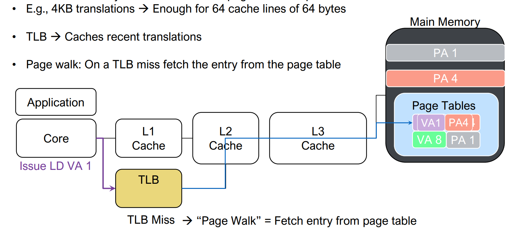
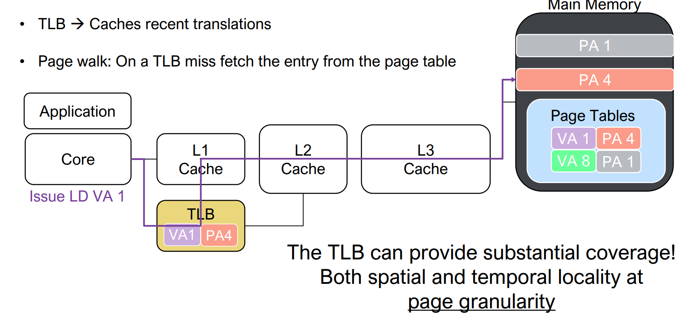

# CMU15-213学习笔记（五）virtual memory虚拟内存

## 分页存储管理

早期：程序员自己管理主存，通过分解程序并覆盖主存的方式执行程序。1961年，英国曼切斯特研究人员提出一种自动执行overlay的方式。 

动机：把程序员从大量繁琐的存储管理工作中解放出来，使得程序员编程时不用管主存容量的大小

基本思想：把地址空间和主存容量的概念区分开来。程序员在一个虚拟地址空间里编写程序，而程序则在真正的物理内存中运行。由一个专门的机制实现地址空间和实际主存之间的映射，就是早期的分页管理机制。

当时的一种典型计算机，其指令中给出的主存地址为16位， 而主存容量只有4K字，程序员编写程序的空间（地址空间，可寻址空间）比执行程序的空间（主存容量）大得多。


分页的基本思想：

- 内存被分成固定长且比较小的存储块（页框、实页、物理页）
- 每个进程也被划分成与**页框长度相同**的固定长的程序块（页、虚页、逻辑页）
- 程序块可装到存储器中可用的存储块中
- 无需用连续页框来存放一个进程 
- **操作系统为每个进程生成一个页表** ，通过**页表(page table)**实现逻辑地址向物理地址转换（Address Mapping ）

**页表是内存中的一个数据结构，由内核维护，是每个进程上下文的一部分，每个进程都有自己的页表。**

虚拟内存地址到物理地址之间的映射与主存到cache的映射原理相同（不完全相同，cache的映射方式是固定的，内存中的每一块只能映射到指定的行。如果所映射的行已满，那么即使cache中还有空间，也只能覆盖所映射的行），**块内的地址不需要改变，页表描述的是虚拟页到物理页框之间的映射关系，只需要改变高位地址**。


**不需要将一个进程全部都装入内存**，根据程序访问局部性可知：可把当前活跃的页面调入主存，其余留在磁盘上，采用 **“按需调页 Demand Paging”** 方式分配主存！这就是虚拟存储管理概念

通过 MMU(Memory management unit)把虚拟地址(Virtual Address, VA)转换为物理地址(Physical Address, PA)，再由此进行实际的数据传输


虚拟存储技术的实质：

- 程序员在比实际主存空间大得多的逻辑地址空间中编写程序 （程序中代码和数据的地址、引用的地址都是按照虚拟内存空间来安排的）
- CPU执行程序时，不会真正从磁盘调入信息到主存，**只是生成一个初始的页表**，将被执行程序的虚拟页和磁盘上的数据/代码建立对应关系。**CPU按照该进程的逻辑地址来执行代码**，通过该进程的页表，将逻辑地址转换成实际内存地址，把当前需要的程序段和相应的数据块调入主存，其他暂不用的部分存放在磁盘上
- 每个进程都有页表，反映了每一个虚页和物理内存之间的关系
- 指令执行时，通过硬件将逻辑地址（也称虚拟地址或虚地址）转化为物理地址（也称主存地址或实地址）


**实际上可执行文件加载时不会真正从磁盘调入信息到主存**， 只是生成一个初始的页表，将虚拟页和磁盘上的数据/代码建立对应关系，称为“映射”。而是采用按需调页的方法，  将当前活跃的虚拟页调入内存。


虚拟存储器管理属于主存-磁盘层次，与“Cache--主存”层次相比：

- 页大小（2KB~64KB），比Cache中的Block大得多。
- **cache-主存层次多采用组相联映射（内存中的每一块只能映射到指定的行。如果所映射的行已满，那么即使cache中还有空间，也只能覆盖所映射的行），而页表采用全相联映射（主存只要有空的位置就可以放page）** 

因为缺页的开销比Cache缺失开销大的多！缺页时需要访问磁盘（约 几百万个时钟周期），而cache缺失时，访问主存仅需几十到几百个 时钟周期！因此，页命中率比cache命中率更重要！“大页面”和 “全相联”可提高页命中率。

- 通过软件来处理“缺页”！缺页时需要访问磁盘（约几百万个时钟周期），慢！不能用硬件实现。
- 采用Write Back写策略！避免频繁的慢速磁盘访问操作。
  - Write-through: 命中后更新缓存，同时写入到内存中
  - Write-back: 直到这个缓存需要被置换出去，才写入到内存中
- 地址转换用硬件实现！加快指令执行


- 每个进程有一个页表，其中有装入位、修改（Dirt）位、替换控制位、访问权限位、禁止缓存位、实页号。
- **一个页表的项数（即有多少虚页）理论上取决于虚拟地址空间的大小**。例如：32位机器的虚拟地址空间为2^32，一页的大小为4KB，所以一共有2^20个虚页。而页表中每一个表项的大小为4B，所以页表的大小为4MB。页表存在虚拟内存空间的内核区中。
- 各进程有相同的虚拟空间，故理论上每个进程的页表大小相同。实际大小看具体实现方式，如“空洞”页面如何处理等


- 未分配页：进程的虚拟地址空间中“空洞”对应的页（如VP0、VP4），存放位置为null，装入为0
- 已分配的缓存页：有内容对应的已装入主存的页（如VP1、VP2、VP5等），装入位为1，存放位置为主存实页号
- 已分配的未缓存页：有内容对应但未装入主存的页（如VP3、VP6），装入位为0，存放位置为磁盘的实页号

作为内存管理工具，每个进程都有自己的虚拟地址空间，这样一来，对于进程来说，它们看到的就是简单的线性空间（但实际上在物理内存中可能是间隔、支离破碎的），每个虚拟页都可以被映射到任何的物理页上，**如果两个进程间有共享的数据，那么直接指向同一个物理页即可**（共享库的实现方式）。


#### 简化链接和加载

- 简化链接：
  - 如果没有虚拟地址空间，链接器不知道程序将来会被加载到内存中的什么地方，无法确定符号引用的地址，也就无法重定位。
  - 使用虚拟内存空间，每个程序都有相同的虚拟地址空间，所有的代码、数据、堆都起始于相同的地址，所以链接器生成可执行目标文件确定内存地址时，无需考虑当前物理内存的状态，**可以根据我们预定义的内存模型来分配虚拟内存地址**。CPU通过进程的页表来确定最终的物理地址。

- 简化加载：

  - Linux加载器只需要为可执行目标文件中的代码段和数据段分配虚拟页，**然后在页表中将这些虚拟页设置为无效的（表示还未缓存），不需要将代码和数据复制到内存中**，实际的加载工作会由操作系统自动地按需执行。

    当访问某一虚拟地址时，发现其对应的PTE是无效的（该页还没有加载到内存中），则会发起缺页异常，**通过缺页异常处理程序自动地将虚拟页加载到物理页中**。这就是**按需调用**，**所有的缓存机制都是这样的，一开始缓存为空**，直到访问miss，才从上一级调用对应的块加载到缓存，只有我们访问的数据才会被加载。

- **简化内存分配：**进行内存分配时，可以通过`malloc`函数在物理内存中的任意位置进行创建，因为页表只需要让虚拟页指向该物理页，就能提供连续的虚拟地址抽象，让进程误以为是在连续的地址空间中进行操作的，由此简化了内存分配需要的工作。

### 内存保护

**Access Rights (存取权限)**可能的取值有 R = Read-only, R/W = read/write, X = execute only，限制了对虚拟内存空间的访问权限


这里在每个PTE中引入四个字段：

- `SUP`：确定该虚拟内存空间的访问权限，确定是否需要内核模式才能访问
- `READ`：确定该虚拟内存空间的读权限
- `WRITE`：确定该虚拟内存空间的写权限
- `EXEC`：确定该虚拟内存空间的执行权限

MMU每次访问时都会检查这些位，如果有一条指令违背了这些许可条件，就会触发一个保护故障，Linux shell一般会将这种异常报告为**段错误（Segment Fault）**。

例如：

```c
int sum(int a[ ], unsigned len){
	int i，sum = 0;
	for (i = 0; i <= len–1; i++)
		sum += a[i];
	return sum;
}
```

当len=0时，此循环永远不会结束，程序不断地从内存中获取a[i]，a[i]是一个虚拟地址，在虚拟地址转换成物理地址时，在虚拟内存空间中发生了访问违例。这种情况有可能是访问到了空洞的虚拟空间，也有可能访问到了内核。


在此例中，应该是访问到了虚拟内存空间中的内核区。因为a[i]是局部变量，分配在运行时栈中，而栈的上方就是内核区，数组不停地增长，一直访问到了内核区。


### 地址转换过程


每个页表都有一个基地址寄存器CR3，描述页表的起始地址。基地址+页表的索引*页表表项的大小=该页表表项的首地址，在此处取V 

- 如果V=1，那么该页在主存，把PF（page frame number）实页号取出，和页内偏移量拼起来，得到该页的物理地址。
- 当V=0时，发生缺页，即我要找的page还没有装入主存。页表条目包含指向该页面在磁盘上的位置的指针，将其视为逻辑块号，可在磁盘上找到该页面，从磁盘读到内存，若内存没有空间，则还要从内存选择一页替换到磁盘上，替换算法类似于Cache，采用回写法，淘汰时，根据“dirty” 位确定是否要写磁盘。如果主存中被淘汰的页被修改过，还需要将修改的结果写回磁盘。
- 如果V=1，但是对该页所进行的操作不符合存取权限（Access Right）。比如：这个页的访问权限是只读，但是我要进行写操作，此时就会发生**保护违例，访问越权**（ protection_violation_fault ）。


**虚拟页与主存页框之间采用全相联方式进行映射，高位地址是索引；全相联 Cache高位地址是Tag**。实际上Tag和索引是相同的：

- Tag是内存地址的高位（内存地址去掉缓存块的大小）
- 索引是逻辑地址的高位（逻辑地址去掉页的大小）

而二者的区别在于使用的方式：

- Tag：内存地址的高位（即Tag）与cache中每一块的Tag对比，如果有相同的Tag就是命中，如果没有相同的Tag就从内存中调出该块
- 索引：通过逻辑地址的高位（即索引）在页表中找到对应的表项，如果V=1就是命中，找到该逻辑地址在内存中的实页。如果V=0就是没命中，发生缺页，从磁盘中调出对应的页到内存中。

造成这个差异的原因是：主存-cache的映射时，Tag在cache中，所以需要一个个比较。而逻辑地址-主存地址的映射时，有一个中间的页表，**虚拟内存空间中的每一页都有一个页表项**，从上到下顺序排列，描述了**该进程的虚拟地址空间中所有的虚页**到内存中的实页的映射，所以可以使用索引的方式。

MMU负责地址翻译和访问权限检查，加上MMU的完整过程：

- CPU生成一个虚拟地址，将它发送给**MMU**
- MMU根据**虚拟地址**（VA）获得**虚拟页号**（VPN），然后通过**页表基址寄存器**（PTBR）确定相应的**页表表项**（PTE）所在的**物理内存地址**（PTEA）（因为页表保存在物理内存中），然后将**物理内存地址**发送给**物理内存**
- **物理内存**根据**页表表项**的**内存地址**将对应的**页表表项**（PTE）发送给MMU，其中页表表项只包含**物理页号**（PPN）（因为数据在页内偏移量相同）
- MMU将**物理页号**和**页内偏移量**拼接起来，就可以得到**虚拟地址**对应的**物理地址**（PA）。然后MMU再将物理地址发送给物理内存
- 物理内存根据物理地址将数据发送给处理器


### 快表TLB

可以发现，每次CPU将一个虚拟地址发送给`MMU`时，`MMU`都会将需要的`PTE`物理地址发送给高速缓存/内存来获得`PTE`，所以我们在`MMU`中引入了一个保存最近使用的`PTE`（页表项）缓存，称为**翻译后备缓冲器（Translationi Lookaside Buffer，TLB）**，缓存中放页表的一部分，即**当前正在访问的那几个页的页表表项**。如果没有TLB，执行一条指令要访问多次主存中的页表进行地址转换（取指令、取操作数）

TLB通常是多路组相联，TLB与页表的关系相当于cache与内存的关系，TLB是页表的子集，每个表项上有Tag（就是虚页的索引，也就是虚拟地址去掉页内的偏移地址，和组号（如果有的话）剩下的高位）。

- TLB全相联时，没有index，只有Tag，虚页号需与每个Tag比较；
- TLB组相联时，则**虚页号高位为Tag，低位为index，用作组索引**。


使用TLB将虚拟地址转换成物理主存地址：TLB对VPN进行分解，得到index（TLBI）和Tag（TLBT），根据组索引index确定所在的高速缓存组，然后在高速缓存组中依次比较各个块的标记是否和Tag相同： 

- 如果有相同的Tag，并且V=1，那么TLB返回对应的表项，MMU取出物理页号，与页内地址拼接，就可生成物理地址。
- 如果没有相同的Tag或者V=0，就要访问主存的慢表。**此时VPN（Tag+index）变成了访问慢表的索引**，MMU根据VPN和PTBR（页表基址寄存器）得到PTE对应的表项的地址PTEA，将其发送给缓存/内存
  - 如果V=1且Access Right允许，内存/缓存将对应的PTE发送给MMU和TLB
    - TLB会根据VPN将PTE保存在合适的位置
    - MMU取出物理页号，与页内地址拼接，就可生成物理地址
  - 如果V=0，则说明对应的页还没有调入主存，**用户程序无法访问磁盘，此时需要靠操作系统从磁盘中调入**


Tag相当于是HashCode，而索引相当于是数组索引。

如下图，处理器拿着虚拟地址去TLB找pte，如果tlb中没找到，那么就用这个pte的物理地址去l2 l3 cache和主存中查找；如果是在主存中找到了pte，还要将它保存到tlb中，沿途中还要保存到l2 l3中。然后根据pte中对应的物理页号拼接得到物理地址，去l1 l2 l3和主存中查找真正的数据





### 多级页表

在一个32位地址空间中，每个页面大小为4KB，则一共需要 ![[公式]](https://www.zhihu.com/equation?tex=2%5E%7B32%7D%2F2%5E%7B2%2B10%7D%3D2%5E%7B20%7D%3D1M) 个页面，假设每个PTE大小为4字节，则页表总共为4MB。当使用一级页表时，需要始终在内存中保存着4MB大小的页表，我们这里可以使用多级页表来压缩内存中保存的页表内容。

如果使用一级页表，每个进程的虚拟地址空间中的每个虚拟页都需要一个页表条目，不管是否使用过这个页面。然而一个进程的虚存中的绝大多数页面都不会被使用。


首先，我们这里有1M个虚拟页，将连续的1024个虚拟页当成一个**片（chunk）**，一级页表就负责指向每个片对应的二级页表，则一级页表需要 ![[公式]](https://www.zhihu.com/equation?tex=2^{20}页%2F2^{10}片%3D1K) 个PTE，每个PTE4字节，则一共需要4KB大小的一级页表。**注意：**这里只有当片中至少一个页被分配了才会指向对应的二级页表，否则为NULL。而二级页表就类似于我们之前的页表结构，这里只需要负责一个片的虚拟页，则每个二级页表为4KB。

当一级页表的某个PTE为NULL时，表示该片不存在被分配的虚拟页，所以就可以去掉对应的二级页表。并且在内存中只保存一级页表和较常使用的二级页表，极大减小了内存的压力，而其他的二级页表按需创建调入调出。


### 存储器访问过程

**CPU拿到的是虚拟地址**，根据虚页号（虚拟地址去掉页的大小后剩下的高位）到TLB中与每一个表项的Tag相匹配

- 如果匹配成功并且V=1，那么命中，即可获得虚拟地址对应的物理内存地址。**拿着这个内存地址到cache中寻找**，如果找到就将内容送回CPU。这是最好的情况，无需访问主存
- 如果没有相同的Tag，就要访问主存中的页表。使用索引在慢表中找到对应虚页的表项：
  - 如果V=1，说明该虚页的代码和数据已经被加载到了内存中，这段虚拟内存空间与物理内存空间已经建立了映射。直接**将页表中的这个表项调入TLB**中，并且将虚拟地址转换成物理地址送给CPU。CPU再拿着这个内存地址到cache中寻找。
  - 如果V=0，说明该虚页还没有被加载到内存中，**操作系统到磁盘中读出一页到内存中**，建立虚页到内存的映射关系，**修改慢表**，**将这个表项调入TLB中**。

慢表到TLB的映射是组相联映射（地址分为三部分：低位是页内地址，中间是组号，高位是Tag）。页表的映射方式是直接相联映射（地址分为两部分：低位是页内地址，高位是索引（组号和Tag合在一起））。


### 存储保护

为避免多道程序相互干扰，防止某程序出错而破坏其他程序的正确性或不合法地访问其他程序或数据区，应对每个程序进行存储保护

以下情况会发生存储保护错误：

- 地址越界（转换得到的物理地址不属于可访问范围） 
- 访问越权（访问操作与所拥有的访问权限不符） 。页表中设定访问（存取）权限

最基本的保护措施：规定各道程序（**用户进程**）只能访问属于自己所在的存储区和共享区 

- 对于属自己存储区的信息：可读可写，只读/只可执行 
- 对共享区或已获授权的其他用户信息：可读不可写 
- 对未获授权的信息（如OS内核、页表等）：不可访问

## Intel Core i7

现在的Core i7支持48位虚拟地址空间和52位物理地址空间，还兼容32位虚拟和物理地址空间。


如上图所示是一个**处理器封装（Processor Package）**，其中有一组基于QuickPath技术的点对点链路，为了让一个核与其他核和外部I/O桥直接通信。

- **高速缓存：**具有3层高速缓存层次结构，其中L3是所有核共享的高速缓存，其中数据块大小为64字节，所以高速缓存具有以下性质。其中，数据块为64字节，则需要6位的块偏移，L1 d-cache有64组，则需要6位的组索引，其余的为标志位。

  

- **页表：**这里采用4级页表结构，页大小为4KB，说明需要12位的VPO，而虚拟地址为48位，所以VPN为36位，则每一级的VPN为9位。每个进程有自己私有的页表层次结构，并且存在CR3控制寄存器指向第一级页表的起始位置，其中CR3是每个进程上下文的一部分，每次进行上下文切换时，都会被恢复。页表的PTE格式如下所示


其中每个PTE为8字节，而每一级的VPN为9位，则每个PTE引用了一个 ![[公式]](https://www.zhihu.com/equation?tex=2^9*2^3%3D4KB) 的子页表，这里就要求物理页4KB对齐。由于物理地址为52位，PPO为12位，则PPN为40位，所以这里的页表物理基地址为40位。这里增加了3个权限位来控制对页的访问：`R/W`、`U/S`和`XD`，其中`XD`是64位系统引入的，限制了只能在只读代码段执行，降低了缓冲区溢出攻击的风险。此外，当MMU访问一个页时，会设置**引用位（Reference Bit）**A位，让内核实现页替换算法，当MMU修改一个页时，会设置**脏位（Dirty Bit）**D位，使得内核对牺牲页进行写回。以下是Core i7的页表翻译


- **TLB：**这里TLB也采用层次结构，并且为数据和指令分别使用两个一级TLB。其中，L1 d-TLB有4路64个PTE，则一共有16个组，需要4位TLBI；L1 i-TLB有4路128个PTE，一共有32组，需要5位TLBI；L2 TLB有4路512个PTE，一共有128个组，需要7位TLBI。

- - 这里之所以使用L2 TLB而不是扩大L1 TLB，是因为如果舍弃L2 TLB而增大L1 TLB，仍然可能出现工作集大于缓存的情况，就会出现容量不命中，通过增加L2 TLB来减少不命中惩罚。

下面是Core i7地址翻译的整体架构（省略了i-cache、i-TLB和L2统一TLB）


这里可以发现一个**特点：**高速缓存的CI+CO=12位，而VPO也是12位。这不是巧合，而是故意这样设计来加速地址翻译。我们知道，VPO=PPO，而PPN需要通过地址翻译获得，则一开始输入虚拟地址时，就能一下等到PPO，然后等待检索PPN。此时我们就能直接将PPO输入到高速缓存中，因为PPO确定了对应的高速缓存组和块偏移量，就能先通过PPO获得对应的高速缓存组，然后只要等检索到PPN时，就能直接和高速缓存组中每一行的标志位进行比较，极大加速了地址翻译过程。


## Linux虚拟内存系统


> 有一系列保存在磁盘中的数据，首先以页为单位将其划分成很多数据块（虚拟页），然后根据每个数据块的特点（比如读写权限）进行组合，得到若干个由若干个数据块组成的段，通过**任务结构**对这些段进行描述，包括：段的起始虚拟地址、段的终止虚拟地址、段的读写权限等等，由此就确定了段中每个数据块所能用的虚拟地址范围以及读写权写。接下来根据这个约束，对每个数据块分配一个虚拟地址，然后分配一个指向数据块磁盘位置的指针，确定该数据块的读写权限，然后将所有数据块的信息组合起来，就得到了页表。
>
> 页表是描述每个数据块的，任务结构是描述由数据块组成的段，确定了页表的信息。

Linux将进程对应的虚拟地址空间组织成若干**“区域(area)”（也称为段）**的集合，一个段是在虚拟地址空间中的一个有内容的**连续区块**（**比如只读代码段、可读写数据段、运行时堆、用户栈、共享库等区域**）。每个区域可被划分成若干个大小相等的**已分配**的**连续**虚拟页面，每个存在的虚拟页面一定属于某个区域，不属于某一个区域的虚拟页是不存在的，并且不能被进程引用。

OS要对进程进行管理，为进程分配主存空间（从磁盘调取虚页到内存由OS完成），**OS必须要知道进程的地址空间中每个区域的分布**。

Linux内核为每个进程维护了一个**任务结构**（或称为进程描述符），数据类型为task_struct 结构。


**task_struct 中记录了内核运行该进程所需要的所有信息**，例如，进程的PID、指向用户栈的指针、可执行目标文件的文件名等。其中有一条指向描述虚拟内存当前状态的结构`mm_struct`，其中包含的`pgd`就是指向一级页表的起始地址，当进程被调度时，就会将`pdg`条目拷贝到CR3中，通过这种形式来改变虚拟地址空间；`mmap`指向一个链表结构的头结点，其中每个节点`vm_area_struct`就描述了虚拟内存中的一个段，其中包含：

- `vm_end`段结束的虚拟地址；
- `vm_start`段开始的虚拟地址；
- `vm_prot`段中所有页的读写权限；
- `vm_flags`描述当前段中的虚拟页是否与其他进程共享，如果是共享的，则称为**共享段**，否则称为**私有段**；
- `vm_next`下一个段的节点。

**Linux 采用链表方式管理用户空间中的区域，使得内核不用记录那些不存在的“空洞”页面**，可以允许虚拟地址存在空隙。

由此，就能通过将输入虚拟地址与各个节点的起始地址和终止地址进行比较，判断虚拟地址所在的段。


### 缺页异常处理

当CPU中的MMU在对某地址VA进行地址转换时，若检测到页故障（**页表中访问到V=0的表项**），则转由**操作系统内核**进行页故障处理。

- **判断虚拟地址VA是否合法**
  - Linux 内核可根据上述对虛拟地址空间中各区域的描述，将VA与vm_area_struct 链表中每个vm_ start 和vm_ end 进行比较，以判断VA是否属于“空洞”页面。如果VA不存在任何一个段中，则发生“段故障(segmentationfault)"，终止进程

- **判断对虚拟地址VA的访问是否合法：**
  - 当虚拟地址VA处在某个段中时，再判断所进行的操作是否和所在区域的访问权限(由`vm_prot` 描述)相符。若不相符，例如，假定VA属于代码区，访问权限为PROT_EXE ( 可执行)，但对地址VA的操作是“写”，那么就发生了**“访问越权”**; 假定在用户态下访问属于内核的区域，访问权限为PROT_NONE (不可访问)，那么就发生了**“访问越级”**。

段故障、访问越权和访问越级都会导致终止当前进程。

- 若不是上述几种情况，则内核判断发生了正常的缺页异常，此时，只需在主存中找到一个空闲的页框，从硬盘中将缺失的页面装人主存页框中。若主存中没有空闲页框，则根据页面替换算法，选择某个页框中的页面交换出去，然后从硬盘上装入缺失的页面到该页框中。

**从页故障处理程序返回后，将回到发生缺页的指令重新执行**。

task_struct是比页表更大的结构，该task_struct是以段为单位来组织虚拟地址，其中包含了许多虚拟页，而页表是以虚拟页为单位来组织虚拟地址，所以**需要先从task_struct开始**。

### 内存映射

将进程**虚拟地址空间中的一个区域与硬盘上的一个对象建立关联**（生成页表项），并初始化一个`vm_area_struct`结构信息，**来初始化虚拟内存段的内容**，这个过程称为内存映射。因为按需进行页面调度，所以这些虚拟页面并没有实际交换进入物理内存，所以当我们第一次引用某个段时，它的初始值来自于磁盘上的普通文件，然后通过按需页面调度，将需要的虚拟内存段加载到物理内存中。

内存映射可以用两种磁盘上的对象来初始化虚拟内存段：


匿名文件实际上在磁盘中并不存在，无需从磁盘读入，主要用于创建类似于.bss、堆和用户栈这些全为0的页。在虚拟内存空间中初始化为0，所以称为请求0的页。

这些与虚拟内存段关联的磁盘内容处于**交换空间（Swap Space）**中（即虚拟内存在磁盘空间上的内容就是在交换空间中，也就是说交换空间保存了映射到虚拟内存中的磁盘数据，则**交换空间是所有进程的虚拟内存可用的总空间**），则交换空间限制了当前运行着的进程能够分配的虚拟页总数

### 共享对象

虚拟内存段中通过`vm_flags`确定该虚拟内存段中的虚拟页是否在进程之间共享，如果共享，则称该段为**共享段**，则各个进程在该段中的操作是互相可见的，且变化也会反映在磁盘上；如果不共享，则称该段为**私有段**，则各个进程在该段中的操作是互相不可见的，也不会反映到磁盘上。

**在`vm_area_struct`中创建一个共享段，然后将其与共享库的内容关联起来，这样就能在多个进程中共享相同的共享库**

在进程1中，当我们将磁盘上的一个对象通过内存映射与该进程的一个共享段关联起来时，就会使得虚拟页对应的PTE指向该对象，当引用该对象时，就会将对应的虚拟页（指向的磁盘中的对象）加载到物理页中；而进程2也要将该对象与自己的一个共享段关联起来时，当对其引用时，**由于每个对象都有一个唯一的文件名，所以内核可以发现进程1将该对象加载的物理页，就直接在进程2中将对应的PTE指向相同的物理页就行了**。


### 私有对象

在进程1中，当我们将磁盘上的一个对象通过内存映射与该进程的一个私有段关联起来时，就会使得虚拟页对应的PTE指向该对象，当引用该对象时，就会将对应的虚拟页（指向的磁盘中的对象）加载到物理页中；当进程2也要将该对象与自己的一个私有段关联起来时，当对其引用时，也会直接在进程2中将对应的PTE指向相同的物理页，**即当未对私有对象进行修改时，物理内存中只会保存同一个对象副本，且各个进程中对该对象的PTE都是只读的**，而虚拟内存**段**被标记为**私有写时复制的（Private Copy-On-Write）**。


但是假设进程2**对该私有对象进行修改时，由于PTE是只读，所以会触发保护故障，触发一个异常**，内核到`vm_area_struct`中查找访问地址所在的段的`vm_flags`，发现是私有写时复制，处理程序就会在物理内存中创建一个该物理页的副本，然后让进程2对该对象的PTE指向新的副本，并**设置该虚拟页具有写权限**，然后处理程序返回，从写指令重新运行。


图中大块的表示对象，可能由很多个页组成，当我们尝试对其中一个页进行修改时，**只会对该页进行复制，并修改该页对应的PTE，而该对象的其他页保持不变**。

**问题：**我们可以看到，**vm_area_struct描述了整个段的读写权限，而在页表中又描述了某一个虚页的读写权限**。当虚拟页的读写权限修改后，与所在段的读写权限冲突时，是否要修改虚拟页所在的段？即上图进程2深色和浅色的页是处在不用段中？还是说段的读写权限是用来初始化其中包含的虚拟页的读写权限，但是虚拟页的读写权限可以自己修改？

通过写时复制这种策略，尽可能延迟物理内存中的拷贝，能最大效率地使用物理内存。当只对虚拟空间进行读操作，则永远不会复制，而是共享相同的物理内存。

## 可执行文件的加载


通过调用**execve系统**调用函数来调用加载器，**加载器（loader）**根据可执行文件的**程序（段）头表**中的信息，将可执行文件的代码和数据从磁盘“拷贝”到存储器中（实际上不会真正拷贝，仅建立一种映射）。加载后，将PC（RIP）设定指向 **Entry point (即符号_start处，此处是第一条执行的指令)**，最终执行main函数，以启动程序执行。


###  fork函数

在父进程中调用`fork`函数时，会创建一个具有相似但独立虚拟地址空间的子进程，并分配一个唯一的PID，而写时复制技术会给`fork`函数提供一个高效的解决方案：

- 为了具有和父进程相同的**虚拟内存状态**，内核会复制父进程的`mm_struct`
- 为了具有和父进程相同的**虚拟内存段分配**，内核会复制父进程的`vm_area_struct`
- 为了子进程和父进程具有相同的**虚拟内存内容**，内核会复制父进程的页表，CPU访问虚拟地址时就能访问与父进程完全相同的磁盘内容或物理内存内容。
- 为了子进程和父进程的虚拟地址空间能**相互独立**，两个进程的PTE都设置为只读的，且`vm_area_struct`中的段都标记为私有的写时复制。**当父子进程都没有对页进行修改时，父子进程是共享相同的物理内存的**，当其中一个进程对页进行修改时，就会对该页进行写时复制，并为该页赋予写权限，并更新进程对应的页表。

为了子进程和父进程具有相同的**虚拟内存内容**，内核会复制父进程的页表，就能将相同的磁盘内容映射到相同的虚拟页中，并将虚拟页缓存在相同的物理页中。

为了子进程和父进程具有相同的**虚拟内存内容**，内核会复制父进程的页表，就能将相同的磁盘内容映射到相同的虚拟页中，并将虚拟页缓存在相同的物理页中。

为了子进程和父进程具有相同的**虚拟内存内容**，内核会复制父进程的页表，就能将相同的磁盘内容映射到相同的虚拟页中，并将虚拟页缓存在相同的物理页中。

为了子进程和父进程具有相同的**虚拟内存内容**，内核会复制父进程的页表，就能将相同的磁盘内容映射到相同的虚拟页中，并将虚拟页缓存在相同的物理页中。

为了子进程和父进程具有相同的**虚拟内存内容**，内核会复制父进程的页表，就能将相同的磁盘内容映射到相同的虚拟页中，并将虚拟页缓存在相同的物理页中。

为了子进程和父进程具有相同的**虚拟内存内容**，内核会复制父进程的页表，就能将相同的磁盘内容映射到相同的虚拟页中，并将虚拟页缓存在相同的物理页中。

为了子进程和父进程具有相同的**虚拟内存内容**，内核会复制父进程的页表，就能将相同的磁盘内容映射到相同的虚拟页中，并将虚拟页缓存在相同的物理页中。

### execve函数

当我们运行`execve("a.out", NULL, NULL)`执行可执行目标文件`a.out`时

- **删除已存在的区域结构（vm_area_struct）：**将当前进程的虚拟地址空间中的用户部分中已存在的区域结构删除，即删除`vm_area_struct`和页表。

- 重新建立内存映射：内存映射是磁盘空间到虚拟内存空间的映射**，将进程**虚拟地址空间中的一个区域与硬盘上的一个对象建立关联（生成页表项），并初始化一个`vm_area_struct`结构信息。

  - **映射私有段：**首先为可执行目标文件中的不同数据节创建对应的段，即在`vm_area_struct`中新建节点，并设置对应的段起始虚拟地址、段终止虚拟地址，设置这些段为私有写时复制的。然后将这些段通过内存映射与`a.out`中的内容关联起来。
  - - 对于需要初始化为0的段，可将其与匿名文件进行关联。
  - **映射共享段：**对于共享库的内容，会将其映射到共享库的内存映射段中，即在`vm_area_struct`中创建一个共享段，然后将其与共享库的内容关联起来，这样就能在多个进程中共享相同的共享库。
  - - 如果共享库有维护状态的静态变量，比如随机生成器在调用时会维持状态，且不同的进程的状态不同，对于这种要修改静态数据的函数，应该将该段标记为私有写时复制的，这样就能在不同进程中维护自己独立的状态。

  

- 设置程序计数器，使其指向代码段的入口点。

通过将对象映射到不同的段中，就能决定对该对象进行读写时的特点。

**注意：当程序运行时，我们并没有加载任何内容到内存中，所做的只是设置内存映射，在内核中创建数据结构，由此创建了虚拟地址空间和这些对象之间的映射关系，而实际的拷贝工作会由缺页异常按需完成**。

### mmap函数

可以用`mmap()`函数实现内存映射，每个`vm_area_struct`实际上是由`mmap()`函数生成的，实际上是一个系统调用。

```c
void *mmap(void *start, size_t length, int prot, int flags, int fd, off_t offset); 
```

 **读取可执行文件中的程序头表而获得mmap的实参**。

文件描述符`fd`指定一个磁盘文件，该函数会将磁盘文件中偏移`offset`处的`length`个字节的对象映射到虚拟内存中的`start`处。`start`指定的段如果是有效的，则内核会将其映射到指定段，如果指定段的部分虚拟地址空间被某个已存在的段包含了，则内核会另外找一个有效的位置，`start`可以设置为NULL，让内核自动分配。会得到`vm_area_struct` 结构的信息，并**初始化**相应页表项，建立文件地址和虚存区域之间的映射关系（**注意！此时是初始化！V=0，此时只是刚刚建立映射，对应的虚页还在磁盘中，还没有调入内存。**）

其中，`prot`对应于段结构中的`vm_prot`参数，用来确定该虚拟内存段的读写权限：`PROT_EXEC`表示该段中的页是可执行的；`PROT_READ`表示该段中的页是可读的；`PROT_WRITE`表示该段中的页是可写的；`PROT_NONE`表示该段内的页是不可访问的。

`flags`对应于段结构中的`vm_flags`：`MAP_PRIVATE`表示该段是私有的写时复制的；`MAP_SHARED`表示该段是共享的。也可以设置`MAP_ANON`，表示是一个匿名对象。

当函数执行成功时，会返回指向该段的指针，如果失败，则返回`MAP_FAILED`。


可以通过以下函数来删除虚拟内存中的段：

```c
#include <unistd.h>
#include <sys/mman.h>
int munmap(void *start, size_t length); 
```

- 使得磁盘文件中的一块数据能与虚拟内存地址空间中的某个段建立映射关系，此时我们就能直接通过对该虚拟内存段的访问来间接访问磁盘文件内容，不必执行文件I/O操作，也无需对文件内容进行缓存处理。并且虚拟内存进行按序页面调度的，当你访问了文件内容，它就会将对应的虚拟页加载到物理页中，此时就能从内存中很快地访问文件内容。当你处理大文件或频繁读写文件时能提速，因为此时就直接将文件内容加载到物理内存中了，一切读写操作都是在物理内存中进行的，速度特别快，只有在内核将其牺牲时，才会进行写回。
- 通过内存映射方法，我们还能定义一个进程共享的虚拟内存段，使得能让多个进程对一个区域进行访问和修改。

**内存映射是磁盘空间到虚拟内存空间的映射**，将进程**虚拟地址空间中的一个区域与硬盘上的一个对象建立关联**（生成页表项），并初始化一个`vm_area_struct`结构信息

**内存映射是磁盘空间到虚拟内存空间的映射**，将进程**虚拟地址空间中的一个区域与硬盘上的一个对象建立关联**（生成页表项），并初始化一个`vm_area_struct`结构信息

**内存映射是磁盘空间到虚拟内存空间的映射**，将进程**虚拟地址空间中的一个区域与硬盘上的一个对象建立关联**（生成页表项），并初始化一个`vm_area_struct`结构信息

