# Lecture1

并行计算最开始的应用是科学计算，然后是数据库领域。由于数据库比科学计算有更大的市场，所以并行计算开始被人们所关注

从这时开始，处理器以指数级开始变得越来越快（在计算机中还有很多其他的指数曲线，比如内存和磁盘的容量）。处理器变快的原因：

1. 更宽的数据位宽
   - 4bits ->8->16->32->64
2. 更加高效的流水线技术
   - 3.5 cycles per instruction(CPI)>1.1CPI
3. 指令级并行(Instruction-level parallelism, ILP)，如超标量（superscalar），可以同时执行多条指令
6. 实际上帮助最大的是时钟频率的指数增长


增加时钟频率是最简单粗暴的一种提升性能的方法，但是随着时钟频率的增加，人们发现芯片单位面积消耗的能量指数级增加，导致芯片越来越热

所以既然不能让时钟频率越来越高，那么提升处理器性能的主要方式就是在一个芯片上放多个核

从2003年之后指令并行、时钟周期和功耗都停止增长了，只有晶体管密度还在持续以指数级增长，所以提升处理器性能的方式只有在一个芯片上放更多的核


那么从程序员的视角来看，如果我们想让程序运行得更快，在2004年之前，只需要等待单核处理器的性能提升即可，等6个月，然后买一台新的机器。在2004年之后，单核的性能无法提升，我们只有写出并行的程序才能让程序运行得更快。

衡量程序的加速：加速比，即在一个CPU上运行的速度除以在多个CPU上运行的速度


每个CPU拥有一部分数据，然后将所有CPU计算的结果合起来。优化这个并行程序速度的方式：

1. 加速CPU之间的通信，尽管CPU们在一个chip上，它们之间的通信依然需要时间
2. 负载均衡。如果给CPU们分配任务不均衡，会导致速度被任务最多的CPU拖累

# Lecture1.5

对于单核CPU来说, 它是指令级并行, 这种并行是隐式(程序员不可见的)的，并且细粒度(指令级别) 。通过硬件的动态调度发现指令中可并行的部分, 这种并行的实现非常复杂且昂贵, 但对于程序员来说更加方便; 

对于GPU来说, 他是线程级或数据级并行, 这种并行是显式的(程序员可以操作), 并且粗粒度(相较于指令而言, 线程更大)，它是通过软件来显示地指定并行(即由程序员或者编译器发现任务中可并行的部分，并且编写或生成可以并行的代码), GPU本身不需要复杂的策略去挖掘代码中并行的可能性, 因此它的硬件非常简单, 但对于程序员或者编译器来说就比较辛苦

这种区别也体现在CPU和GPU的架构上，CPU的计算单元只有一点点, 大部分都是用于调度的硬件. 而GPU的大部分都是计算单元, 只有少部分是调度用的硬件.

本节的主题是介绍CPU的硬件架构是如何实现指令级并行的

在流水线中有三种相关，数据相关、结构相关和控制相关。结构冒险是指多条指令同时访问一个硬件资源，永远可以通过增加硬件资源解决。所以接下来主要讨论数据和控制

有3种数据相关:

1. read after write(RAW)
2. write after write(WAW)
3. write after read(WAR)

**在顺序执行的流水线中, WAW和WAR是不会产生数据冒险, 只有RAW会产生数据冒险**, 因此本小节只需要介绍RAW的处理情况(在**乱序执行的流水线中, WAW和WAR也会造成数据冒险**, 现代处理器采用了寄存器重命名来消除这两种相关。这里的乱序是指指令的执行顺序和指令在代码中的顺序不一致）

针对顺序流水线的RAW数据冒险，解决方式是：

1. 在相应阶段插入气泡，以暂停指令2和后续指令的执行，直到指令1执行完写回

   

2. 使用数据转发：在指令1执行阶段计算出结果之后，不需要经过写回阶段写回寄存器，再由指令2去寄存器中取操作数；而是**由指令2在译码阶段直接从流水线中取指令1执行完的结果作为操作数**

   

    数据转发并不能完全消除因数据相关导致的流水线暂停,实际中bubble和数据转发会结合起来使用.

控制冒险：

- branch指令进入stage2，我们期望的是读入pc跳转后的指令，但是此时branch还没执行完，pc只会继续加4，就会直接读入branch的下一条指令。所以当branch的stage2执行结束后，stage2的instruction寄存器的内容是branch的下一条指令。

  解决方式是：

  1. 流水线刷新：发生了跳转，就将读入的指令flush掉，也就是将供后面的stage使用的instruction 锁存器的内容替换为no-op指令，这条指令的剩余阶段就不会被执行。否则就会执行错误的指令。
  2. 分支预测：处理器在遇到分支时也不会等待, 它会猜测分支会跳转到哪, 然后预读取那里的指令并执行。现代处理器使用了非常复杂的机制预测分支跳转的结果, 预测准确率高达95%, 然而预测错误时的penalty仍然是一个严重的问题.

所以流水线的局限性：

1. 数据冒险导致的数据转发在非常深的流水线中实现起来非常昂贵.
2. 控制冒险导致的流水线刷新在非常深的流水线中penalty非常昂贵.

流水线在15级的时候性能差不多到顶了.

处理器在顺序执行的流水线中非常依赖于代码是否"good", 因此编译器需要对特定的CPU生成特定优化的代码, 或者从汇编级别对代码进行优化.

但是现在的顺序执行的处理器是非常少, 只有一些嵌入式或者极度低功耗的处理器. 几乎所有的现代处理器都是乱序的(即使在低功耗领域, 如移动手机). 

在本节的介绍中, 默认已经消除了伪数据相关的影响.


根据lecture 1的这张图可以发现，指令级并行性能在2000年就到顶了. 原因有以下几个:

1. 超标量调度指令策略太复杂,且难以扩展

2. 程序本身的并行限制，即使有完美的调度策略, 并且有 > 8-wide superscalar超标量, 也很难提升ILP了, 因为程序的并行潜力到头了.

3. 流水线已经很深了

4. 1. 分支预测失败时的代价变高
   2. 功耗限制了处理器频率(GHZ)

5. 指令级并行需要硬件进行指令动态调度, 再提升并行性的话动态调度开销又会增加好多, 反而抹平了ILP的收益

**因此时钟频率到头了，再加上指令级并行也到头了，那么单核的性能无法继续提升，但是晶体管密度还在不断提升，所以开始研究多核处理器. 从硬件角度看, 多核是更加高效的，当多核真的开始应用的时候, CPU的微架构反而可以简化了(牺牲单核的能力, 可以节约芯片面积给多核)**， 但是编写多核并行程序很难, 因此对程序员的能力提出了要求。

那么从程序员的视角来看，如果我们想让程序运行得更快，在2004年之前，只需要等待单核处理器的性能提升即可，等6个月，然后买一台新的机器。在2004年之后，单核的性能无法提升，我们只有写出并行的程序才能让程序运行得更快。

# Lecture2 Modern multicore processors

## 1.1 pre multi-core era

在多核时代前，CPU执行技术经过了以下几个阶段的发展

**386时代**：指令是顺序执行的（假设一指令占一个时钟周期）


**在486后**，引入了Pipeline(**流水线**)技术，该技术将指令分为多个阶段，每个时钟周期允许多个指令执行不同的阶段，如下图中将指令的执行分为fetch，decode，execute和write四个阶段。


此时的指令还是**顺序执行**(in order execution)的，但图中可以看到有很多`wait`的阶段，导致这种现象的原因之一是指令间存在数据依赖，例如instr2需要instr1的结果，因此在instr1执行完成前，instr2还是要等待;

**在奔腾II后**，为了缓解该现象，Intel在CPU中引入了**乱序执行**（out-of-order execution，OOOE）,乱序执行是指指令的执行顺序和指令在内存中的数据不一致（注意，**指令的发射顺序还是与内存中的代码一样的，只不过没有数据依赖的指令可以提前执行，从而执行顺序发生了乱序**）。可以看到instr3会在instr2执行之前执行。

在乱序执行中, 真正会影响指令并行的是RAW, 我们称它为真数据相关(true dependences). 而后两者WAW, WAR可以通过寄存器重命名消除数据的相关性, 因此被称为伪数据相关(false dependence)。

- 具体来说，如果**前面的某一条指令对某个寄存器的读取或写入与后面的指令对该寄存器的写入发生了数据竞争**，比如：

  

  如果指令3在指令2前面乱序执行，那么指令3计算出r8的值之后不能马上写入到r8中，而是写入到另一个寄存器比如r9中，然后等指令2从r8中读完了数据，再从r9中将数据读到r8中

- 而RAW的数据冲突就不能通过寄存器重命名解决，因为这是写后读，所以后面的指令必须要等前面指令的执行结果才能开始执行，那么两条指令的执行阶段永远不可能乱序


**90年代的奔腾4**， 通过**超标量**实现**指令级并行**，当时的cpu使用了乱序执行技术。他们在芯片上放大量硬件，并从普通的程序(视频中称为传统程序）中提取各种并行的可能性。

- **奔腾4有多个指令decoder，可以从一个指令流中取一堆指令并decode**，并将指令映射到一种新的，叫data flow的计算方式，然后CPU会追踪有哪些值生成了，并把这些值填充到即将到来的指令中来解决数据的依赖问题。最后将这些没有数据依赖的指令映射到一堆独立的功能单元来并行处理

流水线技术在一个时钟周期内，处于某个阶段的指令只能有一条，因为对应的硬件只有一套。而超标量处理器中，**相同功能的硬件有多套**，**相当于有多条流水线**，因此一个时钟周期内可运行多个处于同一阶段的指令。

比如下图中的循环展开，就可以利用超标量多发射，在一个循环中并行执行多条相同的指令


但是acc的数量也不能无限增加，因为最多并行的指令数量等于多发射端口数 * 流水线的级数，如果有两个发射端口，五级流水线，那么最多只能并行十条指令，10个acc就达到了性能的上限

在前多核时代，为了算的更快，使用了许多的晶体管，来增加cache容量、设计更聪明的乱序执行逻辑以及更聪明的分支预测，当然还有更高的时钟频率。但是指令级并行和时钟周期不能无限制增加，前者有瓶颈，后者功耗太大。

## 1.2 multi-core era

在多核时代，人们的第一个想法是将不断增加的晶体管数量用于在处理器上添加多个核，形成**多核处理器**，而不是执着于通过加速单一指令流的执行来增加单个核性能（通过乱序技术，以及预测执行（speculative operations）等技术）。

多核的每个核比之前的单核要弱(多个原因，如降低芯片设计复杂程度，减少功耗)，但因为是多个核，协作起来的话计算反而更快。

在多核时代，人们的**第二个想法**是增加多个ALU，这就是产生了**SIMD**，也就是单指令多数据。SIMD指令会将数据发送到多个ALU，并在多个ALU上同时计算。

有SIMD功能的cpu中有专门的256位寄存器，用于向量指令。也有一些常规指令也会使用该寄存器，但只会使用低位的4或8个字节。


现在的CPU上有多种不同的SIMD指令，如128位的SSE，256位的AVX，512位的AVX512.

当发生以下条件时，编译器可以生成SIMD指令：

1. 程序员显式使用了SIMD相关的语句
2. 程序中需要并行的部分使用了并行语言语义（例如`forall`）
3. 编译器聪明地分析出了并行性

## 总结

3种现代处理器的并行策略，分别是：

1. 程序级并行：**在芯片上放多个核**，每个核执行一部分程序，每个核有自己的指令流

2. 1. 提供了线程级的并行
   2. 由软件(程序员)决定何时并行（使用pthreads API）

3. 数据级并行：SIMD，在**一个核中放多个ALUs**，

4. 1. 高效的数据并行设计
   2. 由编译器显式生成SIMD或者由硬件自动执行

5. 指令级并行（ILP）：超标量, **一个核中有多个decoder**，从同一个指令流中提取多个没有依赖关系的指令在一个核上并行执行。

6. 1. 由硬件自动挖掘指令并行的可能性（程序员不可见）

例如对于以下计算sinX的程序（输入的x是一个浮点数数组，一共有N个数，要使用泰勒展开分别计算这个N个数的sin值，并且每个泰勒展开terms项，将结果保存在result中），如何将其变成并行程序：

由于它的指令前后依赖，所以无法采用指令级并行；


对于程序级并行，可以将要计算的N个数分成两半，一个线程计算前一半数的sin，一个线程计算后一半数的sin


对于数据并行，可以使用avx指令(advanced vector extensions，高级向量扩展)，可以同时对256位，即32字节的数据进行操作,如下面代码：**由于每次循环都是对不同的数据进行完全一模一样的操作，并且每个循环的数据和计算的结果都是独立的，这种情况比较适合simd指令**。将循环的步长变成8，每次循环中使用avx指令一次性对8个数分别进行相同的操作。

```c
#include <immintrin.h>
void sinx(int N, int terms, float* x, float* result)
{
	float three_fact = 6; // 3!
	for (int i=0; i<N; i+=8)
	{
        // 一次从x[i]处读取256位，32字节；ps是packet single，意思是将单精度浮点数float打包; pd是double;origin就是一个有八个float数的向量
		__m256 origx = _mm256_load_ps(&x[i]);
		__m256 value = origx;
        // 分别计算8个单精度浮点数的立方,每个向量的相应两个元素之间进行运算，得到的向量长度不变
		__m256 numer = _mm256_mul_ps(origx, _mm256_mul_ps(origx, origx));
        // 将标量6广播成一个长度为8个float的向量（即复制到256位寄存器的八个单精度浮点位置上），否则无法与之前的向量做运算
		__m256 denom = _mm256_broadcast_ss(&three_fact);
		int sign = -1;
		for (int j=1; j<=terms; j++)
		{
			// value += sign * numer / denom
             // _mm256_set1ps与_mm256_broadcast_ss功能相似，区别就是前者是使用值广播到avx寄存器，后者是读取地址中的值广播到avx寄存器
			__m256 tmp = _mm256_div_ps(_mm256_mul_ps(_mm256_set1ps(sign), numer), denom);
			value = _mm256_add_ps(value, tmp);
			numer = _mm256_mul_ps(numer, _mm256_mul_ps(origx, origx));
			denom = _mm256_mul_ps(denom, _mm256_broadcast_ss((2*j+2) * (2*j+3)));
			sign *= -1;
		}
        // 将avx寄存器中的值存回内存地址中
		_mm256_store_ps(&result[i], value);
	}
}
```

## SIMD指令集

MMX（多媒体扩展）

- 在x86架构的早期版本中，处理器提供了一个浮点单元（Floating-Point Unit, FPU），这个浮点单元有一组浮点寄存器，称为浮点寄存器（Floating-Point Registers, FPRs）。当MMX技术被引入时，由于空间和兼容性的考虑，这些新的MMX寄存器是通过重用现有的浮点寄存器来实现的，原始的FPR是80位宽，MMX寄存器重用了这些80位的FPU寄存器，但只使用了其中的64位来存储整数数据。所以一个MMX指令和一个FPU指令都可以操作相同的物理寄存器
- MMX主要用来操作整数，例如，一个64位的MMX寄存器可以一次处理两个32位的整数、四个16位的整数或八个8位的整数。

SSE（流式SIMD扩展）

- **SSE**引入了专用的128位寄存器，名为XMM寄存器，共有从XMM0到XMM7（在x86-64架构下扩展到XMM15），用于处理浮点数和整数的SIMD操作。
- xmm 寄存器有 128 位宽。可以容纳 4 个 float，或 2 个 double。

AVX（高级向量扩展）

- **AVX**进一步扩展了这些概念，引入了YMM寄存器，每个为256位，可以看作是两个XMM寄存器的结合。
- 更高版本的AVX指令集（如AVX-512）引入了更大的寄存器，例如512位的ZMM寄存器。


使用 `lscpu | grep avx512`查看自己的电脑是否支持avx512指令集

**数据类型**

1. SSE 有三种类型定义 `__m128`, `__m128d` 和 `__m128i`，分别用以表示单精度浮点型、双精度浮点型和整型。
2. AVX/AVX2 有三种类型定义 `__m256`, `__m256d` 和 `__m256i`，分别用以表示单精度浮点型、双精度浮点型和整型。
3. AVX512 有三种类型定义 `__m512`, `__m512d` 和 `__512i`，分别用以表示单精度浮点型、双精度浮点型和整型。

| __m128  | 包含4个单精度浮点数的128位向量  | 4 x 32 bit  |
| ------- | ------------------------------- | ----------- |
| __m128d | 包含2个双精度浮点数的128位向量  | 2 x 64 bit  |
| __m128i | 包含数个整型数值的128位向量     | 128 bit     |
| __m256  | 包含8个单精度浮点数的256位向量  | 8 x 32 bit  |
| __m256d | 包含4个双精度浮点数的256位向量  | 4 x 64 bit  |
| __m256i | 包含数个整型数值的256位向量     | 256 bit     |
| __m512  | 包含16个单精度浮点数的512位向量 | 16 x 32 bit |
| __m512d | 包含8个双精度浮点数的512位向量  | 8 x 64 bit  |
| __m512i | 包含数个整型数值的512位向量     | 512 bit     |

**char, short, int, long 均属于整型。**


Intrinsic function 类似于 high level 的汇编，开发者可以无痛地将 instinsic function 同 C/C++ 的高级语言特性（如分支、循环、函数和类）无缝衔接。

SSE/AVX intrinsic functions 的命名习惯如下,在SIMD指令中，需要表达三个含义，分别是这条指令操作的寄存器宽度（也就是向量的大小）、操作类型和**向量中每一个元素的类型**。

```text
__<return_type> _<vector_size>_<intrin_op>_<suffix>
```


__128i, _256i是由整型构成的向量，char、 short、 int 、 long 均属于整型。

```text
__m128 _mm_set_ps (float e3, float e2, float e1, float e0)

__m256 _mm256_add_pd (__m256 a, __m256 b)

__m512 _mm512_max_epi64 (__m512 a, __m512 b)
```

1. return_type, 如 m128、m256 和 m512 代表函数的返回值类型，m128 代表128位的向量，m256代表256位的向量，m512代表512位的向量。
2. vector_size , 如 mm、mm256 和 mm512 **代表函数操作的数据向量的位长度**，**128位寄存器以_mm开头,更长的就在`_mm`后面加上位数**：mm 代表 128 位的数据向量（SSE），mm256 代表256位的数据向量（AVX 和 AVX2）, mm512 代表512位的数据向量。
3. intrin_op，如 set、add 和 max 非常直观的解释函数功能。函数基础功能可以分为数值计算、数据传输、比较和转型四种，`cast` 表示类型转换，不改变位模式，只改变编译器的解释；`cvt`（convert）表示数据类型转换，会进行实际的数值转换。参阅 [Intel Intrinsics Guide](https://link.zhihu.com/?target=https%3A//www.intel.com/content/www/us/en/docs/intrinsics-guide/index.html) 和 [x86 Intrinsics Cheat Sheet](https://link.zhihu.com/?target=https%3A//db.in.tum.de/~finis/x86-intrin-cheatsheet-v2.2.pdf%3Flang%3Den)。
   - 在操作后面带u的表示加载（load）或存储（store）操作不要求数据的地址对齐，否则要求数据地址在使用加载指令时必须对齐到特定的边界（SSE要求16字节对齐，AVX要求32字节对齐）。如果这个要求没有满足，处理器会报告一个异常。
4. suffix,代表**操作的向量中单个元素的类型**，其中e = Extended（扩展）， p = packed，s = 单精度浮点数，d = 双精度浮点数，
   - ps: 由float类型数据组成的向量
   - pd:由double类型数据组成的向量
   - epi8/epi16/epi32/epi64: 由8位/16位/32位/64位的有符号整数组成的向量
   - epu8/epu16/epu32/epu64: 包含8位/16位/32位/64位的无符号整数组成的向量
   - si128/si256: 未指定的128位或者256位向量

注意：

- 对于输入和输出的向量的元素类型相同的指令，只需要在suffix部分表明操作的元素类型是什么；

- 对于输入和输出元素类型不相同的指令，比如`_mm256_cvtepi32_ps`指令，前面的表示操作的数据类型，后面的表示输出的数据类型，也就是将epi32的元素转换成单精度浮点数

- 对于元素类型是si128/si256的指令，**256** 强调整个操作对象是 256 位宽，这意味着指令**一次性**作用于**整个寄存器**，而不是寄存器中的单个元素**逐个**进行操作。**这类指令通常涉及的是类型转换或数据重解释**，而不是逐元素的算术或逻辑操作。并且也只有类型转换和数据重新解释才能够对整个寄存器一次性操作，比如`_mm256_castsi256_ps`作用于一个 256 位的向量，并将其从整数向量重新解释为浮点数向量，这是在编译期完成的，不需要改变任何位，进行任何的算数操作。而`_mm256_cvtepi32_ps`就不能这么实现，因为将int转为float会改变数值，需要对元素逐个操作

  再比如：`_mm256_loadu_si256`和 `_mm256_loadu_epi32`的功能基本相同，前者将整个256位的数据块加载到寄存器中，这些数据可以是任意形式的，因为指令并不关心数据的具体类型。而后者专门用于加载 8 个 32 位整数到寄存器中，使用意图更加清晰

blend和blendv的区别：

- `blend`指令通常使用一个立即数掩码来指示哪些元素应该从第一个源向量选取，哪些元素应该从第二个源向量选取。
- `blendv`指令使用一个**向量掩码**而不是立即数掩码来决定从两个源向量中的哪一个选取元素。这意味着掩码本身也是一个向量，其每个元素的最高位（对于整数向量）或符号位用于决定如何选择元素。
- avx2通常使用向量掩码，avx512通常使用立即数掩码

maskz和mask有什么区别

- 对于掩码中为0的元素位置，`mask`操作保留目标向量（即，操作的输出向量）中相应位置的原始值。这意味着如果某个元素的掩码位为0，目标向量在该位置的值不会被当前操作修改，而是保持它之前的值。
- **`maskz`操作**也使用掩码来有条件地执行操作，但与`mask`不同的是，对于掩码中为0的元素位置，`maskz`操作会将目标向量中相应位置的元素置为零。

avx2和avx的load和store指令既有mask的，也有无mask的；既有u（不对齐）的，也有对齐；

avx2使用的掩码通常是向量掩码，构造向量掩码的方式有：

- 构造全1的掩码，表示全选：向量掩码每个元素的二进制最高位为1表示保留这个元素，所以用-1设置，因为-1的二进制表示最高位是1

  ```c++
  __m256i maskAll = _mm256_set1_epi32(-1);
  ```

- 通过比较构造掩码

  ```c++
  __m256i maskIsZero = _mm256_cmpeq_epi32(y, zero);
  ```

- 对向量掩码取反：对一个全1的向量异或即可对掩码取反（和全1的向量异或可以让1变成0,0变成1）

  ```c++
  __m256i maskIsNotZero = _mm256_xor_si256(maskIsZero, _mm256_set1_epi32(-1)); 
  ```

- 查看掩码中有多少个元素被选中（即有多少个元素最高位是1）：先使用 `_mm256_movemask_ps`，它适用于单精度浮点数向量（`__m256`）。此指令将提取每个浮点数的符号位，结果是一个 8 位整数，**每位**代表一个浮点数元素的符号位。然后，使用 GCC 内建函数 `__builtin_popcount` 来计算结果整数中设置为 1 的位数，即向量中有多少元素的最高位是 1。

  由于movemask只支持单精度浮点数，如果要对epi32进行操作需要使用`_mm256_castsi256_ps`，将其从整数向量重新解释为浮点数向量

  ```C++
  int mask = _mm256_movemask_ps(_mm256_castsi256_ps(maskIsGtZero));
  int notZeroNum = __builtin_popcount(mask);
  ```

**要区分转换的方式：**

- `_mm256_castsi256_ps`用来转换解释的方式，仅仅转换类型，而不改变任何的数值；它通常用于mask上，因为有的函数要传入浮点数类型的mask，并且mask的底层位表示还不能改变。

- `_mm256_cvtepi32_ps`用来进行类型转换，既要转换类型，又要改变底层的位表示

- 比如下面的例子，前后不能混淆使用，如果对one使用cast，那么它的底层表示不会改变，但是我们看到的数值却会发生巨大的改变；如果对mask使用cvt，那么它的底层表示会发生变化，与我们想要的mask语义就不一样了

  ```c++
  x = _mm256_blendv_ps(_mm256_cvtepi32_ps(one), x, _mm256_castsi256_ps(maskIsGtZero));
  ```

  

avx2的cmpeq和cmpgt操作只支持epi，不支持float；如果要对float进行cmp，需要使用cmp_ps，在imm8的参数里指明具体进行的操作


SIMD常见routine：

1. if

   ```C++
   __m256i maskIsZero = _mm256_cmpeq_epi32(y, zero);    // if y == 0
   ```

2. else

   ```C++
   __m256i maskIsNotZero = _mm256_xor_si256(maskIsZero, _mm256_set1_epi32(-1)); // 对全1的向量异或即可对掩码取反
   ```

3. 在if和else之后对数据进行的所有操作都要经过掩码：

   - maskset：先计算出if的掩码，然后使用blendv，掩码为0的位置选择原来的值，为1的位置选择set的值（总而言之，对于blendv(A, B, mask)来说，如果mask是由`_CMP_EQ_OQ`生成的，那么就可以翻译成：条件是判断某个式子是否相等，**如果条件成立就选B，如果不成立就选A**)

     ```c++
     __m256 result = _mm256_blendv_ps(result, _mm256_set1_ps(1.f), _mm256_castsi256_ps(maskIsZero));    // result[i] = 1.f
     ```

   - maskmove：

     ```c++
     result = _mm256_blendv_ps(result, x, _mm256_castsi256_ps(maskIsNotZero)); // result = x
     ```

   - ~~带mask的加减：如果我们想要减向量的部分元素保持不变，那么需要先用掩码把被加或被减向量的部分元素变成**0**，然后才能加减~~

     ```c++
     __m256i oneForCountToMinus = _mm256_blendv_ps(_mm256_cvtepi32_ps(zero), _mm256_cvtepi32_ps(one), _mm256_castsi256_ps(maskIsNotZero)));
     __m256i count = _mm256_sub_epi32(y, oneForCountToMinus);
     ```

   - ~~带mask的乘除：如果我们想要乘向量的部分元素保持不变，需要先用掩码把被乘向量的部分元素变成**1**，然后才能加减~~

     ```C++
     x = _mm256_blendv_ps(_mm256_cvtepi32_ps(one), x, _mm256_castsi256_ps(maskIsGtZero));
     result = _mm256_mul_ps(result, x); // result = result * x;
     ```

   - 上面的思考方式有问题，如果我们在if或者while中想要某个向量（我们称为A）中的某些元素运算后不改变，那么**我们不应该是在运算过程中对操作数进行掩码，而是应该在运算结束之后对运算结果和原来的向量A之间进行掩码**

     比如下图：在while中有大量的计算，如果对每个元素都进行掩码会非常麻烦，我们实际上只需要等计算结束后**对最后的结果和被赋值向量原来的值**进行掩码即可

     

     

4. while循环：每次循环之前要运行cmp重新计算掩码，并且计算出掩码中满足条件的元素个数，从而判断是否需要下一轮循环

   ```C++
   __m256i maskIsGtZero = _mm256_cmpgt_epi32(count, zero);
   int mask = _mm256_movemask_ps(_mm256_castsi256_ps(maskIsGtZero));
   int notZeroNum = __builtin_popcount(mask);
   while (notZeroNum) {
   ```

   **并且根据新的掩码将下一轮被加减乘除的向量的不满足条件的元素变成0或者1**；

   ```C++
   while (notZeroNum) {
     result = _mm256_mul_ps(result, x); // result = result * x;
     count = _mm256_sub_epi32(count, oneForCountToMinus);
   
     maskIsGtZero = _mm256_cmpgt_epi32(count, zero);
     mask = _mm256_movemask_ps(_mm256_castsi256_ps(maskIsGtZero));
     notZeroNum = __builtin_popcount(mask);
     x = _mm256_blendv_ps(_mm256_cvtepi32_ps(one), x, _mm256_castsi256_ps(maskIsGtZero));
     oneForCountToMinus = _mm256_cvtps_epi32(_mm256_blendv_ps(_mm256_cvtepi32_ps(zero), _mm256_cvtepi32_ps(oneForCountToMinus), _mm256_castsi256_ps(maskIsGtZero)));
   }
   ```

   本质上要想明白，每个循环中要让哪些向量中的某些元素保持不变


## 2 accessing memory

为了减少内存存取的延迟，**方法一**是在CPU和内存间引入了**cache**机制以**减少延迟**(reduce latency)：


减少内存存取延迟的**方法二**是**预取技术**(prefetching)以**隐藏延迟**(hides latency)。

所有的现代处理器都有将数据预先取到cache的逻辑，他们通过分析程序访问内存的模式来预测哪些数据将会被访问。

减少内存存取延迟的**方法三**是**多线程**以**隐藏延迟**(文中具体指**超线程**技术，在后文中也叫硬件多线程)。其中，cache机制是减少延迟的技术，而超线程和预取是隐藏延迟的技术（没有减少延迟）。

超线程技术在一个线程等待内存存取的时候，当前核可以切换到另一个线程继续运行

下图是四个线程交错处理数据，当Thread1需要stall时，处理器不会等待，而是切换到Thread2，依次类推。Thread1执行任务的延迟没有降低，反而升高了，但增加了处理器的吞吐量。通过多线程的方式来提高系统的吞吐量，这是面向吞吐量系统的设计原则。


超线程的实现：一个核中有好几套寄存器，但是ALUs，cache等是多个线程共享的，只是寄存器单独一套。所以切换进程不需要切换上下文。

超线程技术是面向吞吐量的系统，这就意味着它会通过增加单个线程的运行时间来减少整体（多个线程）的运行时间。

- 因为超线程虽然有多套寄存器，但是只有一套功能单元，它们需要争着用功能单元，导致每一个超线程都比正常的超线程性能差，但是整体的性能要强


如果一个cpu有16个core，每个core中有8个ALU，4个执行上下文；因此总共有16个同时运行的指令流（16个core），64个并发的指令流（16个core，每个4个线程），需要512个独立的工作块才能使该CPU饱和（64个线程，每个线程使用全部的8个ALU）。


# Lecture3 Parallel programming models

## ISPC

ISPC是英特尔的SPMD编译器，SPMD是指single program multiple data，同一个程序使用多组不同的数据并行。在现实中常见的并行方式是多个线程，每个线程执行不同的程序，从而实现并行，而SPMD相当于是每个“线程”执行相同的程序。

ISPC的工作流程：将我们想要并行运行的代码封装成一个函数，将这个函数变成独立的文件，文件以.ispc结尾。**虽然ISPC函数的执行是由多个ISPC函数的程序实例并行执行的，但是对ISPC函数的调用spawn出的不是线程，我们将其spawn出的程序实例的集合称为gang**


在ISPC程序中有几个关键字：

- programCount：在gang中并行执行的程序实例的个数。这个值不是由程序员来手动设置的，而是运行时系统来决定这个值是多少
- programIndex：用来查看当前的程序实例在gang中的索引
- uniform：类型修饰符，表示该变量在所有的程序实例中都是完全一样的值。有些变量不是这样的，比如idx，在每个程序实例中的值都不一样。该关键字只用于优化，对于程序的正确性没有影响；任何从应用传递到ISPC函数的参数都应该声明为uniform的

**ISPC实际上是对SIMD指令的抽象，为了方便程序员能够更容易写出利用SIMD指令的代码**。ISPC编译器可以将ISPC文件编译成由SIMD指令实现的.o文件。调用ISPC产生的程序实例的集合（gang），并不是独立的线程，而是只有一个执行线程，但是使用了SIMD指令，将每个程序实例在一个ALU上运行

在上图的ISPC程序中，循环以programCount的步长前进，每个程序实例根据自己的programIndex在每个步长的向量中选择一个数进行计算，所以每个程序实例都在对不同的数进行计算。比如步长为4，那么第一个循环中就会有四个程序实例分别对数组中的0 1 2 3号数字并行进行计算。

这种方式也叫交错分配程序实例，也就是每个程序实例计算的数据之间是交错的


另外一种数据分配方式是按照连续的块来分配


对于一组按照时间顺序采集的数据，每个元素的计算量可能会依次上升，这种情况应该采用交错型任务分配，才能将工作量均衡分配给每个实例。

- 从缓存方面来说，空间局部性并不会影响交错型还是分块型，因为ISPC中只有一个线程，所有的程序实例共享cache；但是这个对多线程存在影响，因为每个线程（不同核的线程）都有自己独立的L1和L2 cache（不同的核只共享L3 cache），所以应该按块给每个线程分配数据

交错型真正的优势在于：从时间的角度来看，所有程序实例在同一时间计算的数据是连续的，所以可以使用avx指令将这些连续的数据一次性加载到avx寄存器中


而分块型虽然单个实例运算的所有数据是连续的，但是在同一时间，每个程序实例运算的数据都是不连续的。对于这种情况我们需要使用一个向量收集指令（gather），可以加载大量非连续的数据合并为一个向量，但是代价昂贵。


**由于每次循环都是对不同的数据进行完全一模一样的操作，并且每个循环的数据和计算的结果都是独立的**，我们还可以使用foreach来让编译器帮我们分配任务。foreach就是把for循环的控制权交给了系统，让系统来并行执行这个循环，并且自己决定以什么顺序运行。所以程序员只需要指出代码中存在并行性的地方，然后ISPC编译器会自己合成之前看到的交错型的任务分配的代码。

**ISPC求和**：

想要用ISPC并行对一个数组求和，左边的代码对sum加上了uniform，结果是编译错误，因为sum在不同的程序实例中的值是不一样的。正确的写法是右边的，先用foreach在每个程序实例内部求和，然后循环结束后，使用ISPC的函数reduce_add，此函数在程序实例之间通信，可以将一组不同的值转换成所有线程统一的值，才是最终的结果


```c
export uniform float sumall2(uniform int N, uniform float* x) {
	uniform float sum;
	float partial = 0.0f;
	foreach (i = 0 ... N) {
		partial += x[i];
	}
	// from ISPC math library
	sum = reduce_add(partial);
	return sum;
}
```

上面的ISPC代码使用avx指令手写实际就是下面的样子：

```c
float sumall2(int N, float* x) {
	float tmp[8]; // assume 16-byte alignment
	__mm256 partial = _mm256_broadcast_ss(0.0f);
	for (int i=0; i<N; i+=8)
		partial = _mm256_add_ps(partial, _mm256_load_ps(&x[i]));
	_mm256_store_ps(tmp, partial);
	float sum = 0.f;
	for (int i=0; i<8; i++)
		sum += tmp[i];
	return sum;
}
```

**ISPC task**：

**ISPC的gang是由SIMD指令实现的，只能在一个核上运行**。所以为了充分利用多核机器，ISPC还有另外一个抽象：task。task基本相当于一个线程，可以在不同的核上运行


pthread是在os层上运行的，而ISPC不需要经过OS层，直接由编译器编译成avx指令就可以在CPU上执行了


## 并行编程的通信模型

### 共享地址空间

共享地址空间是一种抽象，对程序员来说通常指的是共享虚拟地址空间。不同的线程共享同一个虚拟地址空间，它们之间可以通过读写同一个内存来实现通信


而共享虚拟地址空间的硬件实现通常是共享物理地址空间（Symmetric (shared-memory) multi-processor (SMP)）：这种结构也叫对称多处理器，是指系统中的每个处理器与内存的距离都是相等的。


缺点：

1. 影响性能，可能会导致对所有处理器都同样的糟糕。要想统一访问内存通常要将所有的处理器接在共享的总线上，但是总线一次只能由一个CPU使用。

   

2. 难以扩展

统一内存访问的真实架构：


所以解决的方式就是使用非统一内存访问（Non-uniform memory access (NUMA)）架构，每个处理器在自己旁边都有一块物理内存，它们仍然可以访问其他处理器的物理内存，但是耗时更久。


- 好处是处理器访问自己的物理内存时享受低延迟和高带宽
- 坏处是增加了程序员性能调优的负担，需要很好地利用空间局部性，因为访问其他地方的物理内存代价会变得很大

真实架构：

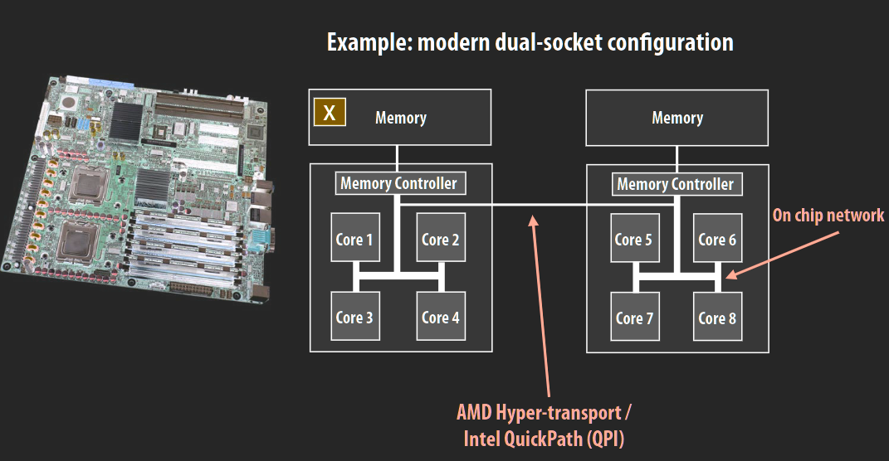

### 信息传递

由于实现缓存一致性（不同缓存之间的副本可能不一致）需要额外的成本，所以还有一种不依赖于任何硬件架构的并行计算机

每个线程（这里的线程与pthread的线程不是一个东西）只有私有数据，没有共享的地址空间，线程间通信只能通过网络发送给另一个线程。

优点是不需要任何硬件，只要有网络即可，也不需要担心缓存一致性的问题。并且使得通信更加有条理

缺点是网络会成为机器（或者集群）的瓶颈，并且约束太多

编程模型和实际的机器硬件类型之间没有严格的对应关系：

- 可以在共享物理地址空间的机器上实现信息传递，这很简单，直接对共享内存读写即可
- 可以在没有共享物理内存的机器上实现共享地址空间，这个比较麻烦，方法是将共享变量所在的page标记为invalid，访问时触发pagefault进入内核，在pagefault handler中进行网络请求，将获取的共享变量更新。

### 数据并行

以前的并行是一条指令用于一个数组中的很多元素，而现在通常使用SPMD的编程方式，map(function , collection)，将一整个函数function分别作用于collection中的每个元素。在ISPC中，循环体就相当于是function，foreach就相当于是map。

这个ISPC程序是不合法的，因为有可能多个程序实例访问同一个内存地址，数据并行模型没有为这种情况提供任何互斥同步的原语，它并不期望程序员写出这样的代码


流编程模型：

- 流：元素的集合，每个元素可以被独立处理
- kernel：没有副作用的函数，可以独立对流中的每个元素处理


Gather/scatter：两个数据并行通信原语。Gather负责把输入input数组中对应indices数组中索引的数抓到tmp_input数组中，scatter相反


在现实中，通常是混合这三个编程模型，因为在一台机器上所有的核通常是共享内存的，而在由许多机器组成的集群中，不同的机器之间是不共享内存的，只能通过信息传递来进行通信，并且通常我们不仅有CPU，还有GPU，所以我们还会将数据并行的编程模型与前面两个模型（用来处理不太适合数据并行的代码）混合使用。

# Lecture4~5 Parallel programming basics & Performance Optimization

优化并行程序的性能是一个迭代的过程，我们很难一次性就优化到位

tip：首先使用最简单的方法把基本功能实现，然后再测试性能从而决定在什么地方进行优化。我们第一个目标是把程序写对，然后才是对性能进行优化

编写一个并行程序的步骤：

1. 将问题分解为多个子问题（task）

   - 分解程序的关键是识别程序中的依赖性，阿姆达尔定律：一个程序中没有并行的部分会限制这个程序整体的性能。分解程序是程序员需要的做的事情

2. 将子问题分配到并行的线程（worker）

   - 分配问题的目标有两个：

     - 一个是负载均衡。负载均衡比我们想象的更重要，因为根据阿姆达尔定律，即便是一小部分的负载不均衡都会显著限制最大的加速
     - 一个是尽量减少线程间的通信；

     但是这二者之间往往是矛盾的，比如要想负载均衡，最好的办法通常是将任务随机分配给处理器，但是会导致处理器的局部性很差，增加了线程间的沟通。如果想要减少通信，最简单的办法就是把所有的任务全部分配一个处理器，这就导致了负载不均衡

   - 分配可以是在执行之前静态的，或者在执行时动态的。比如下面的ISPC程序，左边的是静态的，由程序员来分配任务；右边的是动态的，由运行时系统来分配任务给程序实例。使用pthread分配任务也通常是静态的

     

     - 使用静态分配任务是把程序写死了，当程序执行出现意外时就会导致负载不均衡，比如pagefault或者长时间io；通常只有当所有工作的执行时间和数量都是可预测的，才会使用静态分配

     - 当工作的执行时间和数量是不可预测时，使用动态分配可以更好地负载均衡，比如维护一个任务队列，一个worker执行完一个任务后就处理下一个任务（实际上这就是内核进程调度的方式，在内核中维护一个进程队列，每个核遍历进程队列找到runnable的进程执行）；但是这又会导致需要运行时额外的开销来维护队列，比如可能会导致锁的争用

       动态分配的优化：

       1. 任务粒度：给定一个长为N的数组，计算数组中的每个数是否是质数，维护一个指针counter，指向下一个准备计算的数，worker计算完上一个数之后就根据counter计算下一个数。

          

          这个方法的问题是：任务的粒度太小，计算一个元素作为一个任务；虽然负载非常均衡，但是会导致overhead太大，也就是锁争用严重，并且critical section太多，导致并行的部分太多；

          

          解决的办法是增大任务的粒度，比如计算十个元素作为一个任务；但是这又会导致负载不够均衡

          

       2. 任务调度策略：如果任务的花费时间方差很大，比如有一个任务执行时间远远长于其他任务，那么应该将优先调度长的任务；因为如果把长的任务放在最后调度，可能会导致其他的worker等待一个worker

          

       3. 分布式任务队列：为了避免所有的worker争用一个公共队列的锁，可以为每个worker设置一个任务队列，将任务均匀分配到每一个任务队列中；当某个worker自己的任务队列空了，就从其他的worker的队列中steal任务（实际上类似于xv6对物理内存申请的优化，也是为每个核设置一个freelist）。这种方法在steal的时候的开销极大，但是steal的情况很少发生。

          

          这种方法在检测程序是否终止时比较复杂，因为worker需要查看所有的队列，才能确定是否结束

       4. 在现实中很难找到一个任务可以被分解成完全独立的子任务，任务队列中的任务不一定要是相互独立的；可以使用某一种数据结构，维护任务之间的依赖关系，队列中的某个任务只有当它的依赖都完成了才能被分配给worker；worker提交新任务给系统时也可以指明该任务的依赖

          

3. 协调多个worker的执行，我们希望能够减少worker间通信/同步的开销

   1. 结构化worker之间的通信，减少通信的开销；比如将多条消息合在一起发送出去，每次发送一个块的信息，而不是几个字节的信息。
   2. worker间的同步

   课程中使用一种衡量标准：算数强度：计算量除以通信量，算数强度越高就说明对并行处理器的利用就越好

4. 将worker分配到具体的硬件上执行

   - 如果创建的是pthread，那么由OS来决定将它分配到哪个CPU核上运行
   - 如果是ISPC，那么由编译器来决定将程序实例分配到哪个向量指令lanes（ALU？）
   - 如果是GPU，那么由硬件来决定将CUDA 线程分配到哪个GPU 核上

   在分配硬件的问题上还有两个策略：

   1. 将相关的线程放在同一个处理器上：可以增加局部性、减少通信和同步的开销；但是相关的线程往往会有相同的瓶颈，比如带宽，将他们放在一起会导致瓶颈更加严重
   2. 将瓶颈方面更多样化的线程放在同一个处理器上


**一个并行编程的例子**：


顺序执行的代码：


如果选择对内层循环进行并行，那么依赖图如下：每计算一个点都需要上下左右四个点的值，而上面和左边的点的值依赖于之前循环计算的结果。	


如果是从左到右、从上到下依次将点分配给不同的worker，那么同一时间，右边的worker会依赖左边的worker的计算结果。

一种可行的任务分解策略是：每次将一条副对角线上的每个点分配给一个worker，副对角线上的点之间的计算没有依赖性。但是问题是：每条副对角线的长度是不一致的，在开头和结尾的对角线的并行度很差；并且这样数据的空间局部性很差


解决方法是：将这个问题原本的算法更改为更容易并行的算法，新的算法通常无法获得完全一模一样的结果，但是可以得到近似的结果。比如对于这个问题，将之前的算法变成下图中的先计算红色的点，再计算白色的点（这样每一轮计算之中可以并行，因为红色点或者白色点之间的计算没有依赖关系），重复直到收敛。

此方法无法得到与之前的串行的方法完全一样的答案，但是对于这种模拟来说已经足够了


任务分解完之后，需要进行子任务对处理器（worker）的分配：左边是按块分配，右边是交错分配。


现在我们假设分配的worker是pthread，而不是GPU或者ALU，来讨论两张分配方式的优劣：

- 如果按块分配，那么不同的处理器之间的通信需求很小，只有当线程计算到自己的块的边缘的行时才需要和其他线程通信；如果交错分配，那么通信需求就比较大

  

上面这个例子的**数据并行代码**：


**共享地址空间代码**：程序员负责不同线程的同步，同步原语为：

- lock：互斥
- barrier：等待所有的线程全部执行到当前的代码才能继续执行


创建多个pthread，每个pthread都执行下面的solve函数


由于`diff += abs(A[i,j] - prev)`需要读写diff，所以需要对其diff加锁（或者使用原子指令`atomicAdd(x, 10)`）。但是这里加锁太频繁，导致锁的抢占影响性能。

所以我们可以在每个for循环内部只计算局部的diff值，等到for循环结束后，再计算所有线程局部的diff的值求和即可，这样锁的争用就少很多了


除此之外，这里的三个barrier的作用是避免有线程将全局的diff重置了

**信息传递模型代码：**


由于每个机器只有自己块的数据，所以当计算到最上面或者最下面的行时，需要和其他的机器进行通信；为了方便代码编写，我们会在当前块的边界上分配额外的一行，称为ghost cell


当计算到块的边界时，我们会从相邻的机器中收到一行的数据，然后将他们复制到ghost cell中


**线程的外层循环一开始，就向相邻线程发送自己的边界行，然后也要从相邻线程接受他们的边界行，并复制到自己的ghost cell中；通信完成后就可以像之前的共享地址空间的代码一样计算**；计算完毕后，所有线程都要把自己本地的计算结果mydiff发送给0号线程，并等待0号线程完成求和后发送的信号done；0号线程从这些线程中收到它们的计算结果后求和，再将完成信号done广播。


由于最后这段代码的模式经常发生，所以在很多语言中都有对应的库函数将这段代码封装起来


在这个过程中，线程之间的同步由send和recv完成，如果信息没有发送到或者没有接收到，线程就阻塞，这实际上类似于握手协议。


所以前面的代码会出现死锁，因为所有的线程都首先调用send，等待其他线程接收；

解决方式是偶数的线程先发送，再接受；奇数的线程先接受，再发送


还有非阻塞的异步IO：send和recv调用后立即返回，由后台线程（内核）负责处理信息，当前线程不需要阻塞，可以做自己的事情；调用send和recv可以获取一个描述符，可以使用checksend或者checkrecv来检查该描述符从而确定是否成功发送或者成功接收


非阻塞的坏处是：由于发送方可以不停地发送消息，如果接受的速度比不上发送的速度，可能会导致接收方分配的缓冲区溢出；所以阻塞是消息传递最直观简洁的实现方式

# Recitation1:ILP, SIMD instructions

在 `/proc`目录下可以看到操作系统的很多信息，比如有哪些进程正在运行，文件系统的信息、内存信息、cpu的信息等


每个进程有自己的文件夹，文件夹的名字是进程的id，内部包含了进程独有的信息，比如mmap


使用 `cat /proc/cpuinfo `可以打印出这台电脑上的所有CPU的信息

- cpu MHz：cpu当前的速度（在model name上通常也会有频率，但是那是CPU的最大的频率）
- cache size ：最外层的cache（L3），由所有核共享
- siblings：超线程的数量；超线程在OS看来就是一个核，因为它可以作为分配任务的一个单元
- processor ：超线程的id
- cpu cores：核的总数；比如一个芯片有两个CPU、每个CPU有四个核、每个核有两个超线程
- core id：核的id
- flags：告诉我们这个处理器有哪些功能（比如avx）

优化并行程序性能时要找到痛点，对常见活动的小优化会产生很大的效果。比如下面的程序，对内部的循环进行优化会取得更好的效果，因为内部的循环会执行很多次。


首先我们可以把内部循环的某些值提前计算，将`x[i] * x[i]`提前算好

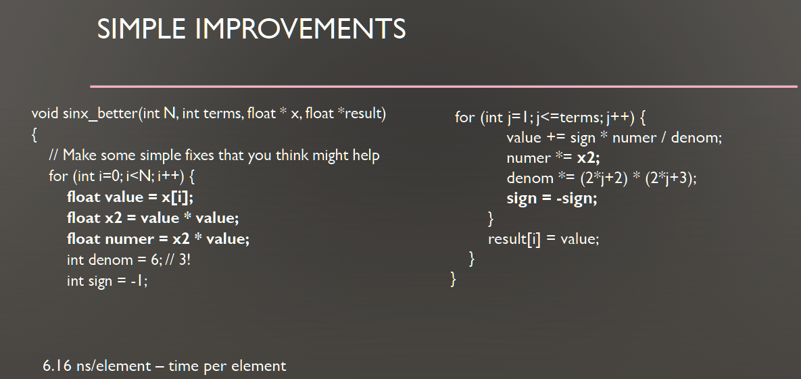

然后我们还可以发现，在每个外部的循环中，内部循环要对每个j都重新计算一次denom，所以可以将每个j对应的denom提前算好。


循环展开：循环的实现方式就是反复执行一段代码，并且在每一段代码的最后都检查一下条件，如果不成立就退出循环；这个条件只会起作用一次，但是每个循环都要检查它，如果我们的循环体很小，那么对条件的检查将会成为很大的overhead

- cs中常见的一种思考的方式：overhead；并不是简单地计算某个操作或者某个数据的时间或空间的开销，而是根据我们的真正目的来衡量。如果相较于我们真正想要做的事情开销太大，那么这个操作就需要优化了

除此之外，循环还会对流水线造成性能损失，因为每一次循环都要预测是否继续，如果预测失败那么已经载入流水线的指令要全部清空。

所以**循环展开的想法就是，将一个循环体拉长，将之前的几个循环合成一个循环执行**

但是循环展开也有劣势：对cache不友好；局部变量太多，对于一些古老的机器，寄存器有可能不够用，溢出到内存上；展开的倍数最好是循环的约数，因为这样就不需要处理剩下的部分了

终极优化：上面的代码使用循环展开加ISPC向量化，**向量化可以轻松超过上面的优化**

- 外层循环是对不同的数计算泰勒展开，互相独立，所以对外层循环使用ISPC；对内层循环进行循环展开，循环中一次性计算三个泰勒展开的项，然后再用一个循环处理剩下的不足三个的项；
- 将程序中的某些变量声明为uniform可以提升程序的性能，因为不需要在每个程序实例中都计算一遍


对程序的优化会伤害程序的可读性和可维护性，甚至引入bug（能用就行）

# Lecture6 Graphic processing units and CUDA

正如之前所说的，2004年之后时钟频率到头了，指令级并行也到头了，单核的性能无法继续提升，但是晶体管密度还在不断提升，所以开始研究多核处理器。GPU的出现也是基于这样的想法

GPU是一个多核的芯片，在每个核上有多个ALUs用于执行SIMD，一个核上可以同时执行多个CUDA线程。

CPU使用超线程技术在单核上实现线程并行与GPU的单核多线程并行技术有很大的区别

**同一时代时，GPU的内存比CPU的相对小，cache也少，但带宽快很多**

在2007年，CUDA编程语言还没有出现之前，人们必须通过一种固定的pipeline来调用GPU的硬件，非常不方便。

2007年，NVIDIA Tesla架构上引入了CUDA编程语言，人们可以更加方便地使用GPU硬件，具体步骤如下：

1. 应用在GPU中分配内存，并把数据从CPU拷贝到GPU内存
2. 应用提供GPU一个核函数，该核函数是CPU想让GPU执行的程序。
3. 应用告诉GPU通过SPMD的方式运行这个核函数
4. CPU说go，然后GPU开始执行

CPU上线程的调度是由OS进行的，GPU上线程的调度是由硬件进行的，OS不参与，因为对GPU来说OS太慢了

我们通常将GPU称作device，将CPU称作host

cuda编程语言：

- CUDA编程语言类似于C语言，运行在GPU上并使用了GPU的硬件接口。
- CUDA很贴近现代GPU的架构特点，其抽象与GPU硬件比较接近。
- OpenCL则类似于CUDA的一个开源版本。但是CUDA只能运行在NV的GPU上，而openCL可以运行在很多厂商的CPU和GPU上。本课介绍的CUDA特性，OpenCL也都支持。

CPU线程（pthread）和cuda thread非常不一样：cuda thread比pthread的耦合更加紧密

**cuda程序由cuda线程的层次结构组成**，如果要对两个12列6行的矩阵A和B进行相加，结果保存在矩阵C中，我们需要先将矩阵分解为6个4 * 3大小的线程块，每个块内有12个cuda 线程，矩阵加法的每一个元素都由一个线程进行；前面的 `threadsPerBlock`和 `numBlocks`用来配置块的结构

- 每个线程块都被映射到一个执行单元并执行，一般单个块内的线程个数的上限是1024


上面的代码是运行在CPU上的代码，下面的代码是运行在GPU设备上的kernel代码

- host代码是顺序执行的，就像普通的C++代码一样；`matrixAdd<<<numBlocks, threadsPerBlock>>>(A, B, C)`负责批量启动很多cuda thread块，尖括号中第一个参数代表多少个线程块，第二个参数代表每一块有多少个线程；只有当所有线程都结束之后才会返回
- kernel代码是SPMD执行的，`__global__`表示一个cuda核函数的定义，核函数的参数是host代码中传入的ABC；每个cuda线程在计算之前都要先根据当前线程在block中的id和block在网格中的id，算出自己在整体的网格中的线程id（也就是当前线程在计算哪一个元素）
- 我们也可以写一个函数以`__device__`为前缀，该函数由设备编译和运行
- GPU之所以比CPU快是因为CPU是通用的处理器，它为了从顺序程序中提取更多的并行性从而添加了大量的控制逻辑，比如分支预测、乱序执行，还有很多的缓存，GPU将这些全部去掉，就有了更多可以用于加法乘法和其他计算的空间。


有时候我们计算的矩阵大小不是块的形状的整数倍，比如grid的形状是11 * 5，而块的形状是 4 * 3，此时就要在核函数中对于边界情况进行判断

- 在GPU中条件分支比CPU中的容忍度更高，几乎是0成本，唯一的代价是没有充分利用所有的功能单元（有一些thread没有得到执行）；因为GPU中最重要的问题是如何提升吞吐量，而不是调度


cuda程序中，分为CPU内存和GPU内存，CPU和GPU只能操作他自己的内存，因此需要使用内存拷贝函数在CPU和GPU内存之间进行数据拷贝


```c#
//需要拷贝的字节数
int bytes = sizeof(float) * N
//指向gpu内存的指针
float* deviceA;
//在gpu内存中申请空间，并把地址给deviceA
cudaMalloc(&deviceA, bytes);
//将A指向的CPU内存的数据拷贝到deviceA所指的GPU内存中
cudaMemcpy(deviceA, A, bytes, cudaMemcpyHostToDevice);
// CPU代码中访问deviceA[i]是不合法的，因为cpu不能直接访问gpu的数据。
```

**cudaMalloc是在GPU上分配一个空间并且返回地址，所以需要修改主机传入的指针，所以传入的是指针的指针；其他的cudaMemcpy或者cudaMemset直接传入设备上的指针即可**


**GPU的内存空间是分布式的，有三种内存**：

- device global memory, 当前device中所有CUDA线程都可以访问
- per-block shared memory ，只有同一个block的CUDA线程才能访问
- per-thread private memory，只有当前线程才能访问

这三种内存之间的关系并不是缓存的关系，比如从全局内存中读取数据，不一定会出现在每块的共享内存中；访问速度上，第一种最慢，最后一种最快，因此，CUDA编程的时候就需要注意数据的本地性以减少内存延迟


卷积cuda代码：下面的代码比较低效，因为在核函数中所有线程都是从全局的GPU内存读取，而且每个线程之间的读取是重叠的，比如线程1从input中读取0,1,2，线程2要从input中读取1,2,3，总共要读取3N次

- cuda内置的变量：
  - threadIdx，blockIdx，blockDim，gridDim描述了cuda线程的结构，这些变量可以是一维二维三维的，分别使用`.x` `.y` `.z`访问对应维度的值


既然每个块都有共享的内存，我们可以将其作为缓存，先让所有线程一次性将130个input都读入块共享内存，然后再对块共享内存中的input进行卷积；

- **使用`__shared__` 声明一个块内共享的数组，如果不使用任何修饰，默认声明的变量在线程私有内存中**。每个线程负责将自己对应的input中的元素读入到support数组中对应的位置
- 由于要读130个input，但是只有128个线程，所以前两个线程要多读两个元素
- 所有线程要进行同步，因为要等所有线程都读完之后才能进行计算
- 把计算结果写入全局的内存

使用这种方式只用从全局内存读N次


所以cuda线程的开销比CPU线程的开销要小得多，上面的程序创建了100万个cuda线程、8千个线程块

在`.cu`文件中可以混合包含设备代码和host代码

- 使用`__global__`标识的是核函数，在设备的线程上执行，只能访问设备内存；使用 `__device__`标识的是设备函数，只能由核函数调用，也只能访问设备内存，不能产生任何新的线程

- host代码只能访问host内存，但是可以有设备内存的指针；负责管理cuda线程的启动和在设备内存和host内存之间数据的移动

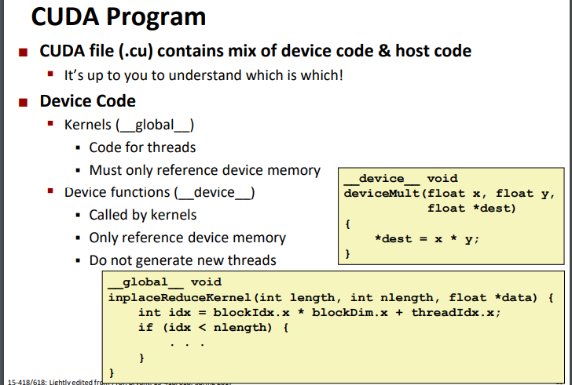

## GPU架构


**一个GTX 980 包含16个SMM( Streaming Multiprocessor, 流多处理器），也称作core**，还包含一个2MB L2 cache 和一个4GB global memory 


如下图所示，一个核（SMM）中包含一个96KB的块共享内存, 以及一个可以存储64个warp的存储空间(256KB)

- 一个warp包含32个cuda线程的执行上下文，一个核中一共有64个warp，所以最多可以同时容纳2048个cuda线程
- cuda核函数的执行方式是SPMD，即所有线程执行一样的程序，所以**一个warp中的所有线程共享一个指令流**
- SMX（在GTX 980的Maxwell架构中SM称为SMM，在kepler架构中SM称为SMX)核心在**每个时钟周期**：
  - 从下图可以看到，由于一个核中只有四个warp selector（也叫warp scheduler），所以最多可以从64个warp中选择四个warp并行执行（线程级并行）
  - 一个warp selector中只有两个decoder（也叫dispatch unit），每个decoder可以分派一条指令，所以每个warp最多可以同时执行两条指令（指令级并行）。
  - 当warp进行访存等长延迟操作时，warp selector会调度另一个warp来替换这个warp。**与CPU不同，GPU在并发的warp之间的切换是没有什么消耗的**，因为CPU通常只有几套寄存器，切换上下文时需要把寄存器保存到内存中；而GPU为每个线程都提供了物理寄存器，不需要切换上下文，因此保证了高吞吐量。
    - 也可以由此看出CPU和GPU的设计思路的不同，CPU尽量将空间分配给控制部件，首要目标是保证指令执行的低延迟；GPU尽量将空间分配给线程执行上下文和ALU，首要目标是保证高吞吐量。
- 由于最多四个warp并行，所以一个核中给每个warp分配了32个ALU，也叫SP（streaming processor）；所以在现代nv硬件上，**一个warp上的32个线程可以使用32宽的SIMD指令同时执行**。所以**warp中所有thread在同一周期执行相同的指令，尽管这些thread执行同一程序地址，但可能产生不同的行为，比如分支结构**
  - warp和ISPC的gang很像，都是SPMD（gang也是给每个程序实例分配一个执行上下文吗？如何在CPU上实现的ISPC？）
- 既然GPU一个核只能并行执行四个warp，为什么不只设四套执行上下文，等一个warp执行完了腾出空间执行下一个warp？
  - 因为一个线程块中线程之间是会有依赖的，比如在线程块中调用sync时，要等同一个块中的所有线程都执行完了才能继续执行。**所以同一个线程块中的所有线程必须同时载入同一个核的warp中，也就是说线程块的大小必须小于GPU的一个核的warp大小**。


由于线程块有块共享内存，所以**一个线程块必须在同一个核（SM）上运行**（保证了高带宽低延迟），但是一个核上可以运行多个线程块；一个warp只能运行一个线程块，线程块的大小必须要是warp大小的整数倍（并且最大值是1024），但是在现实中grid的大小不一定是warp的整数倍，所以grid的最后一个线程块通常会有一些线程没有被使用。

- **warp是SM中最小的调度单位**

- 一个thread block可以包含多个warp，在每个thread block内部，warps可以通过读取/写入共享内存进行同步或通信。每**个kernel从HBM加载数据到寄存器和SRAM中，进行计算，最后将结果写回HBM中**。**thread block是GPU执行的最小单位**。**一个线程块的thread只能在一个SM上调度**，SM一般可以调度多个block


在GPU上还有一个GPU Work Scheduler，用来调度线程块在哪个核上运行；如果GPU上资源不足，比如所有的核的共享内存都不足以存放新的线程块分配的块共享内存（**SM要为每个block分配共享内存**），或者warp空间不够，就要等正在执行的线程块结束，腾出空间


CPU和SPMD机器的交互方式：


CPU不能直接访问设备的内存，需要将数据来回拷贝


GPU访存：

- 访问DRAM开销很大
- 访问共享内存SRAM：通常硬件内存模块一次只能允许一个人访问，所以共享内存被组织成独立的bank，NV的GPU的bank数是16，如果x是一个共享内存中的变量，那么它所在的bank号是 `(&x/4)%16`；所以如果我们遍历一个数组，每访问四个字节就会切换一个bank。当访问的所有地址分布在不同的bank时，访问吞吐量达到最大，但是由于硬件争用检测逻辑（hardware contention detection logic）的存在，导致访问延迟较高；如果访问的地址在同一个bank中，那么就会发生争用，导致吞吐量降低。
  - 比如如果两个访问的地址在同一个bank中，那么吞吐量就是峰值的二分之一
  - 所以有很多cuda编程技巧来避免bank争用，比如访问连续的float数组可以达到峰值吞吐量（因为是SIMT，每个线程访问数组中的一个float，所以每个线程都刚好访问不同的bank），访问连续的byte数组只能达到四分之一的峰值吞吐量（相邻的四个线程访问同一个bank）。

我们可以看到，CUDA的抽象和GPU的硬件是互相对应的，也就是说CUDA中的线程要分为grid，block和thread这三个层级的原因是为了和硬件相对应（分别对应GPU、核、ALU），所以CUDA是一种贴近硬件的语言。

**除了大量的计算单元，影响GPU硬件性能的另一个重要指标是传输通道带宽。**

过去，数据主要通过PCIE数据通道在主机与GPU之间通信，如PCIE 3.0 x16的带宽是16GB/S。使用GPU进行计算之后，显卡之间也要传输数据，**英伟达开发了专门的NVLink传输通道连接显卡，带宽不断提升，H100的4代NVLink已经是900GB/S，是基于PCIE传输带宽的10倍以上**。


以上关于计算单元，CUDA Core和Tensor Core数量以及传输带宽的案例，都是在强调，**GPU强大的算力来源于诸多方面，在设计上可优化空间大**，具体则包括显存大小、显存速度、缓存管理、数据通道、Core数量、单Core性能、数值精度、并行编程优化等等。

- 主要是三个方面：芯片算力、显存容量、显存带宽

**甚至在制造封装环节，比如纳米制程提升、先进封装工艺研发，对于英伟达自身和后来的追赶者，都有参与的空间**，可以改进的环节远远超过CPU。

从整个芯片设计市场来说，CPU也在进步，高性能芯片的潜力还很大。只是从大众需求的角度看，**PC、手机的CPU芯片性能已经存在过剩，没有太多市场，而相反，就与AI的大规模应用，GPU大众应用的想象力是开放的。**比如在围棋AI领域，GPU算力高，围棋AI的水平就高，GPU性能成了围棋AI弱机、强机的判定者。

可以想象，自己的AI助手有多聪明，很可能是配备的GPU性能决定的，那GPU的市场前景还望不到尽头。

摩尔定律是18个月，或者是每24个月它的晶体管密度就会成倍，但是到了先进制程整个趋势是变慢下来，以目前来看的话，大概每年可能增长20%到30%，而应用上，**以端侧AI模型的复杂度来讲，每年增加的幅度可能都是两倍、三倍，甚至是十倍**。这个差距没有办法完全靠摩尔定律来弥补，所以就需要在硬件上面有所创新。另外更重要的，是在算法和软件层面的创新。


专用ai芯片（asic）：相比于GPU，

- asic移除了浮点运算器；因为使用量化的模型都是用INT进行计算，不需要浮点运算器占空间了
- 移除了图形计算的部件，比如光追等
- 有更大的缓存更大的显存

GPU吞吐量大，但是延迟很高；所谓延迟是指计算一个数据需要多长时间（计算大量数据然后计算平均时间不能代表延迟，延迟大概是指CPU向GPU发送一个事务，然后GPU返回这个事务之间的时间），而吞吐量是指规定时间内可以计算多少数据（也就是常说的芯片的“算力”）。

所以有些场景GPU就不适用，比如自动驾驶需要延迟很低，此时使用所谓的高算力的芯片就没有意义，此时就需要fpga或者专用芯片；如果是服务器应用，比如推荐系统，无所谓延迟多少，此时就可以使用GPU

## SIMD vs SIMT vs SMT

**SIMT vs SIMD**：

cuda是一种典型的SIMT架构（单指令多线程架构），SIMT和SIMD（Single Instruction, Multiple Data）类似，二者都通过将同样的指令广播给多个执行单元来实现并行，并且它们的执行单元都共享同一个指令流（fetch/decode hardware）

SIMT有三个SIMD没有的主要特征：

- 每个thread拥有自己的寄存器

  - 比如对于两个数组相加，SIMD是用一个线程使用SIMD指令操作多个数据实现

    ```c
    void add(uint32_t *a, uint32_t *b, uint32_t *c, int n) {
      for(int i=0; i<n; i+=4) {
        //compute c[i], c[i+1], c[i+2], c[i+3]
        uint32x4_t a4 = vld1q_u32(a+i);
        uint32x4_t b4 = vld1q_u32(b+i);
        uint32x4_t c4 = vaddq_u32(a4,b4);
        vst1q_u32(c+i,c4);
      }
    }
    ```

    **而SIMT由多个线程执行相同的代码**完成，因此叫单指令多线程，但是每个线程都有自己的寄存器，

    ```c
    __global__ void add(float *a, float *b, float *c) {
      int i = blockIdx.x * blockDim.x + threadIdx.x;
      a[i]=b[i]+c[i]; //no loop!
    }
    ```

    优点是SIMT比SIMD的写法更简单明了，可读性更强；

    代价是SIMT消耗的资源更多，比如abc三个指针在所有线程中的值都是一样的，但是还是要在每个线程的寄存器中储存一份；

    

- 每个thread访存的地址可以不连续

  - SIMD指令只能对连续的向量进行运算，而SIMT的每个线程可以访问内存不连续的值

    ```c
    __global__ void apply(short* a, short* b, short* lut) {
      int i = blockIdx.x * blockDim.x + threadIdx.x;
      a[i] = lut[b[i]]; //indirect memory access
    }
    ```

    优势是可以并行很多SIMD无法并行的程序（或者说更容易并行），代价是GPU随机访存效率较低，需要很多编程技巧才能达到峰值吞吐量（见上面的GPU访存）

- 每个thread可以有自己独立的指令执行路径

  - 比如SIMT可以执行下面的程序

    ```c
    __global__ void find(int* vec, int len,
                         int* ind, int* nfound,
                         int nthreads) {
      int tid = blockIdx.x * blockDim.x + threadIdx.x;
      int last = 0;
      int* myind = ind + tid*len;
      for(int i=tid; i<len; i+=nthreads) {
        if(vec[i]) { //flow divergence
          myind[last] = i;
          last++;
        }
      }
      nfound[tid] = last;
    }
    ```

    优点还是可以并行一些SIMD无法并行的程序（或者说更容易并行）；代价是：由于SIMT终究只有一个取值/译码/执行逻辑单元，并且在volta架构之前一个warp中所有线程共享PC，所以**所有线程只能同时执行同一条指令，所以一个warp中的所有线程执行进度一样，步调一致**（但是不同的warp执行进度是不一样的，所以需要sync来同步），当遇到分支时，GPU需要执行所有的分支路径，再通过Bit Mask指定哪些线程运行代码，哪些线程空转。

    所以当warp中出现发散行为时，warp会串行执行每个分支路径，并禁用其他非活动时的路径中的线程。这会造成性能显著下降。

    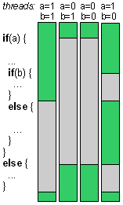

ISPC类似于SIMT，也是多个线程执行相同的代码，那么ISPC是如何实现的？

**SIMT vs SMT（Simultaneous Multithreading）**：

SIMT硬件（GPU）的一个核上有几百套线程的执行上下文，而SMT硬件（CPU）的一个核上只有一两套线程的执行上下文，原因是：

- CPU最初的设计思想是让单线程执行的越快越好，因为CPU是通用处理器，首要目标是让串行程序执行地快，降低指令的执行延迟，所以尽量将空间分配给控制部件
- 而GPU首要目标是保证高吞吐量，所以尽量将空间分配给线程执行上下文和ALU。并且同一时代的GPU的内存带宽会比CPU的内存带宽大好几倍。(因为CPU关注于内存延时，吞吐量相比GPU不大，因此没必要使用高内存带宽)

SIMT没有共享内存中的同步原语（比如SMT中的lock、semaphore等），它唯一的同步方式就是sync

# Recitation2: CUDA programming 1

课程介绍了一种简化CUDA函数调用的错误检查过程的方式，将所有cuda库函数的使用都包一层下面的宏：

- 当你在CUDA代码中调用一个函数，比如`cudaMalloc`或者`cudaMemcpy`，可以使用`CHK(cudaMalloc(...))`。如果函数返回的不是`CUDASuccess`，则会调用`gpuAssert`函数进行处理。
- `gpuAssert`函数：如果`code`不等于`CUDASuccess`（表示有错误发生），它会打印出错误信息，包括CUDA错误字符串、发生错误的文件名和行号。
- 宏定义 `POSTKERNEL`: 这个宏定义用于内核（kernel）调用后的错误检查；因为**cuda核调用是异步执行的**，所以当你启动一个内核时，CPU代码会立即继续执行，而不等待内核执行完成。因此，内核调用本身不会返回错误码，所以我们不能直接对内核启动包装CHK，而是将这个宏插入到内核启动的代码之后。`CUDAPeekAtLastError`可以用来检查是否有任何与最近的内核启动相关的错误。

```c
// Support for CUDA error checking
// Wrapper for CUDA functions
#define CHK(ans) gpuAssert((ans), __FILE__, __LINE__);
// Checker
inline void gpuAssert(CUDAError_t code, const char *file, int line)
{
	if (code != CUDASuccess) {
	fprintf(stderr, "GPUassert: %s %s %s\n",
	CUDAGetErrorString(code), file, line);
	}
}
// Cannot wrap kernel launches. Instead, insert this after each
// kernel launch.
#define POSTKERNEL CHK(CUDAPeekAtLastError())
```

矩阵乘法：


```c
void multMatrixSimple(int N, float *matA, float *matB, float *matC) {
	for (int i = 0; i < N; i++)
		for (int j = 0; j < N; j++) {
			float sum = 0.0;
			for (int k = 0; k < N; k++)
				sum += matA[RM(i,k,N)] * matB[RM(k,j,N)];
			matC[RM(i,j,N)] = sum;
		}
}
```

使用此种方式计算，在矩阵变大之后访问行依然不受影响，因为一行再大也很难比cache还大；但是访问列就会受到影响，因为要将所有的行都读入cache之后，才能读取指定的列，如果矩阵的大小比cache大，那么后面的行读入之后就会把前面的行驱逐，所以导致性能下降


优化方案1：将矩阵B先转置，然后就可以对两个矩阵都进行行访问了。这里的策略是一劳永逸，对矩阵B进行转置代价很大，但是以后对B进行矩阵乘法就非常轻松。


使用了预转置后，性能如下图所示：


优化方案2：用cuda实现最简单的，不进行预转置的矩阵相乘，每个cuda线程负责计算结果矩阵中的一个元素


```c
#define RM(r, c, width) ((r) * (width) + (c))
__global__ void
CUDASimpleKernel(int N, float *dmatA, float *dmatB, float *dmatC) {
	int i = blockIdx.y * blockDim.y + threadIdx.y;
	int j = blockIdx.x * blockDim.x + threadIdx.x;
	if (i >= N || j >= N)
		return;
	float sum = 0.0;
	for (int k = 0; k < N; k++) {
		sum += dmatA[RM(i,k,N)] * dmatB[RM(k,j,N)];
	}
	dmatC[RM(i,j,N)] = sum;
}
// host code:
// Integer division, rounding up
static inline int updiv(int n, int d) {
	return (n+d-1)/d;
}
void CUDAMultMatrixSimple(int N, float *dmatA, float *dmatB, float *dmatC) {
	dim3 threadsPerBlock(LBLK, LBLK);
	dim3 blocks(updiv(N, LBLK), updiv(N, LBLK));
	CUDASimpleKernel<<<blocks, threadsPerBlock>>>(N, dmatA, dmatB, dmatC);
}
void  CUDAMultiply(int N, float *aData, float *bData, float *cData) {
	float *aDevData, *bDevData, *cDevData
	CUDAMalloc((void **) &aDevData, N*N * sizeof(float));
	CUDAMalloc((void **) &bDevData, N*N * sizeof(float));
	CUDAMalloc((void **) &cDevData, N*N * sizeof(float));
	CUDAMemcpy(aDevData, aData, N*N * sizeof(float),CUDAMemcpyHostToDevice);
	CUDAMemcpy(bDevData, bData, N*N * sizeof(float),CUDAMemcpyHostToDevice);
	CUDAMultMatrixSimple(N, aDevData, bDevData, cDevData);
	CUDAMemcpy(cData, cDevData, N*N * sizeof(float),
	CUDAMemcpyDeviceToHost);
	CUDAFree(aDevData);
    CUDAFree(bDevData); 
    CUDAFree(cDevData);
}
```

仅仅使用了cuda，不改变矩阵相乘的任何策略，性能就飙升了数百倍，我们甚至无法区分cpu版本的性能和0的区别


- 在原始代码中，`i`是根据`y`维度（`blockIdx.y`和`threadIdx.y`）计算的，`j`是根据`x`维度（`blockIdx.x`和`threadIdx.x`）计算的。这种方式通常会导致连续的线程访问连续的内存地址（特别是对于`dmatA`和`dmatC`），这被称为**合并内存访问**（coalesced memory access）。
- 当`i`和`j`的计算方式被反转后，线程的内存访问模式也会改变。在这种情况下，连续的线程可能不再访问连续的内存地址，特别是在访问`dmatB`时，这可能导致**非合并内存访问**。

优化方案3：将矩阵分块再用cuda

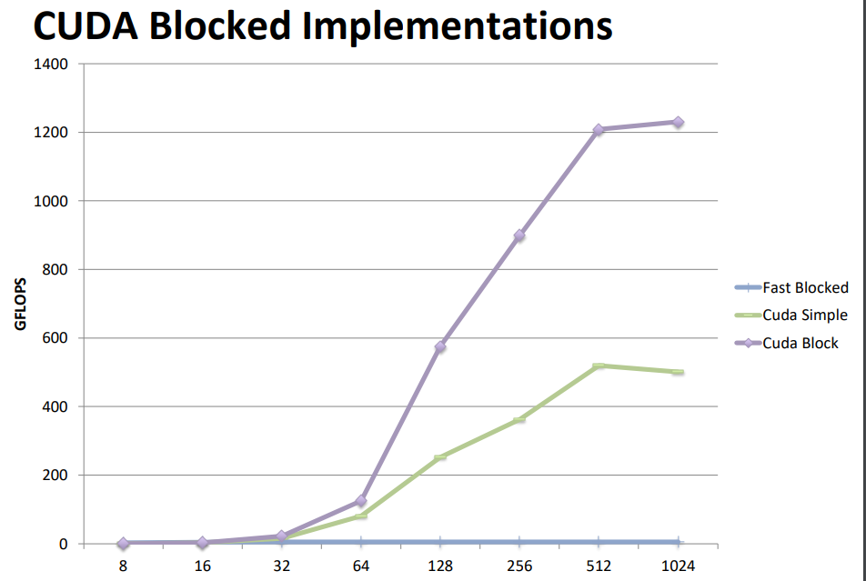

# Lecture7 Locality, communication, and contention

课程中使用一种标准来衡量任务的分配：算数强度：计算量除以通信量，算数强度越高就说明对并行处理器的利用就越好；实际上算数强度就是分块的面积比周长

好的任务分解策略可以增加算数强度，比如下图左边的算数强度与N成正比，元素越多算数强度越大；而右边则是常数


将它切割成正方形可以进一步降低算数强度，更加scaleble，随着处理器的增加，算数强度会进一步降低。


融合循环可以提升算数强度：


除了必要的这些通信之外，还有一些由系统设计导致的人为的通信开销：

- 系统通常会有最小粒度的通信大小，导致不必要的通信：比如程序只想从内存中读取4字节的值，但是该值所在的一整个64字节的cache line都要从内存中读取到cache中，造成了16倍的通信开销
- 系统还会有一些操作的规则，导致不必要的通信：比如程序想要向内存中写入16个连续的四字节的值，但是需要先把这个64字节的cache line从内存中读取到cache中，在cache中修改之后才能写回内存，造成了两倍的通信开销
- 比如缓存大小不够，导致频繁miss和换入换出


由于cache line的粒度，还会造成人为的通信：下图中将数据按照列划分成两半，线程被设计为只访问它们被分配的数据元素，理论上这应该不需要处理器之间的数据通信，因为它们访问的是不同的数据。但是实际上不同处理器可能会在同一个缓存行上操作，这会导致人为的通信。比如：

- 如果P1修改了缓存行中的一个数据元素，处理器为了保持缓存一致性，会使用一致性协议来同步不同处理器缓存中的数据，这种同步操作会增加附加的通信开销，这个缓存行的最新状态需要被同步到P2的缓存中，即使P2可能只关心这个缓存行中的不同部分。


解决方案是：改变数据存储的布局，从行优先的存储方式改成按照块来存储，那么一个块的数据在内存中就变成连续的了


# Lecture9 性能评估

当数据规模太小的时候，增加核数不仅不会提升性能，根据计算强度的计算公式，反而还会降低性能


优化策略：通常性能由计算、内存带宽（延迟）或者同步限制


如何确定限制性能的地方或者找到程序性能的极限：

- 增加算数指令（不改变内存访问），如果执行时间没有随着算数指令线性增加，那么就说明计算资源没有被充分利用；注意，我们不能随便添加一些指令，因为编译器很有可能会把不影响计算结果的指令给优化掉，很有可能会出现我们把程序变得越来越难计算，但是执行时间却始终不变的情况。
- 减少算数指令（不改变内存访问），如果执行时间没有随着算数指令线性减少，那么就说明受限于内存瓶颈
- 减少工作集的大小，比如将所有访问集中到A[0]，可以得到数据访问局部性最好的情况下程序的上限
- 移除所有的同步操作（比如原子操作和锁），这会导致结果出错，但是能够看到在没有同步的情况下程序的性能上限


现代的处理器提供了底层的性能计数器，能够获取IPC、cache hits/misses、从内存读了多少bytes等信息，放在不同的线程中，可以知道哪个线程相较于其他线程发生了什么异常（如负载不均衡等）


# Recitation3: CUDA programming 2

为了更好地优化程序，我们需要知道GPU的性能上限是多少，比如内存吞吐量、指令吞吐量的上限（通常能达到内存峰值吞吐量的一半就已经很不错了，70%左右基本就是优化的极限了），根据指令和内存吞吐量可以计算出理想的CPU和内存的使用比例，

- 如果低于这个比例，那么每条指令使用的内存就会减少，没有完全利用内存带宽；
- 如果高于这个比例，就说明没有完全使用计算资源


我们可以计算自己的代码中算数操作和访问字节数量之间的比例，然后与GPU的比例进行对比


# Lecture10  cache coherence 

C语言中的volatile声明的变量表示，对此变量修改的时候是对内存进行修改，而不是对寄存器进行修改


## 内存一致性

对于下面这样的一个多个处理器共享内存的系统，多个处理器可以同时读取和写入共享变量（存储在共享内存中），而内存一致性模型的**基本**要求就是：**无论哪个处理器写入某个地址（X），其他处理器读取这个地址时都应该能得到最后写入的值（last value）**


而一个现代的处理器，每个核都会有自己的cache，系统可能会将相同的数据保存在多个cache中，因此不同的核可能会在同一个内存地址处看到不同的值。比如处理器p1向内存X中写入值，如果X在p1的cache中，那么其他的处理器读取X就看读取到的是旧的X的值，这样就破坏了内存一致性的要求了。这个问题通常被称为缓存一致性（cache coherence）问题


要想满足这个对内存系统的基本期望，对单处理器系统来说比较简单，因为它写入通常只来自一个单一的处理器。在这种环境下，写操作是顺序的，而为了保证读操作能获取正确的值，**Load操作只需要检查Store Buffer中所有待处理的写操作即可**，这是因为某些store操作可能还未提交到主存，因此load操作需要先检查缓冲区，以获取最新的写入值。

但是实际上单核的机器也有可能出现缓存一致性的问题，因为DMA控制器也相当于是一个CPU，它会对内存进行读写，并且不经过cache，那么就有可能造成CPU的数据和DMA的数据不一样的情况。比如：

- Case 1：CPU写入内存中的缓冲区，然后通知网卡（DMA）发送数据。如果CPU的写操作只更新了缓存，但未刷新到主存，那么网卡从内存中读取的可能是旧数据（缓存中的更新未反映到内存中）。

- Case 2：网卡接收数据并通过DMA将其写入内存缓冲区，然后通知处理器读取。如果处理器的缓存中仍然有旧的缓冲区数据，它可能读取到过期数据，而非网卡更新的数据。


现在通常有两种解决方案：一种是一致性DMA映射（consistent DMA mapping）；另一种是流式DMA映射（streaming DMA mapping）

- 一致性DMA 映射关闭了主存上的DMA buffer的 L1/L2/L3 Cache。也就是当 CPU 向DMA buffer写入数据时，会直接放入内存，而不会在Cache进行缓存，所以设备可以立即DMA读取到CPU写入的数据；其次，当设备DMA写入数据到内存后，则CPU可以立即读取到该变化的数据，而不会读取Cache中的脏数据，因为Cache关闭了。
- 流式DMA映射：一致性DMA关闭了Cache，虽然使用带来了方便，但是会牺牲数据读写的性能。而流式DMA映射支持在 PCIe Endpoint DMA 访问内存时，将数据放入到L3 Cache，然后DMA 控制器从L3 Cache 读取数据

但是想要实现“任何处理器读取任何地址都能得到该地址最后的写入的值”这个要求，对于多处理器系统来说就很复杂了

- 如果两个处理器（例如 P1 和 P2）几乎同时对地址 X 进行写操作，该如何定义“最后”？
- 如果 P1 写入地址 X，而 P2 紧接着读取地址 X，但时间间隔短到无法通过硬件通信及时反映，导致P2无法读取到“最新”的值怎么办？

**在单线程顺序程序中，“最后”写入是由程序顺序决定的，而不是基于时间**。而在并行程序中，跨线程的操作并没有严格的程序顺序。所以我们需要一个有意义的方式来描述跨线程间的操作顺序，以保证共享内存的一致性。这个跨线程的操作顺序的定义就叫做一致性（coherence）模型

我们可以将这个一致性模型描述为：

- 对**每个**内存位置（memory location），并行程序执行的结果可以等效于某个**假设**的**串行操作顺序**（serial order）。这个假设的顺序是由所有处理器执行的程序操作组成的，并且和实际执行的结果保持一致。**并且对所有处理器来说，这个顺序是相同的**。
- 在这个假设的顺序中：
  - 条件 1： 对任意单个处理器发出的内存操作，按照该处理器的顺序执行（**单个线程内部的操作之间的相对顺序保持不变**）。	
  - 条件 2： 某个位置的读操作返回最后写入该位置的值（依据假设的串行顺序）。

这样的一致性模型也被称为**顺序一致性**（Sequential Consistency）

但是实际上顺序一致性并不是一个可行的实现方案，除非在系统中有某个权威来决定所有处理器上的事件的执行顺序

所以一个更好实现的一致性模型是这样的：

1. 当处理器P写入地址X后，再由该处理器P读取地址X，应该读到它自己写入的值，前提是在这两个操作之间没有其他处理器对地址X进行写操作。
2. 写广播：对于多处理器系统，**处理器写入对其他处理器可见**，即一个处理器对内存的写入操作最终必须被其他处理器所知悉。当处理器P2写入地址X后，如果处理器P1在“足够分离”的时间之后读取地址X，那么它应该读到处理器P2写入的值。这里的“足够分离”意味着两个操作之间有足够的时间让写入操作的结果对其他处理器可见。
   - 这个定义并没有规定写操作通知其他处理器的具体时间。这意味着，内存一致性模型并不保证其他处理器能立即看到写入操作的结果，只是保证它们最终会看到。
3. 对**同一个地址**的写入操作被序列化，也就是说，对同一个内存地址的写操作在所有处理器上观察到的顺序是一致的，这避免了处理器间关于内存更新顺序的歧义。例如，如果处理器P1写入值1到地址X，然后处理器P2写入值2到同一个地址X，所有处理器都应该观察到这个写入顺序，没有处理器应该看到值2在值1之前写入。

注意，此模型与顺序一致性模型的区别在于：

1. 在全局中：顺序一致性要求的是所有处理器的**所有内存操作**都按照同一个序列被观察到，而此模型仅仅要求所有处理器对**同一个地址**的**写入**按照同一个序列被观察到。换句话说，此模型保证的是单地址一致性，顺序一致性是全局行为。

   举例来说：

   - 此模型要求：两个写入（例如值 1 和值 2）在地址 X 上按相同顺序被所有处理器观察。
   - 顺序一致性要求：处理器对地址 X 和地址 Y 的操作，仍然需要全局统一的顺序。如果处理器 P1 先写 X，后写 Y，则其他处理器必须以相同顺序观察到 P1 的操作（先 X 后 Y）

2. 在单个处理器中：顺序一致性要求每个处理器的操作顺序必须与程序中定义的顺序一致，而此模型**不管单个处理器的操作的相对顺序如何**，只要每个处理器对某个内存地址的读操作总是返回自己最近写入的值（没有其他处理器写入的情况下），随便怎么乱序执行都可以。

要想实现这个一致性模型，可以在操作系统层面使用软件的方法，但是这样的开销太大了，所以主要的实现方式是在硬件层面实现

最简单的实现方式是使用所有核共享的缓存，但是这样就失去了缓存的意义了

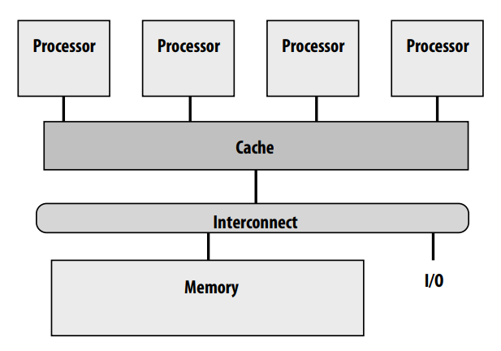

于是就出现了下面的缓存一致性协议

## Snooping-based cache coherence

所谓Snooping-based cache coherence，就是每个cache控制器监视（snoop嗅探）对内存的操作，当一个处理器发起内存操作（如读或写），相关的信息（地址、操作类型等）会通过总线广播给所有缓存，每个缓存通过嗅探总线来决定是否需要参与该事务。

- 下面描述的维护缓存一致性的逻辑全部都由每个处理器的cache控制器负责，它们负责处理来自本地处理器的所有内存访问请求（load和store指令），和来自其他缓存的请求或通知（如读取、写入或失效请求），它们还会跟踪自己的cache中每个缓存行的状态。如果所有的cache 控制器都按照定义的一致性协议操作，那么就可以实现缓存一致性。
- Snooping-based cache coherence 会导致interconnect上出现大量流量，不仅有从内存到cache的信息，还有cache之间的信息；并且cache控制器要响应两端的信息，即本地的处理器的读写操作和其他处理器的一致性的广播


为了简化问题，在讨论一致性协议的设计之前，我们有一些假设：

- 暂时不考虑cache line的问题，视cache粒度为word
- interconnect和内存事务都是原子性的
- 处理器直到前一个内存操作完成了才会发出下一个内存操作

在这个假设上，最简单的一致性实现方式是：

- 所有cache采用write-throught的方式（即每次对cache修改要同时写回内存），并且每次对cache修改，cache控制器都要将信息广播给其他cache，让他们将cache中的相应条目标记为无效，导致下一次对该条目的访问需要去主存获取更新后的数据。

  比如在下图中，P0和P1先load x到各自的cache中，然后P0对x进行修改时会将P1 cache中的x invalidate，并且P0还要将x的新值写回主存，然后P1再load x时就会出现miss，从而要去主存中获取x的值

- 这种方式称为invalidation based协议，下面讨论的协议都是invalidation-based


但是write-throught cache性能太差了，每次对cache的修改都要写回内存，对带宽的要求很高。如果采用write-back cache，在缓存命中时可以吸收大部分的流量，显著降低对带宽的要求，但是要想实现写广播，就需要更复杂的一致性协议的设计。

### MSI协议

这就是下面的MSI write-back cache一致性协议：

- 处理器对cache的写不需要写回内存，因此处理器对数据的读就有可能从别的处理器的cache中读取，
- cache line中有三种标记位
  - invalid无效位：表示处理器没有这个数据
  - modified脏位：脏位表示处理器对这个数据独占所有权，只有当前的处理器拥有这个数据正确的值，比其他处理器和内存中的值都要新，当前处理器对这个数据进行读写都不需要通知其他的处理器。
    - 处理器只能对M状态的cache line进行写操作，当处理器进行写操作时如果cache line不是脏位，那么要先将它转变成M状态。同时要通知其他所有的处理器，将它们cache中的该数据置为无效（如果是从脏位变成无效，还需要将原cache line写回内存）。
    - 当其他cache试图从内存中读取该数据时，持有modified的cache需要向其他cache提供自己的cache line
  - shared共享位：共享位表示有多个处理器都拥有这个数据，只能读不能写，如果要修改需要通知其他的处理器
    - 当处理器从其他cache或者从内存中读取数据到自己的cache时，要将自己对应的cache line置为共享位，并且如果是从其他cache读取的数据而不是从内存中读取的，还要把源cache中的数据也变成共享位（如果是从脏位变成共享位，还要将原cache line写回内存）；


如下图所示是MSI的状态机，代表了一个**cache line**的状态的转换。状态转换可以由两类事件触发：

1. 本地处理器操作：
   - `PrRd`（Processor Read）： 处理器尝试读取缓存行。
   - `PrWr`（Processor Write）： 处理器尝试写入缓存行。
2. 总线事务（由其他处理器发起）：
   - `BusRd`： 其他处理器请求读取缓存行（无意图修改）。
   - `BusRdX`： 其他处理器请求独占权限（有意图修改）。
   - `flush`： 本地缓存将脏数据刷新到主内存。


状态转换的说明：

- `I → S` (通过 `PrRd/BusRd`)
  - 本地处理器发起读取操作（`PrRd`），但缓存行当前无效。
  - 于是cache控制器通过总线发起 `BusRd` 请求，从主存或其他处理器的缓存中获取数据，并将缓存行设置为 `Shared` 状态。
- `I → M` (通过 `PrWr/BusRdX`)
  - 本地处理器发起写入操作（`PrWr`），但缓存行当前无效。
  - cache控制器会通过总线发起 `BusRdX`（独占读取请求），获得数据的唯一权限，同时将缓存行设置为 `Modified` 状态。

- `S → I` (通过 `BusRdX/--`)
  - 其他处理器发起独占读取（`BusRdX`）请求时，本地缓存行被设置为无效（`Invalid`）。
- `S → M` (通过 `PrWr/BusRdX`)
  - 本地处理器尝试写入共享缓存行（`PrWr`），会通过总线发起 `BusRdX` 请求，获得写入权限。
  - 在获得独占权限后，缓存行被标记为 `Modified`。

- `M → S` (通过 `BusRd/flush`)：
  - 其他处理器发起读取请求（`BusRd`），本地缓存行需要将修改的数据刷新到主内存（`flush`）。
  - 刷新完成后，缓存行状态变为 `Shared`，允许多个处理器共享。
- `M → I` (通过 `BusRdX/flush`)：
  - 其他处理器发起独占读取（`BusRdX`）请求，本地缓存行需要将修改的数据刷新到主内存（`flush`），然后将缓存行标记为 `Invalid`。

MSI协议的局限：

在MSI协议中，**如果一个处理器需要对某个数据先读再修改（比如`++`这种操作），并且其他的核根本没有这个数据副本**，那么需要经过两次总线的transaction，第一次使用 `BusRd` 将缓存行从无效（`I`）状态转换为共享（`S`）状态，然后把数据从主存加载到缓存。第二次使用 `BusRdX` 将缓存行从共享（`S`）状态升级为修改（`M`）状态，**并且要广播给其他所有的核，但是其他的核根本就没有这个数据的副本，这样比较浪费总线的资源**。

### MESI协议

MESI协议就是为了解决这个特定的、但是非常常见的case，方法就是增加一个状态E (“exclusive clean”)，表示**该cache line是独占的，但是并没有被修改**，只有当前处理器拥有这个数据。它与S状态的区别在于，S状态是有多个cache持有的，而E状态是一个cache持有的，因此叫做独占（exclusive）

- 如果处理器通过 `BusRd` 加载一个缓存行，且该行没有共享（其他缓存没有持有副本），则直接进入 `E` 状态，而不是 `S` 状态。这样可以避免后续从 `S` 到 `M` 的总线事务。
- 当处理器需要写入 `E` 状态的缓存行时，可以直接将状态升级为 `M`，不需要发起总线事务。
- 如果其他处理器要对E状态的缓存行读写，那么也要将它变成shared或者invalid状态


这样在常见的读-写操作场景下，如果缓存行是独占的，通过新增 `E` 状态，减少了一次总线事务

还有一些更底层的实现细节，比如：当cache miss的时候应该去内存还是去其他cache获取数据？如果数据由其他缓存提供，可以降低访问延迟，减少主存带宽压力，但是会增加协议的复杂度，比如**如果有多个cache 共享数据，应该由哪个cache提供数据**？

当发生cache miss时，基础的MESI协议是所有的S状态的cache都要响应读取请求，负责提供数据，这会导致总线竞争和不必要的开销。于是在MESI的基础上又有两种不同的改进方式：

- `MESIF`协议：新增了一个`F（Forward）` 状态。在S状态的cache line中，有一个cache line会被标记为F状态，`F` 状态表示该缓存行被标记为“转发者”（Forward），仅持有 `F` 状态的缓存负责响应读取请求，这样简化了决策过程。Intel的处理器就采用了MESIF协议
- `MOESI`协议：新增了一个 `O（Owned）` 状态。在 MESI 协议中，当缓存行从 `M`（Modified）状态转换为 `S`（Shared）状态时，必须将脏数据刷新到主内存。而MOESI 则是将M状态变成O状态，表示该缓存行仍然是共享的，但是只有自己是所有者，负责提供数据，**允许缓存行的数据不需要立即刷新到主存**，该缓存行分发出去的其他cache中的副本依然是S状态。**这样不仅具备了MESIF的优势，即减少了访问shared数据时的决策过程和总线带宽压力，还减少了从M变成S状态时内存的flush开销**。AMD的处理器采用了`MOESI`协议

以上讨论的都是**基于失效的协议（Invalidation-based Protocol）**，它的工作机制是在写操作前，cache需要获得对目标缓存行的独占访问权限，写入的cache会通过广播通知其他cache失效（Invalidate）它们的副本。被invalidate的cache要读取的时候就需要从其他cache重新获取数据。**它的特点是数据只有被需要的时候才会传输**

而另一种策略是**基于更新的协议（Update-based Protocol）**，它的工作机制是在写操作时，cache直接将更新的值**广播给所有持有该缓存行副本的缓存**。缓存中的共享副本会被实时更新，而不需要失效。共享副本的cache要读取的时候就可以直接读取到最新的数据。

二者的优劣在于：

- **基于失效的协议适用于写密集，但是读比较少的场景中**，因为它每次读都要重新获取数据，如果多个处理器频繁读写同一缓存行，则频繁的失效和重新加载会导致较高的通信开销
- **基于更新的协议使用于读密集，但是写比较少的场景中**，因为它每次写都要广播更新数据；如果某缓存行被频繁写入，但不被其他处理器读取，则更新协议会产生不必要的通信

现代处理器（如 Intel 的 MESI、MOESI 等协议）普遍采用失效协议，因为它在写密集型负载中表现更优。

从miss rate来看，基于失效的协议的miss rate更高


但是从流量来看基于更新的协议远远高于基于失效的协议


### 多级缓存中的一致性挑战

在多级缓存体系中，一级缓存（L1）对数据的修改可能不会立即反映到二级缓存（L2），而嗅探机制通常由二级缓存或三级缓存负责监控。因此，数据的一致性和同步会受到延迟和复杂性的影响。而如果所有缓存（包括 L1、L2 和 L3）都独立地监控ring interconnect上的事务，可能导致巨大的通信开销和资源浪费


解决方案就是维持“包含性”（Inclusion）：近缓存（Closer Cache） 的所有缓存行都必须存在于 远缓存（Farther Cache） 中。比如，L1 缓存的内容是 L2 缓存内容的子集。

**包含性原则使得更高层次的缓存（如 L2 或 L3）可以管理总线事务，而不需要每次查询更低级别的缓存**（如 L1），相当于**是低级别缓存的代理**。如果 L1 缓存中的某一行处于 `M`（Modified）状态，那么根据包含性规则，L2 缓存中的相应行也必须以M状态存在。这样，L2 缓存能够独立决定是否需要处理总线上的事务，而无需依赖 L1 的直接反馈。

可能会有人认为只要L2 cache比L1 cache大，inclusion原则就会自动实现。实际上并不是的，因为处理器对L1 cache和L2 cache 的访问历史是不一样的，当L1 和L2 cache都miss时，二者的LRU的驱逐的cache line也可能不一样，导致L1 cache中存在的数据在L2 cache中被驱逐出去了。

inclusion的实现方式是：

1. 在 L2 缓存的每个缓存行中增加一个额外的状态位，称为 "in L1" 位，表示该缓存行是否同时存在于 L1 缓存中。当 L2 缓存行失效时，可以根据 "in L1" 位判断是否需要将失效操作传播到 L1 缓存。如果 "in L1" 位为 1，则需要向 L1 缓存发送失效请求；否则无需操作。

   

2. 在 L2 缓存中为每个缓存行再添加一个额外状态位，标记该行是否处于 "Modified" 状态但数据过时（modified-but-stale）。由于采用write back方式，当处理器写入数据到L1时，不会马上更新L2 cache中的对应数据，只是将L2 cache中的对应cache line的modified-but-stale标志位置位。**当L2 cache中的该cache line需要被flush到内存时（比如其他的处理器要load x），需要从L1 cache获取新的数据**。

   

### PCIe中的一致性问题


Root Complex：其中包括了两个重要组件，

- 一个是 PCIe Root Bridge，通常称为 Host Bridge
- 另一个是 iommu，其用于将设备（如PCIe Endpoint 网卡）发起DMA读写DRAM使用的总线地址，转换为DRAM内存的 物理地址。

PCIe终端包括：

- DMA Controller：DMA 控制器，用于设备对 DRAM 中数据进行 ”DMA 读”或“DMA 写”。
- Device Memory：设备内存（寄存器），用于对设备进行控制（注意，**寄存器是软件控制硬件的唯一途径**），如配置设备、获取设备状态等

**物理地址空间包括了所有设备内存的内存映射I/O（MMIO）区域和物理内存RAM**，所以主存实际上只是物理地址空间的一部分。MMIO(Memory mapping I/O)即内存映射I/O，它是PCI规范的一部分，**它将RAM的物理内存和所有的设备内存进行了统一的物理地址的编址**，低地址给RAM使用，而PCI 设备内存通常位于高地址。从处理器的角度看，内存映射I/O后系统设备访问起来和内存一样。

- 比如32位的机器，物理地址空间大小为4G，但是它实际的ram大小可能没有4G，物理地址空间中除了ram还会有其他的PCIE设备的内存。

而**总线地址是设备访问主存或者cpu访问设备内存时使用的地址** ，IOMMU负责实现总线地址和物理地址的互相转换。我们在调用`dma = dma_map_single(device, buf, size, DMA_TO_DEVICE)`，将数据 buf（虚拟地址） 建立 dma地址映射给device 访问时，返回的类型为 `dma_addr_t` 的 dma 地址，就是 主存中dma buffer的bus address。该地址可以传给设备用于访问主存的DMA buffer。

- 设备如果要访问主存：外设要使用总线地址，发起针对DRAM的DMA读写访问，**IOMMU负责将总线地址转为物理地址**，然后才能通过内存控制器，访问DRMA
- CPU如果要访问设备：CPU使用虚拟地址发出内存读写请求，MMU将虚拟地址转为设备内存的物理地址，Host Bridge 中的IOMMU将物理地址转为总线地址，通过PCIe总线寻址到设备，并进行设备内存读写

所以 访问物理内存时，**可以认为 虚拟地址 和 总线地址 都是虚拟的地址，都需要通过一个地址转换硬件（CPU侧是MMU，device侧是IOMMU），将虚拟地址转换为物理内存DRAM的实际物理地址**。

所以虽然不同的设备的内存空间是分离的，但是MMIO机制将这些设备的内存和RAM的内存进行了统一编址。但是**这也会导致出现CPU和设备之间的缓存一致性的问题**，如果CPU将设备内存中的数据缓存到cache中，而设备又修改了自己内存中的该数据，就会导致缓存不一致。所以在PCIe中，CPU访问MMIO中的数据通常不cache，这意味着这次访问完下次还要重新fetch数据。

### GPU的一致性问题

由于实现缓存一致性增加了硬件的复杂度，**GPU通常没有实现缓存一致性**，GPU的架构是每个SM都有一个L1 cache，L1 cache是不一致的，而L2 cache是所有核共享的。所以GPU要求不对内存进行任何复杂的操作，从而保证GPU的性能


- cuda的原子指令会bypass L1 cache，所以原子指令是可以读到最新的数据的，比如 `atomicAdd(&x, 1)`指令

- L1 cache在默认情况下是写穿透（write through）到L2  cache的

- 并且nv的显卡驱动在两次核函数启动之间会自动清空L1 cache，以确保前一次核函数的修改的数据对下一次核函数是可见的。否则就有可能出现下面的情况：

  

**异构系统中的一致性问题**：

CUDA Unified Memory：**统一内存使用虚拟地址空间，CPU和GPU共享同一个虚拟地址空间，同一个指针，CPU和GPU都可以访问**，无需关心它实际上位于CPU还是GPU的物理内存中，这样就给编程提供了便利：

- 传统的内存管理方式是：先使用`cudaMalloc`在 GPU 的设备内存（Device Memory）中分配内存。再使用`cudaMemcpy`显式将数据从主机（Host Memory）复制到设备（Device Memory），或者反向复制。在这种情况下，CPU 和 GPU 的内存是完全分开的，开发者需要明确管理数据的分配和传输。
- 而unified memory使用`cudaMallocManaged(&ptr, size)`就能分配一段统一内存，CPU和GPU都可以自由地访问这段内存，数据在 CPU 和 GPU 之间的迁移由系统自动管理，无需开发者手动调用 `cudaMemcpy`。

在Pascal架构之前，Nvidia的Unified Memory的实现方式是：在Kernel Launch之前由Driver隐式地从CPU拷贝所有managed memory到GPU，然后在Kernel执行结束后程序员手动调用cudaDeviceSynchronize()后，CPU才能看到GPU更新后的managed memory。于是虽然managed memory让程序员编程变得简单了，但如此粗粒度的内存管理性能极差。

Pascal架构后通过page fault在unified memory上实现了page粒度的coherence ，Pascal架构不需要Driver或程序员来管理共享数据的多个副本，而是通过page fault，将共享数据在处理单元之间移交所有权。

大概的实现方式是：CPU和GPU各有一张页表，记录了`cudaMallocManaged`分配的统一内存的映射情况，比如CPU的页表就记录了每个pte对应的物理内存是否存在（存在位），是在CPU上还是GPU上，对应的物理内存是多少，每个pte的读写权限是什么等等；

当CPU调用`cudaMallocManaged`时，仅仅会在CPU和GPU的页表中分配虚拟空间，并未分配任何物理空间。当CPU第一次访问data时，发现pte的存在位为invalid，于是才会在CPU内存上分配物理内存，映射到pte上。当GPU访问data时，发现pte对应数据在CPU上，于是在显存上分配物理内存，将CPU上的数据搬到GPU上，并在GPU页表上建立映射；如果是写数据，那么CPU的原pte要变成invalid的，物理内存也要释放；如果是读数据，那么两个页表可以共享数据，CPU的原pte和物理内存不需要释放，只要将CPU的pte和GPU的pte的读写权限变成只读的即可。如果以后某一方要进行写操作，就需要使另一方页表的PTE失效。

```c++
// 分配统一内存
float* data;
// 仅仅在页表中分配虚拟内存空间，并未分配任何物理空间
cudaMallocManaged(&data, size);
// CPU首次访问数据时，触发page fault，在CPU中分配物理内存，更新CPU页表对应pte的映射
// 并且将GPU页表中对应pte的映射标记为数据在CPU上
data[0] = 1.0f;  
// GPU访问数据时，发现pte指向的数据在CPU上，触发page fault，分配GPU物理内存，将数据
// 从CPU内存拷贝到GPU内存，将CPU页表项invalid，更新GPU页表中对应的pte
kernel<<<...>>>(data); 
```


### 伪共享（False Sharing）

在并发编程中会存在由伪共享导致的人为的通信，所谓伪共享就是本来是多个线程之间独立访问的变量，但是由于cache line的粒度，缓存系统错误地认为他们需要共享访问，导致数据的冲突。

- 在下面的代码中，有一个整数数组，维护了NUM_THREADS个计数器，每个线程都对应一个元素用来累加计数。数组中的每个元素都是独立的，理论上每个线程修改自己的元素不应该影响其他线程。然而，如果这些整数紧密地排列在一起，它们可能位于同一个缓存行上。当一个线程对它自己的元素进行修改时，整个cache line都会被标记为modified，那么其他线程的cache中数据就会被invalid，下一次访问就需要重新加载这个cache line。导致一个cache line在不同的核之间来回移动

  ```c++
  int myPerThreadCounter[NUM_THREADS];
  ```

- 为了解决伪共享，对于这种每个线程独立访问的元素在内存中距离很近的情况，我们可以将每个元素变成一个结构体，给元素后面添加一些填充，使得每个独立元素独占一个cache line。比如下面的代码中，给counter填充到CACHE_LINE_SIZE为止。

  ```CPP
  struct PerThreadstate {
  	int myPerThreadcounter;
  	char padding[CACHE_LINE_SIZE - sizeof(int)];
  }
  PerThreadstate myPerThreadCounter[NUM_THREADS];
  ```

解决了伪共享后性能的提升：


注意，对于并行程序来说，独立访问的变量不要相邻，如果一定要放在数组中，那么数组的元素最好是结构体，而不是基础类型，将结构体填充至cache line size；但是对于SIMD指令来说，一次性操作的数据一定要相邻，数组的元素最好是基础类型，而不是结构体，否则同一个数组中每个对象的相同元素并不是相邻存储的，要使用Gather指令才能操作。

## Directory-based cache coherence

现实中可扩展的系统通常使用NUMA架构，即内存不是一整块RAM，而是每个处理器都有一个独立的RAM，每个处理器访问本地的RAM比访问其他RAM更快；这样**当想要扩展系统时只需要部署新的处理器和RAM即可**。


这被称为cc-NUMA，即“缓存一致的非统一内存访问”架构。这种架构在NUMA的基础上，支持缓存一致性，为程序员提供一个单一全局共享内存的幻觉

NUMA这样可扩展的系统同时也需要可扩展的缓存一致性协议，像Snooping这样的协议就是不可扩展的，因为每当一个cache line变成modified时，或者一个cache line miss时，都要向所有其他的核广播一致性信息，这在小规模系统中可以接受，但在大规模多处理器系统中会引发严重的通信开销，限制扩展性。

替代方案是使用**Directory-based cache coherence**，它采用的是点对点的通信方式，只在保存数据的处理器和想要获取数据的处理器之间通信

它的主要思想是：如下图所示，给每个处理器维护一个目录，目录中记录了本地RAM中每一个cache line的脏位和存在位（presence bits），当处理器想要访问一个地址时，先判断该地址属于哪个RAM的范围，然后在访问该地址的数据之前需要先在该RAM对应的目录中查询，得到该数据最新的版本在哪，再去读取该数据。

- 如果脏位是0，表示这一行数据在cache中与在本地的RAM是一样的；如果脏位不是0，表示这一行数据在某个处理器的cache中是最新的。
- 后面的存在位表示这一行数据存在于哪些处理器的cache中，如果有P个处理器，那么存在位一共有P位，每一位表示该cache line是否存在于对应的处理器中。如果脏位为0，表示这一行数据既存在于本地的RAM中，也存在于presence bit指示的cache中（这时presence bit可能指示数据共享于多个cache中），可以直接在本地的RAM中获取；如果脏位不为0，表示这一行数据只存在于presence bit指示的cache中，需要再去那个cache中获取。


一个cache line所在的RAM的节点我们称之为home node，如下图中的黄色cache line的home node就是0，蓝色的home node就是1

而请求读取某个cache line的节点我们称之为request node


目录只是用来辅助查找，基本的缓存一致性协议还是与前面的MSI一样，只不过要同时修改目录和cache中的标志位：

如果脏位不为0，则后面的presence bit表示哪个cache 独占这个cache line，

- 对这个cache line读取的时候可以通过home node 的目录直接定位到这个cache，将它的cache line变成shared状态，将目录的脏位变成0，presence bit加上request node的编号，同时还要将新的cache line写回home node的ram中
- 对这个cache line修改的时候，可以将home node的目录中持有它的cache line invalidate，presence bit改成请求的cache编号

如下图：node 0读取数据发生了cache miss，于是向home node读取，home node返回了持有数据的node id


然后node 0向node 2请求数据，node 2将数据返回给node 0，将它自己的cache中的数据变成shared


然后由于cache line的状态变成shared了，所以node2要负责将数据写回home node 的ram中，并且将home node 的目录中的脏位清除，存在位中添加node 0


如果脏位为0，则后面的presence bit表明有哪些cache共享这个cache line，

- 如果request node要对某个cache line读取，则直接从该cache 的home node的ram中读取，然后在home node的目录中增加一个presence bit位即可；
- 如果request node要对某个cache line修改，则可以通过home node中的存在位直接定位到这些cache，将这些 cache line invalidate，还要将home node目录的脏位变成1，将presence bit清除，然后改成request node的编号 

如下图，node 0想要修改node 1的ram中的数据，首先发生cache miss，于是去node 1中的目录查找信息


node 1返回该数据在哪些node（从上图来看是在node1和node2中），并且返回该数据（因为脏位为0）并且将home node目录中对应的表项的脏位变成1，将presence bit清除，改成request node的编号 


然后node 0再向持有该数据的node（node1和node2）发出invalidate信息


**然后node1和node2将自己的数据invalidate后还要向node0回复ack信息，此时node 0才能对数据进行写操作**


注意，**validate信息发出之后，要等接收方回复ack之后，确保其他cache中的entry已经作废了才能进行修改**

所以使用目录协议的优势是：

读操作时：如果缓存行是干净的，数据可以直接从Home Node获取，如果缓存行是脏的，数据需要从拥有数据的节点获取。不管是哪种情况，获取数据仅需要通过点对点通信完成，无需广播，从而减少通信开销和网络拥堵。

写操作时：效率取决于共享者的数量，如果共享数据的缓存数量较多，通信成本会增加，甚至在极端情况下可能接近广播协议的开销。

而在实际中根据下图的统计，写操作的缓存行通常只被少量处理器共享，这使得基于目录的点对点通信更加高效


### 基于目录的一致性协议的优化

我们很容易发现，使用上述的缓存一致性目录会导致内存的overhead太多了，处理器越多，目录中的一条entry的bit就越多，目录就越大。


于是有两种策略来减少目录的overhead：

- 有限指针：在一个1024处理器系统中，如果使用一个全位向量方案来追踪每个缓存行，那么每个缓存行的目录项需要1024位，每个位代表一个处理器，表明该处理器是否缓存了该行。这种方案简单直接，但非常耗费存储空间。但是在任意时刻，只有少数几个处理器实际上缓存了特定的数据行。因此，**没有必要为每个处理器都分配一个位，可以仅为那些确实缓存了数据的处理器存储指针**。对于1024个处理器，每个指针只需要10位即可表示，那么原来的1024位可以表示100个指针，而实际上需要的指针数量远远少于100个就能达到很好的性能了。
  - 有限指针方案如何管理指针数量溢出：
    1. 如果系统支持广播机制，在超过最大指针数量时，系统会回退到广播模式。这意味着当有新的处理器需要访问该数据行时，系统会通知所有处理器，而不是仅通知目前已知的共享者列表。
    2. 如果机器上没有广播机制，系统将不允许超过最大共享者数量。当共享者数量达到上限时，最新的共享者将使用类似LRU策略替换现有的一个共享者。这需要在被替换的共享者的缓存中使该数据行无效。
    3. 回退到粗糙的位向量表示，其中每一位不再代表单个节点，而是代表了一组节点（K个节点）。当数据行被写入时，所有与该位相关联的节点都必须使其缓存中的该数据行无效。
- 稀疏目录（sparse directories）:由于大部分内存在任何时刻并不驻留在缓存中，所以系统只需要为那些当前在某个缓存中的内存行保存共享信息，即目录中不保存presence bit全0的条目。例如，如果你有1GB的内存和1MB的缓存，那么在单节点系统中，超过99.9%的目录条目是空的。

减少实现一致性协议所需要发送的信息：

- Intervention forwarding：原来的方案是：请求节点从home节点获取数据owner节点，然后请求节点再去owner节点请求数据

  

  现在的方案是：如果数据不在home节点中，那么由home节点去向owner节点请求数据，放在home节点的内存中，并且把cache line变成共享的；再由home节点返回给请求节点

  

  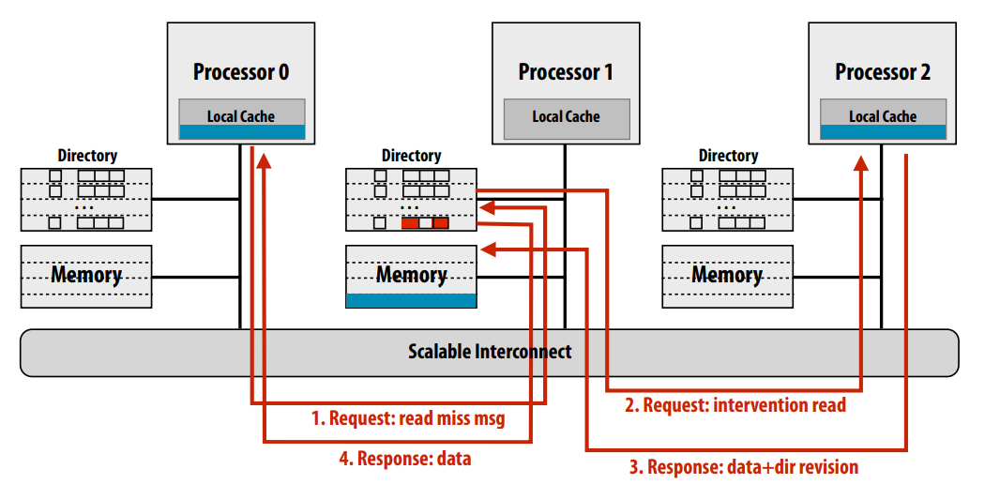

  新的方案总共只需要4次总线事务，减少了总线的流量；但是关键路径上事务的数量和之前的方案一样，延迟没有改变

- Request forwarding：此方案是：如果数据不在home节点中，那么由home节点去向owner节点请求数据，owner节点同时向请求节点和home节点发送数据，并且更新home节点的目录。此方案的关键路径上只需要三个事务（事务三和事务四可以并行），降低了延迟

  

  

  

### 实际架构（Intel i7）中缓存一致性协议

在一个CPU内部，**由于L3缓存是所有核共享的缓存，所以可以使用中心化的目录**，而不是像上面的NUMA架构一样，每个RAM一个目录。所有核共享一个目录，目录中**记录了所有L3 cache中缓存行的信息**，记录方式与上面一样，还是记录每个cache line的脏位和该cache line的存在位（在哪个L2 cache中），存在位还是使用one-hot的方式，所以四个L2 cache那么存在位就是四位


并且L2 cache之间使用环形互联（ring interconnect）而不是总线互联（bus），增加了总线的带宽

- 总线互联：所有的设备（如处理器核心、内存控制器、I/O设备等）都通过一条**共享**的电子信道（总线）进行通信，**只有一个设备能够在任何给定时间使用总线，每个设备都必须等待总线空闲才能通信**。
- 环形互联：各个处理器核心或节点通过一个闭合的环形结构相连。所以数据必须按照同一方向（顺时针或逆时针）沿环路传输。**环形互连支持多个设备并发通信，因为数据包可以在环上的不同段同时移动**。但是会有可能会增加点对点的通信延迟，因为数据需要经过更多的中间节点.

对于multi-socket系统来说，每个socket有多个core，socket内部的缓存一致性通过上面介绍的L3 cache中的目录维护。

多个socket之间通过**QuickPath Interconnect (QPI)** 互连通信。每个socket都连接一个RAM，有自己的内存控制器（Memory Controller）负责管理连接的RAM，在每个RAM中就像上面的NUMA架构一样，维护了此RAM的目录，用来维护整个系统的缓存一致性。**在Home Agent中包含一个16KB的目录缓存，用于管理和缓存RAM中的目录信息**


所以**结合两级目录机制**（L3目录和内存目录），Intel的multi-socket系统高效地管理了缓存一致性，降低了跨核和跨插槽的一致性流量。

## 原子（lock）指令如何实现

对于LOCK cmpxchg这样的指令，也就是compare and set，CPU是如何保持两个操作的原子性的？

早期的实现方式是bus lock（锁总线）：

- 由于想要cas的最新的数据可能存在于其他的cache中，所以光锁总线还不行，锁了总线只能保证其他核不对内存修改，但是他们还是可以在自己的cache中读到数据；所以需要**先invalidate其他核的cache中对应的cacheline，然后再激活LOCK引脚来真正地锁住总线，并在内存中（不经过cache）进行read-modify-write操作**

但是此方法会导致一个核进行原子指令的情况下，其他核的所有内存访问操作均无法进行，性能低下。因此后期Intel引入了cache locking，直接利用MESI确保原子性。cache lock本质上就是：

- 当前核先invalidate其他的核中的cache line，然后将数据加载到自己的cache中；然后延迟响应其他核对该缓存行的RFO/BusRd请求，待完成原子操作后再响应。

bus locking应尽量避免，其延迟极高（~1000 cycles）。

# Lecture 12 Snooping implementation

本节主要讲述基于嗅探的一致性协议如何实现

实现一致性协议要求缓存满足inclusion属性，即离处理器近的缓存中的数据一定全部被包含在离处理器远的缓存中；但是如果L1 cache和L2cache都只是使用简单的LRU策略，这个属性不一定会满足：因为如果命中了L1就不需要去访问L2了，所以L1和L2中维护的LRU是不一致的，当L1和L2都miss的时候，有可能导致L1和L2驱逐出去的cache line是不一样的。


解决方案是：当一个cache line从L2中驱逐出去的时候，一定也要从L1中驱逐出去：为L2中的每个cache line添加一个标志位，表明这个cache line是否存在于L1中，如果存在，那么invalidate L2的cache line时，也要invalidate L1的cache line。


还有一个问题：由于有多级缓存，并且是write back的，那么L1的内容和L2的内容可能不一致，L2中的数据有可能是modified的，但是依然不是最新的状态；**那么L2中需要再添加一个标志位，表明“modified but stale”，当其他处理器向L2请求这样的数据的时候，L2 cache必须从L1 cache获取最新的数据**。


死锁和它的四个必要条件：


活锁：死锁是指多个并行程序由于相互抢占资源导致全部卡住无法执行任何操作；活锁是一个系统在响应某些事件时，虽然处理器或线程没有被阻塞（即它们处于活动状态），但程序的整体状态却没有向前推进。比如并行程序全部都abort然后retry，但是步调太一致导致又陷入死锁，只能不停地abort和retry。

- 这种思想在很多调度算法中都存在，比如在网络中使用的指数退避就是为了避免活锁，事务abort之后不是马上retry，而是随机等待一段时间再retry

## 基本实现（原子总线）

基本假设：

1. 一个处理器一次只能发出一个内存请求，必须要完成上一次的请求之后才能发出下一次请求
2. 处理器使用单级write back缓存
3. cache在执行任何一致性操作的时候可以让处理器stall
4. 系统总线是**原子性**的：总线上有一个仲裁器（arbiter），处理器想要使用总线需要向仲裁器提出请求，如果同时有多个处理器的请求，仲裁器只会授予其中一个处理器的访问权限；然后该处理器就可以在总线上发送命令和数据，接受方收到之后可以在总线上发送响应；然后下一个处理器才能通过仲裁获取总线访问权。在多处理器系统中，总线的原子性保证了一个总线事务在开始到完成期间不会被其他事务中断。


在cache中，Processor-side Controller负责管理处理器访问缓存，包括处理器对标签、状态和数据的查找。Snoop Controller负责处理总线嗅探请求，与其他处理器或内存协调缓存一致性操作。

由于处理器和总线两边的控制器都要查看cache的tag和state，为了避免数据竞争，cache中将tags和state复制两份，两端都可以访问；但是要确保两个副本的数据始终保持同步，在对tag和state进行修改时，要将另外一边的controller阻塞并且修改它的tag和state


处理缓存写回：写回（write back）操作涉及到两种总线事务，首先是由处理器请求的数据行，从内存加载到缓存中；然后如果缓存满了，需要将某一个脏数据行驱逐到内存中；但是写回内存的过程会比较慢，为了避免这一点，使用了写回缓冲区，将要被刷到内存的数据行放入写回缓冲区中，从而新的cache line可以立即加载到缓存中，不需要等待这个数据行实际写入到内存，然后处理器可以立即执行其他操作。写回缓冲区的内容可以在稍后的时间进行刷新，这通常是在总线空闲时进行，以减少对系统性能的影响。

带有写回缓冲区的cache：当cache收到的请求的数据在写回缓冲区中时，snoop控制器需要将写回缓冲区中的数据返回；在处理器那一边也有一个写回缓冲区，处理器在查找cache之前也要先在写回缓冲区中查找


cache在**自己的请求等待总线的时候必须能够处理其他cache的请求，并且还能够修改自己的已经发出的、正在排队的总线请求**：

- 如果P1和P2在cache中共享cache line A，二者都想修改A，于是都广播BusUpg信息；但是P1先分配到了总线，先升级为modified，P2收到BusUpg信息后尽管自己的请求在排队，它依然要把自己的cache line A invalidate，然后再把自己已经发出的请求改成BusRdX
- 如果cache在等待总线时不允许处理其他cache的请求，那么有可能会导致死锁：比如P1和P2互相持有对方请求访问的cache line

活锁的情况：P1和P2试图写入同一个缓存行B：

1. P1打算修改缓存行B，并希望获取该缓存行的独占访问权限，P1获取总线并发出总线读取和修改请求（BusRdX）
2. P2响应P1的操作并使其本地缓存中的缓存行B无效。
3. 在P1完成更新前，P2试图进行自己的更新，并再次请求独占访问，P2获取总线并发出BusRdX
4. P1响应P2的操作并使其本地缓存中的缓存行B无效。

解决方案：当一个写操作获得了对缓存行的独占访问权后，它必须被允许完成写入操作，然后才能放弃该缓存行的独占权。这样，任何一个处理器一旦开始写入，其他处理器就不能干扰这个过程，直到写入完成。

饥饿的情况：多个处理器竞争总线访问权，由于仲裁规则导致某些处理器永远得不到总线

## 非原子总线事务

原子总线要求处理器发送请求之后到接收到响应之间独占总线，即使这中间总线空闲了也不能分配给别的处理器。

分割总线事务的思想就是：每个总线事务都被分解成两个事务，一个是请求事务，一个是回复事务；其他的事务可以在这二者之间交错


# Recitation: Matrix-vector Product, OMP programming

openMP是线程编程的高级接口，可以通过对源代码添加注解实现并行


大多OpenMP编译制导语句作用于其后的一个结构块，结构块只能有一个入口和一个出口，


**编译制导指令大致分几类**：

1. 并行域指令： **生成并行域，即产生多个线程以并行执行任务，所有并行任务必须放在并行域中才可能被并行执行**，在并行域结尾还有一个隐式同步（barrier），后面还有子句（clause）用来说明并行域的附加信息，若有多个，则用空格隔开

   

   并行域还可以嵌套：

   

   默认情况下，嵌套并行（nested parallelism）是被禁用的，这意味着在一个并行区域内部的`#pragma omp parallel`指令将不会创建新的线程；它们将在已经存在的线程上执行。如果想启用嵌套并行来允许在一个并行区域内部创建新的线程，需要设置环境变量或使用运行时函数，如 `omp_set_nested(1)`

   启用嵌套并行后，每个嵌套的`#pragma omp parallel`区域都有可能创建额外的线程

2. 工作共享指令：**将任务划分和分配给多个线程并行执行**

   - omp for：负责循环任务的划分和分配

   - omp sections：指定一个并行区域，其中包含多个可并行执行的结构块

     

   - omp task：显式定义任务，放入任务队列等待线程池调度执行，所以是异步执行的

   **工作共享指令不负责并行域的产生和管理，必须使用#pragm omp parallel**，工作共享指令区域如果不放在并行域内，则只会被一个线程串行执行，和并行域一样，结尾处也有隐式barrier同步（也可以不同步，需用nowait子句） 

3. 同步指令：

   


## omp for

`#pragma omp parallel`中的parallel指令告诉编译器创建一组线程，括号内的范围就是并行域，**每个线程都要完整地执行一遍并行域中的所有代码**。比如下面的代码每个线程都将执行整个 `for` 循环，而不是循环被分割成多段，每段由不同的线程执行。

```c++
#pragma omp parallel
for(j=0;j<N;j++)
    A[j] = (double *)(A+N) + j*N;
```

`private(i)`子句确保每个线程都有自己的`i`变量的副本，而`shared(n)`表示所有线程共享变量`n`。紧跟着的`#pragma omp for`指令会将每个循环迭代自动分配给所有线程，每个线程执行函数`work(i)`。

```c++
#pragma omp parallel private(i) shared(n)
{
    #pragma omp for
    for(i=0; i < n; i++)
        work(i);
}
```

for和parallel的关联是：

下面的两种写法等价，上面的代码块使用了两个openMP指令，首先使用`#pragma omp parallel`创建一个并行区域，然后在这个并行区域内部使用`#pragma omp for`将for循环的迭代分配给不同的线程。

下面的代码将这两个指令合为一个，`#pragma omp parallel for`同时声明了并行区域和循环的并行化，这是OpenMP提供的一种简写方式，它减少了代码行数并直接指定了循环应该并行执行。

```C++
#pragma omp parallel
{
    #pragma omp for
    for (int i = 1; i < N-1; i++)
        a[i] = (b[i+1] - b[i-1])/2h;
}
#pragma omp parallel for
for (int i = 1; i < N-1; i++)
    a[i] = (b[i+1] - b[i-1])/2h;
```

### 子句

`collapse(3)`：`collapse`子句是一个扩展，它可以进一步优化嵌套循环的并行执行。`collapse(3)`告诉OpenMP编译器将接下来的三层嵌套循环“折叠”为单个迭代空间，并行执行。这意味着循环将被展开并合并为一个较大的一维循环，其迭代次数为三个循环界限的乘积，从而允许更多的迭代可以在不同线程之间同时进行。

在不使用`collapse`的情况下，只有最外层的循环（即`i`循环）会被并行化。而使用`collapse(3)`子句后，三个循环`i`、`j`和`k`都将并行化，创建了一个单一的迭代空间，使得所有的`N * M * L`次迭代都可以并行执行。

#### 数据环境

变量生命周期：

- 声明在并行区域之外的任何变量默认为所有线程共享。
- 在并行区域内部声明的变量默认为私有。
- 实际编程中建议使用`shared`和`private`声明覆盖这些默认设置，因为可以作为代码的文档说明，使得代码更加清晰，可读性更强。

```c++
int main (int argc, char *argv[]) {
	double a[N], b[N], c[N];
	int i;
	#pragma omp parallel for shared(a,b,c,N) private(i)
		for (i=0; i < N; i++)
			a[i] = b[i] = (double) i;
}
```


private子句声明的变量在进入和退出并行域时是未定义的，即：并行区域内的private变量和并行区域外的同名变量没有任何关联；进入并行域内需要对其进行初始化，退出并行域后不会影响外面的同名变量

可以使用firstprivate和lastprivate子句来改变这种属性


threadPrivate指令声明的变量在整个线程的生命周期中都存在，即使出了并行域，然后再进入另一个并行域，该变量依然存在


即使并行化一个循环会破坏代码的正确性（每次循环之间有数据依赖），OpenMP仍会根据指令并行化循环。

比如下面计算斐波那契数列的C++代码片段，其中使用了OpenMP指令来并行化计算，但是这是不正确的

- 因为斐波那契数列的计算有数据依赖性：每个元素的值依赖于前两个元素的值。如果这个循环被并行化，那么不同线程在计算`fib[i]`时可能会读取到尚未计算或者正在被其他线程修改的`fib[i-1]`或`fib[i-2]`的值，从而产生错误的结果。

```c++
int* fib = new int[N];
fib[0] = fib[1] = 1;
#pragma omp parallel for num_threads(2) # 2个线程的线程池被创建
for (i=2; i<N; i++) {
    fib[i] = fib[i-1] + fib[i-2];
}
```

默认情况下OpenMP会在循环之间插入一个屏障来处理依赖性问题。屏障确保所有线程在继续执行下一个循环之前，都完成了当前循环的迭代。

但是在下面的代码中使用了nowait：

- 第一个循环**使用了`#pragma omp for nowait`，这意味着OpenMP不会在这个循环的迭代之间自动插入屏障来同步线程**。这可能会导致第二个循环开始执行之前，第一个循环还没有完全完成，从而产生错误的结果。
- 第二个循环依赖于第一个循环的结果。如果第一个循环的某些迭代还未完成，那么第二个循环可能会得到错误的值，导致最终结果不正确。

```c++
#pragma omp parallel
{
    #pragma omp for nowait
    for (int i = 1; i < N-1; i++)
        a[i] = (b[i+1] - b[i-1])/2h

    #pragma omp for
    for (int N-2; i > 0; i--)
        b[i] = (a[i+1] - a[i-1])/2h
}
```

在某些应用中，我们需要将一组值归约（reduce）为单个全局值，比如计算一系列数字的和。这是一种常用的并行计算模式，它**将所有线程的结果组合起来得到一个单一的输出**。

`reduction(&:done)`表示在并行区域内将所有线程的局部变量`done`合并成一个全局值，合并方式是逻辑与（AND）操作。

- 在并行执行之前，OpenMP为每个线程创建了`done`变量的**私有副本**，并将它们初始化为`true`。而不是让每个线程直接对全局的done变量操作，因为这会导致大量的同步操作和锁的争用
- 当`for`循环内的条件`if (Keys[i] > Keys[i+1])`为真，每个线程的局部`done`变量会执行`done &= false;`
- **一旦所有线程完成了它们的迭代，OpenMP归约机制会自动使用逻辑与操作合并所有线程的局部`done`变量，并将结果存储在原始的`done`变量中**。

```c++
int Sweep(int *Keys, int N, int OE) {
    bool done = true;
    #pragma omp parallel for reduction(&:done)
    for (int i = OE; i < N - 1; i += 2) {
        if (Keys[i] > Keys[i+1]) {
            swap(Keys[i], Keys[i+1]);
            done &= false;
        }
    }
    return done;
}
```

任务分配：

- `schedule(static)`：**在没有指定块大小的情况下，OpenMP将整个迭代范围平均分配给并行域内（parallel指定的代码范围）所有参与的线程**。例如，如果有100个迭代和4个线程，每个线程将分配到25个连续的迭代。下面的代码中上下两种写法等价

  ```c++
  #pragma omp parallel shared(a,b)
  {
      #pragma omp for schedule(static)
      for (int i=1; i < N-1; i++)
          a[i] = (b[i+1] - b[i-1])/2h
  }
  #pragma omp parallel for shared(a,b) schedule(static)
  for (int i=1; i < N-1; i++)
      a[i] = (b[i+1] - b[i-1])/2h
  ```

- `schedule(dynamic)`：动态分配会将任务切成更小的块，给每个核心一个块，然后当它完成时再给他另一个块

- `schedule(static, 2)`：指定了一个具体的块大小，这里是2，意味着每个线程将会以大小为2的块来分配迭代。如果有100个迭代和4个线程，每个线程将首先得到2个迭代，然后是下一个线程得到接下来的2个迭代，如此循环往复，直到所有迭代被分配完毕。

  ```c++
  #pragma omp parallel for schedule(static, 2)
  for (int i = 0; i < n; i++) {
      for (int j = 0; j < n; j++) {
          do {
              z = z^2 + c;
          } while (abs(z) < 2)
      }
  }
  ```

- `schedule(dynamic, 2)`：循环的迭代将动态地分配给线程，每次分配2个迭代；哪个线程执行完了就提前分配下一块

  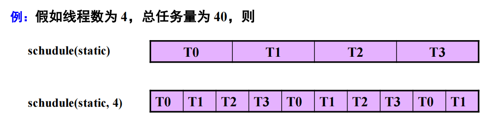

就如同之前所讨论的一样，如果工作密度是保持不变的，那么使用静态分配更好；如果工作密度是一个变量，那么使用动态分配更好

对于NUMA系统上的并行程序，我们通常在并行区域外分配堆存储（heap storage），在并行区域内初始化它，因为**这可以尽量确保内存被分配到与执行初始化的CPU核心相同的本地节点**

- 因为堆增长的sbrk系统调用通常使用按需分配的方式，也就是只增长虚拟地址空间不分配物理内存，malloc时也不会分配物理内存（malloc不会访问自己所分配的空间，只会访问很小的一部分overhead）。只有当第一次访问malloc得到的内存页时，会触发pagefault，操作系统会尽可能在与发出请求的CPU核心相同的RAM节点上分配物理内存，并映射到虚拟地址。这称为“首次接触”（first touch）策略。

  因此，如果在一个并行区域内初始化数据，这样每个线程就很可能在各自的本地NUMA节点上获得物理内存。这有助于之后的内存访问效率，因为每个核心都在访问它的本地内存，而不是远程节点上的内存。

- 问题：

  1. 由于物理内存分配的粒度，一个page内的数据一定会被分配到同一个NUMA节点
  2. 由于free是不会取消物理内存到虚拟内存的映射的，那么如果另一个核的线程又在free的位置malloc了一个page，对应的物理内存还是在之前的核的NUMA节点上。（除非物理内存不足，导致这个虚拟页的数据被驱逐到磁盘上了，再次访问此位置又会触发一次pagefault，重新分配与执行初始化的CPU核心相同的NUMA节点来存放数据（一种被动的数据迁移））

- 也就是说，对于NUMA架构的多线程程序，不同线程访问的全局数据最好是按块分配的，并且一块最好要大于pagesize（注意，对于SIMD程序，数据则最好是交错分配的）

```c++
double **A;
A = (double**) malloc(sizeof(double*)*N + sizeof(double)*N*N);
assert(A);
#pragma omp parallel private(i) shared(A,N)
for(j=0;j<N;j++)
    A[j] = (double *)(A+N) + j*N;
#pragma omp parallel private(i,j) shared(A,N)
for(j=0; j<N; j++)
    for(i=0; i<N; i++)
        A[i][j] = 1.0 / (double)(i+j-1);
```

## omp section


## omp task

显式定义任务，放入任务队列等待线程池调度执行，所以是异步执行的


比如下面的代码，要实现遍历链表并且对每一个元素进行处理，**遍历链表必须串行，但是处理元素可以是并行的**，就可以使用omp single遍历链表，再使用omp task包装对元素的处理函数

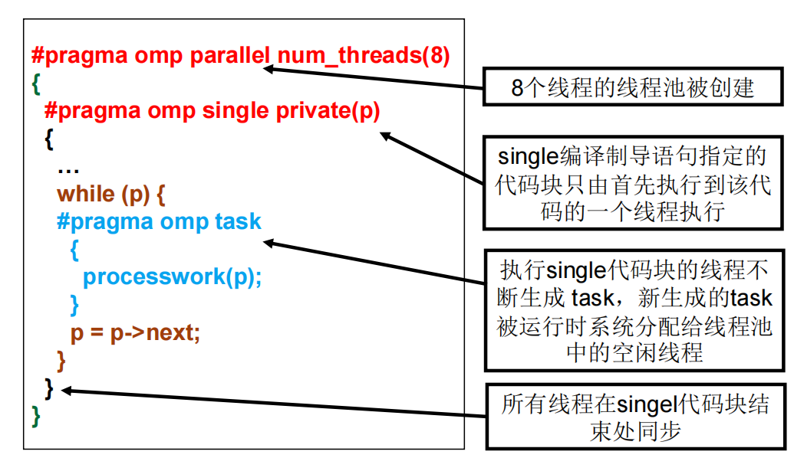


绑定的任务是指这个任务只能由被绑定的线程执行，但是这个线程还可以切换到去执行其他的任务


线程L是绑定的任务，为什么会发生任务切换？


## 同步指令

使用`#pragma omp single`指令，可以指定接下来的代码块只由单个线程执行，如果是在并行域内的话，通常是由第一个执行到该代码的线程执行，这里是计算`M = A[N/2];`。


我们可以给critical临界区命名，不同的临界区之间如果名字相同则不需要互斥


barrier制导语句用来同步一个线程组中所有的线程，先到达的线程在此阻塞，等待其他线程。所以要么所有线程都能遇到barrier，要么没有线程能遇到barrier，否则会造成死锁

在parallel、for和single结构块后，有一个隐式barrier存在，for和single结构块的隐式barrier可通过nowait子句去除

ordered制导语句指出其所在并行循环的执行，**任何时候只能有一个线程执行，且要按照线程ID顺序执行**。只能出现在for或者parallel for语句的动态范围中


## 库函数和环境变量

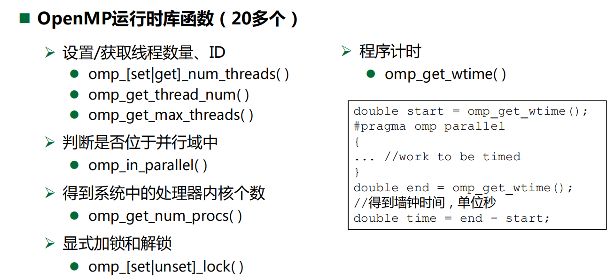


## OpenMP和ISPC task的区别

OMP通常在for循环上使用 `#pragma omp parrallel for`，因此每一层for循环就相当于ISPC中的一个程序实例，由一个线程执行。for循环中的index i就相当于ISPC中的 `programIndex`，for循环的总数就相当于ISPC中程序实例的总数 `programCount`，并行域中线程的个数就相当于ISPC中线程的个数。

但是OMP还有很多其他的用法，因此OMP比ISPC task要灵活；ISPC最大的用处可能就是ISPC gang了，可以更方便地写SIMD

ISPC task框架的基本原理：

创建任务队列，将num_total_tasks个任务塞入队列中，再创建num_threads个线程，由线程去队列抢任务，直到任务做完

- 这种方式实际上就是os内核进程调度的方式，进程的free_list实际上就是一个任务队列，等待cpu的核去调度
- 这实际上是任务分配的两种不同的层级，**在用户层面，ISPC task框架或者TBB中有一个线程池，有很多内容差不多的任务（程序实例），框架负责调度任务运行在不同的线程上；在系统层面，OS中有多个物理核心，有很多内容不同的线程，OS负责调度线程运行在不同的物理核心上**

# Lecture13 Memory consistency

并行内存层次结构中的正确行为：

1. 直观上，我们认为读取一个内存位置应该返回“最新”写入的值（由任何线程写入）。
2. 但是，“最新”的定义是什么？：
   - 在单个线程内，“最新”可以通过程序的顺序来定义。
   - 在多线程之间，“最新”就变得不那么清晰。它是否指物理时间上的最近写入？但是这不太可能，因为硬件无法实现这种即时通信。例如，如果处理器之间通信需要超过10个周期，那么处理器0就无法知道处理器1在2个时钟周期前做了什么。

任何**特定线程内的写操作必须与程序顺序一致**，跨线程的写操作必须与线程的合法交织一致。

- 在多线程环境中，**读取操作可能以非直观的方式返回值，这取决于线程的实际交织方式，而非单个线程内的程序顺序（多线程也无法确定程序顺序）或物理时间顺序**。

- 在单线程中，程序员通常期望指令会按照它们在程序中出现的顺序执行。这意味着如果程序先写入变量A然后写入变量B，接着读取A和B，它期望看到的是最近写入的值。

这叫做顺序一致性（SC），SC 模型认为多线程执行的结果应该就像是将每个线程的操作顺序交错进行，就好像它们在单核处理器上轮流执行一样。

但是在实际上，**即使在单个线程中，实际的读写顺序与程序的顺序也是不一致的**，这样做主要是为了隐藏内存访问的延迟，比如：

1. write buffer：当处理器要向内存写入数据时，需要先把这个写操作放入write buffer队列中，然后硬件（包括缓存）负责将write buffer中的操作写入内存，但是处理器认为该操作在放入write buffer中时就已经完成了。与之前的write back buffer一样，处理器在读内存的时候也要查看一下write buffer中是否有自己要读的数据，如果有就从buffer中读取，而不是从cache中读取。

   write buffer不是一个cache，而是类似一个工作队列，存储了处理器要做的工作

   这就导致了在程序顺序中先发生的write A操作很有可能在后发生的read B操作之后完成（完成指的是完成对内存系统的修改，从而使得其他处理器可见。内存系统包括主存和缓存？）

   

2. 乱序流水线：当一个指令执行卡住时（比如指令cache miss了），可以乱序执行后面的**没有依赖的**指令。这也导致对内存系统的实际操作顺序不一定是程序的顺序（乱序发射似乎能保证程序的结果依然是顺序一致性的？）

   

3. 分支预测

4. 编译器进行指令重排，通过寄存器分配和代码移动等优化来改变指令的执行顺序（这个似乎不是内存一致性负责解决的问题？）

缓存一致性是指当多个处理器缓存同一内存地址时，这些缓存的副本保持一致（即内存中同一个地址中的内容在所有处理器看来都是一致的）；而内存一致性是指不同处理器上的内存操作（加载和存储）如何在处理器之间有序地展现，它决定了一个处理器的内存操作如何对其他处理器可见，以及这些操作如何相互关联。

顺序一致性：要求所有处理器上的操作都按照一定的全局顺序执行，**这个顺序与程序的顺序一致**。这意味着处理器可以缓冲写入，但必须以某种全局一致的顺序对它们进行排队和提交。

在顺序一致性中，下面的xy结果不可能出现(1,0)，因为按照程序的顺序，如果ready的值是1，那么A的值也一定是1


实现顺序一致性的方式：

1. **实施缓存一致性**：
   - 这是确保所有处理器看到对同一位置的写入操作按相同顺序发生。
2. **延迟内存访问的开始**：
   - 对于每个处理器，要延迟一个内存访问的开始，直到前一个访问完成。这意味着在任何时候，每个处理器只能有一个未完成的内存访问。这样做可以避免操作重叠和顺序不一致的问题。

在顺序一致性模型中，“内存访问完成”通常意味着：

- **对于写操作**：该操作已经更新了内存，并且该更新对所有处理器可见。这可能涉及将写入传播到所有相关缓存和确保不会有进一步的write buffer。
- **对于读操作**：读取操作已经返回了一个值，这个值是基于所有处理器共同认可的内存状态。

顺序一致性（Sequential Consistency）的替代内存模型：

全存储排序（Total Store Ordering, TSO）

- **TSO**：这是一个相对宽松的内存模型，允许读操作在某些写操作之前完成，即读操作可以超越写操作。这种模型通常用于像Intel这样的处理器架构中。
- 特点
  - 读操作后面的写操作可以重排到前面。
  - 写操作后面的读操作不会重排到前面。
  - 两个写操作之间的顺序保持不变。

部分存储排序（Partial Store Ordering, PSO）

- **PSO**：这是一个更宽松的内存模型，它进一步放宽了对存储操作的排序约束。
- 特点
  - 读操作之间的顺序保持不变。
  - 写操作后面的读写操作可以重排到前面。
  - 读操作后面的写操作可以重排到前面。

我们在实际编程中不需要这么严格的内存序，有些指令不按照程序顺序执行也能保证程序的正确性，如果对每个读写操作都要求顺序一致性那么程序的效率会非常低下，并且也是不必要的。

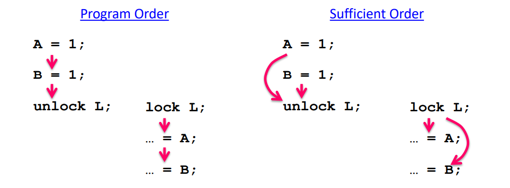

我们使用同步操作来构建内存屏障，在同步操作之间，没有依赖的指令可以按照任意顺序执行，在同步操作之后，线程必须等待所有之前的操作完成，才能执行后面的指令，使得执行结果与顺序一致性模型（Sequential Consistency, SC）下的执行相同。这种优化策略被称为“弱排序”，它允许在保持线程内部依赖性的情况下对内存操作进行一定程度的重排序。

intel提供了内存屏障的指令为MFENCE，此指令的作用基本就是将线程stall，直到write buffer为空，也就是在此之前的所有写指令都已经完成，结果对所有的处理器都可见


使用内存屏障构建的正确的程序：


实际上，在加锁和释放锁时会包含内存屏障的操作

除此之外，处理器还提供了更小粒度的内存屏障，LFENCE和SFENCE，分别用来序列化load和store


所以我们不能使用普通的内存操作来进行同步，而是要使用处理器提供的特定的指令，比如xchg，此指令类似于test-and-set，将新的值写入变量，然后检查变量旧的值，并且这个过程是原子性的，并且该指令还隐含了内存屏障，即它确保指令执行时，之前的所有内存操作都已完成，并且该指令完成后，才执行之后的内存操作


内存屏障不仅是针对处理器来防止指令在运行时的乱序执行，也用于告诉编译器它不能在生成最终机器代码时改变带有屏障指令前后的指令顺序。

# Recitation: OMP & MPI

mpi和cuda一样，也是SPMD的程序，同样的程序在多个进程上运行


MPI是一个消息传递的接口，是一个规范，而不是某个具体的实现或语言


MPI的基本概念：

1. 进程组：是全部MPI进程的一个子集，进程组中每个进程被赋于一个在该组中唯一的序号(rank)，用于在该组中标识该进程。
2. **上下文（Context）**：每个消息传递都发生在一个上下文中。上下文是一个环境，它为通信提供了独立的空间，确保消息的传输不会与其他上下文中的消息混淆。
3. **通信域（Communicator）**：一个组和一个上下文共同形成了一个通信域，它定义了一组可以相互通信的进程集合以及它们通信的上下文。通信域分为组内通信域和组间通信域，分别用来实现MPI的组内通信和组间通信，多数 MPI用户只需进行组内通信。**任何MPI通信函数均必须在某个通信域内发生**
4. **默认通信域**：MPI提供了一个默认的通信域，称为`MPI_COMM_WORLD`，它包含了所有初始的进程（程序启动时创建的所有进程），在执行了MPI_Init函数之后自动产生。MPI_COMM_SELF是每个进程独自构成的、仅包含自己的通信域


在并行程序中，通常需要知道有多少个进程在执行计算任务和当前进程的标识，MPI也提供了这样的接口

- **`MPI_Comm_size`**：这个函数返回参与特定通信域（communicator）的所有进程的数量。这个信息通常用于确定需要在多少个进程之间分配任务和数据。
- **`MPI_Comm_rank`**：这个函数返回调用进程在其通信器中的等级（或编号）。等级是从0开始的唯一整数，用于区分每个进程。


由于MPI是设计用于异构环境的，不同的设备之间的基本数据类型的大小可能不一样，所以MPI有自己的数据类型，对应于编程语言中的基本数据类型，如`MPI_INT`对应于整型，`MPI_DOUBLE_PRECISION`对应于双精度浮点型。

在MPI中，发送或接收消息时，数据是由三元组（地址，数量，数据类型）来描述的。这个三元组确保了消息传递时数据的正确解释。

MPI 还提供了函数来构建自定义数据类型，这对于处理非标准的数据结构非常有用。例如，你可以创建一个包含成对整数和浮点数的自定义数据类型，或者描述按列存储的矩阵的数据布局。

MPI 标签（Tags）：

- **功能**：在MPI中，消息传递时可以附加一个用户定义的整数标签，这有助于接收进程识别消息。标签为消息传递提供了一个额外的维度，使得接收进程可以根据不同的标签区分和选择性地接收消息。
- **筛选消息**：接收端可以通过指定特定的标签来筛选消息。如果接收端对标签没有特定的要求，它可以使用`MPI_ANY_TAG`来接收任何标签的消息。
- **通用性**：在一些非MPI的消息传递系统中，可能会有类似的概念被称为"message types"。在MPI中，为了避免与数据类型（datatypes）混淆，统一使用“tags”这个术语。

MPI的基本的send和receive函数：


`MPI_SEND`是一个阻塞函数，阻塞发送意味着函数在数据被系统接受到发送队列之前不会返回。一旦函数返回，**它表示数据已经被系统接受用于发送，发送缓冲区可以被重用。但是这并不意味着目标进程已经接收到消息，只是说发送操作已经开始**


`MPI_RECV` 是一个阻塞函数，它会一直等待，直到接收到一个匹配的消息（即源和标签与指定参数相匹配的消息），之后才会返回。当函数返回时，数据已经被放置在指定的缓冲区中，缓冲区的内容可以被使用。

如果接收到的数据元素少于指定的 `count`，这是可以接受的。但如果接收到的数据元素超过了 `count`，则会产生错误。

对于非阻塞的send和receive函数，发送或者接收的请求会被排队，然后进程可以继续做自己的事情。


## 点对点通信


在同一台机器上同步通信：由于两个进程已经同步好了，所以通信时不需要内核缓冲区，os直接把消息从进程A的地址空间拷贝到进程B的地址空间，那么当消息被拷贝完的时候调用就可以返回了；缓冲通信则类似于管道，操作系统先把进程A的内容拷贝到内核缓冲区，然后等进程B准备好了之后再从内核缓冲区拷贝到进程B的地址空间；

在跨机器进行MPI通信时，无论是同步通信还是缓冲通信，都需要通过网络来传输数据，所以不可避免地会使用到内核的网络缓冲区

- 同步通信：发送方和接收方先进行三次握手，然后：

  1. 发送方发起通信，并将数据发送到自己的内核缓冲区。
  2. 数据被发送到网络上。
  3. 接收方的内核接收数据，放到内核缓冲区。
  4. 接收方通过MPI接收调用取得数据，完成同步过程。

  即使使用了内核缓冲区，**发送方通常在整个发送过程结束前会处于阻塞状态，直到数据被确认为已经被接收方的应用层所接收**（？）。

- 缓冲通信：

  1. 发送方发起通信，并将数据发送到自己的内核缓冲区。
  2. 发送方的MPI调用返回，进程可以继续执行其他任务。
  3. （三次握手）数据被发送到网络上。
  4. 接收方的内核接收数据，放到内核缓冲区，等待应用层调用接收。

  在这个过程中，发送方不需要等待接收方准备好就可以继续执行，因为数据已经被复制到了内核的缓冲区中

同步通信通常用于确保严格的顺序和时序，当计算的正确性依赖于数据到达的顺序时这是很重要的。缓冲通信则更加灵活，它允许发送方进程在不阻塞的情况下继续执行


编写MPI程序如果通信调用的顺序使用的不当很容易造成死锁


所以为了避免死锁，最好使用下面的接口将数据的发送和接收捆绑

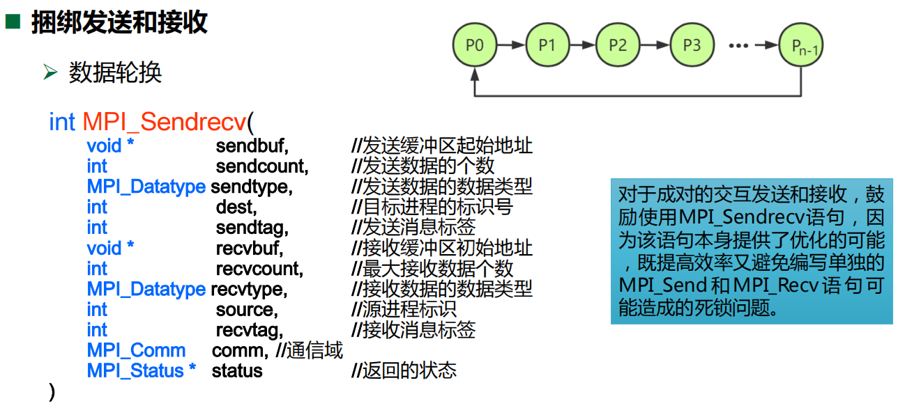


## 非阻塞通信


发送的完成：代表发送缓冲区中的数据已送出，发送缓冲区可以重用。它并不代表数据已被接收方接收，数据有可能被缓冲；

接收的完成：代表数据已经写入接收缓冲区，接收者可访问接收缓冲区

`MPI_Wait`和`MPI_Test`提供了同步非阻塞操作的手段：


非阻塞通信可以实现计算与通信重叠，所以效率较高


比如可以将发送和接收缓冲区都分成两半，一半用来存储这一次的输入和下一次的输入，一半用来存储上一轮的计算结果和这一次的计算结果；每一次循环，先异步接收下一次的输入和异步发送上一次的计算结果；然后计算当前输入的结果，并将其存在当前的计算结果的缓冲区中；计算完毕后等待异步通信的结束；然后进入下一轮


MPI_probe类似于MPI_recv，但是**它只用于查询是否有满足符合特定源和标签的消息到达，并且获取消息的status，而不接受实际的消息**。这可以让程序在消息到达时对其大小和来源进行检查，而不从系统的消息队列中移除该消息。这**通常在接收方需要为即将到来的消息分配适当大小的缓冲区时非常有用**。

- **阻塞操作**：如果没有满足条件的消息，`MPI_Probe` 会阻塞调用进程直到一个匹配的消息到达。
- **非阻塞版本**：MPI 也提供了非阻塞版本 `MPI_Iprobe`，它立即返回并通过一个标志指示是否有消息到达


## 集合通信


带上All的表示把结果传递给所有进程


## 进程组和通信域管理


矩阵乘法的实现：

以下分别是密集矩阵、向量和稀疏矩阵的实现：


稀疏矩阵的压缩行存储（Compressed Sparse Row, CSR）格式，定义了一个名为 `csr_t` 的结构体，包含以下字段：

- `nrow`：矩阵的行数，这里假定矩阵是方阵，所以行数也等于列数。
- `nnz`：矩阵中非零元素的数量。
- `value`：指针，指向一个数组，该数组存储了矩阵中所有非零元素的值，按行优先顺序排列。
- `cindex`：指针，指向一个数组，该数组存储了每个非零元素对应的列索引。
- `rowstart`：指针，指向一个数组，该数组存储了每行非零元素在 `value` 数组中的起始位置。它的大小通常是行数加一（`nrow+1`），因为需要多一个元素来表示最后一行之后的结束位置。例如，`rowstart[i]` 是第 `i` 行非零元素的开始位置，而 `rowstart[i+1]` 是第 `i` 行非零元素的结束位置（实际上是下一行的开始位置）。

对稀疏矩阵和一个向量进行相乘，这里直接跳过了为0的数，因为对结果不产生任何影响：


后面还有使用OMP进行矩阵乘法的内容


# Lecture 14 Performance Measurement and Tuning

top指令：

```
top - 15:20:01 up 1 day,  3:13,  2 users,  load average: 0.00, 0.01, 0.05
Tasks: 193 total,   1 running, 192 sleeping,   0 stopped,   0 zombie
%Cpu(s):  2.5 us,  0.8 sy,  0.0 ni, 96.5 id,  0.1 wa,  0.0 hi,  0.1 si,  0.0 st
MiB Mem :   7976.1 total,   4567.3 free,   1962.6 used,   1446.2 buff/cache
MiB Swap:   4096.0 total,   4096.0 free,      0.0 used.   5583.5 avail Mem 

  PID USER      PR  NI    VIRT    RES    SHR S  %CPU %MEM     TIME+ COMMAND     
12345 user1     20   0  457924  11204   9008 S   0.3  0.1   0:00.89 gnome-shell 
23456 user2     20   0 1325672 113456  34567 S   0.1  1.4   0:02.13 firefox     
...
```

1. **头部信息**:
   - `up 1 day, 3:13`：系统已经运行了1天3小时13分钟
   - `2 users`：当前有2个用户登录系统
   - `load average: 0.00, 0.01, 0.05`：系统在过去1分钟、5分钟、15分钟的平均负载
2. **任务（进程）信息**:
   - `193 total`：总共有193个进程
   - `1 running`：1个进程正在运行
   - `192 sleeping`：192个进程处于睡眠状态
3. **CPU使用情况**:
   - `%Cpu(s):`后面跟随的是CPU的使用情况分布
   - `2.5 us`：用户空间占用CPU的百分比
   - `0.8 sy`：系统空间占用CPU的百分比
   - `96.5 id`：空闲CPU百分比
   - `0.1 wa`：等待输入输出的CPU时间百分比（I/O Wait）
   - `0.0 hi`：硬件中断
   - `0.1 si`：软件中断
4. **内存使用情况**:
   - `MiB Mem`和`MiB Swap`分别显示物理内存和交换空间的总量、使用量、空闲量以及缓冲或缓存量
   - avail Mem表示系统当前可立即分配给进程的内存量，不需要交换（swap）或进一步清理。
5. **进程列表**:
   - 每一行代表一个进程，显示了该进程的PID（进程ID）、用户、优先级（PR）、NI值（nice值，表示进程优先级的调整）、虚拟内存使用量（VIRT）、实际内存使用量（RES）、共享内存大小（SHR）、进程状态（S）、CPU和内存使用百分比（%CPU、%MEM）、累计运行时间（TIME+）和命令名（COMMAND）
   - %CPU的含义：如果一个系统有4个CPU核心，一个进程同时在这4个核心上各自使用了25%的CPU时间，那么该进程的总CPU使用率将会是100%（4核心 x 25%）
   - RES的含义：Resident Set Size（常驻内存集大小），指进程当前在物理内存中占用的部分，不包括被交换出去的内存部分，也不包括只在磁盘上的部分
   - **注意，`top`命令通常以KiB为单位显示进程的内存使用量（除非特别配置），而总内存使用情况可能以MiB为单位显示**

time指令：在命令行中将`time`放在你想要测量执行时间的命令之前，比如 `time ls`

输出通常包含三个部分：

- `real`：从开始到结束的总时间，即墙钟时间；包括其他所有进程的执行时间和当前进程在等待系统资源（如CPU和IO）时花费的时间
- `user`：程序在用户模式下执行的时间；即程序执行自己的代码所消耗的时间。
- `sys`：CPU执行内核操作（如分配内存、I/O操作）为当前程序服务所消耗的时间。

使用 `/usr/bin/time -v ls`可以显示`ls`命令的详细执行时间和资源使用情况。

common case=hot code

GProf用法：

1. 在编译程序时，使用 `-pg` 标志来启用GProf的性能分析功能。这会导致编译器在编译过程中为每个函数调用插入额外的代码，用于收集运行时性能数据。
2. GProf插入的代码会记录每个函数的调用图（call graph），这包括函数之间的调用关系和调用次数。它还会记录每个函数消耗的时间，通常是在函数进入时和退出时记录时间，从而计算出函数的执行时间。收集的性能数据将被存储起来，通常在程序结束后存储在一个名为 `gmon.out` 的文件中。
3. 运行结束后，使用 `gprof <程序名>` 命令来分析性能数据。GProf会读取 `gmon.out` 文件，并输出程序的性能报告，这通常包括函数的调用次数、执行时间和其他有用的性能指标。

`perf` 可以访问 CPU 的性能计数器

- **perf list**：列出系统上可用的性能计数器。
- **perf stat**：统计特定事件（如缓存未命中、分支预测错误等）的发生总次数。
- **perf record**：记录性能事件，以便后续分析。
- **perf report**：浏览 `perf record` 命令收集的数据。

`perf stat` 可以指定一组特定的事件来运行，并收集这些事件的统计数据。在使用 `perf stat` 时，你可以通过 `-e` 选项指定一个或多个事件。该命令可以用来分析特定的程序运行情况。


valgrind和address sanitizer可以用来检测内存泄漏，前者用于可执行文件（二进制文件），后者在编译过程中添加一个编译选项即可


# PCIE

PCIe（Peripheral Component Interconnect Express）通道是一种扩展总线标准，用于连接主板上的硬件设备。它被设计来替代旧的PCI、PCI-X和AGP总线标准。

PCIe通信是基于点对点架构的，这与**早期的PCI总线的共享总线架构**不同。**在PCIe架构中，每个设备都直接连接到主板的芯片组或CPU**，每个PCIE连接由一个或多个“通道”组成，每个通道由四根电线组成（两对双绞线），一对用于发送数据，另一对用于接收数据。通道的数量可以是1、2、4、8、16或32。链路的性能取决于其包含的通道数量。

更多的通道意味着更高的数据传输速率。例如，PCIe 3.0的每个通道提供的最大理论带宽约为1GB/s，因此，一个PCIe 3.0 x16插槽的最大理论带宽约为16GB/s。

- **PCIe x1**：最基本的配置，有一个通道。适用于带宽需求较低的设备，如声卡或网络接口卡。
- **PCIe x4**：有四个通道。常用于SSD等存储设备。
- **PCIe x8**：有八个通道。在某些高速网络卡和存储控制器上较为常见。
- **PCIe x16**：有十六个通道。这是最宽的配置，通常用于图形处理单元（GPU）等带宽需求最高的设备。

显卡带宽可以从两个方面来理解：PCIe接口的带宽和显卡内部的内存带宽。

- **PCIe接口的带宽是指显卡与主板之间通过PCIe通道进行数据传输的最大速率**，PCIe 3.0 x16接口提供的最大理论带宽大约为32GB/s（双向总计），而PCIe 4.0 x16接口的最大理论带宽则是大约64GB/s（双向总计）。
- 显卡内部的内存带宽是指显卡处理器（GPU）与显卡上的显存（如GDDR6或HBM2）之间的数据传输速率。例如，一个拥有256位数据接口和14Gbps时钟速率的GDDR6显存的显卡可以提供超过448GB/s的内存带宽。

对于大多数应用，特别是高端游戏和专业图形工作负载，显卡内部的内存带宽是一个更关键的性能指标，因为它直接影响到GPU处理数据的能力。而PCIe接口的带宽则更多地影响到显卡与系统其他部分（如CPU和系统内存）之间数据交换的速度。然而在涉及到大量数据传输的场景中，例如在使用GPU进行深度学习训练时，更高的PCIe带宽（如通过PCIe 4.0或5.0）可以提供更好的性能

# 嵌入式

MCU只能进行简单的控制，而MPU可以进行数值运算和运行操作系统

- 所以MCU只能支持单任务，一个任务执行完之后才能执行下一个任务（任务执行中间也可以执行中断处理程序） 
- MPU有操作系统，所以可以多任务


嵌入式的操作系统通常是实时操作系统（RTOS），对低延迟的要求很高

单片机虽然是一个芯片，但是它实际上具备计算机的功能；比如它包含RAM和ROM，而PC的CPU是不包含RAM和ROM的，通过总线与他们相连


通常寄存器和数据总线的长度决定了计算机的位数，与地址总线的长度无关；即使现在的64位计算机，地址总线还通常只有48位（但是指针却是64位，实际上并不是所有的位都用于寻址，只使用低48位来表示虚拟地址）

PC中的代码和数据都放在RAM中，取指和取数据都是从RAM中取；在CPU看来，代码和数据都是一样的，根据page的可执行位来判断是代码还是数据（软件来区分），并且采用分时访问，先取指，再取数据；这种是冯诺依曼架构

而单片机通常使用的是哈佛架构，数据和程序放在不同的存储器中（硬件来区分）


现代的计算机通常是二者混合的，内存采用冯诺依曼架构存储，cache采用哈佛架构存储，分为指令cache和数据cache

可重入函数也可以理解为可以递归调用的函数。可重入函数一定是并发安全的，并发安全的函数不一定是可重入的


嵌入式的mcu或者移动式的arm处理器的集成度通常较高，将外设和io都集成到一个芯片上，而正常的pc的cpu就仅仅是中央处理器，除此之外还有其他的设备


# 矩阵乘法


前提：我们的矩阵比8宽的多


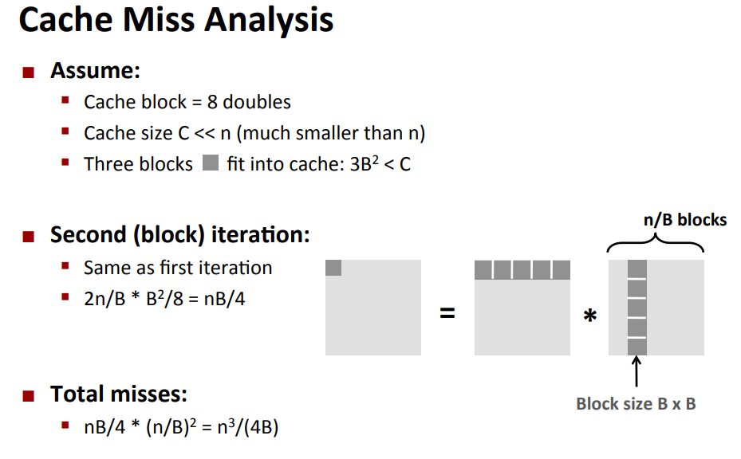

矩阵分块转置：假设缓冲块的大小是8字节，那么转置完1和2之后不应该继续转置3和4，而是转置5和6，因为1和2转置完之后写入B中会把两个缓存块带入cache，而转置5和6之后刚好可以放在这两个缓存块中；所以需要一块一块地转置


# Nvlink

Nvlink主要用于连接GPU（图形处理器）之间、GPU与CPU之间，以及GPU与其他设备之间。相比传统的数据传输方式（如PCIe），Nvlink能够显著减少数据传输的瓶颈，提高系统整体的效率。
