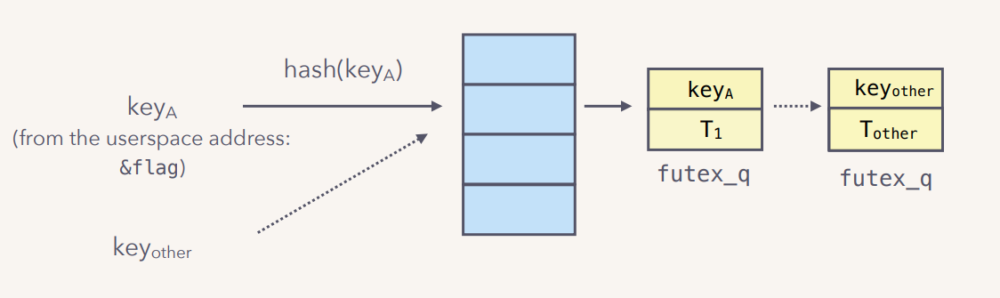
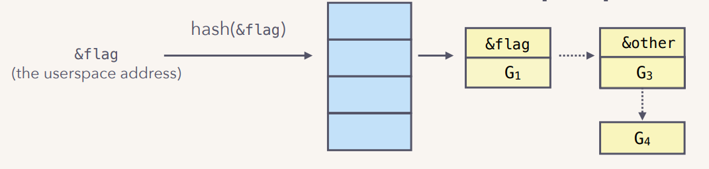
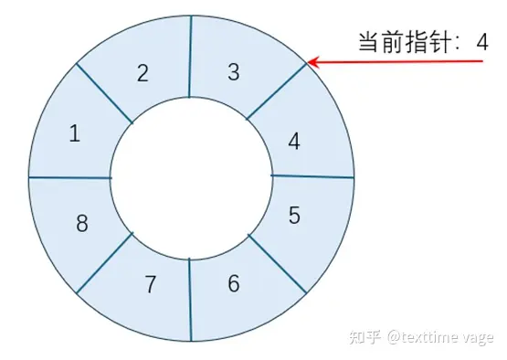
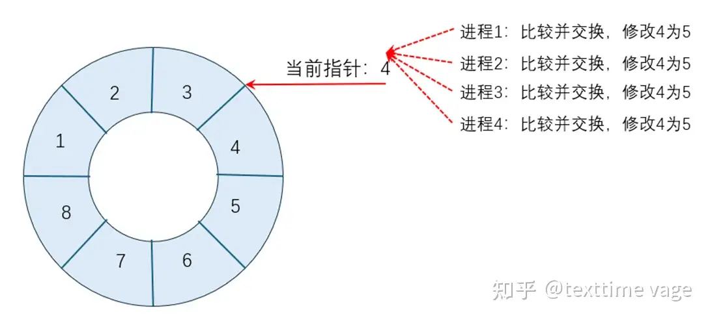

# MIT 6.s081学习笔记

## introduction

ALU不能直接访问内存，要计算的数据需要先从内存中加载（load）到寄存器，ALU再对寄存器中的数计算。

**机器语言和汇编语言是一一对应的**，汇编语言就是把机器语言一对一翻译成人可读的语言。


计算机组织结构：

- 最底部是一些硬件资源，包括了CPU，内存，磁盘，网卡
- 最上层会运行各种应用程序，比如vim，shell等，这些就是正在运行的所有程序，它们都运行在同一个空间中，这个空间通常会被称为用户空间（Userspace）。
- 区别于用户空间程序，有一个特殊的程序总是会在运行，它称为Kernel。Kernel是计算机资源的守护者。当你打开计算机时，**Kernel总是第一个被启动**。Kernel程序只有一个，它维护数据来管理每一个用户空间进程。

操作系统的作用：

- 保护硬件被失控的软件应用程序滥用 

- 维护了大量的数据结构来帮助它管理各种各样的硬件资源，向应用程序提供简单一致的抽象接口来控制复杂的多种外设硬件。

Kernel同时还有大量内置的服务：

- 其中一个服务是**文件系统**。文件系统通常有一些逻辑分区，我们可以认为文件系统的作用是管理文件内容并找出文件具体在磁盘中的哪个位置。文件系统还维护了一个独立的命名空间，其中每个文件都有文件名，并且命名空间中有一个层级的目录，每个目录包含了一些文件。所有这些都被文件系统所管理。所以**用户空间的程序会与Kernel中的文件系统交互，文件系统再与磁盘交互**。
- 另一个就是**进程管理系统**。每一个用户空间程序都被称为一个进程，它们有自己的内存和共享的CPU时间。同时，Kernel会管理内存的分配。不同的进程需要不同数量的内存，Kernel会复用内存、划分内存，并为所有的进程分配内存。

**应用程序与内核的交互通过系统调用（System Call）来完成**。系统调用是操作系统提供的服务的接口，系统调用与程序中的函数调用看起来是一样的，但区别是系统调用会实际运行到系统内核中，并执行内核中对于系统调用的实现。（open、fork等）

> 许多高阶的编程语言都离系统调用较远，部分原因是**很多编程语言想要提供可以在多个操作系统上运行的可移植的环境，所以它们不能依赖特定的系统调用**。所以，如果你使用了Python，你在某种程度上就与系统调用接口隔离了（在内部对系统调用进行了封装）


**指令集体系结构**或**指令集架构（Instruction Set Architecture，ISA）**是底层硬件电路面向上层软件程序提供的一层**接口规范**，来定义机器级程序的格式和行为：**它定义了处理器状态、指令的格式、基本数据类型、寄存器、寻址模式、以及每条指令对状态的影响**。大多数ISA都将程序的行为描述为按顺序执行每条指令。这是编译器的目标，提供一系列指令告诉机器要做什么。而**微结构（Microarchitecture）**是指令集架构的**底层实现**。

- 机器级程序使用的内存地址是**虚拟内存地址**，使得内存模型看上去是一个很大的连续字节数组。然后由操作系统将其转换为真实的物理内存地址。在任意给定的时刻，只有有限的一部分虚拟地址是合法的。

为什么要ISA：

- 为上层软件提供一层抽象，制定规则和约束，让编程者不用操心具体的电路结构（IBM 360 是第一个将 ISA 与其实现分离的计算机）


CISC 复杂指令集 （Complex Instruction Set Computing） 

- 针对特定的功能实现特定的指令，导致指令数目比较多，但生成的程序长度相对较短。 

RISC 精简指令集 （Reduced Instruction Set Computing） 

- **只定义常用指令，对复杂的功能采用常用指令组合实现**，这导致指令数目比较精简，但生成的程序长度相 对较长。

**ISA （处理器）的宽度指的是 CPU中通用寄存器的宽度（二进制的位数）**，这决定了寻址范围的大小、以及数据运算的能力。

RISC-V命名规范：


### shell

它提供了很多工具来管理文件，编写程序，编写脚本。当你输入内容时，你是在告诉Shell运行相应的程序。所以当我输入ls时，实际的意义是我要求Shell运行名为ls的程序

- 重定向IO

  输入 `ls > out`，要求Shell运行ls命令，但是将输出重定向到一个叫做out的文件中。这里执行完成之后我们看不到任何的输出，因为输出都送到了out文件。

- 也可以运行一个名为`grep`的指令，并将x作为参数传给`grep`。`grep x`会搜索输入中包含x的行，我可以告诉shell将输入重定向到文件out，这样我们就可以查看out中的x。

  ```bash
  $ grep x < out
  ```

shell的实现：

主循环用getcmd读取用户的一行输入，然后调用fork，创建shell副本。父进程调用`wait`等待子进程`exec`执行完（在`runcmd`中调用`exec`），而子进程则先解析命令，再执行命令。

```cpp
int
main(void)
{
  static char buf[100];
  int fd;

  // Ensure that three file descriptors are open.
  while((fd = open("console", O_RDWR)) >= 0){
    if(fd >= 3){
      close(fd);
      break;
    }
  }

  // Read and run input commands.
  while(getcmd(buf, sizeof(buf)) >= 0){
    if(buf[0] == 'c' && buf[1] == 'd' && buf[2] == ' '){
      // Chdir must be called by the parent, not the child.
      buf[strlen(buf)-1] = 0;  // chop \n
      if(chdir(buf+3) < 0)
        fprintf(2, "cannot cd %s\n", buf+3);
      continue;
    }
    if(fork1() == 0)
      runcmd(parsecmd(buf));
    wait(0);
  }
  exit(0);
}
```

### 文件描述符

文件描述符是一个**小整数**，**代表一个由内核管理的，可由进程读取或写入的对象**。一个进程可以通过打开一个文件、目录、设备，或者通过创建一个管道，或者通过复制一个现有的描述符来获得一个文件描述符。为了简单起见，我们通常将文件描述符所指向的对象称为文件；

**文件描述符代表系统中的一个可读写对象，可以是文件、外设等。这些可读写对象都是独一无二的，所有用户进程共享这些对象。不同进程的文件描述符数字可以相同，同一个进程的文件描述符数字不能相同，不同的文件描述符可以指向同一个对象**。

**xv6内核为每一个进程单独维护一个以文件描述符为索引的表**，按照约定，一个进程从文件描述符0(标准输入)读取数据，向文件描述符1(标准输出)写入输出，向文件描述符2(标准错误)写入错误信息。**shell确保自己总是有三个文件描述符打开**，**这些文件描述符默认是控制台的文件描述符**

```c
// shell确保自己总是有三个文件描述符打开
while((fd = open("console", O_RDWR)) >= 0){
    if(fd >= 3){
        close(fd);
        break;
    }
}
```

#### read和write

`read`和`write`：形式`int write(int fd, char *buf, int n)`和`int read(int fd, char *bf, int n)`。从/向文件描述符`fd`指向的文件读/写n字节的内容到`buf`中，返回值是成功读取/写入的字节数。每个文件描述符有一个offset，`read`会从这个offset开始读取内容，读完n个字节之后将这个offset后移n个字节，**下一个`read`将从新的offset开始读取字节**。`write`也有类似的offset，**每一次写入都从上一次写入的地方开始**

如果发生错误就返回`-1`，如果遇到EOF就返回`0`，否则返回实际传送（读取）的字节数目，返回类型为ssize_t。

- 在x86-64中，`size_t`为`unsigned long`，而`ssize_t`为`long`。由于`read`和`write`函数会返回有符号数，所以这里需要设置为`ssize_t`。

程序cat将数据从其标准输入复制到其标准输出

```c
/* essence of cat program */
char buf[512];
int n;
  
for (;;) {
    //从标准输入0读取到buf
    n = read(0, buf, sizeof buf);
    if (n == 0)
        break;
    // 如果读取出错，向标准错误写入一条消息
    if (n < 0){
        fprintf(2, "read errot\n");
        exit(1);
    }
    // 如果写入出错，向标准错误写入一条消息
    if (write(1, buf, n) != n){
        fprintf(2, "write error\n");
        exit(1);
    }
}
```

在这个程序中，cat不知道它从什么地方读取，也不知道它打印在什么地方，只需要知道从0读取，从1输出。**重定向实际上就是改变与文件描述符 0 和文件描述符 1 相关联的可读写对象**。

**读取的字节数可能在1到n之间**。

有些时候`read`和`write`函数传送的字节数比应用程序要求的少，称为**不足值（Short Count）**，主要因为：

- `read`函数遇到EOF时，比如文件中中剩下20个字节，而`read`函数想要读取50个字节，则第一次会读取20个字节并返回20，而下一次读取时会返回0表示遇到EOF了。
- 如果打开的文件与终端相关联，则每个`read`函数将依次传送一个文本行，返回的就是文本行的字节数，
- 如果打开的文件与套接字相关联，则由于内部缓冲和网络延迟以及MTU（最大传输单元）的限制，就会造成这个现象。

但是在下面的情况下不会发生

- 从磁盘文件中读取（除 EOF 外），使用while循环从磁盘中读取字节也会出现这种情况
- 写入到磁盘文件中

#### close和open

**打开一个文件表示通知内核你准备好访问该文件**

close，形式是`int close(int fd)`，会**释放一个文件描述符**，使它可以被以后的open、pipe或dup系统调用所重用，**新分配的文件描述符总是当前进程中最小的未使用描述符**。

Fork将父进程的文件描述符表和它的内存一起复制，这样子进程开始时打开的文件和父进程完全一样。系统调用exec替换调用进程的内存，但**会保留文件描述符表**。虽然fork复制了文件描述符表，但每个底层文件的偏移量都是父子共享的。

```c
char *argv[2];
argv[0] = "cat";
argv[1] = 0;
if (fork() == 0)
{
    close(0);  // 释放标准输入的文件描述符
    open("input.txt", O_RDONLY);  // 这时input.txt的文件描述符为0，因为此时0是最小的可用文件描述符
    // 文件描述符0（标准输入）引用的对象变成了input.txt
    exec("cat", argv);  // cat从0读取，并输出到1，即从input.txt读取
}
```

open的第二个参数由一组用位表示的标志组成，用来控制open的工作。可能的值在文件控制(fcntl)头(kernel/fcntl.h:1-5)中定义。`O_RDONLY`,`O_WRONLY`,`O_RDWR`，`O_CREATE`，`O_TRUNC`，它们指定open打开文件时的功能，读，写，读和写，如果文件不存在创建文件，将文件截断为零。


重定向功能的实现：fork出子进程之后，**先改变子进程的标准输入或标准输出文件描述符的引用对象**，再调用exec加载并运行程序代码。这也是为什么fork和exec是分开调用的。

**open和close出错时返回-1**


#### pipes

管道是一个小的内核缓冲区，作为一对文件描述符暴露给进程，一个用于读，一个用于写。将数据写入管道的一端就可以从管道的另一端读取数据。管道为进程提供了一种通信方式。

```c
int p[2];
char *argv[2];
argv[0] = "wc"; 
argv[1] = 0;
pipe(p);// 调用pipe，创建一个新的管道，并将读写文件描述符记录在数组p中,p[0]指向管道读端，p[1]指向管道写端
// 经过fork后，父进程和子进程的p[0],p[1]都指向管道
if (fork() == 0)
{
    close(0);  // 释放文件描述符0
    dup(p[0]); // 复制一个p[0](管道读端)，此时文件描述符0（标准输入）也引用管道读端，故改变了标准输入。
    // 关闭p中的文件描述符
    close(p[0]); 
    close(p[1]); 
    exec("/bin/wc", argv); // wc 从标准输入读取数据，此时标准输入引用的是管道读端，也就是从管道中读取。
}
else
{	// 父进程关闭管道的读端
    close(p[0]);
    // 向管道写入
    write(p[1], "hello world\n", 12);
    // 然后关闭写端
    close(p[1]);
}
```

**如果没有数据写入，读会无限阻塞，直到所有指向写端的文件描述符被关闭**，这也是为什么子进程在执行wc之前关闭管道的写端，如果wc的文件描述符仍然引用管道的写端，那么wc的读取操作会永远阻塞，wc也就不可能执行结束，陷入一种死锁状态。

```c
case PIPE:
pcmd = (struct pipecmd*)cmd;
if(pipe(p) < 0)
    panic("pipe");
if(fork1() == 0){
    // in child process
    close(1); // close stdout
    dup(p[1]); // make the fd 1 as the write end of pipe
    close(p[0]);
    close(p[1]);
    runcmd(pcmd->left); // run command in the left side of pipe |, output redirected to the write end of pipe
}
if(fork1() == 0){
    // in child process
    close(0); // close stdin
    dup(p[0]); // make the fd 0 as the read end of pipe
    close(p[0]);
    close(p[1]);
    runcmd(pcmd->right); //  run command in the right side of pipe |, input redirected to the read end of pipe
}
close(p[0]);
close(p[1]);
wait(0); // wait for child process to finish
wait(0); // wait for child process to finish
break;
```

#### File System

xv6 文件系统包含了数据文件（拥有字节数组）和目录（拥有对数据文件和其他目录的命名**引用**）。这些目录形成一棵树，从根目录`/`开始，对于不以`/`开头的路径，认为是是相对路径

可以通过chdir系统调用来改变进程的当前目录。下面两个open打开了同一个文件

```c
chdir("/a");
chdir("b");
open("c", O_RDONLY);
open("/a/b/c", O_RDONLY);
```

前两行将进程的当前目录改为`/a/b`；后面两行既不引用也不改变进程的当前目录。

有一些系统调用来可以创建新的文件和目录：

- `mkdir`创建一个新的目录，
- `open`用`O_CREATE`标志创建并打开一个新的数据文件，
- `mknod`创建一个新的设备文件。一个设备文件有一个major device #和一个minor device #（mknod的两个参数）用来唯一确定这个设备。当一个进程打开了这个设备文件时，内核会将`read`和`write`的system call重新定向到内核设备实现上，而不是将它们传递给文件系统。

```c
mkdir("/dir");
fd = open("/dir/file", O_CREATE | O_WRONLY);
close(fd);
mknod("/console", 1, 1);
```

**文件名称与文件是不同的**，底层文件（非磁盘上的文件）被称为inode，一个inode可以有多个名称，称为**链接**。

- 每个链接包含一个文件名和对inode的引用。
- **inode保存着一个文件的metadata（元数据），元数据是用来描述文件中数据的数据**，包括它的类型（文件或目录或设备），它的长度，文件内容在磁盘上的位置，以及指向这个inode的的链接数量。
- 磁盘中才保存着文件真正的数据

`fstat`系统调用，形式为`int fstat(int fd, struct stat *st)`，从文件描述符引用的inode中检索信息，**该函数会将inode中的metadata以stat数据结构的形式填入参数st指向的位置**（这些函数的一个典型特征就是它们含有一些预定义的struct，如果想获得信息，可以先分配一个struct，再传一个指针给函数，库函数就会将文件信息填入该struct），st的结构定义在stat.h(kernel/stat.h)中：

```c
#define T_DIR 1    // Directory
#define T_FILE 2   // File
#define T_DEVICE 3 // Device
    struct stat
    {
        int dev;     // File system’s disk device
        uint ino;    // Inode number
        short type;  // Type of file
        short nlink; // Number of links to file
        uint64 size; // Size of file in bytes
    };
```


- **link系统调用**：创建了一个  与另一个文件名  引用了同一个inode的文件（**文件名**），**实际上就是创建了引用同一个inode的链接**。下面的片段创建了引用了同一个inode两个文件a和b。

  ```c
  // 创建并打开一个文件名为a的文件
  open("a", O_CREATE | O_WRONLY);
  // 创建一个文件名为b，与文件a引用同一个inode
  link("a", "b");
  ```

  **读写a与读写b是一样的**，每个inode都有一个唯一的inode号来标识。经过上面的代码序列后，可以通过检查fstat的结果来确定a和b指的是同一个底层内容：两者将返回相同的inode号（ino），并且nlink计数为2。

- **unlink系统调用**：从文件系统中删除一个文件名（即删除引用inode的链接）。**只有当文件的链接数为零且没有文件描述符引用它时，文件的inode和存放其内容的磁盘空间才会被释放**。

- **dup系统调用**：复制一个现有的文件描述符，返回一个新的描述符，**它指向同一个文件对象**。两个文件描述符共享一个偏移量

  ```c
  fd = dup(1);
  write(1, "hello ", 6);
  write(fd, "world\n", 6);   
  // outputs hello world
  ```

  除了`dup`和`fork`之外，其他方式**不能**使两个I/O对象的offset相同，比如同时`open`相同的文件


**所以进程中的文件描述符是对文件（文件名）的引用，文件名和文件目录实际是对inode的引用，而inode又是对储存在磁盘上实际数据的引用**，**inode用来连接实际数据和文件名**。


## Operating system organization

一个操作系统必须满足三个要求：

- 多进程：操作系统的一个关键要求是同时支持几个活动，即使进程的数量多于硬件CPU的数量，操作系统也必须保证所有的进程都有机会执行。
- 隔离：如果一个进程出现了bug并发生了故障，不应该影响其他进程
- 交互：隔离性太强了也不可取，因为进程间可能需要进行交互，例如管道

如果没有操作系统：

- **应用程序和硬件资源之间没有一个额外的抽象层，应用程序会直接与硬件交互**。比如，应用程序可以直接看到CPU的多个核，看到磁盘，内存。这样就破坏了隔离性。

- 使用操作系统的一个目的是为了同时运行多个应用程序，所以一个程序在运行一段时间后，需要主动释放CPU资源，让其他的程序也可以运行。这种机制称为**协同调度（Cooperative Scheduling）**。

  但是**这里的场景并没有很好的隔离性**，如果某个程序中有一个死循环，那么此程序永远也不会释放CPU，其他的程序也不能够执行，甚至都没有一个第三方的程序来停止或杀死死循环的程序。

- **从内存的角度来说，也没有很好的隔离性**。如果应用程序直接运行在硬件资源之上，那么每个应用程序的文本，代码和数据都直接保存在物理内存中。因为**两个应用程序的内存之间没有边界**，如果echo程序将数据存储在属于Shell的一个内存地址中，那么就echo就会覆盖Shell程序内存中的内容。

### 硬件对于强隔离的支持

为了实现强隔离，OS禁止应用程序直接访问敏感的硬件资源，而将资源抽象为服务。

例如，**Unix应用程序只通过文件系统的open、read、write和close系统调用与文件系统进行交互，而不是直接读写磁盘**。之后，**操作系统会决定如何将文件与磁盘中的块对应**，确保一个磁盘块只出现在一个文件中，并且确保用户A不能操作用户B的文件。

每一个进程都会有自己独立的page table，这样的话，**每一个进程只能访问出现在自己page table中的物理内存**。操作系统会设置page table，使得每一个进程都有不重合的物理内存，这样一个进程就不能访问其他进程的物理内存，因为其他进程的物理内存都不在它的page table中。**这样就给了我们内存的强隔离性**。

类似的，内核位于应用程序下方，假设是XV6，那么它也有自己的内存地址空间，并且与应用程序完全独立。

#### User mode, supervisor mode, and system calls

CPU提供了强隔离的硬件支持。例如，RISC-V有三种模式，CPU可以执行指令：**机器模式**、**监督者（supervisor）模式**和**用户模式**。

- CPU一上电就位于M模式（类似X86的实模式），**M模式可以自由地访问硬件平台**，**此时没有开启虚拟地址，程序中全部都是物理地址，CPU只能访问物理地址**。机器模式主要用于配置计算机。Xv6会在机器模式下执行几条指令，然后转为监督者模式。

- 在监督者（supervisor）模式（类似X86的保护模式）下，**CPU被允许执行特权指令：例如，启用和禁用中断，读写保存页表地址的寄存器等**。应用程序不应该执行任何特权指令，这些指令只能被内核执行。

  如果用户模式下的应用程序试图执行一条特权指令，CPU不会执行该指令，而是切换到监督者模式，这样监督者模式的代码就可以终止应用程序，因为它做了不该做的事情。

  **在S模式下才开启虚拟地址和MMU**，CPU需要拿着虚拟地址到MMU转换为物理地址，再去访问内存。

- 在用户模式下，一个应用程序只能执行普通权限的指令（如数字相加等），被称为运行在用户空间，而处于监督者模式的软件也可以执行特权指令，被称为运行在内核空间。**运行在内核空间（或监督者模式）的软件称为内核**。

**处理器通常大部分时间都运行在权限最低的模式下，处理中断和异常时会将控制权移交到更高权限的模式**。

**不同的特权级别下时分别对应各自的一套 Registers (CSR)**，用于控制（Control）和获取相应 Level 下的处理器工作状态。高级别的特权级别下可以访问低级别的 CSR， 譬如 Machine Level 下可以访问 Supervisor/User Level 的 CSR，以此类推； 但反之不可以。

为了实现强隔离，OS禁止应用程序直接访问敏感的硬件资源，而将资源抽象为服务。必须要有一种方式可以使得用户的应用程序能够将控制权以一种协同工作的方式转移到内核，这样内核才能提供相应的服务。

CPU提供了一个特殊的指令，叫做`ECALL`，可以将CPU从用户模式切换到监督模式，并在内核指定的入口处进入内核：

- ECALL接收一个数字参数，当一个用户程序想要将程序执行的控制权转移到内核，它只需要执行ECALL指令，并传入一个数字。这里的数字参数代表了应用程序想要调用的System Call。

当我们在用户空间执行write系统调用时，不能直接调用内核中的write代码，而是由封装好的系统调用函数执行ECALL指令。所以write函数实际上调用的是ECALL指令，指令的参数是代表了write系统调用的数字。之后控制权到了syscall函数，syscall会实际调用write系统调用。

在内核空间中，有一个位于syscall.c的函数syscall，**每一个从应用程序发起的系统调用都会调用到这个syscall函数**，syscall函数会检查ECALL的参数，通过这个参数内核可以知道需要调用的是write系统调用

```
用户程序 --> 用户空间的write --> ECALL --> syscall --> 内核空间中的实际的write代码
									|
									|
		     用户模式		   		 |			监督者模式
```


### 内核组织

一个关键的设计问题是操作系统的哪一部分应该在监督者模式下运行

- 宏内核：整个操作系统驻留在内核中，这样所有系统调用的实现都在监督者模式下运行。在这种组织方式中，整个操作系统以全硬件权限运行。**对宏内核来说，内核就相当于操作系统**。
- 微内核：为了降低内核出错的风险，操作系统设计者可以尽量减少在监督者模式下运行的操作系统代码量，而**在用户模式下执行操作系统的大部分代码**


在上图的微内核中，文件系统作为一个用户级进程运行。**作为进程运行的OS服务称为服务器**。为了让应用程序与文件服务器进行交互，**内核提供了一种进程间通信机制，用于从一个用户模式进程向另一个进程发送消息**。例如，如果一个像shell这样的应用程序想要读写文件，它就会向文件服务器发送一个消息，并等待响应。

**在微内核中，内核接口由一些低级函数组成**，用于启动应用程序、发送消息、访问设备硬件等。这种组织方式使得内核相对简单，因为**大部分操作系统驻留在用户级服务器中**。

xv6和大多数Unix操作系统一样，是**以宏内核的形式实现**的。因此，**xv6内核接口与操作系统接口相对应，内核实现了完整的操作系统**。

### xv6的内核组织

xv6内核源码在`kernel/`子目录下。按照模块化的概念，源码被分成了多个文件，下图列出了这些文件。模块间的接口在`defs.h(kernel/defs.h)`中定义。


### 编译运行kernel

xv6的代码主要由三个部分组成：

- kernel，里面包含了基本上所有的内核文件。因为XV6是一个宏内核结构，这里所有的文件会被编译成一个叫做kernel的二进制文件（Makefile将所有的c文件分别预处理、编译、汇编成.o文件，再调用链接器将它们链接成kernel的二进制文件），然后这个二进制文件会被运行在kernel mode中。

  这里生成的内核文件就是我们将会在QEMU中运行的文件。同时，为了你们的方便，Makefile还会创建kernel.asm，这里包含了内核的完整汇编语言

- user，包含了运行在user mode的程序。

- mkfs，它会创建一个空的文件镜像，我们会将这个镜像存在磁盘上，这样我们就可以直接使用一个空的文件系统。

使用make qemu命令运行xv6，这里会编译文件，然后调用QEMU（qemu-system-riscv64指令）。**qemu本质上是通过C语言来模拟仿真RISC-V处理器**。


### qemu

直观来看，QEMU是一个大型的开源C程序，你可以下载或者git clone它。但是在内部，在QEMU的主循环中，只在做一件事情：

- 读取4字节或者8字节的RISC-V指令。
- 解析RISC-V指令，并找出对应的操作码（op code）。通过解析，可以知道这是一个ADD指令，或者是一个SUB指令。
- 之后在软件中执行相应的指令。

对于每个CPU核，QEMU都会运行这么一个循环。

QEMU的主循环需要维护寄存器的状态。所以QEMU会有以C语言声明的类似于X0，X1寄存器等等。

**对于我们来说，只需要认为跑在QEMU上的代码跟跑在一个真正的RISC-V处理器上是一样的**

### 进程概括

Xv6使用页表（**由硬件实现**）给每个进程提供自己的地址空间。RISC-V页表将虚拟地址(RISC-V指令操作的地址)转换(或 "映射")为物理地址(CPU芯片发送到主存储器的地址)。


进程的用户空间内存的地址空间从虚拟地址0开始的。RISC-V上的指针是64位宽；**硬件在页表中查找虚拟地址时只使用低的39位；xv6只使用39位中的38位**。因此，最大地址是2^38-1 = `0x3fffffffff`，也就是`MAXVA`（kernel/riscv.h:348）。在地址空间的顶端，xv6保留了一页，用于trampoline和映射进程trapframe的页，以便切换到内核。

一个进程最重要的内核状态是它的：

- 页表`p->pagetable`，以RISC-V硬件需要的格式保存进程的页表，当进程在用户空间执行时，xv6使分页硬件使用进程的`p->pagetable`
- 内核栈`p->kstack`
- 运行状态`p->state`，表示进程是创建、就绪、运行、等待I/O，还是退出

**xv6内核将每个进程的内核状态维护在`proc`结构体中**(kernel/proc.h:86)。

每个进程中都有线程(*thread*)，是执行进程命令的最小单元

每个进程有两个栈：**用户栈(*user stack*)**和**内核栈(*kernel stack*)**。当进程在执行用户指令时，只有它的用户栈在使用，而它的内核栈是空的。当进程进入内核时（为了系统调用或中断），内核代码在进程的内核栈上执行。进程的线程在用户栈和内核栈中交替执行，内核栈是独立的（并且受到保护，不受用户代码的影响），所以即使一个进程用户栈被破坏了，内核也可以执行

**一个进程可以通过执行RISC-V `ecall`指令进行系统调用**。该指令提高硬件权限级别，并**将程序计数器改变为内核定义的入口点**。**入口点的代码会切换到内核栈**，并执行实现系统调用的内核指令。当系统调用完成后，内核切换回用户栈，并通过调用`sret`指令返回用户空间，降低硬件特权级别，恢复执行系统调用前的用户指令。

### xv6内核的启动和运行第一个进程

当RISC-V计算机开机时，它会初始化自己，并运行一个存储在ROM中的boot loader。Boot loader将xv6内核加载到物理地址`0x80000000`的内存中，之所以将内核放在`0x80000000`而不是`0x0`，是因为地址范围`0x0`-`0x80000000`包含I/O设备。

.o文件中的节会被合并到可执行文件的什么地方，以及可执行文件中的节最终会加载到内存中的什么位置**由Linker Script描述**。编译xv6过程中使用的链接脚本就是`kernel.ld`文件。


`kernel.ld`文件：

```
// 指定输出文件所适用的ISA为riscv
OUTPUT_ARCH( "riscv" )
// 指定程序的入口点，即程序中执行的第一条指令为entry.S文件下的_entry
ENTRY( _entry )

SECTIONS
{
  /*
   * 指定.text节加载到物理内存中的地址为0x80000000，
   * 也就是程序中的第一条指令_entry的地址为0x80000000
   */
  . = 0x80000000;
  
   // 分别指定.text节、.rodata节、.data节和.bss节的加载到物理内存中的方式
  .text : {
    *(.text .text.*)
    . = ALIGN(0x1000);
    _trampoline = .;
    *(trampsec)
    . = ALIGN(0x1000);
    ASSERT(. - _trampoline == 0x1000, "error: trampoline larger than one page");
    // 将.test节的结束位置赋值给etext符号
    PROVIDE(etext = .);
  }

  .rodata : {
    . = ALIGN(16);
    *(.srodata .srodata.*) /* do not need to distinguish this from .rodata */
    . = ALIGN(16);
    *(.rodata .rodata.*)
  }

  .data : {
    . = ALIGN(16);
    *(.sdata .sdata.*) /* do not need to distinguish this from .data */
    . = ALIGN(16);
    *(.data .data.*)
  }

  .bss : {
    . = ALIGN(16);
    *(.sbss .sbss.*) /* do not need to distinguish this from .bss */
    . = ALIGN(16);
    *(.bss .bss.*)
  }
// .bss节的结束位置赋值给end符号
  PROVIDE(end = .);
}
```

所以我们可以看到，链接脚本`kernel.ld`文件中定义了内核被执行的第一条指令是`entry.S`文件中`_entry`标号的指令，定义了`_entry`所在的位置是`0x80000000`，还定义了内核可执行文件中的其他的节的加载。

然后，在**机器模式**下，CPU从 `_entry`（kernel/entry.S:6）开始执行xv6。**RISC-V在禁用分页硬件的情况下启动**：虚拟地址直接映射到物理地址。


Xv6在文件`start.c`(kernel/start.c:11)中声明了初始栈的空间，即`stack0`，起始地址为`0x80009830`。

```c
// 每个核都需要分配一个栈，大小为4K
__attribute__ ((aligned (16))) char stack0[4096 * NCPU];
```

在 `_entry`处的代码根据核的编号（`mhartid`）加载栈指针寄存器sp，地址为 `stack0+4096*(mhartid+1)`，也就是栈的顶部，因为RISC-V的栈是向下扩张的。（在调试时，我们使用的命令是 `make CPUS=1 qemu-gdb`，只使用了一个核。正常执行的情况下，这个qemu模拟器是可以使用多个核的）。现在**内核就拥有了栈，这样xv6才可以运行C代码**。

 `_entry`再调用start(kernel/start.c:21)，并执行其C代码。

函数start执行一些只有在机器模式下才允许的配置，然后切换到监督者模式。

RISC-V提供了指令`mret`：

- `mret` 指令用于从异常处理模式下退出至进入异常之前的模式。这条指令最常用来从上一次的调用中返回，该指令会将 `mepc` 中的值恢复到 pc 中，并恢复上一次的特权级别。

所以为了通过mret指令进入main函数，并且从机器模式变为监督者模式，start函数需要做的是：在寄存器`mstatus`中把上一次的特权模式设置为supervisor模式，把main的地址写入寄存器`mepc`中，在特权者模式中把0写入页表寄存器satp中，禁用虚拟地址转换，并把所有中断和异常委托给supervisor模式，对时钟芯片进行编程以初始化定时器中断。

```c
// entry.S jumps here in machine mode on stack0.
void
start()
{
  // 为了通过mret返回到supervisor模式，把mstatus寄存器中上一次的特权模式
  // 设置为supervisor模式
  unsigned long x = r_mstatus();
  x &= ~MSTATUS_MPP_MASK;
  x |= MSTATUS_MPP_S;
  w_mstatus(x);

  // set M Exception Program Counter to main, for mret.
  // requires gcc -mcmodel=medany
  w_mepc((uint64)main);

  // 把0写入页表基址寄存器satp中，禁用虚拟地址转换
  w_satp(0);

  // delegate all interrupts and exceptions to supervisor mode.
  w_medeleg(0xffff);
  w_mideleg(0xffff);
  w_sie(r_sie() | SIE_SEIE | SIE_STIE | SIE_SSIE);

  // ask for clock interrupts.
  timerinit();

  // keep each CPU's hartid in its tp register, for cpuid().
  int id = r_mhartid();
  w_tp(id);

  // switch to supervisor mode and jump to main().
  asm volatile("mret");
}
```

完成了这些基本管理后，start通过调用`mret`  "返回" 到监督者模式。这将导致程序计数器变为`main`（`kernel/main.c:11`）的地址。

在`main`(kernel/main.c:11)初始化几个设备和子系统后，它通过调用`userinit`(kernel/proc.c:212)来创建第一个进程。

```c
// Set up first user process.
void
userinit(void)
{
  struct proc *p;

  p = allocproc();
  initproc = p;
  
  // allocate one user page and copy init's instructions
  // and data into it.
  uvminit(p->pagetable, initcode, sizeof(initcode));
  p->sz = PGSIZE;

  // prepare for the very first "return" from kernel to user.
  p->trapframe->epc = 0;      // user program counter
  p->trapframe->sp = PGSIZE;  // user stack pointer

  safestrcpy(p->name, "initcode", sizeof(p->name));
  p->cwd = namei("/");

  p->state = RUNNABLE;

  release(&p->lock);
}
```

第一个进程执行一个用RISC-V汇编编写的小程序`initcode.S`（`user/initcode.S:1`），它通过调用exec系统调用重新进入内核。

```assembly
# exec(init, argv)
.globl start
start:
        la a0, init
        la a1, argv
        li a7, SYS_exec
        ecall

# for(;;) exit();
exit:
        li a7, SYS_exit
        ecall
        jal exit

# char init[] = "/init\0";
init:
  .string "/init\0"

# char *argv[] = { init, 0 };
.p2align 2
argv:
  .long init
  .long 0
```

这个汇编程序中，它首先将init中的地址加载到a0（`la a0, init`），argv中的地址加载到a1（`la a1, argv`），exec系统调用对应的数字加载到a7（`li a7, SYS_exec`），最后调用`ECALL`。所以这里执行了3条指令，之后在第4条指令将控制权又交给了操作系统，重新进入内核。

之后控制权到了`syscall`函数（`kernel/syscall.c`），每一个从应用程序发起的系统调用都会调用到这个`syscall`函数，`syscall`函数会检查`ECALL`的参数，通过这个参数内核可以知道需要调用的是exec系统调用

```c
void
syscall(void)
{
  int num;
  struct proc *p = myproc();

  num = p->trapframe->a7;
  if(num > 0 && num < NELEM(syscalls) && syscalls[num]) {
    p->trapframe->a0 = syscalls[num]();
  } else {
    printf("%d %s: unknown sys call %d\n",
            p->pid, p->name, num);
    p->trapframe->a0 = -1;
  }
}
```

`num = p->trapframe->a7` 会读取使用的系统调用对应的整数，所以`num`就是`SYS_exec`对应的数，7。

`p->trapframe->a0 = syscall[num]()` 这一行是实际执行系统调用。num用来索引一个数组，这个数组是一个函数指针数组，可以预期的是syscall[7]对应了exec的入口函数。我们跳到这个函数中去，可以看到，我们现在在`sys_exec`函数中。

```c
uint64
sys_exec(void)
{
  char path[MAXPATH], *argv[MAXARG];
  int i;
  uint64 uargv, uarg;

  if(argstr(0, path, MAXPATH) < 0 || argaddr(1, &uargv) < 0){
    return -1;
  }
  memset(argv, 0, sizeof(argv));
  for(i=0;; i++){
    if(i >= NELEM(argv)){
      goto bad;
    }
    if(fetchaddr(uargv+sizeof(uint64)*i, (uint64*)&uarg) < 0){
      goto bad;
    }
    if(uarg == 0){
      argv[i] = 0;
      break;
    }
    argv[i] = kalloc();
    if(argv[i] == 0)
      goto bad;
    if(fetchstr(uarg, argv[i], PGSIZE) < 0)
      goto bad;
  }
```

`sys_exec`中的第一件事情是从用户空间读取参数（`argstr(0, path, MAXPATH)`），它会读取path，也就是要执行程序的文件名（在这里是`exec`）。这里首先会为参数分配空间，然后从用户空间将参数拷贝到内核空间。

综合来看，`initcode`完成了通过exec调用`init`程序

```c
char *argv[] = { "sh", 0 };

int
main(void)
{
  int pid, wpid;

  if(open("console", O_RDWR) < 0){
    mknod("console", CONSOLE, 0);
    open("console", O_RDWR);
  }
  dup(0);  // stdout
  dup(0);  // stderr

  for(;;){
    printf("init: starting sh\n");
    pid = fork();
    if(pid < 0){
      printf("init: fork failed\n");
      exit(1);
    }
    if(pid == 0){
      exec("sh", argv);
      printf("init: exec sh failed\n");
      exit(1);
    }

    for(;;){
      // this call to wait() returns if the shell exits,
      // or if a parentless process exits.
      wpid = wait((int *) 0);
      if(wpid == pid){
        // the shell exited; restart it.
        break;
      } else if(wpid < 0){
        printf("init: wait returned an error\n");
        exit(1);
      } else {
        // it was a parentless process; do nothing.
      }
    }
  }
}
```

init会为用户空间设置好一些东西，比如配置好console，调用fork，并在fork出的子进程中执行shell。最终的效果就是Shell运行起来了。


如何在一个核上实现多任务：让多个任务轮流使用一个核，而寄存器只有一套，所以在切换任务时，**我们必须把当前进程的寄存器的值保存在内存中，再将新的进程的寄存器的值从内存中恢复到CPU的寄存器中**。这些寄存器就是进程的上下文（context），或者更准确地说是寄存器上下文。

在`kernel/proc.h`中定义了一个context结构体，表示进程的寄存器上下文：

```c
// Saved registers for kernel context switches.
struct context {
  uint64 ra;
  uint64 sp;

  // callee-saved
  uint64 s0;
  uint64 s1;
  uint64 s2;
  uint64 s3;
  uint64 s4;
  uint64 s5;
  uint64 s6;
  uint64 s7;
  uint64 s8;
  uint64 s9;
  uint64 s10;
  uint64 s11;
};
```


### Real world

Linux的内核是宏内核，有些操作系统的功能是作为用户级服务器运行的（如windows系统）。L4、Minix和QNX等内核是以服务器的形式组织的微内核，并在嵌入式环境中得到了广泛的部署。

现代操作系统支持进程可以拥有多个线程，以允许一个进程利用多个CPU。

## Page tables

xv6运行在 Sv39 RISC-V 上，**只使用 64 位虚拟地址的底部 39 位**，顶部 25 位未被使用。一个RISC-V 页表在逻辑上是一个2^27页表项（Page Table Entry, PTE）的数组。每个PTE包含一个44位的物理页号(Physical Page Number，PPN)和一些标志位。分页硬件通过利用39位中的高27位索引到页表中找到一个PTE来转换一个虚拟地址，并计算出一个**56位的物理地址**（大多数主板还不支持2^56这么大的物理内存），它的前44位来自于PTE中的PPN，而它的后12位则是从原来的虚拟地址复制过来的

虚拟地址的前25位不用于转换地址；将来，RISC-V可能会使用这些位来定义更多的转换层。物理地址也有增长的空间：在PTE格式中，物理页号还有10位的增长空间。


xv6采用**3级页表**的形式，以三层树的形式存储在物理内存中。

- 树的根部是一个4K字节的页表页（也叫**page directory**）（刚好是一页的大小），一个PTE大小为八字节（64位），所以它**包含512个PTE**，这些PTE包含树的下一级页表页的**PPN（44位）**。
- 使用44位的PPN加上12位的0，就得到下一级页表页的56位的物理地址（因为要求每个page directory都与物理页对齐，所以page directory的低12位都是0）。
- 下一级页表页的每一页又都包含512个PTE，用于指向下一级页表的PPN。

**分页硬件用27位中的顶9位选择根页表页中的PTE，用中间9位选择树中下一级页表页中的PTE，用底9位选择最后的PTE**。

这种三层结构的一种好处是，当有大范围的虚拟地址没有被映射时，可以省略整个页表页。


每个PTE包含标志位，告诉分页硬件如何允许使用相关的虚拟地址。

- `PTE_V`表示PTE是否存在：如果没有设置，对该页的引用会引起异常（即不允许）。
- `PTE_R`控制是否允许指令读取到页。
- `PTE_W`控制是否允许指令向写该页。
- `PTE_X`控制CPU是否可以将页面的内容解释为指令并执行。
- `PTE_U`控制是否允许用户模式下的指令访问页面（**只允许用户模式**！）；如果不设置`PTE_U`，PTE只能在监督者模式下使用。

标志位和与页相关的结构体定义在(kernel/riscv.h)。

页表也保存在内存中，所以**CPU中有一个叫`satp`的寄存器来存储页表的根页在物理内存中的地址**。每个CPU都有自己的`satp`寄存器。一个CPU将使用自己的`satp`所指向的页表来翻译后续指令产生的所有地址。

并且**每个进程都有自己独立的页表**，所以当操作系统将CPU从一个应用程序切换到另一个应用程序时，**同时也需要切换SATP寄存器中的内容**，从而指向新的进程保存在物理内存中的页表

**如果切换了page table，操作系统需要告诉处理器当前正在切换page table，处理器会清空TLB**。因为如果切换了page table，TLB中的缓存将不再有用，它们需要被清空，否则地址翻译可能会出错。

> 整个CPU和MMU都在处理器芯片中，在一个RISC-V芯片中，有多个CPU核，MMU和TLB存在于每一个CPU核里面。RISC-V处理器有L1 cache，L2 Cache，有些cache是根据物理地址索引的，有些cache是根据虚拟地址索引的，由虚拟地址索引的cache位于MMU之前，由物理地址索引的cache位于MMU之后。

**内核中页表的实现就是一个uint64的数组，每个位置就是一个PTE（8个字节）**。

### Kernel address space

下图就是内核中地址的对应关系，左边是内核的虚拟地址空间，右边上半部分是物理内存（即DRAM），右边下半部分是I/O设备。

**QEMU模拟还包括I/O设备**，如磁盘接口。QEMU将设备接口作为memory-mapped(内存映射)**控制寄存器**暴露给软件，这些寄存器位于物理地址空间的`0x80000000`以下。

主板的设计人员决定了，在完成了虚拟到物理地址的翻译之后，如果得到的物理地址大于`0x80000000`会走向DRAM芯片，如果得到的物理地址低于`0x80000000`会走向不同的I/O设备。内核可以通过读取/写入这些特殊的物理地址与设备进行交互；**这种读取和写入与设备硬件而不是与RAM进行通信**


地址0x1000是boot ROM的物理地址，当你对主板上电，主板做的第一件事情就是运行存储在boot ROM中的代码，当boot完成之后，会跳转到地址0x80000000，操作系统需要确保那个地址有一些数据能够接着启动操作系统。

上图的左边是内核使用的虚拟地址空间，左侧低于PHYSTOP的虚拟地址，与右侧使用的物理地址是一样的，这一部分是完全相等的映射。

**每个进程都有自己的内核栈**，内核栈被映射到地址高处，所以在它后面xv6可以留下一个未映射的守护页。守护页的PTE是无效的（设置`PTE_V`），这样如果内核溢出内核stack，因为Guard page的PTE中Valid标志位未设置，会导致立即触发page fault，这样的结果好过内存越界之后造成的数据混乱

kernel stack被映射了两次，在靠后的虚拟地址映射了一次，在PHYSTOP下的Kernel data中又映射了一次，但是实际使用的时候用的是上面的部分，因为有Guard page会更加安全。

权限：

- 内核为trampoline和text(可执行程序的代码段)映射的页有PTE_R和PTE_X权限。内核从这些页读取和执行指令。
- 内核映射的其他page会有`PTE_R`和`PTE_W`权限，以便内核读写这些页面的内存。
- 守护页的映射是无效的（设置`PTE_V`）；

XV6使用free memory来存放用户进程的page table，text和data。如果我们运行了非常多的用户进程，某个时间点我们会耗尽这段内存，这个时候fork或者exec会返回错误。


内核能否访问用户进程的数据：

- 能，用户的数据存放在右边的物理内存处，而内核的页表映射了这一部分的物理内存，所以内核可以访问用户的数据

  

  而页表中的PTE_U标志位是限制CPU通过MMU访问的权限，如果内核要访问某一个进程的数据，肯定是拿着这个进程的虚拟地址访问，这个时候页表是内核的页表，肯定不能通过硬件访问，只能先找到用户页表的物理地址，然后把这个虚拟地址转换成物理地址，而内核页表映射了整个物理内存，所以内核可以访问所有的物理内存，然后直接去访问那个物理地址就行了（实际就是没进行lab3的修改之前的xv6解引用用户指针的方式）

### Code: creating an address space

```c#
// start() jumps here in supervisor mode on all CPUs.
void
main()
{
  if(cpuid() == 0){
    consoleinit();
    printfinit();
    printf("\n");
    printf("xv6 kernel is booting\n");
    printf("\n");
    kinit();         // physical page allocator
    // 此时riscv还没有启用分页，所有地址直接指向物理内存
    // 创建内核页表
    kvminit();       // create kernel page table
    
    kvminithart();   // turn on paging
    procinit();      // process table
  }
```

#### Physical memory allocation

**内核必须在运行时为页表、用户内存、内核堆栈和管道缓冲区分配和释放物理内存**。 xv6使用内核地址结束到`PHYSTOP`之间的物理内存进行运行时分配。

分配器在kalloc.c(kernel/kalloc.c:1)中，main函数调用kinit来初始化分配器(kernel/kallo .c:27)

```c
struct run {
  struct run *next;
};

struct {
  struct spinlock lock;
  struct run *freelist;
} kmem;

void
kinit()
{
  initlock(&kmem.lock, "kmem");
  freerange(end, (void*)PHYSTOP);
}

void
freerange(void *pa_start, void *pa_end)
{
  char *p;
  p = (char*)PGROUNDUP((uint64)pa_start);
  for(; p + PGSIZE <= (char*)pa_end; p += PGSIZE)
    kfree(p);
}
```

kinit初始空闲页链表：**释放内核地址结束到PHYSTOP之间的每一个物理页，再将它们头插入全局数据结构kmem的freelist中**。kmem中还有一个锁，因为这个结构体有可能被多个进程访问，**操作共享的数据结构需要加锁**。

Kinit通过调用freerange来添加内存到空闲页链表，**freerange则对每一页都调用kfree**。PTE只能引用4096字节边界对齐的物理地址(4096的倍数)，如果向下取整，显然会覆盖其他的内容。因此freerange只能使用PGROUNDUP来确保它只添加对齐的物理地址到空闲链表中。

函数kfree (kernel/kalloc.c:47)将被释放的内存中的每个字节设置为1。这将使得释放内存后使用内存的代码(使用悬空引用)读取垃圾而不是旧的有效内容；**希望这将导致使用悬空引用的代码更快地崩溃**。

然后kfree将指向page的指针转化为指向run结构体的指针，表示**要在每一个物理页的开头处存储一个run结构体**，然后将run结构体从开头插入kmem的freelist中。

```c
void
kfree(void *pa)
{
  struct run *r;

  if(((uint64)pa % PGSIZE) != 0 || (char*)pa < end || (uint64)pa >= PHYSTOP)
    panic("kfree");

  // Fill with junk to catch dangling refs.
  memset(pa, 1, PGSIZE);

  r = (struct run*)pa;

  acquire(&kmem.lock);
  r->next = kmem.freelist;
  kmem.freelist = r;
  release(&kmem.lock);
}
```

当一个进程要求xv6提供更多的用户内存时，xv6首先使用kalloc来分配物理页，然后将指向新物理页的PTE添加到进程的页表中。

kalloc移除并返回空闲链表中的第一个元素

```c
void *
kalloc(void)
{
  struct run *r;
  acquire(&kmem.lock);
  // 获取freelist中的第一个page
  r = kmem.freelist;
  // 如果不为空，则将第一个page从freelist中移除
  if(r)
    kmem.freelist = r->next;
  release(&kmem.lock);

  if(r)
    memset((char*)r, 5, PGSIZE); // fill with junk
  return (void*)r;
}
```

#### kvminit

main调用`kvminit`(`kernel/vm.c:22`)来创建内核的页表。这个调用发生在xv6在RISC-V启用分页之前，所以地址直接指向物理内存

`Kvminit`负责创建内核页表，再在内核页表中建立虚拟地址到物理地址的映射。

首先分配一页物理内存来存放根页表页。然后调用`kvmmap`将内核所需要的硬件资源映射到物理地址

```c
/*
 * create a direct-map page table for the kernel.
 */
void
kvminit()
{
  // 首先分配一页物理内存来存放根页表页
  kernel_pagetable = (pagetable_t) kalloc();
  // 将根页表页初始化为0
  memset(kernel_pagetable, 0, PGSIZE);

  // kvmmap将内核所需的硬件资源从虚拟地址映射到物理地址
  // 即在页表中建立映射
  // 只在booting内核时使用，此时没有启用分页
  // uart registers
  kvmmap(UART0, UART0, PGSIZE, PTE_R | PTE_W);

  // virtio mmio disk interface
  kvmmap(VIRTIO0, VIRTIO0, PGSIZE, PTE_R | PTE_W);

  // CLINT
  kvmmap(CLINT, CLINT, 0x10000, PTE_R | PTE_W);

  // PLIC
  kvmmap(PLIC, PLIC, 0x400000, PTE_R | PTE_W);

  // map kernel text executable and read-only.
  // KERNBASE是0x80000000，是内存开始的位置，etext是kernel text
  // 的最后一个地址，etext - KERNBASE会返回kernel text的字节数
  // 这部分是kernel text的虚拟地址到物理地址的映射
  kvmmap(KERNBASE, KERNBASE, (uint64)etext-KERNBASE, PTE_R | PTE_X);

  // map kernel data and the physical RAM we'll make use of.
  // 从text的最后一个地址，到 PHYSTOP（物理内存的最大位置）都是
  // kernel data的部分，包括了所有用户进程的页表
  kvmmap((uint64)etext, (uint64)etext, PHYSTOP-(uint64)etext, PTE_R | PTE_W);

  // map the trampoline for trap entry/exit to
  // the highest virtual address in the kernel.
  kvmmap(TRAMPOLINE, (uint64)trampoline, PGSIZE, PTE_R | PTE_X);
}

```

`kvmmap` (kernel/vm.c:118) 调用 `mappages` (kernel/vm.c:149)，它将一个虚拟地址范围映射到一个物理地址范围。

```c
// add a mapping to the kernel page table.
// only used when booting.
// does not flush TLB or enable paging.
void
kvmmap(uint64 va, uint64 pa, uint64 sz, int perm)
{
    // mappages将一个虚拟地址范围映射到一个物理地址范围
  if(mappages(kernel_pagetable, va, sz, pa, perm) != 0)
    panic("kvmmap");
}
```

`mappages` (kernel/vm.c:149)它将范围内地址分割成多页（忽略余数），每次映射一页的顶端地址。对于每个要映射的虚拟地址（页的顶端地址），`mapages`调用walk找到该地址的最后一级PTE的地址。然后，它配置PTE，使其持有相关的物理页号、所需的权限(`PTE_W`、`PTE_X`和/或`PTE_R`)，以及`PTE_V`来标记PTE为有效(kernel/vm.c:161)。

```c
int
mappages(pagetable_t pagetable, uint64 va, uint64 size, uint64 pa, int perm)
{
  uint64 a, last;
  pte_t *pte;

  // 要映射的虚拟地址和size可能不是页对齐的
  a = PGROUNDDOWN(va);
  last = PGROUNDDOWN(va + size - 1);
  for(;;){
    // 对于每个要映射的虚拟地址，
    // walk()找到对应该虚拟地址的最后一级pte的地址
    // 如果失败，则返回-1
    if((pte = walk(pagetable, a, 1)) == 0)
      return -1;
    // 如果V=1，则该pte已经被映射过了
    if(*pte & PTE_V)
      panic("remap");
    // 配置pte，使其映射到指定的物理页号，
    // 有所需的权限，以及被标记是否有效
    *pte = PA2PTE(pa) | perm | PTE_V;
    // 指定的虚拟地址范围被映射完毕
    if(a == last)
      break;
    // 将范围内的地址分成多页，每次用一页的最底部的地址
    // 去walk中寻找对应的pte
    a += PGSIZE;
    pa += PGSIZE;
  }
  return 0;
}
```

调用walk函数查找对应虚拟地址的pte，对于walk的返回结果有如下几种情况：

- 传入的alloc参数为1，walk在PTE的二级页表或三级页表的页表页不存在时需要分配对应的页表页再继续查找，物理内存用完无法分配页表页时walk返回0

- 传入的alloc参数为0，不负责分配页表页，发现缺失相应的PTE的二级页表或三级页表的页表页，导致无法查找到对应的PTE，walk返回0
- 查找到了PTE，但是PTE为invalid

所以对于页表中没有建立映射的虚拟地址，它们的存在形式是：

- 如果这个虚拟地址所在的第三级页表页中有其他的虚拟地址建立了映射，那么这整个页表页会被分配物理内存，整个页面的默认值为0，只有被映射的PTE才会被设置相应的值，其他所有的PTE内容都为0。这样walk函数可以找到这个PTE，但是内容为0.
- 否则，调用walk函数都无法找到这个PTE，只能返回

`PTE2PA`：给定PTE，获取其中的PPN，加上12个0后变成物理地址返回

```c
#define PTE2PA(pte) (((pte) >> 10) << 12)
```

`PA2PTE`：给定物理地址，获取高44位作为PPN，加上10位的0作为flag，变成PTE返回

```c
#define PA2PTE(pa) ((((uint64)pa) >> 12) << 10)
```


```c
pte_t *
walk(pagetable_t pagetable, uint64 va, int alloc)
{
  if(va >= MAXVA)
    panic("walk");

  for(int level = 2; level > 0; level--) {
    // 使用每一级的9位虚拟地址来查找映射了下一级页表物理地址的PTE
    pte_t *pte = &pagetable[PX(level, va)];
    if(*pte & PTE_V) {
      pagetable = (pagetable_t)PTE2PA(*pte);
    } else {
      // 如果pte无效，那么对应的下一级的页表页还没有被分配
      // 如果alloc是true的话，就会在物理内存中分配一个新的页表页
      if(!alloc || (pagetable = (pde_t*)kalloc()) == 0)
        return 0;
      // 将新的页表页的内容初始化为0，
      // 并将它物理地址放在PTE中
      memset(pagetable, 0, PGSIZE);
      *pte = PA2PTE(pagetable) | PTE_V;
    }
  }
  // 返回PTE在树的最底层的地址
  return &pagetable[PX(0, va)];
}
```

#### kvminithart 

`kvminit`建立好内核页表后，由`kvminithart`启用分页，将根页表页的物理地址写入寄存器`satp`中，在这之后，CPU将使用由`kvminit`设置好的内核页表翻译地址

```c
void
kvminithart()
{
  // 将根页表页的物理地址写入寄存器satp中
  // 启用分页，在这之后，CPU将使用由kvminit
  // 设置好的内核页表翻译地址
  w_satp(MAKE_SATP(kernel_pagetable));
  sfence_vma();
}
```


这条指令的执行时刻是一个非常重要的时刻。**因为整个地址翻译从这条指令之后开始生效，在这条指令之前，我们使用的都是物理内存地址，这条指令之后page table开始生效，所有的内存地址都变成了另一个含义，也就是虚拟内存地址。**

CPU启动时，内核的代码和数据是被加载到物理内存中的，开启分页之前，PC的值最开始是`0x80000000`，是内核的物理地址，CPU按照物理内存来执行内核的代码；一直执行到开启分页的指令后，**此时PC中的地址被CPU认为是虚拟地址**（所有的地址都被视为虚拟地址），需要将PC的值送到MMU转化为物理地址后再执行，但是**实际上PC的值没有发生本质改变，还是在之前的物理地址基础上递增**。比如，下一条指令地址是`0x80001110`就被CPU认为是一个虚拟内存地址

为什么这里还能正常工作？**因为kernel page的映射关系中，虚拟地址到物理地址是完全相等的**。**MMU会将一个虚拟地址翻译成相同的物理地址**，所以我们最终还是能通过内存地址执行到正确的指令，因为经过地址翻译`0x80001110`还是对应`0x80001110`。

每个CPU核只有一个`SATP`寄存器，但是在每个`proc`结构体（`proc.h`），里面有一个指向page table的指针，这对应了进程的根page table物理内存地址。

#### userinit

```c
void
userinit(void)
{
  struct proc *p;

  p = allocproc();
  initproc = p;
  
  // allocate one user page and copy init's instructions
  // and data into it.
  uvminit(p->pagetable, initcode, sizeof(initcode));
  p->sz = PGSIZE;

  // prepare for the very first "return" from kernel to user.
  p->trapframe->epc = 0;      // user program counter
  p->trapframe->sp = PGSIZE;  // user stack pointer

  safestrcpy(p->name, "initcode", sizeof(p->name));
  p->cwd = namei("/");

  p->state = RUNNABLE;

  release(&p->lock);
}
```

### sbrk

```c
uint64
sys_sbrk(void)
{
  int addr;
  int n;

  if(argint(0, &n) < 0)
    return -1;
  addr = myproc()->sz;
  // 增长用户内存
  if(growproc(n) < 0)
    return -1;
  return addr;
}
```

sbrk系统调用由函数`growproc`(kernel/proc.c:239)实现，`growproc`调用`uvmalloc`或`uvmdealloc`，取决于n是正数还是负数。 

```c
// Grow or shrink user memory by n bytes.
// Return 0 on success, -1 on failure.
int
growproc(int n)
{
  uint sz;
  struct proc *p = myproc();

  sz = p->sz;
  if(n > 0){
    // 分配物理内存，在页表中建立映射，从而实现用户内存从sz增长到sz+n
    if((sz = uvmalloc(p->pagetable, sz, sz + n)) == 0) {
      return -1;
    }
  } else if(n < 0){
    // 调用uvunmap取消用户页表中的映射，释放物理内存，从而实现用户内存从sz减少到sz+n
    sz = uvmdealloc(p->pagetable, sz, sz + n);
  }
  p->sz = sz;
  return 0;
}
```

`uvmdealloc` 调用 `uvmunmap` (kernel/vm.c:174)，它使用 walk 来查找 PTE，使用 kfree 来释放它们所引用的物理内存。

`sbrk`是一个进程收缩或增长内存的系统调用，该系统调用由函数`growproc`(kernel/proc.c:239)实现，然后再返回该进程旧的sz

- `int growproc(int n)`函数：增长或收缩进程的内存n个字节；当n大于0时，调用`uvmalloc`函数，当n小于0时，调用`uvmdealloc`函数。然后将p->sz更新为新的sz
  - `uint64 uvmalloc(pagetable_t pagetable, uint64 oldsz, uint64 newsz)`函数：让指定用户页表从oldsz增长到newsz；先将oldsz向上取整，如果小于newsz就调用`kalloc`分配一个物理页（如果`kalloc`失败，则调用`uvmdealloc`，将刚才分配的所有内存释放掉），再调用`mappages`将该物理页映射到oldsz（如果映射失败，则先调用`kfree`把刚才`kalloc`分配的物理页释放， 再调用`uvmdealloc`，将分配的所有内存释放掉）。映射完后，再将oldsz增加一个pagesize，继续分配物理内存再建立映射，如此反复，直到oldsz大于等于newsz。返回newsz
  - `uint64 uvmdealloc(pagetable_t pagetable, uint64 oldsz, uint64 newsz)`函数：让指定用户页表从oldsz收缩到newsz；将newsz和oldsz向上取整，计算出之间差的页数n，调用`uvmunmap`函数，释放从newsz向上取整后连续n个页的页表映射和物理内存。返回newsz
    - `void uvmunmap(pagetable_t pagetable, uint64 va, uint64 npages, int do_free)`函数：释放从va开始的连续n个页的页表映射和物理内存：从va开始，对每一页的起始地址调用`walk`函数，找到该页在页表中对应的pte，pte必须要是第三级页表的PTE并且有效。将pte置为0，取消映射。如果`do_free`为1，还需要调用`kfree`函数释放对应的物理内存。


`uvmfree`释放一个进程的所有物理页、页表映射和页表页

```c
void
uvmfree(pagetable_t pagetable, uint64 sz)
{
  if(sz > 0)
    uvmunmap(pagetable, 0, PGROUNDUP(sz)/PGSIZE, 1);
  freewalk(pagetable);
}
```


Exec将ELF文件中的字节按ELF文件指定的地址加载到内存中。用户或进程可以将任何他们想要的地址放入ELF文件中。在旧版本的xv6中，用户地址空间也包含内核（但在用户模式下不可读/写），用户可以选择一个对应内核内存的地址，从而将ELF二进制中的数据复制到内核中。在RISC-V版本的xv6中，这是不可能的，因为内核有自己独立的页表；loadseg加载到进程的页表中，而不是内核的页表中。

## 存储空间管理

**每次分配大小不一的块：存储空间很快充满了许多空闲空间的小洞，会造成外部碎片**

- 物理内存的分段。解决外部碎片的方法是：

  - **紧凑物理内存**，重新安排原来的段。操作系统先终止运行的进程，将它们的数据复制到连续的内存区域中去，改变它们的段寄存器中的值，指向新的物理地址，从而得到了足够大的连续空闲空间。但是内存紧凑成本很高，因为拷贝段是内存密集型的，一般会占用大量的处理器时间

  - 利用**空闲列表管理算法**，试图保留大的内存块用于分配。包括传统的最优匹配（best-fit，从空闲链表中找最接近需要分配空间的空闲块返回）、最坏匹配（worst-fit）、首次匹配（first-fit）以及像伙伴算法（buddy algorithm）这样更复杂的算法。但是不管算法多么好，都无法完全消除外部碎片

    物理内存空闲列表管理算法（适用于分段，也适用于分页，因为**有时需要请求连续的物理内存**）：

    - Buddy分配算法

      Linux内核中引入了伙伴系统算法(Buddy system)。把所有的空闲页框（物理页）分组为11个块链表，每个块链表分别包含大小为1，2，4，8，16，32，64，128，256，512和1024个连续页框的页框块。最大可以申请1024个连续页框，对应4MB大小的连续内存

      空闲空间首先被看作大小为2^N大小的大空间。切割为4MB大小的块存放在最后一个块链表中。**当一个内存分配请求时，将被分配的空闲空间递归地一分为二，直到刚好可以满足请求的大小**（再一分为二就无法满足），**被切割后的空闲空间插入到相应大小的空闲链表中**。

      

      假设要申请一个256个页框的块，先从256个页框的链表中查找空闲块，如果没有，就去512个页框的链表中找，找到了则将页框块分为2个256个页框的块，一个分配给应用，另外一个移到256个页框的链表中。如果512个页框的链表中仍没有空闲块，继续向1024个页框的链表查找，如果仍然没有，则返回错误。页框块在释放时，会主动将两个连续的页框块合并为一个较大的页框块，再插入到相应大小的链表中。

    - slab分配器分配内存以Byte为单位。但是slab分配器并没有脱离伙伴系统，而是基于伙伴系统分配的大内存进一步细分成小内存，自己对申请来的内存细分管理。

- 虚拟内存的malloc

  - 与物理内存的分段不同，**malloc不能紧凑物理内存来消除外部碎片，因为难以确定是否还有其他的指针指向被移动的块**。
  - 虚拟内存也可以使用空闲链表管理算法来减少外部碎片
  - 由于需要组成链表，每个块中还有一些overhead，所以还会出现内部碎片

**每次分配固定大小的块：会造成内部碎片**。粒度越小，内部碎片越少，分配的效率就越低

- 物理内存的分页。采用分页的方式，空闲空间的管理非常容易，只需要维护这些大小固定的页的链表，如果有请求，就返回链表中的第一项。

## riscv汇编

riscv汇编中的`.global`表示可以在其他文件中调用这个函数。

每个进程的page table中有一个区域是text节，**汇编代码中的`.text`表明这部分是代码，并且位于page table的text区域中**。text节中保存的就是代码。


寄存器是CPU或者处理器上，预先定义的可以用来存储数据的位置。**寄存器之所以重要是因为汇编代码并不是在内存上执行，而是在寄存器上执行**。

**当我们创建这样一个`struct`时，内存中相应的字段会彼此相邻。你可以认为`struct`像是一个数组，但是里面的不同字段的类型可以不一样**

## Isolation & system call entry/exit

有三种事件会导致CPU搁置普通指令的执行，**从用户空间转到内核空间**，强制将控制权转移给**内核中**处理该事件的特殊代码

- 系统调用：当用户程序执行`ecall`指令要求内核为其做某事时
- 异常：一条指令（用户或内核）做了一些非法的事情，如除以零或使用无效的虚拟地址或page fault等
- 设备中断：当一个设备发出需要注意的信号时，例如当磁盘硬件完成一个读写请求时。

这里用户空间和内核空间的切换通常被称为trap

处理trap的流程：

- 保存32个用户寄存器（这些寄存器有可能被内核使用）
- 保存程序计数器，从内核中返回后，我们需要能够在用户程序运行中断的位置继续执行用户程序。
- 将mode改成supervisor mode，因为我们想要使用内核中的特权指令，访问用户进程无法访问的设备。
- 将`SATP`从指向用户页表，变为指向内核页表，才能运行内核代码
- 将SP（栈寄存器）指向位于内核的一个地址，因为我们需要一个栈来调用内核的C函数
- 一旦我们设置好了，并且所有的硬件状态都适合在内核中使用， 我们需要跳入内核的C代码

每个RISC-V CPU都有一组**控制寄存器**，内核写入这些寄存器来告诉CPU如何处理trap，内核可以通过读取这些寄存器来发现已经发生的trap

- `STVEC`（Supervisor Trap Vector Base Address Register）寄存器，它指向了内核中处理trap处理程序的起始地址，CPU执行`STVEC`指向的程序来处理trap。**你可能发现，被写入stvec的是uservec或者kernelvec，而不是usertrap，其实我们也可以将两个trap vector认为是trap handler的准备工作部分**。
- `SEPC`（Supervisor Exception Program Counter）寄存器，当trap发生时，RISC-V会将程序计数器保存在这里（因为PC会被`stvec`覆盖）。`sret`(从trap中返回)指令将`sepc`复制到pc中。内核可以写`sepc`来控制`sret`的返回到哪里。
- `scause`：Supervisor cause寄存器，RISC-V在这里放了一个数字，保存了trap机制中进入到supervisor mode的原因
- `sscratch`：内核在这里放置了一个值，这个值会方便trap 恢复/储存用户上下文。
- `sstatus`：`sstatus`中的`SIE`位控制设备中断是否被启用，如果内核清除`SIE`，RISC-V将推迟设备中断，直到内核设置`SIE`。`SPP`位表示trap是来自用户模式还是supervisor模式，并控制`sret`返回到什么模式。

**上述寄存器与在监督者模式下处理的trap有关，在用户模式下不能读或写**，对于机器模式下处理的trap，有一组等效的控制寄存器；xv6只在定时器中断的特殊情况下使用它们。多核芯片上的每个CPU都有自己的一组这些寄存器

当mode标志位寄存器从user mode变更到supervisor mode时，我们可以获得的特权：

- 可以读写控制寄存器
- 可以使用`PTE_U`标志位为0的PTE。当`PTE_U`标志位为1的时候，表明用户代码可以使用这个页表；如果这个标志位为0，则只有supervisor mode可以使用这个页表

需要特别指出的是，**supervisor mode中的代码并不能读写任意物理地址，也需要通过page table来访问内存**。如果一个虚拟地址并不在当前由`SATP`指向的page table中，又或者`SATP`指向的page table中`PTE_U`=1，那么supervisor mode不能使用那个地址

当需要执行trap时，RISC-V**硬件**对所有的trap类型（除定时器中断外）进行以下操作：

- 如果该trap是设备中断，且`sstatus` `SIE`位为0，则不要执行以下任何操作。
- 通过清除`SIE`来禁用中断。
- 复制pc到`sepc`
- 将当前模式(用户或监督者)保存在`sstatus`的`SPP`位。
- 在`scause`设置该次trap的原因。
- 将模式转换为监督者。
- 将`stvec`复制到pc。
- 执行新的pc

Xv6 trap 处理分为四个阶段：RISC-V CPU采取的硬件行为，为内核C代码准备的汇编入口，处理trap的C 处理程序，以及系统调用或设备驱动服务

### Trap代码执行流程

在用户空间执行时，如果用户程序进行了系统调用(`ecall`指令)，或者做了一些非法的事情，或者设备中断，都可能发生trap。

跟踪在Shell中调用write系统调用：

- 从Shell的角度来说，这就是个Shell代码中的C函数调用，
- 但是实际上，write通过执行`ECALL`指令来执行系统调用
- `ECALL`指令切换到supervisor mode的内核中。
- 在这个过程中**，内核中执行的第一个指令是一个由汇编语言写的函数，叫做`uservec`**(kernel/trampoline.S:16)，
- 在这个汇编函数中，代码执行跳转到了由C语言实现的函数`usertrap`中(kernel/trap.c:37)
- 在`usertrap`这个C函数中，我们执行了一个叫做`syscall`的函数。
- `syscall`函数会在一个数组中，根据传入的代表系统调用的数字进行查找，然后调用内核中实现了相应系统调用功能的函数（在本例中，就是`sys_write`）
- `sys_write`将数据输出到console上，完成后，返回到`syscall`函数
- 在`syscall`函数中，调用`usertrapret`(kernel/trap.c:90)，完成了部分返回到用户空间的工作。
- 除此之外，最终还有一些工作只能在汇编语言中完成，调用通过汇编语言实现的`userret`(kernel/trampoline.S:16)
- 最终，在这个汇编函数中会调用机器指令返回到用户空间，并且恢复`ECALL`之后的用户程序的执行。

### ECALL指令之前的状态

作为用户代码的Shell调用write时，实际上调用的是关联到Shell的一个由汇编写成的函数。我们可以在`usys.s`中查看这个库函数的源代码


上面这几行代码就是实际被调用的write函数的实现。它首先将`SYS_write`加载到a7寄存器，SYS_write是常量16。这里告诉内核，我想要运行第16个系统调用。之后这个函数中执行了`ecall`指令，从这里开始代码执行跳转到了内核。内核完成它的工作之后，代码执行会返回到用户空间，继续执行`ecall`之后的指令，也就是`ret`，`ret`从write库函数返回到了Shell中。

为了展示这里的系统调用，我会在`ecall`指令处放置一个断点，为了能放置断点，我们需要知道`ecall`指令的地址，我们可以通过查看由XV6编译过程产生的`sh.asm`找出这个地址。


我这里会在`ecall`指令处放置一个断点，这条指令的地址是`0xdea`。


我们还可以输入info reg打印全部32个用户寄存器


这里的a0，a1，a2是Shell传递给write系统调用的参数。所以a0是文件描述符2；a1是Shell想要写入字符串的指针；a2是想要写入的字符数。


可以看出，输出的确是美元符（$）。

上图的寄存器中，**程序计数器（pc）和堆栈指针（sp）的地址现在都在距离0比较近的地址**，这进一步印证了当前代码运行在用户空间，因为**用户空间中所有的地址都比较小**。但是一旦我们进入到了内核，内核会使用大得多的内存地址。

我们可以查看`STAP`寄存器。


在`QEMU`中有一个方法可以打印当前的page table。从`QEMU`界面，输入`ctrl a + c`可以进入到`QEMU`的console，之后输入`info mem`，`QEMU`会打印完整的page table。


`attr`这一列是PTE的标志位，第三行的标志位是`rwx`表明这个page可以读，可以写，也可以执行指令。之后的是u标志位，它表明`PTE_u`标志位是否被设置，用户代码只能访问u标志位设置了的PTE。再下一个标志位是a（Accessed），表明这条PTE是不是被使用过。再下一个标志位d（Dirty）表明这条PTE是不是被写过。

### ECALL指令之后的状态

当需要执行trap时，RISC-V**硬件**对所有的trap类型（除定时器中断外）进行以下操作：

- 如果该trap是设备中断，且`sstatus` `SIE`位为0，则不要执行以下任何操作。
- 通过清除`SIE`来禁用中断。
- 复制pc到`sepc`
- 将当前模式(用户或监督者)保存在`sstatus`的`SPP`位。
- 在`scause`设置该次trap的原因。
- 将模式转换为监督者。
- 将`stvec`复制到pc。
- 执行新的pc

简单来说，就是三件事：

- 将CPU中的mode标志位变为supervisor
- 将PC的值保存在`sepc`中
- 将`stvec`复制到PC中

注意！**发生trap时，硬件并不会切换page table，不会切换到内核中的栈，也不会保存pc以外的任何寄存器，这些任务由内核软件完成**。（CPU在trap期间做很少的工作的一个原因是为了给软件提供灵活性，例如，一些操作系统在某些情况下不需要页表切换，这可以提高性能）

所以`ecall`并不会切换page table，这意味着，**我们需要在user page table中的某个地方来执行最初的内核代码，trap处理代码必须存在于每一个user page table中**。而**trampoline page**，是由内核小心的映射到每一个user page table中，以使得当我们仍然在使用user page table时，内核在一个地方能够执行trap机制的最开始的一些指令。

**所有用户页表中的trampoline page都映射到同一个物理地址，这个物理地址处存放着trap处理代码，即最初的内核代码**。

注意！**即使trampoline page是在用户地址空间的user page table完成的映射，用户代码不能写它，因为这些page对应的PTE并没有设置`PTE_u`标志位**。这也是为什么trap机制是安全的。

所以在执行了`ECALL`指令后，我们的PC值为：


我们还可以查看page table，可以看出，这还是与之前完全相同的page table，所以page table没有改变。


**根据现在的程序计数器，代码正在trampoline page的最开始！！！**

**根据现在的程序计数器，代码正在trampoline page的最开始！！！**

**根据现在的程序计数器，代码正在trampoline page的最开始！！！**

我们可以来查看一下现在将要运行的指令。


**这些指令是内核在supervisor mode中将要执行的最开始的几条指令，也是在trap机制中最开始要执行的几条指令**。

我们可以查看寄存器，可以看出，寄存器的值并没有改变，所以，**现在寄存器里面还都是用户程序的数据**，并且这些数据也还**只保存**在这些寄存器中，所以我们需要非常小心，**在将寄存器数据保存在某处之前，我们在这个时间点不能使用任何寄存器，否则的话我们是没法恢复寄存器数据的**。

当trap发生时，硬件会将`stvec`复制到pc，然后执行新的pc。所以内核会在从内核空间进入到用户空间之前，事先设置好`STVEC`寄存器指向内核希望trap代码运行的位置


所以我们可以看到，内核已经事先设置好了`STVEC`寄存器的内容为`0x3ffffff000`，这就是trampoline page的起始位置。

当trap发生时，硬件还会将程序计数器的值保存在`SEPC`寄存器


这个寄存器里面有熟悉的地址`0xde6`，这是`ecall`指令在用户空间的地址。

所以现在，`ecall`帮我们做了一点点工作，我们还需要做的是：

- 保存32个用户寄存器的内容
- 将`SATP`从指向用户页表，变为指向内核页表，才能运行内核代码
- 创建或找到一个内核栈，并将SP（栈寄存器）指向内核栈，因为我们需要一个栈来调用内核的C函数
- 跳入内核的C代码

### uservec函数

**所有用户页表中的trampoline page都映射到同一个物理地址，这个物理地址处存放着trap处理代码，即最初的内核代码**。

现在程序位于trampoline page的起始，也是`uservec`函数的起始。我们现在需要做的第一件事情就是保存寄存器的内容。

对于保存用户寄存器，XV6在RISC-V上的实现包括了两个部分：

- 第一个部分是，XV6在每个user page table映射了**trapframe page**，这样每个进程都有自己的trapframe page，trapframe page（映射的物理内存）包含了很多数据，最重要的是可以用来**存放当前进程的用户寄存器**。这个位置的虚拟地址总是`0x3ffffffe000`。

  如果你想查看XV6在trapframe page中存放了什么，这部分代码在`proc.h`中的`trapframe`结构体中

  

  > 为什么这些寄存器保存在trapframe，而不是用户代码的栈中？
  >
  > 如果我们想要运行任意编程语言实现的用户程序，内核就不能假设用户内存的哪部分可以访问，哪部分有效，哪部分存在。所以**内核需要自己管理这些寄存器的保存**，这就是为什么内核将这些内容保存在属于内核内存的`trapframe`中，而不是用户内存。

- 每次从内核跳转到user space时，内核会将trapframe page的地址（也就是`0x3fffffe000`）保存在`SSCRATCH`寄存器中。所以，当我们在运行用户代码，比如运行Shell时，`SSCRATCH`保存的就是指向`trapframe`的地址。之后，Shell执行了`ecall`指令，跳转到了trampoline page，如果我查看`trampoline.S`代码，

  

  第一件事情就是执行`csrrw`指令，这个指令交换了a0和`sscratch`两个寄存器的内容。a0现在的值是`0x3fffffe000`，这是trapframe page的虚拟地址，此时a0指向shell的trapframe。`trampoline.S`中接下来30多个奇怪指令就是**将当前CPU中的每个用户寄存器保存在之前的用户程序的`trapframe`的不同偏移位置**

  - 为什么要将sscratch和a0交换？因为**无法直接向sscratch中写入，只能向通用寄存器中写入**

  内核返回用户空间的最后的C函数如下：

  

  C函数做的最后一件事情是调用`fn`函数（`trap.c`），传递的参数是`TRAMFRAME`和user page table。在C代码中，当调用函数，第一个参数会存在`a0`，所以a0里面的数值是指向`trapframe`的指针

  `fn`函数的代码如下（`trampoline.S`），将a0和`SSCRATCH`的值交换，将`trapframe`的值重新存入`SSCRATCH`中，a0也恢复成了之前的数值。最后`sret`返回到了用户空间。以下是内核返回到用户空间之前的最后两条指令。

  
  
  在任何用户代码执行之前，内核会执行`fn`函数，并设置好所有的东西，例如`SSCRATCH`，`STVEC`寄存器。

程序现在仍然在trampoline的最开始，也就是`uservec`函数的最开始，现在我们停在了下面这条ld（load）指令。


这条指令正在将a0指向的内存地址往后数的第8个字节开始的数据加载到Stack Pointer寄存器，第8个字节开始的数据是内核的Stack Pointer（`kernel_sp`），`trapframe`中的`kernel_sp`是由kernel在进入用户空间之前就设置好的，它的值是这个进程的kernel stack。所以这条指令的作用是初始化Stack Pointer指向这个进程的kernel stack的最顶端。

下一条指令是向tp寄存器写入数据。因为在RISC-V中，没有一个直接的方法来确认当前运行在多核处理器的哪个核上，XV6会将CPU核的编号也就是`hartid`保存在`tp`寄存器。


我们现在运行在CPU核0，这说的通，因为我之前配置了QEMU只给XV6分配一个核，所以我们只能运行在核0上

下一条指令是向t0寄存器写入数据。这里写入的是我们将要执行的第一个C函数的指针，也就是函数`usertrap`的指针。

```assembly
# load the address of usertrap(), p->trapframe->kernel_trap
ld t0, 16(a0)
```

下一条指令是向t1寄存器写入kernel page table的地址，再将t1的值写入`satp`，当前程序会从user page table切换到kernel page table

```assembly
# restore kernel page table from p->trapframe->kernel_satp
ld t1, 0(a0)
csrw satp, t1
```

此时PC保存的仍然是用户页表的虚拟地址，而页表已经切换为了内核页表，为什么CPU不会通过新的页表访问到一些其他的页中？

- **因为我们还在trampoline代码中，而trampoline page在用户页表和内核页表中的位置相同，都映射到了同一个地址**。这两个page table中其他所有的映射都是不同的，只有trampoline page的映射是一样的，因此我们在切换page table时，寻址的结果不会改变，我们实际上就可以继续在同一个代码序列中执行程序而不崩溃。

最后一条指令是`jr t0`。执行了这条指令，我们就要从trampoline跳到t0指向的内核的C代码中。

```assembly
# jump to usertrap(), which does not return
jr t0
```

我们打印t0对应的一些指令，


可以看到t0的位置对应于一个叫做`usertrap`函数的开始。


综上，从用户程序到内核的trap处理程序（即trampoline.S中的uservec函数）的主要内容为：

- `SSCRATCH`寄存器中保存着用户程序的trapframe的地址。
- 将此时CPU中的用户寄存器的内容保存到`SSCRATCH`寄存器指向的用户程序的trapframe中
- 将之前**从内核到用户空间时保存**的该进程的内核栈的地址、将要执行的usertrap函数的地址、以及内核根页表的地址分别存入sp、t0、t1寄存器。
- 再将t1寄存器的内容存入satp寄存器，切换至内核页表
- 最后跳转至t0指向的位置，即usertrap函数

概括一下就是：

- 保存32个用户寄存器的内容
- 将`SATP`从指向用户页表，变为指向内核页表，才能运行内核代码
- 创建或找到一个内核栈，并将SP（栈寄存器）指向内核栈，因为我们需要一个栈来调用内核的C函数
- 跳入内核的C代码


### usertrap函数

**对于来自于用户空间或者内核空间trap，XV6处理trap的方法是不一样的**。现在我们讨论的都是当trap是**由用户空间发起**时会发生什么。如果trap从内核空间发起，将会是一个非常不同的处理流程，因为从内核发起的话，程序已经在使用kernel page table，很多处理都不必存在。

```c
void
usertrap(void)
{
  int which_dev = 0;

  if((r_sstatus() & SSTATUS_SPP) != 0)
    panic("usertrap: not from user mode");

  // send interrupts and exceptions to kerneltrap(),
  // since we're now in the kernel.
  w_stvec((uint64)kernelvec);

  struct proc *p = myproc();
  
  // save user program counter.
  p->trapframe->epc = r_sepc();
  
  if(r_scause() == 8){
    // system call

    if(p->killed)
      exit(-1);

    // sepc points to the ecall instruction,
    // but we want to return to the next instruction.
    p->trapframe->epc += 4;

    // an interrupt will change sstatus &c registers,
    // so don't enable until done with those registers.
    intr_on();

    syscall();
  } else if((which_dev = devintr()) != 0){
    // ok
  } else {
    printf("usertrap(): unexpected scause %p pid=%d\n", r_scause(), p->pid);
    printf("            sepc=%p stval=%p\n", r_sepc(), r_stval());
    p->killed = 1;
  }

  if(p->killed)
    exit(-1);

  // give up the CPU if this is a timer interrupt.
  if(which_dev == 2)
    yield();

  usertrapret();
}
```

在内核中执行任何操作之前，它做的第一件事情是更改`STVEC`寄存器，将`STVEC`指向了`kernelvec`变量，从原来指向**用户空间**trap处理代码的位置（即`trampoline.S`），变为指向**内核空间trap处理代码**的位置

再通过调用`myproc`函数来获取当前运行的是什么进程

接下来需要将`SEPC`寄存器的值保存到发起trap的用户进程的trapframe中，`SEPC`寄存器存放着发起trap的用户进程的PC：

- 因为可能发生这种情况：当程序还在内核中执行时，我们可能切换到另一个进程，并进入到那个程序的用户空间，然后那个进程可能再调用一个系统调用进而导致SEPC寄存器的内容被覆盖。所以，**我们需要保存当前进程的SEPC寄存器到一个与该进程关联的内存中，这样这个数据才不会被覆盖**。这里我们使用trapframe来保存这个程序计数器。（**为什么不一开始在trampoline中就把sepc保存在trapframe中**？）

接下来我们需要找出我们现在会在`usertrap`函数的原因。根据触发trap的原因，RISC-V的`SCAUSE`寄存器会有不同的数字。数字8表明，我们现在在trap代码中是因为系统调用。

将保存在trapframe中的`SEPC`寄存器的值加4

- 存储在`SEPC`寄存器中的程序计数器，是用户程序中触发trap的指令的地址。但是当我们恢复用户程序时，我们希望在下一条指令恢复，也就是`ecall`之后的一条指令。

开中断：

- 发生trap时，中断总是会被RISC-V的trap硬件关闭。有些系统调用需要许多时间处理，在处理系统调用时我们需要允许中断，这样中断可以更快地服务

再调用`syscall`函数（`syscall.c`）：

- 此函数的内容是：Shell调用的write函数将a7设置成了系统调用编号，对于write来说就是16。所以`syscall`函数先获取由trampoline代码保存在`trapframe`中a7的值，再根据这个系统调用标号从`syscalls`数组查找并调用对应的系统调用函数（`syscalls`是一个函数指针数组）

  `syscall`函数可以通过trapframe来获取用户进程系统调用的参数，就像刚刚查看trapframe中的a7寄存器一样，a0、a1、a2分别对应第一个、第二个和第三个参数。

  syscall函数执行完真正的系统调用后，将返回值赋给trapframe中的a0

  - RISC-V上的C代码的习惯是函数的返回值存储于寄存器a0，所以为了模拟函数的返回，我们将返回值存储在trapframe的a0中。之后，当我们返回到用户空间，trapframe中的a0的数值会写到CPU中的a0寄存器，Shell会认为a0寄存器中的数值是write系统调用的返回值。

```c
void
syscall(void)
{
  int num;
  struct proc *p = myproc();

  num = p->trapframe->a7;
  if(num > 0 && num < NELEM(syscalls) && syscalls[num]) {
    p->trapframe->a0 = syscalls[num]();
  } else {
    printf("%d %s: unknown sys call %d\n",
            p->pid, p->name, num);
    p->trapframe->a0 = -1;
  }
}
```

最后，usertrap调用了`usertrapret`函数

综上，usertrap的作用是确定trap的原因，处理它，然后返回：

- 如果trap是系统调用，syscall会处理它
- 如果是设备中断，devintr会处理；
- 否则就是异常，内核会杀死故障进程

### usertrapret函数

```
硬件关中断---> stvec指向内核trap处理程序---> 开中断---> 执行系统调用---> 关中断---> stvec指向用户trap处理程序---> 开中断---> 执行用户程序
```

本质上：

- 执行内核程序时，如果开中断，那么stvec必须指向内核trap处理程序

- 执行用户程序时，如果开中断，那么stvec必须指向用户trap处理程序

```c
void
usertrapret(void)
{
  struct proc *p = myproc();

  // we're about to switch the destination of traps from
  // kerneltrap() to usertrap(), so turn off interrupts until
  // we're back in user space, where usertrap() is correct.
  intr_off();

  // send syscalls, interrupts, and exceptions to trampoline.S
  w_stvec(TRAMPOLINE + (uservec - trampoline));

  // set up trapframe values that uservec will need when
  // the process next re-enters the kernel.
  p->trapframe->kernel_satp = r_satp();         // kernel page table
  p->trapframe->kernel_sp = p->kstack + PGSIZE; // process's kernel stack
  p->trapframe->kernel_trap = (uint64)usertrap;
  p->trapframe->kernel_hartid = r_tp();         // hartid for cpuid()

  // set up the registers that trampoline.S's sret will use
  // to get to user space.
  
  // set S Previous Privilege mode to User.
  unsigned long x = r_sstatus();
  x &= ~SSTATUS_SPP; // clear SPP to 0 for user mode
  x |= SSTATUS_SPIE; // enable interrupts in user mode
  w_sstatus(x);

  // set S Exception Program Counter to the saved user pc.
  w_sepc(p->trapframe->epc);

  // tell trampoline.S the user page table to switch to.
  uint64 satp = MAKE_SATP(p->pagetable);

  // jump to trampoline.S at the top of memory, which 
  // switches to the user page table, restores user registers,
  // and switches to user mode with sret.
  uint64 fn = TRAMPOLINE + (userret - trampoline);
  ((void (*)(uint64,uint64))fn)(TRAPFRAME, satp);
}
```

首先关闭了中断

- 因为我们将要更新STVEC寄存器来指向用户空间的trap处理代码，而之前在内核中的时候，我们指向的是内核空间的trap处理代码。更新完后，我们仍在执行内核代码，如果此时发生了一个中断，那么就会执行用户trap处理程序。

设置了STVEC寄存器指向trampoline代码

将一些内核相关的数据保存到进程的trapframe中，以便下次该进程发生trap到内核时使用

- 存储指向kernel page table的指针
- 存储当前用户进程的kernel stack
- 存储usertrap函数的指针，这样trampoline代码才能跳转到这个函数
- 从tp寄存器中读取当前的CPU核编号，并存储在trapframe中

接下来我们要设置SSTATUS寄存器，这是一个控制寄存器。

- 这个寄存器的SPP bit位控制了sret指令的行为，该bit为0表示下次执行sret的时候，我们想要返回user mode而不是supervisor mode。
- 这个寄存器的SPIE bit位控制了，在执行完sret之后，是否打开中断。

因为我们在返回到用户空间之后，我们的确希望打开中断，所以这里将SPIE bit位设置为1。修改完这些bit位之后，我们会把新的值写回到SSTATUS寄存器。

将SEPC寄存器的值设置成之前保存在trapframe中的SEPC的值

- 我们在trampoline代码的最后执行了sret指令。这条指令会将程序计数器设置成SEPC寄存器的值。而SEPC的值有可能在系统调用过程中被修改了，所以我们需要将SEPC寄存器的值设置成之前保存在trapframe中的SEPC的值。

接下来根据user page table地址生成相应的SATP值，**这样才能在trampoline中完成page table的切换**（并且也只能在trampoline中完成切换，因为只有trampoline中代码是同时在用户和内核空间中映射）。但是我们现在还没有在trampoline代码中，我们现在还在一个普通的C函数中，所以这里我们将page table指针准备好，并将这个指针作为第二个参数传递给汇编代码，这个参数会出现在a1寄存器。

再计算出我们将要跳转到汇编代码的地址。我们期望跳转的地址是tampoline中的userret函数

将fn指针强转为一个函数指针，执行相应的函数（也就是userret函数）并传入两个参数，一个是用户进程的trapframe的虚拟地址，一个是该用户进程的页表的物理地址，两个参数存储在a0，a1寄存器中。

### userret函数

首先将用户页表的物理地址写入`satp`，

将a0指向的trapframe中偏移量为112的位置的值保存到SSCRATCH寄存器。

- trapframe中的112位置保存的是用户进程a0寄存器的值。在uservec里，此处保存的是用户进程系统调用的第一个参数；**后来在usertrap中，被覆盖为了系统调用的返回值**。所以，执行完后SSCRATCH寄存器变为了系统调用的返回值。

再将之前发生trap时，保存到a0指向的trapframe中的用户寄存器恢复到CPU中对应的各个寄存器中。

最后在返回用户空间之前，交换`SSCRATCH`寄存器和a0寄存器的值。此时CPU中的a0寄存器的值就是系统调用的返回值，`SSCRATCH`就是trapframe的地址。之后trapframe的地址会一直保存在`SSCRATCH`中，直到用户程序执行了另一次trap

sret是我们在kernel中的最后一条指令，执行这条指令后：

- 程序会切换回user mode

- SEPC寄存器的数值会被拷贝到PC寄存器（程序计数器）
- 重新打开中断

在trampoline中还是用户页表，内核往用户进程的trapframe中保存了寄存器。但是在之后切换了内核页表后，内核是怎么访问到用户的trapframe的（**内核如何通过p->trapframe访问用户的trapframe**）？在trampoline的userret中，我们切换为用户页表后通过寄存器直接访问trapframe是合理的。

- 内核在创建进程的时候，首先分配一个物理页，p->trapframe指向该物理页，然后再将该物理页映射到进程页表的trapframe，所以**内核中的p->trapframe和进程页表中的trapframe映射到同一个物理地址**。

  

a0既存放函数调用时的第一个参数，也存放函数返回值

### **Traps From Kernel Space**

以上我们讨论的都是发生在用户空间下的trap，现在我们来讨论发生在**内核空间下的trap**。

对于这两种模式下的trap，xv6配置相关寄存器的方式也略有不同。当CPU在内核空间下执行内核代码的时候，stvec被设置为指向**kernelvec**（kernel/kernelvec.S），用于处理内核空间下的trap。

> **第一步：kernelvec**

由于此时已经是在内核空间下，就算trap发生，也不需要修改satp和sp，内核页表和内核栈都可以继续使用的。因此kernelvec的工作很简单，当前正在运行的内核线程因trap而被暂停，**直接在该内核线程的内核栈上，保存相关的寄存器即可**。保存在线程自己的栈上这一点很重要，因为内核下的trap可能会导致线程的切换，然后内核会在另一个线程的内核栈上执行，而原线程的相关寄存器则被安全地放置在自己的内核栈上。

```c
kernelvec:
        // make room to save registers.
        // kernelvec saves the registers on the stack of the interrupted kernel thread, 
        // which makes sense because the register values belong to that thread
        addi sp, sp, -256

        // save the registers.
        sd ra, 0(sp)
        sd sp, 8(sp)
        sd gp, 16(sp)
        sd tp, 24(sp)
        sd t0, 32(sp)
        sd t1, 40(sp)
        sd t2, 48(sp)
        sd s0, 56(sp)
        sd s1, 64(sp)
        sd a0, 72(sp)
        sd a1, 80(sp)
        sd a2, 88(sp)
        sd a3, 96(sp)
        sd a4, 104(sp)
        sd a5, 112(sp)
        sd a6, 120(sp)
        sd a7, 128(sp)
        sd s2, 136(sp)
        sd s3, 144(sp)
        sd s4, 152(sp)
        sd s5, 160(sp)
        sd s6, 168(sp)
        sd s7, 176(sp)
        sd s8, 184(sp)
        sd s9, 192(sp)
        sd s10, 200(sp)
        sd s11, 208(sp)
        sd t3, 216(sp)
        sd t4, 224(sp)
        sd t5, 232(sp)
        sd t6, 240(sp)
        // call the C trap handler in trap.c
        call kerneltrap
```

内核空间下的trap发生时，当前线程在自己的栈上保存了相关的寄存器之后，内核从kernelvec跳转到**kerneltrap**（kernel/trap.c）中，注意，**`kerneltrap`仍然属于当前的内核线程，处于当前内核线程的内核栈中！**

> **第二步：kerneltrap**

kerneltrap处理两种trap，设备中断和异常。内核调用devintr检查设备中断类型，并处理它。如果发现不是设备中断，就一定是异常。这个异常更为严重，因为它不是出现在用户空间下，而是出现在内核中，这是一个致命的错误，这会直接导致内核停止执行。

```c
// interrupts and exceptions from kernel code go here via kernelvec,
// on whatever the current kernel stack is.
void
kerneltrap()
{
  int which_dev = 0;
  // 在开始将sepc,sstatus先存起来
  // Because a yield may have disturbed the saved sepc and the saved previous mode in sstatus
  uint64 sepc = r_sepc();
  uint64 sstatus = r_sstatus();
  uint64 scause = r_scause();
  
  if((sstatus & SSTATUS_SPP) == 0)
    panic("kerneltrap: not from supervisor mode");
  if(intr_get() != 0)
    panic("kerneltrap: interrupts enabled");

  if((which_dev = devintr()) == 0){
    printf("scause %p\n", scause);
    printf("sepc=%p stval=%p\n", r_sepc(), r_stval());
    panic("kerneltrap");
  }

  // give up the CPU if this is a timer interrupt.
  // process’s kernel thread is running(rather than a scheduler thread)
  if(which_dev == 2 && myproc() != 0 && myproc()->state == RUNNING)
    yield();

  // the yield() may have caused some traps to occur,
  // so restore trap registers for use by kernelvec.S's sepc instruction.
  w_sepc(sepc);
  w_sstatus(sstatus);
  // 没有kerneltrapret，因此直接返回到kernelvec
}
```

如果是设备中断，而且是计时器中断，这就表明当前线程的时间片用完了，应该切换让别的内核线程运行，并调用yield来放弃CPU。从当前的内核线程切换到调度器线程，再切换到另一个内核线程。

kerneltrap的主要工作执行完了之后，现在正在执行的内核线程，可能和之前是同一个，也可能是被调度运行的最新一个，无论如何，我们重新加载sepc和sstatus寄存器中的值，确保不会出现错误。**现在kerneltrap正式结束，由于没有别的函数调用，它会直接返回kernelvec**。

> **第三步：kernelvec**

现在我们又回到了kernelvec，接下来我们**从当前内核线程的内核栈上，恢复所有保存过的寄存器**。

```c
        // restore registers.
        ld ra, 0(sp)
        ld sp, 8(sp)
        ld gp, 16(sp)
        // not this, in case we moved CPUs: ld tp, 24(sp)
        ld t0, 32(sp)
        ld t1, 40(sp)
        ld t2, 48(sp)
        ld s0, 56(sp)
        ld s1, 64(sp)
        ld a0, 72(sp)
        ld a1, 80(sp)
        ld a2, 88(sp)
        ld a3, 96(sp)
        ld a4, 104(sp)
        ld a5, 112(sp)
        ld a6, 120(sp)
        ld a7, 128(sp)
        ld s2, 136(sp)
        ld s3, 144(sp)
        ld s4, 152(sp)
        ld s5, 160(sp)
        ld s6, 168(sp)
        ld s7, 176(sp)
        ld s8, 184(sp)
        ld s9, 192(sp)
        ld s10, 200(sp)
        ld s11, 208(sp)
        ld t3, 216(sp)
        ld t4, 224(sp)
        ld t5, 232(sp)
        ld t6, 240(sp)

        addi sp, sp, 256
```

最后一步，我们同样执行sret，宣告我们对于内核空间下的trap处理完毕，sret将sepc复制到pc中，根据sstatus寄存器的设置，切换到监管者模式，并**重新开放中断**。因此，我们最后会回到上次被打断的地方，继续执行内核代码。

```c
        // return to whatever we were doing in the kernel.
        // sret是RISV-V指令，复制sepc到pc中
        // resumes the interrupted kernel code
        sret
```

再次回忆我们讨论过的，用户空间下发生trap的第三步，在usertrapret中，xv6内核将stvec指向uservec，但我们仍在内核空间中，这段时间保持设备中断关闭是很重要的，不然内核空间下的trap会被导向uservec。RISC-V的处理方式是，trap发生的时候总是先关闭中断，直到设置好stvec，代码在正确的模式下执行时，再打开中断。

#### 计时器中断

还记得前面说过**计时器中断**是特别的吗？实际上计时器中断在**机器模式**下处理。在xv6的启动阶段中，仍处于机器模式下，先执行entry.S代码，再跳转到start.c代码，再调用`timerinit`。

在机器模式下我们通过timerinit（kernel/start.c）初始化了计时器，**CLINT**将负责产生计时器中断，更重要的是，我们通过改写mtvec寄存器的值（和stvec类似）将机器模式下的trap handler设置为timervec。因此，**当CLINT产生一个计时器中断时，硬件会自动陷入机器模式，并跳转到timervec开始处理**。

```c
// ask the CLINT for a timer interrupt.
  int interval = 1000000; // cycles; about 1/10th second in qemu.
  *(uint64*)CLINT_MTIMECMP(id) = *(uint64*)CLINT_MTIME + interval;

// set the machine-mode trap handler.
  w_mtvec((uint64)timervec);
```

**timervec**如下所示（kernel/kernelvec.S），主要做的事情就是对计时器芯片重新编程，使其开始新的一轮计时，并且产生向监管者模式发出一个**软件中断**。最后，timervec通过mret返回监管者模式下，如果在监管者模式下，我们的中断是开放的，那么内核就能够捕捉到这个软件中断，内核会跳转到kernelvec，保存相关寄存器，然后在kerneltrap中，发现这是一个设备中断而且是计时器中断，从而执行相应的处理。

```c
timervec:
        # start.c has set up the memory that mscratch points to:
        # scratch[0,8,16] : register save area.
        # scratch[32] : address of CLINT's MTIMECMP register.
        # scratch[40] : desired interval between interrupts.
        
        csrrw a0, mscratch, a0
        sd a1, 0(a0)
        sd a2, 8(a0)
        sd a3, 16(a0)

        # schedule the next timer interrupt
        # by adding interval to mtimecmp.
        ld a1, 32(a0) # CLINT_MTIMECMP(hart)
        ld a2, 40(a0) # interval
        ld a3, 0(a1)
        add a3, a3, a2
        sd a3, 0(a1)

        # raise a supervisor software interrupt.
	li a1, 2
        csrw sip, a1

        ld a3, 16(a0)
        ld a2, 8(a0)
        ld a1, 0(a0)
        csrrw a0, mscratch, a0

        mret
```

## Page faults

当发生page fault时，内核需要什么样的信息才能够响应page fault：

- 引起page fault的虚拟地址
  - 当一个用户程序触发page fault后，会使用与上面相同的trap机制切换到内核，并且**将出错的地址存放到STVAL寄存器中**
- 引起page fault的原因。
  - 发生trap进入到supervisor模式的原因保存在SCAUSE中。其中有三个原因与page fault有关，分别是由load、store和指令执行引起的page fault（13、15、12）
- 引起page fault的指令的地址（PC的值）
  - 存放在SEPC中。

### Lazy page allocation

sbrk是XV6提供的系统调用，它使得用户应用程序能扩大自己的heap。当一个应用程序启动的时候，sbrk指向的是heap的最底端，同时也是stack的最顶端。这个位置通过代表进程的数据结构中的sz字段表示，这里以*p->sz表示*。


当调用sbrk时，它的参数是整数，代表了想要申请的字节数量，sbrk会扩展heap的上边界（也就是会扩大heap）

这意味着，当sbrk实际发生或者被调用的时候，内核会分配一些物理内存，并将这些内存映射到用户应用程序的虚拟地址空间中（即页表中），然后将内存内容初始化为0，再返回sbrk系统调用

在XV6中，sbrk的实现默认是eager allocation。

- 这表示了，一旦调用了sbrk，内核会立即分配应用程序所需要的物理内存。但是实际上，应用程序很难预测自己需要多少内存，所以通常来说，应用程序倾向于申请多于自己所需要的内存。

所以我们可以使用lazy allocation

- 核心思想非常简单，sbrk系统调基本上不做任何事情，唯一需要做的事情就是将*p->sz*增加n，其中n是需要新分配的内存page数量。内核此时并不会分配任何物理内存。之后如果应用程序使用到了新申请的**超过当前page的**那部分内存，这时因为我们还没有将新的内存映射到page table，会触发page fault。进入trap处理程序后通过`kalloc`再分配一页物理page，将这个page的内容初始化为0，将它映射到页表中被访问到的那部分内存。随后再重新执行指令

**如果sbrk申请的内存在同一个page中，那么eager allocation和lazy  allocation没有区别，都不会分配物理页和映射pte**。

如果sbrk申请的内存超过了当前的page（新的sz超过了当前的page）

- 那么对于eager allocation，内核会立即分配应用程序所需要的物理内存。
- 对于lazy allocation，当应用程序使用到了新申请的**超过当前page的**那部分内存，这时因为我们还没有将新的内存映射到page table，会触发page fault。

具体实现：

修改sys_sbrk系统调用，让他只对p->sz加n，并不执行增加内存的操作。


再修改usertrap中处理page fault的代码：


如果scause为15，表示因为写操作发生了page fault，此时需要进行lazy allocation（因为新分配的空间**只会先写入内容**，再进行别的操作）。首先从stval寄存器中获取出现page fault的虚拟地址，再调用kalloc分配一个物理内存page

- 如果ka等于0，表明没有物理内存我们现在OOM（Out Of Memory）了，我们会杀掉进程。
- 如果分配了物理内存，首先会将内存内容设置为0。之后将物理page映射到用户地址空间中合适的虚拟内存地址。
  - 具体地，我们先将虚拟地址向下取整，这里引起page fault的虚拟地址是0x4008，向下取整之后是0x4000。
  - 之后我们将新分配的物理内存地址跟取整之后的虚拟内存地址的关系映射到page table中。对应的PTE需要设置常用的权限标志位，在这里是u，w，r bit位。

以上的代码不完善，比如没有判断出现page fault的地址是否是新申请的虚拟地址。

除此之外，**在进程结束后释放页表和页表映射的物理内存时**，还会出现问题。

```c
void
proc_freepagetable(pagetable_t pagetable, uint64 sz)
{
  uvmunmap(pagetable, TRAMPOLINE, 1, 0);
  uvmunmap(pagetable, TRAPFRAME, 1, 0);
  uvmfree(pagetable, sz);
}
void
uvmunmap(pagetable_t pagetable, uint64 va, uint64 npages, int do_free)
{
  uint64 a;
  pte_t *pte;

  if((va % PGSIZE) != 0)
    panic("uvmunmap: not aligned");

  for(a = va; a < va + npages*PGSIZE; a += PGSIZE){
    if((pte = walk(pagetable, a, 0)) == 0)
      panic("uvmunmap: walk");
    if((*pte & PTE_V) == 0)
      panic("uvmunmap: not mapped");
    if(PTE_FLAGS(*pte) == PTE_V)
      panic("uvmunmap: not a leaf");
    if(do_free){
      uint64 pa = PTE2PA(*pte);
      kfree((void*)pa);
    }
    *pte = 0;
  }
}
```

这段代码释放了用户页表中从0到p->sz的所有页，

- 对lazy allocation，sbrk除了增加p->sz什么也没做，所以从旧的p->sz到新的p->sz的虚拟页并没有建立映射，所以返回的pte的valid为0，会出现panic。
- 对于之前的eager allocation则永远不会出现p->sz以下的用户内存没有映射的情况

所以对于lazy allocation，此处没有映射到物理内存，我们不需要对这个page做任何事情，可以直接continue跳到下一个page


### Zero Fill On Demand

一个用户程序的地址空间中有三个部分，text区域，data区域，同时还有一个BSS区域。**BSS区域包含了所有未初始化或初始化为0的全局或静态变量**，

之所以这些变量要单独列出来，是因为例如你在C语言中定义了一个大的矩阵作为全局变量，它的元素初始值都是0，为什么要为这个矩阵分配内存呢？其实只需要记住这个矩阵的内容是0就行。

BSS中的数据也许要占用很多个page，但是所有的page的内容都是0。可以优化的方式是：

- 在物理内存中，我只需要分配一个page，这个page的内容全是0。然后**将所有虚拟地址空间的全0的page都map到这一个物理page上**。这样至少在程序启动的时候能节省大量的物理内存分配。


这里的PTE都是只读的，我们不能允许对于这个page执行写操作。之后在某个时间点，应用程序尝试写BSS中的一个page时，比如说需要更改一两个变量的值，我们会得到page fault。在usertrap中，我们需要在物理内存中申请一个新的内存page，将其内容设置为0，之后我们需要更新这个虚拟page的mapping关系，首先PTE要设置成可读可写，然后将其指向新的物理page。

这样的好处是：

1. 节省一部分内存。你可以在需要的时候才申请内存
2. 是在exec中需要做的工作变少了，程序可以启动的更快

代价：

- 每次都会触发一个page fault，update和write会变得更慢

### Copy On Write Fork

当我们创建子进程时，**直接复制父进程的页表，共享父进程页表映射的物理内存page**。而不是拷贝父进程的内容到新的物理内存。为了确保进程间的隔离性，我们需要**将这里的父进程和子进程的页表中的PTE的标志位都设置成只读的**。

如果某个进程需要对内存进行修改，由于PTE都是只读的，所以会得到page fault。trap进入内核的usertrap程序后，根据PTE的RSW标志位判断出是一个copy-on-write场景，就会**在物理内存中创建一个该物理页的副本**，然后将PTE映射到新分配的物理页中，**并设置子进程和父进程的对应PTE具有可读写权限**，然后处理程序返回，从写指令重新运行。

这个COW设计对fork很有效，因为往往子程序在fork后立即调用exec，用新的地址空间替换其地址空间。在这种情况下，子程序只会遇到一些页面故障，而**内核可以避免进行完整的复制**。


现在有多个用户进程都指向了相同的物理内存page，当父进程退出时我们需要更加的小心，因为我们要判断是否能立即释放相应的物理page。

**我们需要对于每一个物理内存page的引用进行计数**，当我们释放虚拟page时，我们将物理内存page的引用数减1，如果引用数等于0，那么我们就能释放物理内存page。所以在copy-on-write lab中，你们需要引入一些额外的数据结构或者元数据信息来完成引用计数。

### Demand Paging

对于exec，在虚拟地址空间中，我们为text和data分配好地址段，但是**相应的PTE并不映射任何物理内存page，也不分配物理内存**。对于这些PTE，我们只需要将valid bit位设置为0即可

text区域从地址0开始向上增长，应用程序从地址0开始运行。所以位于地址0的指令是会触发第一个page fault的指令。

**我们需要在某个地方记录这些虚拟page对应的程序文件**，在page fault handler中再**从程序文件中（磁盘）读取page数据，加载到物理内存中**；之后将内存物理page映射到page table；最后再重新执行指令。

相关的PTE标志位：

- 当硬件向一个page写入数据，会设置dirty bit；还有一个Access bit，任何时候一个page被读或者被写了，这个Access bit会被设置，需要定时的将Access bit恢复成0

在分配物理内存时，如果内存耗尽了（OOM），我们使用的替换策略为

- 使用LRU策略（最近被访问过的page不能撤回，即Access bit为1）从物理内存中撤回一个non-dirty page。（因为如果替换dirty page还需要向磁盘中写入）


#### swap space

另一个被广泛使用的利用页面故障的功能是**从磁盘上分页**(paging from disk)。**如果应用程序需要的内存超过了可用的物理RAM，操作系统需要回收一些物理内存中的page以满足当前进程的需要**：

- 将它们写入一个存储设备，比如磁盘，并将其PTE标记为无效。如果一个应用程序读取或写入一个被换出到磁盘的页，CPU将遇到一个页面故障。内核就可以检查故障地址。如果该地址属于磁盘上的页面，**内核就会分配一个物理内存的页面，从磁盘上读取页面到该内存，更新PTE为有效并引用该内存**，然后恢复应用程序。**为了给该页腾出空间，内核可能要交换另一个页**。

对于file backed的内存数据，即物理内存里面的数据来自于磁盘上的文件，那么内核将直接将该部分数据从内存中移除掉来释放出更多的内存，当下次有进程需要访问这部分数据时，再将它从磁盘上加载到内存中来。但是，如果这部分数据被修改过且没被写入文件，那这部分数据就变成了脏数据，脏数据不能被直接删掉，只能被移动到交换空间上去。（可执行文件和动态库文件不会被修改，但通过mmap+private的方式映射到内存的磁盘文件有可能被修改，这种方式映射的内存比较特殊，没修改之前是file backed，修改后但没有写回磁盘之前就变成了anonymous的）

**对于anonymous的内存数据，在磁盘上没有对应的文件，这部分数据不能直接被删除，而是被系统移到交换空间上去**。交换空间就是磁盘上预留的一块特殊空间，被系统用来临时存放内存中不常被访问的数据，当下次有进程需要访问交换空间上的数据时，系统再将数据加载到内存中。由于交换空间在磁盘上，所以访问速度要比内存慢很多，频繁的读写交换空间会带来性能问题。

### Memory Mapped Files

将完整或者部分文件加载到内存中，这样就可以通过内存地址相关的load或者store指令来操纵文件。为了支持这个功能，一个现代的操作系统会提供一个叫做mmap的系统调用。这个系统调用会接收一个虚拟内存地址（VA），长度（len），protection，一些标志位，一个打开文件的文件描述符，和偏移量（offset）。

- 从文件描述符对应的文件的偏移量的位置开始，映射长度为len的内容到虚拟内存地址VA，同时我们需要加上一些保护，比如只读或者读写。

mmap也由lazy的方式实现：

- mmap不会立即将文件内容拷贝到内存中，而是先记录一下这个PTE属于这个文件描述符。相应的信息通常在VMA结构体中保存（Virtual Memory Area）。例如对于这里的文件f，会有一个VMA，在VMA中我们会记录文件描述符，偏移量等等，这些信息用来**表示对应的内存虚拟地址的实际内容在哪**，这样**当我们得到一个位于VMA地址范围的page fault时，内核可以从磁盘中读数据，并加载到内存中，将PTE指向物理内存的位置**。

  当完成操作之后，会有一个对应的unmap系统调用，参数是虚拟地址（VA），长度（len），我们需要向文件回写dirty block。

### 地址空间Real world

如果**将内核映射到每个进程的用户页表中**（使用适当的PTE权限标志），从用户空间trap到内核时就不需要切换页表了。

1. 就不需要特殊的trampoline页了
   - xv6需要trampoline页的原因：由于xv6用户态和内核态的页表不同，从用户态到内核态时需要切换页表，为了保证切换页表后代码可以继续执行，所以XV6对所有的页表在相同的虚拟地址处映射到相同的一个物理页，用户程序调用ecall之后，先跳转到这个页，在这个页上进行保存用户进程的寄存器和切换到内核页表的操作，切换页表后的指令的虚拟地址还是映射到同一个物理地址，所以可以继续接着执行。然后再跳转到内核，执行真正的内核代码
2. **也可以让内核代码直接使用用户进程的数据**，去间接引用（对地址取值）用户指针（由于用户程序和内核在用一个页表中，所以可以直接使用MMU硬件对用户指针解引用）
   - xv6内核不能直接使用用户指针，因为指针通过寄存器传入内核，指针是虚拟地址，但是此时内核的页表和用户的页表不一样，所以在内核中直接解引用用户传入的指针会读出错误的数据。xv6中应该使用软件模拟MMU访问用户页表，才能解析用户的指针

Xv6没有实现这些想法，以减少由于无意使用用户指针而导致内核出现安全漏洞的机会

## Interrupts

### Interrupt硬件部分

系统调用，page fault，中断，都使用相同的机制

对于中断来说，CPU和生成中断的设备是真正并行地在运行

类似于读写内存，通过向相应的设备地址执行load/store指令，我们就可以对例如UART的设备进行编程。

所有的设备都连接到处理器上，处理器上是通过PLIC（Platform Level Interrupt Contro）来处理设备中断。PLIC会管理来自于外设的中断。

这些中断到达PLIC之后，PLIC会将中断路由到某一个CPU的核。如果所有的CPU核都正在处理中断，PLIC会保留中断直到有一个CPU核可以用来处理中断。所以PLIC需要保存一些内部数据来跟踪中断的状态

### 设备驱动概述

通常来说，**管理设备的代码称为驱动，所有的驱动都在内核中**。

UART设备的驱动，代码在uart.c文件中。如果我们查看代码的结构，我们可以发现大部分驱动都分为两个部分，bottom/top。

- bottom部分通常是Interrupt handler。当一个中断送到了CPU，并且CPU设置接收这个中断，CPU会调用相应的Interrupt handler。Interrupt handler并不运行在任何特定进程的context中，它只是处理中断。

- top部分是用户进程，或者内核的其他部分调用的接口。对于UART来说，这里有read/write接口，这些接口可以被更高层级的代码调用。

通常情况下，驱动中会有一些队列（或者说buffer），top部分的代码会从队列中读写数据，而Interrupt handler（bottom部分）同时也会向队列中读写数据。

对设备进行编程是通过memory mapped I/O完成的。设备地址出现在物理地址的特定区间内，这个区间由主板制造商决定。操作系统需要知道这些设备位于物理地址空间的具体位置，然后再通过普通的load/store指令对这些地址进行编程。**load/store指令实际上的工作就是读写设备的控制寄存器**。例如，对网卡执行store指令时，CPU会修改网卡的某个控制寄存器，进而导致网卡发送一个packet。所以这里的load/store指令不会读写内存，而是会操作设备。

QEMU用模拟的UART来与键盘和Console进行交互

> UART可以让你能够通过串口发送数据bit，在线路的另一侧会有另一个UART芯片，能够将数据bit组合成一个个Byte
>
> 我们通过load将数据写入到Transmit Holding Register中，之后UART芯片会通过串口线将这个Byte送出。当完成了发送，UART会生成一个中断给内核，这个时候才能再次写入下一个数据。否则前一个数据会被覆盖

### 在XV6中设置中断

RISC-V有许多与中断相关的寄存器：

- SIE（Supervisor Interrupt Enable）寄存器。

  - 一个bit（E）专门针对例如UART的外部设备的中断；
  - 一个bit（S）专门针对软件中断，软件中断可能由一个CPU核触发给另一个CPU核；
  - 一个bit（T）专门针对定时器中断。

- SSTATUS（Supervisor Status）寄存器。

  有一个bit来打开或者关闭中断。

- SIP（Supervisor Interrupt Pending）寄存器。当发生中断时，处理器可以通过查看这个寄存器知道当前是什么类型的中断。

每一个CPU核都有独立的SIE和SSTATUS寄存器，除了通过SIE寄存器来单独控制特定的中断，还可以通过SSTATUS寄存器中的一个bit来控制所有的中断。

#### code

首先是位于start.c的start函数

### UART驱动的top部分

## Multiprocessors and locking

我们想要通过并行来获得高性能，就需要并行的在不同的CPU核上执行系统调用，但是如果这些系统调用使用了共享的数据，我们又需要使用锁，而锁又会使得这些系统调用串行执行，所以最后锁反过来又限制了性能。

所以现在我们处于一个矛盾的处境，**出于正确性，我们需要使用锁，但是考虑到性能，锁又是不好的**

### 锁如何避免race condition

kfree函数接收一个物理地址pa作为参数，将pa指向的物理page的next指向freelist，再更新freelist指向pa的page（也就是将空闲的物理page头插入freelist）

假设两个CPU核在相同的时间调用kfree，现在这两个page都需要加到freelist中，但是如果不加锁可能出现丢失page的情况（即某个被释放的物理page没有出现在freelist中）：

- 我们假设CPU0先运行，那么CPU0会将它的变量r的next指向当前的freelist。如果CPU1在同一时间运行，它可能在CPU0运行第二条指令（kmem.freelist = r）之前运行代码，**此时freelist没有被更新**。所以它也会将自己的变量r的next指向当前的freelist。**现在两个物理page对应的变量r都指向了同一个freelist**。不管是将freelist更新为哪个物理page，最后都会导致丢失一边的page。

锁就是一个对象，有一个结构体叫做lock，它包含了一些字段，维护了锁的状态。锁有非常直观的API：

- acquire，接收指向lock的指针作为参数。acquire确保了在任何时间，只会有一个进程能够成功的获取锁。

- release，接收指向lock的指针作为参数。在同一时间尝试获取锁的其他进程需要等待，直到持有锁的进程对锁调用release。

锁的acquire和release之间的代码，通常被称为critical section，通常会在这里**以原子的方式执行共享数据的更新**。所以如果在acquire和release之间有多条指令，它们要么会一起执行，要么一条也不会执行。

**锁序列化了代码的执行**。如果两个处理器想要进入到同一个critical section中，只会有一个能成功进入，另一个处理器会在第一个处理器从critical section中退出之后再进入。所以这里完全没有并行执行。

XV6的操作系统会有多把锁，这样就能获得某种程度的并发执行。**如果两个系统调用使用了两把不同的锁，那么它们就能完全的并行运行**。

### 什么时候使用锁

**如果两个进程访问了一个共享的数据结构，并且其中一个进程会更新共享的数据结构，那么就需要对于这个共享的数据结构加锁**。

有时候这个规则太过严格，而有时候这个规则又太过宽松了

一个简单的内核可以在多处理器上像这样做，通过**一个单一的锁**，这个锁必须在进入内核时获得，并在退出内核时释放（尽管系统调用，如管道读取或等待会带来一个问题）。许多单处理器操作系统已经被改造成使用这种方法在多处理器上运行，有时被称为“**大内核锁**“，但这种方法牺牲了并行性：内核中一次只能执行一个CPU。

- 作为粗粒度锁的一个例子，xv6的kalloc.c分配器有一个单一的空闲页链表，由一个锁保护。如果不同CPU上的多个进程试图同时分配内存页，每个进程都必须通过在acquire中自旋来等待获取锁。自旋会降低性能。如果对锁的争夺浪费了很大一部分CPU时间，也许可以通过改变分配器的设计来提高性能，使其拥有多个空闲页链表，每个链表都有自己的锁，从而实现真正的并行分配。
- 作为细粒度锁的一个例子，xv6对每个文件都有一个单独的锁，这样操作不同文件的进程往往可以不等待对方的锁就可以进行。如果想让进程同时写入同一文件的不同区域，文件锁方案可以做得更细。


### 锁的特性和死锁

不恰当的使用锁，可能会带来一些锁特有的问题。最明显的一个例子就是死锁（Deadlock）：

- 一个死锁的最简单的场景就是：首先acquire一个锁，然后进入到critical section；在critical section中，再acquire同一个锁；第二个acquire必须要等到第一个acquire状态被release了才能继续执行，但是不继续执行的话又走不到第一个release，所以程序就一直卡在这了
  - 解决方案：同一个进程不能多次acquire同一个锁
- 如果一个穿过内核的代码路径必须同时持有多个锁，那么**所有的代码路径以相同的顺序获取这些锁**是很重要的。如果他们不这样做，就会有死锁的风险。假设线程T1执行代码path1并获取锁A，线程T2执行代码path2并获取锁B，接下来T1会尝试获取锁B，T2会尝试获取锁A，这两次获取都会无限期地阻塞

**当一个进程获取了两个和两个以上的锁就有可能造成死锁！**

**当一个进程获取了两个和两个以上的锁就有可能造成死锁！**

**当一个进程获取了两个和两个以上的锁就有可能造成死锁！**

解决方案是：所有的**代码路径需要对共同使用的一些锁进行一个排序，所有的操作都必须以相同的顺序获取锁**。

对全局锁获取顺序的需求意味着锁实际上是每个函数规范的一部分：**调用者调用函数的方式必须使锁按照约定的顺序被获取**。

- 如果一个模块m1中方法g调用了另一个模块m2中的方法f，那么m1中的方法g需要知道m2的方法f使用了哪些锁。因为如果m2使用了一些锁，那么m1的方法g必须集合f和g中的锁，并形成一个全局的锁的排序。**这意味着在m2中的锁必须对m1可见，这样m1才能以恰当的方法调用m2**。但是这样又**违背了代码抽象的原则**，代码抽象要求m1完全不知道m2是如何实现的。

如果两组锁不可能在同一个操作（函数）中被acquire，那么这两组锁的排序是完全独立的

遵守全局避免死锁的顺序可能会非常困难。**有时锁的顺序与逻辑程序结构相冲突**，例如，也许代码模块M1调用模块M2，但锁的顺序要求M2中的锁在M1中的锁之前被获取。

### 锁与性能

测试的过程比较重要，有可能模块使用了coarse-grained  lock，但是它并没有经常被并行的调用，那么其实就没有必要重构程序，因为重构程序设计到大量的工作，并且也会使得代码变得复杂。

如果多个进程同时想要同一个锁，就说发生了冲突，或者说锁经历了争夺。**内核设计的一个主要挑战是避免锁的争用**。Xv6在这方面做得很少，但是复杂的内核会专门组织数据结构和算法来避免锁争用。

- 例如，内核分配器的free-list只用了一把锁保护，因此多个CPU想要分配和释放物理页时，都需要在争夺同一把锁。一个可能的解决方案是，我们为每个CPU都维护一个free-list，因此锁的数量从原来的一把，增加到和CPU的数量相等，这样CPU大部分时间下都不用和其它CPU去争夺锁，而只需要持有自己的锁，并访问自己的free-list。只有在自己的free-list用完了之后，才去和其它CPU争夺别人的锁，然后“偷”一些物理页到自己的free-list上。可以验证，这种方式大量减少了锁的争夺。同样地，对于只有一把锁的缓冲区buffer cache，我们也可以用类似的思路，将缓冲区的空间分配到多个哈希桶中，因此每个哈希桶一把锁，并根据块号来索引哈希桶，从而减少了在缓冲区上的锁的争夺。

因此这指示我们在实际设计并发代码时，我们可以先采用**粗粒度Coarse-grained**的上锁方式，对要保护的临界区上一把大锁。例如前面提到的内核分配器就是一个很好的例子。然后我们在保证并发正确性的情况下，逐步地拆解这些数据结构，并且使用**细粒度Fine-grained**的上锁方式。

### XV6中UART模块对于锁的使用

### 自旋锁（Spin lock）的实现

我们先来实现一个有些问题的锁：

acquire接口：有一个死循环，循环中判断锁对象的locked字段是否为0。

- 如果为0那表明当前锁没有持有者，当前对于acquire的调用可以获取锁。然后我们通过设置锁对象的locked字段为1来获取锁。最后返回。

- 如果锁的locked字段不为0，那么当前就不能获取锁，程序在循环中不停的重复执行（程序会一直spin），直到锁的持有者调用了release并将锁对象的locked设置为0。

问题是两个进程可能同时读到锁的locked字段为0：

- 如果CPU0和CPU1同时到达A语句，它们会同时看到锁的locked字段为0，之后它们会同时走到B语句，这样它们都acquire了锁。这样我们就违背了锁的特性。

  

解决方式：依赖于一个特殊的硬件指令，会**保证一次test-and-set操作的原子性**。在RISC-V上，这个特殊的指令就是amoswap（atomic memory swap）。

- 这个指令接收3个参数，分别是address，寄存器r1，寄存器r2。这条指令会先锁定住address，将address中的数据保存在一个临时变量中（tmp），之后将r1中的数据写入到地址中，之后再将保存在临时变量中的数据写入到r2中，最后再对于地址解锁。也就是**先对地址加锁，读出数据，写入新数据，然后再返回旧数据**

`spinlock.h`：


`acquire`函数：


`release`函数：


实际上C的标准库已经定义了中一个函数__sync_lock_test_and_set来实现test-and-set原子操作。它本质上为amoswap指令；返回值是lk->locked的旧（交换）内容。acquire函数循环交换，重试（旋转）直到获取了锁。每一次迭代都会将1交换到lk->locked中，并检查之前的值；

- 如果之前的值为0，那么没有进程持有这个锁，这个锁可以被获取，我们交换将lk->locked设置为1，表示我们获取了这个锁，并且返回0，循环结束。
- 如果之前的值是1，那么其他CPU持有该锁，而我们原子地将lk->locked换成1并没有改变它的值。返回1，继续循环。

一旦锁被获取，acquire就会记录获取该锁的CPU，这方便调试

注意点：

- 因为**store指令并不是一个原子指令**，所以release函数中不能使用store直接向locked字段写入0，而是也需要使用amoswap指令。

- 使用test and set本质上就是自旋锁，内核中的自旋锁需要关中断，因为内核线程有可能和中断处理程序之间发生竞争，而中断处理程序是要求关中断的，所以如果在自旋时进入了中断处理程序，并且也获取了同一把自旋锁，就会导致死锁；而用户态的自旋锁不需要关中断，因为用户态程序只有可能与用户态程序发生竞争，即使一个进程拿了锁之后另一个进程也试图拿锁，但是另一个进程不会无限期地自旋，切换到拥有锁的进程后就会将锁释放

- **在acquire的开始关闭中断，在release的结束位置打开中断，在整个critical section中保持关中断的状态**。
  
  - **spinlock需要处理两类并发，一类是不同CPU之间的并发，一类是相同CPU上中断和普通程序之间的并发。针对后一种情况，我们需要在acquire中关闭中断**。
  
  - 假设不关中断，如果在critical section中发生了中断（或者进程切换），中断处理（或者新进程中）（中断上下文中不允许sleep，并且是关中断的，所以也不允许进程调度）又acquire了同一个锁，如果这里只有一个CPU的话，那这里就是死锁，**相当于在同一个函数中多次acquire同一个锁**。
  
    - 但是对于用户态的spinlock来说，不可能出现中断和用户程序之间的race condition，只有可能出现不同用户程序之间的race condition，所以不需要关中断，只需要使用原子指令test and set就可以实现了
  
    并且由于中断上下文不允许睡眠，所以中断上下文中只能使用自旋锁
  
- 编译器或CPU在执行时可能会将指令重新排列以获取更好的性能，为了避免编译器将critical section移到acquire的前面或release的后面，我们需要使用memory fence或者叫做synchronize指令，来确定指令的移动范围。对于synchronize指令，**任何在它之前的load/store指令，都不能移动到它之后**。锁的acquire和release函数都包含了synchronize指令（即__sync_synchronize函数）。

acquire和release调用push_off和pop_off来禁用和开启中断：

```c
// push_off/pop_off are like intr_off()/intr_on() except that they are matched:
// it takes two pop_off()s to undo two push_off()s.  Also, if interrupts
// are initially off, then push_off, pop_off leaves them off.
void
push_off(void)
{
  int old = intr_get();

  intr_off();
  if(mycpu()->noff == 0)
    mycpu()->intena = old;
  mycpu()->noff += 1;
}

void
pop_off(void)
{
  struct cpu *c = mycpu();
  if(intr_get())
    panic("pop_off - interruptible");
  if(c->noff < 1)
    panic("pop_off");
  c->noff -= 1;
  if(c->noff == 0 && c->intena)
    intr_on();
}
```

这两个函数的功能基本上是开中断和关中断，但是还有别的作用：获取锁的过程可能嵌套，一个进程获取了锁A，然后再获取锁B，当释放锁B时，还不能开启中断。因此在struct cpu中的noff记录目前的CPU获取锁的深度，在acquire第一个锁的时候调用`intr_get`获取之前的中断状态，并记录在intena中，**当深度为0且intena为真（获取第一个锁之前是开中断的）时，才开启中断**。

### Sleep locks

自旋锁的缺点：

- 进程持有锁整个过程中不允许出让CPU（即关闭中断）。我们希望做到这一点，这样**其他进程可以在拥有锁的进程等待磁盘的时候使用CPU**。
  - **如果在持有锁的过程中开中断，设备的中断处理程序再请求同一个锁就会发生死锁**。原因：
    - 中断处理程序通常处于关中断的状态，那么只能一直spin，无法继续运行，也就无法返回被中断的进程，被中断的进程无法继续执行，自旋锁也就无法释放，所以该进程和这个核就死锁了。即使允许中断嵌套，还是会先运行新的中断处理程序，最后无论如何都会死锁。
    - 并且其它CPU也无法选择该持有锁的内核线程调度运行，因为yield在中断处理程序返回之后才被调用，因此该线程的状态还是RUNNING而不是RUNNABLE，自然会被其他的内核调度器线程无视。

- 进程获取锁的时候CPU一直轮询，并且不允许出让CPU（即关闭中断）：
  
  - 原因是：如果先“自旋”等待锁释放，再关闭中断，会导致有一个窗口期锁被持有了但是中断没有关闭，违背了上面的规则（因为中断处理程序是关中断的，所以中断处理程序中如果获取了同一把锁还是会死锁）
  
  - 缺点是：有时xv6需要长时间保持一个锁。例如，文件系统在磁盘上读写文件内容时，会保持一个文件的锁定，这些磁盘操作可能需要几十毫秒。如果另一个进程想获取一个自旋锁，那么在获取进程在自旋的同时会浪费CPU很长时间。**并且在对磁盘进行读写的时候如果持有自旋锁，会导致收不到磁盘的中断**。

因此，我们希望有一种锁，可以在等待获取的过程中出让CPU，并在锁被持有的时候也允许让出cpu（即允许定时器中断）。如果一把锁在长时间内都被其它进程持有，那么尝试获取该锁的其它线程不必占用大量的CPU周期，而是以一种**睡眠**的方式**主动放弃CPU**，在稍后的某个时间再被重新**唤醒**执行。

Xv6以睡眠锁(sleep-locks)的形式提供了这样的锁。

在高层次上，睡眠锁内部有一个spinlock，这个自旋锁用来保护locked字段，而acquiresleep对sleep的调用会原子性地让出CPU并释放spinlock。其结果是，在acquiresleep等待时，其他线程可以执行。

```c
// Long-term locks for processes
struct sleeplock {
  uint locked;       // Is the lock held?
  struct spinlock lk; // spinlock protecting this sleep lock
  
  // For debugging:
  char *name;        // Name of lock.
  int pid;           // Process holding lock
};

void
acquiresleep(struct sleeplock *lk)
{
  // 第一个进程先抓取小锁,将小锁的locked置1
  // 这时大锁还未被上锁(lk->locked=0),跳过while继续执行
  // 将大锁也抓取,将大锁的locked置1
  // 最后释放小锁,这时大锁在第一个进程手中
  // 后续的进程进来之后可以抓到小锁
  // 但是因为大锁被抓,lk->locked=1,则进到while中
  // 调用sleep(),释放小锁并且挂起进程在大锁上
  // 只有调用releasesleep(),才会释放大锁,同时唤醒挂起在大锁上的进程
  acquire(&lk->lk);
  while (lk->locked) {
    sleep(lk, &lk->lk);
  }
  lk->locked = 1;
  lk->pid = myproc()->pid;
  release(&lk->lk);
}

void
releasesleep(struct sleeplock *lk)
{
  // 要释放大锁的进程先获取小锁
  // 将lk->lk->locked置0,同时调用wakeup()唤醒一个挂起在大锁上的进程
  // 选中一个进程改变其状态为RUNNABLE之后,回来释放小锁
  // 被唤醒的进程会从sleep()中sched()后的对应位置继续,获取小锁
  // 然后,从上次acquiresleep()的while中继续,此时lk->locked=0,跳出while
  // 然后将lk->locked置1,最后释放小锁,这样上次挂起的进程就抓到了大锁
  // 这里注意,在sleep()中需要使用acquire()去抓取小锁
  // 因为要保证该进程总能抓到这把锁,即使该进程要空转,这是为了防止死锁
  // 这样唤醒进程发现小锁被抓走时,会在该处自旋,等到小锁被重新放出为止
  acquire(&lk->lk);
  lk->locked = 0;
  lk->pid = 0;
  wakeup(lk);
  release(&lk->lk);
}
```

因为睡眠锁会使中断处于启用状态，所以不能在中断处理程序中使用睡眠锁。因为acquiresleep可能会让出CPU，所以睡眠锁不能在spinlock临界区内使用（虽然spinlocks可以在睡眠锁临界区内使用）。

睡眠锁的优点显然是避免使用自旋锁时，带来的大量CPU周期的浪费；其缺点是，来回地切换进程会导致较高的上下文切换开销，例如100个线程反复竞争一把睡眠锁，若一个线程持有锁，在释放锁之前被抢占，其它99个线程分别尝试获取睡眠锁，发现被抢占后，让出CPU，引起上下文切换。虽然这比原来使用自旋锁，浪费99个完整的时间片要好，但是99次上下文切换的成本也是惊人的，浪费仍然很大。

根据两种锁的特点，在临界区较短的时候，使用自旋锁比较合适；而在临界区比较长的时候，就应该使用睡眠锁。也可以将两种锁结合，称为**两阶段锁**，第一阶段先自旋一段时间，希望可以获取锁，但如果没有获得，那么在第二阶段调用者会睡眠，直到锁可用。Linux就采用了这种锁，不过只自旋一次，更常见的方式是在循环中自旋固定的次数，然后再睡眠。

（多个CPU操作同一个数据结构，每个CPU中的cache都不同，需要从另一个CPU的缓存中移到另一个CPU的缓存中？）

对一个自旋锁调用sleep（即sleep和wakeup的使用方式），和直接使用一个睡眠锁有何不同？这两种方式都是为了在某个条件不满足时，将自身挂起并放弃CPU。不同点在于，

- 对自旋锁调用sleep，可以用在任何条件不满足的情况（例如缓冲区为空、缓冲区已满、UART发送未完成等），且中断处理程序也可以使用这种方法（因为获取自旋锁的同时会关闭中断）；
- 睡眠锁条件不满足的情况是特定的，即不能获取锁，因此主动让出CPU，但是中断处理程序不能使用睡眠锁，因为**在睡眠锁保护的临界区内，中断并不关闭**。

### futex的实现

在futex诞生之前，linux下的同步机制可以归为两类：用户态的同步机制 和 内核同步机制。

- 用户态的同步机制基本上就是利用原子指令实现的spinlock。
- 内核提供的同步机制，诸如semaphore、等，其实骨子里也是利用原子指令实现的spinlock，内核在此基础上实现了进程的睡眠与唤醒。使用这样的锁，能很好的支持进程挂起等待。但是用户态要想使用内核提供的同步机制，即使没有锁冲突，每次lock和unlock都要进入内核态，开销很大

理想的同步机制应该是在没有锁冲突的情况下在用户态利用原子指令就解决问题，而需要挂起等待时再使用内核提供的系统调用进行睡眠与唤醒。

C++的mutex是使用pthread_mutex实现的，而pthread_mutex是使用futex实现的

```c++
typedef struct {
    int lock;
    int count;
    int owner;
    int nusers;
    // other ignore
} pthread_mutex_t;
```

lock表示当前mutex的状态，0表示初始化没有被持有的状态，此时可以对mutex执行lock操作，lock为1时表示当前mutex已经被持有，并且没有其他线程在等待它的释放，当lock = 2时，表示mutex被某个线程持有并且有另外的线程在等待它的释放。

lock：

```c++
int pthread_mutex_lock (pthread_mutex_t *__mutex) {
  if (!CAS(&__mutex->lock, 1, 0)) {
    // 原子操作失败，即lock != 0，此时有其他线程在持有
    while (TAS(&__mutex->lock, 2) != 0) {
      futex(&__mutex->lock, FUTEX_WAIT, ...)
    }
  }
  __mutex->owner = tid;
  return 0;
}
```

首先使用一个cas，当lock等于0的时候给lock赋值为1，返回true；如果lock不等于0则赋值失败，返回false；如果CAS成功，表示加锁成功，此时函数直接就返回了；如果CAS失败了，表示当前有线程持有该mutex，那么这里会进入一个循环等待，将lock置为2，顺便再判断一下lock有没有变成0，如果不是0就调用futex进入睡眠

unlock：

```c++
int pthread_mutex_unlock (pthread_mutex_t *__mutex) {
  mutex->owner = 0;
  --mutex->nusers;
  int old_value = TAS(__mutex->lock, 0);
  if (old_value > 1) {
    futex(&__mutex->lock, FUTEX_WAKEUP, ...)
  }
}
```

futex在内核中维护一个拉链法的哈希表，将用户态锁的地址作为哈希表的key，然后把key散列（比如对哈希表的长度求余）到哈希表中，每个bucket维护一个链表，记录了多个key，每个key表示一把锁，每个锁也有一个链表，记录了等待这把锁的线程。并且为每个bucket维护一个自旋锁





futex_wait：根据入参获取全局哈希表的key从而找到task所属的bucket并获取自旋锁；然后判断uaddr是否为预期值2。如果uaddr被更新即非预期值，则会重新返回用户态去抢锁。否则就将当前线程加入队列

futex_wakeup：根据uaddr找到bucket，获取自旋锁，然后在bucket中遍历链表，找到对应的key，然后唤醒key的队列中的所有的线程

关键在于内核的critical section中对锁的预期值的检查，解决了用户态中mutex->lock和futex_wait之间的窗口

- wakeup loss出现的情况：线程A将lock的值变成了2之后，和线程A被加入到内核中的futex队列之前存在一个窗口，如果在此时线程B执行了futex_wakeup，将lock的值变成了1，并且唤醒了futex队列中的线程，但是此时线程A还没有加入到futex队列；所以线程A就会永远的睡眠下去
- 解决方法就是在内核中，把线程A加入到futex队列之前还要再检查一次lock的值，并且这二者处于critical section中，而线程B唤醒futex队列中的线程的过程也在critical section中。所以即使线程B在窗口期中提前执行了wakeup，那么线程A检查时就会发现lock的值变成1了，那么线程A就不会睡眠，直接返回用户态

### 无锁（lock free）数据结构

比如一个环形缓冲区，有一个指针变量，指向目前空闲的可用缓存块，当前指针为4。



如果有多个进程同时分配内存、同时要求修改当前指针。在这个时候，每个进程先读取当前指针的值，这个值目前为4，这一步不需要原子指令，直接读取即可。

然后**每个进程再用原子指令`Lock_cmpxchgg`比较当前指针的内存值是否为4，如果等于4，就用交换的方式将它修改为5** 。这整个过程都是原子的，在这期间不能有任何CPU读写相同位置的内存

CPU会有一个仲裁电路，对于这种同时发起的、对同一内存的竞争性的操作，选择一个CPU上的指令先执行。假设3号进程所在CPU，被仲裁电路选中，先执行Lock cmpxchgg，其他CPU只能等待。



进程3修改成功了，它批较当前指针的值，等于4，然后修改当前指针为5。Lock cmpxchgg指令返回成功。进程3得到了4号块。

进程3执行Lock cmpxchgg完成，仲裁电路再从进程1、2、4（其实是选择1、2、4所在CPU）选择一个，执行Lock cmpxchgg。

但这时当前指针的值已经为5，比较当前指针是否等于4，将失败。Lock cmpxchgg指令也返回失败。1、2、4进程所在CPU将依次执行Lock cmpxchgg，但都会得到失败。但是**1 2 4接下来重新读取当前指针的值，为5，他们又会执行cmpxchgg，比较指针的值是否真的是5，如果是5就把它变成6，该cpu获取这块缓存，如果不是5就再回退，重新读取指针的值**。

可以看到，无锁和自旋锁的实现方式类似，二者同样都是在循环中不断使用`Lock cmpxchg`修改某处内存，无法修改成功时同样都是不让出CPU；

- 区别在于自旋锁是不断尝试用Lock cmpxchg修改“当前指针锁”，失败了就重试，成功了就可以随意修改指针了，在这个区间中想干什么就可以干什么，想待多久待多久，
- 而无锁是不断尝试用Lock cmpxchg修改“当前指针”，失败了也是重试，成功了就直接完成了对指针的修改。

但是“感知该内存是否被修改”，这个过程非常耗时。**CPU中普通的指令，通常只要1个周期。就算是乘、除这样复杂的指令，十几个周期也能完成大部分乘除指令。LOCK cmpxchg reg, (mem)指令，至少一、两百周期。在多路CPU的服务器中，甚至要400周期以上，是普通指令的几十、几百倍**。

CPU一次读、写只能是64位（8字节），读、写超过8字节数据时，一定是多条指令，CPU不保证多条指令的原子性、一致性。这个时候，还是要使用“锁“。

### 任务的通信

任务间的通信有两种方式

- 共享数据结构
  - 访问共享数据结构要保证互斥，实现互斥的方法有：
    - 开关中断：此种方法只使用于单核的系统
    - 设置测试表示：就是test and set，本质上就是自旋锁，内核中的自旋锁需要关中断，因为内核线程有可能和中断处理程序之间发生竞争，而中断处理程序是要求关中断的，所以如果在自旋时进入了中断处理程序，并且也获取了同一把自旋锁，就会导致死锁；而用户态的自旋锁不需要关中断，因为用户态程序只有可能与用户态程序发生竞争，即使一个进程拿了锁之后另一个进程也试图拿锁，但是另一个进程不会无限期地自旋，切换到拥有锁的进程后就会将锁释放
    - 睡眠锁或者说信号量：在用户态通过futex实现
- 消息机制


## Thread switching

线程就是单个串行执行代码的单元，它只占用一个CPU并且以普通的方式一个接一个的执行指令。如果你写了一个程序只是按顺序执行代码，那么你可以认为这个程序就是个单线程程序

**线程还具有状态，我们可以随时保存线程的状态并暂停线程的运行，并在之后通过恢复状态来恢复线程的运行**。线程的状态包含了三个部分：

- 程序计数器（Program Counter），它表示当前线程执行指令的位置。
- 保存变量的寄存器。
- 程序的Stack。通常来说每个线程都有属于自己的Stack，Stack记录了函数调用的记录，并反映了当前线程的执行点。

多线程的并行运行主要有两个策略：

1. 每个CPU都可以运行一个线程
2. 一个CPU在多个线程之间来回切换

与大多数其他操作系统一样，XV6结合了这两种策略，首先线程会运行在所有可用的CPU核上，其次每个CPU核会在多个线程之间切换，因为通常来说，线程数会远远多于CPU的核数。

不同线程系统之间的一个主要的区别就是，线程之间**是否会共享内存**。一种可能是你有一个地址空间，**多个线程都在这一个地址空间内运行**，并且它们可以看到彼此的更新。

具体的，XV6的线程系统为：

- XV6支持内核线程的概念，对于每个用户进程都有一个**内核线程来执行来自用户进程的系统调用**。所有的内核线程都共享了内核内存（地址空间）
- XV6中的用户线程之间没有共享内存，可以有多个用户进程，但是**每个用户进程都是只拥有一个线程的独立地址空间**

说白了就是：

- 内核有多个栈，可以有多个核同时执行内核代码
- 用户进程只有一个栈，只能有一个核执行一个用户程序

在一些其他更加复杂的系统中，例如Linux，允许在一个用户进程中包含多个线程，**进程中的多个线程共享进程的地址空间**

内核线程的概念：**对于每个用户进程都有一个内核线程来处理来自该用户进程的trap**

内核线程的概念：**对于每个用户进程都有一个内核线程来处理来自该用户进程的trap**

内核线程的概念：**对于每个用户进程都有一个内核线程来处理来自该用户进程的trap**

为什么要有内核线程？显而易见，只有一个内核页表，但是会有多个用户进程同时执行内核代码，当然每个用户进程要有一个对应的内核线程了，而所谓的内核线程用的还是用户进程的PCB，只是在内核页表中有一个独立的内核栈而已。当用户进程从用户态进入内核态时，要把sp指向对应的内核栈起始位置，否则无法执行内核代码！

对于添加lab3之后的xv6，内核页表和每个进程的用户页表合在一起，每个进程都有自己的内核页表，所以每个进程的内核页表只需要有一个内核栈即可。

### XV6线程调度

如何处理运算密集型线程（compute bound thread）：

- 有一些程序正在执行一些可能要花费数小时的长时间计算任务，这样的线程并不能自愿的出让CPU给其他的线程运行。所以这里需要能从长时间运行的运算密集型线程撤回对于CPU的控制

  解决方式：

  - 在每个CPU核上，都存在一个硬件设备（定时器），它会定时产生中断，将程序运行的控制权从用户空间代码切换到内核中的中断处理程序

  - 随后，**位于内核的定时器中断处理程序，会将CPU出让（yield）给线程调度器，并告诉线程调度器说，你可以让一些其他的线程运行了**。这里的出让其实也是一种线程切换，它会保存当前线程的状态，并在稍后恢复。

  这样的处理流程被称为pre-emptive scheduling，即使用户代码本身没有出让CPU，定时器中断仍然会将CPU的控制权拿走，并出让给线程调度器。与之相反的是voluntary scheduling。

在XV6和其他的操作系统中，线程调度实际上是这么实现的：定时器中断会强制地将CPU控制权从用户进程给到内核，这里是pre-emptive scheduling，之后**内核中用户进程对应的内核线程会代表用户进程出让CPU**，使用voluntary scheduling。

线程状态：

- RUNNING，线程当前正在某个CPU上运行
- RUNABLE，线程还没有在某个CPU上运行，但是一旦有空闲的CPU就可以运行
- SLEEPING，线程在等待一些I/O事件，此时该线程不想运行，它只会在I/O事件发生了之后运行

**pre-emptive scheduling 实际上就是将一个RUNNING线程转换成一个RUNABLE线程**

对于RUNNING状态下的线程，它的程序计数器和寄存器位于正在运行它的CPU硬件中。而RUNABLE线程，因为并没有CPU与之关联，所以对于每一个RUNABLE线程，

- **当我们将它从RUNNING转变成RUNABLE时，我们需要将它的CPU中的状态（寄存器和PC）拷贝到内存中的某个位置**
- **当线程调度器决定要运行一个RUNABLE线程时，需要将之前保存的程序计数器和寄存器拷贝回调度器对应的CPU中**。

内核会在两个场景下出让CPU。

1. 定时器中断触发
2. 一个进程调用了系统调用并等待I/O，例如等待你敲入下一个按键，在你还没有按下按键时，等待I/O的机制会触发出让CPU。

### XV6线程切换


当用户程序在运行时，实际上是用户进程中的一个用户线程在运行。

每一个CPU都有一个完全不同的**调度器线程**。调度器线程也是一种内核线程，它也有自己的context对象。任何运行在CPU1上的进程，当它决定出让CPU，它都会切换到CPU1对应的调度器线程，并由调度器线程切换到下一个进程。

Xv6为每个CPU维护了一个cpu结构体(kernel/proc.h:22)，它记录了

- 当前在该CPU上运行的进程(如果有的话)，
- CPU的调度线程的寄存器，
- 以及管理中断禁用所需的嵌套自旋锁的计数。

**函数mycpu(kernel/proc.c:60)返回一个指向当前CPU结构体cpu的指针**，myproc函数会使用tp寄存器来获取当前的CPU核的ID，并使用这个ID在一个保存了所有CPU结构体的数组中，找到当前CPU的结构体。

**myproc(kernel/proc.c:68)函数返回当前CPU上运行的进程的proc指针**。myproc禁用中断，调用mycpu，从cpu中获取当前进程指针(c->proc)，然后启用中断。  

- 内核线程可以通过调用这个函数知道自己属于哪个用户进程。

- 每个进程都有不同的内核栈，它由proc结构体中的kstack字段所指向；

cpuid和mycpu的返回值很容易错：如果定时器中断，导致线程让出CPU，然后转移到不同的CPU上，之前返回的值将不再正确。为了避免这个问题，**xv6要求调用者禁用中断，只有在使用完返回的cpu结构后才启用中断**。

```c
int
cpuid()
{
  int id = r_tp();
  return id;
}

// Return this CPU's cpu struct.
// Interrupts must be disabled.
struct cpu*
mycpu(void) {
  int id = cpuid();
  struct cpu *c = &cpus[id];
  return c;
}

// Return the current struct proc *, or zero if none.
struct proc*
myproc(void) {
  push_off();
  struct cpu *c = mycpu();
  struct proc *p = c->proc;
  pop_off();
  return p;
}
```


线程切换的过程：

1. 一个定时器中断强迫CPU从用户空间进程切换到内核，首先执行trampoline代码，将用户寄存器保存于用户进程页表的trapframe中

2. 之后在内核中运行usertrap，来实际执行相应的中断处理程序（devintr函数）。**这时，CPU正在进程P1的内核线程和内核栈上**，执行内核中普通的C代码；

3. 执行完中断处理程序后，检测到是定时器中断，所以p1对应的内核线程需要

4. 出让CPU，调用yield函数

   

5. yield函数中，首先获取了进程的锁，接下来将进程的状态改为RUNABLE，之后调用了位于proc.c文件中的sched函数。一个想要放弃CPU的进程，必须获取自己的进程锁p->lock，释放它所持有的其他锁，更新自己的状态（p->state），sched函数对这些条件进行了检查，如果发现异常就panic。

   

   

6. yield函数最后会调用swtch函数（switch 是C 语言关键字，因此这个函数命名为swtch 来避免冲突），这是整个线程切换的核心函数之一；swtch函数并不是直接从一个内核线程切换到另一个内核线程，而是**直接切换到这个CPU对应的调度器线程**。

   - swtch函数会保存当前的用户进程P1对应内核线程的寄存器至context对象。
   - swtch函数再将之前为当前CPU的调度器线程保存的寄存器和stack pointer恢复到CPU中

   swtch函数的上半部分保存了ra，sp等等寄存器，但是并没有保存程序计数器pc。

   此时SP已经指向调度器线程的内核栈，寄存器也都是调度器线程的寄存器，所以我们**现在已经在上一次调度器线程调用的swtch函数中，而不是p1线程调用的swtch函数中**。当调度器线程的context恢复到CPU后，p1线程调用的swtch函数就被挂起了，保存在了p1线程的内核栈和context对象中

   swtch函数最后执行ret指令后，回到ra指向的位置，也就是上一次schedulder函数调用swtch函数的下一条指令的位置。同理，**现在返回的是之前调度器线程对于swtch函数的调用，而p1对swtch的调用还没有返回**。

7. 调度器线程的schedulder函数中：

   1. 由于此时在运行调度器线程，**当前的CPU核上没有任何进程在运行**，所以我们需要先将c->proc设置为0（c->proc = 0;）
   2. 然后我们到了scheduler函数的循环中，代码会检查proc数组中所有的进程，并找到一个状态为RUNNABLE的进程来运行。
   3. 将找到的RUNABLE进程的状态设置为RUNNING，再将当前CPU执行的进程指向找到的RUNNABLE进程。
   4. 再调用swtch函数保存调度器线程的context，并恢复目标进程的内核线程的context

   

8. 调用swtch函数，再回到sched函数

   

#### 线程切换过程中的锁的两个限制

swtch的调用者必须已经持有锁，而锁的控制权则传递给切换到的代码。这种约定对于锁来说是不寻常的；**通常获得锁的线程也要负责释放锁**。对于上下文切换来说，有必要打破这个约定，因为p->lock保护了进程的状态和context字段上的不变式(invariant)

一个RUNNABLE的进程能够被一个空闲的CPU调度器安全地运行 ，需要满足的条件为：

1. 该进程的结构体p->context必须拥有进程的寄存器，即该进程的寄存器已经被保存
2. 没有CPU在进程的内核栈上执行
3. 也没有CPU的c->proc指向进程

**所以在进程调度过程中，我们需要保持对proc结构体state的修改、和线程context的保存与恢复、清除c->proc这些操作的原子性**，**在线程切换的过程中需要一直持有p->lock**

- 一旦yield开始修改一个正在运行的进程的状态，使其成为RUNNABLE，锁必须一直保持，最早正确的释放点是在调度器线程中清除c->proc之后。

- 一旦调度器开始将一个RUNNABLE进程转换为RUNNING，锁就不能被释放，直到context被保存和恢复后（在swtch之后，在yield中）。

如果不保持这个过程的原子性，就有可能出现：在yield将其状态设置为RUNNABLE之后，但在swtch切换到新的栈之前，其他CPU可能会运行这个进程。结果就是两个CPU运行在同一个栈上，这是不正确的。

**由于多个CPU核共享同一个物理内存，所以它们能看到同样的锁对象**。

同时，**我们在XV6中禁止在调用switch时持有除进程自身锁（也就是p->lock）以外的其他锁**

- 调用switch后，p->lock就会被释放，而之前线程的其他的锁不会被释放。如果切换到的另一个线程也需要acquire同一个锁，就会造成死锁（**因为spinlock的实现是在整个critical section中都保持着关中断的状态，无法通过定时器中断切换到另一个线程释放锁**）。
- 另一个原因是此时无法接收定时器中断，内核无法主动获得CPU控制权


#### 在三个地方保存寄存器：

- 内核的proc结构体中的trapframe字段指向一个物理页，保存该proc结构体对应的进程在用户空间中的寄存器
- 内核的proc结构体中的context结构体，保存该进程的内核线程的寄存器
- 内核的CPU结构体也有一个context字段，保存这个核上的调度器线程的寄存器

### XV6第一个用户程序的启动&第一次调用switch函数

在main函数调用`userinit`来初始化第一个用户进程：


首先调用allocproc从进程表中分配一个用户进程：

查找进程表，找到一个unused的进程，给它分配进程id，在给trapframe分配物理地址，再调用proc_pagetable初始化进程的页表（分配一个物理页作为根页表，再调用mappages将trapframe和trampoline映射到页表中）。再将进程的context的ra指向forkret函数的起始地址（**所有进程初始化后第一次执行的起点就是内核中的forkret**），将sp指向分配给该进程的内核栈的栈顶。


从`allocproc`返回后，调用`uvminit`将第一个进程的代码initcode的内容加载到进程的内存的起始地址（分配一个物理页，将initcode的内容写入物理页，再将物理页映射到进程页表的起始地址），再将分配的进程的结构体指向的trapframe中的epc变为0，因为待会执行该进程的代码的地址为0。将sp指向分配好的用户栈顶。再将进程的状态变为RUNNABLE。

从`userinit`返回，执行`scheduler`函数，**这是在这个核上唯一一次从头开始执行scheduler函数**。从函数列表中找到一个RUNNABLE的进程，此时只有initcode唯一一个RUNNABLE的进程。调用swtch函数，**将在`allocproc`中初始化的initcode的context加载到CPU的寄存器中**，将调度器线程的寄存器保存在c->context中。**下一次在这个核上执行scheduler代码，就是从swtch的下一句开始了**。


在swtch函数的最后，调用sret，会跳转到`forkret`的起点（因为在`allocproc`中将initcode的内核线程的context中的ra设置为forkret的起点），当一个新的进程第一次被调度时，它开始于forkret (kernel/proc.c:527)。**Forkret的存在是为了释放p->lock，否则，新进程需要从usertrapret开始执行**


在`forkret`中调用`usertrapret`，**设置initcode的trapframe中与内核相关的信息（内核页表，用户的内核栈指针，内核中的trap处理函数的地址），下次从initcode进程从用户空间到内核空间时使用**。再将sepc寄存器设为trapframe中的epc（之前在`allocproc`中初始化为0）


再调用trampoline的`userret`，将用户进程的trapframe和用户页表作为参数传入。所以在userret中a0是trapframe的地址，最后在userret返回时，将a0与sscratch寄存器的值交换，所以在用户空间中sscratch就指向trapframe的地址。a1是用户页表的地址，在userret中将a1写入satp寄存器，切换为了initcode的用户页表。

最后userret调用sret，将sepc寄存器的值赋给pc，返回到initcode的起始位置（0）。

如果initcode发生系统调用或者中断，进入trampoline的`uservec`函数，则刚才在usertrapret中保存在trapframe中的内核页表，用户的内核栈指针，内核中的trap处理函数的地址信息就可以发挥作用了。

然后进入`usertrap`函数，再进入`yield`函数，再调用`swtch`函数，将当前CPU核的调度器线程的context加载入CPU，将initcode的内核线程的寄存器保存在initcode的proc结构体的context中。**则回到了刚才在scheduler中调用swtch的下一句代码，而不是从头开始执行**。

如果有多个核，那么其他的核在initcode进程的锁被释放前，都在acquire initcode的锁处阻塞。那么当前的核释放了initcode的锁后，initcode进程就会马上被别的核抢走。

如果只有一个核，那么当前核释放了initcode后会再次找到initcode进程（因为整个进程列表中只有这一个RUNNABLE）。

再次调用swtch函数，回到initcode内核线程的`yield`函数，释放initcode的锁，再回到`usertrap`函数，最后回到用户空间。

### trapframe的作用

trapframe的作用是：

- 当从内核空间到某个进程的用户空间时，将这个进程的trapframe的地址记录在sscratch寄存器中。

  

  此时在userret中，a0是trapframe的地址，最后在userret返回时，将a0与sscratch寄存器的值交换，所以在用户空间中sscratch就指向trapframe的地址

- 从用户空间回到内核空间时，将用户进程的寄存器保存在sscratch指向的trapframe中，将内核处理该进程的trap要使用的信息从trapframe中恢复（比如内核页表，用户的内核栈指针，内核中的trap处理函数的地址）。

- 从内核空间到某个进程的用户空间时，再将这个进程在内核的相关信息保存在trapframe中。

  

  再将trapframe中的保存的epc写回sepc寄存器，这样待会在userret中调用sret时才能返回到用户空间的指定地址

  

只有操作共享的数据才需要加锁，所以只有多线程才需加锁，多进程不需要

## XV6内核线程切换和进程trap的异同

二者本质上都是从一个正在执行的指令序列挂起切换到另一个指令序列执行，每一个 指令序列都有不同的环境（寄存器）。所以需要有一个空间将CPU前一个指令序列的寄存器保存起来，再将另一个指令序列的寄存器加载到CPU中。

- 这个空间对trap来说，就是trapframe（用户进程的寄存器保存到trapframe中，内核需要的信息从trapframe中恢复）；
- 对内核进程切换来说，有两个空间，一个是被切换进程的proc结构体中的context，一个是调度器线程的context结构体（cpu结构体中的context）。**在p->context中保存被切换进程的寄存器，从c->context中加载调度器线程的寄存器**。

所以目前为止有两类寄存器：**用户寄存器存在trapframe中，内核线程的寄存器存在context中**。

## Sleep&Wakeup

有些场景线程需要等待一些特定的事件再执行，或者不同的线程之间需要交互：

- 从pipe中读取数据，需要等到pipe非空
- 读取磁盘的进程需要等到磁盘读取结束的事件
- 一个Unix进程可以调用wait函数，使得调用进程等待任何一个子进程退出

我们可以通过让进程一直循环实现busy-wait（就像spinlock一样），不允许出让CPU，一直轮询，直到事件发生（比如pipe的buffer不为空）。

有的事件可能发生得很快，但是有的事件需要等待几个毫秒才会发生，这时我们不想浪费CPU的资源，而是出让CPU，并在我们关心的事件发生时重新获取CPU，再继续执行这个进程。

UART的驱动代码，XV6通过这里的驱动代码从console中读写字符：


首先是uartwrite函数。当shell需要输出时会调用write系统调用最终走到uartwrite函数中，这个函数会在循环中将buf中的字符一个一个的向UART硬件写入，并等待uart硬件传输完一个字符后，触发一个中断，之后驱动程序才可以写入下一个字符。

驱动中除了uartwrite函数外，还有名为uartintr的中断处理程序。这个中断处理程序会在UART硬件触发中断时由trap.c代码调用。


中断处理程序会在最开始读取UART对应的memory mapped register，并检查其中表明传输完成的相应的标志位，也就是LSR_TX_IDLE标志位。如果这个标志位为1，代码会将tx_done设置为1，并调用wakeup函数，这个函数会使得uartwrite中的sleep函数恢复执行。

其基本思想是让sleep将当前进程标记为SLEEPING，然后调用sched让出CPU；wakeup则寻找给定的等待通道上睡眠的进程，并将其标记为RUNNABLE。sleep和wakeup的调用者可以使用任何方便的数字作为chan。Xv6经常使用参与等待的内核数据结构的地址。

这里的机制是，**如果一个线程需要等待某些事件，比如说等待UART硬件愿意接收一个新的字符，线程调用sleep函数并等待一个特定的条件，sleep函数实际上会出让CPU。当特定的条件满足时，代码会调用wakeup函数，唤醒之前的线程**。这里的sleep函数和wakeup函数是成对出现的。

sleep函数和wakeup函数都带有一个叫做sleep channel的参数。**我们在调用wakeup的时候，需要传入与调用sleep函数相同的sleep channel**。当我们调用sleep函数时，我们通过一个sleep channel表明我们等待的特定事件，当调用wakeup时我们希望能传入相同的数值来表明想唤醒哪个线程。

### Lost wakeup

我们先实现简单的sleep和wakeup：

- 假设sleep只是接收任意的sleep channel作为唯一的参数。它其实不能正常工作，我们称这个sleep实现为broken_sleep：它会将进程的状态设置为SLEEPING（p->state=SLEEPING），还需要记录sleep channel的值（p->chan=chan），这样之后的wakeup函数才能发现是当前进程正在等待wakeup对应的事件。最后再调用switch函数出让CPU。
- wakeup函数：给定一个channel，唤醒所有正在等待该channel的SLEEPING线程。所以wakeup函数中会查询进程表单中的所有进程，如果进程的状态是SLEEPING并且进程对应的channel是当前wakeup的参数，那么将进程的状态设置为RUNNABLE。

uartwrite函数中调用broken_sleep，uartintr函数中调用wakeup，由于可能会有多个线程调用这两个函数，这两个函数中又使用了共享的数据（tx_done），还访问了uart硬件，所以都需要加锁

在中断处理程序中，我们可以如上面的一样，在开始加锁，在最后解锁


而在uartwrite中则不能像这样在每次发送一个字符的过程中持有锁，即整个sleep函数中加锁，因为在sleep中要调用swtch函数，不能持有除了进程自身之外的任何锁，否则中断处理程序将无法运行。

所以另一种实现可能是，在传输字符的最开始获取锁，因为我们需要保护共享变量done，但是在调用sleep函数之前释放锁。这样中断处理程序就有可能运行并且设置done标志位为1。之后在sleep函数返回时，再次获取锁。


如果此时执行uartwrite的shell进程还没有sleep，上一次向uart写入完成的中断就到达了，由于此时释放了uart的锁，uart的中断处理程序可以被执行，执行wakeup，对该channel的SLEEPING进程唤醒。然而此时shell还没有执行sleep，所以shell丢失了对这次sleep的wakeup。**如果没有新的对uart的输入，shell进程将会永远sleep**，剩下的字符将永远不会被输出。

### 避免Lost wakeup


在sleep内部将进程的状态修改为SLEEPING之前需要获取进程的锁，wakeup修改进程的状态为RUNNABLE之前也需要获取进程的锁。

我们上面的做法的问题在于：调用sleep的进程在释放条件锁和获取进程锁之间存在窗口期，导致wakeup先获取了进程锁，提前唤醒了进程表单中的所有SLEEPING的进程，然后sleep函数再将进程的状态变为RUNNABLE。

调用sleep的进程在改变条件，释放掉条件锁之后，还没有调用sleep时，调用wakeup的进程就获取了条件锁，并且发现满足了条件，就调用了wakeup。从而出现进程还没sleep，就调用了wakeup的情况，导致丢失这一次的wakeup。所以需要将条件锁传入sleep函数，sleep需要在释放条件锁之前就获取当前进程的锁，从而确保一定比wakeup先修改进程的状态。


sleep函数随后将进程的chan改为给定的chan，以便之后在wakeup函数中遍历进程列表，按照这个channel号唤醒对应的进程。

再调用sched函数出让CPU，在调度器线程中释放前一个进程的锁，wakeup才能终于获取进程的锁，发现它正在SLEEPING状态，并唤醒它。

唤醒后的进程不是马上就能执行的，需要等到某个核收到定时器中断，在调度器线程中切换到RUNNABLE的进程。

#### sleep和wakeup的规则

- 调用sleep时需要持有condition lock，这样sleep函数才能知道相应的锁。
- sleep函数只有在获取到进程的锁p->lock之后，才能释放condition lock。（被唤醒的进程从sched返回sleep函数后要重新获取condition lock）
- wakeup需要同时持有两个锁才能查看进程。

为什么sleep中一定有条件锁？因为sleep大多数情况下都是线程在和外设IO时调用的，线程在与外设IO时，需要满足某种条件才能继续执行，**这个条件往往是多个线程共享的数据，所以在操作之前需要获取外设的锁，称为条件锁**。而在sleep函数中调用yield函数通过swtch出让CPU的时候不能持有除了进程自己的锁之外的任何锁，所以sleep函数中调用yield之前需要先释放外设的锁（也就是条件锁）（在释放条件锁之前还需要先获取进程的锁）。

### Pipe通信方式

sys_pipe系统调用传入的参数是一个两个int的数组，负责给这个数组分配pipe的读描述符和写描述符；

具体过程：先在内核分配一个pipe结构体，这个结构体中有一个数组作为读写缓冲区，还有几个指针作为读写两端的读写偏移，然后还有一个锁来保护。

然后为读写两端创建了两个file结构体，它们两个都指向内核中的pipe结构体。然后在进程的文件描述符表中为这两个file结构体分配描述符，并且将这两个描述符保存到传入的数组中。

父子进程使用pipe通信的方法是：

- 父进程中创建一个pipe数组，然后fork出子进程之后，那么父子进程中就有四个文件描述符，各有一个文件描述符指向pipe的读端，一个文件描述符指向pipe的写端；如果是父进程向子进程通信，那么父进程不需要用到pipe的读端，子进程不需要用到pipe的写端，所以二者可以将多余的文件描述符关闭，那么父子进程各剩下一个文件描述符分别指向pipe的读写两端
- 如果父子进程要互相通信，由于一个pipe只能单向通信，那么就要在父进程中创建两个pipe数组，fork之后父子进程中各有四个文件描述符指向两个pipe，然后二者即可通信

我们在第1章看到了管道的接口：写入管道一端的字节被复制到内核缓冲区，然后可以从管道的另一端读取


**每个管道由一个结构体 pipe表示，它包含一个锁和一个数据缓冲区**。nread和nwrite两个字段统计从缓冲区读取和写入的字节总数。**缓冲区呈环形**：buf[PIPESIZE-1]之后写入的下一个字节是buf[0]。计数不呈环形。这个约定使得实现可以区分满缓冲区(nwrite == nread+PIPESIZE)和空缓冲区(nwrite == nread)，但这意味着对缓冲区的索引必须使用buf[nread % PIPESIZE]，而不是使用buf[nread] (nwrite也是如此)

假设对piperead和pipewrite的调用同时发生在两个不同的CPU上。Pipewrite首先获取管道的锁，它保护了计数、数据和相关的不变式。然后，Piperead 也试图获取这个锁，但是不会获取成功。它在acquire中循环，等待锁的到来。当piperead等待时，pipewrite会循环写，依次将每个字节添加到管道中。在这个循环中，可能会发生缓冲区被填满的情况。在这种情况下，pipewrite调用wakeup来提醒所有睡眠中的reader有数据在缓冲区中等待，然后在&pi->nwrite上sleep，等待reader从缓冲区中取出一些字节。Sleep函数内会释放pi->lock，然后pipwrite进程睡眠。

现在pi->lock可用了，piperead获取条件锁并进入它的临界区：它发现缓冲区非空（pi->nread != pi->nwrite）  ，所以它进入for循环，将数据从管道中复制出来，并按复制的字节数增加nread。现在又可写了，所以 piperead 在返回之前调用 wakeup来唤醒在睡眠的writer。Wakeup找到一个在&pi->nwrite上睡眠的进程，这个进程正在运行pipewrite，但在缓冲区填满时停止了。它将该进程标记为RUNNABLE。


在pipe的代码中，pipewrite和piperead都将sleep包装在一个while循环中。piperead中的循环等待pipe的缓存为非空（pipewrite中的循环等待的是pipe的缓存不为full）。之所以要将sleep包装在一个循环中，是因为**可能有多个进程在读取同一个pipe**。如果一个进程向pipe中写入了一个字节，这个进程会调用wakeup进而同时唤醒所有在读取同一个pipe的进程。**从sched返回后，sleep函数中最后一件事情就是重新获取condition lock。这样第一个被唤醒的线程会持有condition lock，而其他的线程在获取condition lock时会自旋**。

那个幸运的进程会从sleep函数中返回，之后通过检查可以发现pi->nwrite比pi->nread大1，所以进程可以从piperead的循环中退出，并读取一个字节，之后pipe缓存中就没有数据了。之后piperead函数释放条件锁并返回。接下来，第二个被唤醒的线程，它的sleep函数可以获取condition lock并返回，但是通过检查发现pi->nwrite等于pi->nread（注，因为唯一的字节已经被前一个进程读走了），所以这个线程以及其他所有的等待线程都会重新进入sleep函数。所以这里也可以看出，**几乎所有对于sleep的调用都需要包装在一个循环中，这样从sleep中返回的时候才能够重新检查condition是否还符合**。

### wait

在XV6中，要退出一个进程，我们需要释放用户内存，释放page table，释放trapframe对象，将进程在进程表单中标为REUSABLE。但是，即使一个线程调用了exit系统调用，并且是自己决定要退出，它仍然持有了运行代码所需要的一些资源，例如它的栈，以及它在进程表单中的位置。**当它还在执行代码，它就不能释放正在使用的资源**。所以最后的这些操作只能由父进程通过调用wait释放。

**wait不仅是为了父进程方便的知道子进程退出，wait实际上也是进程退出的一个重要组成部分**。在Unix中，对于每一个退出的进程，都需要有一个对应的wait系统调用，将该进程资源进行释放。

在子进程调用exit终止时，父进程可能已经在wait调用上被挂起，或者正在处理其它的工作，

- 如果是后者，那么下一次wait调用应该要能发现子进程的终止，即使子进程已经调用exit很久了。xv6为了让父进程的wait发现子进程已经终止，在子进程exit的时候，将其运行状态设置为ZOMBIE，然后wait就会注意到这个终止的子进程，并将该子进程标记为UNUSED，复制子进程的退出状态，并且返回子进程PID给父进程。
- 如果父进程比子进程先exit，那么它的子进程都会托管给**init进程（第一个用户进程，第二个是shell）**，即init进程现在是它们的父进程，init进程（user/init.c）就是在循环中不断地调用wait，如下所示，以释放这些被托管给它的终止子进程的资源。因此，每个子进程终止并退出后，都由它的父进程清理释放它们。

```c
// init进程的主体部分，先fork后exec创建shell，再不断地调用wait

for(;;){
      // this call to wait() returns if the shell exits,
      // or if a parentless process exits.
      wpid = wait((int *) 0);
      if(wpid == pid){
        // the shell exited; restart it.
        break;
      } else if(wpid < 0){
        printf("init: wait returned an error\n");
        exit(1);
      } else {
        // it was a parentless process; do nothing.
      }
    }
```

**wait**使用调用进程的p->lock作为条件锁，以防止唤醒丢失。wait在开始时先获取调用进程的p->lock，然后在一个循环中扫描所有进程，如果发现是它的子进程，就获取子进程的锁np->lock，并检查子进程状态，如果状态是ZOMBIE，那么就将子进程的退出状态复制到wait传入的地址addr，并**调用freeproc清理子进程的资源和进程结构**，最后释放np->lock和p->lock，并且返回退出子进程的pid。如果wait发现自己没有子进程，就会直接返回；如果它的子进程都没有终止，那么wait接下来就会调用sleep挂起自己，释放调用进程的锁p->lock，等待它的其中一个子进程调用exit终止。

wait经常持有两个锁；它在试图获取任何子锁之前，会先获取自己的锁；因此xv6的所有锁都必须遵守相同的锁顺序（父进程的锁，然后是子进程的锁），以避免死锁。

```c
// Wait for a child process to exit and return its pid.
// Return -1 if this process has no children.
int
wait(uint64 addr)
{
  struct proc *np;
  int havekids, pid;
  struct proc *p = myproc();

  // hold p->lock for the whole time to avoid lost
  // wakeups from a child's exit().
  acquire(&p->lock);

  for(;;){
    // Scan through table looking for exited children.
    havekids = 0;
    for(np = proc; np < &proc[NPROC]; np++){
      // this code uses np->parent without holding np->lock.
      // acquiring the lock first would cause a deadlock,
      // since np might be an ancestor, and we already hold p->lock.
      if(np->parent == p){
        // np->parent can't change between the check and the acquire()
        // because only the parent changes it, and we're the parent.
        acquire(&np->lock);
        havekids = 1;
        if(np->state == ZOMBIE){
          // Found one.
          pid = np->pid;
          if(addr != 0 && copyout(p->pagetable, addr, (char *)&np->xstate,
                                  sizeof(np->xstate)) < 0) {
            release(&np->lock);
            release(&p->lock);
            return -1;
          }
          freeproc(np);
          release(&np->lock);
          release(&p->lock);
          return pid;
        }
        release(&np->lock);
      }
    }

    // No point waiting if we don't have any children.
    if(!havekids || p->killed){
      release(&p->lock);
      return -1;
    }
    
    // Wait for a child to exit.
    sleep(p, &p->lock);  //DOC: wait-sleep
  }
}
```

wait 查看每个进程的np->parent来寻找它的子进程。它使用 np->parent 而不持有 np->lock，这违反了共享变量必须受锁保护的通常规则。**但是np有可能是当前进程的祖先，在这种情况下，获取np->lock可能会导致死锁**（比如获取了自己的锁）。在这种情况下，在没有锁的情况下检查np->parent似乎是安全的；**一个进程的父进程字段只有“父亲“改变**（因为只有在exit时，父进程将所有的子进程reparent到init进程的时候才会改变parent字段，其他时候，别的进程也能改变，但是没有必要改变），所以如果np->parent==p为真，除非当前进程改变它，否则该值就不会改变。

**父进程在wait中调用freeproc函数，来完成释放进程资源的最后几个步骤**。我们看一下freeproc的实现，**释放进程的页表和物理页，清空进程结构体中的数据**。


当父进程完成了清理进程的所有资源，子进程的状态会被设置成UNUSED。之后，fork系统调用才能重用进程在进程表单的位置。

### exit


首先exit函数关闭了所有已打开的文件

进程有一个对于当前目录的记录，这个记录会随着你执行cd指令而改变。在exit过程中也需要将对这个目录的引用释放给文件系统。

如果一个进程要退出，但是它又有自己的子进程，接下来需要设置这些子进程的父进程为init进程

- 父进程中的wait系统调用会完成进程退出最后的几个步骤。所以如果父进程退出了，那么子进程就不再有父进程，当它们要退出时就没有对应的父进程的wait。所以在exit函数中，会为即将exit进程的子进程重新指定父进程为init进程，也就是PID为1的进程。


之后，我们需要通过调用wakeup函数唤醒当前进程的父进程，当前进程的父进程或许正在等待当前进程退出。

接下来，进程的状态被设置为ZOMBIE。现在进程还没有完全释放它的资源，所以它还不能被重用。

**最后通过调用sched函数进入到调度器线程，exit函数永远不返回**。

到目前位置，**进程的状态是ZOMBIE，并且进程不会再运行**，因为调度器只会运行RUNNABLE进程。同时进程资源也并没有完全释放，如果释放了进程的状态应该是UNUSED。

只有当父进程调用wait回收了子进程的资源后，子进程的状态才会变为UNUSED，**以后再发生fork，才可以重用进程表单中的这个进程的结构体**。


Exit 调用了一个专门的唤醒函数 `wakeup1`来唤醒父进程，它的作用是**只唤醒指定的进程，而且只有该进程在wait中睡眠的情况下才会去唤醒它**。在将自己的状态设置为ZOMBIE之前，唤醒父进程可能看起来并不正确，但这是安全的：尽管wakeup1可能会导致父进程运行，但wait中的循环不能检查子进程，直到子进程的p->lock被调度器释放为止，所以wait不能查看退出的进程，直到exit将其状态设置为ZOMBIE之后

### kill


exit允许一个进程自行终止，而kill 则允许一个进程请求另一个进程终止。kill的作用很小：它只是先设置进程的p->killed

- 如果它在sleep，则将它的状态变为RUNNABLE。最终，进程会通过usertrap离开内核，这时如果p->killed被设置，usertrap中的代码会调用exit。
- 如果进程正在用户空间运行，它将很快通过进行系统调用或因为定时器（或其他设备）中断而进入内核。

在usertrap中的两个检查点，检查p->killed是否为真：

- 系统调用发生之前；
- 或者trap处理完成，进入usertrapret之前。

如果进程p->killed为真，就调用exit终止该进程。

```c
void
usertrap(void)
{
  // ... 
  if(r_scause() == 8){
    // system call
    if(p->killed)
      exit(-1);
    // ...
    syscall();
  }
  // On the way out,usertrap checks if the process has been killed 
  // or should yield the CPU (if this trap is a timer interrupt)
  if(p->killed)
    exit(-1);
  // ...
  usertrapret();
}
```

如果进程处于睡眠状态，kill调用wakeup会使进程从睡眠中返回。这是潜在的危险，因为正在等待的条件可能不为真。然而，**xv6对sleep的调用总是被包裹在一个while循环中，在sleep返回后重新检测条件**。一些对sleep的调用也会在循环中检测p->killed，如果设置了p->killed，则离开当前活动。只有当这种离开是正确的时候才会这样做。例如，管道读写代码如果设置了killed标志就会返回；最终代码会返回到trap，trap会再次检查标志并退出。

一些xv6 sleep循环没有检查p->killed，因为代码处于多步骤系统调用的中间，而这个调用应该是原子的。virtio驱动就是一个例子：它没有检查p->killed，因为磁盘操作可能是一系列写操作中的一个，而这些写操作都是为了让文件系统处于一个正确的状态而需要的。一个在等待磁盘I/O时被杀死的进程不会退出，直到它完成当前的系统调用和usertrap看到killed的标志

所以**kill系统调用并不是真正的立即停止进程的运行，而是在回到用户空间时（usertrap中）才结束**。所以从一个进程调用kill，到另一个进程真正退出，中间可能有很明显的延时

### real world

xv6的调度器采用Round-Robin这种策略，轮转调度执行每个进程。而现代的操作系统往往会有更复杂的策略，例如每个进程都有不同的优先级，因此一个思想是，对于一个高优先级可运行进程和一个低优先级可运行进程，调度器会选择运行前者。这些策略变得复杂的原因是，它们希望实现冲突的目标，例如希望有高吞吐量的同时也保证公平性。此外，采用这些复杂的调度策略，还可能出现如优先级反转priority inversion、无限阻塞indefinite blocking等问题。为了解决这些问题，又需要为调度器设置一些额外的机制。

xv6的wakeup实现是，扫描整个进程列表找到和睡眠在指定频道上的进程，这显然效率不高。一个更好的方案是，用一种数据结构替换sleep和wakeup中的频道，该数据结构保存了一系列的，在该数据结构上睡眠的进程，**Linux的等待队列**就是一个很好的方案。很多线程库也采用这种思想，**将这种数据结构作为条件变量来使用，sleep和wakeup被称为wait和signal**，可以参见下面的条件变量部分。

wakeup唤醒了所有在某个特定chan上等待的进程，可能很多进程都在等待这个特定chan。操作系统会调度所有这些进程，它们会争相检查睡眠条件。以这种方式行事的进程有时被称为惊群效应(thundering herd)，最好避免这种情况。大多数条件变量都有两个唤醒的基元：**信号（signal），唤醒一个进程；广播（broadcast），唤醒所有等待的进程**

#### Pthreads API

**Pthreads**是POSIX标准定义的线程创建与同步**API**，它是线程行为的规范，而不是实现。但大多数操作系统（尤其是Unix类系统）都实现了这个线程规范，并为用户级别的线程同步提供了互斥锁、条件变量、读写锁等接口实现，我们只需要在用户程序中包含**pthread.h**这个库，就可以方便地使用这些接口。

以下是一个典型的pthreads编程实例。这是一个用户级多线程程序，对于Pthreads程序，独立线程是通过特定函数执行的（这里是runner函数），原来进程只有一个执行线程，在main中创建了第二个线程，该线程就从runner开始执行，两个线程都共享全局数据。  


pthread_t是线程的标识符类型，和进程标识符类型相似，每个进程都对应一个；pthread_attr_t是线程属性类型，通常我们使用缺省属性即可；pthead_create创建一个新的线程，从左往右传递的四个参数是，线程标识符、线程属性、执行函数名称、执行函数的参数（可以打包更多的参数，通过结构体传入）。

至此，在原进程中现在有两个执行线程，一个是原始线程（或主线程）main，另一个是新的执行线程（或子线程）runner。主线程现在通过pthread_join，原地阻塞地等待子线程工作的完成，子线程调用了pthread_exit之后就会终止。值得一提的是，**默认情况下pthread_exit不会释放子线程的资源，而是由主线程的pthread_join回收子线程资源**。当然子线程也可以自己调用pthread_detach使它与主线程分离，之后子线程再经由pthread_exit退出时，资源会被自动回收，主线程不再需要阻塞地等待子线程。

**所以pthread_exit类似于xv6中进程的exit系统调用，而pthread_join类似于xv6中进程的wait系统调用（准确地说是类似于waitpid，等待某一个指定的线程退出）**

- xv6中只有内核中存在多线程，不存在父线程和子线程的说法，并且也不需要回收线程，因为每次从用户空间进入到内核都是一个新的内核线程（内核栈为空，用户寄存器的值也不再使用），从内核返回用户空间时自动清空内核线程的资源（将内核栈的sp直接回到栈底，寄存器直接被trapframe中保存的用户寄存器覆盖）。

上述示例程序只创建一个线程，当然我们可以创建多个线程，部分代码如下所示。

```c
#include <pthread.h>
#define NUM_THREADS 10

/* an array of threads to be joined upon */
pthread_t workers[NUM_THREADS];

pthread_attr_t attr;
pthread_attr_init(&attr);

for (int i = 0; i < NUM_THREADS; i++)
  pthread_create(&workers[i], &attr, runner, NULL);

for (int i = 0; i < NUM_THREADS; i++)
  pthread_join(workers[i], NULL);

void *runner(){ }
```

#### Conditional Variables

线程可以使用**条件变量**，来等待一个条件变为真。条件变量是一个显式队列，当某些执行状态不满足时，线程可以将自己加入该队列并睡眠；当其它线程改变了该执行状态，使得条件变为满足，那么就可以唤醒一个或者多个在队列中等待的线程，从而让它们继续执行。

我们展示其互斥锁、条件变量接口的使用，代码如下所示。

```c
#include <pthread.h>
#include <stdio.h>

int done = 0;
pthread_mutex_t m = PTHREAD_MUTEX_INITIALIZER;  
// 初始化，也可以用pthread_mutex_init(&m, NULL)
pthread_cond_c c = PTHREAD_COND_INITIALIZER;    
// 初始化，也可以用pthread_cond_init(&c, NULL)

void thr_exit(){
  pthread_mutex_lock(&m);
  done = 1;
  pthread_cond_signal(&c);
  pthread_mutex_unlock(&m);
}

void *child(){
  printf("child\n");
  thr_exit();
  return NULL;
}

void thr_join(){
  pthread_mutex_lock(&m);
  while(done == 0)
    pthread_cond_wait(&c, &m);
  pthread_mutex_unlock(&m);
}

int main(){
  printf("parent: begin\n");
  pthread_t p;
  pthread_create(&p, NULL, child, NULL);
  thr_join();
  printf("parent: end\n");
  return 0;
}
```

我们用pthread_mutex_t类型声明一个互斥锁，而用pthread_cond_t声明一个条件变量。条件变量有两种操作，**wait**和**signal**。线程要睡眠的时候，调用条件变量的wait方法；另一个线程要唤醒等待在某个条件变量上的睡眠线程时，调用条件变量的signal方法。

pthread_cond_wait需要传入互斥锁m和条件变量c，它假定在调用该函数时，锁m已经被该线程持有。那么wait做的事情就是释放锁m，然后让调用线程睡眠（这些工作是原子性的）。当线程被唤醒时，wait为该线程重新获取锁m，再从wait返回调用者。

所以我们可以发现，**pthread_cond_wait实际上相当于xv6内核中的sleep，pthread_cond_signal类似于xv6中的wakeup，不过是指定一个线程wakeup。而条件变量实际上类似于内核中sleep和wakeup的channel，这里的互斥锁实际上就是条件锁**。

> 即使一个进程或线程被从条件变量上唤醒，相应的条件也不一定满足。负责发信号的线程只是唤醒它们，**暗示状态发生了变化**，但是**并不保证**在被唤醒线程运行之前，状态**一直是期望的情况**，**被唤醒进程还需要再次检查条件才能确认**。信号的这种释义也称为**Mesa语义**，几乎所有系统都采用这种语义。
>
> 为此，由于Mesa语义的存在，我们只需要记住一条关于条件变量的简单规则：**总是使用while循环**。虽然有时候不需要重新检查条件，但是这么做总是安全的。

我们也可以**用pthread_cond_broadcast代替pthread_cond_signal，唤醒所有的等待线程**。这么做，确保了所有应该唤醒的线程都被唤醒。当然，不利的一面是可能会影响性能，因为不必要地唤醒了其它许多等待的线程，它们本来还不应该被唤醒，这些线程被唤醒后，重新检查条件（这里你再一次发现使用while是很有必要的），马上再次睡眠。


#### Semaphore

下面我们讨论最后一个同步工具——**信号量Semaphore**。Dijkstra及其同事发明了信号量，信号量与同步的所有工作都有关，你将看到，可以用信号量来实现互斥锁和条件变量，或者用于完成更多复杂的工作。

**信号量可以同时避免唤醒丢失、虚假唤醒和惊群效应的发生，因为信号量有一个显式的计数值，可以指示我们应该唤醒多少个进程**。

信号量是一个有整数值的对象，和条件变量类似，可以用两个函数wait和signal操作它，而我们使用POSIX标准的命名：**sem_wait**和**sem_post**。

首先来看怎么创建一个信号量。

```c
#include<semaphore.h>
sem_t s;
sem_init(&s, 0, 1);
```

创建一个信号量很简单，调用sem_init

- 第一个参数：信号量的指针
- 第二个参数：共享级别的标志，我们设置为0，表示信号量在同一进程的多个线程之间是共享的。
- 第三个参数：**信号量的初始值**，我们设置为1，表明这是一个**二值信号量binary semaphore**（相对的有**计数信号量counting semaphore**）。二值信号量类似于互斥锁，在没有提供互斥锁的操作系统上，我们可以用二值信号量来提供互斥。


## File systems

文件系统通常由操作系统提供，而数据库如果没有直接访问磁盘的权限的话，通常是在文件系统之上实现的（早期数据库通常直接基于磁盘构建自己的文件系统，因为早期操作系统自带的文件系统在性能上较差，且写入不是同步的，进而导致数据库的ACID不能保证。不过现代操作系统自带的文件系统已经足够好，所以现代的数据库大部分构建在操作系统自带的文件系统之上)

inode，是代表一个文件的对象。inode是通过自身的编号来进行区分的，这里的编号就是个整数。所以文件系统内部通过一个数字，而不是通过文件路径名引用inode。

inode必须有一个link count来跟踪指向这个inode的文件名的数量。实际中还有一个openfd count，也就是当前打开了文件的文件描述符计数。一个文件（inode）只能在这两个计数器都为0的时候才能被删除。

文件系统中核心的数据结构就是inode和file descriptor。后者主要与用户进程进行交互。

### Real world

**File Descriptor**

**文件描述符**是一个非负整数，对于内核而言，所有打开的文件都通过文件描述符引用。当打开或创建一个文件时，内核就向进程返回一个文件描述符，然后后续的读和写就使用该文件描述符来标识该文件，将其作为参数传递给read和write等函数。

按惯例，UNIX系统shell将fd0与进程标准输入关联，fd1与标准输出关联，fd2与标准错误关联，各种shell和应用程序都遵循这个惯例，最好使用<unistd.h>中的符号常量提高可读性。

**Open, Creat and Close**

```c
#include <fcntl.h>
#include <unistd.h>

int open(const char *path, int oflag, ... /* mode_t mode */);

int creat(const char *path, mode_t mode);
// 此creat函数等效于:
// open(path, O_WRONLY|O_CREAT|O_TRUNC, mode);

int close(int fd);
```

调用**open**可以打开或者创建一个文件，也可以调用**creat**来创建一个新文件。

先来看open函数，它返回最小的未用描述符，输入参数如下：**path**是要打开或创建文件的名字，通常为绝对路径，如果希望使用相对路径，可以使用openat函数。**oflag**用来说明open函数的多个选项，可以用以下一个或多个常量进行或运算构成oflag参数。

- 必须且只能指定一个的常量有：O_RDONLY、O_WRONLY、O_RDWR、O_EXEC、O_SEARCH
- 可选的部分常量有：O_APPEND、O_CREAT、O_DIRECTORY、O_EXCL、O_SYNC、O_TRUNC等。

最后是可选的**mode**参数，仅当创建新文件时，即oflag设置了O_CREAT时才使用该参数，它指定了新文件的访问权限位。

接着看creat函数，上面展示了它所等价的open调用方式，不足之处是creat只能以只写方式打开所创建的新文件，因此open更为方便。

最后是**close**函数，调用close函数可以关闭一个打开文件，同时释放该进程加在该文件上的所有记录锁。实际上，当一个进程终止时，内核自动关闭它的所有打开文件，很多程序利用这一点而不显式地调用close关闭打开文件。

**Lseek**

```c
#include <unistd.h>

off_t lseek(int fd, off_t offset, int whence);
```

每个打开文件都有一个与其相关联的**当前文件偏移量**，通常是一个非负整数，用于度量从文件开始处计算的字节数。一般读、写操作都从当前文件偏移量处开始，并使偏移量增加所读写的字节数。打开一个文件时，除非指定了O_APPEND选项，否则偏移量设置为0。

调用**lseek**可以显式地对一个打开文件设置偏移量，参数**offset**的解释与**whence**的值有关。

- 若whence是SEEK_SET，偏移量设置为距文件开始处offset个字节。
- 若whence是SEEK_CUR，偏移量设置为当前偏移量值+offset，offset可正可负。
- 若whence是SEEK_END，偏移量设置为文件长度+offset，offset可正可负。

如果lseek成功执行，则返回新的文件偏移量。如果文件描述符fd指向的是一个管道、FIFO或网络套接字等不能设置偏移量的文件，那么lseek返回-1。

最后，有几个值得注意的点。lseek只是将当前的文件偏移量记录在内核中，本身并不引起任何I/O操作，该偏移量被用于下一个读或写操作；文件偏移量可以大于文件的当前长度，此时对该文件的下一次写将加长该文件，并在文件中构成一个空洞，即位于文件中但没有被写过的字节都被读为0。文件空洞并不要求在磁盘上占用存储区，具体处理方式与文件系统实现有关：例如当定位超出文件尾端之后写时，对于新写的数据需要分配磁盘块，但是位于原文件尾端和新开始写的位置之间的部分，则不需要分配磁盘块。


### Layer of xv6 file system


xv6文件系统的实现分为七层

- 磁盘层与QEMU仿真的虚拟磁盘打交道，在virtio磁盘上读写块。
- 缓冲区缓存层**Buffer Cache Layer**，负责将磁盘块缓存在内存中，并且在这一层管理所有进程对缓存块的并发访问，保证一次只能有一个进程修改某一缓存块。
- 日志层**Logging Layer**，为高层提供更新磁盘的接口，高层的对几个磁盘块的更新，将被打包成事务放入日志层，日志层随后确保这些更新是原子的，并且能提供Crash Recovery。
- inode层**Inode Layer**，将一个文件都表示为一个inode，每个文件由一个唯一的i-number标识，inode里面还有指向文件数据块所在磁盘位置的信息。
- 目录层**Directory Layer**，实现了一种特殊的inode，被称为目录，目录被看成是一种特殊的文件，因此它的inode含义也和普通文件不同，**它的数据是一系列的目录条目，包含该目录下的文件名和文件的inode号**。
- 路径名层**Pathname Layer**，提供符合文件系统层次结构的路径名，处理路径名递归查找。
- 文件描述符层**File Descriptor Layer**，最后，文件描述符是对底层所有资源（管道、设备、普通文件等）的抽象，用户对文件系统的视图是简单而统一的，这方便了用户程序的编程。

### 磁盘布局

- sector通常是磁盘驱动可以读写的最小单元，它过去通常是512字节。

- block通常是操作系统或者文件系统视角的数据。它由文件系统定义，**常见的块大小4KB，而xv6的块大小是1KB**。所以XV6中一个block对应两个sector。通常来说一个block对应了一个或者多个sector。

存储设备连接到了电脑总线之上，总线也连接了CPU和内存。**一个文件系统运行在CPU上，将内部的数据存储在内存，同时也会以读写block的形式存储在SSD或者HDD**。这里的接口还是挺简单的，包括了read/write，然后以block编号作为参数。


在内部，SSD和HDD工作方式完全不一样，但是对于硬件的抽象屏蔽了这些差异。磁盘驱动通常会使用一些标准的协议，例如PCIE，与磁盘交互。我们可以提供block编号，在驱动中通过写设备的控制寄存器，然后设备就会完成相应的工作。

> 一个磁盘的驱动与console的驱动是基本一样的。驱动向设备发送一个命令表明开始读或者写，过了一会当设备完成了操作，会产生一个中断表明完成了相应的命令。但是因为磁盘本身比console复杂的多，所以磁盘的驱动也会比我们之前看过的console的驱动复杂的多。不过驱动中的代码结构还是类似的，也有bottom部分和top部分，中断和读写控制寄存器

因为对于磁盘就是读写block或者sector，我们可以将磁盘看作是一个巨大的block的数组，数组从0开始，一直增长到磁盘的最后


文件系统必须安排好磁盘存储inode和内容块的位置。为此，xv6将磁盘分为几个部分

- 文件系统不使用块0（它存放boot sector）
- block1通常被称为super block，它描述了文件系统，包含文件系统的元数据（以块为单位的文件系统大小、数据块的数量、inode的数量和日志中的块数）
- 在XV6中，log从block2开始，到block32结束。实际上log的大小可能不同，这里在super block中会定义log就是30个block。
- 接下来在block32到block45之间存储inode。多个inode会打包存在一个block中，一个inode是64字节。
- 之后是数据bitmap block，只占据一个block，它记录了数据block是否空闲。（**位图有什么意义**？如果仅有位图的话，查找空闲block依然需要遍历位图；而数据block的大小是固定的，我们也可以根据偏移量遍历数据block来查找空闲block）
  - 实际的unix的文件系统中还有一个inode的bitmap
- 之后就全是数据block，每个数据block要么在bitmap块中标记为空闲，要么存储了文件的内容或目录的内容。

超级块由一个单独的程序mkfs写入，它建立了一个初始文件系统。

bitmap block，inode blocks和log blocks被统称为metadata block，它们不存储实际的数据，但是**存储了能帮助文件系统完成工作的元数据**。

当我们运行QEMU时有个标志位-kernel，它指向了内核的镜像文件，我们将程序通过命令行传入，QEMU会将这个镜像的内容加载到了物理内存的0x80000000，直接运行这个镜像，不需要从虚拟磁盘上读取程序。


因为inode是64字节，所以如果你想要读取inode10，那么你应该按照下面的公式去对应的block读取inode。


所以inode0在block32，inode17会在block33。只要有inode的编号，我们总是可以找到inode在磁盘上存储的位置。

### Buffer cache层

首先我们观察缓冲区缓存层，即关注**Buffer Cache**。Buffer Cache主要做两件事：

- 同步所有对磁盘块的并发访问，尤其是保证，一个磁盘块要么没有被缓存，要么在内存中**只有一份缓存副本**，而且**一次只有一个内核线程可以使用该副本**。
- 缓存磁盘块时，应该保留那些常被访问的磁盘块不被逐出Buffer Cache，这样后续的访问就可以直接访问内存中的副本，而不是通过慢速的磁盘I/O。

与Buffer Cache相关的代码位于kernel/bio.c中，在下一小节我们将考察它。

Buffer Cache主要向上提供两个重要接口：bread和bwrite。 

- bread获取内存中的一份缓存块，该缓存块上包含了相应磁盘块的副本，因此我们可以读取或修改它；
- bwrite则将修改过后的缓存块冲刷到磁盘上，完成相应块的更新。
- 此外，每当一个内核线程使用完一个缓存块后，应该对那个缓存块调用brelse。

Buffer Cache对**每一块缓存块，都维护了一把睡眠锁**，以保证**一次只有一个内核线程可以使用该缓存块**，因此一次只有一个内核线程在修改某一磁盘块的副本。bread返回的是一个已上锁的缓存块，而brelse释放该缓存块的锁。

Buffer Cache有固定数量的槽位，每个槽位保存一个磁盘块的副本。如果文件系统希望访问的磁盘块不在Buffer Cache中，就需要回收一个已经含有缓存块的槽位，以满足此次请求。Buffer Cache使用**LRU**算法来回收这些槽位。

#### Code: Buffer Cache

首先是**struct bcache**的定义，如下所示。**有一把自旋锁bcache.lock用于保护整个Buffer Cache**，主要**保护的是连接所有槽位的LRU链表**。这里NBUF=30，代表我们有30个槽位可用。

```c
struct {
  struct spinlock lock;  // Buffer Cache自己有一把自旋锁，而每个缓存块也有一把睡眠锁
                         // Buffer Cache的自旋锁保护哪些块已经被缓存的信息
                         // 而每个缓存块的睡眠锁保护对该块内容的读与写
  struct buf buf[NBUF];  // NBUF = MAXOPBLOCKS * 3 = 30

  // Linked list of all buffers, through prev/next.
  // Sorted by how recently the buffer was used.
  // head.next is most recent, head.prev is least.
  // i.e. LRU replace algorithm
  struct buf head;
} bcache;
```

Buffer Cache的一个槽位**struct buf**定义如下所示。可以看到，**每个槽位（或者说每个缓存块）对应一把睡眠锁，保护buf中的信息**。其中比较重要的有：

- **valid**，表示该槽位上是否缓存了磁盘块的副本；
- **disk**表示磁盘正在处理该缓存块的读或写请求，如果磁盘还未处理完成，disk=1，如果磁盘处理完成，disk=0；（相当于dirty标志位）
- **blockno**表示缓存的磁盘块在磁盘上的位置；
- **refcnt**表示当前有多少个内核线程在等待这一缓存块（因为一次只能有一个线程访问该缓存块）。

`struct buf`中的睡眠锁的作用是**同步多进程对盘块的读写操作**，即每个盘块（buf）只允许一个进程访问它的`data`字段，而**`bcache.lock`负责保护所有的buf中的其他成员（`type`、`valid`、链表指针等）**；这一点可能让我们觉得比较诡异，`struct buf`中的锁居然不保护`struct buf`中的全部成员，这些成员反而要交给另一把锁来保护，而且这把锁还是一把自旋锁。

**用一把自旋锁来保护几十个buf的成员变量**，因为这些操作都是对内存的操作，所需要花费的时间不会太长，而内核代码是十分注重**效率**的，自旋锁虽然会让cpu空等，但拿到锁所需要的时间相比睡眠锁来说更短。在遍历buf的链表、访问buf除了data段的成员时，都需要持有着`bcache.lock`。

**对`buf->data`成员的读写，要通过睡眠锁来保护**，因为这其中会涉及到I/O操作，其等待的时间会很长。此外，当调用`bget`成功获取到buf时，也要获取buf的睡眠锁，以防止其他进程对这个buf进行读写操作，这样就达到了**同步多进程对盘块的读写操作**的目的。

```c
struct buf {
  int valid;   // has data been read from disk?
               // indicates that the buffer contains a copy of the block or not
  int disk;    // does disk "own" buf?
               // indicates that the buffer content has been handed to the disk
               // if disk == 1, wait for virtio_disk_intr() to say request has finished
               // if disk == 0, then disk is done with buf
  uint dev;
  uint blockno;  // block number, but more exactly, is the sector number
  struct sleeplock lock;  // 每个缓存块一把睡眠锁
  uint refcnt;   // 当前有多少个内核线程在排队等待读这个缓存块
  struct buf *prev;  // LRU cache list
  struct buf *next;
  uchar data[BSIZE];  // BSIZE = 1024，xv6的块大小是1024B
};
```

接着我们看每个函数，首先是用于初始化Buffer Cache的**binit**，它在main中被调用。binit首先获取bcache.lock，然后**将NBUF个槽位连接成一个链表**。初始化之后，**所有对于Buffer Cache的访问将通过bcache.head，而不是通过静态数组bcache.buf**。

```c
void
binit(void)
{
  struct buf *b;

  initlock(&bcache.lock, "bcache");

  // Create linked list of buffers
  bcache.head.prev = &bcache.head;
  bcache.head.next = &bcache.head;
  for(b = bcache.buf; b < bcache.buf+NBUF; b++){
    // 头插法
    b->next = bcache.head.next;
    b->prev = &bcache.head;
    initsleeplock(&b->lock, "buffer");
    bcache.head.next->prev = b;
    bcache.head.next = b;
  }
}
```

下面来看**bread**，bread通过调用bget来**获取指定磁盘块的缓存块**，如果b->valid=0，说明这个槽位是刚被回收的，还没有缓存任何磁盘块，因此调用virtio_disk_rw来先从磁盘上读取相应磁盘块的内容，读取完成后更新b->valid。bread最后返回的是上锁的且可用的缓存块。

```c
// Return a locked buf with the contents of the indicated block.
struct buf*
bread(uint dev, uint blockno)
{
  struct buf *b;

  b = bget(dev, blockno);
  // b->valid为0说明这是刚被回收的一个槽位
  // 所以要从磁盘上读取磁盘块到该槽位上
  if(!b->valid) {
    virtio_disk_rw(b, 0);  // 0代表读取磁盘块
    b->valid = 1;
  }
  return b;
  // 返回的缓存块是上锁的，如果调用者修改了缓存块里面的内容，就需要调用bwrite把它写到磁盘上
}
```

进一步来看**bget**，bget做的事情就是，根据输入的设备号和块号，扫描Buffer Cache中的所有缓存块。

- 如果缓存命中，bget更新引用计数refcnt，释放bcache.lock（因此在Buffer Cache外等待的下一个线程现在可以进入），获取该缓存块的b->lock，返回上锁的缓存块。

- 如果缓存未命中，bget就要从head.prev开始，寻找LRU的缓存块，回收一个目前没有被使用（refcnt=0）的槽位，然后更新该槽位buf的一些相关元数据，包括新的设备号和块号，标记无效位，更新refcnt，最后获取该缓存块的睡眠锁。标记无效位是很重要的，这指示了bread需要从磁盘上重新读入内容，而不是直接使用该缓存块的旧数据。

然后将获取到的缓存块返回给bread，由bread决定是直接使用其中的数据，还是从磁盘中重新读入内容。

```c
// Look through buffer cache for block on device dev.
// 块槽位，供这个新的缓存块使用
// bget返回的是上锁的缓存块
static struct buf*
bget(uint dev, uint blockno)
{
  struct buf *b;
  
  // 多个线程访问Buffer Cache时，总是在外面等待
  acquire(&bcache.lock);

  // Is the block already cached?
  // head.next指向最近使用最多的缓存块
  for(b = bcache.head.next; b != &bcache.head; b = b->next){
    if(b->dev == dev && b->blockno == blockno){
      // Buffer Cache命中！
      // 每当有一个线程希望使用该缓存块时，引用计数就加1
      b->refcnt++;
      release(&bcache.lock);
      // 不能同时持有bcache.lock和b.lock，否则在brelse中有可能死锁
      // 返回上锁的缓存块
      // 在bget中获得缓存块的b->lock，在brelse中释放该b->lock
      acquiresleep(&b->lock);
      return b;
    }
  }

  // Not cached.
  // Recycle the least recently used (LRU) unused buffer.
  // head.prev指向最近使用最少的缓存块
  // Buffer Cache未命中，从head.prev开始寻找可以回收的LRU缓存块
  for(b = bcache.head.prev; b != &bcache.head; b = b->prev){
    if(b->refcnt == 0) {
      // refcnt表示当前正在排队，希望读该缓存块的线程数
      // 如果没有线程要读这个缓存块，而且它是LRU的，那就回收它
      b->dev = dev;
      b->blockno = blockno;
      // 回收之后，原来槽位里的缓存块内容就无效
      // 需要重新从磁盘上读取新的磁盘块内容
      b->valid = 0;
      // 现在本内核线程要使用该缓存块，先将refcnt置1，因此这一块不会马上又被回收
      b->refcnt = 1;
      release(&bcache.lock);
      acquiresleep(&b->lock);
      // 返回上锁的缓存块
      return b;
    }
  }

  panic("bget: no buffers");
}
```

在内核线程调用bread，并且得到它需要的缓存块之后，线程就能够使用它，进行读或写；**一旦线程修改了缓存块的内容，那么应该在调用brelse释放缓存块之前，调用bwrite来将更新冲刷到磁盘上**。**bwrite**如下所示，它首先保证持有该缓存块的睡眠锁，然后调用virtio_dist_rw将更新后的缓存块冲刷到磁盘的相应位置上。

```c
// Write b's contents to disk.  Must be locked.
void
bwrite(struct buf *b)
{
  if(!holdingsleep(&b->lock))
    panic("bwrite");
  virtio_disk_rw(b, 1);  // 1代表写入磁盘块
}
```

**当一个内核线程使用完了一块缓存块，就需要调用brelse释放它**。brelse先释放缓存块的睡眠锁，减去引用计数refcnt，然后更新链表，将这一缓存块移到链表的最前端，表示这是最近使用的。因此，head.next是最近使用的，而head.prev是最近使用最少的。这就和bget的逻辑对应了起来，bget的两个循环中，希望查找已被缓存的磁盘块时，从head.next开始正向找，而希望查找可以回收的缓存块时，从head.prev开始反向找。如果内核线程使用磁盘块具有访存局部性的话，这就可以减少搜索的开销。

```c
// Release a locked buffer.
// Move to the head of the most-recently-used list.
// A kernel thread must release a buffer by calling brelse when it is done with it. 
// When the caller is done with a buffer, it must call brelse to release it.
// 调用者结束对一个缓存块的处理(读或写)之后，
// 调用brelse更新bcache的链表，并且释放对应的缓存块的睡眠锁
void
brelse(struct buf *b)
{
  if(!holdingsleep(&b->lock))
    panic("brelse");

  //在bget获得缓存块b的锁，在这里释放
  releasesleep(&b->lock);

  acquire(&bcache.lock);
  b->refcnt--;
  //最近刚刚更新的块b->refcnt=1
  if (b->refcnt == 0) {
    // no one is waiting for it.
    // 这个判断条件是为了减少链表的更新次数
    // 如前面在bget所说，当两个线程希望读b而b之前没有被缓存
    // 那么第一个线程进来之后，refcnt = 2，自减后为1
    // refcnt不为0则说明还有其它的线程在等待要读它
    // 因此之后该缓存块一定会被更新，即链表一定会被更新
    // 因此这次的更新可以跳过，交给最后一个希望读它的线程来完成
    // (最后一个希望读该缓存块的refcnt = 0)
    b->next->prev = b->prev;
    b->prev->next = b->next;
    b->next = bcache.head.next;
    b->prev = &bcache.head;
    bcache.head.next->prev = b;
    bcache.head.next = b;
  }
  
  release(&bcache.lock);
}
```

最后，**bpin**和**bunpin**分别对缓存块的引用计数refcnt进行加减，稍后我们将看到，在日志层中可以利用这两个接口，保证要写入日志的缓存块不会被回收。

```c
void
bpin(struct buf *b) {
  acquire(&bcache.lock);
  b->refcnt++;
  release(&bcache.lock);
}

void
bunpin(struct buf *b) {
  acquire(&bcache.lock);
  b->refcnt--;
  release(&bcache.lock);
}
```

#### xv6文件系统的缓冲区和bustub的缓冲区的异同

相同点：

- 二者都是用一个固定大小的数组存放缓存块结构体，缓存块结构体内部有data字段，存放实际的数据，还有其他的metadata字段
- 缓存块结构体内部都有引用计数refcnt，缓存块被进程访问一次就递增引用计数，被进程结束访问就递减引用计数

不同点：

- bustub使用了一个hashtable将page  id映射到frame id，可以直接获取对应的缓存页；而xv6则是每次需要遍历所有的缓存块，和每个缓存块比较blockno来获取指定的缓存块。
- bustub中使用了单独的一个LinkedHashmap作为LRU链表，还使用了显示的freelist来连接所有没有被使用的frame，而xv6则直接用双向链表将**所有的**缓存块连接起来了，将以上二者的功能结合到一个链表中，导致效率更低。
  - bustub中的frame如果被进程访问，需要从LRU链表中清除出去；而xv6中的缓存块被进程访问时则不需要从双端链表中清除
  - bustub的LRU replacer里面记录了所有**没有被使用**的frame的frame id，evict时查找LRU的frame更快；而xv6每次evict时，需要从头开始遍历缓存块，找到引用计数refcnt为0的缓存块，才能将它驱逐。
  - bustub从磁盘fetch page时可以直接找到空闲的frame；xv6则没有freelist，需要自己找到空闲的frame。
- bustub分为读锁和写锁，多个进程可以同时对一个frame（缓存页）读；而xv6一次只能有一个进程对缓存块读或写。
- bustub修改了缓存页后不需要马上写回磁盘，等待某个时机手动将多个缓存页一起写回磁盘，或者当这个缓存页被evict的时候才会写回磁盘；而xv6每次结束对缓存块的操作后都需要将这个缓存块写回磁盘。

BPM的fetchpage相当于bread，unpinpage相当于brelese。page相当于buffer，内部的data字段才是磁盘中的页（block）的真实数据。

对比一下page结构体和buffer结构体的内容：

- 
- 

### 日志层

**崩溃一致性问题Crash-Consistency Problem**

一个事务（比如创建一个新文件就是一个事务）会分成多次磁盘写入，系统可能在任何两次磁盘写入之间出现断电或崩溃，因此磁盘上的状态可能只被部分地更新，那么磁盘上的结构就会处于不一致状态。文件系统的关键点在于，我们要保证事务的原子性：**一个事务要么全部写入磁盘，要么全部都不写入磁盘**。

**更新实例**

我们先考虑一种简单的工作负载，它将单个数据块附加到原有文件。因此，在文件关闭前，会向文件发出单个4KB写入来完成内容的追加。

向文件追加一个新数据块，**需要更新文件的inode，新的数据块Db以及数据块位图三个块**，这3个块必须被写入磁盘，因此文件更新完成后的状态可能如下图所示。


为了完成这个事务，文件系统需要对磁盘执行3次单独写入。（在现实中，这些写操作通常不会立即发生，很大概率会被延迟写入，在缓冲区缓存中存在一段时间，然后文件系统过5s—30s之后再决定将它们写入磁盘。）**如果在这些写入的一个或两个完成以后发生断电或崩溃，而不是全部3个都完成，那么文件系统可能会处于奇怪的状态**。

所以我们需要将文件系统从一个一致状态（文件更新以前），**原子地**转移到另一个一致状态（inode、位图、新数据块都被写入磁盘以后），**这就是崩溃一致性问题**。

**Solution: Data Journaling**

我们需要更新的仍是三个块：inode块**I[v2]**、位图**B[v2]**和新数据块**Db**。在将它们写入磁盘的确切位置之前，我们先将其写入日志，如下图所示。


除了我们需要写入的三个块，还有事务开始标记**TxB**和事务结束标记**TxE**。

- TxB告诉我们有关这次更新的信息，例如三个块最终要写入的地址，并包含事务标识符TID；
- 中间三块是确切的内容，我们确切地将这三块写到了磁盘的日志上；
- TxE是这次事务结束的标记，同样包含TID。

一旦以上完整的结构，即TxB——写入块——TxE安全地存在于磁盘的日志上，这时就可以开始覆写磁盘上文件系统的旧数据结构了，将I[v2]、B[v2]和Db写入磁盘的相应位置上，这个过程称为**加检查点Checkpointing**。

因为延迟写入，我们往往会将5个块的写入转换为单个顺序写入。但是，给定如此大的写入，磁盘内部可以执行调度，并以任何顺序完成大批写入的块。这意味着，我们有可能先成功写入TxB和TxE，再去写入剩下3个实际数据块。如果不幸在这两个过程之间发生断电或崩溃，那么我们的日志就出现了问题，因为3个数据块中的一个或几个并没有被写入到日志上。

因此，日志写入又可以再分为两步，如下图所示。首先将TxE以外的块都写入日志，这些写入可以同时发出，而不管其写入顺序如何；**在这些块都写入完成后，文件系统才会发出TxE的写入**，从而使日志处于一个完整正确的状态。


日志文件系统将日志视为循环数据结构，如下图所示。为了在日志中腾出空间以便后续事务提交，**一旦某个事务的加检查点过程成功，那么就应该释放其在日志中占用的空间**，以允许重用该空间。一个简单的方法是，在日志超级块中标记日志中最旧和最新的事务，因此其余的空间都是空闲的，

因此，数据日志的四个步骤应当如下：

- **日志写入**：将事务的内容（TxB，元数据块和数据块）写入日志，等待这些写入完成。
- **日志提交**：将事务提交块（包括TxE）写入日志，一旦完成，我们认为事务已经成功提交。
- **加检查点**：将日志中的事务（元数据和数据更新）写入磁盘的最终位置上。
- **释放**：一段时间后，更新日志超级块，将已完成加检查点的事务标记为空闲。

如果系统崩溃并重启，文件系统会在启动过程中恢复自己。

- 如果崩溃发生在日志提交之后，那么日志被标记为包含一个完整的操作，那么恢复代码就会重新将写入的内容复制到它们在磁盘文件系统中的相应位置。
- 如果崩溃发生在日志提交之前，那么日志未被标记为包含完整的操作，则恢复代码将忽略并清除该日志。

**Solution: MetaData Journaling**

由于将每个数据块写入磁盘的成本很高，而现在对于每次写入磁盘，我们都需要先写入日志，从而使写入流量加倍。因此，为了提高性能，人们尝试了一种更简单的日志形式。与数据日志相对，这种日志形式称为**元数据日志Metadata Journaling**。

元数据日志与数据日志的协议几乎相同，只是**不将用户数据写入日志中**，而是直接写入磁盘的最终位置上。

元数据日志的协议如下：

- **数据写入**：将用户数据写入到磁盘最终位置上，等待其完成。
- **日志元数据写入**：将事务的内容（TxB和元数据）写入日志，等待写入完成。
- **日志提交**：将事务提交块（包括TxE）写入日志，一旦完成，我们认为事务已经成功提交。
- **对元数据加检查点**：将日志中的事务（元数据更新）写入磁盘的最终位置上。
- **释放**：一段时间后，更新日志超级块，将已完成加检查点的事务标记为空闲。

因此，在该协议下，元数据被写入磁盘两次，而用户数据只写入一次。

**通过强制先写入用户数据，文件系统可以保证指针永远不会指向垃圾数据。事实上，先写入被指对象，再写入指针对象，这一规则是崩溃一致性的核心**。

最后，对于元数据日志协议的第一步，并不一定要阻塞地等待数据写入完成，或者说，可以同时发出数据写入，在事务提交发出之前（即TxE写入日志之前），完成数据写入和日志元数据写入，即在上述协议的第3步开始之前，第1和第2步必须完成，而第1和第2步的具体顺序不作限定。

#### Log Design

xv6的日志区域驻留在磁盘的一个固定位置上，并且在超级块中也有其位置记录。日志区域包括了一个日志头块**logheader**，以及一系列的日志块，它们是更新后的缓存块的副本，也称为**logged blocks**。磁盘上的logheader包含了一个数组，用于记录每个logged block要写入的目的磁盘位置（即扇区号），以及对于logged blocks的计数n。

- 这个计数n要么为0，代表日志区中没有事务；
- 要么不为0，代表日志区包含有一个已成功提交的事务，且该事务要处理的日志块数量是n。

logheader中的n方便了向内存的log中添加日志，以及方便恢复数据

我们采用**延迟写入磁盘**的策略：先将一个事务的写入保存在内存中的log，等事务结束后再写到磁盘的log上

1. 在内存中有一个log结构体，内部有一个logheader结构体，**这个log并不实际保存日志，而是将写入块的块号保存在logheader的数组中**。这些块必然已经在内存中缓存了（因为要想修改磁盘中的一个块，需要先将它从磁盘中读到缓存中，在缓存中修改之后再写回磁盘），所以还需要**将对应的缓存块的refcnt加一**，因为logheader正在引用这个缓存块。
2. **等一个事务结束后**（log中有一个字段outstanding记录当前正在操作的进程数，每次FS系统调用结束后，减少outstanding，然后检查outstanding是否等于0，如果等于0就代表事务结束），再将内存的log的数组中记录的i-no**对应的缓存块**写回到磁盘的logged blocks中。
3. xv6将logged blocks写完之后，**就写入logheader，一旦写入磁盘成功，就代表该事务已被成功提交**。**从这里开始，到日志被清除以前，期间发生的crash都可以恢复。**
4. 然后就可以加检查点。
5. 加完之后还需要**将磁盘和内存中的logheader的n清零**，才可以可以开始下一次的事务。

若崩溃发生在事务提交以前，磁盘中logheader计数n=0，重启后不会恢复；若发生在事务提交之后，加检查点之前，磁盘中logheader计数n不为0，重启后会恢复；日志的主要作用体现在以上的两条。

- 若发生在加检查点之后，清零log之前，磁盘中的logheader计数n也不为0，虽然此时数据已经保存在磁盘中了，但是重启后还是会重新将数据从日志中写入一次。

以上的2345步分别对应数据日志的四部曲：日志写入、日志提交、加检查点、释放日志。


为了提高文件系统操作的并发性，如果有多个FS系统调用并发执行，只要日志区域的空间足够，日志系统就将**收集来自多个FS系统调用的多个写磁盘操作，并将它们组织成一个事务**。因此，一次事务提交可能包含来自多个FS系统调用的写磁盘请求。为了避免将一次FS系统调用拆散到多个事务中，**仅在当前没有FS系统调用执行时，日志系统才提交事务**。

这种将多个FS系统调用的事务，合为一次大的事务，然后一次性提交的思想，称为组提交**Group Commit**。组提交可以有效减少磁盘操作数，这是一种摊销思想，每次产生开销时都完成更多的工作，事实上就是减少开销。

- 这种group commit的方式也避免了出现一个事务commit时将脏页中另一个事务已修改未提交的数据一起写回磁盘的情况，也就是steal的情况，所以xv6不需要进行undo


#### 重做日志

崩溃不仅仅可能发生在文件读写时，也可能发生在**系统恢复时**，如果发生在系统恢复时，那么不完整的日志安装操作也可能使系统进入不一致状态。xv6的日志的实现方式可以巧妙的解决这一情景，因为xv6的日志实现方式是**重做日志**。

> 我个人简单的将**重做日志**定义如下：假设当前系统的状态为s1（s1是一致的状态，因为日志只会在一致状态下生成），一组事务的操作会使系统从状态s1进入s2（根据事务的定义，s2也是一致状态），这组事务在执行过程中被中断时，系统所有的可能状态构成集合SI（即系统从s1过渡到s2之间的全部过渡态，包含很多的不一致状态）。可重做日志需要保证，对于任意状态 s’ ∈ SI，安装完毕所有日志后，系统必定能进入状态s2。

很容易证明，xv6的日志是**重做日志**，因为**xv6日志的本质就是经过完整访问操作之后的脏块**。

事实上，日志可以有很多种实现，像xv6这样以脏块作为日志就是一种可行的方法。另一种可行的实现方法是将**操作**作为日志（以下简称为**操作日志**），而不是像xv6一样，将操作后的结果（脏块）作为日志。操作日志的采用还是比较普遍的，例如很多为银行业务而设计的DBMS会采用操作日志。在6.824的Lab中，也是采用了操作日志，使用raft算法在集群上同步操作日志，并在系统崩溃后通过回放操作日志中的操作来恢复状态机的状态。

#### Code: Logging

一个常规的，使用日志系统的，FS系统调用，其代码框架大致如下，这个框架还不算完整（没有加入inode层），后面我们会继续完善它，但在这里，我们先关注基本的框架。

```c
begin_op();
// ...
bp = bread(...);      // read out bp
bp->data[...] = ...;  // modify bp->data[]
log_write(bp);        // bp has been modified, so put it in log
brelse(bp);           // release bp
// ...
end_op();
```

这套编程模型告诉我们，**我们对盘块进行写操作时**，首先要调用`begin_op`标注事务的开始，然后通过`bget`拿到盘块对应的缓冲块，并在`bp->data`上写入数据。写操作执行完成后，需要调用`log_write`，将这个buf添加到日志中，最后调用`end_op`标注事务的结束。

我们先看log的数据结构，这里涉及两个数据结构，**struct logheader**和**struct log**。

- logheader中，包含前面提到的计数n，以及一个数组block，数组指示了每个logged blocks要写入的目标磁盘位置。
- log则由一把锁、一个logheader和一系列标志位组成。start记录日志区域开始的磁盘位置，size是日志区域的总块数，outstanding表示当前有多少FS系统调用正在使用日志系统，committing表示日志系统是否正在加检查点。

```c
struct logheader {
  int n;  // the count of log blocks
          // n=0代表当前log不包含完整的磁盘操作
          // n不为0代表有log中有n块需要被写到磁盘上
  int block[LOGSIZE];  // The header block contains an array of sector numbers, one for each of the logged blocks
                       // LOGSIZE = 30，即log可以包含30个blocks
};

struct log {
  struct spinlock lock;
  int start;       // Block number of first log block
  int size;
  int outstanding; // how many FS sys calls are executing.
                   // counts the number of system calls that have reserved log space
                   // the total reserved space = log.outstanding * MAXOPBLOCKS
                   // 和缓存块的refcnt类似，表示当前执行FS syscalls的线程数
                   // 在begin_op中会加1，在end_op中会减1
                   // 等于0时说明当前没有正在执行的FS sys calls，
                   // 如果在end_op中发现该计数为0，说明这时候可以提交log
  int committing;  // in commit(), please wait.
  int dev;
  struct logheader lh;
};
struct log log;
```

logheader是真正的on-disk data structure，日志区域中的logheader就是该数据结构；而log只是在内存中维护的一份数据结构，日志区域中的logged blocks只存放更新后的缓存块副本。

首先是**begin_op**，它应该在每个FS系统调用开始之前被调用。begin_op等待日志系统加检查点的完成，并且发现有足够的空间容纳新的事务，那么才能开始处理这次FS系统调用。当前，日志系统中已经被使用的空间是log.outstanding * MAXOPBLOCKS，xv6的每次FS系统调用最多只会提交数量为MAXOPBLOCKS的日志块，因此它保守地假设每个FS调用都需要这么多空间。通过增加log.outstanding计数，不仅表示该FS调用现在占用日志系统的部分空间，还防止日志系统在FS调用的中途就开始提交事务。

- 也就是说，阻止了一个事务在commit的时候把脏页中**另一个事务已修改未提交的数据**连带着一起写回磁盘，并且在整个事务过程中所修改的buffer都要pin住，不能逐出内存，所以不会有事务未提交的数据落盘，所以在crash重启时不需要进行undo

```c
// called at the start of each FS system call.
void
begin_op(void)
{
  acquire(&log.lock);
  while(1){
    if(log.committing){
      // 等待当前加检查点的完成
      sleep(&log, &log.lock);
    } else if(log.lh.n + (log.outstanding+1)*MAXOPBLOCKS > LOGSIZE){
      // this op might exhaust log space; wait for commit.
      // until there is enough unreserved log space to hold the writes from this call
      // 如果当前日志区域没有足够空间，先挂起
      sleep(&log, &log.lock);
    } else {
      // 现在受理该FS系统调用
      log.outstanding += 1;
      release(&log.lock);
      break;
    }
  }
}
```

接着是**log_write**。我们在前面的框架中，读取了缓存块并且更新，然后再写回磁盘上，如果我们要使用日志系统，那么就应该使用日志系统提供的接口log_write，而不是Buffer Cache提供的接口bwrite。log_write先检查写日志操作是否合法，然后记录下每个日志块要写入的磁盘位置，增加logheader的计数n，还要用**bpin**增加相应缓存块的引用计数refcnt，这样它们就不会被逐出，**因此不会被提前写入磁盘（否则会破坏原子性）**。注意，**以上所有这些操作都是在内存中发生，这里并没有实际的磁盘操作**。此时，在事务被提交以前，位于内存中的缓存块副本是唯一的修改记录，其它FS调用读取这些块时，能够看到它们的更新。

```c
// Caller has modified b->data and is done with the buffer.
// Record the block number and pin in the cache by increasing refcnt.
// commit()/write_log() will do the disk write.
void
log_write(struct buf *b)
{
  int i;

  // 检查当前已经写入log header的log blocks数量，上限为LOGSIZE
  if (log.lh.n >= LOGSIZE || log.lh.n >= log.size - 1)
    panic("too big a transaction");
  if (log.outstanding < 1)
    panic("log_write outside of trans");

  acquire(&log.lock);
  for (i = 0; i < log.lh.n; i++) {
    if (log.lh.block[i] == b->blockno)   // log absorbtion
      // 如果之前已经在log中有提交对同一个块b的更新
      // 就不用分配新的logged block，直接修改上次的即可
      break;
  }
  // 如果之前没有提交过块b的更新，那么i=log.lh.n
  // 然后紧接着上次写日志的地方，往logheader的block[n]写入块b的目标磁盘位置
  log.lh.block[i] = b->blockno;
  if (i == log.lh.n) {  // Add new block to log?
    // pins the buffer in the block cache to prevent the block cache from evicting it
    // 为了不违反原子性，日志块不应该被逐出，因为逐出会马上被写入到磁盘上
    // 所以调用bpin增加其引用计数refcnt，这样就不会被逐出
    // 在install_trans的时候会bunpin相应的块
    bpin(b);
    log.lh.n++;
    // 直到调用commit开始提交以前，这些事务块还是位于内存的Buffer Cache中
  }
  release(&log.lock);
}
```

log_write还注意到了，**一个块被提交多次的情况，这时不是额外分配日志空间给它，而是继续使用日志区域中相同的槽位**。这样，在没有优化之前，对相同的几个块进行十几次更新，需要十几块日志块，但现在只需要几个块的槽位，从而节省了日志空间。最终，每个缓存块只有一份更新后的副本会被写入到磁盘上，这种优化称为吸收Absorption。

最后，调用**end_op**标志着这次FS系统调用的结束，因此**要准备提交事务**。首先，它减少计数outstanding，表示当前FS系统调用处理将结束；然后检查自己是否是当前的最后一个FS系统调用，如果是，那么就调用commit提交当前日志区域中的所有事务。

commit是日志层的核心函数！**commit函数实际上完成了日志写入、日志提交、加检查点、清除日志四步操作**。

```c
// called at the end of each FS system call.
// commits if this was the last outstanding operation.
void
end_op(void)
{
  int do_commit = 0;

  acquire(&log.lock);
  // FS sys calls is ending, decrease log.outstanding
  log.outstanding -= 1;
  if(log.committing)
    panic("log.committing");  // 没有事务能够在还有FS调用的情况下就被提交
                              // 如果发生了，就是panic
  if(log.outstanding == 0){
    // 当前没有FS sys calls，可以开始事务提交
    do_commit = 1;
    log.committing = 1;
  } else {
    // begin_op() may be waiting for log space,
    // and decrementing log.outstanding has decreased the amount of reserved space.
    // 如果当前还有其它FS调用正在执行，那么我们先不急着提交
    // 而是留给最后一个FS调用负责提交所有事务，这是group commit
    // 此外，可能有其它FS调用在begin_op时因空间不足而被挂起
    // 现在可能有空间可用，唤醒一个被挂起的FS调用
    wakeup(&log);
  }
  release(&log.lock);

  if(do_commit){
    // call commit w/o holding locks, since not allowed
    // to sleep with locks.
    // commit函数实际上完成了日志写入、日志提交、加检查点、清除日志四步操作
    commit();
    // 修改commit状态，需要锁保护
    acquire(&log.lock);
    // 全部提交完毕后committing重置0
    // 唤醒一个被挂起的FS调用，它的begin_op现在可以继续
    log.committing = 0;
    wakeup(&log);
    release(&log.lock);
  }
}
```

##### commit

**commit**是整个日志层的核心函数！内容如下，整个commit的过程分为四个阶段。

- 第一步是write_log，将位于内存中的，更新后的缓存块写入磁盘上的日志里；
- 第二步是write_head，将logheader写入磁盘，如果这一步成功完成，代表事务被正式提交；
- 第三步是install_trans，即加检查点的过程；
- 最后一步是清除日志，将logheader的计数n重置为0，并且写入磁盘上完成更新。

**commit函数实际上完成了日志写入、日志提交、加检查点、清除日志四步操作**！

```c
static void
commit()
{
  if (log.lh.n > 0) {
    write_log();     // Write modified blocks from cache to log
    write_head();    // Write header to disk -- the real commit
                     // this is the commit point, and a crash after the write will result in recovery replaying the transaction’s writes from the log
                     // 更新的logheader成功写进磁盘后，代表事务提交成功
                     // 因此从这里开始，到更新完成日志被清除之前，
                     // 如果发生了crash，那么恢复时就会重复log中的操作
    install_trans(); // Now install writes to home locations
                     // 加检查点
    log.lh.n = 0;    // this has to happen before the next transaction starts writing logged blocks, 
                     // so that a crash doesn’t result in recovery using one transaction’s header with the subsequent transaction’s logged blocks.
                     // 到这里重新设n=0时，加检查点已经顺利完成了，但n=0还没有写到磁盘的logheader上
    write_head();    // Erase the transaction from the log
                     // 将更新后的n=0写入到磁盘的logheader上，因此旧的日志将被释放/重用
                     // 对logheader更新必须在下一次事务写入log之前发生，
                     // 否则恢复的时候会用下一个事务的log来进行恢复
  }
}
```

我们先看commit的第一步，**write_log**。write_log的工作就是将所有位于内存中的，更新后的缓存块，按顺序写入到磁盘的日志区域上。这里对应数据日志四部曲中的**日志写入**。

**注意！我们不能直接把内存中的数据块写到磁盘中的日志块上，需要先把磁盘上的日志块读到内存中，再把内存中的数据块的内容复制给内存中的日志块副本，再将日志块副本写回磁盘**。我们不能把一个块写到磁盘中的任意一个位置。

```c
// Copy modified blocks from cache to log.
// copies each block modified in the transaction from the buffer cache to its slot in the log on disk.
static void
write_log(void)
{
  int tail;

  for (tail = 0; tail < log.lh.n; tail++) {
    struct buf *to = bread(log.dev, log.start+tail+1); // log block
    // 从磁盘上按顺序读出日志区域的磁盘块，额外加1是跳过logheader
    struct buf *from = bread(log.dev, log.lh.block[tail]); // cache block
    // 从Buffer Cache中读出更新后的缓存块
    memmove(to->data, from->data, BSIZE);
    // 从from复制到to，使用memmove后，现在两个缓存块副本都是更新后的状态
    bwrite(to);  // write the log
    // 将更新后的logged block写回磁盘的日志区域上
    brelse(from);
    brelse(to);
    // 两个缓存块都使用完毕，调用brelse更新链表
  }
}
```

接着是commit的第二步，**write_head**。write_head做的事情很简单，就是将更新后的logheader写回磁盘上。这里对应数据日志四部曲中的**日志提交**，一旦这一步完成，就代表事务提交真正完成，因此从这里开始，到日志被清除以前，期间发生的crash都可以恢复。

```c
static void
write_head(void)
{
  struct buf *buf = bread(log.dev, log.start);
  // 通过bread，获得logheader的缓存块
  struct logheader *hb = (struct logheader *) (buf->data);
  int i;
  // 更新磁盘上logheader的n
  hb->n = log.lh.n;
  // 更新每个log block对应的data block的块号
  for (i = 0; i < log.lh.n; i++) {
    hb->block[i] = log.lh.block[i];
  }
  // 将更新后的logheader写回磁盘上
  bwrite(buf);
  // 从这里开始，事务提交真正完成，因此这里开始发生的crash可以恢复
  brelse(buf);
}
```

再接着是commit的第三步，**install_trans**。install_trans根据logheader的指示（logheader中的数组指示了每个日志块最终应该被写到磁盘的哪个位置），将每个logged blocks写到目的磁盘位置上，然后**bunpin**其在内存中的相应缓存块，这样Buffer Cache可以回收它。这里对应数据日志四部曲中的**加检查点**，一旦这一步完成，那么本次事务就成功更新到磁盘上，因此可以准备释放日志块。

先将每个logged blocks读取到内存中，再将logheader中记录的对应的数据块也读取到内存中。将内存中的logged block的副本的数据复制到内存中的数据块副本，再将数据块写到磁盘中。

如果是没有发生崩溃的情况下，因为refcnt不等于0，所以logheader中记录的对应的数据块就在缓存中，因此数据块的内容和logged block的内容是一样的（因为在刚才的write_log中才将缓存中的数据块写入磁盘中的logged block），所以我们实际上可以不需要读取logged block，直接将缓存中的数据块写入磁盘中。但是如果是崩溃重启后，缓存中没有了数据块，这时就需要进行上面的操作。

```c
static void
install_trans(void)
{
  int tail;

  for (tail = 0; tail < log.lh.n; tail++) {
    struct buf *lbuf = bread(log.dev, log.start+tail+1); // read log block
    struct buf *dbuf = bread(log.dev, log.lh.block[tail]); // read dst
    // 和write_log不同之处在于，写入磁盘时的目的地不同
    // write_log写入的是磁盘上的日志区域logged blocks，
    // install_trans写入的是logged block最终应该被写入的data blocks的位置
    memmove(dbuf->data, lbuf->data, BSIZE);  // copy block to dst
    bwrite(dbuf);  // write dst to disk
    // 在log_write中bpin了相应的缓存块，这里bunpin它
    // 因此在这之后，这一缓存块可以被Buffer Cache回收
    bunpin(dbuf);
    brelse(lbuf);
    brelse(dbuf);
  }
}
```

commit的最后一步，将logheader的计数n置0，并且将logheader写回到磁盘上。这里对应数据日志四部曲中的**释放**，因为n已经被标记为0，所以日志区域中的块现在可以被重用。

- 注意，**我们应该等待这一步完成之后，才能回到end_op中，将commiting置0，表示日志系统提交完成并处于空闲**。这个顺序很重要，先释放旧日志块再开始处理新事务，否则后续发生crash时，可能会使用前一个事务的日志块来恢复。

##### 日志恢复

现在我们关注crash发生时，文件系统如何恢复？答案是，在系统的启动阶段，**第一个用户进程init会调用fsinit初始化文件系统**。而在fsinit函数中，调用了initlog来初始化日志系统。

```c
// A fork child's very first scheduling by scheduler()
// will swtch to forkret.
void
forkret(void)
{
  static int first = 1;

  // Still holding p->lock from scheduler.
  release(&myproc()->lock);

  if (first) {
    // File system initialization must be run in the context of a
    // regular process (e.g., because it calls sleep), and thus cannot
    // be run from main().
    first = 0;
    fsinit(ROOTDEV);
  }

  usertrapret();
}

// Init fs
void
fsinit(int dev) {
  readsb(dev, &sb);
  if(sb.magic != FSMAGIC)
    panic("invalid file system");
  initlog(dev, &sb);
}
```

**initlog**如下所示，它做的事情就是**从超级块上，读取关于日志系统的信息，包括日志区域的起始位置，日志区域的大小**等，再赋值给内存中的log结构体的对应字段。然后，它就调用recover_from_log开始恢复（不管有没有需要恢复的日志都可以调用它，这并不带来负面影响）。

```c
void
initlog(int dev, struct superblock *sb)
{
  if (sizeof(struct logheader) >= BSIZE)
    panic("initlog: too big logheader");

  initlock(&log.lock, "log");
  log.start = sb->logstart;
  log.size = sb->nlog;
  log.dev = dev;
  recover_from_log();
}
```

**recover_from_log**如下所示，做的事情很简单，读出磁盘上的logheader，

- 如果计数n=0，代表日志系统不需要进行恢复，因此跳过recovery继续启动；
- 如果计数n不等于0，代表有需要重放的日志，因此我们回到数据日志四部曲中的加检查点，再次调用install_trans重新执行加检查点过程。

最后在函数退出点，清除旧日志，将logheader写回磁盘。

```c
static void
recover_from_log(void)
{
  read_head();  // 读出logheader
  // log.lh.n表示需要写入磁盘的log blocks的数量
  // 如果不需要恢复，为0，自动跳出install_trans的循环
  // 如果>0，install_trans会重新将logged blocks写入到磁盘的相应位置
  install_trans(); // if committed, copy from log to disk
  // 清除旧日志
  log.lh.n = 0;
  write_head(); // clear the log
}
```

#### Code: Block Allocator

文件和目录都保存在磁盘块上，这意味着我们需要某种与内存分配器kalloc相似的机制，来分配和管理这些磁盘块。

xv6的磁盘块分配器在磁盘上维护一个位图，该位图的每一位都表示一个块是已分配还是空闲，1表示已分配，而0表示空闲。负责挂载文件系统的程序mkfs会设置好这些位。

**balloc**负责分配一块新的磁盘块，它会扫描所有的块，**从块0一直到文件系统的最大块号为止。它将会找到一个空闲的磁盘块，该块在位图上标记为0，然后更新位图并返回该磁盘块**。balloc有两层循环，外层循环遍历每个位图块，而内层循环则对于给定位图块，检查里面的8192位（1024*8B），**直到发现一个标记为0的位，于是就决定分配那一块磁盘块**，更新位图之后，返回该新分配磁盘块的块号。你可能担心有多个线程同时尝试调用balloc，是否会发生竞争条件？答案是不必担心，因为Buffer Cache有一把锁，所以调用bread时内含同步机制。

```c
#define BSIZE 1024  // block size

// Bitmap bits per block
// 计算每个BLOCK可以包含多少个bitmap位
// BLOCK SIZE = 1024，所以一个BLOCK可以包含8192个bit
// 即BPB = 8192
#define BPB           (BSIZE*8)

// Block of free map containing bit for block b
// 给定block number b，b/BPB表示该块的bitmap位应该在哪个bitmap block上
// 再加上bitmap区域的起始位置，得到最终的bitmap block number
#define BBLOCK(b, sb) ((b)/BPB + sb.bmapstart)

// Allocate a zeroed disk block.
static uint
balloc(uint dev)
{
  int b, bi, m;
  struct buf *bp;

  bp = 0;
  for(b = 0; b < sb.size; b += BPB){
    // 外层循环选中一个bitmap block
    // 在bread中就隐含了同步机制，所以这里不需要再额外添加一把锁
    // 给定block number b，返回所在的bitmap block number
    // 然后读出相应的bitmap block到缓存
    bp = bread(dev, BBLOCK(b, sb));
    for(bi = 0; bi < BPB && b + bi < sb.size; bi++){
      // 内层循环一个个检查bitmap block里面的位
      // bi表示8192个位的哪一个
      m = 1 << (bi % 8);
      // m表示在一个字节内部8位的哪一个位上
      if((bp->data[bi/8] & m) == 0){  // Is block free?
        // bi/8表示在1024个位置里面的第几个位置
        // 如果空闲，将对应的磁盘块设为已分配
        bp->data[bi/8] |= m;  // Mark block in use.
        log_write(bp);
        brelse(bp);
        bzero(dev, b + bi);  // 清0新分配的磁盘块，防止旧内容或垃圾数据被使用
	// balloc修改的是bitmap block的内容
	// 返回的是新分配磁盘块的块号
        return b + bi;
      }
    }
    brelse(bp);
  }
  panic("balloc: out of blocks");
}
```

**bfree**的操作和balloc相反，找到位图块中的相应位，将其重新标记为0，代表该磁盘块现在空闲，可以被重新分配。同样地，这里也不需要显式地添加锁。

```c
// Free a disk block.
static void
bfree(int dev, uint b)
{
  struct buf *bp;
  int bi, m;

  // 同样地，这里也隐含了同步机制
  // 给定block number b，返回所在的bitmap block number
  bp = bread(dev, BBLOCK(b, sb));
  // 确定是bitmap里面的第几位
  // 以下类似balloc
  // 在bitmap中找到该块的对应位置，置0
  bi = b % BPB;
  m = 1 << (bi % 8);
  if((bp->data[bi/8] & m) == 0)
    panic("freeing free block");
  bp->data[bi/8] &= ~m;
  log_write(bp);
  brelse(bp);
}
```

balloc和bfree应该在一个事务中被调用。

#### 总结

日志层的作用是**保证磁盘系统的一致性**，为了能够理解日志层的功能，我们需要对`一致性`的概念首先进行了解。我们在很多的地方都能看到`一致性`这个概念，例如说数据库中数据的一致性、分布式系统共识算法达成的一致性，以及xv6中磁盘状态的一致性等。宽泛的来说，系统的一致性指**系统内部的一致性约束条件均能得到满足**。对于磁盘系统来说，一致性约束条件为**磁盘的元数据能正确反映磁盘的状态，文件的元数据能正确反映文件的状态**。

事务是xv6对日志层的上层（`inode层`）提供的一种辅助抽象，其要求将一切对文件的访问操作组织在`begin_op`和`end_op`之间。**文件的读写操作都是在缓冲区上进行的，而不会立即落盘，也无法保证最终会落盘（但磁盘的一致性状态仍然是得到保持的）**。xv6会在当前没有等待的FS系统调用的时候，将一组事务所访问的所有盘块写入到磁盘的**日志区**，日志区的这些盘块即为`日志`，其本质就是一块对应于`data区`的脏块。只有当事务所涉及的所有日志都顺利持久化到日志区后，文件系统才会将日志区的日志安装到`data区`，这样可以保证一组事务的全部操作都会被写入到磁盘上。

**文件的读写操作都是在缓冲区上进行的，而不会立即落盘，也无法保证最终会落盘（但磁盘的一致性状态仍然是得到保持的）**

**文件的读写操作都是在缓冲区上进行的，而不会立即落盘，也无法保证最终会落盘（但磁盘的一致性状态仍然是得到保持的）**

**文件的读写操作都是在缓冲区上进行的，而不会立即落盘，也无法保证最终会落盘（但磁盘的一致性状态仍然是得到保持的）**

**文件的读写操作都是在缓冲区上进行的，而不会立即落盘，也无法保证最终会落盘（但磁盘的一致性状态仍然是得到保持的）**

### inode层

术语inode有两种相关的含义

1. 它可能指的是磁盘上的数据结构，用于**保存和描述给定文件的元数据的结构**，其中包含了文件的大小和数据块号的列表；
2. inode可能指的是内存中的inode，它包含了**磁盘上inode的副本**以及内核中需要的其他信息。

磁盘上存储的inode被放置磁盘的一个连续区域，是一个64字节的数据结构。


**多级索引**：

许多文件系统都使用多级索引，如Linux的ext2、ext3、原始UNIX文件系统等。重要的一点是，**大多数文件都很小**，因此，我们采用不平衡的设计，即只需要用少量的直接指针，就可以解决大部分的文件存储问题，实现性能上的优化；需要处理大文件时，再使用一个或多个间接块来处理。


结构体dinode定义了磁盘上的inode。

- type字段区分了文件、目录和特殊文件（设备）。type为0表示该inode是空闲的。
- nlink字段统计引用这个inode的目录项的数量，当引用数为0时就释放磁盘上的inode及其数据块。**对于文件来说，nlink既是链接计数也是硬链接数，而对于目录来说，nlink只是链接计数**。
- size字段记录了文件中**内容**的字节数。
- addrs数组记录了持有文件内容的磁盘块的块号。
  - addrs数组中首先是12个direct block number，这12个block编号指向的block包含了文件的前12个block的数据
  - 之后还有一个indirect block number，它对应了磁盘上一个block，这个block包含了256个block number，这256个block number指向的block包含了文件剩下的数据


**结构体inode是磁盘dinode在内存中的拷贝，内核将正在使用的inode保存在内存中**。仅当内存中存在指针指向内存中的某一inode时，内核才会保持该inode的内存副本。**ref**指示了**在内存中有多少C指针指向该inode的内存副本**

- 如果ref大于0，就会继续在icache中保存该inode，而且该缓存条目不会被置换成别的inode。
- 如果ref为0，内核就丢弃该inode在icache中的内存副本。

注意区分inode的ref和dinode的nlink：

- nlink是硬链接，断电之后还会保存在磁盘里面
- 而ref是内存里面的数据结构，断电之后就会消失

iget和iput函数引用和释放inode，并修改引用计数。指向inode的指针可以来自文件描述符，当前工作目录，以及短暂的内核代码，如exec。


和Buffer Cache类似，inode层也有一个**Inode Cache**称为**icache**，**icache.lock用于保护icache缓冲区**，主要保护两个条件：一是每个inode在缓存中至多有一个副本；二是每个inode的缓存副本中，ref代表了当前指向该inode副本的指针数。

内存中的每个inode副本都有一把睡眠锁，**用于保护每个inode的信息**，可以同步对这些inode和它们的数据块的并发访问，这些设计思想和Buffer Cache如出一辙。

```c
struct {
  struct spinlock lock;
  // 这把自旋锁用于保护icache缓存区
  // 每个inode的睡眠锁用于保护每个inode的信息
  // 和bcache情况类似
  struct inode inode[NINODE];  // 最多50个inode同时被缓存
} icache;
```

ref是内存指针计数，只要ref大于0，内核就会将该inode的副本保留在icache中；而nlink是硬链接计数，只要nlink大于0，文件系统就不会释放该inode及其数据块在磁盘上占用的空间。

inode接口：

ialloc，分配一个新的inode：

- 在磁盘上找到一个空闲的inode，然后更新该inode的type字段，并且**在结尾时调用iget以将该inode缓存在icache中**，最终返回一个指向该inode在内存中的缓存副本的指针。

iget，给定inode号，得到指向该inode内存副本的指针：

- 给定inode号，如果icache中缓存了这个inode，则返回指向相应inode副本的指针；如果icache中没有，那么就使用icache中第一个为空的槽位，或者回收一个ref为0的inode，从而将空间分配给新的inode缓存副本。**iget只是简单地将icache中的一个槽位标记给某个inode使用，但这个inode的缓存副本现在还没有任何有效内容，需要在之后调用ilock，才能从磁盘上读入该inode的元数据和数据**。只要存在指向该struct inode的指针，该inode的内存副本就不会被删除，而且icache也不会释放并回收这个副本。

iget虽然需要icache.lock来同步并发的访问，但对于每个inode，并没有去获取该inode的睡眠锁。这意味着如果有多个iget调用，并因此返回了多个指向同一inode的指针，那么这些指针是可以不受限制地并发访问该inode的。xv6文件系统的相当一部分功能依赖于iget这个特别的，不马上对inode进行加锁的机制

**调用iget得到的inode指针可能并不能访问到什么有效信息**，**为了保证icache中的inode确实是磁盘上inode的一个副本，还要调用ilock**。

- ilock获取相应inode的睡眠锁，从而同步所有线程对inode的并发访问。**如果该inode是刚刚由ialloc分配的，那么valid字段为0**，表示需要从磁盘上读出inode的内容到其缓存副本中。
- 与之相对的，iunlock释放inode的锁。

多个进程可以同时拥有指向同一个inode的指针，但是通过ilock，只有一个进程可以上锁并访问该inode。

iput接收一个inode指针输入，并且将其ref计数减1。如果该指针是最后一个对该inode的引用，而且该inode硬链接数nlink为0，那么就释放磁盘上的对应inode和相关数据块。最后**调用iupdate将新的inode元数据写回磁盘上**。

- iput通过调用itrunc来释放inode，将长度截断为0并且释放相关数据块，然后标记type为空闲

icache是直写式（write-through）的，这意味着**一旦icache中的某个inode副本被修改，就要马上调用iupdate来更新到磁盘上**


#### Code: Inodes

创建一个新的inode，需要调用**ialloc**。ialloc和balloc相似，在一个循环中遍历所有磁盘上的inode，**找到处于空闲的一个**，然后更新该inode的type字段，并且**在结尾时调用iget以将该inode缓存在icache中**，最终返回一个指向该inode的缓存副本的指针。可以看到，ialloc在并发情况下仍能正确工作，得益于下层Buffer Cache提供的同步机制。

```c
// 计算每个BLOCK有多少个inode
// IPB = 16
#define IPB           (BSIZE / sizeof(struct dinode))

// Block containing inode i
// 计算给定的inode i在第几个block上
#define IBLOCK(i, sb)     ((i) / IPB + sb.inodestart)

// Allocate an inode on device dev.
// Mark it as allocated by giving it type type.
// Returns an unlocked but allocated and referenced inode.
struct inode*
ialloc(uint dev, short type)
{
  int inum;
  struct buf *bp;
  struct dinode *dip;

  for(inum = 1; inum < sb.ninodes; inum++){
    // 同样地，在bread的bget中隐含同步机制
    bp = bread(dev, IBLOCK(inum, sb));
    // 给定inode的inode number，得到该inode在哪一个block上
    // 读取对应的block上的data，这个block包含了多个inode，数量为IPB
    // inum%IPB是block内的偏移量，加上偏移量之后则即读取block上第inum个inode
    // 注意读取的bp是磁盘上的inode，所以数据结构类型为dinode
    dip = (struct dinode*)bp->data + inum%IPB;
    // 最终dip指向的是bp->data的某一部分，即相应的dinode
    // 因此修改dip就是修改对应的dionde
    if(dip->type == 0){  // a free inode
      memset(dip, 0, sizeof(*dip));
      dip->type = type;
      // 缓存块bp被修改，写进log
      log_write(bp);   // mark it allocated on the disk
      brelse(bp);
     // 调用iget将inode缓存在icache中
      return iget(dev, inum);
    }
    brelse(bp);
  }
  panic("ialloc: no inodes");
}
```

接着来看**iget**。给定设备号和inode号，iget查找icache中是否有相应inode的缓存副本。如果有，那么直接返回一个新的inode指针；如果没有，那么就使用icache中第一个为空的槽位，或者回收一个ref为0的inode，从而将空间分配给新的inode缓存副本。注意，**iget只是简单地将icache中的一个槽位标记给某个inode使用，但这个inode的缓存副本现在还没有任何有效内容，需要在之后调用ilock，才能从磁盘上读入该inode的元数据和数据**。

```c
static struct inode*
iget(uint dev, uint inum)
{
  struct inode *ip, *empty;

  acquire(&icache.lock);

  // Is the inode already cached?
  empty = 0;
  for(ip = &icache.inode[0]; ip < &icache.inode[NINODE]; ip++){
    // 先在icache缓存中查找，看是否已经被缓存
    if(ip->ref > 0 && ip->dev == dev && ip->inum == inum){
      ip->ref++;
      release(&icache.lock);
      // 返回一个新的inode指针，指向icache中的inode
      return ip;
    }
    if(empty == 0 && ip->ref == 0)    // Remember empty slot.
      // 找到icache中第一个为空的槽位
      empty = ip;
  }

  // Recycle an inode cache entry.
  if(empty == 0)
    panic("iget: no inodes");
  // 遍历了当前所有icache中的inode，但是缓存没有命中
  // empty是icache中第一个为空的槽位
  // 初始化之后，返回指向该inode的指针
  ip = empty;
  ip->dev = dev;
  ip->inum = inum;
  ip->ref = 1;
  ip->valid = 0;
  release(&icache.lock);

  return ip;
}
```

通过iget我们得到了指向inode缓存副本的指针，但是如果要使用该指针读取或修改inode副本的内容，必须要先调用**ilock**。ilock获取相应inode的睡眠锁，从而同步所有线程对inode的并发访问。如果该inode是刚刚由ialloc分配的，那么valid字段为0，表示需要从磁盘上读出inode的内容到其缓存副本中。

```c
// 在读取或修改inode的元数据和数据内容之前，首先应该调用ilock对inode上锁
void
ilock(struct inode *ip)
{
  struct buf *bp;
  struct dinode *dip;

  if(ip == 0 || ip->ref < 1)
    panic("ilock");

  acquiresleep(&ip->lock);

  // 刚从iget得到的inode指针，其valid=0
  if(ip->valid == 0){
    bp = bread(ip->dev, IBLOCK(ip->inum, sb));
    dip = (struct dinode*)bp->data + ip->inum%IPB;
    ip->type = dip->type;
    ip->major = dip->major;
    ip->minor = dip->minor;
    ip->nlink = dip->nlink;
    ip->size = dip->size;
    memmove(ip->addrs, dip->addrs, sizeof(ip->addrs));
    brelse(bp);
    ip->valid = 1;
    if(ip->type == 0)
      panic("ilock: no type");
  }

  // 这时还没有释放ip->lock,需要调用iunlock以释放
}
```

**iunlock**与ilock相对应，释放inode的锁。

```c
// Unlock the given inode.
void
iunlock(struct inode *ip)
{
  if(ip == 0 || !holdingsleep(&ip->lock) || ip->ref < 1)
    panic("iunlock");

  releasesleep(&ip->lock);
}
```

接下来是与iget相对应的**iput**，iput接收一个inode指针输入，并且将其ref计数减1。如果该指针是最后一个对该inode的引用，而且该inode硬链接数nlink为0，那么就释放磁盘上的对应inode和相关数据块。iput通过调用itrunc来释放inode，将长度截断为0并且释放相关数据块，然后标记type为空闲，最后调用iupdate将新的inode元数据写回磁盘上。

```c
void
iput(struct inode *ip)
{
  acquire(&icache.lock);

  // 只有当ref=0且nlink=0，即既没有指针引用该inode，也没有目录条目引用该inode
  // 释放在disk上的inode
  if(ip->ref == 1 && ip->valid && ip->nlink == 0){
    // inode has no links and no other references: 
    // then the inode and its data blocks must be freed
    // truncate and free.

    // ip->ref == 1 means no other process can have ip locked,
    // so this acquiresleep() won't block (or deadlock).
    acquiresleep(&ip->lock);

    release(&icache.lock);

    itrunc(ip);
    ip->type = 0;
    iupdate(ip);
    ip->valid = 0;

    releasesleep(&ip->lock);

    acquire(&icache.lock);
  }

  ip->ref--;
  // 如果是最后一个指针，ref--后变为0，这时iget就能发现它，用它的位置给新的inode缓存
  // 但是在硬盘上，目录的硬链接仍然存在，因为nlink!=0
  // ref=0本质上只是icache不再缓存该inode，并不是释放了磁盘上的inode
  // 之后还可以再次调用iget缓存该inode
  release(&icache.lock);
}
```

**iupdate**将更新后的inode缓存副本写回磁盘上，这里使用了日志系统。

```c
void
iupdate(struct inode *ip)
{
  // 每次更改icache中inode副本，都需要调用iupdate写入到磁盘

  struct buf *bp;
  struct dinode *dip;

  bp = bread(ip->dev, IBLOCK(ip->inum, sb));
  dip = (struct dinode*)bp->data + ip->inum%IPB;

  // ip是新的inode缓存副本，dip是旧的磁盘inode
  dip->type = ip->type;
  dip->major = ip->major;
  dip->minor = ip->minor;
  dip->nlink = ip->nlink;
  dip->size = ip->size;
  memmove(dip->addrs, ip->addrs, sizeof(ip->addrs));
  // 此次更新写入log
  log_write(bp);
  brelse(bp);
}
```

最后，我们再关注值得注意的几点。

- 因为调用了iupdate，所以iput含有写入磁盘的操作。这意味着凡是访问和使用了文件系统的系统调用，最终都会引发写入磁盘的操作（因为几乎所有的文件系统操作与inode相关）。即使是像read这样的，看起来不会做任何写入的系统调用，也会在其结尾处调用iput，**一旦read传入的inode指针是最后一个，就会引发iupdate被调用**，从而导致写入磁盘的操作。因此，即使是只读的系统调用，**只要使用了文件系统，就要在它们的事务中用上日志系统**。

- 当一个文件的硬链接数nlink为0，iput并不会马上就删除并释放该文件，因为该文件的ref并不为0，在内存中可能还存在其它指向该文件的inode指针，甚至有进程仍然在读写这个文件。如果在最后一个进程关闭该文件的文件描述符，**释放最后一个inode指针之前，崩溃或者断电发生了**，下次启动时该文件仍会被标记为分配（因为没有被删除并释放），但是没有任何目录条目会包含它，也不会有任何内存中的inode指针指向它，我们失去了一些磁盘空间。

  文件系统有两种方式处理这种情况：一个简单的方法是，在系统启动的恢复阶段，文件系统扫描磁盘上的整个文件系统，检查是否有文件标记被分配，但是没有任何目录条目包含它，然后如果有，就删除释放这些文件。这个思路是前两章中提到的fsck程序。

  第二个方法是不需要扫描整个文件系统，而是在磁盘的某个位置上（例如超级块中），记录硬链接数为0，而指向其的指针数不为0的文件的inode号。如果该文件最后确实被删除释放了，那么就从该记录列表中移出相应的inode号。然后在系统启动的恢复阶段，不扫描整个文件系统，而是简单地扫描该列表，删除释放该列表中的文件即可。

  但是，xv6文件系统并不提供以上两种的任一一种实现，这意味着随着xv6的运行，会有越来越多的磁盘空间流失，最终，我们可能会耗尽磁盘上的空间。

#### Code: Inode Content

inode层提供了一个接口bmap。**给定inode指针，bmap就为我们找到文件的第bn块对应的数据块块号**，这为很多更高层的接口如readi和writei都提供了便利。如果该数据块还未被分配，bmap还会调用balloc为我们分配它。

**bmap**的实现如下，逻辑比较清晰。首先检查直接块，如果bn不是对应直接块，那么检查间接块。如果读出的内容是0而不是块号，代表那一块还没有被分配。如果直接块不存在，那么就分配新的数据块；如果间接块不存在，那么先分配一块给间接块，后续再分配一块给间接块的数据块。这种按需分配的方式，可以很大程度上节省磁盘空间。注意，这里只将新的一级间接块写入日志更新，如果分配了新的数据块导致inode的addrs[ ]发生了改变，那么应该由上层的调用来调用iupdate，writei就是这么做的。

```c
// Bmap returns the disk block number of the bn’th data block for the inode ip.
static uint
bmap(struct inode *ip, uint bn)
{
  // 给定文件的第bn个data block 
  // 0 <= bn < NDIRECT + NINDIRECT
  // 返回在磁盘上对应的data block number
  uint addr, *a;
  struct buf *bp;

  // 先查找直接块
  if(bn < NDIRECT){
    if((addr = ip->addrs[bn]) == 0)
      // 该直接块还没有被分配，因此分配一个新数据块
      ip->addrs[bn] = addr = balloc(ip->dev);
    return addr;
  }
  bn -= NDIRECT;

  // 如果bn不是直接块，就查找间接块
  if(bn < NINDIRECT){
    // Load indirect block, allocating if necessary.
    if((addr = ip->addrs[NDIRECT]) == 0)
      // 一级间接映射块是空的，先分配一个一级间接块
      ip->addrs[NDIRECT] = addr = balloc(ip->dev);
    bp = bread(ip->dev, addr);
    // 在这里将a变为uint*形的指针，这样a的每次偏移都会增加一个sizeof(uint)
    a = (uint*)bp->data;
    // a是一级间接块的数据，包含了256个uint，每个uint都指向一个实际的数据块
    if((addr = a[bn]) == 0){
      // 分配一个新数据块
      a[bn] = addr = balloc(ip->dev);
      // balloc只会将新的位图写入日志中，而一级间接块现在被更新
      // 所以要另外调用log_write将更新写入日志 中
      log_write(bp);
    }
    brelse(bp);
    return addr;
  }
  
  panic("bmap: out of range");
}
```

接下来我们看在上一小节中被搁置的**itrunc**，itrunc释放一个给定inode的所有数据块，并且将inode长度截断为0。同样地，先检查直接块，然后再检查间接块和间接数据块。

```c
// Truncate inode (discard contents).
// Caller must hold ip->lock.
void
itrunc(struct inode *ip)
{
  int i, j;
  struct buf *bp;
  uint *a;

  // truncate the file to zero bytes, freeing the data blocks
  // sets the inode type to 0
  // and writes the inode to disk (bfree会调用log_write)
  // 整体结构和bmap相似，只是多了bfree和条目清0的操作

  // 释放所有直接块
  for(i = 0; i < NDIRECT; i++){
    if(ip->addrs[i]){
      bfree(ip->dev, ip->addrs[i]);
      ip->addrs[i] = 0;
    }
  }

  // 释放所有间接块
  if(ip->addrs[NDIRECT]){
    bp = bread(ip->dev, ip->addrs[NDIRECT]);
    a = (uint*)bp->data;
    for(j = 0; j < NINDIRECT; j++){
      if(a[j])
        // 释放所有间接数据块
        bfree(ip->dev, a[j]);
    }
    brelse(bp);
    // 释放间接块
    bfree(ip->dev, ip->addrs[NDIRECT]);
    ip->addrs[NDIRECT] = 0;
  }

  ip->size = 0;
  // 更改了inode，因此要更新到磁盘上
  iupdate(ip);
}
```

现在我们来看两个位于bmap之上的接口，readi和writei，看bmap是如何被利用的。

**readi**如下，开始时先检查读取是否合法，不能读超过文件大小的字节。然后主循环就会不断地读出文件相应的数据块，并把数据块的内容从Buffer Cache拷贝到dst中。

```c
// Read data from inode.
// Caller must hold ip->lock.
// If user_dst==1, then dst is a user virtual address;
// otherwise, dst is a kernel address.
int
readi(struct inode *ip, int user_dst, uint64 dst, uint off, uint n)
{
  uint tot, m;
  struct buf *bp;

  if(off > ip->size || off + n < off)
    return 0;
  if(off + n > ip->size)
    // 读取是合法的，但是字节数不能超过文件大小
    n = ip->size - off;

  for(tot=0; tot<n; tot+=m, off+=m, dst+=m){
    bp = bread(ip->dev, bmap(ip, off/BSIZE));
    m = min(n - tot, BSIZE - off%BSIZE);
    if(either_copyout(user_dst, dst, bp->data + (off % BSIZE), m) == -1) {
      brelse(bp);
      break;
    }
    brelse(bp);
  }
  // 返回读出的大小
  return tot;
}
```

**writei**如下，和readi的架构相似，但有几个不同之处：一是writei可以超出文件大小，从而增长文件；二是与readi相反，writei拷贝数据到Buffer Cache中；三是一旦文件增长，就要更新其inode的大小信息。值得一提的是，即便文件大小没有增长，也照样调用iupdate将inode写入磁盘，因为在调用bmap时可能分配了新的数据块，从而inode的addrs[ ]会被改变。

```c
// Write data to inode.
// Caller must hold ip->lock.
// If user_src==1, then src is a user virtual address;
// otherwise, src is a kernel address.
int
writei(struct inode *ip, int user_src, uint64 src, uint off, uint n)
{
  uint tot, m;
  struct buf *bp;

  if(off > ip->size || off + n < off)
    return -1;
  if(off + n > MAXFILE*BSIZE)
    // off可以等于ip->size,这样就相当于增长文件，但off+n即期望文件总大小不能超过规定的
    return -1;

  // copies data into the buffers 
  for(tot=0; tot<n; tot+=m, off+=m, src+=m){
    bp = bread(ip->dev, bmap(ip, off/BSIZE));
    m = min(n - tot, BSIZE - off%BSIZE);
    if(either_copyin(bp->data + (off % BSIZE), user_src, src, m) == -1) {
      brelse(bp);
      break;
    }
    // 缓存块被修改，将更新写入日志
    log_write(bp);
    brelse(bp);
  }

  if(n > 0){
    if(off > ip->size)
      ip->size = off;
    // write the i-node back to disk even if the size didn't change
    // because the loop above might have called bmap() and added a new
    // block to ip->addrs[].
    iupdate(ip);
  }

  return n;
}
```

最后，**stat**将inode的元数据拷贝到位于内存中的struct stat，为上层的用户进程提供访问该inode元数据的接口。

```c
// Copy stat information from inode.
// Caller must hold ip->lock.
void
stati(struct inode *ip, struct stat *st)
{
  st->dev = ip->dev;
  st->ino = ip->inum;
  st->type = ip->type;
  st->nlink = ip->nlink;
  st->size = ip->size;
}
```


### 目录层


通常，文件系统将目录视为特殊类型的文件，它的inode类型是T_DIR。因此，目录也有一个inode，该目录具有由inode指向的目录的数据块，它的数据是一个**目录项的序列**。**每个条目是一个结构体dirent**，它包含一个名称和一个inode号。名称最多包含DIRSIZ(14)个字符，较短的名称以NULL(0)结束。inode号为0的目录项是空闲的。

#### Code: Directory Layer

**dirlookup**给定一个目录的inode指针和条目名称，**在该目录中查找相应名称的目录条目**。如果找到，就返回该目录条目的inode指针，且将*poff设为该条目在目录中的偏移量。如果没有则返回0。

```c
// Look for a directory entry in a directory.
// If found, set *poff to byte offset of entry.
struct inode*
dirlookup(struct inode *dp, char *name, uint *poff)
{
  uint off, inum;
  struct dirent de;

  if(dp->type != T_DIR)
    panic("dirlookup not DIR");

  for(off = 0; off < dp->size; off += sizeof(de)){
    if(readi(dp, 0, (uint64)&de, off, sizeof(de)) != sizeof(de))
      panic("dirlookup read");
    if(de.inum == 0)
      continue;
    if(namecmp(name, de.name) == 0){
      // entry matches path element
      if(poff)
        *poff = off;
      inum = de.inum;
      return iget(dp->dev, inum);
    }
  }

  return 0;
}
```

前面我们提过iget不给相应的inode上锁的原因是，避免在路径名查找时发生死锁。因为调用dirlookup的线程已经对当前目录dp上锁了，而如果要查找的路径名是"."，即当前目录，那么就会发生死锁，多线程并发和查找上一级目录".."也可能会导致死锁。因此我们规定，调用线程一次只能持有一把锁，它应该在dirlookup返回之后，解锁dp，而对新的inode上锁。

**dirlink**则给定一个条目名称和相应的inode号，**在给定目录dp中创建一个新的目录条目，即创建一个对该inode的新的硬链接**。如果该条目已经存在，dirlink返回-1表示错误；在主循环中，查找一个空的位置写入新的条目，如果当前位置已满，那么dp的size会增加（通过writei）。

```c
// Write a new directory entry (name, inum) into the directory dp.
int
dirlink(struct inode *dp, char *name, uint inum)
{
  int off;
  struct dirent de;
  struct inode *ip;

  // Check that name is not present.
  if((ip = dirlookup(dp, name, 0)) != 0){
    // the name already exists
    iput(ip);
    return -1;
  }

  // Look for an empty dirent.
  for(off = 0; off < dp->size; off += sizeof(de)){
    if(readi(dp, 0, (uint64)&de, off, sizeof(de)) != sizeof(de))
      panic("dirlink read");
    if(de.inum == 0)
      break;
  }

  // 如果没找到空的，off=dp->size
  // 往该inode中继续写入，其size会继续增大
  strncpy(de.name, name, DIRSIZ);
  de.inum = inum;
  // adds a new entry to the directory by writing at offset off
  if(writei(dp, 0, (uint64)&de, off, sizeof(de)) != sizeof(de))
    panic("dirlink");

  return 0;
}
```

在unix的文件系统中，我们将目录和文件都看作是inode，而**目录的数据块中包含的并不是实际的文件的inode，而是指向inode的指针**（包含在dirent结构体中）。所以可以有多个目录包含指向同一个inode的指针，并且名字还可以不同，相当于是inode的硬链接。

#### Code: Path Names

**namei**和**nameiparent**负责路径名查找，它们都接收完整的路径名作为输入，返回相关的inode。不同之处在于，namei返回路径名中最后一个元素的inode；而nameiparent返回最后一个元素的父目录的inode，并且将最后一个元素的名称复制到调用者指定的位置*name中。这两个函数都调用namex完成路径名查找的工作。

```c
struct inode*
namei(char *path)
{
  char name[DIRSIZ];
  //evaluates path and returns the corresponding inode
  return namex(path, 0, name);
}

struct inode*
nameiparent(char *path, char *name)
{
  // 这里name不是临时buffer，调用者提供name[]来装载它，因为调用者还需要它
  return namex(path, 1, name);
}
```

在分析namex之前，我们先分析namex用来解析路径名的**skipelem**，如下所示。skipelem做的事情是解析给定的路径名path。它提取出path中的下一个元素，并拷贝到name中，然后返回在下个元素之后的后续路径

```c
static char*
skipelem(char *path, char *name)
{
  char *s;
  int len;

  while(*path == '/')
    path++;
  if(*path == 0)
    return 0;
  s = path;
  while(*path != '/' && *path != 0)
    path++;
  len = path - s;
  if(len >= DIRSIZ)
    memmove(name, s, DIRSIZ);
  else {
    memmove(name, s, len);
    name[len] = 0;
  }
  while(*path == '/')
    path++;
  return path;
}
```

**从磁盘读取文件**

现在我们关注读取和写入文件系统的过程，我们假设文件系统已被挂载，超级块在内存中，而所有其它内容如inode、目录等都还在磁盘上。

我们希望打开一个文件/foo/bar，读取它然后就关闭它，我们假设文件大小只有4KB即刚好一块，下面是这个操作的访问路径。

- 调用open("/foo/bar", O_RDONLY)。为了找到文件，我们要遍历完整路径名。
- 遍历从文件系统的根目录开始，因此第一次磁盘读取是**根目录的inode**，而根目录的inode号是众所周知的，在UNIX文件系统中是2。
- 接着，有了根目录的inode，就可以读取**根目录的数据块**，从而读取根目录的内容，以寻找foo条目，然后我们就要读取**foo的inode**。依此类推，我们继续读取**foo的数据块**和**bar的inode**。这时，open就将分配一个文件描述符给文件bar，然后返回给用户。
- 文件bar已被打开，利用open返回的文件描述符，我们调用read来读取文件的数据。
- 第一次read的读取会从偏移量0开始，因此将读文件的第一个块，查阅bar的inode找到这个块的位置，然后读取**bar的数据块data[0]**，并且需要更新文件的最后访问时间，因此也要**更新bar的inode**。


**写入磁盘**

下面我们关注向磁盘写入文件的访问路径，同样是文件/foo/bar，文件应该先被打开，然后程序调用write更新文件，最后关闭文件，看起来和上面读取的过程类似。

但是，如果写入文件需要分配新的块时，例如写入一个新创建的文件时，事情就变得麻烦了。因为写入一个新文件时，每次写入操作不仅需要将数据写入磁盘，**还必须先决定将哪个块分配给文件**，从而需要更新磁盘的相应结构，如位图和inode。

因此，考虑写入新文件的话，逻辑上会产生5次I/O：

- 读取文件的inode。
- 读取数据位图，在内存中更新该位图以标记新分配的块被使用。
- 写入新分配的数据块。
- 写入数据位图，将其新状态存入磁盘中。
- 写入文件的inode，更新新数据块的位置，文件的最后访问时间。

如果考虑创建新文件的话（在一个已有的目录中创建新文件），同样也需要更多的I/O：

- 读取根目录的inode和根目录的数据块。
- 读取文件所在目录（如foo）的inode和数据块。
- 读取inode位图，在内存中更新它，因为准备创建一个新文件，所以要创建一个新inode。
- 写入文件所在目录（如foo）的数据块，创建新的目录条目。
- 写入inode位图，将其新状态存入磁盘中。
- 读取新文件的inode。
- 写入新文件的inode，更新其修改/访问时间。
- 写入文件所在目录（如foo）的inode，因为添加了新条目，更新其修改时间。

创建新文件并且写入的整个访问路径可以用下图展示。


### File Descriptor Layer

一般每个进程都有一个**打开文件表**，有一系列相应的文件描述符。在xv6中，每个打开文件可以用一个struct file类型表示，如下所示，它还封装了inode、pipe等信息。

```c
// Each call to open creates a new open file(a new struct file)
struct file {
  enum { FD_NONE, FD_PIPE, FD_INODE, FD_DEVICE } type;
  int ref; // reference count
  char readable;
  char writable;
  struct pipe *pipe; // FD_PIPE
  struct inode *ip;  // FD_INODE and FD_DEVICE
  uint off;          // FD_INODE
  short major;       // FD_DEVICE
};
```

xv6使用了一个全局的打开文件表，称为**ftable**，如下所示，系统中所有的打开文件都会存放在这个ftable中，因此xv6最多可以同时打开100个文件。

```c
struct {
  struct spinlock lock;
  struct file file[NFILE];  // NFILE = 100
} ftable;
```

此外，每个xv6进程都有一个打开文件表**ofile**，每个用户进程最多同时打开16个文件，即用户进程的文件描述符号范围是从0到15。

```c
struct proc{
  // ...
  struct file *ofile[NOFILE];  // Open files, NOFILE = 16
  // ...
}
```

**filealloc**分配一个新的打开文件struct file，它扫描ftable，找到第一个空闲的槽位，然后返回新的引用。打开文件数达到上限时，filealloc只是返回0，并不会使xv6陷入panic。

```c
// Allocate a file structure.
struct file*
filealloc(void)
{
  struct file *f;

  acquire(&ftable.lock);
  for(f = ftable.file; f < ftable.file + NFILE; f++){
    if(f->ref == 0){
      f->ref = 1;
      release(&ftable.lock);
      return f;
    }
  }
  release(&ftable.lock);
  // don't panic when run out of files
  return 0;
}
```

**filedup**创建一个打开文件struct file的副本，逻辑很简单，只是简单地增加引用计数ref，然后返回指向相同struct file的指针。

```c
// Increment ref count for file f.
struct file*
filedup(struct file *f)
{
  acquire(&ftable.lock);
  if(f->ref < 1)
    panic("filedup");
  f->ref++;
  release(&ftable.lock);
  return f;
}
```

**fdalloc**根据给定的ftable中的打开文件f，在用户进程的打开文件表ofile中记录f，并且分配一个文件描述符。

```c
// Allocate a file descriptor for the given file.
// Takes over file reference from caller on success.
static int
fdalloc(struct file *f)
{
  int fd;
  struct proc *p = myproc();

  for(fd = 0; fd < NOFILE; fd++){
    if(p->ofile[fd] == 0){
      p->ofile[fd] = f;
      return fd;
    }
  }
  return -1;
}
```


### Code: System Calls

```c
int link(const char *existingpath, const char *newpath);
int unlink(const char *pathname);
```

**sys_link**给定两个文件的pathname，在新的pathname中给旧的文件创建一个新的目录条目，**即给旧的文件的inode创建一个新的硬链接**。

- 首先sys_link从寄存器获取参数，a0是旧路径名，a1是新路径名。如果旧路径名存在而且不是目录（**目录不能创建硬链接**），那么就使该inode的硬链接数加1。然后，sys_link调用nameiparent来查找新路径名的最后一个元素的父目录，然后在该目录中，创建一个新的目录条目。限制条件是，新路径名必须存在，而且要与旧路径名位于同一个设备上，因为inode号只在同一个设备上有效。

调用**unlink**可以删除一个目录项，并且将pathname所引用的文件的硬链接计数减1，如果该文件还有其它硬链接，仍可通过其它链接访问该文件的数据。

**create**则根据给定的路径名，创建一个全新的inode，并且创建硬链接。有三种情况会用到create：open使用O_CREATE模式创建一个新文件；mkdir创建一个新目录；mkdev创建一个新设备文件。

- 对于mkdir创建一个新目录，目录中需要有`.`和`..`，需要调用`dirlink`在新的inode中创建两个dirent，名字分别为.和..，inode号分别为当前目录的inode和上一级目录的inode。并且**需要对上一级目录的inode的硬链接数加一，不需要对当前的inode的硬链接数加一**。

  

**dirlink**则给定一个条目名称name和相应的inode号ino，**在给定目录dp中创建一个dirent，名字为name，inode号为ino。即创建一个对该inode的新的硬链接**。

```c
int open(const char *path, int oflag, ... /* mode_t mode */);
```

**sys_open**：

- 如果调用open时设置了O_CREATE模式，那么将调用create创建一个全新的inode，根据open的名字给inode创建一个硬链接；否则，open默认打开一个现有的文件，因此调用namei。
- 无论ip是由create新分配的， 还是用namei打开的原有的，都要给打开的 文件分配一个文件描述符，所以接着遍历全局的打开文件表，找到一个空闲的槽位，分配一个打开文件（即file struct），再遍历用户进程的打开文件表，找到一个空闲的槽位，指向刚才分配的全局的打开文件表中的file struct，将这个槽位的index返回，返回值就是open的这个文件的文件描述符。
- 接着填充struct file结构。初始化读取的偏移量off和指向的inode等。

```c
int dup(int fd);
int dup2(int fd, int fd2);
```

dup系统调用分配一个文件描述符，与指定fd指向同一个文件表表项：参数是fd，先在当前进程的文件描述符表中找到fd指向的打开文件的指针，再遍历文件描述符表，找到空闲的文件描述符也指向这个打开文件，再将打开文件的引用加一。

调用**dup**或**dup2**都可以复制一个现有的文件描述符。

由dup返回的新文件描述符一定是当前可用文件描述符的最小值；而dup2则可以用fd2指定新文件描述符的值，如果fd2已经打开，那么会先将其关闭，如果fd=fd2，则直接返回fd2，而不关闭fd2。

**两个函数返回的新文件描述符，与原来的fd共享同一个文件表项**，dup(1)的结果如下图所示，现在fd1和fd3指向同一文件表项，因此它们共享同一文件状态标志（读、写、追加等）以及同一当前文件偏移量。


```c
ssize_t read(int fd, void *buf, size_t nbytes);
ssize_t write(int fd, const void *buf, size_t nbytes);
```

read系统调用从给定的fd中读取n个字节到buf中：先在当前进程的文件描述符表中找到fd指向的打开文件的指针

- 如果打开文件是pipe，就调用piperead读取打开文件指向的pipe结构体；
- 如果打开文件是inode，就调用readi从打开文件指向的inode中读取n个字节到buf中，将file结构体的off字段增加读取的长度。

write系统调用从buf中向给定的fd中写入n个字节：过程同上

```c
int pipe(int*p);
```

调用pipe，创建一个新的管道，并将读写文件描述符记录在数组p中,p[0]指向管道读端，p[1]指向管道写端：

- 先分配一个物理页作为pipe结构体，初始化pipe的字段，nwrite和nread都为0 。再在文件表中找到空闲的槽位分配两个文件表项，初始化文件表项的字段，pipe字段指向刚才分配的物理页。

  

  再在用户进程的文件描述符表中给这两个文件表项分配空闲的文件描述符，再将文件描述符复制到用户空间的数组中。

所以，在unix中，**将文件、pipe、设备都抽象成打开的文件**，在全局有一个打开文件表，**每一个表项都代表一个打开的文件，可以有多个表项指向同一个inode**。

- 每一个表项中有字段标注了这个打开文件底层是文件还是pipe还是设备，
- 如果是文件则由ip字段指向对应的inode；
- 如果是pipe则由pipe字段指向对应的内核中的pipe结构体，同时还有readable和writable字段表明这个打开文件指向的是pipe的读端还是写端。
- 对于所有的情况，都由off字段表明当前读取的偏移量。


每个inode结点都有一个链接计数nlink，只有当链接计数减为0时，才可删除该文件，即释放该文件占用的磁盘块（这里还没有说明inode底层的文件类型是什么）。

**如果inode是普通文件类型，那么nlink既是链接计数，也是硬链接的计数**（因为符号链接是另一种文件类型，不记在原inode的nlink下），

但如果inode是目录类型，那么nlink并不代表硬链接，因为我们说过不能创建目录的硬链接，因此该nlink的含义只是链接计数。通常，任何一个叶目录（不包含任何其它目录的目录），其链接计数总是为2，来自于命名该叶目录的目录项，以及叶目录的"."项；而非叶目录的链接计数至少为3，至少有一个额外的链接计数，来自于其子目录的".."项。注意，**xv6不把"."项计入目录的链接计数中，但是一般的UNIX系统会这么做！**

```c
#include <unistd.h>

int fsync(int fd);
int fdatasync(int fd);
void sync(void);
```

传统的UNIX系统实现在内核中设有缓冲区高速缓存或页高速缓存，大多数磁盘I/O都通过缓冲区进行。当我们向文件写入数据时，内核通常先将数据复制到缓冲区中，然后排入队列，晚些时候再写入磁盘，这种方式称为**延迟写**。当内核需要重用缓冲区来存放其它磁盘块数据时，它就会把所有的延迟写数据块写入磁盘。

UNIX系统提供了**sync**、**fsync**和**fdatasync**三个函数，来保证磁盘上实际文件系统与缓冲区中内容的一致性。

- sync只是将所有修改过的块缓冲区加入写队列中，然后就返回，并不等待实际的写磁盘操作结束。通常，系统守护进程update会周期性地（例如30秒）调用sync，从而保证定期冲洗flush内核的块缓冲区。
- fsync只对fd指定的一个文件起作用，并且会阻塞地（或者说同步地）等待写磁盘操作结束以后才返回，该函数可被用于需要确保修改过的块立即写到磁盘上的应用程序，如数据库等。
- fdatasync类似fsync，但只影响文件的数据部分，而fsync还更新文件的元数据（或属性）。

所有被多个东西的引用或共享的结构体都有引用计数，比如buffer，inode，file等
