## IO

在 Linux 中 I/O 缓存其实可以细分为两个：`Page Cache` 和 `Buffer Cache`，这两个其实是一体两面，共同组成了 Linux 的内核缓冲区（Kernel Buffer Cache）。

在 Linux 还不支持虚拟内存技术之前，还没有页的概念，因此 `Buffer Cache` 是基于操作系统读写磁盘的最小单位 -- 块（block）来进行的，所有的磁盘块操作都是通过 `Buffer Cache` 来加速，Linux 引入虚拟内存的机制来管理内存后，页成为虚拟内存管理的最小单位，因此也引入了 `Page Cache` 来缓存 Linux 文件内容，主要用来作为文件系统上的文件数据的缓存，提升读写性能，常见的是针对文件的 `read()/write()` 操作，另外也包括了通过 `mmap()` 映射之后的块设备，也就是说，事实上 Page Cache 负责了大部分的块设备文件的缓存工作。而 `Buffer Cache` 用来在系统对块设备进行读写的时候，负责所有对磁盘的 I/O 访问。

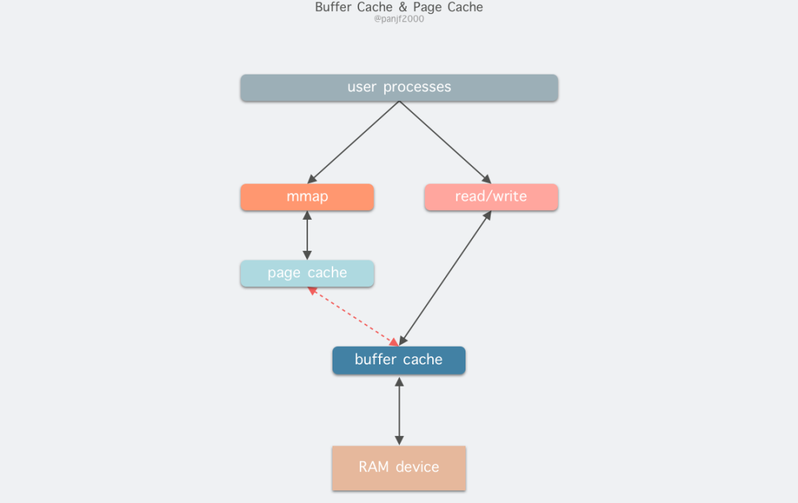

因为 `Buffer Cache` 是对粒度更细的设备块的缓存，而 `Page Cache` 是基于虚拟内存的页单元缓存，因此还是会基于 `Buffer Cache`，也就是说如果是缓存文件内容数据就会在内存里缓存两份相同的数据，这就会导致同一份文件保存了两份，冗余且低效。

因此在 Linux 2.4 版本之后，kernel 就将两者进行了统一，`Buffer Cache` 不再以独立的形式存在，而是以融合的方式存在于 `Page Cache` 中

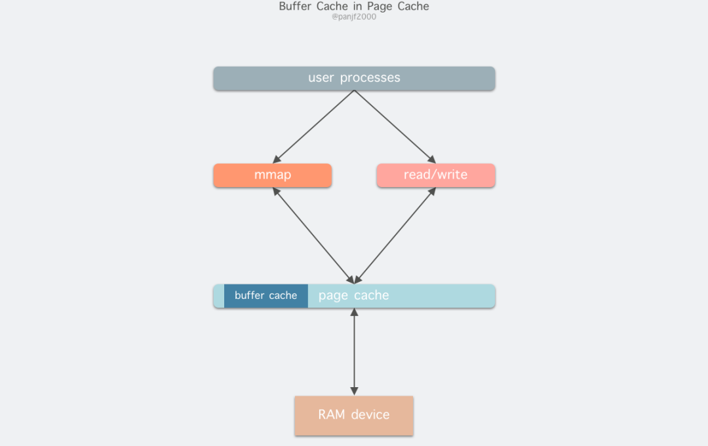

### DMA

IO操作通常要经过如下两个阶段：

- 数据准备阶段：数据从硬件到内核空间
- 数据拷贝阶段：数据从内核空间到用户空间

最基础的IO方式：

1. 用户进程发起`read()` 系统调用读取磁盘文件，陷入内核态并由其所在的 CPU 通过设备驱动程序向设备寄存器写入一个通知信号，告知设备控制器 (我们这里是磁盘控制器)要读取数据，然后CPU的当前进程进入sleep
2. 数据准备好之后磁盘控制器会通过总线发送一个中断信号到CPU
3. CPU 收到中断信号之后停止当前的工作，保护现场恢复现场，开始运行磁盘中断服务，把数据从磁盘控制器的缓冲区拷贝到主存里的内核缓冲区；然后将之前sleep的进程唤醒
4. CPU切换到之前的进程之后，再把数据从内核缓冲区拷贝到用户缓冲区，完成读取操作，read返回
   - 为什么不能由磁盘中断服务程序将read的进程唤醒然后由read的进程直接将数据从磁盘控制器拷贝到用户缓冲区？

可以看到传统IO方式中，硬件到内核的数据拷贝是由CPU完成的，而DMA方式从硬件到内核是由DMA代理的，CPU只需要告诉DMA控制器要读取哪些数据即可，DMA完成后再发中断给CPU，CPU在中断服务程序中唤醒之前的进程，切换过去，再把数据拷贝到用户缓冲区，节省了CPU的资源。

- 不确定xv6使用的是DMA还是基础的IO方式，反正都是等数据准备好了之后CPU收到中断执行中断服务程序，再切换回之前的进程将数据从内核缓冲区拷贝到用户缓冲区，再返回用户态。区别就是数据是谁拷贝到内核的。

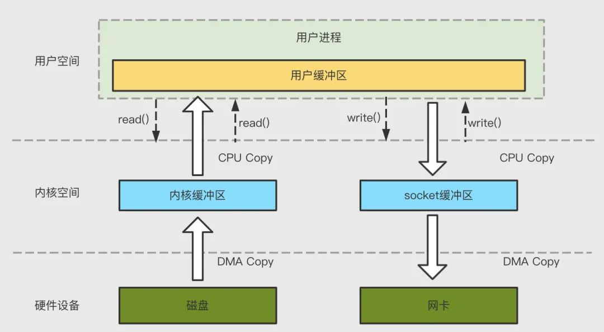

可以清楚看到这里一共触发了 4 次用户态和内核态的上下文切换，分别是 `read()/write()` 调用和返回时的切换，2 次 DMA 拷贝，2 次 CPU 拷贝，加起来一共 4 次拷贝操作。

### RDMA

RDMA是在两个或者多个计算机进行通讯的时候使用DMA， 从一个主机的内存直接访问另一个主机的内存。它是一种host-offload, kernel-bypass技术，允许应用程序(包括存储)在它们的内存空间之间直接做数据传输。

- 传统的TCP/IP技术在数据包处理过程中，要经过操作系统及其他软件层，需要占用大量的服务器资源和内存总线带宽，数据在系统内存、处理器缓存和网络控制器缓存之间来回进行复制移动，给服务器的CPU和内存造成了沉重负担。
- 而RDMA支持零拷贝(Zero-copy) ：应用程序能够直接执行数据传输，在不涉及到网络软件栈的情况下。数据能够被直接发送到缓冲区或者能够直接从缓冲区里接收，而不需要被复制到网络层。
- 内核旁路(Kernel bypass) - 应用程序可以直接在用户态执行数据传输，不需要在内核态与用户态之间做上下文切换。
- 不需要CPU干预(No CPU involvement) - 应用程序可以访问远程主机内存而不消耗远程主机中的任何CPU。远程主机内存能够被读取而不需要远程主机上的进程（或CPU)参与。远程主机的CPU的缓存(cache)不会被访问的内存内容所填充。

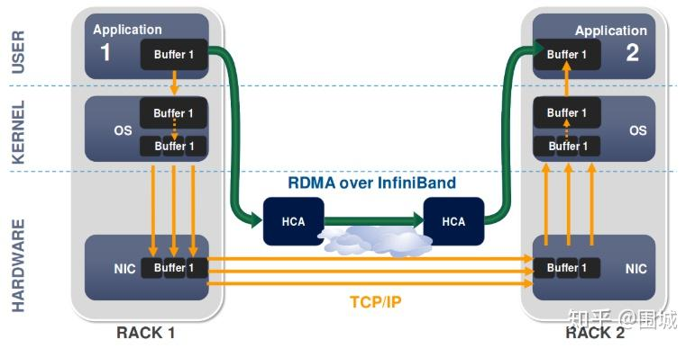

RDMA在传输内存之前要进行注册，因为RDMA硬件对用来做数据传输的内存是有特殊要求的

- 在数据传输过程中，应用程序不能修改数据所在的内存。
- 操作系统不能对数据所在的内存进行page out操作 -- 物理地址和虚拟地址的映射必须是固定不变的。

注意无论是DMA或者RDMA都要求物理地址连续，这是由DMA引擎所决定的。 

### zero-copy

零拷贝的几种实现思路：

#### 减少甚至避免用户空间和内核空间之间的数据拷贝

**mmap**

使用mmap将用户空间的内存映射到文件所在的内核缓冲区中，不需要把内容拷贝到用户空间，直接一次拷贝到socket buffer即可。

- 使用这种方法省去了一次 CPU 拷贝，对比传统的 Linux I/O 读写，数据不需要再经过用户进程进行转发了，而是直接在内核里就完成了拷贝。所以使用 `mmap()` 之后的拷贝次数是 2 次 DMA 拷贝，1 次 CPU 拷贝，加起来一共 3 次拷贝操作。

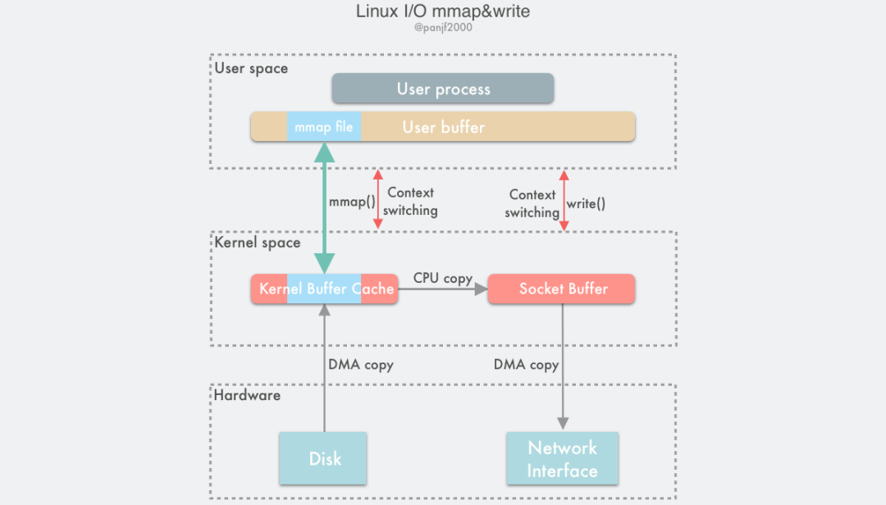

**sendfile()**

```c++
#include <sys/sendfile.h>

ssize_t sendfile(int out_fd, int in_fd, off_t *offset, size_t count);
```

out_fd 和 in_fd 分别代表了写入和读出的文件描述符，in_fd 必须是一个指向文件的文件描述符，且要能支持类 `mmap()` 内存映射，不能是 Socket 类型，而 out_fd 在 Linux 内核 2.6.33 版本之前只能是一个指向 Socket 的文件描述符，从 2.6.33 之后则可以是任意类型的文件描述符。off_t 是一个代表了 in_fd 偏移量的指针，指示 `sendfile()` 该从 in_fd 的哪个位置开始读取，函数返回后，这个指针会被更新成 `sendfile()` 最后读取的字节位置处，表明此次调用共读取了多少文件数据，最后的 count 参数则是此次调用需要传输的字节总数。

sendfile的流程如下：

1. 用户进程调用 `sendfile()` 从用户态陷入内核态，告诉DMA要读取数据，然后当前进程进入sleep（CPU执行其他线程）
2. 数据准备好后由DMA将数据从磁盘拷贝到内存，然后发中断给CPU
3. CPU 收到中断信号之后停止当前的工作，保护现场恢复现场，开始运行磁盘中断服务，唤醒之前的进程，切换过去，将内核缓冲区中的数据拷贝到套接字缓冲区；
4. 再告诉DMA要发送数据，然后当前进程再进入sleep（CPU执行其他线程）
5. DMA 控制器将数据从套接字缓冲区拷贝到网卡完成数据传输；
6. CPU再次收到中断信号，切换回之前的线程，sendfile返回，切换回用户态

基于 `sendfile()`， 整个数据传输过程中共发生 2 次 DMA 拷贝和 1 次 CPU 拷贝，这个和 `mmap()` + `write()` 相同，但是因为 `sendfile()` 只是一次系统调用，因此比前者少了一次用户态和内核态的上下文切换开销

但是`sendfile()` 在把磁盘文件从内核缓冲区（page cache）传输到到套接字缓冲区的过程中依然需要 CPU 参与

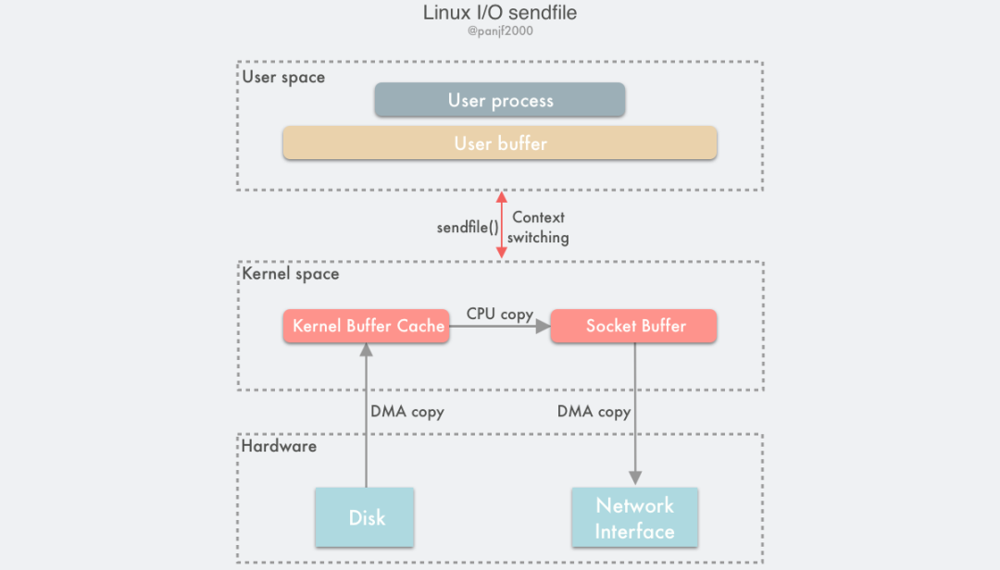

**sendfile() with DMA Scatter/Gather Copy**

gather 能够让 DMA 控制器根据少量的元信息：一个包含了内存地址和数据大小的缓冲区描述符，收集存储在各处的数据，最终还原成一个完整的网络包，直接拷贝到网卡而非套接字缓冲区，避免了最后一次的 CPU 拷贝：

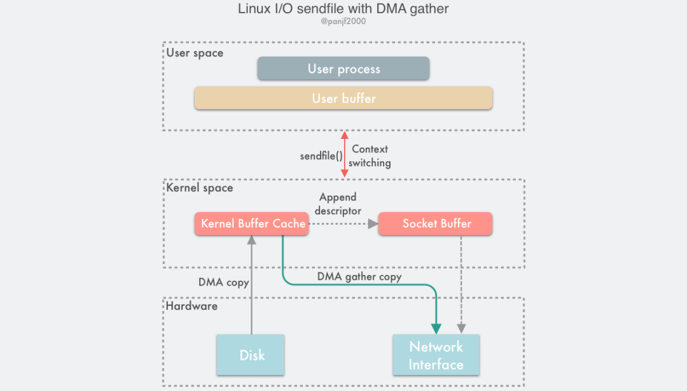

基于这种方案，我们就可以把这仅剩的唯一一次 CPU 拷贝也给去除了（严格来说还是会有一次，但是因为这次 CPU 拷贝的只是那些微乎其微的元信息，开销几乎可以忽略不计），理论上，数据传输过程就再也没有 CPU 的参与了

**splice()**

`sendfile()` + DMA Scatter/Gather 的零拷贝方案虽然高效，但是缺点是需要硬件支持。

为此，Linux 在 2.6.17 版本引入了一个新的系统调用 `splice()`，它在功能上和 `sendfile()` 非常相似，但是能够实现在任意类型的两个文件描述符时之间传输数据；而在底层实现上，`splice()`又比 `sendfile()` 少了一次 CPU 拷贝，

```c++
#include <fcntl.h>
#include <unistd.h>

int pipe(int pipefd[2]);
int pipe2(int pipefd[2], int flags);

ssize_t splice(int fd_in, loff_t *off_in, int fd_out, loff_t *off_out, size_t len, unsigned int flags);
```

fd_in 和 fd_out 也是分别代表了输入端和输出端的文件描述符，这两个文件描述符必须有一个是指向管道设备的。off_in 和 off_out 则分别是 fd_in 和 fd_out 的偏移量指针，指示内核从哪里读取和写入数据，len 则指示了此次调用希望传输的字节数，最后的 flags 是系统调用的标记选项位掩码，用来设置系统调用的行为属性的

**`splice()` 是基于 Linux 的管道缓冲区 (pipe buffer) 机制实现的**，所以 `splice()` 的两个入参文件描述符才要求必须有一个是管道设备，一个典型的 `splice()` 用法是：

```c
int pfd[2];
pipe(pfd);
ssize_t bytes = splice(file_fd, NULL, pfd[1], NULL, 4096, SPLICE_F_MOVE);
bytes = splice(pfd[0], NULL, socket_fd, NULL, bytes, SPLICE_F_MOVE | SPLICE_F_MORE);
```

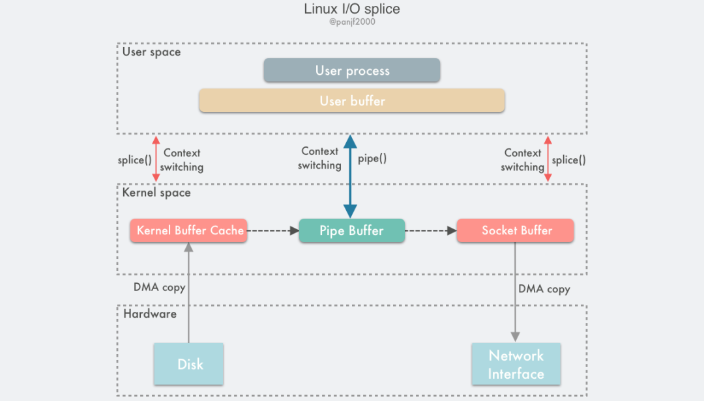

1. 用户进程调用 `pipe()`，从用户态陷入内核态，创建匿名单向管道，`pipe()` 返回，上下文从内核态切换回用户态；
2. 用户进程调用 `splice()`，从用户态陷入内核态；
3. DMA 控制器将数据从硬盘拷贝到内核缓冲区，CPU负责将内核缓冲区的数据从管道的写入端"拷贝"进管道，`splice()` 返回，上下文从内核态回到用户态；
4. 用户进程再次调用 `splice()`，从用户态陷入内核态；
5. 内核把数据从管道的读取端"拷贝"到套接字缓冲区，DMA 控制器将数据从套接字缓冲区拷贝到网卡；
6. `splice()` 返回，上下文从内核态切换回用户态。

这里splice本质上就是使用了linux的管道

Linux管道的容量单位是一个虚拟内存的页，也就是 4KB，总大小一般是 16 个页，使用环形链表将它们串起来，管道的页可以循环使用，提高内存利用率。

- file 结构体里的 inode 字段里会保存一个 pipe_inode_info 结构体指代管道，其中会保存很多读写管道时所需的元信息，环形队列的头部指针页，读写时的同步机制如互斥锁。
- 使用 pipe_buffer 结构体封装管道页，pipe_buffer 中保存了数据在内存中的页、偏移量和长度，以这三个值来定位数据

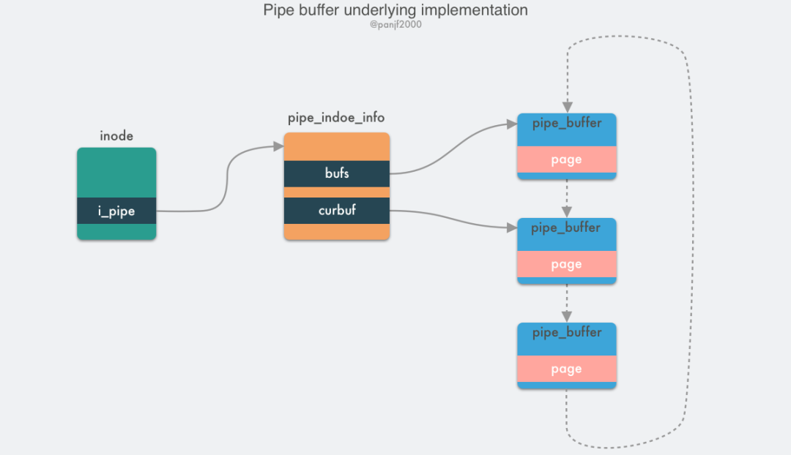

`splice()` 是基于 pipe buffer 实现的，但是它在通过管道传输数据的时候却是零拷贝，因为它在写入读出时并没有使用 pipe_write()/pipe_read() 真正地在管道缓冲区写入读出数据，而是通过把数据在内存缓冲区中的物理内存页框指针、偏移量和长度赋值给 pipe_buffer 中对应的三个字段来完成数据的"拷贝"，也就是其实**只拷贝了数据的内存地址等元信息**。

我的理解：所以splice就是将内核缓冲区和socket缓冲区之间指

向同一个物理地址，所以二者之间不需要CPU拷贝

实际上因为 `splice()` 利用管道而非硬件来完成零拷贝的实现比 `sendfile()` + DMA Scatter/Gather 的门槛更低，因此后来的 `sendfile()` 的底层实现就已经替换成 `splice()` 了

以上说的这些技术适用性很窄，因为它们**只适用于用户进程不需要直接处理数据的场景**，比如静态文件服务器或者是直接转发数据的代理服务器

## 虚拟内存

我们的程序在运行过程中还需要依赖动态链接库，这些动态链接库以 .so 文件的形式存放在磁盘中，比如 C 程序中的 glibc，里边对系统调用进行了封装。glibc 库里提供的用于动态申请堆内存的 malloc 函数就是对系统调用 sbrk 和 mmap 的封装。这些动态链接库也有自己的对应的代码段，数据段，BSS 段，也需要一起被加载进内存中。

还有用于内存文件映射的系统调用 mmap，会将文件与内存进行映射，那么映射的这块内存（虚拟内存）也需要在虚拟地址空间中有一块区域存储。

**这些动态链接库中的代码段，数据段，BSS 段，以及通过 mmap 系统调用映射的共享内存区，在虚拟内存空间的存储区域叫做文件映射与匿名映射区**。

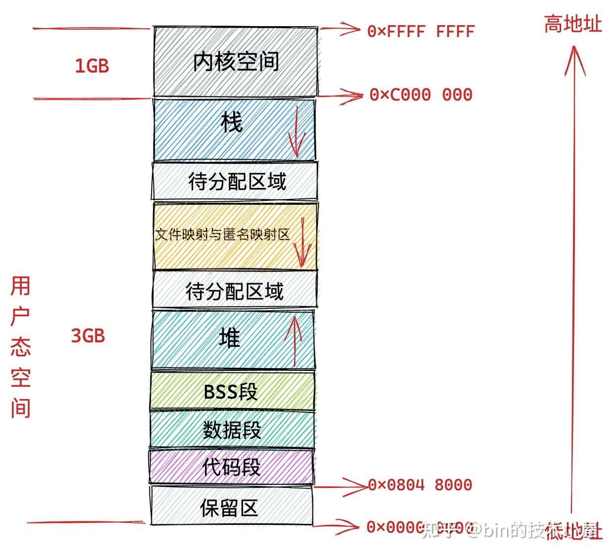

进程在内核中有一个描述符 task_struct 结构。**在pcb task_struct 结构中，有一个专门描述进程虚拟地址空间的内存描述符 mm_struct 结构，这个结构体中包含了进程虚拟内存空间的全部信息**。

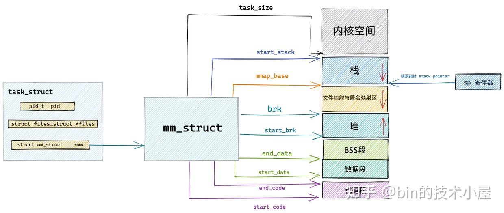

在 mm_struct 结构体中除了上述用于划分虚拟内存区域的变量之外，还定义了一些虚拟内存与物理内存映射内容相关的统计变量

- mm_struct 结构体中的 total_vm 表示在进程虚拟内存空间中总共与物理内存映射的页的总数。
- locked_vm 就是被锁定不能换出的内存页总数，pinned_vm 表示既不能换出，也不能移动的内存页总数。
- data_vm 表示数据段中映射的内存页数目，exec_vm 是代码段中存放可执行文件的内存页数目，stack_vm 是栈中所映射的内存页数目，这些变量均是表示进程虚拟内存空间中的虚拟内存使用情况。

mm_struct结构体中还有一个 vm_area_struct结构体，它描述了这些虚拟内存区域 VMA（virtual memory area）

- vm_area_struct结构体中有vm_page_prot 和 vm_flags 成员变量，都是用来标记 vm_area_struct 结构表示的这块虚拟内存区域的访问权限和行为规范。

  - 常见vm_flags标志位：
    - VM_READ，VM_WRITE，VM_EXEC 定义了虚拟内存区域是否可以被读取，写入，执行等权限。
    - VM_SHARD 用于指定这块虚拟内存区域映射的物理内存是否可以在多进程之间共享，以便完成进程间通讯。**设置这个值即为 mmap 的共享映射，不设置的话则为私有映射**。
    - VM_RESERVED 的设置表示在内存紧张的时候，这块虚拟内存区域非常重要，不能被换出到磁盘中。
    - VM_SEQ_READ 的设置用来暗示内核，应用程序对这块虚拟内存区域的读取是会采用顺序读的方式进行，内核会根据实际情况决定预读后续的内存页数，以便加快下次顺序访问速度。
    - VM_RAND_READ 的设置会暗示内核，应用程序会对这块虚拟内存区域进行随机读取，内核则会根据实际情况减少预读的内存页数甚至停止预读。

- 还有 anon_vma，vm_file，vm_pgoff 三个属性，他们与mmap相关。mmap可以映射到物理内存上，也可以映射到文件中，映射到物理内存上我们称之为匿名映射，映射到文件中我们称之为文件映射。

  - 匿名映射：当我们调用 malloc 申请内存时，如果申请的是小块内存（低于 128K）则会使用 do_brk() 系统调用通过调整堆中的 brk 指针大小来增加或者回收堆内存。

    如果申请的是比较大块的内存（超过 128K）时，则会调用 mmap 在虚拟内存空间中的文件映射与匿名映射区创建出一块 VMA 内存区域（这里是匿名映射）。这块匿名映射区域就用 struct anon_vma 结构表示

  - 当调用 mmap 进行文件映射时，vm_file 属性就用来关联被映射的文件。这样一来虚拟内存区域就与映射文件关联了起来。vm_pgoff 则表示映射进虚拟内存中的文件内容，在文件中的偏移。

在进程虚拟内存空间中包含的内存区域 VMA 比较多的情况下，同样的内存区域 vm_area_struct 会有两种组织形式，一种是双向链表用于高效的遍历，另一种就是红黑树用于高效的查找。

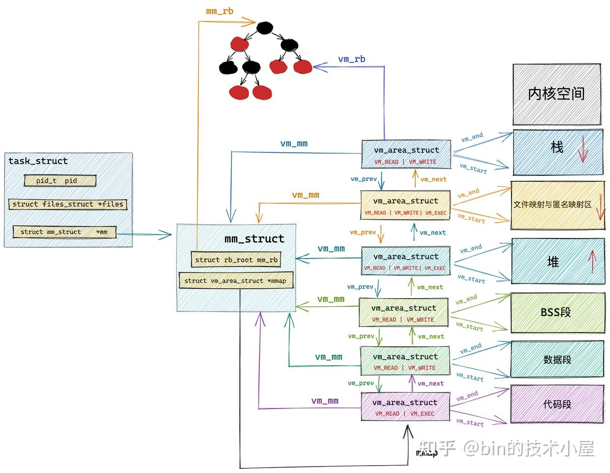

内核空间：

32位：

在总共大小 1G 的内核虚拟内存空间中，位于最前边有一块 896M 大小的区域，为直接映射区或者线性映射区，地址范围为 3G -- 3G + 896m 。这块连续的虚拟内存地址会映射到 0 - 896M 这块连续的物理内存上，**这块区域中的虚拟内存地址直接减去 0xC000 0000 (3G) 就得到了物理内存地址**。所以我们称这块区域为直接映射区。

在这段 896M 大小的物理内存中，前 1M 已经在系统启动的时候被系统占用，**1M 之后的物理内存存放的是内核代码段，数据段，BSS 段**（这些信息起初存放在 ELF格式的二进制文件中，在系统启动的时候被加载进内存），比如内核中的数据结构task_struct，进程的内存空间描述符 mm_struct，以及虚拟内存区域描述符 vm_area_struct 、进程的内核栈等都在这里。

除此之外，DMA 只能对内存的前16M 进行寻址，这就导致了不能在整个 32 位地址空间中执行 DMA，只能使用物理内存的前 16M 进行 DMA 操作。因此直接映射区的前 16M 的内存区域我们称之为 ZONE_DMA。用于 DMA 的内存必须从 ZONE_DMA 区域中分配。而直接映射区中剩下的部分也就是从 16M 到 896M（不包含 896M）这段区域，我们称之为 ZONE_NORMAL

物理内存 896M 以上的区域被内核划分为 ZONE_HIHMEM 区域，称之为高端内存。内核剩余可用的虚拟内存空间就变为了 1G - 896M = 128M，而物理内存则远比128M大，所以这里使用的是动态映射的方式，一部分一部分的分批映射，先映射正在使用的这部分，使用完毕解除映射，接着映射其他部分。

和用户态进程使用 malloc 申请内存一样，在这块动态映射区内核是使用 vmalloc 进行内存分配。由于 vmalloc 获得的物理内存页是不连续的，因此它只能将这些物理内存页一个一个地进行映射，在性能开销上会比直接映射大得多。

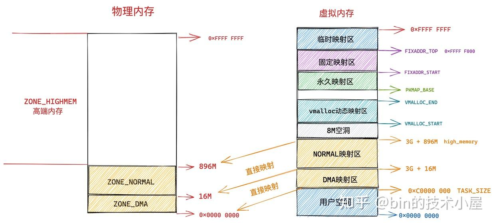

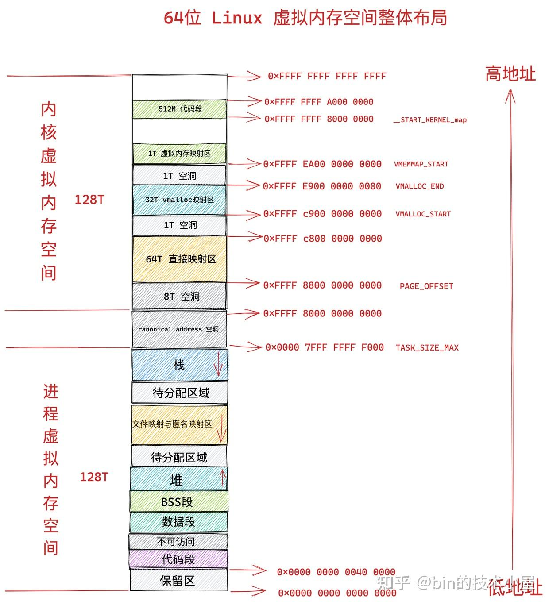

**CPU 总是以 word size 为单位从内存中读取数据，在 64 位处理器中的 word size 为 8 个字节。64 位的内存每次只能吞吐 8 个字节。**CPU 每次会向内存读写一个 cache line 大小的数据（ 64 个字节），但是内存一次只能吞吐 8 个字节。

所以linux的内存管理和xv6与pintos都不太一样，xv6是将内核页表一对一映射到相同的物理内存位置，然后将内核页表的下面空闲的部分作为用户页表，因为它的物理内存的低位是没法用的；pintos也是将内核页表一对一映射到所有的物理内存，但是它是有点类似linux的布局方式，将3G的虚拟内存映射到物理内存的最低位，因为它的物理内存是从0开始使用的。由于内核页表映射了所有的物理内存，所以pintos可以使用的物理内存不超过1G。**而linux与pintos不同之处在于，它的内核页表只有低896M是一对一映射到物理内存的低896M的，剩下的128M是动态映射的，Linux为系统中的每个物理页维护一个`struct page`数据结构，当它需要为用户页表映射物理页时，它直接从伙伴系统中获取空闲的物理页即可；当他需要访问某个高端物理页时直接将它映射到高128M处，访问完之后就可以取消映射了**。

但是对于64位的linux来说，它内核页表的直接映射区高达64T，可以映射所有的物理内存，所以动态映射区的存在意义是什么？
