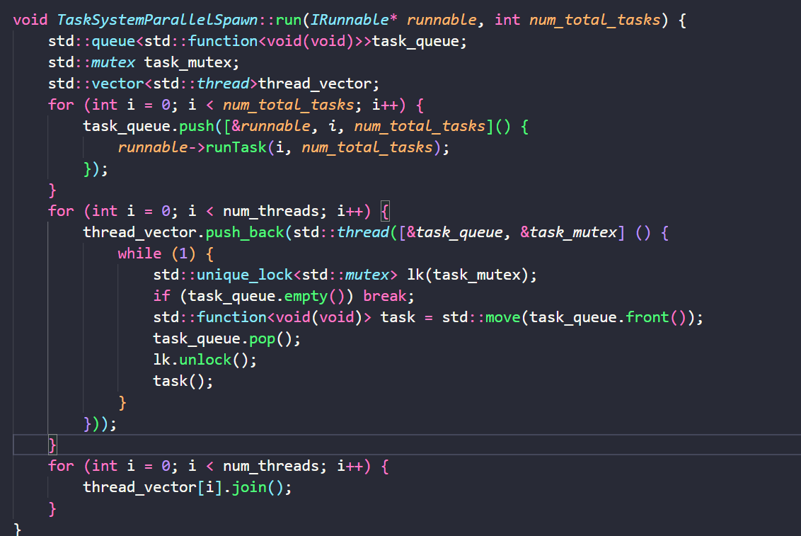

# Assignment 1: Performance Analysis on a Quad-Core CPU

## Program 1 生成曼德博图像

曼德博集合是所有满足以下条件的复数`c`的集合：从`z = 0`开始迭代`z = z^2 + c`，如果在一定数量的迭代后`z`的模（大小）变得非常大（这里使用的阈值是4），那么可以认为该点`c`不属于曼德博集合。

`mandelbrotSerial`函数：

- `x0`, `y0`, `x1`, `y1`定义了复平面上的视口，即你想要可视化的曼德博集合的区域。
- `width`, `height`定义了生成图像的大小，即分辨率。
- `startRow`, `totalRows`允许函数仅计算图像的一部分，

遍历图像的每个像素，将像素看做是复平面上的点，将像素的坐标xy分别看做是复数的实部和虚部，对其调用mandel函数，确定在`maxIterations`次迭代次数内该点是否属于曼德博集合，并将实际的迭代次数存储在输出数组中。

输出数组`output[]`最终包含了图像中每个像素点对应的迭代次数。这个迭代次数可以用来确定绘制像素的颜色：通常，属于曼德博集合的点（即在`maxIterations`次迭代内`z`的模没有变得非常大的点）会被绘制为一种颜色（通常是黑色），而其他点的颜色则根据它们逃离集合边界的速度（即迭代次数）来决定，创建出独特的曼德博集合的分形图案。

`mandel`函数：它对于每个像素点上的复数`c`，通过迭代过程判断该点是否属于曼德博集合。

- `c_re`和`c_im`代表复数`c`的实部和虚部，迭代开始时，`z`的初始值也是`c`，即`z_re = c_re`，`z_im = c_im`。
- 在每次迭代中，通过`z = z^2 + c`更新`z`的值。这里使用`new_re = z_re*z_re - z_im*z_im`来计算下一个`z`的实部，`new_im = 2.f * z_re * z_im`来计算虚部。然后，将这些新计算出的值加上`c`的原始实部和虚部来更新`z`。
- 如果在任何时候`z`的模的平方（`z_re * z_re + z_im * z_im`）大于4，就终止迭代，因为这意味着该点不属于曼德博集合。
- 函数返回当前的迭代次数，这个次数反映了点`c`逃离曼德博集合边界的速度。

main文件负责用来计算串行和多线程版本的结果和使用时间，使用 `./mandelbrot --view 1`可以计算出图片1，使用 `./mandelbrot --view 2`计算出图片2


原始实现策略：一个线程计算出一部分图片，比如如果是2个线程，一个计算上半部分，一个计算下半部分；如果是四个线程，则分成四等分给四个线程

```c++
void workerThreadStart(WorkerArgs * const args) {
    int numRowsPerThread = (args->height - 0) / args->numThreads;
    int startRow = numRowsPerThread * args->threadId;
    // 只需要为每个线程指定起始的行startRow和每个线程负责多少行，其余的都不变
    mandelbrotSerial(args->x0, args->y0, args->x1, args->y1, args->width, args->height, startRow, numRowsPerThread, args->maxIterations, args->output);
}
```

结果：两个线程时加速比可以达到2倍，但是四个线程时加速比还是2倍多一点

在每个线程的workerThreadStart的中打印所需的时间：


发现原来是任务负载不均衡，在曼德博集合的渲染中，图像的不同部分可能需要不同的计算量。简单地将图像平均分配给每个线程可能导致一些线程早早完成它们的任务，而其他线程仍然忙于计算，拖了后腿。

于是将分配粒度改为每间隔两行分配一个线程

```c++
void workerThreadStart(WorkerArgs * const args) {
    int numRowsPerThread = 2;
    int startRow = numRowsPerThread * args->threadId;
    for (size_t i = startRow; i < args->height; i += numRowsPerThread * args->numThreads) {
        // 只需要为每个线程指定起始的行startRow和每个线程负责多少行，其余的都不变
        mandelbrotSerial(args->x0, args->y0, args->x1, args->y1, args->width, args->height, i, numRowsPerThread, args->maxIterations, args->output);
    } 
}
```

速度明显提升，八个线程时加速比能够达到7.6左右

## Program 2: Vectorizing Code Using SIMD Intrinsics

如果一个函数要接受float*类型参数，而我有一个int类型 的数组，不能直接使用 `reinterpret_cast<float*>`将数组指针转换成`float*`，因为这是将指针的解释方式改变了，它不仅改变了对指针++时移动的空间，还会改变对指针解引用时的结果，改变解释方式不仅仅对复合类型的指针有影响，对内置类型也会有影响，比如这个例子，它会将int四字节里存储的数据按照float的方式解释，得到的结果就会不一样

解决这个问题的方法只能是创建一个新的float数组，遍历int数组，将每个数转换成float后写入float数组，然后再把新的float数组传入函数

```C++
// accepts an array of values and an array of exponents
//
// For each element, compute values[i]^exponents[i] and clamp value to
// 9.999.  Store result in output.
void clampedExpSerial(float* values, int* exponents, float* output, int N) {
  for (int i=0; i<N; i++) {
    float x = values[i];
    int y = exponents[i];
    if (y == 0) {
      output[i] = 1.f;
    } else {
      float result = x;
      int count = y - 1;
      while (count > 0) {
        result *= x;
        count--;
      }
      if (result > 9.999999f) {
        result = 9.999999f;
      }
      output[i] = result;
    }
  }
}
void clampedExpVectorSimd(float* values, int* exponents, float* output, int N) {
  __m256 result, x, y, zero = _mm256_set1_ps(0.f), max = _mm256_set1_ps(9.999999f); // __m256代表256位的float，set1代表广播
  
}
void clampedExpVector(float* values, int* exponents, float* output, int N) {
  // CS149 STUDENTS TODO: Implement your vectorized version of
  // clampedExpSerial() here.
  //
  // Your solution should work for any value of
  // N and VECTOR_WIDTH, not just when VECTOR_WIDTH divides N
  __cs149_vec_float result;
  __cs149_vec_float x; // value
  __cs149_vec_float y; // exponents
  __cs149_vec_float zero = _cs149_vset_float(0.f);
  __cs149_vec_float max = _cs149_vset_float(9.999999f);
  __cs149_mask maskIsZero = _cs149_init_ones(0);
  __cs149_mask maskAll = _cs149_init_ones(VECTOR_WIDTH);
  float f_exponents[N];
  for (int i = 0; i < N; i++) {
    f_exponents[i] = static_cast<float>(*(exponents + i));
  }
  int remainder = N % VECTOR_WIDTH;
  for (int i = 0; i < N - remainder; i += VECTOR_WIDTH) {
    _cs149_vload_float(x, values + i, maskAll);
    _cs149_vload_float(y, f_exponents + i, maskAll);
    _cs149_veq_float(maskIsZero, y, zero, maskAll); // if (y == 0)
    _cs149_vset_float(result, 1.f, maskIsZero);     // result[i] = 1.f
    __cs149_mask maskIsNotZero = _cs149_mask_not(maskIsZero);                    // else
    _cs149_vmove_float(result, x, maskIsNotZero);      // float result = x;
    __cs149_vec_float count, one = _cs149_vset_float(1.f);
    _cs149_vsub_float(count, y, one, maskIsNotZero);   // int count = y - 1;
    __cs149_mask maskIsGtZero = _cs149_init_ones(0);   // while(count > 0)
    _cs149_vgt_float(maskIsGtZero, count, zero, maskAll);
    while (_cs149_cntbits(maskIsGtZero) != 0) {       // 只要还有count大于0就继续循环
      _cs149_vmult_float(result, result, x, maskIsGtZero); // result = result * x;
      _cs149_vsub_float(count, count, one, maskIsGtZero);  // count = count - 1;
      _cs149_vgt_float(maskIsGtZero, count, zero, maskAll);// 计算有哪些count > 0
    }
    __cs149_mask maskIsGtMax = _cs149_init_ones(0);
    _cs149_vgt_float(maskIsGtMax, result, max, maskAll); // if (result > 9.999999f)
    _cs149_vmove_float(result, max, maskIsGtMax);        // result = 9.99999f
    _cs149_vstore_float(output + i, result, maskAll);    // output[i] = result
  }
  clampedExpSerial(values + (N - remainder), exponents + (N - remainder), output + (N - remainder), remainder);
}

// returns the sum of all elements in values
float arraySumSerial(float* values, int N) {
  float sum = 0;
  for (int i=0; i<N; i++) {
    sum += values[i];
  }

  return sum;
}

// returns the sum of all elements in values
// You can assume N is a multiple of VECTOR_WIDTH
// You can assume VECTOR_WIDTH is a power of 2
float arraySumVector(float* values, int N) {
  //
  // CS149 STUDENTS TODO: Implement your vectorized version of arraySumSerial here
  //
  __cs149_mask maskAll = _cs149_init_ones(VECTOR_WIDTH);
  float temp[VECTOR_WIDTH];
  float sum = 0;
  for (int i=0; i<N; i+=VECTOR_WIDTH) {
    __cs149_vec_float x;
    _cs149_vload_float(x, values + i, maskAll);
    for (int i = 0; i < log2(VECTOR_WIDTH); i++) {
      _cs149_hadd_float(x, x);
      _cs149_interleave_float(x, x);
    }
    _cs149_vstore_float(temp, x, maskAll);
    sum += temp[0];
  }
  return sum;
}
```

avx2实现版本：

```c++
void clampedExpVectorSimd(float* values, int* exponents, float* output, int N) {
  __m256 max = _mm256_set1_ps(9.999999f); // __m256代表256位的float，set1代表广播
  int remainder = N % VECTOR_WIDTH;
  __m256i zero = _mm256_set1_epi32(0);
  __m256i one = _mm256_set1_epi32(1);
  __m256i maskAll = _mm256_set1_epi32(-1); // avx2的掩码是用向量表示的，每个元素的二进制最高位为1表示保留这个元素，所以用-1设置，因为-1的二进制表示最高位是1
  for (int i = 0; i < N - remainder; i += VECTOR_WIDTH) {
    __m256 x = _mm256_loadu_ps(values + i); // x = values[i]
    __m256i y = _mm256_maskload_epi32(exponents + i, maskAll); // y = exponents[i]
    __m256i maskIsZero = _mm256_cmpeq_epi32(y, zero);    // if y == 0
    __m256 result = _mm256_blendv_ps(_mm256_set1_ps(0.f), _mm256_set1_ps(1.f), _mm256_castsi256_ps(maskIsZero));    // result[i] = 1.f

    __m256i maskIsNotZero = _mm256_xor_si256(maskIsZero, _mm256_set1_epi32(-1)); // 对全1的向量异或即可对掩码取反
    result = _mm256_blendv_ps(result, x, _mm256_castsi256_ps(maskIsNotZero)); // result = x
    // 每一轮循环count要减的1要更新，result要乘的x也要更新
    __m256i oneForCountToMinus = _mm256_cvtps_epi32(_mm256_blendv_ps(_mm256_cvtepi32_ps(zero), _mm256_cvtepi32_ps(one), _mm256_castsi256_ps(maskIsNotZero)));
    __m256i count = _mm256_sub_epi32(y, oneForCountToMinus);
    __m256i maskIsGtZero = _mm256_cmpgt_epi32(count, zero);
    int mask = _mm256_movemask_ps(_mm256_castsi256_ps(maskIsGtZero));
    int notZeroNum = __builtin_popcount(mask);
    x = _mm256_blendv_ps(_mm256_cvtepi32_ps(one), x, _mm256_castsi256_ps(maskIsGtZero));
    while (notZeroNum) {
      result = _mm256_mul_ps(result, x); // result = result * x;
      count = _mm256_sub_epi32(count, oneForCountToMinus);

      maskIsGtZero = _mm256_cmpgt_epi32(count, zero);
      mask = _mm256_movemask_ps(_mm256_castsi256_ps(maskIsGtZero));
      notZeroNum = __builtin_popcount(mask);
      x = _mm256_blendv_ps(_mm256_cvtepi32_ps(one), x, _mm256_castsi256_ps(maskIsGtZero));
      oneForCountToMinus = _mm256_cvtps_epi32(_mm256_blendv_ps(_mm256_cvtepi32_ps(zero), _mm256_cvtepi32_ps(oneForCountToMinus), _mm256_castsi256_ps(maskIsGtZero)));
    }
    __m256 maskGtMax = _mm256_cmp_ps(result, max, _CMP_GT_OQ);
    result = _mm256_blendv_ps(result, max, maskGtMax);
    _mm256_storeu_ps(output + i, result);
  }
  clampedExpSerial(values + (N - remainder), exponents + (N - remainder), output + (N - remainder), remainder);
}
```

如果莫名其妙出现segfault，那么可能是使用了需要对齐的指令，比如store和load

## Program 3 ISPC

ISPC编译器将一组程序实例映射到在**单个核**上执行的SIMD指令。这种并行化方案不同于程序1，在程序1中，通过在多个核上运行线程来实现加速。

pthread线程和ISPCtask有什么区别？

## Program 4: Iterative `sqrt`

该程序分别使用顺序、ISPC单任务和ISPC多任务方式来实现sqrt，sqrt对于不同数的计算的迭代次数不同


要求：修改sqrt输入数组的内容，从而让ISPC对顺序实现版本的加速比达到最小和最大

由于ISPC本质上是用SIMD指令实现的（这里使用的是avx2的256位的指令），所以每一次是对数组中八个数据并行进行计算的，所以要想让加速比最小，可以每八个数字中放七个1，一个2.999，从而拖慢ISPC的速度


要让加速比最大，就让所有的数字都是2.999


使用avx2指令实现sqrt：

顺序版本：


avx2版本：

```c++
__m256 fabsVector(__m256 values) {
    __m256 zero = _mm256_set1_ps(0.f);
    __m256 maskLtZero = _mm256_cmp_ps(values, zero, _CMP_LT_OQ);
    __m256 minusValues = _mm256_sub_ps(zero, values);
    values = _mm256_blendv_ps(values, minusValues, maskLtZero);
    return values;
}
void sqrtVector(int N, float initialGuess, float values[], float output[]) {
    const int VECTOR_WIDTH = 8;
    int remainder = N % VECTOR_WIDTH;
    __m256i maskAll = _mm256_set1_epi32(-1);
    __m256 kThreshold = _mm256_set1_ps(0.00001f);
    for (int i = 0; i < N - remainder; i += VECTOR_WIDTH) {
        __m256 x = _mm256_maskload_ps(values + i, maskAll); 
        __m256 guess = _mm256_set1_ps(initialGuess); 
        __m256 error = fabsVector(_mm256_sub_ps(_mm256_mul_ps(_mm256_mul_ps(guess, guess), x), _mm256_set1_ps(1.f)));
        __m256 maskGtK = _mm256_cmp_ps(error, kThreshold, _CMP_GT_OQ);
        int tempMask = _mm256_movemask_ps(maskGtK);
        int GtZeroNums = __builtin_popcount(tempMask);
        while (GtZeroNums) {
            // 3.f * guess
            __m256 guess3 = _mm256_mul_ps(_mm256_set1_ps(3.f), guess);
            // x * guess * guess * guess
            __m256 xguess = _mm256_mul_ps(_mm256_mul_ps(_mm256_mul_ps(x, guess), guess), guess);
            guess = _mm256_blendv_ps(guess, _mm256_mul_ps(_mm256_sub_ps(guess3, xguess), _mm256_set1_ps(0.5f)), maskGtK); // 根据mask选择不变的值
            error = fabsVector(_mm256_blendv_ps(error, _mm256_sub_ps(_mm256_mul_ps(_mm256_mul_ps(guess, guess), x), _mm256_set1_ps(1.f)), maskGtK));

            maskGtK = _mm256_cmp_ps(error, kThreshold, _CMP_GT_OQ);
            tempMask = _mm256_movemask_ps(maskGtK);
            GtZeroNums = __builtin_popcount(tempMask);
        }
        _mm256_storeu_ps(output + i, _mm256_mul_ps(x, guess));
    }
    sqrtSerial(remainder, initialGuess, values + N - remainder, output + N - remainder);
}
```

## Program 5: BLAS `saxpy`

FLOPS是一个衡量计算性能的术语，全称为"Floating Point Operations Per Second"，即每秒浮点运算次数，这个指标通常不区分浮点加法、减法、乘法还是除法运算的具体类型，理论上的FLOPS通常是基于处理器执行最简单操作（如浮点加法）的能力计算得出的最大性能指标。但是实际上不同类型的浮点运算所消耗的时钟周期是不一样的，所以实际数值会低于峰值

```C++
// return GB/s
static float
toBW(int bytes, float sec) {
    return static_cast<float>(bytes) / (1024. * 1024. * 1024.) / sec;
}

static float
toGFLOPS(int ops, float sec) {
    return static_cast<float>(ops) / 1e9 / sec;
}
const unsigned int N = 20 * 1000 * 1000; // 20 M element vectors (~80 MB)
const unsigned int TOTAL_BYTES = 4 * N * sizeof(float);
const unsigned int TOTAL_FLOPS = 2 * N;
float* arrayX = new float[N];
float* arrayY = new float[N];
float* resultSerial = new float[N];
float* resultISPC = new float[N];
float* resultTasks = new float[N];
double minSerial = 1e30;
for (int i = 0; i < 3; ++i) {
    double startTime =CycleTimer::currentSeconds();
    saxpySerial(N, scale, arrayX, arrayY, resultSerial);
    double endTime = CycleTimer::currentSeconds();
    minSerial = std::min(minSerial, endTime - startTime);
}

printf("[saxpy serial]:\t\t[%.3f] ms\t[%.3f] GB/s\t[%.3f] GFLOPS\n",
       minSerial * 1000,
       toBW(TOTAL_BYTES, minSerial),
       toGFLOPS(TOTAL_FLOPS, minSerial));
```

对于`result = scale*X+Y`这个操作（result、X、Y都是向量），

- `TOTAL_BYTES`计算为`4 * N * sizeof(float)`，这是因为数组`X`、`Y`和`result`各有`N`个`float`类型的元素，每个`float`元素占用4个字节（`sizeof(float)`）。因此，`TOTAL_BYTES`表示所有这三个数组所占用的总字节数（不知道为什么不是3而是4），再除以时间得到带宽

- 每次迭代执行1次乘法和1次加法，共计2次浮点运算。因此，对于`N`个元素的数组，总共有`2 * N`次浮点运算。再除以时间得到FLOPS

# Assignment 2: Building A Task Execution Library from the Ground Up

## Part A: Synchronous Bulk Task Launch

实现类似ISPC task（注意，ISPC gang是由SIMD指令实现的单核SPMD程序，而ISPC task是多核的SPMD程序）的并行编程框架ITaskSystem类，该类中的run函数启动num_total_task个任务

```c++
class ITaskSystem {
    public:
        /*构造task系统时指定此系统中的最大运行的线程数
         */
        ITaskSystem(int num_threads);
        virtual ~ITaskSystem();
        virtual const char* name() = 0;

        /*执行num_total_tasks个批量任务的启动，这些任务的执行与调用的线程是同步的，所以只有
          当所有的任务都结束后run函数才会返回
        */
        virtual void run(IRunnable* runnable, int num_total_tasks) = 0;

        /*
          异步执行 num_total_tasks 个批量任务的启动，但这些任务依赖于之前启动的任务，
          要运行当前的批量任务，必须等数组“deps”中引用的所有批量任务执行完成，而调用者
          必须调用 sync() 方法来确保当前启动的批量任务完成。
          
          此函数返回一个标识符，表示当前启动的批量的id，该标识符可在对 runAsnycWithDeps() 的后续调用中使用，
          以指定某些未来的批量任务启动对此批量任务启动的依赖关系。
         */
        virtual TaskID runAsyncWithDeps(IRunnable* runnable, int num_total_tasks,
                                        const std::vector<TaskID>& deps) = 0;

        /*
          调用者可以通过调用 sync() 方法来确保当前启动的批量任务完成。
         */
        virtual void sync() = 0;
};
```

每个任务实现在IRunnable类的runTask函数中，任务系统向每个runtask函数传入当前task的id和总task的数目，用户在runTask函数中就根据这两个变量来划分任务，比如如果总task数目是2，那么就0号task做一半，1号task做另一半

```c++
class IRunnable {
    public:
        virtual ~IRunnable();
        virtual void runTask(int task_id, int num_total_tasks) = 0;
};
class SimpleMultiplyTask : public IRunnable {
    public:
        int num_elements_;
        int* array_;

        SimpleMultiplyTask(int num_elements, int* array)
            : num_elements_(num_elements), array_(array) {}
        ~SimpleMultiplyTask() {}

        void runTask(int task_id, int num_total_tasks) {
            int elements_per_task = (num_elements_ + num_total_tasks-1) / num_total_tasks;
            int start_el = elements_per_task * task_id;
            int end_el = std::min(start_el + elements_per_task, num_elements_);
            for (int i=start_el; i<end_el; i++)
                array_[i] = multiply_task(3, array_[i]);
        }
};

```

所以用户只需要**负责任务的划分**，实现runtask函数，然后将runtask函数以及想要并行执行的任务数量传入任务系统；任务系统就负责创建多个线程，然后调度任务，将runtask函数**动态**分配给不同的线程并行执行，但是任务系统中创建的线程数受到构造时传入的num_threads的限制

本asst就是要实现支持同步和异步的任务系统

实现方式一：在run函数中创建num_threads个线程，然后给空闲的线程分配任务，直到所有的任务分配完


但是这种方式会难以兼顾所有的线程，可能有的线程空闲了但是run函数没有发现

更好的方式：创建任务队列，将num_total_tasks个任务塞入队列中，再创建num_threads个线程，由线程去队列抢任务，直到任务做完

- 这种方式实际上就是os内核进程调度的方式，进程的free_list实际上就是一个任务队列，等待cpu的核去调度
- 这实际上是任务分配的两种不同的层级，**在用户层面，ISPC task框架或者TBB中有一个线程池，有很多内容差不多的任务（程序实例），框架负责调度任务运行在不同的线程上；在系统层面，OS中有多个物理核心，有很多内容不同的线程，OS负责调度线程运行在不同的物理核心上**
  - 程序员也可以通过管理处理器亲和性（Affinity）来管理线程分配；cuda的线程块到gpu硬件的分配则是由硬件负责的



改进：上面的做法每次run的时候都要创建num_threads个线程，然后再销毁，效率低下；所以改进是使用线程池，

- 在任务系统构造时就创建num_threads个线程，然后这些线程一直轮询任务队列，只要任务队列不为空就从中执行任务；
- 调用run函数的时候向任务队列中添加lambda表达式，然后等待任务队列为空（注意！任务队列为空不一定表示所有任务都执行完了，有可能还有任务正在执行）；
- 最后析构函数负责将一个结束标志位置为true，线程池中的线程轮询时会顺便查看这个标志位，发现要结束了，就会停止循环，结束线程；然后析构函数挨个join线程，最后结束


优化：由于任务队列中的function的内容高度相同，所有function之间唯一的区别就是i不一样，仅仅是对runTask函数包装了一层而已；**与其先构造一个function把runTask包装一层放到任务队列中，然后线程再从任务队列中获取function，再通过function调用runTask，不如省去构造function的过程，直接让线程调用runTask**

具体实现：根本不需要维护任务队列，在任务系统中维护一个剩余的任务数量即可，线程根据这个剩余的任务数量就能知道执行什么任务了


**由于这一步不允许使用条件变量，所以使用了大量的轮询，在大多数情况下都是在空循环中反复拿锁放锁，造成锁争用，cpu的空转**

再改进：允许使用条件变量，

- 剩余任务数量为0时线程睡眠
- run函数更新任务数量后，将线程唤醒；然后进入睡眠等待任务全部执行完；
- 析构函数将finished标志位置位，然后唤醒所有线程，他们检查到finished之后就会停止循环，结束线程

```c++
  std::condition_variable producer;
  std::condition_variable consumer;
  std::vector<std::thread> thread_vector;
  bool finished;
  int num_total_tasks;
  int remain_tasks;
  int num_threads;
  int unfinished_tasks;
  IRunnable *runnable;

  std::mutex task_mutex;

TaskSystemParallelThreadPoolSleeping::TaskSystemParallelThreadPoolSleeping(
    int num_threads)
    : ITaskSystem(num_threads), finished(false), remain_tasks(0),
      num_threads(num_threads) {

  for (int i = 0; i < num_threads; i++) {
    thread_vector.emplace_back(std::thread([&]() {
      while (1) {
        int cur_task_id;
        {
          std::unique_lock<std::mutex> lk(task_mutex);
          while (remain_tasks == 0 && !finished) {
            consumer.wait(lk);
          }
          if (finished)
            return;
          cur_task_id = remain_tasks - 1;
          remain_tasks--;
        }
        runnable->runTask(cur_task_id, num_total_tasks);

        std::unique_lock<std::mutex> lk(task_mutex);
        unfinished_tasks--;
        if (unfinished_tasks == 0) {
          producer.notify_one();
        }
      }
    }));
  }
}

TaskSystemParallelThreadPoolSleeping::~TaskSystemParallelThreadPoolSleeping() {
  {
    std::unique_lock<std::mutex> lk(task_mutex);
    finished = true;
  }
  consumer.notify_all();
  for (auto &thread : thread_vector) {
    thread.join();
  }
}

void TaskSystemParallelThreadPoolSleeping::run(IRunnable *runnable,
                                               int num_total_tasks) {
  {
    std::unique_lock<std::mutex> lk(task_mutex);
    remain_tasks = num_total_tasks;
    this->num_total_tasks = num_total_tasks;
    this->unfinished_tasks = num_total_tasks;
    this->runnable = runnable;
  }
  consumer.notify_all();
  std::unique_lock<std::mutex> lk(task_mutex);
  while (unfinished_tasks > 0) {
    producer.wait(lk);
  }
}
```


## Part B: Supporting Execution of Task Graphs

每一次run属于一个bulk，每一个bulk中有很多task；bulk之间有依赖关系；

定义一个bulk对象，内部记录了它的id、任务队列、以及**维护了一个set记录此时该bulk的依赖id**

定义一个哈希表，维护了系统中所有没有结束的（不管是正在运行的还是阻塞中的）bulk的id到被它阻塞的bulk之间（一个队列）的映射

- 此结构可以用于查看系统中是否还有没有结束的任务，和sync相关，所以需要一个条件变量

维护一个ready队列，记录当前所有没有依赖项，可以运行的bulk

- 此结构用于线程判断是否有任务可以执行，所以也需要一个条件变量

每次run的时候先将传入的bulk id记录在哈希表中，表示该bulk此时正在运行或者等待；然后遍历传入的该bulk的依赖数组，查看每一个依赖的bulk id是否在哈希表中，如果不在就说明此依赖已经结束了；如果在就要将id记录在bulk对象的set中，并且将当前的bulk记录在哈希表中依赖bulk的队列中

遍历结束后，如果该bulk没有依赖了，那么就将bulk送入ready 队列中，并把线程唤醒

线程从ready队列中选择一个bulk，再从bulk的任务队列中选择一个任务执行；如果bulk的任务队列空了，就说明bulk被执行完了，那么就将此bulk从ready队列中删除，

任务执行完之后，如果此bulk所有任务都执行完了，需要检查它是否解锁了其他依赖它的bulk，并立即将解锁的bulk加入到`ready_bulk_queue`中

- 遍历哈希表中被当前bulk阻塞的bulk队列，将当前bulk的id从队列中的所有bulk的依赖set中去除，如果某一个bulk的依赖空了，那么就要将这个bulk加到ready队列中

最后将当前bulk的表项从哈希表中删除，表明它真的执行完了；如果哈希表空了，就可以把sync函数唤醒。

### bug1

**从条件变量中唤醒之后没有在条件锁的范围内把条件改变**，导致出了区间后执行cur_task时会有另外的线程也从条件变量中唤醒了，但是此时我们的本意是条件不成立，不期望出现这样的行为，因为任务已经被前一个线程拿走了。


所以应该在选定了任务之后马上把任务从bulk的队列中删除。但是这又涉及到一个问题，无法使用队列的size判断一个bulk是否真的执行完了，那么就只能在bulk中再维护一个atomic的计数器，每执行完一个任务后就减一。


### bug2

我们需要确保在处理`waits_for`时，相关的操作是原子的，**避免在持有`wait_for_mtx`锁的同时释放和重新获取它**。下面这个锁基本上就形同虚设，要尽量避免短区间加锁解锁


解决办法是把前后合并在一起，保证原子性，而中间如果遍历到依赖为空的bulk，就先不对他们进行操作，先将他们记录下来，等到wait_for_mtx的区间结束了，再对ready_queue加锁，对这些bulk进行操作


```c++
class IRunnable {
    public:
        virtual ~IRunnable();

        /*
          Executes an instance of the task as part of a bulk task launch.
          
           - task_id: the current task identifier. This value will be
              between 0 and num_total_tasks-1.
              
           - num_total_tasks: the total number of tasks in the bulk
             task launch.
         */
        virtual void runTask(int task_id, int num_total_tasks) = 0;
};

class ITaskSystem {
    public:
        /*
          Instantiates a task system.

           - num_threads: the maximum number of threads that the task system
             can use.
         */
        ITaskSystem(int num_threads);
        virtual ~ITaskSystem();
        virtual const char* name() = 0;

        /*
          Executes a bulk task launch of num_total_tasks.  Task
          execution is synchronous with the calling thread, so run()
          will return only when the execution of all tasks is
          complete.
        */
        virtual void run(IRunnable* runnable, int num_total_tasks) = 0;

        /*
          Executes an asynchronous bulk task launch of
          num_total_tasks, but with a dependency on prior launched
          tasks.


          The task runtime must complete execution of the tasks
          associated with all bulk task launches referenced in the
          array `deps` before beginning execution of *any* task in
          this bulk task launch.

          The caller must invoke sync() to guarantee completion of the
          tasks in this bulk task launch.
 
          Returns an identifer that can be used in subsequent calls to
          runAsnycWithDeps() to specify a dependency of some future
          bulk task launch on this bulk task launch.
         */
        virtual TaskID runAsyncWithDeps(IRunnable* runnable, int num_total_tasks,
                                        const std::vector<TaskID>& deps) = 0;

        /*
          Blocks until all tasks created as a result of **any prior**
          runXXX calls are done.
         */
        virtual void sync() = 0;
};

class Bulk {
public:
  Bulk(TaskID bulk_id, int remain_tasks, IRunnable *runnable)
      : bulk_id(bulk_id), remain_tasks(remain_tasks),
        unfinished_task(remain_tasks), num_total_tasks(remain_tasks),
        runnable(runnable){};
  TaskID bulk_id;
  // std::queue<std::function<void(void)>> task_queue;
  int remain_tasks;
  std::atomic<int> unfinished_task;
  std::unordered_set<TaskID> deps;
  int num_total_tasks;
  IRunnable *runnable;
};
class TaskSystemParallelThreadPoolSleeping : public ITaskSystem {
private:
  std::atomic<int> task_id;
  std::vector<std::thread> thread_vector;

  std::mutex ready_q_mtx;
  std::queue<std::shared_ptr<Bulk>> ready_bulk_queue;
  std::condition_variable consumer;
  bool stop;

  std::mutex wait_for_mtx;
  std::unordered_map<TaskID, std::vector<std::shared_ptr<Bulk>>> waits_for;
  std::condition_variable sync_cv;

  int num_threads;

public:
  TaskSystemParallelThreadPoolSleeping(int num_threads);
  ~TaskSystemParallelThreadPoolSleeping();
  const char *name();
  void run(IRunnable *runnable, int num_total_tasks);
  TaskID runAsyncWithDeps(IRunnable *runnable, int num_total_tasks,
                          const std::vector<TaskID> &deps);
  void sync();
};


const char *TaskSystemParallelThreadPoolSleeping::name() {
  return "Parallel + Thread Pool + Sleep";
}

TaskSystemParallelThreadPoolSleeping::TaskSystemParallelThreadPoolSleeping(
    int num_threads)
    : ITaskSystem(num_threads), task_id(0), stop(false),
      num_threads(num_threads) {
  for (int i = 0; i < num_threads; i++) {
    thread_vector.emplace_back(std::thread([&]() {
      while (1) {
        std::shared_ptr<Bulk> cur_bulk;
        std::function<void(void)> cur_task;
        int cur_task_id;
        {
          std::unique_lock<std::mutex> lk(ready_q_mtx);
          while (ready_bulk_queue.empty() && !stop) {
            consumer.wait(lk);
          }
          if (stop)
            return;
          cur_bulk = ready_bulk_queue.front();
          cur_task_id = cur_bulk->remain_tasks - 1;
          cur_bulk->remain_tasks--;
          // 如果bulk的任务队列空了，说明bulk执行完了，将它在ready队列中的条目删除
          if (cur_bulk->remain_tasks == 0)
            ready_bulk_queue.pop();
        }
        cur_bulk->runnable->runTask(cur_task_id, cur_bulk->num_total_tasks);

        cur_bulk->unfinished_task--;
        // bulk的所有任务执行完了
        if (cur_bulk->unfinished_task == 0) {
          std::vector<std::shared_ptr<Bulk>> ready_bulks;
          {
            std::unique_lock<std::mutex> lk(wait_for_mtx);
            std::vector<std::shared_ptr<Bulk>> &blocked_by_cur_bulk =
                waits_for[cur_bulk->bulk_id];
            // 遍历所有被当前bulk阻塞的bulk
            for (auto &blocked_bulk : blocked_by_cur_bulk) {
              blocked_bulk->deps.erase(cur_bulk->bulk_id);
              // 如果bulk的依赖全部消失了，那么该bulk就可以执行
              if (blocked_bulk->deps.empty()) {
                ready_bulks.push_back(std::move(blocked_bulk));
              }
            }
            // bulk执行完了就要从waits_for中移除
            waits_for.erase(cur_bulk->bulk_id);
            if (waits_for.empty())
              sync_cv.notify_one();
          }
          if (!ready_bulks.empty()) {
            std::unique_lock<std::mutex> ready_lk(ready_q_mtx);
            for (auto &bulk : ready_bulks) {
              ready_bulk_queue.push(std::move(bulk));
            }
            consumer.notify_all();
          }
        }
      }
    }));
  }
}

TaskSystemParallelThreadPoolSleeping::~TaskSystemParallelThreadPoolSleeping() {
  {
    std::unique_lock<std::mutex> lk(ready_q_mtx);
    stop = true;
  }
  consumer.notify_all();
  // std::cout << "fuck you" << std::endl;
  for (auto &thread : thread_vector) {
    static int i = 0;
    thread.join();
    // std::cout << "finished join thread:" << i++ << std::endl;
  }
}

void TaskSystemParallelThreadPoolSleeping::run(IRunnable *runnable,
                                               int num_total_tasks) {
  const std::vector<TaskID> deps;
  runAsyncWithDeps(runnable, num_total_tasks, deps);
  sync();
}

TaskID TaskSystemParallelThreadPoolSleeping::runAsyncWithDeps(
    IRunnable *runnable, int num_total_tasks, const std::vector<TaskID> &deps) {

  TaskID cur_id = task_id++;
  {
    std::unique_lock<std::mutex> lk(wait_for_mtx);
    // 正在运行或者等待运行的bulk都要记录在waits_for中
    waits_for[cur_id] = std::vector<std::shared_ptr<Bulk>>();
  }
  bool is_ready = true;
  std::shared_ptr<Bulk> cur_bulk =
      std::make_shared<Bulk>(cur_id, num_total_tasks, runnable);
  for (auto id : deps) {
    std::unique_lock<std::mutex> lk(wait_for_mtx);
    // 如果一个bulk的id在waits_for中不存在，就说明该bulk已经结束
    if (!waits_for.count(id))
      continue;
    // 如果没有结束，则记录依赖
    cur_bulk->deps.insert(id);
    is_ready = false;
    waits_for[id].push_back(cur_bulk);
  }

  if (deps.empty() || is_ready) {
    std::unique_lock<std::mutex> lk(ready_q_mtx);
    ready_bulk_queue.push(cur_bulk);
    consumer.notify_all();
  }
  return cur_id;
}

void TaskSystemParallelThreadPoolSleeping::sync() {
  std::unique_lock<std::mutex> lk(wait_for_mtx);
  while (!waits_for.empty()) {
    sync_cv.wait(lk);
  }
}
```


# Assignment 3：A Simple CUDA Renderer

## Part 1 SAXPY

使用cuda实现SAXPY，同时使用两种测量方式计算时间，一种是包括了数据在CPU和GPU之间来回移动的时间和数据在GPU上计算的时间；一种是只包含数据在GPU上计算的时间

由于cuda核函数的执行与cpu主函数的执行是异步的，所以为了准确计算时间需要在核函数启动后加上 `cudaDeviceSynchronize()`，等之前的所有cuda线程执行完之后再执行cpu主函数。对于cudaMemcpy不需要这样，因为此函数是同步的，直到所有数据拷贝完成后他才会返回。

实现方法就是每个cuda线程负责计算vector中的的一个元素

## Part 2:  Parallel Prefix-Sum

首先实现并行exclusive scan前缀和算法，即计算数组中每个元素的之前所有元素（不包括当前元素）之和。并行算法的实现方式：


每一层中元素的更新相互之间没有依赖，所以可以使用cuda并行：每一层先根据数组的长度和这一层的步长计算出这一层需要更新的元素数量，然后用这个数量除以每一个线程块的线程个数（每一个cuda线程负责计算一个数），得到线程块的个数；在cuda线程中根据线程的idx乘以步长就可以得到当前线程计算的是数组中的那一个元素。


然后再使用前缀和算法来实现find repeats算法，即返回一个数组中A[i] == A[i+1]的下标的集合， 比如`{1,2,2,1,1,1,3,5,3,3}`数组返回`{1,3,4,8}`

实现方法就是先并行遍历输入的数组，每个cuda线程负责一个元素，如果`device_input[i] == device_input[i+1]`，则在mark数组中标记位置`i`为 1，否则标记为 0

然后在mark数组上使用exclusive scan，就能得到当前的A[i] == A[i+1]的元素对是数组中的第几对，得到的scan数组的最后一个元素就是元素对的总数

再写一个cuda函数将mark数组中标记为1的元素的索引收集到`device_output`数组中，也是每个cuda线程负责mark数组中的一个元素，如果当前元素是1，就说明碰到一个元素对，就将其在mark数组中的下标填入device_output数组中


## Part 3: A Simple Circle Renderer

本部分要求在图像上渲染圆，渲染函数的原理是：

- 循环首先遍历了一个名为`numCircles`的集合，这个集合中包含了场景中所有要渲染的圆。

- 对于每个圆，根据圆的中心位置（`px`, `py`）和半径（`rad`）计算出圆在标准化设备坐标（NDC）中的bounding box，表示了圆可以覆盖的最小和最大x、y坐标

- 然后将bounding box的标准化设备坐标转化成屏幕像素坐标，并且限制它们在屏幕的边界内。

  - NDC是一种通用的坐标系统，用于将对象的坐标标准化到一个单位立方体内，通常这个单位立方体的范围在所有轴上是从-1到1。而屏幕坐标系通常以屏幕的左上角为原点（0,0）。在这个坐标系中，x坐标从左到右增加，y坐标从上到下增加。

  - NDC坐标必须乘以屏幕的宽度和高度（`image->width`和`image->height`）以将其转换为屏幕空间坐标。

  - ```c++
    int screenMinX = CLAMP(static_cast<int>(minX * image->width), 0, image->width);
    int screenMaxX = CLAMP(static_cast<int>(maxX * image->width)+1, 0, image->width);
    ```

    这实际上是将[-1, 1]范围内的NDC坐标缩放并平移至[0, image->width]范围内的屏幕像素坐标，且原点在左上角。

    并且屏幕空间坐标必须转换为整数像素索引，因此，代码使用`static_cast<int>`将浮点坐标转换为整数。`+1`的使用是为了确保包围盒覆盖到边界圆影响的最后一个像素。

- 遍历包围盒内的每个像素，计算圆对每个像素的影响（颜色和透明度）

  - 图像数据以一维float数组形式存储。这个一维数组实际上代表了一个二维图像，其中每个像素在数组中占据了四个值，分别是RGBA颜色模型中的红色、绿色、蓝色和透明度值。`(pixelY * image->width + screenMinX)`是为了定位到当前像素在屏幕中的坐标，乘以四**imgPtr就得到当前像素第一个数据的指针**，通常是红色的分量。

    ```c++
    float* imgPtr = &image->data[4 * (pixelY * image->width + screenMinX)]; 
    ```

    每处理完一个像素，指针会向前移动4个值的位置，转向下一个像素的起始位置

  - 由于shadePixel函数只能处理标准化设备空间中的坐标，所以还要把像素中心的坐标转换成标准化坐标，然后和该像素的数据指针传入shadePixel函数。一个像素的值是由多个圆重叠得到的，所以每个像素需要在之前的值的基础上使用新的圆的颜色计算新的值

    ```c++
    int index3 = 3 * circleIndex; 
    colR = color[index3];         
    colG = color[index3+1];       
    colB = color[index3+2];       
    alpha = .5f;                  
    float oneMinusAlpha = 1.f - alpha;                          
    pixelData[0] = alpha * colR + oneMinusAlpha * pixelData[0]; 
    pixelData[1] = alpha * colG + oneMinusAlpha * pixelData[1]; 
    pixelData[2] = alpha * colB + oneMinusAlpha * pixelData[2]; 
    pixelData[3] += alpha;                                      
    ```

  

### Catching CUDA Errors

如果在cuda核函数中出现了错误，比如数组越界，分配过多内存，cuda是不会告知我们的，只会安静地失败并且返回一个错误码。我们可以使用下面的宏来对所有的cuda调用进行包装

```c++
#define DEBUG

#ifdef DEBUG
#define cudaCheckError(ans) { cudaAssert((ans), __FILE__, __LINE__); }
inline void cudaAssert(cudaError_t code, const char *file, int line, bool abort=true)
{
   if (code != cudaSuccess) 
   {
      fprintf(stderr, "CUDA Error: %s at %s:%d\n", 
        cudaGetErrorString(code), file, line);
      if (abort) exit(code);
   }
}
#else
#define cudaCheckError(ans) ans
#endif

```

当我们的代码没有问题之后可以取消DEBUG的定义从而提升性能

**我们可以使用该宏来对所有的cuda调用进行包装，但是不能对核函数启动进行包装**，因为**cuda核调用是异步执行的**，所以当你启动一个内核时，CPU代码会立即继续执行，而不等待内核执行完成。因此，内核调用本身不会返回错误码，而是在下一次包装的cuda调用时（**准确的说，是在下一次对核函数同步调用时，比如cudaDeviceSync**）被catch

```c++
cudaCheckError( cudaMalloc(&a, size*sizeof(int)) );
kernel<<<1,1>>>(a); // suppose kernel causes an error!
cudaCheckError( cudaDeviceSynchronize() ); // error is printed on this line
```

并且如果之前的cuda调用的错误没有被catch，也会在下一次包装的cuda调用时出现

```c++
...
line 742: cudaMalloc(&a, -1); // executes, then continues
line 743: cudaCheckError(cudaMemcpy(a,b)); // prints "CUDA Error: out of memory at cudaRenderer.cu:743"
...
```

所以我们应该给所有的cuda api调用都包装上这个宏

### 使用模版减少cuda运行时的分支

方法一：使用模版参数，将cuda运行时的分支的判断提前到主机代码的运行时

```c++
template <templateSceneName sceneName>
__device__ __inline__ void shadePixel(int circleIndex, float2 pixelCenter,
                                      float3 p, float4 *imagePtr) {

  float diffX = p.x - pixelCenter.x;
  float diffY = p.y - pixelCenter.y;
  float pixelDist = diffX * diffX + diffY * diffY;

  float rad = cuConstRendererParams.radius[circleIndex];
  float maxDist = rad * rad;

  // circle does not contribute to the image
  if (pixelDist > maxDist)
    return;

  float3 rgb;
  float alpha;
  if constexpr (sceneName == TEMP_SNOWFLAKES ||
                sceneName == TEMP_SNOWFLAKES_SINGLE_FRAME) {

    const float kCircleMaxAlpha = .5f;
    const float falloffScale = 4.f;

    float normPixelDist = sqrt(pixelDist) / rad;
    rgb = lookupColor(normPixelDist);

    float maxAlpha = .6f + .4f * (1.f - p.z);
    maxAlpha = kCircleMaxAlpha * fmaxf(fminf(maxAlpha, 1.f),
                                       0.f); // kCircleMaxAlpha * clamped value
    alpha = maxAlpha * exp(-1.f * falloffScale * normPixelDist * normPixelDist);

  } else {
    // simple: each circle has an assigned color
    int index3 = 3 * circleIndex;
    rgb = *(float3 *)&(cuConstRendererParams.color[index3]);
    alpha = .5f;
  }

  float oneMinusAlpha = 1.f - alpha;

  // BEGIN SHOULD-BE-ATOMIC REGION
  // global memory read

  float4 existingColor = *imagePtr;
  float4 newColor;
  newColor.x = alpha * rgb.x + oneMinusAlpha * existingColor.x;
  newColor.y = alpha * rgb.y + oneMinusAlpha * existingColor.y;
  newColor.z = alpha * rgb.z + oneMinusAlpha * existingColor.z;
  newColor.w = alpha + existingColor.w;

  // global memory write
  *imagePtr = newColor;

  // END SHOULD-BE-ATOMIC REGION
}

// kernelRenderCircles -- (CUDA device code)
//
// Each thread renders a circle.  Since there is no protection to
// ensure order of update or mutual exclusion on the output image, the
// resulting image will be incorrect.
template <templateSceneName sceneName> 
__global__ void kernelRenderCircles() {
   .....
   .....
  // for all pixels in the bonding box
  for (int pixelY = screenMinY; pixelY < screenMaxY; pixelY++) {
    float4 *imgPtr =
        (float4 *)(&cuConstRendererParams
                        .imageData[4 * (pixelY * imageWidth + screenMinX)]);
    for (int pixelX = screenMinX; pixelX < screenMaxX; pixelX++) {
      float2 pixelCenterNorm =
          make_float2(invWidth * (static_cast<float>(pixelX) + 0.5f),
                      invHeight * (static_cast<float>(pixelY) + 0.5f));
      shadePixel<sceneName>(index, pixelCenterNorm, p, imgPtr);
      imgPtr++;
    }
  }
}

void CudaRenderer::render() {

  // 256 threads per block is a healthy number
  dim3 blockDim(256, 1);
  dim3 gridDim((numCircles + blockDim.x - 1) / blockDim.x);

  switch (cuConstRendererParams.sceneName) {
  case SNOWFLAKES:
    kernelRenderCircles<TEMP_SNOWFLAKES><<<gridDim, blockDim>>>();
    break;
  case SNOWFLAKES_SINGLE_FRAME:
    kernelRenderCircles<TEMP_SNOWFLAKES_SINGLE_FRAME><<<gridDim, blockDim>>>();
    break;
  default:
    kernelRenderCircles<OTHER><<<gridDim, blockDim>>>();
  }

  cudaCheckError(cudaDeviceSynchronize());
}
```

### 实现方法

CPU串行版本：


方法1：

给每个像素分配一个长度为圆圈个数的数组A，首先launch一批线程，每个cuda线程负责一个圆圈，将圆圈内部覆盖的所有像素在这个数组中先找到像素位置，再找到圆圈位置，标记为1；

然后launch一批线程，每个cuda线程负责一个像素，遍历像素对应的数组，如果遇到为1的元素就说明被这个圆覆盖了，计算出这个圆对这个像素的贡献。遍历结束后像素的值就计算完毕了

使用这个做法对于10k的圆，数组A就要占据1024 * 1024 * 10K至少8G的显存，对于100K的圆显存直接爆了；并且此方案速度极慢，比CPU串行的版本满了100倍


方法2：

分配一个大小为像素个数的数组A，每个元素对应图片中的一个像素被覆盖的次数。首先launch一批线程，每个cuda线程负责一个圆圈，对圆圈内覆盖的每个像素都在数组A中进行原子递增

再对数组A进行exclusive scan，将结果保存在数组B中，就能得到每个像素在全局的值缓冲数组中的一个索引范围

再根据数组B得到的所有圆覆盖的所有像素的总次数创建全局的值缓冲数组C，launch一批线程，每个线程负责一个圆圈，将

问题的关键就是如何高效地知道每个像素被哪些圆覆盖了

~~然后再创建一个长度为像素个数的数组B，launch一批线程，每个cuda线程负责一个像素，将每个像素对应的数组原地进行exclusive scan，将结果保存在原来的数组A中，并且将每个像素被覆盖的次数保存在数组B中。~~

~~再对数组B进行exclusive scan，将得到的结果保存在数组B中，就能得到每个圆覆盖的每个像素在全局的一个索引。~~

~~然后根据数组B得到所有圆覆盖的所有像素的总数创建一个全局的pixel值缓冲数组C，launch一批线程，每个cuda线程负责一个圆，对圆内部覆盖的每一个像素，根据像素的index可以在数组B中找到这个像素在数组C中的范围，然后根据圆的index可以在数组A中找到这个圆在这个像素的范围中的index，根据这两个index就可以在数组C中找到该像素的准确位置，然后将这个圆的index写入~~

~~最后再launch一批线程，每个cuda线程负责一个像素，根据像素的index在数组B中找到此像素在数组C中的范围，然后根据这个范围中的圆的index从前到后计算这些圆对这个像素的贡献~~

# Assignment 4: NanoGPT149

如果 ` python3 gpt149.py part0 --inference -m shakes128`报错：

```
undefined symbol: _ZN2at4_ops5zeros4callEN3c108ArrayRefINS2_6SymIntEEENS2_8optionalINS2_10ScalarTypeEEENS6_INS2_6LayoutEEENS6_INS2_6DeviceEEENS6_IbEE
```

解决办法就是把pytorch版本改成2.1.2

本作业要求是实现attention

part1实现的是暴力版的attention

part2要求对其中的矩阵乘法进行优化，改成分块矩阵乘法。但是其实没有什么可以优化的，因为

- 虽然名义上是Q和Kt做矩阵乘法，但是输入的却是K，所以QK形状相同，二者矩阵乘法本来就都是行优先的，不需要分块

- 而QK_t和V做矩阵乘法可以使用下面的方式

  

  

所以即使直接把part1的代码移到part2，速度依然比ref快好几倍


part3要求将softmax以及QK_t乘以V这两个操作与Q乘K操作合并在一起，因为：

- 当Q乘K算出来一行的时候，就可以对这一行计算softmax，并且将结果存储在原地；每算出softmax的一个值的时候，就可以用这个值去乘以V的对应行，将结果加在O上。这样就可以避免使用QK_t矩阵来存储中间结果，只需要用一个行向量来存储中间结果

- 并且由于每个batch和head都有自己的QKV，不同的batch和head之间的attention计算都是相互独立的，所以可以使用openMP进行并行。只需要在batch和head的循环外面加上一个 `#pragma omp parallel for collapse(2)`即可，它表示将下面的两层嵌套循环的最内层循环并行执行

  所以为了避免race condition，不同线程之间存储softmax的临时行向量也要不同，所以在每个线程中都使用thread_num创建了自己的行向量

  ```c++
    #pragma omp parallel for collapse(2)
    for (int batch_idx = 0; batch_idx < B; batch_idx++) {
      for (int head_idx = 0; head_idx < H; head_idx++) {
        // YRow is moved inside so each OpenMP thread gets a local copy.
        at::Tensor ORowTensor = temp.index({torch::indexing::Slice(
            omp_get_thread_num(), torch::indexing::None)});
        std::vector<float> ORow = formatTensor(ORowTensor);
  ```


transformer增加序列长度，注意力层是主要瓶颈，因为它的运行时间和内存会随序列长度的增加呈二次（平方）增加。使用了operation fuse之后内存需求就从N^2变成了N，只需要一个临时向量就可以完成attention；但是问题是，需要计算出attention map的一整行向量才能再往下计算，而一行需要q中的token对所有key的token遍历，一一进行内积得到，这就导致后面的token读入缓存时可能会将前面的token驱逐出去。为了解决这样的问题，我们需要使用分块矩阵乘法，将K和Q切割成token块，每个块之间进行attention。这样就能减少IO次数

分块的大致思想就类似于DB中的block nested join：


outer table的IO次数是不变的，一定是M次，因为要想join就必须要把整个外表读入内存。而且增加内表的缓存没有意义，因为不管内表的缓存有多大，内表的缓存总是会被刷新。

所以要想减少整体的IO次数就必须要减少内表的IO次数。由于对外表中的每一块都需要遍历整个内表，所以外表切分的块数决定了内表的IO次数。

而flashattention对Q和O分块Br，对K和V分块Bc，四者的块大小大致都是`(M / 4 * d, d)`，但是由于Q在内存循环，决定总IO次数的是KV块的大小，所以外层循环的块Bc大于内存的块Br，Br的大小要小于向量的长度d

但是分块计算出内积之后无法按照常规的方法进行softmax，因为softmax是对一整行进行计算的，没有完整的一行数据无法得到softmax的分母。

- 方法就是维护一个长度等于N的向量L，**此向量中保存了每一行的query与它目前为止计算过的所有key块得到的所有attention score 经过softmax后的分母**（假设分块的大小为四个token，那么L保存的就是`e^x1+e^x2+e^x3+e^x4`）；
- 所以每当一行的query与一块新的key计算出来新的attention score之后，就可以用该query在L中对应的值乘以O中对应的值，恢复出这个query与前一块key计算出的attention score softmax后与value加权**求和**的结果
- 然后加上新的attention score softmax后与value加权求和的结果，得到完整的softmax的分子；
- 再将L加上`e^x5+e^x6+e^x7+e^x8`，得到完整的softmax的分母；
- 将二者相除得到真正的结果写回O

所以本质就是首先计算一个分块的局部 softmax 值，将其处理完毕便先暂存下来，等到下一个分块处理完毕之后，和全局 softmax 分母值来对已有的 softmax 进行更新操作，由此往复，使得我们始终获得的是不断更新到全局 softmax 值。

除此之外，safe softmax为了保证数值稳定，需要额外计算attention score的最大值，实际的softmax分子为e^(x1 - M(X))。所以在分块softmax中，还需要维护一个长度等于N的向量M，保存每一行的query与它目前为止计算过的所有key块得到的attention score中的最大值，即这里的M(X)。然后对恢复出来的query与之前的key block计算出的softmax 分子 乘以e^(M_prev - M_cur)，就得到更新后的softmax分子

这样计算量虽然变大了，但是IO次数变少了。**整个过程，不需要保存中间矩阵S和P**


可以明显看出，flash attention分块是为了将key和value的块放入sram中，而key和value是按照head来做attention的，所以可以将key和value 的一个头的一个块加载到sram中做attention。所以key和value块的大小取决于一个头的长度，头越长则块越小；块越小，flash attention的加速效果就越差，极端情况下块大小等于1就相当于退化成了naive attention的情况，但是它比naive的计算量却更大，因为它的q和每个v做attention之后就要算softmax，然后算出O。所以flash attention的head_dim越大效果就越差

所以由原始的attention操作


先进行算子融合再进行分块就得到了flashattention


flashattention1是将kv放在外层循环，将q和o放在内层循环，这样比较违反直觉，并且导致每一个kv block都要遍历整个Q和O矩阵，不同的kv block之间是相互依赖的，下一个kv block的计算结果必须依赖于前一个kv block计算出来的L M 和 V，从而无法让每个kv block并行计算attention。

于是flashattention2将q和o放在外层循环，将kv放在内层循环，这样每个query块的计算都是独立的，那么就可以把不同的query块的Attention分配不同thread block进行计算。

并且如果qo在外层循环还会减少对l和m的读取次数，只需要对l和m访问一遍即可；而对于flashattentionv1来说，有多少个kv块就需要对l和m访问多少遍


实际上，在每个query block中，每个q的attention的计算也是独立的，所以可以对q的循环也加上parallel for并行


但是在我本地的电脑上运行时，并行域中嵌套并行效果并不好，执行时间翻倍了


但是如果在实验室的服务器上运行，则效果是这样的：

```
STUDENT - FLASH ATTENTION V1 statistics
cpu time:  80.016ms
STUDENT - FLASH ATTENTION V2 statistics
cpu time:  48.523ms
STUDENT - FLASH ATTENTION V2 statistics  # 并行q的attention计算后
cpu time:  39.289ms
```

说明在性能较好的机器上，在并行域中嵌套并行的效果还是有提升的

flash attention主要用在prefill阶段时，因为此时query的数量较多，只有这样flashattention才能起作用；而decode阶段是一个query与多个key和value进行计算，属于是gemv，这是不需要分块的，因为只会对kv读取一遍。所以要对decode阶段加速需要将kv分成块，然后并行地计算q和每个kv块，这就是flash decodeing

# Assignment 5: Big Graph Processing in OpenMP

此作业中的图的数据结构是：将所有点的出边（的终点）存储在一个数组A中，将所有点的入边（的终点）也存储在一个数组B中，同一个点的所有出边或者入边在数组中相邻存放；还有两个数组，分别维护了所有点的出边在数组A中的起始索引，和所有点的入边在数组B中的起始索引


因此靠这两个数组就可以获取任意一个点的所有出边和所有入边


part1：并行top down的BFS

- 原本的写法是维护一个队列（frontier），表示当前探索的最前面的点，每一步遍历这个队列，对每个点还要遍历它的所有的出边，将没有访问过的出边的终点加入到队列中

- 所以对于遍历队列的迭代和遍历队列中每个点的出边的迭代是可以使用omp parallel for进行并行的，而遍历所有的出边时，不同线程有可能会访问到同一个点，所以这里需要使用同步：判断某个点是否访问过，如果没有访问过就更新他的距离的操作可以使用cas来完成

  往公共的队列中添加元素也会出现race condition，所以递增队列的索引可以使用 `#pragma omp atomic`或者 `fetch_and_add` 完成


大多数情况下，对于嵌套循环的并行化，通常建议只并行化最外层循环，因为这样可以避免过多的线程创建开销和潜在的资源争用。如果按照上面的写法并行内部的循环性能会很差：


仅仅将内存循环的parallel for去掉后，性能就大增：


从默认的调度变成(dynamic,200)：没有显著变化


不同线程会并发访问全局队列，有可能造成效率低下；于是给每个线程都分配一个局部的队列，内存循环探索到的新的点暂存在这个局部的队列中；循环结束后再使用原子指令递增全局队列的索引，将局部队列中的内容保存到全局的队列中


结果：没有显著变化


part2：part1实现的是top down的bfs，即每一步是从bfs树上向外探索，将新的点加入到bfs树；part2要求实现bottom up的bfs，即每一步是遍历图中所有未访问的点，判断它的入边是否在bfs树上，如果在就可以将该点加入到bfs树中

- 关键点在于如何判断入边是否在bfs树上，如果遍历bfs树上的所有点就效率太低了；因为bfs树上此时的点到原点的距离一定等于迭代次数，所以判断入边的起点到原点的距离是否等于迭代次数即可


part3：要求实现top down和bottom up的混合版本；从测试中我们可以看到，当队列中的点较少时使用top down效率较高，点较多时使用bottom up效率较高；所以我们设置这个阈值为1000 0000

 

