# CS267实验记录

首先编译代码，CMake 更喜欢树外编译，所以我们先在CMakeLists所在的目录中创建一个build目录

然后进入build目录配置编译，我们可以在debug模式或release模式下编译代码。在调试模式下，优化被禁用，调试符号被嵌入二进制文件中，以便于使用 GDB 进行调试。在发布模式下，优化被启用，调试符号被省略。

```
cmake -DCMAKE_BUILD_TYPE=Release ..
cmake -DCMAKE_BUILD_TYPE=Debug ..
```

编译配置完成后，就可以使用make来进行编译

现在我们有两个二进制文件（openmp 和 serial）和两个作业脚本（job-openmp 和 job-serial）

# HW1

makefile 以下列行开头表明`MMult0.c` 中矩阵-矩阵乘法版本的性能已被测量

```
OLD  := MMult0
NEW  := MMult0
```

为了确保绘制图形时正确缩放，需要在文件 `proc_parameters.m` 中设置某些参数

`make run` 将编译、链接和执行测试驱动程序，链接到 `MMult0.c` 中的实现。性能数据保存在文件 `output_MMult0.m` 中。

`more output_MMult0.m` 这将显示输出文件 `output_MMult0.m` 的内容。

```sh
version = 'MMult0';
MY_MMult = [
40 1.163636e+00 0.000000e+00 
80 8.827586e-01 0.000000e+00 
120 1.289071e+00 0.000000e+00 
160 1.200469e+00 0.000000e+00 
200 1.195100e+00 0.000000e+00 
240 1.211038e+00 0.000000e+00 
 [ lines deleted ]
720 2.096185e-01 0.000000e+00 
760 2.116985e-01 0.000000e+00 
800 2.115609e-01 0.000000e+00 
];
```

第一列等于问题的大小（gemm的矩阵的大小，m=n=k)。第二列是该大小的gemm的性能（以 Gflops 为单位）。最后一列报告 `REF_MMult.c` 和 `MMult0.c` 的计算结果之间遇到的最大绝对差异。它应该接近 0.00000e+00

然后使用 `octave`和`PlotAll.m`绘制文件 `output_old.m` 和 `output_new.m` 中的数据相对应的图表

```
octave:1> PlotAll        % this will create the plot
```


1. A、B 和 C 对应于矩阵乘法 $C :=AB $ 中的三个矩阵, 其中 C 为结果矩阵.

2. A、B 和 C 三个矩阵的行数和列数均是 8 的倍数. 记 A 的行数为 `m`、列数为 `k`, B 的行数为 `k`、列数为 `n`.

3. 矩阵以 ｢列优先｣ 的方式进行存储。我们**通过宏定义来模拟一个列优先存储的数组**，即`A(i,j)`，该数组的底层存储方式是C语言内置的数组，即**使用一个C语言的一维数组，将矩阵中一列元素存储在该一维数组的相邻位置**

   ```c
   #define A(i,j) a[ (j)*lda + (i) ]
   #define B(i,j) b[ (j)*ldb + (i) ]
   #define C(i,j) c[ (j)*ldc + (i) ]
   ```

   其中ldx是矩阵的**leading dimension**，对于一个 MxN 的行优先矩阵，leading dimension 为 N；对于一个 MxN 的列优先矩阵，leading dimension 为 M。因此对于这里的矩阵来说，同一行的元素内存不连续，跨度为ldx，用来访问同一行的数据

### 原始程序

未经优化的 GeMM 程序如下所示, 外面两层循环遍历 C 的每一个 (i, j) 位置, 最内层循环计算相应的内积.

```C
/* Create macros so that the matrices are stored in column-major order */

#define A(i,j) a[ (j)*lda + (i) ]
#define B(i,j) b[ (j)*ldb + (i) ]
#define C(i,j) c[ (j)*ldc + (i) ]

/* Routine for computing C = A * B + C */

void MY_MMult( int m, int n, int k, double *a, int lda, 
                                    double *b, int ldb,
                                    double *c, int ldc ) {
  int i, j, p;
  for ( i=0; i<m; i++ ){        /* Loop over the rows of C */
    for ( j=0; j<n; j++ ){        /* Loop over the columns of C */
      for ( p=0; p<k; p++ ){        /* Update C( i,j ) with the inner
				       product of the ith row of A and
				       the jth column of B */
	C( i,j ) = C( i,j ) +  A( i,p ) * B( p,j );
      }
    }
  }
}
```

将 ｢一个行向量和另一个列向量的内积运算｣ 封装为 `AddDot` 函数，然后交换外面两层循环的次序, 使得先遍历 C 的第 0 列的每一行, 再遍历第 1 列的每一行，这样的话内层循环先遍历每一列，有更好的局部性，但实际性能基本不变:

```C
void MY_MMult( int m, int n, int k, double *a, int lda, 
                                    double *b, int ldb,
                                    double *c, int ldc ) {
  int i, j;
  for ( j=0; j<n; j+=1 ){        /* Loop over the columns of C */
    for ( i=0; i<m; i+=1 ){        /* Loop over the rows of C */
      // C(i,j)等于A的行向量乘以B的列向量
      // 将一个行向量与另一个列向量的内积运算封装为AddDot函数
      AddDot( k, &A( i,0 ), lda, &B( 0,j ), &C( i,j ) );
    }
  }
}
/* Create macro to let X( i ) equal the ith element of x */
#define X(i) x[ (i)*incx ]
// x是行向量，y是列向量
void AddDot( int k, double *x, int incx,  double *y, double *gamma )
{
  int p;
  // 由于X是行向量，而矩阵的存储方式又是列优先，所以访问行向量的相邻元素需要每次隔一个步长，这个步长就是矩阵的
  // lead dimension，对列优先存储来说是矩阵的行数，对行优先存储来说是矩阵的列数
  for ( p=0; p<k; p++ ){
    *gamma += X( p ) * y[ p ];     
  }
}
```

## `1x4` 版本

### 循环展开

这一优化对最外层循环进行了步长为 4 的 ｢循环展开｣，也就是在每个内层循环中，A的每个行向量要与四个B的列向量进行内积:

- 从局部来讲：原始版本的gemm是A的一行和B的一列逐元素相乘，由于是列主序，B的一列可以保存在cache中，但是A的一行则不行，读到A后面的数据就会把A前面的数据驱逐出cache，所以读到A的每一个元素都要尽可能地多用几次，所以要对B分块，读到A的每一个元素，分别与B一行的四个元素进行计算。

- 从全局来讲：原始版本的gemm对B的每一列都要对整个A进行遍历，如果B有n列，那么A就要遍历n次，如果对B分成N块，那么A就只需要遍历N次，所以矩阵乘法先对外层循环进行循环展开，这个与db的join类似，优先对外表进行分块，IO次数取决于外表的块数

```c
void MY_MMult( int m, int n, int k, double *a, int lda, 
                                    double *b, int ldb,
                                    double *c, int ldc ) {
  int i, j;
  for ( j=0; j<n; j+= 4 ){        /* Loop over the columns of C */
    for ( i=0; i<m; i+= 1 ){        /* Loop over the rows of C */
      // 对最外层循环进行了步长为4的循环展开，也就是在每个内层循环中，
      // A的每个行向量要与四个B的列向量进行内积
      AddDot1x4(k, &A(i, 0), lda, &B(0, j), ldb, &C(i, j), ldc);
    }
  }
}
void AddDot1x4(int k, double* a, int lda,
                      double* b, int ldb,
                      double* c, int ldc) {
    // 计算矩阵 C 的 C(0, 0), C(0, 1), C(0, 2) 和 C(0, 3) 四个元素.
    // 注意到在调用这个例程时, 实际传入的 c 是 C(i, j) 的地址,
    // 因此此时计算的是原矩阵的 C(i, j), C(i, j + 1), C(i, j + 2) 和 C(i, j + 3).
    AddDot(k, &A(0, 0), lda, &B(0, 0), &C(0, 0));
    AddDot(k, &A(0, 0), lda, &B(0, 1), &C(0, 1));
    AddDot(k, &A(0, 0), lda, &B(0, 2), &C(0, 2));
    AddDot(k, &A(0, 0), lda, &B(0, 3), &C(0, 3));
}
```

### 函数内联与循环合并

将 `AddDot()` 函数调用 (本质上就是个 `for` 循环) 内联到 `AddDot1x4` 中, 然后将这 4 个 `for` 循环合并, 得到:

```c
void AddDot1x4(int k, double* a, int lda,
                      double* b, int ldb,
                      double* c, int ldc) {
    for (int p = 0; p < k; p++) {
        C(0, 0) += A(0, p) * B(p, 0);
        C(0, 1) += A(0, p) * B(p, 1);
        C(0, 2) += A(0, p) * B(p, 2);
        C(0, 3) += A(0, p) * B(p, 3);
    }
}
```

**这一优化在 ｢矩阵规模较大时｣ 有明显的性能提升**. 这是因为当 `L2 Cache` 不足以缓存这些矩阵时, 之前的四次 `for` 循环中, 每次访问 `A(0, p)` 都缓存不命中, 而现在相当于重复利用了`A(0,p)`，每轮循环中, 第二三四行对 `A(0, p)` 的访问都会命中缓存.

### 缓存到寄存器

由于C(0, 0)到C(0, 3)在整个AddDot1x4函数中都要重复访问，而A(0, p)在每个循环内部要重复访问，所以可以使用寄存器缓存C和A的数据

```C
void AddDot1x4(int k, double* a, int lda, double* b, int ldb, double* c, int ldc) {
  // 由于C(0, 0)到C(0, 3)要重复访问，而A(0, p)在每个循环内部要重复访问，
  // 所以可以使用寄存器缓存C和A的数据
  register double c_00 = 0.0, c_01 = 0.0, c_02 = 0.0, c_03 = 0.0, a_0p;
  for (int p = 0; p < k; p++) {
    a_0p = A(0, p);
    // 共享了对A的访问，重复利用A
    c_00 += a_0p * B(p, 0);
    c_01 += a_0p * B(p, 1);
    c_02 += a_0p * B(p, 2);
    c_03 += a_0p * B(p, 3);
  }
  C(0,0) += c_00;
  C(0,1) += c_01;
  C(0,2) += c_02;
  C(0,3) += c_03;
}
```

为什么编译器不能自动进行这一优化?

- 首先是 Pointer Aliasing 的问题: 编译器担心 `*a` `*b` 和 `*c` 指向的内存区域存在重叠, 从而让这一优化改变程序行为. 当然事实上是不存在这个问题的. 为此可以使用 `restrict` 关键字修饰指针, 显式地告知编译器可以放心优化. 经过实测, 此时编译器就会自动为 `A(0, p)` 分配寄存器.
- 然而对 `C(0, i)` (i = 0, 1, 2, 3) 的访问仍然是每次都读写内存, 而没有分配寄存器. 为何如此不得而知

### 用指针索引数组

在C语言中，用指针索引数组通常比用下标索引数组更快。这是因为：

- **指针算术更高效**：指针在底层实现中通常是直接的内存地址，因此对指针进行算术运算（如加法或减法）比对数组下标进行索引更为高效。数组下标需要额外的乘法运算来计算偏移量，而指针的算术运算则直接基于地址的加减，节省了乘法的计算时间。
- 但是此方法在我这里对性能完全没有改变


这一轮的优化中，**有两个带来了显著性能提升, 分别是 ｢循环合并｣（相当于是分块） 和 ｢缓存到寄存器｣**.

- 前者通过融合 4 个循环的循环体, 提高了 Cache 的命中率；在矩阵尺度较大时带来了性能提升
- 后者则进一步将对 Cache 的读写优化为了对寄存器的读写.，整体获得了较大的性能提升

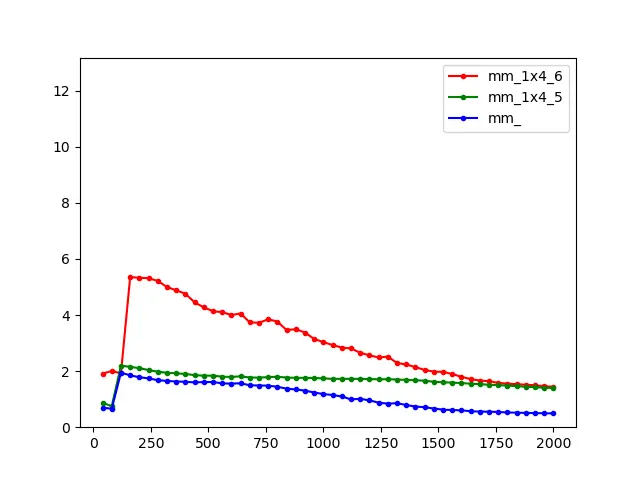

## `4x4` 版本

之前只是对矩阵B进行分块，接下来对矩阵A也进行分块

- 由于是列主序，所以每读到A的一个元素都会将它这一列的元素都带入cache，所以对A的每一个元素都要尽可能地用上它这一列的元素，于是这里是对4 * k的A的每一列和k * 4的B的每一行进行外积，累加在C上

将四个AddDot1x4内联到AddDot4x4中。相当于是四个长为K的行向量乘以四个长为K的列向量，对k进行遍历，那么在一个循环内部就是长为四的列向量外积长为四的行向量，得到C中4 * 4的一块，然后每个循环都对这个4 * 4的块进行累加

```C
void MY_MMult( int m, int n, int k, double *a, int lda, 
                                    double *b, int ldb,
                                    double *c, int ldc )
{
  int i, j;

  for ( j=0; j<n; j+= 4 ){        /* Loop over the columns of C */
    for ( i=0; i<m; i+= 4 ){        /* Loop over the rows of C */
      // 对最外层循环进行了步长为4的循环展开，也就是在每个内层循环中，
      // A的每个行向量要与四个B的列向量进行内积
      AddDot4x4(k, &A(i, 0), lda, &B(0, j), ldb, &C(i, j), ldc);
    }
  }
}
// 将四个AddDot1x4内联到AddDot4x4中。相当于是四个长为K的行向量乘以四个长为K的列向量，对k进行遍历，
// 那么在一个循环内部就是长为四的列向量外积长为四的行向量，得到C中4 * 4的一块
// 然后每个循环都对这个4 * 4的块进行累加
void AddDot4x4(int k, double* a, int lda, double* b, int ldb, double* c, int ldc) {
  register double c_00 = 0.0, c_01 = 0.0, c_02 = 0.0, c_03 = 0.0, a_0p;
  register double c_10 = 0.0, c_11 = 0.0, c_12 = 0.0, c_13 = 0.0, a_1p;
  register double c_20 = 0.0, c_21 = 0.0, c_22 = 0.0, c_23 = 0.0, a_2p;
  register double c_30 = 0.0, c_31 = 0.0, c_32 = 0.0, c_33 = 0.0, a_3p;

  for (int p = 0; p < k; p++) {
    a_0p = A(0, p);
    // 共享了对A的访问，重复利用A
    c_00 += a_0p * B(p, 0);
    c_01 += a_0p * B(p, 1);
    c_02 += a_0p * B(p, 2);
    c_03 += a_0p * B(p, 3);

    a_1p = A(1, p);
    c_10 += a_1p * B(p, 0);
    c_11 += a_1p * B(p, 1);
    c_12 += a_1p * B(p, 2);
    c_13 += a_1p * B(p, 3);

    a_2p = A(2, p);
    c_20 += a_2p * B(p, 0);
    c_21 += a_2p * B(p, 1);
    c_22 += a_2p * B(p, 2);
    c_23 += a_2p * B(p, 3);

    a_3p = A(3, p);
    c_30 += a_3p * B(p, 0);
    c_31 += a_3p * B(p, 1);
    c_32 += a_3p * B(p, 2);
    c_33 += a_3p * B(p, 3);
  }
  C(0,0) += c_00;
  C(0,1) += c_01;
  C(0,2) += c_02;
  C(0,3) += c_03;

  C(1,0) += c_10;
  C(1,1) += c_11;
  C(1,2) += c_12;
  C(1,3) += c_13;

  C(2,0) += c_20;
  C(2,1) += c_21;
  C(2,2) += c_22;
  C(2,3) += c_23;

  C(3,0) += c_30;
  C(3,1) += c_31;
  C(3,2) += c_32;
  C(3,3) += c_33;
}
```

### 向量化

AddDot4x4函数的循环中，就是长为四的列向量外积长为四的行向量，列向量中的四个元素都与行向量中的某一个元素相乘，得到C中的一个列向量。最后得到C中4 * 4的一块，然后每个循环都对这个4 * 4的块进行累加

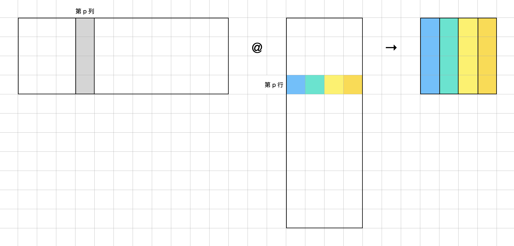

因此可以使用SIMD指令。如果使用SSE指令，它只有128位，所以只能容纳两个元素。那么在一个循环中，可以把A的四个元素读取到两个SSE寄存器中，B中的四个元素广播到四个SSE寄存器中，而结果有16个元素，所以需要用八个SSE寄存器来暂存C中4 * 4的结果

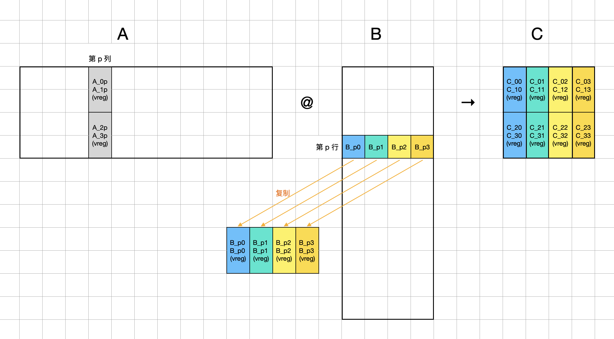

1. 在 C 处开辟 8 个向量寄存器 (`vreg`) 用于累加 16 个 `double` 值. (对应图中最右侧的 8 个 2 维向量).

2. 在每轮循环中,

3. 使用 `_mm_load_pd` 从内存中读取 A 的 4 个 `double`, 存储到 2 个 `vreg` 中. (对应图中左侧两个灰色向量).

4. 使用 `_mm_loaddup_pd` 从内存中读取 B 的 4 个 `double`, 复制并存储到 4 个 `vreg` 中. (对应图中下方 4 个 2 维向量).

5. 使用 `_mm_mul_pd` (或 C 运算符 `*`), 将 A 与 B 的对应 `vreg` 相乘.

6. 使用 `_mm_add_pd` (或 C 运算符 `+`), 将上一步得到的结果累加到 C 中相应 `vreg` 中.

7. 循环结束后, 将 C 的 8 个 `vreg` 中的值取出, 然后将得到的 16 个 `double` 累加回内存.

8. 注意，使用simd时要将load的数组起始地址与cache line的size（也就是64字节）对齐，这样load或store的速度要远快于不对齐的数组

   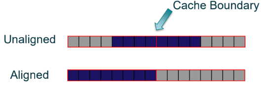

```C
void MY_MMult( int m, int n, int k, double *a, int lda, 
                                    double *b, int ldb,
                                    double *c, int ldc )
{
  int i, j;
  for ( j=0; j<n; j+= 4 ){        /* Loop over the columns of C */
    for ( i=0; i<m; i+= 4 ){        /* Loop over the rows of C */
      // 对最外层循环进行了步长为4的循环展开，也就是在每个内层循环中，
      // A的每个行向量要与四个B的列向量进行内积
      AddDot4x4(k, &A(i, 0), lda, &B(0, j), ldb, &C(i, j), ldc);
    }
  }
}
void AddDot4x4(int k, double* a, int lda, double* b, int ldb, double* c, int ldc) {
  // C
  __m128d c00_10 = _mm_setzero_pd(), c20_30 = _mm_setzero_pd(), 
          c01_11 = _mm_setzero_pd(), c21_31 = _mm_setzero_pd(), 
          c02_12 = _mm_setzero_pd(), c22_32 = _mm_setzero_pd(), 
          c03_13 = _mm_setzero_pd(), c23_33 = _mm_setzero_pd();
  // B
  __m128d bp0, bp1, bp2, bp3;
  // A
  __m128d a0p_1p, a2p_3p;
  for (int p = 0; p < k; p++) {
    // a_0p = A(0, p);
    // a_1p = A(1, p);
    // a_2p = A(2, p);
    // a_3p = A(3, p);
    a0p_1p = _mm_load_pd(&A(0, p));
    a2p_3p = _mm_load_pd(&A(2, p));
    
    bp0 = _mm_loaddup_pd(&B(p, 0));
    bp1 = _mm_loaddup_pd(&B(p, 1));
    bp2 = _mm_loaddup_pd(&B(p, 2));
    bp3 = _mm_loaddup_pd(&B(p, 3));
    // // 共享了对A的访问，重复利用A

    c00_10 += a0p_1p * bp0;
    c20_30 += a2p_3p * bp0;
    c01_11 += a0p_1p * bp1;
    c21_31 += a2p_3p * bp1;
    c02_12 += a0p_1p * bp2;
    c22_32 += a2p_3p * bp2;
    c03_13 += a0p_1p * bp3;
    c23_33 += a2p_3p * bp3;
  }
  // _mm_store_pd(&C(0, 0), c00_10);
  // _mm_store_pd(&C(2, 0), c20_30);
  // _mm_store_pd(&C(0, 1), c01_11);
  // _mm_store_pd(&C(2, 1), c21_31);
  // _mm_store_pd(&C(0, 2), c02_12);
  // _mm_store_pd(&C(2, 2), c22_32);
  // _mm_store_pd(&C(0, 3), c03_13);
  // _mm_store_pd(&C(2, 3), c23_33);
  // 注意，不能使用上面的写法！因为每个AddDot4*4函数是对C中的4 * 4的方块进行累加，
  // 而上面的写法是直接将其覆盖。而simd指令集没有累加的指令，所以我们只能先将向量寄存器中
  // 的数值保存到数组中，然后再将数组中的值累加到C中
  // 并且由于store指令要求16字节对齐，所以声明临时数组时要对齐
    double C_incr[16] __attribute__((aligned(64)));
    _mm_store_pd(C_incr + 0, c00_10);
    _mm_store_pd(C_incr + 2, c20_30);
    _mm_store_pd(C_incr + 4, c01_11);
    _mm_store_pd(C_incr + 6, c21_31);
    _mm_store_pd(C_incr + 8, c02_12);
    _mm_store_pd(C_incr + 10,c22_32);
    _mm_store_pd(C_incr + 12,c03_13);
    _mm_store_pd(C_incr + 14,c23_33);

    for (int j = 0; j < 4; j++) {
        C(0, j) += C_incr[j * 4 + 0];
        C(1, j) += C_incr[j * 4 + 1];
        C(2, j) += C_incr[j * 4 + 2];
        C(3, j) += C_incr[j * 4 + 3];
    }
}
```

所以本质上来说，之前分的4 * 4的小块是为了使用SIMD指令

使用了SIMD之后性能大幅度提升，但是随着矩阵规模继续增加, 性能急剧衰减。

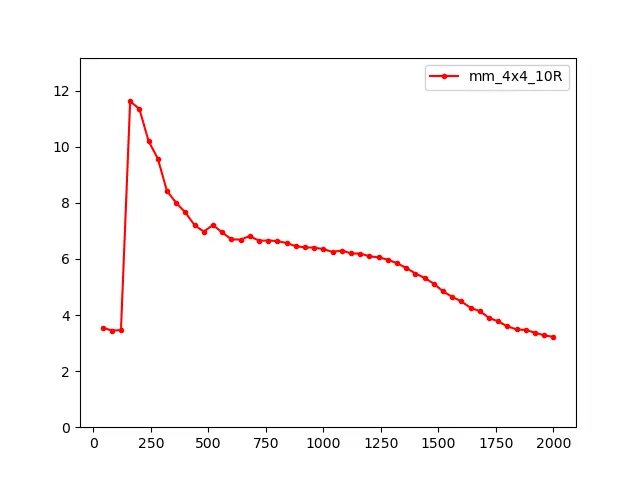

出现这种情况也是因为缓存的问题，需要将矩阵分块，在每个块内部用AddDot4x4

具体而言, 分块方案是:

- 先对 A 横着切, 使得每块最大高度为 `mc`;
- 再对 A 竖着切, 使得每块最大宽度为 `kc`;
- 最后相应地: 将 B 横着切, 使得每块的最大高度为 `kc`; 对 C 横着切, 使得每块最大高度为 `mc`.

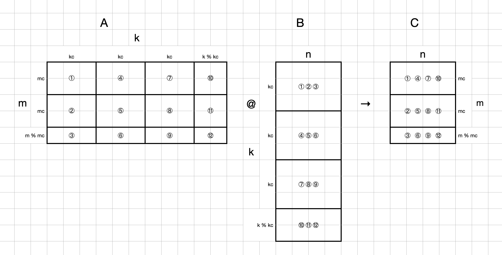

将之前的矩阵乘法的双层循环封装在 `InnerKernel` 函数中, 用于执行子矩阵 (矩阵分块) 之间的乘法:

```c
void MY_MMult( int m, int n, int k, double *a, int lda, 
                                    double *b, int ldb,
                                    double *c, int ldc )
{
  int kc = 128, mc = 256;
  for (int p = 0; p < k; p += kc) {
    int pb = (k - p < kc) ? k - p : kc;
    for (int i = 0; i < m; i += mc) {
      int ib = (m - i < mc) ? m - i : mc;
      InnerKernel(ib, n, pb, &A(i, p), lda, &B(p, 0), ldb, &C(i, 0), ldc);
    }
  }
}
void InnerKernel(int m, int n, int k, double *a, int lda, double *b, int ldb, double *c, int ldc) {
  double packedA[m * k];
  double packedB[k * n];
  for (int j=0; j<n; j+= 4 ){        /* Loop over the columns of C */
    PackMatrixB(k, &B(0, j), ldb, &packedB[j * k]);
    for (int i=0; i<m; i+= 4 ){        /* Loop over the rows of C */
      if (j == 0) {
        PackMatrixA(k, &A(i, 0), lda, &packedA[i * k]);
      }
      // 对最外层循环进行了步长为4的循环展开，也就是在每个内层循环中，
      // A的每个行向量要与四个B的列向量进行内积
      AddDot4x4(k, &packedA[i * k], lda, &packedB[j *k], ldb, &C(i, j), ldc);
    }
  }
}
void PackMatrixA(int k, double *a, int lda, double *dest) {
  // 将4*k的矩阵（k个列之间内存不连续）打包成k个列之间内存连续存储
  for (int j = 0; j < k; j++) {
    *dest++ = A(0, j);
    *dest++ = A(1, j);
    *dest++ = A(2, j);
    *dest++ = A(3, j);
  }
}
void PackMatrixB(int k, double *b, int ldb, double *dest) {
  // 将k*4的矩阵（k个行之间内存不连续）打包成k个行之间内存连续存储
  for (int i = 0; i < k; i++) {
    *dest++ = B(i, 0);
    *dest++ = B(i, 1);
    *dest++ = B(i, 2);
    *dest++ = B(i, 3);
  }
}
```

这里取超参数 `mc = 256`, `kc = 128` 作为分块大小, 测试结果如下:

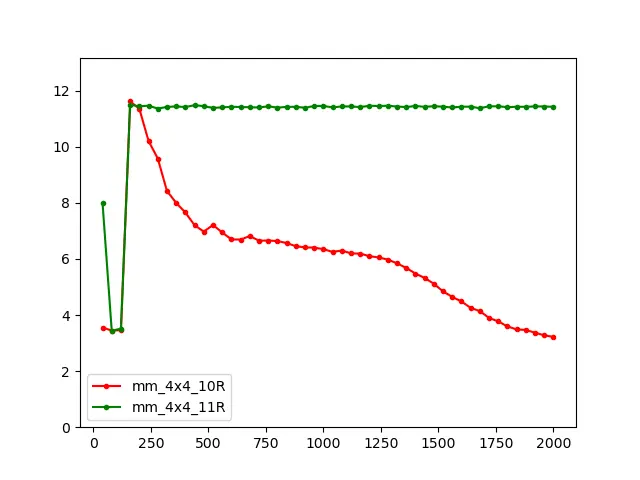

矩阵分块乘的方法成功**在大尺寸下保持了小尺寸时获得的最高性能**.

### 矩阵打包

在每次的`AddDot4x4`中，矩阵A是4 * k，矩阵B是k * 4，前者在一个循环中访问的是一列，虽然数据是连续的，但是k个列之间的内存不连续，如果矩阵很大，那么列之间可能会隔很远，导致缓存失效；而后者在循环中访问的是一行，访存模式更加糟糕。

我们希望在AddDot4x4中A和B的内存是连续的，为此可以考虑在调用 `AddDot4x4` 计算前首先对作为参数的子矩阵进行 ｢打包｣: 开辟一块连续的内存, 将这 `4 × kc` 个元素复制到这片内存, 然后把这片内存作为参数传给 `AddDot4x4`. 如此, 在 `AddDot4x4` 中对子矩阵的访问模式就变成了连续的顺序读取, 对 Cache 更为友好.

```c
void InnerKernel(int m, int n, int k, double *a, int lda, double *b, int ldb, double *c, int ldc) {
  double packedA[m * k];
  double packedB[k * n];
  for (int j=0; j<n; j+= 4 ){        /* Loop over the columns of C */
    PackMatrixB(k, &B(0, j), ldb, &packedB[j * k]);
    for (int i=0; i<m; i+= 4 ){        /* Loop over the rows of C */
      if (j == 0) {
        PackMatrixA(k, &A(i, 0), lda, &packedA[i * k]);
      }
      // 对最外层循环进行了步长为4的循环展开，也就是在每个内层循环中，
      // A的每个行向量要与四个B的列向量进行内积
      AddDot4x4(k, &packedA[i * k], lda, &packedB[j *k], ldb, &C(i, j), ldc);
    }
  }
}
void PackMatrixA(int k, double *a, int lda, double *dest) {
  // 将4*k的矩阵（k个列之间内存不连续）打包成k个列之间内存连续存储
  for (int j = 0; j < k; j++) {
    *dest++ = A(0, j);
    *dest++ = A(1, j);
    *dest++ = A(2, j);
    *dest++ = A(3, j);
  }
}
void PackMatrixB(int k, double *b, int ldb, double *dest) {
  // 将k*4的矩阵（k个行之间内存不连续）打包成k个行之间内存连续存储
  for (int i = 0; i < k; i++) {
    *dest++ = B(i, 0);
    *dest++ = B(i, 1);
    *dest++ = B(i, 2);
    *dest++ = B(i, 3);
  }
}
```

AddDot4x4也可以改为直接对a和b顺序访问：

```C
void AddDot4x4(int k, double* a, int lda, double* b, int ldb, double* c, int ldc) {
  // register double c_00 = 0.0, c_01 = 0.0, c_02 = 0.0, c_03 = 0.0, a_0p;
  // register double c_10 = 0.0, c_11 = 0.0, c_12 = 0.0, c_13 = 0.0, a_1p;
  // register double c_20 = 0.0, c_21 = 0.0, c_22 = 0.0, c_23 = 0.0, a_2p;
  // register double c_30 = 0.0, c_31 = 0.0, c_32 = 0.0, c_33 = 0.0, a_3p;

  // C
  __m128d c00_10 = _mm_setzero_pd(), c20_30 = _mm_setzero_pd(), 
          c01_11 = _mm_setzero_pd(), c21_31 = _mm_setzero_pd(), 
          c02_12 = _mm_setzero_pd(), c22_32 = _mm_setzero_pd(), 
          c03_13 = _mm_setzero_pd(), c23_33 = _mm_setzero_pd();
  // B
  __m128d bp0, bp1, bp2, bp3;
  // A
  __m128d a0p_1p, a2p_3p;
  for (int p = 0; p < k; p++) {
    // a_0p = A(0, p);
    // a_1p = A(1, p);
    // a_2p = A(2, p);
    // a_3p = A(3, p);
    a0p_1p = _mm_load_pd(a);
    a2p_3p = _mm_load_pd(a + 2);
    a += 4;
    
    bp0 = _mm_loaddup_pd(b);
    bp1 = _mm_loaddup_pd(b + 1);
    bp2 = _mm_loaddup_pd(b + 2);
    bp3 = _mm_loaddup_pd(b + 3);
    b += 4;
    // // 共享了对A的访问，重复利用A

    c00_10 += a0p_1p * bp0;
    c20_30 += a2p_3p * bp0;
    c01_11 += a0p_1p * bp1;
    c21_31 += a2p_3p * bp1;
    c02_12 += a0p_1p * bp2;
    c22_32 += a2p_3p * bp2;
    c03_13 += a0p_1p * bp3;
    c23_33 += a2p_3p * bp3;
  }
    double C_incr[16] __attribute__((aligned(64)));
    _mm_store_pd(C_incr + 0, c00_10);
    _mm_store_pd(C_incr + 2, c20_30);
    _mm_store_pd(C_incr + 4, c01_11);
    _mm_store_pd(C_incr + 6, c21_31);
    _mm_store_pd(C_incr + 8, c02_12);
    _mm_store_pd(C_incr + 10,c22_32);
    _mm_store_pd(C_incr + 12,c03_13);
    _mm_store_pd(C_incr + 14,c23_33);

    for (int j = 0; j < 4; j++) {
        C(0, j) += C_incr[j * 4 + 0];
        C(1, j) += C_incr[j * 4 + 1];
        C(2, j) += C_incr[j * 4 + 2];
        C(3, j) += C_incr[j * 4 + 3];
    }
}
```

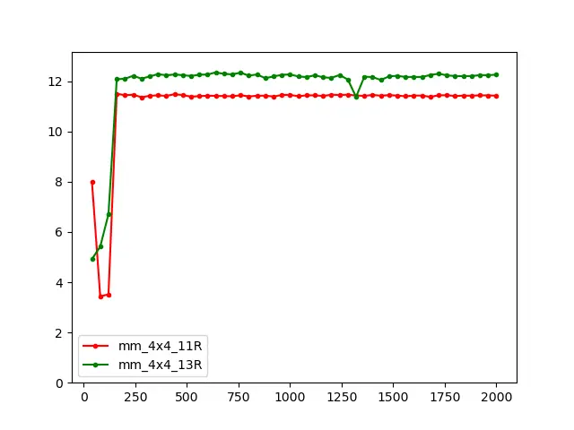

总的来看，


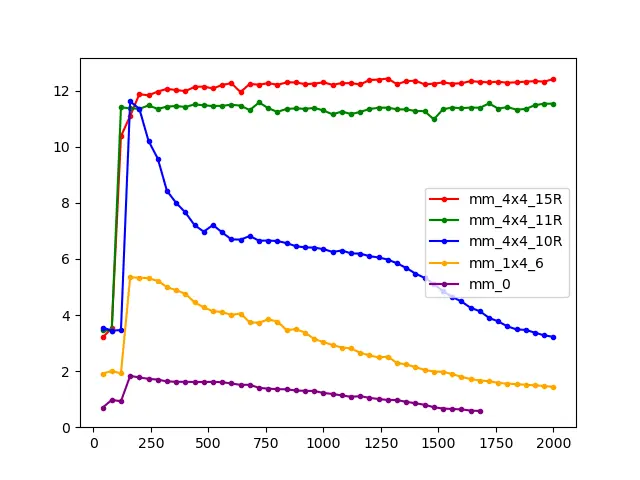

## 8x8版本

使用avx512指令集，将micro kernel大小改成8*8

```c++
#define kc 128
#define mc 256
#define n_max 2000
void MY_MMult( int m, int n, int k, double *a, int lda, 
                                    double *b, int ldb,
                                    double *c, int ldc )
{
  for (int p = 0; p < k; p += kc) {
    int pb = (k - p < kc) ? k - p : kc;
    for (int i = 0; i < m; i += mc) {
      int ib = (m - i < mc) ? m - i : mc;
      // 由于A的多个分块都与B的同一个分块相乘，所以B的每个分块只需要在第一次运算时被pack
      InnerKernel(ib, n, pb, &A(i, p), lda, &B(p, 0), ldb, &C(i, 0), ldc, (i == 0));
    }
  }
}
void InnerKernel(int m, int n, int k, double *a, int lda, double *b, int ldb, double *c, int ldc, int need_pack_b) {
  // 由于需要从A中load8个数据，所以A数组需要对齐；而B数组只需要广播，所以B数组不需要对齐
  double packedA[m * k] __attribute__((aligned(64)));
  static double packedB[kc * n_max];
  for (int j=0; j<n; j += 8){        /* Loop over the columns of C */
    if (need_pack_b) {
      PackMatrixB(k, &B(0, j), ldb, &packedB[j * k]);
    }
    for (int i=0; i<m; i += 8){        /* Loop over the rows of C */
      if (j == 0) {
        PackMatrixA(k, &A(i, 0), lda, &packedA[i * k]);
      }
      // 对最外层循环进行了步长为4的循环展开，也就是在每个内层循环中，
      // A的每个行向量要与四个B的列向量进行内积
      AddDot8x8(k, &packedA[i * k], lda, &packedB[j *k], ldb, &C(i, j), ldc);
    }
  }
}
void PackMatrixA(int k, double *a, int lda, double *dest) {
  // 将4*k的矩阵（k个列之间内存不连续）打包成k个列之间内存连续存储
  for (int j = 0; j < k; j++) {
    double* a_ptr = &A(0, j);
    *(dest + 0) = *(a_ptr + 0);
    *(dest + 1) = *(a_ptr + 1);
    *(dest + 2) = *(a_ptr + 2);
    *(dest + 3) = *(a_ptr + 3);
    *(dest + 4) = *(a_ptr + 4);
    *(dest + 5) = *(a_ptr + 5);
    *(dest + 6) = *(a_ptr + 6);
    *(dest + 7) = *(a_ptr + 7);
    dest += 8;
  }
}
void PackMatrixB(int k, double *b, int ldb, double *dest) {
  double* b_i0_ptr = &B(0, 0), 
        * b_i1_ptr = &B(0, 1),
        * b_i2_ptr = &B(0, 2),
        * b_i3_ptr = &B(0, 3),
        * b_i4_ptr = &B(0, 4),
        * b_i5_ptr = &B(0, 5),
        * b_i6_ptr = &B(0, 6),
        * b_i7_ptr = &B(0, 7);
  // 将k*4的矩阵（k个行之间内存不连续）打包成k个行之间内存连续存储
  for (int i = 0; i < k; i++) {
    *(dest+0) = *b_i0_ptr++;
    *(dest+1) = *b_i1_ptr++;
    *(dest+2) = *b_i2_ptr++;
    *(dest+3) = *b_i3_ptr++;
    *(dest+4) = *b_i4_ptr++;
    *(dest+5) = *b_i5_ptr++;
    *(dest+6) = *b_i6_ptr++;
    *(dest+7) = *b_i7_ptr++;
    dest += 8;
  }
}
void AddDot8x8(int k, double* a, int lda, double* b, int ldb, double* c, int ldc) {
  // C
  __m512d c00_to_70 = _mm512_setzero_pd(),
          c01_to_71 = _mm512_setzero_pd(),
          c02_to_72 = _mm512_setzero_pd(),
          c03_to_73 = _mm512_setzero_pd(),
          c04_to_74 = _mm512_setzero_pd(),
          c05_to_75 = _mm512_setzero_pd(),
          c06_to_76 = _mm512_setzero_pd(),
          c07_to_77 = _mm512_setzero_pd();
          
  // B
  __m512d bp0, bp1, bp2, bp3, bp4, bp5, bp6, bp7;
  // A
  __m512d a0p_to_7p;
  for (int p = 0; p < k; p++) {
    a0p_to_7p = _mm512_load_pd(a);
    a += 8;
    
    bp0 = _mm512_set1_pd(*b);
    bp1 = _mm512_set1_pd(*(b + 1));
    bp2 = _mm512_set1_pd(*(b + 2));
    bp3 = _mm512_set1_pd(*(b + 3));
    bp4 = _mm512_set1_pd(*(b + 4));
    bp5 = _mm512_set1_pd(*(b + 5));
    bp6 = _mm512_set1_pd(*(b + 6));
    bp7 = _mm512_set1_pd(*(b + 7));
    b += 8;
    // // 共享了对A的访问，重复利用A
    c00_to_70 += a0p_to_7p * bp0;
    c01_to_71 += a0p_to_7p * bp1;
    c02_to_72 += a0p_to_7p * bp2;
    c03_to_73 += a0p_to_7p * bp3;
    c04_to_74 += a0p_to_7p * bp4;
    c05_to_75 += a0p_to_7p * bp5;
    c06_to_76 += a0p_to_7p * bp6;
    c07_to_77 += a0p_to_7p * bp7;
  }
    double C_incr[64] __attribute__((aligned(64)));
    _mm512_store_pd(C_incr + 0, c00_to_70);
    _mm512_store_pd(C_incr + 8, c01_to_71);
    _mm512_store_pd(C_incr + 16, c02_to_72);
    _mm512_store_pd(C_incr + 24, c03_to_73);
    _mm512_store_pd(C_incr + 32, c04_to_74);
    _mm512_store_pd(C_incr + 40, c05_to_75);
    _mm512_store_pd(C_incr + 48, c06_to_76);
    _mm512_store_pd(C_incr + 56, c07_to_77);

    for (int j = 0; j < 8; j++) {
        C(0, j) += C_incr[j * 8 + 0];
        C(1, j) += C_incr[j * 8 + 1];
        C(2, j) += C_incr[j * 8 + 2];
        C(3, j) += C_incr[j * 8 + 3];
        C(4, j) += C_incr[j * 8 + 4];
        C(5, j) += C_incr[j * 8 + 5];
        C(6, j) += C_incr[j * 8 + 6];
        C(7, j) += C_incr[j * 8 + 7];
    }
}
```

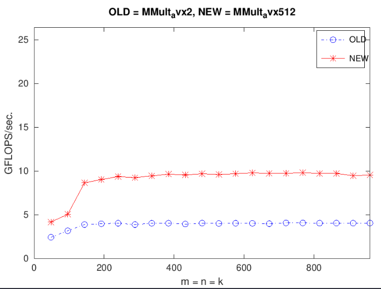

对于8*8的微内核，矩阵C使用8个zmm寄存器，矩阵B也使用8个zmm寄存器，矩阵A使用1个zmm寄存器，也就是总共使用了17个寄存器，而axv512下共有32zmm寄存器，所以为了利用更多的寄存器，考虑使用更大的微内核。

对于16 * 8的微内核要使用2 + 8 + 16 = 26个寄存器，24 * 8的微内核要使用3 + 8 + 24 = 35个寄存器，显然后者的利用率更高

## 24x8版本

```c++
void MY_MMult( int m, int n, int k, double *a, int lda, 
                                    double *b, int ldb,
                                    double *c, int ldc )
{
  for (int p = 0; p < k; p += kc) {
    int pb = (k - p < kc) ? k - p : kc;
    for (int i = 0; i < m; i += mc) {
      int ib = (m - i < mc) ? m - i : mc;
      // 由于A的多个分块都与B的同一个分块相乘，所以B的每个分块只需要在第一次运算时被pack
      InnerKernel(ib, n, pb, &A(i, p), lda, &B(p, 0), ldb, &C(i, 0), ldc, (i == 0));
    }
  }
}
void InnerKernel(int m, int n, int k, double *a, int lda, double *b, int ldb, double *c, int ldc, int need_pack_b) {
  // 由于需要从A中load8个数据，所以A数组需要对齐；而B数组只需要广播，所以B数组不需要对齐
  double packedA[m * k] __attribute__((aligned(64)));
  static double packedB[kc * n_max];
  for (int j=0; j<n; j += 8){        /* Loop over the columns of C */
    if (need_pack_b) {
      PackMatrixB(k, &B(0, j), ldb, &packedB[j * k]);
    }
    for (int i=0; i<m; i += 24){        /* Loop over the rows of C */
      if (j == 0) {
        PackMatrixA(k, &A(i, 0), lda, &packedA[i * k]);
      }
      // 对最外层循环进行了步长为4的循环展开，也就是在每个内层循环中，
      // A的每个行向量要与四个B的列向量进行内积
      AddDot24x8(k, &packedA[i * k], lda, &packedB[j *k], ldb, &C(i, j), ldc);
    }
  }
}
void PackMatrixA(int k, double *a, int lda, double *dest) {
  // 将24*k的矩阵（k个列之间内存不连续）打包成k个列之间内存连续存储
  for (int j = 0; j < k; j++) {
    double* a_ptr = &A(0, j);
    *(dest + 0) = *(a_ptr + 0);
    *(dest + 1) = *(a_ptr + 1);
    *(dest + 2) = *(a_ptr + 2);
    *(dest + 3) = *(a_ptr + 3);
    *(dest + 4) = *(a_ptr + 4);
    *(dest + 5) = *(a_ptr + 5);
    *(dest + 6) = *(a_ptr + 6);
    *(dest + 7) = *(a_ptr + 7);
    *(dest + 8) = *(a_ptr + 8);
    *(dest + 9) = *(a_ptr + 9);
    *(dest + 10) = *(a_ptr + 10);
    *(dest + 11) = *(a_ptr + 11);
    *(dest + 12) = *(a_ptr + 12);
    *(dest + 13) = *(a_ptr + 13);
    *(dest + 14) = *(a_ptr + 14);
    *(dest + 15) = *(a_ptr + 15);
    *(dest + 16) = *(a_ptr + 16);
    *(dest + 17) = *(a_ptr + 17);
    *(dest + 18) = *(a_ptr + 18);
    *(dest + 19) = *(a_ptr + 19);
    *(dest + 20) = *(a_ptr + 20);
    *(dest + 21) = *(a_ptr + 21);
    *(dest + 22) = *(a_ptr + 22);
    *(dest + 23) = *(a_ptr + 23);
    dest += 24;
  }
}
void PackMatrixB(int k, double *b, int ldb, double *dest) {
  double* b_i0_ptr = &B(0, 0), 
        * b_i1_ptr = &B(0, 1),
        * b_i2_ptr = &B(0, 2),
        * b_i3_ptr = &B(0, 3),
        * b_i4_ptr = &B(0, 4),
        * b_i5_ptr = &B(0, 5),
        * b_i6_ptr = &B(0, 6),
        * b_i7_ptr = &B(0, 7);
  // 将k*8的矩阵（k个行之间内存不连续）打包成k个行之间内存连续存储
  for (int i = 0; i < k; i++) {
    *(dest+0) = *b_i0_ptr++;
    *(dest+1) = *b_i1_ptr++;
    *(dest+2) = *b_i2_ptr++;
    *(dest+3) = *b_i3_ptr++;
    *(dest+4) = *b_i4_ptr++;
    *(dest+5) = *b_i5_ptr++;
    *(dest+6) = *b_i6_ptr++;
    *(dest+7) = *b_i7_ptr++;
    dest += 8;
  }
}
void AddDot24x8(int k, double* a, int lda, double* b, int ldb, double* c, int ldc) {
  // C
  __m512d c00_to_70 = _mm512_setzero_pd(),
          c80_to_150 = _mm512_setzero_pd(),
          c160_to_230 = _mm512_setzero_pd(),

          c01_to_71 = _mm512_setzero_pd(),
          c81_to_151 = _mm512_setzero_pd(),
          c161_to_231 = _mm512_setzero_pd(),

          c02_to_72 = _mm512_setzero_pd(),
          c82_to_152 = _mm512_setzero_pd(),
          c162_to_232 = _mm512_setzero_pd(),

          c03_to_73 = _mm512_setzero_pd(),
          c83_to_153 = _mm512_setzero_pd(),
          c163_to_233 = _mm512_setzero_pd(),

          c04_to_74 = _mm512_setzero_pd(),
          c84_to_154 = _mm512_setzero_pd(),
          c164_to_234 = _mm512_setzero_pd(),

          c05_to_75 = _mm512_setzero_pd(),
          c85_to_155 = _mm512_setzero_pd(),
          c165_to_235 = _mm512_setzero_pd(),

          c06_to_76 = _mm512_setzero_pd(),
          c86_to_156 = _mm512_setzero_pd(),
          c166_to_236 = _mm512_setzero_pd(),

          c07_to_77 = _mm512_setzero_pd(),
          c87_to_157 = _mm512_setzero_pd(),
          c167_to_237 = _mm512_setzero_pd();
          
  // B
  __m512d bp0, bp1, bp2, bp3, bp4, bp5, bp6, bp7;
  // A
  __m512d a0p_to_7p, a8p_to_15p, a16p_to_23p;
  for (int p = 0; p < k; p++) {
    a0p_to_7p = _mm512_load_pd(a);
    a8p_to_15p = _mm512_load_pd(a + 8);
    a16p_to_23p = _mm512_load_pd(a + 16);
    a += 24;
    
    bp0 = _mm512_set1_pd(*b);
    bp1 = _mm512_set1_pd(*(b + 1));
    bp2 = _mm512_set1_pd(*(b + 2));
    bp3 = _mm512_set1_pd(*(b + 3));
    bp4 = _mm512_set1_pd(*(b + 4));
    bp5 = _mm512_set1_pd(*(b + 5));
    bp6 = _mm512_set1_pd(*(b + 6));
    bp7 = _mm512_set1_pd(*(b + 7));
    b += 8;

    c00_to_70 += a0p_to_7p * bp0;
    c80_to_150 += a8p_to_15p * bp0;
    c160_to_230 += a16p_to_23p * bp0;

    c01_to_71 += a0p_to_7p * bp1;
    c81_to_151 += a8p_to_15p * bp1;
    c161_to_231 += a16p_to_23p * bp1;

    c02_to_72 += a0p_to_7p * bp2;
    c82_to_152 += a8p_to_15p * bp2;
    c162_to_232 += a16p_to_23p * bp2;

    c03_to_73 += a0p_to_7p * bp3;
    c83_to_153 += a8p_to_15p * bp3;
    c163_to_233 += a16p_to_23p * bp3;

    c04_to_74 += a0p_to_7p * bp4;
    c84_to_154 += a8p_to_15p * bp4;
    c164_to_234 += a16p_to_23p * bp4;

    c05_to_75 += a0p_to_7p * bp5;
    c85_to_155 += a8p_to_15p * bp5;
    c165_to_235 += a16p_to_23p * bp5;

    c06_to_76 += a0p_to_7p * bp6;
    c86_to_156 += a8p_to_15p * bp6;
    c166_to_236 += a16p_to_23p * bp6;

    c07_to_77 += a0p_to_7p * bp7;
    c87_to_157 += a8p_to_15p * bp7;
    c167_to_237 += a16p_to_23p * bp7;

  }
    double C_incr[192] __attribute__((aligned(64)));
    _mm512_store_pd(C_incr + 0, c00_to_70);
    _mm512_store_pd(C_incr + 8, c80_to_150);
    _mm512_store_pd(C_incr + 16, c160_to_230);

    _mm512_store_pd(C_incr + 24, c01_to_71);
    _mm512_store_pd(C_incr + 32, c81_to_151);
    _mm512_store_pd(C_incr + 40, c161_to_231);

    _mm512_store_pd(C_incr + 48, c02_to_72);
    _mm512_store_pd(C_incr + 56, c82_to_152);
    _mm512_store_pd(C_incr + 64, c162_to_232);

    _mm512_store_pd(C_incr + 72, c03_to_73);
    _mm512_store_pd(C_incr + 80, c83_to_153);
    _mm512_store_pd(C_incr + 88, c163_to_233);

    _mm512_store_pd(C_incr + 96, c04_to_74);
    _mm512_store_pd(C_incr + 104, c84_to_154);
    _mm512_store_pd(C_incr + 112, c164_to_234);

    _mm512_store_pd(C_incr + 120, c05_to_75);
    _mm512_store_pd(C_incr + 128, c85_to_155);
    _mm512_store_pd(C_incr + 136, c165_to_235);

    _mm512_store_pd(C_incr + 144, c06_to_76);
    _mm512_store_pd(C_incr + 152, c86_to_156);
    _mm512_store_pd(C_incr + 160, c166_to_236);

    _mm512_store_pd(C_incr + 168, c07_to_77);
    _mm512_store_pd(C_incr + 176, c87_to_157);
    _mm512_store_pd(C_incr + 184, c167_to_237);

    for (int j = 0; j < 8; j++) {
        C(0, j) += C_incr[j * 24 + 0];
        C(1, j) += C_incr[j * 24 + 1];
        C(2, j) += C_incr[j * 24 + 2];
        C(3, j) += C_incr[j * 24 + 3];
        C(4, j) += C_incr[j * 24 + 4];
        C(5, j) += C_incr[j * 24 + 5];
        C(6, j) += C_incr[j * 24 + 6];
        C(7, j) += C_incr[j * 24 + 7];
        C(8, j) += C_incr[j * 24 + 8];
        C(9, j) += C_incr[j * 24 + 9];
        C(10, j) += C_incr[j * 24 + 10];
        C(11, j) += C_incr[j * 24 + 11];
        C(12, j) += C_incr[j * 24 + 12];
        C(13, j) += C_incr[j * 24 + 13];
        C(14, j) += C_incr[j * 24 + 14];
        C(15, j) += C_incr[j * 24 + 15];
        C(16, j) += C_incr[j * 24 + 16];
        C(17, j) += C_incr[j * 24 + 17];
        C(18, j) += C_incr[j * 24 + 18];
        C(19, j) += C_incr[j * 24 + 19];
        C(20, j) += C_incr[j * 24 + 20];
        C(21, j) += C_incr[j * 24 + 21];
        C(22, j) += C_incr[j * 24 + 22];
        C(23, j) += C_incr[j * 24 + 23];
    }
}
```

O0级别的结果：

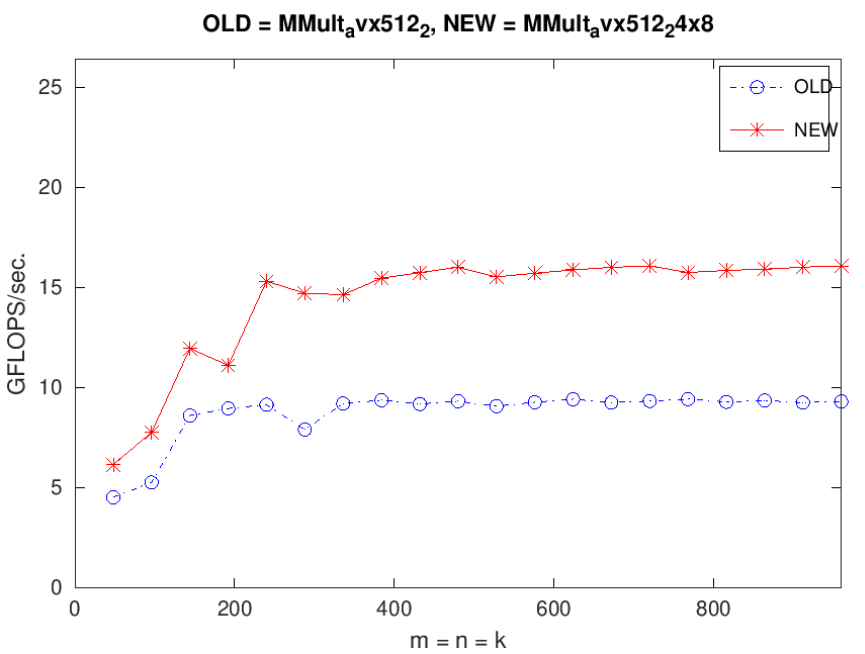

O2的结果：

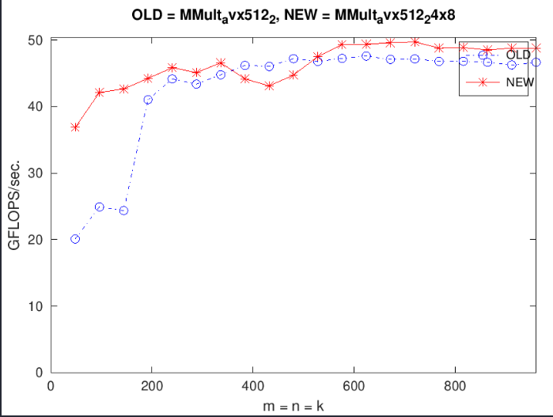

### 复用矩阵B的寄存器

```
  for (int p = 0; p < k; p++) {
    a0p_to_7p = _mm512_load_pd(a);
    a8p_to_15p = _mm512_load_pd(a + 8);
    a16p_to_23p = _mm512_load_pd(a + 16);
    a += 24;
    
    bp0 = _mm512_set1_pd(*b);
    bp1 = _mm512_set1_pd(*(b + 1));
    bp2 = _mm512_set1_pd(*(b + 2));
    bp3 = _mm512_set1_pd(*(b + 3));
    bp4 = _mm512_set1_pd(*(b + 4));
    bp5 = _mm512_set1_pd(*(b + 5));
    bp6 = _mm512_set1_pd(*(b + 6));
    bp7 = _mm512_set1_pd(*(b + 7));
    b += 8;

    c00_to_70 += a0p_to_7p * bp0;
    c80_to_150 += a8p_to_15p * bp0;
    c160_to_230 += a16p_to_23p * bp0;

    c01_to_71 += a0p_to_7p * bp1;
    c81_to_151 += a8p_to_15p * bp1;
    c161_to_231 += a16p_to_23p * bp1;

    c02_to_72 += a0p_to_7p * bp2;
    c82_to_152 += a8p_to_15p * bp2;
    c162_to_232 += a16p_to_23p * bp2;

    c03_to_73 += a0p_to_7p * bp3;
    c83_to_153 += a8p_to_15p * bp3;
    c163_to_233 += a16p_to_23p * bp3;

    c04_to_74 += a0p_to_7p * bp4;
    c84_to_154 += a8p_to_15p * bp4;
    c164_to_234 += a16p_to_23p * bp4;

    c05_to_75 += a0p_to_7p * bp5;
    c85_to_155 += a8p_to_15p * bp5;
    c165_to_235 += a16p_to_23p * bp5;

    c06_to_76 += a0p_to_7p * bp6;
    c86_to_156 += a8p_to_15p * bp6;
    c166_to_236 += a16p_to_23p * bp6;

    c07_to_77 += a0p_to_7p * bp7;
    c87_to_157 += a8p_to_15p * bp7;
    c167_to_237 += a16p_to_23p * bp7;
  }
```

根据上面的代码的A*B的过程可以发现，每三行都对应于同一个 B 的寄存器, 因此理论上只用 1 个寄存器然后复用 8 次就行（为什么只能复用B？首先C是不能复用的，因为整个C是一次性计算好的；而A和B中只能选择一个来复用，而B占用了8个寄存器，复用它显然收益更大）, 这样就只需要 3+1+24 = 28 个寄存器

```c++
  // B
  __m512d bp0;
  // A
  __m512d a0p_to_7p, a8p_to_15p, a16p_to_23p;
  for (int p = 0; p < k; p++) {
    // a_0p = A(0, p);
    // a_1p = A(1, p);
    // a_2p = A(2, p);
    // a_3p = A(3, p);
    a0p_to_7p = _mm512_load_pd(a);
    a8p_to_15p = _mm512_load_pd(a + 8);
    a16p_to_23p = _mm512_load_pd(a + 16);
    a += 24;

    bp0 = _mm512_set1_pd(*(b + 0));
    c00_to_70 += a0p_to_7p * bp0;
    c80_to_150 += a8p_to_15p * bp0;
    c160_to_230 += a16p_to_23p * bp0;

    bp0 = _mm512_set1_pd(*(b + 1));
    c01_to_71 += a0p_to_7p * bp0;
    c81_to_151 += a8p_to_15p * bp0;
    c161_to_231 += a16p_to_23p * bp0;

    bp0 = _mm512_set1_pd(*(b + 2));
    c02_to_72 += a0p_to_7p * bp0;
    c82_to_152 += a8p_to_15p * bp0;
    c162_to_232 += a16p_to_23p * bp0;

    bp0 = _mm512_set1_pd(*(b + 3));
    c03_to_73 += a0p_to_7p * bp0;
    c83_to_153 += a8p_to_15p * bp0;
    c163_to_233 += a16p_to_23p * bp0;

    bp0 = _mm512_set1_pd(*(b + 4));
    c04_to_74 += a0p_to_7p * bp0;
    c84_to_154 += a8p_to_15p * bp0;
    c164_to_234 += a16p_to_23p * bp0;

    bp0 = _mm512_set1_pd(*(b + 5));
    c05_to_75 += a0p_to_7p * bp0;
    c85_to_155 += a8p_to_15p * bp0;
    c165_to_235 += a16p_to_23p * bp0;

    bp0 = _mm512_set1_pd(*(b + 6));
    c06_to_76 += a0p_to_7p * bp0;
    c86_to_156 += a8p_to_15p * bp0;
    c166_to_236 += a16p_to_23p * bp0;

    bp0 = _mm512_set1_pd(*(b + 7));
    c07_to_77 += a0p_to_7p * bp0;
    c87_to_157 += a8p_to_15p * bp0;
    c167_to_237 += a16p_to_23p * bp0;

    b += 8;
  }
```

改进之后确实复用了b的寄存器

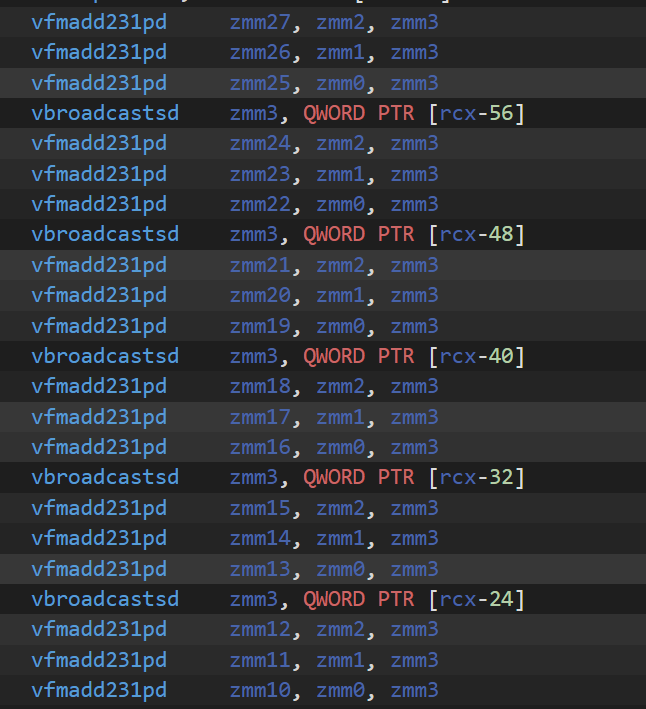

但是这一改进对我的性能并没有任何提升，反而还大幅下降（O0）

对于O2来说：

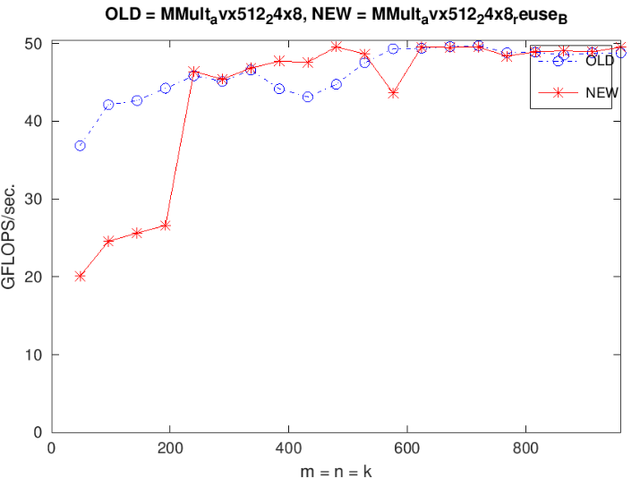

### 累加时不使用中间数组

之前的微内核中，计算完每个block的矩阵C的值之后是保存在向量寄存器中的，由于avx intrinsic并没有累加指令，所以为了将其累加回C矩阵中，我们使用了一个中间的数组，先将向量寄存器中的值保存在中间数组中，然后再将中间数组中的值累加到矩阵C中

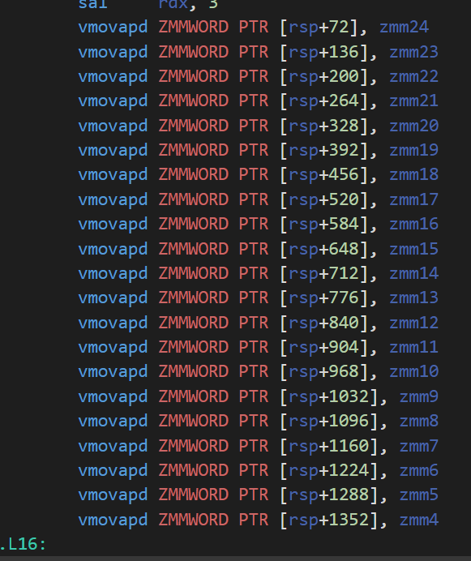

但是我们实际上可以使用多条simd指令来完成累加的操作

```C++
_mm512_storeu_pd(&C(0, 0),
    _mm512_add_pd(
        c00__c70_vreg, 
        _mm512_loadu_pd( &C( 0, 0) )
    )
);
```

改进后：

```C++
void PackMatrixA(int k, double *a, int lda, double *dest) {
  // 将24*k的矩阵（k个列之间内存不连续）打包成k个列之间内存连续存储
  for (int j = 0; j < k; j++) {
    double* a_ptr = &A(0, j);
    _mm512_storeu_pd(dest + 0, _mm512_loadu_pd(a_ptr + 0));
    _mm512_storeu_pd(dest + 8, _mm512_loadu_pd(a_ptr + 8));
    _mm512_storeu_pd(dest + 16, _mm512_loadu_pd(a_ptr + 16));
    dest += 24;
  }
}
void AddDot24x8(int k, double* a, int lda, double* b, int ldb, double* c, int ldc) {
  // C
  __m512d c00_to_70 = _mm512_setzero_pd(),
          c80_to_150 = _mm512_setzero_pd(),
          c160_to_230 = _mm512_setzero_pd(),

          c01_to_71 = _mm512_setzero_pd(),
          c81_to_151 = _mm512_setzero_pd(),
          c161_to_231 = _mm512_setzero_pd(),

          c02_to_72 = _mm512_setzero_pd(),
          c82_to_152 = _mm512_setzero_pd(),
          c162_to_232 = _mm512_setzero_pd(),

          c03_to_73 = _mm512_setzero_pd(),
          c83_to_153 = _mm512_setzero_pd(),
          c163_to_233 = _mm512_setzero_pd(),

          c04_to_74 = _mm512_setzero_pd(),
          c84_to_154 = _mm512_setzero_pd(),
          c164_to_234 = _mm512_setzero_pd(),

          c05_to_75 = _mm512_setzero_pd(),
          c85_to_155 = _mm512_setzero_pd(),
          c165_to_235 = _mm512_setzero_pd(),

          c06_to_76 = _mm512_setzero_pd(),
          c86_to_156 = _mm512_setzero_pd(),
          c166_to_236 = _mm512_setzero_pd(),

          c07_to_77 = _mm512_setzero_pd(),
          c87_to_157 = _mm512_setzero_pd(),
          c167_to_237 = _mm512_setzero_pd();
          
  // B
  __m512d bp0;
  // A
  __m512d a0p_to_7p, a8p_to_15p, a16p_to_23p;
  for (int p = 0; p < k; p++) {
    a0p_to_7p = _mm512_load_pd(a);
    a8p_to_15p = _mm512_load_pd(a + 8);
    a16p_to_23p = _mm512_load_pd(a + 16);
    a += 24;

    bp0 = _mm512_set1_pd(*(b + 0));
    c00_to_70 += a0p_to_7p * bp0;
    c80_to_150 += a8p_to_15p * bp0;
    c160_to_230 += a16p_to_23p * bp0;

    bp0 = _mm512_set1_pd(*(b + 1));
    c01_to_71 += a0p_to_7p * bp0;
    c81_to_151 += a8p_to_15p * bp0;
    c161_to_231 += a16p_to_23p * bp0;

    bp0 = _mm512_set1_pd(*(b + 2));
    c02_to_72 += a0p_to_7p * bp0;
    c82_to_152 += a8p_to_15p * bp0;
    c162_to_232 += a16p_to_23p * bp0;

    bp0 = _mm512_set1_pd(*(b + 3));
    c03_to_73 += a0p_to_7p * bp0;
    c83_to_153 += a8p_to_15p * bp0;
    c163_to_233 += a16p_to_23p * bp0;

    bp0 = _mm512_set1_pd(*(b + 4));
    c04_to_74 += a0p_to_7p * bp0;
    c84_to_154 += a8p_to_15p * bp0;
    c164_to_234 += a16p_to_23p * bp0;

    bp0 = _mm512_set1_pd(*(b + 5));
    c05_to_75 += a0p_to_7p * bp0;
    c85_to_155 += a8p_to_15p * bp0;
    c165_to_235 += a16p_to_23p * bp0;

    bp0 = _mm512_set1_pd(*(b + 6));
    c06_to_76 += a0p_to_7p * bp0;
    c86_to_156 += a8p_to_15p * bp0;
    c166_to_236 += a16p_to_23p * bp0;

    bp0 = _mm512_set1_pd(*(b + 7));
    c07_to_77 += a0p_to_7p * bp0;
    c87_to_157 += a8p_to_15p * bp0;
    c167_to_237 += a16p_to_23p * bp0;

    b += 8;
  }
    _mm512_storeu_pd(&C(0 , 0), _mm512_add_pd(_mm512_loadu_pd(&C(0 , 0)), c00_to_70));
    _mm512_storeu_pd(&C(8 , 0), _mm512_add_pd(_mm512_loadu_pd(&C(8 , 0)), c80_to_150));
    _mm512_storeu_pd(&C(16, 0), _mm512_add_pd(_mm512_loadu_pd(&C(16, 0)), c160_to_230));

    _mm512_storeu_pd(&C(0 , 1), _mm512_add_pd(_mm512_loadu_pd(&C(0 , 1)), c01_to_71));
    _mm512_storeu_pd(&C(8 , 1), _mm512_add_pd(_mm512_loadu_pd(&C(8 , 1)), c81_to_151));
    _mm512_storeu_pd(&C(16, 1), _mm512_add_pd(_mm512_loadu_pd(&C(16, 1)), c161_to_231));

    _mm512_storeu_pd(&C(0 , 2), _mm512_add_pd(_mm512_loadu_pd(&C(0 , 2)), c02_to_72));
    _mm512_storeu_pd(&C(8 , 2), _mm512_add_pd(_mm512_loadu_pd(&C(8 , 2)), c82_to_152));
    _mm512_storeu_pd(&C(16, 2), _mm512_add_pd(_mm512_loadu_pd(&C(16, 2)), c162_to_232));

    _mm512_storeu_pd(&C(0 , 3), _mm512_add_pd(_mm512_loadu_pd(&C(0 , 3)), c03_to_73));
    _mm512_storeu_pd(&C(8 , 3), _mm512_add_pd(_mm512_loadu_pd(&C(8 , 3)), c83_to_153));
    _mm512_storeu_pd(&C(16, 3), _mm512_add_pd(_mm512_loadu_pd(&C(16, 3)), c163_to_233));

    _mm512_storeu_pd(&C(0 , 4), _mm512_add_pd(_mm512_loadu_pd(&C(0 , 4)), c04_to_74));
    _mm512_storeu_pd(&C(8 , 4), _mm512_add_pd(_mm512_loadu_pd(&C(8 , 4)), c84_to_154));
    _mm512_storeu_pd(&C(16, 4), _mm512_add_pd(_mm512_loadu_pd(&C(16, 4)), c164_to_234));

    _mm512_storeu_pd(&C(0 , 5), _mm512_add_pd(_mm512_loadu_pd(&C(0 , 5)), c05_to_75));
    _mm512_storeu_pd(&C(8 , 5), _mm512_add_pd(_mm512_loadu_pd(&C(8 , 5)), c85_to_155));
    _mm512_storeu_pd(&C(16, 5), _mm512_add_pd(_mm512_loadu_pd(&C(16, 5)), c165_to_235));

    _mm512_storeu_pd(&C(0 , 6), _mm512_add_pd(_mm512_loadu_pd(&C(0 , 6)), c06_to_76));
    _mm512_storeu_pd(&C(8 , 6), _mm512_add_pd(_mm512_loadu_pd(&C(8 , 6)), c86_to_156));
    _mm512_storeu_pd(&C(16, 6), _mm512_add_pd(_mm512_loadu_pd(&C(16, 6)), c166_to_236));

    _mm512_storeu_pd(&C(0 , 7), _mm512_add_pd(_mm512_loadu_pd(&C(0 , 7)), c07_to_77));
    _mm512_storeu_pd(&C(8 , 7), _mm512_add_pd(_mm512_loadu_pd(&C(8 , 7)), c87_to_157));
    _mm512_storeu_pd(&C(16, 7), _mm512_add_pd(_mm512_loadu_pd(&C(16, 7)), c167_to_237));

}
```

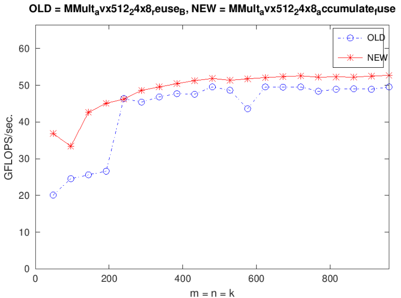

# hw2

要求是先在单核上实现最快的串行分子动力学模拟，然后在单节点（单机）上通过openMP实现并行的分子动力学模拟

原始版本的顺序分子动力学模拟是：每一个时间步的大小dt是0.0005

- `simulate_one_step`：负责模拟一个时间步的分子动力，就是对每个粒子都遍历图中的所有粒子，计算他们之间的相互作用力和加速度，然后在这个加速度和已有的速度下移动每个粒子的位置。

  

- `apply_force`：计算给定的粒子之间的相互作用力，如果粒子间的距离大于某个cutoff（粒子间有相互作用力的最大距离），就没有作用力；除此之外，当粒子间非常接近时，我们不希望它们之间存在非常大的作用力，让模拟崩溃，所以我们为粒子间的距离设置了一个最小的值

- `move`：根据在每个粒子对象中维护的加速度和原本的速度计算出新的速度，然后用新的速度和dt计算出移动距离，更新每个粒子当前的位置。还模拟了粒子撞到墙上后反弹的情况

  

要实现线性复杂度的顺序算法，我们需要：

1. 将整个模拟的空间分为小块（tile或者bin）
2. 计算每个粒子的位置，将他们分到对应的bin中
3. 对每个粒子，只考虑与他们相邻的bin中的粒子之间的相互作用力


在本lab中，我们会假设模拟的空间中的粒子密度是一个常数，所以当增加粒子的数量时，模拟的空间也会随之成比例地增大。所以与每个粒子互动的粒子个数也是常量，这样模拟的复杂度才能从平方变成线性

我们需要根据cutoff计算出bin的大小，如果bin太小了，以至于cutoff大于bin的大小，会导致丢失粒子的计算

使用openMP并行上面的算法：**main.cpp文件中在simulate_one_step外面使用omp parallel初始化了线程组，然后每个线程都要完整地执行一遍nsteps的simulate_one_step**。所以如果我们使用的是simulate_one_step的顺序版本，那么每个线程都会执行完全一样的代码。我们的任务是在simulate_one_step函数中插入工作共享指令，比如omp for，将simulate_one_step的任务分解给不同的线程执行。

在simulate_one_step外面使用parallel而不是在每个simulate_one_step内部使用的好处是可以避免在每个时间步都要重新创建一次线程组


benchmark：

- strong scaling：问题的大小保持不变，随着处理器个数的增加运行性能也成比例地提升

  

  

- weak scaling：问题的大小增加，处理器的个数也与其成比例地增加，运行时间保持不变

  

  

**线性时间复杂度的顺序版本：**bin的边长必须要大于cutoff，在每个bin中维护一个链表，记录了该bin中所有的粒子在全局的粒子数组中的下标。初始化时创建一个由bin组成的二维数组，然后遍历所有的粒子，计算每个粒子处于哪个bin中，将该粒子的索引插入到bin中的链表中，还要将bin在链表中所处的迭代器保存在粒子中，从而方便之后将粒子从bin中移除。

对每一个时间步，遍历所有的粒子，根据自己所在的bin，找到周围的相邻的bin，然后遍历这些bin中的粒子，计算它们之间的相互作用力和更新粒子的加速度。

所有粒子的加速度计算完毕后，再遍历所有粒子更新他们的位置，如果新的bin和旧的bin位置不同，那么还要将粒子从旧的bin移到新的bin中。

```c++
#define bin_size ((4.0 * cutoff) / 4)

// Particle Data Structure
typedef struct particle_t {
    double x;  // Position X
    double y;  // Position Y
    double vx; // Velocity X
    double vy; // Velocity Y
    double ax; // Acceleration X
    double ay; // Acceleration Y
    std::list<int>::iterator it;
} particle_t;

typedef struct bin {
  std::list<int> part_idxs;
}bin;
// Apply the force from neighbor to particle
void apply_force(particle_t& particle, particle_t& neighbor, int neighbor_idx) {
    // Calculate Distance
    double dx = neighbor.x - particle.x;
    double dy = neighbor.y - particle.y;
    double r2 = dx * dx + dy * dy;

    // Check if the two particles should interact
    if (r2 > cutoff * cutoff)
        return;

    r2 = fmax(r2, min_r * min_r);
    double r = sqrt(r2);

    // Very simple short-range repulsive force
    double coef = (1 - cutoff / r) / r2 / mass;
    // printf("part %d coef * dx: %f, coef * dy: %f\n", neighbor_idx, coef * dx, coef * dy);
    particle.ax += coef * dx;
    particle.ay += coef * dy;
}

// Integrate the ODE
void move(particle_t& p, double size) {
    // Slightly simplified Velocity Verlet integration
    // Conserves energy better than explicit Euler method
    p.vx += p.ax * dt;
    p.vy += p.ay * dt;
    p.x += p.vx * dt;
    p.y += p.vy * dt;
    // 粒子的坐标范围在0到x之间，闭区间
    // Bounce from walls
    while (p.x < 0 || p.x > size) {
        p.x = p.x < 0 ? -p.x : 2 * size - p.x;
        p.vx = -p.vx;
    }

    while (p.y < 0 || p.y > size) {
        p.y = p.y < 0 ? -p.y : 2 * size - p.y;
        p.vy = -p.vy;
    }
}

std::vector<std::vector<std::shared_ptr<bin>>> bins;
std::shared_ptr<bin> get_bin(double x, double y) {
    int bin_x = floor(x / bin_size);
    int bin_y = floor(y / bin_size);
    return bins[bin_x][bin_y];
}
int next[8][2] = {
    {0, 1},
    {0, -1},
    {1, 0},
    {-1, 0},
    {-1, -1},
    {-1, 1},
    {1, 1},
    {1, -1}
};
std::vector<std::shared_ptr<bin>> get_neighbor_bins(double x, double y, double size) {
    int bin_x = floor(x / bin_size);
    int bin_y = floor(y / bin_size);
    int bin_height = (int)ceil(size / bin_size);
    std::vector<std::shared_ptr<bin>> res;
    for (int i = 0; i < 8; i++) {
        int nx = bin_x + next[i][0];
        int ny = bin_y + next[i][1];
        if (nx < 0 || nx >= bin_height || ny < 0 || ny >= bin_height) {
            continue;
        }
        res.push_back(bins[nx][ny]);
    }
    // 当前的bin也要算进去
    res.push_back(bins[bin_x][bin_y]);
    return res;
}
void add_part_to_bin(std::shared_ptr<bin> bin_ptr, particle_t* parts, int part_idx) {
    bin_ptr->part_idxs.push_back(part_idx);
    parts[part_idx].it = --bin_ptr->part_idxs.end();
}
void init_simulation(particle_t* parts, int num_parts, double size) {
    int bin_height = (int)ceil(size / bin_size);
    int bin_width = bin_height;
    bins = std::vector<std::vector<std::shared_ptr<bin>>>(bin_width, std::vector<std::shared_ptr<bin>>(bin_height));
    for (int i = 0; i < bin_width; i++) {
        for (int j = 0; j < bin_height; j++) {
            bins[i][j] = std::make_shared<bin>();
        }
    }
    for (int i = 0; i < num_parts; i++) {
        auto bin_ptr = get_bin(parts[i].x, parts[i].y);
        add_part_to_bin(bin_ptr, parts, i);
    }
}

void simulate_one_step(particle_t* parts, int num_parts, double size) {
    // Compute Forces
    for (int i = 0; i < num_parts; ++i) {
        parts[i].ax = parts[i].ay = 0;
        std::vector<std::shared_ptr<bin>> neighbor_bins = get_neighbor_bins(parts[i].x, parts[i].y, size);
        for (std::shared_ptr<bin> neighbor_bin : neighbor_bins) {
            for (int neighbor_part_idx : neighbor_bin->part_idxs) {
                apply_force(parts[i], parts[neighbor_part_idx], neighbor_part_idx);
            }
        }
    }
    // Move Particles
    for (int i = 0; i < num_parts; ++i) {
        auto old_bin = get_bin(parts[i].x, parts[i].y);
        move(parts[i], size);
        auto new_bin = get_bin(parts[i].x, parts[i].y);
        if (old_bin == new_bin) continue;
        old_bin->part_idxs.erase(parts[i].it);
        add_part_to_bin(new_bin, parts, i);
    }
}
```

### 使用火焰图优化

采集数据：perf record 表示采集系统事件, 默认采集 cycles(即 CPU clock 周期), -F 99 表示每秒 99 次, -p 13204 是进程号, 即对哪个进程进行分析, -g 表示记录调用栈, sleep 30 则是持续 30 秒.

```
perf record -F 99 -p 3887 -g -- sleep 30
```

用 **perf script** 工具对 perf.data 进行解析

```
# 生成折叠后的调用栈
perf script -i perf.data &> perf.unfold
```

用 **stackcollapse-perf.pl** 将 perf 解析出的内容 **perf.unfold** 中的符号进行折叠 :

```
# 生成火焰图
./FlameGraph/stackcollapse-perf.pl perf.unfold &> perf.folded
```

最后生成 svg 图

```
./FlameGraph/flamegraph.pl perf.folded > perf.svg
```

我们可以将上面的流程简化为一条命令：

```
perf script | ~/FlameGraph/stackcollapse-perf.pl | ~/FlameGraph/flamegraph.pl > process4.svg
```

`perf` 同时支持 3 种栈回溯方式：`fp`, `dwarf`, `lbr`，可以通过 `--call-graph` 参数指定，而 `-g` 就相当于 `--call-graph fp`，如果**简单地使用-g很有可能会导致出现大量unkonwn**

- `fp` 就是 Frame Pointer，即 x86 中的 `EBP` 寄存器，`fp` 指向当前栈帧栈底地址，此地址保存着上一栈帧的 `EBP` 值，根据 `fp` 就可以逐级回溯调用栈。然而这一特性是会被优化掉的，而且这还是 GCC 的默认行为，在不手动指定 `-fno-omit-frame-pointer` 时默认都会进行此优化，此时 `EBP` 被当作一般的通用寄存器使用，以此为依据进行栈回溯显然是错误的。
- `dwarf` 是一种调试文件格式，GCC 编译时附加的 `-g` 参数生成的就是 `dwarf` 格式的调试信息，其中包括了栈回溯所需的全部信息，**实际测试表明使用 `dwarf` 可以很好的获取到准确的调用栈**。

注意，**使用perf时，可执行程序的编译一定要使用debug模式（-g），否则会丢失很多信息**

**火焰图就是看顶层的哪个函数占据的宽度最大。只要有"平顶"（plateaus），就表示该函数可能存在性能问题。**

所以完整的生成perf.data的命令是：

```
perf record -F 99 -p 3887 --call-graph dwarf --sleep 30
```

对于上面的代码，火焰图为：


表明在`simulate_one_step`中，`get_neighbor_bins`函数占据了最多的时间，而`get_neighbor_bins`中保存邻居bin的vector的`push_back`操作又占了大部分的时间。所以我们没有必要先找到当前bin的邻居bin，把他们保存在一个vector中，然后再遍历这个vector对邻居进行操作；**可以采用类似算子融合的方式，把这两个过程融合起来，就不需要中间的vector操作了**；

```c++
void simulate_one_step(particle_t* parts, int num_parts, double size) {
    // Compute Forces
    for (int i = 0; i < num_parts; ++i) {
        parts[i].ax = parts[i].ay = 0;
        double x = parts[i].x;
        double y = parts[i].y;
        // std::vector<std::shared_ptr<bin>> neighbor_bins = get_neighbor_bins(parts[i].x, parts[i].y, size);
        // 优化：函数融合，循环展开
        int bin_x = floor(x / bin_size);
        int bin_y = floor(y / bin_size);
        int bin_height = (int)ceil(size / bin_size);
        for (int i = 0; i < 9; i++) {
            int nx = bin_x + next[i][0];
            int ny = bin_y + next[i][1];
            if (nx < 0 || nx >= bin_height || ny < 0 || ny >= bin_height) {
                continue;
            }
            auto neighbor_bin = bins[nx][ny];
            for (int neighbor_part_idx : neighbor_bin->part_idxs) {
                apply_force(parts[i], parts[neighbor_part_idx], neighbor_part_idx);
            }
        }
    }
    // Move Particles
    for (int i = 0; i < num_parts; ++i) {
        auto old_bin = get_bin(parts[i].x, parts[i].y);
        move(parts[i], size);
        auto new_bin = get_bin(parts[i].x, parts[i].y);
        if (old_bin == new_bin) continue;
        old_bin->part_idxs.erase(parts[i].it);
        add_part_to_bin(new_bin, parts, i);
    }
}
```

优化后的火焰图：


可以发现，`shared_ptr`消耗了较多的时间，这里实际上并没有太复杂的垃圾回收需求，完全可以把智能指针替换成原始指针；原来在bins数组中保存的是bin的智能指针，现在可以改成保存bin对象本身，这样vector销毁时bin对象也会销毁；对bin对象的访问直接使用bin原始指针即可，不需要进行shared_ptr的传递

```c++
std::vector<std::vector<bin>> bins;
bin* get_bin(double x, double y) {
    int bin_x = floor(x / bin_size);
    int bin_y = floor(y / bin_size);
    return &bins[bin_x][bin_y];
}
int next[9][2] = {
    {0, 1},
    {0, -1},
    {1, 0},
    {-1, 0},
    {-1, -1},
    {-1, 1},
    {1, 1},
    {1, -1},
    {0, 0}
};
void add_part_to_bin(bin* bin_ptr, particle_t* parts, int part_idx) {
    bin_ptr->part_idxs.push_back(part_idx);
    parts[part_idx].it = --bin_ptr->part_idxs.end();
}
void init_simulation(particle_t* parts, int num_parts, double size) {
    int bin_height = (int)ceil(size / bin_size);
    int bin_width = bin_height;
    bins = std::vector<std::vector<bin>>(bin_width, std::vector<bin>(bin_height));
    for (int i = 0; i < bin_width; i++) {
        for (int j = 0; j < bin_height; j++) {
            bins[i][j] = bin();
        }
    }
    for (int i = 0; i < num_parts; i++) {
        auto bin_ptr = get_bin(parts[i].x, parts[i].y);
        add_part_to_bin(bin_ptr, parts, i);
    }
}
void simulate_one_step(particle_t* parts, int num_parts, double size) {
    // Compute Forces
    for (int i = 0; i < num_parts; ++i) {
        parts[i].ax = parts[i].ay = 0;
        double x = parts[i].x;
        double y = parts[i].y;
        // 优化：函数融合，循环展开
        int bin_x = floor(x / bin_size);
        int bin_y = floor(y / bin_size);
        int bin_height = (int)ceil(size / bin_size);
        for (int i = 0; i < 9; i++) {
            int nx = bin_x + next[i][0];
            int ny = bin_y + next[i][1];
            if (nx < 0 || nx >= bin_height || ny < 0 || ny >= bin_height) {
                continue;
            }
            auto neighbor_bin = &bins[nx][ny];
            for (int neighbor_part_idx : neighbor_bin->part_idxs) {
                apply_force(parts[i], parts[neighbor_part_idx], neighbor_part_idx);
            }
        }
    }
    // Move Particles
    for (int i = 0; i < num_parts; ++i) {
        auto old_bin = get_bin(parts[i].x, parts[i].y);
        move(parts[i], size);
        auto new_bin = get_bin(parts[i].x, parts[i].y);
        if (old_bin == new_bin) continue;
        old_bin->part_idxs.erase(parts[i].it);
        add_part_to_bin(new_bin, parts, i);
    }
}
```

`simulate_one_step`函数中的内容太多了，影响查看火焰图，所以可以将 `simulate_one_step`函数拆分成更小的函数再查看火焰图

```C++
void apply_force_to_bin(bin *neighbor_bin, int cur_part_idx, particle_t* parts) {
    for (int neighbor_part_idx : neighbor_bin->part_idxs) {
        apply_force(parts[cur_part_idx], parts[neighbor_part_idx], neighbor_part_idx);
    }
}
void compute_acce(particle_t* parts, int num_parts, double size) {
    // Compute Forces
    for (int i = 0; i < num_parts; ++i) {
        parts[i].ax = parts[i].ay = 0;
        double x = parts[i].x;
        double y = parts[i].y;
        int bin_x = floor(x / bin_size);
        int bin_y = floor(y / bin_size);
        int bin_height = (int)ceil(size / bin_size);
        for (int j = 0; j < 9; j++) {
            int nx = bin_x + next[j][0];
            int ny = bin_y + next[j][1];
            if (nx < 0 || nx >= bin_height || ny < 0 || ny >= bin_height) {
                continue;
            }
            auto neighbor_bin = &bins[nx][ny];
            apply_force_to_bin(neighbor_bin, i, parts);
        }
    }
}
void simulate_one_step(particle_t* parts, int num_parts, double size) {
    // Compute Forces
    compute_acce(parts, num_parts, size);
    // Move Particles
    for (int i = 0; i < num_parts; ++i) {
        auto old_bin = get_bin(parts[i].x, parts[i].y);
        move(parts[i], size);
        auto new_bin = get_bin(parts[i].x, parts[i].y);
        if (old_bin == new_bin) continue;
        old_bin->part_idxs.erase(parts[i].it);
        add_part_to_bin(new_bin, parts, i);
    }
}
```


将`apply_force_to_bin`和`apply_force`函数换成simd版本：首先将之前的结构体数组换成数组结构体

```c++
typedef struct particle_t {
    alignas(32) std::vector<double> x;  // Position X
    alignas(32) std::vector<double> y;  // Position Y
    alignas(32) std::vector<double> vx; // Velocity X
    alignas(32) std::vector<double> vy; // Velocity Y
    alignas(32) std::vector<double> ax; // Acceleration X
    alignas(32) std::vector<double> ay; // Acceleration Y
    alignas(32) std::vector<int> bin_idx; // 修改前：std::list<int>::iterator it;

} particle_t;

typedef struct bin {
  alignas(32) std::vector<int> part_idxs; // 修改前：std::list<int> part_idxs;
}bin;

void apply_force_simd(particle_t* particle, int cur_part_idx, __m128i neighbor_idx) {
    // Calculate Distance
    __m256d x1 = _mm256_set1_pd(particle->x[cur_part_idx]);
    __m256d y1 = _mm256_set1_pd(particle->y[cur_part_idx]);
    __m256d x2 = _mm256_i32gather_pd(&particle->x[0], neighbor_idx, 8);
    __m256d y2 = _mm256_i32gather_pd(&particle->y[0], neighbor_idx, 8);

    __m256d dx = x2 - x1;
    __m256d dy = y2 - y1;
    __m256d r2 = dx * dx + dy * dy;

    // double dx = particle->x[neighbor_idx] - particle->x[cur_part_idx];
    // double dy = particle->y[neighbor_idx] - particle->y[cur_part_idx];
    // double r2 = dx * dx + dy * dy;
    __m256d cutoff2 = _mm256_set1_pd(cutoff * cutoff);
    // 判断r2是否小于等于cutoff2，如果是则将掩码置为true
    __m256d gt_mask = _mm256_cmp_pd(r2, cutoff2, _CMP_GT_OS);
    // Check if the two particles should interact
    // if (r2 > cutoff * cutoff)
    //     return;
    __m256d min_r2 = _mm256_set1_pd(min_r * min_r);
    r2 = _mm256_max_pd(r2, min_r2);
    // r2 = fmax(r2, min_r * min_r);
    __m256d r = _mm256_sqrt_pd(r2);
    // double r = sqrt(r2);
    // Very simple short-range repulsive force
    __m256d coef = (1 - cutoff / r) / r2 / mass;
    // double coef = (1 - cutoff / r) / r2 / mass;

    // printf("part %d coef * dx: %f, coef * dy: %f\n", neighbor_idx, coef * dx, coef * dy);
    __m256d ax = coef * dx;
    __m256d ay = coef * dy;
    // 如果大于的话就选0，如果小于等于的话就选计算出来的值
    ax = _mm256_blendv_pd(ax, _mm256_set1_pd(0), gt_mask);
    ay = _mm256_blendv_pd(ay, _mm256_set1_pd(0), gt_mask);
    alignas(32) double temp_ax[4];
    alignas(32) double temp_ay[4];
    _mm256_store_pd(temp_ax, ax);
    _mm256_store_pd(temp_ay, ay);
    for (int i = 0; i < 4; i++) {
        particle->ax[cur_part_idx] += temp_ax[i];
        particle->ay[cur_part_idx] += temp_ay[i];
    }
    // particle->ax[cur_part_idx] += coef * dx;
    // particle->ay[cur_part_idx] += coef * dy;
}

// Apply the force from neighbor to particle
void apply_force(particle_t* particle, int cur_part_idx, int neighbor_idx) {
    // Calculate Distance
    double dx = particle->x[neighbor_idx] - particle->x[cur_part_idx];
    double dy = particle->y[neighbor_idx] - particle->y[cur_part_idx];
    double r2 = dx * dx + dy * dy;

    // Check if the two particles should interact
    if (r2 > cutoff * cutoff)
        return;

    r2 = fmax(r2, min_r * min_r);
    double r = sqrt(r2);

    // Very simple short-range repulsive force
    double coef = (1 - cutoff / r) / r2 / mass;
    // printf("part %d coef * dx: %f, coef * dy: %f\n", neighbor_idx, coef * dx, coef * dy);
    particle->ax[cur_part_idx] += coef * dx;
    particle->ay[cur_part_idx] += coef * dy;
}

// Integrate the ODE
void move(double &vx, double &vy, double &x, double &y, double &ax, double &ay, double size) {
    // Slightly simified Velocity Verlet integration
    // Conserves energy better than exicit Euler method
    vx += ax * dt;
    vy += ay * dt;
    x += vx * dt;
    y += vy * dt;
    // 粒子的坐标范围在0到x之间，闭区间
    // Bounce from walls
    while (x < 0 || x > size) {
        x = x < 0 ? -x : 2 * size - x;
        vx = -vx;
    }

    while (y < 0 || y > size) {
        y = y < 0 ? -y : 2 * size - y;
        vy = -vy;
    }
}

std::vector<std::vector<bin>> bins;
bin* get_bin(double x, double y) {
    int bin_x = floor(x / bin_size);
    int bin_y = floor(y / bin_size);
    return &bins[bin_x][bin_y];
}
int next[9][2] = {
    {0, 1},
    {0, -1},
    {1, 0},
    {-1, 0},
    {-1, -1},
    {-1, 1},
    {1, 1},
    {1, -1},
    {0, 0}
};
void add_part_to_bin(bin* bin_ptr, particle_t* parts, int part_idx) {
    bin_ptr->part_idxs.push_back(part_idx);
    parts->bin_idx[part_idx] = bin_ptr->part_idxs.size() - 1;
}
void init_simulation(particle_t* parts, int num_parts, double size) {
	  // You can use this space to initialize static, global data objects
    // that you may need. This function will be called once before the
    // algorithm begins. Do not do any particle simulation here
    int bin_height = (int)ceil(size / bin_size);
    int bin_width = bin_height;
    bins = std::vector<std::vector<bin>>(bin_width, std::vector<bin>(bin_height));
    for (int i = 0; i < bin_width; i++) {
        for (int j = 0; j < bin_height; j++) {
            bins[i][j] = bin();
        }
    }
    for (int i = 0; i < num_parts; i++) {
        auto bin_ptr = get_bin(parts->x[i], parts->y[i]);
        add_part_to_bin(bin_ptr, parts, i);
    }
}

void apply_force_to_bin(bin *neighbor_bin, int cur_part_idx, particle_t* parts) {
    int i;
    for (i = 0; i + 4 < neighbor_bin->part_idxs.size(); i += 4) {
        __m128i neighbor_part_idx_v =  _mm_load_si128((__m128i*)&neighbor_bin->part_idxs[i]);
        apply_force_simd(parts, cur_part_idx, neighbor_part_idx_v);
    }
    for (; i < neighbor_bin->part_idxs.size(); i++) {
        int neighbor_part_idx = neighbor_bin->part_idxs[i];
        apply_force(parts, cur_part_idx, neighbor_part_idx);
    }
}
void compute_acce(particle_t* parts, int num_parts, double size) {
    // Compute Forces
    for (int i = 0; i < num_parts; ++i) {
        // printf("%d \n", omp_get_thread_num());
        parts->ax[i] = parts->ay[i] = 0;
        double x = parts->x[i];
        double y = parts->y[i];
        // printf("parts %d\n", i);
        // std::vector<std::shared_ptr<bin>> neighbor_bins = get_neighbor_bins(parts[i].x, parts[i].y, size);
        // 优化：函数融合，循环展开
        int bin_x = floor(x / bin_size);
        int bin_y = floor(y / bin_size);
        int bin_height = (int)ceil(size / bin_size);
        for (int j = 0; j < 9; j++) {
            int nx = bin_x + next[j][0];
            int ny = bin_y + next[j][1];
            if (nx < 0 || nx >= bin_height || ny < 0 || ny >= bin_height) {
                continue;
            }
            auto neighbor_bin = &bins[nx][ny];
            apply_force_to_bin(neighbor_bin, i, parts);
        }
        // printf("parts %d final ax:%f, ay:%f\n", i, parts[i].ax, parts[i].ay);
        // printf("\n");
    }
}
void simulate_one_step(particle_t* parts, int num_parts, double size) {
    // Compute Forces
    compute_acce(parts, num_parts, size);
    // Move Particles
    for (int i = 0; i < num_parts; ++i) {
        auto old_bin = get_bin(parts->x[i], parts->y[i]);
        move(parts->vx[i], parts->vy[i], parts->x[i], parts->y[i], parts->ax[i], parts->ay[i], size);
        // printf("parts %d position: x %f,y %f\n", i, parts[i].x,parts[i].y);
        auto new_bin = get_bin(parts->x[i], parts->y[i]);
        if (old_bin == new_bin) continue;
        // 这里修改了粒子在bin中的vector中的位置，所以还需要更新粒子内部维护的它在bin的vector中的下标
        int idx_to_update = parts->bin_idx[i];
        std::swap(old_bin->part_idxs[idx_to_update], old_bin->part_idxs.back());
        parts->bin_idx[old_bin->part_idxs[idx_to_update]] = idx_to_update;
        old_bin->part_idxs.pop_back();
        add_part_to_bin(new_bin, parts, i);
    }
    // printf("\n");
}
```

但是修改后的性能反而下降，最后发现是bin太小了，粒子的密度太低了，平均五个bin中才有一个粒子，根本用不上simd指令。并且bin内部的粒子链表也没必要改成vector，也是因为bin内部的粒子太少，不存在利用缓存局部性的必要

### 使用omp

将上面的serial代码复制到openmp文件中，再对simulate_one_step使用openmp指令

```c++
void compute_acce(particle_t* parts, int num_parts, double size) {
    // Compute Forces
	#pragma omp for
    for (int i = 0; i < num_parts; ++i) {
        parts[i].ax = parts[i].ay = 0;
        double x = parts[i].x;
        double y = parts[i].y;
        // 优化：函数融合，循环展开
        int bin_x = floor(x / bin_size);
        int bin_y = floor(y / bin_size);
        int bin_height = (int)ceil(size / bin_size);
        for (int j = 0; j < 9; j++) {
            int nx = bin_x + next[j][0];
            int ny = bin_y + next[j][1];
            if (nx < 0 || nx >= bin_height || ny < 0 || ny >= bin_height) {
                continue;
            }
            auto neighbor_bin = &bins[nx][ny];
            apply_force_to_bin(neighbor_bin, i, parts);
        }
    }
}
void simulate_one_step(particle_t* parts, int num_parts, double size) {
    // Compute Forces
    compute_acce(parts, num_parts, size);
    // Move Particles
	#pragma omp single
    for (int i = 0; i < num_parts; ++i) {
        auto old_bin = get_bin(parts[i].x, parts[i].y);
        move(parts[i], size);
        auto new_bin = get_bin(parts[i].x, parts[i].y);
        if (old_bin == new_bin) continue;
        old_bin->part_idxs.erase(parts[i].it);
        add_part_to_bin(new_bin, parts, i);
    }
}
```

优化结果：

原始：

```
$ ./serial -n 100000 -s 1 -o myoutput
Simulation Time = 93.6727 seconds for 100000 particles.
```

融合掉了邻居vector后：

```
$ ./serial -n 100000 -s 1 -o myoutput
Simulation Time = 62.5443 seconds for 100000 particles.
```

去掉了智能指针后：

```
$ ./serial -n 100000 -s 1 -o myoutput
Simulation Time = 20.8161 seconds for 100000 particles.
```

线性复杂度和平方复杂度算法的耗时对比：

```
$ ./correct_serial -n 10000 -s 1 -o correct_output
Simulation Time = 75.9172 seconds for 10000 particles.
$ ./serial -n 10000 -s 1 -o myoutput
Simulation Time = 1.34495 seconds for 10000 particles.
```

1M个粒子的结果：

```
$ ./serial -n 1000000 -s 1 -o myoutput
Simulation Time = 345.893 seconds for 1000000 particles.
```

使用omp后1M个粒子的耗时：

```
$ ./openmp -n 1000000 -s 1 -o myoutput
Simulation Time = 154.209 seconds for 1000000 particles.
```

最终的火焰图：


### 使用MPI

在MPI版本中，首先需要将空间切分给不同的进程，有两种分割方式：


一种是按行分割，一行分给一个进程；一种是将空间切割成二维数组，一个格子分给一个进程。通过计算可以发现，后者需要的通信量更小，所以选择后者

在每个进程内部自己的空间中，也需要将空间切割成bin，从而加快寻找邻居粒子的速度。这里为了避免不必要的麻烦，每次模拟之前，都要将bin的大小设置为可以被box整除的数值

在这个问题中，进程之间通信的信息就是bin，所以我的数据结构的设计是将粒子对象直接存放在bin中，而不是像之前那样，在parts数组中存放粒子对象，在bin中存放粒子在parts数组中的索引；这样可以方便通信，通信的时候直接传bin即可。

```c++
#define BIN_PARTS_NUM 3
// Particle Data Structure
typedef struct particle_t {
    bool valid;
    uint64_t id; // Particle ID
    double x;    // Position X
    double y;    // Position Y
    double vx;   // Velocity X
    double vy;   // Velocity Y
    double ax;   // Acceleration X
    double ay;   // Acceleration Y
} particle_t;
typedef struct bin {
  particle_t parts[BIN_PARTS_NUM];
} bin;
```

然后在每个进程内部维护一个local_parts数组，数组中维护了指向当前进程的bin中的粒子的指针，每个进程可以通过这个数组来遍历自己的粒子。还维护了一个local_bins数组，表示当前进程中的所有bin。

```c++
std::vector<particle_t*> local_parts;
std::vector<std::vector<bin>> local_bins;
```

并且为了和周围的进程中的bin通信，在local_bins中还额外维护了一圈ghost bin。


代码流程：

1. 在main函数中每个进程都会先在自己的地址空间中分配一个parts数组，然后由根进程对自己的地址空间的parts数组进行初始化；再调用MPI_Bcast，它会将根进程刚才初始化的parts数组广播到所有的进程，确保所有的进程在模拟开始时使用的是相同的数据；然后在init_simulation函数中，每个进程计算出自己负责的block的四个角在全局空间中的坐标，还要计算出算上ghost_bin之后的block在全局空间中的坐标。然后每个进程遍历整个parts数组，将parts数组中在自己block范围的粒子分配给自己进程中对应的bin，并且将该粒子的指针同时维护在local_parts数组中。
2. 在simulate_one_step中，每个进程先和周围的进程通信，先向周围的八个进程发送自己最外围的一圈bin，用bin在全局中的idx作为发送的tag，发送完毕后，再从周围的进程recv它们外围的bin到自己的ghost bin中。注意，这里不能使用MPI_sendrecv，因为相邻的两个进程之间不是按照相同的代码顺序发送和接收同一个bin的，所以会出现死锁。
3. 接收到ghost bin之后，就可以和顺序的代码一样，每个进程自己独立计算local_parts的加速度了
4. 计算完加速度之后，每个进程遍历自己本地的粒子local_parts，计算它们的新的bin，将他们从旧的bin移到新的bin；如果新的bin是ghost bin，那么这个粒子就相当于跳出了当前进程的负责范围，需要将它从local_parts中移除
5. 在move之后，还需要和周围的进程进行一轮通信，每个进程将之前接收到的ghost bin发送回去，然后将自己之前发送出去的bin收回来暂存，用收回来的bin中的粒子更新自己本地的bin和local_parts。这样就完成了一步分子动力学模拟
6. 完成simulate_one_step后，main函数还要调用gather_for_save，将所有进程本地的粒子local_parts gather到根进程，将这一步的模拟结果保存下来。这里的gather有一点技巧，由于每个进程发送的粒子数量不一样，所以需要先把发送的粒子数量gather到根进程的一个数组中，遍历这个数组计算出每个进程的数据在根进程parts中保存的偏移量数组，然后使用这两个数组调用MPI_Gatherv才能将所有进程的数据正确地聚集到根进程中

```c++
//*********
// main.cpp
//*********
int main(int argc, char** argv) {
    // Open Output File
    char* savename = find_string_option(argc, argv, "-o", nullptr);
    std::ofstream fsave(savename);

    // Init MPI
    int num_procs, rank;
    // MPI_Init后的代码所有的进程都要执行
    MPI_Init(&argc, &argv);
    MPI_Comm_size(MPI_COMM_WORLD, &num_procs);
    MPI_Comm_rank(MPI_COMM_WORLD, &rank);
    // Create MPI Particle Type
    // 结构体PARTICLE中的成员数量
    const int nitems = 8;
    // 每个成员的数量
    int blocklengths[8] = {1, 1, 1, 1, 1, 1, 1, 1};
    // MPI类型中的每个成员的具体类型
    MPI_Datatype types[8] = {MPI_C_BOOL, MPI_UINT64_T, MPI_DOUBLE, MPI_DOUBLE, MPI_DOUBLE,
                             MPI_DOUBLE,   MPI_DOUBLE, MPI_DOUBLE};
    MPI_Aint offsets[8];
    // 每个成员在PARTICLE结构体中的偏移量
    offsets[0] = offsetof(particle_t, valid);
    offsets[1] = offsetof(particle_t, id);
    offsets[2] = offsetof(particle_t, x);
    offsets[3] = offsetof(particle_t, y);
    offsets[4] = offsetof(particle_t, vx);
    offsets[5] = offsetof(particle_t, vy);
    offsets[6] = offsetof(particle_t, ax);
    offsets[7] = offsetof(particle_t, ay);
    // MPI不能发送和接收自定义的类对象，所以需要使用MPI_Type_create_struct来创建一个类型
    // 之后就可以使用PARTICLE数据类型来接收和发送particle_t结构体的实例
    MPI_Type_create_struct(nitems, blocklengths, offsets, types, &PARTICLE);
    MPI_Type_commit(&PARTICLE);

    // Initialize Particles
    int num_parts = find_int_arg(argc, argv, "-n", 1000);
    int part_seed = find_int_arg(argc, argv, "-s", 0);
    double size = sqrt(density * num_parts);

    particle_t* parts = new particle_t[num_parts];

    if (rank == 0) {
        init_particles(parts, num_parts, size, part_seed);
    }
    // 将粒子数据从根进程广播到所有其他进程，确保所有进程在模拟开始时都使用相同的初始数据
    // 其他进程不需要显式调用任何MPI函数来接收数据，自动将根进程parts数组的内容同步到所有的进程的parts数组
    // 每个进程都有一份完整的parts数组的副本
    MPI_Bcast(parts, num_parts, PARTICLE, 0, MPI_COMM_WORLD);

    // Algorithm
    auto start_time = std::chrono::steady_clock::now();

    // 此时所有进程中的parts数组的内容是相同的，每个进程将parts数组的一部分保存在自己的地址空间中，然后
    // simulate_one_step中对这部分粒子进行操作
    init_simulation(parts, num_parts, size, rank, num_procs);

    for (int step = 0; step < nsteps; ++step) {
        // 每个进程都有一份完整的parts数组，但是其中只有自己进程的那部分parts是正确的数据，
        // parts数组中其他部分都是旧的数据，不能使用
        simulate_one_step(parts, num_parts, size, rank, num_procs);

        // Save state if necessary
        if (fsave.good() && (step % savefreq) == 0) {
            // 每一次simulate_one_step之后，gather负责将所有进程的本地的parts更新到根进程的parts数组中，
            // 然后将全局的parts数组保存下来。
            gather_for_save(parts, num_parts, size, rank, num_procs);
            if (rank == 0) {
                save(fsave, parts, num_parts, size);
            }
        }
    }

    auto end_time = std::chrono::steady_clock::now();

    std::chrono::duration<double> diff = end_time - start_time;
    double seconds = diff.count();

    // Finalize
    if (rank == 0) {
        std::cout << "Simulation Time = " << seconds << " seconds for " << num_parts
                  << " particles.\n";
    }
    if (fsave) {
        fsave.close();
    }
    delete[] parts;
    MPI_Finalize();
}

//*********
// mpi.cpp
//*********
double block_x1, block_x2, block_y1, block_y2;
double ghost_block_x1, ghost_block_x2, ghost_block_y1, ghost_block_y2;
int ghost_bin_global_x1, ghost_bin_global_y1;
double local_size;
int bin_height;
int rank_x;
int rank_y;
int x_proc_nums;
int total_proc_nums;
double bin_size;
bool check_local_part(particle_t* part) {
    if (block_x1 <= part->x && part->x < block_x2 && block_y1 <= part->y && part->y < block_y2) {
        return true;
    }
    return false;
}
// 获取的是加上ghost particle之后的bin的坐标
int get_local_bin_x(double global_x) {
    assert(global_x >= block_x1 && global_x <= block_x2);
    double local_offset_x = global_x - block_x1;
    int bin_x = floor(local_offset_x / bin_size);
    return bin_x + 1;
}

int get_local_bin_y(double global_y) {
    assert(global_y >= block_y1 && global_y <= block_y2);
    double local_offset_y = global_y - block_y1;
    int bin_y = floor(local_offset_y / bin_size);
    return bin_y + 1;
}
bin* get_local_bin(double x, double y) {
    int bin_x = get_local_bin_x(x);
    int bin_y = get_local_bin_y(y);
    assert(bin_x >= 1 && bin_x <= bin_height - 2 && bin_y >= 1 && bin_y <= bin_height - 2);
    return &local_bins[bin_x][bin_y];
}
bin* get_local_and_ghost_bin(double x, double y, bool* is_ghost) {
    assert(x >= ghost_block_x1 && x <= ghost_block_x2 && y >= ghost_block_y1 && y <= ghost_block_y2);
    if (x >= block_x1 && x <= block_x2 && y >= block_y1 && y <= block_y2) {
        *is_ghost = false;
        return get_local_bin(x, y);
    }
    *is_ghost = true;
    int bin_x = floor((x - ghost_block_x1) / bin_size);
    int bin_y = floor((y - ghost_block_y1) / bin_size);
    assert((bin_x == 0 || bin_x == bin_height - 1) || (bin_y == 0 || bin_y == bin_height - 1));
    bin* ghost_bin = &local_bins[bin_x][bin_y];
    return ghost_bin;
}
particle_t* copy_part_to_local_bin(bin* bin_ptr, particle_t *part) {
    particle_t* result = NULL;
    for (int i = 0; i < 3; i++) {
        if (bin_ptr->parts[i].valid == true) continue;
        bin_ptr->parts[i] = *part;
        result = &bin_ptr->parts[i];
        bin_ptr->parts[i].valid = true;
        break;
    }
    assert(result != NULL);
    return result;
}
// 将全局的part数组中分给当前进程的parts分配并复制到当前进程的bin中，然后再将bin中存储的parts对象的指针保存到local_parts中
// 所以在初始化时，每个粒子在整个系统中都有两个一样的副本，一个在全局的parts数组中，一个在被分配的进程的bin中，
// 每个进程的local_parts数组中保存的指针指向的是进程本地bin中的particle实例
// 模拟开始之后，每一步更新的是进程本地的bin中的粒子，而不是全局parts数组中的粒子
void distribute_to_local_bins(particle_t* parts, int num_parts) {
    local_bins = std::vector<std::vector<bin>>(bin_height, std::vector<bin>(bin_height));
    for (int i = 0; i < bin_height; i++) {
        for (int j = 0; j < bin_height; j++) {
            local_bins[i][j] = bin();
            for (int k = 0; k < BIN_PARTS_NUM; k++) {
                local_bins[i][j].parts[k].valid = false;
            }
        }
    }
    int cur_rank;
    MPI_Comm_rank(MPI_COMM_WORLD, &cur_rank);
    for (int i = 0; i < num_parts; i++) {
        particle_t* cur_part = &parts[i];
        if (check_local_part(cur_part)) {
            auto bin_ptr = get_local_bin(cur_part->x, cur_part->y);
            particle_t* res = copy_part_to_local_bin(bin_ptr, cur_part);
            local_parts.push_back(res);
        }
    }
}
MPI_Datatype BIN;
// Put any static global variables here that you will use throughout the simulation.
void init_simulation(particle_t* parts, int num_parts, double size, int rank, int num_procs) {
    // 假设是正方形
    x_proc_nums = floor(sqrt(num_procs));
    int y_proc_nums = x_proc_nums; 
    total_proc_nums = x_proc_nums * y_proc_nums;
    local_size = size / x_proc_nums;
    // 多两行和两列，ghost particles，便于从其他进程获取数据
    bin_size = cutoff;
    bin_size = local_size / (int)floor(local_size / bin_size);
    bin_height = (int)ceil(local_size / bin_size) + 2;
    // printf("bin_size:%f, bin_height:%d, local size %f\n", bin_size, bin_height, local_size);

    rank_x = rank / y_proc_nums;
    rank_y = rank % y_proc_nums;
    // 计算全局的bin的x和y
    ghost_bin_global_x1 = (bin_height - 2) * rank_x - 1;
    ghost_bin_global_y1 = (bin_height - 2) * rank_y - 1;
    block_x1 = rank_x * local_size;
    block_x2 = (rank_x + 1) * local_size;
    block_y1 = rank_y * local_size;
    block_y2 = (rank_y + 1) * local_size;
    ghost_block_x1 = block_x1 - bin_size;
    ghost_block_y1 = block_y1 - bin_size;
    ghost_block_x2 = block_x2 + bin_size;
    ghost_block_y2 = block_y2 + bin_size;
    distribute_to_local_bins(parts, num_parts);

    const int nitems = 1;
    int blocklengths = BIN_PARTS_NUM;
    MPI_Datatype types = PARTICLE;
    MPI_Aint offset = offsetof(bin, parts);
    MPI_Type_create_struct(nitems, &blocklengths, &offset, &types, &BIN);
    MPI_Type_commit(&BIN);
}
int next[9][2] = {
    {0, 1},
    {0, -1},
    {1, 0},
    {-1, 0},
    {-1, -1},
    {-1, 1},
    {1, 1},
    {1, -1},
    {0, 0}
};
// Apply the force from neighbor to particle
void apply_force(particle_t& particle, particle_t& neighbor) {
    // Calculate Distance
    double dx = neighbor.x - particle.x;
    double dy = neighbor.y - particle.y;
    double r2 = dx * dx + dy * dy;

    // Check if the two particles should interact
    if (r2 > cutoff * cutoff)
        return;

    r2 = fmax(r2, min_r * min_r);
    double r = sqrt(r2);

    // Very simple short-range repulsive force
    double coef = (1 - cutoff / r) / r2 / mass;
    particle.ax += coef * dx;
    particle.ay += coef * dy;
}
void apply_force_to_bin(bin *neighbor_bin, particle_t* cur_part) {
    for (int i = 0; i < BIN_PARTS_NUM; i++) {
        if (!neighbor_bin->parts[i].valid) continue;
        apply_force(*cur_part, neighbor_bin->parts[i]);
    }
}
void compute_acce(void) {
    // Compute Forces
    for (int i = 0; i < local_parts.size(); ++i) {
        particle_t* cur_part = local_parts[i];
        cur_part->ax = cur_part->ay = 0;
        double x = cur_part->x;
        double y = cur_part->y;
        int bin_x = get_local_bin_x(x);
        int bin_y = get_local_bin_y(y);
        for (int j = 0; j < 9; j++) {
            int nx = bin_x + next[j][0];
            int ny = bin_y + next[j][1];
            assert(nx >= 0 && nx < bin_height && ny >= 0 && ny < bin_height);
            auto neighbor_bin = &local_bins[nx][ny];
            apply_force_to_bin(neighbor_bin, cur_part);
        }
    }
}
// Integrate the ODE
void move(particle_t& p, double size) {
    p.vx += p.ax * dt;
    p.vy += p.ay * dt;
    p.x += p.vx * dt;
    p.y += p.vy * dt;
    // 粒子的坐标范围在0到x之间，闭区间
    // Bounce from walls
    while (p.x < 0 || p.x > size) {
        p.x = p.x < 0 ? -p.x : 2 * size - p.x;
        p.vx = -p.vx;
    }

    while (p.y < 0 || p.y > size) {
        p.y = p.y < 0 ? -p.y : 2 * size - p.y;
        p.vy = -p.vy;
    }
}
int get_1D_rank(int x, int y) {
    return x * x_proc_nums + y;
}
int get_1D_bin_global_idx(int x, int y) {
    assert (x >= 0 && y >= 0);
    return x * ((bin_height - 2) * x_proc_nums) + y;
}
void send(int dest, int send_i, int send_j, int source) {
    int bin_global_idx = get_1D_bin_global_idx(send_i + ghost_bin_global_x1, send_j + ghost_bin_global_y1);
    bin *sendbuf = &local_bins[send_i][send_j];
    // MPI_Request request;
    MPI_Send(sendbuf, 1, BIN, dest, bin_global_idx, MPI_COMM_WORLD);
}
void recv(int dest, int recv_i, int recv_j, int source, bool update) {
    int bin_global_idx = get_1D_bin_global_idx(recv_i + ghost_bin_global_x1, recv_j + ghost_bin_global_y1);
    bin *recvbuf = &local_bins[recv_i][recv_j];
    if (!update) {
        MPI_Recv(recvbuf, 1, BIN, dest, bin_global_idx, MPI_COMM_WORLD, MPI_STATUS_IGNORE);
        return;
    }
    bin temp;
    MPI_Recv(&temp, 1, BIN, dest, bin_global_idx, MPI_COMM_WORLD, MPI_STATUS_IGNORE);
    // 更新recvbuf，遍历temp的所有粒子，如果recvbuf有空的位子就把粒子加入
    for (int i = 0; i < BIN_PARTS_NUM; i++) {
        if (temp.parts[i].valid) {
            for (int j = 0; j < BIN_PARTS_NUM; j++) {
                if (!recvbuf->parts[j].valid) {
                    recvbuf->parts[j] = temp.parts[i];
                    recvbuf->parts[j].valid = true;
                    local_parts.push_back(&recvbuf->parts[j]);
                    break;
                } else {
                    assert(temp.parts[i].id != recvbuf->parts[j].id);
                }
            }
        }
    }
}
void send_to_neighbor(int rank, bool update) {
    for (int i = 0; i < bin_height; i++) {
        for (int j = 0; j < bin_height; j++) {
            if (i > 0 && i < bin_height - 1 && j > 0 && j < bin_height - 1) continue;
            if (i == 0 && rank_x == 0) continue;
            if (i == bin_height - 1 && rank_x == x_proc_nums - 1) continue;
            if (j == 0 && rank_y == 0) continue;
            if (j == bin_height - 1 && rank_y == x_proc_nums - 1) continue;
            if (i == 0 && j == 0) {
                int dest = get_1D_rank(rank_x - 1, rank_y - 1);
                if (!update) {
                    send(dest, 1, 1, rank);
                } else {
                    recv(dest, 1, 1, rank, update);
                }
            } else if (i == 0 && j == bin_height - 1) {
                int dest = get_1D_rank(rank_x - 1, rank_y + 1);
                if (!update) {
                    send(dest, 1, bin_height - 2, rank);
                } else {
                    recv(dest, 1, bin_height - 2, rank, update);
                }
            } else if (i == bin_height - 1 && j == 0) {
                int dest = get_1D_rank(rank_x + 1, rank_y - 1);
                if (!update) {
                    send(dest, bin_height - 2, 1, rank);
                } else {
                    recv(dest, bin_height - 2, 1, rank, update);
                }
            } else if (i == bin_height - 1 && j == bin_height - 1) {
                int dest = get_1D_rank(rank_x + 1, rank_y + 1);
                if (!update) {
                    send(dest, bin_height - 2, bin_height - 2, rank);
                } else {
                    recv(dest, bin_height - 2, bin_height - 2, rank, update);
                }
            } else if (i == 0) {
                int dest = get_1D_rank(rank_x - 1, rank_y);
                if (!update) {
                    send(dest, 1, j, rank);
                } else {
                    recv(dest, 1, j, rank, update);
                }
            } else if (j == 0) {
                int dest = get_1D_rank(rank_x, rank_y - 1);
                if (!update) {
                    send(dest, i, 1, rank);
                } else {
                    recv(dest, i, 1, rank, update);
                }
            } else if (i == bin_height - 1) {
                int dest = get_1D_rank(rank_x + 1, rank_y);
                if (!update) {
                    send(dest, bin_height - 2, j, rank);
                } else {
                    recv(dest, bin_height - 2, j, rank, update);
                }
            } else {
                int dest = get_1D_rank(rank_x, rank_y + 1);
                if (!update) {
                    send(dest, i, bin_height - 2, rank);
                } else {
                    recv(dest, i, bin_height - 2, rank, update);
                }
            }
        }
    }

}
void recv_from_neighbor(int rank, bool update) {
    for (int i = 0; i < bin_height; i++) {
        for (int j = 0; j < bin_height; j++) {
            int dest;
            if (i > 0 && i < bin_height - 1 && j > 0 && j < bin_height - 1) continue;
            if (i == 0 && rank_x == 0) continue;
            if (i == bin_height - 1 && rank_x == x_proc_nums - 1) continue;
            if (j == 0 && rank_y == 0) continue;
            if (j == bin_height - 1 && rank_y == x_proc_nums - 1) continue;
            if (i == 0 && j == 0) {
                dest = get_1D_rank(rank_x - 1, rank_y - 1);
            } else if (i == 0 && j == bin_height - 1) {
                dest = get_1D_rank(rank_x - 1, rank_y + 1);
            } else if (i == bin_height - 1 && j == 0) {
                dest = get_1D_rank(rank_x + 1, rank_y - 1);
            } else if (i == bin_height - 1 && j == bin_height - 1) {
                dest = get_1D_rank(rank_x + 1, rank_y + 1);
            } else if (i == 0) {
                dest = get_1D_rank(rank_x - 1, rank_y);
            } else if (j == 0) {
                dest = get_1D_rank(rank_x, rank_y - 1);
            } else if (i == bin_height - 1) {
                dest = get_1D_rank(rank_x + 1, rank_y);
            } else {
                dest = get_1D_rank(rank_x, rank_y + 1);
            }
            if (!update) {
                recv(dest, i, j, rank, update);
            } else {
                send(dest, i, j, rank);
            }
        }
    }

}
void communicate(int rank, bool update) {
    if (!update) {
        send_to_neighbor(rank, update);
        recv_from_neighbor(rank, update);
    } else {
        recv_from_neighbor(rank, update);
        send_to_neighbor(rank, update);
    }
}
void clear_ghost_bin() {
    for (int i = 0; i < bin_height; i++) {
        for (int j = 0; j < bin_height; j++) {
            if (i == 0 || j == 0 || i == bin_height - 1 || j == bin_height - 1) {
                for (int k = 0; k < BIN_PARTS_NUM; k++) {
                    local_bins[i][j].parts[k].valid = false;
                }
            }
        }
    }
}
void simulate_one_step(particle_t* parts, int num_parts, double size, int rank, int num_procs) {
    // 让多余的proc空闲
    if (rank >= total_proc_nums) return;
    // 和周围的进程通信，获取ghost bin，这些ghost bin只存在于local_bins数组中，他们的particle不需要加入local_parts中
    communicate(rank, false);
    // Compute Forces
    compute_acce();
    // 在move之前把ghost bin中的粒子清空，从而方便后面将ghost bin发送回去之后其他进程更新自己的bin
    clear_ghost_bin();
    // 移动粒子，只负责移动本地的粒子，有可能会移动到ghost particle中，ghost particle中的粒子只会多不会少
    for (auto it = local_parts.begin(); it != local_parts.end();) {
        particle_t *cur_part = *it;
        bin* old_bin = get_local_bin(cur_part->x, cur_part->y);
        move(*cur_part, size);
        bool is_ghost;
        bin* new_bin = get_local_and_ghost_bin(cur_part->x, cur_part->y, &is_ghost);
        if (old_bin != new_bin) {
            // 目前part保存在old_bin中，所以是将old_bin中的valid变成false
            cur_part->valid = false;
            // 如果新的bin不是ghost，那么就将local_parts中的旧的指针替换成新的bin中的part的指针
            particle_t *new_part = copy_part_to_local_bin(new_bin, cur_part);
            if (!is_ghost) {
                *it = new_part;
                it++;
            } else { // 如果新的bin是ghost，那么parts就移动到了当前proc的范围之外了，需要从local_parts中移除
                it = local_parts.erase(it);
            }
        } else {
            it++;
        }
    }
    // 在move之后把之前发出去的bin收回来，更新自己本地的bin，然后也要把之前接收的bin发回去
    communicate(rank, true);
    MPI_Barrier(MPI_COMM_WORLD);
}

void gather_for_save(particle_t* parts, int num_parts, double size, int rank, int num_procs) {
    int send_parts_num = local_parts.size();
    particle_t send_buf[send_parts_num];
    for (int i = 0; i < send_parts_num; i++) {
        send_buf[i] = *local_parts[i];
    }
    int send_parts_num_v[num_procs];
    int displys[num_procs];
    MPI_Gather(&send_parts_num, 1, MPI_INT, send_parts_num_v, 1, MPI_INT, 0, MPI_COMM_WORLD);
    int offset = 0;
    for (int i = 0; i < num_procs; i++) {
        displys[i] = offset;
        offset += send_parts_num_v[i]; 
    }
    if (rank == 0) {
        assert(offset == num_parts);
    }
    // 根进程从每个进程接收数据，按照rank排列在revc_buf中，每个进程发送数据个数是自己的send_parts_num，
    // 根进程从每个进程接收的数据个数是从其他进程收集来的send_parts_num_v，接受的数据存储在parts中的偏移量由displys决定
    MPI_Gatherv(send_buf, send_parts_num, PARTICLE, parts, send_parts_num_v, displys, PARTICLE, 0, MPI_COMM_WORLD);
    // 按照id升序排序
    if (rank == 0) {
        std::sort(parts, parts + num_parts, [](particle_t &a, particle_t &b) {
            return a.id < b.id;
        });
    }
}
```

运行结果：

单机16进程模拟一万个粒子：

```
$ mpirun -np 16 ./mpi -n 10000 -s 1 -o output
Simulation Time = 8.49818 seconds for 10000 particles.
```

单机64进程模拟十万个粒子：

```
$ mpirun -np 64 ./mpi -n 100000 -s 1 -o output
Simulation Time = 93.4248 seconds for 100000 particles.
```

单机64进程模拟一百万个粒子：

```
$ mpirun -np 64 ./mpi -n 1000000 -s 1 -o output
Simulation Time = 346.089 seconds for 1000000 particles.
```

### 使用cuda

为了减少在主机和设备之间的通信，cuda版本的实现不再使用之前的数据结构。之前是在bin结构体中维护一个particle的链表或数组，这样会导致主机和设备之间的通信量较大。于是采用如下的数据结构：


维护一个数组`parts_idx`，每个元素代表一个粒子，元素的内容就是该粒子在全局的parts数组中的索引；并且粒子在parts_idx中按照所属的bin的idx升序排列，所以在同一个bin中的粒子会在相邻位置

维护一个数组bin_idx，每个元素代表一个bin，元素的内容是该bin中的粒子在parts_idx中的起点的索引，那么就可以通过当前bin的idx和下一个bin的idx获取到在当前bin中的所有的粒子

构造这个数据结构的方式：

1. 将bin_idx初始化为0，启动一个核函数，遍历parts数组中所有的粒子，每个cuda线程负责一个粒子，找到他们所属的bin，然后对bin_idx数组中对应的元素用原子操作累加计数。最后bin_idx数组就代表每个bin中的粒子数目
2. 使用exclusive_scan对bin_idx计算前缀和，就可以得到每个bin的粒子在parts_idx数组中的范围
3. 再将parts数组遍历一遍，还是每个cuda线程负责一个粒子，根据每个粒子所属的bin的索引在bin_idx数组中找到自己对应的bin，然后就可以在parts_idx数组中找到自己位置，将自己在parts数组中的索引保存在parts_idx数组中的对应位置，并将bin_idx的对应位置计数原子加。

构造完毕后，就可以进行模拟了

对于每一步模拟（simulate_one_step）：

1. 启动一个核函数，每个cuda线程负责一个粒子，计算出该粒子周围的bin中的粒子对它的作用力；
2. 然后再启动一个核函数，每个cuda线程负责一个粒子，更新该粒子的位置
3. 由于粒子的位置被更新了，所以最后还需要按照上面的方式重新构造一遍数据结构

```C++
#define NUM_THREADS 256
int blks;

__global__ void move_gpu(particle_t* particles, int num_parts, double size) {

    // Get thread (particle) ID
    int tid = threadIdx.x + blockIdx.x * blockDim.x;
    if (tid >= num_parts)
        return;
    particle_t* p = &particles[tid];
    p->vx += p->ax * dt;
    p->vy += p->ay * dt;
    p->x += p->vx * dt;
    p->y += p->vy * dt;
    while (p->x < 0 || p->x > size) {
        p->x = p->x < 0 ? -(p->x) : 2 * size - p->x;
        p->vx = -(p->vx);
    }
    while (p->y < 0 || p->y > size) {
        p->y = p->y < 0 ? -(p->y) : 2 * size - p->y;
        p->vy = -(p->vy);
    }
}

__device__ int get_bin_idx(double x, double y, int bin_heigh) {
    int bin_x = floor(x / bin_size);
    int bin_y = floor(y / bin_size);
    return bin_x * bin_heigh + bin_y;
}


__global__ void accumulate_bins_parts_cnt(particle_t* parts, int num_parts, int bin_height, int *bins_d) {
    int tid = blockIdx.x * blockDim.x + threadIdx.x;
    if (tid < num_parts) {
        particle_t* cur_part = &parts[tid];
        int bin_idx = get_bin_idx(cur_part->x, cur_part->y, bin_height);
        cur_part->bin_idx = bin_idx;
        atomicAdd(&bins_d[bin_idx], 1);
    }
}
// 对bins进行原地scan
void exclusive_scan_bins(int bins_len, int *scan_res, int *bins_d) {
    thrust::device_ptr<int> scan_res_vec(scan_res);
    thrust::device_ptr<int> bins_vec(bins_d);
    thrust::exclusive_scan(bins_vec, bins_vec + bins_len, scan_res_vec);
    CHECK(cudaMemcpy(bins_d, scan_res, sizeof(int) * bins_len, cudaMemcpyDeviceToDevice));
}

__global__ void distribute(particle_t* parts, int num_parts, int* scan_res, int *parts_idx_d) {
    int tid = blockIdx.x * blockDim.x + threadIdx.x;
    if (tid < num_parts) {
        particle_t* cur_part = &parts[tid];
        parts_idx_d[atomicAdd(&scan_res[cur_part->bin_idx],1)] = tid;
    }
}
void distribute_parts_to_bin(particle_t* parts, int num_parts, int bin_height, int *bins_d, int *parts_idx_d) {
    int bins_len = bin_height * bin_height;
    // 每次accumulate之前都要将bins置为0
    CHECK(cudaMemset(bins_d, 0, bins_len * sizeof(int)));
    accumulate_bins_parts_cnt<<<blks, NUM_THREADS>>>(parts, num_parts, bin_height, bins_d);
    cudaDeviceSynchronize();
    int *scan_res;
    CHECK(cudaMalloc(&scan_res, sizeof(int) * bins_len));
    exclusive_scan_bins(bins_len, scan_res, bins_d);
    // 只改变了scan_res，没有改变真正的bins_d，因为之后要靠bins来访问每个bin对应的粒子
    distribute<<<blks, NUM_THREADS>>>(parts, num_parts, scan_res, parts_idx_d);
    cudaDeviceSynchronize();
    CHECK(cudaFree(scan_res));
}
// parts数组在gpu上
void init_simulation(particle_t* parts, int num_parts, double size, int **bins_d, int **parts_idx_d) {
    // You can use this space to initialize data objects that you may need
    // This function will be called once before the algorithm begins
    // parts live in GPU memory
    // Do not do any particle simulation here
    blks = (num_parts + NUM_THREADS - 1) / NUM_THREADS;
    int bin_height = (int)ceil(size / bin_size);
    int bin_width = bin_height;
    int bins_len = bin_height * bin_width;
    cudaMalloc(bins_d, sizeof(int) * bins_len);
    cudaMalloc(parts_idx_d, sizeof(int) * num_parts);
    cudaDeviceSynchronize();
    distribute_parts_to_bin(parts, num_parts, bin_height, *bins_d, *parts_idx_d);
}
__constant__  int next[9][2] = {
    {0, 1},
    {0, -1},
    {1, 0},
    {-1, 0},
    {-1, -1},
    {-1, 1},
    {1, 1},
    {1, -1},
    {0, 0}
};

__device__ void apply_force_gpu(particle_t& particle, particle_t& neighbor) {
    double dx = neighbor.x - particle.x;
    double dy = neighbor.y - particle.y;
    double r2 = dx * dx + dy * dy;
    if (r2 > cutoff * cutoff)
        return;
    // r2 = fmax( r2, min_r*min_r );
    r2 = (r2 > min_r * min_r) ? r2 : min_r * min_r;
    double r = sqrt(r2);

    double coef = (1 - cutoff / r) / r2 / mass;
    particle.ax += coef * dx;
    particle.ay += coef * dy;
}
__device__ void apply_force_from_bin(particle_t* parts, int bin_parts_start_idx, int bin_parts_end_idx, particle_t* cur_part, int *parts_idx_d) {
    for (int i = bin_parts_start_idx; i < bin_parts_end_idx; i++) {
        apply_force_gpu(*cur_part, parts[parts_idx_d[i]]);
    }
}

__global__ void compute_forces_gpu(particle_t* parts, int num_parts, int bin_height, int *bins_d, int *parts_idx_d) {
    // Get thread (particle) ID
    int tid = threadIdx.x + blockIdx.x * blockDim.x;
    if (tid >= num_parts)
        return;
    int bins_len = bin_height * bin_height;
    particle_t* cur_part = &parts[tid];
    cur_part->ax = cur_part->ay = 0;
    double x = cur_part->x;
    double y = cur_part->y;
    // printf("bin_size %f\n", bin_size);
    int bin_x = floor(x / bin_size);
    int bin_y = floor(y / bin_size);
    for (int j = 0; j < 9; j++) {
        int nx = bin_x + next[j][0];
        int ny = bin_y + next[j][1];
        if (nx < 0 || nx >= bin_height || ny < 0 || ny >= bin_height) {
            continue;
        }
        int bin_idx = nx * bin_height + ny;
        // printf("%d\n", bin_idx);
        int bin_parts_start_idx = bins_d[bin_idx];
        int bin_parts_end_idx = (bin_idx + 1 == bins_len) ? num_parts : bins_d[bin_idx + 1];
        apply_force_from_bin(parts, bin_parts_start_idx, bin_parts_end_idx, cur_part, parts_idx_d);
    }

}

void simulate_one_step(particle_t* parts, int num_parts, double size, int *bins_d, int *parts_idx_d) {
    // Compute forces
    int bin_height = (int)ceil(size / bin_size);
    compute_forces_gpu<<<blks, NUM_THREADS>>>(parts, num_parts, bin_height, bins_d, parts_idx_d);
    cudaDeviceSynchronize();
    // Move particles
    move_gpu<<<blks, NUM_THREADS>>>(parts, num_parts, size);
    cudaDeviceSynchronize();
    distribute_parts_to_bin(parts, num_parts, bin_height, bins_d, parts_idx_d);
}
```

性能：模拟十万个和一百万个粒子：

```
$ ./gpu -n 100000 -s 1 -o myoutput
Simulation Time = 26.4626 seconds for 100000 particles.
$ ./gpu -n 1000000 -s 1 -o myoutput
Simulation Time = 268.529 seconds for 1000000 particles.
```

优化：使用cuda模拟1M个粒子需要耗时268秒，而顺序模拟1M个粒子只需要345秒，为什么cuda加速的效果如此差劲？

使用nsys profile一下就知道了：向代码中插入nvtx


profile后得到：能够发现大部分的时间都用在了save state上，cuda HW的使用时间都不到1%


于是我们将save state的频率改为100个step，模拟1M个粒子所花的时间马上就变成了20秒

```shell
$./gpu -n 1000000 -s 1 -o fuck
Simulation Time = 28.4116 seconds for 1000000 particles.
```


使用前缀和索引的方式与使用将bin结构体显式定义并通过`bin[][]`二维数组来维护粒子列表的方式相比，优点在于：

- 使用显式的bin的话，内部要包含一个数组用来存放粒子；此数组通常是定长的，所以会造成显存的浪费；而使用前缀和索引则不会浪费显存；
- 虽然说前缀和索引乍一看比较抽象，但是实际上更好实现

写cuda程序的基本方法：由于cuda程序的算法和串行程序的算法会有差别，所以先将cuda的算法用串行实现一遍，确保没有错误后再改成cuda。

**在算法不变的情况下将串行程序改成cuda程序通常就是将外层的大循环去掉，将循环内部变成核函数即可**：比如下图就是将红框内的代码变成核函数，将外层循环去掉即可


