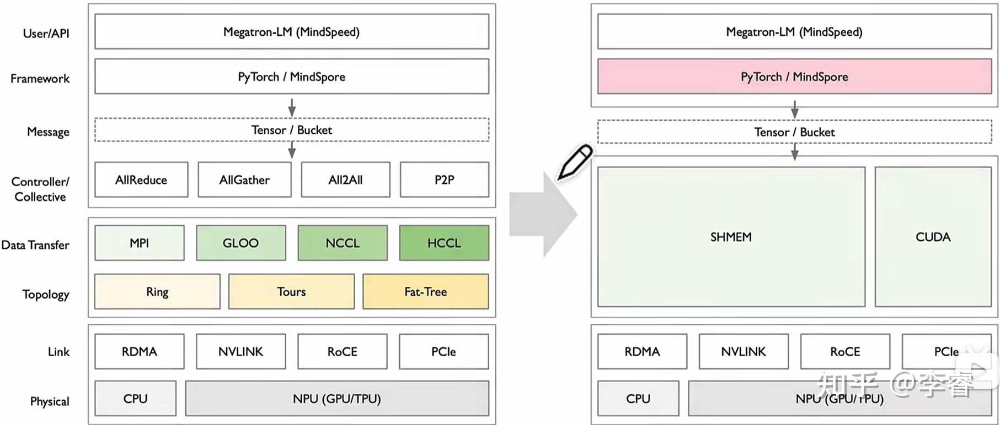
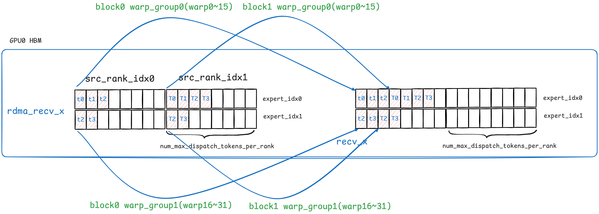

### RDMA

RoCE（RDMA over Converged Ethernet） 和 InfiniBand 都可以支持 RDMA，

- InfiniBand 是一种**专为高性能计算设计的独立网络架构**，它原生支持RDMA，它的整个协议栈、交换机、网卡 (称为 HCA, Host Channel Adapter) 都是为了实现最高效率的 RDMA 通信；所以优点就是性能高，缺点是需要特殊的 NIC 和交换机来支持，并不能兼容以太网。因此如果想部署 IB，需要抛弃原有的建立在以太网上的物理层和链路层设备，重新购买相应的设备。

- RoCE 是一种**允许在标准以太网上运行 RDMA 的网络协议**。它的目标是在普及的以太网基础设施上，实现接近 InfiniBand 的高性能；RoCE 有两个主要版本：

  1. **RoCE v1**：这是一个链路层（Layer 2）协议。它将 InfiniBand 的网络层及以下的数据包封装在以太网帧中。因为它工作在二层，所以它**不能跨路由**，只能在同一个广播域（VLAN）内通信。
  2. **RoCE v2**：这是一个网络层（Layer 3）协议。它将 InfiniBand 的传输层数据包封装在 UDP/IP 包中。由于使用了 IP 地址，RoCE v2 **是可路由的**，可以在不同的子网之间进行通信，扩展性远超 v1。目前实际部署的几乎都是 RoCE v2。

  所以RoCE的优点是可以利用现有的以太网基础设施，成本更低；但是缺点是配置复杂，并且性能低于IB

RDMA协议是建立在无损网络的假设下实现的。无损网络（Lossless Network） 是指网络通信过程中，不会丢失数据包或信息，能够保证数据可靠性和顺序完整性。

- 由于传统的链路层和网络层可能会丢包，所以传输层TCP协议需要通过滑动窗口、超时重传等解决乱序丢包的问题，导致整个协议很复杂
- 而现代数据中心通过光纤连接，本身丢包率就很低。Infiniband又通过在数据链路层进行流量控制等方式，能够实现在链路层的无损网络。在这种情况下，我们的传输层协议的逻辑就能简单些，并且还能把一部分功能卸载到网卡硬件中实现，加速了网络传输的效率。RDMA便是依靠这种方式，提高了网络通信的效率。

实际上，RDMA的主要思想就是：

- 既然用户态到内核态开销太大，那就直接bypass kernel，在用户态负责网络报文的收发工作
- 数据拷贝会增加开销，那就直接把数据收到用户态的内存上，不需要内核态进行中转（传统的内核网络协议栈需要维护一个buffer来存储用户发送过来的数据）
- 让网卡硬件处理一部分软件协议栈的功能

首先，DMA本质上是另一个CPU（即DMA engine）去帮真正的CPU拷贝并传输数据，所以CPU需要提前告诉DMA数据的地址和长度是什么，然后就可以做自己的事，让DMA去传输数据了；所以在DMA的实现中通常需要有Send Queue(SQ), Receive Queue(RQ), Complete Queue(CQ)让CPU和DMA交互；

- 用户想进行Send时，就往SQ中放一个叫做Send WQE(Work Queue Element)的元素
- 想进行Receive时，就往RQ中放一个叫做Recv WQE的元素。WQE中包含数据地址和长度等信息，网卡硬件收到后就可以进行数据收发。
- 当网卡进行完收发操作后，就往Complete Queue(CQ)中放一个CQE元素，之后CPU通过查询CQ就能获取到完成信息。

传统的DMA中，是由OS kernel负责与DMA交互的，这些数据结构通常都是放在内核中的。而RDMA绕过了kernel，所以这些数据结构就直接由用户操作了。

并且由于用户传递给DMA的WQE中包含的数据地址都是虚拟地址，所以DMA也需要像CPU一样需要一个MMU和页表来将虚拟地址转换成物理地址；于是RNIC上维护了MTT(Memory Translation Table)，它就相当于页表，维护虚拟地址到物理地址的对应关系。

- 普通DMA可能不需要这么做，因为用户发送WQE是在内核态进行的，可以将虚拟地址先转换成物理地址再存放到WQE中

其次，RDMA要和远端通信，那肯定也要像TCP一样建立连接，并维护和对端的连接信息（例如报文的序列号等）。这些信息都放到了QPC(Queue Pair Context)上了，而QPC在RNIC（RDMA网卡）上，说明**在RDMA中主要是由硬件来维护这些信息并组装包头，这就让硬件处理一部分软件协议栈的功能，实现了加速**。

最后，RNIC也需要维护收发报文相关的结构，例如Bacis NIC中的Receiving Buffer。因为这个图是论文中的图，而论文中这个RNIC可以在lossy network上工作，所以添加了一些用于保序和重传的数据结构，如ORT, Reordering Buffer, Bitmap。


在TCP/IP的内核协议栈提供的socket抽象中，通信是基于“流语义”的形式，流语义中不存在消息的边界。而RDMA的编程是基于“数据报语义”的形式，每个数据报都是一个独立的单元，有明确的边界。

在TCP/IP内核协议栈中，常用的数据传输的操作有send和recv。而在RDMA的操作中，常用的数据传输的操作有三种：

- Send/Receive
- Read
- Write

**Send/Receive**

Send/Receive是一对双边操作。意思是他们的一次通信过程需要发送端和接收端两端的CPU参与。

- 接收端往RQ中放一个Recv WQE, 里面包含接收的地址和长度(1)。
- 发送端往SQ中放一个Send WQE, 里面包含发送数据的地址和长度(2)。
- 发送端负责把数据从内存搬运到网卡中并发送。接收端网卡收到数据后，把数据搬运到接收端的Buffer中(3,4,5,6,7,8)。
- 发送端和接收端的网卡都会往CQ中放CQE(9, 11)。
- 发送端和接收端的CPU程序通过查询CQ, 获取到完成的通知(10, 12)。


与socket编程不同的是，**在RDMA的Send/Receive操作中，接收端必须先于发送端进行Receive，然后发送端才能进行Send。这是因为为了零拷贝，网卡直接将接收的数据写入用户态的内存中**。因此接收端需要先进行Receive操作，告知网卡“如果收到数据，应该把数据放到哪里”。之后发送端发送数据时，接收端网卡即可把数据写入接收端相应的内存中。如果接收端没有先进行Receive操作，那么网卡只能丢弃报文，并给发送端返回一个错误。

而socket编程（即传统的内核协议栈）由于内核中有buffer的存在，所以没有这种限制

- - 

**RDMA Read**

RDMA Read和RDMA Write都属于单边操作，即只有发起操作的一方的CPU有感知，另一端无感知。

RDMA Read的意思是：发起操作的一方要读取远端内存的数据，到自己的内存中。

在操作开始前，两端会提前传输一些信息。在Read中，被读取数据的一端需要把自己的数据地址等信息告知对方，这样对面才能知道从哪里读取。

接下来：

- 左侧往SQ中放一个Send WQE, 里面包含要读取的对端数据的地址和长度，以及存放读到的数据的己方地址和长度 (1)。
- 网卡负责网络传输逻辑 (2, 3, 4, 5, 6)。
- 发起操作的一方的网卡往CQ中放CQE (7)。
- 发起操作的一方的CPU程序通过查询CQ, 获取到完成的通知 (8)。


RDMA Write的意思是：发起操作的一方要把自己内存中的数据，写入到远端的内存中。

在操作开始前，两端会提前传输一些信息。在Write中，被写入数据的一端需要把自己的数据地址告知对方，这样对面才能知道写入哪里。

接下来：

- 左侧往SQ中放一个Send WQE, 里面包含己方的数据的地址和长度，以及要写入的对方的地址和长度 (1)。
- 网卡负责网络传输逻辑 (2, 3, 4, 5, 6)。
- 发起操作的一方的网卡都往CQ中放CQE (7)。
- 发起操作的一方的CPU程序通过查询CQ, 获取到完成的通知 (8)。


**Doorbell**

中断是一种硬件通知软件的机制，而Doorbell是一种软件通知硬件的机制。例如软件通过Doorbell告诉硬件：

- 开始做某事：例如软件准备好WQE时，通知硬件开始处理
- 已经做完某事：例如软件读取CQE后，通知硬件”我已经取走CQE“

Doorbell有两种实现机制：

- Doorbell寄存器。硬件提供的寄存器，来供软件读写。

- - 优点：实现简单，只需要软件读写寄存器地址；并且响应快速，设备不需要轮询队列，而是等待 Doorbell 信号，从而减少总线开销
  - 缺点：**硬件需要立即响应**，可能会打断硬件正在进行的工作（例如在DMA读取主机的内存），从而影响传输速率。所以这种形式就像中断一样，中断也会打断软件的工作，要求软件立即响应

- Doorbell record。使用主机的一段内存作为中介。软件和硬件都知道这段内存的地址。软件直接写这段内存，硬件在必要时读取该内存

- - 优点：软件通知时不需要抢总线
  - 缺点：实时性较差

**GPU上的RDMA操作**


上面是RDMA和CPU配合的使用方式，在支持**GPUDirect RDMA（即RDMA可以直接从GPU的HBM中读取数据）**的GPU中的使用方式为：

在引入InfiniBand GPUDirect Async(IBGDA)之前，使用的是InfiniBand Reliable Connection（IBRC），是使用CPU上的代理线程来进行网络通信的，**也就是数据传输不同用过主机内存，但是很多控制链路还在 CPU 上**。NCCL中也有类似的proxy thread和相应实现。

此时流程是这样的：	

1. 应用程序启动一个CUDA kernel，在GPU内存中产生数据。
2. kernel function通过往CPU memory中的proxy buffer写入数据的方式，通知CPU要进行网络操作。我们将这个通知称为work descriptor, 它包含源地址、目标地址、数据大小及其他必要的网络信息。
3. CPU上的proxy thread收到worker descriptor，并发起相应的网络操作。CPU会更新host memory中的doorbell record (DBR) buffer。（This buffer is used in the recovery path in case the NIC drops the write to its doorbell. 就是用来记录doorbell的信息，万一硬件来不及及时响应doorbell并把它丢掉，你还能从DBR buffer中恢复doorbell）
4. CPU通过写入NIC的 doorbell (DB)通知NIC。DB是NIC硬件中的一个寄存器。
5. NIC从WQ中读取work descriptor。
6. NIC使用GPUDirect RDMA直接从GPU内存搬运数据。
7. NIC将数据传输到远程节点。
8. NIC通过向主机内存中的CQ写入事件来指示网络操作已完成。
9. CPU轮询CQ以检测网络操作的完成。
10. CPU通知GPU操作已完成。

可以发现，这个过程竟然需要GPU, CPU, NIC三方参与。CPU就像是一个中转站


优化的方法是绕过CPU，让GPU自己来和网卡做交换

1. CPU程序启动一个CUDA kernel function，在GPU内存中生成数据。
2. 使用SM创建一个NIC work descriptor，它包含源地址、目标地址、数据大小及其他必要的网络信息，并将其直接写入WQ。与CPU proxy thread不同，该WQ区位于GPU内存中。
3. SM更新DBR buffer，它也位于GPU内存中（这里GPU为了通知RDMA NIC将两种doorbell方法都用上了，用DBR buffer的原因是防止硬件来不及及时响应doorbell并把它丢掉，还能从DBR buffer中恢复doorbell）。
4. SM通过写入NIC的DB寄存器通知NIC（DB是NIC硬件中的一个寄存器）。
5. NIC使用GPUDirect RDMA从WQ读取工作描述符。
6. NIC使用GPUDirect RDMA读取GPU内存中的数据。
7. NIC将数据传输到远程节点。
8. NIC通过使用GPUDirect RDMA向CQ缓冲区写入事件，通知GPU网络操作已完成。


**DMA流程**

1. 用户程序通过系统调用（如 `read()`）请求 I/O。
2. 内核在**物理内存**中分配一块连续的内存区域作为 DMA 缓冲区。这是至关重要的一步，因为 DMA 控制器操作的是物理地址，而不是用户程序的虚拟地址。
   - 在RDMA中由于DMA缓冲区在用户态，所以用户无法得到物理地址，只能用虚拟地址，所以RDMA NIC中会有一个页表
3. 配置 DMA 控制器：设备驱动程序会向 DMAC 的寄存器写入此次传输所需的所有信息。这通常包括：
   - **源地址 (Source Address):** I/O 设备的寄存器地址。
   - **目标地址 (Destination Address):** 上一步分配的物理内存缓冲区的起始地址。
   - **传输计数 (Transfer Count):** 要传输的数据字节数。
   - **传输方向 (Transfer Direction):** 从设备到内存（读操作）。
4. 内核向 I/O 设备（例如磁盘控制器）发送命令，告诉它可以开始将数据传输到指定的内存地址了。
5. 内核出让发起请求的用户进程和内核线程，转而执行其他的就绪进程
6. I/O 设备准备好数据后，会向 DMAC 发出 DMA 请求。DMAC 随后会向 CPU 发送一个总线请求 (Bus Request) 信号。DMAC 完全控制总线，开始将数据从 I/O 设备直接写入到内核指定的物理内存缓冲区中。这个过程是逐字节或逐块进行的，完全由硬件自动完成，无需 CPU 干预。
7. 当所有数据都成功传输到内存后，DMAC 会释放对系统总线的控制权，还给 CPU， 并且向CPU 发送一个**中断请求 (Interrupt Request, IRQ)** 信号。
8. CPU 在完成当前指令后，检测到中断信号。它会立即暂停当前正在执行的任何任务，保存其上下文（程序计数器、寄存器状态等），然后跳转到内存中一个预先定义好的地址，开始执行**中断处理程序 (Interrupt Service Routine, ISR)**。
9. **中断处理程序是设备驱动的一部分**，它会 清除中断标志，告诉 DMAC 中断已被处理。并且**最关键的一步是：通知内核数据已经准备好。它会将之前被挂起的那个用户进程唤醒，将它的状态从等待态改为就绪态 (ready)，并将其放入调度队列中**。
10. 当用户进程被调度器再次选中并恢复执行时，它仍然在内核态。此时，内核线程会将数据从内核中的 DMA 缓冲区拷贝到用户程序的缓冲区（虚拟内存）
11. 数据拷贝完成后，系统调用返回。程序的执行上下文从内核态切换回用户态，控制权交还给用户程序。


现代DMA流程：

1. 初始化 (设备启动时仅一次)：**OS 内核 (驱动程序)** 在主内存中分配两块环形缓冲区，分别作为**提交队列 (SQ)** 和**完成队列 (CQ)**。内核将这两个队列的物理基地址和大小通知给**硬件设备**。
   - 这里是用来存放DMA任务的结构体的，并且由于是DMA到内存中读取，所以需要提前告知DMA基址是什么
2. 内核处理IO请求：OS 内核 不再是直接去配置 DMAC 的一堆寄存器。而是在内存中的**提交队列 (SQ)** 的下一个可用位置，构建一个 **WQE**。这个 WQE 详细描述了本次读操作：“请从磁盘的 X 地址，读取 N 字节，然后通过 DMA 放入主内存的 Y 物理地址”。并且更新它自己维护的 SQ 尾指针。
3. OS 内核 执行一次单一的、轻量级的 MMIO 写操作，将新的 SQ 尾指针写入到硬件设备的 Doorbell 寄存器。
4. **硬件设备**监测到 Doorbell 寄存器的变化，它从 Doorbell 寄存器读取到新的 SQ 尾指针，并与自己内部记录的 SQ 头指针比较，从而得知有一个或多个新的 WQE 等待处理。
5. 设备从主内存的**提交队列**中获取那个 WQE，解析 WQE 后，设备知道了所有细节，开始执行实际的 DMA 数据传输（从磁盘到主内存）。这个核心的 DMA 传输过程和之前讲的是一样的。
6. DMA 传输完成后，**硬件设备**会在主内存的**完成队列 (CQ)** 中写入一个**完成队列元素 (CQE)**
7. 设备现在向 CPU 发送一个**中断请求 (IRQ)**，在高性能场景下，设备等完成了好几个任务（在 CQ 中积累了多个 CQE）或者等待了一小段时间后，才发送一次中断。这极大地降低了中断带来的开销。
8. 中断处理程序现在不是只处理一个完成信号，而是直接去**检查内存中的完成队列 (CQ)**。它可以一次性处理所有已经完成的任务（CQE）。对于每一个 CQE，它找到对应的原始请求，并将等待的进程唤醒（置为就绪态）

所以现在的区别在于：

- 命令交付：
  - 经典DMA模型是内核多次写设备的控制寄存器 (高开销)，并且是由CPU将任务（控制寄存器）推给设备；
  - 现代DMA模型是：内核在内存中构建 WQE，然后一次性写 Doorbell (低开销)，并且等着设备来内存中读取任务（WQE）

所以也就导致经典DMA模型是一次命令一次交互，而现代DMA模型是CPU 可以一次性在队列中放入大量 WQE，然后一次 Doorbell 通知，实现批量处理；并且**还可以合并多个完成事件，将他们存放在缓冲队列中，用一次中断来批量处理**


### NVSHMEM


当一个cuda程序被编译时，nvcc会分别使用g++的编译器和nvidia的编译器将主机代码和设备代码分别编译，然后将他们打包成一个可执行文件。当可执行文件被启动时，其中的代码段 (`.text`)、数据段 (`.data`) 等都会映射到新进程的虚拟地址空间中，被嵌入的PTX/SASS代码也被作为一个普通的数据块加载到了进程的内存里。

当主机代码第一次调用CUDA api时，例如 `cudaSetDevice()` 或 `cudaMalloc()`，os kernel会为当前进程在目标GPU上创建一个cuda context，包括了当前进程在该GPU上的所有资源，其中还会包括一个页表；

- 当一个进程在CPU上运行时，操作系统会维护这个进程的状态，包括已经分配的内存及其地址、打开的文件、使用的硬件等资源。相对应的，当一个进程要使用GPU时，GPU也必须为该进程维护这些状态。这就是cuda context。不同之处在于：CPU上只有单一的内存，一个OS管理整个CPU的内存，所以一个进程在操作系统里的状态只有一份（保存在内存中），而GPU有多个内存，GPU内存由驱动管理，每个进程在每个GPU上都有一个context。更确切地说：**每一个线程在每一个GPU上都可以有多个cuda context，但最多只能有一个current context**。
- 由于GPU是可以与CPU独立执行指令的，所以显然GPU上也会有一个MMU，用来将虚拟地址转换成物理地址，那么GPU上也必然存在一个页表（准确地说是多个页表，**每个cuda context都会有一个页表，即该GPU上的每个进程都会有一个页表，就和CPU上每个进程都有一个页表一样**）；
- 所以**GPU上程序不仅实现了不同进程之间的数据的隔离，还实现了同一个进程的不同的GPU设备之间的数据的隔离**

cuda API的参数并不包括cuda context，而是依赖于current context的概念，所有的cuda API调用，都是针对current context而言的。


让我们以最精确的步骤来分解`cudaMalloc`的行为：

1. 主机代码调用 `cudaMalloc(&d_ptr, size)`，请求在当前设备（比如GPU 0）上分配内存。
2. 驱动程序指令GPU 0在其物理显存中保留一块大小为`size`的连续内存。
3. 驱动程序在进程的统一虚拟地址空间中找到一个足够大的、尚未使用的地址范围。这个地址将成为返回给用户的指针 `d_ptr` 的值。
4. 驱动程序直接在该进程在GPU 0的cuda context中建立一条新的页表项：将步骤3中选定的虚拟地址范围，映射到步骤2中分配的物理显存地址。
5. 驱动程序通过操作系统接口，请求**在CPU的页表**中也建立一条映射。这条映射将**同一个虚拟地址**范围，映射到步骤2中分配的物理显存地址。
   - 注意，这里的重点在于，**cudaMalloc会将分配的物理显存映射到主机进程页表和cudaContext页表中相同的虚拟地址处**；如下图所示，假设进程A在设备0和设备1上各调用了一次cudaMalloc，那么得到的结果就是像图中这样；只不过主机进程页表的对应位置的权限位可能被设置为不可读写
     - 而cudaMallocManaged与这里的流程应该相同，**cudaMallocManaged是分配一块主机内存，然后将它映射到主机进程页表和cudaContext页表的相同位置，返回的指针既可以在主机上解引用也可以在GPU上解引用**；
     - 二者的原理应该是一样的，二者应该都是将页表中对应位置的权限位设置为不可读写，当被访问时都会发生pagefault，只不过**区别在于cudaMallocManaged可能会在pte中增加一个类似swap位的标志，并且将被swap的地址记录在pte（或者其他某个地方），pagefault时会检查pte，当发现pte中没有swap位时就是普通的cudaMalloc，如果有那么就是managed，那么驱动就会去实际的物理地址中将数据移动过来**
   - 在虚拟地址空间的mmap区域，可以通过 `cat /proc/<pid>/maps` 命令查看到这些映射，可以看到类似下面的条目 `7f4...a000-7f4...b000 rw-s 00000000 00:05 12345      /dev/nvidia0`
   - 也就是说，**cuda context中页表是进程页表的一个子集**？同一个进程的不同cuda context中的页表的虚拟地址是不可能相同的？


所以

- 如果进程A cudaMalloc了一个指针，那么该指针在其他进程中是无效的，即这个地址对于其他进程是无意义的；
- 如果进程A在GPU0上cudaMalloc了一个指针，再将该指针传递给GPU1：
  - 在不启用P2P的情况下，这个指针不存在于GPU1的cuda context的页表中，当GPU1的cuda thread试图访问这个地址时，GPU1的MMU在它的页表中找不到这个地址的有效映射，会触发一个page fault
  - 如果不同device间在硬件上支持p2p（有nvlink或pcie相连），并且GPU1启用了`cudaDeviceEnablePeerAccess(0, 0)`的情况下，表示允许GPU1访问GPU0，这个API会通过驱动程序，修改GPU1的MMU页表（准确来说应该是修改GPU1上同一个进程的cudaContext的页表），以后凡是看到这个范围内的虚拟地址，不要在自己的显存里找，而是通过NVLink/PCIe总线，把这个访问请求转发给GPU 0的内存控制器。

所以对于一个CUDA进程，实际上有**多套页表**在协同工作，但它们都服务于**同一个统一的虚拟地址空间**。


那么，不同的通信方式下代码流程是：

1. 不使用NVSHMEM时的代码流程：如果要在八卡上执行一个分布式程序，那么需要先启动八个进程，然后使用这八个进程创建一个ProcessGroup，并且使用set_device为这八个进程分别指定对应的GPU，一个进程只能使用一块GPU；然后八个进程分别在自己的GPU上launch kernel，每个kernel在各自的GPU上运行，kernel实际上一个运行在gpu上的函数，也就是代码，执行这串代码的具体单位是gpu线程；每个线程只能访问自己所在GPU的显存；如果要访问其他GPU的显存，需要让该GPU对应的进程将数据从GPU上移动到CPU上（底层通过cudaMemcpy），然后让两个CPU上的进程之间进行IPC，最后让自己CPU上的进程将数据拷贝到自己的GPU上

   - 两个运行在不同GPU上的kernel访问同一个`__device__`的全局变量这种情况，比如：

     ```C++
     __device__ int my_global_device_var = 0;
     
     __global__ void my_kernel(int value_to_add) {
         atomicAdd(&my_global_device_var, value_to_add);
         if (threadIdx.x == 0 && blockIdx.x == 0) {
             printf("GPU %d, my_global_device_var is now: %d\n", my_global_device_var);
         }
     }
     int main() {
         cudaSetDevice(0);
         my_kernel<<<1, 1>>>(1);
         cudaSetDevice(1);
         my_kernel<<<1, 1>>>(1);
     }
     ```

     `__device__`变量的作用域是整个设备，在该设备上的任何kernel中的任何线程都可以访问该变量；但是它的作用域和生命周期也是与单个GPU设备（与控制该设备的CUDA上下文）绑定的，所以**虽然代码中只有一个全局变量，但是在不同的GPU设备上执行的kernel都会在该设备的显存中有一份副本，它们虽然在代码中是同一个名字，但在物理和逻辑上是完全不相干的变量**，因此 kernel A(在 GPU 0) 与 kernel B(在 GPU 1) 实际访问的是各自地址空间里的副本。如果主机端想给该变量赋值，需先切到目标 GPU（`cudaSetDevice()`），再用 `cudaMemcpyToSymbol()`；切到另一块 GPU 必须再复制一次，因为那是另一份副本。

     - `__device__` 变量位于 **module + context** 作用域，因此 **同一进程 里如果对同一块 GPU 创建了多个 CUDA context，会得到多份副本**；在大多数实际代码里，每 GPU 只有一个 primary context，所以一个GPU只有一个副本

2. 对于**同一个节点内**、通过高速总线（如NVLink）连接的GPU，CUDA支持P2P直接内存访问。在这种情况下，有两种GPU间通信的方法：

   1. 由CPU发起：CPU上的代码可以直接通过`cudaMemcpyPeerAsync`之类的函数，将数据从一块GPU的显存复制到另一块GPU的显存，**而无需经过CPU内存作为中转站**。但是这个通信的发起者仍然是**CPU进程**，GPU上的Kernel本身仍然不能直接读写。

   2. 显存指针+P2P访问：CPU可以在一块 GPU 上 `cudaMalloc()`，把返回指针传给另一块 GPU 的 kernel，kernel中可以通过GPUDirect P2P直接访问另一块GPU的数据

      ```c++
          int can_access_peer;
          cudaDeviceCanAccessPeer(&can_access_peer, 0, 1);
          if (can_access_peer) {
              cudaSetDevice(0); 
              int* p_on_A;
              cudaMalloc(&p_on_A, sizeof(int));
              cudaMemset(p_on_A, 0, sizeof(int)); // 初始化数据
              cudaSetDevice(1); // 切换回发起访问的GPU
              cudaError_t err = cudaDeviceEnablePeerAccess(0, 0); // 允许GPU B访问GPU A
              my_kernel<<<1, 1>>>(p_on_A); // 将GPU A的指针传给GPU B的kernel
          }
      ```

   **GPUDirect RDMA**: 对于**跨节点**（不同服务器之间）的通信，这个技术允许GPU直接将数据发送到网络接口卡（NIC），**同样绕过了CPU主内存**

   所以对于不使用NVSHMEM的模型来说，通信是由**CPU进程**发起的（`MPI_Send`, `cudaMemcpy`, `ncclAllReduce`等）。GPU内核完成计算后，必须返回到CPU代码，由CPU来协调下一步的数据交换。

3. 统一内存Unified Memory：当使用`__managed__`或`cudaMallocManaged`声明或分配一个变量时， 会得到一个在CPU和所有GPU上都有效的指针。当某个处理器（CPU或某个GPU）首次尝试访问这块内存中的某个页面（Page，通常为4KB或更大）时，如果该页面当前不在该处理器的物理内存中，就会触发一个Page Fault。CUDA驱动程序会捕获这个错误，然后自动将所请求的数据页面迁移到发起访问的处理器的物理内存中。迁移完成后，处理恢复执行。

   - 如果硬件不支持GPUDirect P2P，当一个GPU访问CPU上的managed变量时，驱动会将page从CPU上迁移到GPU上；当一个GPU访问另一个GPU上的managed变量时，驱动会将page从GPU A迁移到CPU上，再从CPU迁移到GPU B上
   - 如果硬件支持GPUDirect P2P，比如通过NVLink连接，那么驱动会通过NVLink将该页面从GPU 0的显存迁移到GPU 1的显存（从Pascal 起，默认策略是 Remote Mapping：GPU1 先远程访问 GPU0 的页；只有当写带宽/重用足够大时才触发实迁移）

   ```c++
   __managed__ int g_counter = 0;          // 统一内存，全局唯一
   
   __global__ void add_one() {             // 每个线程把它加 1
       g_counter += 1;
   }
   
   int main() {
       int num_gpus = 0;
       cudaGetDeviceCount(&num_gpus);	
       // 让变量预取到两块 GPU，减少首次访问的 UVM page-fault
       for (int dev = 0; dev < 2; ++dev) {
           cudaMemPrefetchAsync(&g_counter, sizeof(int), dev /*dst GPU*/);
       }
       // 在 GPU0、GPU1 分别 launch kernel
       for (int dev = 0; dev < 2; ++dev) {
           cudaSetDevice(dev);
           add_one<<<1, 1>>>();
       }
   
       // 必须分别同步，确保两个 kernel 都执行完
       for (int dev = 0; dev < 2; ++dev) {
           cudaSetDevice(dev);
           cudaDeviceSynchronize();
       }
       // 把结果预取回 CPU（可选，DeviceSync 后驱动也会自动迁移）
       cudaMemPrefetchAsync(&g_counter, sizeof(int), cudaCpuDeviceId);
       cudaDeviceSynchronize();            // 等迁移完成
   
       printf("g_counter = %d（期望值 2）\n", g_counter);
       return 0;
   }
   ```

   ~~Unified Memory和GPUDirect P2P的区别在于：前者会进行数据迁移，而后者数据原地保持不动，GPU A直接通过NVLink远程访问GPU B~~（实际上UVM Pascal以后的架构也可以支持原地访问，而GPUDirect P2P的cudaMemcpyPeerAsync也会进行数据迁移）。核心区别是：**UVM 的数据一致性和迁移由驱动自动完成；P2P 则需要开发者自己手动管理，决定复制 / 同步时机**。

4. cudaMallocHost零拷贝：内存通过 `cudaMallocHost` 分配在主机（CPU）内存中，并且是页锁定的（pinned memory）。它不会自动迁移到设备（GPU）内存，而是固定在主机上。设备通过 `cudaHostGetDevicePointer` 获取一个映射指针，直接访问主机内存（通过 PCIe 总线）。这是一种“零拷贝”机制，因为数据无需复制到设备内存

   ```
       CUDA_CHECK(cudaMallocHost(&moe_recv_counter, sizeof(int64_t), cudaHostAllocMapped));
       CUDA_CHECK(cudaHostGetDevicePointer(&moe_recv_counter_mapped, const_cast<int*>(moe_recv_counter), 0));
       *moe_recv_counter = -1;
   ```

   它与managed内存的区别在于：

   - **它是主机进程和cuda程序使用不同的指针访问一个固定在主机上的数据；而managed内存是主机进程和cuda程序使用相同的指针访问一个动态迁移的数据**
   - 所以它的优点是没有数据复制开销，适合数据主要在主机上但偶尔被设备访问的场景（如流式处理）。缺点是设备访问主机内存需通过 PCIe 总线，导致延迟较高，

**注意，对于GPUDirect P2P远程写入的操作（比如显存指针+P2P访问和NVSHMEM），并不会自动刷新对方 L2；若两 GPU 互相修改同一位置，需要 `__threadfence_system()` 或者使用 NVSHMEM/Fence 指令来保证可见性**。


所以**`cudaDeviceEnablePeerAccess`和`cudaMallocManaged`是同一个进程内的不同cuda context间的通信机制**，同一个指针在不同cuda context间都是有意义的；前者手动修改不同cuda context的页表的访问权限和映射，后者在触发pagefault时修改cuda context的页表的访问权限和映射并且进行数据拷贝

- **在实践中很少有人会在同一个进程的不同的cudaContext间通信，通常一个进程只使用一个GPU，否则性能较差；最常使用的是cudaMallocManaged来进行CPU context和cudaContext之间的通信**
- **相比之下不同进程控制不同GPU，需要在这些进程的kernel之间通信的情况更加常见**

而对于不同cuda进程间的通信，由于两个进程拥有独立的虚拟地址空间，进程A的指针在进程B中是无效的。因此，它们不能直接交换指针，有两种方法：

1. 第一种方法就是上面提到的将数据从GPU复制到CPU上，通过CPU的IPC机制（pipe或者mmap）将数据复制到另一个进程中，再将数据从另一个进程中复制到它的GPU中
2. 更好的方法是绕过CPU 的IPC，直接使用CUDA IPC的机制，流程为：
   1. 进程A在自己的GPU上分配一块设备内存：`cudaMalloc(&p_gpuA, size);`
   2. 进程A为这块内存创建一个IPC内存句柄：`cudaIpcGetMemHandle(&ipc_handle, p_gpuA);`
   3. 进程A再使用任何的标准CPU IPC方法将这个ipc_handle发送给进程B
   4. 进程B收到ipc_handle后，可以使用 `cudaIpcOpenMemHandle(&p_gpuB, ipc_handle, cudaIpcMemLazyEnablePeerAccess);`，**CUDA驱动会将`ipc_handle`中记录的进程A的物理显存块映射到进程B的虚拟地址空间中，所以返回的`p_gpuB`指针指向的物理位置和进程A的`p_gpuA`完全相同**。访问p_gpuB时，如果发现物理地址是在另一块GPU上，并且硬件支持GPUDirect P2P，那么可以直接对另一块GPU发起读写请求

所以总结一下，GPU上的程序不仅实现了不同进程之间的数据的隔离，还实现了同一个进程的不同的GPU设备之间的数据的隔离

- `cudaDeviceEnablePeerAccess`和`cudaMallocManaged`是同一个进程内的不同cuda context间的通信机制，可以跨GPU但是不能跨进程
- CUDA IPC是不同cuda进程之间的通信机制，既可以跨GPU也能跨进程

注意，上面所说的**CUDA IPC，UVM，NVSHMEM都是软件层面的技术，它们底层都可以基于GPUDirect P2P**

使用NVSHMEM：NVSHMEM是基于OpenSHMEM的并行编程接口，它为数据创建了一个全局地址空间（a.k.a，PGAS模型Partitioned Global Address Space，分区全局地址空间），该空间跨越多个GPU内存，将整个GPU集群看成一个有统一编址的内存，将整个GPU集群里面所有的内存看成一个内存；**它本身也是基于GPUDirect的，封装了底层的通信机制**，当通信发生在节点内部时，它会优先使用高效的GPUDirect P2P；当通信跨越节点时，它会自动切换到使用GPUDirect RDMA和网络硬件。

并且它编程模型也不一样，

- NCCL主要用来集合通信，也就是说它只支持多个GPU进行同一个操作，并且NCCL需要由CPU上的进程来调用API发起操作
- 而NVSHMEM的通信是由**GPU内核内的线程**直接发起的（`nvshmem_put`, `nvshmem_get`）。这意味着GPU在计算过程中，可以细粒度地、自主地去“拿”或“放”其他GPU上的数据，无需等待CPU的指令。这实现了计算和通信的深度重叠，并减少了CPU-GPU同步开销，而且简化了**编程模型**。并且相比 NCCL，NVSHMEM 更专注于单边通信，而 NCCL 则更适合集合通信

但是NCCL是隐式同步的，操作完成后自动保证数据一致性；而NVSHMEM需要使用fence来显式同步确保内存可见性


**SHMEM替代了之前的XCCL，直接控制RDMA和NVLink，以及IB相关的具体操作，通过这种操作，将之前XCCL复杂的方式替代为简单的SHMEM**，好处是性能提升了，专门针对All-to-All稀疏通信来实现的，没有之前那么多层封装



NVSHMEM的api使用：

- NVSHMEM 程序由多个进程组成，每个进程映射到一个 GPU 上，称为一个PE。所有 PE 运行相同的程序，在启动时通过 nvshmem_init 或扩展接口 nvshmemx_init_attr 集体初始化环境；与mpi一样，mvshmem_init必须在任何其他 NVSHMEM 调用前执行。

- 初始化过程中，每个 PE 都会分配到唯一的 ID（可以使用 nvshmem_my_pe() 获取本 PE 的 ID），并且同步总的 PE 数目（可以使用 nvshmem_n_pes() 获取）

  - ```cpp
    #include <nvshmem.h>
    int main() {
        nvshmem_init();  // 集体调用
        int mype = nvshmem_my_pe();  // 获取当前 PE ID
        int npes = nvshmem_n_pes();  // 获取总 PE 数
        // ... 其他操作 ...
        nvshmem_finalize();
        return 0;
    }
    ```

- **PE 之间通过从 GPU 内存中的对称堆（symmetric heap）分配的对称内存进行通信和数据共享**。此类内存需使用 CPU 端的 NVSHMEM 分配 API`void *nvshmem_malloc(size_t size);`进行分配，它会从对称堆中分配大小为 `size` 的内存，返回指针（所有 PE 上相同）。采用其他任何方法分配的内存均被视为分配 PE 的私有内存，其他 PE 无法访问。注意nvshmem_malloc必须要集体调用，所有pe传入的size必须相同，否则会调用失败。

  - nvshmem_malloc(size)是在每个pe的物理显存中都分配一块大小为size的空间，然后将各自的物理空间映射到各自的页表中。比如

  - ```
    auto rdma_buffer_ptr = nvshmem_align(alignment, 1e9);
    ```

    按alignemnt 字节对齐，分配 1GB 的对称显存，即 nvshmem通信组里，每个gpu 都会在本地对称内存区域，分配一块1GB的显存，专门用于nvshmem相关的通信。该对等缓存申请成功后，返回 `rdma_buffer_ptr`，该指针在所有PE(processing elements)上是一样的。需要注意，**本地 `rdma_buffer_ptr` 仅指向本地对称显存上的地址**。对于 2节点 16xGPU 系统:

    | PE（GPU） | rdma_buffer_ptr 值（逻辑地址） | 实际数据所在显存 |
    | --------- | ------------------------------ | ---------------- |
    | PE 0      | 0x700000000000                 | PE 0 的显存      |
    | PE 1      | 0x700000000000                 | PE 1 的显存      |
    | PE 2      | 0x700000000000                 | PE 2 的显存      |
    | ...       | ...                            | ...              |
    | PE 15     | 0x700000000000                 | PE 15 的显存     |

    即**所有 PE 得到的指针值是一样(symmetric)的，但是它们引用的是本地显存中的不同物理内存块**。

    当前GPU需要读写其他PE(peer GPUs)则通过 nvshmem_get/put() apis。例如, 当前GPU读写 GPU8，如下：

    ```cpp
    // read data from PE-8
    int target_pe = 8;
    float local_data[10];
    nvshmem_getmem(local_data, rdma_buffer_ptr, sizeof(float) * 10, target_pe);
    
    // write local data to PE-8
    float value = 3.14;
    nvshmem_putmem(rdma_buffer_ptr, &value, sizeof(float), target_pe);
    ```

    本地设备可使用从自身本地缓冲区派生的地址和目标rank索引指定操作目标。下图展示两个GPU分配相同大小的对称缓冲区，保留src指针。第一个rank向第二个rank发送3个整数：nvshmem_int_put_nbi从本地缓冲区派生起始地址，指定目标设备。第二个rank从自身缓冲区派生偏移量，向第一个设备发送偏移量为1的元素。

    

  也可以使用 `void nvshmem_free(void *ptr);`释放对称内存，使用 `void *nvshmem_align(size_t alignment, size_t size);`分配对齐的内存（alignment 必须是 2 的幂），用于优化访问，如对齐到 warp 大小。


- 通信操作：这些是单边操作，支持 put/get/原子等。可在主机或设备侧调用

  - `nvshmem_TYPENAME_put(void *dest, const void *source, size_t nelems, int pe)`将本地 `source` 的 `nelems` 个元素写入远程 PE 的 `dest`。

    ```cpp
    __global__ void kernel(int *dest, int *source, int mype, int npes) {
        int peer = (mype + 1) % npes;
        nvshmem_int_put(dest, source, 1, peer);  // 写入单个整数
    }
    ```

  - `nvshmem_TYPENAME_get(void *dest, const void *source, size_t nelems, int pe)`类似 put，但反向（从远程读到本地）。

  - `nvshmem_TYPENAME_p(void *dest, T value, int pe)`单元素 put，高效用于小数据。

  - `nvshmem_TYPENAME_g(const void *source, int pe)`单元素get

**NVSHMEM 通信组（team）的使用基本和其他的集合通信接口差不多（如nccl或mpi）**，支持在全局 PE 集合之外定义逻辑 Team（nvshmem_team_t），以在一部分 PE 上执行集合通信操作。默认情况下，NVSHMEM_TEAM_WORLD 表示包含所有 PE 的“全局 Team”，PE 在该 Team 中的编号即为 nvshmem_my_pe() 返回的值。

- 在 NVSHMEM 程序中，PE 通过两种方式进行通信：
  - 一种是点对点通信，需明确指定目标 PE 的编号。
  - 另一种是集合通信，它们作用于一组 PE 之上。通过 Team 句柄参数确定参与通信的 PE，并利用 Team 对象封装的资源进行操作。如果未指定 Team 参数，则默认作用于所有 PE。


NVSHMEM 支持多种传输通道（transport）来实现 GPU 间通信。

- 如果目标 PE 在本节点，优先通过nvlink使用 CUDA IPC 或 P2P 拷贝，使得一个节点上不同进程的 GPU 可以直接通过显存共享或复制互相访问；
- 对于节点间通信，则调用网络传输接口，NVSHMEM 默认使用 IBRC，并可选用其他协议如 UCX 或 Libfabric。具体选择由环境变量 NVSHMEM_REMOTE_TRANSPORT 控制，允许设置为 "ibrc"（默认）、"ucx"、"libfabric"、"ibdevx" 等。通过已经注册的 GPU 映射区完成远程写入/读取。所有 GPU 通信都在 NVSHMEM 的对称地址空间模型下进行：当用户调用 RMA 操作时，内部先将对称地址转换为物理地址，然后通过上述通道发起数据传输。

如果NVSHMEM使用IBGDA，那么GPU SMs 可以直接与 NIC 对话；工作流程是：

1. 应用起 cuda kernel 生产数据，放在gpu memory 里
2. 应用call nvshmem(e.g. nvshmem_put()) 与另一个 processing element(PE) 建立通信。
3. 该SM 更新 DBR_buffer, 位于 gpu 显存，然后通过向nic DB 写一个寄存器位从而通知 nic 有新工作来了。
4. NIC 使用GPUDirect RDMA 从 WQ_Buffer 读取最新的 work_descriptor，然后根据work_desc 从gpu 显存读取数据，然后传输数据到tgt node
5. 传输结束后，nic 通过GPUDirect RDMA 向 CQ buffer 写一个事件，通知gpu 传输结束，

而low latency kernel 在节点间通信就使用了NVSHMEM IBGDA，主要对 decode 阶段的 All-to-All 进行优化——该阶段频繁的小数据量通信使得通信在整个端到端过程中占比大，因此需要降低通信延迟。**IBGDA 在小消息 All-to-All 通信场景下相比 IBRC 的延迟有明显优势**


### 具体代码

DeepEP有两个版本的算子，一个是normal的算子，一个是low latency的算子

- normal算子主要特点是可以在异构的通信拓扑中进行转发的优化，也就是采用了两阶段的all2all算法。第一阶段将发往同一机器所有token通过IB发送给该机器的一个rank，然后再让这个rank通过NVLink进行机内的转发；这样的好处是吞吐量比较高，适用于训练和推理prefill阶段
- 而对于需要低延迟的decode阶段，则使用纯RDMA的低延迟算子，它使用卡间直接收发cast成fp8的数据的方式，而不是使用normal算子的第一步执行机间同号卡网络发送，再通过nvlink进行转发的两阶段方式。并且normal算子的dispatch包含了notify_dispatch传输meta信息（即需要给每个专家发送多大的数据）和dispatch传输实际数据两个kernel，而low lantency也省去了notify的过程，为此需要的代价就是显存占用较高。

高性能 GPU 训练集群往往会采用轨道优化，同号 GPU 在一个 Leaf Switch 下，因此可以利用高速的 NVLink 来代替从 Leaf Switch 到 Spine Switch 的流量，从而降低 IB 通信时延，并且减少 Leaf Switch 和 Spine Switch 之间的流量）。


Intranode的算子需要所有rank都通过nvlink可见，internode的算子需要所有在单个节点中的rank通过nvlink可见，不同节点的相同local_rank的gpu之间通过rdma可见

#### buffer构造

对于正常模式来说：

- num_nvl_bytes代表用于节点内通信（使用nvlink）的buffer的大小；num_rdma_bytes代表在节点间通信（使用rdma）的buffer大小；所以NVSHMEM只会在跨节点中使用，会调用网络传输接口，NVSHMEM 默认使用 IBRC（但是现在DeepEP已经指定为IBGDA了）
- 这里使用了**双缓冲策略，`num_nvl_bytes`（NVLink缓冲区）和`num_rdma_bytes`（RDMA缓冲区）分离，确保高带宽设备间通信（NVLink）和跨节点通信（RDMA）互不干扰**。

**对于low latency模式来说，在节点内通信和节点间通信都会使用rdma，所以low latency构造buffer时传入的num_nvl_bytes为0**，只传入num_rdma_bytes，不管是节点内还是节点间都使用纯的RDMA通信，不再使用两阶段通信。所以在low latency模式中，所有的GPU都应该通过RDMA连接

- 但是后来为了节点内的通信效率，low latency模式在节点内也可以选择使用nvlink，需要在构造buffer时指定allow_nvlink_for_low_latency_mode，可以给buffer传入不为0的num_nvl_bytes；节点间还是通过IBGDA使用RDMA通信


所以intranode的kernel要求所有的rank都必须通过nvlink可见；internode的kernel要求在节点内的ranks通过nvlink可见，不同节点上同一个GPU index的rank的通过rdma可见；low latency的kernel要求不管是节点内还是不同节点的rank都必须通过rdma可见（更具体来说就是启用了IBGDA）（现在节点内的rank似乎可以通过nvlink可见？）

再使用runtime中的buffer构造函数进行初始化


构造函数首先将传入的参数，如当前进程的 rank、总进程数 num_ranks、用于 NVLink 的缓冲区大小 num_nvl_bytes、用于 RDMA 的缓冲区大小 num_rdma_bytes 等保存到类的成员变量中。

然后`at::cuda::getStreamFromPool(true)` 会从 PyTorch 的 CUDA 流池中获取一个专用的流，将通信操作（如 all-to-all）放到一个独立的流上，从而实现计算和通信重叠（overlap）


整个系统由多个节点组成，每个节点内有`NUM_MAX_NVL_PEERS`个GPU；**根据传入的全局rank计算得到对应的节点内的local_rank（nvl_rank），和节点在全局的id（rdma_rank）**


随后分配节点内的nvlink buffer：

- 这里通过一次 cudaMalloc 调用，在当前 GPU 上分配了一整块内存，并且将内存的指针保存在buffer_ptrs中当前nvl_rank对应的位置。这块内存被巧妙地划分成了几个区域：
  1. num_nvl_bytes: 主要的数据缓冲区，用于存储要发送或接收的 token 数据。
  2. barrier_signal_bytes: 用于节点内 GPU 间同步的“信令区”。
  3. buffer_ptr_bytes & barrier_signal_ptr_bytes: **这两个空间实际上是用来存放主机上的buffer_ptr数组和barrier_signal_ptr数组的，后面在sync时会将这两个数组从主机上拷贝到gpu中**
- 然后使用 cudaIpcGetMemHandle 为刚刚分配的内存块创建了一个 “IPC 句柄”（ipc_handles）。这个句柄就像一个地址名片，虽然它很小，但包含了足够的信息。稍后在 sync 阶段，当前 GPU 会把这个句柄广播给节点内的其他所有 GPU。**其他 GPU 收到这个句柄后，就可以通过 cudaIpcOpenMemHandle 将这块内存映射到自己的地址空间，从而实现直接的、通过 NVLink 的高速读写。**
- 接着代码设置了一些指向这块大内存不同区域的指针，方便后续在 CUDA Kernel 中访问。例如 buffer_ptrs_gpu 和 barrier_signal_ptrs_gpu。


最后创建MoE计数器：

- 在 All-to-All 通信中，每个 GPU 需要知道自己总共会收到多少个 token，才能提前分配好接收缓冲区。这个信息是在 GPU 上计算出来的，但 CPU 需要知道这个结果来执行后续逻辑。
- 这里使用了 cudaHostAllocMapped 来分配“锁页主机内存”（Pinned Host Memory）并将其“映射”（Map）到 GPU 的地址空间。
  - cudaMallocHost: 在主机（CPU）内存中分配一块特殊的内存，这块内存不会被操作系统交换到磁盘上。
  - cudaHostAllocMapped: 标志位告诉 CUDA，这块内存需要被 GPU 可见
  - cudaHostGetDevicePointer: 获取这块主机内存在 GPU 侧的地址。

```C++
    // MoE counter
    CUDA_CHECK(cudaMallocHost(&moe_recv_counter, sizeof(int64_t), cudaHostAllocMapped));
    CUDA_CHECK(cudaHostGetDevicePointer(&moe_recv_counter_mapped, const_cast<int*>(moe_recv_counter), 0));
    *moe_recv_counter = -1;
```

- 效果: CUDA Kernel 可以直接使用 GPU 地址（moe_recv_counter_mapped）向这块内存写入数据，而 CPU 可以直接读取主机地址（moe_recv_counter）上的值。这实现了一种高效的从 GPU到CPU 的单向“通知”机制，避免了显式的 cudaMemcpy，CPU 这边只需要忙等待（busy-waiting）这个值从 -1 变为一个有效值即可。

- 代码中为不同层级的计数（全局、每个专家、RDMA）都创建了类似的计数器。

```C++
    // MoE expert-level counter
    CUDA_CHECK(cudaMallocHost(&moe_recv_expert_counter, sizeof(int) * NUM_MAX_LOCAL_EXPERTS, cudaHostAllocMapped));
    CUDA_CHECK(cudaHostGetDevicePointer(&moe_recv_expert_counter_mapped, const_cast<int*>(moe_recv_expert_counter), 0));
    for (int i = 0; i < NUM_MAX_LOCAL_EXPERTS; ++ i)
        moe_recv_expert_counter[i] = -1;

    // MoE RDMA-level counter
    if (num_rdma_ranks > 0) {
        CUDA_CHECK(cudaMallocHost(&moe_recv_rdma_counter, sizeof(int), cudaHostAllocMapped));
        CUDA_CHECK(cudaHostGetDevicePointer(&moe_recv_rdma_counter_mapped, const_cast<int*>(moe_recv_rdma_counter), 0));
        *moe_recv_rdma_counter = -1;
    }
```


总的来说，Buffer 的构造函数主要为后续 sync 函数中真正的“建立连接”（即交换 IPC 句柄和建立 RDMA 连接）打下基础，**负责单卡（单进程）的资源准备和本地初始化**：

1. 设置环境：创建通信流，分解全局 rank。
2. 内存分配：在本地 GPU 上分配好用于 节点内通信 的大块缓冲区，并为之生成一个可供分享的 IPC 句柄。
3. 创建信道：利用 映射内存（Mapped Memory） 技术，创建了一个高效的从 GPU 到 CPU 的通信渠道，用于同步 token 数量等元数据。

#### 同步通信handle

（这里的通信handle包括ipc handle和nvshmem的通信组的unique id）

然后通过allgather获取**group内**的所有ipc handle和device id，

- 注意，这里是整个group内的所有ipc handle，虽然每个进程的buffer中只维护了单机内的ipc_handle的数组

```python
        # Synchronize device IDs
        device_ids = [None, ] * self.group_size
        local_device_id = self.runtime.get_local_device_id()
        dist.all_gather_object(device_ids, local_device_id, group)

        # Synchronize IPC handles
        # 同步ipc_handle
        ipc_handles = [None, ] * self.group_size
        local_ipc_handle = self.runtime.get_local_ipc_handle()
        dist.all_gather_object(ipc_handles, local_ipc_handle, group)
```

随后是否创建NVSHMEM的unique ID

- 在初始化NVSHMEM时，一个至关重要的步骤是：所有需要相互通信的进程（或GPU）必须就一个唯一的ID（Unique ID）达成一致，**所有拥有同一个unique id的进程加入到同一个NVSHMEM通信组**。

而在低延迟模式下，整个ep group中的所有rank都使用NVSHMEM通信，不管是单机还是多机，所以所有的rank都要加入到同一个NVSHMEM通信组中，于是这里就让rank为0的进程负责创建一个nvshmem_unique_id，然后广播给所有其他进程

在normal模式下，在单机内部使用的是nvlink通信，而在跨机的情况下，所有节点上相同本地ID的GPU之间使用NVSHMEM通信，组成一个独立的通信组。于是这里让rdma_rank为0的节点上的所有卡都会执行创建unique_id的过程，然后将unique_id广播给整个group，每个rank的root_unique_id就是rdma_rank0机器的相同nvl_rank的unique_id。

```python
        # Synchronize NVSHMEM unique IDs
        # 获取root的NVSHMEM的unique_id， 并且同步
        root_unique_id = None
        if self.runtime.get_num_rdma_ranks() > 1 or low_latency_mode:
            # Synchronize using the root ID
            nvshmem_unique_ids = [None, ] * self.group_size
            if (low_latency_mode and self.rank == 0) or (not low_latency_mode and self.runtime.get_rdma_rank() == 0):
                root_unique_id = self.runtime.get_local_nvshmem_unique_id()
            dist.all_gather_object(nvshmem_unique_ids, root_unique_id, group)
            root_unique_id = nvshmem_unique_ids[0 if low_latency_mode else self.runtime.get_root_rdma_rank(True)]

        # Make CPP runtime available
        # 已经获取了所有对端的信息，接下来创建IPC和NVSHMEM的结构
        self.runtime.sync(device_ids, ipc_handles, root_unique_id)
        assert self.runtime.is_available()
```

除此之外，对于跨机的normal模式和ll模式，这里还设置了一些环境变量：

- 通过设置环境变量`NVSHMEM_IB_ENABLE_IBGDA=1`和`NVSHMEM_IBGDA_NIC_HANDLER=gpu`，让**跨机的normal模式和ll模式都使用了IBGDA**
- 可以通过设置环境变量`NVSHMEM_DISABLE_P2P=1`禁用自适应路由（AR），以避免数据包在NVLink和RDMA之间的转发（normal模式通常不禁用，ll模式通过设置allow_nvlink_for_low_latency_mode参数来决定是否禁用）
- 设置较大的QP深度（如`NVSHMEM_QP_DEPTH=1024`），以确保QP槽位足够，避免等待WQ（WorkQueue）槽位检查。

```python
        if self.runtime.get_num_rdma_ranks() > 1 or low_latency_mode:
            # Enable IBGDA 
            assert num_qps_per_rank > 0
            os.environ['NVSHMEM_DISABLE_P2P'] = '0' if allow_nvlink_for_low_latency_mode else '1'
            os.environ['NVSHMEM_IB_ENABLE_IBGDA'] = '1'
            os.environ['NVSHMEM_IBGDA_NUM_RC_PER_PE'] = f'{num_qps_per_rank}'
            # Make sure QP depth is always larger than the number of on-flight WRs, so that we can skip WQ slot check
            os.environ['NVSHMEM_QP_DEPTH'] = '1024'

            # Reduce gpu memory usage
            # 6 default teams + 1 extra team
            os.environ['NVSHMEM_MAX_TEAMS'] = '7'
            # Disable NVLink SHArP
            os.environ['NVSHMEM_DISABLE_NVLS'] = '1'
            # NOTES: NVSHMEM initialization requires at least 256 MiB
            os.environ['NVSHMEM_CUMEM_GRANULARITY'] = f'{2 ** 29}'

            if not allow_mnnvl:
                # Disable multi-node NVLink detection
                os.environ['NVSHMEM_DISABLE_MNNVL'] = '1'
```


#### sync（用handle创建通信组）

（这里的通信组包括cuda ipc和nvshmem通信组）

然后调用sync，将cuda ipc的handle和nvshmem的handle进行同步

首先是对于机内通信，每个rank打开cuda ipc_handle并且建立映射：

- 由于all_gathered_handles的大小是整个ep group的大小，而buffer中ipc_handles数组和buffer_ptrs数组的大小是节点内部gpu的数量（本质上是因为只有在节点内部才使用ipc通信)，所以需要用rdma_rank * num_nvl_ranks计算offset来找到当前节点在all_gathered_handles中对应的ipc_handles；
- 然后每个进程遍历当前节点内部所有rank的ipc_handle，通过cudaIpcOpenMemHandle将它们的buffer映射到自己地址空间，并且开启p2p访问，将地址保存在buffer_ptrs的对应位置，这样每个rank就可以访问到机内所有rank的buffer了


```cpp
    if (num_nvl_bytes > 0) {
        EP_HOST_ASSERT(num_ranks == device_ids.size());
        EP_HOST_ASSERT(device_ids.size() == all_gathered_handles.size());
        // rdma_rank相当于是节点的编号；num_nvl_ranks相当于是节点上rank数量
        for (int i = 0, offset = rdma_rank * num_nvl_ranks; i < num_nvl_ranks; ++ i) {
            EP_HOST_ASSERT(all_gathered_handles[offset + i].has_value());
            auto handle_str = std::string(all_gathered_handles[offset + i].value());
            EP_HOST_ASSERT(handle_str.size() == CUDA_IPC_HANDLE_SIZE);
            if (offset + i != rank) {
                std::memcpy(ipc_handles[i].reserved, handle_str.c_str(), CUDA_IPC_HANDLE_SIZE);
                // 开启p2p访问
                CUDA_CHECK(cudaIpcOpenMemHandle(&buffer_ptrs[i], ipc_handles[i], cudaIpcMemLazyEnablePeerAccess));
                barrier_signal_ptrs[i] = reinterpret_cast<int*>(static_cast<uint8_t*>(buffer_ptrs[i]) + num_nvl_bytes);
            } else {
                EP_HOST_ASSERT(std::memcmp(ipc_handles[i].reserved, handle_str.c_str(), CUDA_IPC_HANDLE_SIZE) == 0);
            }
        }
```

此时每个rank的buffer的地址只保存在了主机进程的buffer_ptrs数组中，为了让GPU上的kernel也能直接访问其他rank的buffer，所以还需要将buffer_ptrs数组cudaMemcpy到GPU上；barrier_signal_ptrs数组也是一样的

```cpp
        // Copy all buffer and barrier signal pointers to GPU
        CUDA_CHECK(cudaMemcpy(buffer_ptrs_gpu, buffer_ptrs, sizeof(void*) * NUM_MAX_NVL_PEERS, cudaMemcpyHostToDevice));
        CUDA_CHECK(cudaMemcpy(barrier_signal_ptrs_gpu, barrier_signal_ptrs, sizeof(int*) * NUM_MAX_NVL_PEERS, cudaMemcpyHostToDevice));
```


然后是对于机间通信：

```c++
        auto nvshmem_rank = low_latency_mode ? rank : rdma_rank;
        auto num_nvshmem_ranks = low_latency_mode ? num_ranks : num_rdma_ranks;
        EP_HOST_ASSERT(nvshmem_rank == internode::init(root_unique_id, nvshmem_rank, num_nvshmem_ranks, low_latency_mode));
        internode::barrier();
```

先调用`internode::init`来初始化每个nvshmem通信组，需要传入当前进程在nvshmem通信组中的rank（nvshmem_rank）；一个nvshmem通信组中的rank数量，即通讯组的大小（num_nvshmem_ranks）；和通讯组的root_unique_id

- 对于低延迟模式所有进程都是一个nvshmem通信组，所以nvshmem_rank就等于进程在ep group中的rank，nvshmem通讯组的大小就是ep group中的rank数量
- 对于normal模式每个nvshmem的通信组是所有节点上nvl rank相同的GPU，所以nvshmem_rank就等于rdma_rank（即节点的编号），每个通信组的大小为rdma rank的数量，每个通信组的root位于rdma rank=0的节点上。

##### nvshmem通信组初始化

`internode::init`函数主要通过调用nvshmemx_init_attr 接口初始化nvshmem环境，并且返回当前进程对应的pe id

**nvshmem环境通过`nvshmemx_init_attr`函数初始化，支持多种启动方式**：默认通过进程管理器的 PMI 接口交互式启动，也可以直接利用现有的 MPI 通信域、OpenSHMEM 环境或者 Plugin 模式。可以通过 NVSHMEM_BOOTSTRAP 环境变量来指定：

- PMI：可以选择不同的版本，比如 PMI-1、PMI-2 或 PMIx。
- MPI：用户可在调用 `nvshmemx_init_attr` 函数时指定 `NVSHMEMX_INIT_WITH_MPI_COMM` 标志以传入一个已有的 MPI_Comm 作为全局 Team。
- OpenSHMEM：同样可以在调用`nvshmemx_init_attr` 函数时用 `NVSHMEMX_INIT_WITH_SHMEM` 指示在 OpenSHMEM 程序内启动。
- UID：**在没有 MPI/SHMEM 的场景下，还可以采用网络唯一 ID (UID) 方式，先调用 nvshmemx_get_uniqueid 在一个 PE 上生成 UID，并通过用户定义的机制（比如环境变量 NVSHMEM_BOOTSTRAP_UID_SESSION_ID或者pytorch的集合通信接口）分发给各 PE，然后各 PE 在调用 `nvshmemx_set_attr_uniqueid_args` 设置该 UID、自己的 PE 编号和总 PE 数，再集体调用 nvshmemx_init_attr函数，并使用 `NVSHMEMX_INIT_WITH_UNIQUEID`标志**。这种 UID 模式利用 TCP 套接字自动交换初始化信息，无需依赖 MPI。DeepEP中就采用了这种初始化方式

具体来说：

```cpp
int init(const std::vector<uint8_t> &root_unique_id_val, int rank, int num_ranks, bool low_latency_mode) {
    nvshmemx_uniqueid_t root_unique_id;
    nvshmemx_init_attr_t attr;
    std::memcpy(&root_unique_id, root_unique_id_val.data(), sizeof(nvshmemx_uniqueid_t));
    nvshmemx_set_attr_uniqueid_args(rank, num_ranks, &root_unique_id, &attr);
    nvshmemx_init_attr(NVSHMEMX_INIT_WITH_UNIQUEID, &attr);
```

先调用`nvshmemx_set_attr_uniqueid_args`，其实就是设置了  `nvshmemx_init_attr` 的id、当前进程在nvshmem通信组中的pe编号和一个nvshmem通讯组的总pe数


而`nvshmemx_init_attr` 实际是调用了 nvshmemi_init_thread：


nvshmemi_init_thread（位于 nvshmem_src\src\device\init\init_device.cu） 是 NVSHMEM 初始化流程中的关键函数，主要作用是初始化运行环境，确保后续在 GPU 上能够安全、高效地进行 NVSHMEM 通信和同步操作。其中：

- nvshmemi_bootstrap 负责完成 NVSHMEM 启动阶段的“进程组通信环境”初始化。通过底层 bootstrap 机制（如 MPI、UID、SHMEM 等）建立全局进程组信息，确定每个 PE 的全局编号、节点内编号、节点内 PE 数量等，并进行一致性检查，为后续通信和资源分配打下基础。

- nvshmemi_common_init 的主要作用是完成 NVSHMEM 运行时的核心初始化工作。负责初始化和配置 NVSHMEM 的所有关键组件，使得后续的通信和内存管理功能可以正常工作。其主要任务包括：

- - CUDA 相关初始化：加载 CUDA 符号表、初始化 CUDA 库、查询 CUDA 驱动版本，决定对称堆类型（如 SYSMEM/VIDMEM），并获取 CUDA 上下文和流优先级等。
  - Rail 优化设置：如果启动轨道优化，则检查是否满足轨道优化的支持，并完成相关设置。
  - 对称堆初始化：根据配置和硬件能力，初始化对称堆，为后续的通信和内存操作分配统一的内存空间。
  - 设备状态注册与更新：注册和更新设备状态指针，确保主机和设备之间的状态同步。
  - 通信与拓扑初始化：初始化 transport，构建 transport 映射表，建立与其他 PE 的连接。
  - CUDA 句柄和 Event 初始化：为每个 peer 分配 CUDA stream 和 event，设置相关句柄。
  - 集合通信和 Team 初始化：初始化 CPU 端的集合通信，设置 NVSHMEM 的 Team 结构，支持多种 Team 划分和同步。

然后回到init函数中，接下来如果是 low_latency_mode，并且 num_ranks > NUM_MAX_NVL_PEERS(8)，也就是多机时，执行 nvshmem_team_split_strided，将 NVSHMEM 的 team 划分为多组 sub-RDMA team，这样可以实现每组内部的高效通信，同时保证整体的可扩展性和性能。

- 用户可以通过“split”现有 Team 来创建新 Team（如 nvshmem_team_split_strided() 等），也可以使用扩展接口 nvshmemx_team_get_uniqueid 和 nvshmemx_team_init 任意指定新 Team 成员。后者需要选定一个 Root PE 来生成 Team 的唯一 ID，并将此 ID 分发给 Team 内所有 PE。创建 Team 时，每个 PE 提供在新 Team 中的编号（pe_idx_in_team），新 Team 成员按照该编号 0 到 N–1 重新编号。

```cpp
    if (low_latency_mode and num_ranks > NUM_MAX_NVL_PEERS) {
        EP_HOST_ASSERT(cpu_rdma_team == NVSHMEM_TEAM_INVALID);
        EP_HOST_ASSERT(num_ranks % NUM_MAX_NVL_PEERS == 0);
        EP_HOST_ASSERT(nvshmem_team_split_strided(NVSHMEM_TEAM_WORLD, rank % NUM_MAX_NVL_PEERS, NUM_MAX_NVL_PEERS,
                                                  num_ranks / NUM_MAX_NVL_PEERS, &cpu_rdma_team_config, 0, &cpu_rdma_team) == 0);
        EP_HOST_ASSERT(cpu_rdma_team != NVSHMEM_TEAM_INVALID);
    }
```

最后init函数使用`nvshmem_my_pe` 返回当前进程的pe id

```
    return nvshmem_my_pe();
```

------

init结束后，返回sync函数中，最后使用`internode::alloc`创建创建NVSHMEM的共享内存指针`rdma_buffer_ptr`，此后，所有GPU可以用`rdma_buffer_ptr`来创建共享的buffer，然后使用nvshmem进行通信

```C++
        rdma_buffer_ptr = internode::alloc(num_rdma_bytes, NUM_BUFFER_ALIGNMENT_BYTES);
        // Clean buffer (mainly for low-latency mode)
        CUDA_CHECK(cudaMemset(rdma_buffer_ptr, 0, num_rdma_bytes));
        // Barrier
        internode::barrier();
}
void* alloc(size_t size, size_t alignment) {
    return nvshmem_align(alignment, size);
}
```

### get_dispatch_layout

buffer初始化完毕后，在调用dispatch之前，首先要调用get_dispatch_layout，主要职责就是根据topk_idx计算出当前GPU分发给每个rank的token数量（num_tokens_per_rank，是一个长度为rank数量的一维向量），以及分发给每个专家的token数量（num_tokens_per_expert，是一个长度为专家数量的一维向量）和每个token是否要发给每个rank（is_token_in_rank，是一个形状为num_tokens * num_ranks的二维张量）；任务分配是：

- 一部分block专门负责计算num_tokens_per_expert，其中每个block负责计算32个连续的专家的token数量，也就是说每个block负责计算num_tokens_per_expert向量中的32个元素
- 一部分block专门负责计算num_tokens_per_rank，其中每个block负责计算8个连续的rank的token数量，也就是说每个block负责计算num_tokens_per_rank向量中的8个元素


```cpp
void get_dispatch_layout(const int64_t* topk_idx,
                         int* num_tokens_per_rank, int* num_tokens_per_rdma_rank,
                         int* num_tokens_per_expert, bool* is_token_in_rank,
                         int num_tokens, int num_topk, int num_ranks, int num_experts,
                         cudaStream_t stream) {
    // 一个block 256个线程，一个SM 负责32个专家，8个rank
    constexpr int kNumThreads = 256, kNumExpertsPerSM = 32, kNumRanksPerSM = 8;
    // 根据专家和rank的总数计算需要多少个SM，这里说明该kernel是一部分block专门用于专家的计算，一部分专门用于rank的计算
    int num_sms = ((num_experts + kNumExpertsPerSM - 1) / kNumExpertsPerSM) + (num_ranks + kNumRanksPerSM - 1) / kNumRanksPerSM;
    EP_STATIC_ASSERT(kNumExpertsPerSM % NUM_MAX_NVL_PEERS == 0, "Invalid number of experts per SM");

    // 根据计算出的sm数量和kNumThreads来设置Grid和block的维度
    SETUP_LAUNCH_CONFIG(num_sms, kNumThreads, stream);
    LAUNCH_KERNEL(&cfg, (get_dispatch_layout<kNumThreads, kNumExpertsPerSM, kNumRanksPerSM>),
                  topk_idx, num_tokens_per_rank, num_tokens_per_rdma_rank, num_tokens_per_expert, is_token_in_rank,
                  num_tokens, num_topk, num_ranks, num_experts);
}
```

kernel中具体的计算过程为：前面block id较小的block负责计算num_tokens_per_expert

```cpp
// 获取该线程块负责的专家区间，每个block根据自己的id认领一段连续的专家
int expert_begin_idx = sm_id * kNumExpertsPerSM, expert_end_idx = min(expert_begin_idx + kNumExpertsPerSM, num_experts);
if (expert_begin_idx < expert_end_idx) {
```

虽然每个block只需要计算num_tokens_per_expert或num_tokens_per_rank中的一部分结果，但是每个block仍然需要完整地遍历整个topk_idx中的所有token，基本想法就是在共享内存中维护一个大小为256 * 32的数组（num_tokens_per_expert_per_thread），作为当前block的计数器，这样做的好处是**每个线程处理的token不同，在计数器中有自己独立的一行，所以不需要原子操作**；

```cpp
    // Count expert statistics
    __shared__ int num_tokens_per_expert_per_thread[kNumThreads][kNumExpertsPerSM];
```

然后外层的大循环是以block_size 256为步长遍历topk_idx，在遍历topk_idx过程中，一个线程负责一条token，内层的小循环就是每个线程遍历自己对应的token的topk专家的id，如果id在block负责的专家id范围之内，那么就将它累加到num_tokens_per_expert_per_thread中该线程自己的计数器中；

```cpp
for (int i = thread_id; i < num_tokens; i += kNumThreads) {
    auto shifted_topk_idx = topk_idx + i * num_topk;
    #pragma unroll
    for (int j = 0, expert_idx; j < num_topk; ++ j) {
        expert_idx = static_cast<int>(shifted_topk_idx[j]);
        // 如果这个token的专家是本块负责的专家之一
        if (expert_begin_idx <= expert_idx and expert_idx < expert_end_idx)
        // 在共享内存中增加自己的私有计数器
        // 即在第几个线程中统计这个专家的token数
            ++ num_tokens_per_expert_per_thread[thread_id][expert_idx - expert_begin_idx];
    }
}
```

最后遍历完之后得到256 * 32的统计结果，每个专家分配到的token数目分散在256个线程各自的计数器中，所以还需要在256个线程的维度上对计数器进行一次规约，那么一个线程负责一条长度为256的向量，所以这里只需要block中的前32个线程，每个线程遍历256个元素，将它们求和，最后32个线程分别将结果写入到num_tokens_per_expert的对应位置中；最后这部分的block做完了自己的任务，直接返回

```cpp
// Sum up
// 获得最后该专家需要多少个tokens
EP_STATIC_ASSERT(kNumExpertsPerSM <= kNumThreads, "Too many experts per SM");
if (expert_begin_idx + thread_id < expert_end_idx) {
    int sum = 0;
    #pragma unroll
    for (int i = 0; i < kNumThreads; ++ i)
        sum += num_tokens_per_expert_per_thread[i][thread_id];
    num_tokens_per_expert[expert_begin_idx + thread_id] = sum;
}
return;
```

后面的block_id较大的block则负责计算num_tokens_per_rank和is_token_in_rank的结果，计算方式也是一样的，在共享内存中维护一个大小为256 * 8的数组（num_tokens_per_rank_per_thread），外层的大循环以256为步长遍历topk_idx中所有的token，每个线程每次负责一条token，内层的小循环就是每个线程遍历自己对应的token的topk专家的id；区别在于这里**每个线程在遍历一条token的topk时都会在自己的寄存器上创建一个长为8的向量（is_in_rank），来记录该token是否在线程所负责的rank上**；遍历完一条token之后，每个线程再遍历自己的is_in_rank向量，将它的值保存在全局的is_token_in_rank中，再更新num_tokens_per_rank_per_thread中线程对应的行。 

```cpp
for (int i = thread_id; i < num_tokens; i += kNumThreads) {
    auto shifted_topk_idx = topk_idx + i * num_topk;
    int is_in_rank[kNumRanksPerSM] = {0}, is_in_rdma_rank[kNumRDMARanksPerSM] = {0};
    #pragma unroll
    for (int j = 0, expert_idx, rank_idx; j < num_topk; ++j) {
        expert_idx = static_cast<int>(shifted_topk_idx[j]);
        if (expert_begin <= expert_idx and expert_idx < expert_end) {
            // Count single rank
            rank_idx = expert_idx / num_expert_per_rank - rank_begin_idx;
            is_in_rank[rank_idx] ++, is_in_rdma_rank[rank_idx / NUM_MAX_NVL_PEERS] ++;
        }
    }

    auto shifted_is_token_in_rank = is_token_in_rank + i * num_ranks;
    #pragma unroll
    for (int j = 0; j + rank_begin_idx < rank_end_idx; ++ j) {
        shifted_is_token_in_rank[j + rank_begin_idx] = (is_in_rank[j] > 0);
        num_tokens_per_rank_per_thread[thread_id][j] += (is_in_rank[j] > 0);
    }
}
```

最后遍历完之后得到256 * 8的统计结果，依然需要在256个线程的维度上进行规约，让block中的前8个线程，每个线程遍历256个token，将它们求和；最后8个线程分别将结果写入到num_tokens_per_rank的对应位置中

```cpp
// Sum up
EP_STATIC_ASSERT(kNumRanksPerSM <= kNumThreads, "Too many ranks per SM");
if (rank_begin_idx + thread_id < rank_end_idx) {
    int sum = 0;
    #pragma unroll
    for (int i = 0; i < kNumThreads; ++ i)
        sum += num_tokens_per_rank_per_thread[i][thread_id];
    num_tokens_per_rank[rank_begin_idx + thread_id] = sum;
}
```

### dispatch

dispatch输入的x，可以是bf16的数据或量化成fp8的数据，如果是bf16，那么就是一个形状为(num_tokens, hidden)的fp16的tensor；如果是fp8，那么x就是一个torch.Tensor的tuple，第一个元素是一个形状为(num_tokens, hidden)的fp8（e4m3）的tensor，第二个元素是tensor对应的scale，形状是(num_tokens, hidden // 128)，可能是因为tensor是按照128的group量化的

量化具体过程为：

- 对称量化：确保输入张量 x 是一个二维矩阵，并且其第二维（列数）的大小是128的整数倍。然后将输入张量 x（形状为 [num_tokens, hidden]）变形为 [num_tokens, hidden/128, 128]。相当于对token按照128的group进行量化。然后`x_view.abs().float().amax(dim=2)`对于x_view的第二个维度获取最大值（即每个128元素的group）amax。最后return中返回的第二个值`(x_amax / 448.0)`就是量化得到的scale，448是 torch.float8_e4m3fn 数据类型能表示的最大正数值；再让x_view中的每个数除以对应的scale（`x_view * (448.0 / x_amax.unsqueeze(2))`）

```python
def per_token_cast_to_fp8(x: torch.Tensor):
    assert x.dim() == 2 and x.size(1) % 128 == 0
    m, n = x.shape
    x_view = x.view(m, -1, 128)
    x_amax = x_view.abs().float().amax(dim=2).view(m, -1).clamp(1e-4)
    return (x_view * (448.0 / x_amax.unsqueeze(2))).to(torch.float8_e4m3fn).view(m, n), (x_amax / 448.0).view(m, -1)


def per_token_cast_back(x_fp8: torch.Tensor, x_scales: torch.Tensor):
    if x_scales.dtype == torch.int:
        x_scales = x_scales.view(dtype=torch.int8).to(torch.int) << 23
        x_scales = x_scales.view(dtype=torch.float)
    x_fp32 = x_fp8.to(torch.float32).view(x_fp8.size(0), -1, 128)
    x_scales = x_scales.view(x_fp8.size(0), -1, 1)
    return (x_fp32 * x_scales).view(x_fp8.shape).to(torch.bfloat16)
```

dispatch输入的其他参数：

- num_tokens_per_rank，形状是rank的数量，表示当前rank发送给每个rank的token数量
- num_tokens_per_rdma_rank，形状是rdma_rank的数量，对normal dispatch来说就是节点的数量；如果是intranode dispatch那么此参数为none
- is_token_in_rank，形状是(num_tokens, num_ranks)，表示当前rank中的每个token是否要发给某个rank
- num_tokens_per_expert，形状是专家的数量，表示当前rank要发送多少token给某个专家
- topk_idx和topk_weights，形状是(num_tokens, num_topk)，表示当前rank的每个token要发送topk专家的idx和weight是什么

输出：

- recv_x，当前rank接收到的token

- recv_topk_idx和recv_topk_weights，当前rank接收到的token所对应的topk 专家的idx和weights

- num_recv_tokens_per_expert_list：形状为当前rank本地的专家数量，表示本地的每个专家接收到的token数量

- handle：由于在dispatch之前需要先调用notify_dispatch在所有rank之间通信一次，获取一些通信的metadata（比如当前rank从其他rank接收的token总数，当前rank的每个本地专家从其他rank接收多少token等），如果不同的dispatch之间topk_idx和token数量都不变，那么这些metadata也是不变的，这种情况就可以复用之前的metadata，所以dispatch支持返回本次的notify_dispatch的结果（rank_prefix_matrix, channel_prefix_matrix, recv_channel_prefix_matrix），将它们打包成handle返回给用户；用户下一次调用dispatch时可以将handle传入，dispatch检测到handle不为空就可以跳过notify_dispatch阶段，而是调用cached_notify_dispatch kernel，仅对rank_prefix_matrix做一个拷贝

在dispatch中，如果get_num_rdma_ranks结果大于1，说明有多个节点，那么就调用internode_dispatch，否则就调用intranode_dispatch。intranode_dispatch中如上面所说，如果检测到cached_mode（也就是handle不为空），那么就调用cached_notify_dispatch；否则就会调用`notify_dispatch` kernel

#### notify_dispatch

由于dispatch时需要将接收到的结果保存在recv_x中，所以为了给recv_x tensor分配空间，需要提前得知当前rank总共会从其他rank接收到多少token，这个数值需要由notify_dispatch与其他rank通信计算得到，保存在`moe_recv_counter_mapped`中

除此之外，在dispatch时，是将token切分为子序列，称为channel，每个block负责发送一个channel；dispatch时每个rank是并行发送token的，在rank内部，channel也是并行发送token的；而接收方不能一股脑地将所有token直接放在recv_x中，而是需要有序地存放在recv_x中，**recv_x中不同rank之间的token按照rank id排序（需要知道rank在全局的偏移量），rank内部的token按照channel id排序（需要知道channel在rank内部的偏移量），channel内部的token按照token id排序**。因此reciever需要知道上面的三个信息。那么notify_dispatch就负责计算：

- `rank_prefix_matrix`：每个rank从其他rank接收的token数量的前缀和矩阵，形状为num_ranks * num_ranks，(i, j)表示rank j从rank i以及rank i之前的所有rank接收的token数量，用于在数据接收时，精确定位来自不同rank的数据应该存放在接收缓冲区的哪个位置
- `channel_prefix_matrix`：形状为num_ranks * num_channels，(i, j)表示当前rank的channel j以及channel j之前的所有channel给rank i发送的token数量

notify_dispatch C++包装函数通过 `SETUP_LAUNCH_CONFIG` 宏来配置Kernel，它会启动 1 + num_ranks 个线程块（Thread Blocks）,块内线程数量是128；

那么在单机八卡的intranode_dispatch的情况下，就是9个线程块，依然是一个block分配到一个sm，函数逻辑根据 sm_id 分为两部分：

- 1个协调块 (Coordinator Block)：blockIdx.x（sm_id） 为 0 的线程块，扮演总指挥的角色。
- 8个工作块 (Worker Blocks)：blockIdx.x （sm_id）从 1 到 8 的线程块，每个块负责一个目标rank的计算任务。

```cpp
#ifndef SETUP_LAUNCH_CONFIG
#ifndef DISABLE_SM90_FEATURES // 使用sm90的情况下
#define SETUP_LAUNCH_CONFIG(num_sms, num_threads, stream) \
    cudaLaunchConfig_t cfg = {(num_sms), (num_threads), 0, stream, nullptr, 0}; \
    cudaLaunchAttribute attr[2]; \
    attr[0].id = cudaLaunchAttributeCooperative; \
    attr[0].val.cooperative = 1; \
    attr[1].id = cudaLaunchAttributeClusterDimension; \
    attr[1].val.clusterDim.x = (num_sms % 2 == 0 ? 2 : 1); \
    attr[1].val.clusterDim.y = 1; \
    attr[1].val.clusterDim.z = 1; \
    cfg.attrs = attr; \
    cfg.numAttrs = 2
#else // 不使用sm90的情况下
#define SETUP_LAUNCH_CONFIG(sms, threads, stream) \
    int __num_sms = (sms); \
    int __num_threads = (threads); \
    auto __stream = (stream)
#endif
#endif

#ifndef LAUNCH_KERNEL
#ifndef DISABLE_SM90_FEATURES
#define LAUNCH_KERNEL(config, kernel, ...) CUDA_CHECK(cudaLaunchKernelEx(config, kernel, ##__VA_ARGS__))
#else
#define LAUNCH_KERNEL(config, kernel, ...) \
do { \
    kernel<<<__num_sms, __num_threads, 0, __stream>>>(__VA_ARGS__); \
    cudaError_t e = cudaGetLastError(); \
    if (e != cudaSuccess) { \
        EPException cuda_exception("CUDA", __FILE__, __LINE__, cudaGetErrorString(e)); \
        fprintf(stderr, "%s\n", cuda_exception.what()); \
        throw cuda_exception; \
    } \
} while (0)
#endif
#endif

#define SWITCH_RANKS(case_macro) \
    switch (num_ranks) { \
        case 2: case_macro(2); \
        case 4: case_macro(4); \
        case 8: case_macro(8); \
        default: EP_HOST_ASSERT(false and "Unsupported ranks"); \
    } while (false)

void notify_dispatch(const int* num_tokens_per_rank, int* moe_recv_counter_mapped, int num_ranks,
                     const int* num_tokens_per_expert, int* moe_recv_expert_counter_mapped, int num_experts,
                     int num_tokens, const bool* is_token_in_rank, int* channel_prefix_matrix,
                     int* rank_prefix_matrix_copy, int num_memset_int, int expert_alignment,
                     void** buffer_ptrs, int** barrier_signal_ptrs, int rank,
                     cudaStream_t stream, int num_channels) {
#define NOTIFY_DISPATCH_LAUNCH_CASE(ranks) \
    LAUNCH_KERNEL(&cfg, notify_dispatch<ranks>, \
        num_tokens_per_rank, moe_recv_counter_mapped, \
        num_tokens_per_expert, moe_recv_expert_counter_mapped, num_experts, \
        num_tokens, num_channels, is_token_in_rank, channel_prefix_matrix, \
        rank_prefix_matrix_copy, num_memset_int, expert_alignment, \
        buffer_ptrs, barrier_signal_ptrs, rank); \
    break

    constexpr int kNumThreads = 128;
    EP_HOST_ASSERT(num_experts % num_ranks == 0);
    EP_HOST_ASSERT(num_experts / num_ranks <= kNumThreads and num_ranks <= kNumThreads);

    SETUP_LAUNCH_CONFIG(1 + num_ranks, kNumThreads, stream);
    SWITCH_RANKS(NOTIFY_DISPATCH_LAUNCH_CASE);
#undef NOTIFY_DISPATCH_LAUNCH_CASE
}
```

（1）worker block的逻辑 (sm_id > 0)：每个block负责一个目标rank（dst_rank = sm_id - 1）。**它的任务是计算channel_prefix_matrix**，更具体来说，每个block负责计算channel_prefix_matrix的一行，因为channel_prefix_matrix的形状为num_ranks * num_channels，它的一行就代表当前rank的每个channel向这一行对应的目标rank发送的token数量的前缀和。

**它分为两步实现，先计算出当前rank的每个channel向目标rank发送的token数量，并保存在channel_prefix_matrix中；然后再对channel_prefix_matrix的每一行计算前缀和**

1. 任务划分是 block中的每个warp负责一个channel；channel的数量是config中指定的sm数量的一半，比如如果当前rank输入的token数量是10000，config中指定的sm数量是100，那么channel数量就是50，每个channel有200个token，由于block_size是128，那么一个block中有4个warp，4个warp要负责50个channel中的token，在一个channel中一个warp中的32个线程要负责200个token；那么代码上就是由两层循环组成，外层循环以num_warps（4）为步长遍历50个channel，内层循环以warp_size（32）为步长遍历200个token；

2. 在每个通道内，对应的warp以32为步长遍历通道的token，它通过该token在全局的偏移量和该block负责的rank的偏移量在is_token_in_rank数组中找到该token是否发往自己负责的rank，并且累加，**得到该channel要发往目标rank的token数量**，存放在`channel_prefix_matrix`中的对应位置

   ```cpp
   int dst_rank = sm_id - 1;
   for (int channel_id = warp_id; channel_id < num_channels; channel_id += num_warps) {
       int token_start_idx, token_end_idx;
       get_channel_task_range(num_tokens, num_channels, channel_id, token_start_idx, token_end_idx);
   
       // Iterate over tokens
       int count = 0;
       for (int64_t i = token_start_idx + lane_id; i < token_end_idx; i += 32)
           count += is_token_in_rank[i * kNumRanks + dst_rank];
       count = warp_reduce_sum(count);
       if (lane_id == 0)
           channel_prefix_matrix[dst_rank * num_channels + channel_id] = count;
   }
   __syncthreads();
   ```

3. 计算出的每个通道的token数后，由每个block的第一个线程遍历channel_perfix_matrix的对应行，计算该行的前缀和，结果原地存入channel_prefix_matrix。这个矩阵将在后续真正数据传输时，用来精确定位每个token应该被放到发送缓冲区的哪个位置。

```cpp
// Pre-compute prefix sum for all channels
if (thread_id == 0) {
    #pragma unroll
    for (int i = 1; i < num_channels; ++ i)
        channel_prefix_matrix[dst_rank * num_channels + i] += channel_prefix_matrix[dst_rank * num_channels + i - 1];
}
```

（2）协调块的逻辑 (sm_id == 0)：协调块是整个同步和信息汇总的核心。它利用 barrier_block（一种基于GPU内存的屏障）来强制所有rank同步。**所有rank的第一个block共同执行这部分的代码，通过共享内存交换各自的本地统计信息，然后每个rank在自己的HBM中都能得到全局的通信信息，再各自汇总，计算出每个rank和每个本地专家的最终接收数量**，并且将计算结果写入CPU可直接读取的内存中。

1. 第一次同步 (`barrier_block<kNumRanks, true>`): 等待所有工作块完成它们的计算，并确保所有rank都到达了这个同步点。

2. 共享本地计数:

   - 每个rank将自己本地之前通过get_dispatch_layout kernel统计的 num_tokens_per_rank（当前GPU分发给每个rank的token数量）和 num_tokens_per_expert（当前GPU发给每个expert的token数量）写入到其他每个rank的buffer中。这样每个rank的buffer中就有了全局的所有rank的num_tokens_per_rank和num_tokens_per_expert

     

   - 具体过程是：

     - 每个rank的notify_dispatch kernel的第一个block负责进行同步，**block0中的前num_ranks（8）个线程，每个线程负责将本地的num_tokens_per_rank和num_tokens_per_expert写入一个其他的rank的buffer**。

     - 由于buffer_ptrs_gpu（就是这里代码中的buffer_ptrs）中保存了其他所有rank的buffer指针，所以每个线程可以这样获取到其他rank的buffer地址

       ```cpp
       int *per_rank_buffer, *per_expert_buffer;
       if (thread_id < kNumRanks) {
           per_rank_buffer = static_cast<int*>(buffer_ptrs[thread_id]);
           per_expert_buffer = per_rank_buffer + kNumRanks * kNumRanks;
       }
       ```

     - 随后每个线程将num_tokens_per_rank和num_tokens_per_expert中的每个元素复制到对应rank的buffer中。注意，**num_tokens_per_expert的复制与num_tokens_per_rank的复制不一样，后者是直接将整个向量复制，前者是仅仅将目标rank的local expert部分复制过去**

       ```CPP
       int num_experts_per_rank = num_experts / kNumRanks;
       if (thread_id < kNumRanks) {
           #pragma unroll
           for (int i = 0; i < kNumRanks; ++ i)
               per_rank_buffer[rank * kNumRanks + i] = num_tokens_per_rank[i];
           #pragma unroll
           for (int i = 0; i < num_experts_per_rank; ++ i)
               per_expert_buffer[rank * num_experts_per_rank + i] = num_tokens_per_expert[thread_id * num_experts_per_rank + i];
       }
       ```

       假设一共两个rank，每个rank两个专家，全局一共四个专家，每个rank的num_tokens_per_rank和num_tokens_per_expert的值如图中所示，那么上面的拷贝过程就像图中一样，每个rank将自己本地的num_tokens_per_rank和num_tokens_per_expert拷贝到其他rank的buffer中
       
       

3. 第二次同步 (`barrier_block<kNumRanks>`): 等待，确保所有rank都完成了上述信息的写入。

4. 汇总计算与回写:现在共享缓冲区里有了所有rank的统计信息。协调块开始进行全局汇总。

   - 计算总接收量: 先获取当前rank的buffer，并且在其中找到per_rank_buffer（实际上就在buffer的开头）， 每个线程负责一列，在列上做前缀和，并且写回原地，得到的就是rank_prefix_matrix，**即每个rank从其他rank接收的token数量的前缀和矩阵，形状为num_ranks * num_ranks，(i, j)表示rank j从rank i以及rank i之前的所有rank接收的token数量，用于在数据接收时，精确定位来自不同rank的数据应该存放在接收缓冲区的哪个位置。**并且最后**将当前rank从其他所有rank接收的token总数写入到 moe_recv_counter_mapped中**，这是一块CPU可以直接访问的映射内存（Mapped Memory）。

     ```cpp
     auto local_per_rank_buffer = static_cast<int*>(buffer_ptrs[rank]);
     if (thread_id < kNumRanks) {
         #pragma unroll
         for (int i = 1; i < kNumRanks; ++ i)
             local_per_rank_buffer[i * kNumRanks + thread_id] += local_per_rank_buffer[(i - 1) * kNumRanks + thread_id];
         if (thread_id == rank)
             *moe_recv_counter_mapped = local_per_rank_buffer[(kNumRanks - 1) * kNumRanks + rank];
     }
     ```

   - 计算专家接收量: 同样地，它会计算出**当前rank上的每个本地专家（local expert）将从所有其他rank那里接收到多少token。结果写入 moe_recv_expert_counter_mapped**。

     ```cpp
     auto local_per_expert_buffer = local_per_rank_buffer + kNumRanks * kNumRanks;
     if (thread_id < num_experts_per_rank) {
         int sum = 0;
         #pragma unroll
         for (int i = 0; i < kNumRanks; ++ i)
             sum += local_per_expert_buffer[i * num_experts_per_rank + thread_id];
         sum = (sum + expert_alignment - 1) / expert_alignment * expert_alignment;
         moe_recv_expert_counter_mapped[thread_id] = sum;
     }
     __syncthreads();
     ```

所以，notify_dispatch的协调块执行完毕后，**每个rank的kernel会将rank_prefix_matrix（每个rank从其他rank接收的token数量的前缀和矩阵）和local_per_expert_buffer（每个rank要向当前rank上的每个本地专家（local expert）发送多少token）这两个矩阵保存在自己的buffer的最开头的地方**

```cpp
auto local_per_rank_buffer = static_cast<int*>(buffer_ptrs[rank]);
auto local_per_expert_buffer = local_per_rank_buffer + kNumRanks * kNumRanks;
```


但是注意，在协调块的最后，**kernel又将自己buffer中的local_per_expert_buffer的数据清空了，只保留了buffer中的rank_prefix_matrix的数据**，为后续的dispatch操作的channel buffer留空间。具体来说：

- 在Buffer::Intranode_dispatch函数中，指定了清空buffer的数据范围。注释表明这是给channel start/end offset, head and tail四个矩阵留的空间

  ```c++
  // Barrier or send sizes
  // To clean: channel start/end offset, head and tail
  int num_memset_int = num_channels * num_ranks * 4;
  ```

- 在notify_dispatch kernel的最后，将local_per_expert_buffer清空

  ```cpp
  // Extra memset for later communication queue
  #pragma unroll
  for (int i = thread_id; i < num_memset_int; i += num_threads)
      local_per_expert_buffer[i] = 0;
  ```

于是我们可以得知，在未来dispatch时每个rank的buffer的内容会变成：


上面的notify_dispatch会将计算结果写入CPU可直接读取的内存中，即：

- moe_recv_counter_mapped：当前rank从其他所有rank接收的token总数 
- moe_recv_expert_counter_mapped：当前rank上的每个本地专家（local expert）将从所有其他rank那里接收到多少token

而intranode_dispatch函数启动notify_dispatch后会轮询这两个内存空间，当发现结果计算完毕后，就停止轮询，将C语言数组moe_recv_expert_counter转换成一个vector `num_recv_tokens_per_expert_list`，这个就是intranode_dispatch的返回值之一

```cpp
while (true) {
    // Read total count
    num_recv_tokens = static_cast<int>(*moe_recv_counter);

    // Read per-expert count
    bool ready = (num_recv_tokens >= 0);
    for (int i = 0; i < num_local_experts and ready; ++i)
        ready &= moe_recv_expert_counter[i] >= 0;

    if (ready)
        break;

    // Timeout check
    if (std::chrono::duration_cast<std::chrono::seconds>(std::chrono::high_resolution_clock::now() - start_time).count() > NUM_CPU_TIMEOUT_SECS)
        throw std::runtime_error("DeepEP error: CPU recv timeout");
}
num_recv_tokens_per_expert_list = std::vector<int>(moe_recv_expert_counter, moe_recv_expert_counter + num_local_experts);
```

再根据确切的大小分配内存，为下一步真正的dispatch做好准备。 

```cpp
// Allocate new tensors
auto recv_x = torch::empty({num_recv_tokens, hidden}, x.options());
auto recv_src_idx = torch::empty({num_recv_tokens}, dtype(torch::kInt32).device(torch::kCUDA));
auto recv_topk_idx = std::optional<torch::Tensor>(), recv_topk_weights = std::optional<torch::Tensor>(), recv_x_scales = std::optional<torch::Tensor>();
auto recv_channel_prefix_matrix = torch::empty({num_ranks, num_channels}, dtype(torch::kInt32).device(torch::kCUDA));
auto send_head = torch::empty({num_tokens, num_ranks}, dtype(torch::kInt32).device(torch::kCUDA));
```


#### dispatch

此时每个rank都有两个数据结构：

```cpp
rank_prefix_matrix = torch::empty({num_ranks, num_ranks}, ...);
channel_prefix_matrix = torch::empty({num_ranks, num_channels}, ...);
```

1. `rank_prefix_matrix`：每个rank从其他rank接收的token数量的前缀和矩阵，形状为num_ranks * num_ranks，(i, j)表示rank j从rank i以及rank i之前的所有rank接收的token数量，用于在数据接收时，精确定位来自不同rank的数据应该存放在接收缓冲区的哪个位置
2. `channel_prefix_matrix`：形状为num_ranks * num_channels，(i, j)表示当前rank的channel j以及channel j之前的所有channel给rank i发送的token数量

dispatch时会将所有token划分给多个 Channel，两个sm（即block）负责一个channel，偶数block负责发送该channel的数据，奇数block负责接收该channel的数据，所以channel数量等于config中的sm数量除以2

所以intranode::dispatch C++包装函数会启动 num_sms 个线程块（Thread Blocks），每个block的线程数量为768

在每个channel内，由多个warp来负责发送token，每个warp负责发送特定目标rank的token，**由于一个block的warp数量是768 / 32 = 24，所以当总共有八个rank时，每个 Rank 就会得到一个由 3 个 Warp 组成的warp  group**。token的终点是存放在目标rank的recv_x中

所以在kernel中，每个线程先找到自己负责的rank（responsible_rank)和自己负责的通信通道 (responsible_channel)

```cpp
// Several warps are response for a single rank
const auto num_threads_per_rank = kNumThreads / kNumRanks;
const auto num_channels = num_sms / 2;
const auto responsible_rank = (static_cast<int>(thread_id)) / num_threads_per_rank;
// Even-numbered blocks for sending, odd-numbered blocks for receiving.
const auto responsible_channel = sm_id / 2;
```

发送者需要访问目标rank的HBM来写入数据，所以通过 `buffer_ptrs[responsible_rank]` 获取到指向目标Rank的共享通信缓冲区（buffer）的基地址

```C++
// Calculate pointers by the specific layout
// `rank_prefix_matrix`: kNumRanks * kNumRanks * sizeof(int)
auto ptr = reinterpret_cast<void*>(static_cast<int8_t*>(buffer_ptrs[is_sender ? responsible_rank : rank]) + kNumRanks * kNumRanks * sizeof(int));
```

由于dispatch时，每个rank是并行发送token的，在rank内部，channel也是并行发送token的；而接收方不能一股脑地将所有token直接放在recv_x中，而是需要有序地存放在recv_x中，**recv_x中不同rank之间的token按照rank id排序（需要知道rank在全局的偏移量），rank内部的token按照channel id排序（需要知道channel在rank内部的偏移量），channel内部的token按照token id排序**。如下图所示，假设两个rank，每个rank的x中有八个token，分为8个channel，x中紫色数字表示该token的目标rank，那么经过dispatch之后，两个rank中得到的recv_x如图所示，就是按照上面所说的顺序进行排序


因此reciever需要知道上面的三个信息，其中：

- rank在全局的偏移量可以通过rank_prefix_matrix得知，这个矩阵已经保存在了所有rank的buffer中了
- channel在rank内部的偏移量：现在每个rank的本地已经有了`channel_prefix_matrix`矩阵，(i, j)表示当前rank的channel j以及channel j之前的所有channel给rank i发送的token数量。这是**记录了自己作为sender发送给每个rank的channel的token分布**，而现在我们需要知道自己作为reciever从每个rank接收到的channel的token分布，所以这个信息可以直接从channel_prefix_matrix中获取

因此这里在buffer中又分配了两个矩阵，channel_start_offset，channel_end_offset，用来记录每个rank发送给自己的channel之间的偏移量

```cpp
int target_rank = is_sender ? rank : responsible_rank;
auto num_channels_total = num_channels * kNumRanks;
auto channel_rank_offset = responsible_channel * kNumRanks + target_rank;
// `start_offset`: kNumChannels * kNumRanks * sizeof(int)
// `end_offset`: kNumChannels * kNumRanks * sizeof(int)
// Buffer构造函数参数为Buffer(void* &gbl_ptr, int num_elems, int offset = 0)，其作用为：
// 将Buffer内部维护的ptr指针指向gbl_ptr + offset的位置，将传入的gbl_ptr指针向后移动num_elems个位置
auto channel_start_offset = Buffer<int>(ptr, num_channels_total, channel_rank_offset);
auto channel_end_offset = Buffer<int>(ptr, num_channels_total, channel_rank_offset);
```

channel_start_offset的形状为num_channel * num_ranks，(i, j)表示rank j的channel i发送的token存放在当前rank的recv_x中的起始位置，

- 实际上就等于当前rank从rank j的channel i之前的所有channel（不包括channel i）接收多少token，也**就是说将rank j的channel_prefix_matrix的channel i - 1位置复制过来**

channel_end_offset的形状为num_channel * num_ranks，(i, j)表示rank j的channel i发送的token存放在当前rank的缓冲区中的结束位置

- 实际上就等于当前rank从rank j的channel i以及i之前的所有channel（包括channel i）接收多少token，**也就是说将rank j的channel_prefix_matrix的channel i位置复制过来**

实际上在kernel后面的代码中，**sender端的每个rank的派送小组中第一个warp的第一个线程（`if (lane_id == 0 and send_warp_id_in_rank == 0)`）需要将本地的channel_prefix_matrix中对应的数值拷贝到该block负责的rank的channel_start_offset和channel_end_offset的对应位置**

```cpp
if (is_sender) {
    // Workers for sending
    constexpr int num_send_warps = kNumThreads / 32; // 24
    constexpr int num_send_warps_per_rank = num_send_warps / kNumRanks; // 8
    const auto send_thread_id = thread_id;
    const auto send_warp_id_in_rank = send_thread_id % num_threads_per_rank / 32; // 当前线程在一个负责一个rank的warp组中的相对warp id，可能为0,1,2
    EP_DEVICE_ASSERT(kNumRanks <= 32);
    EP_DEVICE_ASSERT(num_send_warps % kNumRanks == 0);

    // Send offset by `-value - 1`, e.g. 0 -> -1, 1 -> -2
    // NOTES: this is for distinguishing zero tokens
    if (lane_id == 0 and send_warp_id_in_rank == 0) {
        int value = responsible_channel > 0 ? channel_prefix_matrix[responsible_rank * num_channels + responsible_channel - 1] : 0;
        st_relaxed_sys_global(channel_start_offset.buffer(), -value - 1);
        value = channel_prefix_matrix[responsible_rank * num_channels + responsible_channel];
        st_relaxed_sys_global(channel_end_offset.buffer(), -value - 1);
    }
    __syncwarp();
```

假设nvlink域内只有两个rank，每个rank有8个token要dispatch，每个rank的kernel有八个block，那么每个rank的token划分为4个channel，每个channel两个token；那么在dispatch的时候，所有sender端的block完成上面的代码时，channel_start_offset和channel_end_offset就会像下图这样


除此之外，由于DeepEP中的实现是**sender先将token发送到reciever的一个临时的环形缓冲区中，然后再由reciever将环形缓冲区的token读取到最终的recv_x中，并且为了区分不同rank不同channel的数据，这里给每个rank每个channel都单独分配了一个环形缓冲区**，所以这里需要在每个rank的buffer中分配一个大小为num_channels * num_ranks * num_recv_buffer_tokens * hidden大小的矩阵，这里的num_recv_buffer_tokens就是每个channel的环形缓冲区的大小，由config中的num_max_nvl_chunked_recv_tokens决定

- dispatch时除了传递数据，还需要传递src_idx、topk_idx、weights和scale，所以也要给它们分配对应的大小的缓冲区。
  - src_idx是被dispatch的token在原rank的token序列中的idx，**在 combine 阶段，系统会依据该索引将分散到多个 experts（如 topk=8 时分配到 8 个 experts）的同一 token（src_idx 相同）的处理结果进行归约（reduce）获得最终的 token**。由于一个token只有一个src_idx，所以src_idx的buffer的大小为num_channels * num_ranks * num_recv_buffer_tokens（没有hidden维度）
  - 由于一个token由topk_num个topk_idx，所以topk_idx的buffer大小为num_channels * num_ranks * num_recv_buffer_tokens * num_topk（实际上每个token的topk_idx是全局的expert id，在rank内有效的expert id数量小于num_topk，但是这里为了简化情况还是分配了num_topk大小的缓冲区）
  - 同理，topk_weights的buffer大小也为num_channels * num_ranks * num_recv_buffer_tokens * num_topk
  - 由于每个token有num_scales个scaling factor，所以x_scales的buffer的大小为num_channels * num_ranks * num_recv_buffer_tokens * num_scales

```cpp
// `x_buffers`: kNumChannels * kNumRanks * num_recv_buffer_tokens * hidden_int4 * sizeof(int4)
// `src_idx_buffers`: kNumChannels * kNumRanks * num_recv_buffer_tokens * sizeof(int)
// `topk_idx_buffers`: kNumChannels * kNumRanks * num_recv_buffer_tokens * num_topk * sizeof(int64_t)
// `topk_weights_buffers`: kNumChannels * kNumRanks * num_recv_buffer_tokens * num_topk * sizeof(float)
// `x_scales_buffers`: kNumChannels * kNumRanks * num_recv_buffer_tokens * num_scales * sizeof(float)
auto channel_x_buffers = Buffer<int4>(ptr, num_channels_total * num_recv_buffer_tokens * hidden_int4, channel_rank_offset * num_recv_buffer_tokens * hidden_int4);
auto channel_src_idx_buffers = Buffer<int>(ptr, num_channels_total * num_recv_buffer_tokens, channel_rank_offset * num_recv_buffer_tokens);
auto channel_topk_idx_buffers = Buffer<int64_t>(ptr, num_channels_total * num_recv_buffer_tokens * num_topk, channel_rank_offset * num_recv_buffer_tokens * num_topk);
auto channel_topk_weights_buffers = Buffer<float>(ptr, num_channels_total * num_recv_buffer_tokens * num_topk, channel_rank_offset * num_recv_buffer_tokens * num_topk);
auto channel_x_scales_buffers = Buffer<float>(ptr, num_channels_total * num_recv_buffer_tokens * num_scales, channel_rank_offset * num_recv_buffer_tokens * num_scales);
```

**既然它们是环形缓冲区，所以每个缓冲区都要有一个head指针和一个tail指针**，所以这里每个rank还需要在自己的buffer中分配两个大小为num_channels * num_ranks的矩阵，即channel_head_idx，channel_tail_idx，**分别维护了每个rank的每个channel的缓冲区的两个指针**，从tail指针处写入缓冲区，从head指针处读取

- kernel中在正式开始发送之前没有对channel_head_idx和channel_tail_idx进行赋值，所以它们的初始值都是0

```cpp
    // `head_idx`: kNumChannels * kNumRanks * sizeof(int)
    // `tail_idx`: kNumChannels * kNumRanks * sizeof(int)
    auto channel_head_idx = Buffer<int>(ptr, num_channels_total, channel_rank_offset);
    auto channel_tail_idx = Buffer<int>(ptr, num_channels_total, channel_rank_offset);
```

对于两个rank，四个channel的场景，channel_head_idx、channel_tail_idx和channel_x_buffer的关系就像下图所示


所以此时每个rank的HBM中的buffer就像下图这样


正式发送的过程：

（1）sender端：

每个block先获取自己负责的channel的token范围

```cpp
// Get tasks
int token_start_idx, token_end_idx;
get_channel_task_range(num_tokens, num_channels, responsible_channel, token_start_idx, token_end_idx);
```

然后block中的每个线程都要挨个遍历channel中的每个token；

- 我们在之前说过，由三个warp负责一个目标rank的token发送，这里会进一步细化任务的分配，**一个warp只负责发送一个token，所以对于目标rank，三个warp会并行发送三个token**（如果有空间并且有token）
- 并且由于发送端每次发送token都需要读取一下接收端的channel_head_idx矩阵判断接收端缓冲区是否有空间，这样可能会造成性能低下；所以在循环中是按照chunk（即num_max_send_tokens）发送的，每次等到接收端的缓冲区空出至少num_max_send_tokens后才开始发送

所以在sender遍历每个token时，**每个warp的第一个线程首先要代表该warp**判断接收端是否有足够的空间。发送者通过读取接收方更新的 head 指针，和自己本地维护的 tail 指针做比较，来判断环形缓冲区是否已满。如果满了，就自旋等待，等reciever将缓冲区中的数据读取到recv_x中，将head指针向后移动。

```cpp
// Iterate over all tokens and send by chunks
int cached_channel_tail_idx = 0;
for (int64_t token_idx = token_start_idx; token_idx < token_end_idx; ) {
    // Check destination queue emptiness, or wait a buffer to be released (rare cases)
    while (lane_id == 0) {
        int num_used_slots = cached_channel_tail_idx - ld_volatile_global(channel_head_idx.buffer());
        if (num_recv_buffer_tokens - num_used_slots >= num_max_send_tokens)
            break;
    }
    __syncwarp();
```

一旦接收缓冲区有超过num_max_send_tokens的空间，就开始遍历chunk和channel范围内的token（`while (chunk_token_idx < num_max_send_tokens and token_idx < token_end_idx)`），

先判断每个token的目标rank是否是当前warp负责的rank（`is_token_in_rank[token_idx * kNumRanks + responsible_rank]`）

如果是就将本地的cached_channel_tail_idx递增并且对缓冲区的大小（num_recv_buffer_tokens）求余，得到该token的发送的目标位置，再调用`UNROLLED_WARP_COPY`将token拷贝过去

**除了拷贝token本身，还要拷贝源索引(src_idx)，topk_idx、topk_weights和scale**

- 由于一个token只有一个src_idx，所以一个warp中只需要一个线程（lane_id == 0）来拷贝src_idx
- 每个token的topk_idx的个数为topk_num，所以一个warp只需要前topk_num个线程来拷贝topk_idx（lane_id < num_topk）；这里topk_idx是用来在rank内部将token分配到对应的local expert的，所以只需要发送目标rank范围的topk_idx（并且**原始的topk_idx是全局的expert idx，这里在发送之前需要将它转换成该目标rank内的local expert idx**），不在范围的topk_idx发送-1即可（`idx_value = (idx_value >= recv_expert_begin and idx_value < recv_expert_end) ? idx_value - recv_expert_begin : -1`）
- 由于一个token的scale个数可能会大于一个warp的线程个数（DeepEP中token是按照group size为128量化的，所以如果token的hidden大于128 * 32就会出现这种情况），所以这里以32为步长循环拷贝scale；

```cpp
int chunk_token_idx = 0;
while (chunk_token_idx < num_max_send_tokens and token_idx < token_end_idx) {
    // Skip if not selected
    if (not is_token_in_rank[token_idx * kNumRanks + responsible_rank]) {
        token_idx ++;
        continue;
    }

    // Get an empty slot
    int dst_slot_idx = (cached_channel_tail_idx ++) % num_recv_buffer_tokens;
    // 每个warp轮流负责一个token
    if (cached_channel_tail_idx % num_send_warps_per_rank == send_warp_id_in_rank) {
        auto shifted_channel_x_buffers = channel_x_buffers.buffer() + dst_slot_idx * hidden_int4;
        auto shifted_x = x + token_idx * hidden_int4;
        UNROLLED_WARP_COPY(5, lane_id, hidden_int4, shifted_channel_x_buffers, shifted_x, __ldg, st_na_global);
        // Copy source index
        if (lane_id == 0)
            channel_src_idx_buffers[dst_slot_idx] = static_cast<int>(token_idx);

        // Copy `topk_idx` and `topk_weights` with transformed index
        if (lane_id < num_topk) {
            // Top-k index
            int recv_expert_begin = responsible_rank * num_experts_per_rank, recv_expert_end = (responsible_rank + 1) * num_experts_per_rank;
            auto idx_value = __ldg(topk_idx + token_idx * num_topk + lane_id);
            idx_value = (idx_value >= recv_expert_begin and idx_value < recv_expert_end) ? idx_value - recv_expert_begin : -1;
            channel_topk_idx_buffers[dst_slot_idx * num_topk + lane_id] = idx_value;

            // Top-k weights
            auto weight_value = __ldg(topk_weights + token_idx * num_topk + lane_id);
            weight_value = (idx_value >= 0) ? weight_value : 0.0f;
            channel_topk_weights_buffers[dst_slot_idx * num_topk + lane_id] = weight_value;
        }

        // Copy `x_scales`
        #pragma unroll
        for (int i = lane_id; i < num_scales; i += 32) {
            auto offset = token_idx * scale_token_stride + i * scale_hidden_stride;
            channel_x_scales_buffers[dst_slot_idx * num_scales + i] = __ldg(x_scales + offset);
        }
    }

    // Move token index
    chunk_token_idx ++, token_idx ++;
}
```

最后，发送完毕后，**由每个rank的warp group中的第一个warp的第一个线程来更新接收端的channel_tail_idx中的指针**

```cpp
// Move tail index
// NOTES: here all warps should share the same new tail
asm volatile("bar.sync %0, %1;" :: "r"(responsible_rank), "r"(num_threads_per_rank));
if (send_warp_id_in_rank == 0 and lane_id == 0)
    st_release_sys_global(channel_tail_idx.buffer(), cached_channel_tail_idx);
```


（2）reciever端：

首先计算当前线程和warp的idx

```cpp
constexpr int num_recv_warps = kNumThreads / 32; // 24
constexpr int num_recv_warps_per_rank = num_recv_warps / kNumRanks; // 3
const auto recv_thread_id = thread_id; // 取值范围为0到768
const auto recv_thread_id_in_rank = recv_thread_id % num_threads_per_rank; // 取值范围为0到96
const auto recv_warp_id_in_rank = recv_thread_id_in_rank / 32; // 取值范围为0到2
```

然后读取当前warp负责搬运的rank的数据在recv_x中的rank_offset和channel_offset，并且计算出该warp group负责搬运的channel有多少token（num_tokens_to_recv，通过channel_end_offset减去channel_start_offset的值得到）和该channel在recv_x中的全局偏移（total_offset）

```cpp
// Calculate offset first
auto rank_prefix_matrix = static_cast<int*>(buffer_ptrs[rank]);
int rank_offset = responsible_rank > 0 ? rank_prefix_matrix[(responsible_rank - 1) * kNumRanks + rank] : 0;

// Receive channel offset
int total_offset, num_tokens_to_recv;
while (lane_id == 0 and (total_offset = ld_volatile_global(channel_start_offset.buffer())) == 0);
while (lane_id == 0 and (num_tokens_to_recv = ld_volatile_global(channel_end_offset.buffer())) == 0);
if (lane_id == 0) {
    total_offset = -total_offset - 1, num_tokens_to_recv = -num_tokens_to_recv - 1;
    if (recv_warp_id_in_rank == 0)
        recv_channel_offset[responsible_rank * num_channels + responsible_channel] = total_offset;
    num_tokens_to_recv -= total_offset;
}
// 将total_offset和num_tokens_to_recv广播到warp内所有线程
total_offset = __shfl_sync(0xffffffff, total_offset, 0);
// total_offset是channel_offset，加上rank_offset得到该channel在recv_x中的偏移
total_offset += rank_offset;
num_tokens_to_recv = __shfl_sync(0xffffffff, num_tokens_to_recv, 0);
```

接下来和之前sender端读取环形缓冲区的head_idx一样，这里也需要读取warp group对应的环形缓冲区的tail_idx；但是与之前sender端不同的是，sender是warp group中的每个warp的第一个线程各自读取channel_head_idx，而这里是整个warp group的第一个线程（`recv_thread_id_in_rank == 0`）读取channel_tail_idx，读取完之后还要保存在共享内存数组中，**表示warp group要共享同一个channel_tail_idx，而sender的每个warp的channel_head_idx可以不一致**

```cpp
// Shared tail indices for different warps
__shared__ volatile int shared_channel_tail_idx[kNumRanks];
int cached_channel_head_idx = 0, cached_channel_tail_idx = 0;
while (num_tokens_to_recv > 0) {
    // NOTES: unlike the sender, the receiver must ensure that the tail indices hold by different warps are the same
    while (recv_thread_id_in_rank == 0) {
        cached_channel_tail_idx = ld_acquire_sys_global(channel_tail_idx.buffer());
        // Ready to copy
        if (cached_channel_head_idx != cached_channel_tail_idx) {
            shared_channel_tail_idx[responsible_rank] = cached_channel_tail_idx;
            break;
        }
    }

    // Synchronize queue tail
    asm volatile("bar.sync %0, %1;" :: "r"(responsible_rank), "r"(num_threads_per_rank));
    cached_channel_tail_idx = shared_channel_tail_idx[responsible_rank];
```

- sender端此处的实现：

  ```cpp
  for (int64_t token_idx = token_start_idx; token_idx < token_end_idx; ) {
      // Check destination queue emptiness, or wait a buffer to be released (rare cases)
      // NOTES: the head index received by different warps may not be the same
      auto start_time = clock64();
      while (lane_id == 0) {
          // NOTES: we only consider the worst case, because counting the real numbers are time-consuming
          int num_used_slots = cached_channel_tail_idx - ld_volatile_global(channel_head_idx.buffer());
          if (num_recv_buffer_tokens - num_used_slots >= num_max_send_tokens)
              break;
  ```

接下来开始拷贝数据，这里也是一个warp拷贝一个token，使用一个循环遍历channel_head_idx和channel_tail_idx之间的token，以warp group的size为步长（即3）；

因为缓冲区中的数据已经将rank分隔开了，所以每个warp也不需要像sender一样判断token是否是目标rank，直接拷贝即可。

对每个token通过`(cached_channel_head_idx + chunk_idx) % num_recv_buffer_tokens`找到它在缓冲区中的位置，通过`total_offset + chunk_idx`找到它在recv_x中的位置

```cpp
// Copy data
int num_recv_tokens = cached_channel_tail_idx - cached_channel_head_idx;
for (int chunk_idx = recv_warp_id_in_rank; chunk_idx < num_recv_tokens; chunk_idx += num_recv_warps_per_rank) {
    int token_idx_in_buffer = (cached_channel_head_idx + chunk_idx) % num_recv_buffer_tokens;
    auto shifted_buffer_x_int4 = channel_x_buffers.buffer() + token_idx_in_buffer * hidden_int4;
    auto shifted_recv_x_int4 = recv_x + static_cast<int64_t>(total_offset + chunk_idx) * hidden_int4;
    UNROLLED_WARP_COPY(5, lane_id, hidden_int4, shifted_recv_x_int4, shifted_buffer_x_int4,
                       ld_nc_global, st_na_global);
}
```

并且之前的sender是每个warp拷贝完一个token，就将该token对应的src_idx、topk_idx、topk_weights一起拷贝了

而这里是在一个循环中一次性将所有token拷贝完之后，再拷贝所有token的src_idx、topk_idx等；所以拷贝src_idx是warp group中的96个线程每个线程拷贝一个值

```cpp
// Copy `src_idx`
#pragma unroll 4
for (int chunk_idx = cached_channel_head_idx + recv_thread_id_in_rank; chunk_idx < cached_channel_tail_idx; chunk_idx += 32 * num_recv_warps_per_rank)
    recv_src_idx[total_offset + chunk_idx - cached_channel_head_idx] = ld_nc_global(channel_src_idx_buffers.buffer() + chunk_idx % num_recv_buffer_tokens);

// Copy `topk_idx` and `topk_weights`
#pragma unroll 4
for (int idx = recv_thread_id_in_rank; idx < num_recv_tokens * num_topk; idx += 32 * num_recv_warps_per_rank) {
    int chunk_idx = idx / num_topk, token_topk_idx = idx % num_topk;
    int token_idx_in_buffer = (cached_channel_head_idx + chunk_idx) % num_recv_buffer_tokens;
    auto recv_idx = static_cast<int64_t>(total_offset + chunk_idx) * num_topk + token_topk_idx;
    auto buffer_idx = token_idx_in_buffer * num_topk + token_topk_idx;
    recv_topk_idx[recv_idx] = ld_nc_global(channel_topk_idx_buffers.buffer() + buffer_idx);
    recv_topk_weights[recv_idx] = ld_nc_global(channel_topk_weights_buffers.buffer() + buffer_idx);
}

// Copy `x_scales`
#pragma unroll 4
for (int i = recv_thread_id_in_rank; i < num_recv_tokens * num_scales; i += 32 * num_recv_warps_per_rank) {
    int chunk_idx = i / num_scales, scales_idx = i % num_scales;
    int token_idx_in_buffer = (cached_channel_head_idx + chunk_idx) % num_recv_buffer_tokens;
    recv_x_scales[static_cast<int64_t>(total_offset + chunk_idx) * num_scales + scales_idx] =
            ld_nc_global(channel_x_scales_buffers.buffer() + token_idx_in_buffer * num_scales + scales_idx);
}
```

最后将head更新回channel_head_idx矩阵

```cpp
cached_channel_head_idx += num_recv_tokens;
total_offset += num_recv_tokens;
asm volatile("bar.sync %0, %1;" :: "r"(responsible_rank), "r"(num_threads_per_rank));
if (recv_warp_id_in_rank == num_recv_warps_per_rank - 1 and lane_id == 0)
    st_relaxed_sys_global(channel_head_idx.buffer(), cached_channel_head_idx);
```

然后再重复上面的循环，直到所有token接收完毕；


这里发送端和接收端都是按照chunk来进行搬运，都是由两层循环组成，外层循环是判断当前block负责的channel有没有被搬完，

- sender：

  ```cpp
  // Get tasks
  int token_start_idx, token_end_idx;
  get_channel_task_range(num_tokens, num_channels, responsible_channel, token_start_idx, token_end_idx);
  // Iterate over all tokens and send by chunks
  int cached_channel_tail_idx = 0;
  for (int64_t token_idx = token_start_idx; token_idx < token_end_idx; ) {
  ```

- reciever：

  ```cpp
  num_tokens_to_recv = channel_end_offset - channel_start_offset;
  while (num_tokens_to_recv > 0) {
  ```

如果被搬运完了就直接结束。否则就进入循环。

首先等待channel_x_buffer的变化，

- sender等待reciever的channel_x_buffer有一大块空闲空间才开始发送

  ```cpp
  int num_used_slots = cached_channel_tail_idx -ld_volatile_global(channel_head_idx.buffer());
  if (num_recv_buffer_tokens - num_used_slots >= num_max_send_tokens)
      break;
  ```

- reciever则只要自己的channel_x_buffer一有新的数据就立马开始接收

  ```cpp
  // Ready to copy
  if (cached_channel_head_idx != cached_channel_tail_idx) {
      shared_channel_tail_idx[responsible_rank] = cached_channel_tail_idx;
      break;
  }
  ```

然后进入内层循环开始拷贝刚才等待到的数据，遍历token chunk

- sender：

  ```cpp
  int chunk_token_idx = 0;
  while (chunk_token_idx < num_max_send_tokens and token_idx < token_end_idx) {
  ```

- reciever：

  ```cpp
  int num_recv_tokens = cached_channel_tail_idx - cached_channel_head_idx;
  for (int chunk_idx = recv_warp_id_in_rank; chunk_idx < num_recv_tokens; chunk_idx += num_recv_warps_per_rank) {
  ```

  


## low latency

### buffer初始化

首先是构造buffer

buffer构造过程中与normal模式的主要区别在于：

**low_latency的buffer构造时传入的num_nvl_bytes等于0，表示不使用nvl_buffer**

```python
# local_rank表示当前进程在节点内的局部rank，num_local_ranks表示节点内的进程数
rank, num_ranks, group = init_dist(local_rank, num_local_ranks)
num_tokens, hidden = args.num_tokens, args.hidden
num_topk, num_experts = args.num_topk, args.num_experts

num_rdma_bytes = deep_ep.Buffer.get_low_latency_rdma_size_hint(num_tokens, hidden, num_ranks, num_experts)
buffer = deep_ep.Buffer(group, num_nvl_bytes=0, num_rdma_bytes=num_rdma_bytes, low_latency_mode=True, num_qps_per_rank=num_experts // num_ranks, allow_mnnvl=args.allow_mnnvl)
```

- 而normal模式构造buffer时传入的num_rdma_bytes为0，num_nvl_bytes不为0

然后**在buffer构造过程中，low latency模式也不会在HBM上malloc buffer和分配cuda IPC handle**

```cpp
// ll模式不会执行下面的代码
if (num_nvl_bytes > 0) {
    // Local IPC: alloc local memory and set local IPC handles
    CUDA_CHECK(cudaMalloc(&buffer_ptrs[nvl_rank], num_nvl_bytes + barrier_signal_bytes + buffer_ptr_bytes + barrier_signal_ptr_bytes));
    CUDA_CHECK(cudaIpcGetMemHandle(&ipc_handles[nvl_rank], buffer_ptrs[nvl_rank]));
    buffer_ptrs_gpu = reinterpret_cast<void**>(static_cast<uint8_t*>(buffer_ptrs[nvl_rank]) + num_nvl_bytes + barrier_signal_bytes);

    // Set barrier signals
    barrier_signal_ptrs[nvl_rank] = reinterpret_cast<int*>(static_cast<uint8_t*>(buffer_ptrs[nvl_rank]) + num_nvl_bytes);
    barrier_signal_ptrs_gpu = reinterpret_cast<int**>(static_cast<uint8_t*>(buffer_ptrs[nvl_rank]) + num_nvl_bytes + barrier_signal_bytes + buffer_ptr_bytes);

    // No need to synchronize, will do a full device sync during `sync`
    CUDA_CHECK(cudaMemsetAsync(barrier_signal_ptrs[nvl_rank], 0, barrier_signal_bytes, comm_stream));
}
```

**所以ll模式的buffer构造时基本上只分配了下面这些计数器，用来存储notify_dispatch统计的发送信息，并且实现CPU和GPU之间的同步**

```cpp
// MoE counter
CUDA_CHECK(cudaMallocHost(&moe_recv_counter, sizeof(int64_t), cudaHostAllocMapped));
CUDA_CHECK(cudaHostGetDevicePointer(&moe_recv_counter_mapped, const_cast<int*>(moe_recv_counter), 0));
*moe_recv_counter = -1;

// MoE expert-level counter
CUDA_CHECK(cudaMallocHost(&moe_recv_expert_counter, sizeof(int) * NUM_MAX_LOCAL_EXPERTS, cudaHostAllocMapped));
CUDA_CHECK(cudaHostGetDevicePointer(&moe_recv_expert_counter_mapped, const_cast<int*>(moe_recv_expert_counter), 0));
for (int i = 0; i < NUM_MAX_LOCAL_EXPERTS; ++ i)
    moe_recv_expert_counter[i] = -1;

// MoE RDMA-level counter
if (num_rdma_ranks > 0) {
    CUDA_CHECK(cudaMallocHost(&moe_recv_rdma_counter, sizeof(int), cudaHostAllocMapped));
    CUDA_CHECK(cudaHostGetDevicePointer(&moe_recv_rdma_counter_mapped, const_cast<int*>(moe_recv_rdma_counter), 0));
    *moe_recv_rdma_counter = -1;
}
```

随后回到Buffer的python函数中，对于跨机的normal模式和ll模式，这里还设置了一些环境变量：

- 通过设置环境变量`NVSHMEM_IB_ENABLE_IBGDA=1`和`NVSHMEM_IBGDA_NIC_HANDLER=gpu`，让跨机的normal模式和ll模式都使用了IBGDA
- **如果ll模式不允许使用nvlink（allow_nvlink_for_low_latency_mode），那么就设置环境变量`NVSHMEM_DISABLE_P2P=1`禁用自适应路由（AR），以避免数据包在NVLink和RDMA之间的转发**
- 设置较大的QP深度（如`NVSHMEM_QP_DEPTH=1024`），以确保QP槽位足够，避免等待WQ（WorkQueue）槽位检查。

```python
if self.runtime.get_num_rdma_ranks() > 1 or low_latency_mode:
    # Enable IBGDA 
    assert num_qps_per_rank > 0
    os.environ['NVSHMEM_DISABLE_P2P'] = '0' if allow_nvlink_for_low_latency_mode else '1'
    os.environ['NVSHMEM_IB_ENABLE_IBGDA'] = '1'
    os.environ['NVSHMEM_IBGDA_NUM_RC_PER_PE'] = f'{num_qps_per_rank}'
    # Make sure QP depth is always larger than the number of on-flight WRs, so that we can skip WQ slot check
    os.environ['NVSHMEM_QP_DEPTH'] = '1024'

    # Reduce gpu memory usage
    # 6 default teams + 1 extra team
    os.environ['NVSHMEM_MAX_TEAMS'] = '7'
    # Disable NVLink SHArP
    os.environ['NVSHMEM_DISABLE_NVLS'] = '1'
    # NOTES: NVSHMEM initialization requires at least 256 MiB
    os.environ['NVSHMEM_CUMEM_GRANULARITY'] = f'{2 ** 29}'

    if not allow_mnnvl:
        # Disable multi-node NVLink detection
        os.environ['NVSHMEM_DISABLE_MNNVL'] = '1'
```

随后ll模式需要创建NVSHMEM的unique ID

- 在初始化NVSHMEM时，一个至关重要的步骤是：所有需要相互通信的进程（或GPU）必须就一个唯一的ID（Unique ID）达成一致，**所有拥有同一个unique id的进程加入到同一个NVSHMEM通信组**。

而在低延迟模式下，整个ep group中的所有rank都使用NVSHMEM通信，不管是单机还是多机，所以所有的rank都要加入到同一个NVSHMEM通信组中，于是这里就让rank为0的进程负责创建一个nvshmem_unique_id，然后广播给所有其他进程

在normal模式下，在单机内部使用的是nvlink通信，而在跨机的情况下，所有节点上相同本地ID的GPU之间使用NVSHMEM通信，组成一个独立的通信组。于是这里让rdma_rank为0的节点上的所有卡都会执行创建unique_id的过程，然后将unique_id广播给整个group，每个rank的root_unique_id就是rdma_rank0机器的相同nvl_rank的unique_id。

```python
        # Synchronize NVSHMEM unique IDs
        # 获取root的NVSHMEM的unique_id， 并且同步
        root_unique_id = None
        if self.runtime.get_num_rdma_ranks() > 1 or low_latency_mode:
            # Synchronize using the root ID
            nvshmem_unique_ids = [None, ] * self.group_size
            if (low_latency_mode and self.rank == 0) or (not low_latency_mode and self.runtime.get_rdma_rank() == 0):
                root_unique_id = self.runtime.get_local_nvshmem_unique_id()
            dist.all_gather_object(nvshmem_unique_ids, root_unique_id, group)
            root_unique_id = nvshmem_unique_ids[0 if low_latency_mode else self.runtime.get_root_rdma_rank(True)]

        # Make CPP runtime available
        # 已经获取了所有对端的信息，接下来创建IPC和NVSHMEM的结构
        self.runtime.sync(device_ids, ipc_handles, root_unique_id)
        assert self.runtime.is_available()
```

然后是调用buffer的sync函数

同样的，ll模式这里不需要执行下图中的cuda IPC handle的同步操作


然后ll模式需要调用`internode::init`来初始化每个nvshmem通信组，需要传入当前进程在nvshmem通信组中的rank（nvshmem_rank）；一个nvshmem通信组中的rank数量，即通讯组的大小（num_nvshmem_ranks）；和通讯组的root_unique_id

- 对于低延迟模式所有进程都是一个nvshmem通信组，所以nvshmem_rank就等于进程在ep group中的rank，nvshmem通讯组的大小就是ep group中的rank数量

```c++
auto nvshmem_rank = low_latency_mode ? rank : rdma_rank;
auto num_nvshmem_ranks = low_latency_mode ? num_ranks : num_rdma_ranks;
EP_HOST_ASSERT(nvshmem_rank == internode::init(root_unique_id, nvshmem_rank, num_nvshmem_ranks, low_latency_mode));
internode::barrier();
```

`internode::init`函数中，如果是 low_latency_mode，并且 num_ranks > NUM_MAX_NVL_PEERS(8)，也就是多机时，执行 nvshmem_team_split_strided，将 NVSHMEM 的 team 划分为多组 sub-RDMA team，每个team大小为NUM_MAX_NVL_PEERS，这样可以实现每组内部的高效通信，同时保证整体的可扩展性和性能。

```cpp
    if (low_latency_mode and num_ranks > NUM_MAX_NVL_PEERS) {
        EP_HOST_ASSERT(cpu_rdma_team == NVSHMEM_TEAM_INVALID);
        EP_HOST_ASSERT(num_ranks % NUM_MAX_NVL_PEERS == 0);
        EP_HOST_ASSERT(nvshmem_team_split_strided(NVSHMEM_TEAM_WORLD, rank % NUM_MAX_NVL_PEERS, NUM_MAX_NVL_PEERS,num_ranks / NUM_MAX_NVL_PEERS, &cpu_rdma_team_config, 0, &cpu_rdma_team) == 0);
        EP_HOST_ASSERT(cpu_rdma_team != NVSHMEM_TEAM_INVALID);
    }
```

init结束后，返回sync函数中，最后使用`internode::alloc`（内部调用的是nvshmem接口`nvshmem_align(alignment, size)`） 在所有pe的HBM上都分配一块大小为size的对称空间，每个pe使用`rdma_buffer_ptr`指向该空间的地址。此后，所有GPU可以用`rdma_buffer_ptr`来创建共享的buffer，然后使用nvshmem进行通信

```C++
        rdma_buffer_ptr = internode::alloc(num_rdma_bytes, NUM_BUFFER_ALIGNMENT_BYTES);
        // Clean buffer (mainly for low-latency mode)
        CUDA_CHECK(cudaMemset(rdma_buffer_ptr, 0, num_rdma_bytes));
        // Barrier
        internode::barrier();
}
void* alloc(size_t size, size_t alignment) {
    return nvshmem_align(alignment, size);
}
```

### dispatch

所以intranode的kernel要求所有的rank都必须通过nvlink可见；internode的kernel要求在节点内的ranks通过nvlink可见，不同节点上同一个GPU index的rank的通过rdma可见；low latency的kernel要求不管是节点内还是不同节点的rank都必须通过rdma可见（更具体来说就是启用了IBGDA）（现在节点内的rank也可以允许通过nvlink可见了）

ll的dispatch接口与normal的dispatch接口的区别在于：

- 它有一个use_fp8的参数，如果是true，那么dispatch内部会将传入的bf16的x数据量化成fp8再发送出去，并且dispatch返回的recv_x也是fp8的格式，还会包括scale；而normal的dispatch不支持这个操作，用户只能在dispatch之前自己手动将x量化成fp8，然后在调用dispatch时将量化后的x和scale一起传入，dispatch返回的recv_x也是fp8的格式，也会包括scale
- 对x的num_tokens维度和hidden_size维度都有限制，num_tokens必须小于num_max_dispatch_tokens_per_rank（由用户传入的参数），而hidden size只有DeepEP中指定的几个固定的大小可以选择
- `cumulative_local_expert_recv_stats`参数，用来统计当前rank的本地专家接收的数据，用于EPLB
- `return_recv_hook`参数：如果设置了这个参数，那么dispatch函数只会发送RDMA的请求，但是不会真正接收到数据，而是马上返回给用户一个hook，用户可以调用这个hook来确保真正收到数据
- 由于**ll为了降低延迟，不会先调用get_dispatch_layout获取当前rank需要给每个rank发送多少token、每个token是否发送给某个rank这些数据结构，所以low_latency_dispatch也不需要传入num_tokens_per_rank、is_token_in_rank等参数，而是仅仅依靠topk_idx来将token分发出去**

返回值：

- recv_x：与normal的recv_x一样，如果选择了量化，那么得到的recv_x是一个包括fp8 x和scale的tuple；区别在于normal的recv_x的形状是不固定的，取决于每个rank实际接收到的token数量（normal会在真正的dispatch kernel之前做一次notify_dispatch先进行一次通信，获取到每个rank接收到多少token）；而ll为了降低延迟，减少元数据同步开销，不会做notify_dispatch，所以recv_x的形状是预估的一个固定最坏情况的数值，具体来说是`[num_local_experts, num_max_dispatch_tokens_per_rank * num_ranks, hidden]`，也就是预估本地的每个专家最多从其他rank中接收多少token；相应的，recv_x中如果有scale，那么scale的形状就是`[num_local_experts, num_max_dispatch_tokens_per_rank * num_ranks, hidden // 128]`（fp8量化的情况）

  

- recv_count：由于recv_x相当于是一个余量分配的buffer，所以还需要有每个本地专家实际接收多少token的数据，这样才能从recv_x中读取出接收的token

- hook

low_latency_dispatch中首先在每个pe的rdma_buffer中分配后续dispatch所需要的各种缓冲区：

```cpp
std::tuple<torch::Tensor, std::optional<torch::Tensor>, torch::Tensor, torch::Tensor, torch::Tensor, std::optional<EventHandle>, std::optional<std::function<void()>>>
Buffer::low_latency_dispatch(const torch::Tensor& x, const torch::Tensor& topk_idx,
                             const std::optional<torch::Tensor>& cumulative_local_expert_recv_stats,
                             int num_max_dispatch_tokens_per_rank, int num_experts,
                             bool use_fp8, bool round_scale, bool use_ue8m0,
                             bool async, bool return_recv_hook) {
#ifndef DISABLE_NVSHMEM

    auto num_tokens = static_cast<int>(x.size(0)), hidden = static_cast<int>(x.size(1));
    auto num_topk = static_cast<int>(topk_idx.size(1));
    auto num_local_experts = num_experts / num_ranks;

    // Buffer control
    LowLatencyLayout layout(rdma_buffer_ptr, num_max_dispatch_tokens_per_rank, hidden, num_ranks, num_experts);
```

分配缓冲区的代码：

```cpp
struct LowLatencyBuffer {
    int num_clean_int = 0;

    void* dispatch_rdma_send_buffer = nullptr;
    void* dispatch_rdma_recv_data_buffer = nullptr;
    int* dispatch_rdma_recv_count_buffer = nullptr;

    void* combine_rdma_send_buffer = nullptr;
    void* combine_rdma_recv_data_buffer = nullptr;
    int* combine_rdma_recv_flag_buffer = nullptr;

    void* combine_rdma_send_buffer_data_start = nullptr;
    size_t num_bytes_per_combine_msg = 0;

    std::pair<int*, int> clean_meta() {
        EP_HOST_ASSERT(dispatch_rdma_recv_count_buffer == combine_rdma_recv_flag_buffer);
        return {dispatch_rdma_recv_count_buffer, num_clean_int};
    }
};

struct LowLatencyLayout {
    size_t total_bytes = 0;
    LowLatencyBuffer buffers[2];

    template <typename out_ptr_t = void*, typename count_ptr_t = uint8_t*, typename in_ptr_t = void*>
    out_ptr_t advance(const in_ptr_t& ptr, size_t count) {
        return reinterpret_cast<out_ptr_t>(reinterpret_cast<count_ptr_t>(ptr) + count);
    }

    LowLatencyLayout(void* rdma_buffer, int num_max_dispatch_tokens_per_rank, int hidden, int num_ranks, int num_experts) {
        const int num_scales = hidden / 128;

        // Dispatch and combine layout:
        //  - 2 symmetric odd/even send buffer
        //  - 2 symmetric odd/even receive buffers
        //  - 2 symmetric odd/even signaling buffers

        // Message sizes
        // NOTES: you should add a control `int4` for combine messages if you want to do data transformation
        EP_HOST_ASSERT(num_scales * sizeof(float) <= hidden);
        size_t num_bytes_per_dispatch_msg = sizeof(int4) + std::max(hidden * sizeof(nv_bfloat16), hidden + num_scales * sizeof(float));
        size_t num_bytes_per_combine_msg = hidden * sizeof(nv_bfloat16);

        // Send buffer
        size_t dispatch_send_buffer_bytes = num_max_dispatch_tokens_per_rank * num_bytes_per_dispatch_msg;
        size_t combine_send_buffer_bytes = num_experts * num_max_dispatch_tokens_per_rank * num_bytes_per_combine_msg;
        size_t send_buffer_bytes = std::max(dispatch_send_buffer_bytes, combine_send_buffer_bytes);
        EP_HOST_ASSERT(send_buffer_bytes % sizeof(int4) == 0);
        total_bytes += send_buffer_bytes * 2;

        // Symmetric receive buffers
        // TODO: optimize memory usages
        size_t dispatch_recv_data_buffer_bytes = num_experts * num_max_dispatch_tokens_per_rank * num_bytes_per_dispatch_msg;
        size_t combine_recv_buffer_bytes = num_experts * num_max_dispatch_tokens_per_rank * num_bytes_per_combine_msg;
        size_t recv_buffer_bytes = std::max(dispatch_recv_data_buffer_bytes, combine_recv_buffer_bytes);
        EP_HOST_ASSERT(recv_buffer_bytes % sizeof(int4) == 0);
        total_bytes += recv_buffer_bytes * 2;

        // Symmetric signaling buffers
        size_t dispatch_recv_count_buffer_bytes = num_experts * sizeof(int);
        size_t combine_recv_flag_buffer_bytes = dispatch_recv_count_buffer_bytes;
        size_t signaling_buffer_bytes = std::max(dispatch_recv_count_buffer_bytes, combine_recv_flag_buffer_bytes);
        total_bytes += signaling_buffer_bytes * 2;

        // Assign pointers
        // NOTES: we still leave some space for distinguishing dispatch/combine buffer,
        // so you may see some parameters are duplicated
        for (int i = 0; i < 2; ++ i) {
            buffers[i] = {
                static_cast<int>(signaling_buffer_bytes / sizeof(int)),
                advance(rdma_buffer, send_buffer_bytes * i),
                advance(rdma_buffer, send_buffer_bytes * 2 + recv_buffer_bytes * i),
                advance<int*>(rdma_buffer, send_buffer_bytes * 2 + recv_buffer_bytes * 2 + signaling_buffer_bytes * i),
                advance(rdma_buffer, send_buffer_bytes * i),
                advance(rdma_buffer, send_buffer_bytes * 2 + recv_buffer_bytes * i),
                advance<int*>(rdma_buffer, send_buffer_bytes * 2 + recv_buffer_bytes * 2 + signaling_buffer_bytes * i),
                advance(rdma_buffer, send_buffer_bytes * i),
                num_bytes_per_combine_msg
            };
        }
    }
};
```

分配完之后的大致格式就如下图所示：


dispatch_rdma_recv_data_buffer的形状为：


这里使用了双缓冲的机制，在rdma_buffer中分配了两个缓冲区，并且在Buffer类中维护了low_latency_buffer_idx指向当前可以使用的buffer；当调用low_latency_dispatch和low_latency_combine的时候使用low_latency_buffer_idx执行的缓冲区，并且将low_latency_buffer_idx更新为指向另一个缓冲区

```cpp
EP_HOST_ASSERT(layout.total_bytes <= num_rdma_bytes);
auto buffer = layout.buffers[low_latency_buffer_idx];
auto next_buffer = layout.buffers[low_latency_buffer_idx ^= 1];
```

随后分配dispatch返回值的tensor，如packed_recv_x，packed_recv_src_info，packed_recv_layout_range，packed_recv_count和packed_recv_x_scales等

接下来开始启动dispatch kernel。**low latency的dispatch和combien kernel与normal模式不一样，normal模式是一半的block负责发，一半的block负责收，发送和接收是同时进行的；而low latency模式的dispatch和combine kernel的发送和接收是分为两个阶段，先让所有的warp负责发送，然后再让所有的warp负责接收。** 

所以ll的dispatch kernel有send和recv两个阶段，并且两个阶段可以分开执行。如果用户指定了return_recv_hook的话，那么调用dispatch kernel时就传low_latency_send_phase，表示该kernel只执行send阶段就返回；如果没有指定，那么就同时传入low_latency_send_phase和low_latency_recv_phase，表示该kernel既会执行send阶段也会执行recv阶段，并且全部执行完毕

```cpp
// Kernel launch
auto next_clean_meta = next_buffer.clean_meta();
auto launcher = [=](int phases) {
    internode_ll::dispatch(packed_recv_x.data_ptr(), packed_recv_x_scales_ptr,
                           packed_recv_src_info.data_ptr<int>(), packed_recv_layout_range.data_ptr<int64_t>(),
                           packed_recv_count.data_ptr<int>(),
                           cumulative_local_expert_recv_stats.has_value() ? cumulative_local_expert_recv_stats->data_ptr<int>() : nullptr,
                           buffer.dispatch_rdma_recv_data_buffer, buffer.dispatch_rdma_recv_count_buffer,
                           buffer.dispatch_rdma_send_buffer,
                           x.data_ptr(), topk_idx.data_ptr<int64_t>(),
                           next_clean_meta.first, next_clean_meta.second,
                           num_tokens, hidden, num_max_dispatch_tokens_per_rank,
                           num_topk, num_experts, rank, num_ranks,
                           use_fp8, round_scale, use_ue8m0,
                           workspace, num_device_sms,
                           launch_stream, phases);
};
launcher(return_recv_hook ? LOW_LATENCY_SEND_PHASE : (LOW_LATENCY_SEND_PHASE | LOW_LATENCY_RECV_PHASE));
```

如果是return_recv_hook，最后会将dispatch kernel的launcher作为一个hook返回，用户调用这个hook时相当于传入low_latency_recv_phase再调用一次kernel，直接跳转到kernel中的recv部分，这个hook执行完毕后，才真正收到其他rank dispatch的token  

```cpp
// Receiver callback
std::optional<std::function<void()>> recv_hook = std::nullopt;
if (return_recv_hook)
    recv_hook = [=]() { launcher(LOW_LATENCY_RECV_PHASE); };
```

dispatch kernel：

#### send阶段

一个 Block 中的 Warp 被分成了两种角色：

- 数据处理Warp (warp_id < num_warps - 1): 负责量化、打包和发送数据。
- 元数据统计Warp (warp_id == num_warps - 1): 负责精确统计本 Rank 总共要给每个专家发送多少 Token。

数据处理Warp 的流程：

以num_sms为步长遍历tokens，**每个 SM（Block）一次负责处理一个 Token**。

所以一开始每个block要定位到自己负责的token在x和rdma_x（也就是dispatch_rdma_send_buffer）中的位置

```cpp
// 一个block负责一个token
for (int token_idx = sm_id; token_idx < num_tokens; token_idx += num_sms) {
    // 每个block找到自己负责的token在x中的位置，并且将x转换成int4的地址，方便后续以ldg128读取x
    const auto x_int4 = static_cast<const int4*>(x) + token_idx * hidden_bf16_int4;
    // 每个block找到自己负责的token在rdma_send_buffer中的位置，以及token的src_idx、数据本身和scale在rdma_send_buffer中的位置
    const auto rdma_x_src_idx = reinterpret_cast<int*>(static_cast<uint8_t*>(rdma_x) + token_idx * num_bytes_per_msg);
    const auto rdma_x_vec = reinterpret_cast<vec_t*>(reinterpret_cast<uint8_t*>(rdma_x_src_idx) + sizeof(int4));
    const auto rdma_x_scales = reinterpret_cast<float*>(reinterpret_cast<uint8_t*>(rdma_x_vec) + hidden_bytes);
```

**对于一个 Token，Block 内的每个 Warp 从topk_idx 中读取该token的一个目标专家**；只有前num_topk个warp负责读取，剩下的warp的目标专家的idx就是-1。这样，num_topk 个目标专家被并行处理。同时，每个block还将自己负责的 token 的idx拷贝到dispatch_rdma_send_buffer中对应的src_idx位置

```cpp
// 对于一个token，block中的每个warp读取出自己对应的expert id
auto dst_expert_idx = warp_id < num_topk ? static_cast<int>(__ldg(topk_idx + token_idx * num_topk + warp_id)) : -1;
// 每个block给自己负责的token在rdma_send_buffer中的src_idx位置赋值
thread_id == 0 ? (*rdma_x_src_idx = token_idx) : 0;
```

上面完成了将token的src_idx拷贝到dispatch_rdma_send_buffer中，接下来开始拷贝token本身的数据以及token的scale（如果有量化的话）；这里是**block中的每个线程（除了最后一个warp之外）负责搬运token的一个元素（以int4为单位）**，以线程总数num_threads为步长遍历token的hidden维度

```cpp
// 一个block中除了最后一个warp之外的所有线程负责搬运一个token，其中每个线程负责搬运一个int4，
// hidden_bf16_int4 是一个token的hidden_size包含多少个int4块
for (int i = thread_id; i < hidden_bf16_int4; i += num_threads) {
    // 每个线程从x中一次读取一个int4
    auto int4_value = __ldg(x_int4 + i);
    // 如果不量化，直接把加载的int4块写回
    rdma_x_vec[i] = *reinterpret_cast<vec_t*>(&int4_value);
}
```

上面是不需要量化的情况，直接搬运即可；low latency模式的kernel还支持量化成fp8再发送出去：

- 由于量化的group大小是128个元素（fp16），而每个线程只负责读取八个元素，所以这里需要**先在每个线程局部独立计算它加载的8个 bfloat16 值中的绝对值最大值（amax）。然后再在warp级别规约，计算16个线程中128个元素的最大值**
- 再根据每个group最终的 amax 计算出缩放因子 scale 和它的倒数 scale_inv。然后由每个半Warp的领头线程（lane_id == 0 或 lane_id == 16）将 scale_inv 写入发送缓冲区的 rdma_x_scales 部分。
- 每个线程用刚刚得到的 scale 来缩放自己负责的8个 float32 值，然后调用 nv_cvt_float2_to_fp8x2 这个硬件指令，将两个 float 值高效地转换为一个 nv_fp8x2_storage_t（一个16位数，包含两个FP8值）。
- 最后将转换后的FP8数据打包成 int2（64位，因为每个线程负责8个bf16，量化后就是8个fp8，合起来就是64位），存入发送缓冲区 rdma_x_vec 的对应位置。

```cpp
if constexpr (kUseFP8) {
    // 将128位的数据块看作8个bfloat16的数组
    auto bf16_values = reinterpret_cast<nv_bfloat16*>(&int4_value);
    float fp32_values[kNumElemsPerRead]; // kNumElemsPerRead = 8
    float amax = kFP8Margin, scale, scale_inv;

    // 线程局部amax：计算当前线程负责的8个值中的绝对值最大值
    #pragma unroll
    for (int j = 0; j < kNumElemsPerRead; ++ j) {
        fp32_values[j] = static_cast<float>(bf16_values[j]);
        amax = fmaxf(amax, fabsf(fp32_values[j]));
    }

    // Warp级归约：在16个线程中找到amax，一个Warp处理 32*8=256个bfloat16，正好是两个128的量化组
    // 所以这里用半个Warp（16线程）处理一个128的组
    amax = warp_reduce_max<16>(amax);

    // 计算并存储Scale
    calculate_fp8_scales(amax, scale, scale_inv, round_scale);
    // 每个半Warp的第一个线程（lane_id 0和16）负责写入scale值
    if (lane_id == 0 or lane_id == 16)
        rdma_x_scales[i * kNumElemsPerRead / 128] = scale_inv;

    // 缩放与类型转换
    vec_t int2_value; // FP8时，vec_t是int2（64位）
    auto fp8x2_values = reinterpret_cast<__nv_fp8x2_storage_t*>(&int2_value);
    #pragma unroll
    for (int j = 0; j < kNumElemsPerRead; j += 2) {
        float2 fp32x2 = {fp32_values[j] * scale, fp32_values[j + 1] * scale};
        // 将两个float32值转换为一个fp8x2（16位）
        fp8x2_values[j / 2] = __nv_cvt_float2_to_fp8x2(fp32x2, __NV_SATFINITE, __NV_E4M3);
    }
    // 将量化后的数据写入发送缓冲区
    rdma_x_vec[i] = int2_value;
}
```

假设每个rank发送的token数量是8个（num_max_dispatch_tokens_per_rank=8），一个kernel中有四个block，全局一共有四个专家，那么上面所描述的代码的流程就如图所示，每个block负责将一个token从x中搬运到rdma_send_buffer中。X中紫色的数字代表该token的目标专家idx


上面的代码完成了每个block将一个token从x中拷贝到自己的GPU的dispatch_rdma_send_buffer中，**接下来各个block需要将这个token从自己GPU的rdma_buffer中拷贝到目标专家所对应的rank的rdma_buffer中**

这里的分工还是像之前所说的，**一个block中的一个warp负责该token到一个目标专家的拷贝**，如果某个warp没有被分配到目标专家（dst_expert_idx < 0），那么就跳过

- 首先每个warp获取在当前rank中自己对目标专家的写入偏移：实现方式是由warp的第一个线程对rank内的一个全局计数器atomic_counter_per_expert进行原子加，这个**atomic_counter_per_expert实际上是一个在rank本地的HBM中分配的长度为num_experts的数组**；这样就能获得**在当前rank内部，该warp是第几个对此专家发送token的**，就能知道应该存放在目标缓冲区的什么位置

  ```cpp
  // Workspace checks
  auto atomic_counter_per_expert = static_cast<int*>(workspace);
  auto atomic_finish_counter_per_expert = atomic_counter_per_expert + num_experts;
  ```

- 然后计算该token在远程接收缓冲区中的目标地址，如果没有NVLink 直连，则调用 IBGDA 通过 RDMA 发送；如果有NVLink相连，那么就像intranode一样，通过UNROLLED_WARP_COPY进行拷贝。这里的NVLink直连的检测可以通过环境变量开关。

- 发送完成后，对另一个原子计数器atomic_finish_counter_per_expert的对应目标专家位置加一，**表示该rank完成一次对目标专家的token发送**，用于后续的同步

```cpp
// 如果当前 warp 负责的目标专家有效 (dst_expert_idx >= 0)
if (dst_expert_idx >= 0) {
    // 1. 获取写入槽位: Warp 的第一个线程对目标专家的全局计数器执行原子加
    int slot_idx = lane_id == 0 ? atomicAdd(atomic_counter_per_expert + dst_expert_idx, 1) : 0;
    // 2. 广播槽位: 将该偏移广播给 Warp 内的所有线程
    slot_idx = __shfl_sync(0xffffffff, slot_idx, 0);

    // 3. 计算远程地址
    const auto dst_rank = dst_expert_idx / num_local_experts;
    const auto dst_expert_local_idx = dst_expert_idx % num_local_experts;
    const auto src_ptr = reinterpret_cast<uint64_t>(rdma_x_src_idx); // 本地发送缓冲区的源地址
    // 远程接收缓冲区的目标地址 = 接收区基址 + 专家分区偏移 + 源Rank分区偏移 + token槽位偏移
    const auto dst_ptr = reinterpret_cast<uint64_t>(rdma_recv_x) +
                         dst_expert_local_idx * num_ranks * num_max_dispatch_tokens_per_rank * num_bytes_per_msg + rank * num_max_dispatch_tokens_per_rank * num_bytes_per_msg + slot_idx * num_bytes_per_msg;

    // 4. 检查P2P路径并发送数据
    const auto dst_p2p_ptr = nvshmemi_get_p2p_ptr(dst_ptr, rank, dst_rank);
    if (dst_p2p_ptr == 0) {
        // 如果没有 NVLink 直连，则调用 IBGDA 通过 RDMA 发送
        nvshmemi_ibgda_put_nbi_warp(dst_ptr, src_ptr, num_bytes_per_msg, dst_rank, dst_expert_local_idx, lane_id, slot_idx);
    } else {
        // 如果有 NVLink 直连，则直接执行高速内存拷贝
        const auto* src_int4_ptr = reinterpret_cast<const int4*>(src_ptr);
        const auto* dst_int4_ptr = reinterpret_cast<int4*>(dst_p2p_ptr);
        UNROLLED_WARP_COPY(8, lane_id, num_int4_per_msg, dst_int4_ptr, src_int4_ptr, ld_nc_global, st_na_global);
    }

    // 5. 更新完成计数器: 发送完成后，对另一个原子计数器+1，用于后续的同步
    __syncwarp();
    lane_id == 0 ? atomic_add_release_global(atomic_finish_counter_per_expert + dst_expert_idx, 1) : 0;
}
```

假设每个rank dispatch8个token，全局一共有4个专家，一共有两个rank，一个kernel中四个block，每个token的topk_num等于1；那么下图展示了rank0中的各个block将自己负责的token从自己GPU的rdma_buffer中拷贝到目标专家所对应的rank的rdma_buffer中的流程，依然是每个block负责搬运一个token；block中的前topk_num个warp，每个warp负责搬运到目标专家对应的缓冲区（由于本例中的topk_num等于1，所以每个block中只有warp0负责搬运）；


以上进行的是对目标专家发送token数据的过程，与此同时，**每个block中的最后一个warp**会并行地进行数据统计，计算当前rank**应该**给每个专家发送多少token，具体来说：

- 第一个Block（sm_id == 0）的元数据Warp会给atomic_finish_counter_per_expert中的每个专家都加上一个很大的魔法值FINISHED_SUM_TAG。

  ```cpp
  if (sm_id == 0) {
      #pragma unroll
      for (int i = lane_id; i < num_experts; i += 32)
          atomic_add_release_global(atomic_finish_counter_per_expert + i, FINISHED_SUM_TAG);
  }
  ```

- 等第一个block的最后一个warp给atomic_finish_counter_per_expert的每个专家加上FINISHED_SUM_TAG之后，所有block的最后一个warp开始一起计算当前rank应该给每个专家发送多少token，所以每个block的最后一个warp平均分配专家，**每个warp负责kNumMaxWarpGroups个专家，然后计算每个warp负责统计的expert范围（expert_begin_idx和expert_end_idx）**。每个warp要遍历完整的topk_idx数组（num_tokens * num_topk），碰到自己负责的目标专家，就在自己的计数器（expert_count）上加一

  ```cpp
  // This SM should be responsible for some destination experts, read `topk_idx` for them
  int expert_count[kNumMaxWarpGroups] = {0};
  const auto expert_begin_idx = sm_id * num_warp_groups;
  const auto expert_end_idx = min(expert_begin_idx + num_warp_groups, num_experts);
  
  // Per lane count
  #pragma unroll 8
  for (int i = lane_id; i < num_tokens * num_topk; i += 32) {
      auto idx = static_cast<int>(__ldg(topk_idx + i));
      if (idx >= expert_begin_idx and idx < expert_end_idx)
          expert_count[idx - expert_begin_idx] ++;
  }
  ```

- 扫描完成后，通过warp_reduce_sum，Warp内的所有线程进行并行规约，得到向每个专家发送的Token的精确总数 sum。在得到精确的sum之后，Warp的领头线程会向**全局**的计数器的对应专家位置加上FINISHED_SUM_TAG - sum。

- 并且**由于这个数值计算出来之后，在后面的代码中，是由同一个block中的所有warp共同负责发送，所以这里还要将数值保存在一个大小为kNumMaxWarpGroups（也就是每个block的最后一个warp负责计算的sum个数）的共享内存数组中**

  ```cpp
  // Warp reduce
  #pragma unroll
  for (int i = expert_begin_idx; i < expert_end_idx; ++ i) {
      auto sum = warp_reduce_sum(expert_count[i - expert_begin_idx]);
      if (lane_id == 0) {
          shared_num_tokens_sent_per_expert[i - expert_begin_idx] = sum;
          atomic_add_release_global(atomic_finish_counter_per_expert + i, FINISHED_SUM_TAG - sum);
      }
  }
  ```

  所以，此时当前rank全局的atomic_finish_counter_per_expert计数器中每个专家的的值变成了 2 * FINISHED_SUM_TAG - sum。

最后执行 `__syncthreads();`进行一次同步。

在元数据Warp进行计时的同时，其他的数据Warp正在疯狂地通过RDMA发送Token数据，当程序执行到这里时，意味着在一个Block内部，所有数据Warp已经完成了对该block所负责的Token的数据打包和RDMA发送指令的发起；元数据Warp已经完成了对所有Token的topk_idx的扫描，并计算出了精确的发送数量。

现在需要将当前rank对每个专家的发送数量 发送到对应的rank的rdma_buffer中

**此时的工作划分变成了由一个warp group负责一个expert的发送（一个warp group包括多个warp）**，所以需要得到warp group等相关的信息。这些数据在dispatch kernel的一开始计算

```cpp
// num_warp_groups表示一个block中的warp group数量，num_warps_per_group表示每个warp group的warp数量
// 所以num_warps表示一个block中的warp数量
const auto num_warps = num_warp_groups * num_warps_per_group;
// 当前线程在block中的warp id
const auto warp_id = thread_id / 32
// 当前线程属于哪一个warp group（block local）
const auto warp_group_id = warp_id / num_warps_per_group;
// 当前线程在warp group中的local warp id
const auto sub_warp_id = warp_id % num_warps_per_group;
// 通过block id和warp group id计算出当前warp负责哪一个专家的数据收发
const auto responsible_expert_idx = sm_id * num_warp_groups + warp_group_id;
```

由于这里对于一个expert实际上只需要发送一个数据（即当前rank向该expert发送多少token），所以这里仅仅从每个warp group中选择第一个warp的第一个线程进行发送（sub_warp_id == 0 and lane_id == 0）

然后计算该expert所在的rank（dst_rank），在目标rank中的local_idx（dst_expert_local_idx），读取该expert在block共享内存数组shared_num_tokens_sent_per_expert中的值。

再自旋等待之前的数据处理warp完成token的发送（`while (ld_acquire_global(atomic_finish_counter_per_expert + responsible_expert_idx) != FINISHED_SUM_TAG * 2);`），再通过ibgda或者nvlink完成数据的发送。最后清空当前rank的atomic_counter_per_expert和atomic_finish_counter_per_expert两个buffer

```cpp
// Issue count sends
if (responsible_expert_idx < num_experts and sub_warp_id == 0 and lane_id == 0) {
    const auto dst_rank = responsible_expert_idx / num_local_experts;
    const auto dst_expert_local_idx = responsible_expert_idx % num_local_experts;
    const auto num_tokens_sent = shared_num_tokens_sent_per_expert[responsible_expert_idx - sm_id * num_warp_groups];

    // Wait local sends issued and send expert counts
    while (ld_acquire_global(atomic_finish_counter_per_expert + responsible_expert_idx) != FINISHED_SUM_TAG * 2);
    auto dst_ptr = reinterpret_cast<uint64_t>(rdma_recv_count + dst_expert_local_idx * num_ranks + rank);
    auto dst_p2p_ptr = nvshmemi_get_p2p_ptr(dst_ptr, rank, dst_rank);
    if (dst_p2p_ptr == 0) {
        nvshmemi_ibgda_amo_nonfetch_add(reinterpret_cast<int*>(dst_ptr), -num_tokens_sent - 1, dst_rank, dst_expert_local_idx);
    } else {
        st_release_sys_global(reinterpret_cast<int*>(dst_p2p_ptr), -num_tokens_sent - 1);
    }

    // Clean workspace for next use
    atomic_counter_per_expert[responsible_expert_idx] = 0;
    atomic_finish_counter_per_expert[responsible_expert_idx] = 0;

    // Clean `packed_recv_count`
    if (dst_rank == 0)
        packed_recv_count[dst_expert_local_idx] = 0;
}
__syncwarp();
```

所以上面的数据发送时对atomic_finish_counter_per_expert的同步过程为：

1. sm_id=0的最后一个Warp首先给atomic_finish_counter_per_expert计数器加上TAG

   ```cpp
   atomic_add_release_global(..., FINISHED_SUM_TAG);
   ```

2. 元数据Warp在计算出需要发送sum个token后，给计数器加上TAG - sum。

   ```cpp
   atomic_add_release_global(..., FINISHED_SUM_TAG - sum);
   ```

3. 同时数据warp在发送token，每当一个数据Warp成功发送一个Token，它就把计数器加1。这个操作会发生sum次。

   ```cpp
   atomic_add_release_global(..., 1);
   ```

4. 最终检查是否所有数据warp完成了发送：`while (ld_acquire_global(...) != FINISHED_SUM_TAG * 2);`

假设每个rank dispatch8个token，全局一共有4个专家，一共有两个rank，一个kernel中两个block，每个token的topk_num等于1；那么一个block负责两个专家，所以一个block中有两个warp group（即kNumMaxWarpGroups的大小），每个warp group有32 / 2 = 16个warp，负责一个专家。所以每个block的`shared_num_tokens_sent_per_expert`大小为2，保存了该block的两个warp group负责的专家的num_tokens_sent。

首先每个block的最后一个warp负责遍历topk_idx，统计出当前rank要给自己负责的两个专家发送多少token，保存在block的shared_num_tokens_sent_per_expert中


然后每个block的warp group中第一个warp的第一个线程负责将shared_num_tokens_sent_per_expert中的数据搬运到目标专家所在rank的rdma_recv_count中


#### recv阶段

首先进行一个全局同步：当 dispatch Kernel 同时执行发送和接收两个阶段时（即 phases 包含了 LOW_LATENCY_SEND_PHASE），我们需要确保所有发送方（Grid内的所有线程）都已经完成了它们的 SEND_PHASE 的发送部分，接收方才能开始工作。

```cpp
// For send-and-recv kernels, we need a grid sync for making `packed_recv_count` visible
if (phases & LOW_LATENCY_SEND_PHASE)
    cg::this_grid().sync();
```

接下来主要做的工作就是将rdma_recv_x中非连续存储的 token 数据重组为连续的内存布局（发往同一个 expert 的 token 连续存放）存放在recv_x中，如下图所示：

- rdma_recv_x中的`src_rank_idx0`部分表示这些token来自rank0，t0 t1 t2 t3表示这些token在rank0中src_idx，所以t2这个token被发送给了本地的专家0和专家1；
- 同理src_rank_idx1部分表示这些token来自rank1，T0 T1 T2 T3表示这些token在rank 1中的src_idx，所以T2和T3这两个token也被发送给了两个本地的专家


并且工作划分依然是**一个warp group负责一个专家的token的重组和搬运的工作**，但是注意，**一个warp group的负责对象不是一个recv_x中的本地专家，而是rdma_recv_x中的某一个src_rank的专家**；所以如果全局有n个rank，对于每一个本地的专家（也就是上图中rdma_recv_x或recv_x中的一行），这里都需要有n个warp group将rdma_recv_x中的一行非连续存储的token合并到recv_x中连续存储的一行，**每个warp group负责rdma_recv_x一行的一个src_rank**

还是假设全局有两个rank，4个专家，每个kernel有两个block，那么每个block有两个warp group，那么他们的分工如下图所示（注意，这里搬运到recv_x之后不一定会保持原来的src_rank_idx的顺序不变）



所以这里首先计算出每个warp group负责搬运的token，在rdma_recv_x中的位置，和在recv_x中的目标位置

```cpp
const auto src_rank = responsible_expert_idx / num_local_experts;
const auto local_expert_idx = responsible_expert_idx % num_local_experts;
const auto rdma_recv_x_uint8 = static_cast<uint8_t*>(rdma_recv_x) +
        local_expert_idx * num_ranks * num_max_dispatch_tokens_per_rank * num_bytes_per_msg + src_rank * num_max_dispatch_tokens_per_rank * num_bytes_per_msg;
const auto recv_x_int4 = static_cast<int4*>(packed_recv_x) +
        local_expert_idx * num_ranks * num_max_dispatch_tokens_per_rank * hidden_int4;
```

接下来每个warp group中的**一个**线程（sub_warp_id == 1 and lane_id == 0）负责等待接收到发送方的token，这里接收完毕的标志就是rdma_recv_count中对应位置不为0；并且还可以顺便读取到**该warp group接下来负责处理的token数量**；随后将读取到的num_recv_tokens累加到packed_recv_count中。

- 注意，这里的packed_recv_count的作用是记录每个本地的专家接收到的token总数，所以相当于是对rdma_recv_count的每一行进行求和。并且这里每个warp group都只使用一个线程对packed_recv_count进行原子加，所以在这个过程中**每个warp group可以得到自己负责的token最终写入recv_x的位置**

同时每个warp group还要将自己拷贝的 token 数量和拷贝到recv_x的idx记录在recv_range中，方便 combine 阶段将 token 原路发回。我们便可以知道来自不同 rank 的 token 的数量和位置分布。

```cpp
// Wait tokens to arrive
// NOTES: using sub-warp 1 to overlap with sub-warp 0
int num_recv_tokens, recv_token_begin_idx;
EP_DEVICE_ASSERT(num_warps_per_group > 1 and num_warp_groups < 15);
if (sub_warp_id == 1 and lane_id == 0) {
    while ((num_recv_tokens = ld_acquire_sys_global(rdma_recv_count + local_expert_idx * num_ranks + src_rank)) == 0);
    num_recv_tokens = -num_recv_tokens - 1;
    recv_token_begin_idx = atomicAdd(packed_recv_count + local_expert_idx, num_recv_tokens);
    shared_num_recv_tokens[warp_group_id] = num_recv_tokens; 
    shared_recv_token_begin_idx[warp_group_id] = recv_token_begin_idx;
    recv_range[src_rank] = pack2<int, int64_t>(num_recv_tokens, recv_token_begin_idx);
    if (cumulative_local_expert_recv_stats != nullptr)
        atomicAdd(cumulative_local_expert_recv_stats + local_expert_idx, num_recv_tokens);
}
```

如下图所示，假设专家0的src_rank 0的warp_group抢到了最开始的packed_recv_count，所以它存放在recv_x的最开始的位置，它的packed_recv_layout_range的对应位置就是(3,0)；


接下来每个warp group读取到自己要搬运的token数量和搬运到recv_x中的位置

```cpp
num_recv_tokens = shared_num_recv_tokens[warp_group_id];
recv_token_begin_idx = shared_recv_token_begin_idx[warp_group_id];
```

接下来开始数据的搬运，这里进一步划分工作粒度，**warp group中的每个warp负责搬运一个token**，以num_warps_per_group为步长遍历该group需要负责的tokens；由于rdma_recv_x中的数据实际上是将每个token的src_idx、数据以及scale打包在一起的，所以这里分三部分拷贝，将它们分别拷贝到`packed_recv_src_info`、`packed_recv_x`和`packed_recv_x_scales`中

```cpp
for (int i = sub_warp_id; i < num_recv_tokens; i += num_warps_per_group) {
    // Copy source info
    const auto src_src_idx = reinterpret_cast<int*>(rdma_recv_x_uint8 + i * num_bytes_per_msg);
    if (lane_id == 0)
        recv_src_info[recv_token_begin_idx + i] = ld_nc_global(src_src_idx);
    __syncwarp();

    // Copy data
    // NOTES: only 2 load iterations for 7K hidden with 7 unrolls
    const auto src_data = reinterpret_cast<int4*>(reinterpret_cast<uint8_t*>(src_src_idx) + sizeof(int4));
    const auto dst_data = recv_x_int4 + (recv_token_begin_idx + i) * hidden_int4;
    UNROLLED_WARP_COPY(7, lane_id, hidden_int4, dst_data, src_data, ld_nc_global, st_na_global);

    // Copy scales
    if constexpr (kUseFP8) {
        // Equivalent CuTe layout:
        //   (num_tokens, (num_packed, num_elems_per_pack)):(num_elems_per_pack, (num_tokens * num_elems_per_pack, 1))
        const auto src_scales = reinterpret_cast<float*>(reinterpret_cast<uint8_t*>(src_data) + hidden_bytes);
        const auto num_elems_per_pack = static_cast<int>(sizeof(packed_t) / sizeof(scale_t));
        const auto token_idx = recv_token_begin_idx + i;
        const auto token_stride = num_elems_per_pack;
        const auto pack_stride = num_ranks * num_max_dispatch_tokens_per_rank * num_elems_per_pack;
        if (lane_id < num_scales) {
            const auto pack_idx = lane_id / num_elems_per_pack;
            const auto elem_idx = lane_id % num_elems_per_pack;
            auto scale = extract_required_scale_format<kUseUE8M0>(ld_nc_global(src_scales + lane_id));
            recv_x_scales[token_idx * token_stride + pack_idx * pack_stride + elem_idx] = scale;
        }
        if (lane_id + 32 < num_scales) {
            const auto pack_idx = (lane_id + 32) / num_elems_per_pack;
            const auto elem_idx = (lane_id + 32) % num_elems_per_pack;
            auto scale = extract_required_scale_format<kUseUE8M0>(ld_nc_global(src_scales + lane_id + 32));
            recv_x_scales[token_idx * token_stride + pack_idx * pack_stride + elem_idx] = scale;
        }
    }
}
```

至此完成了low latency的dispatch阶段

### combine

`low_latency_dispatch`完成后，返回的rcv_src_info和recv_layout_range会被打包成handle，随后在调用low_latency_combine的时候被传入进去；然后如果是使用fp8进行的dispatch（`dispatch_use_fp8`），那么low_latency_dispatch返回给用户一个fp8的recv_x和它对应的recv_x_scales

```python
packed_recv_x, packed_recv_count, handle, event, hook = \
buffer.low_latency_dispatch(current_x, topk_idx, num_tokens, num_experts,
                use_fp8=dispatch_use_fp8, round_scale=round_scale, use_ue8m0=use_ue8m0,
                cumulative_local_expert_recv_stats=cumulative_local_expert_recv_stats,
                async_finish=not return_recv_hook, return_recv_hook=return_recv_hook)
```

然后用户需要手动将fp8的recv_x和recv_x_scales转换成bf16的recv_x

```python
simulated_gemm_x = per_token_cast_back(packed_recv_x[0].view(-1, hidden), packed_recv_x[1].view(-1, hidden // 128)).view(packed_recv_x[0].shape) if dispatch_use_fp8 else packed_recv_x.clone()
```

此时recv_x就像这样（假设本地两个专家，全局两个rank，每个rank最多dispatch八个token）：


然后用户才能使用bf16的recv_x，比如传入group gemm中（此处省略）；然后每个rank再调用low_latency_combine，将做完计算后的bf16的token收回来。**low_latency_combine传入的是通过了group gemm后的bf16的recv_x（也就是low_latency_combine内部的形参x），以及之前用于dispatch的topk_idx和topk_weights，还有dispatch返回的handle**

```python
combined_x, event, hook = buffer.low_latency_combine(simulated_gemm_x, topk_idx, topk_weights, handle, use_logfmt=use_logfmt, async_finish=not return_recv_hook, zero_copy=zero_copy, return_recv_hook=return_recv_hook, out=out)
```

- 由于使用rdma需要将输入的用户缓冲区中的x拷贝到本地rdma_buffer中，再从本地的rdma_buffer发送出去；而low_latency_combine这里支持zero copy，可以调用`get_next_low_latency_combine_buffer`获取本地的rdma_send_buffer，然后用户将要发送的数据直接写入到rdma_send_buffer中，而不是先保存在用户的tensor中；这样combine kernel可以直接从rdma_send_buffer发送数据了，不需要先从用户的tensor（比如这里的simulated_gemm_x）将数据拷贝到rdma_send_buffer中，然后再用rdma 发送到远端

  ```python
  buffer.get_next_low_latency_combine_buffer(handle)[:, :, :] = simulated_gemm_x
  ```

所以low_latency_combine中的参数x的形状与low_latency_dispatch的返回recv_x的形状相同（实际上就是同一个东西），即`[num_local_experts, num_max_dispatch_tokens_per_rank * num_ranks, hidden]`；topk_idx和topk_weights的形状也与dispatch时一样

combine的整体流程与dispatch类似，也是分为send和recv两个阶段

send阶段：这里的任务划分也是一个warp group负责一个专家。同样，这里不是指本地的专家，而是全局的专家，相当于是**一个warp group负责发送layout_range中一个元素对应token**

所以每个warp要计算出自己负责的dst_rank和local_expert_idx，从layout_range中获取自己应该发送的toke数量和自己对应的token在发送buffer中的offset

```cpp
const auto dst_rank = responsible_expert_idx / num_local_experts;
const auto local_expert_idx = responsible_expert_idx % num_local_experts;
const auto global_expert_idx = rank * num_local_experts + local_expert_idx;
const auto layout = __ldg(layout_range + local_expert_idx * num_ranks + dst_rank);
const auto local_x = static_cast<const int4*>(x) +
        local_expert_idx * num_ranks * num_max_dispatch_tokens_per_rank * hidden_bf16_int4;
const auto local_src_info = src_info + local_expert_idx * num_ranks * num_max_dispatch_tokens_per_rank;
const auto rdma_send_x_vec = static_cast<uint8_t*>(rdma_send_x) +
        local_expert_idx * num_ranks * num_max_dispatch_tokens_per_rank * num_bytes_per_slot;
// Unpack layout
int offset, num_tokens_to_send;
unpack2(layout, num_tokens_to_send, offset);
```

然后依然是粒度进一步划分，warp group中的每个warp负责该专家的一个token

```cpp
for (int token_idx = offset + sub_warp_id; token_idx < offset + num_tokens_to_send; token_idx += num_warps_per_group) {
```

然后每个warp通过自己的token_idx定位到自己在源地址和目标地址中的token

对于源地址 (`cpy_src_int4_ptr`):

- 如果 zero_copy 是 false ，源地址就是外部传入的原始输入张量 x。
- 如果 zero_copy 是 true，源地址是 本地的RDMA发送缓冲区 rdma_send_x。

目标地址 (cpy_dst_int4_ptr):

- 如果不支持nvlink（dst_p2p_ptr == 0)，目标地址是本地的 RDMA 发送缓冲区rdma_send_x。数据需要先被拷贝到这里，准备进行网络发送。
- 如果支持nvlink，目标地址就是另一块 GPU 上的接收缓冲区rdma_recv_x

然后每个warp完成该token的拷贝

如果支持nvlink，那么到这里通信其实已经完成了，数据已经被拷贝到接收缓冲区rdma_recv_x上了

如果不支持nvlink，那么数据仅仅被拷贝到了本地的 RDMA 发送缓冲区，那么接下来会调用nvshmemi_ibgda_put_nbi_warp 将数据发送到接收端的rdma_recv_x缓冲区

所以这里一共有三个区域，一个是x，一个是本地的RDMA发送缓冲区rdma_send_x，一个是接收端的接收缓冲区rdma_recv_x，基本可以理解成先从x拷贝到rdma_send_x，再拷贝到rdma_recv_x；

- x和rdma_send_x中token的分布是相同的，所以warp在这两个缓冲区中对自己负责的token的寻址方式也是相同的，不管是作为目标地址还是源地址都是如此。都是按照layout_range中提供的对应的offset作为token_idx来寻址
  ```C++
  const auto x_int4 = local_x + token_idx * hidden_bf16_int4;
  const auto rdma_send_type_row = reinterpret_cast<int*>(rdma_send_x_vec + token_idx * num_bytes_per_slot);
  const auto rdma_send_x_vec_row = reinterpret_cast<uint8_t*>(rdma_send_type_row);
  ```
- 从rdma_send_x拷贝到rdma_recv_x实际上并不是dispatch中从rdma_recv_x拷贝到recv_x的一个逆过程，这里rdma_recv_x的形状是`num_experts` * `num_max_dispatch_tokens_per_rank`，**每一行对应一个全局专家，用来存放从该专家combine回来的token，并且为了后续的reduce，token必须按照它dispatch之前的src_idx的顺序存放**
  ```C++
  const auto src_idx = __shfl_sync(0xffffffff, __ldg(local_src_info + token_idx), 0);
  const auto buf_ptr = reinterpret_cast<int64_t>(rdma_send_x_vec_row);
  const auto dst_ptr = reinterpret_cast<uint64_t>(rdma_recv_x) + (global_expert_idx * num_max_dispatch_tokens_per_rank + src_idx) * num_bytes_per_slot;
  const auto dst_p2p_ptr = nvshmemi_get_p2p_ptr(dst_ptr, rank, dst_rank);
  ```
  

每个专家的token发送完毕后，负责该专家的warp group中的第二个warp的第一个线程（sub_warp_id == 1 and lane_id == 0）会将向接收端的rdma_recv_flag缓冲区（一个长度为num_experts的数组）写入一个finish flag，从而接收端读取到这个flag后就能知道这个全局专家的token被combine回来了

```cpp
if (sub_warp_id == 1 and lane_id == 0) {
    while (ld_acquire_global(atomic_clean_flag) == 0);
    auto dst_ptr = reinterpret_cast<uint64_t>(rdma_recv_flag + global_expert_idx);
    auto dst_p2p_ptr = nvshmemi_get_p2p_ptr(dst_ptr, rank, dst_rank);
    if (dst_p2p_ptr == 0) {
        nvshmemi_ibgda_amo_nonfetch_add(reinterpret_cast<int*>(dst_ptr), 1, dst_rank, local_expert_idx);
    } else {
        st_release_sys_global(reinterpret_cast<int*>(dst_p2p_ptr), 1);
    }
    atomic_add_release_global(atomic_clean_flag, -1);
}
```


在接收阶段，任务划分依然是一个warp group负责一个专家，首先是每个warp group中的第一个warp的第一个线程读取rdma_recv_flag中对应专家的flag，等待token的到来

```cpp
// Receiving phase
LOW_LATENCY_COMBINE_RECV:
if ((phases & LOW_LATENCY_RECV_PHASE) == 0)
    return;

// Wait all ranks to arrive
if (responsible_expert_idx < num_experts) {
    EP_DEVICE_ASSERT(num_warps_per_group > 1);
    if (sub_warp_id == 0 and lane_id == 0) {
        while (ld_acquire_sys_global(rdma_recv_flag + responsible_expert_idx) == 0);
    }
}
cg::this_grid().sync();
```

等全局所有专家的token都被combine到rdma_recv_x中后，开始做reduce

reduce过程的任务分配是一个block负责reduce一个token（也就是rdma_recv_x中的一列），在一个token中，block中的每个线程负责一个INT4区域（即128bit，8个bf16元素）的元素的计算。

```cpp
for (int hidden_idx = thread_id; hidden_idx < hidden_bf16_int4; hidden_idx += num_threads) {
    for (int token_idx = sm_id; token_idx < num_combined_tokens; token_idx += num_sms) {
```

所以每个线程本地有一个大小为8的combined_values数组，用来累加它所负责的8个bf16元素的reduce结果

```cpp
float combined_values[kNumElemsPerInt4] = {0.0f};
```

每个线程都要遍历自己对应token的topk_idx，就能得到该token之前dispatch到哪些专家，从而得到该token在rdma_recv_x中的哪些行，再用token_idx就能定位到该token在rdma_recv_x中的具体位置

```cpp
#pragma unroll
for (int i = 0; i < num_topk; ++ i) if (reg_topk_idx[i] >= 0) {
    // Read from sources
    auto rdma_buffer_type = reinterpret_cast<const int*>(static_cast<uint8_t*>(rdma_recv_x) + (reg_topk_idx[i] * num_max_dispatch_tokens_per_rank + token_idx) * num_bytes_per_slot);
    auto rdma_buffer_row = reinterpret_cast<const uint8_t*>(rdma_buffer_type);
```

然后每个线程根据自己的hidden_idx再在token内部定位到自己负责的8个bf16的元素，将他们乘以topk_weights累加到combined_values上

```cpp
// Reduce
auto x_vec = ld_nc_global(reinterpret_cast<const int4*>(rdma_buffer_row) + hidden_idx);
const auto x_bf16 = reinterpret_cast<nv_bfloat16*>(&x_vec);
#pragma unroll
for (int j = 0; j < kNumElemsPerInt4; ++ j)
    combined_values[j] += static_cast<float>(x_bf16[j]) * reg_topk_weights[i];
```

对每8个bf16的元素，每个线程遍历完所有的topk_idx，得到这8个bf16元素的最终reduce结果，将结果写回到combined_x中，combined_x的形状为`[num_combined_tokens, hidden]`，定位方式也是用token_idx和hidden_idx

```cpp
// Write results
int4& combined_int4 = *reinterpret_cast<int4*>(combined_values);
auto combined_bf16 = reinterpret_cast<nv_bfloat16*>(&combined_values);
#pragma unroll
for (int j = 0; j < kNumElemsPerInt4; ++ j)
    combined_bf16[j] = static_cast<nv_bfloat16>(combined_values[j]);
(static_cast<int4*>(combined_x) + token_idx * hidden_bf16_int4)[hidden_idx] = combined_int4;
```


