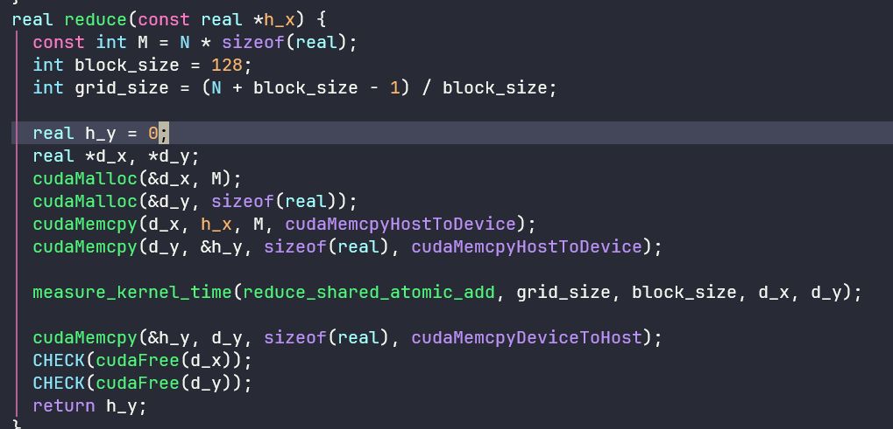

nv的GPU分为几个系列：

- Tesla系列:其中的内存为纠错内存(error-correcting code memory，ECO内存)，稳定性好，主要用于高性能、高强度的科学计算。
- Quadro 系列:支持高速 OpenGL(open graphics library)渲染，主要用于专业绘图设计。
- GeForce系列:主要用于游戏与娱乐，但也常用于科学计算。GeForce 系列的GPU没有纠错内存，用于科学计算时具有一定的风险。
- Jetson系列:嵌入式设备中的GPU

每个系列都有不同的架构，nv选择用科学家的名字作为架构的代号。注意:特斯拉(Tesla)既是第一代GPU架构的代号，也是科学计算系列GPU（即深度学习训练和推理使用的GPU）的统称,其具体含义要根据上下文确定。在深度学习推理常用的A100，V100就属于tesla系列，他们的全称就是tesla Volta 100

## 计时

用cuda事件计时：可以用来给一段cuda代码计时（可能包含主机代码和设备代码）

```C++
template<typename Func, typename... Args>
void measure_kernel_time(Func &&func, const dim3 &grid_size, const dim3 &block_size, Args &&... func_args) {
  cudaEvent_t start, stop;
  CHECK(cudaEventCreate(&start));
  CHECK(cudaEventCreate(&stop)); // 定义两个cuda事件，并且初始化
  CHECK(cudaEventRecord(start)); // 记录一个代表开始的事件
  cudaEventQuery(start);

  func<<<grid_size, block_size>>>(std::forward<Args>(func_args)...);

  CHECK(cudaEventRecord(stop)); // 记录一个代表结束的事件
  CHECK(cudaEventSynchronize(stop)); // 让主机等待事件stop被记录完毕
  float elapsed_time ;
  CHECK(cudaEventElapsedTime(&elapsed_time, start, stop));
  printf("Time = %g ms\n", elapsed_time);
  CHECK(cudaEventDestroy(stop)); // 销毁事件
  CHECK(cudaEventDestroy(start));
}
```

计时时可以忽略第一次测得的时间，因为第一次计算时机器可能处于预热状态，测得的时间往往偏大


通过改变编译时的编译选项（-DUSE_DP），我们可以发现双精度版本的add函数（即将两个向量求和到另一个向量中）的时间是单精度版本的add的时间的两倍，这对于add这种访存主导的函数来说是合理的

所谓访存主导，是指该函数的执行速度是由显存带宽决定的，而不是由浮点数运算峰值决定的，也就是说瓶颈在访存，而不在运算

计算某个运算的实际显存带宽（有效显存带宽）的方法：

- 比如add函数，如果向量长度为10^8，所花时间为3.3ms，那么

上面的3ms仅仅是核函数的计时，如果把核函数之前和之后的在设备和主机之间数据复制的操作也计算进去，那么总共耗时为180ms，所以add核函数的运行时间不到数据复制时间的2%

nvprof可以对cuda程序进行性能分析：


对于add来说，分析的结果如下：这里可以看出绝大多数时间都在数据复制上


GPU的计算核心和显存之间的峰值带宽远高于GPU和CPU之间的峰值带宽，前者往往是几百GB每秒，而后者的PCIEx16 Gen3仅有16GB/s，所以**有时候有些计算在GPU中的速度并不快，也要尽量在GPU中实现，避免过多的数据经过PCIe传输**

如果计算任务不是做一次向量相加的计算，而是10000次，那么数据传输的overhead就可以忽略不计

数组相加的问题之所以很难有很高的加速比，是因为该问题的算术强度不高，即**算术操作与内存操作的工作量之比**（这个**内存操作指的是对设备内存的操作，不是对主机内存的操作**），在此问题中每对一个数据进行求和都要先将一对数据从显存中取出来，计算后还要将结果放回显存，在取两次数据存一次数据的情况下只做了一次求和计算

如果一个问题中不仅仅是简单的单次求和操作，而是更复杂的浮点数运算，那么就可以提高算术强度，也就能得到更高的GPU对于CPU的加速比

所以在写cuda时，要想方设法做到：

1. 减少主机与设备之间的数据传输
2. 提高核函数的算术强度，也就是尽量减少与设备内存的访问
3. 增大核函数的并行规模

## 内存组织


- 全局内存（线性内存）：容量大，基本就是显存容量；所有的cuda线程都可以访问；cudaMalloc函数可以给全局内存变量分配设备内存，cudaMemcpy函数可以将主机的数据复制到全局内存（还可以将一段全局内存的数据复制到另一段全局内存中去)。生命周期不是由核函数决定的，而是由主机决定的，从主机端用cudaMalloc开始，到主机端用cudaFree结束

  - 静态全局内存：上面的变量是在运行时动态地分配的，而静态全局内存则是在编译期确定的；必须在所有主机和设备函数之外定义

    

    静态全局内存可以在核函数中访问，不能在主机函数中访问，但是**可以使用cudaMemcpyToSymbol函数在静态全局内存和主机内存之间传输数据**

- 常量内存：是有常量缓存的全局内存，64KB，可见范围和生命周期与全局内存一样，但是速度很快，仅可读，不可写；但是常量内存速度快的前提是一个warp中的线程（即一个线程块中相邻的32个线程，因为warp一定在同一个线程块中）读取相同的常量内存数据。

  定义常量内存的方法与静态全局内存相似，在核函数外面用 `__constant__`定义变量，然后用cudaMemcpyToSymbol函数在常量和主机内存之间传输数据。

  除了显式用constant修饰的变量之外，给核函数传递的参数（值传递）就放在常量内存中

  - 常量内存主要是解决一个 warp scheduler 内多个线程**访问相同数据**时速度太慢的问题。假设所有线程都需要访问一个 constant_A 的常量，在存储介质上 constant_A 的数据只保存了一份，而内存的物理读取方式决定了多个线程不能在同一时刻读取到该变量，所以会出现先后访问的问题，这样使得并行计算的线程出现了运算时差。常量内存正是解决这样的问题而设置的，它有对应的 cache 位置产生多个副本，让线程访问时不存在冲突，从而保证并行度。

- 纹理内存和表面内存：类似于常量内存，作用域和生命周期相同，并且仅可读（表面内存也可写）。对**只读**全局内存数据使用 `__ldg()`函数就可以使用纹理内存加速。对帕斯卡和更高的架构来说，全局内存的**读取**默认就使用了 `__ldg()`

- 寄存器：在核函数中定义的不加任何修饰符的变量以及各种cuda内置的变量（gridDim、blockIdx等）就放在寄存器中（数组有可能放在寄存器中，也有可能放在局部内存中）

  寄存器变量仅仅被一个线程可见，所以**虽然在核函数中使用了同一个变量名，但是每一个线程都会有一个副本**，生命周期也与所属线程的生命周期一样。一个寄存器是32bit的内存

- 局部内存：从用法上来看，局部内存和全局几乎一样，**寄存器中放不下的变量就放在局部内存中**；但是**局部内存只是全局 内存的一部分**，所以它的延迟也很高；每个线程最多使用512KB的局部内存

- 共享内存：**共享内存的可见范围和生命周期是所属的线程块**，不能访问其他线程块的共享内存。速度仅次于寄存器。在核函数中，要将一个变量定义成共享内存变量需要在它前面加一个 `__shared__`，就相当于在每一个**线程块**中都有一个该变量的副本

还有SM层次的L1缓存和整个设备层次的L2缓存，用于缓存全局内存的访问。上面的这些内存是可编程的内存，而缓存是不可编程的内存。**与cpu的访问模式基本一致**，对全局内存的读取先尝试经过l1 cache，如果未命中则经过l2 cache，未命中再去全局内存中

一个线程块中的线程数不能超过1024

cuda编程我们要分清楚软件上的层级和硬件上的层级：

- 软件的层级是grid ——block——（warp，实际上并不是软件显式的层级，因为**cuda线程的编号是在线程块中编号的**）——线程
- 硬件的层级是设备——SM——warp（注意，warp是硬件上的概念，硬件以warp为单位进行调度）——线程

SM的线程执行以warp为单位，**一个warp中的线程必须是同一个线程块，一个线程块只能在同一个SM中执行，一个SM可以包含多个block**，所以最好将线程块的大小取为warp大小（32）的整数倍，否则最后一个warp无法得到最高的利用率

一旦一个线程块被启动在一个流处理器（SM）上，它的所有线程束（warps）都会一直停留在该SM上，直到它们的执行完成。

如果一个[warp](https://zhida.zhihu.com/search?q=warp&zhida_source=entity&is_preview=1)其操作数之一或两者都还没有准备好（例如，尚未从全局内存中获取），就会发生上下文切换，将控制权转移到另一个线程束上。但与CPU不同的是，在切换离开特定线程束时，该线程束的所有数据仍然保留在寄存器文件中，以便在其操作数准备好时能够快速恢复执行。

### gpu利用率

gpu利用率是指**分配给 SM 的 warp 数量与其可支持的最大数量的比率**，也就是说，如果gpu利用率太低了通常是一个SM中的warp太少了

而每个SM能同时执行的warp数上限取决于硬件的限制（比如限制一个SM最多运行多少个线程块、多少个warp、多少个线程等）、kernel参数设置和线程与线程块资源使用（比如共享内存使用、寄存器的使用）所导致实际能够执行的数量限制。

GPU上有一个GPU Work Scheduler，用来调度线程块在哪个核上运行；如果GPU上资源不足，比如所有的核的**共享内存都不足**以存放新的线程块分配的块共享内存（**SM要为每个block分配共享内存**），或者**warp空间不够**，就要等正在执行的线程块结束，腾出空间


例如，在Nvidia H100上，每个SM最多可以处理32个线程块、64个warp（即2048个线程）和每个块1024个线程。

- 如果资源充足的情况下，限制GPU利用率的就是kernel参数设置和硬件限制，如果他们产生了冲突就会导致gpu利用率不高。
  - **线程块的大小太小**：如果我们的核函数中将线程块的大小设为32，而SM一次只能运行32个block，所以每个SM只能运行32*32个线程，导致只能达到2048个线程利用率的一半（一般线程块的大小最起码要是64以上，按照这个设置来看，线程块的大小越大越好？）
  - **线程块的个数太少**：因为一个SM可以驻留多个线程块，那么整个GPU几十上百个SM就起码需要几百个线程块才能填满（一般线程块的个数起码是SM个数的十几倍）
- 其次，线程和线程块资源的使用也会导致实际能够执行的线程数量受限。
  - 如果一个线程块共享内存使用了太多，那么就会导致其他线程块无法在这个SM上执行
  - SM上warp空间不够，也会导致其他线程块无法执行


## 全局内存的合理使用

gpu对全局内存的读写与cpu类似，都是按照cache line的大小进行的，当CPU或GPU从全局内存中读取或写入数据时，整个缓存行会被加载到缓存中，即使只访问了其中的一部分。

- gpu的所谓的cache line size通常是32字节，也就是一次数据传输的数据量是32字节
- CPU的cache line通常是64字节

每次将访问位置处的地址与cache line size对齐的缓存块加载入缓存中，比如访问的地址范围在0 ~ 31之间，那么传输的数据块就是范围在0 ~ 31的数据块。所以要内存对齐，假设 cache line 为 32B。待访问数据大小为 64B，地址在 0x80000001，则需要占用 3 条 cache 映射表项；若地址在 0x80000000 只需要 2 条。内存对齐变相地提高了 cache 命中率。

使用cuda api分配（cudaMalloc）的内存首地址至少是256字节的整数倍

全局内存的访问模式：**合并访问就是充分使用缓存局部性**，指的是一个warp对全局内存的一次访问请求导致最少数量的数据传输。合并度：等于warp请求的字节数除以由该请求导致的所有数据传输的字节数，如果数据传输的所有数据都是warp所需要的，那么合并度就是100%

- 所谓的合并访问本质上就是CPU的缓存命中率，对于CPU来说，在短时间间隔内访问的地址越集中越好，比如在一个32次的循环中，访问的地址最好分散在32个元素的连续空间中，是否是顺序访问无所谓，对局部性没有影响。对于GPU来说也是一样的，GPU以warp为执行单位，一个warp中的线程同时执行，所以要求一个warp中的线程对全局内存的访问也要有局部性，也就是要求同一个warp中的线程访问相邻的数组元素（实际上与cpu一样，不一定要求相邻的线程访问相邻的元素，乱序访问也可以，不影响缓存命中率）

不对齐的非合并访问：

```c++
__global__ void add_offset(float *x, float *y, float *z) {
 int tid = blockIdx.x * blockDim.x + threadIdx.x + 1;
 z[tid] = x[tid] + y[tid];
}

add_offset<<<128, 32>>>(x, y, z);
```

第一个线程块中的warp访问x的1到32号元素（标号从0开始），假设x的首地址是256字节，那么该warp访问的数据对应的地址是260到387字节。这将触发5次数据传输，对应的内存地址分别为：256到287字节、288到319字节、320到351字节、352到383字节、384到415字节。合并度为4/5=80%。

考虑对一个N*N的方阵A进行转置，转置后的矩阵记为B。

此问题中使用了二维的网格和线程块；

将矩阵A分割成一个个32*32的小方阵进行处理，每一个二维的线程块处理一片矩阵，线程块的维度和一片矩阵的维度相同，示例代码如下：

```c
__global__ void transpose(const real *A, real *B, const int n) {
    const int nx = blockIdx.x * blockDim.x + threadIdx.x;
    const int ny = blockIdx.y * blockDim.y + threadIdx.y;
    
    if (nx < n && ny < n) {
      // Bij = Aij
      // B[nx * n + ny] = A[ny * n + nx];

      // Bij = Aji
      B[ny * n + nx] = A[nx * n + ny];
    }
}

const int grid_size_x = (N % 32 == 0) ? (N / 32) : (N / 32 + 1);
const int grid_size_y = grid_size_x;
const dim3 block_size(32, 32);
const dim3 grid_size(grid_size_x, grid_size_y);

transpose<<<grid_size, block_size>>>(A, B, N);
```


都能实现矩阵转置，前者对矩阵A的数据访问是顺序的（合并的），对矩阵B的数据的访问不是顺序的（非合并的）；而后者则相反。二者都对一个矩阵的访问是合并的，另一个矩阵的访问是非合并的，但是性能却不一样，前者时间是9ms，后者是6ms

- 因为**从帕斯卡架构开始，对全局内存的读取默认使用 `__ldg()`函数**，从而对数据的读取进行缓存，缓解非合并访问带来的影响；而写入则没有这种优化；所以**在不能满足读取和写入都是合并的情况下，要尽量做到合并写入**

所以后者等同于：

```c++
B[ny * n + nx] = __ldg(&A[nx * n + ny]);
```

## 注意！共享内存的bank conflict和全局内存的合并访问不是一个东西，但是

**不管是共享内存还是全局内存进行跨步访存（相邻线程）都是不好的，前者容易造成bank conflict，后者容易造成访存不合并**

## 共享内存的使用

使用全局内存的reduce操作：将数组切分成线程块大小的块，每个线程块reduce一块数组，每次reduce采用折半的方式，将小数组切分成两半，将后面那一半加到前面那一半上，然后将前面的再切成两半，以此类推，直到剩下一个数，最后小数组的第一个数就是这个线程块reduce的结果；然后每个线程块将自己reduce的结果保存在另一个数组中，最后在主机上reduce这个数组。

这种做法数组x的长度要是线程块大小的整数倍才行，否则会发生数组越界

```c++
__global__ void reduce_global(real *d_x, real *d_y) {
  const int tid = threadIdx.x;
  const int bid = blockIdx.x;
  real *x = d_x + blockDim.x * blockIdx.x;
  for (int offset = blockDim.x >> 1; offset > 0; offset >>= 1) {
    if (tid < offset) {
      x[tid] += x[tid + offset]; 
    }
    __syncthreads(); // 在线程块内同步
  }
  // 每个线程块负责reduce x中的一部分数据到y中
  if (tid == 0) {
    d_y[bid] = x[0];
  }
}
int main(void) {
  const int M = N * sizeof(real);
  int block_size = 128;
  int grid_size = (N + block_size - 1) / block_size;

  real *h_x = (real*)malloc(M);
  real *h_y = (real*)malloc(M / block_size);
  real *d_x, *d_y;
  cudaMalloc(&d_x, M);
  cudaMalloc(&d_y, M / block_size);
  cudaMemcpy(d_x, h_x, M, cudaMemcpyHostToDevice);
  cudaMemcpy(d_y, h_y, M / block_size, cudaMemcpyHostToDevice);

  reduce_global<<<grid_size, block_size>>>(d_x, d_y);
}
```

使用共享内存的reduce：在上面的做法中，核函数对全局内存的访问非常频繁，假设l = 128，对x的规约会导致对全局内存x访问`l + l / 2 + l / 4 + ... + 1`次，也就是`2l`次；对于**这种对全局内存重复访问的情况，我们就可以先把全局内存保存在共享内存中**。

先在核函数中定义一个长度为线程块大小的共享内存数组，然后将全局内存的数据复制到共享内存中，这里**对于超过全局数组长度的数据不需要复制，这样就可以处理数组长度不是线程块倍数的情况**；然后每个线程块对自己的共享内存中的数组进行reduce，最后还是将结果复制到数组y中。

```c++
__global__ void reduce_shared(real *d_x, real *d_y) {
  const int tid = threadIdx.x;
  const int bid = blockIdx.x;
  const int n = blockIdx.x * blockDim.x + threadIdx.x;
  __shared__ real s_y[128];
  if (n < N) {
    s_y[tid] = d_x[n];
  }
  __syncthreads();

  for (int offset = blockDim.x >> 1; offset > 0; offset >>= 1) {
    if (tid < offset) {
      s_y[tid] += s_y[tid + offset]; 
    }
    __syncthreads();
  }
  // 每个线程块负责reduce x中的一部分数据到y中
  if (tid == 0) {
    d_y[bid] = s_y[0];
  }
}
```

除了速度之外，使用共享内存相对于全局内存还有两个好处：

1. 不再要求全局内存数组长度是线程块大小的倍数
2. 规约的过程中不会改变全局数组中的数据

使用动态共享内存：

上面使用的是静态共享内存，在定义共享内存数组时要指定一个常量的长度（128），这样硬编码很不方便；我们可以使用动态共享内存，语法如下：

1. 在调用核函数时加上第三个参数，表示每个线程块需要定义的动态共享内存的字节数 `  reduce_global<<<grid_size, block_size, sizeof(real) * block_size>>>(d_x, d_y);`
2. 还要改变核函数动态共享内存的声明方式`  extern __shared__ real s_y[];`

使用共享内存进行矩阵转置：主要是为了消除对全局内存的非合并访问，将矩阵分成小块（tile），每个线程块负责一个tile，先将tile从全局内存A（合并访问）复制到共享内存，然后对共享内存进行转置，再将转置后的共享内存矩阵复制到全局内存B中，注意，这里全局内存B的坐标需要改变，访问的是B中与主对角线对称的另一个tile，实际上只要将访问矩阵A的bx和by颠倒一下即可，在tile内部访问还是按照threadIdx.x和threadIdx.y的顺序访问

- 

```c
__global__ void shared_transpose(const real *A, real *B, const int n) {
  __shared__ real S[TILE_DIM][TILE_DIM];
  const int bx = blockIdx.x * blockDim.x;
  const int by = blockIdx.y * blockDim.y;
  int nx1 = bx + threadIdx.x;
  int ny1 = by + threadIdx.y;
  if (ny1 < n && nx1 < n) {
    S[threadIdx.y][threadIdx.x] = A[ny1 * n + nx1];
  }
  __syncthreads();
  int ny2 = bx + threadIdx.y;
  int nx2 = by + threadIdx.x;
  if (nx2 < n && ny2 < n) {
    B[ny2 * n + nx2] = S[threadIdx.x][threadIdx.y];
  }
}
```

### 避免共享内存的bank冲突

为了获得更高的内存带宽，共享内存在物理上被分为32个同样宽度的、能被同时访问的内存bank，在大多数架构中，每个bank的宽度为4个字节，也就是在连续的128字节的内存中，数据会被均匀分到32个bank中。

在每个bank中可以对其中的内存地址从0开始编号，所有bank中编号为0的内存称为第一层内存，编号为1的称为第二层内存。


**由于每个bank每时钟周期的带宽为4字节，所以一个bank在某一时刻只能被一个warp中的一个线程访问，只要一个warp中的多个线程不同时访问同一个bank中不同层的数据，那么该warp对共享内存的访问只需要一次内存事务**。在一个warp中对同一个bank中的n层数据同时访问将导致n次内存事务，称为n路bank冲突。最坏的情况就是一个warp中的32个线程同时访问一个bank中的32层数据。

在之前的transpose核函数中，因为tile的大小是32，所以定义了一个长度为32 * 32的float类型的共享内存数组，那么每一层的32个bank对应32个连续的数组元素，从14行可以看出来，同一个warp中的32个线程（连续的threadIdx.x）将访问S数组中跨度为32的数据，也就是说，这32个线程刚好访问同一个bank中的32层数据，导致32路bank冲突；而第8行，连续的threadIdx.x访问的是不同的bank，不会导致bank冲突。


通常可以用改变共享内存数组大小的方式来减轻bank冲突，比如这里把S一行的元素变成TILE_DIM + 1,就可以避免bank冲突。因为这样，**同一个warp中的32个线程（连续的32个threadIdx.x值）将对应共享内存数组S中跨度为33的数据**


消除冲突后的优化：


#### 深入理解bank conflict

bank冲突的本质是共享内存就是一块sram，每一块bank在硬件上只有一个读口（read port）和写口（write port），在一个时钟周期中每个bank只能响应一个读请求或者写请求，发往同一bank的其他读或写请求，必须等下一个周期，硬件才能响应。

在cuda运算中，一个warp对共享内存进行一次内存事务（memory transaction）最多读取128字节的数据，这也是一次取数指令能拿到的数据上限。**一个warp在发起memory transaction时，它可以发送不同类型的指令，warp内的每个thread都会按照这个指令去SMEM上取数**，**假设1个数4bytes**，那么：

- LDS.32指令每个thread去SMEM上取1个数；
  - 如果每个线程要取的数来自不同的bank，那么就没有bank冲突，一次内存事务就能拿到所有的数据
  - 如果有的线程要取的数来自同一个bank，但是它们要取的是这个bank上的同一个数，会由一个线程把数拿到，然后广播给其他需要的线程。那么也没有bank冲突，依然是一次内存事务拿到所有数据
  - 如果有n个线程取同一个bank上的不同的数，那么就是bank冲突。现在要n次内存事务（串行发送n次指令）才能拿到所有的数据

- 如果是LDS.64指令，表示每个线程取连续的两个数（64bit），此时一个warp内共需要取64个数，已经超过了warp单次memory transaction允许的取数上限。**所以该warp会把取数过程拆成2个串行的phase（即2次串行的memory transaction）**：即0～15号线程先取回32个数，16～31号线程再取回剩下的32个数。注意，**bank冲突是对一个warp中的同一个内存事务来说的**，因为不同内存事务之间是串行的，自然也没有冲突。所以我们只需要关心0 ~ 15号线程和16 ~ 31号线程内部是否发生了bank冲突即可。
- 如果是LDS.128指令，表示每个线程取连续的四个数（128bit），此时一个warp内共需要取128个数。所以**该warp会把取数过程拆成4个串行的phase（即4次串行的memory transcation）**：即0～7，8～15，16～23，24～31。


### Swizzle

一个当前最常见的应用场景就是矩阵乘的时候从共享内存到寄存器的内存拷贝操作会涉及到 Bank Conflict 的问题。在安培架构中，通常会使用硬件提供的 ldmatrix 指令将一块共享内存加载到寄存器内存中，此时一个线程会加载 128 bits 数据并将其分散到寄存器文件的四个角上面，如下图所示。

在这个例子中，一个线程负责从共享内存中load 128 bit的数据，也就是8个fp16的数据。相邻的线程跳跃着load每一行的8个fp16的数据


所以会导致出现下面的情况，因为使用的是LDS.128指令，所以一个transaction中有8个线程，那么一个transaction中就会出现bank conflict


实际上这种情况类似于矩阵乘法中的这种情况：T0~T7线程都隔着四个float进行访问，所以T0和T4、T1和T5都会产生bank conflict


一种可行的方法是使用 Padding，通过向内存中填充无用的空白的数据来使得内存错位，从而避免 Bank Conflict 的问题。然而，Padding 的缺点在于会过多占用内存，同时也会产生未对齐地址。


当前较为流行的方式是使用 Swizzle 来对不同的块重新进行物理映射，通过重映射的方式，能够将本来在相同 Bank 的内存映射到不同的物理地址，但对于用户来说逻辑地址依然为原来的地址。

### 原子指令

之前的reduce在GPU上完成后还需要把d_y数组移到CPU上再reduce一次才行，解决方法是直接让每个线程块负责把当前块中reduce的结果用原子指令累加起来即可（前提是d_y[0]初始值是0）




原子指令：


### 邻居列表的建立

给定N个粒子的坐标，和一个距离，确定每个粒子的邻居个数和每个邻居粒子的坐标；

基本算法：对每一个给定的粒子，遍历所有的其他的粒子，比较距离从而判断是否互为邻居，复杂度为N^2

顺序做法：数组NN长度为N，其中NN[n]是第n个粒子的邻居个数；每个原子的最多邻居个数MN；数组NL，长度为N * MN，每个粒子对应一个长为MN的邻居数组；其中NL[n * MN + k]是第n个粒子的第K个邻居的序号

只计算一半的粒子，因为粒子之间一定是互为邻居


cuda版本：每个cuda线程负责搜索一个例子的所有邻居，我们就可以去掉对n1的循环，改为判断语句：if (n1 < N)，这种**将C++程序中的最外层循环改为核函数中的判断语句**的做法很常见。

然后**由于每个cuda线程不止会修改自己的邻居个数计数器（即NN[n1]）的值，还会修改其他粒子的邻居个数计数器的值，导致会出现竞争；就需要将邻居个数计数器的递增改成原子指令**


对于使用原子指令的函数，也可以通过改变算法，去掉对原子指令的使用。上面的做法中，因为省去了一半的判断，所以每个cuda线程不止会对自己的计数器进行修改，还会对其他线程的计数器修改；解决办法就是：不省去那一半的判断，每个线程只对自己的计数器进行修改即可

1. 这里**使用寄存器变量count来暂存NN[n1]的值，减少对全局内存NN[n1]的访问**

2. 还改变了邻居列表中的数据排列方式，将NL[n1 * MN + count++]改成了NL[(count++) * N + n1]，也就是将排列方式变成了；**因为n1的变化步调和threadIdx.x一致，所以前者对NL的访问是不合并的，后者连续的cuda线程访问的是连续的NL地址，是合并的**

   


## warp

在伏特架构之前，一个warp中的线程拥有同一个pc，但是其他的寄存器每个线程都是独立的，从而可以根据程序的逻辑判断选择不同的分支，所以同一个warp中的线程有的会执行if有的会执行else；虽然可以选择分支，但是由于PC是一样的，在同一个时刻，一个warp中的线程只能执行同一个指令（这叫做SIMT），所以在执行时各个分支还是代码顺序执行的。

- 当发生divergence时，不满足这个分支条件的线程会闲置，其他的线程则会执行；
- divergence是针对同一个warp内部的线程的

实际上SIMT和SIMD的原理基本相同：

- SIMD也是所有线程共享一个PC，当发生divergence时，判断条件可以得到一个掩码向量，然后不管满不满足条件，所有线程统一执行该分支的代码，执行结束后再对新的结果和原来的结果进行掩码得到正确的结果；然后将掩码反转，再按照上面的流程统一执行下一个分支的代码
- **SIMD看起来是所有线程共享同一套寄存器，这方面与SIMT不同；但是二者的本质上是一样的，因为SIMD的一个寄存器的宽度与SIMD的线程个数相同，所以SIMD本质上也是每个线程有自己独立的寄存器**

从伏特架构开始，引入了独立线程调度机制，每个线程有自己的PC，使得编程更加灵活；但是也使得假设了warp同步的代码不安全，因为在伏特架构之前，warp内部默认就是同步的，所有线程的执行步调一致

### warp内部的同步函数

当涉及到的线程都在一个warp内时，可以将同步函数 `__syncthreads`改成粒度更小，性能更高的warp内部同步函数`__syncwarp`

下面的函数，当线程个数小于32时就使用warp内部的同步函数

```c++
__global__ void reduce_syncwarp(real *d_x, real *d_y) {
  const int tid = threadIdx.x;
  const int bid = blockIdx.x;
  const int n = blockIdx.x * blockDim.x + threadIdx.x;
  extern __shared__ real s_y[];
  if (n < N) {
    s_y[tid] = d_x[n];
  }
  __syncthreads();

  for (int offset = blockDim.x >> 1; offset > 32; offset >>= 1) {
    if (tid < offset) {
      s_y[tid] += s_y[tid + offset]; 
    }
    __syncthreads();
  }
  for (int offset = 32; offset > 0; offset >>= 1) {
    if (tid < offset) {
      s_y[tid] += s_y[tid + offset];
    }
    __syncwarp();
  }
  // 每个线程块负责reduce x中的一部分数据到y中
  if (tid == 0) {
    atomicAdd(&d_y[0], s_y[0]);
  }
}
```

### warp内部的洗牌函数

表决函数：


洗牌函数：

- 通常我们想要在cuda线程之间交换数据必须要使用全局内存或者block的共享内存
- 而洗牌函数允许**warp内**的线程之间直接交换数据，而不需要借助共享内存。因为 warp 内线程是同步执行的，它们可以通过硬件机制直接访问其他线程的数据，而不需要使用共享内存或全局内存。因此，**使用洗牌函数在 warp 内交换数据要比在共享内存中交换数据快很多**。
- 但是洗牌函数无法在大于warp的范围中交换数据
  - **所以reduce的实现通常是先将每个线程的数据放在共享内存的数组中，将数组reduce到大小为32，然后warp中的每个线程从数组中取一个数存入寄存器，再调用洗牌函数**，这样才能有最高的性能


二者都是在warp内部进行计算，不过前者是在实际的warp（32个线程）内部计算，而后者可以在参数中指定一个逻辑的warp大小，可以是任意小于等于32的2的次方的大小，当w小于32时，就相当于逻辑上的warpsize是w，而不是32。


掩码用来指定将要参与计算的线程，这些函数返回的结果对于被掩码排除的线程来说是没有意义的。


使用洗牌函数优化reduce：

1. 在进行warp内部的规约时，将共享内存中的数据复制到了寄存器中，因为在使用洗牌函数时不再需要显式访问数组了，可以直接访问变量。
2. 用 `__shfl_down_sync(FULL_MASK, y, offset)`来将数组中后半部分的值返回到前半部分（offset）的线程中，从而累加到前半部分的y上

```c++
__global__ void reduce_shfl(real *d_x, real *d_y) {
  const int tid = threadIdx.x;
  const int bid = blockIdx.x;
  const int n = blockIdx.x * blockDim.x + threadIdx.x;
  extern __shared__ real s_y[];
  if (n < N) {
    s_y[tid] = d_x[n];
  }
  __syncthreads();

  for (int offset = blockDim.x >> 1; offset >= 32; offset >>= 1) {
    if (tid < offset) {
      s_y[tid] += s_y[tid + offset]; 
    }
    __syncthreads();
  }
  real y = s_y[tid];
  for (int offset = 16; offset > 0; offset >>= 1) {
    y += __shfl_down_sync(FULL_MASK, y, offset);
  }
  // 每个线程块负责reduce x中的一部分数据到y中
  if (tid == 0) {
    atomicAdd(&d_y[0], y);
  }
}
```


### 协作组

协作组相当于是线程块和warp同步机制的推广，可以用在指定数量的线程（线程组）之间同步

使用`thread_group`类型来表示线程组，此类型有如下的成员：


线程组类型有一个称为线程块`thread_block`的导出类型，代表了当前的线程块，该类型有两个函数：


可以使用`tiled_partition`将一个`thread_block`类型的线程块分割`thread_group`类型的线程组，该函数还可以将线程组进一步切分成更小的线程组

```C++
  thread_group g32 = tiled_partition(this_thread_block(), 32);
  thread_group g4 = tiled_partition(g32, 4);
```

线程组也叫做线程块片

线程块片也有类似于warp内部的函数：


### reduce性能进一步提高

之前的规约方法对线程的利用率不高，因为使用大小为128的线程块进行规约，当offset为64时只用了一半的线程进行计算；最后当offset为1时只用一个线程进行计算；而在规约之前将全局内存复制到共享内存的操作对线程的利用率是100%，所以如果能够减少对线程块进行规约次数，也就是减少线程块的个数，那么就能整体提升线程的利用率

如果原来的N长为128 000 000，block_size是128，那么grid_size就是1 000 000，需要总的线程个数是128 000 000，每个线程负责处理一个元素；现在则block_size是128，grid_size是10 000，那么就有100 个grid，只需要128 000 0个线程即可，**每个线程负责处理100个元素，在规约之前，每个线程负责将100个元素累加起来，然后再在10 000个线程块内进行reduce即可**。

每个线程不能负责相邻的100个元素，因为这样相邻线程对全局内存的访问就是非合并的；所以我们**必须要让相邻的线程访问相邻的元素，同一个线程访问的元素之间要有一定的跨度**；这个跨度可以是一个线程块的线程数，也可以是一个网格的线程数，我们选择了后者；

定义的跨度stride等于`blockDim.x * gridDim.x`，也就是一个网格的线程个数

在规约之前首先将100个元素的值累加到每个线程的局部变量y上，然后再对每个线程块的y进行规约

第一步规约得到长度为grid_size 10240的数组，然后对这个数组再进行一次规约；这一次规约的grid_size为1，block_size为1024，也就是说进行累加之后只剩一个线程块了，可以规约得到一个数，就是最终的结果

```c++
__global__ void reduce_cp_wo_atomic(real *d_x, real *d_y, int d_x_length) {
  const int tid = threadIdx.x;
  const int bid = blockIdx.x;
  const int n = blockIdx.x * blockDim.x + threadIdx.x;
  extern __shared__ real s_y[];
  real y = 0.0;
  const int stride = blockDim.x * gridDim.x;
  for (int i = bid * blockDim.x + tid; i < d_x_length; i += stride) {
    y += d_x[i];
  }
  s_y[tid] = y;
  __syncthreads();

  for (int offset = blockDim.x >> 1; offset >= 32; offset >>= 1) {
    if (tid < offset) {
      s_y[tid] += s_y[tid + offset]; 
    }
    __syncthreads();
  }
  y = s_y[tid];
  for (int offset = 16; offset > 0; offset >>= 1) {
    y += __shfl_down_sync(FULL_MASK, y, offset);
  }
  // 每个线程块负责reduce x中的一部分数据到y中
  if (tid == 0) {
    d_y[bid] = y;
  }
}

real reduce_cp_wo_atomic(const real *h_x) {
  const int M = N * sizeof(real);
  int block_size = 128;
  int grid_size = 10240;
  real *d_y, *d_x;
  CHECK(cudaMalloc(&d_y, grid_size * sizeof(real)));
  CHECK(cudaMalloc(&d_x, N * sizeof(real)));
  cudaMemcpy(d_x, h_x, N * sizeof(real), cudaMemcpyHostToDevice);

  reduce_cp_wo_atomic<<<grid_size, block_size, block_size * sizeof(real)>>>(d_x, d_y, N);
  reduce_cp_wo_atomic<<<1, 1024, 1024 * sizeof(real)>>>(d_y, d_y, grid_size);

  real h_y;
  CHECK(cudaMemcpy(&h_y, d_y, sizeof(real), cudaMemcpyDeviceToHost));
  CHECK(cudaFree(d_x));
  CHECK(cudaFree(d_y));
  return h_y;
}

```

我们也可以将d_x和d_y变成静态全局数组，在编译期分配，避免运行时反复分配和释放，造成性能损失

```C++
__device__ real static_dx[N];
__device__ real static_dy[10240];
real static_reduce_cp_wo_atomic(const real *h_x) {
  const int M = N * sizeof(real);
  int block_size = 128;
  int grid_size = 10240;
  real *d_y, *d_x;
  CHECK(cudaGetSymbolAddress((void**)&static_dx, d_x));
  CHECK(cudaGetSymbolAddress((void**)&static_dy, d_y));
  cudaMemcpy(d_x, h_x, N * sizeof(real), cudaMemcpyHostToDevice);

  reduce_cp_wo_atomic<<<grid_size, block_size, block_size * sizeof(real)>>>(d_x, d_y, N);
  reduce_cp_wo_atomic<<<1, 1024, 1024 * sizeof(real)>>>(d_y, d_y, grid_size);

  real h_y;
  CHECK(cudaMemcpy(&h_y, d_y, sizeof(real), cudaMemcpyDeviceToHost));
  return h_y;
}
```

#### bug

```c++
#define FULL_MASK 0xffffffff
__global__ void reduce(float *a, float *b, int n) {
    int idx = blockDim.x * blockIdx.x + threadIdx.x;
    extern __shared__ float s_a[];
    float acc = 0;
    int stride = blockDim.x * gridDim.x;
    for (int i = idx; i < n; i += stride) {
        acc += a[i]; 
    }
    s_a[threadIdx.x] = acc;
    __syncthreads();
    for (int offset = blockDim.x / 2; offset >= 32; offset /= 2) {
        if (threadIdx.x < offset) {
            s_a[threadIdx.x] += s_a[threadIdx.x + offset];
        }
        __syncthreads();
    }
    float reg = s_a[threadIdx.x];
    for (int offset = 16; offset > 0; offset /= 2) {
        reg += __shfl_down_sync(0xffffffff, reg, offset);
    }
    if (threadIdx.x == 0) {
        b[blockIdx.x] = reg;
    }
}
void test_reduce() {
    int N = 1000000;
    int block_size = 128;
    int block_elem = 128 * 100; // 每个block处理的元素个数
    int grid_size = (N + block_elem - 1) / block_elem; // 有多少个block
    std::vector<float> h_a(N, 1.0);
    float *d_a;
    cudaMalloc(&d_a, N * sizeof(float));
    cudaMemcpy(d_a, h_a.data(), N * sizeof(float), cudaMemcpyHostToDevice);
    float *d_b;
    cudaMalloc(&d_b, sizeof(float) * grid_size);
    reduce<<<grid_size, block_size, block_size * sizeof(float)>>>(d_a, d_b, N);
    // 注意，这里的写法有问题，因为reduce核函数中采用的是折半规约，刚好规约到32之后采用warp内部的规约
    // 所以只对block_size是32倍数的起作用；如果不是32的倍数，比如block_size是50，那么offset就是25，小于了32，于是使用warp内规约
    // 但是33到50号元素还没有被规约，所以就出现了问题
    reduce<<<1, grid_size, grid_size * sizeof(float)>>>(d_b, d_b, grid_size);
    float h_res;
    cudaMemcpy(&h_res, d_b, sizeof(float), cudaMemcpyDeviceToHost);
    std::cout << h_res << std::endl;
}
```

在上面的做法中，最后的结果会出错。问题在于grid_size是79，第二次reduce时block_size就是grid_size，所以也是79；但是**reduce的核函数中采用的是折半规约，如果grid_size是32的倍数，那么刚好规约到32之后采用warp内部的规约**；但是如果不是32的倍数，比如79：

- 第一次offset是40，大于等于32，则进行一次规约；
- 二次offset是20，小于32，不满足条件，则进入warp内部规约，然而warp内部规约只会对前32的元素进行操作，第33到第40个元素就被忽视了，所以结果错误。

所以我认为问题在于在16到32之间的offset在32之外的部分没有规约到32之内，于是我将条件从offset >= 32改成了 offset > 16，这样offset等于20时，也可以进行规约。

但是这样的结果依然是有问题的，因为warp内部规约会对前32个元素都进行操作，但是在此案例中，只有前20个元素才是我们要规约的，第20到第32个元素是旧的元素，所以结果依然错误。

所以如果要使用这种方法，就必须要让grid_size是32的2次方倍，所以grid_size的大小就是大于`(N + block_elem - 1) / block_elem`的最小的32的二次方倍

或者最简单的办法：使用atomicAdd

## cuda stream

cuda流是由主机发出的在一个设备中执行的cuda操作序列，包括主机和设备之间的数据传输和核函数的执行。一个cuda流中的操作按照主机发布的次序顺序执行，来自不同cuda流中的操作则有可能并发或交错执行

任何cuda操作都存在某个cuda流中，之前的cuda操作我们没有明确的指定cuda流，所有的cuda操作都是在默认的空流中执行的

使用一个默认流就可以实现主机计算和设备计算之间的并行：

- 对主机来说，主机和设备之间的数据传输是同步的，启动数据传输之后主机不能做其他的事情；而核函数的执行是异步的，启动核函数后主机可以立马做其他的计算，但是唯独不能发动设备操作，比如进行数据传输或者再次启动一个核函数，因为设备操作要按照顺序进行，之前的核函数还没有执行完。
  - 数据传输和启动核函数都是设备操作，gpu不能同时执行两个操作
- 所以**当主机和设备上都有计算任务时，并且二者的计算量相当（指执行时间相当）时，可以将主机的计算任务放在启动设备函数之后执行，这样可以实现主机函数与设备函数并发执行的效果**，从而隐藏主机函数的执行时间。
- 但是二者计算量差距很大的时候这样就不起作用了

使用多个cuda流实现核函数之间的并行：

- 虽然同一个cuda流中的cuda操作在设备中是顺序执行的（所以同一个cuda流中的核函数也是顺序执行的），但是主机每次启动一个核函数后都会立即获得主机程序的控制权，所以**主机可以启动多个cuda流，每个流的核函数之间就可以并行了**

- 非默认的cuda流由主机产生与销毁，一个cuda流由类型为`cudaStream_t`的变量表示。产生与销毁：

  ```c
    cudaStream_t stream_1;
    CHECK(cudaStreamCreate(&stream_1));
    CHECK(cudaStreamDestroy(stream_1));
  ```

  为了检查cuda流的操作是否执行完毕，还提供了

  

- 使用非默认流启动核函数时，核函数的执行配置必须要包含一个流对象，核函数启动的尖括号的第三个位置放的是动态共享内存的大小，第四个位置就是流对象，如果没有使用动态共享内存，那么第三个位置就是0

  ```C++
    cudaStream_t stream_1;
    CHECK(cudaStreamCreate(&stream_1));
    reduce_cp_atomic<<<grid_size, block_size, 0, stream_1>>>(d_x, d_y);
    CHECK(cudaStreamDestroy(stream_1));
  ```

- 使用非默认流并行多个核函数：将cuda流对象保存在streams数组中，这些cuda流的产生与销毁都在主函数中执行

  

  随着流的数量增加，计算量也增加，但是总的执行时间却没有成比例的增加，说明使用多个流有了加速。可以看到，当流的数量超过15时，加速比就接近饱和了

  

  限制多流的加速比的两个条件：

  1. 一个是计算资源，当所有的cuda流中对应核函数的线程数的总和超过某一个值时，再增加流就不会带来更高的加速比了，**比如上面的add函数负责相加两个长度N等于1024的数组，每个线程负责一个元素，那么一个核函数就有1024个线程（grid_size * block_size等于1024）**；Tesla K40有15个SM，每个SM理论上最多常驻2048个线程，那么理论上可以支持30个核函数的并发，但是实际结果15个核函数就到了瓶颈，一个SM只支持1024个线程，这就是理论和实际值的区别（可能因为一个SM中实际最多**并行**执行4个warp，线程超过一定数量后调度不过来了？）
  2. 另一个是单个GPU中能够并发执行的核函数个数有一个上限。如果将N变成128，按照计算资源来算，最多支持的核函数应该变成15 * 8 = 120个，但是由于Tesla k40架构硬性规定最多支持32个核函数，那么上限就是32个。

使用多个cuda流实现核函数的执行和数据传递之间的并行：

- **如果使用同步的数据传输函数，主机发出数据传输的命令后无法立即获得控制权，也就无法同时去另一个流调用核函数，无法实现数据传输和核函数执行的并行**；
- 因此数据传输需要使用cudaMemcpy的异步版本即cudaMemcpyAsync函数，**异步传输由GPU的DMA负责，不需要主机参与**。cudaMemcpyAsync只比cudaMemcpy多一个参数，用来指明所在流的变量 


  如果`cudaMemcpyAsync`使用可分页内存，那么异步的`cudaMemcpyAsync`函数将退化成同步的`cudaMemcpy`函数 

- 具体做法：对于先从主机向设备传输数据，然后在设备上计算该数据，最后将数据传回主机的情况，我们不能简单地将三个部分分成三个流，因为他们彼此是有依赖关系的。**我们应该将数据分成N份，每一份数据的这三个操作序列由一个cuda流来负责**。

  

  在实际执行中，**不同流的主机和设备的数据传输是不能并行的**，因为收到硬件资源的限制，所以会出现像上面的流水线一样的执行过程，**实现了流2的核函数执行和流1的设备数据传输之间的并行**。

  

  

  如果核函数执行、主机到设备的数据传输和设备到主机的数据传输这三个cuda操作能够完全并行执行，那么理论上的最大加速比是3，但是在本例中最大加速比是2，主要原因是在本例中这三个cuda操作的执行时间并不完全一样。

  

注意：**不同的流中的任何操作都是可以异步执行的**，

在同一个流中，一次只能进行一个设备操作，数据传输和执行核函数算设备操作，所以一个流中如果正在执行核函数，就不能执行数据传输（注意，默认流也是一个流，并且要分清楚执行和启动，核函数分为启动和执行，异步的数据传输也分为启动和执行）；如果有n个流，那么一个设备最多可以同时进行n个设备操作，但是不管有多少个流，**一个设备仍然最多只能同时执行一个数据传输**

### stream的原理

一个stream本质上就相当于GPU的一个执行队列，在这个stream上调用launch kernel时，本质上就是将这个kernel放入到GPU的执行队列中，一个execution engine负责一个队列（stream）


所以一个execution engine相当于CPU的一个核，早期的GPU硬件上只有一个execution engine

GPU上会有多个execution engine。首先出现的是kernel execution engine与memory operation engine，也就是execution engine从1个提高到了2个，分别负责cuda kernel execution与memory operation（例如memory copy）。多出来的engine就叫asyncEngine，因为它可以和主要负责执行的engine之间异步执行。

所以如果有多个execution engine，就可以使用stream让不同stream的kernel并行起来。


**创建stream的时候，我们也可以用cudaStreamCreateWithPriority为它指定优先级。当多个GPU kernel都可以执行的时候，cuda driver负责调度，优先执行high priority的stream里的kernel**。

如果stream的数量超过了execution engine的个数，那么必然会有stream在等待（一个kernel都没有被执行）

所以一个GPU kernel可以执行的必要条件是它在stream的队列首位且存在执行kernel的空闲硬件资源

### event

我们可以用event来记录某个stream上的事件是否发生了。具体用法就是**使用`cudaEventRecord`在一个stream上插入一个event对象（相当于是一个fake event kernel），当该stream执行到这个event处时，该event就会被触发**，其他的stream就可以查询到该事件被触发了。

比如下图中，在stream 1上面launch kernel 1之后，创建一个event来记录当前stream 1的状态，然后**在stream2的队列中插入一个等待event被触发的操作**。于是，stream2后面的kernel就必须等到kernel 1执行结束之后才能开始了。


```c++
int main() {

    // Create streams and event
    cudaStream_t stream1, stream2;
    cudaEvent_t event1;
    int priorityHigh, priorityLow;
    cudaDeviceGetStreamPriorityRange(&priorityLow, &priorityHigh);
    cudaStreamCreate(&stream1);
    cudaStreamCreateWithPriority(&stream2, cudaStreamDefault, priorityHigh);
    cudaEventCreate(&event1);

    const int64_t repeat = 1000;

    // Execute kernel1 in stream1
    kernel1<<<gridDim, blockDim, 0, stream1>>>(d_data1, repeat);
    // 在stream1中插入一个event
    cudaEventRecord(event1, stream1); // Record event1 after kernel1 execution in stream1

    // 在stream2中插入等待event的操作
    cudaStreamWaitEvent(stream2, event1, 0);

    kernel2<<<gridDim, blockDim, 0, stream2>>>(d_data1, repeat);

    // Execute kernel3 in stream1 on a different array
    kernel3<<<gridDim, blockDim, 0, stream1>>>(d_data2, repeat);
    // Synchronize streams
    cudaStreamSynchronize(stream1);
    cudaStreamSynchronize(stream2);

    cudaStreamDestroy(stream1);
    cudaStreamDestroy(stream2);
    cudaEventDestroy(event1);
}
```

使用event来计时：相当于在默认流中，在kernel执行的前后插入两个event，然后计算这两个event的触发的时间之差。event记录的是把当前event插入stream队列里，event开始执行的时间

```c++
template<typename Func, typename... Args>
void measure_kernel_time(Func &&func, const dim3 &grid_size, const dim3 &block_size, Args &&... func_args) {
  cudaEvent_t start, stop;
  CHECK(cudaEventCreate(&start));
  CHECK(cudaEventCreate(&stop)); // 定义两个cuda事件，并且初始化
  CHECK(cudaEventRecord(start)); // 记录一个代表开始的事件
  cudaEventQuery(start); // 用来查询这个event是否执行结束

  func<<<grid_size, block_size>>>(std::forward<Args>(func_args)...);

  CHECK(cudaEventRecord(stop)); // 记录一个代表结束的事件
  CHECK(cudaEventSynchronize(stop)); // 让主机等待事件stop被记录完毕
  float elapsed_time ;
  CHECK(cudaEventElapsedTime(&elapsed_time, start, stop));
  printf("Time = %g ms\n", elapsed_time);
  CHECK(cudaEventDestroy(stop)); // 销毁事件
  CHECK(cudaEventDestroy(start));
}
```

## Nsight System和Nsight Compute

Nsight system和Nsight compute是nv新一代的分析工具，前者是系统层面的分析工具，它会给出GPU和CPU的使用，和二者的交互情况；后者专门用来分析kernel

下面是Nsight家族的建议使用流程：首先system从系统层面分析应用程序，优化不必要的同步和数据传输等，增加CPU和GPU之间运行的重叠和并行（负载平衡）；如果是compute程序，则使用Compute来分析kernel，如果是graphics程序，则使用Nsight Graphics来分析。优化过后再回到Nsight System重新进行系统层面的分析，并重复以上过程，直到获得一个满意的性能

- 这个流程也是profile工具使用的通用流程，先分析、找到热点和瓶颈并优化、然后再分析


nsys主要是针对应用程序运行过程中SM效率低或GPU硬件的占用率低的情况

- GPU占用率低的情况在nsys的结果中直接可以从流水线中看出来
- SM效率低往往有几个因素：
  1. CPU上的活动，比如任务启动过程中读取checkpoint，或者应用程序一直处于CPU 的计算
  2. 显存拷贝的延迟。如果我们在运行过程中频繁地读取数据，那么这个属于系统层面的问题，可以使用nsys分析出来；但是如果更细节的东西，比如显存和L2或L1cache或shared memory之间的交互只能使用ncu看出来
  3. 还有可能是kernel launch的延迟，启动kernel时要进行一些配置，比如gridsize和blocksize，并且kernel launch是由CPU串行发起的，所以如果kernel launch太多也会影响GPU的效率。所以有一种优化方式就是减少kernel launch的数量，将多个kernel launch合并为一个；除了合并kernel launch之外，还可以使用cuda graph，也就是以graph的形式将多个kernel以批量的形式执行


nvtx注释：可以在python或者cpp代码中添加nvtx的注释，让nsys分析出的结果可读性更强，能够分辨出到底是代码中的哪个阶段


使用nsys分析一个手写数字识别程序：

https://github.com/pytorch/examples/tree/main/mnist

```
nsys profile -t cuda,osrt,nvtx,cudnn,cublas -y 60 -d 20 -o baseline -f true -w true python main.py 
```


使用上面的命令在服务器上用nsys命令行生成profile文件之后，将它拖到本地的nsys-ui中即可生成下面的内容


从下图可以看得出来，在CUDA HW这一栏中的红框中有大段的空白，这个说明GPU在这些时刻是空闲的，这个空闲有可能是等待CUDA API，比如kernel launch；而在CUDA API这一栏中，和CUDA HW对应的位置也是空白，说明CUDA API在此时也没有被调用。 


因此我们需要对train的代码添加nvtx注释


nvtx的使用方法就是用`nvtxRangePush("RangeName")`和`nvtxRangePop()`来标记代码段（**注意，遍历dataloader时也不要忘了加上nvtx**）


加上nvtx后nsys的结果如下：可以看到在cuda没有活动的时候正好是data loading，而数据加载的时间几乎和整个batch训练的时间相同，也就是说数据加载的时间占据了训练时间的一半


我们将dataloader的num_workers的数目从1改为8后，可以看到dataloading的时间就缩短了十倍


下图中的waiting和running表示CPU正在等待和运行


对应下图中的棕色和绿色的部分，我们能看到CPU等待的原因是等待pthread的条件变量


点击nsys中一部分会高亮出与之相关联的部分，比如点击cuda api，会显示出它对应的kernel。如果二者在时间轴上的距离较远，那么就说明kernel launch花费了很多时间


任何使用GPU的任务（比如神经网络）实际上都是CPU和GPU协同执行（异构计算）的，所以如果我们的整个任务对GPU的使用率很低（比如一个神经网络本身的计算量就很小，或者网络输入的数据量太少，导致SM的占用率太低），那么任务的瓶颈实际上是在CPU上，也就是说我们无论怎么对任务在GPU上进行优化都是无济于事的，比如对神经网络进行量化、剪枝，或者对cuda算子进行优化。比如上面的这个例子中，CUDA HW这条线上的任务都很空，表明GPU的利用率很低

所以网络加速的一个首要前提就是减少CPU在任务中的参与

一个任务的执行时间分为：CPU执行时间、GPU计算时间、数据传输时间；量化可以减少GPU计算时间和数据传输时间，所以**如果当量化没有效果的时候，那么就是CPU的参与太多了（或者GPU参与的太少，即网络本身的计算量就很小，或者网络输入的数据量太少）**

最常见的减少CPU执行时间的方法就是算子融合，或者kernel融合（也就是使用cuda graph）

**减少算子数量，提高计算密度**

**减少算子数量，提高计算密度**

**减少算子数量，提高计算密度** 

### ncu

Nsight Compute常用命令：

```bash
ncu --metrics inst_executed,flop_count_sp ./your_application  # 查看特定指标
ncu --launch-skip <N> ./your_application # 启动分析并跳过前几次运行，通常用于避免初始化过程中的测量
ncu --output <filename> ./your_application # 指定输出结果文件名
ncu --set <set_name> ./your_application # <set_name>可以是full（默认）或其他特定设置，调整记录的详细程度。
ncu --device <device_id> ./your_application # 指定分析的GPU设备
ncu --launch-skip <N> --kernel-name <kernel_name> ./your_application # 指定想要分析的kernel
```

对kuiperllama中的某一个kernel进行profile：

```bash
sudo /usr/local/cuda/nsight-compute-2022.3.0/ncu --set full -o profile_llama_rmsnorm_old --kernel-name row_rmsnorm_f32 ./llama_infer ~/KuiperLLama/chat_fp32.bin ~/KuiperLLama/tokenizer.model
```

ncu的运行逻辑：有三种重发模式，可以通过 `--replay-mode` 参数设置

- `application`模式是仅仅将整个应用程序运行一次，在这个过程中实时采集kernel的性能指标，不对任何kernel进行重放，**每个kernel的调用次数与程序的逻辑一致**，无法采集到一些精细的数据（比如特定硬件性能计数器）
- `kernel`模式是ncu默认的模式，也要将整个应用程序运行一次，但是在应用程序运行时提取指定的kernel函数（通过`--kernel-name` 指定，如果没有指定则提取所有的kernel函数），**将这些kernel的调用重放多次**（次数不固定），采集到更详细的数据。比如如果一个应用中循环执行了一个kernel十次，然后ncu的kernel模式将这个kernel重放5次，那么profile时这个核函数就要执行50次

可以使用 `--launch-skip` 和 `--launch-count` 限制分析的 kernel 范围：前者跳过核函数的前几次运行，后者用来指定**只**对核函数的某几次运行profile

比如在kernel模式的粒子中，如果`--launch-skip=5 --launch-count=1`，那么这个核函数的前5次的执行会被跳过，只有第6次的执行会被profile，那么第6次的执行会被重放5次；然后第7到10次的执行不会被profile，也就不会被重放，但是依然被正常执行。所以一共执行5 + 4 = 9次核函数

## cuda graph

实际的应用程序中经常要执行大量的 GPU 操作：典型模式涉及许多迭代（或时间步），每个步骤中有多个kernel操作，这些kernel的launch本身也需要消耗时间，汇总到一起会导致性能下降

CUDA Graphs 将整个计算流程定义为一个图而不是单个操作的列表。 最后通过提供一种由单个 CPU 操作来启动图上的多个 GPU 操作的方式减少kernel提交启动开销，进而解决上述问题

比如：

```C++
#include <stdio.h>
#define N 500000 // tuned such that kernel takes a few microseconds

__global__ void shortKernel(float * out_d, float * in_d){
  int idx = blockIdx.x * blockDim.x + threadIdx.x;
  if(idx<N) out_d[idx]= 1.23 * in_d[idx];
}
#define NSTEP 1000
#define NKERNEL 20

int main() {
    float* out_d, *in_d;
    float* host_buffer;
    cudaMalloc(&out_d, N * sizeof(int));
    cudaMalloc(&in_d,  N * sizeof(int));
    int block_size = 128;
    int grid_size = (N + block_size - 1) / block_size;
    cudaStream_t stream;
    cudaStreamCreate(&stream);
// start CPU wallclock timer
for(int istep=0; istep<NSTEP; istep++){
  for(int ikrnl=0; ikrnl<NKERNEL; ikrnl++){
    shortKernel<<<blocks, threads, 0, stream>>>(out_d, in_d);
    cudaStreamSynchronize(stream);
  }
}
//end CPU wallclock time
}
```

由于在每次内核启动后都调用了 cudaStreamSynchronize 方法，所以每个kernel在前一个完成之前不会启动。在启动完成之前不会执行。所以内核的启动和执行完全不重叠。

从下面的Nsight System可以看出，CUDA HW这一行显示了GPU的使用情况，每一个紫色块代表一个核函数的执行，理想情况下，GPU应该时刻保持忙碌的状态，但是情况并非如此。可以看到每个核函数之间都有很大的间隔

而在CUDA API这一行中的紫色块就代表CPU调用kernel启动方法的耗时，绿色块代表同步GPU所需的时间（包括等待kernel启动完成耗时+计算）。CPU对kernel launch方法的调用耗时+kernel启动本身的耗时就是上面的间隔了。


一个简单有效的优化方案，是overlap不同kernel的调用和执行过程：在上一个核函数执行的时候启动下一个核函数（核函数的调用是异步的）

```c++
// start wallclock timer
for(int istep=0; istep<NSTEP; istep++){
  for(int ikrnl=0; ikrnl<NKERNEL; ikrnl++){
    shortKernel<<<blocks, threads, 0, stream>>>(out_d, in_d);
  }
  cudaStreamSynchronize(stream);
}
//end wallclock timer
```

可以明显看到，在CUDA API一栏中的核函数启动已经与CUDA HW一栏中的核函数执行重叠了


最后，如果使用CUDA graph

```c++
bool graphCreated=false;
cudaGraph_t graph;
cudaGraphExec_t instance;
for(int istep=0; istep<NSTEP; istep++){
  if(!graphCreated){
    cudaStreamBeginCapture(stream, cudaStreamCaptureModeGlobal);
    for(int ikrnl=0; ikrnl<NKERNEL; ikrnl++){
      shortKernel<<<blocks, threads, 0, stream>>>(out_d, in_d);
    }
    cudaStreamEndCapture(stream, &graph);
    cudaGraphInstantiate(&instance, graph, NULL, NULL, 0);
    graphCreated=true;
  }
  cudaGraphLaunch(instance, stream);
  cudaStreamSynchronize(stream);
}
```

`cudaGraph_t` 类型的对象定义了kernel graph的结构和内容；

`cudaGraphExec_t` 类型的对象是一个“可执行的graph实例”：它可以以类似于单个内核的方式启动和执行。

1. 首先，定义一个kernel graph，然后通过调用 `cudaStreamBeginCapture` 在某个 Stream 上开始捕获模式。
2. 在捕获模式下，向一个或多个 Stream 提交 GPU 操作（如内核调用、内存拷贝等），注意，虽然cuda graph是在某个stream上开始的捕获模式，但是在捕获模式下可以向任意stream提交GPU操作，在此期间所有stream上的GPU操作都会被记录到同一个图中（前提是捕获的模式是：`cudaStreamCaptureModeGlobal`）。
   - 当一个stream处在graph capture状态时，实际上CPU下发的kernel都没有执行，只是被记录下来了。所以在捕获期间，任何主机与GPU同步的操作都不能使用！比如：
     - 对stream进行同步（cudaStreamSynchronize）
     - 隐含stream同步的操作（对context进行同步、对device进行同步，都会强制内部包含的全部stream进行同步）
     - **隐含stream同步的操作，例如cudaMalloc，cudaMemset，cudaMemcpy，cudaFree，全部都需要替换成async的版本**
     - 对stream上面record的event进行的状态查询、同步操作
3. 然后通过调用 `cudaStreamEndCapture` 在开始捕获模式的那个stream上结束捕获模式，并生成一个 CUDA Graph 对象。在`cudaStreamCaptureModeGlobal`模式下，**只需在一个 Stream 上开始和结束捕获，就可以捕获该捕获范围内所有 Stream 的操作**
4. 最后调用cudaGraphInstantiate 将捕获的图实例化为可执行的图实例，该调用创建并预初始化所有kernel工作描述符，以便它们可以尽可能快地重复启动，关键在于，**kernel graph只需要捕获和实例化一次，并在所有后续循环中重复使用相同的实例**。
5. graph capture结束之后，得到的graph就和用于捕获的stream没有关系了。这个graph内部就包含了kernel之间的并发关系。**我们可以把这个graph整体当做一个kernel，调用`cudaGraphLaunch`放到任何一个新的stream上面去运行**。


## cuda标准库

thrust是类似C++的stl的模板库，包括了容器和并行算法。

thrust中的数据结构跟vector差不多，不过有两种vector，一种是存储在主机的vector，一种是存储在设备的vector

thrust算法的参数必须都来自主机vector或者设备vector，**这里的vector可以是thrust库中的容器，也可以是手动分配的容器**，如果使用后者，需要加一个额外的参数thrust::device

## GPU利用率

不要看 nvidia-smi 显示的 GPU 利用率，那个是时间维度的利用率。假设 Titan X 有 28 个 SM，只要某时间片内有 1 个 SM 在使用，monitor 就认为该时间片的利用率是 100%。最简单的例子：写一个 1-block 的循环 kernel 就能把 GPU 利用率打到 100%，但在空间层面上利用率仅为 3.5%。
