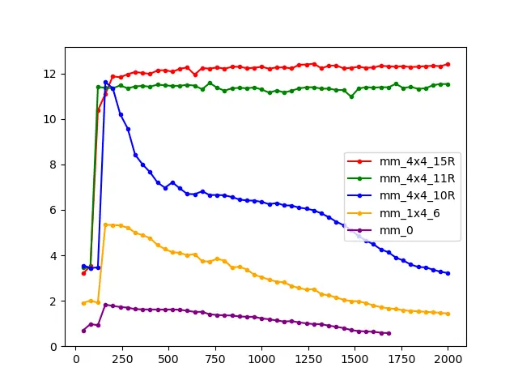

# CPU gemm优化

makefile 以下列行开头表明`MMult0.c` 中矩阵-矩阵乘法版本的性能已被测量

```
OLD  := MMult0
NEW  := MMult0
```

为了确保绘制图形时正确缩放，需要在文件 `proc_parameters.m` 中设置某些参数

`make run` 将编译、链接和执行测试驱动程序，链接到 `MMult0.c` 中的实现。性能数据保存在文件 `output_MMult0.m` 中。

`more output_MMult0.m` 这将显示输出文件 `output_MMult0.m` 的内容。

```sh
version = 'MMult0';
MY_MMult = [
40 1.163636e+00 0.000000e+00 
80 8.827586e-01 0.000000e+00 
120 1.289071e+00 0.000000e+00 
160 1.200469e+00 0.000000e+00 
200 1.195100e+00 0.000000e+00 
240 1.211038e+00 0.000000e+00 
 [ lines deleted ]
720 2.096185e-01 0.000000e+00 
760 2.116985e-01 0.000000e+00 
800 2.115609e-01 0.000000e+00 
];
```

第一列等于问题的大小（gemm的矩阵的大小，m=n=k)。第二列是该大小的gemm的性能（以 Gflops 为单位）。最后一列报告 `REF_MMult.c` 和 `MMult0.c` 的计算结果之间遇到的最大绝对差异。它应该接近 0.00000e+00

然后使用 `octave`和`PlotAll.m`绘制文件 `output_old.m` 和 `output_new.m` 中的数据相对应的图表

```
octave:1> PlotAll        % this will create the plot
```


1. A、B 和 C 对应于矩阵乘法 $C :=AB $ 中的三个矩阵, 其中 C 为结果矩阵.

2. A、B 和 C 三个矩阵的行数和列数均是 8 的倍数. 记 A 的行数为 `m`、列数为 `k`, B 的行数为 `k`、列数为 `n`.

3. 矩阵以 ｢列优先｣ 的方式进行存储。我们**通过宏定义来模拟一个列优先存储的数组**，即`A(i,j)`，该数组的底层存储方式是C语言内置的数组，即**使用一个C语言的一维数组，将矩阵中一列元素存储在该一维数组的相邻位置**

   ```c
   #define A(i,j) a[ (j)*lda + (i) ]
   #define B(i,j) b[ (j)*ldb + (i) ]
   #define C(i,j) c[ (j)*ldc + (i) ]
   ```

   其中ldx是矩阵的**leading dimension**，对于一个 MxN 的行优先矩阵，leading dimension 为 N；对于一个 MxN 的列优先矩阵，leading dimension 为 M。因此对于这里的矩阵来说，同一行的元素内存不连续，跨度为ldx，用来访问同一行的数据

### 原始程序

未经优化的 GeMM 程序如下所示, 外面两层循环遍历 C 的每一个 (i, j) 位置, 最内层循环计算相应的内积.

```C
/* Create macros so that the matrices are stored in column-major order */

#define A(i,j) a[ (j)*lda + (i) ]
#define B(i,j) b[ (j)*ldb + (i) ]
#define C(i,j) c[ (j)*ldc + (i) ]

/* Routine for computing C = A * B + C */

void MY_MMult( int m, int n, int k, double *a, int lda, 
                                    double *b, int ldb,
                                    double *c, int ldc ) {
  int i, j, p;
  for ( i=0; i<m; i++ ){        /* Loop over the rows of C */
    for ( j=0; j<n; j++ ){        /* Loop over the columns of C */
      for ( p=0; p<k; p++ ){        /* Update C( i,j ) with the inner
				       product of the ith row of A and
				       the jth column of B */
	C( i,j ) = C( i,j ) +  A( i,p ) * B( p,j );
      }
    }
  }
}
```

将 ｢一个行向量和另一个列向量的内积运算｣ 封装为 `AddDot` 函数，然后交换外面两层循环的次序, 使得先遍历 C 的第 0 列的每一行, 再遍历第 1 列的每一行，这样的话内层循环先遍历每一列，有更好的局部性，但实际性能基本不变:

```C
void MY_MMult( int m, int n, int k, double *a, int lda, 
                                    double *b, int ldb,
                                    double *c, int ldc ) {
  int i, j;
  for ( j=0; j<n; j+=1 ){        /* Loop over the columns of C */
    for ( i=0; i<m; i+=1 ){        /* Loop over the rows of C */
      // C(i,j)等于A的行向量乘以B的列向量
      // 将一个行向量与另一个列向量的内积运算封装为AddDot函数
      AddDot( k, &A( i,0 ), lda, &B( 0,j ), &C( i,j ) );
    }
  }
}
/* Create macro to let X( i ) equal the ith element of x */
#define X(i) x[ (i)*incx ]
// x是行向量，y是列向量
void AddDot( int k, double *x, int incx,  double *y, double *gamma )
{
  int p;
  // 由于X是行向量，而矩阵的存储方式又是列优先，所以访问行向量的相邻元素需要每次隔一个步长，这个步长就是矩阵的
  // lead dimension，对列优先存储来说是矩阵的行数，对行优先存储来说是矩阵的列数
  for ( p=0; p<k; p++ ){
    *gamma += X( p ) * y[ p ];     
  }
}
```

## `1x4` 版本

### 循环展开

这一优化对最外层循环进行了步长为 4 的 ｢循环展开｣，也就是在每个内层循环中，A的每个行向量要与四个B的列向量进行内积:

- 从局部来讲：原始版本的gemm是A的一行和B的一列逐元素相乘，由于是列主序，B的一列可以保存在cache中，但是A的一行则不行，读到A后面的数据就会把A前面的数据驱逐出cache，所以读到A的每一个元素都要尽可能地多用几次，所以要对B分块，读到A的每一个元素，分别与B一行的四个元素进行计算。

- 从全局来讲：原始版本的gemm对B的每一列都要对整个A进行遍历，如果B有n列，那么A就要遍历n次，如果对B分成N块，那么A就只需要遍历N次，所以矩阵乘法先对外层循环进行循环展开，这个与db的join类似，优先对外表进行分块，IO次数取决于外表的块数

```c
void MY_MMult( int m, int n, int k, double *a, int lda, 
                                    double *b, int ldb,
                                    double *c, int ldc ) {
  int i, j;
  for ( j=0; j<n; j+= 4 ){        /* Loop over the columns of C */
    for ( i=0; i<m; i+= 1 ){        /* Loop over the rows of C */
      // 对最外层循环进行了步长为4的循环展开，也就是在每个内层循环中，
      // A的每个行向量要与四个B的列向量进行内积
      AddDot1x4(k, &A(i, 0), lda, &B(0, j), ldb, &C(i, j), ldc);
    }
  }
}
void AddDot1x4(int k, double* a, int lda,
                      double* b, int ldb,
                      double* c, int ldc) {
    // 计算矩阵 C 的 C(0, 0), C(0, 1), C(0, 2) 和 C(0, 3) 四个元素.
    // 注意到在调用这个例程时, 实际传入的 c 是 C(i, j) 的地址,
    // 因此此时计算的是原矩阵的 C(i, j), C(i, j + 1), C(i, j + 2) 和 C(i, j + 3).
    AddDot(k, &A(0, 0), lda, &B(0, 0), &C(0, 0));
    AddDot(k, &A(0, 0), lda, &B(0, 1), &C(0, 1));
    AddDot(k, &A(0, 0), lda, &B(0, 2), &C(0, 2));
    AddDot(k, &A(0, 0), lda, &B(0, 3), &C(0, 3));
}
```

### 函数内联与循环合并

将 `AddDot()` 函数调用 (本质上就是个 `for` 循环) 内联到 `AddDot1x4` 中, 然后将这 4 个 `for` 循环合并, 得到:

```c
void AddDot1x4(int k, double* a, int lda,
                      double* b, int ldb,
                      double* c, int ldc) {
    for (int p = 0; p < k; p++) {
        C(0, 0) += A(0, p) * B(p, 0);
        C(0, 1) += A(0, p) * B(p, 1);
        C(0, 2) += A(0, p) * B(p, 2);
        C(0, 3) += A(0, p) * B(p, 3);
    }
}
```

**这一优化在 ｢矩阵规模较大时｣ 有明显的性能提升**. 这是因为当 `L2 Cache` 不足以缓存这些矩阵时, 之前的四次 `for` 循环中, 每次访问 `A(0, p)` 都缓存不命中, 而现在相当于重复利用了`A(0,p)`，每轮循环中, 第二三四行对 `A(0, p)` 的访问都会命中缓存.

### 缓存到寄存器

由于C(0, 0)到C(0, 3)在整个AddDot1x4函数中都要重复访问，而A(0, p)在每个循环内部要重复访问，所以可以使用寄存器缓存C和A的数据

```C
void AddDot1x4(int k, double* a, int lda, double* b, int ldb, double* c, int ldc) {
  // 由于C(0, 0)到C(0, 3)要重复访问，而A(0, p)在每个循环内部要重复访问，
  // 所以可以使用寄存器缓存C和A的数据
  register double c_00 = 0.0, c_01 = 0.0, c_02 = 0.0, c_03 = 0.0, a_0p;
  for (int p = 0; p < k; p++) {
    a_0p = A(0, p);
    // 共享了对A的访问，重复利用A
    c_00 += a_0p * B(p, 0);
    c_01 += a_0p * B(p, 1);
    c_02 += a_0p * B(p, 2);
    c_03 += a_0p * B(p, 3);
  }
  C(0,0) += c_00;
  C(0,1) += c_01;
  C(0,2) += c_02;
  C(0,3) += c_03;
}
```

为什么编译器不能自动进行这一优化?

- 首先是 Pointer Aliasing 的问题: 编译器担心 `*a` `*b` 和 `*c` 指向的内存区域存在重叠, 从而让这一优化改变程序行为. 当然事实上是不存在这个问题的. 为此可以使用 `restrict` 关键字修饰指针, 显式地告知编译器可以放心优化. 经过实测, 此时编译器就会自动为 `A(0, p)` 分配寄存器.
- 然而对 `C(0, i)` (i = 0, 1, 2, 3) 的访问仍然是每次都读写内存, 而没有分配寄存器. 为何如此不得而知

### 用指针索引数组

在C语言中，用指针索引数组通常比用下标索引数组更快。这是因为：

- **指针算术更高效**：指针在底层实现中通常是直接的内存地址，因此对指针进行算术运算（如加法或减法）比对数组下标进行索引更为高效。数组下标需要额外的乘法运算来计算偏移量，而指针的算术运算则直接基于地址的加减，节省了乘法的计算时间。
- 但是此方法在我这里对性能完全没有改变


这一轮的优化中，**有两个带来了显著性能提升, 分别是 ｢循环合并｣（相当于是分块） 和 ｢缓存到寄存器｣**.

- 前者通过融合 4 个循环的循环体, 提高了 Cache 的命中率；在矩阵尺度较大时带来了性能提升
- 后者则进一步将对 Cache 的读写优化为了对寄存器的读写.，整体获得了较大的性能提升


## `4x4` 版本

之前只是对矩阵B进行分块，接下来对矩阵A也进行分块

- 由于是列主序，所以每读到A的一个元素都会将它这一列的元素都带入cache，所以对A的每一个元素都要尽可能地用上它这一列的元素，于是这里是对4 * k的A的每一列和k * 4的B的每一行进行外积，累加在C上

将四个AddDot1x4内联到AddDot4x4中。相当于是四个长为K的行向量乘以四个长为K的列向量，对k进行遍历，那么在一个循环内部就是长为四的列向量外积长为四的行向量，得到C中4 * 4的一块，然后每个循环都对这个4 * 4的块进行累加

```C
void MY_MMult( int m, int n, int k, double *a, int lda, 
                                    double *b, int ldb,
                                    double *c, int ldc )
{
  int i, j;

  for ( j=0; j<n; j+= 4 ){        /* Loop over the columns of C */
    for ( i=0; i<m; i+= 4 ){        /* Loop over the rows of C */
      // 对最外层循环进行了步长为4的循环展开，也就是在每个内层循环中，
      // A的每个行向量要与四个B的列向量进行内积
      AddDot4x4(k, &A(i, 0), lda, &B(0, j), ldb, &C(i, j), ldc);
    }
  }
}
// 将四个AddDot1x4内联到AddDot4x4中。相当于是四个长为K的行向量乘以四个长为K的列向量，对k进行遍历，
// 那么在一个循环内部就是长为四的列向量外积长为四的行向量，得到C中4 * 4的一块
// 然后每个循环都对这个4 * 4的块进行累加
void AddDot4x4(int k, double* a, int lda, double* b, int ldb, double* c, int ldc) {
  register double c_00 = 0.0, c_01 = 0.0, c_02 = 0.0, c_03 = 0.0, a_0p;
  register double c_10 = 0.0, c_11 = 0.0, c_12 = 0.0, c_13 = 0.0, a_1p;
  register double c_20 = 0.0, c_21 = 0.0, c_22 = 0.0, c_23 = 0.0, a_2p;
  register double c_30 = 0.0, c_31 = 0.0, c_32 = 0.0, c_33 = 0.0, a_3p;

  for (int p = 0; p < k; p++) {
    a_0p = A(0, p);
    // 共享了对A的访问，重复利用A
    c_00 += a_0p * B(p, 0);
    c_01 += a_0p * B(p, 1);
    c_02 += a_0p * B(p, 2);
    c_03 += a_0p * B(p, 3);

    a_1p = A(1, p);
    c_10 += a_1p * B(p, 0);
    c_11 += a_1p * B(p, 1);
    c_12 += a_1p * B(p, 2);
    c_13 += a_1p * B(p, 3);

    a_2p = A(2, p);
    c_20 += a_2p * B(p, 0);
    c_21 += a_2p * B(p, 1);
    c_22 += a_2p * B(p, 2);
    c_23 += a_2p * B(p, 3);

    a_3p = A(3, p);
    c_30 += a_3p * B(p, 0);
    c_31 += a_3p * B(p, 1);
    c_32 += a_3p * B(p, 2);
    c_33 += a_3p * B(p, 3);
  }
  C(0,0) += c_00;
  C(0,1) += c_01;
  C(0,2) += c_02;
  C(0,3) += c_03;

  C(1,0) += c_10;
  C(1,1) += c_11;
  C(1,2) += c_12;
  C(1,3) += c_13;

  C(2,0) += c_20;
  C(2,1) += c_21;
  C(2,2) += c_22;
  C(2,3) += c_23;

  C(3,0) += c_30;
  C(3,1) += c_31;
  C(3,2) += c_32;
  C(3,3) += c_33;
}
```

### 向量化

AddDot4x4函数的循环中，就是长为四的列向量外积长为四的行向量，列向量中的四个元素都与行向量中的某一个元素相乘，得到C中的一个列向量。最后得到C中4 * 4的一块，然后每个循环都对这个4 * 4的块进行累加


因此可以使用SIMD指令。如果使用SSE指令，它只有128位，所以只能容纳两个元素。那么在一个循环中，可以把A的四个元素读取到两个SSE寄存器中，B中的四个元素广播到四个SSE寄存器中，而结果有16个元素，所以需要用八个SSE寄存器来暂存C中4 * 4的结果


1. 在 C 处开辟 8 个向量寄存器 (`vreg`) 用于累加 16 个 `double` 值. (对应图中最右侧的 8 个 2 维向量).

2. 在每轮循环中,

3. 使用 `_mm_load_pd` 从内存中读取 A 的 4 个 `double`, 存储到 2 个 `vreg` 中. (对应图中左侧两个灰色向量).

4. 使用 `_mm_loaddup_pd` 从内存中读取 B 的 4 个 `double`, 复制并存储到 4 个 `vreg` 中. (对应图中下方 4 个 2 维向量).

5. 使用 `_mm_mul_pd` (或 C 运算符 `*`), 将 A 与 B 的对应 `vreg` 相乘.

6. 使用 `_mm_add_pd` (或 C 运算符 `+`), 将上一步得到的结果累加到 C 中相应 `vreg` 中.

7. 循环结束后, 将 C 的 8 个 `vreg` 中的值取出, 然后将得到的 16 个 `double` 累加回内存.

8. 注意，使用simd时要将load的数组起始地址与cache line的size（也就是64字节）对齐，这样load或store的速度要远快于不对齐的数组

   

```C
void MY_MMult( int m, int n, int k, double *a, int lda, 
                                    double *b, int ldb,
                                    double *c, int ldc )
{
  int i, j;
  for ( j=0; j<n; j+= 4 ){        /* Loop over the columns of C */
    for ( i=0; i<m; i+= 4 ){        /* Loop over the rows of C */
      // 对最外层循环进行了步长为4的循环展开，也就是在每个内层循环中，
      // A的每个行向量要与四个B的列向量进行内积
      AddDot4x4(k, &A(i, 0), lda, &B(0, j), ldb, &C(i, j), ldc);
    }
  }
}
void AddDot4x4(int k, double* a, int lda, double* b, int ldb, double* c, int ldc) {
  // C
  __m128d c00_10 = _mm_setzero_pd(), c20_30 = _mm_setzero_pd(), 
          c01_11 = _mm_setzero_pd(), c21_31 = _mm_setzero_pd(), 
          c02_12 = _mm_setzero_pd(), c22_32 = _mm_setzero_pd(), 
          c03_13 = _mm_setzero_pd(), c23_33 = _mm_setzero_pd();
  // B
  __m128d bp0, bp1, bp2, bp3;
  // A
  __m128d a0p_1p, a2p_3p;
  for (int p = 0; p < k; p++) {
    // a_0p = A(0, p);
    // a_1p = A(1, p);
    // a_2p = A(2, p);
    // a_3p = A(3, p);
    a0p_1p = _mm_load_pd(&A(0, p));
    a2p_3p = _mm_load_pd(&A(2, p));
    
    bp0 = _mm_loaddup_pd(&B(p, 0));
    bp1 = _mm_loaddup_pd(&B(p, 1));
    bp2 = _mm_loaddup_pd(&B(p, 2));
    bp3 = _mm_loaddup_pd(&B(p, 3));
    // // 共享了对A的访问，重复利用A

    c00_10 += a0p_1p * bp0;
    c20_30 += a2p_3p * bp0;
    c01_11 += a0p_1p * bp1;
    c21_31 += a2p_3p * bp1;
    c02_12 += a0p_1p * bp2;
    c22_32 += a2p_3p * bp2;
    c03_13 += a0p_1p * bp3;
    c23_33 += a2p_3p * bp3;
  }
  // _mm_store_pd(&C(0, 0), c00_10);
  // _mm_store_pd(&C(2, 0), c20_30);
  // _mm_store_pd(&C(0, 1), c01_11);
  // _mm_store_pd(&C(2, 1), c21_31);
  // _mm_store_pd(&C(0, 2), c02_12);
  // _mm_store_pd(&C(2, 2), c22_32);
  // _mm_store_pd(&C(0, 3), c03_13);
  // _mm_store_pd(&C(2, 3), c23_33);
  // 注意，不能使用上面的写法！因为每个AddDot4*4函数是对C中的4 * 4的方块进行累加，
  // 而上面的写法是直接将其覆盖。而simd指令集没有累加的指令，所以我们只能先将向量寄存器中
  // 的数值保存到数组中，然后再将数组中的值累加到C中
  // 并且由于store指令要求16字节对齐，所以声明临时数组时要对齐
    double C_incr[16] __attribute__((aligned(64)));
    _mm_store_pd(C_incr + 0, c00_10);
    _mm_store_pd(C_incr + 2, c20_30);
    _mm_store_pd(C_incr + 4, c01_11);
    _mm_store_pd(C_incr + 6, c21_31);
    _mm_store_pd(C_incr + 8, c02_12);
    _mm_store_pd(C_incr + 10,c22_32);
    _mm_store_pd(C_incr + 12,c03_13);
    _mm_store_pd(C_incr + 14,c23_33);

    for (int j = 0; j < 4; j++) {
        C(0, j) += C_incr[j * 4 + 0];
        C(1, j) += C_incr[j * 4 + 1];
        C(2, j) += C_incr[j * 4 + 2];
        C(3, j) += C_incr[j * 4 + 3];
    }
}
```

所以本质上来说，之前分的4 * 4的小块是为了使用SIMD指令

使用了SIMD之后性能大幅度提升，但是随着矩阵规模继续增加, 性能急剧衰减。


出现这种情况也是因为缓存的问题，需要将矩阵分块，在每个块内部用AddDot4x4

具体而言, 分块方案是:

- 先对 A 横着切, 使得每块最大高度为 `mc`;
- 再对 A 竖着切, 使得每块最大宽度为 `kc`;
- 最后相应地: 将 B 横着切, 使得每块的最大高度为 `kc`; 对 C 横着切, 使得每块最大高度为 `mc`.


将之前的矩阵乘法的双层循环封装在 `InnerKernel` 函数中, 用于执行子矩阵 (矩阵分块) 之间的乘法:

```c
void MY_MMult( int m, int n, int k, double *a, int lda, 
                                    double *b, int ldb,
                                    double *c, int ldc )
{
  int kc = 128, mc = 256;
  for (int p = 0; p < k; p += kc) {
    int pb = (k - p < kc) ? k - p : kc;
    for (int i = 0; i < m; i += mc) {
      int ib = (m - i < mc) ? m - i : mc;
      InnerKernel(ib, n, pb, &A(i, p), lda, &B(p, 0), ldb, &C(i, 0), ldc);
    }
  }
}
void InnerKernel(int m, int n, int k, double *a, int lda, double *b, int ldb, double *c, int ldc) {
  double packedA[m * k];
  double packedB[k * n];
  for (int j=0; j<n; j+= 4 ){        /* Loop over the columns of C */
    PackMatrixB(k, &B(0, j), ldb, &packedB[j * k]);
    for (int i=0; i<m; i+= 4 ){        /* Loop over the rows of C */
      if (j == 0) {
        PackMatrixA(k, &A(i, 0), lda, &packedA[i * k]);
      }
      // 对最外层循环进行了步长为4的循环展开，也就是在每个内层循环中，
      // A的每个行向量要与四个B的列向量进行内积
      AddDot4x4(k, &packedA[i * k], lda, &packedB[j *k], ldb, &C(i, j), ldc);
    }
  }
}
void PackMatrixA(int k, double *a, int lda, double *dest) {
  // 将4*k的矩阵（k个列之间内存不连续）打包成k个列之间内存连续存储
  for (int j = 0; j < k; j++) {
    *dest++ = A(0, j);
    *dest++ = A(1, j);
    *dest++ = A(2, j);
    *dest++ = A(3, j);
  }
}
void PackMatrixB(int k, double *b, int ldb, double *dest) {
  // 将k*4的矩阵（k个行之间内存不连续）打包成k个行之间内存连续存储
  for (int i = 0; i < k; i++) {
    *dest++ = B(i, 0);
    *dest++ = B(i, 1);
    *dest++ = B(i, 2);
    *dest++ = B(i, 3);
  }
}
```

这里取超参数 `mc = 256`, `kc = 128` 作为分块大小, 测试结果如下:


矩阵分块乘的方法成功**在大尺寸下保持了小尺寸时获得的最高性能**.

### 矩阵打包

在每次的`AddDot4x4`中，矩阵A是4 * k，矩阵B是k * 4，前者在一个循环中访问的是一列，虽然数据是连续的，但是k个列之间的内存不连续，如果矩阵很大，那么列之间可能会隔很远，导致缓存失效；而后者在循环中访问的是一行，访存模式更加糟糕。

我们希望在AddDot4x4中A和B的内存是连续的，为此可以考虑在调用 `AddDot4x4` 计算前首先对作为参数的子矩阵进行 ｢打包｣: 开辟一块连续的内存, 将这 `4 × kc` 个元素复制到这片内存, 然后把这片内存作为参数传给 `AddDot4x4`. 如此, 在 `AddDot4x4` 中对子矩阵的访问模式就变成了连续的顺序读取, 对 Cache 更为友好.

```c
void InnerKernel(int m, int n, int k, double *a, int lda, double *b, int ldb, double *c, int ldc) {
  double packedA[m * k];
  double packedB[k * n];
  for (int j=0; j<n; j+= 4 ){        /* Loop over the columns of C */
    PackMatrixB(k, &B(0, j), ldb, &packedB[j * k]);
    for (int i=0; i<m; i+= 4 ){        /* Loop over the rows of C */
      if (j == 0) {
        PackMatrixA(k, &A(i, 0), lda, &packedA[i * k]);
      }
      // 对最外层循环进行了步长为4的循环展开，也就是在每个内层循环中，
      // A的每个行向量要与四个B的列向量进行内积
      AddDot4x4(k, &packedA[i * k], lda, &packedB[j *k], ldb, &C(i, j), ldc);
    }
  }
}
void PackMatrixA(int k, double *a, int lda, double *dest) {
  // 将4*k的矩阵（k个列之间内存不连续）打包成k个列之间内存连续存储
  for (int j = 0; j < k; j++) {
    *dest++ = A(0, j);
    *dest++ = A(1, j);
    *dest++ = A(2, j);
    *dest++ = A(3, j);
  }
}
void PackMatrixB(int k, double *b, int ldb, double *dest) {
  // 将k*4的矩阵（k个行之间内存不连续）打包成k个行之间内存连续存储
  for (int i = 0; i < k; i++) {
    *dest++ = B(i, 0);
    *dest++ = B(i, 1);
    *dest++ = B(i, 2);
    *dest++ = B(i, 3);
  }
}
```

AddDot4x4也可以改为直接对a和b顺序访问：

```C
void AddDot4x4(int k, double* a, int lda, double* b, int ldb, double* c, int ldc) {
  // register double c_00 = 0.0, c_01 = 0.0, c_02 = 0.0, c_03 = 0.0, a_0p;
  // register double c_10 = 0.0, c_11 = 0.0, c_12 = 0.0, c_13 = 0.0, a_1p;
  // register double c_20 = 0.0, c_21 = 0.0, c_22 = 0.0, c_23 = 0.0, a_2p;
  // register double c_30 = 0.0, c_31 = 0.0, c_32 = 0.0, c_33 = 0.0, a_3p;

  // C
  __m128d c00_10 = _mm_setzero_pd(), c20_30 = _mm_setzero_pd(), 
          c01_11 = _mm_setzero_pd(), c21_31 = _mm_setzero_pd(), 
          c02_12 = _mm_setzero_pd(), c22_32 = _mm_setzero_pd(), 
          c03_13 = _mm_setzero_pd(), c23_33 = _mm_setzero_pd();
  // B
  __m128d bp0, bp1, bp2, bp3;
  // A
  __m128d a0p_1p, a2p_3p;
  for (int p = 0; p < k; p++) {
    // a_0p = A(0, p);
    // a_1p = A(1, p);
    // a_2p = A(2, p);
    // a_3p = A(3, p);
    a0p_1p = _mm_load_pd(a);
    a2p_3p = _mm_load_pd(a + 2);
    a += 4;
    
    bp0 = _mm_loaddup_pd(b);
    bp1 = _mm_loaddup_pd(b + 1);
    bp2 = _mm_loaddup_pd(b + 2);
    bp3 = _mm_loaddup_pd(b + 3);
    b += 4;
    // // 共享了对A的访问，重复利用A

    c00_10 += a0p_1p * bp0;
    c20_30 += a2p_3p * bp0;
    c01_11 += a0p_1p * bp1;
    c21_31 += a2p_3p * bp1;
    c02_12 += a0p_1p * bp2;
    c22_32 += a2p_3p * bp2;
    c03_13 += a0p_1p * bp3;
    c23_33 += a2p_3p * bp3;
  }
    double C_incr[16] __attribute__((aligned(64)));
    _mm_store_pd(C_incr + 0, c00_10);
    _mm_store_pd(C_incr + 2, c20_30);
    _mm_store_pd(C_incr + 4, c01_11);
    _mm_store_pd(C_incr + 6, c21_31);
    _mm_store_pd(C_incr + 8, c02_12);
    _mm_store_pd(C_incr + 10,c22_32);
    _mm_store_pd(C_incr + 12,c03_13);
    _mm_store_pd(C_incr + 14,c23_33);

    for (int j = 0; j < 4; j++) {
        C(0, j) += C_incr[j * 4 + 0];
        C(1, j) += C_incr[j * 4 + 1];
        C(2, j) += C_incr[j * 4 + 2];
        C(3, j) += C_incr[j * 4 + 3];
    }
}
```


总的来看，




## 8x8版本

使用avx512指令集，将micro kernel大小改成8*8

```c++
#define kc 128
#define mc 256
#define n_max 2000
void MY_MMult( int m, int n, int k, double *a, int lda, 
                                    double *b, int ldb,
                                    double *c, int ldc )
{
  for (int p = 0; p < k; p += kc) {
    int pb = (k - p < kc) ? k - p : kc;
    for (int i = 0; i < m; i += mc) {
      int ib = (m - i < mc) ? m - i : mc;
      // 由于A的多个分块都与B的同一个分块相乘，所以B的每个分块只需要在第一次运算时被pack
      InnerKernel(ib, n, pb, &A(i, p), lda, &B(p, 0), ldb, &C(i, 0), ldc, (i == 0));
    }
  }
}
void InnerKernel(int m, int n, int k, double *a, int lda, double *b, int ldb, double *c, int ldc, int need_pack_b) {
  // 由于需要从A中load8个数据，所以A数组需要对齐；而B数组只需要广播，所以B数组不需要对齐
  double packedA[m * k] __attribute__((aligned(64)));
  static double packedB[kc * n_max];
  for (int j=0; j<n; j += 8){        /* Loop over the columns of C */
    if (need_pack_b) {
      PackMatrixB(k, &B(0, j), ldb, &packedB[j * k]);
    }
    for (int i=0; i<m; i += 8){        /* Loop over the rows of C */
      if (j == 0) {
        PackMatrixA(k, &A(i, 0), lda, &packedA[i * k]);
      }
      // 对最外层循环进行了步长为4的循环展开，也就是在每个内层循环中，
      // A的每个行向量要与四个B的列向量进行内积
      AddDot8x8(k, &packedA[i * k], lda, &packedB[j *k], ldb, &C(i, j), ldc);
    }
  }
}
void PackMatrixA(int k, double *a, int lda, double *dest) {
  // 将4*k的矩阵（k个列之间内存不连续）打包成k个列之间内存连续存储
  for (int j = 0; j < k; j++) {
    double* a_ptr = &A(0, j);
    *(dest + 0) = *(a_ptr + 0);
    *(dest + 1) = *(a_ptr + 1);
    *(dest + 2) = *(a_ptr + 2);
    *(dest + 3) = *(a_ptr + 3);
    *(dest + 4) = *(a_ptr + 4);
    *(dest + 5) = *(a_ptr + 5);
    *(dest + 6) = *(a_ptr + 6);
    *(dest + 7) = *(a_ptr + 7);
    dest += 8;
  }
}
void PackMatrixB(int k, double *b, int ldb, double *dest) {
  double* b_i0_ptr = &B(0, 0), 
        * b_i1_ptr = &B(0, 1),
        * b_i2_ptr = &B(0, 2),
        * b_i3_ptr = &B(0, 3),
        * b_i4_ptr = &B(0, 4),
        * b_i5_ptr = &B(0, 5),
        * b_i6_ptr = &B(0, 6),
        * b_i7_ptr = &B(0, 7);
  // 将k*4的矩阵（k个行之间内存不连续）打包成k个行之间内存连续存储
  for (int i = 0; i < k; i++) {
    *(dest+0) = *b_i0_ptr++;
    *(dest+1) = *b_i1_ptr++;
    *(dest+2) = *b_i2_ptr++;
    *(dest+3) = *b_i3_ptr++;
    *(dest+4) = *b_i4_ptr++;
    *(dest+5) = *b_i5_ptr++;
    *(dest+6) = *b_i6_ptr++;
    *(dest+7) = *b_i7_ptr++;
    dest += 8;
  }
}
void AddDot8x8(int k, double* a, int lda, double* b, int ldb, double* c, int ldc) {
  // C
  __m512d c00_to_70 = _mm512_setzero_pd(),
          c01_to_71 = _mm512_setzero_pd(),
          c02_to_72 = _mm512_setzero_pd(),
          c03_to_73 = _mm512_setzero_pd(),
          c04_to_74 = _mm512_setzero_pd(),
          c05_to_75 = _mm512_setzero_pd(),
          c06_to_76 = _mm512_setzero_pd(),
          c07_to_77 = _mm512_setzero_pd();
          
  // B
  __m512d bp0, bp1, bp2, bp3, bp4, bp5, bp6, bp7;
  // A
  __m512d a0p_to_7p;
  for (int p = 0; p < k; p++) {
    a0p_to_7p = _mm512_load_pd(a);
    a += 8;
    
    bp0 = _mm512_set1_pd(*b);
    bp1 = _mm512_set1_pd(*(b + 1));
    bp2 = _mm512_set1_pd(*(b + 2));
    bp3 = _mm512_set1_pd(*(b + 3));
    bp4 = _mm512_set1_pd(*(b + 4));
    bp5 = _mm512_set1_pd(*(b + 5));
    bp6 = _mm512_set1_pd(*(b + 6));
    bp7 = _mm512_set1_pd(*(b + 7));
    b += 8;
    // // 共享了对A的访问，重复利用A
    c00_to_70 += a0p_to_7p * bp0;
    c01_to_71 += a0p_to_7p * bp1;
    c02_to_72 += a0p_to_7p * bp2;
    c03_to_73 += a0p_to_7p * bp3;
    c04_to_74 += a0p_to_7p * bp4;
    c05_to_75 += a0p_to_7p * bp5;
    c06_to_76 += a0p_to_7p * bp6;
    c07_to_77 += a0p_to_7p * bp7;
  }
    double C_incr[64] __attribute__((aligned(64)));
    _mm512_store_pd(C_incr + 0, c00_to_70);
    _mm512_store_pd(C_incr + 8, c01_to_71);
    _mm512_store_pd(C_incr + 16, c02_to_72);
    _mm512_store_pd(C_incr + 24, c03_to_73);
    _mm512_store_pd(C_incr + 32, c04_to_74);
    _mm512_store_pd(C_incr + 40, c05_to_75);
    _mm512_store_pd(C_incr + 48, c06_to_76);
    _mm512_store_pd(C_incr + 56, c07_to_77);

    for (int j = 0; j < 8; j++) {
        C(0, j) += C_incr[j * 8 + 0];
        C(1, j) += C_incr[j * 8 + 1];
        C(2, j) += C_incr[j * 8 + 2];
        C(3, j) += C_incr[j * 8 + 3];
        C(4, j) += C_incr[j * 8 + 4];
        C(5, j) += C_incr[j * 8 + 5];
        C(6, j) += C_incr[j * 8 + 6];
        C(7, j) += C_incr[j * 8 + 7];
    }
}
```


对于8*8的微内核，矩阵C使用8个zmm寄存器，矩阵B也使用8个zmm寄存器，矩阵A使用1个zmm寄存器，也就是总共使用了17个寄存器，而axv512下共有32zmm寄存器，所以为了利用更多的寄存器，考虑使用更大的微内核。

对于16 * 8的微内核要使用2 + 8 + 16 = 26个寄存器，24 * 8的微内核要使用3 + 8 + 24 = 35个寄存器，显然后者的利用率更高

## 24x8版本

```c++
void MY_MMult( int m, int n, int k, double *a, int lda, 
                                    double *b, int ldb,
                                    double *c, int ldc )
{
  for (int p = 0; p < k; p += kc) {
    int pb = (k - p < kc) ? k - p : kc;
    for (int i = 0; i < m; i += mc) {
      int ib = (m - i < mc) ? m - i : mc;
      // 由于A的多个分块都与B的同一个分块相乘，所以B的每个分块只需要在第一次运算时被pack
      InnerKernel(ib, n, pb, &A(i, p), lda, &B(p, 0), ldb, &C(i, 0), ldc, (i == 0));
    }
  }
}
void InnerKernel(int m, int n, int k, double *a, int lda, double *b, int ldb, double *c, int ldc, int need_pack_b) {
  // 由于需要从A中load8个数据，所以A数组需要对齐；而B数组只需要广播，所以B数组不需要对齐
  double packedA[m * k] __attribute__((aligned(64)));
  static double packedB[kc * n_max];
  for (int j=0; j<n; j += 8){        /* Loop over the columns of C */
    if (need_pack_b) {
      PackMatrixB(k, &B(0, j), ldb, &packedB[j * k]);
    }
    for (int i=0; i<m; i += 24){        /* Loop over the rows of C */
      if (j == 0) {
        PackMatrixA(k, &A(i, 0), lda, &packedA[i * k]);
      }
      // 对最外层循环进行了步长为4的循环展开，也就是在每个内层循环中，
      // A的每个行向量要与四个B的列向量进行内积
      AddDot24x8(k, &packedA[i * k], lda, &packedB[j *k], ldb, &C(i, j), ldc);
    }
  }
}
void PackMatrixA(int k, double *a, int lda, double *dest) {
  // 将24*k的矩阵（k个列之间内存不连续）打包成k个列之间内存连续存储
  for (int j = 0; j < k; j++) {
    double* a_ptr = &A(0, j);
    *(dest + 0) = *(a_ptr + 0);
    *(dest + 1) = *(a_ptr + 1);
    *(dest + 2) = *(a_ptr + 2);
    *(dest + 3) = *(a_ptr + 3);
    *(dest + 4) = *(a_ptr + 4);
    *(dest + 5) = *(a_ptr + 5);
    *(dest + 6) = *(a_ptr + 6);
    *(dest + 7) = *(a_ptr + 7);
    *(dest + 8) = *(a_ptr + 8);
    *(dest + 9) = *(a_ptr + 9);
    *(dest + 10) = *(a_ptr + 10);
    *(dest + 11) = *(a_ptr + 11);
    *(dest + 12) = *(a_ptr + 12);
    *(dest + 13) = *(a_ptr + 13);
    *(dest + 14) = *(a_ptr + 14);
    *(dest + 15) = *(a_ptr + 15);
    *(dest + 16) = *(a_ptr + 16);
    *(dest + 17) = *(a_ptr + 17);
    *(dest + 18) = *(a_ptr + 18);
    *(dest + 19) = *(a_ptr + 19);
    *(dest + 20) = *(a_ptr + 20);
    *(dest + 21) = *(a_ptr + 21);
    *(dest + 22) = *(a_ptr + 22);
    *(dest + 23) = *(a_ptr + 23);
    dest += 24;
  }
}
void PackMatrixB(int k, double *b, int ldb, double *dest) {
  double* b_i0_ptr = &B(0, 0), 
        * b_i1_ptr = &B(0, 1),
        * b_i2_ptr = &B(0, 2),
        * b_i3_ptr = &B(0, 3),
        * b_i4_ptr = &B(0, 4),
        * b_i5_ptr = &B(0, 5),
        * b_i6_ptr = &B(0, 6),
        * b_i7_ptr = &B(0, 7);
  // 将k*8的矩阵（k个行之间内存不连续）打包成k个行之间内存连续存储
  for (int i = 0; i < k; i++) {
    *(dest+0) = *b_i0_ptr++;
    *(dest+1) = *b_i1_ptr++;
    *(dest+2) = *b_i2_ptr++;
    *(dest+3) = *b_i3_ptr++;
    *(dest+4) = *b_i4_ptr++;
    *(dest+5) = *b_i5_ptr++;
    *(dest+6) = *b_i6_ptr++;
    *(dest+7) = *b_i7_ptr++;
    dest += 8;
  }
}
void AddDot24x8(int k, double* a, int lda, double* b, int ldb, double* c, int ldc) {
  // C
  __m512d c00_to_70 = _mm512_setzero_pd(),
          c80_to_150 = _mm512_setzero_pd(),
          c160_to_230 = _mm512_setzero_pd(),

          c01_to_71 = _mm512_setzero_pd(),
          c81_to_151 = _mm512_setzero_pd(),
          c161_to_231 = _mm512_setzero_pd(),

          c02_to_72 = _mm512_setzero_pd(),
          c82_to_152 = _mm512_setzero_pd(),
          c162_to_232 = _mm512_setzero_pd(),

          c03_to_73 = _mm512_setzero_pd(),
          c83_to_153 = _mm512_setzero_pd(),
          c163_to_233 = _mm512_setzero_pd(),

          c04_to_74 = _mm512_setzero_pd(),
          c84_to_154 = _mm512_setzero_pd(),
          c164_to_234 = _mm512_setzero_pd(),

          c05_to_75 = _mm512_setzero_pd(),
          c85_to_155 = _mm512_setzero_pd(),
          c165_to_235 = _mm512_setzero_pd(),

          c06_to_76 = _mm512_setzero_pd(),
          c86_to_156 = _mm512_setzero_pd(),
          c166_to_236 = _mm512_setzero_pd(),

          c07_to_77 = _mm512_setzero_pd(),
          c87_to_157 = _mm512_setzero_pd(),
          c167_to_237 = _mm512_setzero_pd();
          
  // B
  __m512d bp0, bp1, bp2, bp3, bp4, bp5, bp6, bp7;
  // A
  __m512d a0p_to_7p, a8p_to_15p, a16p_to_23p;
  for (int p = 0; p < k; p++) {
    a0p_to_7p = _mm512_load_pd(a);
    a8p_to_15p = _mm512_load_pd(a + 8);
    a16p_to_23p = _mm512_load_pd(a + 16);
    a += 24;
    
    bp0 = _mm512_set1_pd(*b);
    bp1 = _mm512_set1_pd(*(b + 1));
    bp2 = _mm512_set1_pd(*(b + 2));
    bp3 = _mm512_set1_pd(*(b + 3));
    bp4 = _mm512_set1_pd(*(b + 4));
    bp5 = _mm512_set1_pd(*(b + 5));
    bp6 = _mm512_set1_pd(*(b + 6));
    bp7 = _mm512_set1_pd(*(b + 7));
    b += 8;

    c00_to_70 += a0p_to_7p * bp0;
    c80_to_150 += a8p_to_15p * bp0;
    c160_to_230 += a16p_to_23p * bp0;

    c01_to_71 += a0p_to_7p * bp1;
    c81_to_151 += a8p_to_15p * bp1;
    c161_to_231 += a16p_to_23p * bp1;

    c02_to_72 += a0p_to_7p * bp2;
    c82_to_152 += a8p_to_15p * bp2;
    c162_to_232 += a16p_to_23p * bp2;

    c03_to_73 += a0p_to_7p * bp3;
    c83_to_153 += a8p_to_15p * bp3;
    c163_to_233 += a16p_to_23p * bp3;

    c04_to_74 += a0p_to_7p * bp4;
    c84_to_154 += a8p_to_15p * bp4;
    c164_to_234 += a16p_to_23p * bp4;

    c05_to_75 += a0p_to_7p * bp5;
    c85_to_155 += a8p_to_15p * bp5;
    c165_to_235 += a16p_to_23p * bp5;

    c06_to_76 += a0p_to_7p * bp6;
    c86_to_156 += a8p_to_15p * bp6;
    c166_to_236 += a16p_to_23p * bp6;

    c07_to_77 += a0p_to_7p * bp7;
    c87_to_157 += a8p_to_15p * bp7;
    c167_to_237 += a16p_to_23p * bp7;

  }
    double C_incr[192] __attribute__((aligned(64)));
    _mm512_store_pd(C_incr + 0, c00_to_70);
    _mm512_store_pd(C_incr + 8, c80_to_150);
    _mm512_store_pd(C_incr + 16, c160_to_230);

    _mm512_store_pd(C_incr + 24, c01_to_71);
    _mm512_store_pd(C_incr + 32, c81_to_151);
    _mm512_store_pd(C_incr + 40, c161_to_231);

    _mm512_store_pd(C_incr + 48, c02_to_72);
    _mm512_store_pd(C_incr + 56, c82_to_152);
    _mm512_store_pd(C_incr + 64, c162_to_232);

    _mm512_store_pd(C_incr + 72, c03_to_73);
    _mm512_store_pd(C_incr + 80, c83_to_153);
    _mm512_store_pd(C_incr + 88, c163_to_233);

    _mm512_store_pd(C_incr + 96, c04_to_74);
    _mm512_store_pd(C_incr + 104, c84_to_154);
    _mm512_store_pd(C_incr + 112, c164_to_234);

    _mm512_store_pd(C_incr + 120, c05_to_75);
    _mm512_store_pd(C_incr + 128, c85_to_155);
    _mm512_store_pd(C_incr + 136, c165_to_235);

    _mm512_store_pd(C_incr + 144, c06_to_76);
    _mm512_store_pd(C_incr + 152, c86_to_156);
    _mm512_store_pd(C_incr + 160, c166_to_236);

    _mm512_store_pd(C_incr + 168, c07_to_77);
    _mm512_store_pd(C_incr + 176, c87_to_157);
    _mm512_store_pd(C_incr + 184, c167_to_237);

    for (int j = 0; j < 8; j++) {
        C(0, j) += C_incr[j * 24 + 0];
        C(1, j) += C_incr[j * 24 + 1];
        C(2, j) += C_incr[j * 24 + 2];
        C(3, j) += C_incr[j * 24 + 3];
        C(4, j) += C_incr[j * 24 + 4];
        C(5, j) += C_incr[j * 24 + 5];
        C(6, j) += C_incr[j * 24 + 6];
        C(7, j) += C_incr[j * 24 + 7];
        C(8, j) += C_incr[j * 24 + 8];
        C(9, j) += C_incr[j * 24 + 9];
        C(10, j) += C_incr[j * 24 + 10];
        C(11, j) += C_incr[j * 24 + 11];
        C(12, j) += C_incr[j * 24 + 12];
        C(13, j) += C_incr[j * 24 + 13];
        C(14, j) += C_incr[j * 24 + 14];
        C(15, j) += C_incr[j * 24 + 15];
        C(16, j) += C_incr[j * 24 + 16];
        C(17, j) += C_incr[j * 24 + 17];
        C(18, j) += C_incr[j * 24 + 18];
        C(19, j) += C_incr[j * 24 + 19];
        C(20, j) += C_incr[j * 24 + 20];
        C(21, j) += C_incr[j * 24 + 21];
        C(22, j) += C_incr[j * 24 + 22];
        C(23, j) += C_incr[j * 24 + 23];
    }
}
```

O0级别的结果：


O2的结果：


### 复用矩阵B的寄存器

```
  for (int p = 0; p < k; p++) {
    a0p_to_7p = _mm512_load_pd(a);
    a8p_to_15p = _mm512_load_pd(a + 8);
    a16p_to_23p = _mm512_load_pd(a + 16);
    a += 24;
    
    bp0 = _mm512_set1_pd(*b);
    bp1 = _mm512_set1_pd(*(b + 1));
    bp2 = _mm512_set1_pd(*(b + 2));
    bp3 = _mm512_set1_pd(*(b + 3));
    bp4 = _mm512_set1_pd(*(b + 4));
    bp5 = _mm512_set1_pd(*(b + 5));
    bp6 = _mm512_set1_pd(*(b + 6));
    bp7 = _mm512_set1_pd(*(b + 7));
    b += 8;

    c00_to_70 += a0p_to_7p * bp0;
    c80_to_150 += a8p_to_15p * bp0;
    c160_to_230 += a16p_to_23p * bp0;

    c01_to_71 += a0p_to_7p * bp1;
    c81_to_151 += a8p_to_15p * bp1;
    c161_to_231 += a16p_to_23p * bp1;

    c02_to_72 += a0p_to_7p * bp2;
    c82_to_152 += a8p_to_15p * bp2;
    c162_to_232 += a16p_to_23p * bp2;

    c03_to_73 += a0p_to_7p * bp3;
    c83_to_153 += a8p_to_15p * bp3;
    c163_to_233 += a16p_to_23p * bp3;

    c04_to_74 += a0p_to_7p * bp4;
    c84_to_154 += a8p_to_15p * bp4;
    c164_to_234 += a16p_to_23p * bp4;

    c05_to_75 += a0p_to_7p * bp5;
    c85_to_155 += a8p_to_15p * bp5;
    c165_to_235 += a16p_to_23p * bp5;

    c06_to_76 += a0p_to_7p * bp6;
    c86_to_156 += a8p_to_15p * bp6;
    c166_to_236 += a16p_to_23p * bp6;

    c07_to_77 += a0p_to_7p * bp7;
    c87_to_157 += a8p_to_15p * bp7;
    c167_to_237 += a16p_to_23p * bp7;
  }
```

根据上面的代码的A*B的过程可以发现，每三行都对应于同一个 B 的寄存器, 因此理论上只用 1 个寄存器然后复用 8 次就行（为什么只能复用B？首先C是不能复用的，因为整个C是一次性计算好的；而A和B中只能选择一个来复用，而B占用了8个寄存器，复用它显然收益更大）, 这样就只需要 3+1+24 = 28 个寄存器

```c++
  // B
  __m512d bp0;
  // A
  __m512d a0p_to_7p, a8p_to_15p, a16p_to_23p;
  for (int p = 0; p < k; p++) {
    // a_0p = A(0, p);
    // a_1p = A(1, p);
    // a_2p = A(2, p);
    // a_3p = A(3, p);
    a0p_to_7p = _mm512_load_pd(a);
    a8p_to_15p = _mm512_load_pd(a + 8);
    a16p_to_23p = _mm512_load_pd(a + 16);
    a += 24;

    bp0 = _mm512_set1_pd(*(b + 0));
    c00_to_70 += a0p_to_7p * bp0;
    c80_to_150 += a8p_to_15p * bp0;
    c160_to_230 += a16p_to_23p * bp0;

    bp0 = _mm512_set1_pd(*(b + 1));
    c01_to_71 += a0p_to_7p * bp0;
    c81_to_151 += a8p_to_15p * bp0;
    c161_to_231 += a16p_to_23p * bp0;

    bp0 = _mm512_set1_pd(*(b + 2));
    c02_to_72 += a0p_to_7p * bp0;
    c82_to_152 += a8p_to_15p * bp0;
    c162_to_232 += a16p_to_23p * bp0;

    bp0 = _mm512_set1_pd(*(b + 3));
    c03_to_73 += a0p_to_7p * bp0;
    c83_to_153 += a8p_to_15p * bp0;
    c163_to_233 += a16p_to_23p * bp0;

    bp0 = _mm512_set1_pd(*(b + 4));
    c04_to_74 += a0p_to_7p * bp0;
    c84_to_154 += a8p_to_15p * bp0;
    c164_to_234 += a16p_to_23p * bp0;

    bp0 = _mm512_set1_pd(*(b + 5));
    c05_to_75 += a0p_to_7p * bp0;
    c85_to_155 += a8p_to_15p * bp0;
    c165_to_235 += a16p_to_23p * bp0;

    bp0 = _mm512_set1_pd(*(b + 6));
    c06_to_76 += a0p_to_7p * bp0;
    c86_to_156 += a8p_to_15p * bp0;
    c166_to_236 += a16p_to_23p * bp0;

    bp0 = _mm512_set1_pd(*(b + 7));
    c07_to_77 += a0p_to_7p * bp0;
    c87_to_157 += a8p_to_15p * bp0;
    c167_to_237 += a16p_to_23p * bp0;

    b += 8;
  }
```

改进之后确实复用了b的寄存器


但是这一改进对我的性能并没有任何提升，反而还大幅下降（O0）

对于O2来说：


### 累加时不使用中间数组

之前的微内核中，计算完每个block的矩阵C的值之后是保存在向量寄存器中的，由于avx intrinsic并没有累加指令，所以为了将其累加回C矩阵中，我们使用了一个中间的数组，先将向量寄存器中的值保存在中间数组中，然后再将中间数组中的值累加到矩阵C中


但是我们实际上可以使用多条simd指令来完成累加的操作

```C++
_mm512_storeu_pd(&C(0, 0),
    _mm512_add_pd(
        c00__c70_vreg, 
        _mm512_loadu_pd( &C( 0, 0) )
    )
);
```

改进后：

```C++
void PackMatrixA(int k, double *a, int lda, double *dest) {
  // 将24*k的矩阵（k个列之间内存不连续）打包成k个列之间内存连续存储
  for (int j = 0; j < k; j++) {
    double* a_ptr = &A(0, j);
    _mm512_storeu_pd(dest + 0, _mm512_loadu_pd(a_ptr + 0));
    _mm512_storeu_pd(dest + 8, _mm512_loadu_pd(a_ptr + 8));
    _mm512_storeu_pd(dest + 16, _mm512_loadu_pd(a_ptr + 16));
    dest += 24;
  }
}
void AddDot24x8(int k, double* a, int lda, double* b, int ldb, double* c, int ldc) {
  // C
  __m512d c00_to_70 = _mm512_setzero_pd(),
          c80_to_150 = _mm512_setzero_pd(),
          c160_to_230 = _mm512_setzero_pd(),

          c01_to_71 = _mm512_setzero_pd(),
          c81_to_151 = _mm512_setzero_pd(),
          c161_to_231 = _mm512_setzero_pd(),

          c02_to_72 = _mm512_setzero_pd(),
          c82_to_152 = _mm512_setzero_pd(),
          c162_to_232 = _mm512_setzero_pd(),

          c03_to_73 = _mm512_setzero_pd(),
          c83_to_153 = _mm512_setzero_pd(),
          c163_to_233 = _mm512_setzero_pd(),

          c04_to_74 = _mm512_setzero_pd(),
          c84_to_154 = _mm512_setzero_pd(),
          c164_to_234 = _mm512_setzero_pd(),

          c05_to_75 = _mm512_setzero_pd(),
          c85_to_155 = _mm512_setzero_pd(),
          c165_to_235 = _mm512_setzero_pd(),

          c06_to_76 = _mm512_setzero_pd(),
          c86_to_156 = _mm512_setzero_pd(),
          c166_to_236 = _mm512_setzero_pd(),

          c07_to_77 = _mm512_setzero_pd(),
          c87_to_157 = _mm512_setzero_pd(),
          c167_to_237 = _mm512_setzero_pd();
          
  // B
  __m512d bp0;
  // A
  __m512d a0p_to_7p, a8p_to_15p, a16p_to_23p;
  for (int p = 0; p < k; p++) {
    a0p_to_7p = _mm512_load_pd(a);
    a8p_to_15p = _mm512_load_pd(a + 8);
    a16p_to_23p = _mm512_load_pd(a + 16);
    a += 24;

    bp0 = _mm512_set1_pd(*(b + 0));
    c00_to_70 += a0p_to_7p * bp0;
    c80_to_150 += a8p_to_15p * bp0;
    c160_to_230 += a16p_to_23p * bp0;

    bp0 = _mm512_set1_pd(*(b + 1));
    c01_to_71 += a0p_to_7p * bp0;
    c81_to_151 += a8p_to_15p * bp0;
    c161_to_231 += a16p_to_23p * bp0;

    bp0 = _mm512_set1_pd(*(b + 2));
    c02_to_72 += a0p_to_7p * bp0;
    c82_to_152 += a8p_to_15p * bp0;
    c162_to_232 += a16p_to_23p * bp0;

    bp0 = _mm512_set1_pd(*(b + 3));
    c03_to_73 += a0p_to_7p * bp0;
    c83_to_153 += a8p_to_15p * bp0;
    c163_to_233 += a16p_to_23p * bp0;

    bp0 = _mm512_set1_pd(*(b + 4));
    c04_to_74 += a0p_to_7p * bp0;
    c84_to_154 += a8p_to_15p * bp0;
    c164_to_234 += a16p_to_23p * bp0;

    bp0 = _mm512_set1_pd(*(b + 5));
    c05_to_75 += a0p_to_7p * bp0;
    c85_to_155 += a8p_to_15p * bp0;
    c165_to_235 += a16p_to_23p * bp0;

    bp0 = _mm512_set1_pd(*(b + 6));
    c06_to_76 += a0p_to_7p * bp0;
    c86_to_156 += a8p_to_15p * bp0;
    c166_to_236 += a16p_to_23p * bp0;

    bp0 = _mm512_set1_pd(*(b + 7));
    c07_to_77 += a0p_to_7p * bp0;
    c87_to_157 += a8p_to_15p * bp0;
    c167_to_237 += a16p_to_23p * bp0;

    b += 8;
  }
    _mm512_storeu_pd(&C(0 , 0), _mm512_add_pd(_mm512_loadu_pd(&C(0 , 0)), c00_to_70));
    _mm512_storeu_pd(&C(8 , 0), _mm512_add_pd(_mm512_loadu_pd(&C(8 , 0)), c80_to_150));
    _mm512_storeu_pd(&C(16, 0), _mm512_add_pd(_mm512_loadu_pd(&C(16, 0)), c160_to_230));

    _mm512_storeu_pd(&C(0 , 1), _mm512_add_pd(_mm512_loadu_pd(&C(0 , 1)), c01_to_71));
    _mm512_storeu_pd(&C(8 , 1), _mm512_add_pd(_mm512_loadu_pd(&C(8 , 1)), c81_to_151));
    _mm512_storeu_pd(&C(16, 1), _mm512_add_pd(_mm512_loadu_pd(&C(16, 1)), c161_to_231));

    _mm512_storeu_pd(&C(0 , 2), _mm512_add_pd(_mm512_loadu_pd(&C(0 , 2)), c02_to_72));
    _mm512_storeu_pd(&C(8 , 2), _mm512_add_pd(_mm512_loadu_pd(&C(8 , 2)), c82_to_152));
    _mm512_storeu_pd(&C(16, 2), _mm512_add_pd(_mm512_loadu_pd(&C(16, 2)), c162_to_232));

    _mm512_storeu_pd(&C(0 , 3), _mm512_add_pd(_mm512_loadu_pd(&C(0 , 3)), c03_to_73));
    _mm512_storeu_pd(&C(8 , 3), _mm512_add_pd(_mm512_loadu_pd(&C(8 , 3)), c83_to_153));
    _mm512_storeu_pd(&C(16, 3), _mm512_add_pd(_mm512_loadu_pd(&C(16, 3)), c163_to_233));

    _mm512_storeu_pd(&C(0 , 4), _mm512_add_pd(_mm512_loadu_pd(&C(0 , 4)), c04_to_74));
    _mm512_storeu_pd(&C(8 , 4), _mm512_add_pd(_mm512_loadu_pd(&C(8 , 4)), c84_to_154));
    _mm512_storeu_pd(&C(16, 4), _mm512_add_pd(_mm512_loadu_pd(&C(16, 4)), c164_to_234));

    _mm512_storeu_pd(&C(0 , 5), _mm512_add_pd(_mm512_loadu_pd(&C(0 , 5)), c05_to_75));
    _mm512_storeu_pd(&C(8 , 5), _mm512_add_pd(_mm512_loadu_pd(&C(8 , 5)), c85_to_155));
    _mm512_storeu_pd(&C(16, 5), _mm512_add_pd(_mm512_loadu_pd(&C(16, 5)), c165_to_235));

    _mm512_storeu_pd(&C(0 , 6), _mm512_add_pd(_mm512_loadu_pd(&C(0 , 6)), c06_to_76));
    _mm512_storeu_pd(&C(8 , 6), _mm512_add_pd(_mm512_loadu_pd(&C(8 , 6)), c86_to_156));
    _mm512_storeu_pd(&C(16, 6), _mm512_add_pd(_mm512_loadu_pd(&C(16, 6)), c166_to_236));

    _mm512_storeu_pd(&C(0 , 7), _mm512_add_pd(_mm512_loadu_pd(&C(0 , 7)), c07_to_77));
    _mm512_storeu_pd(&C(8 , 7), _mm512_add_pd(_mm512_loadu_pd(&C(8 , 7)), c87_to_157));
    _mm512_storeu_pd(&C(16, 7), _mm512_add_pd(_mm512_loadu_pd(&C(16, 7)), c167_to_237));

}
```


# cuda gemm优化

https://zhuanlan.zhihu.com/p/703256080


由于每个线程负责计算C的8 * 8的矩阵，每个线程负责读取连续的8个数，所以最直观的读取方式就是像下图这样，16个连续的线程负责计算C矩阵的8 * 128大小的区域

- 对于B矩阵来说，每个线程负责读取连续的8个数，由于最大是LDS128，所以每个线程一次性最多读取4个连续的数，这八个数要分两次读取，那么一个内存事务就是8个线程，所以一次内存事务中t0负责读取0 ~ 3的数据，t1负责读取8 ~ 11，t2负责16 ~ 19，t3负责24 ~ 27，t4负责32 ~ 35，t5负责40 ~ 43，t6负责48 ~ 51，t7负责56 ~ 59，相邻的线程之间是跳跃的读取数据的。这样**0&4，1&5，2&6，3&7这几个线程对，访问了同一个bank的不同地址，就会发生bank conflict**
- 对A矩阵来说，每个线程依然要负责读取8个数，但是这8个数是分散存储的，所以只能使用LDS32指令，那么一个内存事务就是32个线程，t0 ~ t15，t16 ~ t31他们两组内部要读取的数据都是相同的，在一个内存事务中，前者访问处于位置0的数据，后者访问处于位置64的数据，也会存在bank conflict


解决A的bank conflict很简单，将它转置一下就可以了；解决B的bank conflict则要相邻线程的跳跃访问变成相邻的访问，也就是在一个内存事务中t0负责读取0 ~ 3的数据，t1负责读取4 ~ 7，t2负责8 ~ 11，t3负责12 ~ 15的数据，这样八个线程就不会发生bank conflict。但是由于每个线程依然要负责计算8 * 8的C矩阵，所以这只是完成了四分之一 的计算。

下图实际上画的不太准确，下半部分的线程应该对应于A的后半部分


就像下图一样：


没有bank冲突版本的：

```cpp
#include <assert.h>
#include <stdlib.h>
// CUDA runtime
#include "helper.h"
#include <cublas_v2.h>
#include <cuda_runtime.h>
#define OFFSET(row, col, ld) ((row) * (ld) + (col))
#define FLOAT4(pointer) (reinterpret_cast<float4*>(&(pointer))[0])
// a = mxk, b = kxn
template <int BLOCK>
__global__ void sgemm(int M, int N, int K, float *a, float *b, float *c) {
    const int BM = 128;
    const int BN = 128;
    const int BK = 8;
    const int TM = 8;
    const int TN = 8;

    const int bx = blockIdx.x;
    const int by = blockIdx.y;
    const int tx = threadIdx.x;
    const int ty = threadIdx.y;
    const int tid = ty * blockDim.x + tx;
    // a的shared memory要转置
    __shared__ float s_a[BK][BM];
    __shared__ float s_b[BK][BN];
    // 每个线程一次从全局内存加载4个数
    // 在本实现中BM BN BK是固定的，block_size也是固定的，一个线程只需要加载4个数据即可
    float r_load_a[4];
    float r_load_b[4];
    // 每个线程一次负责计算8 * 8的数
    float r_comp_a[TM];
    float r_comp_b[TN];
    // 每个线程负责一个8 * 8的c矩阵
    float r_c[TM][TN] = {0.0};

    // 先计算每个线程需要load的数据在共享内存中的位置，再计算共享内存在全局内存中的位置
    // 得到每个线程需要load的数据在全局内存中的坐标，然后将它变成一维的偏移量
    int load_a_smem_m = tid / 2;
    int load_a_smem_k = (tid % 2) * 4;
    int load_b_smem_k = tid / 32;
    int load_b_smem_n = (tid % 32) * 4;
    int load_a_gmem_m = BM * by + load_a_smem_m;
    int load_b_gmem_n = BN * bx + load_b_smem_n;
    for (int bk = 0; bk < (K + BK - 1) / BK; bk++) {
        int load_a_gmem_k = bk * BK + load_a_smem_k;
        int load_b_gmem_k = bk * BK + load_b_smem_k;
        int load_a_gmem_offset = OFFSET(load_a_gmem_m, load_a_gmem_k, K);
        int load_b_gmem_offset = OFFSET(load_b_gmem_k, load_b_gmem_n, N);
        // 先从全局内存加载到寄存器中
        FLOAT4(r_load_a[0]) = FLOAT4(a[load_a_gmem_offset]);
        FLOAT4(r_load_b[0]) = FLOAT4(b[load_b_gmem_offset]);
        // 从寄存器加载到共享内存中
        // 加载到a中时要将数转置，按照列优先加载进去
        s_a[load_a_smem_k][load_a_smem_m] = r_load_a[0];
        s_a[load_a_smem_k + 1][load_a_smem_m] = r_load_a[1];
        s_a[load_a_smem_k + 2][load_a_smem_m] = r_load_a[2];
        s_a[load_a_smem_k + 3][load_a_smem_m] = r_load_a[3];
        // 加载到b中时则直接按照行优先加载进去，还是连续的，所以可以用FLOAT4指令
        FLOAT4(s_b[load_b_smem_k][load_b_smem_n]) = FLOAT4(r_load_b[0]);
        __syncthreads();

        for (int k = 0; k < BK; k++) {
            int comp_a_smem_m = ty * TM / 2;
            int comp_a_smem_k = k;
            int comp_b_smem_k = k;
            int comp_b_smem_n = tx * TN / 2;
            FLOAT4(r_comp_a[0]) = FLOAT4(s_a[comp_a_smem_k][comp_a_smem_m]);
            FLOAT4(r_comp_a[4]) = FLOAT4(s_a[comp_a_smem_k][comp_a_smem_m + BM / 2]);
            FLOAT4(r_comp_b[0]) = FLOAT4(s_b[comp_b_smem_k][comp_b_smem_n]);
            FLOAT4(r_comp_b[4]) = FLOAT4(s_b[comp_b_smem_k][comp_b_smem_n + BN / 2]);
            for (int m = 0; m < TM; m++) {
                for (int n = 0; n < TN; n++) {
                    r_c[m][n] += r_comp_a[m] * r_comp_b[n];
                }
            }
        }
        __syncthreads();
    }
    int store_c_gmem_m = by * BM + ty * TM / 2;
    int store_c_gmem_n = bx * BN + tx * TN / 2;
    for (int m = 0; m < TM / 2; m++) {
        int store_c_gmem_offset1 = OFFSET(store_c_gmem_m + m, store_c_gmem_n, N);
        int store_c_gmem_offset2 = OFFSET(store_c_gmem_m + m, store_c_gmem_n + BN / 2, N);
        FLOAT4(c[store_c_gmem_offset1]) = FLOAT4(r_c[m][0]);
        FLOAT4(c[store_c_gmem_offset2]) = FLOAT4(r_c[m][4]);
    }
    for (int m = 0; m < TM / 2; m++) {
        int store_c_gmem_offset1 = OFFSET(store_c_gmem_m + m + BM / 2, store_c_gmem_n, N);
        int store_c_gmem_offset2 = OFFSET(store_c_gmem_m + m + BM / 2, store_c_gmem_n + BN / 2, N);
        FLOAT4(c[store_c_gmem_offset1]) = FLOAT4(r_c[m + TM / 2][0]);
        FLOAT4(c[store_c_gmem_offset2]) = FLOAT4(r_c[m + TM / 2][4]);
    }
}

void MY_MMult(cublasHandle_t handle, int m, int n, int k, float *d_A, int lda,
              float *d_B, int ldb, float *d_C, int ldc) {

  constexpr int BLOCK = 16;
  dim3 block(BLOCK, BLOCK);
  dim3 grid((m + 128 - 1) / 128, (n + 128 - 1) / 128);

  sgemm<BLOCK><<<grid, block>>>(m, n, k, d_A, d_B, d_C);
}
```

双缓冲版本的：

```cpp
#include <assert.h>
#include <stdlib.h>
// CUDA runtime
#include "helper.h"
#include <cublas_v2.h>
#include <cuda_runtime.h>
#define OFFSET(row, col, ld) ((row) * (ld) + (col))
#define FLOAT4(pointer) (reinterpret_cast<float4*>(&(pointer))[0])
// a = mxk, b = kxn
template <int BLOCK>
__global__ void sgemm(int M, int N, int K, float *a, float *b, float *c) {
    const int BM = 128;
    const int BN = 128;
    const int BK = 8;
    const int TM = 8;
    const int TN = 8;

    const int bx = blockIdx.x;
    const int by = blockIdx.y;
    const int tx = threadIdx.x;
    const int ty = threadIdx.y;
    const int tid = ty * blockDim.x + tx;
    // a的shared memory要转置
    __shared__ float s_a[2][BK][BM];
    __shared__ float s_b[2][BK][BN];
    // 每个线程一次从全局内存加载4个数
    // 在本实现中BM BN BK是固定的，block_size也是固定的，一个线程只需要加载4个数据即可
    float r_load_a[4];
    float r_load_b[4];
    // 每个线程一次负责计算8 * 8的数
    float r_comp_a[TM];
    float r_comp_b[TN];
    // 每个线程负责一个8 * 8的c矩阵
    float r_c[TM][TN] = {0.0};

    // 先计算每个线程需要load的数据在共享内存中的位置，再计算共享内存在全局内存中的位置
    // 得到每个线程需要load的数据在全局内存中的坐标，然后将它变成一维的偏移量
    int load_a_smem_m = tid / 2;
    int load_a_smem_k = (tid % 2) * 4;
    int load_b_smem_k = tid / 32;
    int load_b_smem_n = (tid % 32) * 4;
    int load_a_gmem_m = BM * by + load_a_smem_m;
    int load_b_gmem_n = BN * bx + load_b_smem_n;
    // 在第一个循环之前，先把数据读到共享内存中
    {
        int load_a_gmem_k = load_a_smem_k;
        int load_b_gmem_k = load_b_smem_k;
        int load_a_gmem_offset = OFFSET(load_a_gmem_m, load_a_gmem_k, K);
        int load_b_gmem_offset = OFFSET(load_b_gmem_k, load_b_gmem_n, N);
        // 先从全局内存加载到寄存器中
        FLOAT4(r_load_a[0]) = FLOAT4(a[load_a_gmem_offset]);
        FLOAT4(r_load_b[0]) = FLOAT4(b[load_b_gmem_offset]);
        // 从寄存器加载到共享内存中
        // 加载到a中时要将数转置，按照列优先加载进去
        s_a[0][load_a_smem_k][load_a_smem_m] = r_load_a[0];
        s_a[0][load_a_smem_k + 1][load_a_smem_m] = r_load_a[1];
        s_a[0][load_a_smem_k + 2][load_a_smem_m] = r_load_a[2];
        s_a[0][load_a_smem_k + 3][load_a_smem_m] = r_load_a[3];
        // 加载到b中时则直接按照行优先加载进去，还是连续的，所以可以用FLOAT4指令
        FLOAT4(s_b[0][load_b_smem_k][load_b_smem_n]) = FLOAT4(r_load_b[0]);
        __syncthreads(); // 注意，这里要有一个同步，因为下面会使用到这里的数据
    }
    // 从1开始，少一个循环
    for (int bk = 1; bk < (K + BK - 1) / BK; bk++) {
        int smem_sel = (bk - 1) % 2;
        int smem_sel_next = bk % 2;

        int load_a_gmem_k = bk * BK + load_a_smem_k;
        int load_b_gmem_k = bk * BK + load_b_smem_k;
        int load_a_gmem_offset = OFFSET(load_a_gmem_m, load_a_gmem_k, K);
        int load_b_gmem_offset = OFFSET(load_b_gmem_k, load_b_gmem_n, N);
        // 先从全局内存加载到寄存器中
        FLOAT4(r_load_a[0]) = FLOAT4(a[load_a_gmem_offset]);
        FLOAT4(r_load_b[0]) = FLOAT4(b[load_b_gmem_offset]);
        // 将计算放在从全局内存数据到寄存器操作后面，从而隐藏访问全局内存的耗时
        // 注意，不要将从寄存器读取数据到共享内存操作放在计算前面，因为我们的主要目的是
        // 隐藏共享内存的耗时，后者无关紧要。
        #pragma unroll
        for (int k = 0; k < BK; k++) {
            int comp_a_smem_m = ty * TM / 2;
            int comp_a_smem_k = k;
            int comp_b_smem_k = k;
            int comp_b_smem_n = tx * TN / 2;
            FLOAT4(r_comp_a[0]) = FLOAT4(s_a[smem_sel][comp_a_smem_k][comp_a_smem_m]);
            FLOAT4(r_comp_a[4]) = FLOAT4(s_a[smem_sel][comp_a_smem_k][comp_a_smem_m + BM / 2]);
            FLOAT4(r_comp_b[0]) = FLOAT4(s_b[smem_sel][comp_b_smem_k][comp_b_smem_n]);
            FLOAT4(r_comp_b[4]) = FLOAT4(s_b[smem_sel][comp_b_smem_k][comp_b_smem_n + BN / 2]);
            #pragma unroll
            for (int m = 0; m < TM; m++) {
                #pragma unroll
                for (int n = 0; n < TN; n++) {
                    r_c[m][n] += r_comp_a[m] * r_comp_b[n];
                }
            }
        }
        // 从寄存器加载到共享内存中
        // 加载到a中时要将数转置，按照列优先加载进去
        s_a[smem_sel_next][load_a_smem_k][load_a_smem_m] = r_load_a[0];
        s_a[smem_sel_next][load_a_smem_k + 1][load_a_smem_m] = r_load_a[1];
        s_a[smem_sel_next][load_a_smem_k + 2][load_a_smem_m] = r_load_a[2];
        s_a[smem_sel_next][load_a_smem_k + 3][load_a_smem_m] = r_load_a[3];
        // 加载到b中时则直接按照行优先加载进去，还是连续的，所以可以用FLOAT4指令
        FLOAT4(s_b[smem_sel_next][load_b_smem_k][load_b_smem_n]) = FLOAT4(r_load_b[0]);
        __syncthreads();
    }
    // int smem_sel = (bk - 1) % 2;
    #pragma unroll
    for (int k = 0; k < BK; k++) {
        int comp_a_smem_m = ty * TM / 2;
        int comp_a_smem_k = k;
        int comp_b_smem_k = k;
        int comp_b_smem_n = tx * TN / 2;
        FLOAT4(r_comp_a[0]) = FLOAT4(s_a[1][comp_a_smem_k][comp_a_smem_m]);
        FLOAT4(r_comp_a[4]) = FLOAT4(s_a[1][comp_a_smem_k][comp_a_smem_m + BM / 2]);
        FLOAT4(r_comp_b[0]) = FLOAT4(s_b[1][comp_b_smem_k][comp_b_smem_n]);
        FLOAT4(r_comp_b[4]) = FLOAT4(s_b[1][comp_b_smem_k][comp_b_smem_n + BN / 2]);
        #pragma unroll
        for (int m = 0; m < TM; m++) {
            #pragma unroll
            for (int n = 0; n < TN; n++) {
                r_c[m][n] += r_comp_a[m] * r_comp_b[n];
            }
        }
    }

    int store_c_gmem_m = by * BM + ty * TM / 2;
    int store_c_gmem_n = bx * BN + tx * TN / 2;
    #pragma unroll
    for (int m = 0; m < TM / 2; m++) {
        int store_c_gmem_offset1 = OFFSET(store_c_gmem_m + m, store_c_gmem_n, N);
        int store_c_gmem_offset2 = OFFSET(store_c_gmem_m + m, store_c_gmem_n + BN / 2, N);
        FLOAT4(c[store_c_gmem_offset1]) = FLOAT4(r_c[m][0]);
        FLOAT4(c[store_c_gmem_offset2]) = FLOAT4(r_c[m][4]);
    }
    #pragma unroll
    for (int m = 0; m < TM / 2; m++) {
        int store_c_gmem_offset1 = OFFSET(store_c_gmem_m + m + BM / 2, store_c_gmem_n, N);
        int store_c_gmem_offset2 = OFFSET(store_c_gmem_m + m + BM / 2, store_c_gmem_n + BN / 2, N);
        FLOAT4(c[store_c_gmem_offset1]) = FLOAT4(r_c[m + TM / 2][0]);
        FLOAT4(c[store_c_gmem_offset2]) = FLOAT4(r_c[m + TM / 2][4]);
    }
}

void MY_MMult(cublasHandle_t handle, int m, int n, int k, float *d_A, int lda,
              float *d_B, int ldb, float *d_C, int ldc) {

  constexpr int BLOCK = 16;
  dim3 block(BLOCK, BLOCK);
  dim3 grid((m + 128 - 1) / 128, (n + 128 - 1) / 128);

  sgemm<BLOCK><<<grid, block>>>(m, n, k, d_A, d_B, d_C);
  int *fuck;
  checkCudaErrors(cudaMalloc(&fuck, 1));
}
```

没有bank冲突的和有bank冲突的性能差距：


与cuBLAS的性能差距：


