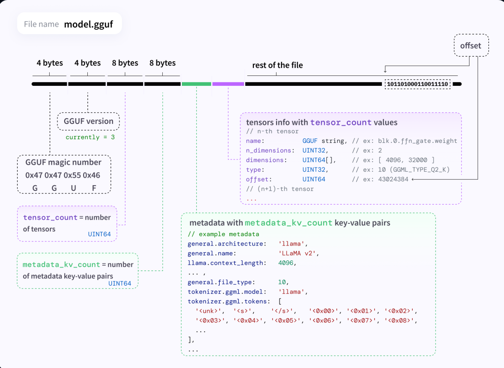

## gguf文件格式

GGUF文件全称是GPT-Generated Unified Format，是由llama.cpp作者Georgi Gerganov定义发布的一种用来保存模型训练结果的二进制文件格式；此前，Georgi Gerganov推出了GGML工具，并推出了与之相应的大模型格式GGML，但是由于GGML设计落后于时代的发展，因此被弃用，由GGUF替代。



如上图，GGUF文件的结构为：

1. 文件头部：
   - GGUF版本（4字节）：该部分表示GGUF文件格式的版本
   - GGUF魔数（4字节）：这是文件格式的标识符，字节 `0x47 0x47 0x55 0x46` 对应字母 "GGUF"。
2. 张量：
   - tensor_count（8字节）：该字段指定文件中的张量数量；
   - 在tensor_count后面一段内存中保存着这些张量的张量信息（tensor info），每个tensor info包含以下信息：
     - name：张量的名称，例如 `blk.0.ffn_gate.weight`。
     - n_dimensions：张量的维度数量，例如 2。
     - dimensions：张量的维度，例如 `[4096, 32000]`。
     - type：张量的数据类型，例如 `10`
     - offset：该张量的数据在文件中的偏移量。
3. 元数据：
   - metadata_kv_count（8字节）：元数据中的键值对数量。
   - 元数据部分包括`metadata_kv_count`个键值对，存储关于模型的详细信息，例如：
     - general.architecture：模型架构，例如 "llama"。
     - general.name：模型名称，例如 "LLama v2"。
     - llama.context_length：模型的上下文长度，例如 `4096`。
     - tokenizer.ggml.tokens  ：整个词表
4. 文件剩下的部分就是上面的tensor_info的offset所指向的张量数据了

可以看到gguf格式使用一个文件就将config、词表和权重放在一起了，这样方便模型推理

我们可以使用下面的代码来打印gguf文件的结构

```python
import gguf

filename = "/Users/Downloads/tinyllama-1.1b-chat-v1.0.Q4_K_M.gguf"

with open(filename, "rb") as f:
    # Load metadata
    info, tensorinfo = gguf.load_gguf(f)

    # Print metadata
    for key, value in info.items():
        print(f"{key:30} {repr(value)[:100]}")

    # Load tensors
    for name in tensorinfo:
        weights = gguf.load_gguf_tensor(f, tensorinfo, name)

        print(name, type(weights), weights.shape)

--------------------------------------输出-----------------------------------------------------------
general.architecture           'llama'
general.name                   'tinyllama_tinyllama-1.1b-chat-v1.0'
llama.context_length           2048
llama.embedding_length         2048
llama.block_count              22
llama.feed_forward_length      5632
llama.rope.dimension_count     64
llama.attention.head_count     32
llama.attention.head_count_kv  4
llama.attention.layer_norm_rms_epsilon 9.999999747378752e-06
llama.rope.freq_base           10000.0
general.file_type              15
tokenizer.ggml.model           'llama'
tokenizer.ggml.tokens          ['<unk>', '<s>', '</s>', '<0x00>', '<0x01>', '<0x02>', '<0x03>', '<0x04>', '<0x05>', '<0x06>', '<0x0
tokenizer.ggml.scores          [0.0, 0.0, 0.0, 0.0, 0.0, 0.0, 0.0, 0.0, 0.0, 0.0, 0.0, 0.0, 0.0, 0.0, 0.0, 0.0, 0.0, 0.0, 0.0, 0.0,
tokenizer.ggml.token_type      [2, 3, 3, 6, 6, 6, 6, 6, 6, 6, 6, 6, 6, 6, 6, 6, 6, 6, 6, 6, 6, 6, 6, 6, 6, 6, 6, 6, 6, 6, 6, 6, 6, 
tokenizer.ggml.merges          ['▁ t', 'e r', 'i n', '▁ a', 'e n', 'o n', '▁t h', '▁ th', 'e s', '▁ s', '▁ d', 'a t', 'o r', 'a n',
tokenizer.ggml.bos_token_id    1
tokenizer.ggml.eos_token_id    2
tokenizer.ggml.unknown_token_id 0
tokenizer.ggml.padding_token_id 2
tokenizer.chat_template        "\n\n{{ '<|user|>\n' + message['conte
general.quantization_version   2
output.weight <class 'numpy.ndarray'> (32000, 2048)
//* blk是block的缩写
token_embd.weight <class 'numpy.ndarray'> (32000, 2048)
blk.0.attn_norm.weight <class 'numpy.ndarray'> (2048,)
blk.0.ffn_down.weight <class 'numpy.ndarray'> (2048, 5632)
blk.0.ffn_gate.weight <class 'numpy.ndarray'> (5632, 2048)
blk.0.ffn_up.weight <class 'numpy.ndarray'> (5632, 2048)
blk.0.ffn_norm.weight <class 'numpy.ndarray'> (2048,)
blk.0.attn_k.weight <class 'numpy.ndarray'> (256, 2048)
blk.0.attn_output.weight <class 'numpy.ndarray'> (2048, 2048)
blk.0.attn_q.weight <class 'numpy.ndarray'> (2048, 2048)
blk.0.attn_v.weight <class 'numpy.ndarray'> (256, 2048)
blk.1.attn_norm.weight <class 'numpy.ndarray'> (2048,)
blk.1.ffn_down.weight <class 'numpy.ndarray'> (2048, 5632)
blk.1.ffn_gate.weight <class 'numpy.ndarray'> (5632, 2048)
blk.1.ffn_up.weight <class 'numpy.ndarray'> (5632, 2048)
blk.1.ffn_norm.weight <class 'numpy.ndarray'> (2048,)
blk.1.attn_k.weight <class 'numpy.ndarray'> (256, 2048)
blk.1.attn_output.weight <class 'numpy.ndarray'> (2048, 2048)
blk.1.attn_q.weight <class 'numpy.ndarray'> (2048, 2048)
blk.1.attn_v.weight <class 'numpy.ndarray'> (256, 2048)
blk.10.attn_norm.weight <class 'numpy.ndarray'> (2048,)
blk.10.ffn_down.weight <class 'numpy.ndarray'> (2048, 5632)
blk.10.ffn_gate.weight <class 'numpy.ndarray'> (5632, 2048)
blk.10.ffn_up.weight <class 'numpy.ndarray'> (5632, 2048)
blk.10.ffn_norm.weight <class 'numpy.ndarray'> (2048,)
```

