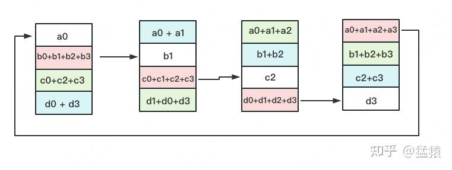
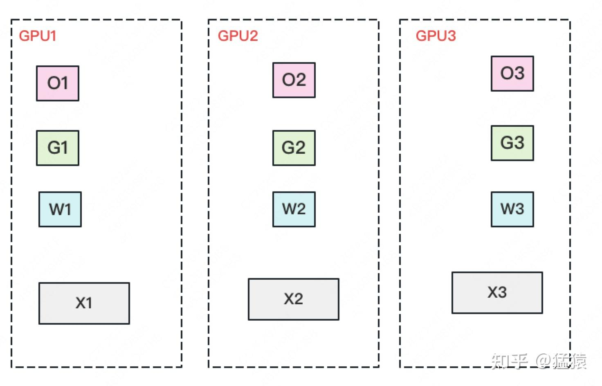

## 任务

1. 这几天要把vLLM的 KVCache 在多节点场景下的传输进行评估， @李博(李博) 你就负责LMCache的分析和实验， @杨树宇(杨树宇) 负责mooncacke。 分析一下这里面vLLM有哪些可以优化的地方

   

   

   https://mp.weixin.qq.com/s/Zs61CDerMwI7JKbFyD001Q

2. 暂时先不分析优化点了，先关注长序列场景下，什么时候发生swap或者 cache offload，以及swap的数据量，swap场景构建

3. vllm v1版本的scheduler.py调度没有了swap 这个queue，你们看看你们对应的connector 是否有对应的swapping机制，就是在GPU memory不足的情况下，会发生什么

4. 如何从physical block 对应到cached block

   - 如何从KVCacheBlock到kv cache实际的tensor？
   - 如何从逻辑块hash到对应的KVCacheBlock？

   

5. nanoflow-sglang论文 计算和通信overlap


## p99延迟

监控 Latency 是一个很微妙的事情，比如，假如一分钟有 1亿次请求，你就有了 1亿个数字。如何从这些数字中反映出用户的真实体验呢？

之前的公司用平均值来反应所有有关延迟的数据，这样的好处是计算量小，实施简单。只需要记录所有请求的一个时间总和，以及请求次数，就可以计算出平均耗时。但问题是，**平均耗时非常容易掩盖真实的问题。比如现在有 1% 的请求非常慢，但是其余的请求很快，那么这 1% 的请求耗时会被其他的 99% 给拉平，将真正的问题掩盖**

所以更加科学的一种监控方式是观察 P99/P95/P90 等，叫做 Quantile。简单的理解，P99 就是第 99% 个请求所用的耗时。假如 P99 现在是 10ms, 那么我们可以说 “99% 的请求都在 10ms 内完成”。虽然在一些请求量较小的情况下，P99 可能受长尾请求的影响。

## 流水线并行pp

把模型隔成不同的层，每一层都放到一块GPU上，这样可以解决模型参数量太大单卡放不下的问题


因此模型做一轮前向和反向的流程如下：


在GPU0上做完一次forward，然后将GPU0上最后一层的输入传给GPU1，继续做forward，在整个前向的过程中，每个GPU都要把计算出来的中间结果（即激活值）保存在本地

- 反向传播计算梯度时需要激活值，这很好理解，比如y = ax + b，y对a求偏导就得到x，那么就需要带入x的实际的值来得到结果，这个就是x前向传播时的值

直到四块GPU都做完forward后，再从最后一块GPU向前依次做backward，将前向时保存的中间结果带入其中得到梯度，此时前向的中间结果可以清除了（通常框架会自动释放），但是要把梯度保存在本地。等把四块GPU上的backward全部做完后，最后一个时刻统一更新每一层的梯度。

然后接着做下一轮的前向

注意，整个反向过程的中间结果有：

- 前向时的激活值：这个大小与输入数据的大小和每一层的大小有关
- 反向时保存的梯度：这个大小与权重的大小相同

关键：

1. 切分micro batch：**在模型并行的基础上，进一步引入数据并行的办法，即把原先的数据再划分成若干个batch，依次送入GPU进行训练**。未划分前的数据，叫**mini-batch**。在mini-batch上再划分的数据，叫**micro-batch**。这样可以减少流水线的气泡

   

2. re-materialization（active checkpoint）：由于反向时需要前向时的激活值，这些值会占据较多的空间，于是一种做法是用时间换空间，即不保存前向的激活值，而是等到反向时重新计算一次前向的激活值。每块GPU上，我们只保存来自上一块的最后一层输入z，其余的中间结果我们算完就废。等到backward的时候再由保存下来的z重新进行forward来算出。

假设有K个GPU，一共有L层模型，每一层的宽度是d，batch_size是N，那么不用重物化时每个GPU消耗的显存是：N * d * L / K；使用重物化时每个GPU消耗的显存量是：N + N / M * L / K * d（因为每个GPU都要保存所有输入，总共是N，然后在前向过程中最多会产生N / M * L / K * d的中间结果）

## 数据并行dp


数据并行通常会有若干块**计算GPU**，如图中GPU0~GPU2；1块**梯度收集GPU**，如图中AllReduce操作所在GPU，在每块计算GPU上都拷贝一份完整的模型参数。

流程为：

1. 把一份数据X（例如一个batch）均匀分给不同的计算GPU。
2. 每块计算GPU做一轮FWD和BWD后，算得一份梯度G。
3. 每块计算GPU将自己的梯度**push**给梯度收集GPU，做聚合操作。这里的聚合操作一般指**梯度累加**。**累加之后的结果与单卡全量数据计算出的梯度相同**
   - 因为y = ax + b对a求偏导等于x，而把x分为x1，x2后，y1 = ax1 + b和y2 = ax2 + b分别对a求偏导得到的是x1和x2，二者相加就等于x。
4. 然后计算GPU从梯度计算GPU上pull下完整的梯度结果，用于更新模型参数；更新完毕后，计算GPU上的模型参数依然保持一致。

**聚合再下发梯度的操作，称为AllReduce**。

实现DP的一种经典编程框架叫“参数服务器”，在这个框架里，**计算GPU称为Worker**，**梯度聚合GPU称为Server。**在实际应用中，为了尽量减少通讯量，一般可选择一个Worker同时作为Server。比如可把梯度全发到GPU0上做聚合。**Server可以只做梯度聚合，也可以梯度聚合+全量参数更新一起做**

使用这种方法，当Server在搬运数据，计算梯度的时候，Worker们却在空闲，通常会采用异步更新的方法	

问题：

1. **存储开销大**。每块GPU上都存了一份完整的模型，造成冗余
2. **通讯开销大**。Server需要和每一个Worker进行梯度传输。当Server和Worker不在一台机器上时，Server的带宽将会成为整个系统的计算效率瓶颈。

由于通讯负载不均衡的问题，DP一般用于单机多卡的场景；而要使用DDP（分布式数据并行），就要首先解决通信的问题，**将Server上的通讯压力均衡转到各个Worker上。实现这一点后，可以进一步去Server，留Worker**；

DDP使用了Ring AllReduce方法来解决通讯负载不均衡的问题：


Ring AllReduce将每个GPU上的数据切分成多份，GPU只和其相邻的GPU通讯。每次发送对应位置的数据进行**累加**。


一次累加完毕后，蓝色位置的数据块被更新，被更新的数据块将成为下一次更新的起点，继续做累加操作。


这个过程的结果等效于Reduce-Scatter（但是实际的过程并不是），Reduce将4个节点的数据合并到一起，然后将合并后的数据分割成4块分别发送给四个节点；

**3次**更新之后，每块GPU上都有一块数据拥有了对应位置完整的聚合（图中红色）。此时，Reduce-Scatter阶段结束。进入All-Gather阶段。目标是把红色块的数据广播到其余GPU对应的位置上。

这操作里依然按照“相邻GPU对应位置进行通讯”的原则，但对应位置数据不再做相加，而是直接替换。




同样经过**3轮迭代后**，使得每块GPU上都汇总到了完整的数据

这个过程的结果等效于All-Gather，先使用Gather将所有节点的数据合并起来（注意，这里是concat，而不是聚合，否则就是reduce了），然后All表示将完整的数据集合分发给所有节点

使用这种方法，**总通信量和AllReduce相同，但是把通讯量均衡负载到了每一时刻的每个Worker上，而DP仅让Server负责通讯，所以DDP做到了通讯的负载均衡**

通信量的计算：

假设模型参数W的大小为 Φ ，GPU个数为 N 。则梯度大小也为 Φ ，每个梯度块的大小为 Φ / N
对单卡GPU来说（只算其send通讯量）：

- Reduce-Scatter阶段，通讯量为 (N−1)Φ / N
- All-Gather阶段，通讯量为 (N−1)Φ / N

单卡总通讯量为 2(N−1)Φ / N ，随着N的增大，可以近似为 2Φ 。全卡总通讯量为 2NΦ

### 混合精度训练

对于模型，我们肯定希望其参数越精准越好，所以使用fp32来表示参数W。但是在forward和backward的过程中，为了减轻计算压力，引入fp16或bf16。具体来说：

1. 参数使用fp32进行保存（包括momentum和variance，统称model states）
2. 在前向之前，额外开辟一块空间，将fp32的参数量化成fp16保存起来
3. 然后使用fp16的参数做前向和反向，在此之间产生的activation和gradients，都用fp16进行存储
4. 用fp16 gradients去更新fp32下的model states
5. 当模型收敛后，fp32的parameter就是最终的参数输出。


存储的大小：假设模型的参数W大小是 Φ ，**以byte为单位**，存储如下：


这里没有将激活算入范围，因为activation不仅与模型参数相关，还与batch size相关

### ZeRO

原本的数据并行每个GPU上O（optimizer states），G（gradients）和W（parameters）都要存全部，其中只需要对G通信，先做reduce-scatter，每个GPU得到四分之一块的聚合的G；然后再做all-gather，每个GPU才能得到完整的聚合的G。

而之所以要用all-gather得到完整的聚合的G，是因为每个GPU有完整的W，只有完整的G才能对完整的W更新；而因为有完整的W，我们也需要完整的O；所以如果每个GPU上只保存四分之一的W，那么O也可以只需要保存四分之一，G也只需要保存四分之一，并且G的通信不再需要all-gather阶段，而O没有增加的通信，W只有在前向和反向时才会需要通信，共两次all-gather（因为如果没有完整的权重无法进行前向和反向）



具体来说，流程如下：

1. 将一个batch的数据分成三份，每个GPU各输入一份
2. 做forward时，对W做一次**All-Gather**，取回分布在别的GPU上的W，得到一份完整的W，单卡通讯量 Φ 。forward做完，立刻把不是自己维护的W抛弃。
3. 做backward时，对W做一次**All-Gather**，取回完整的W，单卡通讯量 Φ 。backward做完，立刻把不是自己维护的W抛弃。
4. 做完backward，算得一份完整的梯度G，对G做一次**Reduce-Scatter**，从别的GPU上聚合自己维护的那部分梯度，单卡通讯量 Φ 。**聚合操作结束后，立刻把不是自己维护的G抛弃**。这里就不需要再做All-Gather操作获得完整的聚合的G了，只需要维护三分之一的聚合的G
5. 用自己维护的O和G，更新W。由于只维护部分W，因此无需再对W做任何AllReduce操作。

所以这里的单卡的总共的通信量为3Φ


## PD分离

PD合并推理：一块GPU上既做prefill又做decode，比如vllm就是在一块GPU上prefill和decode交替进行，一次step要么全是prefill要么全是decode

prefill阶段的性能评估指标：TTFT（Time To First Token），表示生成第1个token所用的时间

decode阶段的性能评估指标：TPOT（Time Per Output Token），产出每一个response token所用的时间

PD分离的基本思想：一部分GPU专门做prefill，被称为prefill instance；一部分GPU专门做decode，被称为decode instance；prefill instance计算完毕后，再把产生的kv cache传送到decode instance，然后再由decode实例继续做推理


为什么要做PD分离：如果PD合并推理，通常情况下每一个step要么全做prefill，要么全做decode，那么如果想提升TTFT，就得多做prefill，但是这样decode的机会就少了，那么TPOT就会降低；反之亦然。所以当PD合并时，TTFT和TPOT这两个指标之间是强耦合的，是此消彼长的；如果把这两个阶段分开各自独立优化，那么可能会有更好的结果

根据distserve论文的实验，在设定的SLO（Service Level Objective）为P90 TTFT=0.4S。P90 TPOT=0.04S的情况下，如果使用PD合并的架构，同时到达二者的SLO时，**最大**的rps是1.6；而如果在该GPU上只做decode，达到SLO时它的rps为10,；如果只做prefill，达到SLO时它的rps为5.6

所以**一张卡只做prefill或者只做decode的goodput（达到SLO的最大rps），都要比它既做prefill又做decode的goodput要高**，这也说明，**合并式架构可能会同时损害TTFT和TPOT**，

**合并式架构可能会同时损害TTFT和TPOT**，

**合并式架构可能会同时损害TTFT和TPOT**，

**合并式架构可能会同时损害TTFT和TPOT**

如果我拿2张卡纯做prefill，1张卡纯做decode，那么我这三卡构成的架构的goodput就为10，也即单卡goodput = 3.3。这是合并式goodput（值为1.6）的2.1倍

算力与存储的独立优化：

- prefill阶段：拥有计算受限的性质（compute-bound），prefill阶段算完KV cache并发给deocde阶段后，理论上prefill就不再需要这个KV cache了
- decode阶段：拥有存储受限的性质（memory-bound），因为token by token的生成方式，decode阶段要频繁从存储中读取KV Cache，同时也意味着它需要尽可能保存KV cache。


## vLLM v1

### vllm源码构建

https://docs.vllm.ai/en/latest/getting_started/installation/gpu.html

使用nv docker镜像：

```
docker run --name my_docker --gpus all -it --ipc=host nvcr.io/nvidia/pytorch:23.10-py3
```

- `docker run -it ...`表示创建并前台运行新容器，直接进入终端；
  - --rm参数表示创建一次性的容器，退出后自动释放；否则，在容器中使用ctrl-d退出时，容器的内容不会被释放，状态变成exited，表示容器已停止但是并未删除；
  - --name参数表示给非一次性的容器一个名字，以后启动时就可以通过这个名字进行
  - --mount表示把系统上指定的文件挂载到docker中
- `docker ps -a`可以查看所有正在运行和停止的docker和它的状态，如果状态为exited则表示容器停止了；如果为up则正在运行
- `docker ps`查看所有正在运行的docker
- `docker stop xxxx`表示停止指定名字的容器
- `docker start xxxx`表示重新启动指定名字的容器，用来启动已存在的容器，默认以后台模式运行，因此不会直接进入容器的终端
- `docker exec -it xxxx /bin/bash`表示进入已运行的容器，在容器中执行/bin/bash命令，也就是启动一个bash终端；需容器处于 Up 状态，所以需要先使用docker start将容器启动

在 Docker 中，如果不加--rm参数，停止后容器内的数据不会丢失，重新启动时依然存在，但是数据依赖于容器自身，如果手动删除容器（docker rm），则数据会丢失

如果上一次断开docker后，vscode上再次远程连接docker出现permission denied的情况，则是因为上次的vscode server还在运行，所以需要使用下面的指令找到vscode server并kill

```
$ ps aux|grep bin/code-server # find out process id
$ kill <process id>
$ sudo groupadd docker
$ sudo usermod -aG docker $USER
```

- ps aux与ps的区别：后者仅显示**当前用户在当前终端（TTY）** 下启动的进程，并且仅包含基础字段；前者显示**所有用户的进程**，包含系统所有进程的详细状态，所以想要过滤进程时通常使用ps aux | grep


然后在docker中

```
git clone https://github.com/vllm-project/vllm.git
cd vllm
pip install -e . -v -i https://pypi.mirrors.ustc.edu.cn/simple/ # 如果要修改C++和cuda代码，那么使用这个命令，完全编译
VLLM_USE_PRECOMPILED=1 pip install --editable . -v -i https://pypi.mirrors.ustc.edu.cn/simple/ # 如果仅仅修改python代码，那么就使用这个命令，可以减少编译时间
```

如果编译出现问题，那么命令前加上 MAX_JOBS=4

如果需要反复编译则需要安装ccache，可以减少编译时间

- `apt install ccache`；如果出现unlocate ccache，那么就需要更新apt，使用apt-get update和upgrade命令

- 如果使用pip install安装时要使用ccache，使用下面的指令

  ```bash
  MAX_JOBS=4 CCACHE_NOHASHDIR="true" pip install --no-build-isolation -e . -v -i https://pypi.mirrors.ustc.edu.cn/simple/
  ```

然后使用vscode打开docker，再在docker中打开vllm目录进行调试

对vllm v1进行调试：`export VLLM_USE_V1=1`

出现问题：`RuntimeError: Cannot re-initialize CUDA in forked subprocess`

- 解决办法：在命令行中`export VLLM_WORKER_MULTIPROC_METHOD=spawn`

**将这两个export写入到`~/.bashrc`文件中固化**

出现问题：`An attempt has been made to start a new process before the current process has finished its bootstrapping phase.`

- 解决办法：把自己的代码用 `if __name__ == "__main__":`包起来

### EngineCore架构

之前的vllm版本中，接受用户请求、对请求进行预处理、分词、多模态输入处理、对请求调度、在GPU上执行推理、对结果进行de-tokenize、最后将结果返回给用户，这整个过程都是在同一个进程中执行的，然而这其中有大量的CPU overhead，除了中间的在GPU上推理，其余的步骤都是在CPU上执行的，并且它们之间还是串行的；这样的overhead对于比较小的模型来说尤其明显。

所以vllm v1的版本采用了多进程的架构，将API server和LLM的核心功能分开在两个进程上，进程之间使用ZeroMQ进行IPC；

- API server负责接收用户请求，对请求进行预处理、分词，将推理的结果进行de-tokenize并且返回给用户
- 而另一个进程EngineCore负责LLM的核心功能，主要是在一个循环中对请求进行调度和在GPU上进行推理

这样就**充分实现了CPU和GPU的重叠，隐藏了CPU的overhead，提高了吞吐量**

具体的结构是：

.png)

构造LLM时，会在LLM对象内部构造一个LLMEngine成员


而在构造LLMEngine对象时，又会在它的内部构造一个EngineCore成员；

构造EngineCore的时候，如果没有选择多进程的模式（multiprocess_mode），那么会在当前进程中直接构造一个`EngineCore`对象，这样就是v0的模式，可以直接在一个进程中对EngineCore对象调用add_request和step方法，那么调用self.engine_core的add_request方法就可以直接将请求添加Scheduler，调用step方法也可以直接从EngineCore中获取输出（实际上这里还会对本地的EngineCore对象包装成InprocClient，因为要与其他的MPClient的接口保持一致）


如果选择了多进程的模式，那么就会只会构造一个MPClient，具体来说，根据参数选择的是异步还是同步（asyncio_mode）会构造不同的MPClient，但是二者的基类都是MPClient。**所谓MPClient就是将EngineCore构造在另一个进程上，然后自己就是EngineCore在当前进程上的一个client**。

具体来说：假设是同步的模式（asyncio_mode=False），那么会构造一个`SyncMPClient`，在构造它之前，会先构造它的基类MPClient

在MPClient构造时，**通过BackgroundProcHandle对象创建了一个后台进程，名为EngineCore，该进程的主线程调用的函数为EngineCoreProc类中的静态成员函数run_engine_core**


在run_engine_core方法中，先构造了一个`EngineCoreProc`对象，然后调用了它的`run_busy_loop`方法，


EngineCoreProc类是EngineCore类的子类，为了实现在独立的进程上运行EngineCore而对EngineCore进行了一层包装，**主要用来处理EngineCore与主进程的通信**。具体来说，EngineCoreProc对象中有两个队列，一个用来接收LLMEngine发送的请求，一个用来存放自己处理完的结果，并且还创建了两个线程来分别处理这两个队列


EngineCoreProc对象构造完之后，run_engine_core方法会**在这个EngineCore进程的主线程中执行一个busy loop**：它会一直反复轮询EngineCoreProc的input_queue中有没有新到来的请求，如果有的话就将它取出来

然后判断这个请求的类型是什么，如果是add的话，那么就调用EngineCore的add_request方法将它加入到Scheduler中，**此时才是真的把request加入到Scheduler的waiting队列中**，并且将它的id和req对象的映射加入到Scheduler的requests表中。

然后它会反复执行上面的过程，将EngineCoreProc的input_queue中所有的请求加入到Scheduler中，直到input_queue为空，然后会执行一次step；执行完之后将推理的结果保存在EngineCoreProc的output_queue中，然后重复上面的过程，继续检查Scheduler中还有没有新的请求。


上面是**EngineCore的主线程做的事情，总的来说就是从input_queue中获取请求，然后将它添加到Scheduler的队列中，然后调用step将执行的结果保存在output_queue中**；

而EngineCoreProc在构造的时候创建的另外两个线程则负责：

- 一个线程通过调用`socket.recv_multipart`从socket中读取出来自主进程发送的request数据，并将它反序列化之后保存在input_queue中
- 一个线程则从output_queue中获取该后台进程的主线程计算完的数据，将它序列化之后使用`socket.send_multipart`通过socket发送出去

这两个线程也是在不停的轮询

以上是MPClient的构造过程，然后再构造子类SyncMPClient

在这个client中，会有一个output_queue，用来保存EngineCore进程计算出来的结果；在SyncMPClient构造时，会创建一个单独的线程（名字叫`EngineCoreOutputQueueThread`）来专门处理output_queue，具体来说就是从socket中读取数据，然后将它反序列化，保存在output_queue中。


然后上层再通过SyncMPClient中的get_output方法获取output_queue中的数据；上层还会通过调用SyncMPClient的add_request方法发送请求，也就是通过SyncMPClient中的socket将req发送给另一个进程的EngineCoreProc。

所以多进程的EngineCore的数据的流转过程为：

- 主进程的主线程A通过generate方法对prompt挨个调用add_request，调用栈如下所示：

  

  最后在`llm_engine`的`add_request`方法中，调用LLMEngine的成员变量engine_core的add_request方法

  

- 然后实际调用的是`SyncMPClient`的add_request方法，通过socket将数据发送给EngineCore进程

- EngineCore进程中的线程B负责从socket中读取出来自主进程发送的request数据，并将它反序列化之后保存在input_queue中

- EngineCore进程的主线程C运行`run_busy_loop`负责从input_queue中将数据读取出来，保存到EngineCore对象的Scheduler成员的waiting队列中

- 然后主线程C再调用一次step，将计算得到的数据保存在output_queue中

- EngineCore进程的线程D将output_queue中的数据序列化之后通过socket发送出去

- 然后主进程的线程E再从socket中将数据反序列化之后保存在`SyncMPClient`的output_queue中

- 此时对主进程的线程A来说，在generate方法中刚刚调用完`_validate_and_add_requests`方法将prompt发送出去，接着调用`_run_engine`方法，其中在while循环中反复调用llm_engine的step方法。v1版本的LLMEngine的step方法直接从EngineCore中调用get_output即可（在本例中实际是对MPClient调用get_output），将SyncMPClient的output_queue中的数据获取出来。

-1742635141038-8.png)

**对于v1版本的llm_engine来说，step方法很简单，不需要做任何的调度和计算的操作，因为主要的工作都由EngineCore的step方法代劳了**，不管是多进程的EngineCore还是本地的EngineCore都是如此；llm_engine的step方法只需要调用engine_core的get_output方法即可：

- 对于InprocClient，它的get_output方法需要调用本地的EngineCore的step，然后等step执行完毕后将结果返回。**这样的话add_request和调度与GPU执行之间就是串行的，如果模型比较小，在GPU上执行的时间比较少，那么就会导致CPU的overhead很大**。

  

- 对于MPClient，get_output方法则直接从队列中获取输出即可；因为step由另一个进程的EngineCore执行完了，这样就**实现了add_request（包括接受用户请求、对请求进行预处理、分词）和调度与GPU执行的重叠**。这就是为什么在调试vllm v1的时候，明明一次性add_request了好几个prompt，但是在调度时却显示waiting队列中只有一个req

### executor架构


在LLM对象构造时，会构造一个engine_args对象，它有一个参数是`distributed_executor_backend`，可以传入ray、mp、uni等参数，然后使用engine_args对象创建LLMEngine对象时，可以根据`distributed_executor_backend`选择对应类型的executor，传入LLMEngine的构造函数中


然后LLMEngine会进一步将该executor类传入到MPClient的构造函数中


于是MPClient在创建后台进程运行EngineCoreProc时，也会将这个executor类传给run_engine_core方法


于是在run_engine_core方法中构造EngineCore对象时，最终会调用此executor类，在EngineCore对象中构造出一个model_executor成员


在executor_class的`__init__`方法中，就会根据`distributed_executor_backend`的不同而选择调用对应的`_init_executor`方法


如果选择了backend是mp（多进程worker），那么这里调用的是`MultiprocExecutor`的 `_init_executor`方法，它会先在EngineCore进程中创建一个rpc_broadcast_mq的消息队列，用来将EngineCore进程的调度的结果广播给其他进程的worker。

然后会遍历world_size，对每个rank都创建一个worker进程，并将创建后的worker加入到队列中记录下来


make_worker_process方法主要的任务就是创建另一个进程并在其中构造worker，并且还要创建一个worker_response_mq消息队列，用来接收worker的执行结果。然后将worker进程和消息队列打包在一起作为worker进程在EngineCore进程本地的一个Handle返回


EngineCore在另一个进程中构造worker的逻辑与之前的主进程在另一个进程中构造EngineCore的逻辑一样：

在EngineCore进程中，创建一个后台进程，执行WorkerProc类中的worker_main静态方法，在此方法中，先构造一个WorkerProc对象，然后调用此对象的worker_busy_loop方法，此方法中同样是一个死循环


在WorkerProc对象构造时，会创建两个消息队列，一个是rpc_broadcast_mq，用来从EngineCore接收调度的结果；一个是worker_response_mq，用来将模型的执行结果发送给EngineCore；然后发送信号给EngineCore进程，告诉他Worker的消息队列已经准备好了，EngineCore可以开始进行调度了


然后开始执行worker的init_device函数：此函数负责初始化设备的相关信息，**比如根据当前worker的rank找到它所属的device**，以及清空该device的显存，获取该device的显存大小


最后在worker中构造GPUModelRunner对象


worker的GPUModelRunner成员主要负责运行模型，在构造函数中会维护模型运行过程中所需要的一些数据结构，比如**kv cache的tensor**，input_batch，input_ids，slot_mappings，seq_lens等，该类中还有模型执行所需要的一些方法，比如`_update_states`、`_prepare_inputs`、负责导入模型的`load_model`函数，以及负责执行模型的 `execute_model`函数


执行完`init_device`后开始执行worker的`load_model`函数，此函数负责导入模型

WorkerProc对象构造完毕后，开始执行worker_busy_loop方法，此方法中就是在一个死循环中不断尝试从rpc_broadcast_mq中获取EngineCore进程广播来的方法名，获取到了之后，就通过self.worker对象执行该方法，然后将执行的结果加入到worker进程的worker_response_mq队列中


对于EngineCore来说，当它想要worker执行什么方法时，就要调用self.model_executor的方法，比如检测worker所在的device最多可以给kv cache分配多少空间，或者根据device的空间初始化kv cache，或者执行模型


对于这些方法，在EngineCore进程中实际上并没有真正执行，而是调用了Executor基类的对应方法，**调用collective_rpc将这些方法名广播给其他进程上的worker**，然后等待worker的执行结果，再将结果返回。


而collective_rpc所做的事情就是将方法名加入到rpc_broadcast_mq中，然后遍历所有的worker的worker_reponse_mq，将worker的执行结果返回


所以V1与V0的MultiprocExecutor最主要的区别在于：V0中的EngineCore和worker0在同一个进程，这样做可以在向各个工作进程广播输入数据时减少进程间的通信开销，但这种设计导致了不对称架构，增加了系统复杂性。如下面所示：下面是V0的MultiprocExecutor，它将除了worker0之外的worker构造在独立的进程中，而将worker0与Enginecore放在同一个进程中


而V1的EngineCore与worker0在不同的进程，实现了对称架构，简化了分布式逻辑，使Worker在单GPU和多GPU环境中以相同方式运行


### kv cache的初始化

在engine/core.py中，EngineCore类在初始化完Executor后，就紧接着对KV cache进行初始化


首先会调用`determine_available_memory`函数，获取每个worker所在的device的最多可以给kv cache分配多少显存，这个的计算方式是：先使用dummy输入在device上进行一次前向，得到模型峰值的显存使用量，然后将device的总显存量乘以`gpu_memory_utilization`再减去峰值显存使用量，就能得到该device上最多可以给kv cache分配多少空间。

然后再调用`get_kv_cache_config`获取kv cache的各种配置信息


配置信息的计算：首先计算在给定的available_memory和模型结构（模型的每一层的kv cache block的大小）下，系统中可以有多少个KVCacheBlock


然后获取到系统中的KVCacheBlock的数量后，调用initialize_from_config根据这些配置信息为kv cache分配空间；

在worker/gpu_model_runner.py文件中，给每一层layer分配大小为**(2， num_blocks, block_size, kv_head, head_size)**的torch tensor， 其中num_block即为最大的cache block数量，block_size是一个cache block的token个数


然后将这些kv cache维护在GPUModelRunner的self.kv_caches中，它是一个tensor的list，维护了每一层layer对应的kv cache tensor，推理时可以根据layer的层数找到对应的kv cache


### Scheduler的初始化


在engine/core.py中，EngineCore类init时完成对kv cache的初始化后，会对Scheduler进行初始化，**将Scheduler对象维护在EngineCore对象中**


#### KVCacheManager

在Scheduler（`core/scheduler.py`）中，先根据kv cache block的数量初始化**KVCacheManager**（原来的block_manager被替换成了这里的kv_cache_manager，不存在v1和v2两个版本的block_manager），用来管理kv cache block的分配

在KVCacheManager（`core/kv_cache_manager.py`）中，使用BlockPool对象替换了原来的`CachedBlockAllocator`和`UncachedBlockAllocator`

使用req_to_blocks对象替换了原来的block_tables对象，直接维护了每个request的id到它的kv cache block之间的映射，删除了PhysicalTokenBlock，变成了这里的KVCacheBlock，并且原来的block_tables是以seq为单位，而这里是以request为单位映射（V1疑似不支持beam search？）


##### BlockPool

使用BlockPool（`core/block_pool.py`）替换了原来的Allocator，用来管理kv cache的分配

这里采用了原版的UncachedBlockAllocator的做法，根据系统中的kv cache block的数量，在构造的时候一次性创建所有的KVCacheBlock，将他们维护在list中

新增`free_block_queue`和`cached_block_hash_to_block`对象

- `free_block_queue`对象：将空闲的kv cache block串成双向链表，用来做LRU替换；在kv cache block对象内部有两个指针指向相邻的kv cache block；此列表包括未被使用过的KVCacheBlock（没有hash值）和曾经被使用过现在空闲的KVCacheBlock（有hash值）；当一个KVCacheBlock被释放时会push到此列表的最后，当给用户分配新的KVCacheBlock时会从此列表的开头pop一个block；被pop的block有可能是从未被使用过的，也有可能是曾经被用过但现在空闲的block，如果是后者那么需要将它从cached_block表中驱逐
- `cached_block_hash_to_block`：kv cache block的hash值到KVCacheBlock之间的映射，此字典相当于是原来的cached_blocks表和evictor中的表的合集，也就是包括了所有拥有hash id的KVCacheBlock（包括正在被running req使用的block和曾经被使用但是现在空闲的block）；用户请求block时直接从此表中查找即可，如果此表中不存在，那么就去上面的free_block_queue查找


所以使用了prefix cache之后，系统中kv cache的整个运转流程是：对于正在运行的req来说，它的kv cache全部保留，不在free_block_queue中，不允许被驱逐；如果该req被抢占，那么它的kv cache被放入free_block_queue中，可以被驱逐，但是不会在被抢占的瞬间被驱逐；然后用户对block_pool进行申请或释放时，会对free_block_queue按照LRU策略进行分配或释放，释放block时放到free_block_queue的最后，分配时从free_block_queue的头部分配，被分配的块有可能是被抢占的req的block，那么此时该req的kv cache才会被驱逐

#### 调度队列

Scheduler中将原来的seq_group对象变成了request对象，并且新增了一个req_id到request对象的映射

并且去掉了swapped队列


### generate

`entrypoints/llm.py`的LLM类的generate方法中首先add_request：


#### add_request

首先将prompt add_request：遍历每一条prompt，挨个调用`_add_request`方法


其中又会通过**LLM对象的成员`llm_engine`的`add_request`方法**


在llm_engine的add_request方法中，先通过**llm_engine成员processor**的方法，将prompt的文字变成prompt token id，最后得到`EngineCoreRequest`对象


然后llm_engine再通过engine_core成员变量的方法，将得到的`EngineCoreRequest`对象add_request到engine_core中

#### run_engine

v1的调度器不区分prefill和decode阶段，调度决策以一个简单的字典形式表示，例如{请求ID: token数量}，调度的过程中，每个请求只记录已处理的token数量和需要处理的token数量，调度器尝试在每次调度时让已处理token数量追上需要处理的token数量。

请求到来调度器需要把它加入到waiting队列中等待调度，同时加入到全局的请求记录Map中

**每次调度时，先调度running队列中的请求，如无抢占行为再调度waiting队列中的请求**。

- 对running队列中的每个请求尝试在`kv_cache_manager`中分配token需要的slots，如果不足失败则开启抢占模式，释放低优先级请求占用的空间。
- 对waiting队列中的每个请求首先尝试在`kv_cache_manager`中分配token需要的slots，如果不足则继续在waiting队列等待。

具体来说：

（1）waiting队列的调度流程：

对waiting队列的每一个req，首先在`kv_cache_manager`中调用`get_computed_blocks`函数获取已经被计算过的KVCacheBlock


然后在get_computed_blocks函数中：waiting队列中不仅保存了要进行prefill的req，而且由于vllm v1去掉了swap队列，被抢占的req也会直接保存到waiting队列中，**此函数就主要用来处理这两种情况**；Scheduler中维护了一个`req_to_block_hashes`表，用来记录系统中所有req到它的block hash值的映射，包括被抢占到waiting队列的req；这里就可以从`req_to_block_hashs`表中获取该req以前计算好的hash值，以减少重复计算；如果没有计算好的hash值，那么要重新计算，将计算的结果保存在`req_to_block_hashs`中

- 计算block的hash值的逻辑是：以block_size为步长，遍历req的token_id序列，对每一个逻辑块与它之前的所有tokens一起计算一个hash值；如果某一个逻辑块的大小不满block_size，就不对它计算hash值


**获得req的所有block的hash值之后，需要从头到尾挨个判断每个block的hash值是否存在于block_pool的cache中**，如果在那么就说明此block已经被计算过了，如果不存在那么就直接break，因为vllm做的是prefix hash，中间只要有一个block不一样那么后面所有block的hash值都不一样


然后`get_computed_blocks`函数将此次获取到的命中prefix cache的blocks数量和token数量返回。

然后将req的token总数（prompt的token数量加上输出的token数量）减去`num_computed_tokens`，就得到该req需要计算的token数量；然后和token budget取一个最小值就得到此次step该req被调度的token计算数量


（token budget限制了一次step最多可以计算的token上限，所以如果一个step中调度了多个req，那么最后一个req可以被计算的token数量就可能少于它实际需要计算的token数量，这就是为什么下图中step 0 R3只有一部分的prompt token被调度）


获取了该req此次调度需要计算的token数量（num_new_tokens）和命中prefix cache的blocks（computed_blocks）之后，调用`allocate_slots`函数，为该req分配block：


```python
# 已经算过的token：等于req中记录的以前算过的token数量（num_computed_tokens）加上这一次调度在prefix cache中命中的token数量（new_computed_blocks）
# 对running队列中的req来说，调用此函数时传入的new_computed_blocks为0（也就是说running队列中的seq不会命中prefix cache）
# 对waiting队列中的req来说，req对象的num_computed_tokens为0（被抢占的req的num_computed_tokens会被清空为0），
num_computed_tokens = (request.num_computed_tokens +
                        len(new_computed_blocks) * self.block_size)
# 总共需要的block数量：已经计算过的token和需要计算的token数量除以block_size
num_required_blocks = cdiv(num_computed_tokens + num_tokens,
                            self.block_size)
req_blocks = self.req_to_blocks[request.request_id]
# 新增的block数量：总共需要的block数量 减去 该req已经有的block数量和该req命中prefix cache的block数量
num_new_blocks = (num_required_blocks - len(req_blocks) -
                    len(new_computed_blocks))
```

然后将命中prefix cache的blocks引用计数增加，并且将它们从free_block_queue中移除，表示这些block已经被使用了，不能被驱逐

然后**先将这些命中prefix cache 的block extend到该req的block table中**，再从block_pool中为该req新增的block申请`KVCacheBlock`（vllm v1这里会有一个机制，每次从block_pool申请block时会preallocate一些block），**再将申请得到的新的block extend到该req 的block table中**


- 从block_pool中申请新的block的流程为：从block_pool的free_block_queue列表的开头pop一个block；被pop的block有可能是从未被使用过的，也有可能是曾经被用过但现在空闲的block，如果是后者那么需要将它从cached_block表中驱逐

在allocate_slot函数的最后，调用cache_full_blocks函数为此次新增的block计算hash值，并且将它们保存在prefix cache的池子中

- 这里新增的block指的是：**该req中已经被cache的block（`num_cached_blocks`）到 该req中已经满了的block（`num_full_blocks_after_append`）之间的所有block**
- 对于waiting队列的req来说，被cache的block数量从get_computed_blocks函数中获取；对于running队列的req来说，被cache的block数量从num_cached_block字典中获取


假设调度一个req实际新增的token数量是两个block，vllm给该req preallocate四个block，那么该req则新增六个block，这六个block都是刚刚从BlockPool中申请的，此时既没有hash值，也没有将hash值和block的映射保存到prefix cache的池子中；

那么cache_full_blocks函数的逻辑就是：**和v0一样，它只对满的block计算hash值**；由于req实际的token对应的两个block的hash值之前在`get_computed_blocks`函数中就已经计算过了（或者在此之前就已经存在了），保存在了`req_to_block_hashs`表中，那么这两个block的hash值就不需要计算，可以直接从表中读取，并且将hash值和该block的映射保存在`cached_block_hash_to_block`表中；而没有满的block和preallocate的block则不会计算hash值

调用allocate_slots函数为被调度的req分配完KVCacheBlock和与哈希值建立映射后，就可以将该req从waiting队列中pop，并加入到running队列中；调度一个waiting的req的流程到此结束

（2）running队列的调度流程：

对running队列的每一个req，则**不需要调用get_computed_blocks函数从prefix cache中判断是否有已经被缓存的kv cache block**，直接计算它此次调度需要新计算的token个数即可。对于正常的running的req来说，这个数字通常是1，因为一次step新增一个token；对于上一次从waiting队列调度的，并且prompt被截断的req来说，这个数字才会大于1，比如像下面这种情况


然后还是使用num_new_tokens与token_budget取一个最小值，避免超出一次调度的token上限


然后调用allocate_slots给新增的tokens分配KVCacheBlock：先根据已经计算过的token数量加上新增的token数量 除以block_size再**向上取整**得到需要的block数量，然后减去req已有的block数量得到新增的block数量，比如一个req的token个数从16变成17，那么就会新增一个block（在没有preallocate的情况下）。

由于v1的allocate_slots每次向block_pool请求block时都会preallocate，那么这里新增的block数量就有可能是负数。**只有当req把preallocate的block都使用完了，此时新增的block数量才会等于1，于是这里还是像之前描述的一样，向block_pool请求新的block，并添加到req的block_table中**


对于running队列调用的allocate_slot函数来说，有一个比较重要的功能是**将满了的block计算hash值并且加入到prefix cache中**。实现的方式是将新增的token数量加上已经计算的token数量 除以block_size（这里是**向下取整**）得到已经满了的block数量，然后调用cache_full_blocks函数，将已经被cache的block（`num_cached_blocks`）到满了的block（`num_full_blocks_after_append`）之间的所有块计算hash值并加入prefix cache


然后allocate_slots函数结束

如果allocate_slots函数返回的是None，表示block_pool中已经没有空闲的KVCacheBlock可以分配了。那么此时会触发抢占，将running队列中的一个req pop，将它的block_table删除，将他所有的KVCacheBlock释放（这里释放只是将block引用计数减一并加入到free_block_queue即可，不需要将它的内容删除，也不需要将它的hash映射移除）。然后**将被抢占的req加入到waiting队列中**，**随后再次尝试调用allocate_slot，如果失败则继续选择一个req抢占，直到allocate_slot成功或者抢占到当前被调度的req为止**。

- 可以看到，v1版本的抢占机制的实现比v0要简单很多，没有了swap队列，也没有了从GPU到CPU上的拷贝，完全依赖prefix cache就可以很轻松地实现抢占


然后基本完成了对一条req的调度

### execute_model

在worker/gpu_model_runner.py中，GPUModelRunner对象的execute_model函数用来对一次调度的结果执行推理

在attention的计算过程中，用来定位kv cache的最主要的两个数据结构就是block_table和slot_mapping

block_table在forward之前的`_update_states`函数中进行维护；BlockTable对象的内部实际上有三个数据结构，形状都是（max_num_reqs，max_num_blocks_per_req），也就是一个batch中最多的req个数乘一个req中最多的block个数，默认情况下是（1024，128）；它们三个存储的内容和形状都是相同的，只不过一个是GPU上的torch tensor，一个是CPU上的torch tensor，一个是CPU上的numpy数组


Scheduler在调度req的时候会将每个req所映射的KVCacheBlock的id打包放入scheduler_outuput中


然后在`_update_states`中会将每个req对应的block_ids保存在block_table中


根据req在batch中的index和该req的block数量定位到该req在block_table中的位置，然后将req的scheduler_outuput中的block_ids保存block_table的numpy数组中，也就是保存到了CPU的tensor上


然后`_update_states`函数结束后，在prepare_input函数中，**会将block_table中的CPU的tensor复制到GPU的tensor上**


slot_mapping的计算过程：

假设有六个req，每个req被调度的token个数为 num_scheduled_tokens = [9, 41, 43, 40, 32, 16]，总token数为181，block_size为16，一个seq最多的block个数128，一个seq最多的token个数为2048，一个batch最多的token个数为8192，那么整个计算slot_mapping的过程为：

每个token所在的req的index：

req_indices = [0, 0, 0, 0, 0, 0, 0, 0, 0, 1, 1, 1, 1, 1, 1, 1, 1, 1, 1, 1, 1, 1, 1, 1, 1, 1, 1, 1, 1, 1, 1, 1, 1, 1, 1, 1, 1, 1, 1, 1, 1, 1, 1, 1, 1, 1, 1, 1, 1, 1, 2, 2, 2, 2, 2, 2, 2, 2, 2, ...]

每个token在自己的req中的偏移量：

position_np = [0, 1, 2, 3, 4, 5, 6, 7, 8, 0, 1, 2, 3, 4, 5, 6, 7, 8, 9, 10, 11, 12, 13, 14, 15, 16, 17, 18, 19, 20, 21, 22, 23, 24, 25, 26, 27, 28, 29, 30, 31, 32, 33, 34, 35, 36, 37, 38, 39, 40, 0, 1, 2, 3, 4, 5, 6, 7, 8, ...]

每个token在token_ids_cpu_tensor中偏移量，使用req_indices * max_seq_len + position_np即可

token_indices = [0, 1, 2, 3, 4, 5, 6, 7, 8, 2048, 2049, 2050, 2051, 2052, 2053, 2054, 2055, 2056, 2057, 2058, 2059, 2060, 2061, 2062, 2063, 2064, 2065, 2066, 2067, 2068, 2069, 2070, 2071, 2072, 2073, 2074, 2075, 2076, 2077, 2078, 2079, 2080, 2081, 2082, 2083, 2084, 2085, 2086, 2087, 2088, 4096, 4097, 4098, 4099, 4100, 4101, 4102, 4103, 4104, ...]

input_batch中有一个`token_ids_cpu_tensor`，形状为（1024，2048），代表1024个req的2048个token id。实际上这里只有六个req，所以除了前六行之外其他的都是0

然后将token_ids_cpu_tensor展平，根据`token_indices`为索引，从中选出对应位置的数，保存到input_ids_cpu中；这里相当于是把input_batch中的token_ids_cpu_tensor中填充空余位置的0给去掉了，得到了形状为8192的一维的向量，每个req之间的token id是相邻的。


然后将req_indices乘以每个req的最多的block数，用来在block_table中寻址（因为block_table的形状是（1024，128）），然后再将每个token在req中的偏移量除以block_size得到每个token在req中所在的block，二者相加得到每个token在block_table中的偏移量

block_table_indices = [0, 0, 0, 0, 0, 0, 0, 0, 0, 128, 128, 128, 128, 128, 128, 128, 128, 128, 128, 128, 128, 128, 128, 128, 128, 129, 129, 129, 129, 129, 129, 129, 129, 129, 129, 129, 129, 129, 129, 129, 129, 130, 130, 130, 130, 130, 130, 130, 130, 130, 256, 256, 256, 256, 256, 256, 256, 256, 256, ...]

然后根据block_table_indices从block_table中选出每个token对应的block number

block_numbers = [0, 0, 0, 0, 0, 0, 0, 0, 0, 5, 5, 5, 5, 5, 5, 5, 5, 5, 5, 5, 5, 5, 5, 5, 5, 6, 6, 6, 6, 6, 6, 6, 6, 6, 6, 6, 6, 6, 6, 6, 6, 7, 7, 7, 7, 7, 7, 7, 7, 7, 12, 12, 12, 12, 12, 12, 12, 12, 12, ...]

再计算出每个token在block内的偏移量，最后将block_number乘以block_size加上块内的偏移量就得到每个token在整个kv cache中的位置，存入slot_mapping中，形状是8196


slot_mapping = [0, 1, 2, 3, 4, 5, 6, 7, 8, 80, 81, 82, 83, 84, 85, 86, 87, 88, 89, 90, 91, 92, 93, 94, 95, 96, 97, 98, 99, 100, 101, 102, 103, 104, 105, 106, 107, 108, 109, 110, 111, 112, 113, 114, 115, 116, 117, 118, 119, 120, 192, 193, 194, 195, 196, 197, 198, 199, 200, ...]


在推理时获取当前层的kv cache tensor，大小为（2，block_num，block_size，head_num，head_size），然后使用此kv_cache和当前步骤的key、value、query进行推理


调用FlashAttentionImpl的forward方法，key、query和value的形状都是（num_tokens，num_heads，head_size），比如如果当前推理的batch中有六个seq，并且每个seq都是decode阶段（实际上v1不区分decode阶段了，相当于每个seq被调度了一个token），那么num_tokens就是6；但是实际上这里会做一个padding，num_tokens变成8


调用`torch.ops._C_cache_ops.reshape_and_cache_flash`方法，该方法将qkv reshape成slot_mapping的num_tokens的数量（因为qkv会被padding），然后将qkv按照slot_mapping中的index在key和value cache的tensor中找到自己的位置，并存入其中


具体来说：reshape_and_cache_flash_kernel核函数的配置是：grid_size为token数量，block_size为num_heads * head_size，那么也就是每个block负责一个token，每个线程负责token的一个元素。此kernel本质上就是每个线程负责一个元素，把数据从key和value中搬运到kv cache中

先根据每个block负责的token idx找到它对应的slot_mapping的数据，表示该token在kv cache中的偏移量，然后计算该槽位对应的kv cache块索引`block_idx`和块内偏移`block_offset`；再找到每个线程在key、value和kv cache中负责的元素。最后如果kv cache的类型是kAuto，那么就直接拷贝原始数据到kv cache；否则就对原始数据做一个FP8的量化后再保存到kv cache中


然后将填充后的key_cache和value_cache以及query和block_table传入flash_attn中：


然后进入page_attention_kernel中：grid_size是（num_heads，num_seqs），所以每个block负责query的一个头与kv的一个头的attention的计算


这其中涉及到kv cache读写的地方有：

由于block_table的形状为（num_seqs，max_num_blocks_per_seq），所以这里使用seq_idx乘以max_num_blocks_per_seq定位到当前seq的block_table


然后算出当前的seq的KVCacheBlock的相对范围，start_block_idx是0，end_block_idx是该seq所占的block数量


然后通过block_idx在block_table中找到对应的KVCacheBlock的块号


然后这里再遍历一个seq中每个block idx，从block_table中读取出对应的KVCacheBlock的块号，计算出key的块内偏移，最后和块号一起定位到key在key_cache中的位置


