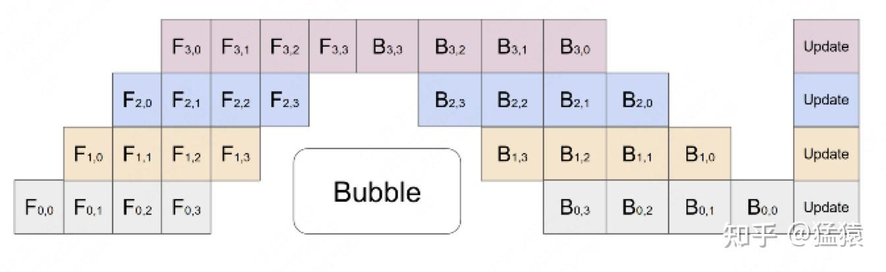
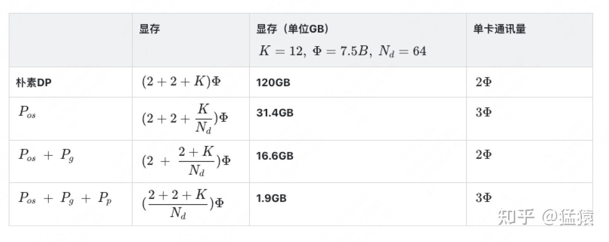
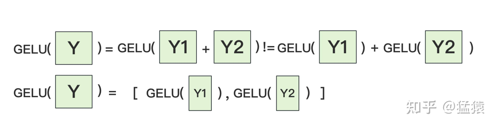

## 学习方法

抓大放小：大的地方要抓住架构和原理，小的地方不要锱铢必较，甚至可以不求甚解，等你需要有针对它的任务时，比如需要对它进行修改，此时才需要对其进行了解。**本质上就是做事情需要有结果和产出，大的地方的产出就是了解架构和思想，小的地方的产出是对其进行修改或者增加feature**

## p99延迟

监控 Latency 是一个很微妙的事情，比如，假如一分钟有 1亿次请求，你就有了 1亿个数字。如何从这些数字中反映出用户的真实体验呢？

之前的公司用平均值来反应所有有关延迟的数据，这样的好处是计算量小，实施简单。只需要记录所有请求的一个时间总和，以及请求次数，就可以计算出平均耗时。但问题是，**平均耗时非常容易掩盖真实的问题。比如现在有 1% 的请求非常慢，但是其余的请求很快，那么这 1% 的请求耗时会被其他的 99% 给拉平，将真正的问题掩盖**

所以更加科学的一种监控方式是观察 P99/P95/P90 等，叫做 Quantile。简单的理解，P99 就是第 99% 个请求所用的耗时。假如 P99 现在是 10ms, 那么我们可以说 “99% 的请求都在 10ms 内完成”。虽然在一些请求量较小的情况下，P99 可能受长尾请求的影响。

## 流水线并行pp

把模型隔成不同的层，每一层都放到一块GPU上，这样可以解决模型参数量太大单卡放不下的问题


因此模型做一轮前向和反向的流程如下：


在GPU0上做完一次forward，然后将GPU0上最后一层的输入传给GPU1，继续做forward，在整个前向的过程中，每个GPU都要把计算出来的中间结果（即激活值）保存在本地

- 反向传播计算梯度时需要激活值，这很好理解，比如y = ax + b，y对a求偏导就得到x，那么就需要带入x的实际的值来得到结果，这个就是x前向传播时的值

直到四块GPU都做完forward后，再从最后一块GPU向前依次做backward，将前向时保存的中间结果带入其中得到梯度，此时前向的中间结果可以清除了（通常框架会自动释放），但是要把梯度保存在本地。等把四块GPU上的backward全部做完后，最后一个时刻统一更新每一层的梯度。

然后接着做下一轮的前向

注意，整个反向过程的中间结果有：

- 前向时的激活值：这个大小与输入数据的大小和每一层的大小有关
- 反向时保存的梯度：这个大小与权重的大小相同

关键：

1. 切分micro batch：**在模型并行的基础上，进一步引入数据并行的办法，即把原先的数据再划分成若干个batch，依次送入GPU进行训练**。未划分前的数据，叫**mini-batch**。在mini-batch上再划分的数据，叫**micro-batch**。这样可以减少流水线的气泡

   

2. re-materialization（active checkpoint）：由于反向时需要前向时的激活值，这些值会占据较多的空间，于是一种做法是用时间换空间，即不保存前向的激活值，而是等到反向时重新计算一次前向的激活值。每块GPU上，我们只保存来自上一块的最后一层输入z，其余的中间结果我们算完就废。等到backward的时候再由保存下来的z重新进行forward来算出。

假设有K个GPU，一共有L层模型，每一层的宽度是d，batch_size是N，那么不用重物化时每个GPU消耗的显存是：N * d * L / K；使用重物化时每个GPU消耗的显存量是：N + N / M * L / K * d（因为每个GPU都要保存所有输入，总共是N，然后在前向过程中最多会产生N / M * L / K * d的中间结果）

## 数据并行dp


数据并行通常会有若干块**计算GPU**，如图中GPU0~GPU2；1块**梯度收集GPU**，如图中AllReduce操作所在GPU，在每块计算GPU上都拷贝一份完整的模型参数。

流程为：

1. 把一份数据X（例如一个batch）均匀分给不同的计算GPU。
2. 每块计算GPU做一轮FWD和BWD后，算得一份梯度G。
3. 每块计算GPU将自己的梯度**push**给梯度收集GPU，做聚合操作。这里的聚合操作一般指**梯度累加**。**累加之后的结果与单卡全量数据计算出的梯度相同**
   - 因为y = ax + b对a求偏导等于x，而把x分为x1，x2后，y1 = ax1 + b和y2 = ax2 + b分别对a求偏导得到的是x1和x2，二者相加就等于x。
4. 然后计算GPU从梯度计算GPU上pull下完整的梯度结果，用于更新模型参数；更新完毕后，计算GPU上的模型参数依然保持一致。

**聚合再下发梯度的操作，称为AllReduce**。

实现DP的一种经典编程框架叫“参数服务器”，在这个框架里，**计算GPU称为Worker**，**梯度聚合GPU称为Server。**在实际应用中，为了尽量减少通讯量，一般可选择一个Worker同时作为Server。比如可把梯度全发到GPU0上做聚合。**Server可以只做梯度聚合，也可以梯度聚合+全量参数更新一起做**

使用这种方法，当Server在搬运数据，计算梯度的时候，Worker们却在空闲，通常会采用异步更新的方法	

问题：

1. **存储开销大**。每块GPU上都存了一份完整的模型，造成冗余
2. **通讯开销大**。Server需要和每一个Worker进行梯度传输。当Server和Worker不在一台机器上时，Server的带宽将会成为整个系统的计算效率瓶颈。

由于通讯负载不均衡的问题，DP一般用于单机多卡的场景；而要使用DDP（分布式数据并行），就要首先解决通信的问题，**将Server上的通讯压力均衡转到各个Worker上。实现这一点后，可以进一步去Server，留Worker**；

DDP使用了Ring AllReduce方法来解决通讯负载不均衡的问题：


Ring AllReduce将每个GPU上的数据切分成多份，GPU只和其相邻的GPU通讯。每次发送对应位置的数据进行**累加**。


一次累加完毕后，蓝色位置的数据块被更新，被更新的数据块将成为下一次更新的起点，继续做累加操作。


这个过程的结果等效于Reduce-Scatter（但是实际的过程并不是），Reduce将4个节点的数据合并到一起，然后将合并后的数据分割成4块分别发送给四个节点；

**3次**更新之后，每块GPU上都有一块数据拥有了对应位置完整的聚合（图中红色）。此时，Reduce-Scatter阶段结束。进入All-Gather阶段。目标是把红色块的数据广播到其余GPU对应的位置上。

这操作里依然按照“相邻GPU对应位置进行通讯”的原则，但对应位置数据不再做相加，而是直接替换。


同样经过**3轮迭代后**，使得每块GPU上都汇总到了完整的数据

这个过程的结果等效于All-Gather，先使用Gather将所有节点的数据合并起来（注意，这里是concat，而不是聚合，否则就是reduce了），然后All表示将完整的数据集合分发给所有节点

使用这种方法，**总通信量和AllReduce相同，但是把通讯量均衡负载到了每一时刻的每个Worker上，而DP仅让Server负责通讯，所以DDP做到了通讯的负载均衡**

通信量的计算：

假设模型参数W的大小为 Φ ，GPU个数为 N 。则梯度大小也为 Φ ，每个梯度块的大小为 Φ / N
对单卡GPU来说（只算其send通讯量）：

- Reduce-Scatter阶段，通讯量为 (N−1)Φ / N
- All-Gather阶段，通讯量为 (N−1)Φ / N

单卡总通讯量为 2(N−1)Φ / N ，随着N的增大，可以近似为 2Φ 。全卡总通讯量为 2NΦ

### 混合精度训练

对于模型，我们肯定希望其参数越精准越好，所以使用fp32来表示参数W。但是在forward和backward的过程中，为了减轻计算压力，引入fp16或bf16。具体来说：

1. 参数使用fp32进行保存（包括momentum和variance，统称model states）
2. 在前向之前，额外开辟一块空间，将fp32的参数量化成fp16保存起来
3. 然后使用fp16的参数做前向和反向，在此之间产生的activation和gradients，都用fp16进行存储
4. 用fp16 gradients去更新fp32下的model states
5. 当模型收敛后，fp32的parameter就是最终的参数输出。


存储的大小：假设模型的参数W大小是 Φ ，**以byte为单位**，存储如下：


这里没有将激活算入范围，因为activation不仅与模型参数相关，还与batch size相关

### ZeRO

原本的数据并行每个GPU上O（optimizer states），G（gradients）和W（parameters）都要存全部，其中只需要对G通信，先做reduce-scatter，每个GPU得到四分之一块的聚合的G；然后再做all-gather，每个GPU才能得到完整的聚合的G。

而之所以要用all-gather得到完整的聚合的G，是因为每个GPU有完整的W，只有完整的G才能对完整的W更新；而因为有完整的W，我们也需要完整的O；所以如果每个GPU上只保存四分之一的W，那么O也可以只需要保存四分之一，G也只需要保存四分之一，并且G的通信不再需要all-gather阶段，而O没有增加的通信，W只有在前向和反向时才会需要通信，共两次all-gather（因为如果没有完整的权重无法进行前向和反向）


具体来说，流程如下：

1. 将一个batch的数据分成三份，每个GPU各输入一份
2. 做forward时，对W做一次**All-Gather**，取回分布在别的GPU上的W，得到一份完整的W，单卡通讯量 Φ 。forward做完，立刻把不是自己维护的W抛弃。
3. 做backward时，对W做一次**All-Gather**，取回完整的W，单卡通讯量 Φ 。backward做完，立刻把不是自己维护的W抛弃。
4. 做完backward，算得一份完整的梯度G，对G做一次**Reduce-Scatter**，从别的GPU上聚合自己维护的那部分梯度，单卡通讯量 Φ 。**聚合操作结束后，立刻把不是自己维护的G抛弃**。这里就不需要再做All-Gather操作获得完整的聚合的G了，只需要维护三分之一的聚合的G
5. 用自己维护的O和G，更新W。由于只维护部分W，因此无需再对W做任何AllReduce操作。

所以这里的单卡的总共的通信量为3Φ



## 张量模型并行TP

模型并行顾名思义就是对模型的权重进行切分

下面是基本的分布式矩阵乘法，如果对输入不切分，那么就要对权重按列切分，计算得到的结果需要进行一次AllGather


如果对输入切分，那么只能按列切分，权重则需要按行切分，计算得到的结果需要进行一次AllReduce


对于Transformer的模型并行来说，不同算子的切分方式都不一样

对MLP来说：第一个权重按列切分，第二个权重按行切分，所以X是完整输入到每个GPU中，然后与第一个权重做完计算后结果不需要做AllGather，直接做完Gelu后与第二个权重计算，最后对每个GPU计算得到的结果做AllReduce


为什么不对第一个权重按列切分？因为如果这样那么得到的XA1和XA2就是全量的不完整数据，需要先做一次AllReduce之后才能与第二个权重做计算。除此之外由于需要做Gelu，它可以对部分的完整数据做计算，但是不能对全量的不完整的数据计算，所以这样也需要做AllReduce



对attention来说：由于attention不同head之间的计算天然就是并行的，所以可以直接按head切分。对wq wk 和wv矩阵按列（也就是QKVdim方向）切分，**一块GPU上负责一个或多个head**；attention之后需要乘以矩阵O，由于QKV是按列切分的，所以O就按行切分，依然是按照QKVdim方向切分


对于Embedding来说：将词表按词表长度的维度进行切分，假设词表中有300个词，现在我们将word embedding拆分到两块GPU上，第一块GPU维护词表[0, 150)，第二块GPU维护词表[150, 299)。当输入X去GPU上查找时，能找到的词，就正常返回词向量，找到不到就把词向量中的全部全素都置0。按此方式查找完毕后，每块GPU上的数据做一次AllReduce，就能得到最终的输入。


除了输入层之外，输出层还有一个Embedding层，将hidden_states再映射回词表中。而由于输入和输出共用一个embedding，所以输出层的embedding切分方式也是相同的


所以Transformer模型并行的结构图如下所示：


## PD分离

PD合并推理：一块GPU上既做prefill又做decode，比如vllm就是在一块GPU上prefill和decode交替进行，一次step要么全是prefill要么全是decode

prefill阶段的性能评估指标：TTFT（Time To First Token），表示生成第1个token所用的时间

decode阶段的性能评估指标：TPOT（Time Per Output Token），产出每一个response token所用的时间

PD分离的基本思想：一部分GPU专门做prefill，被称为prefill instance；一部分GPU专门做decode，被称为decode instance；prefill instance计算完毕后，再把产生的kv cache传送到decode instance，然后再由decode实例继续做推理


为什么要做PD分离：如果PD合并推理，通常情况下每一个step要么全做prefill，要么全做decode，那么如果想提升TTFT，就得多做prefill，但是这样decode的机会就少了，那么TPOT就会降低；反之亦然。所以当PD合并时，TTFT和TPOT这两个指标之间是强耦合的，是此消彼长的；如果把这两个阶段分开各自独立优化，那么可能会有更好的结果

根据distserve论文的实验，在设定的SLO（Service Level Objective）为P90 TTFT=0.4S。P90 TPOT=0.04S的情况下，如果使用PD合并的架构，同时到达二者的SLO时，**最大**的rps是1.6；而如果在该GPU上只做decode，达到SLO时它的rps为10,；如果只做prefill，达到SLO时它的rps为5.6

所以**一张卡只做prefill或者只做decode的goodput（达到SLO的最大rps），都要比它既做prefill又做decode的goodput要高**，这也说明，**合并式架构可能会同时损害TTFT和TPOT**，

**合并式架构可能会同时损害TTFT和TPOT**，

**合并式架构可能会同时损害TTFT和TPOT**，

**合并式架构可能会同时损害TTFT和TPOT**

如果我拿2张卡纯做prefill，1张卡纯做decode，那么我这三卡构成的架构的goodput就为10，也即单卡goodput = 3.3。这是合并式goodput（值为1.6）的2.1倍

算力与存储的独立优化：

- prefill阶段：拥有计算受限的性质（compute-bound），prefill阶段算完KV cache并发给deocde阶段后，理论上prefill就不再需要这个KV cache了
- decode阶段：拥有存储受限的性质（memory-bound），因为token by token的生成方式，decode阶段要频繁从存储中读取KV Cache，同时也意味着它需要尽可能保存KV cache。

## python语法

装饰器：

- 当解释器遇到@decorator时，装饰器函数会立即被调用，传入被装饰的函数my_function作为参数，然后使用装饰器返回的 `wrapper` 函数替换原函数

  ```python
  def decorator(func):
      def wrapper(*args, **kwargs):
          # 装饰逻辑（函数调用前）
          result = func(*args, **kwargs)  # 调用原函数
          # 装饰逻辑（函数调用后）
          return result
      return wrapper
    
  @decorator
  def my_function(): ...
  ```

  等价于：

  ```python
  my_function = decorator(my_function)
  ```


**pytorch to device方法**：

下面的代码是将key_cache_gpu的数据拷贝到cpu上，并不是移动到cpu上，所以gpu上依然保留原来的数据，key_cache_gpu依然指向原来的数据

```python
    key_cache_cpu = key_cache_gpu.to("cpu")
```

所以如果使用下面的方法，那么maybe_quantized_key_cache在to("cpu")后依然在gpu上，那么后面对maybe_quantized_key_cache调用to("cuda")仍然是对GPU上的tensor调用的，所以不会进行任何拷贝，所以测到的时间不是真实的拷贝的时间

```python
    maybe_quantized_key_cache.to("cpu")
    maybe_quantized_value_cache.to("cpu")
    torch.cuda.synchronize() # 确保同步拷贝

    copy_start_time = time.perf_counter_ns()
    maybe_quantized_key_cache.to("cuda")
    maybe_quantized_value_cache.to("cuda")
```

所以应该使用下面的方法：

```python
    key_cache_cpu = key_cache_gpu.to("cpu")
    value_cache_cpu = value_cache_gpu.to("cpu")
    torch.cuda.synchronize() # 确保同步拷贝

    copy_start_time = time.perf_counter_ns()
    key_cache_gpu = key_cache_cpu.to("cuda")
    value_cache_gpu = value_cache_cpu.to("cuda")
```

注意，拷贝后在cpu上和gpu上存在两个副本，如果想将某一个tensor释放，那么就将该变量名覆盖即可，当tensor的引用计数变为0时，就会自动释放内存

## vLLM v1

### vllm源码构建

https://docs.vllm.ai/en/latest/getting_started/installation/gpu.html

使用nv docker镜像：

```
docker run --name my_docker --gpus all -it --ipc=host nvcr.io/nvidia/pytorch:23.10-py3
```

- `docker run -it ...`表示创建并前台运行新容器，直接进入终端；
  - --rm参数表示创建一次性的容器，退出后自动释放；否则，在容器中使用ctrl-d退出时，容器的内容不会被释放，状态变成exited，表示容器已停止但是并未删除；
  - --name参数表示给非一次性的容器一个名字，以后启动时就可以通过这个名字进行
  - --mount表示把系统上指定的文件挂载到docker中
  - `docker run -d IMAGE`中的-d参数表示让容器以**后台模式**运行，不会占用当前终端。
- `docker ps -a`可以查看所有正在运行和停止的docker和它的状态，如果状态为exited则表示容器停止了；如果为up则正在运行
- `docker ps`查看所有正在运行的docker
- `docker stop xxxx`表示停止指定名字的容器
- `docker start xxxx`表示重新启动指定名字的容器，用来启动已存在的容器，默认以后台模式运行，因此不会直接进入容器的终端
- `docker exec -it xxxx /bin/bash`表示进入已运行的容器，在容器中执行/bin/bash命令，也就是启动一个bash终端；需容器处于 Up 状态，所以需要先使用docker start将容器启动

在 Docker 中，如果不加--rm参数，停止后容器内的数据不会丢失，重新启动时依然存在，但是数据依赖于容器自身，如果手动删除容器（docker rm），则数据会丢失

如果上一次断开docker后，vscode上再次远程连接docker出现permission denied的情况，则是因为上次的vscode server还在运行，所以需要使用下面的指令找到vscode server并kill

```
$ ps aux|grep bin/code-server # find out process id
$ kill <process id>
$ sudo groupadd docker
$ sudo usermod -aG docker $USER
```

- ps aux与ps的区别：后者仅显示**当前用户在当前终端（TTY）** 下启动的进程，并且仅包含基础字段；前者显示**所有用户的进程**，包含系统所有进程的详细状态，所以想要过滤进程时通常使用ps aux | grep

然后在docker中

```
git clone https://github.com/vllm-project/vllm.git
cd vllm
pip install -e . -v -i https://pypi.mirrors.ustc.edu.cn/simple/ # 如果要修改C++和cuda代码，那么使用这个命令，需要较长的编译时间
VLLM_USE_PRECOMPILED=1 pip install --editable . -v -i https://pypi.mirrors.ustc.edu.cn/simple/ # 如果仅仅修改python代码，那么就使用这个命令，不需要编译，仅仅安装依赖
```

如果编译出现问题，那么命令前加上 MAX_JOBS=4

如果需要反复编译则需要安装ccache，可以减少编译时间

- `apt install ccache`；如果出现unlocate ccache，那么就需要更新apt，使用apt-get update和upgrade命令

- 如果使用pip install安装时要使用ccache，使用下面的指令

  ```bash
  MAX_JOBS=4 CCACHE_NOHASHDIR="true" pip install --no-build-isolation -e . -v -i https://pypi.mirrors.ustc.edu.cn/simple/
  ```

当使用CCACHE反复编译时，只有第一遍需要使用MAX_JOBS=4，后面的直接使用所有核即可

然后使用vscode连接上服务器，在侧边的extensions中下载docker插件，然后在docker栏中找到自己刚才启动的对应的容器，右键后点击attach visual studio code


再在docker中打开vllm目录，在目录下创建一个python文件，调用vllm的接口，然后就可以对vllm进行调试了


对vllm v1进行调试：`export VLLM_USE_V1=1`

出现问题：`RuntimeError: Cannot re-initialize CUDA in forked subprocess`

- 解决办法：在命令行中`export VLLM_WORKER_MULTIPROC_METHOD=spawn`

**将这两个export写入到`~/.bashrc`文件中固化**

出现问题：`An attempt has been made to start a new process before the current process has finished its bootstrapping phase.`

- 解决办法：把自己的代码用 `if __name__ == "__main__":`包起来

#### 在其他服务器上pull docker

```
docker pull reg.docker.alibaba-inc.com/commons/vllm-0.7.3:latest
```


#### vllm服务

启动服务：

```bash
vllm serve meta-llama--Llama-2-7b-chat-hf/ \
  --disable-log-requests \
  --trust-remote-code \
  --enforce-eager \
  --dtype=half \
  --tensor_parallel_size 2 \
  --port=8000
```

启动client：

```bash
python3 benchmarks/benchmark_serving.py     --dataset-name random     --num-prompts 1000     --random-input 1000     --random-output 100     --random-range-ratio 0.1     --request-rate 4     --dataset-path ShareGPT_V3_unfiltered_cleaned_split.json     --model meta-llama--Llama-2-7b-chat-hf/     --port 8000
```

#### 调试pybind

首先在编译的时候要设置为debug模式，由于在setup.py文件中我们可以看到：


所以CMAKE_BUILD_TYPE是由环境变量决定的；所以我们需要在命令行中export CMAKE_BUILD_TYPE=Debug，然后再开始编译

如果设置没有成功，那么编译时会显示build type为relwithdebinfo


如果设置成功了，那么build type就是Debug


编译时出现`'cicc' died due to signal 9 (Kill signal)`是因为编译使用的线程太多了，用完了内存（并且还会导致我的账号被服务器封掉）


### EngineCore架构

之前的vllm版本中，接受用户请求、对请求进行预处理、分词、多模态输入处理、对请求调度、在GPU上执行推理、对结果进行de-tokenize、最后将结果返回给用户，这整个过程都是在同一个进程中执行的，然而这其中有大量的CPU overhead，除了中间的在GPU上推理，其余的步骤都是在CPU上执行的，并且它们之间还是串行的；这样的overhead对于比较小的模型来说尤其明显。

在先前vllm版本的推理中，我们经常会发现detokenize（tokenid -> 文本）这个步骤会成为推理瓶颈，特别是遇到长序列的情况。在等待序列做detokenize的过程中，gpu是空转的。现在通过这种拆解，让原来是串行的事情并行化。

所以vllm v1的版本采用了多进程的架构，将API server和LLM的核心功能分开在两个进程上，进程之间使用ZeroMQ进行IPC；

- API server负责接收用户请求，对请求进行预处理、分词，将推理的结果进行de-tokenize并且返回给用户
- 而另一个进程EngineCore负责LLM的核心功能，主要是在一个循环中对请求进行调度和在GPU上进行推理

简单来说，**就是将请求的pre-process和输出结果的post-process与实际的推理过程拆分在2个不同的进程中**(process0, process1)。Client负责请求的pre-process和输出结果的post-process，EngineCore负责实际的推理过程，不同进程间使用ZMQ来通信数据。

这样就**充分实现了CPU和GPU的重叠，隐藏了CPU的overhead，提高了吞吐量**

对于offline batching和online serving来说，它们会选取不同类型的Client进行运作，但是它们的EngineCore部分运作基本是一致的

#### offline batching

具体的结构是：

.png)


构造LLM时，会在LLM对象内部构造一个LLMEngine成员


而在构造LLMEngine对象时，又会在它的内部构造一个EngineCore成员；

构造EngineCore的时候，如果没有选择多进程的模式（multiprocess_mode），那么会在当前进程中直接构造一个`EngineCore`对象，这样就是v0的模式，可以直接在一个进程中对EngineCore对象调用add_request和step方法，那么调用self.engine_core的add_request方法就可以直接将请求添加Scheduler，调用step方法也可以直接从EngineCore中获取输出（实际上这里还会对本地的EngineCore对象包装成InprocClient，因为要与其他的MPClient的接口保持一致）


如果选择了多进程的模式，那么就会只会构造一个MPClient，具体来说，根据参数选择的是异步还是同步（asyncio_mode）会构造不同的MPClient，但是二者的基类都是MPClient。**所谓MPClient就是将EngineCore构造在另一个进程上，然后自己就是EngineCore在当前进程上的一个client**。

具体来说：假设是同步的模式（asyncio_mode=False），那么会构造一个`SyncMPClient`，在构造它之前，会先构造它的基类MPClient

在MPClient构造时，**通过BackgroundProcHandle对象创建了一个后台进程，名为EngineCore，该进程的主线程调用的函数为EngineCoreProc类中的静态成员函数run_engine_core**


在run_engine_core方法中，先构造了一个`EngineCoreProc`对象，然后调用了它的`run_busy_loop`方法，


EngineCoreProc类是EngineCore类的子类，为了实现在独立的进程上运行EngineCore而对EngineCore进行了一层包装，**主要用来处理EngineCore与主进程的通信**。具体来说，EngineCoreProc对象中有两个队列，一个用来接收LLMEngine发送的请求，一个用来存放自己处理完的结果，并且还创建了两个线程来分别处理这两个队列


EngineCoreProc对象构造完之后，run_engine_core方法会**在这个EngineCore进程的主线程中执行一个busy loop**：它会一直反复轮询EngineCoreProc的input_queue中有没有新到来的请求，如果有的话就将它取出来

然后判断这个请求的类型是什么，如果是add的话，那么就调用EngineCore的add_request方法将它加入到Scheduler中，**此时才是真的把request加入到Scheduler的waiting队列中**，并且将它的id和req对象的映射加入到Scheduler的requests表中。

然后它会反复执行上面的过程，将EngineCoreProc的input_queue中所有的请求加入到Scheduler中，直到input_queue为空，然后会执行一次step；执行完之后将推理的结果保存在EngineCoreProc的output_queue中，然后重复上面的过程，继续检查Scheduler中还有没有新的请求。


上面是**EngineCore的主线程做的事情，总的来说就是从input_queue中获取请求，然后将它添加到Scheduler的队列中，然后调用step将执行的结果保存在output_queue中**；

而EngineCoreProc在构造的时候创建的另外两个线程则负责：

- 一个线程通过调用`socket.recv_multipart`从socket中读取出来自主进程发送的request数据，并将它反序列化之后保存在input_queue中
- 一个线程则从output_queue中获取该后台进程的主线程计算完的数据，将它序列化之后使用`socket.send_multipart`通过socket发送出去

这两个线程也是在不停的轮询

以上是MPClient的构造过程，然后再构造子类SyncMPClient

在这个client中，会有一个output_queue，用来保存EngineCore进程计算出来的结果；在SyncMPClient构造时，会创建一个单独的线程（名字叫`EngineCoreOutputQueueThread`）来专门处理output_queue，具体来说就是从socket中读取数据，然后将它反序列化，保存在output_queue中。


然后上层再通过SyncMPClient中的get_output方法获取output_queue中的数据；上层还会通过调用SyncMPClient的add_request方法发送请求，也就是通过SyncMPClient中的socket将req发送给另一个进程的EngineCoreProc。

所以多进程的EngineCore的数据的流转过程为：

- 主进程的主线程A通过generate方法对prompt挨个调用add_request，调用栈如下所示：

  

  最后在`llm_engine`的`add_request`方法中，调用LLMEngine的成员变量engine_core的add_request方法

  

- 然后实际调用的是`SyncMPClient`的add_request方法，通过socket将数据发送给EngineCore进程

- EngineCore进程中的线程B负责从socket中读取出来自主进程发送的request数据，并将它反序列化之后保存在input_queue中

- EngineCore进程的主线程C运行`run_busy_loop`负责从input_queue中将数据读取出来，保存到EngineCore对象的Scheduler成员的waiting队列中

- 然后主线程C再调用一次step，将计算得到的数据保存在output_queue中

- EngineCore进程的线程D将output_queue中的数据序列化之后通过socket发送出去

- 然后主进程的线程E再从socket中将数据反序列化之后保存在`SyncMPClient`的output_queue中

- 此时对主进程的线程A来说，在generate方法中刚刚调用完`_validate_and_add_requests`方法将prompt发送出去，接着调用`_run_engine`方法，其中在while循环中反复调用llm_engine的step方法。v1版本的LLMEngine的step方法直接从EngineCore中调用get_output即可（在本例中实际是对MPClient调用get_output），将SyncMPClient的output_queue中的数据获取出来。

-1742635141038-8.png)

**对于v1版本的llm_engine来说，step方法很简单，不需要做任何的调度和计算的操作，因为主要的工作都由EngineCore的step方法代劳了**，不管是多进程的EngineCore还是本地的EngineCore都是如此；llm_engine的step方法只需要调用engine_core的get_output方法即可：

- 对于InprocClient，它的get_output方法需要调用本地的EngineCore的step，然后等step执行完毕后将结果返回。**这样的话add_request和调度与GPU执行之间就是串行的，如果模型比较小，在GPU上执行的时间比较少，那么就会导致CPU的overhead很大**。

  

- 对于MPClient，get_output方法则直接从队列中获取输出即可；因为step由另一个进程的EngineCore执行完了，这样就**实现了add_request（包括接受用户请求、对请求进行预处理、分词）和调度与GPU执行的重叠**。这就是为什么在调试vllm v1的时候，明明一次性add_request了好几个prompt，但是在调度时却显示waiting队列中只有一个req

#### online serving


EngineCore部分的逻辑与offline batching相比基本相同，主要的区别在于Client的流程

主要区别在于：

- `create asynico.queue() for each req`：**会针对每一个req创建一个异步队列**，这个异步队列将用于存储这个req的输出结果。
- `register the queue to output_processor`：会把这个req的异步队列注册到output_processor中。
  - **为什么每个req需要一个单独的队列**：
    - 在online serving中，req的输出结果是流式的（一块一块地把结果返回给用户），并且用户时常有多轮对话的需求等等。**基于这样的考虑，相比于offline batching对所有req的一次性统一输出，online serving下更有必要将各个req的输出隔离开来，因此才单独针对每个req创建一个用于盛放输出结果的异步队列。**
- 在`AsyncLLM`上，我们会启动一个异步任务`asyncio.create_task(_run_output_handler())`，这个异步任务上会执行`_run_output_handler()`函数，这个函数的主要作用是异步接受、处理来自EngineCore的模型输出结果，具体流程为：
  1. 使用get_output_async()函数，持续监听通过output_socket传递来的pickle EngineCoreOutputs，将pickle EngineCoreOutputs decode成 EngineCoreOutputs，再将EngineCoreOutputs装入到output_queue中
  2. `split output into slices`将output_queue中的数据切成slices，方便后续做流式输出。再将slices数据装入这个req注册在output_processor中、只属于这个req的异步队列。然后output_processor将会以slices为维度，对输出数据做诸如detokenize等的操作。
  3. 对于一条请求，AsyncLLM将会持续从output_processor中获取它当前的输出结果，返回给用户，直到这条请求推理完毕


### executor架构


在LLM对象构造时，会构造一个engine_args对象，它有一个参数是`distributed_executor_backend`，可以传入ray、mp、uni等参数，**默认情况下为None**，你当然也可以手动指定。在默认情况下，vllm会根据你的分布式配置（world_size）和你所使用的平台特征(cuda、neuron、是否安装/初始化/配置了ray等)来自动决定--distributed-executor-backend的取值。

这四种类型的Executor分别为：

- mp：MultiprocExecutor

  适用场景：单机多卡。当单机的卡数满足分布式配置，且没有正在运行的ray pg时，默认使用mp。在此情况下，**Executor成为一个主进程，其下的若干个workers构成了它的子进程们**

- ray：RayDistributedExecutor

  适用场景：多机多卡。在ray的情况下，Executor成为一个ray driver process，其下管控着若干worker process

- uni：UniProcExecutor

  适用场景：单卡或 Neuron环境

- external_launcher：ExecutorWithExternalLauncher

  适用场景：想要用自定义的外部工具（例如Slurm）来做分布式管理

然后使用engine_args对象创建LLMEngine对象时，可以根据`distributed_executor_backend`选择对应类型的executor，传入LLMEngine的构造函数中


然后LLMEngine会进一步将该executor类传入到MPClient的构造函数中


于是MPClient在创建后台进程运行EngineCoreProc时，也会将这个executor类传给run_engine_core方法


于是在run_engine_core方法中构造EngineCore对象时，最终会调用此executor类，在EngineCore对象中构造出一个model_executor成员


在executor_class的`__init__`方法中，就会根据`distributed_executor_backend`的不同而选择调用对应的`_init_executor`方法


如果选择了backend是mp（多进程worker），那么这里调用的是`MultiprocExecutor`的 `_init_executor`方法，它会**先在EngineCore进程中创建一个rpc_broadcast_mq的消息队列**，用来将EngineCore进程的调度的结果广播给其他进程的worker。

- 该队列存储着Executor要broadcast给各个workers的【小数据(<=10MB)】，而【大数据(>10MB)】则不会进入此队列，而是通过zmq socket进行传输。
- **每条数据可以被粗糙理解成是`(method, data)`的形式，data = 数据本身，method=你期望worker上调用什么样的方法来处理这条数据。**

然后会遍历world_size，对每个rank都调用make_worker_process方法创建一个worker进程，并将创建后的worker加入到队列中记录下来。

**在创建每个子进程时，我们会通过`self.rpc_broadcast_mq.export_handle()`获取rpc_broadcast_mq的handler，也就是输入队列的句柄，然后将`rpc_broadcast_mq_handler`传递给子进程**，这里你可以粗糙将“handler（句柄）”理解成是一个“地址”，有了这个地址，每个子进程才知道要去哪里找到并【连接】这个队列，以此读到队列中的数据


make_worker_process方法主要的任务：

- TLDR：创建另一个进程并在其中构造worker，并且还要创建一个worker_response_mq消息队列，用来接收worker的执行结果。然后将worker进程和消息队列打包在一起作为worker进程在EngineCore进程本地的一个Handle返回


具体来说，make_worker_process首先在另一个进程中构造worker，这里的逻辑与之前的主进程在另一个进程中构造EngineCore的逻辑一样：

在EngineCore进程中，创建一个后台进程，执行WorkerProc类中的worker_main静态方法，


在worker_main方法中，先构造一个WorkerProc对象，然后调用此对象的worker_busy_loop方法，此方法中同样是一个死循环


WorkerProc对象的结构为：

.png)

在WorkerProc对象构造时，会先创建一个WorkerWraperBase类的对象，每个Worker实例都有属于自己的WorkerWrapper。你可以将它形象理解成是一个worker的manager，它负责管控一个worker的生命周期（创建->销毁）、所占资源、扩展功能（例如在rlhf场景下的一些功能）等等。

然后在WorkerProc中会维护两个消息队列，

- 一个是rpc_broadcast_mq，这里是通过从EngineCore传过来的**`rpc_broadcast_mq_handler`句柄，连接上了EngineCore中model_executor的`rpc_broadcast_mq`队列**，这样它就能从这个队列中读取(method, data)数据。注意，**这里说的是【连接】而不是创建**，调用的接口是`MessageQueue.create_from_handle`接口
- 一个是`worker_response_mq`，这个才是每个worker自己【创建】的队列，直接使用MessageQueue的构造函数创建。用来将模型的执行结果发送给EngineCore。同样也会产出`worker_response_mq_handler`这个句柄。后续**这个句柄将通过zmq socket传送给Executor**，让Executor可以连接上这个队列，这样Executor就可以获得每个worker的输出结果

然后将worker_response_mq_handler和ready信号发送给EngineCore进程，告诉他Worker的消息队列已经准备好了，EngineCore可以开始进行调度了


注意，这里在WorkerProc和EngineCoreProc之间除了有消息队列messageQueue之外，还依然使用了ZMQ socket来进行进程间的通信，例如**这里在model_executor调用的make_worker_process和WorkerProc的构造函数之间就使用了ready_socket进行通信**，主要用来**让worker进程向Executor发送ready信号 + worker_response_mq_handler**（ModelExecutor向worker进程发送的worker_broadcast_mq_handler不需要通过socket，因为直接通过函数参数传递过去了）

- EngineCore端

  

- WorkerProc端：

  

#### 进程通信

在vLLM中MessageQueue的设计方式就是：

- 对于小数据(<=10MB)，MessageQueue使用ShmRingBuffer(环形共享缓存)来做数据传输，其中Shm即shared_memory，而ring是使用环形的方式往shm中读写数据
- 对于大数据(>10MB)，vllm使用zmq socket即这里的local_socket来做数据传输。


使用shm的好处是不同的进程都从同一块共享内存(shm)上直接读取，这样数据不需要从一个进程的地址空间复制到另一个进程的的地址空间，可以实现数据的零拷贝。

但是由于shm是一块预分配的固定的内存大小，在实际使用场景中，可能需要传输的数据量本身就不大，只是会偶发出现一些【大数据】传输的情况，因此如果我们预留较大的shm来应对这些偶发情况会造成内存的浪费。所以我们额外使用zmq socket来处理这些较大数据的传输情况

vLLM中ShmRingBuffer的实现方式：

由于在vLLM中MessageQueue主要使用在Engine和worker间通信的场景中，我们称每次通信的内容为一个chunk。在TP的情况下，通常会有一个Engine和多个worker，Engine向worker通信使用broadcast_mq，每个chunk有一个writer和多个reader；worker向Engine通信时使用response_mq，每个chunk有一个writer和一个reader。所以**对于一个chunk，我们总有1个writer，和1个或若干个readers**。

- Model_executor的broadcast_mq的**reader的数量由world_size（实际上是TP * PP的大小，也就是worker的数量）决定，**具体来说等于world_size + 1，

  

- Worker的response_mq的reader数量就是1

  

所以ShmRingBuffer的设计方式是：在shared_memory中预分配一块固定大小的空间，一部分作为chunk数组，vLLM中默认chunk数量是10个，每个chunk大小为10MB；一部分存放chunk数组中每个chunk对应的metadata，metadata就是1 + n_readers个标志位，1代表written_flags，用来指示该chunk是否已经被写入了；n_readers代表read_flags，指示该chunk是否被对应的readers读取了。


在MessageQueue中，构造了ShmRingBuffer后还会构造一个local_socket。然后将current_idx设为0，这是表示当前MessageQueue使用到ShmRingBuffer中的哪个chunk了，每当writer对一个chunk写完之后就会将自己这边的MessageQueue的current_idx加一，当reader对一个chunk读完之后也会将自己的MessageQueue的current_idx加一，所以始终能对得上

- 实际上MessageQueue中存在两种zmq socket：local_socket和remote_socket，前者用于单机内的通信（writer和readers在一台node内），后者用于多机间的通信（writer和readers不在一台内）。当前我们以MultiprocExecutor这种单机场景为例，所以我们提到的zmq socket都是指local_socket。


然后将构造者这边的MessageQueue的`_is_writer`设为True，`_is_local_reader`设为False，并且**将ShmRingBuffer的handle和local_socket的相关信息打包成Handle返回给用户，这样让用户可以传递给其他进程，使用该Handle中的信息与构造者的MessageQueue建立连接**（比如ShmRingBuffer的handle中记录了shared_memory的名字和大小）


其他的进程接收到Handle之后就可以使用MessageQueue的create_from_handle方法连接上构造者的MessageQueue


上层的Engine和worker就可以通过MessageQueue的enqueue和dequeue方法来进行通信


enqueue方法先将传入的对象序列化，然后获取当前在ShmRingBuffer中对应的chunk，如果大小超过了chunk可以容纳的大小，那么就在chunk上记录一下发生了overflow，然后将数据通过local_socket发送出去；如果没有overflow，那么就直接保存在chunk上


dequeue方法也是先从ShmRingBuffer中获取当前对应的chunk，然后检查该chunk是否发生了overflow，如果发生了则从local_socket中读取数据；否则就从chunk中读取数据并反序列化


这里reader和writer获取chunk的方式是：先根据current_idx获取当前对应的chunk，然后在循环中反复轮询该chunk是否满足读或写的条件。一个chunk可以写的条件是：该chunk没有被写过或者写过了但是已经被所有reader读完了；

- 如果不满足条件则先让出CPU给其他线程运行一会再接着轮询（因为python的一个进程中的线程不能并行，所以如果某个线程忙等那么其他线程永远无法得到运行）。
- 如果满足条件则先将chunk标记为未写（？）然后将chunk返回给writer（这里应该是使用了协程），writer写完后再将所有的read_flags清空再将chunk标记为写完了。最后将current_idx递增


所以由此可见，python的multi thread是假multi，所以这里使用了multi process，只不过增加了ipc通信的时间

#### epilogue


Worker的mq和socket构造完毕后就开始执行worker的init_device函数：此函数负责初始化设备的相关信息，**比如根据当前worker的rank找到它所属的device**，将它绑到指定的卡上，并对它做分布式环境初始化（即制定它的分布式通信group）。以及清空该device的显存，获取该device的显存大小等


最后在worker中构造GPUModelRunner对象，一个worker实例下维护着一个ModelRunner实例，这个实例上维护着模型权重分片（model weights sharding）、这块卡上的kv_caches、attn_backend等一系列的具体模型信息，**它将最终负责模型权重的加载(load_model)，并执行实际的推理过程。**


worker的GPUModelRunner成员主要负责运行模型，在构造函数中会维护模型运行过程中所需要的一些数据结构，比如**kv cache的tensor**，input_batch，input_ids，slot_mappings，seq_lens等，该类中还有模型执行所需要的一些方法，比如`_update_states`、`_prepare_inputs`、负责导入模型的`load_model`函数，以及负责执行模型的 `execute_model`函数


执行完`init_device`后开始执行worker的`load_model`函数，**当ModelRunner实际去加载这个worker所要的模型分片**

WorkerProc对象构造完毕后，开始执行worker_busy_loop方法，


此方法中就是在一个死循环中不断尝试从rpc_broadcast_mq中获取EngineCore进程广播来的方法名，获取到了之后，就通过self.worker对象执行该方法，然后将执行的结果加入到worker进程的worker_response_mq队列中


对于EngineCore来说，当它想要worker执行什么方法时，就要调用self.model_executor的方法，比如检测worker所在的device最多可以给kv cache分配多少空间，或者根据device的空间初始化kv cache，或者执行模型


对于这些方法，在EngineCore进程中实际上并没有真正执行，而是调用了Executor基类的对应方法，**调用collective_rpc将这些方法名广播给其他进程上的worker**，然后等待worker的执行结果，再将结果返回。


而collective_rpc所做的事情就是将方法名加入到rpc_broadcast_mq中，然后遍历所有的worker的worker_reponse_mq，将worker的执行结果返回


所以V1与V0的MultiprocExecutor最主要的区别在于：V0中的EngineCore和worker0在同一个进程，这样做可以在向各个工作进程广播输入数据时减少进程间的通信开销，但这种设计导致了不对称架构，增加了系统复杂性；并且worker0既要负责调度和数据分发、又要负责实际的推理计算。如此一来，**各个workers间存在负载不均的问题，而worker0将成为性能的瓶颈**。

如下面所示：下面是V0的MultiprocExecutor，它将除了worker0之外的worker构造在独立的进程中，而将worker0与Enginecore放在同一个进程中


而V1的EngineCore与worker0在不同的进程，实现了对称架构，简化了分布式逻辑，使Worker在单GPU和多GPU环境中以相同方式运行


#### 模型的导入

在LLMEngine的from_engine_args函数中初始化了vllm的config


其中包括以下内容

`vllm_config`：

- `model_config`：

- `cache_config`：

- `parallel_config`：

  ```bash
  pipeline_parallel_size=1,tensor_parallel_size=1,data_parallel_size=1,data_parallel_rank=0,data_parallel_master_ip='127.0.0.1',data_parallel_master_port=0,enable_expert_parallel=False,max_parallel_loading_workers=None,distributed_executor_backend='uni',worker_cls='vllm.v1.worker.gpu_worker.Worker',,world_size=1,world_size_across_dp=1,rank=0
  ```

- `scheduler_config`：

  ```bash
  runner_type='generate',max_num_batched_tokens=8192,max_num_seqs=1024,max_model_len=2048,
  max_num_partial_prefills=1,max_long_partial_prefills=1,long_prefill_token_threshold=0,
  enable_chunked_prefill=True,is_multimodal_model=False,max_num_encoder_input_tokens=8192,
  encoder_cache_size=8192,preemption_mode=None,num_scheduler_steps=1,multi_step_stream_outputs=True,policy='fcfs',scheduler_cls='vllm.v1.core.scheduler.Scheduler'
  ```

- `device_config`：

- `load_config`：

  ```bash
  load_format=<LoadFormat.AUTO: 'auto'>,download_dir=None,model_loader_extra_config=None,
  use_tqdm_on_load=True
  ```

- `speculative_config`：

- `decoding_config`：

  ```bash
  guided_decoding_backend='xgrammar',reasoning_backend=None
  ```

- `quant_config`：

- `compilation_config`：

  ```bash
  {"level":3,"custom_ops":["none"],
  "splitting_ops":["vllm.unified_attention","vllm.unified_attention_with_output"],
  "use_inductor":true,
  "compile_sizes":[],
  "use_cudagraph":true,"cudagraph_num_of_warmups":1,
  "cudagraph_capture_sizes":[512,504,496,488,480,472,464,456,448,440,432,424,416,408,400,392,384,376,368,360,352,344,336,328,320,312,304,296,288,280,272,264,256,248,240,232,224,216,208,200,192,184,176,168,160,152,144,136,128,120,112,104,96,88,80,72,64,56,48,40,32,24,16,8,4,2,1],
  "max_capture_size":512}
  ```

- `kv_transfer_config`：

- `instance_id`：

在WorkerProc初始化的时候会load_model


在其中再调用WorkerProc内部的`model_runner`（`GPUModelRunner`类）的load_model方法


在`_initialize_model`中先获取到模型的结构，比如这里的结构是`LlamaForCausalLM`


LlamaConfig（实际上是`vllm_config.model_config.hf_config`）的内容是：

```bash
LlamaConfig {
           "_name_or_path": "./meta-llama--Llama-2-7b-chat-hf",
           "architectures": [
             "LlamaForCausalLM"
           ],
           "attention_bias": false,
           "attention_dropout": 0.0,
           "bos_token_id": 1,
           "eos_token_id": 2,
           "head_dim": 128,
           "hidden_act": "silu",
           "hidden_size": 4096,
           "initializer_range": 0.02,
           "intermediate_size": 11008,
           "max_position_embeddings": 2048,
           "mlp_bias": false,
           "model_type": "llama",
           "num_attention_heads": 32,
           "num_hidden_layers": 32,
           "num_key_value_heads": 32,
           "pad_token_id": 0,
           "pretraining_tp": 1,
           "rms_norm_eps": 1e-06,
           "rope_scaling": null,
           "rope_theta": 10000.0,
           "tie_word_embeddings": false,
           "torch_dtype": "bfloat16",
           "transformers_version": "4.49.0",
           "use_cache": true,
           "vocab_size": 32000
         }
```

获取到arch后再去模型的注册器（ModelRegistery）中获取vLLM所有支持的模型结构（archs），并且判断当前导入的模型是否在其中，如果在的话就从ModelRegistery中获取该模型的class


`ModelRegistry`是一个全局变量，在该文件被import的时候初始化


它负责从`_VLLM_MODELS`字典中获取vLLM所有支持的模型的结构、模型的实际的名字以及模型在vLLM中的class的名字，然后将它们维护在`ModelRegistry`中。

`_VLLM_MODELS`就像下面这样


这些类就存放在vllm/model_executor/model/目录下	


比如对于所导入的llama模型来说，它对应的class是`LlamaForCausalLM`，该类就在model_executor/model/llama.py文件中

**此时获取到了导入的模型的class了，然后使用vllm_config对该class进行实例化，获得model的对象**


下面就是各个模型自己的初始化过程了。对于本例中的llama模型来说，初始化时会首先创建一个embedding层，然后再给自己的每一层都创建一个layer


在make_layers函数中使用给定的layer_type类给每一层layer创建一个layer对象，这里还将流水线并行考虑到其中了，为当前device上没有的layer创建一个空的layer对象作为占位符


这里的layer_type就是LlamaDecoderLayer类型，LlamaDecoderLayer初始化与pytorch训练模型时初始化的方式一样，根据config中的配置信息初始化一个decoderLayer中基本的结构，包括attention、attention前后的两个layernorm以及一个mlp


LlamaDecoderLayer中同样也有forward方法，负责按顺序调用input_layernorm、self_attn、post_attention_layernorm和mlp，然后将结果返回


然后在LlamaDecoderLayer外面是LlamaModel类的forward，遍历LlamaModel的self.layers list，对每一个layer调用forward，也就是LlamaDecoderLayer的forward方法


如果要在forward时对每个算子进行调试，那么需要将llm的参数的enforce-eager参数设为true，也就是禁用cuda graph，只有这样才能进入算子的断点


### PP DP TP的实现


在构造LLM对象时会构造EngineArgs对象，其中会指定EngineArgs的参数。这里构造LLM时只能指定tensor_paraller_size，PP和DP的size则无法通过LLM类的接口指定，只能在EngineArgs构造时手动指定。默认的DP、PP和TP的size都为1

- 目前vLLM v1不支持PP，如果使用PP并且没有ray作为后端就会退化到v0
- 使用DP=2和TP=2时疑似会导致死锁


在LLMEngine中创建vllm_config时，其中会包括ParrallelConfig，其中维护了分布式并行执行的一些配置，除了EngineArgs中的dp pp tp的size之外，还进一步包括了dp的rank以及world_size等。world_size是TP * PP，而world_size_across_dp是包括了DP的world_size，等于TP * PP * DP


在ParallelConfig初始化时，如果没有指定使用ray作为distributed_executor_backend并且当前节点的GPU数量可以容纳world_size，那么就使用mp作为`distributed_executor_backend`

随后依然是构造SyncMPClient，其中为每个dp rank都创建一个CoreEngine对象


每个CoreEngine对象中都会调用BackgroundProcHandle来创建后台进程，也就是EngineCoreProc进程。


这里创建进程的方式默认调用的是fork，某些特殊情况下会调用spwan（在get_mp_context函数中判断）

```python
proc = multiprocessing.context.ForkContext.process(target_fn, process_kwargs, process_name)
proc.start()
```

**在proc.start()执行的时候，才开始创建子进程**；我的猜测这里的start函数实际上是对os的fork系统调用的包装，调用完fork之后判断一下返回的pid，如果是父进程的话直接返回到BackgroundProcHandle函数；如果是子进程的话则跳转到target_fn函数执行，这里target_fn函数就是run_engine_core函数

这也是为什么新的子进程的调用栈和父进程几乎一样的原因


注意，这里python的fork机制继承了Linux/POSIX `fork()` 本身就有的“单线程复制 + 整块地址空间继承”行为，也就是fork只会保留调用的线程，创建的新进程中其他的线程不存在，但是同时会保留其他线程的栈和堆空间中的所有数据，导致锁状态也会被继承，所以其他线程持有的锁无法被释放，新的线程获取这些锁就会导致死锁。比如父进程在多线程状态下 fork，子进程里一调用 `printf()` 就锁在内部互斥量上

但是这种情况对python来说会更加危险，因为：

- CPython 自身锁很多：GIL、对象引用计数锁、IO 层互斥、`logging`/`queue` 的内部锁……
- 纯 C 程序通常 `fork()` ➜ 立刻 `exec()`，把老内存全扔掉；

GIL 是一把进程级互斥锁，它保证 同一时刻只有一个原生线程在执行 Python 字节码，从而保护对所有 Python 对象（特别是对其引用计数）的并发访问安全


### kv cache的初始化

在engine/core.py中，EngineCore类在初始化完Executor后，就紧接着对KV cache进行初始化


首先调用`get_kv_cache_spec`方法，该方法解析模型中的每个attention模块的kv cache格式，从而生成每个attention模块的kv cache的规格


每个attention模块的spec中包括了page_size_bytes，**代表每个attention的一个kv cache block的bytes大小**，比如block_size是16，num_heads是32，head_size是128，kv cache的数据类型是bf16，那么page_size_bytes就是262144


然后会调用`determine_available_memory`函数，获取每个worker所在的device的最多可以给kv cache分配多少显存，这个的计算方式是：先使用dummy输入在device上进行一次前向，得到模型峰值的显存使用量，然后将device的总显存量乘以`gpu_memory_utilization`再减去峰值显存使用量，就能得到该device上最多可以给kv cache分配多少空间。

然后再调用`get_kv_cache_config`获取kv cache的各种配置信息


配置信息的计算：首先计算在给定的available_memory和模型结构（模型的每一个attention模块的kv cache block的大小，也就是之前的page_size_bytes）下，系统中可以有多少个KVCacheBlock


然后获取到系统中的KVCacheBlock的数量后，调用initialize_from_config根据这些配置信息为kv cache分配空间；

在worker/gpu_model_runner.py文件中，给每一层layer分配大小为**(2， num_blocks, block_size, kv_head, head_size)**的torch tensor，这里是(2, 729, 16, 32, 128)。


上面得到的kv_cache是每一层layer的名字到kv cache tensor的映射，然后还要将这些kv cache绑定到GPUModelRunner的self.kv_caches中，它是一个tensor的list，维护了每一层layer对应的kv cache tensor。


然后此函数还负责**将kv_cache绑定到之前构造的model中的每一层的attention模块中**：通过layer_name可以在forward_context中定位到model中对应的attention模块，然后将kv_cache tensor绑定到attention对象的kv_cache中


### Scheduler的初始化


在engine/core.py中，EngineCore类init时完成对kv cache的初始化后，会对Scheduler进行初始化，**将Scheduler对象维护在EngineCore对象中**


#### KVCacheManager

在Scheduler（`core/scheduler.py`）中，先根据kv cache block的数量初始化**KVCacheManager**（原来的block_manager被替换成了这里的kv_cache_manager，不存在v1和v2两个版本的block_manager），用来管理kv cache block的分配

在KVCacheManager（`core/kv_cache_manager.py`）中，使用BlockPool对象替换了原来的`CachedBlockAllocator`和`UncachedBlockAllocator`

使用req_to_blocks对象替换了原来的block_tables对象，直接维护了每个request的id到它的kv cache block之间的映射，删除了PhysicalTokenBlock，变成了这里的KVCacheBlock，并且原来的block_tables是以seq为单位，而这里是以request为单位映射（V1疑似不支持beam search？）


##### BlockPool

使用BlockPool（`core/block_pool.py`）替换了原来的Allocator，用来管理kv cache的分配

这里采用了原版的UncachedBlockAllocator的做法，根据系统中的kv cache block的数量，在构造的时候一次性创建所有的KVCacheBlock，将他们维护在list中

新增`free_block_queue`和`cached_block_hash_to_block`对象

- `free_block_queue`对象：将空闲的kv cache block串成双向链表，用来做LRU替换；在kv cache block对象内部有两个指针指向相邻的kv cache block；此列表包括未被使用过的KVCacheBlock（没有hash值）和曾经被使用过现在空闲的KVCacheBlock（有hash值）；当一个KVCacheBlock被释放时会push到此列表的最后，当给用户分配新的KVCacheBlock时会从此列表的开头pop一个block；被pop的block有可能是从未被使用过的，也有可能是曾经被用过但现在空闲的block，如果是后者那么需要将它从cached_block表中驱逐
- `cached_block_hash_to_block`：kv cache block的hash值到KVCacheBlock之间的映射，此字典相当于是原来的cached_blocks表和evictor中的表的合集，也就是包括了所有拥有hash id的KVCacheBlock（包括正在被running req使用的block和曾经被使用但是现在空闲的block）；用户请求block时直接从此表中查找即可，如果此表中不存在，那么就去上面的free_block_queue查找


所以使用了prefix cache之后，系统中kv cache的整个运转流程是：对于正在运行的req来说，它的kv cache全部保留，不在free_block_queue中，不允许被驱逐；如果该req被抢占，那么它的kv cache被放入free_block_queue中，可以被驱逐，但是不会在被抢占的瞬间被驱逐；然后用户对block_pool进行申请或释放时，会对free_block_queue按照LRU策略进行分配或释放，释放block时放到free_block_queue的最后，分配时从free_block_queue的头部分配，被分配的块有可能是被抢占的req的block，那么此时该req的kv cache才会被驱逐

所以这里与sglang一样，没有分配固定大小的内存池作为历史kv cache block的缓存，而是让正在运行的请求的内存申请和已缓存的token在一个池子中，当一次调度的batch比较大的时候，会将历史的cache驱逐，如果历史的cache驱逐完了，再驱逐running的req

> sglang：请注意，我们不会预先分配固定大小的内存池作为缓存。相反，我们让已缓存的令牌和当前运行的请求共享同一内存池。因此，系统会动态地为缓存和正在运行的请求分配内存。当有足够的等待请求运行时，系统将驱逐所有已缓存的令牌，以支持更大的批处理大小。


#### 调度队列

Scheduler中将原来的seq_group对象变成了request对象，并且新增了一个req_id到request对象的映射

并且去掉了swapped队列


### generate

`entrypoints/llm.py`的LLM类的generate方法中首先add_request：


#### add_request

首先将prompt add_request：遍历每一条prompt，挨个调用`_add_request`方法


其中又会通过**LLM对象的成员`llm_engine`的`add_request`方法**


在llm_engine的add_request方法中，先通过**llm_engine成员processor**的方法，将prompt的文字变成prompt token id，最后得到`EngineCoreRequest`对象


然后llm_engine再通过engine_core成员变量的方法，将得到的`EngineCoreRequest`对象add_request到engine_core中

#### run_engine

v1的调度器不区分prefill和decode阶段，调度决策以一个简单的字典形式表示，例如{请求ID: token数量}，调度的过程中，每个请求只记录已处理的token数量和需要处理的token数量，调度器尝试在每次调度时让已处理token数量追上需要处理的token数量。

请求到来调度器需要把它加入到waiting队列中等待调度，同时加入到全局的请求记录Map中

**每次调度时，先调度running队列中的请求，如无抢占行为再调度waiting队列中的请求**。

- 对running队列中的每个请求尝试在`kv_cache_manager`中分配token需要的slots，如果不足失败则开启抢占模式，释放低优先级请求占用的空间。
- 对waiting队列中的每个请求首先尝试在`kv_cache_manager`中分配token需要的slots，如果不足则继续在waiting队列等待。

具体来说：

（1）waiting队列的调度流程：

对waiting队列的每一个req，首先在`kv_cache_manager`中调用`get_computed_blocks`函数获取已经被计算过的KVCacheBlock


然后在get_computed_blocks函数中：waiting队列中不仅保存了要进行prefill的req，而且由于vllm v1去掉了swap队列，被抢占的req也会直接保存到waiting队列中，**此函数就主要用来处理这两种情况**；Scheduler中维护了一个`req_to_block_hashes`表，用来记录系统中所有req到它的block hash值的映射，包括被抢占到waiting队列的req；这里就可以从`req_to_block_hashs`表中获取该req以前计算好的hash值，以减少重复计算；如果没有计算好的hash值，那么要重新计算，将计算的结果保存在`req_to_block_hashs`中

- 计算block的hash值的逻辑是：以block_size为步长，遍历req的token_id序列，对每一个逻辑块与它之前的所有tokens一起计算一个hash值；如果某一个逻辑块的大小不满block_size，就不对它计算hash值


**获得req的所有block的hash值之后，需要从头到尾挨个判断每个block的hash值是否存在于block_pool的cache中**，如果在那么就说明此block已经被计算过了，如果不存在那么就直接break，因为vllm做的是prefix hash，中间只要有一个block不一样那么后面所有block的hash值都不一样


然后`get_computed_blocks`函数将此次获取到的命中prefix cache的blocks数量和token数量返回。

然后将req的token总数（prompt的token数量加上输出的token数量）减去`num_computed_tokens`，就得到该req需要计算的token数量；然后和token budget取一个最小值就得到此次step该req被调度的token计算数量


（token budget限制了一次step最多可以计算的token上限，所以如果一个step中调度了多个req，那么最后一个req可以被计算的token数量就可能少于它实际需要计算的token数量，这就是为什么下图中step 0 R3只有一部分的prompt token被调度）


获取了该req此次调度需要计算的token数量（num_new_tokens）和命中prefix cache的blocks（computed_blocks）之后，调用`allocate_slots`函数，为该req分配block：


```python
# 已经算过的token：等于req中记录的以前算过的token数量（num_computed_tokens）加上这一次调度在prefix cache中命中的token数量（new_computed_blocks）
# 对running队列中的req来说，调用此函数时传入的new_computed_blocks为0（也就是说running队列中的seq不会命中prefix cache）
# 对waiting队列中的req来说，req对象的num_computed_tokens为0（被抢占的req的num_computed_tokens会被清空为0），
num_computed_tokens = (request.num_computed_tokens +
                        len(new_computed_blocks) * self.block_size)
# 总共需要的block数量：已经计算过的token和需要计算的token数量除以block_size
num_required_blocks = cdiv(num_computed_tokens + num_tokens,
                            self.block_size)
req_blocks = self.req_to_blocks[request.request_id]
# 新增的block数量：总共需要的block数量 减去 该req已经有的block数量和该req命中prefix cache的block数量
num_new_blocks = (num_required_blocks - len(req_blocks) -
                    len(new_computed_blocks))
```

然后将命中prefix cache的blocks引用计数增加，并且将它们从free_block_queue中移除，表示这些block已经被使用了，不能被驱逐

然后**先将这些命中prefix cache 的block extend到该req的block table中**，再从block_pool中为该req新增的block申请`KVCacheBlock`（vllm v1这里会有一个机制，每次从block_pool申请block时会preallocate一些block），**再将申请得到的新的block extend到该req 的block table中**


- 从block_pool中申请新的block的流程为：从block_pool的free_block_queue列表的开头pop一个block；被pop的block有可能是从未被使用过的，也有可能是曾经被用过但现在空闲的block，如果是后者那么需要将它从cached_block表中驱逐

在allocate_slot函数的最后，调用cache_full_blocks函数为此次新增的block计算hash值，并且将它们保存在prefix cache的池子中

- 这里新增的block指的是：**该req中已经被cache的block（`num_cached_blocks`）到 该req中已经满了的block（`num_full_blocks_after_append`）之间的所有block**
- 对于waiting队列的req来说，被cache的block数量从get_computed_blocks函数中获取；对于running队列的req来说，被cache的block数量从num_cached_block字典中获取


假设调度一个req实际新增的token数量是两个block，vllm给该req preallocate四个block，那么该req则新增六个block，这六个block都是刚刚从BlockPool中申请的，此时既没有hash值，也没有将hash值和block的映射保存到prefix cache的池子中；

那么cache_full_blocks函数的逻辑就是：**和v0一样，它只对满的block计算hash值**；由于req实际的token对应的两个block的hash值之前在`get_computed_blocks`函数中就已经计算过了（或者在此之前就已经存在了），保存在了`req_to_block_hashs`表中，那么这两个block的hash值就不需要计算，可以直接从表中读取，并且将hash值和该block的映射保存在`cached_block_hash_to_block`表中；而没有满的block和preallocate的block则不会计算hash值

调用allocate_slots函数为被调度的req分配完KVCacheBlock和与哈希值建立映射后，就可以将该req从waiting队列中pop，并加入到running队列中；调度一个waiting的req的流程到此结束

（2）running队列的调度流程：

对running队列的每一个req，则**不需要调用get_computed_blocks函数从prefix cache中判断是否有已经被缓存的kv cache block**，直接计算它此次调度需要新计算的token个数即可。对于正常的running的req来说，这个数字通常是1，因为一次step新增一个token；对于上一次从waiting队列调度的，并且prompt被截断的req来说，这个数字才会大于1，比如像下面这种情况


然后还是使用num_new_tokens与token_budget取一个最小值，避免超出一次调度的token上限


然后调用allocate_slots给新增的tokens分配KVCacheBlock：先根据已经计算过的token数量加上新增的token数量 除以block_size再**向上取整**得到需要的block数量，然后减去req已有的block数量得到新增的block数量，比如一个req的token个数从16变成17，那么就会新增一个block（在没有preallocate的情况下）。

由于v1的allocate_slots每次向block_pool请求block时都会preallocate，那么这里新增的block数量就有可能是负数。**只有当req把preallocate的block都使用完了，此时新增的block数量才会等于1，于是这里还是像之前描述的一样，向block_pool请求新的block，并添加到req的block_table中**


对于running队列调用的allocate_slot函数来说，有一个比较重要的功能是**将满了的block计算hash值并且加入到prefix cache中**。实现的方式是将新增的token数量加上已经计算的token数量 除以block_size（这里是**向下取整**）得到已经满了的block数量，然后调用cache_full_blocks函数，将已经被cache的block（`num_cached_blocks`）到满了的block（`num_full_blocks_after_append`）之间的所有块计算hash值并加入prefix cache


然后allocate_slots函数结束

如果allocate_slots函数返回的是None，表示block_pool中已经没有空闲的KVCacheBlock可以分配了。那么此时会触发抢占，将running队列中的一个req pop，将它的block_table删除，将他所有的KVCacheBlock释放（这里释放只是将block引用计数减一并加入到free_block_queue即可，不需要将它的内容删除，也不需要将它的hash映射移除）。然后**将被抢占的req加入到waiting队列中**，**随后再次尝试调用allocate_slot，如果失败则继续选择一个req抢占，直到allocate_slot成功或者抢占到当前被调度的req为止**。

- 可以看到，v1版本的抢占机制的实现比v0要简单很多，没有了swap队列，也没有了从GPU到CPU上的拷贝，完全依赖prefix cache就可以很轻松地实现抢占


然后基本完成了对一条req的调度

### execute_model

在worker/gpu_model_runner.py中，GPUModelRunner对象的execute_model函数用来对一次调度的结果执行推理

由于在正常的推理过程中，相邻的step所调度的req大部分都是相同的，可能会偶尔有几个新增的或者被抢占的req，所以V1**在每个worker的GPUModelRunner中都保存了每一次调度的结果的state和持久化的batch**，worker下一次接受到EngineCore传来的scheduler_output时只需要在 `_update_states`中更新自己的state和持久化的batch，不需要从头创建，并且EngineCore发送scheduler_output也只需要增量更新，也就是说scheduler_output中只需要包含被调度的token，而不需要包含该req此前的所有计算过的token

所以GPUModelRunner中最重要的两个结构：

- request states：GPUModelRunner中缓存的states实际上就是一个req id到`CachedRequestState`对象的字典，`CachedRequestState` **对象中主要包括该req的所有token id（分成prompt_token_ids和output_token_ids两个list存储），该req映射的所有的block_ids，以及采样的参数**`sampling_params`。**这个requests字典不仅仅包括此次要计算的req，还缓存了该worker上所有曾经调度过并且没有结束的req，也就是说包括了被抢占的req**，这样当它被恢复的时候就不需要重新将计算过的token传送到worker中了。

  

  

- persistent batch：是一个InputBatch对象，它的内容就是此次execute_model需要计算的所有req的`CachedRequestState`对象的展平后相同的成员放在同一个数组中，如果说**self.requests是一个结构体数组，那么InputBatch就是数组结构体**。具体来说，**InputBatch构造时会按照max_num_reqs和max_model_len提前给这些数组分配一个足够大的buffer**，包括token_ids（默认形状为（1024,2048），表示每个req对应的token id），num_tokens，num_computed_tokens，以及采样的参数（将每个采样的参数都单独用一个数组表示）

  

  

  以及还有一个BlockTable对象，BlockTable对象的内部实际上有三个数据结构，形状都是（max_num_reqs，max_num_blocks_per_req），默认情况下是（1024，128）；它们三个存储的内容和形状都是相同的，只不过一个是GPU上的torch tensor，一个是CPU上的torch tensor，一个是CPU上的numpy数组

  

  

所以worker在`execute_model`中首先调用`_update_states`函数使用接收到的scheduler_output对自己缓存的request state进行更新，每次更新完state之后还要对input_batch进行更新。更新主要分为四个步骤：

1. 根据scheduler_output中记录的上一次调度中结束的req id（`scheduler_output.finished_req_ids`），将自己本地的state（即`self.requests`字典）中的对应req删除，同时将它们从input_batch中删除

   

2. 根据scheduler_output中记录的此次调度的req id和input_batch中的req id的对比，得到上一次调度了但是此次没有调度的req id，它们就是被抢占的req。**注意，这里仅仅将他们从持久化的input_batch中移除，但是他们的state继续保留在self.requests中，因为它们在未来最终还是会被调度**

   

3. 根据scheduler_output中记录的此次调度中新增的req（`scheduler_output.scheduled_new_reqs`），将该req的信息（主要包括token id、sampling params和block_ids）包装成`CachedRequestState`对象加入到`self.requests`字典中。同样，这里也需要将新增的req对象的数据添加到input_batch中，不过并没有在这里立马添加，而是先将req_id记录下来

   

4. 根据scheduler_output中记录的之前被调度过、并且此次继续调度的req（`scheduler_output.scheduled_cached_reqs`），使用该req的信息更新本地的self.requests字典中缓存的对应req id的`CachedRequestState`信息，主要包括将req新增的token id、新增的block id加入到CachedRequestState中。

   对于更新input_batch来说，这里有两种情况，一种情况是该req上一次被调度过，这一次继续调度，那么此req已经存在于input_batch中，只需要对input_batch中的对应数据进行更新；一种情况是该req曾经被调度过，后来被抢占了，然后此次恢复调度，那么此req不存在于input_batch中，需要将它添加到input_batch中，这里依然也是没有立即添加到input_batch中，而是将req_id记录下来。

然后开始处理上面记录下来的input_batch中新增的req对象，这里之所以要这么做是因为有一个小优化，input_batch中新增的req可以复用被remove的req的槽位，这样可以避免先将input_batch压缩再扩张


最后如果还有多余的被remove的req，再将它们在input_batch中的空间压缩


InputBatch的更新过程：

- add_request的过程主要就是将该req的CachedRequestState对象中的信息添加到InputBatch的数组中，这里比较重要的是将每个req对应的block_ids保存在block_table中，

  

  根据req在batch中的index和该req的block数量定位到该req在block_table中的位置，然后将req的scheduler_outuput中的block_ids保存block_table的numpy数组中，也就是保存到了CPU的tensor上

  

- condense：将InputBatch中被remove的req的空间压缩。由于**InputBatch的buffer中所有使用的部分都要是从0开始并且连续的**，所以如果中间有req被remove了，那么需要从后面找一个req将它的数据复制到这个空槽位上。所以condense的开销较大，这也是为什么之前InputBatch新增req时尽量复用被remove的req的槽位

`_update_states`函数结束后，execute_model再调用`_prepare_input`函数根据InputBatch中的数据计算出attention需要的metadata以及slot_mapping：

首先将InputBatch中的BlockTable的CPU tensor复制到GPU tensor上，因为最终它要在kernel计算时使用，所以必须在GPU上。由于InputBatch是按照max_num_reqs和max_model_len分配的一个buffer，所以这里复制只需要复制BlockTable的CPU tensor中前面被使用的部分


slot_mapping的计算过程：从InputBatch的block_table中读出每个token对应的block id，然后将block id乘以block_size（16）加上每个token在block内偏移量就能得到该token在一个layer的kv cache tensor中的偏移量

假设有三个req，每个req被调度的token个数为 num_scheduled_tokens = [4, 17, 4]，总token数为25，block_size为16，一个seq最多的block个数128，一个seq最多的token个数为2048，一个batch最多的token个数为8192，那么得到的slot_mapping = [0, 1, 2, 3, 80, 81, 82, 83, 84, 85, 86, 87, 88, 89, 90, 91, 92, 93, 94, 95, 96, 176, 177, 178, 179, 0, 0, 0, 0, 0, 0, 0, 0, 0, 0, 0, 0, 0, 0, 0, 0, 0, 0, 0, 0, 0, 0, 0, 0, 0, 0, 0, 0, 0, 0, 0, 0, 0, 0, ...]，长度为8192


在attention的计算过程中，用来定位kv cache的最主要的两个数据结构就是block_table和slot_mapping

block_table在forward之前的`_update_states`函数中进行维护；BlockTable对象的内部实际上有三个数据结构，形状都是（max_num_reqs，max_num_blocks_per_req），也就是一个batch中最多的req个数乘一个req中最多的block个数，默认情况下是（1024，128）；它们三个存储的内容和形状都是相同的，只不过一个是GPU上的torch tensor，一个是CPU上的torch tensor，一个是CPU上的numpy数组


Scheduler在调度req的时候会将每个req所映射的KVCacheBlock的id打包放入scheduler_outuput中


然后在`_update_states`中会将每个req对应的block_ids保存在block_table中


根据req在batch中的index和该req的block数量定位到该req在block_table中的位置，然后将req的scheduler_outuput中的block_ids保存block_table的numpy数组中，也就是保存到了CPU的tensor上


然后`_update_states`函数结束后，在prepare_input函数中，**会将block_table中的CPU的tensor复制到GPU的tensor上**


slot_mapping的计算过程：从InputBatch的block_table中读出每个token对应的block id，然后将block id乘以block_size（16）加上每个token在block内偏移量就能得到该token在一个layer的kv cache tensor中的偏移量

具体来说：假设有三个req，每个req被调度的token个数为 num_scheduled_tokens = [4, 17, 4]，总token数为25，block_size为16，一个seq最多的block个数128，一个seq最多的token个数为2048，一个batch最多的token个数为8192，那么整个计算slot_mapping的过程为：

每个token所在的req的index：

req_indices = [0, 0, 0, 0, 1, 1, 1, 1, 1, 1, 1, 1, 1, 1, 1, 1, 1, 1, 1, 1, 1, 2, 2, 2, 2]

每个token在自己的req中的偏移量：

position_np = [0, 1, 2, 3, 0, 1, 2, 3, 4, 5, 6, 7, 8, 9, 10, 11, 12, 13, 14, 15, 16, 0, 1, 2, 3]

每个token在token_ids_cpu_tensor中偏移量，使用req_indices * max_seq_len + position_np即可

token_indices = [0, 1, 2, 3, 2048, 2049, 2050, 2051, 2052, 2053, 2054, 2055, 2056, 2057, 2058, 2059, 2060, 2061, 2062, 2063, 2064, 4096, 4097, 4098, 4099]

input_batch中有一个`token_ids_cpu_tensor`，形状为（1024，2048），代表1024个req的2048个token id。实际上这里只有三个req，所以除了前三行之外其他的都是0

然后将token_ids_cpu_tensor展平，根据`token_indices`为索引，从中选出对应位置的数，保存到input_ids_cpu中；这里相当于是把input_batch中的token_ids_cpu_tensor中填充空余位置的0给去掉了，得到了形状为8192的一维的向量，每个req之间的token id是相邻的。

input_ids_cpu = [    1,  1094,   263, 29871,     1,  1932, 11834,  5367,   596, 27593,29892, 15717,   526,  3734,   304,  9436,  1831,   278,  8210, 17026,29889,     1,  8527,   322, 23985, 0, 0 , 0 , 0 .....]


然后将req_indices乘以每个req的最多的block数，用来在block_table中寻址（因为block_table的形状是（1024，128）），然后再将每个token在req中的偏移量除以block_size得到每个token在req中所在的block，二者相加得到每个token在block_table中的偏移量

block_table_indices = [0, 0, 0, 0, 128, 128, 128, 128, 128, 128, 128, 128, 128, 128, 128, 128, 128, 128, 128, 128, 129, 256, 256, 256, 256]


然后根据block_table_indices从block_table中选出每个token对应的block number

block_numbers = [0, 0, 0, 0, 5, 5, 5, 5, 5, 5, 5, 5, 5, 5, 5, 5, 5, 5, 5, 5, 6, 11, 11, 11, 11]


再计算出每个token在block内的偏移量，最后将block_number乘以block_size加上块内的偏移量就得到每个token在整个kv cache中的位置，存入slot_mapping中，形状是8196


slot_mapping = [0, 1, 2, 3, 80, 81, 82, 83, 84, 85, 86, 87, 88, 89, 90, 91, 92, 93, 94, 95, 96, 176, 177, 178, 179, 0, 0, 0, 0, 0, 0, 0, 0, 0, 0, 0, 0, 0, 0, 0, 0, 0, 0, 0, 0, 0, 0, 0, 0, 0, 0, 0, 0, 0, 0, 0, 0, 0, 0, ...]


在推理时获取当前层的kv cache tensor，大小为（2，block_num，block_size，head_num，head_size），然后使用此kv_cache和当前步骤的key、value、query进行推理


调用FlashAttentionImpl的forward方法，key、query和value的形状都是（num_tokens，num_heads，head_size），比如如果当前推理的batch中有六个seq，并且每个seq都是decode阶段（实际上v1不区分decode阶段了，相当于每个seq被调度了一个token），那么num_tokens就是6；但是实际上这里会做一个padding，num_tokens变成8


调用`torch.ops._C_cache_ops.reshape_and_cache_flash`方法，该方法将qkv reshape成slot_mapping的num_tokens的数量（因为qkv会被padding），然后将qkv按照slot_mapping中的index在key和value cache的tensor中找到自己的位置，并存入其中


具体来说：reshape_and_cache_flash_kernel核函数的配置是：grid_size为token数量，block_size为num_heads * head_size，那么也就是每个block负责一个token，每个线程负责token的一个元素。此kernel本质上就是每个线程负责一个元素，把数据从key和value中搬运到kv cache中

先根据每个block负责的token idx找到它对应的slot_mapping的数据，表示该token在kv cache中的偏移量，然后计算该槽位对应的kv cache块索引`block_idx`和块内偏移`block_offset`；再找到每个线程在key、value和kv cache中负责的元素。最后如果kv cache的类型是kAuto，那么就直接拷贝原始数据到kv cache；否则就对原始数据做一个FP8的量化后再保存到kv cache中


然后将填充后的key_cache和value_cache以及query和block_table传入flash_attn中：


然后进入page_attention_kernel中：grid_size是（num_heads，num_seqs），所以每个block负责query的一个头与kv的一个头的attention的计算


这其中涉及到kv cache读写的地方有：

由于block_table的形状为（num_seqs，max_num_blocks_per_seq），所以这里使用seq_idx乘以max_num_blocks_per_seq定位到当前seq的block_table


然后算出当前的seq的KVCacheBlock的相对范围，start_block_idx是0，end_block_idx是该seq所占的block数量


然后通过block_idx在block_table中找到对应的KVCacheBlock的块号


然后这里再遍历一个seq中每个block idx，从block_table中读取出对应的KVCacheBlock的块号，计算出key的块内偏移，最后和块号一起定位到key在key_cache中的位置


### kernel hang

#### vllm fa kernel调用路径


然后进入到.deps目录下`vllm-flash-attn-src/csrc/flash_attn/flash_api.cpp`文件，


传入的参数为：q形状(25,32,128)，k和v形状(729,16,32,128)，out形状为(25,32,128)，cu_seqlens_q内容为(0,4,21,25)，cu_seqlens_k为空，seqused_k内容为(4,17,4)，blcok_table形状为(3,128),内容为

max_seqlen_q是17，max_seqlen_k是17，is_causal是true，window_size_left是-1，window_size_right是-1


在run_flash_splitkv_fwd函数中，首先调用`flash_fwd_splitkv_kernel`


然后调用`flash_fwd_splitkv_combine_kernel`


在`flash_fwd_splitkv_kernel`中：


在`flash_fwd_splitkv_combine_kernel`中


#### 改动

修改block大小：此处将block使用的warp大小从4改成1，也就是将block大小从128线程修改为32线程


并将这里注释，以避免编译时报错


修改后的benchmark结果：


原始baseline的benchmark结果：


可以看到修改后TTFT和TPOT明显增加

使用nsys对服务进行profile：

```bash
# server
nsys profile -t cuda,osrt,nvtx,cudnn,cublas -y 60 -d 5 -o baseline -f true -w true vllm serve meta-llama--Llama-2-7b-chat-hf/ --disable-log-requests --trust-remote-code --enforce-eager --dtype=half --tensor_parallel_size 2 --port=8000
# client
python3 benchmarks/benchmark_serving.py     --dataset-name random     --num-prompts 1000     --random-input 1000     --random-output 100     --random-range-ratio 0.1     --request-rate 4     --dataset-path ShareGPT_V3_unfiltered_cleaned_split.json     --model meta-llama--Llama-2-7b-chat-hf/     --port 8000
```

- profile时有可能出现导出的nsys文件没有cuda，那就说明-y太短了，在client请求之前nsys profile就结束了
- 为了确保两个profile结果有可比性，二者的CUDA HW使用最好都要是饱满的，也就是说nsys profile的5秒必须要是在vllm启动服务并且开始推理之后，CUDA HW栏不要出现空白，那样就说明在推理开始之前profile就开始了

baseline的结果是`flash_fwd_splitkv_kernel`的平均耗时为36us，在所有kernel中的耗时占比为5.6%


而将block_size减小为32之后，flash_fwd_splitkv_kernel的平均耗时变为288us，在所有kernel中的耗时占比为32.9%


#### 同步拷贝

将fa kernel中的k和v从全局内存的异步拷贝（计算与拷贝重叠）修改为同步拷贝，修改后的benchmark结果：


修改前的nsys结果


修改后的nsys结果：


kernel的执行时间基本没有变化，原因可能是原本的kernel中内存操作占用的时间就很少，即使让内存拷贝和计算完全同步，也难以增加多少时间


### compute_attn_splitkv

假设有三个req，每个req被调度的token个数为 num_scheduled_tokens = [4, 17, 4]，总token数为25

那么在`mha_varlen_fwd`中传入的参数为：q形状(25,32,128)，k和v形状(729,16,32,128)，out形状为(25,32,128)，cu_seqlens_q内容为(0,4,21,25)，cu_seqlens_k与cu_seqlens_q形状相同，内容为随机，seqused_k内容为(4,17,4)，blcok_table形状为(3,128),内容为

max_seqlen_q是17，max_seqlen_k是17，is_causal是true，window_size_left是-1，window_size_right是-1


在`mha_varlen_fwd`中，将一些参数保存在params结构体中，所以params中：

- params.b = 3，表示batch_size
- params.seqlen_q = 17，表示max_seqlen_q；params.seqlen_k = 17，表示max_seqlen_k
- params.seqlen_q_rounded = 128，params.seqlen_k_rounded = 128
- params.h = 32，表示num_heads；params.h_k = 32，表示key的num_heads
- params.d = 128，表示head_size；params.d_rounded = 128
- params中的qkv和out分别对应mha_varlen_fwd中传入的qkv和out
- params.cu_seqlens_q_d = (0,4,21,25)，params.cu_seqlens_k_d的shape为4，内容为随机，params.seqused_k = (4,17,4)
- params.total_q = 25，表示q的token数量
- params中的block_table对应mha_varlen_fwd中传入的block_table，page_block_size=16；block_table_batch_stride=128，k_batch_stride=16 * 32 * 128
- softmax_lse的形状为(num_heads, total_q)，也就是（32,25），内容为随机初始化；unpadded_lse为true


注意，在vLLM层面上，对flash_attn kernel所有的调用传入的causal都是True，不管实际batch中的seq是不是处于prefill阶段


而实际的计算过程中是否需要causal由mha_varlen_fwd函数计算，当一个batch中最长的query的seqlen等于1时，并且alibi为none时（默认情况），说明这个batch中没有perfill的seq，那么就将is_causal设为false

```c++
if (max_seqlen_q == 1 && !alibi_slopes_.has_value()) { is_causal = false; }  
if (is_causal) { window_size_right = 0; }
```

然后在`set_params_fprop`函数中再设置params的causal成员，正常情况下window_size_left和window_size_right都是-1，只有当is_causal等于false时mha_varlen_fwd中的window_size_right才会被设为0。所以在vllm的flash_attn的kernel中，**只有当一个batch中最长的query的seqlen的长度等于1时causal才是false，batch中但凡有一个长于1的query，causal都是True**

```C++
params.is_causal = window_size_left < 0 && window_size_right == 0;
```

然后调用run_mha_fwd，传入的参数为paged_KV = true，因为检测到block_table不为空；params中的num_splits参数为0，因为没有使用flash-decoding，只有调用了set_params_splitkv函数才会将num_splits设置为大于等于1的值。


在`run_mha_fwd`函数中，如果params中的num_splits大于1，或者调用者要求强制进行split（也就是当使用了PageAttention时）那么就会调用`run_mha_fwd_splitkv_dispatch`函数；否则就不会进行split，调用run_mha_fwd_函数


然后在此处计算出来BlockM等于64，表示在seq_len_q维度上切块大小为64；BlockN等于128，表示在seq_len_k维度上切块大小为128；Headdim是128，表示一个head的维度是128；一个block中的warps数量默认为4，也就是说一个block的大小为128，将这些数据保存在Kernel_traits中


然后在run_flash_splitkv_fwd中使用参数中qkv的形状和Kernel_traits中分块的大小计算grid_size，其中params.b表示batch_size，params.h表示num_heads，最后得到的grid_size为（seqlen_q / BlockM, batch_size, num_heads)


也就是说在batch_size、num_heads和seqlen_q三个维度上并行，每个block要处理计算的部分如下图所示：


然后使用计算出来的grid_size和block_size启动`flash_fwd_splitkv_kernel`：


先找到当前block在grid中的位置，m_block表示在seq_len_q维度上的分块的idx；bidb表示blockIdxBatch，是当前block所处理的batch的idx；bidh表示blockIdxHead，是当前block所在的head的idx；然后将这些block的位置信息传入`compute_attn_1rowblock_splitkv`函数中


在`compute_attn_1rowblock_splitkv`的kernel中先对seq_q分块，根据当前block在seq_q上的分块idx m_block定位到对应的（blockM，headDim）形状的分块


再对seq_k和seq_v分块，分块的大小为（blockN，headDim），使用步长为（k_row_stride，1）跳过num_heads维度


再创建TiledCopy，Q的TIledCopy的threadBlock布局为16 * 8，每个线程一次负责拷贝8个元素；KV的TiledCopy的threadBlock布局也是16 * 8，每个线程一次负责拷贝（8,8）的元素


然后使用ThrCopy对全局内存中的qkv tensor gQ gK gV进行分割，得到在全局内存中每个线程负责搬运的Q K V的Tensor


但是由于gK和gV Tensor中的k_ptr和v_ptr实际上是kv cache的ptr，而不是seq_k和seq_v实际的物理块的ptr，所以还要对每个线程的tKgK和tVgV的指针移动到它的数据在kv cache中实际的位置


这里的`resolve_thread_kv_page_slice_offset`函数就负责在给定线程tidx和给定blockN的情况下，计算出该线程在blockN中负责搬运的数据在kv cache中的偏移量，具体来说是：先根据所在的blockN和线程tid定位到该线程负责搬运的元素在整条seq_kv上的位置，再计算出该位置的KVCacheBlock在该seq的block_table中的位置，从而获取到该元素实际的物理块的idx，然后计算得到该线程负责搬运的元素在kv cache中的偏移量。然后由于gK和gV是kv cache，所以加上该函数计算得到的结果，就能在kv cache中定位到每个线程负责搬运的元素


然后再把tQgQ和tKgK拷贝到共享内存里的tQsQ和tKsK中


copy负责遍历tile后的每一行和每一列，将每个tile从gmem拷贝到smem


## sglang

ModelRunner构造时，如果提供的server_args中的attention_backend为none，那么就会默认使用flashinfer作为attention_backend


## LMCache

vLLM 生产堆栈（vLLM Production Stack），是一个开源的集群级全栈 vLLM 服务系统参考实现

无论 LLM 变得多么智能，读取外部文本、视频等数据总是非常耗时。但是由于大多数数据都是重复读取的 ，例如热门书籍、聊天记录和新闻文档，LMCache通过存储所有可重用文本的kv cache，让 LLM 只读取一次文本来降低这种成本。通过将LMCache与vLLM结合，LMCache将TTFT的时间减少了三到十倍


如上图所示，LMCache的核心是芝加哥大学最近的两个研究项目：

1. CacheBlend [EuroSys'25] 以最小的计算量将多个kv cache混合，以保留交叉注意力机制。这样可以动态地形成一个新的kv cache。相比之下，vLLM 仅重用输入前缀的kv  cache。这对于 RAG 应用尤其有用，因为 多个重复使用的文本构成了LLM的输入
2. CacheGen [SIGCOMM'24] 能有效地将 KV 缓存编码为比特流并存储在磁盘上。这样就可以在廉价磁盘上存储无限量的 KV 缓存，并在多个 vLLM 实例之间共享。而 vLLM 只能将 KV 缓存存储在一个 LLM 实例的内部 GPU 和 CPU 内存中。使用多个 vLLM 实例为众多用户提供服务的多轮聊天应用程序迫切需要这种功能。

CacheBlend：

检索增强生成（RAG）通过从外部数据库中检索相关文本块来补充用户查询，使模型能够生成高度准确和上下文感知的响应。通常情况下，添加更多文本作为输入的上下文可以提高 LLM 生成的质量，但是这样RAG的TTFT就会很慢。并且传统的基于前缀的kv cache（如vLLM的prefix caching）对RAG来说几乎和没有缓存一样慢。这是因为多个输入文本块是动态选择的，所以当它们在输入中concat时，所有文本块（除了第一个）都不会命中prefix cache。

RAG 数据库中每个文本块的 KV 缓存都是单独预计算并存储的。当查询到来时，RAG 搜索引擎首先识别出 N 个相关的文本块。CacheBlend 不是将文本作为 LLM 输入，而是将它们的 N 个 KV 缓存直接输入给 LLM。

这种想法的简单实现会破坏语义，因为这些文本块之间的交叉注意力在单独计算的 KV 缓存中未被保留。CacheBlend 通过选择性地重新计算一小部分关键 token 的 KV 缓存，避免了质量下降。与此同时，重新计算部分 token 所带来的小额额外延迟可以与 KV 缓存的检索并行处理。

LMCache功能：

1. **KV cache sharing & storage**：（分布式）KV 缓存共享与存储，加速上下文重用时的推理。**KV 缓存组件由 LMCache 提供支持，配备高效的 KV 传输 CUDA 内核和专用的零拷贝设计。**
2. **Prefix-aware routing**：前缀感知路由检查请求的上下文是否已缓存于某个vLLM实例的内存池中，然后将请求转发到具有预计算缓存的vLLM实例
3. **Observability** ：可观测性模块（如Prometheus）观察单个引擎状态和查询级别指标（TTFT、TBT、吞吐量），可以使用监控Web UI将指标可视化（如Grafana）
4. **Autoscaling** ：自动扩缩和集群管理器监控整体负载，必要时启动新的 vLLM 节点。


### vLLM V1 + LMCache


LMCache管理kv cache的两个核心功能：存储和传输


1. 存储：数据库风格的加载和卸载，该模式专注于持久化 KV 缓存存储，LMCache 维护一个数据库风格的抽象，可以将热点 KV 条目从 GPU 内存卸载到 CPU 内存，甚至磁盘，使用自定义的驱逐和预取策略。这实现了长期缓存的持久化和检索
2. 传输：点对点直连传输，针对分布式预填充场景，在这些场景中需要实时从远程节点获取 KV 缓存。LMCache 通过点对点 KV 传输，减少了冗余计算并实现了跨节点缓存复用。为了进一步推动 KV 缓存传输，LMCache 现已原生支持来自 NVIDIA Dynamo 的 NIXL，这是一种为异构硬件设计的新型通信抽象。NIXL 支持 NVLink、具备 RDMA 功能的网卡以及 GPU 直连存储。LMCache 的模块化传输层直接接入 NIXL 的通信栈，使其能够动态选择 GPU、CPU 和存储之间最快的数据路径。无论是本地多 GPU 系统还是数据中心级集群，搭载 NIXL 的 LMCache 都能实现极高速的 KV 缓存传输，通常比重新计算单个 token 的注意力还要快。

LMCache kvconnector支持本地的后端和远程的后端，本地后端即将kv cache保存在本地的cpu或者disk上；远程的后端即将kv cache保存在远程的存储系统上，如redis或者server；最近支持了在远程后端上接入Mooncake store（目前只有V0支持？）


LMCache 采用分层存储架构，其中 `StorageManager` 作为核心管理层，协调本地磁盘存储（ `LocalDiskBackend` ）和远程存储（ `RemoteBackend` ）。 `RemoteBackend` 使用不同的 `RemoteConnector` 实现连接各种存储后端。例如， `MooncakeStoreConnector` 专门为 Mooncake 分布式存储系统设计。


初始化流程：

1. 当 LMCache 的 `LMCacheConnector` 被初始化时，它会调用 `init_lmcache_engine` 方法，构造了一个 `LMCacheEngine` 。

2. 在构造 `LMCacheEngine` 期间，会为其创建一个 `StorageManager` 。

3. 在构造 `StorageManager` 时，根据配置会创建不同的 `StorageBackend` 实例：

   - 如果 `local_disk` 设置为 `True` 且 `max_local_disk_size` （以 GiB 为单位）具有有效值，则会构造一个 `LocalDiskBackend` 。
   - 如果 `remote_url` 不为空，则构造一个 `RemoteBackend` 。如果同时配置了 `local_disk` 和 `remote_url` ，则构造两个后端。如果两者都未配置，则不构造任何后端。

   在 `StorageManager` 构建期间，它还会检查 `local_cpu` 是否为 `True` 。如果是，则将 `use_hot` 设置为 true。当启用 `use_hot` 时，被 `put` 的 KV 缓存条目会存储在 `hot_cache` 中，且 `get` 操作将优先从 `hot_cache` 中检索。

构建 `RemoteBackend` 时，会解析配置的 `remote_url` 。从 URL 中提取的方案决定构建哪种具体的连接器实现。`RemoteConnector` 作为 LMCache 与远程存储系统交互的抽象接口。其主要职责包括：连接管理，数据存储与检索，资源管理


未完，可以参考https://blog.lmcache.ai/2025-04-22-tencent/

### PD分离

vLLM官方没有实现PD分离，尤其是 XpYd 配置（X 个预填充器，Y 个解码器），该配置在生产中被广泛使用以最大化多节点吞吐量。

实现方式：任何 PD 系统的核心挑战在于高效地在预填充器和解码器之间传输 KV 缓存。

LMCache的做法：

1. 从vLLM的kv cache tensor中提取指定的部分kv cache
2. LMCache将这些kv cache组装到GPU常驻的连续缓冲区中
3. 该缓冲区通过NIXL通过网络发送给解码器


使用缓冲区的原因是：如果直接从 vLLM 的分页内存逐块发送 KV 缓存。默认块大小为 16 个token，这会导致许多小传输，每次都未能充分利用带宽。而LMCache 将 KV 块批量合并到一个大型缓冲区，实现了高GPU到NIC的吞吐量，近乎零的内存拷贝开销。这**类似OS如何使用IO缓冲区来减少系统调用开销**

- 如果直接增加vLLM的kv cache tensor的page size，然后直接从vLLM的kv cache中传输，这样虽然会减少拷贝的开销，但是page size变大会导致降低vLLM的prefix cache的命中率


### example

跨多个 vLLM 实例共享 KV 缓存：

- LMCache 通过 `lmcache.server` 模块支持在不同 vLLM 实例之间共享 KV。

  ```
  # Start lmcache server
  lmcache_server localhost 65432
  ```

  然后，使用 LMCache 配置文件启动两个 vLLM 实例

  ```sh
  wget https://raw.githubusercontent.com/LMCache/LMCache/refs/heads/dev/examples/example.yaml
  
  # start the first vLLM instance
  LMCACHE_CONFIG_FILE=example.yaml CUDA_VISIBLE_DEVICES=0 lmcache_vllm serve lmsys/longchat-7b-16k --gpu-memory-utilization 0.8 --port 8000
  
  # start the second vLLM instance
  LMCACHE_CONFIG_FILE=example.yaml CUDA_VISIBLE_DEVICES=1 lmcache_vllm serve lmsys/longchat-7b-16k --gpu-memory-utilization 0.8 --port 8001
  ```
  
  

## CachedAttention

由于在多轮对话场景中需要重复使用之前对话的kv cache，如果每一轮对话结束之后就将该轮对话的kv cache删除，那么下一轮对话时就需要重复对之前对话所有的上下文重新prefill。所以这里通常会采用多级缓存系统（即HBM、CPU、Disk），一轮对话结束后可以将kv cache卸载到CPU或者disk上，下一轮对话开始时再从CPU或者disk上将kv cache重新加载到HBM上。但是问题在于：

1. kv cache的加载和保存花费的时间很长，如何减少或隐藏这个时间？
2. 将kv cache存放在磁盘上虽然可以扩展存储空间，但是访问速度太慢，如何保证要访问的kv cache尽量放在CPU上？
3. 对于使用滑动窗口的模型，超过了上下文的窗口的历史prompt会被截断；这样会导致无法使用历史对话的kv cache，因为kv cache保存的是经过位置编码后的key和value，所以如果前缀被截断了，那么后续的token在seq中的位置就改变了，那么计算出来的位置编码会改变，那么kv cache也会改变，所以需要对截断后的历史对话重新计算kv cache。如何能够让截断后的prompt也能复用历史kv cache？
   - 这一点在vLLM和sglang等框架中也有体现，它们使用的prefix caching，也就是前缀匹配，被截断后的prompt由于前缀没有了，所以计算出来的hash值也改变了，无法与缓存系统中保存的历史对话的kv cache匹配上。

解决方法：

1. 为了减少从KV缓存系统加载到HBM的开销，AttentionStore利用分层预加载方案来重叠KV缓存加载和推理计算。为了减少从HBMs保存KV缓存到主机内存的开销，AttentionStore利用异步保存方案来重叠保存和推断计算
2. 为了减少访问慢磁盘对推理性能的影响，提出了一种调度器感知的预取方案，利用调度器来从磁盘预取kv cache到CPU。同时，为了有效利用有限的主机内存空间，提出了一种调度器感知的kv cache淘汰方案，识别最不有价值的KV缓存并将其驱逐到磁盘或缓存系统之外（类似vLLM的swap LRU的req？）
3. 为了处理由于上下文窗口截断导致的历史对话kv cache失效的情况，使用一种位置编码解耦截断方案，在不嵌入位置编码的情况下保存KV缓存，从而直接支持KV缓存的截断。在加载KV缓存时，AttentionStore重新嵌入新的位置编码到KV缓存中

