## 模型部署流程

模型部署指让训练好的模型在特定环境中运行的过程。相比于软件部署，模型部署会面临更多的难题：深度学习模型通常是由一些框架编写，比如 PyTorch、TensorFlow。在科研时我们使用深度学习框架将模型训练好之后直接推理即可，但是在部署的时候，由于框架规模的限制，这些框架不适合在手机、开发板等生产环境中安装；并且不利于我们对模型结构的优化，从而提升推理速度

所以模型部署不能靠简单的环境配置与安装完成，模型部署有了一条流行的流水线：


1. 开发者们可以使用任意一种**深度学习框架**来定义网络结构，并通过训练确定网络中的参数。
2. 模型的结构和参数会被转换成一种中间表示，它只记录网络的结构和每个算子的参数；一些针对网络结构的优化会在中间表示上进行。
3. 最后，**推理引擎**会把中间表示转换成特定的文件格式，并在对应硬件平台上高效运行模型；推理引擎是用面向硬件的高性能编程框架(CUDA）编写，能高效执行网络中的算子。

所以中间表示可以对接深度学习框架和推理引擎，开发者不必担心如何在新环境中运行各个复杂的框架；而编译器负责对IR的网络结构进行优化，推理引擎负责对运算的底层进行优化，模型的运算效率大幅提升。

常见的部署流程有：


主要是通过TorchScript和ONNX两种中间表示来进行部署：

1. 首先是pytorch到libtorch自有生态圈的部署，这种部署方式可以支持 PyTorch 模型里所有的 op，因为 libtorch 就是 PyTorch 的底层实现，所以只要 PyTorch 能跑的，导出来就一定能跑。但是缺点是：

   - 速度没有设备厂商专门优化的库快，比如CPU 上 libtorch 的速度比 OpenVINO 慢，然后 NVIDIA GPU 上也比 TensorRT 会慢一点
   - libtorch库的大小太大，在移动端部署不方便

   

2. 通过ONNX runtime部署的方式：由 PyTorch 先导出 ONNX 格式的模型文件（**ONNX是用来描述计算图的一种格式，用于存储训练好的模型**），然后使用 ONNX 自家的推理引擎 ONNX Runtime 实现模型的推理，而**不需要再把 .onnx 格式的文件转换成其他格式的文件**。也就是说，**对于 PyTorch -> ONNX -> ONNX Runtime 这条部署流水线，只要在目标设备中得到 .onnx 文件，并在 ONNX Runtime 上运行模型，模型部署就算大功告成了**。

   好处是ONNX支持很多训练框架，比如TensorFlow、MXNet、Caffe，使得不同的深度学习训练框架可以使用相同的格式存储模型数据，这样就可以使用同一个ONNX runtime来部署任意训练框架导出的模型，就像编译器的中间语言一样，被当成了深度学习框架到推理引擎的桥梁。

   ONNXRuntime 后端也有一些厂商优化库，比如 GPU 上可能会有 TensorRT，或者 OpenVINO 这样优化的后端，这样他的执行效率也会比较高

   缺点：

   - PyTorch 一些模型的算子可能在 ONNX 是没有的，这样导出 ONNX 的时候会出错导不出来
   - PyTorch 导 ONNX，有时候会导出一个非常复杂的计算图，这个情况会导致推理效率的下降

   

3. 实际上还有第三方库的部署方式：**pytorch转成中间表示ONNX，然后通过ONNX 使用第三方的推理引擎部署**。比如 ncnn （腾讯的推理引擎）也是通过 ONNX 来支持 PyTorch 的部署，其他的**比如 TensorRT、OpenVINO、 TNN 也是通过 ONNX 来做部署**。实际上也有将pytorch转成中间表示TorchScript再部署的，但是目前比较少，因为ONNX生态更好。

   使用第三方库做部署最大的优势是可以在目标平台上获得最快的推理速度；但是缺点是有些ONNX的算子第三方库不支持，再加上本来pytorch有些算子ONNX就不支持。

   - TensorRT：TensorRT是由 NVIDIA 发布的推理框架。TensorRT 提供量化感知训练和离线量化功能，用户可以选择 INT8 和 FP16 两种优化模式。TensorRT 经过高度优化，可在 NVIDIA GPU 上运行， 并且可能是目前在 NVIDIA GPU 运行模型最快的推理引擎。

     TensorRT 支持的精度：

     - FP32
     - FP16：半精度浮点型，相比FP32占用内存减少一半，有相应的指令值，速度比FP32要快很多；
     - TF32：第三代Tensor Core支持的一种数据类型，是一种截短的 Float32 数据格式，将FP32中23个尾数位截短为10bits，而指数位仍为8bits，总长度为19(=1+8 +10)。保持了与FP16同样的精度(尾数位都是 10 位），同时还保持了FP32的动态范围指数位都是8位)；
     - INT8：整型，相比FP16占用内存减小一半，有相应的指令集，模型量化后可以利用INT8进行加速。

     TensorRT 生成模型主要有两种方式：

     1. 直接通过 TensorRT 的 API 逐层搭建网络；
     2. **将中间表示的模型转换成 TensorRT 的模型，比如将 ONNX 模型转换成 TensorRT 模型**。


### 中间表示ONNX

用下面的代码来把 PyTorch 的模型转换成 ONNX 格式的模型：

```python
x = torch.randn(1, 3, 256, 256) 
 
with torch.no_grad(): 
    torch.onnx.export( 
        model, 
        x, 
        "srcnn.onnx", 
        opset_version=11, 
        input_names=['input'], 
        output_names=['output'])
```

`torch.onnx.export`是 PyTorch 自带的把模型转换成 ONNX IR的函数，需要三个参数：要转换的模型、模型的任一组输入和输出文件名。因为我们通常只**用ONNX记录不考虑控制流（即没有分支语句、循环语句）的静态的计算图**，因此pytorch使用的是一种叫做trace的模型转换方法：构造一组随机的输入，再实际执行一遍模型，将这组输入对应的计算图记录下来，保存为ONNX格式

opset_version 表示 ONNX 算子集的版本，我们令 opset_version = 11，即使用第11个 ONNX 算子集，是因为 SRCNN 中的 bicubic （双三次插值）在 opset11 中才得到支持。

接下来我们可以使用Netron来可视化 ONNX IR的具体结构


点击 input 或者 output，可以查看 ONNX 模型的基本信息，包括模型的版本信息，以及模型输入、输出的名称和数据类型。


点击某一个算子节点，可以看到算子的具体信息。比如点击第一个 Conv 可以看到：每个算子记录了算子属性、图结构、权重三类信息。

- **算子属性信息**即图中 attributes 里的信息，对于卷积来说，算子属性包括了卷积核大小(kernel_shape)、卷积步长(strides)等内容。这些算子属性最终会用来生成一个具体的算子。
- **图结构信息**指算子节点在计算图中的名称、邻边的信息。对于图中的卷积来说，该算子节点叫做 Conv_2，输入数据叫做 11，输出数据叫做 12。根据每个算子节点的图结构信息，就能完整地复原出网络的计算图。
- **权重信息**指的是网络经过训练后，算子存储的权重信息。对于卷积来说，权重信息包括卷积核的权重值和卷积后的偏差值。点击图中 conv1.weight, conv1.bias 后面的加号即可看到权重信息的具体内容。


### 推理引擎 ONNX Runtime

**ONNX Runtime** 是由微软维护的一个跨平台机器学习推理加速器，也就是”推理引擎“。**ONNX Runtime 是直接对接 ONNX 的**，即 ONNX Runtime 可以直接读取并运行 .onnx 文件, 而不需要再把 .onnx 格式的文件转换成其他格式的文件。

所以如果有用户想要实现超分辨率的操作，我们只需要提供一个中间表示srcnn.onnx文件，并帮助用户配置好 ONNX Runtime 的 Python 环境，用几行代码就可以运行模型了。或者直接利用ONNX Runtime编译出一个可以直接执行IR的可执行文件，我们只需要给用户提供 ONNX 模型文件，并让用户在应用程序选择要执行的 ONNX 模型文件名就可以运行模型了。

### pytorch转ONNX的过程

TorchScript 是一种序列化和优化 PyTorch 模型的格式，在优化过程中，一个`torch.nn.Module`模型会被转换成 TorchScript 的 `torch.jit.ScriptModule`模型，然后再从TorchScript转换成ONNX 中间表示


而要把普通 PyTorch 模型转一个这样的 TorchScript 模型，有跟踪（trace）和记录（script）两种导出计算图的方法。如果给`torch.onnx.export`传入了一个普通 PyTorch 模型（`torch.nn.Module`)，那么这个模型会默认使用跟踪的方法导出。	

- 跟踪法只能通过构造一个输入，实际运行一遍模型的方法导出模型的静态图，即无法识别出模型中的控制流（如循环）；
- 记录法则能通过解析模型来正确记录所有的控制流。

```python
class Model(torch.nn.Module): 
    def __init__(self, n): 
        super().__init__() 
        self.n = n 
        self.conv = torch.nn.Conv2d(3, 3, 3) 
 
    def forward(self, x): 
        for i in range(self.n): 
            x = self.conv(x) 
        return x 
    
models = [Model(2), Model(3)] 
model_names = ['model_2', 'model_3'] 
 
for model, model_name in zip(models, model_names): 
    dummy_input = torch.rand(1, 3, 10, 10) 
    dummy_output = model(dummy_input) 
    model_trace = torch.jit.trace(model, dummy_input) 
    model_script = torch.jit.script(model) 
 
    # 跟踪法与直接 torch.onnx.export(model, ...)等价 
    torch.onnx.export(model_trace, dummy_input, f'{model_name}_trace.onnx', example_outputs=dummy_output) 
    # 记录法必须先调用 torch.jit.sciprt 
    torch.onnx.export(model_script, dummy_input, f'{model_name}_script.onnx', example_outputs=dummy_output) 
```

在这段代码里，我们定义了一个带循环的模型，模型通过参数`n`来控制输入张量被卷积的次数。之后，我们各创建了一个`n=2`和`n=3`的模型。我们把这两个模型分别用跟踪和记录的方法进行导出。

最终导出的结果为：

1. 对于不同的 `n`,跟踪法导出的ONNX 模型的结构是不一样的。

   

2. 用记录法的话，最终的 ONNX 模型用 `Loop` 节点来表示循环。这样哪怕对于不同的 `n`，ONNX 模型也有同样的结构。

   

由于**推理引擎对静态图的支持更好**，通常我们在模型部署时不需要显式地把 PyTorch 模型转成 TorchScript 模型，**直接把 PyTorch 模型用 `torch.onnx.export` 跟踪导出**即可。

### ONNX的问题

ONNX 并不是从 python 代码直接转到 ONNX，ONNX 导出时候是先通过导出 torchscript，然后从 torchscript ir 再转 ONNX。

由于从pytorch转成TorchScript，再转成ONNX的过程中都会出现算子不支持的情况，所以通常需要用一个或多个框架支持的算子来模拟出模型里面所不支持的算子，这个过程叫lower。

不过`ONNX`使用多个小算子去组合、等价一个复杂算子的设计，也是为了用尽可能少的算子去兼容更多的训练框架。


经过两次lower会导致ONNX的计算图变得非常庞大，缺点是：

- 算子过于细碎不利于推理的优化，因为每个操作的力度都太细了
- 在这个大的复杂计算图里面有非常多的胶水 op，比如 ONNX 我们所熟知的 Gather、Unsqueeze op，这种 op 在 第三方推理引擎中是没有做支持的

针对这种情况，很多推理框架会对ONNX进行图优化，去除里面一部分的胶水 op，然后再把这些小的 op 捏回到最初的 op

但是图优化也很麻烦，因为PyTorch 或者 ONNX 每次升级版本后生成的导出这个 ONNX 的计算图都会发生改变，就需要下游的推理框架开发者重新写图优化的函数来匹配到新的版本

其实当初算法工程师写 python 代码的时候，其实是写的一个比较简单，比较干净的 python 代码，结果经过 torchscript 和 ONNX 中间商导出之后，计算图才会变得这么复杂。

所以PNNX（PyTorch Neural Network Exchange）就是想创建一个新的模型交换格式，在原始的pytorch（PNNX只考虑pytorch）上直接导出一个比较干净的IR，PNNX中的OP比较high-level，以便后端的厂商和推理框架能够做出更激进的优化

实际上**PNNX还是经过了TorchScript**，因为python代码毕竟还是一个编程语言，不是一个可以解析的IR，还是解析TorchScript比较方便

最后导出的PNNX可以由NCNN来部署


PNNX的特点：

- 没有发明新的算子标准。它的算子定义是直接与pytorch api一模一样的。比如下图的pytorch中写的一个nn.linear，转成 PNNX 之后，模型里面写的这个 op 就叫 nn.Linear，里面的所有参数都跟原始的 python api 保持一模一样的名字。

  

- PNNX的模型文件可读性强：沿袭了ncnn的模型格式

  

从下图中就能看出PNNX与TorchScript和ONNX的区别


PNNX进行的图优化：

1. 使用模板匹配（`pattern matching`）的方法将匹配到的子图用对应等价的大算子替换掉，例如可以将子图中的多个小算子（**可能是在`TorchScript`中被拆分的**，因为PNNX需要先经过TorchScript）重新替换为`LayerNorm`算子。或者在对`PyTorch`模型导出时，也可以自定义某个`nn.Module`不被拆分；

2. 在`PyTorch`中编写的简单算术表达式在转换为`PNNX`后，会保留表达式的整体结构，而不会被拆分成许多小的加减乘除算子。例如表达式`add(mul(@0, @1),add(@2, @3))`不会被拆分为两个`add`算子和一个`mul`算子，而是会生成一个表达式算子`Expression` ;

   

3. **算子融合优化**：通过将多个相邻的计算算子合并为一个算子来减少计算量和内存占用。以卷积层和批归一化层为例，我们可以把两个算子合并为一个新的算子，也就是将卷积的公式带入到批归一化层的计算公式中

   

   融合后：

4. 常量折叠：将**在编译时期间将表达式中的常量计算出来，然后将结果替换为一个等价的常量**，以减少模型在运行时的计算量。

5. 常量移除：将计算图中不需要的常数（**计算图推理的过程中未使用**）节点删除，从而减少计算图的文件和加载后的资源占用大小

6. 公共表达式消除：**它可以通过寻找并合并计算图中重复计算的计算节点，减少模型的计算量和内存占用。**

   ```
   X = input(3,224,224)
   A = Conv(X)
   B = Conv(X)
   C = A + B
   ```

   在上方的代码中，`Conv(X)`这个结果被计算了两次，公共子表达式消除可以将它优化为如下代码，这样一来就少了一次卷积的计算过程。

   ```
   X = input(3，224,224)
   T = Conv(X)
   C = T + T
   ```

所以，使用PNNX计算图可以让我们的推理框架的推理速度更快，并且简化我们的推理框架实现

# cuda环境问题

Unsupported gpu architecture ‘compute_89‘：

- 使用`nvcc --list-gpu-arch`命令可以查看当前cuda支持gpu架构版本

  

  一直切换到支持该架构即可

# kuiperinfer

## cmakelists文件

`cmake_minimum_required(VERSION 3.16)`：

- 指定需要的 CMake 最低版本为 3.16。这是一个必要的声明，确保项目中使用的 CMake 版本符合要求。

`project(kuiper_datawhale_course2)`：

- 定义项目名称为 `kuiper_datawhale_course2`。这会影响后续生成的默认输出名称和其他项目属性。

`set(CMAKE_CXX_STANDARD 17)`：

- 设置 C++ 标准为 C++17。这告诉 CMake 编译器使用 C++17 标准来编译项目代码。

依赖包的查找与设置：

- **`find_package(benchmark REQUIRED)`**：查找并引入 benchmark 库，如果找不到将会报错。
- **`find_package(OpenMP REQUIRED)`**：查找并引入 OpenMP 库，用于并行计算支持。
- **`find_package(Armadillo REQUIRED)`**：查找并引入 Armadillo 库，用于线性代数操作。
- **`find_package(glog REQUIRED)`**：查找并引入 glog 库，用于日志记录。
- **`find_package(BLAS REQUIRED)`** 和 **`find_package(LAPACK REQUIRED)`**：查找并引入 BLAS 和 LAPACK 库，用于数学计算。
- **`find_package(GTest REQUIRED)`**：查找并引入 GTest 库，用于单元测试。

设置链接的库文件：

- **`set(link_lib glog::glog GTest::gtest)`**：定义需要链接的库，包括 glog 和 GTest。
- **`if (!WIN32)`** 和 **`set(link_lib "${link_lib} pthread")`**：在非 Windows 系统上，添加 pthread 库链接（通常用于线程支持）。

源文件目录的收集：

- **`aux_source_directory(./test DIR_TEST_ARMA)`**：收集 `./test` 目录下的所有源文件，并存储到变量 `DIR_TEST_ARMA` 中。
- **`aux_source_directory(./source DIR_SOURCE_ARMA)`**：收集 `./source` 目录下的所有源文件，并存储到变量 `DIR_SOURCE_ARMA` 中。
- 当一个目录中包含多个源文件，且这些文件需要编译到同一个目标中时，手动列出每一个源文件会显得非常繁琐。`aux_source_directory` 可以自动搜索目录中的所有源文件，并将它们添加到一个 CMake 变量中，从而简化了源文件管理。

生成可执行文件：

- **`add_executable(kuiper_datawhale_course2 main.cpp ${DIR_TEST_ARMA} ${DIR_SOURCE_ARMA})`**：将 `main.cpp` 和前面收集到的测试和源文件一起编译为可执行文件 `kuiper_datawhale_course2`。
- `add_executable` 命令的参数通常是列出所有的源文件，包括 `.cpp`、`.c` 等文件。头文件通常不需要显式列出，因为它们是通过 `#include` 指令被源文件引用的，编译器在编译源文件时会根据 `#include` 指令自动查找和包含所需的头文件。

链接库文件和头文件路径，前者是为了编译时能够链接这些库，后者是为了能够include这些库不报错：

- **`target_link_libraries(kuiper_datawhale_course2 ${link_lib} ${link_math_lib} OpenMP::OpenMP_CXX)`**：链接之前设置的 `link_lib`、数学库（`link_math_lib`）、和 OpenMP 库到可执行文件中。
- **`target_include_directories(kuiper_datawhale_course2 PUBLIC ${glog_INCLUDE_DIR})`**、**`target_include_directories(kuiper_datawhale_course2 PUBLIC ${GTest_INCLUDE_DIR})`**、**`target_include_directories(kuiper_datawhale_course2 PUBLIC ${Armadillo_INCLUDE_DIR})`** 和 **`target_include_directories(kuiper_datawhale_course2 PUBLIC ./include)`**：添加公共的头文件路径，包括 glog、GTest、Armadillo 和 `./include` 目录。

启用测试：

- **`enable_testing()`**：启用测试功能，允许在项目中使用测试框架进行单元测试。

## 启用cuda-gdb

在clion中使用cuda-gdb进行调试需要在setting中的build中的toolchains中的debugger选中cuda-gdb所在的位置


要想使用cuda-gdb，与使用gdb一样，编译时需要使用-g符号，否则无法在cu文件中打上断点，在clion中就会显示`The breakpoint will not currently be hit. No executable code is associated with this line.`

所以需要在最外层的cmakelists文件中加上

```
# 添加调试选项
set(CMAKE_BUILD_TYPE Debug)
set(CMAKE_CXX_FLAGS_DEBUG "${CMAKE_CXX_FLAGS_DEBUG} -g")
set(CMAKE_CUDA_FLAGS_DEBUG "${CMAKE_CUDA_FLAGS_DEBUG} -g -G")
```

## 推理流程

通用推理框架需要输入模型的计算图文件（param文件）和权重文件（bin文件），按照计算图文件构造模型架构（实例化算子），然后从bin文件中读取权重到模型的算子中。

而后面的**llama推理框架不需要输入计算图文件，因为它是专门用来推理llama架构的框架，对llama来说每个layer中的架构都已经定好了，唯一不确定就是输入向量维度、隐藏维度、多少个head、多少个layer而已，所以由输入的bin文件的头部（header）中记录这些信息**。输入了bin文件之后，llama推理框架只需要读取bin文件的头部就能构造出模型架构（实例化算子），然后继续从bin文件中读取权重到算子中。


pnnx的计算图构造流程：

```C++
// 参数：bias=True dilation=(1,1) groups=1 in_channels=3 kernel_size=(7,7) out_channels=64 padding=(3,3) padding_mode=zeros stride=(2,2) 
class Parameter
{
    static Parameter parse_from_string(const std::string& value);
    // 读取param文件中的内容时解析字符串，判断每个参数属于哪种类型
    // 0=null 1=bool 2=int 3=float 4=string 5=array of int 6=array of float 7=array of string 8=others
    int type;
    // value:不同type的参数需要将参数的值保存在不同的成员变量中
    bool b; // 比如参数bias=True，type为1，b为1
    int i;  // 比如参数groups=1，type为2，i为1
    float f;
    std::vector<int> ai; // 比如参数kernel_size=(1,1)，type为5，ai数组中的值为1和1
    std::vector<float> af;

    // keep std::string typed member the last for cross cxxabi compatibility
    std::string s; // 比如参数pdding_modes，type为4，字符串s中的值为zeros
                   // 注意！参数expr也属于s，type为4，s中的值为add(@0,@1)
    std::vector<std::string> as;
};
// 权重：@bias=(64)f32 @weight=(64,3,7,7)f32
class Attribute
{
    Attribute(const std::initializer_list<int>& shape, const std::vector<float>& t);
    // 权重数据的类型。在本项目中不支持量化，所以权重数据的类型统一为float32
    // 0=null 1=f32 2=f64 3=f16 4=i32 5=i64 6=i16 7=i8 8=u8 9=bool
    int type;
    std::vector<int> shape; 
    std::vector<char> data; // 保存权重的原始数据，后续要推理时会将数据保存在tensor中，方便计算
};
class Operand
{
    Operator* producer;
    std::vector<Operator*> consumers;
    // 0=null 1=f32 2=f64 3=f16 4=i32 5=i64 6=i16 7=i8 8=u8 9=bool 10=cp64 11=cp128 12=cp32
    int type;
    std::vector<int> shape;
    // keep std::string typed member the last for cross cxxabi compatibility
    std::string name;
    std::map<std::string, Parameter> params;
    // 由于它不是运行时的operand，所以没有存储数据的地方
};
class Operator
{
public:
    std::vector<Operand*> inputs;
    std::vector<Operand*> outputs;
    // keep std::string typed member the last for cross cxxabi compatibility
    std::string type;
    std::string name;
    std::vector<std::string> inputnames;
    std::map<std::string, Parameter> params; // 超参数
    std::map<std::string, Attribute> attrs;  // 算子的权重数据
};

class Graph
{
    std::vector<Operator*> ops;
    std::vector<Operand*> operands;
};
```


```c++
int Graph::load(const std::string& parampath, const std::string& binpath)
{   // 打开计算图文件
    std::ifstream is(parampath, std::ios::in | std::ios::binary);
    if (!is.good())
    {
        fprintf(stderr, "open failed\n");
        return -1;
    }
    // 打开bin文件
    StoreZipReader szr;
    if (szr.open(binpath) != 0)
    {
        fprintf(stderr, "open failed\n");
        return -1;
    }
    int magic = 0;
    {
        std::string line;
        std::getline(is, line);
        std::istringstream iss(line);
        iss >> magic;
    }
    int operator_count = 0;
    int operand_count = 0;
    {
        std::string line;
        std::getline(is, line);
        std::istringstream iss(line);
	    // 读取算子个数和操作数个数
        iss >> operator_count >> operand_count;
    }
    // 一行行读取param文件，每一行是一个算子
    for (int i = 0; i < operator_count; i++)
    {
        std::string line;
        std::getline(is, line);
        std::istringstream iss(line);
        std::string type;
        std::string name;
        int input_count = 0;
        int output_count = 0;
        // 读取当前算子的输入操作数个数和输出操作数个数
        iss >> type >> name >> input_count >> output_count;
        Operator* op = new_operator(type, name);
        // 构造完算子之后构造operand。
        // 输入的operand不需要构造，因为可以复用前一个算子的输出operand
        for (int j = 0; j < input_count; j++)
        {
            std::string operand_name; // operand的名字很简单，是一个整数，从0开始一直向后递增
            iss >> operand_name;
            // 根据operand的名字，遍历graph中维护的operand指针的数组，找到对应的operand。
            // 因为这里需要对operand重复利用，所以operator中维护的输入输出都是对operand的指针
            // 所以前一个算子输出的operand和后一个算子输入的operand可以是同一个operand实例
            Operand* r = get_operand(operand_name);
            // operator和operand相互之间都有链接指向
            r->consumers.push_back(op);
            op->inputs.push_back(r);
        }
        // 输出operand
        for (int j = 0; j < output_count; j++)
        {
            std::string operand_name;
            iss >> operand_name;
            // 输出operand需要构造，传入名字，并且会将新构造的operand指针维护在pnnx::graph的operand数组中
            Operand* r = new_operand(operand_name);
            // 依然需要维护operand和算子之间的链接关系
            r->producer = op;
            op->outputs.push_back(r);
            // 所以一个operand会有多个指针指向产生它的算子和消费它的算子；这些算子也会有指针指向这同一个operand实例
        }
        // 实例化完算子和operand之后，这里开始读取算子的参数，权重，输入的operand和operand的形状
        // key=value
        while (!iss.eof())
        {
            std::string param;
            iss >> param;
            std::string key;
            std::string value;
            std::istringstream pss(param);
            std::getline(pss, key, '=');
            std::getline(pss, value);
            if (key[0] == '@')
            {
                // attribute:从param文件中读取权重的形状保存在Attribute对象的shape数组中，比如@bias=(64)f32 @weight=(64,3,7,7)f32，
                // 再根据数据的大小从bin文件中读取权重的数据，保存在Attribute对象的data数组中
                // 最后将权重的名字作为key（“bias","weight"),Attribute对象作为value保存在operator的attrs哈希表中
                load_attribute(op, key.substr(1), value, szr);
            }
            else if (key[0] == '$')
            {
                // operand input key
                load_input_key(op, key.substr(1), value);
            }
            else if (key[0] == '#')
            {
                // operand shape:将操作数的形状从param文件中读取到operand对象的shape数组中
                load_shape(op, key.substr(1), value);
            }
            else
            {
                // parameter
                // 读取算子的参数(也包括权重的参数），比如算子有没有bias（bias=True），dilation多大，卷积核多大，输入和输出的通道数是多少，padding是多少，步长是多少
                // 读取完后将参数解析并保存在pnnx::parameter对象中,然后将参数的名字作为key（比如“bias”，“dilation”，“groups”），parameter对象作为value保存在Operator的params哈希表中
                load_parameter(op, key, value);
            }
        }
    }
    return 0;
}

```

runtime计算图：

与pnnx的operand的区别是没有指向算子的指针


与pnnx的operator的区别是：除了指向输入输出的operand，还指向了后继的算子


计算图中没有了operand列表，多了算子拓扑排序的列表，方便forward


注意：runtime计算图和pnnx计算图主要的区别就是，pnnx计算图的算子之间不直接相连，而是通过operand相连的，算子指向operand，operand指向算子；runtime计算图每个算子既和输入输出的operand相连，又和自己的后继算子相连，operand内部就没有指针了

runtime计算图的构建流程：

```c++
void RuntimeGraph::Build(const std::string &input_name,
                         const std::string &output_name) {
  if (graph_state_ == GraphState::Complete) {
    LOG(INFO) << "Model has been built already!";
    return;
  }

  if (graph_state_ == GraphState::NeedInit) {
    bool init_graph = Init();
    LOG_IF(FATAL, !init_graph) << "Init graph failed!";
  }

  CHECK(graph_state_ >= GraphState::NeedBuild)
          << "Graph status error, current state is " << int(graph_state_);
  LOG_IF(FATAL, this->operators_.empty())
          << "Graph operators is empty, may be no init";

  // 构建图关系
  for (const auto &current_op : this->operators_) {
    // 由于之前的init只是在每个runtime算子中记录了输出算子的名称，
    // 所以这里需要根据这些名称在runtime计算图中维护的operators_maps哈希表中找到对应的runtime算子实例，然后将指针记录在当前runtime算子中
    const std::vector<std::string> &output_names = current_op->output_names;
    for (const auto &kOutputName : output_names) {
      if (const auto &output_op = this->operators_maps_.find(kOutputName);
          output_op != this->operators_maps_.end()) {
        current_op->output_operators.insert({kOutputName, output_op->second});
      }
    }
  }

  for (const auto &kOperator : this->operators_) {
    // 除了输入和输出节点，都创建layer
    // 主要工作：从runtime算子中的params中提取出参数，然后使用这些参数实例化对应的类型的layer对象
    // 然后将runtime算子中的attrs中的权重导入到layer对象中变成tensor
    if (kOperator->type != "pnnx.Input" && kOperator->type != "pnnx.Output") {
      std::shared_ptr<Layer> layer = RuntimeGraph::CreateLayer(kOperator);
      CHECK(layer != nullptr)
              << "Layer " << kOperator->name << " create failed!";
      // 在layer和算子之间建立连接
      if (layer) {
        kOperator->layer = layer;
        layer->set_runtime_operator(kOperator);
      }
    }
  }

  // 再次遍历所有算子，给每个算子的输入operand中的数据分配空间（根据operand中的shape）
  RuntimeOperatorUtils::InitOperatorInput(operators_);
  // 再次遍历所有算子，给每个算子创建输出的operand，并且分配空间
  RuntimeOperatorUtils::InitOperatorOutput(graph_->ops, operators_);

  // 构建拓扑顺序
  topo_operators_.clear();
  for (const auto &[_, op] : operators_maps_) {
    // 根据输入节点构建拓扑排序
    if (op->type == "pnnx.Input" && !op->has_forward) {
      this->ReverseTopo(op);
    }
  }

  CHECK(topo_operators_.size() == operators_.size())
          << "Build wrong topo queue";
  std::reverse(topo_operators_.begin(), topo_operators_.end());

  graph_state_ = GraphState::Complete;
  input_name_ = input_name;
  output_name_ = output_name;
  if (graph_ != nullptr) {
      // runtime的计算图构造完毕后就可以将pnnx的计算图释放了
    graph_.reset();
    graph_ = nullptr;
  }
}

bool RuntimeGraph::Init() {
  if (this->bin_path_.empty() || this->param_path_.empty()) {
    LOG(ERROR) << "The bin path or param path is empty";
    return false;
  }

  this->graph_ = std::make_unique<pnnx::Graph>();
  int load_result = this->graph_->load(param_path_, bin_path_);
  if (load_result != 0) {
    LOG(ERROR) << "Can not find the param path or bin path: " << param_path_
               << " " << bin_path_;
    return false;
  }

  std::vector<pnnx::Operator *> operators = this->graph_->ops;
  if (operators.empty()) {
    LOG(ERROR) << "Can not read the layers' define";
    return false;
  }

  this->operators_.clear();
  this->operators_maps_.clear();
  // 将所有的pnnx算子遍历一次，主要工作是将所有runtime算子和runtime operand实例化，并且将输入的runtime operand的指针和输出的runtime算子的名称维护在每个runtime算子中
  // 为什么只维护输入的runtime operand的指针？
  //     因为这里采用的方式是对每个算子只实例化它的输入runtime operand，如果要想遍历一次pnnx的算子就完全构建好计算图（即每个算子能连上输入和输出的operand），
  //     那么就需要像pnnx的方式一样，在计算图全局维护一个operand列表，遍历每个算子时，实例化它的输出runtime operand，对于输入的runtime operand，在全局的
  //     operand列表中根据operand的名字查找，然后才能将指针维护在算子中
  // 只维护输出的runtime算子的名称而不是对象的指针的理由也是相同的，因为遍历到当前runtime算子时，输出的runtime算子还没有实例化
  for (const pnnx::Operator *op : operators) {
    if (!op) {
      LOG(ERROR) << "Meet the empty node";
      continue;
    } else {
      std::shared_ptr<RuntimeOperator> runtime_operator =
          std::make_shared<RuntimeOperator>();
      // 使用pnnx算子来初始化runtime算子
      runtime_operator->name = op->name;
      runtime_operator->type = op->type;
      // 使用pnnx算子中的输入operand来初始化runtime算子的输入operand。注意，pnnx的operand的名称是param文件中的名称，而
      // runtime的operand的名称变成了产生该操作数的算子的名称！
      // 所以这里主要做的工作就是把产生operand的算子名称赋值给runtime的operand，然后把runtime operand的指针维护在runtime算子中
      const std::vector<pnnx::Operand *> &inputs = op->inputs;
      if (!inputs.empty()) {
        InitGraphOperatorsInput(inputs, runtime_operator);
      }
      // pnnx计算图的构造是：算子之间不直接连接，而是通过operand来连接，算子指向operand，operand指向算子;
      // runtime的计算图构造是：算子之间直接连接，每个算子都有指向下一级算子和operand的指针，但是operand中没有任何指针
      // 所以这里是通过pnnx算子中的operand找到下一级算子，然后将下一级算子的名字记录在当前runtime算子中（由于这里下一级的
      // runtime算子还没有实例化，所以还不能记录下一级算子的指针）
      const std::vector<pnnx::Operand *> &outputs = op->outputs;
      if (!outputs.empty()) {
        InitGraphOperatorsOutput(outputs, runtime_operator);
      }

      // 使用pnnx算子中的attribute初始化runtime算子的attribute；pnnx和runtime的attribute类的结构基本相同，这里没有什么特殊的操作
      const std::map<std::string, pnnx::Attribute> &attrs = op->attrs;
      if (!attrs.empty()) {
        InitGraphAttrs(attrs, runtime_operator);
      }
      // 使用pnnx算子中的param初始化runtime算子的param；pnnx的param是不管什么类型的参数，都共用同一个param类；而runtime的param主要就是
      // 对每个类型的参数都定义一个单独的类，继承一个基类的param；所以这里的操作主要是根据pnnx的param的type，实例化对应类别的runtime param对象
      // 然后将其与名字一起插入到runtime算子的attribute哈希表中
      const std::map<std::string, pnnx::Parameter> &params = op->params;
      if (!params.empty()) {
        InitGraphParams(params, runtime_operator);
      }
      // 将初始化完的runtime算子保存在graph中
      this->operators_.push_back(runtime_operator);
      this->operators_maps_.insert({runtime_operator->name, runtime_operator});
    }
  }

  graph_state_ = GraphState::NeedBuild;
  return true;
}

```


## 整体架构

`KuiperInfer`可以分为以下的几个模块：

1. `Operator`：深度学习计算图中的计算节点，包含以下的几个部分：

   - **计算节点的类型和名称**，计算节点类型可以有`Convolution`, `Relu`, `Maxpooling`等，计算节点的**名称是唯一的**，用来区分任意一个节点，可以是`Convolution_1`, `Convolution_2`等。

   - **计算节点的参数信息**，例如卷积中的步长、卷积核的大小等。

   - **计算节点的属性信息**，例如卷积节点中的`weight`, `bias`权重。参数和属性都是通过map来维护的，可以使用指定的参数或属性的名字来获取它的值

     - 比如对于权重，键是“weight”，值是具体的权重数据。这个键值对的作用是存储每个节点中的权重数据，我们可以通过权重的名称“weight”来索引并读取它
     - 对于偏差，键是“bias”，需要使用“bias”作为键值对的索引名称来读取它

     **读取的目的通常是将权重传入到算子中，调用layer的set_bias或者set_weight方法即可**

   - **存储输入输出的张量**，用于存放深度学习中各层的输入输出。比如对于一个`Convolution`层，需要一部分空间来保存计算的输入和输出。

     - **输入张量使用map来维护，因为一个计算节点可能有多个输入的计算节点**，所以**map中的键是产生输入操作数的节点名称，值则是输入操作数中的张量数据**。以加法节点（Add节点）为例，它需要两个计算节点A和B的输出数据，所以其input_operands变量中的键分别是字符串"A"和"B"，也就是它的两个前驱节点名称，分别存放了计算节点A和计算节点B产生的输出张量。这样，当Add节点需要执行时，它会从input_operands中查找键为"A"和"B"的值，即两个输入操作数的张量数据，然后进行加法运算。
     - 而节点的输出张量只有一个，所以不需要map来维护

     ```c++
       std::shared_ptr<RuntimeOperand> output_operands;  /// 节点的输出操作数
       std::map<std::string, std::shared_ptr<RuntimeOperand>> input_operands;  /// 节点的输入操作数
     ```

   - **记录当前节点后继的计算节点**：使用output_names变量（ `std::vector<std::string> output_names`） 来表示当前节点与它的后继节点之间的连接关系，output_names字符串数组中存放了该节点的所有后继节点的名称，当前节点的所有后继节点存放于output_operators （`std::map<std::string, std::shared_ptr<RuntimeOperator>>`） 数组中，以这种方式构建起了计算图节点之间的相互依赖关系。

     虽然一个节点输出的张量只有一个，但是后继结点有多个，所以在**Graph中的ProbeNextLayer函数负责将一个节点的输出张量拷贝到它所有后继节点的输入张量的对应位置中**（因为每个节点的输入张量也有多个，通过当前节点的名称在后继节点的input_operands map中找到对应的位置）

2. `Graph`: 有多个`Operator`串联得到的有向无环图，规定了各个计算节点（`Operator`）执行的流程和顺序。

   - 包含以下几个部分：
     - 计算图的结构文件和权重文件的路径
     - 维护了整个图中所有的计算节点，以及所有计算节点的名字到计算节点的映射
     - 维护了整个图中所有的计算节点的拓扑排序
     - graph不负责维护计算节点之间具体的关系，**由计算节点（operator）自己负责维护与输入输出数据和输出计算节点的连接**

   - 和operator一样（使用pnnx的operator实现），Graph也使用了pnnx的graph来实现。创建graph时需要记录pnnx的param文件和bin文件的路径，然后调用pnnx的graph方法加载文件构造出pnnx的graph，load时会一行行地读取文件，构造出对应的计算节点和输入输出数

   - 模型主要包含以下三种状态：

     1. NeedInit（待初始化）：这是模型的最初始状态，意味着计算节点RuntimeOperator尚未进行初始化。
     2. NeedBuild（待构建）：在此状态下，所有计算节点已经完成了初始化，但尚未确定拓扑执行顺序，且输入和输出空间的分配也尚未进行。
     3. Complete（构建完成）：计算图构建完成，各个计算节点已经准备好按照顺序执行。

   - 通过调用Init方法并传入模型参数文件和权重文件来初始化模型的计算图。初始化完成后，每个计算节点类中的output_names变量记录了其所有后续节点的名称。然而，**此时output_operators成员变量中记录的当前节点的后继节点都是空的，尚未填充具体的信息**。

   - 在build方法中，程序需要遍历每一个operator，根据output_names变量中记录的后继节点名称，在graph全局的operator数组（`std::vector<std::shared_ptr<RuntimeOperator>>`）中找到对应的节点实例，并将它们正确地填充到对应operator的output_operators中，以确保计算图中节点间的连接关系得到正确的建立。然后build方法还需要为计算图中的每个节点的输入输出张量分配相应的空间：我们需要对所有pnnx计算节点进行遍历，并在遍历过程中收集每个节点的输出的张量的维度信息。然后将维度信息用于初始化对应的runtime计算节点的输出张量的存储空间

     

     - 为什么要在构建(`Build`)阶段就初始化这些数据，而不是在计算节点计算的时候再对输出空间初始化呢？这是因为**申请较大字节数的内存空间也需要一定的时间**，**如果放在构建阶段进行提前申请可以在【运行时】省下这段时间**
     - 我们需要对计算节点的**输出空间**做初始化和提前申请，但是不需要对一个计算节点的**输入空间初始化**，因为输入空间可以复用前一个计算节点的输出空间

     

     然后通过深度优先搜索拓扑排序得到计算节点执行的顺序

     1. 在模型的计算图中选取一个入度为零的节点作为起始点。入度为零意味着没有其他节点直接指向该节点，在深度学习模型的计算图中，这样的节点通常代表模型的输入节点。
     2. 从选定的起始节点开始，递归地访问每一个未被访问的邻接节点。邻接节点即由当前节点直接指向的其他节点，也就是当前节点的后继节点。
     3. 当访问到一个节点且该节点的所有邻接节点均已访问完毕时（即不存在未被访问的后继节点），便将该节点存入一个后进先出的栈结构中，随后便回溯到上一级节点并寻找上一级节点中未被访问过的邻接节点继续递归访问。
     4. 重复上述步骤，直至所有节点都被存入栈中。最后按照从栈中弹出的顺序，即可得到整个计算图的拓扑序列。
     
     在执行过程（调用graph的forward方法）中，我们按照拓扑序列，即从名为topo operators的数组中依次取出每个计算节点，并调用它们内部的layer算子变量的Forward方法。在遍历执行过程中，我们将计算节点分为三类：输入型、输出型和常规型。常规型计算节点包括卷积、池化、非线性激活等常见操作；对于输入类型的计算节点，它不对数据进行任何处理，而是直接将输入的张量数据传递给该节点的所有后继结点，并作为它们的输入源。
     
     - 数据传递是通过ProbeNextLayer方法实现的，该方法**负责将一个节点的输出张量拷贝到它所有后继节点的输入张量的对应位置中**（因为每个节点的输入张量也有多个，通过当前节点的名称在后继节点的input_operands map中找到对应的位置）
     
     对于输出类型的计算节点，它也不对数据进行任何处理，直接将输入的张量作为输出的张量。
     
     最后，由于在Build方法中已经指定了输出节点的名称，例如指定计算图的输出节点名为“output1”，所以在Forward方法的最后，也就是当所有计算节点执行完毕时，我们会遍历所有计算节点，并找到与之前指定的输出节点名称相对应的计算节点。随后，我们会获取相同名称计算节点的输出结果，并将其作为整体模型计算的结果返回给调用者。

3. `Layer`：计算节点中运算的具体执行者。按照计算节点拓扑序列依次执行计算任务时，每个计算节点都会利用其内部关联的算子变量（通常是一个继承自 Layer 类的子类实例）来完成具体的计算工作。

   计算节点和算子中各有一个指针相互指向，这样算子可以便捷地访问和操作计算节点中的输入和输出张量空间、参数以及权重等关键信息。同时，计算节点也可以轻松地调用算子以完成相应的计算过程。

   

   在模型构建阶段，会依次遍历每一个计算节点 RuntimeOperator，根据 RuntimeOperator 中存储的算子类 型，从全局注册器中找到对应的算子实例化方法，并将相关参数传递给该实例化方法，完成 算子的实例化，并绑定到对应的计算节点中。比如如果某个计算节点代表一个卷积操作，那么该计算节点中的 layer 变量就会指向一个卷积算子子类的实例。

   - 算子的全局注册器：全局注册器本质上是一个函数指针map，其 中键代表不同算子的类型，而值则是对应算子的初始化方法，本质是一个函数指针，该函数需要传递计算节点 RuntimeOperator 和待初始化的算子 

     

     对全局注册器的获取采用单例模式，确保了全局注册表实例的唯一性，实现方式就是使用一个静态的局部变量

   - 向 CreateLayer 方法中传 递了计算节点参数，CreateLayer 方法会在注册表中根据计算节点的类型找到对应的算子实例化方法creator（通常是layer类中的GetInstance方法），创建一个空的算子实例layer，将它和计算节点对象一起传给creator；在creator中，**算子 layer 变量将根据用户的定义进行初始化**。如果算 子包含权重，则GetInstance方法会调用算子中 set_weight 方法，将计算节点中的权重信息赋值给初始化后的算子。然后createLayer方法将初始化好的算子返回，让计算节点指向算子，让算子也指向计算节点

     - 加载权重和bias的过程：首先获取RuntimeOperator中的权重变量attrs。然后尝试找到其中的bias键或weight键。如果该键存在，就获取其中的bias或weight，并将其赋值给conv_layer

       ```c++
       // 加载bias    
       const std::map<std::string, std::shared_ptr<RuntimeAttribute>>& attrs =
             op->attribute;
           const auto& bias = attrs.at("bias");
           const std::vector<int>& bias_shape = bias->shape;
           const std::vector<float>& bias_values = bias->get<float>();
           conv_layer->set_bias(bias_values);
       // 加载权重
         const auto& weight = attrs.at("weight");
         const std::vector<int>& weight_shape = weight->shape;
         const std::vector<float>& weight_values = weight->get<float>();
         conv_layer->set_weights(weight_values);
         return ParseParameterAttrStatus::kParameterAttrParseSuccess;
       ```

       

   算子基类 Layer 会有多个派生类，每个派生类都会重写 Forward 方法，从而来定义各自算子的具体计算逻辑，通常需要遵循以下步骤：首先从与之关联的计算节点中提取 input_operands，也就是输入操作数；然后算子对这些操作数进行计算 ，得到的结果存放到计算节点的输出张量中（output_operands）中。同时，在每个计算节点完成计算后，其输出结果都会传递至后续节点，作为后续节点的输入源。

   - layer类有两个forward方法，一个是不带参的，一个是带参的
   - 不带参的forward方法通常由graph在forward时调用，**作用是准备输入和输出数据，并使用这些数据去调用子类算子各自实现的，带参数的`Forward`函数。**
     1. 从关联的计算节点中获取输入操作数，由于计算节点类中的输入操作数是一个map类型的变量，所以我们会**将输入操作数中来自不同前驱节点的输出数据依次取出，并且将每个前驱节点的输出数据按照batch维度分成tensor**，将它们放入一个张量数组layer_input_datas中作为当前节点的输入数据使用，它按顺序存放了来自多个前驱节点的输入张量；
     2. 在获取到算子的输入张量数组之后，我们接着取出关联的计算节点中用于存放算子计算结果的输出张量数组output_operand_datas，它将用于存放本节点的输出计算结果；
     3. 最后我们调用当前算子子类的带参数Forward方法，参数分别是输入张量数组layer_input_datas和输出张量数组output_operand_datas；
   - 带参数的forward方法：参数为inputs 和 outputs，它们都是来源于相关联计算节点 中的张量数组。例如，某个计算节点的输入空间尺寸为 4×8×32×32，那么对于 inputs 参数来说，这个数组将包含 4 个元素，每个元素都是一个维度大小为 8×32×32 的张量。

4. 表达式层：

   表达式层实际上就是一个算子（可能是pnnx计算图特有的一个算子？），也需要将该算子注册到全局注册器中，构造expr layer的时候还需要调用GetInstance方法提取operator内的所有参数，**主要是表达式字符串，保存在expr layer对象内部**。

   ```c++
   class ExpressionLayer : public NonParamLayer {
     std::string statement_; // 表达式字符串
     std::unique_ptr<ExpressionParser> parser_;
   };
   ```
   
   expr layer内部提供了解析器类ExpressionParser，该类中的Tokenizer方法负责词法分析，即下面的一二步；Generate方法负责语法分析，即下面的三四步
   
   1. 首先，传入一个表达式字符串，例如`add(mul(@0,@1),@2)`
   
   2. 接下来，对`add(mul(@0,@1),@2)`进行词法分析，将其拆分为多个tokens，在拆分过程中需要进行词法校验。
   
      ```c++
      // 词语Token
      struct Token {
          TokenType token_type = TokenType::TokenUnknown;
          int32_t start_pos = 0; // 词语开始的位置
          int32_t end_pos = 0;   // 词语结束的位置
      };
      ```
      
   3. 然后，根据已知的tokens数组，通过递归向下遍历进行语法分析，从而得到相应的计算二叉树。计算二叉树的各个节点可以是add、mul或者@0、@1等。除了逗号、括号等分隔符Token外，其他的Token都将作为二叉树中的一个节点
   
      ```C++
      // 语法树的节点
      struct TokenNode {
          int32_t num_index = -1; // num_index表示Token的类别。如果num_index等于1，表示当前节点代表输入操作数@0；num_index为2，表示当前节点代表输入操作数@1；如果它为负数，则表示当前节点是一个计算节点，如乘法操作或加法操作
          std::shared_ptr<TokenNode> left = nullptr;   // 语法树的左节点
          std::shared_ptr<TokenNode> right = nullptr;  // 语法树的右节点
      };
      ```
      
      - **如果当前Token的类型是mul或者add，我们需要进行下一层递归来构建对应的左子节点和右子节点**，如果当前Token的类型是输入数字类型，那么会直接返回一个操作数Token作为叶子节点，不再进行下一层递归
      
        ```
        1.Function Generate(position) {
        2.   当前Token = Token数组[position];
        3.   if (Token类型 == 输入操作数) {
        4.     return TokenNode(num, nullptr, nullptr);
        5.  }
        6.  else if (Token类型 == 操作符号) {
        7.    position += 1;
        8.    当前Token = Token数组[position];
        9.    判断当前Token是否为分隔节点左括号;
        
        10.    position += 1;
        11.    当前节点的左子树 = 递归调用Generate(position);
        12.
        13.    Position += 1;
        14.    当前Token = Token数组[position];
        15.    判断当前Token是否为分隔节点逗号;
        16.    
        17.    当前节点的右子树 = 递归调用Generate(position);
        18.  }
        }
        ```
      
   4. 最后，对计算二叉树进行逆波兰变换，将操作数放在前面，计算放在后面，这样可以使用栈数据结构直接且高效地计算逆波兰记法表达的表达式。只需对原有的二叉树进行后续遍历即可，得到的逆波兰式如下：`@0、@1、mul、@2、add`。
   
      当进行前向过程的时候，调用表达式算子中的forward方法，假设现在的表达式字符串`add(@0,mul(@1,@2))`，那么forward方法接收的三个输入张量按顺序排列存放于inputs张量数组中，假设当前推理的批次大小（batch size）为4，所以在inputs张量数组中，@0对应的四个输入张量位于数组第1到第4的位置，@1对应的四个输入张量位于数组第5到第8的位置，而@2对应的四个输入张量则位于数组第9到第12的位置。

   然后对逆波兰表达式token数组进行遍历，遇到操作数节点时，就把它压入栈中（**该操作数对应的所有batch的数据打包在一起压入**）。遇到了一个计算节点时，例如Add、Mul等节点，我们就从栈中弹出两个操作数数组，每个数组中张量的个数为batch size个。**计算时对不同操作数之间逐batch做运算**，计算完毕后再将结果压入栈中

   - 在获取大小为`batch_size`的`input_node1`和`input_node2`后，流程将在`for(int i = 0...batch_size)`循环中对这两个输入进行两两操作（`input1`+`input5`, `input2`+`input6`），具体的操作类型定义于当前的`op`中。最后，我们将计算得到的结果放入输入数栈`op_stack`中。

   

5. `Tensor`: 用于存放**多维数据**的数据结构，方便数据在计算节点之间传递，同时该结构也封装矩阵乘、点积等与矩阵相关的基本操作。内部使用armadillo矩阵库来存储张量真正的数据，由于armadillo库（以及大部分矩阵库）使用的都是列优先存储数据，而Tensor是行优先表示数据，所以Tensor类大部分的工作量主要在于在行优先和列优先之间的转换。

以下的图示是对如上的模块的总结，每个节点都从输入张量`input_data`中读取数据，并调用该节点对应的`Layer`计算对应的结果，最后再将结果放入到`output_data`中。整个计算图第一个节点的输入也是计算图全局的输入，同时，最后一个节点的输出也是整个计算图的全局输出。

所以计算图加载和构建过程中有两个关键步骤。

- 首先是初始化步骤，这一步骤是根据PNNX模型的参数文件和权重文件来初始化计算图中的所有计算节点。在初始化每个计算节点时，我们需要初始化计算节点相关的输入和输出操作数，计算节点相关的参数，例如卷积核的大小、步长等，并且为那些带有参数权重的每个计算节点加载相应的权重数据。当一个计算节点的初始化工作完成后，我们才会将其添加到计算节点的列表中，以便后续使用。
- 另一个步骤是构建步骤，它体现在RuntimeGraph类的Build方法中，这一步骤会对上一步中得到的计算节点列表进行处理，分别去查找每个计算节点的后继节点，并将它们分别放在每个计算节点内部相关的位置，以供下一步拓扑排序中使用。随后再通过拓扑排序我们对计算节点序列的先后顺序进行调整，使其符合节点之间的依赖关系。最后，我们对每个计算节点中的输入、输出张量要用到的空间进行初始化，至此我们才完成整个计算图的加载和构建。

```c++
using namespace kuiper_infer;
const std::string& param_path  = "course8/model_file/resnet18_batch1.param";
const std::string& weight_path  = "course8/model_file/resnet18_batch1.pnnx.bin";
RuntimeGraph graph(param_path, weight_path);
graph.Build("pnnx_input_0", "pnnx_output_0");
....预处理......
const std::vector<sftensor> outputs = graph.Forward(inputs, true);
```

## 算子的实现

### linear算子的实现

linear算子的初始化，GetInstance方法：

- 首先从计算节点中获取权重矩阵weight，它对线性算子的计算结果起着决定性作用，主要用于与输入张量进行矩阵乘法。此外，如果线性层需要使用偏置量，我们还需要从计算节点中获取偏置向量bias，
- 除了两个权重外， 还需要获取两个输入特征数in_features和输出特征数参数out_features，因为需要用他们来构造linear算子对象

forward方法：

1. 我们需要逐个检查每个输入张量，确保它们不为空。因为对空张量进行线性变换是没有意义的，这样做可以避免无效的计算。
2. 从算子类的内部变量中提取出初始化时读取的权重和偏置数据，然后将这些数据分别填入Armadillo数学库提供的权重矩阵中，我们记作weight data，以便进行后续的矩阵运算。
3. 对第2步得到的权重矩阵weight data进行转置得到WT
4. 再对权重张量进行加载，我们再依次加载每个输入张量的数据到输入矩阵中，记作input data，计算输入矩阵input data和权重矩阵weight data的矩阵相乘。
5. 如果该算子用到了偏移量，我们还需要在得到第4步结之后重新加上偏移量得到最后的输出。

在完成Linear算子的计算过程编写后，我们还需将其注册至全局算子注册器，

# llama推理


先从bin文件中读取模型的参数，比如模型内部的向量的维度是多少，hidden_dim是多少，有多少个transformer块，有多少个头，序列的长度是多少，vocab的长度是多少等


然后根据这些参数，再从文件中读取模型的权重，

- 比如embedding_table（因为输入的token的表示通常是高维的、稀疏的向量，通常是采用one-hot编码，而embedding_table负责将one-hot编码转换成更低维的编码，所以embedding_table的形状是vocab_size * dim，它实质上是一个全连接层，将输入的one-hot向量乘以它即可得到长为dim的向量）；
- 还要读取QKV和output的权重矩阵wq、wk、wv和wo，由于llama是由多个transformer块组成的，每个transformer块中需要做一次attention，每次做attention都需要将输入的token变成qkv，所以wq、wk、wv和wo的形状是layer * dim * dim，即每一层都维护一个dim * dim的权重矩阵。
- 还需要给ffn和rmsnorm维护权重矩阵，也是每一层都要维护各自的权重矩阵


- 最后还要从文件中读取vocab的数据(词表），维护每个token在vocab中对应哪个字符串。词表就相当于一个字符串的哈希表

  


在运行时，还维护了key和value的cache，由于llama的推理过程是每生成一个新的token，就要和前面的token一起重新输入到模型中再进行推理，在这个过程中会有大量的重复计算。而由于llama使用的是transformer的decoder，有Causal Mask，在推理的时候，输入的一个序列中，前面的token不需要与后面的token进行attention，所以可以把每一轮计算出来的key和val保存cache中，新增的token的query只需要与所有token的key做attention（seq_len），然后将得到的attention score与所有token的val做加权求和得到长度为dim的向量，最后再通过一个全连接层embedding_table，得到长度为vocab_size的向量，对它求argmax即可得到这一轮的预测结果。

由于有好几层transformer块，每一次attention操作都需要维护key和val的cache，所以key和val的cache的形状都是layer * seq_len * dim；还维护了临时的向量存储中间的计算结果q k v和attention score，qkv的形状都是dim，attention的向量的形状是seq_len，因为每一轮只输入一个token，所以只负责维护这一个token的qkv，并且只需要计算这一个token的query与所有token的key的attention，所以attention的形状也是seq_len，而不是seq_len的平方。


然后将token=1，pos=0输入模型中开始推理，token表示当前输入的token在vocab中的位置，在本例中1表示BOS；pos表示当前的token在整个序列中的位置；具体流程：

1. 根据token_index在embedding_table中找到当前token对应的embedding，即长度为dim的向量x

   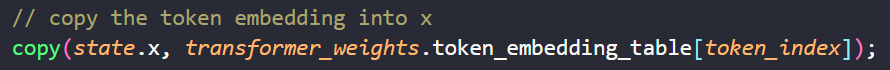

2. 对每一个transformer块，首先将向量x与当前层的wq，wk，wv相乘，得到q，k，v；

   - 注意，多头注意力实际上的实现与理论有些不一样的地方，理论上需要给每个头都维护一个wq、wk、wv，但是实际上还是和单头注意力一样，给整个qkv维护一个大的wq、wk、wv即可，因为这二者本质上是一样的，参数数量都是一样的。得到的qkv也不需要显式地将他们分离为单独的头，只要在计算attention的时候是在每个头之间计算的就行了，见下面的第五步

   

3. 然后对q和k进行位置编码

4. 将计算出来的q和v保存在kv cache指定layer的指定token处

   

5. **qkv的长度虽然是dim，但是被分成了多个头，每个头内部单独进行attention。所以外层循环是遍历dim中的每个头**，内层循环是遍历所有的token的key，用当前token的query与每个token的key做内积，将结果保存在attention score向量的对应位置中

   

6. 计算完一个头的attention score之后就可以对其进行softmax

   

7. 将softmax得到的结果和所有的val进行加权求和，将计算出来的结果保存在xb向量的对应的头的位置

   

8. **所有的头计算完毕后的结果依次保存在xb向量的对应的位置**，相当于是输入的token向量被切割成了dim / head_num，然后经过attention之后得到的结果还是 dim / head_num，最后将所有头的结果concat起来恢复成了dim的长度。**然后将xb乘以wo，将concat的结果融合，得到多头注意力最终的结果**，长度还是dim。

   

9. 后面再对这个向量做残差、rmsnorm、ffn等一系列变换，得到这个transformer块的结果，长度还是dim，保存在state的x成员变量中。下一个transformer块继续对x进行上述的操作，kqv和attention score临时向量都被覆盖，下一层的kv_cache矩阵则可以继续使用，并且依然会向其中新增key和value。

10. 所有的transformer块结束之后，输出的向量长度还是dim，我们无法对其分类，所以需要将它通过一个**全连接层（分类器）**，也就是乘以转置后的embedding_table（形状为dim * vocab_size），得到长度为vocab_size的向量，这个向量我们称之为logit。

    
    
    - 注意，对于prompt的第一个token来说，**虽然只用到最后一个token的attention结果来预测下一个token，但是prompt前面的所有token依然要计算，所以假设输入的prompt是10个token，最终得到的hidden_outputs是10 * 768**，然后提取出最后一个token 的hidden_output，1 * 768，输入到embedding_table中。

由于llama本质上是一个分类网络，所以最终的输出需要满足概率分布才行，也就是所有的值都小于1，并且加起来等于1。那么需要对logit做softmax，然后根据softmax得到的概率分布从中采样出最终的预测结果

### 采样策略

temperature：

但是softmax的结果有一个问题：它会放大原本的向量的元素之间的差距，当原本的向量中有一个数比其他数都要大很多，那么在得到的概率分布中，这个数的概率就几乎是100%，这样就降低了模型预测的随机性，也就是降低了创新性


所以我们需要在softmax过程中添加一个额外的常数t，即temperature，当t变大时，会给较低的值更多的权重，导致输出的概率分布更加均衡；当t变小时，则较大的值会有更多的权重。


gpt不允许使用大于2的temperature

那么在使用了temperature的情况下：

- 当t小于一个eps时，几乎就相当于直接选择logit中最大的数，所以就不需要进行softmax，直接对logit做argmax即可得到预测的token在vocab中的下标
- 否则就需要加上了t之后对logit做softmax，然后从softmax后的结果中采样出预测的token

除了softmax，通常还需要对logit算logprobs，即对数概率，直接对softmax的结果计算log即可。因为概率值通常在0到1之间，直接处理这些小数可能导致数值下溢（underflow）。对数转换可以将乘法操作转化为加法，这样更容易处理。

top-k：在生成下一个token时，将所有候选token（vocab_size个token）按概率从高到低排序，选出概率最高的 `k` 个token。只在这 `k` 个候选token中进行采样，忽略概率较低的token。这样避免了罕见的、概率极低的token被选中，提高生成的连贯性。

top-p：将候选token（vocab_size个token）按概率从高到低排序，选择最少数量的token，使得这些token的概率总和至少为 `p`，只在这些累积概率大于 `p` 的token中进行采样。这样可以动态调整候选token的数量：如果预测的概率分布集中于少数几个token，则只选几个；如果概率分布较均匀，则会选更多token。

通常先用top-k，再用top-p（比如vLLM）

Top-K 和 Top-P 采样都高度依赖于 token 的概率分布，而 **温度（Temperature, T） 则可以让用户控制概率分布**。

- 降低温度会使概率分布更加集中，从而使模型更有可能选择最高概率的 token。这减少了输出的随机性，生成更连贯、可预测的句子。
- 提高温度会使概率分布更平滑，从而使模型更有可能选择概率较低的 token。这可以生成更具创意和多样化的文本，但也增加了生成不连贯结果的风险

然后就可以在vocab中找到预测的token对应的具体的单词是什么，并将其输出


然后**将这一步得到的token_idx再次输入到transformer中，开始下一轮的token的预测**

所以**虽然理论上来说每一轮新的token需要结合之前所有的token一起输入，但是由于kv_cache的存在，我们将之前的token的key和value都保存起来了，所以每一轮只需要输入新的token即可**。


### llama的训练过程

在测试时，decoder输入的是前一次的输出，**在训练时，decoder的输入是正确答案**

所以在训练时可以直接把正确答案右移一位输入到decoder中，可以实现每个token并行训练。当然，在训练的时候也是使用masked self-attention的，每个query都不能看到自己后面的key。只有bert才是允许看到前后所有的token的，因为它是encoder，所以说bert是完形填空


为了方便起见，训练的时候依然是所有的token在全局与所有token做并行attention，但是对attention的结果进行mask，将不应该做attention的位置变成负无穷，这样在softmax之后这里就会变成0。（下图布局与一般的布局不同，纵轴是key，横轴是query）


**但是在推理时不需要这么麻烦，因为推理是一个个token输入的，kvcache中永远只有当前token之前的key和value，不需要也不可能与后面的token进行attention**

### LLM batch inference

当一个batch中的序列长度不一致的时候，从最短的序列处开始推理；如果推理产生的新token的位置已经有用户给定的prompt token，那么就将采样得到的token丢弃，如果没有就填充进去，下一轮和其他序列的prompt token一起推理


## cuda显存管理（alloc、buffer）

由于推理时有多个设备，cpu或者gpu，而不同设备的内存申请和释放的接口不一致，所以我们使用了一个`DeviceAllocator`类将不同设备的内存申请释放操作封装起来，它有一个`allocate`接口，负责申请该类设备下的size大小个字节。有一个`release`接口，负责回收对该设备申请得到的资源指针`ptr`。

再使用`CPUDeviceAllocator`和`CUDADeviceAllocator`两个类继承`DeviceAllocator`

CPUAllocator类就是简单地包装了一下malloc和free

而对于CUDAAllocator，为了避免频繁地调用cudaMalloc和cudaFree，它在内部维护了一个内存池


使用`CudaMemoryBuffer`类来表示一个显存块，它记录了显存的地址、大小和是否被使用，每次申请显存的时候就用得到的指针和显存的size构造一个`CudaMemoryBuffer`，然后将它push到vector中，这个vector就构成了一个内存池。并且给每个显卡都维护了一个内存池，使用map来维护显卡id到内存池的映射。内存池分为两部分，一部分用于存储小于1MB的显存块，一部分用于存储大于1MB的显存块。所以有两个map


请求时首先获取当前显卡的id；根据请求的size是否大于1MB选择不同的map，然后通过id在map中获取对应的内存池。本例中采用的分配方式是best fit，也就是**找到比请求的显存块大的最少的空闲块**。找到了空闲块之后将它的busy位置为true，并返回指针即可。如果找不到合适的空闲块，那么就需要调用cudaMalloc分配一个显存块，并且用它的指针构造一个`CudaMemoryBuffer`，push到内存池中。

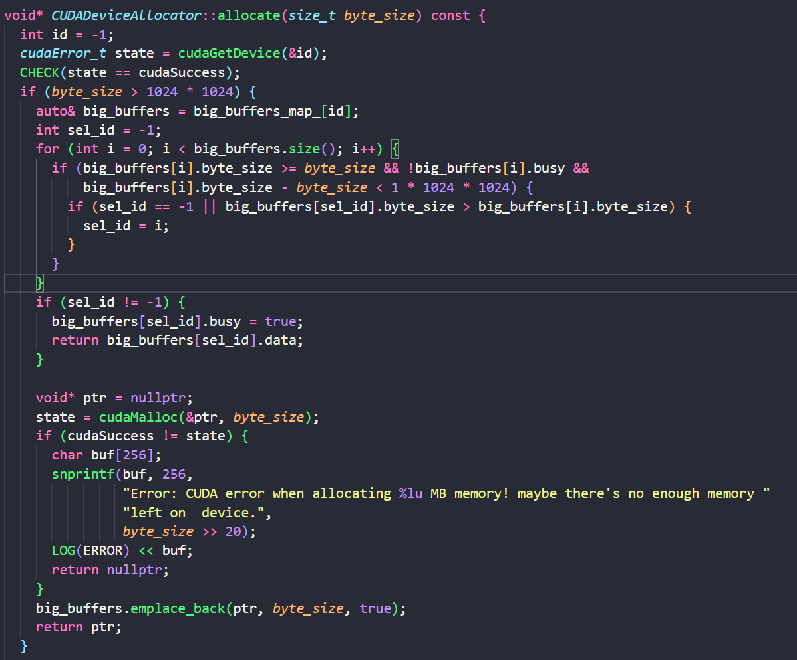

释放时需要遍历两个map中的所有内存池中所有显存块，一一对比显存块的地址和释放的地址，如果相等则将该显存块的busy位置为false


除此之外，CUDADeviceAllocator还给**每个**内存池维护了一个空闲空间计数器，从内存池分配显存时对它增加，从内存池释放显存时对它减少。每次释放时要检查一下所有内存池的空闲空间计数器，如果它大于一定阈值，就要将所有的空闲块释放，以防内存池中的空闲块太多，导致整个系统的显存不足


在Tensor中还实现了像pytorch中的`to_cuda`和`to_cpu`方法，将张量的数据从gpu上移动到cpu上。

Tensor类的成员变量如下：

```c++
class Tensor {
 public:
   // ...
   // ...
 private:
  size_t size_ = 0;
  std::vector<int32_t> dims_;
  std::shared_ptr<base::Buffer> buffer_; // buffer在初始化的时候，调用构造函数。最后tensor相关的数据指针是buffer->ptr
  base::DataType data_type_ = base::DataType::kDataTypeUnknown;
};
```

注意，在本项目中，**Tensor的数据保存在buffer中**，**buffer使用RAII机制帮Tensor管理数据的申请和数据的回收**，上层用户想要申请内存或显存空间时只需要构造一个buffer，并向其中传入申请的数据size和该数据所在的设备对应的allocator， 用户**不需要手动使用allocator中的函数**。**buffer的构造函数会使用这个allocator分配一个对应size大小的空间**，并且将地址保存在buffer内部的`ptr_`成员中。所以`buffer`中记录的`ptr_`指针既可以指向一块显存，也可以指向一块内存。

- 注意，buffer有两种用途，一个是负责申请并管理内存，一个是借用外面传入的内存地址，分别对应`ptr_` 这块内存的地址的两种来源：
  -  一种是外部直接赋值得到的， Buffer不需要对它进行管理，和它的关系是借用，**不负责它的生命周期管理**：使用Buffer buffer(32, nullptr, ptr, true)实例化，这表示我们将`ptr`指针赋值给Buffer，但是use_external=true和没有传入allocator表示buffer实例不需要负责去释放`ptr`
  - 另外一种是需要Buffer对这块内存进行管理的，所以构造时`use_external`值为false，**表示需要对它的生命周期进行管理，也就该Buffer构造的时候需要申请内存空间，将地址赋值给ptr_；析构的时候会自动将`ptr_`指向的地址用对应类型的`Allocator`完成释放。**

```c++
Buffer::Buffer(size_t byte_size, std::shared_ptr<DeviceAllocator> allocator, void* ptr,
               bool use_external) // 构造函数
    : byte_size_(byte_size),
      allocator_(allocator),
      ptr_(ptr),
      use_external_(use_external) {
  if (!ptr_ && allocator_) {
    device_type_ = allocator_->device_type();
    use_external_ = false;
    ptr_ = allocator_->allocate(byte_size); // 根据tensor的类型，buffer去调用对应设备的内存分配器去分配内、显存
  }
}
```

所以to_cuda方法要想将一个Tensor的数据从CPU上移动到GPU上，本质上就是构造一个新的buffer，将它的空间申请在GPU上（使用`CUDADeviceAllocator`分配空间），然后将原来Tensor的buffer中的数据拷贝到新的buffer上（使用allocator的memcpy方法，本质上是cudaMemcpy），最后将原来Tensor的buffer替换为这个buffer。此时原Tensor中的buffer引用计数变为0，buffer对象被析构，buffer内部维护的CPU的内存块也被释放了

```c++
void Tensor::to_cuda(cudaStream_t stream) {
    const base::DeviceType device_type = this->device_type();
    size_t byte_size = this->byte_size();
    auto cu_alloc = base::CUDADeviceAllocatorFactory::get_instance();
    auto cu_buffer = std::make_shared<base::Buffer>(byte_size, cu_alloc); // 去申请byte_size字节大小的显存
    cu_alloc->memcpy(buffer_->ptr(), cu_buffer->ptr(), byte_size, base::MemcpyKind::kMemcpyCPU2CUDA,
                 stream);
    this->buffer_ = cu_buffer;
}
```

DeviceAllocator中的memcpy方法实现了对内存和显存之间的拷贝：

- 如果拷贝的方向是内存到内存，也就是memcpy_kind是CPU2CPU，我们将直接调用memcpy方法。如果是从CPU拷贝到显存，我们将根据是否需要异步拷贝，分别调用cudaMemcpy和cudaMemcpyAsync，如果需要在显存拷贝后进行同步（need_sync），我们可以额外调用cudaDeviceSynchronize()进行同步。


## pytorch显存管理

pytorch的显存管理的主要思想是显式空闲链表

block结构体内部记录了该显存块的大小size、stream的id，显存块的地址，以及该block是否被使用。所有地址连续的block被组织在一个双向链表中，该链表中的block有空闲的，也有使用的，这样的目的是为了在释放block时方便找到前后的空闲块，将它们合并成一个空闲块，减少内存碎片

```c++
struct Block { 
    int device; // gpu

    // Block 和被分配时调用者的 stream 是绑定的，即使释放了也无法给其他 stream 使用
    cudaStream_t stream; // allocation stream

    stream_set stream_uses; // streams on which the block was used
    size_t size; // block size in bytes
    BlockPool* pool; // owning memory pool
    void* ptr; // memory address
    bool allocated; // in-use flag
    Block* prev; // prev block if split from a larger allocation
    Block* next; // next block if split from a larger allocation
    int event_count; // number of outstanding CUDA events
};
```

除此之外为了在分配时方便找到空闲的block，还维护了两个set作为block pool（内存池），一个内存池用来存放较小的block（小于1MB），一个内存池用来存放较大的block（大于1MB）。**block pool中使用一个set来存储空闲的block的指针，set按照block指针的地址从小到大对block进行排序**。

```c++
struct BlockPool {
    BlockPool(
        Comparison comparator,
        bool small,
        PrivatePool* private_pool = nullptr)
        : blocks(comparator), is_small(small), owner_PrivatePool(private_pool) {}
    std::set<Block*, Comparison> blocks;
    const bool is_small;
    PrivatePool* owner_PrivatePool; // 供 CUDA Graphs 使用，此处不详讲
};
```

所以block pool中的set就是显式空闲链表

当用户调用malloc时，会传入请求的size；根据size 的大小选择哪个pool，然后在pool中选择一个大小适中的空闲块（不知道是first fit策略还是best fit策略），如果找到了就将该block从池子中删除。

然后将申请得到的block分割成两块，一块是size的大小，另一个就是剩余的大小，并且对这两个指针和size构造新的block对象，释放原来的block对象。并且将这两个block串成一起，还是维护在原来的链表当中，将新得到的remaining的block插入到池子的set中。

- 猜测：应该有一个类来专门维护所有已分配的block，可能也包括它们的引用计数，当一个block被释放的时候引用计数减一。此类采用懒更新的方式，即使block的引用计数变成0了它也不会将其变成空闲的，依然维护在类中

如果pool中没有满足要求的空闲块，那么就进行一次垃圾回收，清理所有引用计数为0的块，将它们按照大小插入到pool中，然后再重复上面的过程在pool中查找合适的空闲块分配

如果依然没有满足要求的空闲块，那么就调用`cudaMalloc`请求新的segment，通常会请求比实际需求更大的segment，小于 1MB 的 size 分配 2MB，1MB ～ 10MB 的 size 分配 20MB，= 10MB 的 size 分配 { size 向上取整至 2MB 倍数 } MB。然后将新的segment的指针和size构造一个新的block对象，插入到pool中。注意，由于cudaMalloc得到的segment的地址不一定是相邻的，所以segment的block之间是没有指针相连的，只有segment内部切分出来的block之间才有指针相连。

如果cudaMalloc也失败了，说明系统也没有足够的显存了，那么此时需要进行碎片整理。先释放池子中比size小的最大的block，直到释放的block总和大于size，这里的释放就是直接cudaFree block中维护的指针即可。普通的释放block只会在segment内部进行碎片整理，而这个操作会在segment之间进行碎片整理。

释放完一批block之后，就再次尝试cudaMalloc。如果此时再次失败，那么就释放两个pool中所有的空闲块，然后再次调用cudaMalloc。

当释放block时，会检查它是否有相邻的block，如果有并且block空闲，那么就可以将它们合并，使用合并后的指针和size重新构造一个block，并插入pool中。

而NVIDIA 底层的物理显存分配（即cudaMalloc）是以 2 MiB 为 block 进行管理的。只有当存量不足时才会触发最底层的物理显存分配，而这将执行更复杂的驱动或硬件逻辑，所以分配时间较长

## llama2.c的模型导出和量化

export.py文件负责将给定的模型权重文件（比如huggingface预训练模型）转换成可以由我们的推理引擎进行推理的模型bin文件，相当于**将模型文件中的数据格式转换成了我们的推理引擎可以读懂的格式**。它也可以在转换模型格式的同时顺便进行量化，将原来fp32的模型权重量化成int8的权重

- 实际上对huggingface选项来说，这里的输入不是bin文件，而是一个目录

使用 `python export.py --hf ../TinyLlama-1.1B-Chat-v1.0 chat_fp32.bin`命令可以将huggingface的模型文件导出为fp32的bin模型文件

使用 `python export.py --version 3 --hf ../TinyLlama-1.1B-Chat-v1.0 chat_q8.bin `命令可以将huggingface的模型文件导出并量化成INT8的bin模型文件

`-- hf`表示输入的模型文件的格式是huggingface的格式

而`-- version`表示不同的输出格式，legacy格式是指llama.c之前用的格式，输出是FP32的；legacy_export_quant也是llama.c之前用的格式，量化成了INT8的；而名字中不带legacy的version1和version2则是llama.c现在使用的格式，区别在于现在的bin文件格式使用了正确的header，在功能上，version 1就相当于是legacy，version 2就相当于是legacy_export_quant


如下图所示，legacy的header：


version1的header：


**它的大致流程就是先将给定的模型bin文件中的权重导入到我们自己定义的Transformer模型对象中，然后遍历该对象的每一层，按照我们的推理引擎的模型文件的结构将权重导出到新的模型文件中**

1. 首先从给定的bin文件中加载fp32的模型权重

   

2. 再调用load_hf_model从config文件中读取该模型的配置，比如hidden_size，hidden_layer的层数，注意力头的个数等等

   

3. 然后使用这个配置创建一个Transformer对象

   

4. 再将fp32的模型权重赋值给Transformer对象

   

5. 然后先将模型的配置信息打包起来，写入到输出的bin文件的header中

   

6. 再遍历Transformer对象的每一层，将所有权重进行int8量化，再将量化后的权重（int8）、scale（fp32）写入输出的bin文件中。

   

   量化的粒度是分组量化，group_size是64，采用对称量化，q80表示量化后是8位，关于0对称。先将权重reshape成`(x, 64)`形状，然后计算每一组的scale，将每一组量化。最后返回量化的结果和scale

   

可以看到，此量化过程只是weight-only的量化，没有对激活进行量化（否则要进行校准）

从下图可以看出二者的权重文件的大小差距大约是四倍左右（差的一部分是因为INT8的bin文件还要存储scale）


下面是二者的推理速度，虽然是weight-only的量化，推理时需要将weight反量化回fp32，所以计算速度不变，但是整体的推理速度INT8还是快于fp32，可能是因为量化后IO变快了

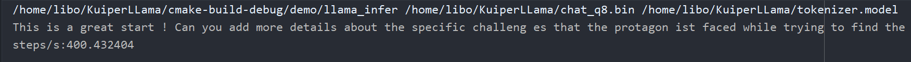


为什么推理引擎要将huggingface的模型文件变成自己的格式的模型权重文件？

- 因为huggingface的模型文件（比如model.bin文件，或者现在使用的model.safetensors文件，后者替代了bin文件，因为它更安全且高效）通常是以pytorch的state_dict格式存储的，实际上是一个字典，key是每一层权重的名字，value是权重的数据，就像下面这样

  

- 而这样的格式不是推理引擎所需要的：

  - export通常会去掉这些权重的层的名字，直接存储权重的数据；
  - 并且会改变权重的存储顺序，将相同类型的权重存储在一起，比如llama有32个Transformer块，pytorch的权重文件是将32个块的Attention权重分开存储的，而export则会将不同层的wq存储在一起，这样推理引擎在加载权重时更加方便
  - 并且推理引擎需要对权重进行缓存对齐（比如64字节对齐），这样加载得更快
  - 推理引擎可能会需要使用量化来提高推理速度，但是huggingface的权重文件通常是fp32的，所以需要由export转化成INT8格式的存储起来
  - 并且huggingface的权重文件和模型的配置信息config文件（比如隐藏层维度、最大序列长度等）通常是分开的，export脚本会在导出时将config信息保存在bin的头部中，这样推理更加方便
  - 最重要的一点：跨平台兼容性，不同框架的权重格式也不同，推理引擎需要统一的格式来运行，所以由export将各种格式的权重文件转化成推理引擎支持的单一格式的文件

## 推理引擎的模型导入和权重导入

Model类的成员变量：

```c++
class Model {
  int32_t group_size_ = 1;
  bool is_quant_model_ = false;
  std::unique_ptr<TransformerConfig> config_;  // 模型的配置信息

  std::string token_path_;
  std::string model_path_;
  std::unique_ptr<op::EncodeLayer> encode_layer_;
  std::map<ModelBufferType, tensor::Tensor> buffers_;
  std::unique_ptr<sampler::Sampler> sampler_;
  std::shared_ptr<RawModelData> raw_model_data_;   // 用于映射模型权重
  base::DeviceType device_type_ = base::DeviceType::kDeviceUnknown;
  base::ModelType model_type_ = base::ModelType::kModelTypeUnknown;
};
```

main函数一开始就将传入的token和model的路径赋值给Model对象，然后调用Model的init方法初始化model实例。有了token和model的路径之后，Model实例就可以导入模型了

在init方法中：

首先指定运行在哪张卡上，本项目只能单卡和单stream运行


然后init方法调用read_model_file方法从文件中读取权重和配置信息：首先从开头读取config配置信息，我们刚才用`struct.pack`方法打包并写入到权重文件的配置信息，都会在此时被读取出来。如果是量化模型，还需要从配置信息后面读取出group_size


读取出来之后再使用 `  auto gen_status = generate_model_infos(config);`将配置信息赋值给推理引擎中的model对象


读完了配置信息和group_size之后，就开始读取权重信息了。权重信息是通过mmap的方法读入的：

- 首先使用mmap将整个bin文件映射到model对象的`raw_model_data_->data`属性上
- 然后根据config信息在bin文件中的偏移量，**将`raw_model_data_->weight_data`属性指向bin文件中的权重所在的位置**，之后如果想要设置model的权重直接读取`raw_model_data_->weight_data`即可


上面是使用mmap从模型文件中读取了配置信息和权重（的地址）到model对象中。然后**再调用`create_layers()`方法将`raw_model_data_->weight_data`中的权重一一加载到model对象的这些算子中**

下面是llama的所有算子：有的算子只有一个，比如rope、swiglu等，而有的算子每一层都有，比如wq、wk、wv，所以它们是vector形式。这些算子类中维护了权重（如果有的话），还有前向的方法（运算过程）

```c++
struct LLama2Layers {
  std::shared_ptr<op::Layer> add_layer_;
  std::shared_ptr<op::Layer> rope_layer_;
  std::shared_ptr<op::Layer> swiglu_layer_;
  std::shared_ptr<op::Layer> mha_layer_;

  std::vector<std::shared_ptr<op::Layer>> wq_layers_;
  std::vector<std::shared_ptr<op::Layer>> wk_layers_;
  std::vector<std::shared_ptr<op::Layer>> wv_layers_;
  std::vector<std::shared_ptr<op::Layer>> wo_layers_;

  std::vector<std::shared_ptr<op::Layer>> w1_layers_;
  std::vector<std::shared_ptr<op::Layer>> w2_layers_;
  std::vector<std::shared_ptr<op::Layer>> rmsnorm_layers_;
  std::vector<std::shared_ptr<op::Layer>> w3_layers_;
  std::shared_ptr<op::Layer> cls_layer_;

  std::shared_ptr<op::Layer> embedding_layer_;
};

class LLama2Model : public Model {
  std::shared_ptr<kernel::CudaConfig> cuda_config_;
  std::unique_ptr<LLama2Layers> llama_layers_;
};
```

然后调用create_layers创建算子，分为两类算子，权重算子和非权重的算子，对于权重的算子又分为量化的模型和非量化的模型

**加载权重算子**

将权重加载给算子的基本流程是：

1. 首先使用配置信息创建该算子对象（调用构造函数实例化算子）：

   ```c++
   // 创建层本身
   llama_layers_->embedding_layer_ = std::make_shared<op::EmbeddingLayer>(device_type_, config_->dim_, config_->seq_len_, std::abs(config_->vocab_size_));
   ```

   构造函数中主要是把该算子的输入输出和权重vector中提前分配好空的tensor（将vector resize成对应的大小），并且将该算子的权重的维度保存下来，可能用于之后来检查输入输出和权重的维度是否匹配

   

   **并且构造函数还要将算子所在的设备类型保存在算子中，后续推理时调用Layer的forward方法时可以根据算子的设备类型选择使用CPU还是GPU的核函数，~~这样可以实现灵活地将不同算子在不同设备上进行推理~~实际上本项目还不支持算子的调度，只支持在同一个设备上运行**

2. 然后调用算子的set_weight方法将权重加载到算子中：

   ```c++
     const void* weight_embedding = raw_model_data_->weight(0); // 根据权重在raw_model_data_中的偏移量获取权重
   														// 由于embedding层是第一个权重，所以偏移量是0
     llama_layers_->embedding_layer_->set_weight(0, {std::abs(config_->vocab_size_), config_->dim_},  weight_embedding, cpu_device_type);
   ```

3. 算子的结构：

   ```C++
   class BaseLayer {
     std::string layer_name_;
     LayerType layer_type_ = LayerType::kLayerUnknown;
     base::DataType data_type_ = base::DataType::kDataTypeUnknown;
     base::DeviceType device_type_ = base::DeviceType::kDeviceUnknown;
   };
   class Layer : public BaseLayer {
     std::vector<tensor::Tensor> inputs_;
     std::vector<tensor::Tensor> outputs_;
     std::shared_ptr<kernel::CudaConfig> cuda_config_;
   };
   class LayerParam : public Layer {
     int32_t group_size_ = 0;
     bool is_quant_layer_ = false;
     tensor::Tensor scales_;
     std::vector<tensor::Tensor> weights_;
   };
   ```

   而set_weight方法做的事情就是：用指向权重数据的指针构造一个buffer实例，这里的buffer只是借用这个指针，因为这块地址是由mmap分配的，所以不需要由buffer来管理它的生命周期；再使用buffer构造一个tensor，然后把这个tensor赋值给算子的`weight_`即可

   ```c++
       base::Status LayerParam::set_weight(int32_t idx, const std::vector<int32_t>& dims,
                                       const void* weight_ptr, base::DeviceType device_type) {
       CHECK_GE(idx, 0);
       CHECK_LT(idx, weights_.size());
       CHECK_NE(weight_ptr, nullptr);
           
       // 3.1 计算权重的数量，计算方法是将维度依次累计相乘
       size_t size = std::accumulate(dims.begin(), dims.end(), sizeof(float), std::multiplies<>());
       // 3.2 将权重指针（这里来自于weight_data）赋值给一个buffer
       std::shared_ptr<base::Buffer> buffer =
           std::make_shared<base::Buffer>(size, nullptr, (void*)(weight_ptr), true);
       if (device_type != base::DeviceType::kDeviceUnknown) {
           buffer->set_device_type(device_type);
       }
       // 3.3 使用该buffer创建一个tensor，然后把这个tensor赋值给算子的weight_
       tensor::Tensor weight(base::DataType::kDataTypeFp32, dims);
       weight.set_device_type(device_type);
       CHECK(weight.assign(buffer)); // 把buffer指针赋值给tensor
       weights_.at(idx) = weight;    // 把tensor赋值给算子的weights_ vector
       return base::error::Success();
   }
   ```

   注意，权重有可能是量化的，如果是量化的权重，那么3.3之前的步骤不变，3.3创建的tensor的类型变成INT8的，然后给算子的`weights_`赋值完之后还需要给算子的`scales_`成员变量进行初始化：使用指向权重文件中scales所在位置的指针构造一个tensor，用该tensor去初始化`scales_`

   ```c++
       tensor::Tensor weight(base::DataType::kDataTypeInt8, dims);
       weight.set_device_type(device_type);
       CHECK(weight.assign(buffer));
       weights_.at(idx) = weight;
   	// 计算该算子权重的scale的个数
       const int32_t weight_size = static_cast<int32_t>(weight.size());
       CHECK(weight_size % group_size_ == 0);
       int32_t scale_nums = weight_size / group_size_;
       // 初始化scale张量：使用指向权重文件中scales所在位置的指针构造一个tensor，用该tensor去初始化scales_
       scales_ = tensor::Tensor{base::DataType::kDataTypeFp32, scale_nums, false, nullptr,
                                reinterpret_cast<float*>((int8_t*)weight_ptr + weight_size)};
       scales_.set_device_type(device_type);
   ```

4. 最后对权重的位置做一个偏移，以方便下一个算子找到自己的权重区域

   ```c++
     // create all matmul layer
     int32_t dim = config_->dim_;
     size_t pos = dim * std::abs(config_->vocab_size_) + dim * config_->layer_num_;
   ```

对于其他的算子流程也是一样的：下面是创建attention的wq、wk和wv矩阵，dim是Transformer中hidden_states的长度，所以对于query来说它的维度与hidden_states的长度相同，所以wq的大小是`dim * dim`；而由于本项目实现了GQA，所以是由多个query头共用一个kv头的，所以kv头的个数与query头不一样，但是kv头的长度要求与query头相同，所以key和value的维度与hidden_states的维度不一样，所以key和value的大小是`dim * kv_dim`


因为权重文件中的布局如下（N代表Transformer块的个数），所以推理框架中读取权重的顺序也要按照这个来，每次读取完一部分权重之后都要将pos移动对应的距离从而方便读取下部分的权重

```
---------------
token embedding       1 × dim × vocab size
---------------
attention rmsnorm     N × dim
---------------
weight query          N × dim × dim <==== pos
---------------
weight key            N × dim × kv_dim
---------------
weight value          N × dim × kv_dim
---------------
attention rmsnorm     N × dim
---------------
ffn rmsnorm           N × dim
---------------
w1                    N × hidden_dim × dim
---------------
w2                    N × dim × hidden_dim
---------------
w3                    N × hidden_dim × dim
---------------
final rmsnorm         dim
---------------
cls                   vocab_size × dim
---------------   
```

实际的`create_param_layers`方法中加载权重的顺序是先加载embedding层的权重和其他的所有matmul层的权重（比如wq、wk、wv、wo和w1、w2、w3和cls层（相当于是embedding层，也是一个matmul），然后再跳跃地加载剩下的所有的RMSNorm层的权重（**详见代码**）


**量化模型：**

但是**对于量化模型来说，上面描述的是非量化模型的加载过程；对于量化模型来说，export导出的文件格式是不一样的，所以加载权重的顺序也是不一样的**

非量化模型的导出顺序：是按照实际的模型的前向顺序导出的


量化模型的导出顺序：是先将所有的量化算子的权重保存在前面，然后再保存剩下的算子权重

```python
    group_size = 64
    for layer in model.layers:
        q, s, err = quantize_q80(layer.attention.wq.weight, group_size)
        serialize_int8(out_file, q)
        serialize_fp32(out_file, s)
    for layer in model.layers:
        q, s, err = quantize_q80(layer.attention.wk.weight, group_size)
        serialize_int8(out_file, q)
        serialize_fp32(out_file, s)
    for layer in model.layers:
        q, s, err = quantize_q80(layer.attention.wv.weight, group_size)
        serialize_int8(out_file, q)
        serialize_fp32(out_file, s)
    for layer in model.layers:
        q, s, err = quantize_q80(layer.attention.wo.weight, group_size)
        serialize_int8(out_file, q)
        serialize_fp32(out_file, s)

    for layer in model.layers:
        q, s, err = quantize_q80(layer.feed_forward.w1.weight, group_size)
        serialize_int8(out_file, q)
        serialize_fp32(out_file, s)
    for layer in model.layers:
        q, s, err = quantize_q80(layer.feed_forward.w2.weight, group_size)
        serialize_int8(out_file, q)
        serialize_fp32(out_file, s)
    for layer in model.layers:
        q, s, err = quantize_q80(layer.feed_forward.w3.weight, group_size)
        serialize_int8(out_file, q)
        serialize_fp32(out_file, s)

    # final classifier weights
    if not shared_classifier:
        # serialize_fp32(out_file, model.output.weight)
        q, s, err = quantize_q80(model.output.weight, group_size)
        serialize_int8(out_file, q)
        serialize_fp32(out_file, s)


    # next write out the embedding weights
    serialize_fp32(out_file, model.tok_embeddings.weight)

    # attention weights
    for layer in model.layers:
        serialize_fp32(out_file, layer.attention_norm.weight)

    # ffn weights
    for layer in model.layers:
        serialize_fp32(out_file, layer.ffn_norm.weight)

    # final rmsnorm
    serialize_fp32(out_file, model.norm.weight)
```

所以创造量化模型的权重算子时，需要将mmap区域的指针转化成int8，然后按照顺序读取group_size、权重和scale，set_weight时将scale保存在scale张量中


**非权重算子：**

在调用`create_param_layers()`方法创建完带参数的参数之后，我们就要开始创建不带权重参数的算子层，这里更加简单，因为不再需要读取权重。对于不带参数的算子层，直接调用构造函数对它们进行实例化就可以了，而没有移动`weight_data`并使用`set_weight`赋值权重的过程。

```c++
void LLama2Model::create_nonparam_layers() {
    CHECK(llama_layers_ != nullptr);
    // 创建一个rope层
    llama_layers_->rope_layer_ = std::make_shared<op::RoPELayer>(
        device_type_, config_->dim_, config_->kv_dim_, config_->head_size_);

    // 创建一个多头注意力层
    llama_layers_->mha_layer_ = std::make_shared<op::MultiHeadAttention>(
        device_type_, 0, config_->kv_mul_, 
        config_->kv_dim_, config_->seq_len_, config_->head_num_, config_->head_size_);

    // 创建add层
    llama_layers_->add_layer_ = std::make_shared<op::VecAddLayer>(device_type_);

    llama_layers_->swiglu_layer_ =
        std::make_shared<op::SwiGLULayer>(device_type_, config_->hidden_dim_);
}
```

**算子后端选择**：

算子的实现分为两种，一种是在cpu上做计算，另外一种是在gpu上做计算，我们提供了两种形式的算子，所以在调用forward的时候需要根据需要进行自由选择：**在调用get_kernel的时候会根据设备类型`device_type`选择不同的平台的算子实现**

```c++
base::Status MatmulLayer::forward() {
    auto status = check();
    if (!status) {
        return status;
    }
    if (device_type_ == base::DeviceType::kDeviceCUDA) {
        CHECK(cuda_config_ != nullptr);
    }

    kernel::get_matmul_kernel(device_type_)(get_input(0), get_weight(0), get_output(0), 1.f, cuda_config_ ? cuda_config_.get() : nullptr);
    return base::error::Success();
}
MatmulKernel get_matmul_kernel(base::DeviceType device_type) {
  if (device_type == base::DeviceType::kDeviceCPU) {
    return matmul_kernel_cpu;
  } else (device_type == base::DeviceType::kDeviceCUDA) {
    return matmul_kernel_cu;
  }
}
```

由于这些layer的权重的tensor中的buffer的指针是指向mmap的地址的，也就是说这些数据是在CPU上的，为了后续在GPU上的计算能够进行，在这些layer构造完毕后，我们还需要将它们的权重移动到GPU上


于是调用LLama2Layers类中的`to_cuda`方法，它的主要功能就是调用每个layer自己的`to_cuda`方法，而每个layer的`to_cuda`又是调用自己的input、output和weight的vector中所有tensor的to_cuda方法：此时每个算子的输入和输出的tensor都是空的，所以不需要移动，只需要将权重的tensor移动到GPU上即可。注意，**对于权重被量化的情况，也需要将scales搬运到GPU上**


而每个算子的输入和输出的tensor都是在下面的init_mem函数中完成构造的，实际上init_mem函数并没有真的对每个layer的input和output vector进行填充，它主要是为模型推理过程中的数据流（实际就是activation）分配空间（创建tensor），直接将tensor分配在GPU上即可，后续不需要再搬运

### 算子的输入与输出

```C++
enum class ModelBufferType {
  kInputTokens = 0,
  kInputEmbeddings = 1,
  kOutputRMSNorm = 2,
  kKeyCache = 3,
  kValueCache = 4,
  kQuery = 5,
  kInputPos = 6,
  kScoreStorage = 7,
  kOutputMHA = 8,
  kAttnOutput = 9,
  kW1Output = 10,
  kW2Output = 11,
  kW3Output = 12,
  kFFNRMSNorm = 13,
  kForwardOutput = 15,
  kForwardOutputCPU = 16,
  kSinCache = 17,
  kCosCache = 18,
};
class Model{
  ........
  std::map<ModelBufferType, tensor::Tensor> buffers_;
  ........
};
class LLama2Model : public Model {
  std::shared_ptr<kernel::CudaConfig> cuda_config_;
  std::unique_ptr<LLama2Layers> llama_layers_;
};
```

**在model对象中维护了一个map，用来保存算子衔接过程的中间变量（也就是activation）包括kv cache**。在初始化model时，调用init_mem方法，创建对应大小的tensor，然后插入到这个map中。

从enum中可以看出，基本上是对一个Transformer块中每个算子的输出都维护了一个tensor，后续的Transformer块可以直接复用对应的tensor用来保存数据流（activation）。**实际上在一个Transformer块内部也不是给每个算子都单独维护一个tensor，对于串联的，并且输出数据形状相同的算子来说可以共享同一个tensor**，比如在下图中可以看到，由于MHA和FFN的输出的形状与RMSNorm输出的形状相同，那么所有的RMSNorm和MHA、FFN（即W2的输出）共享同一个tensor。


这里的重点是给kv cache在GPU上分配tensor，分配的大小如下图所示；对于query则只需要分配dim大小的tensor即可，后续的Transformer块可以一直复用


也可以发现**这些tensor没有考虑是否量化，直接是FP32的，包括kv cache也是FP32的，因为本项目不考虑对激活进行量化**

```c++
class BaseLayer {
  std::string layer_name_;
  LayerType layer_type_ = LayerType::kLayerUnknown;
  base::DataType data_type_ = base::DataType::kDataTypeUnknown;
  base::DeviceType device_type_ = base::DeviceType::kDeviceUnknown;
};
class Layer : public BaseLayer {
  std::vector<tensor::Tensor> inputs_;
  std::vector<tensor::Tensor> outputs_;
  std::shared_ptr<kernel::CudaConfig> cuda_config_;
};
class LayerParam : public Layer {
  int32_t group_size_ = 0;
  bool is_quant_layer_ = false;
  tensor::Tensor scales_;
  std::vector<tensor::Tensor> weights_;
};
```

在Layer类中，有多个forward方法，其中一个forward方法不带参数，其他的forward方法的参数为输入的tensor和输出的tensor。

调用算子时会从model对象的`buffers_`中获取之前提前分配好的tensor，将它作为参数调用forward方法。

```C++
void LLama2Model::attention_rms(int32_t layer_idx, const tensor::Tensor& input) const {
  tensor::Tensor rmsnorm_output = get_buffer(ModelBufferType::kOutputRMSNorm);
  std::shared_ptr<op::Layer> rmsnorm_layer = llama_layers_->rmsnorm_layers_.at(layer_idx);
  STATUS_CHECK(rmsnorm_layer->forward(input, rmsnorm_output));
}
```

然后在带参的forward方法中，将参数中的tensor放到Layer中的`inputs_`和`outputs_`数组中。然后再调用不带参的forward方法


这个forward方法才是真正的算子的实现，由`Layer`的子类进行实现。此时算子就能从刚才设置的`inputs_`和`outputs_`数组中获取输入和输出的tensor了。

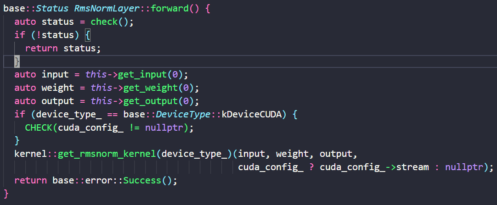

算子计算结束后将结果保存在output的tensor中。**由于Tensor的数据保存在内部的buffer指针中，而Tensor使用的是默认的拷贝构造函数，所以Tensor在拷贝时是浅拷贝，多个Tensor使用的还是同一块buffer**。所以算子对output的Tensor的数据进行修改就相当于修改了model对象的map中维护的Tensor。

```c++
class Tensor {
  std::shared_ptr<base::Buffer> buffer_;
}
```

下一个算子要获取输入就可以直接从model的map中获取

~~这样对forward方法包一层的意义是：可以增加代码的抽象程度，减少重复的代码量；如果我们不要无参的forward方法，那么就需要在每个算子类中都实现5个带参的forward方法；而使用这种方法，我们仅仅需要在每个算子类中实现一个无参的forward方法，在父类Layer中实现5个带参的forward方法，父类的方法将不同参数量的函数~~

## kv cache的实现

创建完llama主要的层并且从权重文件中导入权重之后，还需要创建**词表（也可以称为分词工具tokenizer？**词表就代表模型认识哪些文本。这里是model对象中的`encode_layer_`成员）


本项目采用了`sentencepiece`作为tokenizer，初始化时直接导入`tokenizer.model`文件即可

```c++
base::Status Model::create_encode_layer() {
  using namespace base;
  std::unique_ptr<sentencepiece::SentencePieceProcessor> spe =           										std::make_unique<sentencepiece::SentencePieceProcessor>();
  const auto& status = spe->Load(token_path_);
  config_->vocab_size_ = spe->GetPieceSize();
  // create token encode decode layer
  encode_layer_ = std::make_unique<op::EncodeLayer>(device_type_, true, false, std::move(spe));
  return error::Success();
}
```

模型的输入是一串文本，而分词器可以将输入的文本切割成token序列，再将token转换成一个词表索引序列（即每一个token对应它在词表中的索引）。接下来，我们使用嵌入词表，将这些索引序列转换为一组输入向量，我们称之为输入嵌入（input embedding）。然后，我们将这些embedding输入模型的主干


对这些输入嵌入（input embedding）执行rmsnorm操作。

在此之后，将经过rmsnorm处理的输入嵌入分别与wq、wk和wv这三个矩阵进行矩阵乘法运算，从而得到Q、K、V三个矩阵。

### GQA的实现

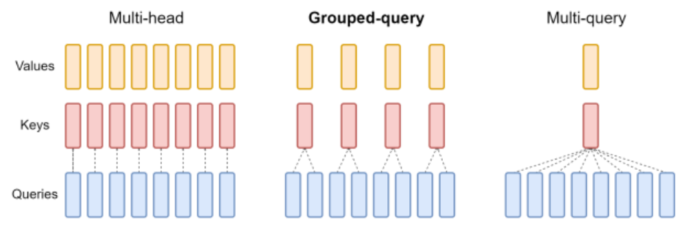

多头注意力机制(MHA)就是多个头各自拥有自己的Q,K,V来算各自的Self-Attention，而MQA(Multi Query Attention)就是Q依然保持多头，但是K,V只有一个，所有多头的Q共享一个K,V ,这样做虽然能最大程度减少KV Cache所需的缓存空间，但是可想而知参数的减少意味着精度的下降，所以**为了在精度和计算之间做一个trade-off，GQA (Group Query Attention)孕育而生，即Q依然是多头，但是分组共享K,V,即减少了K,V缓存所需的缓存空间**

从bin权重文件的头部中读取出的config如下图所示：


- `dim_`表示Transformer中hidden_states的大小，也就是经过embedding之后的大小
- `hidden_dim_`表示FFN中的hidden_states的大小
- `kv_mul_`表示query头的个数与kv头的个数的比值，也就是几个query头共用一个kv头
- **`head_size_`表示每个头的大小，注意，qkv的头的大小都是相同的，否则没法做attention**
- `head_num_`表示query头的个数，`kv_head_num_`表示kv头的个数
- `kv_dims_`表示hidden_states经过wk和wv之后得到的key和val的大小，`dim_`表示hidden_states经过wq之后得到的query的大小；因此我们可以得知，`kv_dims_ = kv_head_num_ * head_size_`，`dim_ = head_num_ * head_size_`

所以相应的，在init_mem函数中给kv cache分配的空间的大小是`kv_dim_`（这里是256），如果使用普通的MHA那么kv_cache的空间就是`dim_`（2048），因此应证了上面的说法，使用GQA可以减少8倍的kv cache 的使用空间


相应的，在 `create_param_layers`中，给qkv创建的权重wq、wk、wv也分别是`dim * dim`，`dim * kv_dim_`， `dim * kv_dim_`


## rope算子


也可以写成这样：


所以rope的计算过程基本就是

1. 根据每个token在序列中的位置和每个元素在自己的head向量中的位置，对每个token计算出一个旋转矩阵，注意，**只需要给每个token的一个head计算出旋转矩阵即可**，因为位置编码本质上就是要在一次注意力计算中区分不同pos和dim的元素，所以同一个token的不同head的位置编码是相同的，所以可以共用同一个旋转矩阵；
2. 然后将旋转矩阵与head做计算

所以旋转矩阵可以提前计算出来，并且像kv cache一样保存起来，每一个Transformer块都可以重复使用

所以在init_mem中为旋转矩阵分配了一个sin_cache和一个cos_cache，大小都是`seq_len * head_size`

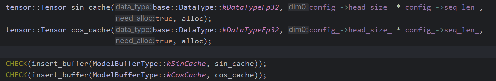

init_mem结束后就要计算旋转矩阵保存起来，


计算方式与上面的公式一样，先根据head中的每个元素的偏移计算出frequency，然后根据token的pos计算出sin和cos值，保存在sin_cache和cos_cache的对应位置；grid_size是1，block_size是head_size，也就是一个线程负责所有token的某一个维度的sin和cos的计算


## 推理流程

### embedding算子

在`LLama2Model`类的init函数调用完init_mem之后，再计算sin_cache和cos_cache，然后再实例化sampler就结束了；然后main函数开始调用generate进行正式的推理，


输入的sentence经过解码之后得到一个vector，既解码之后得到的token id；这里输入的sentence是一个“this”，得到的vector内的数字是1和910，1代表bos（begin of sentence），910就是this在词表中的id；然后将prompt的token id输入到embedding层中


这里还没有进入embedding算子，由于此时的token id是保存在vector中的int，需要先对它们做一些预处理才能输入到算子中

首先从全局的map中获取embedding算子输入的激活的tensor和输出的激活的tensor，这里就是`kInputTokens`和`kInputEmbeddings`；由于init_mem给激活分配空间时不知道prompt的长度是多少，所以采用的是encode阶段的长度，也就是长度为1，那么input_tokens和input_embeddings tensor的维度就是1和1 * dim；所以这里需要将它们reshape成prefill阶段的prompt的长度，在这个例子中就需要分别reshape成2和2 * dim（Tensor的reshape函数中，如果新的形状比旧的形状大，那么就会分配新的空间，并将旧的tensor中的数据复制过去）；

然后将prompt的token id赋值给input_tokens tensor（此时input_tokens还在CPU上，所以可以直接赋值）；然后就完成了对数据的预处理，使用这几个Tensor调用算子的forward方法


在带参的forward方法中，将参数中的tensor放到Layer中的`inputs_`和`outputs_`数组中。然后再调用不带参的forward方法


这个forward方法才是真正的算子的实现，由`Layer`的子类进行实现。此时算子就能从刚才设置的`inputs_`和`outputs_`数组中获取输入和输出的tensor了，使用他们调用具体设备的算子实现（在加载权重构造算子对象时就指定了每个算子在什么设备上运行，此时可以根据算子中保存的设备的类型调用CPU或GPU上的具体实现）

如果是cu算子，如果输入的tensor不在GPU上，就需要先复制到GPU上（对于perfill来说embedding的输入是在CPU上的，对于decode过程来说，embedding的输入是在GPU上的），然后调用核函数，grid_size是序列的长度，block_size是128，每个block负责计算一个token的embedding；**embedding的形状是32000 * 2048，本质就是使用token id找到一个2048的向量将它拷贝到output的指针中**，所以一个线程负责拷贝一个元素，按照block_size进行跳跃拷贝


然后这一层的输出结果就保存在全局map中的`input_embeddings`中（虽然input_embedings是以引用的形式传入layer中的，但是这并不是全局map中的input_embeddings也被修改的原因；而是因为buffer是以指针的形式保存在tensor中的，即使是拷贝tensor，默认的拷贝构造也是浅拷贝的，那么这些tensor会共享一个buffer，所以**layer中对激活tensor的修改也会反映到全局map中的激活tensor**），也就是prompt中所有token的embedding，这里的形状为2 * 2048

### prefill和decode

prompt的embedding开始正式进入推理阶段，这里采用的方法是从头开始遍历prompt，对每一个token依次进行推理。


对每个step首先要获取对应token的tensor来输入，prefill时是从prompt embedding中按照pos获取某个token的tensor，decode时则需要对上一次预测的token id先通过embedding层，得到token embedding，然后从token embedding中直接获取当前step的输入


获取input_tensor后就可以进行预测下一个token了，首先将input_tensor和该tensor所在的pos传入forward中，经过一系列Transformer块后将结果logits保存在全局map的forward_output中，形状为1 * vocab_size；


然后由`post_processing`对logits进行采样，如果logits是prefill阶段预测出来的，那么就直接丢弃；如果是decode阶段预测出来就由sampler进行采样


next就是预测出的下一个token的id，返回之后判断它是否是eos（end of sentence）的id，如果是就直接结束；否则就将它decode成字符输出；然后将pos加1，进行下一个step的预测


这里采样的策略很简单，直接对logits使用argmax，


既然prefill阶段产生的logit都要直接丢弃（除了prompt最后一个token的logit），为什么还要对这些token进行推理？

- 因为要让这些token计算出来的hidden_state填充kv cache；如果只有一个Transformer块的话，那么不需要对它们进行推理，直接从prompt的最后一个token开始推理就行了

### RMS Norm算子


对于Transformer块中的算子，首先是RMSNorm算子，将layer的id和fill_input从embedding中提取的输入tensor作为输入，首先从全局的map中获取RMSNorm的输出tensor，然后根据layer的id获取对应的layer对象，然后进行forward


首先对向量中的每个元素进行平方再对整个向量进行reduce

采取的方法是先将向量累积成较短的向量后再进行reduce，累积的步长是grid_size * block_size，**实际上使用整个网格的线程数作为步长进行累积更符合直觉**


由于本例中grid_size是1，所以步长直接变成了blockDim.x

```C++
template<int32_t BLOCK_DIM>
static __global__ void row_rmsnorm_f32(const float* in, const float* wei, float* out,
                                       const int size, const float eps) {
  const int tid = threadIdx.x;

  float sum = 0.0f;
  for (int i = tid; i < size; i += blockDim.x) {
    sum += in[i] * in[i];
  }

  using BlockReduce = cub::BlockReduce<float, BLOCK_DIM>;
  __shared__ typename BlockReduce::TempStorage temp;
  __shared__ float shared_val;
  sum = BlockReduce(temp).Sum(sum);
  if (threadIdx.x == 0) {
    shared_val = sum;
  }
  __syncthreads();
  sum = shared_val;
  const float scale = rsqrtf(sum / static_cast<float>(size) + eps);
  for (int i = tid; i < size; i += blockDim.x) {
    out[i] = scale * in[i] * wei[i];
  }
}
```

累加结束后使用cub库函数进行规约

`using BlockReduce = cub::BlockReduce<float, BLOCK_DIM>;`

- 这行代码定义了一个类型别名 `BlockReduce `，它表示 `cub::BlockReduce <float, BLOCK_DIM>` 模板类
  - `float`：表示要处理的数据类型是 `float`。
  - BLOCK_DIM：表示规约在BLOCK_DIM数目的线程中进行

`__shared__ typename BlockReduce::TempStorage temp;`

- `BlockReduce::TempStorage` 是 `cub::BlockReduce` 提供的用于存储临时数据的结构。所有参与归约操作的线程都会共享这个存储空间，存储它们在规约操作过程中需要的中间结果。因为**通常来讲在block的范围内我们无法直接对变量进行规约，我们需要先把变量保存在共享内存的数组中，将数组reduce到大小为32，然后warp中的每个线程从数组中取一个数存入寄存器，再调用洗牌函数**
- 这里 `typename` 的作用是明确告诉编译器：**`WarpReduce::TempStorage` 是一个类型**，并且我们在声明一个名为 `temp` 的共享内存变量。因为C++ 模板类有时会产生一些复杂的嵌套类型，当你使用模板类中的嵌套类型时，编译器在某些情况下不总是能够自动推断出该符号是一个类型名还是一个变量或其他符号。为了避免这种歧义，C++ 规定必须显式地使用 `typename` 关键字来指明模板类中的嵌套符号是一个类型。

`sum = BlockReduce(temp).Sum(sum);`

- `BlockReduce(temp)`：创建了一个 `BlockReduce` 对象，并将共享内存 `temp` 作为临时存储传递给它。该函数会在 warp 内部的所有线程中并行执行加法归约操作，将所有线程的 `sum` 加在一起，并将结果返回给指定的线程（通常是线程 0）。

最后，由于reduce 的结果保存在线程0的sum变量中，而后续其他线程也需要sum变量，所以它先将sum变量保存在共享内存的变量中，然后每个线程从该共享变量中读取sum到自己的sum中

#### 向量化存取

之前是线程0读取0,128,256,512

现在是线程0读取0,1,2,3  512,513,514,515 ........

**每个线程一次读取全局内存中相邻的多个元素**（这里是四个）。实现的方式就是将输入的数组重新解释为float4，循环的步长不变，终止条件变成元素的数目除以4

```C++
template <int32_t BLOCK_DIM>
static __global__ void row_rmsnorm_f32(float* in, float* wei, float* out, int size, float eps) {
  const int tid = threadIdx.x;

  constexpr int pack_size = 4;
  const int pack_num = size / pack_size;
  const int pack_off = pack_size * pack_num;

  float sum = 0.0f;
  float4* in_pack = reinterpret_cast<float4*>(in);
  for (int i = tid; i < pack_num; i += blockDim.x) {
    float4 in_float4 = *(in_pack + i);
    sum += in_float4.x * in_float4.x;
    sum += in_float4.y * in_float4.y;
    sum += in_float4.z * in_float4.z;
    sum += in_float4.w * in_float4.w;
  }

  for (int i = pack_off + tid; i < size; i += blockDim.x) {
    sum += in[i] * in[i];
  }

  using BlockReduce = cub::BlockReduce<float, BLOCK_DIM>;
  __shared__ typename BlockReduce::TempStorage temp;
  __shared__ float shared_val;
  sum = BlockReduce(temp).Sum(sum);
  if (threadIdx.x == 0) {
    shared_val = sum;
  }
  __syncthreads();
  sum = shared_val;
  const float scale = rsqrtf(sum / static_cast<float>(size) + eps);

  float4* wei_pack = reinterpret_cast<float4*>(wei);
  float4* out_pack = reinterpret_cast<float4*>(out);
  for (int i = tid; i < pack_num; i += blockDim.x) {
    float4 in_float4 = *(in_pack + i);
    float4 wei_float4 = *(wei_pack + i);
    *(out_pack + i) =
        make_float4(scale * in_float4.x * wei_float4.x, scale * in_float4.y * wei_float4.y,
                    scale * in_float4.z * wei_float4.z, scale * in_float4.w * wei_float4.w);
  }

  for (int i = pack_off + tid; i < size; i += blockDim.x) {
    out[i] = wei[i] * in[i] * scale;
  }
}

```

计算完后将结果保存在全局map的rmsnorm_output中

### attention qkv


**而wq、wk和wv layer实际上就是sgemv（甚至都不是matmul）**

对于cpu部分的矩阵乘法操作我们是使用armadillo矩阵库进行的，但是由于armadillo矩阵库采用列主序的存储方式，所以当我们将数据存储在armadillo的Mat结构中时，会发生转置


```c++
inline Mat(eT* aux_mem, const uword aux_n_rows, const uword aux_n_cols, const bool copy_aux_mem = true, const bool strict = false);
```

参数`copy_aux_mem`设置为false，意味着我们直接使用arr数组存储空间直接来初始化矩阵，而不需要对arr数组进行额外的拷贝操作。

所以matmul_cpu算子的流程如下：首先我们获得输入、输出和权重指针，随后再**复用**这些输入、输出和权重数据的空间创建armadillo中的矩阵实例，最后再将输入和权重相乘得到最后的结果。

```c++
void matmul_kernel_cpu(const tensor::Tensor& input, const tensor::Tensor& weight,
                       const tensor::Tensor& output, float scale,
                       const CudaConfig* config) {
  // ...
  // ... 省略参数检查的部分
  // ... ...

  const float* input_ptr = input.ptr<float>();
  const float* weight_ptr = weight.ptr<float>();
  const float* output_ptr = output.ptr<float>();

  const int32_t wei_dim0 = weight.get_dim(0);
  const int32_t wei_dim1 = weight.get_dim(1);

  arma::fmat input_mat(const_cast<float*>(input_ptr), in_dim1, in_dim0, false, true);
  arma::fmat weight_mat(const_cast<float*>(weight_ptr), wei_dim1, wei_dim0, false, true);
  arma::fmat output_mat(const_cast<float*>(output_ptr), in_dim1, wei_dim0, false, true);
  output_mat = ((input_mat * weight_mat)) * scale;
}
```

#### gemv

对于GPU部分的则是cuda的gemv

gemv本质上是对权重矩阵的每一行与输入向量逐元素相乘之后做reduce，所以由一个block来负责矩阵的一行，并且采用向量化读取，一个线程一次读取四个相邻的元素，所以第一步累加时的步长是THREAD_PER_BLOCK * 4，累加到block_size大小的共享内存数组中；然后对此数组做block reduce，将结果存在output向量的对应行中

```c++
template <int THREAD_PER_BLOCK, int ROW_PER_BLOCK>
__global__ void matmul_kernel_cu_fp32(const float* input, const float* weight, float* output, int M,
                                      int K) {
  __shared__ float sdata[THREAD_PER_BLOCK];
  unsigned int tid = threadIdx.x;

  int start_row = blockIdx.x * ROW_PER_BLOCK;
  int end_row = start_row + ROW_PER_BLOCK;
  if (start_row >= K) {
    return;
  }
#pragma unroll
  for (int p = start_row; p < end_row; ++p) {
    sdata[tid] = 0;
    int row_offset = p * M;
#pragma unroll
    for (int i = tid * 4; i < M; i += THREAD_PER_BLOCK * 4) {
      float part_sum = 0.f;
      float4 input_float4 = *(float4*)(input + i);
      float4 weight_float4 = *(float4*)(weight + row_offset + i);
      if (i < M) {
        part_sum += weight_float4.x * input_float4.x;
      }

      if (i + 1 < M) {
        part_sum += weight_float4.y * input_float4.y;
      }

      if (i + 2 < M) {
        part_sum += weight_float4.z * input_float4.z;
      }

      if (i + 3 < M) {
        part_sum += weight_float4.w * input_float4.w;
      }
      sdata[tid] += part_sum;
    }
    __syncthreads();

    using BlockReduce = cub::BlockReduce<float, THREAD_PER_BLOCK>;
    __shared__ typename BlockReduce::TempStorage temp;
    float part_sum = BlockReduce(temp).Sum(sdata[tid]);
    __syncthreads();

    if (tid == 0) {
      output[p] = part_sum;
    }
    __syncthreads();
  }
}
```

##### int8量化

本项目做的是weight-only的int8量化，主要是对gemv的权重做的量化，也就是wq、wk、wv、wo、w1、w2、w3这七个权重矩阵，因为它们占据了整个网络90%以上的参数量（embedding=32000 * 2048， 主干网络=24 * Transformer_block = 24 * ( 7 * 2048 * 2048 + 2 * 2048）。量化的方式在export文件中，使用group_size=64进行分组量化。

调用量化gemv算子时，将scale和group_size也传入其中，计算过程依然是一个block负责权重矩阵的一行，每个线程按照block_size为步长负责计算一个权重元素与向量的一个元素的相乘，然后累加；区别是每个线程要根据自己在权重矩阵中的位置idx，计算出当前元素属于哪个group，从而在scale数组中找到自己的scale，然后在input和weight计算时将scale也乘上去即可。

后续则是照常对累加完的共享内存做block reduce

```c++
template <int THREAD_PER_BLOCK, int ROW_PER_BLOCK>
__global__ void matmul_kernel_cu_fp32int8(const float* input, const int8_t* weight,
                                          const float* scales, const int32_t group_size,
                                          float* output, int M, int K) {
  __shared__ float sdata[THREAD_PER_BLOCK];
  unsigned int tid = threadIdx.x;

  int start_row = blockIdx.x * ROW_PER_BLOCK;
  int end_row = start_row + ROW_PER_BLOCK;
  if (start_row >= K) {
    return;
  }
  for (int p = start_row; p < end_row; ++p) {
    sdata[tid] = 0;
    for (int i = tid; i < M; i += THREAD_PER_BLOCK) {
      const int weight_idx = p * M + i;
      const int group_idx = weight_idx / group_size;
      sdata[tid] += input[i] * scales[group_idx] * static_cast<float>(weight[weight_idx]);
    }
    __syncthreads();

    using BlockReduce = cub::BlockReduce<float, THREAD_PER_BLOCK>;
    __shared__ typename BlockReduce::TempStorage temp;
    float part_sum = BlockReduce(temp).Sum(sdata[tid]);
    __syncthreads();

    if (tid == 0) {
      output[p] = part_sum;
    }
    __syncthreads();
  }
}
```

#### rope

然后计算出q和k之后，对二者使用rope，rope的实现也很简单，就是逐元素的操作，每个线程负责一个元素，从sin和cos cache的对应位置读取出该元素的sin和cos值，然后将计算的结果原地保存在q和k之中即可


### MHA算子

由于采用了kv cache，所以MHA算子是输入一个token，然后将该token的query与之前所有token的key和value做attention。**一个线程块负责一个query head 与之前所有token的kv的计算，内部一个线程负责该query head与某一个token的kv的计算**

所以`float* query`的大小是dim，`float* score_ptr`的大小是head * seq_len（每个query head计算出seq_len个attention score），`float* output`的大小是dim，kv cache的大小是seq_len * kv_dim * layer_nums

最开始是每个线程负责query_head与一个key_head的内积（线程内部遍历query_head和key_head的元素进行内积），内积结束之后对score_head进行softmax。最后使用score_head对value_head进行加权求和，此时又变成每个线程负责value_head的一个元素了（线程内部遍历每个value_head，对这一个元素进行加权求和）

```C++
__global__ void multi_head_attention_kernel(int32_t pos, int32_t seq_len, float* query,
                                            float* score_ptr, float* output, float* key_cache,
                                            float* value_cache, int32_t kv_dim, int32_t kv_mul,
                                            int32_t head_num, int32_t head_size,
                                            int32_t layer_offset) {
  int head = blockIdx.x;
  if (head >= head_num) {
    return;
  }

  float* query_head = query + head * head_size; // query是1维的，形状为dim
  float* score_head = score_ptr + head * seq_len; // score_ptr是2维的，形状为head_num * seq_len，score_head是1维												   的，形状为seq_len
  float scale = 1.f / sqrtf(head_size);
  // 选择该query head对应的kv head
  int32_t head_offset = (head / kv_mul) * head_size; 
  // 最开始是每个线程负责query与一个key的内积,所以遍历所有的key，直到pos
  for (int t = threadIdx.x; t <= pos; t += blockDim.x) {
    float* key_head = key_cache + layer_offset + t * kv_dim + head_offset; // 定位到当前的key
    float score = 0.0f;
     // 具体的内积操作（循环展开）
#pragma unroll
    for (int i = 0; i < head_size; i += 4) {
      float4 key_head_float4 = *reinterpret_cast<float4*>(key_head + i); 
      float4 query_head_float4 = *reinterpret_cast<float4*>(query_head + i);
      if (i < head_size) {
        score += key_head_float4.x * query_head_float4.x;
      }
      if (i + 1 < head_size) {
        score += key_head_float4.y * query_head_float4.y;
      }
      if (i + 2 < head_size) {
        score += key_head_float4.z * query_head_float4.z;
      }
      if (i + 3 < head_size) {
        score += key_head_float4.w * query_head_float4.w;
      }
    }

    score *= scale;
    score_head[t] = score;
  }
  __syncthreads();
  // 内积结束之后对score进行softmax
  softmax_gpu(score_head, pos + 1);
  __syncthreads();

  float* output_head = output + head * head_size; // output是一维的，形状为dim
  head_offset = layer_offset + (head / kv_mul) * head_size;
  // 每个线程负责一个head中的一个元素
  for (int i = threadIdx.x; i < head_size; i += blockDim.x) {
    float value = 0.0f;
   // 遍历token进行加权求和
#pragma unroll
    for (int t = 0; t <= pos; t++) {
      float* value_head = value_cache + head_offset + t * kv_dim;
      float score = score_head[t];
      value += score * value_head[i];
    }
    output_head[i] = value;
  }
}
```

softmax：softmax就是对一个向量进行计算，所以很简单，每个线程负责一个元素，按照block_size为步长，算max和算sum的时候都是先在整个向量中计算，然后对block进行reduce，得到最后的结果，再将结果通过共享变量分发给每个线程

- 注意下面的代码是在`multi_head_attention_kernel`中启动的，multi_head_attention_kernel核函数启动时有多个block，所以下面的代码也是由多个block执行的，但是由于它的步长是block_size，所以实际上只用到了一个block计算；**因为它需要对全局做reduce操作，所以只能使用一个block进行**。

```c++
__device__ void softmax_gpu(float* __restrict__ x, int size) {
  int tid = threadIdx.x;
  int step = blockDim.x;

  // find max value (for numerical stability)
  float max_val = tid < size ? x[tid] : 0;
  for (int i = tid + step; i < size; i += step) {
    if (x[i] > max_val) {
      max_val = x[i];
    }
  }
  using BlockReduce = cub::BlockReduce<float, 128>;
  __shared__ BlockReduce::TempStorage temp;
  __shared__ float shared_val;
  max_val = BlockReduce(temp).Reduce(max_val, cub::Max());
  if (threadIdx.x == 0) {
    shared_val = max_val;
  }
  __syncthreads();
  max_val = shared_val;

  float sum = 0.0f;
  for (int i = tid; i < size; i += step) {
    x[i] = expf(x[i] - max_val);
    sum += x[i];
  }
  sum = BlockReduce(temp).Sum(sum);
  if (threadIdx.x == 0) {
    shared_val = sum;
  }
  __syncthreads();
  sum = shared_val;

  for (int i = tid; i < size; i += step) {
    x[i] /= sum;
  }
}
```

### MLP层

MLP层又叫FeedForward（前馈神经网络）层是深度学习框架中的一个核心组件，其主要职责是对上一层传递来的特征进行非线性变换。一个典型的FFN包含两个线性变换层，这两个层之间通过一个激活函数（如ReLU或GELU）相连。


在MLP结构中，共有三个矩阵乘法操作，分别命名为gate、up_proj和down_proj。up_proj和gate这两个操作都是矩阵乘法，它们将hidden_states的维度映射到更高的维度；down_proj操作再将维度降回输入的维度

mlp的整体流程：

输入的`input embedding`首先会通过`rmsnorm`层进行归一化处理，`w1`线性层会对`rmsnorm`层的输出进行映射，从而得到`w1_output`。接着，`w3`线性层同样对`rmsnorm`层的输出进行映射，得到`w3_output`。然后这两个张量将被送入Swiglu算子中进行运算，并将运算结果再次保存到`w1_output`中。然后，将`w1_output`通过`w2`线性层进行映射，得到输出`w2_output`。

紧接着，`w2_output`将与MLP模块的输入`input`相加（即图中的残差连接）以得到本模块的最终输出，并将该输出保存回`input`张量中（此处实现了空间复用）。

```c++
void LLama2Model::feed_forward(int32_t layer_idx, const tensor::Tensor& input) const {
  // ffn rmsnorm的输出为ffn_norm_output
  tensor::Tensor ffn_norm_output = get_buffer(ModelBufferType::kFFNRMSNorm);
  const auto& ffn_rmsnorm = llama_layers_->rmsnorm_layers_.at(layer_idx + config_->layer_num_);
  ffn_rmsnorm->forward(input, ffn_norm_output);

  // w1_layer.weight @ ffn_norm_output 结果存放于w1_output, 也就是x1
  tensor::Tensor w1_output = get_buffer(ModelBufferType::kW1Output);
  const auto& w1_layer = llama_layers_->w1_layers_.at(layer_idx);
  w1_layer->forward(ffn_norm_output, w1_output);  

  // w3_layer.weight @ ffn_norm_output 结果存放于w3_output，也就是x2
  tensor::Tensor w3_output = get_buffer(ModelBufferType::kW3Output);
  const auto& w3_layer = llama_layers_->w3_layers_.at(layer_idx);
  w3_layer->forward(ffn_norm_output, w3_output);

  // SwiGLU SWiglu(x1,x2) = SiLU(x1) 点乘 x2
  llama_layers_->swiglu_layer_->forward(w1_output, w3_output, w1_output);

  // w2_layer.weight @ w1_output 得到最终的结果。
  tensor::Tensor w2_output = get_buffer(ModelBufferType::kW2Output);
  const auto& w2_layer = llama_layers_->w2_layers_.at(layer_idx);
  w2_layer->forward(w1_output, w2_output);
  
  // residule add input = input+w2_output,w2_output是mlp整个的最终输出。
  llama_layers_->add_layer_->forward(input, w2_output, input)
}
```


### Swiglu算子


这个过程就是swiglu激活函数，具体计算方式如下：


CPU实现：

```c++
void swiglu_kernel_cpu(const tensor::Tensor& input1, const tensor::Tensor& input2,
                       const tensor::Tensor& output, void* stream) {
  arma::fvec input1_vec(const_cast<float*>(input1.ptr<float>()), input1.size(), false,
                        true);
  arma::fvec input2_vec(const_cast<float*>(input2.ptr<float>()), input2.size(), false,
                        true);
  arma::fvec output_vec(const_cast<float*>(output.ptr<float>()), output.size(), false,
                        true);
   // armadillo的%是逐元素相乘
input1_vec %= (1.0f / (1.0f + arma::exp(-input1_vec))); // input1_vec = input1_vec 逐点相乘 sigmoid(input1_vec)
  output_vec = input1_vec % input2_vec;
}
```

CUDA实现：

**swiglu都是逐元素做操作，这种算法用cuda实现是最简单的：一个线程负责一个元素**，由于`silu(x1)`操作要读取x1两次，所以这里每个核函数都先将x1从全局内存`in1`中读取到共享内存中，顺便也把`in2`读取到共享内存中了，所以需要开辟2 * block_size的共享内存。所以这里核函数启动使用了动态共享内存分配的语法，`swiglu_kernel_cu_fp32<<<blocks, threads, shmem>>>`。

```c++
__global__ void swiglu_kernel_cu_fp32(int size, const float* in1, const float* in2, float* out) {
  int tid = threadIdx.x;
  int idx = threadIdx.x + blockDim.x * blockIdx.x;
  if (idx >= size) {
    return;
  }
  extern __shared__ float shared_mem[];
  float* smem1 = shared_mem;
  float* smem2 = shared_mem + blockDim.x;
  smem1[tid] = in1[idx];
  smem2[tid] = in2[idx];
  __syncthreads();
  float value = 1.0f / (1.0f + exp(-smem1[tid])); // 共享内存当中取数据
  smem1[tid] = smem1[tid] * value;

  out[idx] = smem1[tid] * smem2[tid];
}

void swiglu_kernel_cu(const tensor::Tensor& input1, const tensor::Tensor& input2,
                      const tensor::Tensor& output, void* stream) {

  int size = static_cast<int32_t>(input1.size());
  int threads = 128;
  int blocks = (size + threads - 1) / threads;
  const size_t shmem = threads * sizeof(float) * 2;
  if (!stream) {
   // 取启动核函数
    swiglu_kernel_cu_fp32<<<blocks, threads, shmem>>>(
        size, input1.ptr<float>(), input2.ptr<float>(), const_cast<float*>(output.ptr<float>()));
  } else {
    cudaStream_t stream_ = static_cast<cudaStream_t>(stream);
    swiglu_kernel_cu_fp32<<<blocks, threads, shmem, stream_>>>(
        size, input1.ptr<float>(), input2.ptr<float>(), const_cast<float*>(output.ptr<float>()));
  }
}
```


# vLLM


## paged attention

vLLM 主要用于快速 LLM 推理和服务，具有诸多特点，其快速体现在:

- **最好的服务吞吐性能**
- 使用 **PagedAttention** 优化 KV cache 内存管理，**在无需任何模型架构修改的情况下，可以做到比 HuggingFace Transformers 提供高达 24 倍的 Throughput**。
- 动态 batch
- 优化的 CUDA kernels

LLM服务的性能受到内存瓶颈的影响，主要体现在kvcache上：

- 显存占用大：在 LLaMA-13B 中，缓存单个序列最多需要 1.7GB 显存；
- 动态变化：KV cache的大小取决于序列长度，而序列长度是高度可变和不可预测的，所以只能预留很大的kv cache空间。由于碎片化和过度保留，现有系统浪费了 60% - 80% 的显存。

使用了paged attention后 kv cache 的分配可以 just-in-time，而不是 ahead-of-time：当启动一个新的生成任务时，框架不需要分配大小为 `batch_size * max_sequence_len * layers * dim` 的连续 cache。 

**paged attention本质就是用页表来管理kv cache的分配，一个请求（request）就相当于os中的一个进程**。它将token序列分成固定大小的块，比如一个block四个token；然后维护一个类似页表的结构，按照token在序列中的逻辑顺序维护他们对应的物理块号。

如果token的idx是5，那么可以根据5 / 4等于1找到它在页表中的对应pte，然后根据pte可以找到对应的物理块号，再根据5 % 4等于1可以找到它在物理块中的偏移位置。


当新的token产生后，还是按照上面的步骤找到该token对应的物理位置并将其保存


如果物理块不够了，新的token会触发物理块的分配。比如新产生了第九个token，那么它根据idx在页表中查找到的pte是空的，则会请求分配一个新的物理块，将新分配的物理块号添加到pte，然后将新产生的token填入该物理块中


PagedAttention 还有另一个关键优势 —— 高效的内存共享。例如在并行采样中，多个输出序列是由同一个 prompt 生成的。在这种情况下，多个输出序列的prompt 的kv cache可以共享，并且计算也可以共享

PagedAttention 中的不同序列可以通过将它们的逻辑块映射到同一个物理块的方式来共享块。


为了确保安全共享，PagedAttention 会对物理块的引用计数进行跟踪，并实现Copy-on-Write机制。当一个序列开始向共享的物理块中输出自己预测的token时，检测到物理块的引用计数大于1，就会该物理块中的内容复制到另一个物理块中，将该物理块的引用计数减一，将pte指向新的物理块，然后将新的token写入该块中


然后不同的序列照常生成新的token


PageAttention 的内存共享大大减少了复杂采样算法的内存开销，例如并行采样和集束搜索的内存使用量降低了 55%。这可以转化为高达 2.2 倍的吞吐量提升。

**vLLM的调度：**

调度本质还是内存管理的问题，如果某一时刻显存满了，但是所有请求都没有完成，此时就会死锁。所以vLLM的调度机制与os基本差不多

1. 采用先来先服务算法
2. 如果显存满了，就把最后到达的请求的推理中断，称为抢占。对于被抢占的请求，vLLM有两种处理方式：
   1. swap：将它的执行暂停，然后将它的kv cache swap到cpu的内存中。OS的swap策略是以page为单位，vLLM的swap策略是将被暂停的请求的所有block都swap出去（all or nothing）。等显存充足时，再将这些block恢复到显存上，并将请求继续执行
   2. recomputation：对于有些任务（比如parallel sampling中并行采样数n=1的任务），当它们被抢占时，可以不做swap，而是直接释放它们的物理块，把它们重新放入等待处理的队列中，**等后续资源充足时再重新从prefill阶段开始做推理**.

## vLLM的整体架构

vLLM有两种调用方式：

1. **Offline Batched Inference**（**同步**，离线批处理）。离线同步批处理是指：等一个batch的数据齐全后一起发送，然后整个batch的数据一起做推理，最后等一个batch的数据全部推理完毕后，一起返回推理结果。
2. **API Server For Online Serving**（**异步**，在线推理服务），主要支持的API类型为**OpenAI-Compatible API Server**，兼容了OpenAI请求格式的server

**在代码实现上，vLLM首先实现了一个推理内核引擎(LLMEngine)，在此基础上封装了上述两种调用方法**

vLLM的两种调用方式与内核引擎LLMEngine的关系如下：


同步离线批处理方式主要通过LLM对象调用LLMEngine的方法进行，比如LLMEngine收到了一个很大的batch

- `add_request()`：该方法会把batch中的每一条请求包装成vLLM能处理的数据类型（SequenceGroup），放到调度器的waiting队列中。

  - **在LLMEngine中，这个函数是按照“同步”的方式设计的**，也就是它被设计为“遍历batch中的每条数据，然后做相应处理”。所以这个函数本身只适合批处理场景。在异步的online serving中将会把它重写成异步的形式。

- `step()`：负责执行一个推理阶段（prefill算一个推理阶段，每个decode算一个推理阶段），在这个函数中，vLLM会用调度策略从waiting队列中选择请求，放入running队列中，并且给这些请求分配好需要的物理块（这些信息都被作为metadata放在要送给模型做推理的数据中）。直到它认为这些请求的一个阶段的推理会打满它为一个推理阶段分配的显存。此时waiting队列中可能还会剩一些请求

  然后vLLM会根据请求的metadata，采用PagedAttention方法，对running队列中的请求做推理。如果这个推理阶段完成之后，有的请求已经生成完了（遇到了`<eos>`），就将这些请求从running队列中移除，并释放它占据的物理块

- **`abort_request`**：在推理过程中，并不是所有的请求都能有返回结果。比如客户端断开连接时，这个请求的推理就可以终止了（abort），这个函数就被用来做这个操作。

将LLMEngine包装成离线批处理之后，所有数据必须等到一起做完推理才能返给我们，所以**在vLLM中，即使是同步形式的离线批处理，其背后的内核引擎也是按动态batch的形式来实现的**

所以可以看到，Scheduler是采用iterative-level（常称 continous batching）的策略对请求进行调度，调度的粒度更小，以iteration为粒度进行调度（一个iteration生成一个token），即在每个step时重新从running队列中选择请求进行调度，直到显存被打满。**vLLM 能够在每一轮新的迭代时选择不固定数量的请求进行处理（即 batch size 每次都不一定相同），因此它能够尽可能多地处理请求**。提前完成的请求后面就不会被调度了，可以让新的请求被调度。

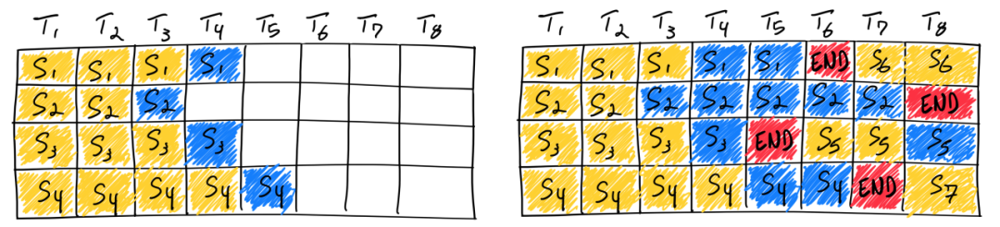

目前对 iterative-level 的实现有两种方式，一种是区分填充阶段和生成阶段，另一种是不区分这两个阶段，本质上就是**同一个 batch 里被处理的请求是否均处于同一个阶段（例如填充阶段或者生成阶段）**。vLLM 采用的 iterative-level 策略是区分两个阶段的，即同一批被调度的请求要么都处于填充阶段，要么都处于生成阶段，这和 huggingface 的 TGI 推理库一致。而提出 iterative-level 策略的 Orca 系统是不区分这两个阶段的。


异步在线推理核心处理逻辑封装在`AsyncLLMEngine`类中，而它继承自`LLMEngine`类

LLMEngine采用这种形式，则对**异步在线推理**就很方便了：当一条条请求发来时，它们都进入LLMEngine调度器（Scheduler）的waiting队列中；由于在线服务是异步的，先推理完成的数据就可以先发给客户端了（如果采用流式传输，也可以生成多少先发多少）。

vLLM的整体架构：

LLM对象中维护了LLMEngine对象：


**LLMEngine可以具体分成两个部分：分别是负责请求调度的 Scheduler 和负责模型推理的 Worker**：

1. Centralized Controller，也就是调度器(Scheduler)。调度器下维护着BlockSpaceManager。它负责管理BlockAllocator（实际参与分配物理块的类）。BlockAllocator又分成gpu和cpu两种类型，分别管理这两类设备上的物理块。

   

2. Distributed Workers，也就是分布式系统，Worker 是运行 model 的单位，对于每个 device（也即每张卡）创建一个 Worker，一个worker负责维护一张GPU上的kv cache和该GPU上的执行。它将我们要使用的模型load到各块卡上，然后对Controller传来的数据做1次推理，返回相关结果。一个 `LLMEngine` 管理所有的 workers。

   如果模型过大，可以将模型切分到多个 Worker 共同完成请求的处理。假设模型有 4 层，现在有 4 张卡，可以设置 Tensor Parallel=4，则将模型切分为 4 份，每张卡存放模型的一部分。

   

   在每个Worker实例中又管控着如下两个重要实例：

   - **CacheEngine：**负责管控gpu/cpu上的KV cache物理块（调度器的block manager只负责物理块id的分配，CacheEngine则是根据这个id分配结果实打实地在管理物理块中的数据）
   - **Worker.model**：即vLLM代码中的model_runner。它负责加载模型，并执行推理。PagedAttention的相关逻辑，就在这个实例关联的代码下。

## vLLM数据结构

由于可能会出现一个prompt输出多个outputs的情况（比如parallel sampling和束搜索），所以**使用`SequenceGroup`结构来对一个prompt推理出的所有序列进行管理，每个序列属于一个Sequence实例**。

**SequenceGroup中有一个字典，维护了序列id到Sequence实例之间的映射**。还有一个metrics成员，记录了该seq_group用于调度的一些指标，调度器在选择时会根据这些指标来做决策。**一个SequenceGroup中的所有Sequence共享一个prompt**

Sequence中则维护了一个`LogicalTokenBlock`的数组。

- 每个`LogicalTokenBlock`中也维护了一个数组，**该数组用于存放这个逻辑块中的token的id**（在vllm中每个逻辑块的槽位是16个），还维护了此逻辑块中使用了多少槽位，从而方便对该逻辑块插入新的token。所以**一个序列的文本信息相当于被分词变成token id之后存储在逻辑块中**。


每个seq下有若干状态(status)属性，包括：

- `WAITING`：正在waiting队列中。waiting队列中的序列都没有做过prefill，所以waiting队列中的seq_group只有一个seq，即是原始的prompt
- `RUNNING`：正在running队列中，即已经开始做推理。准确的说，**running队列中存放的是上一个推理阶段被送去做推理的seq_group们**，在新一轮推理阶段开始时，Scheduler会更新running队列，决定本轮送哪些seq_group去推理。
- `SWAPPED`：正在swapped队列中，表示此时gpu资源不足，相关的seq_group被抢占，导致其暂停推理，相关的KV block被置换到cpu上（swap out），等待gpu资源充足时再置换回来重新计算（swap in）。

若干和Finish相关的状态，表示该seq推理已经结束，具体包括：

- `FINISHED_STOPPED`：正常执行完毕，例如碰到`<eos>`符号，该seq的推理正常结束了
- `FINISHED_LENGTH_CAPPED`：因为seq的长度达到最大长度限制，而结束推理
- `FINISHED_ABORTED`：因不正常状态，而被终止的推理。例如客户端断开连接，则服务器会终止相关seq的推理
- `FINISHED_IGNORED`：因prompt过长而被终止执行的推理。本质上也是受到长度限制

上面的这些`SequenceGroup`保存在Scheduler的三个队列中。

除此之外，**Scheduler的`BlockManager`中维护了一个block_table**，它是一个字典，形式如`{seq_id: List[PhysicalTokenBlock]}`，**维护着整个系统中每个Sequence实例到它的block_table之间的映射**。每个Sequence的block_table也是一个`PhysicalTokenBlock`的数组，所以在计算Attention时可以根据Sequence实例的id和token在Sequence的逻辑块list中的位置找到该token对应的物理块。

- **`PhysicalTokenBlock`类中什么也没有，只有该物理块在设备中block index和该物理块的引用计数**，可以理解为 KV cache block 的状态表示，它们之间是一一对应的关系，所以在`BlockAllocator`请求分配 block 时实际上分配的是 physical token block，但真正进行计算（推理）时操作的是 KV cache block

所以本质上

- 每个seq维护自己的一份逻辑块列表
- BlockManager中的self.block_tables则记录着每个seq下的物理块列表


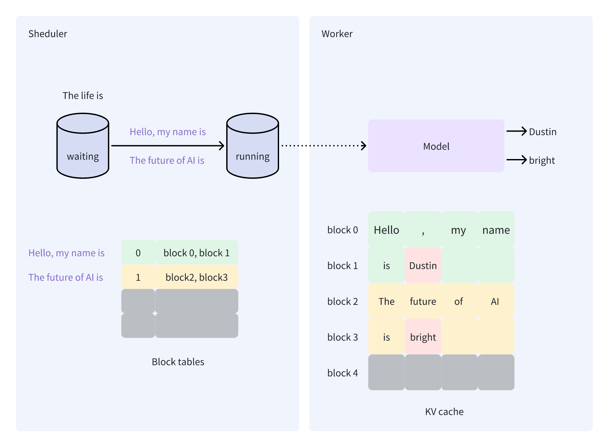


在`BlockManager`下维护着CPU和GPU两个设备的BlockAllocator，并且它的allocator分为两种，一种是`UncachedBlockAllocator`，一种是`CachedBlockAllocator`（二选一）。

`UncachedBlockAllocator`实例在构造的时候会传入给kvcache使用的物理块有多少（这个值在LLMEngine构造时计算出来，等于GPU的空闲空间除以每个物理块所需要的空间，后者的计算方式是：kv_dim * kv_num * layer_num），然后`UncachedBlockAllocator`会构造出这么多的物理块，并且按顺序赋给它们block idx，将它们**维护在一个list中作为空闲的物理块列表**。

- `allocate`：分配物理块的时候只需要从free list中pop一个，然后将它的引用计数置为1即可。
- `free`：释放物理块的时候只需要将它的引用计数减一，如果引用计数变为0了，那么就将其加入free list中

`CachedBlockAllocator`则可以更好地处理不同序列prefix相同的情况，从而节省内存。它在内部**有一个字典`cached_blocks`，维护了所有正在被使用的物理块hash值到该物理块的映射**。还有一个evictor，它的内部也有一个字典`free_table`，维护了所有曾经被使用过但是现在空闲的物理块的hash值到该物理块的映射；它的存在就是为了可以重复利用之前分配过的kvcache。所谓**物理块的hash值，实际上是这个物理块所处的序列中，从开头的块到该物理块的所有token id合在一起的hash值**。


- `allocate`：用户请求分配物理块时会传入对应逻辑块的hash值，如果该hash值在evictor的free_table中或者在cached_blocks中，那么可以将对应的物理块移动到`cached_blocks`中，并且refcnt加一，返回该物理块。如果都不在，那么就创建一个新的物理块，如果物理块创建的数目到了系统的上限，那么就从evictor的free_table中按照LRU获取一个物理块，将这个物理块的hash值置为传入的逻辑块的hash值，然后将这个物理块保存在cached_blocks中。
  - 这里与`UncachedBlockAllocator`的实现不太一样，它是在构造的时候就创建了全部的物理块，组成了free_list；后来的整个运行过程中物理块都是在free_list和页表之间移动；而这里是allocate时才创建物理块，然后移动到cached_blocks中，被释放后移到了free_table中，直到所有的物理块都创建完了之后，allocate就在cached_blocks和free_table之间移动物理块。
- `free`：就直接将物理块的引用计数减一，如果引用计数变为0了，就将它加入到free_table中，从cached_blocks中移除

`BlockManager`用`allocate`为给定的seq_group分配prefill所需的物理块：调用`BlockAllocator`分配与seq逻辑块个数相同的物理块（根据`BlockAllocator`是`Cached`还是`Uncached`调用各自的`allocate`函数），**将这些物理块组成list，然后在BlockManager的block table中找到该seq对应的表项，这个list就是该seq的页表**。

- `BlockManager`给seq_group分配物理块时并没有对显存进行任何操作，更没有往显存中写入任何数据，仅仅只是从free_list中分配了物理块然后建立了该seq的页表而已。添加数据这一步留到这一步推理实际开始时，由`CacheEngine`按照页表，往物理块中实际添加KV Cache。

`BlockManager`用`append_slot`为给定的Sequence上一次decode新增的token分配空间：

- 对于`Uncached`的逻辑：如果上一次decode新增了逻辑块，那么就分配一个物理块添加到该Sequence的页表中。如果没有，那么只需要对现有的物理块进行修改即可，如果最后一个物理块的引用计数大于1，那么需要对该物理块进行copy on write，也就是申请一个新的物理块，将该Sequence的页表中的最后一个物理块替换为该物理块，将原来的物理块free。并且将新旧物理块建立映射，等到`CacheEngine`将旧物理块中的数据拷贝到新物理块。
- 对于`Cached`的逻辑：
  - 如果新增的token触发了新的物理块增加（比如逻辑块引用计数不为1导致cow，或者token超过了逻辑块），**decode阶段的分配新的物理块与上面的prefill阶段的流程不同**，prefill直接用逻辑块的hash值就能分配物理块了，但是decode阶段只有满的逻辑块才有资格计算hash值，如果不是满的，则会使用一个默认不重复的hash值创建新的物理块
  - 如果新增的token没有触发新的物理块增加，那么需要检查最后一个逻辑块是否满了，**如果满了需要重新计算该逻辑块真正的hash值**，然后在cached_blocks和free_table中查找是否有可以复用的物理块，如果有就将最后一个物理块释放，复用旧物理块；如果没有，就将这个物理块的旧hash值从cached_blocks中释放掉，取而代之以新hash值。

注意，这里依然只是修改了页表和物理块的引用计数，没有进行任何实际的copy on write操作

总结来说，`BlockManager`分配Cached Block的流程：

- seq做prefill的时候，对每一个逻辑块都计算一个hash值，根据hash值在系统中复用之前相同prompt的物理块，如果没有就重新分配物理块；
- decode的时候，对于cow或者新增逻辑块导致的新增物理块，如果这个物理块没有满，就没有资格计算hash值，而是使用一个不相关的不重复的hash值创建一个新的物理块；
- 如果decode的某一步发现逻辑块满了，那么就可以计算该逻辑块的hash值了，并且用这个值去复用其他的物理块，如果找到可复用的，就将decode的物理块释放，将老物理块放入页表。

使用`CachedBlockAllocator`对于有**system prompt**和**多轮对话**的场景提升首token延时很有帮助：

- system prompt：在我们通常的应用中，输入给大模型的Prompt一般包含System Prompt和User Prompt两部分。 System Prompt是对大模型的一些任务指示或者角色定义，是与Prompt Template相关的，且一般内容比较长。网上甚至有传言ChatGPT的 System Prompt 可能包含1700 tokens。而User Prompt，也就是用户输入的问题或者诉求，一般是相对较短的

- 多轮对话：在一个多轮对话session里，输入到LLM的Prompt，会携带多轮对话历史，涉及到很多重复计算

  

- 首token延时由prefill决定，**该阶段需要一次性处理所有输入给模型的prompt，将输入的prompt中的所有token都变成kv对填充到kv cache中**。耗费时间与Prompt长度直接相关，所以该阶段是计算密集的。

所以可以看出，System Prompt 是相对较长的输入，且对LLM的每一次request都会带着相同的System Prompt作为输入。如果采用的是`UncachedBlockAllocator`，它虽然也支持cow，但是只能让一个request中从同一个prompt fork出来的sequence共享prompt的kv cache，并不能起到加速首token延时的作用。但是如果用`CachedBlockAllocator`，那么一个request计算完毕后，它使用过的kv cache不会立即被驱逐，而是会保存在free_table中，如果另一个request的system prompt相同，那么它在进行prefill时，就可以直接从free_table中获取之前计算过的kv cache，不需要重复计算，从而提升首token延时。

对于多轮对话也是一样的，多轮对话的每一次请求都会附带前面请求的prompt和回答，前面的请求结束后，它的kv cache被放到free_table中，后续的请求进行prefill时就可以直接使用之前的kv cache。

由于不同模型服务实例的kv cache不同，所以要想利用好prefix cache的特性，**同一个会话的不同请求尽量发送到同一个模型实例，从而利用历史缓存**（并且同一个对话的不同请求到达服务器的时间要相近，否则在高吞吐的情况下历史缓存也会被驱逐）。并且要保证多个模型服务实例的负载均衡，因为如果一个模型实例的请求太多，就会导致空间不足，将free_table中的物理块驱逐，导致历史缓存失效。


`BlockManager`的`append_slot`会返回该seq中需要copy on write的src block id和dest block id，又由于Scheduler中的`_append_slot`函数会对一个seq_group中的所有seq都调用append_slot，将他们的src和dest的block id收集起来，存放在一个字典中。所以最后，**该字典中会存放本次调度的所有running seq_group的copy on write情况，然后等到实际的推理时再进行真正的拷贝**。

所以本质上，**`BlockManager`（和调度器）实际上只负责管理页表（即管理每个seq到物理块的映射关系），实际的物理块中的数据不由它管理**。这个实际上和os中的页表也差不多，**BlockManager中的一个物理块就相当于页表中的一个PTE，而不是真实存放数据的物理块**，实际进行内存分配的是`CacheEngine`。


`CacheEngine`给GPU分配空间的方式是：**`CacheEngine`是通过pytorch的接口在gpu上分配对应大小的tensor来作为物理块的空间的，而不是直接使用cudaMalloc进行操作的**。 

- 它根据Transformer的层数分配对应数目的tensor，比如Transformer有12层，那么gpu_cache就是一个有12个tensor的list。**每个tensor的大小是2 * 物理块个数 * （一个物理块中的token个数 * 每个token的hidden_dim的维度）**，所以这里每个tensor的大小为 `2 * 473 * 16 * 768`。这12个tensor以后就被用来当做kv cache 了。


Scheduler中还维护着vLLM自定义的一个Policy实例，目标是根据调度器总策略（**FCFS**，First Come First Serve，先来先服务）原则，对各个队列里的seq_group按照其arrival time进行排序。

## vLLM的流程

离线批处理的流程：

```python
from vllm import LLM, SamplingParams
# ===========================================================================
# batch prompts
# ===========================================================================
prompts = ["Hello, my name is",
           "The president of the United States is",
           "The capital of France is",
           "The future of AI is",]

# ===========================================================================
# 采样参数
# ===========================================================================
sampling_params = SamplingParams(n=50, best_of=50, temperature=0, top_p=1, use_beam_search=True)

# ===========================================================================
# 初始化vLLM offline batched inference实例，并加载指定模型
# ===========================================================================
llm = LLM(model="facebook/opt-125m")

# ===========================================================================
# 推理
# ===========================================================================
outputs = llm.generate(prompts, sampling_params)

# ===========================================================================
# 对每一条prompt，打印其推理结果
# ===========================================================================
for output in outputs:
    prompt = output.prompt
    generated_text = output.outputs[0].text
    print(f"Prompt: {prompt!r}, Generated text: {generated_text!r}")
```

先初始化采样参数，

- 参数n用来控制并行采样（**Parallel Sampling**）：对于给定的prompt，返回n个输出的Sequence。默认情况下n为1，即一个prompt返回一个sequence

- 参数best_of表示在推理的过程中维护多少个sequence。

  - 如果没有采用beam search（use_beam_search参数为false），那么产生第一个token时，从prompt的vocab_size个token中选择概率最高的best_of个token，然后fork出best_of个sequence；**在随后的推理阶段中，每个sequence只产生一个token（从自己的vocab_size个token中采样概率最高的1个token）**，直到所有sequence生成结束，从这best_of个sequence中选择n个总概率最高的sequence返回。

  - 如果采用了beam search，best_of就代表beam width，产生第一个token的步骤不变，后续每个推理阶段，每个seq不是只产生一个token，而是**从所有sequence的best_of * vocab_size个token中采样出best_of个token**，显然这样可能会有的seq产生多个token，有的seq一个token都没有，没有产生token的seq销毁，剩下的seq继续推理。所有seq生成结束后，再从best_of个sequence中选择n个总概率最高的sequence返回

    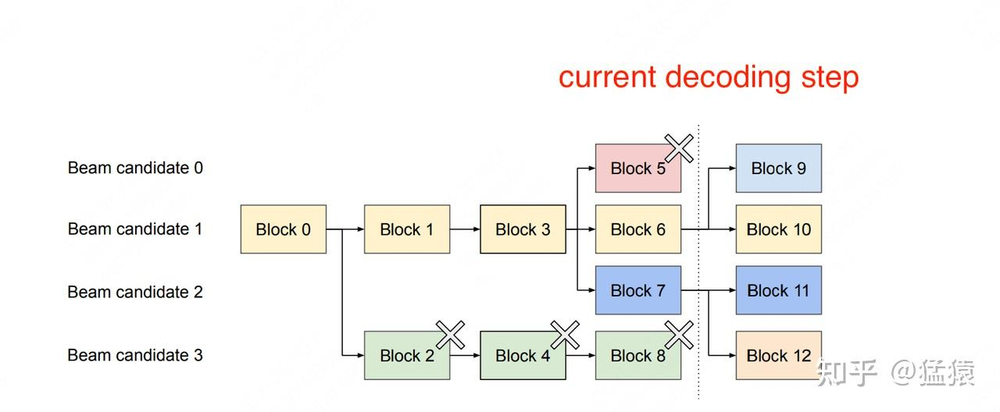

然后使用`llm = LLM(model="facebook/opt-125m")`实例化了一个离线批处理的vLLM对象。**其本质是实例化了一个推理引擎LLMEngine对象，保存在llm对象中，由llm对象来调用LLMEngine对象**。在执行这个步骤时，LLMEngine会执行一次模拟实验（profiling），来判断需要在gpu上预留多少的显存空间给KV Cache block

实例化完llm对象之后，就可以调用llm的generate方法传入prompts（通常是一个字符串的list，代表一个batch）和采样参数进行推理。

在generate方法中，遍历batch中的每一条prompt，调用LLMEngine的`add_request`方法：

- 如果该prompt只有文字，没有token id，那么会先将文字编码成token id。然后将每一个prompt包装成一个Sequence对象（赋值Seq id），再将Sequence包装成SequenceGroup对象，然后把SequenceGroup对象加入调度器（Scheduler）的waiting队列，等待处理

  

generate方法将batch中所有的prompt都添加完毕后，就在while循环中**调用LLMEngine的step**方法反复进行推理调度（每一个step结束都会返回本次所有的推理结果，此时会选择其中推理结束的请求保存在outputs中），直到调度器中所有的request都推理结束了（waiting、running、swapped队列都为空），然后将outputs数组返回。

在step方法中，首先调用Scheduler，具体的调度流程为：

- 如果swapped队列不为空，就从running和swapped队列调度seq_group进行decode（不能从waiting队列调度，因为调度策略是先来先到，swapped队列肯定比waiting队列中的序列先到，所以当GPU上有充足资源时应该先考虑swapped）。

  先将running队列按照到来的时间排序，然后**在while循环中遍历running队列中的每一个seq_group**：先要`BlockManager`判断是否有空闲的物理块给该seq_group decode（`can_append_slot`方法：判断方式很保守，假设该group中每个running的seq都会新占据一个物理块），如果没有空闲空间，那么就从running队列中pop出最晚到达的seq_group，将它抢占，直到有空闲空间为止。

  - 抢占策略：
    - Swap：如果该seq_group剩余生命周期中并行运行的最大seq数量 > 1，seq数量比较多，如果直接把算出的KV block抛弃，比较可惜，所以此时会采取swap策略，即把seq_group下所有seq的KV block从gpu上移动到cpu上，并且建立好映射。然后将它放到swapped队列中
    - Recomputation：如果该seq_group剩余生命周期中并行运行的最大seq数量 = 1，此时会采取recomputation策略，即把该seq_group相关的物理块释放掉（引用计数减一），然后将它重新放回waiting队列中(**放在最前面**)。等下次它被选中推理时，就是从prefill阶段开始重新推理了

  此时就可以给该seq_group分配物理空间了（在物理块中给新的token分配槽位，或者是分配新的物理块（`append_slot`方法））

  最后将它加入到running队列中（另一个临时队列）。**直到self.running队列为空就结束对running队列的遍历**（相当于是双指针，一个指针从头开始对running队列遍历，选中的seq_group就pop出去；一个指针从尾部开始对running队列遍历，如果显存不够，就将一个seq_group抢占到swapped队列中；最后running队列为空）

  然后如果这个过程中没有被抢占的running seq_group，那么**还需要遍历swapped队列**，依然要判断是否有空间给seq_group推理，如果有那么就将该seq_group下的所有CPU块置换回GPU块（`_swap_in`），然后依然是给seq_group分配物理空间（`append_slot`方法），最后将它加入到running队列中。

  然后将running队列作为`SchedulerOutputs`返回

- 但是即使swapped队列空了，想调度waiting队列也要考虑条件，和上一次调度waiting队列的间隔不能太近了，因为**在1个推理阶段中，所有的seq_group要么全部处在prefill阶段，要么全部处在decode阶段**。所以vLLM必须在新来的seq_group和已经在做推理的seq_group间取得一种均衡：既不能完全不管新来的请求，也不能耽误正在做推理的请求。

  - 如果间隔太小了，每次调度都只关心waiting中的新请求，这样发送旧请求的用户就迟迟得不到反馈结果。且此时waiting队列中积累的新请求数量可能比较少，不利于做batching，浪费了并发处理的能力
  - 如果间隔太大了，waiting中的请求持续挤压，同样对vLLM推理的整体吞吐有影响。

  所以这里**在while循环中遍历waiting队列中的每一个seq_group**，如果距离上一次调度waiting队列的间隔大于阈值，并且waiting队列非空，那么就从waiting队列中选择到达最早的seq_group，然后要`BlockManager`判断是否有足够的物理块分配给该`seq_group`做prefill（`can_allocate()`）：

  - 如果Sequence太长了，所需的物理块超过了系统上限，那么就直接不处理这条seq（并且永远不处理），将它从waiting队列中移除；
  - 如果Sequence没有超过系统上限，但是却超过了空闲物理块的水位线，那么说明当前的空闲内存不够，依然不能给它分配物理块，并且直接结束waiting队列的调度
  - 否则就可以分配

  就可以对该seq_group进行分配物理块了（`allocate`方法）

  然后将该seq_group从waiting队列中移到running队列中，并且将它添加到outputs列表中，作为本次调度的结果之一（注意，此时running队列中只有一部分seq_group是此次调度的seq_group，其他的是之前的没有decode完的seq_group，所以outputs列表才是此次要调度的seq_group）

所以总的来说，一次调度，要么从running和swapped队列调度，要么从waiting队列调度：

- 如果从running队列调度，那么就是遍历running队列中的所有seq_group，判断是否有足够的物理块分配给seq_group存放下一个推理阶段新增的kv cache，如果有就添加到list中；如果没有就从running队列中抢占其他的seq_group，将空间释放出来。running队列遍历完之后如果没有seq_group被抢占，那么就遍历swapped队列。最后返回list作为本次调度的结果
- 如果从waiting队列调度，基本流程也差不多，也是遍历waiting队列中的所有seq_group，判断是否有足够的物理块分配给seq_group存放prefill的kv cache，如果有就添加到list中；唯一的区别就是如果没有空间，不能抢占别的seq_group，因为waiting队列中的seq_group优先级已经是最低的了；而是直接结束调度。

这些做完会把相应的信息（swap in/out 的 blocks，blocks copy）塞进 scheduler output 里供后面的执行单元实使用。

- **注意，本次推理需要swap in的blocks和swap out的blocks以及需要copy on write的blocks都是由Scheduler计算出来的，但是并没有执行，而是由Scheduler返回回去，由CacheEngine在实际推理时完成拷贝（通过CUDA kernel进行）**

  


得到`scheduler_output`之后，还要把每个seq_group中的所有seq的`SequenceData`提取出来组成list，并且把他们的block table从scheduler的全局block table中提取出来组成list（这里保存的是物理块的块号，而不是物理块的实例），组成`seq_group_metadata`，方便后面进行运算。


每一次调度结束之后，就进入`worker.py`文件中的`execute_model`函数，它调用CacheEngine对象完成swap_in、swap_out和cow的blocks的拷贝，

- Worker 是运行 model 的单位，**对于每个 device（也即每张卡）创建一个 Worker，一个worker负责维护一张GPU上的kv cache和该GPU上的执行**。一个 `LLMEngine` 管理所有的 workers。

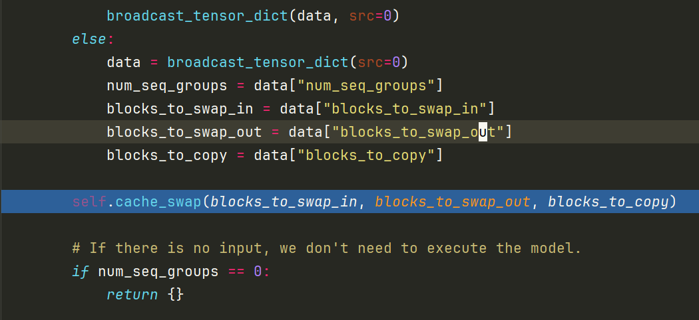


然后在 `model_runner.execute_model`函数中执行这一次的推理：

1. 首先`prepare_input_tensors`，准备此次推理输入的tensor

   - 如果此次推理做的是prefill：将batch中每个seq_group中的seq的token id打包在一个list中（`input_tokens`），并将该list转换成tensor；除此之外，还将该list中每个token在原seq中的idx也打包在一个list中(`input_positions`)，将该list中每个seq的偏移量打包在一个list中（`attn_metadata.seq_start_loc`)；还将每个token在在全局kv cache中的偏移量也打包在list中(`attn_metadata.slot_mapping`)，将list中每个seq的长度打包在`subquery_lens`中。

     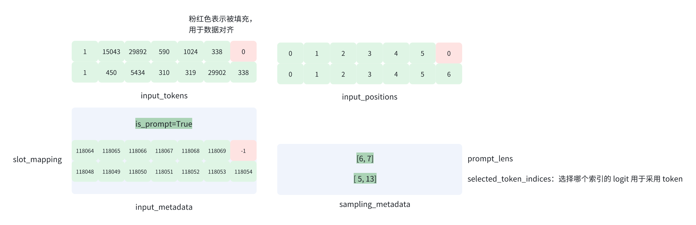

     这么做的目的是节省空间和prefill的冗余计算，因为一个batch中不同的request的prompt长度不同，要计算attention时就需要做padding，确保所有的request长度相同，但是这样就会导致冗余的计算；而这里采用的方法是将所有request的prompt打包在一起，然后它修改注意力掩码和位置编码，以计算单个序列中多个prompt的多个prefill  KV 缓存

     

   - 如果做的是decode：将batch中每个seq_group中所有seq的**最后一个token id**打包在一个list中（`input_tokens`），其余的与prefill差不多

     

   **注意！计算时是按照多个seq_group在一个batch中计算的！而不是一个个seq_group来计算的**

2. 然后进行计算：计算时把`CacheEngine`中的全局的所有物理块（12个tensor）都传入。然后如果是prefill阶段，就调用  xformers 库的`memory_efficient_attention_forward`函数计算，如果是decode阶段，就调用 `_paged_attention`进而使用自定义的`paged_attention`算子计算。计算完毕后，如果是从prompt生成的首token，那么prompt中每个token都会产生一个hidden_state，合起来长度为`len(input_tokens) * 768`。然后从`hidden_states`中选择每个prompt生成的最后一个hidden_state，合起来长度为`batch_size * 768`（**batch_size是一次性计算的sequence个数，此时batch_size实际上就是seq_group的个数**），再将其通过`embeding_table`得到logits，长度为`batch_size * vocab_size` ，然后对logits进行采样。

   其中会先经过一些经典的处理手段（presence penalty，frequency penalty，temperature scaling），然后再 log softmax 一下转成 log probs（`batch_size * vocab_size`），开始 sample。

   - 如果没有使用beam search并且temperature大于一个eps，此时采样的随机性较强，那么`SamplingType`是random：

     - 如果是生成首token，那么会先将logprobs扩展成（`batch_size ,best_of , vocab_size`）大小的张量，相当于是把原来的每个sequence的probs复制best_of份，然后对这`batch_size * best_of`份的probs中的每一位都除以一个指数分布的随机数，再选取每一份probs的最大值（这种方式既保留了较高概率的token被选中的优势，同时引入了一定的随机性），相当于每个sequence都生成了best_of个token，形状为（batch_size , best_of）。
     - **如果是生成后续的token，那么best_of实际上等于1，也就是每个sequence只生成一个token**。形状为(batch_size, 1)，此时的`batch_size`等于`seq_group * best_of`

   - 如果没有使用beam search并且temperature小于一个eps，此时采样的随机较弱，那么`SamplingType`是greedy：

     - greedy的时候best_of必须要是1，那么此时直接对每个seq的probs进行argmax即可

   - 如果`SamplingType`是beam search：

     - 如果是生成首token，那么直接对probs（形状为`batch_size * vocab_size`）中每一个sequence的prob取概率最高的`2 * beam_width`个token id
     - 如果是生成后续的token，那么先计算每个sequence的累积probs，然后将累积的probs广播并加上整个词表的probs，然后将一个seq_group的所有sequence的probs（形状为best_of * vocab_size）展平成一维的，从中选出概率最高的`2 * beam_width`个token id，和这些token所属的parent seq id

     所以beam search的两个阶段的采样方式不太一样，第一个阶段是从vocab_size中采样best_of个token，第二个阶段是从vocab_size * best_of中采样best_of个token

然后将**每个decode出来的token id和对应的parent seq id构造出一个`SequenceOutput`**。一个seq_group的所有`SequenceOutput`合起来构成`SequenceGroupOutput`，如果是没有采用beam search，那么在一个group中，一个parent seq id会对应一个token id；如果采用了beam search，那么一个parent seq id可能会对应多个token id。然后一个batch的所有seq_group合起来构成`output`，结构如下所示：


然后**更新此次调度的seq_group们，将推理得到的output token 添加到seq对象中**，具体过程为：

遍历`SequenceOutput`，将每个`SequenceOutput`实例和它对应的parent_seq_id维护在字典中，字典的key是parent_seq_id，val是一个list，list中是该parent_seq_id对应的所有`SequenceOutput`实例。然后遍历这个字典：

- 如果某个parent seq一个`SequenceOutput`都没有（beam search的后续token生成会出现这种情况），那么直接将parent seq从seq_group中移除，并且将该sequence释放，具体就是将它在BlockManager中的`block_tables`中的表项删除，并且将它对应的物理块释放（引用计数减一）。

  

- 如果某个parent seq有多个对应的`SequenceOutput`（best_of大于1的非beam search的首token生成和beam search的全程都会出现这种情况），那么需要先把parent seq fork出beam width个`Sequence`对象，然后将`SequenceOutput`中对应的token id append到`Sequence`中（记录在逻辑块中和SequenceData中的output list），再给这些新的`Sequence`赋予新的seq id。

- 如果某个parent seq只剩一个对应的`SequenceOutput`（非beam search的后续token生成或者beam search的某一个sequence只被采样到了一个token），直接在parent seq中append生成的token id即可

注意，**这里并没有给新产生的token 的kv cache分配物理块，而是等到下一次调度的时候通过`append_slot`方法，再给上一次decode出的token分配物理空间**（通用的基本思想，lazy allocation，什么时候用就什么时候分配），此时如果发现append的slot所在的物理块的引用计数大于1，那么就会进行cow，分配新的物理块，将新的物理块保存到Sequence的block table中，再将slot所在的物理块的内容拷贝到新的物理块（在Scheduler中仅仅记录新旧物理块之间的映射，实际的拷贝操作延迟到CacheEngine进行）

然后遍历上面生成的child sequence对象，将新产生的token id变成文字，保存在`sequence`内部的tokens list中，这是一个str组成的list，负责保存该sequence中所有的token。

对于这些child sequence对象，如果不是beam search：

- 如果某个child sequence的parent seq id与它不同，那么说明这个child sequence是新生成的对象，那么需要将这些child sequence加入到seq_group中。如果child sequence没有finished，那么还要**在Scheduler中将parent seq的block table拷贝给这些child `Sequence`（浅拷贝）**，因此他们的block table中的物理块与parent seq的物理块相同（因为前缀相同，可以共享物理块），只需要将该物理块的引用计数增加即可。

  

- 如果某个child sequence的parent seq id与它相同，那么说明这是已经存在的sequence对象，新生成的token id复用了它的parent sequence对象。那么需要判断该sequence是否结束了，如果结束了就可以直接将该sequence释放。

  

对于这些child sequence对象，如果是beam search：

- 由于beam search之前采样时会生成2 * beam_width个token id，所以此时每个seq_group中会有2 * beam_width个child sequence对象，此时需要根据length_penalty对他们计算beam search score，根据score对他们进行排序，从中选出得分最高的beam_width个sequence对象作为child sequence，然后对它们做上面非beam search的相同操作。对于剩下的beam_width个没有被选中的sequence对象，如果seq id与它的parent seq id相同，说明他们在seq_group中，需要将它们从seq_group中移除并且释放block table。


然后此次推理结束


# 推理加速

softmax和batchnorm的公式和精度问题：

- batchnorm：

  

Batchnorm精度问题：求方差时，如果通过E(X)^2-E(X^2)的公式求方差，那么当二者很相近的时候就会出现精度损失，而且存在累加，存在舍入误差   

- 解决方案：welford算法，

Softmax精度问题：x较大时，e^x容易超过float32的最大表示范围，发生溢出   

- 解决方案：分子分母除以e^max(x)

模型评价指标：

- 计算量：计算次数，计算量的单位是 OPs(Operations) 。最常用的数据格式为 float32，因此float32类型下的计算量单位被写作 FLOPs (Floating Point Operations)，即浮点计算次数。例子：两个shape为(N, C, H, W)的float32 tensor相加，即add，计算量为 N x C x H x W FLOPs

- 参数量：模型中的参数的总和，反映了模型占的磁盘空间。对于 CNN ，参数主要由 Conv/FC 层的 Weight 构成，

- 访存量：指模型计算时所需访问内存/显存的字节大小，单位为Bytes，例子：两个shape为(N, C, H, W)的float32 tensor相加，访存量为（2+1）x N x C x H x W x sizeof(float32) bytes

- (峰值)内存占用：指模型跑起来的时候（训练或推理），峰值所占用的内存/显存大小，**内存占用 ≠ 访存量**

  

加速推理的方法：

1. 算子内部优化：GPU CUDA算子优化，GPU算子加速库(cuDNN,cuBLAS.etc)，CPU算子加速库(oneDNN)

2. 计算图优化：

   - int8量化压缩

   - 算子融合：比如conv2d+bn的算子融合

     

3. 运行时优化：

   - 静态显存管理

### img2col

img2col就是将图像转换为列，然后就可以将卷积核转换成矩阵乘法gemm（通用矩阵乘法）了。

假设输入图像维度是4 * 4，卷积核是3 * 3

首先将输入图像的像素点按照卷积核3 * 3大小的矩阵拉平成一列


但是我们平常的图像有可能是彩色图，假设有三个通道（R、G、B）图像通道 input_channel=3。多通道的im2col的过程与单通道一样，首先im2col第一通道，然后在im2col第二通道，最后im2col第三通道。

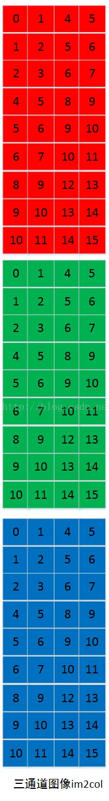

同样，卷积核也对应了三个通道


同样要将卷积核也像输入图像一样展平成行


如果我们输出的tensor是多通道的，那么卷积核也要有多个，将每个卷积核都像这样展平。然后用展平成行的卷积核与展平成列的卷积核做矩阵乘法（gemm）


输出的tensor的每一行代表一个卷积核对整个输入图像的卷积结果，将一行重新reshape成二维的，就得到输出的图像了


## 量化

量化并不是什么新知识，我们在对图像做预处理时就用到了量化。回想一下，我们通常会将一张 uint8 类型、数值范围在 0~255 的图片归一成 float32 类型、数值范围在 0.0~1.0 的张量，这个过程就是**反量化**。类似地，我们经常将网络输出的范围在 0.0~1.0 之间的张量调整成数值为 0~255、uint8 类型的图片数据，这个过程就是**量化**。所以量化本质上只是对数值范围的重新调整，可以「粗略」理解为是一种线性映射。

实际来说，训练好的模型的权重一般来说都是FP32，int8量化一般是指将训练好的模型中的weight（算子的权重）和activation（算子的输入输出），从浮点（FP32）存储运算映射成整型（INT8）存储运算的一种模型压缩技术。

- 量化后可以得到更小的模型尺寸、更低的内存占用、更快的推理速度，但是缺点在于模型精度会降低，不过一般在可接受的范围


量化分类：

- 均匀量化：

  - 对称量化Symmetric quant(aka. Scale quant)
  - 非对称量化Asymmetric quant(aka. Affine quant, zero quant)

  适用场景：数据分布较均匀，无过多的异常值，比如绝大多数CV类模型，比如resnet系列

- 非均匀量化（目前多用于大语言模型量化）

  适用场景：数据分布非常不均匀，伴随着过多outlier值的突出

均匀量化：也叫线性量化，将FP32映射到INT8数据类型，**每个间隔是相等的**

- Symmetric情况下, float32的0会映射到int8里面的0，实际**对称量化INT8的整型数范围应该在-127到127之间，是关于0对称的**。

  - Int8 Weight：`SCALE = max(abs(Weight or activation))/127=> Wint8= round(Wfloat / SCALE)`
  - Uint8 Weight：`SCALE = max(abs(Weight or activation))/255 => Wuint8= round(Wfloat / SCALE)`

- Asymmetric情况下, float32的0不会映射到int8里面的0，而是映射到zeropoint(aka.zp)

  - Int8 weight：`SCALE = abs(max(Wi)-min(wi))/(Qmax - Qmin), zeropoint = -128-round(min(wi) / scale)=> Wint8 = clip(round(Wfloat/SCALE + zeropoint), -128,127)`
  - Uint8 weight：`SCALE = abs(max(Wi)-min(wi))/(Qmax - Qmin), zeropoint = -round(min(wi) / scale)=> Wint8 = clip(round(Wfloat/SCALE + zeropoint), 0, 255)`

  下图中的α和β分别表示输入的数据分布中的实数最大值和最小值，b = 8，对称量化中的Z等于0,

  

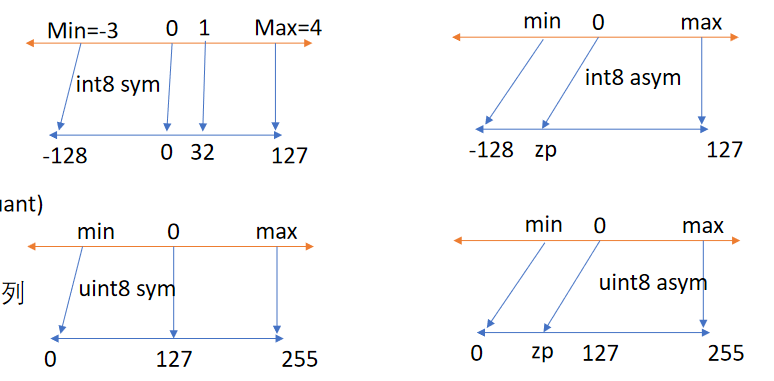

量化本质上是把fp32的分布映射到INT8的范围中，所以需要先计算实际的分布与INT8的分布之间的scale，然后将实际的数除以scale就能得到映射的INT8的数。所以非对称量化的scale计算方式非常直观，`SCALE = abs(max(Wi)-min(wi))/(Qmax - Qmin)`，而**对称量化则是假定实际的数据分布是关于0对称的，所以`|max(Wi)|`和`|min(Wi)|`是相等的，于是公式就变成了`SCALE = abs(max(Wi))/Qmax`，这样降低了不必要的计算量**。并且对称量化的数据除以scale之后就能得到最终的结果了，依然是关于0对称的。

而非对称量化除以scale之后数据分布与INT8会有一定的偏移，如下图所示，所以**需要将量化后的数据分布再加上一个offset，这样才能与INT8的分布对齐，而这个偏移量的计算方式就是二者分布的最小值之差**，即`Qmin-round(min(wi) / scale)`


反量化一般没有信息损失，而量化一般都会有精度损失。因为 float32 能保存的数值范围本身就比 uint8 多，因此必定有大量数值无法用 uint8 表示，只能四舍五入成 uint8 型的数值。**量化模型和全精度模型的误差也来自从浮点数四舍五入成整型的的 groud 操作和截断到int8范围的 clip 操作**。

量化后的计算过程：比如INT8的矩阵相乘，由于结果中的每一个元素是多个向量内积的结果叠加的，所以中间结果用INT32保存，因为如果用INT8保存可能会超过表示范围 ；通过再量化的方式转换回INT8作为下一层的输入；当网络为最后一层时，使用反量化转换回FP32。


对卷积网络的量化：我们在得到全精度的模型后，可以事先统计出 weight 以及中间各个 feature map 的 min、max，并以此计算出 scale 和 zero point，然后把 weight 量化成 int8/int16 型的整数后，整个网络便完成了量化，然后就可以依据下面的流程做量化推理了。


**使用量化的最理想的情况就是如下图所示，所有的算子都可以量化，中间的量化区中全部都是INT8的计算**


- 上图中的模型实际是在线量化，权重是以FP32保存的，在推理过程中需要先量化成INT8之后再与激活进行计算
- 实际上权重一般都是离线量化的，可以提前量化好，以INT8保存起来，实际运行时只需要对输入的激活进行量化和网络输出的数据进行反量化即可

而有时候一个网络中有的算子我们无法量化，比如下图中的LSTM无法量化，那么就会把整个图给切开，前后都是量化区域，中间是浮点计算的区域，浮点计算的区域前后要插入dequant和quant算子，将输入和输出分别反量化成FP32和量化成INT8才行


然而**这样的网络量化后可能比全浮点计算还要慢，因为中间插入了太多的反量化和量化算子，它们的计算量虽然不大，但是访存很大，因为他们是elementwise算子**

所以**要想网络推理速度快，不要在网络中过度使用不可量化算子，比如Sigmoid、div、softmax等**

比如对于Transformer块，每一个块中都有softmax，这样会导致量化效果较差


由于scale通常是浮点数，量化和反量化是对scale进行浮点数除法或者乘法非常耗时，于是就有了整数量化，scale是2的整数倍，这样在量化时直接对浮点数进行移位即可，整个运算过程中没有浮点乘除法，芯片中所有的浮点运算器都可以删掉

- 下图中的`2 << shift`应该是`1 << shift`


量化可以加速的原因：

1. 计算可以加速；实际上计算可以加速并不是指整数乘法加法指令比浮点数更快，二者其实差不多，而是整数的向量指令比浮点数更快
2. 访存更少

### 不同算子的量化计算过程

注意，**我们之前说的quant和dequant操作是作为单独的算子插入到网络中的；而这一节讨论的内容是融合在每个算子的计算过程中的！推理框架和cuda算子需要专门为量化做适配**


计算出网络每一层的参数和输入的张量的scale和zeropoint，然后先将输入的张量量化成INT8，

根据公式：，可以得到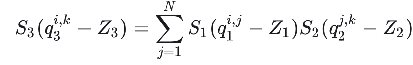，得到

就可以**根据输入的量化的值计算得到a1的量化值Qa1**，就实现了使用INT8的计算替代了原来的FP32的计算，唯一需要的就是在计算完INT8之后再乘以scale的值，这样大大降低了计算量；并且**模型计算的中间结果全部都是INT8，直接输入到下一层中，比如这里的Qa1不需要反量化成Fp32的a1，直接用Qa1继续后面的计算即可**

- 注意，**直接用量化值计算得到的并不是下一层输入的量化值**，需要乘以才能输入到下一层

- 如果要得到当前层的FP32的结果（比如最后一层），使用量化值计算得到结果乘以即可，这个过程叫做反量化。比如下面的代码中，**反量化就是用INT8量化后的W和X计算出来的Y_q乘以W_scale和X_scale**，得到的结果与使用FP32计算得到的数值差不多

  

最后fc输出的y也是INT8类型的，然后将它乘以S就可以反量化回去，就得到近似原来全精度模型的输出了。

乘法的量化计算如下图：


如果有的硬件不支持浮点运算，此时要采用整数量化的方式，但是给定的模型的scale又是float，那么就会对scale取对数后取整，再对INT8计算结果进行移位


对于非对称量化，计算则变成了：


展开后的Sa Sb Sc Oa Ob Oc都是可以提前算好的，所以**在实际的乘法过程中，`SaSb / Sc`这个数是提前计算出来、以一个常量来表示的**

加法量化：由于加法没有乘法这样的交换律，所以INT8的值要先乘以scale再相加，导致量化前一次加法的操作，变成了量化后两次乘法、一次除法、和一次加法。对乘法来说不存在这种情况，根据上面的公式可以知道，对称量化后只多了一次乘法。

所以**量化对于乘法的overhead较小，而对于加法overhead很大**

所以**量化对于乘法的overhead较小，而对于加法overhead很大**

所以**量化对于乘法的overhead较小，而对于加法overhead很大**


解决办法就是：很多推理框架要求加法的两个scale要一致，这样可以提取公因数，最后只用多计算一次乘法


激活函数量化：比如对于下面的clip操作，INT8的值需要与fp32的min和max比大小，所以需要先将INT8反量化，clip完之后再量化回去


而它也要求输入输出的scale一致，这样就变成了


导致min被量化，并且量化的scale与min本身无关，此时称min被动量化。对于这种算子，我们称之为被动量化算子，这种算子的运算不会改变量化参数，也就是说它们输入输出的激活共享scale和zeropoint

常见的被动量化算子包括：Pad、Relu、MaxPooling、Clip等

为什么这些算子的运算不会改变量化参数？

- 比如对于relu来说，输入的数据范围是[-1.0, 2.0]，输出的数据范围（浮点范围） 是 [0.0,2.0]。那么进行非对称uint8量化，scale就是3/255，zp为128，那么输入数据量化后的范围是[43, 298]，裁掉负值后范围为[128, 298]，虽然裁剪改变了数据分布，但是剩余数据依然是输入数据范围的一部分，它们与浮点数的映射关系没有发生变化，所以可以继续使用输入数据的scale和zp，进行反量化后还是可以得到原来对应的浮点数

所以如果是使用静态量化，碰到这些算子就会直接指定输出和输入激活使用相同的量化参数

如果是动态量化，那么推理框架在碰到这些算子时也会直接指定输出和输入激活使用相同的量化参数 

矩阵乘法量化：


因为Sinput和Sweight可以提取出来，所以矩阵乘法的累积过程都是在INT32空间中进行的，所以output的scale是`S_input * S_weight`；而output和bias要相加，所以二者的scale要相同，所以output和bias也可以直接在INT32的空间中相加（并且由此可知bias实际上是量化到INT32的）。最后将得到的output先乘以`S_input * S_weight`反量化成FP32，再除以`S_output`量化回INT8

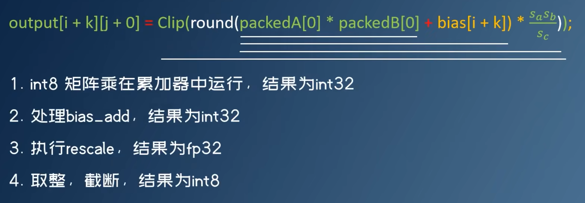

非线性函数量化：算子本身就不能使用整数进行计算，如Exp、Tanh、Sigmoid、Softmax等，所以

- 在CPU或GPU上，这些设备有浮点计算能力，所以他们通常是在非线性算子前后加上dequant和quant，以fp32模式运行算子
- 在FPGA或ASIC上，这些设备没有浮点计算能力，所以此时需要更改算子的计算逻辑，以线性运算拟合或者直接查表

线性拟合：使用泰勒展开，x是量化后的整数，scale是`1 << shift`，那么先将x反量化得到一个整数，然后再计算exp，然后再对结果量化得到INT8的结果	

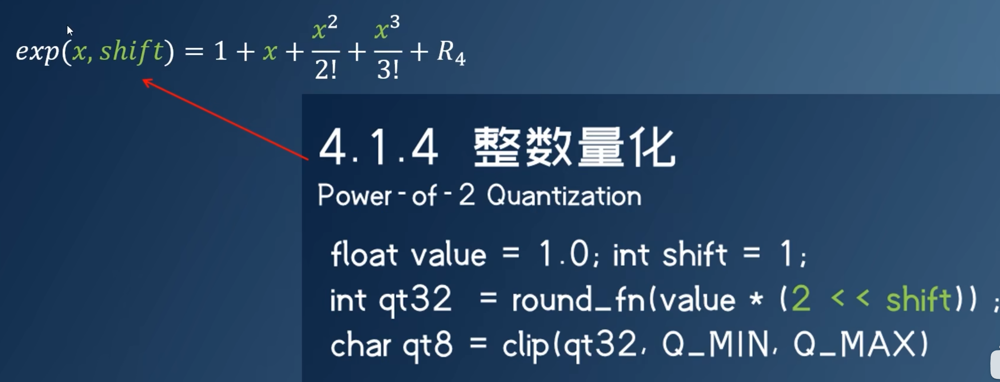

或者直接将exp的值算好，运行时根据x的值直接查表


通常推荐使用查表，因为使用模拟情况太复杂，比如到底要展开几阶，余项如何处理等

### 量化粒度

量化粒度是指共享量化参数的大小，量化的粒度越小，模型的精度越好，但计算成本越高。因为如果数据越多，那么数据的分布就越广，那么将这么广的分布压缩到-127到128这255个整数中，就会导致精度很低


一般量化过程中，有`pre-tensor`和`pre-channel`两种方式	

- `pre-tensor`显而易见，就是**对于同一块输入（比如某个卷积前的输入tensor）我们共享一组量化参数，该层所有的输入数据共享同一对scale和zeropoint值**；

- `pre-channel`：

  - **如果per channel作用于权重：指的是一个卷积核共享一个scale**，比如一个卷积的权重维度是[64,3,3,3]（输入通道为3输出通道为64，卷积核为3x3），那么这里的channel就是指64，`pre-channel`就是会产生64个scale值，分别作用于该卷积权重参数的64个通道。

    

  - 如果per channel作用于全连接，就相当于是对一个神经元为粒度进行量化
  
  - 如果per channel作用于激活：只有图片有channel，所以对activation来说per channel指的就是**图片的一个channel共享一个scale**

如果卷积使用了per channel量化，那么图片的激活通常不会使用per channel，因为这样会导致每一个channel的scale都不一样，卷积得到的结果无法提取公因式，从而无法dequantize。

- 比如下图，上面是对X进行per tensor的量化，可以直接提取公因数Sx，对Wint和Sint的计算结果直接乘以SwSx就可以得到FP32的计算结果。
- 而下面是对X进行per channel的量化，无法提取公因数，那么Wint和Sint的计算结果无法反量化成FP32（因为X1W1 + X2W2 + X3W3已经计算成一个数了）。同时这还会导致无法计算出下一层输入的INT8量化值


而下面的公式中的S1 S2和S3都是per tensor的，对整个activation和weight都是一样的，所以可以直接提取公因式，只需要对量化的计算结果算一次scale就能得到下一步的量化结果；如果是per channel的，那么不仅推理前计算S和Z的计算量会增加，在推理时的计算量也会增加


比如对矩阵乘法，我们不会直接使用常规量化方式，即用整个张量的最大绝对值对张量进行归一化，而会转而使用向量量化方法，找到 **A 的每一行和 B 的每一列的最大绝对值**，然后逐行或逐列归一化 A 和 B 。最后将 A 与 B 相乘得到 C。最后，我们再计算与 A 的每一行和 B 的每一列最大绝对值向量的外积（得到一个矩阵），并将此与 C 求哈达玛积（逐元素相乘）来反量化回 FP16。

所以从本质上来说，进行计算的两个数一定要在相同的方向上进行量化，二者量化的粒度不能交叉，比如上面的矩阵相乘的例子，由于矩阵A的每一行是和B的每一列进行内积的，所以如果对A per-row量化和对B per-col量化二者就是相同方向的，否则就是二者的量化粒度就是交叉的。而深度学习的推理本质上都是矩阵相乘，比如全连接或者卷积


### 校准

我们的量化公式是：，按照**非饱和量化的方式，简单的将一个tensor 中的绝对值的最大值 -|max| 和 |max| FP32 value 映射为 -127 和 127 （因为scale是|max| / 127，所以每个值除以scale之后，原本的|max|就变成了127），中间值按照线性关系（scale）进行映射**。

这是一种线性映射（即均匀量化），所以**如果数据分布的不均匀，就会导致映射到INT8后的值都挤在一个很小的范围内，从而浪费了INT8范围内的其他空间**，也就是说没有充分利用INT8（-128~+127）的值域。比如下面的这种情况：相当于浪费了INT8最右边的空间。


饱和量化的思想：当你数据分布很不均匀的时候，如图左边比右边多，那么我把原始信息在影射之前就截断一部分，然后构成对称且分布良好的截断信息，再把这个信息映射到int8上去，那么就不会有动态范围资源被浪费了

具体来说：就是找一个阈值|T|，将数据分布中超过|T|的全部截断，映射到±127上，使得映射后的-128~+127范围内分布相对均匀，这相当于去掉了一些不重要的因素，保留了主要成分。**只要阈值T选的好，就能将分布散乱的较大的激活值舍弃掉，也就有可能使精度损失不至于降低太多**


饱和量化通常用在激活上，因为激活分布不均匀，而权重通常分布比较均匀，没必要使用饱和量化

那么我们的问题就转换为**如何寻找最优的阀值T使得精度的损失最小**

- 现在有一个FP32的tensor，FP32肯定是能够表达这个tensor的最佳分布。现在我们要用一个不同的分布（INT8）来表达这个tensor，饱和的INT8分布由于阈值 |T|的取值会有很多种情况，其中肯定有一种情况是相对其他最接近FP32的，我们就是要把这种情况找出来。

- 既然如此，我们就**需要一个衡量指标来衡量不同的 INT8 分布与原来的FP32分布之间的差异程度**。这个衡量指标就是 **相对熵**（relative entropy），又称为**KL散度**（**Kullback–Leibler divergence**，简称**KLD**），
- 要找到更加合理的 阈值|T|，是要考虑一些先验知识的，这个先验知识就是每一层在 FP32精度下的激活值分布

具体做法：从验证集 选取一个子集作为校准集（Calibration Dataset ），校准集应该具有代表性，多样性，最好是验证集的一个子集，不应该只是分类类别的一小部分。对于ImageNet 数据集来说 校准集大小一般500张图片就够了。然后**在校准集上 进行 FP32 推理**，计算KL散度，得到激活值分布以及最合适的阈值|T|以及**每个激活tensor的S和Z，从而实现离线量化，加速推理的过程**。

- 需要量化的参数可以分类两类：权重量化和激活量化。

  - 权重量化，即仅仅需要对网络中的权重执行量化操作。**由于网络的权重一般都保存下来了，因而我们可以提前根据权重获得相应的量化参数S和Z，而不需要额外的校准数据集**。一般来说，推理过程中，权重值的数量远小于激活值，仅仅对权重执行量化的方法能带来的压缩力度和加速效果都一般。**权重量化直接可以离线进行**

  - 激活量化，即不仅对网络中的权重进行量化，还对激活值进行量化。由于激活层的范围通常不容易提前获得，因而需要在网络推理的过程中进行计算或者根据模型进行大致的预测。

    激活量化方式还分为在线量化和离线量化。

    - **在线量化**，即指激活值的S和Z在实际推断过程中根据实际的激活值动态计算；（不就是动态量化？）
    - **离线量化**，**即指提前确定好激活值的S和Z，需要小批量的一些校准数据集支持。由于不需要动态计算量化参数，通常离线量化的推断速度更快些**。（静态量化？）

所以**校准的过程不仅可以提高精度，还可以加速推理的过程**

校准过程我们是不用参与的，全部都由TensorRT内部完成，但是，我们需要告诉校准器如何获取一个batch的数据，也就是说，我们需要重写校准器类中的一些方法


选int8还是uint8：

- 理论上，含有relu的模型activation才有必要选择uint8量化，因为relu输出的activation大于0
- 当前CPU和GPU只支持int8 * uint8的int8类型乘法指令，故为了匹配指令，一般activation都选uint8，weight选int8

选对称量化还是非对称量化：

- 根据非对称量化的计算公式，weight和activation经过量化后，原本的fp32weight * fp32act，变成了如下

  

- 第一项即sym量化下的情况（zw和zx都等于0），第三四项里面所有参数可提前计算出来（Sx和Zx在校准时计算出来），唯独第二项的Xint需喂入真实数据后才知道，需要在推理时到了这一步才能计算出来。所以**一般选择asym activation和sym weight**，这样zw为0，那么上式子第二项为0。即使第一项仍然有Xint，但是计算量相对于之前来说还是减少了

### 分类

pytorch的量化模式分为：

- 动态图的量化（eager mode）
- 静态图的量化（FX graph），由动态图经过符号追踪（symbolic trace）的方式得到

以上两种量化又可以分为：

- 训练后量化（Post-Training Quantization,PTQ），**PTQ不需要再训练，因此是一种轻量级的量化方法。在大多数情况下，PTQ足以实现接近FP32性能的INT8量化**。我们上面讲的量化就是PTQ量化。然而针对激活更低位的量化，如4bit、2bit，它也存在局限性。这时就有了训练时量化的用武之地。
  
  PTQ又分为静态量化和动态量化，二者的区别：
  
  - Static quant：通常用于输入shape固定的模型，比如cv类型的模型；weight和activation都提前量化好，有calibration阶段
  - Dynamic quant: 通常用于输入shape不固定的模型，比如NLP类型的模型（LSTM、RNN等），weight提前量化好，而由于输入shape不固定，在推理之前无法知道shape是什么，所以activation不能提前量化，只能在inference过程中收集data range，从而确定scale。无calibration阶段
  - Weight only quant: 仅仅量化weight；常用于大模型；注意，**weight only的量化网络的计算是无法加速的，因为权重是INT8的，但是激活还是FP32的，所以计算依然是浮点数计算，但是网络整体还是有加速的效果，因为对权重的加载读取变快了**
  
  
  
- 训练时量化，也叫量化感知训练（Quantization-Aware-Training,QAT），它可**以获得高精度的低位量化**，但是缺点也很明显，就是需要修改训练代码，并且反向传播过程对梯度的量化误差很大，也容易导致不能收敛。


FX和eager mode（主要是eager mode的静态量化）的区别：二者的主要区别是算子融合和量化反量化的放置的方式的区别，前者是自动的，后者需要手动。比如eager mode需要指定哪些算子需要被融合，对于可以被量化的算子需要在它前面放置一个quant算子，对于结果需要反量化的算子（比如后面的算子是不能被量化的，那么当前的算子的计算结果需要反量化才能传入下一个算子）需要在后面放置一个dequant算子，由int8转换成float32；而FX可以自动做上面这些操作，不用手动指定各种配置

- 如果一个模型中间经常夹杂着一些不能量化的算子，那么就会影响量化后的性能提升（如果可以量化的算子数量太少，甚至会造成量化后的性能下降），因为这样需要反复quant和dequant
- 最理想的情况是在模型最开始的时候用一个quant算子，结束的时候用一个dequant算子，中间全程是INT8的tensor在流动和计算，这样的性能提升是最大的

但是FX是通过符号追踪的方式得到的，有一定的失败概率，trace出的fx graph没有完整表达模型，此时只能选择eager mode进行量化

实践当中，FX的静态量化比eager的静态量化用的更多，而eager的动态量化则比FX的动态量化用的多

和上面说的类似，FX graph静态图适用于shape固定的模型（比如CV），而eager mode动态图可以用于shape不固定的模型（比如NLP）；所以**FX通常只能用静态量化，动态量化对它来说性能很差；而eager mode静态和动态量化都可以使用**。

QAT则是FX用的更多，而eager很少使用


没有绝对，还是要实际测试模型性能和精度才知道; 总的来说，据经验，CV类适合用fx+static，NLP类适合用eager+dynamic 


量化的通用流程：

- prepare阶段：基于用户给定的qconfig（量化的配置，描述了哪些算子可以被量化，以及量化的粒度和量化是否对称）在指定算子前面插入observer。在pytorch中通过下面这一行代码就可以获得qconfig了： `ep.model.q_config=torch.quantization.get_default_qconfig(“x86”)`

- Calibration阶段：使用observer收集data range并计算scale

- Convert/post process（including fusion）后处理阶段：基于以上scale将float32 model转换为int8 模型，基于下面的字典，将之前的模型中的算子替换为冒号之后的算子。**计算出来的scale和zp会作为参数保存在新的算子中**。在量化的过程中还可以包括算子融合

  ```
  DEFAULT_STATIC_QUANT_MODULE_MAPPINGS = 				
  { 				   
  QuantStub: nnq.Quantize,    
  DeQuantStub: nnq.DeQuantize,    
  nn.BatchNorm2d: nnq.BatchNorm2d,    
  nn.BatchNorm3d: nnq.BatchNorm3d,    
  nn.Conv1d: nnq.Conv1d,    
  nn.Conv2d: nnq.Conv2d}
  ```

  

动态图的静态量化的例子：`https://github.com/Laicheng0830/Pytorch_Model_Quantization/blob/main/pose_estimation.py`

1. 动态图需要在模型中手动添加quant和dequant算子：

   ```python
   class PoseEstimation(nn.Module):
       def __init__(self, model_dict):
           super(PoseEstimation, self).__init__()
           self.quant = torch.quantization.QuantStub()
           self.model0 = model_dict['block_0']
           ...............
           self.model6_2 = model_dict['block6_2']
           self.dequant = torch.quantization.DeQuantStub()
   
       def forward(self, x):
           x = self.quant(x)
           out1 = self.model0(x)
           out1_1 = self.model1_1(out1)
           out1_2 = self.model1_2(out1)
           out2 = torch.cat([out1_1, out1_2, out1], 1)
           ...................
           out6_1 = self.model6_1(out6)
           out6_2 = self.model6_2(out6)
           out6_1, out6_2 = self.dequant(out6_1), self.dequant(out6_2)
           return out6_1, out6_2
   ```

2. 动态图在量化之前需要手动指定量化的配置qconfig：

   ```python
   model_fp32.qconfig = torch.quantization.get_default_qconfig('fbgemm')
   ```

3. 对于静态量化，还需要进行校准（采样）：

   ```python
   #  在模型中插入observer，在calibration过程中观察activation张量
   model_fp32_prepared = torch.quantization.prepare(model_fp32)
   # 在一个具有代表性的小数据集上进行calibrate
   evaluate(model_fp32_prepared)
   # 将observed模型转换成被量化的模型：将权重量化，将每个activation的scale和zp计算出来并保存在算子中，将算子被替换成被量化的版本
   model_int8 = torch.quantization.convert(model_fp32_prepared)
   print("model int8", model_int8)
   # 保存被量化后的模型
   torch.save(model_int8.state_dict(),"./openpose_vgg_quant.pth")
   ```

4. 然后才能用被量化后的模型进行推理

FX的静态量化的例子：

- 

如果量化后的INT8模型精度下降太多，可能的原因是：

- 拿来做calibration的数据集不具有代表性，导致得到的scale和zp偏差比较大
- 某些f32算子不应该被量化，不容易被int8逼近，比如含有指数函数的softmax，不适合线性映射

改进：

- 换一个更大一点的calibration数据集
- 引入回退机制（从qconfig中除去），把造成精度损失的int8算子回退为相应的f32算子

### 神经网络图优化

算子是推理框架调度的最小单位，一个算子要么在CPU上计算，要么在GPU上计算，不会一半在CPU一半在GPU；但是算子的计算并不是原子的


算子融合加速（图融合）：

比如对于矩阵乘法、加Bias、relu这三个操作来说，它们分别执行时，需要的操作如下图所示：

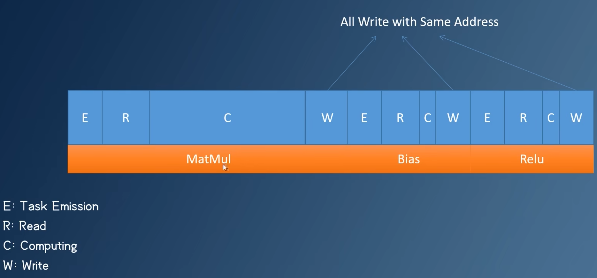

融合后就可以减少算子之间的overhead，比如重复的kernel launch，读数据、写数据等


常见计算图优化：

1. 激活函数融合：将计算算子和激活函数融合

   

2. 移除batchnorm与dropout：计算算子和batchnorm的合并；如下图，将二者的公式合并展开之后的新的公式排列成原来计算算子的公式的形式，由于batchnorm的gamma、var、mean、beta都是常量，所以得到的新的公式就相当于对原来的计算算子的公式权重和bias做了一个缩放

   

   实际代码如下图，直接将bn的参数读取出来，然后对计算算子的权重和bias做一个缩放即可，后面的bn就可以直接删除了

   

3. 常量折叠：常量计算可以提前算好；如下图，两个算子都对输入加1，那么就可以合并为一个对输入加2的算子；

   

4. 矩阵乘融合：两个相邻的矩阵乘可以合并

   

5. Conv-Add融合：如果Conv的输出和另一个数要进行相加，那么可以将这个数加到conv的bias上，就可以将Add算子融合掉

   

注意，上述说的这些算子的融合都是只适用于算子A有且仅有一个输出到算子B的情况，如果算子A有两个输出，一个到算子B，另一个不经过算子B，那么A和B就不能融合，否则不经过算子B的分支就不存在了


Conv和pad也可以融合，因为Conv本来就可以带上pad的操作；cast算子主要用于类型转换，比如 `Tensor([1,2,3,4,5]).float()`就会触发cast，因此两个相邻的cast有时也可以融合，比如先转了float()又转了int()，可以一步到位直接到int()；不仅串联的相邻卷积可以融合，并联的卷积也可以融合（前提是卷积的参数相同），比如三个3 * 3 * 3的卷积核，对三个6 * 6 * 3的输入进行卷积，那么可以将卷积核在通道维度上拼成3 * 3 * 9，输入可以拼成6 * 6 * 9，得到结果为3 * 3 * 3，然后加上三个slice算子，将结果分成三份3 * 3 * 1，就是三个卷积核的输出


 **要想推理速度快，和之前一样，不能在网络中过度使用不可量化的算子，这种算子既会导致dequant和quant的overhead较大，又会导致破坏图融合，导致算子启动的overhead太大**

 **要想推理速度快，和之前一样，不能在网络中过度使用不可量化的算子，这种算子既会导致dequant和quant的overhead较大，又会导致破坏图融合，导致算子启动的overhead太大**

 **要想推理速度快，和之前一样，不能在网络中过度使用不可量化的算子，这种算子既会导致dequant和quant的overhead较大，又会导致破坏图融合，导致算子启动的overhead太大**

 **要想推理速度快，和之前一样，不能在网络中过度使用不可量化的算子，这种算子既会导致dequant和quant的overhead较大，又会导致破坏图融合，导致算子启动的overhead太大**

### 神经网络部署

runtime主要包括

- Runtime Library（运行时库）：是一组预先构建的函数和服务，提供了常用的功能，例如：数学计算（如平方根、正弦等），文件操作（如打开、关闭文件），网络通信（如 HTTP 请求），动态内存分配（如 `malloc`、`free`）。比如C和C++的运行时库就有glibc和STL（`libstdc++`（GCC 的 C++ 标准库），`libc++`（Clang 的 C++ 标准库））
- Runtime System（运行时系统）：是运行时环境的一部分，通常指一套支持程序运行的机制，比如：垃圾回收（Garbage Collection）：如 Java 的 JVM 自动回收内存。异常处理：捕获和处理程序中的错误。线程管理：如多线程的创建、调度。


C++标准描述了C++语言需要支持的基本数据类型、基本算法等，但是实现C++标准的runtime可以有很多，微软的MSVC、gcc、nvcc的stl实现都是不一样的


神经网络也有标准和runtime，标准就是如何描述神经网络的计算图表示，如何描述图中的每一个算子，以及输入输出。runtime就是运行某一种标准的推理框架

但是与C++不同的是，神经网络的标准不止一个，所以runtime也就更多了


ONNX是一种计算图的描述方式，不同的网络，不同的量化方案都能用ONNX表示出来（比如在ONNX中哪些算子前后插入dequant和quant算子）

如下图是dsp、ppl、tensorrt等不同的量化方案在ONNX中的表示，都叫做ONNX的量化模型


实际的量化方案由`QUANT_PLATFROM`决定


所以整个部署的工作流程是：

1. 通过量化工具（如 PyTorch 的 `torch.quantization` 或 TensorFlow 的量化 API）对神经网络进行静态量化（Post-training Quantization, PTQ）或量化感知训练（Quantization Aware Training, QAT）。导出后的 ONNX 文件包含了量化后的结构图，且每个算子附带了对应的量化信息。这些信息通常以 `QuantizeLinear` 和 `DequantizeLinear` 算子明确表示。
2. 量化后的 ONNX 模型会显式包含：
   - 量化算子（QuantizeLinear、DequantizeLinear）：表示从浮点到量化张量的映射或反向映射。
   - 量化参数（Scale 和 Zero-point）：为每个张量指定量化范围。
3. 推理框架（如 ONNX Runtime、TensorRT 或 OpenVINO）加载量化后的 ONNX 模型，准备执行推理。在这个过程中会先进行神经网络图融合，然后根据计算图中的量化信息执行前向推理

量化后的ONNX计算图的样子：每个被量化的算子的输入通常是一个 `DequantizeLinear`，记录了输入的INT8的形状和对应的scale和zp；而输出则是 `QuantizeLinear` 和 `DequantizeLinear` 串联连接到下一个算子，记录了输出的数据的scale和zp，所以每个算子的输出`QuantizeLinear`和下一个算子的输入`DequantizeLinear`的参数通常相同。


由于图融合是在量化之后进行的，所以如果我们按照原本模型的格式进行量化，就会导致对算子进行多余的甚至错误的量化。那么为什么量化工具不直接导出图融合后的量化模型呢？因为量化工具要尽可能地支持多个平台，所以导出的计算图是ONNX格式的，而融合后的算子ONNX有可能不支持。所以量化工具不能直接在图这个级别上真的将算子融合了。

所以量化工具需要修改量化方案，**使得量化后的计算图可以直接适配推理框架融合后的计算图，也就是在不融图的情况下模拟融图后的计算图**

这里商汤的量化工具PPQ做的操作是使用联合定点：对计算图中每一个算子的输入（包括权重）和输出都绑定一个TQC（`TensorQuantizationConfig`）结构体


比如对于计算节点和激活函数（Conv+relu、Conv+bn）的融合的情况，直接将中间的量化节点停用即可


对于Conv+Maxpooling，由于MaxPooling要求输入输出的量化参数相同，所以直接使用输入节点的输出量化参数


等等，详细可见zz的视频

### 神经网络图调度与模式匹配

下图使用PPQ对shufflenet进行量化，使用随机的数据进行calibration，所以量化的结果比较差；然后对quantize_torch_model得到的ir分别进行layerwise和graphwise的误差分析，前者会报告只量化某一层时，整个网络输出的误差；后者会报告量化整个网络时，按照数据的流向，到每个算子时，误差累计是多少。


量化工具做图调度实际上就是把部分算子调度到非量化平台上，从保证图可以计算，或者精度尽可能高

做图调度的原因：

1. 在量化时有些层的量化对结果的误差影响很大，解决此问题最简单的方式就是调度该层不量化
2. 有的子图根本无法量化

如下图就可以将Conv_112和Conv_250调度到FP32上即可


有了图调度之后就可以保证量化不可能失败，因为我们总是可以把量化效果差的层调度到fp32上

如下图，经过调度之后Conv_112算子的weight和bias没有被量化（没有他们的`DequantizeLinear`算子），但是它的输入输出的DequantizeLinear算子还是要有，因为它的前后相邻的算子还是被量化的，所以它的输入和输出还是要被反量化和量化的


算子调度的功能是使用模式匹配实现的，模式匹配实际上就是在计算图找到特定pattern的子图，是做量化算法、算子融合、算子调度的基础	

比如swish激活函数，ONNX不支持这个函数，导出的计算图是将它拆分成两个算子；那么我们在量化的时候会将下面的三个算子都进行量化，但是实际上只需要在最后的Mul的输出上量化即可。所以我们需要描述这个子图长什么样子，然后让PPQ对它进行图融合


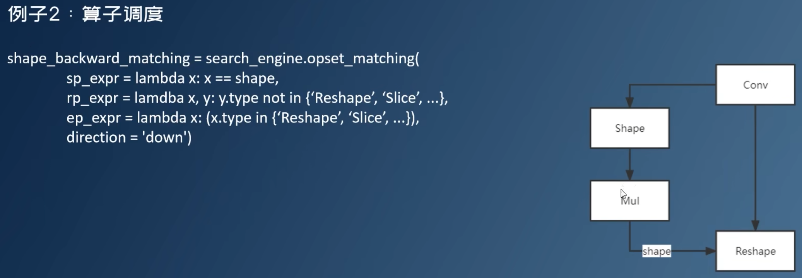

调度约束：

1. 激活函数和计算节点保持在统一平台，否则后面推理框架无法进行图融合，会导致计算很慢；也就是参与图融合的算子要保持在同一个平台上

2. 多输入算子所有输入同一平台

3. 孤立计算节点不量化，没有必要，除非此节点计算量非常大，能够覆盖前后插入量化算子的消耗

   

对于CPU和GPU这样平台来说，它们可以计算全精度，被调度到FP32平台的算子只是用计算时间来换取计算精度，在这样的硬件上，量化就是精度和速度的权衡

对于FPGA、DSP来说，它们没有浮点计算能力，推理框架通常需要有能力将浮点算子调度到主机端进行计算

对于多精度混合量化，仅仅调度就非常复杂，计算更加复杂

### TensorRT

tensorrt可以使用`torch2trt`函数将`pytorch`模型进行优化，优化后的模型依然是一个pytorch模型，可以直接用python执行，但是不能对它进行训练了


trt能进行加速的主要原因是进行了算子融合，减少了kernel启动的overhead

另一个原因是减少了CPU python函数调用的层级


使用trt进行量化感知训练


 使用trt对PPQ导出的量化模型进行推理；

PPQ导出的量化平台为TRT_INT8


然后先导出一个FP32的onnx（`do_quantize=False`不量化），然后使用onnx文件创建一个trt的 engine


再导出一个int8的engine，然后使用trt进行推理


 **要想trt推理速度快，和之前一样，不能在网络中过度使用不可量化的算子，这种算子既会导致dequant和quant的overhead较大，又会导致破坏图融合，导致算子启动的overhead太大**

并且还要确保tensor的对齐，比如CHW最好都是16的倍数，如果不对齐推理框架会自动帮你填充0对齐到16，所以从这里也体现出了数据量小计算效率低的原因之一


**并且对于常用的子图，由于导出成ONNX会变成零散的算子，而推理框架又不好对它们进行融合，此时就需要我们自定义算子，比如将attention整个用一个大的kernel实现**，这样就会提升效率	


### QAT

量化感知训练QAT 是将训练过的模型量化后又再进行微调。由于定点数值无法用于反向梯度计算，实际操作过程是在某些op前插入伪量化节点(fake quantization nodes)，用于在训练时获取流经该op的数据的截断值，便于在部署量化模型时对节点进行量化时使用。我们需要在训练中通过不断优化精度来获取最佳的量化参数。

训练后量化PTQ 是使用一批校准数据对训练好的模型进行校准（静态量化），将训练过的FP32网络直接转换为定点计算的网络，过程中无需对原模型进行任何训练，过程简单快速，因此此方法已被广泛应用于大量的端侧和云侧部署场景


推理框架可以做量化，它做的量化往往是最精确的，因为它最贴近硬件；比如做calibration算出来的结果最精确，比训练框架和量化框架算的都要精确


量化框架也能做量化，它需要有训练能力，和硬件的仿真能力，还要能模拟推理框架的图融合


QAT就是先对网络进行融合，然后插入伪量化节点


然后对它进行微调，微调时不使用label，而是与它自己的fp32网络的结果计算损失函数，具体来说就是对每一个输入，从带量化节点的网络中通过和关闭量化节点的网络通过的结果计算loss


## roof line model

**算法**对于内存带宽的需求通常使用 **计算强度** (arithmetic intensity) 来表示，单位是 OPs/byte。意思是在算法中平均每读入单位数据，能支持多少次运算操作，它是用算子的FLOPs（该算子的所需的浮点运算总数，而不是每秒的浮点运算数）除以该算子的总访存量计算出的。注意，**算子的访存量与带宽不同！访存量是一种可以提前计算出来的东西，而带宽是实际运行才能计算出来的**。它有助于理解操作的瓶颈，即计算约束(Compute-bound)或带宽约束(Bandwidth-bound, or Memory-bound)。 

下面是屋顶图：

- **算力**π ：也称为计算平台的**性能上限**，指的是一个计算平台倾尽全力每秒钟所能完成的浮点运算数。单位是 `FLOPS` or `FLOP/s`。
- **带宽**β ：也即计算平台的**带宽上限**，指的是一个计算平台倾尽全力每秒所能完成的内存交换量。单位是`Byte/s`。
- **模型的理论性能 P：**我们最关心的指标，即模型**在计算平台上所能达到的每秒浮点运算次数**


Roof-line 划分出的两个瓶颈区域，即


**当这个应用程序的计算密度大于一定值之后，将会变成一个受算术逻辑单元的计算量所限制的程序；而这个计算密度如果小于一定值，将会变成一个受存储器带宽所限制的程序。**

- **计算约束**——例如，具有较大内维数的矩阵乘法和具有大量通道的卷积。比如最典型的是gemm，矩阵C等于A乘B，而A跟B分别是一千乘一千的矩阵。假设存储和计算都是用float 32位来表示，这样一个计算将会做1000乘1000乘1000的浮点乘加，也就是2G FLOPS的运算。我们要读取A和B，然后计算出来C，把它写回去，最少的存储器访问就是三个矩阵的大小，也就是12个MB。那么计算密度是200左右
- **带宽约束**——例如，**elementwise 操作 (如activation, dropout 等) 和 规约操作 (如sum, softmax, batch normalization, layer normalization等)，包括attention操作也是memory bound的**。比如最典型的gemv，矩阵A乘向量B，等于向量C，这时候维度还是1000的情况下，它的计算量就是1000乘1000的浮点乘加，也就是2M。而存储器访问的话最少大约是1000乘于1000个浮点数，也就是4MB。计算密度是0.5

如何确定一个算子是memory bound还是compute bound：

- 静态分析：先计算算子本身需要的FLOPs（总的浮点运算次数）和访存量大小（模型的访存量可以粗略估算为输入tensor、参数tensor和输出tensor的总大小），得到算子的计算密度；然后根据硬件平台的flop/s峰值（每秒最多进行多少次浮点运算）、内存带宽峰值（每秒最多进行多少内存交换）计算得到Imax点。如果算子的计算密度是在Imax点的左边，就是memory bound，如果在右边，就是compute bound。
- 如果要更进一步确定如何优化，那么就需要将算子运行起来，计算出算子每秒进行多少次浮点运算（flop/s），每秒访问多少内存（内存带宽），和它实际的算数密度，得到它在硬件平台roofline model中的位置。


我们大致可以把图像分为5个区域，

1. 粉色线以上和蓝色线以左的区域是程序无论如何都无法达到的性能，因为它意味着超过了计算机的峰值计算性能/访存带宽。
2. 淡蓝色区域是性能较好的访存密集型程序，这部分程序的访存带宽利用率较高（可能50%或更高）；**要提升这部分的程序的性能，只能换成访存带宽更高的硬件或者减少访存从而提升计算强度**
3. 淡粉色区域是性能较好的计算密集型程序，有较好的数据重用率与数据局部性，这部分程序的浮点性能较高（可能50%或更高）。**这部分的程序已经充分利用了计算平台的算力上限，基本没有可以优化的空间，唯一的优化方式就是换成flops更高的硬件**
4. 最后就是可能带宽与浮点性能都低于50%峰值性能的poor performance，如果程序性能处于这个部分，需要考虑优化算法提高性能，达到粉色或者蓝色区域。**这部分的程序的优化方式是：使用各种并行化手段如ILP等，提高带宽利用率**。

所以那些贴近于roofline的kernel较好的利用了计算资源（绿色点点），而那些远离roofline的kernel（红色点点）则是我们重点需要去优化

估算计算强度：

为了简便计算，我们这里忽略缓存的存在，因为一般需要加速的产品都是嵌入式设备，这种设备上它的片上存储是相对较少的。

这里计算访存量的规则是：对每一个Operator或者是layer，**计算所有输入的Tensor、所有参数的Tensor，还有输出Tensor的总大小作为访存量**。


一些大模型，比如VGG 16、ResNet，或者是Inception，他们的计算密度都非常大，都在30或者40或者50这个量级。事实上VGG 16的访存量中绝大部分是被最后巨大的全连接层占据了。如果去掉那个全连接，或者是像ResNet中，先做ROI pooling，然后再接全连接，这种形式的访存量会降到170M到180M，它的计算密度是非常大的。

而通常我们说的小模型，计算量虽然非常小，但它访存量却并没有显著地小于大模型，同时计算密度会显著变小。

这就是说，**小模型部署在这些硬件上，通常都是被存储带宽所限制住了，而不是被计算量所限制住。**

常见深度学习模型加速的手段：

1. bottleneck：输入的feature map是256x56x56，输出的通道数也是256，如果使用左边的普通的卷积，计算量大约是256x3x3x256x56x56x2=3.7G（注意，卷积操作乘完了还要加起来，所以后面的这个2就是乘加在一起的flop次数），访存量大约是(256x56x56x2+256x3x3x256)x4=8.8M（访存量可以粗略估计为输入+输出+权重）。如果采用bottleneck结构，也就是把它拆成一个1×1的卷积，把channel数降低，再做3×3的卷积，然后通过1×1的卷积把channel数恢复回来。也就是右边这张图，它对应的计算量是大约0.43G，对应的访存量大约是9.9M。

   

   所以bottleneck这样的结构：**大幅减少计算量，同时访存量不变，或者是小幅上升，所以计算密度会大幅下降。**

2. depthwise卷积：把一个3×3，若干个channel输出的卷积拆成两部分。第一部分是depthwise，它只做空间上的关联，在每一个channel上独立地进行卷积，就只有一个channel。第二部分是pointwise，只在不同channel之间做关联。经过这样的拆解后，**同样会使计算量大幅减小，访存量小幅上升，所以计算密度大幅下降**。

3. FFT / Winograd的卷积算法：它是指通过某种线性变换将feature map和卷积核变换到另外一个域，空间域下的卷积在这个域下变为逐点相乘，再通过另一个线性变换将结果变换到空间域。

   - FFT卷积采用傅里叶变换处理feature map和卷积核，将空间意义上的实数变换到频域上的复数，在复数上做逐点相乘，然后傅里叶逆变换处理结果，将复数变回实数；
   - Winograd卷积使用了其他的线性变换，一直在实数域上进行变换。

   Winograd/FFT变换的卷积算法，会大幅减少计算量，如果实现得好，不会大幅提高访存量，但会有一定程度的精度损失。Winograd/FFT本质上是一个由精度换取速度的方法。比如Winograd变换对于3×3卷积，最高可以实现9倍的加速比，但精度损失严重。当然我们实际上不会用那么大，可能会用到6倍，那么这时候精度损失还是可以接受的。

   事实上由于FFT需要复数乘法，如果没有特殊指令支持的话需要用实数乘法来模拟，实数的浮点计算量可能下降的不多。因此**FFT没有Winograd实用**。

   量化实际上也是一种低精度运算，它既可以降低计算量也可以降低访存。缺点是目前支持的硬件不多，只有新一代的ARM处理器和部分英伟达的GPU支持。

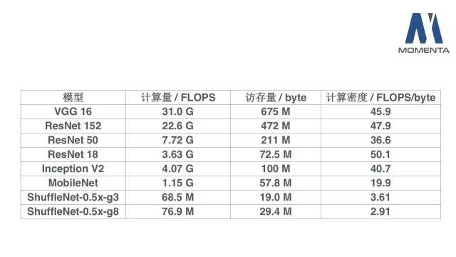

VGG16的计算密度是显著高于其它几个，因为它的结构非常简单，它的内部都是**3×3的卷积，属于这个计算密度最高的一种结构**。其它的一些模型，比如ResNet 152或者ResNet 50，因为它或多或少地引入了bottleneck，导致计算密度会有一些下降。Mobilenet和Shufflenet等等，它们里面根本就没有大规模3×3卷积，只有depthwise的3×3卷积和1×1卷积。

这些降低计算密度的操作在GPU以外的设备上很有价值，因为在树莓派这样一个典型的嵌入式神经网络的场景下，需要小模型，同时它内存带宽资源又相对比较富裕。这样的操作其实本质上是用存储器的带宽资源去换取一些计算资源来提升模型性能。

以上说的是算子层面的优化，还有计算图层面的优化：

1. 算子融合：**能够减少从低层memory向高层memory的搬运**。例如relu向gemm的融合，如果不融合，计算gemm和relu时都至少需要将数据从cache搬入register，再搬回cache。而融合的话，只需要搬入register再搬回cache一次即可。搬运数据的指令和延迟都是可以节约的开销。

2. 减小算子的粒度：左边的是一个粗粒度的计算图，先做了一个包含channel在里面的一个Pooling，然后再做一个channel在里面的Depthwise的卷积。如果采用细粒度的op，它会被展开成右图的样子，在channel层次上切分tensor，每个channel单独做pooling和卷积。好处在于暴露给了这个计算图的优化器更多的细节，这样的这个计算图优化器就会有更多的优化余地。比如通过合理选择op执行顺序，可以尽量避免pooling和depthwise conv之间对主存的访问，降低内存带宽压力。

   

