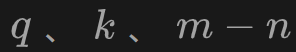
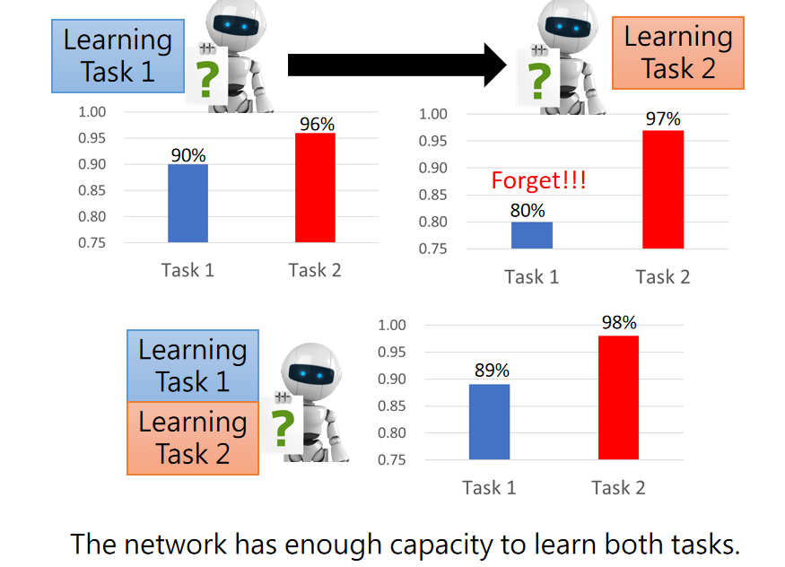
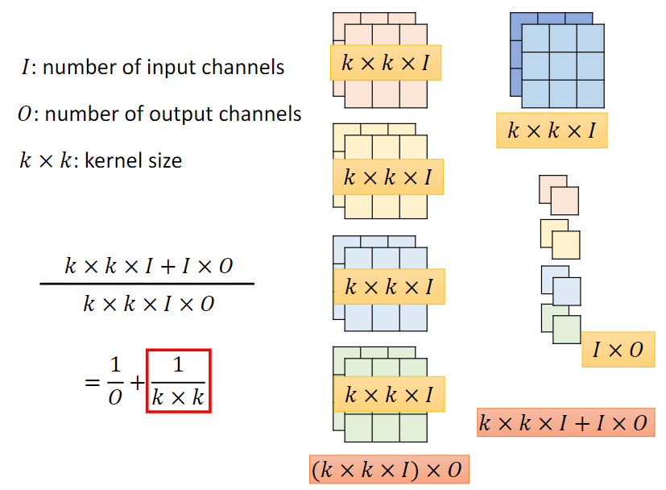

# chatGPT


chatgpt实际上产生的是一个机率的分布，再根据机率从备选的字中随机选择一个字，再将这个字加入到输入中继续获取下一个字。比如**当选择到了机字，将机加入到输入后，下一个字是器的概率就非常高了**，不太可能是好或者机。


监督学习需要人类告诉机器明确的答案，而增强学习适用于人类也不知道明确答案的情况下，人类只需要评价机器给出的答案是好还是坏即可。

chatgpt带来的研究问题：


# 机器学习


alphago下围棋就是寻找分类的函数，函数的输入是棋盘上当前的布局，输出就是从19*19的选项中选择一个位置

机器学习的分类除了以上的两个，还有Structured Learning


chatGPT是给他一段话，然后他生成一个字，本质上也是一种分类，只不过输出的选项是世界上所有的文字

但是使用者的感受是：gpt生成了有结构的句子，所以也是生成式学习


机器学习基本原理：


**深度学习中类神经网络的结构（如CNN、RNN、Transformer等）就是不同的候选函数的集合，也叫做模型（model）**


Loss函数的定义是取决于训练资料的，对于监督学习，可以知道正确答案，就可以用函数与正确答案的距离来作为Loss函数。而对于半监督学习，在不知道正确答案的情况下，就可以用长得像的宝可梦之间的差距来作为Loss函数的定义。


使用Loss函数将候选集合（模型）中的所有函数全都评价一遍之后，从中选出Loss值最小的函数。


“RL要取代DL了”是不可能的，因为RL和DL是不同领域的方法。


Loss值要越低越好，但是无法达到最低，因为备选函数的数量非常庞大，无法一一计算


除此之外，还需要设定备选函数的范围，因为需要排除那些在训练数据上Loss值小，但是在测试资料上Loss值大的备选函数


训练资料越少，训练Loss小，但是测试Loss大的情况就会越多，所以备选函数的范围就要划得越小

比如CNN的备选函数的集合就比fully-connectted和self-attention的备选函数的集合要小，


除此之外，有些方法的优势不在于自己的任务上，而是可以对其他的任务有帮助。如以下的方法，使用这些方法可以更方便地选出符合要求的函数


监督学习是有大量标注数据的学习，无监督学习或者半监督学习或者强化学习是有少量标注数据甚至没有标注数据的学习

监督学习是有一个明确的答案，而强化学习是只有对错，让机器自己学习到底哪里做对了哪里做错了

AlphaGo就是使用监督学习加强化学习，前期使用棋谱对他进行监督学习，棋谱用完后就与对手下棋，根据输赢的结果进行强化学习（它的对手是另一个机器，类似于GAN？）

监督学习、强化学习、无监督学习这些属于场景，取决于我们拥有的数据，所以做强化学习其实是在没有正确答案的情况下万不得已的做法，能做监督学习当然优先做监督学习


## 机器学习的具体步骤（线性模型）

这里我们想要根据过去三年的数据来预测youtube频道的播放量，首先根据过往的数据选择一个函数，函数的自变量就是以往的数据，因变量就是要预测的数据，这个函数的参数都是未知的。**我们也可以称这个函数为模型**。

这里我们先选择一个一元二次方程作为函数。


然后再根据训练数据定义出Loss函数，Loss函数的自变量是预测函数中的参数。**这里只需要定义Loss函数即可，不需要（在参数较少的情况下可以通过暴力穷举来找到最小的Loss值，但是参数变多后就不可能了）计算出所有的可能的函数对应的Loss值**，后面会通过梯度下降的方式找出最佳的参数，即Loss最小的函数。

下面举例说明Loss函数的计算方式：

- 比如假设选中的参数为b=0.5K，w=1，那么就要计算出使用这个函数预测出的数据与当天实际的数据之间的差距，再计算过去三年这些差距的平均值。真实的数据被称为Label


Loss函数对应的函数图像为下图所示：


第三步是从这些预测函数中选择最佳的函数（Optimization，**学习**），也就是Loss值最小的函数

通常对Loss函数使用梯度下降（Gradient Descent），从而找到其中Loss值最小的参数：

1. 首先随机选择一个点（即参数对），在这个点处计算Loss函数的每一个参数的偏导，也就是在该点处计算出这个参数方向上的图像斜率，然后用偏导乘以一个常数，得到的结果就是当前点到下一个点的偏移量。
   - 这个常数就是学习的速率
2. 按照步骤1计算，最后的结果有可能会反复震荡，那么在计算了一定次数后就停止（比如100万次）；也就可能计算到某一点的偏导为0，那么就会停止在这一点上

举例：

对于一个参数的函数：


梯度下降只能找出局部的最小值，不能找出全局的最小值

对于多个参数的预测函数：


我们也可以选取其他的函数。上面是根据前一天的数据来预测后一天的数据，我们也可以根据前七天的数据来预测后一天的数据（那么也就有八个参数），甚至28天、56天。这种模型（函数）称为线性模型


**所以机器学习的前两步分别是写出预测函数和Loss函数，主要计算量集中在第三步的梯度下降中**。我们使用pytorch来计算梯度下降。

## 更复杂的模型的机器学习（sigmoid function）

前言：**深度学习是用来寻找（也可以叫定义）预测函数的，然后由梯度下降来找出该函数的最佳的参数。**而relu和sigmoid这种激活函数就是用来逼近预测函数的。激活函数本质上就是把线性模型变成非线性的模型

然而线性模型太简单了，不管我们怎么调整b和w，y总是随着x的增大而增大，对于先增大再减小的数据就无法使用线性模型表示了。函数的局限或偏差用Model Bias表示


红色的曲线可以使用多种曲线拼接而成，0+1+2+3就可以拼接成下图的红色曲线


只要划分的转折点够多，可以用这种方式表达任何曲线


基础的曲线可以使用sigmoid function表示（sigmoid表示S型的曲线）


只要我们改变c、b、w的值就可以得到各种各样的sigmoid function


所以，**使用sigmoid function作为基础单元，我们可以拼接出任意的曲线**

**使用sigmoid function作为基础单元，我们可以拼接出任意的曲线**

**使用sigmoid function作为基础单元，我们可以拼接出任意的曲线**

**使用sigmoid function作为基础单元，我们可以拼接出任意的曲线**


当前的y由前面好多个x决定，所以要把这些x写入sigmoid中，


实际上，**神经网络的线性代数矩阵的式子和神经网络最开始的求和的式子都可以从神经网络的图中推导出来**，如果是对一个神经元单独地看，就是求和的式子；如果对所有神经元从一个整体来看，就是线性代数矩阵的式子。

实际上，**神经网络的线性代数矩阵的式子和神经网络最开始的求和的式子都可以从神经网络的图中推导出来**，如果是对一个神经元单独地看，就是求和的式子；如果对所有神经元从一个整体来看，就是线性代数矩阵的式子。

实际上，**神经网络的线性代数矩阵的式子和神经网络最开始的求和的式子都可以从神经网络的图中推导出来**，如果是对一个神经元单独地看，就是求和的式子；如果对所有神经元从一个整体来看，就是线性代数矩阵的式子。

实际上，**神经网络的线性代数矩阵的式子和神经网络最开始的求和的式子都可以从神经网络的图中推导出来**，如果是对一个神经元单独地看，就是求和的式子；如果对所有神经元从一个整体来看，就是线性代数矩阵的式子。

最后将所有的参数竖向排列到向量中


选定函数后，就要定义Loss函数。Loss函数是未知参数的函数，与之前的计算方式一样，某参数的Loss值为该参数的所有的预测值与对应的真实值的差距的平均值


此模型的最佳化方式也与之前的相同，还是进行梯度下降。表示在点处的梯度的值


这样一直算到不想算或者算出g为0向量为止

在实际计算中，我们不是用所有的数据来算出一个Loss，而是分成多个batch，对每一个batch都计算出一个g（？），更新一次参数。将每次更新参数称为**update**，将更新一轮参数称为**epoch**


**hyperparameter是自己设置的，而不是机器找出来的参数。learning rate、sigmoid的数量、Batch size都属于hyper parameter**

### relu

上面使用的是soft sigmoid，我们还可以使用hard sigmoid，预测的效果会更好（因为不需要计算指数）

- 注意！relu虽然是线，但是它不是线性函数，只有y=ax+b才是线性函数（一条直线，没有曲折），折线不是线性函数

使用两个relu来合成hard sigmoid，


并且我们还可以通过多次relu来提高预测的准确度，将relu的结果作为下一个relu的输入，并且每次relu的参数都是独立的。


这种方式称为神经网络，也叫深度学习。**所以深度学习是用来寻找（也可以叫定义）预测函数的，然后由梯度下降来找出该函数的最佳的参数。**而relu和sigmoid这种激活函数就是用来逼近预测函数的。


但是并不是神经网络的层数越多预测的效果就越好，下面是每层100个relu，输入是过去56天的数据的神经网络的预测结果。当层数为4时，**训练数据的预测效果变好了，但是测试数据的效果却变差了，这叫做overfit**


层数越多，模型的参数就会越多，overfit就会越严重。解决overfit的方式是

- 增加数据量
- 减少函数弹性（复杂度）

### 感知机


本质上机器学习就是做压缩，比如把一张上千维的图片压缩成几个类别。在压缩的过程中，我们最好是慢慢地压缩，隐藏层的参数慢慢变少， 每一层逐步提炼信息，

**多层神经网络使用隐藏层和激活函数来得到非线性的模型**：

**多层神经网络使用隐藏层和激活函数来得到非线性的模型**：

**多层神经网络使用隐藏层和激活函数来得到非线性的模型**：

- 如果是单层的神经网络，就算使用了激活函数也只能得到线性的模型
- 如果不使用激活函数，就算是多层的全连接神经网络也只能得到线性的模型

### deep的原因

这种方式会有很多层relu，所以叫深度学习。relu越多表示的曲线就越精确，那为什么我们不能增加relu的个数呢？


三个输入四个relu如下图所示：


深的网络和胖的网络的对比：**在同样的参数个数下，深的网络的效果要明显强于胖的网络**。所以当我们有同样大小的模型时，与其把网络变胖，不如把网络变深


所以要达到同样的效果，胖的网络的参数会更多，也就更容易overfit


就像逻辑电路一样，**同样的功能，使用多层的逻辑电路比使用一两层的逻辑电路更好实现**


或者就像写代码，不要把所有的代码都放在main函数中，而是用多层的函数调用，这样实现相同的功能也会更简洁


量化的解释方法：


所以我们可以发现，**深度学习能表示的线段的段数是随着层数的增加而指数增长的**，而广度学习则是与神经元的个数成正比的，是线性增长的。所以**要逼近同样的曲线，深度学习的神经元个数远远小于广度学习**。


**多层神经网络使用隐藏层和激活函数来得到非线性的模型**：

- 如果是单层的神经网络，就算使用了激活函数也只能得到线性的模型
- 如果不使用激活函数，就算是多层的全连接神经网络也只能得到线性的模型

通过增加层数来增加模型的抽象能力，使其排除噪声学习到真正的客观规律；通过增加每一层神经元的数量提高模型对组成要素的识别能力。

这就是为什么神经网络是层次结构的原因，**通过分层计算模型可以学习到更加抽象的特征，通过将前一层的特征进行特定的组合就会产生后一层的特征**，和逻辑电路一样。

## 机器学习任务攻略


𝜽是未知的参数，第三步最佳化找到最好的𝜽


如果只是按照上面的流程来，往往只能得到baseline的结果，如果我们想要做得更好，那么需要按照下面的流程来优化结果：先检查训练数据上的Loss，只有当训练数据的Loss满意后再去看测试数据的Loss。


如果训练数据的Loss大，会有两种可能：

1. 函数选得太简单，范围太小了，出现了model bias。解决方式是多加一些输入，或者神经网络再多加几层

   

2. 最佳化没有找到最小的Loss

   

那么当Loss比较大时，我们如何判断是函数的问题还是最佳化的问题？**从不同模型的比较中可以发现问题所在**

先从简单的模型开始训练，因为**简单的模型更好最佳化**，所以同样的数据，如果简单的模型Loss值低，复杂的模型反而Loss值高，就说明复杂的模型最佳化出了问题（因为简单模型能做到的事复杂模型也一定能做到）


如下图：简单的模型Loss值低，复杂的模型Loss值反而高，说明是最佳化出了问题


### overfit

注意，测试结果不好不一定是overfit。**训练数据的预测效果好，但是测试数据的效果却变差了，这才叫做overfit**

- 训练误差：模型在训练数据上的误差
- 泛化误差：模型在新数据上的误差

overfit也就是指训练误差小，而泛化误差大。而我们真正关心的是泛化误差，训练误差只是用来预测泛化误差的


那么为什么会出现overfit呢？一个极端情况：


由于我们的函数是根据**训练数据**不停调整参数训练出来的，所以该函数只在训练数据处Loss值比较小，**如果这个函数自身弹性（也叫模型容量）比较大，训练数据又比较少**，那么它在训练数据之外的点处，Loss值就可能比较大

**如果这个函数自身弹性比较大，训练数据又比较少**，那么它在训练数据之外的点处，Loss值就可能比较大

**如果这个函数自身弹性比较大，训练数据又比较少**，那么它在训练数据之外的点处，Loss值就可能比较大

所以模型容量要匹配数据复杂度，否则会导致欠拟合和过拟合

overfit也可以理解成是**模型记住了输入**。也相当于我们在模考时记住了题目和答案，所以模考的分数就很高，但是没有真正理解题目背后的逻辑，所以真正考试时分数就很低


比如下图，函数弹性太大，数据又太少，所以发生了overfit


解决overfit的方法是：最简单的方法是**增加训练数据，尽最大可能地限制住函数**；或者进行数据增强，比如在图像识别时，可以将图像反转，截取局部等方式


还可以**利用对问题的理解，选择弹性更小的函数**。比如：如果我们直接选择一元二次方程，那么即使训练数据只有几个点，函数也能被限制地很好


减少模型的弹性的方法：


但是要注意！对模型的限制不能过头了，**如果限制太大，就反而会导致训练数据的Loss变大，出现model bias的问题。**


所以**模型的弹性是一个trade off**，

- 当弹性很小的时候，训练数据的Loss会很大，更不用说测试数据了
- 当弹性很大的时候，训练数据的Loss会很小，但是会出现过拟合的情况，测试数据的Loss反而会变得很大


在实际测试中，测试数据分为两部分，一部分是公开的测试数据，一部分是私密的测试数据。意义：如果所有的测试数据都公开，那么就可以使用测试数据来训练模型（调参），最后得出的是overfit public set的模型。

比如下图，**将多个模型使用公开的测试数据测试后选择其中效果最好的模型，这种行为本质上就是我们手动调参**，产生的模型对于私密测试数据是无意义的。

**将多个模型使用公开的测试数据测试后选择其中效果最好的模型，这种行为本质上就是我们手动调参**，产生的模型对于私密测试数据是无意义的。

**将多个模型使用公开的测试数据测试后选择其中效果最好的模型，这种行为本质上就是我们手动调参**，产生的模型对于私密测试数据是无意义的。

在实际应用中，私密的测试数据就相当于实际应用场景中遇到的数据，是不可能被公开的测试数据全部包括的，所以市面上的ai应用声称在测试中的准确度往往低于实际的准确度


并且在HW中平台的上传次数是有限的，所以不能用公开测试数据找出最好的模型。但是我们可以把训练数据划分出Validation Set，用来测试模型。训练完的所有模型在validation set上测试一下，选出其中最好的模型，再上传到平台上测试。此时公开测试的结果就可以反应private test的结果。**此时最好不要选择公开测试结果最好的模型，因为有可能会出现过拟合的情况，到真正的private testing set中反而效果不好**。

- 总而言之，**真正的测试只能测一次**，就像考试一样，这一次反应的是这个模型真正的情况。对应在现实中，真正的测试就是应用发布后别人的使用情况。

  而为了预测真正的测试情况，我们会在训练集中分出一部分作为验证数据集，~~这个**验证数据集模型没有看过，我们也只能跑一遍，这样才能真正反应测试情况**。因为真正的测试数据集模型也没有看过，也只能跑一遍。~~

  **验证数据集用来调整超参数，训练数据集用来调整参数**，那么验证数据集就可以跑多遍，从中调出最好的模型

- 要想反应真正的测试情况，**验证数据集的条件就要和真正的测试数据集一模一**样

- 注意！验证数据集不能跟训练数据集混在一起

所以，在kaggle上的public test就相当于验证数据集，可以预测private test的结果


validation ratio取决于你有多少的超参数，并且它们的影响如何。如果我们有大量的超参数，那么我们应该使用更大的validation set来调参。

### K则交叉验证

我们可以随机分validation set，但是这有可能会造成数据的偏差。或者我们的训练数据不够，不能分出一块做验证，那么就可以使用下面的方法


选出最好的函数，将该函数在**整个训练集**（即将之前划分的validation set合在一起）上再训练一次（如果我们赶时间也可以不这么干，如果我们追求那1%的提升，可以这样做），将得到的函数上传。

最后，**如果训练资料和测试资料的分布不同，还会出现mismatch的问题**


交叉验证通常用于小数据集，在深度学习中我们往往倾向于使用单个验证集而不是交叉验证，因为交叉验证的计算可能会很昂贵

如果我们能够负担地起交叉验证，那么折数越多效果越好

## 最佳化（优化Loss的值）

在梯度下降算法中不停地更新参数，但是Loss值却无法继续优化了，此时说明梯度接近于0了，可能处在下面的两个点：


判断关键点是local min还是saddle point的方法是：

如果已知𝜽′和L(𝜽′)的值，那么在𝜽′附近的L(𝜽)的值也可以知道。**𝜽′点附近的𝜽点的Loss函数值可以泰勒展开表示**：


**g是一个列向量，H是一个矩阵，他们的列数和行数等于𝜽中参数的个数**

在关键点处，梯度g为0，于是**由后面的第三个式子决定𝜽的Loss值和𝜽‘的Loss值的大小，也就是关键点的性质**


- 如果在𝜽′附近的所有点的第三个式子都大于0，则说明该点是local min；
- 如果在𝜽′附近的所有点的第三个式子都小于0，则说明该点是local max；
- 如果在𝜽′附近的有的点小于0，有的点大于0，则说明该点是saddle point


举例：


要判断某个点的性质，首先要计算该点处的梯度，即一阶偏导，如果梯度为0，那么就是关键点；然后再计算该点处的黑塞矩阵，即二阶偏导组成的矩阵，该矩阵的长宽是𝜽参数的个数，再计算黑塞矩阵的特征值，就能知道关键点的性质。


**如果是一个saddle point的话，那么H矩阵还可以指示更新参数的方向**。


**这种方法要算Hessian矩阵、特征值和特征向量，计算量极大，实际中很少使用此方法。**

### local minima

实际中，函数可能有几亿个参数，就有几亿个维度，在这种情况下，local minima和local maxima是非常非常少见的，这要求关键点在几亿个维度上都是极值点；更多的是saddle point。下图的数据显示，在成千上万的关键点中，从来没有一个真正的local min或local max，全部都是saddle point


## 训练的技巧

**batch和momentum有助于逃离关键点**：

### batch

每一笔训练数据（即一个x组成的列向量）都有一个Loss，而我们进行梯度下降的Loss是所有训练数据的Loss的平均值（或者总和）。

 **定义出Loss函数后，对不同的训练数据Loss函数是不同的**。预测函数的自变量是x，参数是𝜽；Loss函数的自变量是𝜽，参数就变成了输入x和对应的实际结果y（即训练数据）。所以对不同的训练数据，Loss函数是不同的，从图像上看，**不同的训练数据，Loss函数的error surface的长和宽是相同的，但是地形是不同的**（假设𝜽是二维的）。

**在整个训练集上算梯度太昂贵，所以我们将训练数据分成多份，用每一份算出一个L，再对这个Loss函数进行梯度下降，更新一次𝜽**


batch size大：训练数据多，Loss函数就比较长（因为Loss函数是所有真实数据与预测数据的差距的求和），梯度下降的计算时间就长，但是方向明确

batch size小：单次梯度下降的计算时间短，但是方向混乱


但是再实际中，**梯度下降这种重复性的计算可以放在GPU上并行计算**，所以在一定的范围内，batch size的增加并不会导致计算时间的增加（注意，batch之间是不能并行计算的，因为它们之间是先后关系，只能在batch内部并行计算）


相反，batch size增加，一个epoch的时间反而会变短


所以batch size对时间的影响是差不多的，但是batch size还会对训练的效果有影响，**batch size小会有更好的训练效果**


**batch size小更方便最佳化**：**小的batch每更新一次参数就换一次Loss函数，所以比较不容易卡在低谷**；full batch一直使用同一个Loss函数，容易在一棵树上吊死


同样的**训练结果**，小batch size的**测试结果**比大batch size更好：大的batch size容易陷入陡峭的深坑中，小batch size通常都在平缓的坑中，如果测试数据与训练数据的分布不同，Loss函数也会不一样，那么小的batch size的Loss值偏移不会很大


我们通常把batchsize设为2的倍数，因为很多向量化操作在2的倍数的输入上要快一些

### 控制模型复杂度

#### weight decay(权重衰退)

控制过拟合（即提升模型的泛化能力）的方法是：

1. 把模型容量变小，也就是参数数量减少
2. 把每个参数选择的值的范围控制得小（让函数变得更简单）。权重衰退就是做这个

控制参数范围有两种方式：

1. 使用均方范式作为硬性限制：最优化loss的同时还要求参数的均方范式（即w的所有元素的平方和）小于某一个值

   **正则就是范式，用来避免权重过大，控制过拟合**

   

2. 使用均方范式作为柔性限制：柔性限制是改变优化的目标函数，在loss函数上再加上均方范式（通常称为罚penalty），这样在优化时就可以要求loss函数和w所有元素的平方和都要尽可能地小。

   超参数lambda用来控制对权重的衰退程度，如果lambda大，则权重就要尽可能地小

   
   
   
   
   lambda的取值没有简单的方法设定，通常是通过cross-validation决定
   
   使用L2范数的原因：比如我们有同一个输入向量x=[1,1,1,1]，两个权重 w1=[1,0,0,0], w2=[0.25,0.25,0.25,0.25]，所以两个网络有同样的内积，但是W1的L2范数是1，W2的L2范数是0.5。因此L2范数（或者说正则化）会**倾向于更小并且更分散的权重向量**，网络也会因此更看重所有输入的维度，而不是个别输入较大的维度，没有输入的维度可以单靠它自身对结果产生。这样有利于提升模型的泛化性，减少overfit

参数更新的法则：


相当于**每次更新参数时先把参数放缩一个比例，再减去梯度乘学习率**，所以这种方式叫权重衰退

#### dropout（丢弃法）

一个好的模型需要对输入数据加入噪音使模型的鲁棒性更好，**使用有噪音的数据等价于T正则**，也就是一种控制权重，避免过拟合的方法

而丢弃法不是在输入加入噪音，而是在每一层之间加入噪音

我们希望加入噪音后，数据的期望（也就是平均值）不变，所以丢弃法的加入噪音的方式是：


所以Xi`的期望是没有发生变化的

通常在多层感知机的hidden layer使用dropout，就是把hidden layer的输出随机选择一些变成0，其他的输出变大。丢弃的概率是一个超参数

使用了dropout后会控制模型复杂度，降低overfit的程度。不使用dropout会出现**训练**精度和损失变好，但是测试精度却下降（即overfit）


正则项（不管是前面的L2正则还是现在的dropout）只在训练中使用，他们只会影响模型参数的更新，在预测（推理） 的过程中dropout直接原封不动地返回输入，这样能**保证确定性的输出**

### Momentum（动量）

在物理世界中，由于动量，物体会保持向前运动的惯性，突破谷底。在我们进行梯度下降时也可以这样


普通的梯度下降：


当前的移动等于**上一步的移动减去当前的梯度**，也就是当前的移动不止与当前的梯度有关，还与前一步的移动有关


将式子展开就可以得到，**当前的移动等于之前所有梯度的加权平均**


### Adaptive Learning Rate

实际上，**训练卡住了（Loss值不再变化）不一定是在梯度为0的地方，还有可能是在悬崖的两个壁上来回震荡**


在训练的时候，我们不能让机器自己训练然后就去做别的事情去了，这样是没有意义的，训练出来的结果不好我们也不知道是哪里出了问题。一个方法是将loss值的变化过程可视化成折线图，就可以知道训练过程中遇到了什么问题


如果我们的学习速率是固定的，就会出现下图的情况：当学习速率较大时，容易在两边来回震荡；较小时到了谷底，梯度太小，又很难走到目的地


**不同的参数需要不同的学习速率，当坡度比较小的时候速率就要变大，当坡度较大的时候速率就要变小**


由于𝜎在学习速率的分母，𝜎又是所有梯度的均方根，所以可以实现梯度越大，学习速率越小；梯度越小，学习速率越大


这里有个问题是，这个𝜎的变化速度还是太慢了，当前的梯度的权重太低，适应当前地形的速度太慢。于是使用了RMSProp，**加大当前梯度的权重，让当前的梯度有更大的影响力，以前的梯度影响力变小**。当遇到陡峭地形时可以很快刹车。


使用了自适应学习速率后，还会出现一个问题，当来到了谷底后，有时会向两边暴走，因为**纵轴的梯度一直非常小，累积到一定数量后，就会向纵轴暴走**，到了峭壁上，又会自己减小学习率，再走回来。


解决方法是把𝜂也变成动态调整的，**一种是随着时间推移𝜂变小，因为越靠近终点，就要减小学习速率（这个本质和拥塞控制算法一样）**；一种是𝜂从小开始增加，然后再减少，因为开始时收集的梯度太少，𝜎的计算有较大的偏差，这时学习速率应该较小。


如果像这样让𝜂随时间推移减小，那么梯度下降的式子为：


**Momentum和𝜎都是之前所有梯度的加权平均，但是Momentum是算梯度的方向的，𝜎是均方根（梯度先平方再相加），不算梯度的方向，只算梯度的值**。


前面两个方法有助于逃离关键点（或者说不陷入关键点），而自适应学习速率可以帮助逃离梯度**接近**0的地方（但是不能是关键点）


### Batch Normalization

我们称神经网络的一次输入为一笔资料，所以**一笔资料就是指feature 组成的向量**，一个batch中有多笔资料。比如说图像识别，一个图像就是一笔资料。

loss函数的自变量是参数，斜率是feature的值；而一个batch的loss函数是这个batch中所有向量的Loss函数的平均值，所以一个batch的Loss函数是：`L=((w1*x1 + w2 * x2)+(w3*x1 + w4 * x2) + .....) / n`。那么**整个batch的Loss函数的斜率就是batch中同一维度的feature的平均值**；所以如果一个batch中不同维度的feature范围不一样，那么这个batch对应的Loss函数的地形就会比较崎岖，如果不用自适应学习速率很难训练


只有让batch中**所有维度**的feature范围相同，才能更好地进行梯度下降，这个步骤叫做Feature Normalization。这样需要把**一个batch中的所有向量同时进行Normalization**（顾名思义，所以叫batch normalization），在**所有向量的同一维度**之间进行Normalization，新的值等于**原来的值减去同一维度的平均值 再除以同一维度的标准差**。

- 方差（Variance）：是一组数据中每个数据点与该数据集的均值之差的平方的平均值

  

- 标准差（standard deviation）：是方差的平方根

这样所有维度的平均值都是0，并且方差都是1，所以所有维度的范围都差不多


还会向方差中添加一个epsilon，防止除0


在这个基础上做额外的调整：

- **拉伸参数（scale）γ** 和**偏移参数（shift）β** 是可以学习的参数（需要与其他模型参数一起学习），是批量归一化之后学出来的，作用是假设分布在某一均值和方差下不合适，就可以通过学习一个新的均值和方法，使得神经网络输出的分布更好。所以**输入的batch中的每一个feature维度都有对应的 γ 和 β**
- **在实际的方差计算中还有一个小的常量 ε > 0，作用是为了确保在做normalization的时候除数永远不为0**


批量归一化对全连接层和卷积层的行为也不同：

- 对全连接层作用在特征维，在实际的代码实现中，输入的数据的形状是 batch_size * feature_len，每一个样本是一个行向量，所以归一化时是对axis = 0作用

- 对于卷积层，将每个像素的所有的通道合起来作为一个向量，normalization作用在通道维上。所以对于一个卷积层来说，假如输入是批量大小 * 高 * 宽 * 通道数的话，那么样本数量就是批量大小 * 高 * 宽，即批量中的一个像素作为一个样本，对应的通道就是特征


使用了Feature Normalization后，一笔数据的变化会导致所有经过Normalization的数据变化。并且由于𝝈与所有数据都有关，所以所有数据需要一起输入，先把𝝁和𝝈算出来，然后才能进行神经网络的训练。**原来的神经网络是一笔数据输入到一个神经网络就行了**，现在是**一个batch的多笔资料一起输入到一个大的神经网络**。


注意，**批量归一化层在训练模式和测试模式中的行为是不一样的**！

- 训练模式下是用一个batch的平均值和方差来对这个batch中的数据进行归一化
- 测试模式下用户是一笔一笔数据输入的，我们不可能等到用户输入满一个batch的数据再输出结果，所以我们在训练时就需要使用移动平均估算出整个数据集的均值和方差，使用这个 𝝁和𝝈作为feature normalization的参数（这些操作由pytorch完成）


下图可以得知，使用了batch normalization后error surface更加光滑，所以训练的速度大幅提升，但是最后得到的训练效果与普通的模型一样


如果对**批量大小为1的小批量**进行批量归一化，将无法学到任何东西（因为在减去均值之后，每个隐藏层单元将为0），只有使用**足够大的小批量**，批量规一化才是有效且稳定的

批量归一化可以加快收敛速度，因为它使得loss函数更平滑，学习率调大不会导致震荡；但一般不改变模型精度

### 训练不收敛考虑调小lr

当我把激活函数从sigmoid改成relu后，训练无法收敛，将学习率减小后就能收敛了。可能的原因是sigmoid函数两端比较平缓，所以需要比较大的学习率才能收敛；而relu函数在大于0时比较陡峭，所以使用较大的学习率反而会不停地震荡

## Colab

https://colab.research.google.com/drive/1rQ6kmZ3EGgJIPOLLXKo6ruxZlSxmLANp#scrollTo=ca2CpPPUvO-h

# classification

我们可以用之前的regression的方法进行classification，但是不能简单地输出1、2、3这种标量，因为这表示2类离1类的距离比3类离1类的距离更近


我们需要**让模型的输出为向量，这样每个向量之间的距离都是一样的**。

所以分类的输出个数从回归的单输出变成多输出，**输出的个数就是类别的总数**，第i个输出就是第i类的置信度，分类的输出就可以组成一个向量。所以列向量中的所有元素都非负，并且和为1


但是原来的模型的输出是数字


我们可以让sigmoid的输出乘一个矩阵，而不是列向量，那么模型的输出就变成了列向量了


这样得出的列向量中的值可能是任意值，我们期望列向量中的每个元素都代表这个种类的概率，所以**分类输出的列向量中的元素应该非负，并且和为1。**


通过softmax，得到的y都在0到1之间，并且所有的y加起来等于1

**分类的Loss计算方法通常采用Cross-entropy，而不是Mean Square Error (MSE)** 。


因为MSE的Loss函数会出现一大片平坦的位置，梯度下降时容易卡住（除非使用自适应学习速率，在梯度小的地方会增大学习速率）；而Cross-entropy不会出现这种问题。

下图中y3的输入是固定的，并且非常小，经过softmax后接近于0，所以不纳入Loss函数的讨论中。


cross entropy的推论：下面的y_hat是预测值，y是label。

所以**cross entropy的值实际上等于对真实类别的预测值求log**

**cross entropy的值实际上等于对真实类别的预测值求log**

**cross entropy的值实际上等于对真实类别的预测值求log**

所以分类问题我们不关心对非正确类的预测值，只关心对正确类的预测值


# 梯度爆炸和梯度消失

以下面的反向传播为例，假设每层只有一个神经元且对于每一层


那么可以推导出


也就是说，loss对参数的梯度就是：输出层到该参数所在的层之间的 所有层的 激活函数的导数 乘以 该层的权重

而sigmoid的导数的图像是：最大值都只有0.25，其他的值都接近0


所以，会增大梯度消失出现的概率的情况是：

1. 使用sigmoid作为激活函数。所以尽量选择relu作为激活函数，因为relu在大于0的时候导数为1
2. 网络太深
3. 初始化的参数太小

会增大梯度爆炸出现的概率的情况是：

1. 网络太深
2. 初始化的参数太大

所以梯度消失和梯度爆炸的根本原因是反向传播，采用乘法来叠加梯度

梯度爆炸或梯度消失会导致不同层的学习速度（即参数的更新速度）差异很大，靠近网络输出层的学习情况很好，靠近输入层的学习很慢（梯度消失），有时甚至训练了很久，前几层的weight和刚开始随机初始化的值差不多。又由于底层的网络是抽取小范围的信息，如简单的局部边缘，纹理等信息，而高层的网络抽取的是大范围的信息，所以底层的权重发生变化，高层的权重也要重新学习

# CNN（Convolutional Neural Network）

CNN常用于图像的分类，要分类输出就要是一个one-hot vector，这个向量的维度的个数就表示可以分成多少类


一张图像可以看成是一个三维的Tensor，这个Tensor的宽是三层，代表图片channel的数目，一张彩色的图片，每一个像素都是由RGB三种颜色组成的，三个channel就代表了RGB三个颜色。然后将三维的Tensor拉直，这样才能作为神经网络的输入，因为神经网络的输入都是列向量。这个向量每个维度就代表了一个像素中RGB中某一个颜色的强度


将这么庞大的向量输入神经网络，如果是之前的fully-connected的神经网络，每个神经元要与每一个feature产生连接，也就是说每个神经元都要看整张图片。中间将会产生非常多的参数，参数越多，模型的弹性就越大，就越容易发生过拟合


考虑到图像的性质，我们其实不需要让每个神经元与每一个feature产生连接

**神经网络要识别一个图像就是要判断这个图像中有没有出现一些特别重要的关键pattern，所以每个神经元不需要看整张图片，只需要识别一小块位置是否是特征，所以我们准备了64个神经元，每个神经元判断一种特征，然后把整张图片切分成小块，每个小块都要分别输入到64个神经元中。这64个神经元每个的参数都不同，所以整张图片只需要3 * 3 * 3 * 64个参数。**CNN是局部fully-connected

- 这里的多输入通道是3，多输出通道是64。对输入图片使用三层的卷积核，一共有64个卷积核，每个卷积核将输入的三层通道卷积，每个卷积核对应一个输出通道


所以可以将图片的Tensor划分区域，一个神经元只用判断一个小区域的特征，所以**一个神经元可以只与某一个区域中的feature产生连接**


- 因为特征区域有大有小，所以不同的神经元可以接受不同大小的receptive field
- 因为特征区域可能只存在某一种颜色，所以神经元可以只看某一层的channel
- 也可以是非正方形的区域
- 甚至可以是非连续的区域

经典的做法：包含所有的channel，大小为3*3，不同的区域之间往往有重叠（以免漏掉在交界处的特征），stride为2或1。如果区域超出图像范围了，就将超出的区域padding，通常是补0或者取之前区域的平均值。按照这个方式扫过整张图片，确保图片的每个位置都有神经元侦测


由于同一个特征可能分布在不同的区域，所以也需要用**多个同一种神经元监视不同的区域**，具体来说就是，每个区域会有多个神经元，不同区域的神经元之间是共享参数的，这样可以确保每个区域的神经元能形成同样的函数，也就能够有同样的功能


**同一个区域的神经元之间是不共享参数的**，（~~同一个区域的一个或多个神经元合在一起构成一个函数？这个函数的功能是检测一种特征？~~）一个神经元对应的一种参数矩阵就叫做filter，一个区域通常有64个神经元，那么整张图片中就有64种filter，一种filter负责检测一种pattern


CNN的model bias比fully-connected更大，更使用于某一特定领域（比如图像）


整张图片中就有64种filter，一种filter负责检测一种pattern。此图中的filter中的每一个数字都代表feature向量输入到神经元中的一个参数


使用filter遍历整张图，对每个区域进行内积（每个分量相乘再相加）。64个filter，**每个filter都要遍历整张图像一次，最后得出一个64个channel的tensor**


然后将得到的64个channel的tensor再卷积一次，这一次使用的filter是3 x 3 x 64


**此图中的filter中的每一个数字都代表feature向量输入到神经元中的一个参数**


池化：

一张图片中抽掉一些行和列也不影响图片的观测结果，比如抽掉奇数的行和列，图片就可以缩小到原来的四分之一


而池化就是选择一个范围，比如2*2，然后选择其中最大的数


通常将卷积和池化结合起来使用，做几次卷积就做一次池化。但是池化还是会降低图片检测的性能，主要是为了减少计算量，所以在计算能力强的情况下，为了提升检测的性能，通常不使用池化，只使用卷积


最后，做完池化后，要将得到的矩阵铺平（flatten）成列向量，输入到fully-connected神经网络中，再经过softmax得到检测结果


- **卷积层后还需要加上激活函数，因为卷积层本质上和全连接层一样，都是线性的函数，我们需要使用激活函数来让它变成非线性的函数**

卷积层就是将输入和核矩阵进行交叉相关，加上偏移后得到输出

核矩阵和偏移是可学习的参数

核矩阵的大小是超参数

抽象的本质是舍弃了不相关的噪声，找到最相关的判别特征

## 填充和步幅

如果输入的图像比较小，而卷积核比较大，如果我们想多卷几层就需要对输入图像进行填充。或者卷积核超出了输入图像的范围，也需要进行填充。更大的卷积核也可以更快地减小输出的大小

卷积的输出公式：（W- F+ 2 P) / S+ 1，F是感受野，P是填充（上下左右各填充P），S是步长，W是输入的宽度

如下图，填充之后输出的图像甚至比原来的图像还大


填充时通常取p=k-1，这样可以让输出和输入的大小相同


如果卷积层太多，我们可以增加步辐，让输入卷积得更快


- 填充和步辐是卷积层的超参数
- 我们可以在输入的图片周围填充行和列来控制输出形状的减少量
- 步辐可以成倍地减少输出的形状

这几个超参数中，最重要的是核大小；其次是填充，通常设为核的大小减一，目的是让输出和输入的大小相同；如果想让图片卷积得更快，步长通常设为2

卷积核通常是奇数，主要目的是让上下左右填充是对称的

机器学习本质上就是一个压缩的过程，比如给模型一张照片，它要将它压缩为一个label

## 多通道

在输入有多个通道的情况下，每个通道都有一个卷积核，每个核对自己这层的通道进行卷积，然后将所有卷积核的结果求和


每个输出通道可以识别特定的模式，上一层的输出通道组合起来又被下一层的输入通道核读取，输入通道核将上一层的模式组合起来识别出更大的模式

1*1的卷积层不识别空间模式，输入和输出的图像维度相同，但是可以融合输入的通道


核的维度是四维的，一维是输入的通道数，一维是输出的通道数；偏差是二维的，每个通道加上一个标量偏差


所以每个输入通道有一个独立的二维的卷积核，所有通道结果相加得到一个输出通道的结果

每个输出通道有一个独立的三维的卷积核

## 池化

由于卷积对位置非常敏感，为了降低位置的敏感程度，我们可以使用池化

- 池化可以减少输入的空间的大小，从而减少计算量和参数数量，从而控制过拟合。某种程度上和dropout差不多？

池化和卷积基本相同，也是使用一个滑动窗口，但是不是算出加权和，而是提取出窗口中最大的元素作为输出


池化可以起到一个模糊的效果，缓解卷积层位置的敏感性。如果卷积层在某个位置输出1，如果输入的图像偏移一下，那么输出的1也会移动，如果使用池化的话，它会在原来输出1的位置的附近添加另外的1，所以输入图像的偏差不会干扰结果


现在池化使用的比较少，因为池化的两个主要功能（通过stride减小计算量和缓解位置的敏感性）可以被其他的东西替代：

- 卷积中的stride也可以减少计算量
- 我们在做数据增强的时候会把同一张图片做各种变化再输入网络中进行训练，所以我们在数据上就不会让卷积层过拟合于图片的某个位置，经过这样的训练之后网络本身就不会对位置太敏感

池化公式：


在实践中发现的池化层通常只有两种：

- F= 3 , S= 2（也称为重叠池）
- 更常见的是F= 2 , S= 2

太大的池化层破坏力太强

## alpha go

将棋盘拉直成向量输入到网络中（fully-connected）；或者使用CNN，将棋盘看做是48个channel的矩阵


## LeNet（手写数字识别）

CNN的通常的流程如下：


LeNet的架构如下：也是两个卷积层两个池化层，再铺平输入到全连接层转换到类别空间

- **卷积层后还需要加上激活函数，因为卷积层本质上和全连接层一样，都是线性的函数，我们需要使用激活函数来让它变成非线性的函数**

从图中可以推测出：第一个卷积核的大小是5，第二个卷积核的大小也是5，两个池化核的大小都是2


**通过卷积层提取特征，将特征输入到全连接层进行分类**

**通过卷积层提取特征，将特征输入到全连接层进行分类**

**通过卷积层提取特征，将特征输入到全连接层进行分类**

在卷积的过程中，通道数一直在增加，高宽一直在减少。输出通道增加，**增加的信息是在局域中识别出的特征**（输出通道也不能太多了，会导致overfit）

卷积层的模型比全连接层要小很多，出现overfit的可能性更低。**其实对于小图片，使用MLP也可以，但是对于大图片，使用MLP参数就太多了，容易出现overfit，需要使用CNN**

其实在工业界中，是不会像我们这样从0开始训练模型的，现在已经有很多基于大量数据训练出来的模型，我们可以直接把这些现成的模型参数拿来，使用少量的数据，针对特定的任务进行微调参数

## alexnet

ImageNet和mnist的对比：


由于ImageNet要识别的信息量更大，所以AlexNet主要是更深更大的LeNet。**由于模型更大，为了防止overfit，在全连接层后加上了dropout层；由于层数更多，为了防止梯度消失，将sigmoid层改成了ReLu层；**


**由于图片更复杂，信息量更大，所以输出的通道也更多，代表需要识别的特征更多**

具体架构：


## VGG

既然AlexNet比LeNet更深更大就可以得到更好的结果，我们也可以更深更大。为了方便我们构建更深更大的网路，**VGG就是使用AlexNet的卷积层的一部分作为一个组件，也就是将卷积层组合成块**，使用VGG就可以像拼积木一样地构建神经网络

一个VGG块和AlexNet一样，由多个卷积层和一个池化层组成，卷积层的维度是3*3（实验发现5 * 5的效果不如3 * 3，**深窄的卷积层比浅胖的卷积层效果更好**），padding是1，但是具体的层数和输出通道数都属于超参数，可以自己调节。


所以**VGG块本质上就是删去了AlexNet前面两块不规则的卷积层和池化层，用剩下的这部分卷积层构成一个模块**，**使用可重复使用的卷积块来构建深度卷积神经网络**

卷积层组成的序列中，卷积核依次高宽减半，通道数翻倍。这是一个经典的设计

## NiN

之前的AlexNet和VGG的问题是全连接层太大了，整个网络大部分的参数都是全连接层的。导致有可能出现过拟合

NiN块的架构：一个卷积层后跟两个1*1的卷积层，起到全连接层的作用。这里说1 * 1的卷积相当于全连接是对每一个像素来说的：如果一个像素有100个通道，那么就相当于一个100维的向量，卷积核就相当于有100个参数的全连接层


NiN最后使用一个全局平均池化层，该层的输入通道数是类别数，对每一个通道做全局平均池化，相当于每个通道剩下一个平均值，然后将所有通道的池化结果展平，得到一个向量，就是分类的结果


VGG和NiN的比较：


## GoogLeNet

inception用四条有不同超参数的卷积层和池化层的路来抽取不同的信息，**inception不改变输入输出的形状，改变的是通道数量**


白色的**1*1的卷积层的作用是降低输入的通道数**，因为后面有3 *3 和5 * 5的卷积，以降低模型的复杂度

- 这也是为什么右边的1*1的卷积层比左边的通道数降低的更多，因为5 * 5的卷积核参数更多，所以为了控制复杂度，输入的通道数相对于3 * 3的卷积核要更低

蓝色的**卷积层的作用是用来抽取信息的**，最左边的单个的1 * 1的卷积是用来抽取通道信息的，其他的蓝色的卷积层是用来抽取空间信息的


如何分配哪个卷积层输出多少通道？

- 每个通道用来识别一种模式，所以我们需要给重要的卷积层分配更多的通道。比如3 * 3卷积层分配了一半的通道，因为3 * 3计算量既不大，又能够很好地抽取空间信息

**googleNet和NiN一样，大量使用各种1 * 1的卷积核，降低通道的个数**，所以和单3 * 3和5 * 5的卷积层相比，GoogleNet有更少的参数个数和计算复杂度

所以inception不仅增加了网络中的多样性，而且模型复杂度也降低了

GoogleNet 的具体架构：分为5个stage，每个stage都以一个步长为2的MaxPool结束，所以每个stage都让输入的长宽减小一半；并没有像NiN一样限制最后的AvgPool输出的通道数等于类别数，而是将它的输出再输入到一个FC中


## ResNet

下图中每个函数的圈代表该函数能包含的情况


所以我们可以发现加更多的层不一定能够改进精度，因为有可能加到了错误的方向，反而离最优的更远了。但是嵌套函数可以确保总是能够改进精度，至少不会让已有的精度降低

将函数的输入和函数的输出相加作为下一个函数的输入，就能实现函数嵌套了，即使这个函数没有任何作用我们还是能保证前一个函数的结果，而不至于产生负优化


ResNet块中通常有两个3 * 3的卷积层，第一个可以指定步长，如果步长为2的话，那么**长宽减半，通道数就要相应地增加**（这是卷积的惯例）。输出的通道数增加了，那么ResNet块的旁路也要使用1 * 1的卷积，步长与ResNet块的步长一样，只有这样让X和f(X)的形状和通道数都相同，这样才能相加


ResNet的整体架构：ResNet像GoogleNet一样分为多个Stage，一个Stage由多个Residual块组成：通常第一个ResNet块将输入高宽减半，通道数翻倍，然后要接一个或多个高宽不变、通道数也不变的ResNet块，


### resnet如何解决梯度消失

紫色的是原来的网络，对某个参数的梯度是一层层乘过来的

绿色是使用了residual后的网络，对某个参数的梯度既可以通过residual块一层层求导，也可以通过旁路直接求导。即使residual多层叠加之后梯度很小，但是旁路的梯度大，二者进行加法就可以把residual块的小梯度忽略不计


# CPU和GPU

 

如果矩阵是按行存储的，就是说这个矩阵的行地址是连续的，那么这样的矩阵适合按行读取，不适合按列读取

高端的CPU有几十个核，但是我们要区分物理核和超线程的核，超线程是对物理核进行虚拟化，一个物理核中的超线程共享一套物理资源。所以超线程不一定能提升性能，因为它们共享寄存器，对于运算密集型程序，一个线程用了所有的寄存器后其他的超线程只能等着。所以**超线程通常是给不一样的计算任务使用的**

尽量不要使用for loop，能够使用Tensor做的运算就尽量使用Tensor做，实在不行就用C语言做，因为python对函数调用和并行的实现效率很差


下图的GPU中，每一个绿点都是一个计算单元，GPU的一个核中有大量的计算单元，而CPU的一个核中只有一个计算单元。所以GPU的计算能力比CPU强很多


由于GPU核多，一次计算从内存中读取的数据量也多，所以GPU的内存带宽比CPU要大得多。但是也正因此GPU的内存价格比CPU要贵得多，所以GPU的内存往往很小。

GPU将芯片的大部分区域用来做计算单元，所以控制单元的能力比CPU要差很多


硬件和软件工作负载二者之间是螺旋状的关系，硬件按照摩尔定律持续上升，当软件发现硬件变强了，就会疯狂提升，直到提升到此时的通用芯片（CPU）的瓶颈，通用芯片不行就换专有芯片（GPU），专有芯片还不行就换更专有的芯片（领域专用的芯片），最后软件偃旗息鼓。再过很多年后，硬件又发展得很好了，那么软件又会跟上来

## TPU


要造通用芯片是非常困难的，这就是为什么只有两家公司在造CPU，但是造GPU这种专用芯片就要简单很多了，很多大公司都有自己的ai芯片。


ai芯片就是将内部的计算单元阵列构造成矩阵乘法的形式，专门用来做矩阵乘法


Systolic Array的矩阵乘法输入的参数最好要和计算单元阵列的形状相同，然后将输入的数据排好形状等待输入


每次将当前计算单元的计算结果向下移动一次，同时将输入矩阵向右移动一次，每个计算单元的计算结果就是 上一个计算单元在前一步的结果加上 当前输入与当前计算单元中的参数的乘积 之和


当最下面一层的计算单元的计算结果移动出去后，就表示目标矩阵的一个元素计算完毕了


Systolic也可以通过批量输入构成流水线来避免一些计算单元空等，降低延时


arm和amd、intel不一样，它不制造CPU，只是一个指令集架构，授权给硬件厂商，由硬件厂商自己制作芯片，也可以在基础上做一些修改。类似于risc v，不过risc-v不要钱

## 多GPU并行


- 数据并行是将批量分成多块，每个GPU计算一块的梯度，最后将每个GPU计算的结果合在一起求平均值就是这个批量的梯度（**因为batch的Loss就是所有exmaple的Loss的平均值，而梯度就是Loss对某个参数求导，所以梯度也是所有exmaple的梯度的平均值**）
- 模型并行是将模型分成n块，比如一个100层的网络，两个卡分别计算50层。但是由于后面网络的计算结果依赖于前面网络的结果，所以一个卡计算时其他的卡只能空着。所以模型并行**适用于模型大到单GPU放不下**


先把batch均匀切割到每个GPU上，然后每个GPU再把模型完整的参数也读进来，然后GPU使用自己的样本和完整的参数计算梯度，最后**把所有GPU的梯度传到一个GPU中，在这个GPU中将所有梯度求和，再分发回每个GPU中（这个就是allreduce）**，在每个GPU中各自进行梯度下降更新参数，然后对下一个batch进行训练。

我们通常是把数据从CPU主存移动到GPU进行计算，计算完之后要访问计算的结果还要从GPU移动到主存。CPU只能直接访问主存，是没有办法访问GPU的

样本多样性不够的时候，使用大批量的batch是没有意义的，比如mnist只有十个类，但是imageNet有1000个类，就可以使用512甚至更大的batch size

## 分布式训练


从下图中我们可以发现，GPU之间的速度非常快（通过PCIe交换），GPU到CPU的速度会慢个十几倍（CPU到GPU只有一根线，多张GPU共享带宽），CPU到网络又会慢个十几倍，所以尽量在机器内部进行交换


每个机器拿到批量中的一部分，再进一步将数据切分到每个机器内部的GPU中（先从分布式文件系统中复制数据到内存，再从每台机器的内存中复制到GPU的显存中）。每个机器从参数服务器中获取模型参数，拿到机器内存中后，同样还是把参数复制到每个GPU上。在每个GPU上把梯度算出来后，在**每个机器**上做all_reduce，算出**这台机器上**的梯度总和，然后每台机器把自己的梯度传回给服务器，由服务器对梯度求和并更新参数

- 这个过程中不是完全并行的，因为参数服务器只有等所有梯度集合完毕，更新参数之后才能把新的参数发给计算集群。所以计算机器在计算前向传播（即计算`loss(net(X),y)`，net中自动调用了forward）的时候服务器是空闲的，计算反向传播的时候是每计算完一个梯度就发送一个，所以计算机器空闲的时间是 最后一个梯度的发送给服务器的延迟加上服务器更新参数和分发参数给机器的时间的总和

总体思想就是：尽量减少网络的通信，而是使用机器内部的通信。所以是由机器向服务器中获取模型参数后，复制给GPU，而不是由GPU向服务器获取模型参数，因为这样会有多次网络的通信

实际中，**计算和通信之间可以构成一个流水线**，所以计算一个batch所花的时间取决二者的最大值


- 批量变大系统训练性能会变高（因为batch可以在GPU上并行，所以批量变大后，一个批量的执行时间不变，但是一个epoch的执行时间却减少了），
- 批量变大后训练有效性会降低，即收敛效率会变低，到达某个精度花的时间更长，需要使用更大的学习率（因为批量再增加，数据的多样性也不会改变，比如类别是10类，batch_size是512和1024，由于梯度是batch中example的平均，所以前后二者的梯度质量差不多，但是后者却要花前者两倍的时间，所以到达同样的精度后者也是前者的两倍时间）
- 所以batchsize的大小最好不要超过数据集的20倍（最多100倍）

在实际中，分布式训练的瓶颈通常是网络通讯；

## 数据增强


数据增强能够让数据集有更多的多样性，让模型的泛化性和鲁棒性更好，降低overfit的可能性，能够应对更多的情况

- 使用了数据增强之后训练精度会降低，测试精度会提升，也就是overfit会降低

往往是在训练的时候对输入的数据进行随机地增强，在测试的时候是不用的，所以我们也可以把数据增强看成是一种正则项


常见的图片增强包括翻转切割变色


具体使用哪种增强方式取决于我们的测试集与训练集的差别，增强的方式最好要符合测试的情况

# few-shot学习

few-shot学习是指对每一个分类的类别都只有少量训练数据的任务，即小样本的学习

few-shot学习本质上就是要提高机器的学习能力，最原始的数据结构算法是固定的，在一个任务上做得好稍微变一变就完全不行了，这样的机器就是完全没有学习能力。我们希望机器可以像人一样有触类旁通的能力，学会识别一种图片（大量的数据）之后，再给他看另外的图片（不需要很大的数据集）很快也能学会

所以few-shot学习需要两部分的经验：

1. 有监督的信息，这部分往往很少
2. 先验知识：先验知识可以通过预训练的模型或者元学习或者领域知识来获取

few-shot学习的意义：

1. 让机器可以真正做到像人一样学习
2. 应对一些数据稀缺的学习，比如医学图像，它本身就是一个小样本学习的过程，很难采集到大量的数据
3. 减少计算资源的消耗

few-shot学习的变种：


zero-shot是指即使一个类从来没见过，机器也可以对它进行区分

## 微调(迁移学习)

我们希望机器可以像人一样有触类旁通的能力，学会识别一种图片（大量的数据）之后，再给他看另外的图片（不需要很大的数据集）很快也能学会，这就是微调，或者说迁移学习


微调时前面的特征提取网络的权重初始化是直接复制预训练的模型的参数，但是最后的输出层（即Softmax回归，是一个全连接层，比如对于mnist来说就是最后那个512*10的全连接层）的参数不能直接照搬，需要随机初始化的，因为label可能变了。


深度学习就是一层层地抽取特征，由于底层的特征更细微，也更通用，而高层的特征更跟数据集相关，所以**我们重点训练的是高层，包括softmax回归层**，所以在微调的时候我们可以固定底部一些层的参数，不参与更新，只更新高层的参数。或者将底层的学习率设的比较小，高层的学习率设置得比较大。这样也就意味着更强的正则，减小了模型的复杂度，降低了overfit

微调对学习率不敏感


微调通过使用在**大数据**上训练好的模型来初始化模型权重，所以**微调的预训练模型质量很重要**。微调是深度学习能够迅速在工业界取得大规模应用的前提条件，因为不同的领域可以直接把别人的模型拿过来在自己的数据集上微调即可

few-shot的另一个方式：传导推理（Transductive Inference）

利用已有数据的标注和数据之间的相似性，将标注向外传播


单类分类问题（one-class classification，OCC）：在训练数据只有一个类的情况下，把类的边界构造出来


# 计算机视觉

## 目标检测

图片分类和目标检测的区别：图片分类是一张图片中有一个主体，我们主要是识别这个主体，其他的东西都不重要；**目标检测是要识别一张图片中所有我们感兴趣的物体，还要把每个物体的位置也找出来**。

所以目标检测是更高级的图片分类，当一个图片中只有一个物体时，就相当于是图片分类

  

目标检测在无人车和智能售货柜中应用的比较多，用来识别道路上的物体或者售货箱中的商品


所以目标检测的数据集通常比图片分类的数据集要小很多，因为目标检测标注一张图片的工作量是图片分类的很多倍

目标检测的数据集的标注通常放在一个txt文件中（由于一个图片中会有很多个不同类别的物体，所以不能像分类一样将同一个类别的图片放在一个文件夹下），每一行表示一个物体，每一行数据包括图片文件名，物体类别，和边缘框的四个数字（共六个信息），同一个图片文件名会在重复出现多次


### 锚框

边缘框（bounded box）是物体真实的位置，锚框是我们的算法对边框位置的猜测

大致的过程是：算法先提出多个锚框，然后判断每个锚框里是否含有关注的物体，如果是的话，就再预测从这个锚框到真实边缘框的偏移。所以整个过程我们要做两次预测，一次是预测锚框中含有哪一类物体，第二次是预测锚框到真实框的偏移


处理锚框需要比较两个框之间的相似度，比如要比较锚框和真实框之间的相似度，或者比较锚框之间的相似度：使用两个框之间的重叠的部分来判断相似度


每一个锚框是一个训练样本，而这些样本的label：如果框中了某一个物体，

## 语意分割

目标检测是给物体画个框，语义分割是更精细，识别每一个像素属于哪一个物体


应用：


语义分割只能用来识别每一个类，而实例分割可以来识别每一个类的实例


在语意分割中，训练数据是一张图片，对应的label也是一张相同大小的图片，每个像素的值对应一个label，如果两个像素是一样的，那么他们的label就是一样的。并且使用png格式存，防止被压缩


我们还需要列举训练数据的label中的每个RGB的颜色值对应的类名是什么


## 转置卷积

转置卷积用来增大图片的高宽，拿输入的每一个元素与kernel相乘，但是不求和，而是保持kernel的形状不变。将输出的矩阵放在输入元素同样的位置，根据stride决定每个输出矩阵之间的重叠部分。下图是stride是1的情况


反卷积的意义是：卷积之后的矩阵的每个元素有一个感受视野，**反卷积希望通过这个元素还原感受视野里面的内容**。并且由于卷积后的元素的感受视野有相交的情况，所以反卷积中也出现了结果中有些元素的值来源于卷积结果的一个或多个元素的现象，理论上**通过反卷积，我们可以通过将特征图反卷积还原到原图大小，从而获取到我们的卷积核在原图中提取的是什么信息**。但是反卷积并不是正向卷积的完全逆向的过程

# embeding

One-hot vector 就是一种 embedding 方法，缺点是它们通常很稀疏，并且维度很高（与词汇表的大小相同），这可能不利于机器学习模型的训练和性能。为了解决这个问题，通常会使用其他 embedding 技术，如 Word2Vec 或 GloVe，这些技术可以在更低维度的连续向量空间中表示单词，并且能够捕捉单词之间的语义相似性（语义相近的单词的embeding转换到空间中位置相近，而两个向量之间的内积的大小恰好就表明这两个向量在空间中的位置关系，也就是表明这两个token的语义的相似度，当两个向量重叠时内积最大，垂直时内积为0，相反方向时是负数）

所以涉及到自然语言的模型通常都有embeding矩阵，这个矩阵将每一个token映射到一个向量

GPT3的embedding矩阵


同一个token在不同的句子中的含义很有可能是不一样的，但是在最开始经过embedding矩阵得到的向量只有token本身的含义，比如下图中是三个mole的含义实际上都不一样，但是他们的embedding是一样的，因为此时仅仅是查表得到的结果


但是我们还希望它能够结合所在的上下文的含义，而attention做的就是这个工作


attention一次只能处理固定大小的token数量，也就是上下文窗口的大小，gpt3的上下文窗口大小为2048（由于推理时是一个个token输入的，所以这里上下文窗口的大小实际就是kvcache的大小（猜测：到达窗口上限后，每次新加入一个token就将最前面的token排除，窗口大小始终保持在2048，类似滑动窗口？））。所以这个上下文窗口限制了transformer在预测下一个token时可以结合的上下文文本量，这就是为什么在与gpt长时间聊天时会感觉他失去了之前对话的记忆

下面（gpt）讨论的都是self-attention，而在机器翻译中（比如原始的transformer）通常使用的是cross-attention，decoder输入的token作为query，encoder输出的向量们作为key和value，前者在后者中进行attention，得到的结果就是上下文，和decoder本来的token对应的embedding进行拼接后输入decoder中

# attention

之前的模型的输入是一个列向量，还有可能输入是很多个列向量，并且列向量的个数是可变化的，不确定的


以下的情况输入是由列向量组成的序列，并且序列长度是不确定的：

输入的是文字，每个单词作为一个列向量（这里可以使用one-hot编码，比如假设世界上有1000个不同的词，就使用一个1000维的向量，每个向量表示一个词；one-hot的问题是：它无法体现出来语义的信息，无法体现出来哪些词语是有联系的）


输入的是声音讯号，将声音讯号取一段，这一段称为window，每个window中的信息描述为一个向量（称为frame）。隔一段距离（通常是10ms）再取一个window，这样，整个声音讯号可以分成很多个window，也就是很多个向量


一个数据结构中的图也可以视作是一系列的向量，其中一个点可以被看做是一个向量


输出：

- 每个向量对应输出一个label

  - 比如词性标注（POS tagging），输入几个单词，输出每个单词对应的词性）；
  - 比如语音识别中的一部分（HW2），输入组成一段声音讯号的一串向量，判断每个向量属于什么Phonetic；

  

- 一整个向量序列输出一个label

  - 比如情感分析，给机器输入一段话，判断这句话是正面的还是负面的
  - 比如语者辨认，判断说话的是谁

  

- 机器自己决定要输出多少个label

  - 比如翻译和语音辨识，输入一段话，输出另一种语言或文字。
  - 或者语音合成，输入文字，输出一段话

  

  

本节课我们集中于输入输出一样多的情况，称为Sequence Labeling，给sequence中的每一个向量输出一个label

我们不能简单地把每个向量输入到一个单独的fully-connected（简称FC）网络中，因为这样就失去了上下文的信息。可以把前后几个相邻的向量**拼起来**输入到同一个FC中，这几个相邻的向量可以视为一个window（在HW2中，也是这么做的，我们不止是看一个frame，而是看前后各五个，总共11个frame，来决定某一个frame属于什么phonetic）


如果一次看相邻的几个向量还不够，那么就使用self-attention（不建议使用更大的window把整个序列都罩住，因为**FC通常用来专注于处理局部的信息**，不能一次性输入大量的信息，这样的话输入的feature太多，**FC中的参数太多，容易overfit**；比如CNN，它就不会将整张图片输入到一个神经元中，而是切分成很多块，一个神经元负责识别一小块的特征）

- **输入整个向量序列，输出相同数量的向量，输出的向量都是考虑了一整个序列后得到的**，再把这个向量丢入FC网络中


我们还可以把self-attention和FC交替使用，**self-attention用来处理整个序列的信息，FC专注于处理某一个位置的信息**


## 注意力机制

心理学把线索分为随意线索和不随意线索，随意线索是指主动或者有意识地去观察，


卷积，全连接这些神经网络都只考虑不随意线索，也就是它们不会刻意地从输入中提取某个指定的信息；而注意力机制则会显式地考虑随意线索，随意线索被称之为query，表示我们想要做什么，环境就被认为是一些kv对，key和value可以相同也可以不同，value是这个物体对我们的价值。**通过注意力池化层，会根据我们的query有偏向性地选择某些kv对**


注意力池化层的原理：

- 给定数据(Xi,Yi)，这些数据就相当于是kv对，f就是注意力池化层，x就是输入的query。最简单的查询方案是不管query是多少，直接将所有的value平均后返回。

- 更好的方案是根据query和每个key的相似度（K就相当于是衡量x和xi之间距离的函数），然后用相似度加权对各自的value求和。

**注意力机制与KNN非常类似，KNN是选择与自己最相近的图片，而注意力机制更平滑一些，是根据相似度（注意力权重）对所有的value加权求和**。

所以**注意力池化层的核心问题在于如何计算query和环境的注意力权重**

所以**注意力池化层的核心问题在于如何计算query和环境的注意力权重**

所以**注意力池化层的核心问题在于如何计算query和环境的注意力权重**


如果衡量距离的函数选用高斯核，带入上面的式子后，**注意力权重就相当于算出x和xi的距离后再做一个softmax**


以上是非参数的注意力机制，其中没有可以学习的参数。我们也可以引入参数：


注意力分数的实现方式：

- 
- 

每个batch中的每个query和每个key都对应一个注意力分数，最后还需要将注意力分数乘以每个key对应的value向量，再把每个query对应的所有key的这个值求和。

- 求和可以用矩阵乘法来表示，将注意力分数排成一排，将value向量排成一列，做矩阵乘法即可得到每个注意力分数分别乘value向量再求和的结果 

所以如果注意力分数的形状是2 2 10（batch size，query的数量，key的数量），value的形状是2 10 4（batch size，kv对的数量，value的长度），那么最后结果的形状就是2 2 4（batch size，query的数量，value的长度），即将**每个query**对所有key的注意力分数分别乘以对应的value再求和，一共两个query，所以每个query在结果中各占一行。

对self-attention来说每个输入既是query又是kv，self-attention的输入是一个序列，也就是二维矩阵，序列中的每个token都是一个kv对，将token对应的embedding通过一个全连接层就得到它对应的qkv，所以qkv也是一个向量，所以每一个query通过attention 层之后得到的是一个与value形状一样的向量，将整个序列通过attention层后得到的是与这个序列形状相同的矩阵。

**输出的维度和value的维度是一样的，输出的个数和query的个数是一样的**

## self-attention

之前的attention是给定额外的query，将序列作为key和value，对他们抽取特征；而self-attention可以将序列的每一个时间步都当做query，key和value，也就是每个时间步可以自己对自己抽取特征。


所以注意力比较适合处理长的文本，因为它可以无视距离，提取的信息可以直接到达，可以看的比较长。所以注意力机制适合处理比较大的数据，如gpt，bert。但是注意力机制的计算复杂度是文本长度的平方，所以它的计算复杂度也非常大。

self-attention的具体结构：


𝛼1,2表示1和2之间的关联性（也叫attention score）


再把每个输入对应的**关联性做softmax，然后乘以另一个向量V再求和**，得到b，因为我们之前做过了softmax，所有关联性相加等于1，那么**b就包含了整个序列所有向量的信息，并且包含的信息数量与该向量和当前向量的关联性成正比**

**b就包含了整个序列所有向量的信息，并且包含的信息数量与该向量和当前向量的关联性成正比**

**b就包含了整个序列所有向量的信息，并且包含的信息数量与该向量和当前向量的关联性成正比**

**b就包含了整个序列所有向量的信息，并且包含的信息数量与该向量和当前向量的关联性成正比**


并且self-attention可以并行计算


### 位置编码

和CNN/RNN不同，注意力机制并没有记录位置信息；如果我们把输入的kv对打乱，注意力的输出的值不会发生变化。所以我们不能纯用注意力来处理序列信息。解决方式是向注意力的输入中添加位置编码：

- 位置编码就是一个与输入形状一样的矩阵，输入矩阵的每一行是一个样本，即一个时间点，所以位置矩阵的每一行的值都与这一行的位置有关，每一行内部的值一样。然后将这个矩阵和输入的序列相加，作为attention的输入


**位置编码可以设置为可学习的，也可以设置为不可学习的正弦函数。**

可学习的位置编码：

- 每个位置的位置编码向量会随着模型一起训练。假设模型最大输入长度为512，向量维度为768，我们可初始化一个512*768的位置编码矩阵，该矩阵将参与模型的训练，从而学习得到每个位置所对应的向量表示。如何为每个位置的词向量注入位置信息呢？答案是相加

- 训练式位置编码广泛应用于早期的transformer类型的模型，如BERT、GPT、ALBERT等。但其缺点是模型不具有长度外推性，外推性是指大模型在训练时和预测时的输入长度不一致，导致模型的泛化能力下降的问题。因为位置编码矩阵的大小是预设的，若对其进行扩展，将会破坏模型在预训练阶段学习到的位置信息。例如将512 * 768扩展为1024 * 768，新拓展的512个位置向量缺乏训练，无法正确表示512~1023的位置信息。但早期大家对长文本输入的需求并不如现在迫切。

不可学习的正弦函数：

- Sinusoidal位置编码是谷歌在Transformer模型中提出的一种绝对位置编码，

  

  Sinusoidal位置编码的每个分量都是正弦或余弦函数，所有每个分量的数值都具有周期性。每个分量都具有周期性，并且越靠后的分量，波长越长，频率越低。

  

**但是，位置编码的缺点是：它的长度往往是固定的。**比如输入图片的大小是 𝐻×𝑊 ，分成大小为 𝑆×𝑆 的patch，那么patch的数量就是 𝑁=𝐻𝑊 / 𝑆^2 。比如现在训练集输入图片是224×224的，分成大小为16×16的patch，那么序列长度是196。所以训练时把位置编码的长度也设置为196。但是后续进行迁移学习时输入图片是384×384的，分成大小为16×16的patch，那么序列长度是576。此时你的长度是196的位置编码就不够了,这时人们通常的做法有这么几种：

1. **相对位置编码**

   Relative Position Encoding 考虑sequence 元素之间的距离，也是一种有效的手段。（以上两种都是绝对位置编码）

2. **插值法**

   把位置编码进行双三次插值 (bicubic interpolation)，把196的位置编码插值成长度为396的，以适应新的数据集。

   即便是有这样的补救措施，但是：

   - 许多视觉任务都需要不断改变输入图片的大小，也就需要不断改变输入序列的长度，这样做很不方便。
   - 插值的方法会影响性能。

#### rope

旋转位置编码（Rotary Position Embedding，RoPE）：和相对位置编码相比，RoPE 具有更好的**外推性**，目前是大模型相对位置编码中应用最广的方式之一。

在绝对位置编码中，尤其是在训练式位置编码中，模型只能感知到每个词向量所处的绝对位置，并无法感知两两词向量之间的相对位置。对于Sinusoidal位置编码而言，这一点得到了缓解，模型一定程度上能够感知相对位置。

对于RoPE而言，作者的出发点为：通过绝对位置编码的方式实现相对位置编码。

**RoPE位置编码通过将一个向量旋转某个角度，为其赋予位置信息**。


最终得到的结果：


所以f(q,m)表示在保持向量q的模长的同时，将其逆时针旋转mθ 。这意味着只需要将向量旋转某个角度，即可实现对该向量添加绝对位置信息，这就是旋转位置编码的由来。

当我们求两个向量之间的点积会发现，它们的点积是一个关于的函数，所以f(q,m)实现了以绝对位置编码的方式实现相对位置编码


把高维向量，两两一组，分别旋转。最终高维向量的旋转可表示成如下公式


所以简单来说 RoPE 的 self-attention 操作的流程是，对于 token 序列中的每个词嵌入向量，首先计算其对应的 query 和 key 向量，然后对每个 token 位置都计算对应的旋转位置编码，接着对每个 token 位置的 query 和 key 向量的元素按照 两两一组 应用旋转变换，最后再计算 query 和 key 之间的内积得到 self-attention 的计算结果。


## 矩阵形式


整个self-attention的过程中，只有三个W矩阵的参数是需要被学习的


## Multi-head Self-attention

前面的每个输入都只有一个q和k，一个q和k相乘只能得到一个相关性，但是相关性可以有多种定义，不同的方面相关性的定义不同，所以对每个输入，我们可能需要多个q和k，**不同的q负责不同种类的相关性**


我们还是像之前一样，用输入向量乘以一个矩阵得到一个q，然后**让这个q再乘以两个矩阵**，得到q1和q2


得到同一个向量不同相关性方面的多个b，将它们接起来，**再乘以另一个矩阵，将它变成一个b**


假设输入序列是一个3×512的矩阵，其中3代表序列中Token的数量，512代表每个Token的向量维度。如果有8个注意力头，那么每个头将处理一个3×64的子空间，因此可以将512维的Token向量分割成了8个64维的子向量。**每个注意力头独立地在这个较低维度的子空间中计算注意力，这样一来，就可以让每个头关注输入序列的不同部分**。每个头中的QKV矩阵分别计算得到子空间的注意力加权输出后，再将它们重新拼接起来，即将8个3×64的特征输出重新拼接成一个单一的矩阵，其大小与输入矩阵相同。

**Positional Encoding**：

如果想要给self-attention的输入加上位置信息，那么**需要给每一个位置设定一个独特的向量，将这个向量加到输入上，再输入给self-attention**


## 应用

self-attention可以用在transformer和bert中


语音辨识的一句话中会有非常多的向量，如果self-attention中输入的向量个数是L的话，那么attention matrix的大小就是L乘L，那么进行的内积的次数就是L*L，计算量非常大。所以**语音辨识时，不需要让self-attention考虑一整个句子，只需要看一部分就可以了**，以加快运算的速度


用于影像时，由于self-attention接受的输入是一串列向量，所以可以把图像看做是一串列向量，可以**把每个像素点看做是一个三维的列向量**


用self-attention做影像的话，我们是以像素点为单位，输入整个图像，要考虑每一个像素点和整个图像之间的关系，看的是整张图片的信息；而CNN的神经元看的是局部的信息，所以可以说**CNN是简化版的self-attention**

所以self-attention的overfit的概率更大，比CNN需要更多的数据。**在数据量多的时候，self-attention的效果比CNN更好**


**self-attention vs RNN**：


**self-attention**的最大的问题是运算量太大

# 序列模型

以前我们的样本之间都是相互独立的，每个样本之间是没有影响的。而有些数据样本是不独立的


文本也是一个时序序列，整个NLP其实就是把一个文本中的每个字和词当成一个样本，而且样本之间是有时序信息的


联合概率可以用条件概率展开


算Xn的概率要依赖于前面X1到Xn-1的值，所以要算某个时间的概率，要知道前面所有时间发生了什么。下图表示依赖关系


要预测未来的某个时间的数据，可以对之前所有时间的数据进行建模。这种建模方式的特点是：不是用另外一组数据来预测这一组数据，而是用这个数据前面的数据（也就是见过的数据）建模，并且预测的数据和输入的数据的类型是一样的（以前输入的数据是图片，输出的数据的label）。这种方式叫自回归模型 


马尔科夫假设：当前数据不再跟过去的所有数据相关，而是只跟过去的τ个数据相关（τ是一个超参数，越大则模型越复杂），从而简化模型


使用潜变量来概括历史信息，绿点是h，蓝点是X


一种预测方式是给定前面n个点，预测下一个点，这种比较简单；一种方式是给定前面n个点，预测后面很多个点，即长步预测（预测完n+1点后，将该点加入模型，继续预测n+2点。以此类推。这种实际上类似于语言模型），这种难度较大，对模型的要求很高。因为我们每一次预测都有误差，使用前面预测完的点加入模型预测下一个点会导致误差不断叠加，所以如果预测很多点那么模型就没用了

## 语言模型


使用全部的序列来进行建模的问题在于：当文本很长时，我们很难将文本全部存下来  ，并且复杂度较高


n元语法表示τ为n

## RNN

RNN将隐藏层的输出保存在memory中，然后将下一次隐藏层的输入加上memory


隐藏层初始的输入的memory是0


RNN的输出取决于当下的输入和前一时间的隐变量，应用到语言模型中时，RNN根据当前词和之前看过的词预测下一时刻的词。RNN将时序信息存在Whh中


注意，**RNN实际上是同一个网络对不同的样本反复使用**，和之前的全连接网络没有区别，唯一的不同只是多了一个memory，将隐藏层的输出存储在memory中，当下一个样本输入网络时再把memory输入到隐藏层中

比如下面的代码实现，实际上是**遍历输入中的每一个样本，对每一个样本使用同样的RNN网络**，这个RNN网络只有一个隐藏层，将隐藏层的输出存储在H中，作为下一次隐藏层的输入（**memory也不是直接输入的，需要经过一个全连接层W_hh**）。


RNN也可以使用多层的


可以将隐藏层的输出作为memory也可以将最终层的输出作为memory


困惑度是该模型每的平均候选词的个数 


### 梯度剪裁

由于在RNN中每个时间点的memory输入到下一个时间点的memory（transition）都是一次迭代，所以T个时间步的RNN就相当于T层的MLP，这就很容易导致梯度爆炸或者梯度消失，梯度非常崎岖，导致学习率不好调。


∥g∥表示向量的长度，g/∥g∥表示将向量的长度变为1，即单位向量，所以梯度剪裁就表示：如果向量的长度大于theta，就将向量的长度变成theta


由于RNN每一个时间点的输出都会将memory的内容覆盖，所以RNN只能记得前一个时间点的内容，所以RNN是一种short-term的Memory。而LSTM是将前一个时间点的memory与输入相加，所以只要forget gate是关闭的，那么之前时刻的影响就永远不会消失，所以LSTM可以解决梯度消失的问题（但是不会解决梯度爆炸）


##  GRU

RNN无法处理太长的序列，因为我们把所有的信息都放在隐变量中，如果序列太长的话，隐变量中会积累太多的东西，对于很久之前的信息很难抽取。所以**我们观察一个序列时，不是每个值都是同等重要的，一些关键的点才更加重要**


所以门控就是通过一些额外的控制单元，使得我们在构造隐藏状态的时候，能够选择性地关注关键的位置

R是重置门，Z是更新门，与之前的隐变量的计算差不多，都是将之前的状态和输入X输入到全连接层，只不过将激活函数从tanh换成了sigmoid

R和Z门的输出形状和隐藏状态的形状一样


隐状态不是像RNN一样，对之前的状态来者不拒，而是使用重置门对之前的状态进行筛选（使用重置门的输出对之前的隐状态进行点乘），所以如果R全为0，那么就相当于将之前的状态全部丢弃；否则就相当于将之前的状态全部接受


当前真正的隐状态：Z提供了一个捷径，可以绕过当前的状态：

- 如果Z等于1，那么就不需要更新当前的隐状态，直接拿之前的隐状态过来即可。
- 如果Z等于0，那么就直接使用候选的隐状态。

所以**如果Z等于0，R等于1，那么就等价于RNN**


R表示是否要把过去的状态reset，Z表示是否要用当前的输入X来更新当前的状态，即过去的状态和当前的输入之间的权衡


最后在算出H之后还要再通过一个全连接层得到输出 Y

##  LSTM


LSTM中的多了三个门，分别决定是否允许输入，允许输出和是否要把memory中的内容格式化

相比于RNN只能记得前一个时间点的memory，LSTM可以决定是否要覆盖前一个时间的memory，所以LSTM的memory比较长

LSTM对三个门和memory的输入都要通过激活函数，激活函数选用sigmoid，因为sigmoid的值在0到1之间，可以用来控制输入输出和memory的遗忘程度。

- 注意，这里的forget gate的值为0时才是刷新memory中的值，比较违反直觉


相对于之前的神经网络，LSTM的结构就是把之前的神经元替换成LSTM块即可


但是LSTM不是简单地将X输入到LSTM块中，对每个LSTM块，输入X都需要通过四个不同的全连接层，分别得到四个gate的输入


除此之外，下一个时间点LSTM的输入还要加上前一个时间点的输出


还需要把存在memory中的值也拉过来


实际上LSTM和RNN一样，也是一个网络对不同时间点的输入重复使用

多层的LSTM则如下所示：


具体实现：

LSTM中又引入了一个C，因为H是正一到负一之间的数字，而C比较大，没有数值限制，可以用来存储信息


## 深度循环神经网络


深度循环神经网络用多个隐藏层来获得更多的非线性性

## 双向循环神经网络

之前的RNN只能看过去的内容，预测未来的内容，但是如果我们要做填空的话，那么未来和过去的内容都要看


双向RNN实际上就是训练一个正向的RNN，即从序列的正向获取输入的RNN；还要训练一个反向的RNN，即从序列的反向获取输入的RNN；然后将两个RNN的隐藏层的输出结合到一起，通过输出层得到最后的输出


所以这样的网络的每次输出都相当于是既看这个位置前面的token也看了后面的token，即整个句子


由于双向循环神经网络需要利用反信息的方向（也就是未来的信息），所以它通常用来对序列抽取特征、填空，但是不能用来预测未来

# Batch Norm和Layer Norm的区别

下图中b是batch_size，len是序列长度，d是每个token的向量长度，也就是hidden_size


# seq2seq

**seq2seq是用在机器翻译上的！seq2seq是用在机器翻译上的！seq2seq是用在机器翻译上的！**比如transformer

## RNN方式


使用编码器解码器架构的模型，编码器处理输入，解码器生成输出


编码器是一个RNN，每次接受一个序列，RNN把状态记录下来，**把最后时刻的隐藏状态传给解码器**，这个隐藏状态包括了整个原序列的信息。**编码器可以是双向的，因为编码器总是可以看到整个句子，而解码器不能使用双向的，因为它需要预测**

解码器也是一个RNN，给定原句子的隐藏状态和一个输入的token（初始的token是bos）。

在encoder部分，RNN做的事和分类任务是一模一样的。但是在最后一个token处，RNN并没有接上MLP，而是把context vector丢给decoder。decoder是另一个RNN（参数不同），输入是context vector、上一个时刻预测的输出token、一个隐层向量。注意，这个隐层向量是在decoder阶段重新初始化的，不是encoder阶段拿过来的。每次decode时，我们将context vector和input token embedding拼起来一起送到RNN中，同时送入上一个时刻的隐向量，这个RNN会输出一个隐向量和一个输出向量。输出向量会过softmax获得每个token的probability，然后取得probability最大的token的输出，而隐向量会重新被输入这个RNN里面，从此RNN进入下一个时刻。当RNN输出`<eos> token`的时候，decode过程结束，我们就能得到一个生成的序列，而这个序列与输入序列不一定是等长的。

所以RNN的seq2seq solution其实就是**在encoder阶段获得整个句子的表征context vector**，然后把这个表征送到decoder里面，在生成每个token的时候都要看一遍这个表征

在解码器的RNN中，把上一个单元的输出作为下一个时刻的输入（推理时），隐藏状态也同样输入

- 训练时解码器使用的是target作为输入，而不是上一时刻的预测结果作为输入（避免误差的累积）


BLEU：n-gram是指预测序列和目标序列中长为n的子序列的匹配概率

由于P都小于1，所以表示匹配得越长，权重就越高。

而表示预测的长度越短，值就越小


## seq2seq模型在训练和测试时的差异

1. 我们在测试的时候，采用的是BLEU score，让decoder先**产生一个完整的句子**后，再与正确的答案一整句对比；但是我们训练的时候，是对每个词汇单独考虑，在一个个向量之间进行cross entropy。所以在做validation的时候，不是用cross entropy来挑最好的模型，而是选择BLEU score最高的模型

   我们不能把测试的时候的loss函数变成BLEU score，因为它无法微分。我们之所以要用cross entropy，并且还是每个中文分开算，是因为只有这样才能进行微分。

   

2. **在训练时，decoder的输入的都是正确答案**，在测试时，decoder输入的是前一次的输出，所以测试时，decoder会看到一些错误的输入，但是decoder没有受过这样的训练，所以这会导致后面的结果也出错。解决方法是：在训练时就故意输入一些错误的内容

   

## attention方式

在decoder中每次的输入不仅仅是embeding，还由上下文组成。对于RNN来说训练时的上下文是encoder最后一个时间点的最后一个隐藏层的state（所以**训练时decoder的每一个输入的上下文都是一样的**），预测时的上下文是前一个时间点的最后一个隐藏层的state


但是在机器翻译中，每个生成的词可能相关于源句子中不同的词，所以**decoder的每一个时间步的上下文最好相关于encoder中相关时间步的输出**。而不是像RNN这样永远是encoder最后一个时间点的最后一个隐藏层的state，看不到前面的词


所以加入注意力机制后：

- 把encoder的RNN对每个时间步（即token）的输出作为kv对（key和value是相同的），放入attention池化层中
- 把decoder的rnn对上一个token的输出作为query，输入到attention中，去和kv对进行匹配，从而实现**将上一个token（也就是下一次将要预测的token）附近的kv对筛选出来，作为上下文，与下一次输入的embeding进行拼接**


所以使用注意力机制实现的seq2seq是**根据decoder的RNN的输出匹配到合适的encoder的RNN的输出，作为decoder下一次输入的上下文**，从而更有效地传递信息

所以使用注意力机制实现的seq2seq是**根据decoder的RNN的输出匹配到合适的encoder的RNN的输出，作为decoder下一次输入的上下文**，从而更有效地传递信息

所以使用注意力机制实现的seq2seq是**根据decoder的RNN的输出匹配到合适的encoder的RNN的输出，作为decoder下一次输入的上下文**，从而更有效地传递信息

## Transformer方式

**transformer中任何层都不会改变其输入的形状**

**transformer中任何层都不会改变其输入的形状**

**transformer中任何层都不会改变其输入的形状**

**transformer中任何层都不会改变其输入的形状**（编码器）

HW2：输入和输出的长度一样

HW4：只输出一个label

HW5：输出的长度不确定

**transformer本质上也是seq2seq的模型**，与之前的seq2seq模型使用的都是RNN，顶多就是在encoder和decoder之间加一个Cross attention。而**transformer是纯基于attention的**：


其中最主要的就是transformer块，也就是self-attention + addnorm + ffn + addnorm

机器自己决定要输出多少个label，大多数NLP的任务都可以使用seq2seq的模型

- 比如翻译和语音辨识，输入一段话，输出另一种语言或文字。
-  或者语音合成，输入文字，输出一段话


1. 

### self-attention

#### Encoder

encoder输出和输出数量相同，可以使用self-attention或者RNN，transformer中使用的是self-attention


encoder中分为好几个block，这里不能将block称为layer，因为**一个block不是一层，而是其中有好几层**


一个block的具体结构如下：先输入到self-attention，然后再做residual，然后再做layer normalization（与batch normalization的区别在于，这里的是对一个向量的不同维度的feature进行的，而batch normalization是对一个batch中不同向量的同一个维度的feature进行的）。然后再送入FC中，再对FC的结果做一次residual，最后再norm一次。


Feed Forward指送入FC中。

**BERT与transformer的encoder的架构一样**


#### Decoder


先把start输入到decoder中，然后对输出做softmax，得到一个向量，这个向量的长度是vocabulary的长度，在这个例子中是汉字的个数，这个向量的内容是一个distribution，也就是总和加起来是1，然后从中选出分数最高的中文字


然后把得到的汉字和之前的start一起作为decoder的输入（新的汉字也是以one-hot向量的形式输入的）


##### masked multi-head self-attention

如果不看中间被遮住的部分，encoder和decoder内部的架构唯一的区别就在于：decoder的self-attention是Masked


self-attention每个输入对应的输出都是考虑了整个序列的信息；而**masked self-attention每个输入对应的输出只考虑了这个输入前面的序列的信息**，也就是**每个输入只和自己前面的输入计算attention**，不管后面的输入。


这么做是因为，decoder是一个一个输入的，前面的输入产生了输出后，然后后面才能有输入，所以每个输入只能看到自己前面的输入。

还有一个问题是，decoder无法知道要输出到什么时候停止


停止的方法是：**在输出的向量中添加一个end的概率**，当一个向量中end的概率最大时输出就结束了


**Non-autoregressive (NAT)**：

AT是串行产生输出，NAT是一次性产生所有输出（所以，在以前没有transformer的self-attention的时候，NAT的decoder是无法实现的，因为无法一次性处理这么多输入）


但是NAT的decoder的效果往往不如AT的decoder

##### cross attention


**这个过程和之前基于RNN的seq2seq模型是一样的，将编码器的对应层输出作为key和value，将解码器对应层的输出做为query，进行注意力池化，从而提取编码器对应位置的信息**

 


所以，decoder的完整流程是：输入一个token，做一下masked self-attention，**输出一个列向量，再和encoder的输出做一下self-attention**，得到另一个列向量，再输入到FC中，最后对输出的结果做softmax

### 训练

decoder每输出一个向量，就拿它和标准答案（ground truth，标准答案是一个one-hot向量，某一维是1，其他的都是0）进行cross entropy，希望得到的向量中的几率分布和标准答案越近越好，也就是所有输出向量的对应的cross entropy的总和越小越好。这个本质上就是一个分类，decoder每次产生一个中文时就是一次分类。输出向量中几率最大的就是这个向量表示的字。


**在训练时，decoder的输入是正确答案**，在测试时，decoder输入的是前一次的输出


所以在训练时可以直接把正确答案右移一位输入到decoder中，可以实现每个token并行训练；但是对于rnn来说则不行，因为虽然rnn训练时也可以一次性输入所有的token，但是rnn的每一步都需要上一步的隐向量，所以无法并行


有些时候可以直接把输入的一部分复制到输出，比如翻译、聊天机器人和摘要


机器学习就是一个黑盒子，我们完全不知道里面发生了什么

### 预测


## Mamba

序列模型的效率与效果的权衡点在于它们对状态的压缩程度：

- 高效的模型必须有一个小的状态(比如RNN或S4)
- 而有效的模型必须有一个包含来自上下文的所有必要信息的状态(比如transformer)

而mamba为了兼顾效率和效果，选择性的关注必须关注的、过滤掉可以忽略的


## 生成式学习的两种策略


由于各个击破的速度比一次到位要慢很多，所以对于图片这种生成的单位（像素多）非常多的结构，通常选择一次到位。但是一次到位生成的内容的品质比各个击破要差，因为一次到位是一次性将所有的位置的字（或者像素）的可能性全部列举出来，再一次性生成所有的字（或像素），这就可能出现前后的字（像素）不匹配的情况。


我们也可以将这两种方法取长补短，对于语言合成可以使用先各个击破，生成少量的简略的内容，确定大的方向，再一次到位将内容补充完整


也可以使用多次一次到位，一步步地向目标逼近


# GAN（Generative Adversarial Network）

把网络作为生成器使用，除了x之外，还要加上一个随机的变量作为输入，这个随机变量是从某一个分布中随机取样出来的，所以现在是同时看x和z两个输入。

对于一个确定的x，以前的网络的输出结果是确定的。但是对于生成器来说，输入同样的x，他的随机变量不同，那么生成器的输出结果也会不同，所以**生成器输出的y也可以看做是一个分布**。**可以输出概率分布的网络就叫做生成器**

 

我们需要网络输出分布的原因是：当做一些创造性的工作时，输出的结果没有标准答案，很多种输出都是正确的，这时候就不能让机器单一地输出，而是需要让机器输出一个几率的分布

## Unconditional generation（无条件生成）

**Unconditional generation不需要输入x，只输入随机变量**（这里的是一个从正态分布中取样出来的向量）

由于要求生成图片，所以生成器的输出是一个高维的向量，


在GAN中除了生成器之外还需要有鉴别器，它也是一个神经网络，用来鉴别生成器输出图片是否满足要求，它的输出是一个标量，数值越大就说明越满足要求。鉴别器的具体架构由自己决定，由于输入是图片，通常使用CNN


GAN的基本思想是：生成器和鉴别器相互制衡相互成长


首先初始化生成器和鉴别器的参数（此时由于生成器的参数是随机初始化的，所以丢一个向量给他，它输出的都是乱七八糟的图片），训练时，先固定生成器的参数，**向鉴别器输入生成器生成的图片和数据集中的图片，不断更新鉴别器的参数，尽量让鉴别器给数据集中的图片打高分，给生成的图片打低分**（回归问题）


再固定住鉴别器，更新生成器的参数，让鉴别器的输出值尽可能大。

**所以鉴别器的任务是区分真的图片和假的图片，生成器的任务是生成假的图片让鉴别器区分不出来**


就这样不停地来回分别训练生成器和鉴别器，一次来回是一次更新

本质上就是：下面的式子算的是divergence（差异），所以生成器要让下面的式子尽可能小，鉴别器让下面的式子尽可能大


GAN很难训练，因为鉴别器和生成器任何一方停止进步了就无法继续训练下去


## 生成器性能评估

我们如何判断生成器生成的图片的质量？使用一个图像分类器，对每张图片生成一个分布，某张图片在分类器中输出的分布越集中越好


但是分类器无法侦测Mode Collapse的问题，即**产生的图片虽然很好，但是多样性不够，分布很小**。

出现的原因可能是：这个分布是鉴别器的盲点，生成器知道产生这样的图片可以骗过鉴别器


下面的问题依然是多样性不够，但是比上面的多样性多，上面的人眼可以发现问题，但是下面的人眼难以发现问题


解决方式是：将生成的图片放入图像分类器中，将生成的分布加起来再平均，如果最后得到的分布不均匀，就说明多样性很低，反之则说明多样性很高。

由此可见，评估质量和多样性的标准是不一样的，

- 评估质量要求某张图片在分类器中输出的分布越集中越好
- 评估多样性要求大量图片在分类器中输出的分布平均后越平坦越好


作业中采用的性能评估方式：FID。将生成的图片输入inception 网络（CNN）后，在最后一层hidden layer之后，softmax之前产生的向量当成正态分布。计算真实图片的正态分布和生成图片的正态分布之间的FID，FID越小表示两组图片越接近，也就是产生的图片的质量越高


实际上，GAN的性能评估就可以单独开一个专题，困难非常多，方法也非常多

## Conditional Generation

之前的无条件生成适用于生成固定内容，只需要输入随机变量就可以了；而有条件生成适用于输入文字，输出图像的任务

文字对图片的生成其实是一个监督学习的任务，需要**数据有label（即数据被标注了，也可以叫成对的资料（paired data））**。比如我们输入的图 片需要有图片的文字描述


我们期待输入red eyes可以输出相应的图片，但是取决于我们取样到的z，生成的图片都是不一样的

对于有条件生成，我们不能采用之前的方法进行训练，因为如果鉴别器只输入生成的图片，那么生成器只需要生成清晰的图片就可以骗过鉴别器了，不需要与输入的x相关


所以鉴别器不仅要输入图片，还要输入x；**不仅要判断生成的图片好不好，还要判断是否与x相关**；所以有条件生成需要文字与图片成对的资料 


## Cycle GAN

普通的任务可以使用人工标注，但是对于图片风格转换的任务来说，我们通常没有成对的数据，采用人工标注成本也是非常高的。

对于没有任何成对的数据的任务，通常称为**无监督条件生成**


我们可以采用条件GAN的方式训练，将被转换风格的图片作为x输入，然后鉴别器判断生成器的输出是否是另一种风格的图片。这样我们只能保证生成的图片风格转换了，但是不能保证转换后的图片与输入的图片相似


我们可以再加一个网络，将生成器的输出再变换回去，判断最终的结果和生成器的输入是否相似


但是这样也无法保证正确，因为前后两个网络有可能学到刚好相反的操作，这样的话中间的图片不管是什么都无所谓

其实在实际的操作中，直接使用条件GAN就可以保证不出现这样的情况，因为机器总是倾向于做最少的操作，所以生成的图片和输入的图片往往很像，但是这样做没有理论上的依据

所以无监督学习（没有标注）如何判断输出的东西对不对呢？就可以使用cycle GAN，再添加一个网络，将输出再转换回去，看最终的输出是否能和最开始的输入对上

### 基于CNN的样式迁移


下图中看起来有三个卷积网络，实际上只有一个，因为这三个都是共享参数的，权重是相同的。**这三个CNN是用来抽取特征的，通常使用预训练好的模型，在样式迁移时参数是固定住的**。**我们希望生成的图片和内容图片、样式图片通过CNN提取出的特征能够匹配**：

- 我们期望预测的图片和内容图片（即原图片）放入同一个CNN的时候，在某一层输出的特征能匹配上内容图片的特征，这就是内容损失。
- 同样的，预测图片和样式图片放入同一个CNN，在某些层，他们输出的样式能够匹配上，这是样式损失。

**上面的CNN是损失函数的网络，生成图片并不需要网络**。

- 因为神经网络的本质是压缩和提取信息，对于之前的图片分类和回归可以使用神经网络，而风格迁移要根据一张图片生成另一张大小一样图片，所以神经网络不适用。也可以**把这张图片看成一个网络，网络的权重就是图片的参数**。以前是训练网络的参数，从而间接改变输出的结果，现在我们**直接训练输出图片的像素**就行了，让这张图片在样式上更靠近style_img，在内容上靠近content_img


```python
import torch
import torchvision
from torch import nn
from d2l import torch as d2l
d2l.set_figsize()
content_img = d2l.Image.open("../img/content_img.jpg")
style_img = d2l.Image.open("../img/style_img.jpg")

rgb_mean = torch.tensor([0.485, 0.456, 0.406])
rgb_std = torch.tensor([0.229, 0.224, 0.225])

# preprocess是将图片变成tensor，而postprocess是将tensor变成图片
def preprocess(img, image_shape):
    transforms = torchvision.transforms.Compose([
        torchvision.transforms.Resize(image_shape),
        torchvision.transforms.ToTensor(),
        torchvision.transforms.Normalize(mean=rgb_mean, std=rgb_std)])
    return transforms(img).unsqueeze(0)

def postprocess(img):
    img = img[0].to(rgb_std.device)
    img = torch.clamp(img.permute(1, 2, 0) * rgb_std + rgb_mean, 0, 1)
    return torchvision.transforms.ToPILImage()(img.permute(2, 0, 1))

# 使用vgg19作为特征提取的模型
pretrained_net = torchvision.models.vgg19(pretrained=True)
# 指定了哪些层的输出用来匹配样式和内容；对于样式，我们既想匹配局部的信息（如笔触），又想匹配全局的信息，所以样式均匀取了很多层
# 对于内容，我们允许它进行一定的变形，只要全局的内容差不多就行了
style_layers,content_layers=[0,5,10,19,28],[25]

# 我们只选取前28层，其余的不要了
net = nn.Sequential(
    *[pretrained_net.features[i] for i in range(max(style_layers + content_layers) + 1)]
)

# 给定输入，从对应层中抽取输出（即特征）
# 样式迁移中要训练的是产生预测图像的网络，而检查预测的图像的内容和样式是否满足要求的网络（即CNN）是固定不变的，
# 所以现在就可以直接抽取标准的内容特征和样式特征了，当预测结束后，直接用此函数中产生的内容特征数组和样式特征数
# 组与预测图片的样式和内容做比较
def extract_features(X,content_layers,style_layers):
    contents = []
    styles = []
    # 从对应层抽取特征用于内容比较或者样式比较
    for i in range(len(net)):
        X = net[i](X)
        if i in content_layers:
            contents.append(X)
        if i in style_layers:
            styles.append(X)
    return contents,styles
def get_contents(image_shape,device):
    content = preprocess(content_img,image_shape).to(device)
    content_feature,_ = extract_features(content,content_layers,style_layers)
    return content,content_feature
def get_styles(image_shape,device):
    style = preprocess(style_img,image_shape).to(device)
    style_features,_ = extract_features(style,content_layers,style_layers)
    return style,style_features
# 使用mse计算内容损失
def content_loss(Y_hat,Y):
    return torch.square(Y_hat - Y.detach()).mean()
def gram(X):
    num_channels,n = X.shape[1],X.numel() // X.shape[1]
    X = X.reshape(num_channels,n)
    return torch.matmul(X,X.T) / (num_channels * n)
# 使用gram计算样式损失
def style_loss(Y_hat,gram_Y):
    return torch.square(gram(Y_hat) - gram_Y.detach()).mean()
# 还要计算total variance损失，要保证预测的图片比较平均
def tv_loss(Y_hat):
    return 0.5 * (torch.abs(Y_hat[:, :, 1:, :] - Y_hat[:, :, :-1, :]).mean() +
                  torch.abs(Y_hat[:, :, :, 1:] - Y_hat[:, :, :, :-1]).mean())

# 风格迁移的损失函数是内容损失、风格损失和总变化损失的加权和    
content_weight, style_weight, tv_weight = 1, 1e3, 10
# 训练时每一次迭代都计算一次loss，loss是所有层的loss的总和
def compute_loss(X, contents_Y_hat, styles_Y_hat, contents_Y, styles_Y_gram):
    contents_l = [
        content_loss(Y_hat, Y) * content_weight
        for Y_hat, Y in zip(contents_Y_hat, contents_Y)]
    styles_l = [
        style_loss(Y_hat, Y) * style_weight
        for Y_hat, Y in zip(styles_Y_hat, styles_Y_gram)]
    tv_l = tv_loss(X) * tv_weight
    l = sum(10 * styles_l + contents_l + [tv_l])
    return contents_l, styles_l, tv_l, l

# 给定图片形状，随机生成一张图片。在本例中没有网络，因为神经网络的本质是压缩和提取信息，对于之前的图片
# 分类和回归可以使用神经网络，而风格迁移要根据一张图片生成另一张大小一样图片，所以神经网络不适用。
# 也可以把这张图片看成一个网络，网络的权重就是图片的参数。以前是训练网络的参数，从而间接改变输出的结果，
# 现在我们直接训练输出图片的像素就行了，让这张图片在样式上更靠近style_img，在内容上靠近content_img

class SynthesizedImage(nn.Module):
    def __init__(self, img_shape, **kwargs):
        super(SynthesizedImage, self).__init__(**kwargs)
        self.weight = nn.Parameter(torch.rand(*img_shape))

    def forward(self):
        return self.weight

def get_inits(content_tensor, device, lr, style_features):
    gen_img = SynthesizedImage(content_tensor.shape).to(device)
    # 使用原始的内容图片初始化生成的图片，相当于以前初始化神经网络的参数
    # 不要从0开始训练，而是从原始的内容图片开始训练
    gen_img.weight.data.copy_(content_tensor.data)
    trainer = torch.optim.Adam(gen_img.parameters(), lr=lr)
    # 对label的样式特征提前算出gram，在训练时再动态算出生成图片的样式特征的gram
    styles_features_gram = [gram(Y) for Y in style_features]
    return gen_img(), styles_features_gram, trainer

# content_tensor是内容图片转成tensor,content_features是内容图片提取出的内容特征,style_features是样式图片提取出的样式特征
def train(content_tensor, content_features, style_features, device, lr, num_epochs, lr_decay_epoch):
    gen_img, styles_features_gram, trainer = get_inits(content_tensor, device, lr, style_features)
    scheduler = torch.optim.lr_scheduler.StepLR(trainer, lr_decay_epoch, 0.8)
    animator = d2l.Animator(xlabel='epoch', ylabel='loss',
                            xlim=[10, num_epochs],
                            legend=['content', 'style',
                                    'TV'], ncols=2, figsize=(7, 2.5))
    for epoch in range(num_epochs):
        trainer.zero_grad()
        gen_img_content_feature, gen_img_style_feature= extract_features(
            gen_img, content_layers, style_layers)
        contents_l, styles_l, tv_l, l = compute_loss(gen_img, gen_img_content_feature,
                                                     gen_img_style_feature, content_features,
                                                     styles_features_gram)
        l.backward()
        trainer.step()
        scheduler.step()
        if (epoch + 1) % 10 == 0:
            animator.axes[1].imshow(postprocess(X))
            animator.add(
                epoch + 1,
                [float(sum(contents_l)),
                 float(sum(styles_l)),
                 float(tv_l)])
    return X

device, image_shape = d2l.try_gpu(), (300, 400)
net = net.to(device)
content_tensor, contents_features = get_contents(image_shape, device)
_, styles_features = get_styles(image_shape, device)
output = train(content_tensor,contents_features, styles_features, device, 0.3, 500, 50)
```


# BERT、Self-supervised Learning


我们之前做的作业12345都是监督学习，也就是训练的数据都是有标注的。而自监督学习是在数据没有标注的情况下做监督学习，将数据分成两部分，一部分作为模型的输入，另外一部分作为模型的标注。

只要没有标注的模型都叫无监督学习，所以自监督学习也属于无监督学习


BERT和transformer的encoder架构一样，输入多长的向量，就输出多少向量


BERT需要先进行预训练，由于BERT是自监督学习，所以**我们的数据没有标注，但是我们要想办法创造标注**：将输入的字符中随机取样一些字符，然后破坏这些字符，对这些字符有两种破坏方法：

1. 将它覆盖成一个特殊字符
2. 将它替换成另一个随机的字符

然后将盖住的部分对应的输出向量乘以一个矩阵（linear），然后做softmax，得到一个分布。我们**期望输出的结果可以还原破坏前的字符**，用**破坏前的字符与输出的分布做cross entropy**。

所以**预训练本质上就是把输入挖掉几个空，让机器猜这些空的内容，相当于教机器做填空题**

**预训练本质上就是把输入挖掉几个空，让机器猜这些空的内容，相当于教机器做填空题**

**预训练本质上就是把输入挖掉几个空，让机器猜这些空的内容，相当于教机器做填空题**

**要做填空题，机器就要能够根据上下文猜出某个字的意思**。从而机器能够理解输入的所有字的含义。然后将BERT针对不同的**文字**任务进行**微调**就可以用在不同的任务上


再针对不同的任务进行微调：

情感分析，输入一个句子，然后将CLS对应的输出向量乘以一个矩阵（再做softmax），结果就是该句子的类别。矩阵的参数是随机初始化，BERT的参数是用之前预训练会做填空题的BERT的参数，然后将linear矩阵和BERT视为一整个模型，再使用数据训练这个模型，只需要训练几个epoch即可，这个过程称为**微调**


**所以BERT是自监督学习和半监督学习的结合，预训练做填空题时是自监督学习，用了大量没有标注的资料，做下游（downstream）的任务时是半监督学习，有少量的标注的资料**


还可以用BERT做问答，输入两个序列，一个序列是文章，一个序列是问题，然后输出两个正整数，分别表示在文章中截取一段，从第s个字符开始到第e个字符结束，就是正确答案


​	在这个case中，唯一需要从头开始训练的东西是两个向量，先把其中一个向量和文章部分对应的输出向量做内积，然后做softmax，选出最大的；再用另一个向量做内积，选出最大的，这两个位置就是答案。


从头训练BERT做填空题非常困难，训练数据就有上亿，使用TPU训练都要一周，如果使用colab可能要跑一年，所以我们自己只能对BERT进行微调。


预训练seq2seq模型：

之前的BERT都是预训练encoder，现在也可以预训练整个seq2seq模型，包括decoder

将encoder的输入故意破坏，然后期望decoder的输出还原弄坏前的句子。


破坏输入的方法：


## BERT工作原理

首先做预训练：预训练本质上就是把输入挖掉几个空，让机器猜这些空的内容，相当于教机器做填空题。**要做填空题，机器就要能够根据上下文猜出某个字的意思**。从而机器能够理解输入的所有字的含义。

每个BERT输出的向量叫做embeding，**这些向量代表了输入的字的意思**。如果我们把这些输出的向量画出来，我们会发现意思越相近的字，他们的向量就越相近。并且**BERT是由self-attention构成的encoder，所以可以考虑上下文，同一个字在不同上下文中的embeding也不一样**

然后将BERT针对不同的**文字**任务进行**微调**就可以用在不同的任务上


下图是attention score的值，可以看到，每个句子和自己的关联性最高，其次是和自己组内句子的关联性，最后，和另一组句子的关联性非常低


BERT可以从上下文抽取出信息来预测被破坏的文字


我们也可以使用多种语言预训练BERT


神奇的是，用104种语言预训练，用英语微调，最后用中文测试，得到的结果居然也不错。可能是对于BERT来说，不管是哪种语言都一样，**不同语言的相同意思词汇的embeding是相近的**


BERT虽然可以让不同语言同样意思的符号的embeding很接近，但是BERT不会把它们搞混，预训练时，给它英文他能做英文的填空，给中文它就能做中文的填空 。这说明BERT能够发现文字中语言的信息。

将英文向量输出的embeding加上中文embeding的平均值和英文embeding的平均值之间的差距，英文embeding就会变成中文embeding


## GPT

BERT做的是填空题，GPT要做的任务是预测接下来会出现的token是什么，将输出的embeding做一个Linear transform和softmax得到一个distribution，我们期望输出的分布与正确答案的cross entropy越小越好。GPT的模型就像transformer的decoder


在训练的时候，我们不教GPT做某种任务，只教它怎么预测下一个token。在测试的时候，我们先给它几个例子，然后让他做这种类型的任务，所以机器无法做梯度下降，模型参数没有改变，这种方式也叫in-context learning，**在上下文中学习，而不是在提前训练中微调模型**


## 关于大型语言模型的两种不同期待


成为专才的好处：专才在单一任务上可以胜过通才

称为通才的好处：只需要重新输入prompt就可以使用其他的功能，不需要重新写程序

在prompt中使用chain of thought可以提升回答的正确性：


CoT也可以直接用“请给出解答过程”来代替


另一种方法是让GPT将一个大的问题拆解成小的问题，然后逐步回答这些子问题


首先用一个语言模型生成一个prompt，将这个prompt和输入放入gpt中，然后使用强化学习判断gpt的答案是好是坏，将reward反馈给生成prompt的语言模型，让他学习，再产生新的prompt

不同的Cot Prompt对应gpt回答准确率的表格：


# Auto-encoder

Auto-encoder也是属于自监督学习，并且是在BERT和Gpt之前出现的


Auto-encoder的架构和GAN差不多，向encoder输入一个图片（高维的向量），输出一个低维向量（可以被称为embeding、representaion，code），再通过Decoder还原成原来的图片。输入的图片经过两次转换后要跟原来的输入越接近越好。这个训练过程完全不需要任何的标注资料


将高维的东西转换成低维的向量称为dimension reduction

auto-encoder做的事情相当于是把原来的图像**压缩**成低维的向量，然后再把压缩的图像还原成原来的输入

图片表面上维度很大，但是实际上它的变化是有限的，可以使用低纬度的矩阵来表示。比如一张图片的变化只有两种类型，就可以使用2维的向量来表示这张图片


auto-decoder的另一个变形是De-noising Auto-encoder，给图片加上噪声，然后通过encoder和Decoder，让输出能够恢复加了噪声之前的图片，所以Decoder除了还原原来的图片之外还要把图片中的杂讯去掉。


我们**可以把BERT也看做是De-noising Auto-encoder，BERT也要还原原来句子被盖住的地方**，所以BERT也相当于是对原输入加噪声，然后经过encoder去除噪声与原输入对比。（包括扩散模型中的生成模型也是这样的）


# 可解释的ML

机器学习实质上是修改一下参数，修改一下架构，然后直到输出我们想要的结果，由于深度学习神经网络非常复杂，我们根本不知道内部发生了什么，为什么可以得到这个输出。但是在某一些场景，机器学习不能是一个黑箱，这样会让人不放心，我们需要准确地知道它的运行原理。**它不能只得到答案，我们还需要知道这个答案的理由**。并且当机器学习输出错误的答案时，我们还能够知道为什么会这样，从而能够更好地修正机器。


它给我们的理由不一定是百分百解释的理由，但是最重要的是让人们能信服

可解释的ML有两种类别：

- 局部解释：能解释某一张照片为什么是猫
- 全局解释：能解释什么样的东西可以被看做是猫


## local explanation

我们要解释一张图片是怎样被视为一只猫，方法是将图片中的某些地方遮住（对图片来说是像素，对文字来说是词汇或token），如果遮住之后机器无法识别这是一只猫，就说明机器是通过这个部位判断这张图片是一只猫


也可以通过算梯度下降来判断，将输入到网络中的一个feature的值做一个变化，然后判断loss值的变化，如果feature的变化比上loss值的变化大，就说明这个feature很重要，否则就说明这feature不重要

feature的变化比上loss值的变化 也等于 loss对这个feature做偏微分

Saliency Map中越偏白色就表示比值越大，说明这个像素越重要


可解释的ML有时候会对我们的训练非常有用，比如我们以为模型可以识别出马，但是通过可解释的ML我们才发现，原来模型是通过图片左下角的英文水印识别出马的


通过梯度下降来解释ML也有局限，比如当某个feature已经增长到对图像的识别无用了，此时这个feature的微分就是接近于0。比如大象的鼻子，增长到一定长度后再增长并不会对识别的准确度有帮助，但是我们不能说这个feature不重要


我们也能知道在网络处理输入数据的过程中发生了什么，对每一层输出的embeding做一个分类或识别，判断这个embeding和最初的输入有什么区别


## global explanation

之前的local是针对某一张特定的照片进行分析，而global是把我们训练好的模型拿过来，根据模型里的参数来分析对这个网络来说一只猫长什么样子

- 之前的local是给定一张图片，然后训练网络，由网络给出理由
- 现在的global是给定一个网络，将输入的图片作为未知参数，训练图片，由图片说明这个网络可以识别什么东西

每个filter负责侦测一种特征，每个filter都要扫过整张图片，一个区域卷积成一个数值，整个图片就卷积成一个矩阵，**这个矩阵就表示每个区域这个filter负责侦测的特征的强弱**。64个filter就能得到64个矩阵。如果某一个filter的矩阵中很多位置都有比较大的值，就说明图片中有很多这个filter负责侦测的特征


我们现在要向网络输入一个图片，这个图片不是数据库中的图片，而是未知的参数，是需要在训练中学习出来的，训练的目标是，这个图片经过某个filter卷积后得到的输出矩阵中的值越大越好。**得到的图片就包含了这个filter要侦测的特征**，每个filter都要有对应的图片

由于神经网络内部非常复杂，我们可以使用简单的线性模型来模拟神经网络的输出，从而通过线性模型来得知神经网络的运行原理。但是这种方法是有限的，线性模型只能模拟神经网络部分的输出


# Adversarial Attack

在现实世界中的神经网络不仅要有高正确率，还要在有人类视图欺骗它的情况下有高正确率

## 白箱攻击

一种攻击方法是，给图片加上一个人肉眼看不到的杂讯，让图片被识别成其他的东西：


比如下图，对图片做了一点小小的修改后，模型就识别为海星，并且信心分数高达百分之百（做完分类之后softmax输出的向量中最大的值称为信心分数，比如有两千个种类，那么向量中就有两千个维度，所有维度加起来要等于1，其中最大值就是0.64）


要**训练一张图片**，使这个图片输入网络得到的输出与源网络的目标输出越远越好，如果是有目标的攻击，那么还要使输出离攻击的目标越接近越好。下面的e就是cross entropy。还要求攻击图片与正常图片的距离小于人类可以感知的距离


计算两张图片之间的距离：L2计算的是图片整体的变化，而L-infinity计算的是图片所有局部的变化中最明显的变化；所以一张图片局部明显地变化和一张图片整体细微地变化，L2的值是一样的，而L-infinty是不一样的；而对于人眼来说，显然是一张图片整体细微地变化更难以察觉，所以L-infinity是更好的衡量标准


训练输入的方法和之前训练网络的方式差不多，此时Loss函数的自变量不再是网络的参数，而是输入的feature，梯度是Loss函数对输入的feature求偏导


除了Loss函数的限制之外，我们还有一个限制，要求图片与原图片的距离小于𝜀，实现的方法是：只要图片与原图片的距离超过了𝜀，就把它拉回去


另一个方法：将梯度的值取一个sigh，大于0就取1，小于0就取-1，让学习速率取ebsilon，这样训练出来的攻击图片一定在角落处


## 黑箱攻击

前面的场景是知道模型的参数的情况下才能进行梯度下降，根据参数算出输入的攻击图像

如果我们的参数是不公开的，那么只能使用黑箱攻击。方法是：如果我们知道被攻击网络的训练资料的话，我们就可以用这个训练资料来训练一个代理网络，这个网络与被攻击的网络会有一定的相似之处，从而可以让这个代理网络模仿被攻击的网络。我们只需要对代理网络进行攻击，再将生成的图片输入被攻击的网络


如果我们不知道某个网络的训练资料，我们可以手动收集：向这个网络输入内容，然后收集输出内容，再使用这些成对的资料训练代理网络

## 防御

在网络前面加一个过滤器，使攻击图片经过过滤器后攻击效果变弱，同时不影响分类


最简单的方法就是把攻击图片模糊化一点，就可以让攻击的效果大大削减。模糊化也不能太过头，否则会导致正常的分类效果也减弱

还有一种方法是使用generator将输入的图片重新画一遍


# Domain Adaptation	

在真实的应用中，训练资料和测试资料有时候会有一些差异，分布不同，那么此时训练出来的模型在测试时可能会不管用


Domain adaption可以被视作为transfer learning（转移学习），转移学习就是在A任务上学习到的技能可以用在B任务上


如果目标领域有大量标注的数据，那么直接用目标领域的数据训练模型就可以了

如果目标领域有少量标注的数据，那么我们用原领域的数据训练模型，再用目标领域的数据微调模型；由于目标领域的数据量很少，所以为了避免overfit，我们只能微调模型，不能大量的迭代


如果目标领域有大量无标注的数据，这种情况比较符合真实的场景


我们的方法是：训练一个feature提取器，将原领域的数据和目标领域的数据输入，提取器可以忽略二者不同的部分，提取出相同的部分，那么我们就可以用原领域的输出训练一个模型，直接用在目标领域的输出上


实际上我们可以把分类器分成两个部分，前面就是feature提取器，后面是label预测器。将原领域的数据通过feature提取器，将目标领域的数据通过feature提取器，要求让二者输出的分布相同


为了判断二者的分布相同，我们还需要训练一个分类器，来判断二者的分布。所以**这就类似于GAN的架构，feature提取器要尽量骗过分类器，让它分不出差别**。

所以它的整体架构是：label预测器的Loss是原领域的数据的识别情况，要求这个Loss越低越好；区域分类器的Loss是原领域和目标领域的分类情况，要求越高越好；所以对于feature提取器来说，它的Loss是前者的Loss减去后者的Loss，要求它的Loss越低越好 


如果目标领域不仅没有标注还只有少量的数据


或者对目标领域一无所知，这种情况也叫Domain Generalization，希望通过原领域的学习泛化到其他领域


# 强化学习

人类也不知道最佳答案的问题就要使用强化学习来做

rl就是要最大化reward的总和


在围棋中，大多数情况下的reward都为0，只有当一盘结束之后，赢了1，输了-1


RL的大致过程和机器学习一样，分三步走

这个网络的功能就是相当于分类，输出一个分布，之前的分类是从中选出概率最大的，RL中是根据概率从分布中随机取样


loss函数就是actor每次的reward之和


reward也可以看做是一个函数，输入是s和a，毕竟单看动作是不知道效果如何的，要结合环境一起。

我们只需要训练actor的参数，让reward之和最大即可


RL的训练的问题在于：

1. actor的输出是随机取样的，所以这个网络中有随机性
2. 环境是一个黑盒子，我们只知道输入一个东西它会输出一个东西，但是不知道是怎么产生的这个回应；在这个case中，reward是一个规则，给定的动作和场景他会产生什么样的输出
3. 环境可能也有随机性，比如下棋时，同一个输入对手可能会有不同的回应

R是由环境、动作和reward的规则共同决定的，而环境和reward的规则都是黑盒子，他们不是网络，所以我们不能用梯度下降来优化R

Loss函数要有一个确定的式子，这个式子里面除了学习的参数就是已知量，这样才能梯度下降，但是R没有一个确定的式子，里面不仅有环境和reward这种黑盒子，而且actor的输出还是随机的，我们无法把随机的输出表达成一个式子

所以RL与ML的区别在于，RL要优化的东西是reward，要训练的东西是actor的网络，但是reward不仅由actor决定，还由环境和reward的规则决定，后面二者是黑盒子，所以RL的reward不能用梯度下降进行优化

我们要想操控actor的输出，就相当于做一个分类，对actor的输出与期望输出做cross entropy，如果期望它做这个动作，就让e越小越好，否则就让e越大越好


所以这里跟训练一个图像分类器很像，先搜集大量资料，然后将所有输入的e合起来组成loss，然后优化这个loss，得到的actor就是行为符合我们期待的actor


那么如何判断每个行为的A是多少呢？根据该行为和环境的reward来定

先将actor随机初始化，将参数固定住，然后将环境输入actor，得到输出，将输出和环境得到reward，这个reward就是对这个动作的期待值。反复这样搜集数据，这些就是下一次训练actor的数据


但是这样会造成模型比较短视，只注重眼前的reward，比如由于开火reward最高，那么actor就会一直开火，不会移动

改进方法是：将以后的reward也考虑进来，这样可以考虑到当前的动作对以后的影响


但是当前reward对以后的影响是逐步减少的，所以还需要给以后的reward加上一个系数


由于reward全部都是正数，而由于我们有些行为是不想要的，这些行为的A需要是负数，所以需要让A统一减去一个数，让它们变成有正有负的情况


## Policy Gradient

我们首先随机初始化actor的参数，然后进行T次迭代，对每一次迭代：

- 先用当前的actor与环境互动，得到大量的数据（s和a）
- 然后对这些数据对进行评价，判断这些数据对的A是多少，A就表示对动作a的期望程度
- 然后用s、a和A定义出Loss函数 （Loss函数要算cross entropy，这个e是谁和谁算出来的？搜集资料得到的是标准答案，但是不标准的答案是谁输出的？）
  - 搜集资料的actor和训练的actor是同一个，用之前搜集的资料中的s再次输入actor，然后得到输出的结果，之前搜集的资料中的a就代表参考的动作，A就代表对这个动作的期望程度，所以就用这次的输出和搜集的资料中的a做cross entropy，再乘A，求和得到Loss函数
  - 所以机器是通过reward自己进行学习：同样的输入，如果之前采集训练资料的时候得到的reward大，那么得到的A就大，那么训练的时候的动作就要尽量**靠近**之前的动作，这样Loss才小；如果之前的reward小，那么得到的A就小，并且是负数，那么训练的时候的动作就要尽量**远离**之前的动作，这样Loss才小
  - 这里做的是cross entropy，那说明输出的是向量，并且这个输出向量也是随机的？否则搜集资料的时候和训练的时候的动作都是一样的，那就没有意义了
  - 就算输出向量每次是固定的，我们也可以用之前的reward来训练模型
- 然后对这个Loss函数进行梯度下降，更新actor的参数


并且actor的输出要有一些随机性，因为要尽量把所有动作都做一遍才能知道哪个动作的reward最好，增大随机性的过程称为exploration


## Actor-Critic

给定一个场景，和确定参数的actor，预测这个actor看到这个场景之后的reward是多少。之所叫预测是因为正常来讲，每个场景的reward要一整局训练完之后从全局来看才知道，每个场景的reward都要考虑到这个动作后面的一系列结果

同一个场景，不同actor的reward也不一样


训练Actor-Critic的方法：先让actor和环境互动很多轮，搜集得到大量的场景和对应的reward，然后用这些数据训练actor-critic，给他输入对应的场景，要求输出与对应的reward越接近越好


另一个方法,不需要一整局游戏结束之后才能训练，看到一个场景就可以得到一个reward，然后直接用这些数据就可以训练了。这种方法的好处是不需要等一整局结束，因为有的游戏可能很长，甚至根本就不会结束

之前算出来的A是G经过normalization后得到的，这个normalization就是由G减去当前场景的预测值


# Meta learning


传统的机器学习和深度学习的模式是：获取目标领域的大量的样本数据来训练一个模型，若任务发生变化则需重新训练模型。这会带来两个问题：

- 从数据方面看，机器模型的好坏很大程度上依赖于训练数据的规模和质量；
- 从资源消耗上看，切换一个任务就得从头训练十分耗时耗力，当模型参数庞大更是无法忍受这样的计算成本。

一种广泛的解决办法是迁移学习，将源域的知识迁移到目标域。不过元学习或许提供了一种更为有效的方法，它力图让模型**获取一种“学会学习”的能力**，而不是只掌握单个领域知识。比如人类的学习，一个小孩仅看过几张苹果和梨子的照片，就能将它们与从未见过的水果区分开。我们也可以让模型也只通过少量数据就学会新领域知识，具有快速学习的能力，这就是元学习。

元学习又称“learn to learn”，**学习如何去学习**，目的是成为一个拥有学习能力的学霸，而不是背题家。机器学习通过数据 
$$
D_{train}=\lbrace \mathbf{x, y} \rbrace
$$
找一个函数
$$
f^*
$$
 *，*希望
$$
f^*(x)
$$
 尽可能接近真实标签 y ；元学习不直接学
$$
f^*
$$
，而是根据数据学一个函数 F 。

函数 F 能寻找到对某任务最佳的函数
$$
f^*
$$
 ，即
$$
f^* = F(D_{train})
$$
 ，以描述特征和标签之间的关系。


F 是learnable的，比如模型网络结构、初始化参数和学习率等超参数，可用深度学习训练。总之，**meta learning想让机器学会自己设计网络结构等配置，减少人为定义。**


根据F要学习的组件类型，**元学习可主要分为三类**：基于度量的方法（metric-based），基于模型的方法（model-based），基于优化的方法（optimization-based）。其中应用最广，也最适合初学的当属基于优化的MAML。


权重初始化的好坏很大程度上影响模型的最终性能。 MAML（Model-Agnostic Meta-Learning）是17年发表在ICML上的一种通用优化算法，适用于任何基于梯度学习的模型。它希望**"learning to initialize"**，为不同的任务提供初始化参数，以便面对新任务时能快速学习。


相比传统训练，元学习对数据的划分更有层次。它引入了task的概念，将数据装到一个个规模很小的task中，希望通过多次训练少量样本达到快速学习的目的。

元学习里的训练和测试阶段叫**meta-training**和**meta-testing**，其中的数据分别称为training tasks和testing tasks，也可以划分验证集即validation tasks。每一个task里又包含训练数据和测试数据，分别称为**support set**和**query set**。构建task时，**N-way，K-shot**指每个task中包含N个类别，每个类别下只有K个样本数据。如图是在做一个2-ways，1-shot的图像分类任务。一个**meta batch**包含meta_bsz个tasks，和机器学习的batch概念相似，批处理数据。


所以，元学习流程是：定义网络结构，初始化网络参数 ，输入第一个**meta batch**的tasks， 在task 1上的support set计算loss和梯度，更新参数，根据query set计算 ， 训练task2 ，对第一个meta batch的所有loss求和，计算梯度，更新参数 ，所有meta batch训练完毕。

> 需要注意的是，因为MAML是学习模型的初始化参数，所以**元任务和子任务model strucure是一样的**。


元学习的流程


值得注意的是，**元学习与机器学习一个很大的不同是loss的计算**。如图，我们是先用training example（support set）的loss对任务网络的参数更新过一次后，再在testing examples（query set）上计算loss，用这些loss计算的梯度更新参数 ，当要解决一个新任务时，F能得到对任务的合适函数  。而机器学习如迁移学习，是直接在训练数据上计算loss和梯度，学习函数  。


# 终身学习

为了让机器达到人类的水平，我们需要让机器也可以掌握多种任务


在真实的应用中，我们期望模型上线后可以不断收集用户的资料，然后根据资料来不断更新模型的参数，再收集更多的资料，这样循环，最终让系统变得更厉害


lifelong的难点在于：假设我们现在有两个任务，都是做手写数字识别，区别只是第一个图片杂讯较多（实际上这种不能算两个不同的任务，只能算同一个任务在不同的domain，目前的终身学习只能做到这个程度，不能实现在真正不同任务上的迁移） 。先将我们的模型在任务一上训练，用训练的结果测试任务二，效果很好。但是**把模型放到任务二上接着训练，模型就会遗忘任务一的内容**，反而导致任务一的预测结果变差


但是出现这个问题并不是因为模型的容量不够大，因为当我们把任务1和任务2的数据放在一起让它训练，它的结果还是非常好。**模型有能力把两个任务都做好，但是如果让模型按照顺序一个个地学习，就会忘记之前学过的任务**。这就是灾难性遗忘




将所有任务的数据放在一起让机器训练被称为multi-task training，这被认为是终身学习的上限。在实际中，我们不可能用这种方法来实现终身学习，因为这样很显然是不可操作的

终身学习和迁移学习的区别：

- 后者只在意在A任务上学到的技能在**新的**任务上能否做得好
- 前者在意的是机器学完A任务再学B任务，在B任务学完后**回过头来**还能否在**旧的**A任务上做得好

终身学习的评价标准：


## 解决方法

灾难性遗忘就是**因为在任务二上训练时把参数调整完后，新的参数在任务一的error surface较大的地方**。解决方法就是在任务二上训练时想办法让参数更新的方向在任务一的error surface较低的方向


具体的，修改新任务的loss函数，还要考虑新的参数和原来的参数的距离不要太远，有的参数对原来的任务比较重要，有的参数对原来的任务不重要，所以每个参数还有一个权重bi表示该参数对旧任务的重要性，**在新参数和旧参数的距离上乘以这个权重**。


这个权重bi是人为设置的，设置的方法是根据移动每个参数对结果的影响大小来决定的


# 模型压缩

由于隐私和延迟的原因，我们需要在边缘设备上计算，所以需要把模型进行压缩


## 剪枝

一个方法是网络剪枝（network pruning）：


我们可以把参数作为修剪的单位，将不重要的参数剪掉。评价参数的重要性的方法：

- 最简单的方法是根据参数的绝对值来判断，如果一个参数的绝对值越大，那么这个参数对网络的影响就越大
- 还可以使用终身学习里的方法，计算出每个参数对应的bi

也可以把神经元作为修剪的单位

将神经元或参数修剪掉之后得到一个较小的网络，通常这个网络的准确性会下降一些，我们还需要拿这个网络在训练数据上微调一下。微调后我们还可以重新对参数进行评估，再进行剪枝。这样反复进行多次


在实际中发现如果一次剪掉太多的参数会对模型的伤害太大了，就算再微调也无法复原。所以采用了这种一次剪一点参数（如10%），剪完再微调的做法。

以参数为单位剪枝会出现的问题：剪掉了一些参数之后网络会变得不规则，难以用代码实现和GPU加速（因为参数的形状是不规则的，无法使用矩阵乘法）。如果将剪掉的参数用0来代替，又会导致模型剪了个寂寞，实际并没有变小


从下图可以发现，尽管剪掉了95%以上的参数，但是网络的速度并没有变快，反而还变慢了，因为难以使用GPU加速


但是对神经元剪枝效果就比较好


我们通常是先训练一个大的模型再把它变小，而不是直接训练一个小的模型，因为前者的效果更好

出现这种情况的原因可能是：大的模型相当于是人海战术，碰到合适的参数的概率更大。

## 知识蒸馏（konwledge distillation）

先训练一个大的模型（叫teacher），再根据这个大的模型制造小的模型。具体就是**先让大的网络学习，然后再让小的网络根据大的网络学习**，也就是训练小网络的时候，label不是正确答案，而是老师输出的答案


知识蒸馏起作用的原因是：跟老师学会给学生提供额外的信息，这样反而比学生直接根据正确答案学要好

实际的知识蒸馏时通常会使用ensemble来训练teacher，也就是训练一堆网络，然后将这些网络结合起来作为teacher，预测时输出这些网络的结果的平均。让student去逼近ensemble的网络


知识蒸馏的技巧：改变一下teacher输出的softmax函数，将每个值除以一个T，让softmax得到的结果比较光滑，也就是不同类别之间的值差距减小，能够让学生学到更多的信息


## 参数量化（Parameter Quantization）

1. 使用更少的bit来表示一个参数
2. 将参数按照数值分群，相近的参数用一个数来表示


## 架构设计


减少CNN参数量的方法是：对每一个channel用单独的一层的卷积核


为了联合不同channel之间的信息，再对上一步得到的feature map做正常的卷积，但是卷积核的大小是1。


改进后的模型和原来CNN的参数对比：




## 动态计算（dynamic computation）

模型可以根据不同的情况调整它需要的计算量，比如在小的设备上就使用更少的计算量，或者比如说手机电量少的时候就使用更少的计算量

一种实现方式是：动态调整模型的深度，为每一层都训练一个额外的层，可以随时根据当前层的结果得到分类的结果


因为输入的难度可能不一样，所以可以让机器自己决定对某一个输入在哪一层停下来，从而节省运算


# 生成式模型

生成式模型的核心思想是通过学习一个给定数据集的概率分布，然后使用这种学习到的分布来生成新的数据实例

生成式模型的核心思想是通过学习一个给定数据集的概率分布，然后使用这种学习到的分布来生成新的数据实例

生成式模型的核心思想是通过学习一个给定数据集的概率分布，然后使用这种学习到的分布来生成新的数据实例

之前的模型只能识别猫和狗 的不同，或许它并不是真的了解猫和狗是什么，只有当它可以生成猫和狗的时候，它对于猫的概念或许才有认知


生成模型的常用方法：


一种生成方式是PixelRNN，将原图像的像素一个个地输入RNN，一次生成一个对应的像素，组合起来就是新的图片


一种生成方式是使用auto-encoder，将auto-encoder的decoder部分取出来，向decoder中丢入一个随机生成的向量作为输入就可以输出一张图片


实际上这么做效果可能不太好，我们需要使用VAE（variance auto-encoder）。将auto-encoder的结构进行修改：encoder不是直接输出code，而是输出两个向量，再从正态分布中采样一个向量，再对这三个向量做一些运算后输入到decoder中得到输出。并且在最小化重建的error的同时，还要最小化另外一个式子（如下图所示）。


使用VAE的好处是：可以改变code从而控制生成的图片。比如我们可以固定住一个code的其他维度，变化其中的两个维度，看不同的值会生成什么样的图片，从而调整code从而产生不同的图片


原来的auto-encoder是对一个输入的图片产生一个code，然后对这个code输出一个图片，如果我们随机采样一个code，我们无法预测这个code会输出什么图像。

而VAE是这样的：当我们把一张图片变成code的时候，它会在code上加上噪音，再用这个加上噪声的code输入decoder得到的还是原来的图片。所以对VAE来说，decoder需要能够把这个code附近的所有的code都重建成原来的图片。


所以这里的M代表原来的code，C代表加上噪声后的code。e是从正态分布中采样出来的，代表噪声，它的偏差是固定的，而sigma就代表噪声的偏差，需要做一个exp确保偏差是正数。sigma是由encoder产生的，所以机器在学习的时候会去调整噪声的偏差有多大。

由于偏差是机器自己决定的，所以仅仅使用重建error作为loss是不够的，因为机器完全可以将偏差设为0，这样就不会有不同图片的code的重叠的情况，那么重建error就是最小的，那就变成了原来的auto-encoder。

所以我们还要在偏差上做一些限制，强迫偏差不能太小，也就是需要最小化的另外一项的作用


这个式子就是要求sigma接近0，那么偏差就等于1。在这个式子最后还加上了L2正则化，来降低m的值，从而降低overfit的程度

## VAE的数学解释

VAE的主要目标是拟合数据的概率分布。也就是从数据中学习其潜在的概率分布结构。**VAE提供了一种机制，使我们能够对这种分布进行建模，并生成与训练数据相似的新样本**。

我们期望模型能够理解数据的潜在结构，并据此做出预测或生成新的数据。例如，如果我们有一堆图片，我们可能想要生成与这些图片相似的新图片。


GMM是一种概率模型，用于描述多个高斯分布的线性组合。每个高斯分布都有自己的均值和方差


先根据多项分布决定从哪一个高斯取样数据，然后再从这个高斯中取样数据


在这个GMM中，如果我们有十个m就对应十个高斯分布，也就是十个mean和标准差，但是在下图的做法中，**Z是从一个高斯分布中抽样出来的，每一个点都有可能被抽样到，有无穷多个可能，就会有无穷多个高斯分布，那么我们的mean和标准差就有无穷多种可能**。

在这种做法中，mean和标准差都来自于一个函数，将z带入函数就会得到对应的mean和标准差

这个函数就是我们要训练的神经网络，输入是Z，输出是两个向量，分别对应mean和标准差

所以X的概率分布就是Z的概率乘以给定Z的高斯函数中X的机率，再对所有可能的Z做积分

- **P(z)相当于是从高斯分布中抽样code，P(x|z)相当于是VAE中的解码器，给定code输出图片**


我们要做的是最大化得到X的似然，也就是找到一组decoder和encoder的参数，使得P得到X的概率最大

在机器学习中，通常用作数据点X的似然函数。在这个公式中，**通过对所有x取和，我们实际上是计算了整个数据集的对数似然**。最大化这个对数似然意味着我们的模型为观测到的数据提供了最高的概率，从而为数据提供了最好的拟合。


KL divergence代表两个分布相近的程度，越像就越接近0.

所以原来的对数似然就变成了下面的式子，原来只需要找𝑃 (𝑥|𝑧 )让似然越大越好，现在需要找𝑃 (𝑥|𝑧 )和𝑞 (𝑧|𝑥 )让Lb越大越好

- 

原来只需要找一项，现在需要找两项。**通过最大化Lb从而间接最大化logP(x)**

- 因为直接最大化logP(x)是很困难的，我们无法显式计算它，只能使用近似方法来估计这个值


VAE的问题在于：它的目标是产生一张和数据集中的图片非常像的图片（模仿），而不是真的产生一张可以以假乱真的图片


## 概率论知识

如果我们抛一个硬币100次。结果观察到了60次正面和40次反面。现在，假设我们猜测硬币正面出现的概率为p，那么我们观察到60次正面和40次反面的可能性有多大？这个可能性就是似然性，最大似然估计就是找到一个p值，使得我们观察到的数据的似然性最大。这个例子中，最大似然估计值为p=0.6，因为它使我们观察到的数据最可能发生

**似然性的本质就是衡量一个模型对于观测到的数据的拟合程度，而最大似然估计本质上就是找到一组参数，使得模型可以最好地拟合我们观测到的数据**，所以可以把最大似然估计看做是一种优化问题

似然性和概率的关系：

- 似然性是给定一个数据，某个参数是真实参数的可能性；而概率是给定一个参数，某个数据出现的可能性
- 概率总在0到1之间，而似然性是一个关于参数的函数，它可以是任何非负值，并不受限于0到1之间
- 概率描述了在给定参数 `θ` 的情况下，观测到数据 `x` 的可能性，通常表示为 `P(x|θ)`，似然性描述了在给定数据 `x` 的情况下，参数 `θ` 是多么合适，通常表示为 `L(θ|x)` 

一个函数如果满足如下条件，则可以称为**概率密度函数**：


这可以看做是离散型随机变量的推广，积分值为1对应于取各个值的概率之和为1。**累积分布函数**是概率密度函数的变上限积分，它定义为：


显然这个函数是增函数，而且其最大值为1。分布函数的意义是随机变量的概率。注意，连续型随机变量取某一个值的概率为0，但是其取值落在某一个区间的值可以不为0：


**概率分布**：这是一个描述随机变量可能取值的概率的数学函数。

- 对于离散随机变量，这个函数叫做概率质量函数（probability mass function, PMF），它给出了随机变量取**特定值**的概率；
- 对于连续随机变量，这个函数叫做概率密度函数（probability density function, PDF），它描述的是随机变量在**某个区间**内取值的可能性。连续随机变量在某个特定点的概率为0。

从分布中抽样：是指按照特定的概率分布规则（比如十个球中50%的概率是白色，50%是黑色），从概率分布中抽取数据点的过程

二项分布的试验结果只有两个(成功和失败)，而多项分布的试验结果则多于两个。如果试验的结果有三个，则是三项分布；如果结果有六个，则是六项分布。


描述一个随机变量或事件 m 的概率分布，其中 P(m) 表示 m发生的概率。所以，这个表示法是说：“对于每一个可能的 m，我们都可以找到一个与之对应的概率 P(m)。

在机器学习中常说的从高斯分布中采样一个向量，实际上是对高维的高斯分布进行的，比如二维的高斯分布，随机采样一个点有x和y两个维度，就得到一个二维向量

先验概率，后验概率


# 扩散模型

扩散现象是指物质粒子从高浓度区域向低浓度区域移动的过程，扩散模型受其启发，通过逐步向图片中加入高斯噪声来模拟这个现象（也叫做扩散过程），并通过逆向过程从随机噪声中生成图片

给定一个训练集，我们希望模型能够学到如何从噪声预测出训练集的分布，进而生成新的图片


Denoising Diffusion Probabilistic Models (DDPM)：

首先从高斯分布中采样一个全部都是杂讯的向量（向量大小与图片大小一样），排成一张图片的样子。然后将图片输入到Denoise模块，它负责将图片中的杂讯去除一部分，这样反复将图片输入Denoise模块，直到指定的次数。这个步骤叫做reverse process


在这个过程中我们其实是把同一个Denoise的模型反复用很多次，但是每次的输入的图片差异很大，所以除了输入图片之外我们还要输入这张图片中杂讯的程度


在Denoise模块内部，有一个Noise预测器，它获取输入的图片和noise的程度，来预测这张图片中的杂讯长什么样子，然后Denoise把输入的图片减去noise预测器预测的图片，就得到了去除杂讯后的图片


之所以要这么做是因为：产生一只带杂讯的猫和产生一张杂讯的难度是完全不一样的，所以直接训练一个noise预测器是比较简单的

具体训练noise预测器的过程是一个自监督学习的过程（目前是一个自监督学习的过程，后面加上文字叙述后就不是了），预测杂讯的label是我们自己创造的

- 我们从数据集中随机选出一个图片，然后向其中添加从高斯分布中随机筛选出的噪声，这样不停地添加（这个过程叫做Forward Process）。这样**每一次添加的噪声和添加噪声后的图片就可以作为Noise预测器的label和输入**

  

  对于文字转图片，还需要向Denoise模块中输入一段对于图片的文字叙述（**在数据集中，每个图片都有对应的文字叙述**），从而将噪声去除 


所以**训练的时候再将数据集中图片对应的文字叙述也输入Denoise模块就行了**


## stable diffusion


上图中的第二个生成模型就是**输入杂讯矩阵和编码后的文字（相当于将文字特征提取）**，产生一个中间产物，这个中间产物可以是人看得懂的图片也可以是根本看不懂的图片，这个中间产物就是图片被压缩后的结果。所以这个生成模型就是扩散模型

最后再通过一个解码器，将生成模型输出的压缩图片还原成原来的图片


评估扩散模型生成图片的好坏：用真实图像的representation和生成图像的representation对比，如果二者越接近则生成的图片越好。具体方式是：假设两个representation都是高斯分布，算两个高斯分布的FID 


还可以用CLIP来衡量生成图片的好坏：CLIP是用4亿个图像和文字对训练出的模型，它有一个文字编码器和图片编码器，分别接受文字和图片的输入，分别输出向量。如果输入的文字和图片是一对，那么输出的向量就要越近越好

- **CLIP使用了一种对比学习的方式，在4亿图文对上进行了文本和图片的匹配任务训练，使得该模型在无任何微调的情况下（zero-shot，zero-shot就是不看任何样本，直接测试；few-shot就是只看少量样本，相当于微调），在imageNet上取得了和ResNet-50微调后一样的效果。**


Decoder的好处在于，它是不需要label的


我们可以像之前noise预测器一样，自己创造label。


如果中间产物是Latent Representation，那么我们可以：


现在的生成模型的训练流程：

- 之前的生成模型输出的是图片，所以创造label时是对图片加噪声；现在的生成模型输出的是中间产物，所以创造label时需要对中间产物加噪声。因此为了获得中间产物，我们还需要训练一个图片编码器，能够根据数据集中的图片生成中间产物。


所以生成图片的完整流程是：将从高斯分布中采样出的杂讯矩阵反复通过Denoise模块直到差不多之后再通过解码器生成最终的图片。但是我们在Midjourney中会发现生成的图片是从模糊慢慢变清晰的，这是因为Midjourney的解码器对每一个Denoise的输出都生成一次图片


### stable diffusion的架构

**High-Resolution Image Synthesis with Latent Diffusion Models**：

上面扩散模型（DDPM）只是描述了一个训练和推理的流程和范式，而没有指定模型，下面介绍的是实现扩散模型的一个最常用的架构：stable-diffusion

Diffusion model相比GAN可以取得更好的图片生成效果，然而该模型是一种自回归模型，需要反复迭代计算，因此训练和推理代价都很高。**而stable-diffusion 的论文提出一种在潜在表示空间（latent space）上进行diffusion过程的方法，从而能够大大减少计算复杂度**

- 使用VAE的编码器对图片进行压缩，然后在潜在表示空间上做diffusion操作，最后我们再用解码器恢复到原始像素空间即可，论文将这个方法称之为感知压缩（Perceptual Compression）。个人认为这种将高维特征压缩到低维，然后在低维空间上进行操作的方法具有普适性，可以很容易推广到文本、音频、视频等领域。

论文将该模型在无条件图片生成（unconditional image synthesis）, 图片修复（inpainting）,图片超分（super-resolution）任务上进行了实验，都取得了不错的效果

**论文还提出了cross-attention的方法来实现多模态训练，使得条件图片生成任务也可以实现**。论文中提到的条件图片生成任务包括类别条件图片生成（class-condition）, 文图生成（text-to-image）, 布局条件图片生成（layout-to-image）。


stable diffusion的架构由三部分组成，首先要训练一个VAE，encoder的部分用来将原图压缩成latent space，然后对latent进行前向过程加噪，将加噪后的latent输入Unet去噪，将去噪后的latent通过VAE的decoder得到输出。还要训练一个条件encoder，将输入的条件如文字进行编码，与latent一起输入unet。


classifier-free guidance：

- **即我们可以用贝叶斯将显式分类器的梯度引导再拆解为两项其中一个是无条件生成的梯度预估模型（例如常规的DDPM），另一个是基于条件生成的梯度预估模型（条件生成可以建模为UNet+cross-attention）。而我们甚至可以使用同一个模型同时表示两者，区别只在于生成时是否将条件向量置为零即可。**（无需训练额外的分类器，只需要在训练时进行随机drop out condition来同时训练两个目标）

LDM推理的时候会预测出两个noise，一个考虑条件，一个不考虑条件（设定一个概率将输入的 条件信号变成0）。将这两个noise合并后作为真正的noise来更新下一个时间步的Unet的输入图片，根据权重将条件预测和无条件预测的noise结合起来就可以表明我们希望网络对条件信号的重视程度

beta是一个权重，表示我们希望输出在多大程度上接近条件信号，这个值越高，输出就越接近我们的prompt


- 在此之前要做到多模态或者说文生图的引导生成，通常大家用的是clip模型，来对生成的图像和文本的距离做一个损失差值，用这个差值来引导多模态生成。但有了classifier-free这篇论文之后，文生图或者图生图都可以用一个模型，以cross-attention的方式条件于该信息来引导生成，并且生成效果更好更精确

对于LDM的Unet部分，不是使用的原来的Unet，而是进行了修改。将原本的Unet的卷积层+relu变成了resnet+spatial transformer

- 使用Unet是因为它比较对称，输入图片和输出图片的大小相同


将condition和image做cross attention，image作为query，condition作为key和value。通过context的指导来让image调整自己不同部分的重要性


在LDM中使用的还是Multi-head的attention，因为输入的condition可能有多个重点，图片有多个部分需要与condition相关联


VAE的内部细节：VAE内部也有resnet和attention（使用的是self-attention)


条件encoder：为了理解prompt，模型需要一些embeding，embeding就是一些向量用来表示prompt的含义。如果条件只有文字的话，可以使用bert；如果条件有text或者layout的话，可以使用CLIP。

CLIP将输入的图片和文字解码，将每一个图片解码后的结果与每一段文件解码后的结果做点乘，得到图片和文件对两两之间相关性。这样模型就学会了如何把图像的描述和图像本身结合起来。

在stable diffusion中我们只取CLIP的encoder部分，对输入的prompt进行编码，然后作为unet的条件信号


LDM的训练过程是：先把VAE训练好，然后把denoiser和条件encoder一起训练


stable diffusion还可以用来Image2Image，将image输入encoder变成latent，然后再向latent中加入噪声即可。这里加入的噪声决定了unet改变图像的自由度，如果我们是从纯噪声开始，unet可以做任何它想做的事


### diffusion transformer架构

之前的扩散模型的架构中的backbone通常使用的是Unet，好处是它是对称的，输入输出的图片大小是一样的，并且速度很快；缺点是模型的规模比较受限，因为Unet的每一个downblock都要把图片的长宽减半，直到一个极限，再小就会丢失所学习的信息了。

于是sora将Unet换成了transformer架构，从而实现了模型规模的增大，效果的涌现（scaling law）


## DDPM的实际过程

扩散模型和VAE类似，VAE的encoder就相当于扩散模型中的给图片加噪声的过程，Decoder就相当于是去噪的过程


是noise预测器，下面这个算法就是给图片加上噪音后通过噪音预测器的结果与加上的噪音越近越好。t表示噪音的程度，t越大，α就越小，向图片中加入的噪声就越大


这个过程与我们之前概念上的过程不一样，之前是一点一点地给图片加杂讯，然后Denoise是一点一点地去除杂讯。

而现在是**直接给干净的图片加上杂讯，然后Denoise直接把杂讯去除，没有分多次加杂讯这个过程**


实际上DDPM的一步到位是由之前概念上的多步到位推导而来的：随着时间的增长，β也会逐渐变大，加的噪声也会越来越多，因为扩散的速度是逐渐变快的


所以根据这个式子我们可以直接一步从x0到xt


推理时，要先从高斯分布中抽样一个纯噪声的图片，然后要循环T次reverse process，最开始输入的是纯噪声的图片，随着循环，t变小，噪声也越来越少，直到把图片生成出来 。在每个reverse process中还要再采样一个噪声。

在每个reverse process中，将上一次迭代生成的图片减去预测器预测出的噪声（ebislon），**再加上刚采样出的噪声Z**，才得到这一次迭代的结果

- 这里预测出的噪声与训练时的是一样的，是X0到Xt的噪声，而不是Xt-1到Xt的噪声。只有知道了X0到Xt的噪声才能从Xt得到Xt-1的图片。


所以扩散模型是一种Autoregressive模型和Non-Autoregressive模型综合的结果，Non-Autoregressive是1步到位，Autoregressive是N次到位。DDPM训练时是Non-Autoregressive，推理时是Autoregressive的。**在做autoregressive的时候，每一步都应该加一点随机性（噪声）会让结果更好**

如果在推理时，每一步不加噪音的结果只能生成一个什么内容都没有的图片


推理的公式推导过程：

推理的目标是从最后Xt时刻的噪声图片中恢复得到X0时刻的图片，为了实现这一目标，我们先要能够从后一时刻得到前一时刻的图像

我们可以用表示在给定Xt的情况下得到前一时刻Xt-1的概率，使用贝叶斯定理可得以下的公式：


右边的P(xt-1)和P(xt)分别表示Xt和Xt-1时刻的概率，即从X0得到Xt和Xt-1的概率


再根据Xt-1和Xt的关系，就可以求出在给定的Xt-1时刻，对应的Xt时刻的概率分布。同理也可以求出右边另外两个式子的概率分布


这个式子表示：**只要知道了从X0到Xt加入的噪声ebislon，就能够得到它前一时刻的Xt-1的概率分布**

这里我们可以训练一个神经网络，输入Xt时刻的图像，来预测此图像相对于某个X0原图加入的噪声。模型输出的是噪声，然后根据此噪声就能够得到前一时刻图像的概率分布，然后用此概率分布进行随机采样，就能得到一张前一时刻的图像。然后再将该图像输入模型直到得到X0

上面的式子可以表示为：


可以理解为：根据Xt作为输入，预测高斯分布的均值和方差，再基于预测的分布进行随机采样得到Xt-1。通过不断的预测和采样的过程，最终产生一张真实

## DDPM的具体原理

影像生成模型本质上的共同目标：

从一个简单的分布（如高斯分布）采样一个向量，通过网络得到一张图片。这些生成的图片会组合成一个复杂的分布，而我们期待这个网络生成的分布与真实的图片的分布越接近越好


当影像生成模型加上了文字条件后，与之前也没有本质区别


我们使用最大似然估计来衡量两个分布是否接近

最大似然的计算方式：

从真实的数据data中（根据概率分布P(x)）取样一些数据，然后计算Ptheta产生这些图的机率，让这个机率最大化。


所有影像生成模型的目标都是最大化似然或者最小化某一种divergence，而**最大化似然等同于最小化KL divergence**，也就是最小化Pdata和Ptheta这两个概率分布之间的距离

- **所以之前说的影像生成模型的共同目标：让网络生成的图片的分布与真实的图片的分布越接近越好；用数学语言来表示就是让Ptheta(x)越大越好（即最大化似然）**

VAE：所以VAE也是要最大化Ptheta(x)的值

- 要计算Ptheta产生X的机率，就要计算每一个Z产生出来的机率和对每一个Z产生出X的机率，再对所有的Z做积分。产生Z的机率是很好计算的，因为它从一个简单的高斯分布中sample出来，但是Ptheta的条件概率是很难算的。


- 要优化Ptheta(x)只能通过提升它的下界来间接地优化它

  

DDPM的推理过程的数学表示如下：X1:XT表示X1积分一直叠加到XT积分


所以DDPM的Ptheta(X0)的优化也与VAE类似：


## DDIM

DDPM在采样的时候要模拟马尔科夫链，所以需要迭代很多步，导致采样速度很慢。我们可以使用DDIM来加速采样的过程（训练的过程和DDPM还是一样的），训练的代码不需要改变，我们只需要重新写一个采样的函数就能让这个过程更快

由于DDIM不再依赖马尔科夫假设，Xt-1不再依赖Xt，所以采样过程可以跳步
