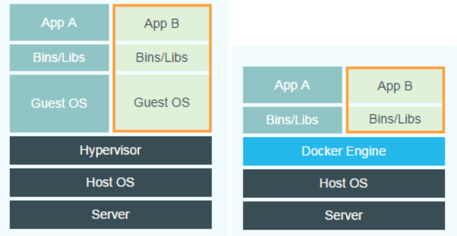

每个环境在anaconda3下都有一个同名目录，里面存放在这个环境中安装的东西

可以使用 `conda info --envs`来查看所有环境的具体信息


CUDA：一个并行计算平台和应用程序编程接口，允许软件使用 NVIDIA GPU。CUDA分为运行时API和驱动API，当我们说安装cuda时通常指的是cuda运行时

虚拟机和容器的区别：

**Hypervisor会将宿主机的硬件虚拟化，然后在虚拟出的硬件上运行虚拟机的操作系统**；而容器技术严格来说并不是虚拟化，没有客户机操作系统，是共享内核的。容器可以视为软件供应链的集装箱，能够把应用需要的运行环境、缓存环境、数据库环境等等封装起来。



所以，本质上来说**vm是将硬件层及以上都虚拟化，而容器只虚拟化OS以上的软件层**（不包括OS）。所以vm的隔离性更好，容器的性能更好

## conda命令

进入conda虚拟环境：

```
conda create -n test_env python=3.8 numpy pandas # 指定新创建的环境的python版本和继承的包
conda activate test_env
conda deactivate
```

```
conda create --name my_clone --clone base
conda env list
conda list
conda env remove --name env_name
```

.

由于我们的pytorch安装在conda中，只有在conda中才能写代码和运行代码，退出conda后，之前虚拟环境中安装的包将**不再可被pip、python直接访问**；同样，实际环境中安装的软件包也不会对虚拟环境产生影响。

在vscode中使用ctrl shift + p选择python解释器，只有选择conda才能运行pytorch代码


pip install安装有时会很卡，解决方法是：使用国内的镜像源安装。在原来安装时在命令里加一个参数 -i，然后在i后面加国内镜像地址。

```
选择国内的镜像源列表如下：

清华源： https://pypi.tuna.tsinghua.edu.cn/simple/

阿里云： http://mirrors.aliyun.com/pypi/simple/

中国科技大学： https://pypi.mirrors.ustc.edu.cn/simple/
```

有时候pip装了一个包后依赖依然有问题，就可以使用conda再装一次（通常建议先在虚拟环境中使用conda）

conda安装命令：

```
conda install -c anaconda tqdm
```

有时候在终端安装了一个包后依赖依然有问题，就可以在notebook的代码块中再装一次

```
%pip install -U d2l -i https://pypi.tuna.tsinghua.edu.cn/simple/
```

Ubuntu 22.04安装python3.8

```
ubuntu 22.04默认是python 3.10,由于开发之前的代码代码导入包还是包里之前的版本，所以有import module not exist不匹配的问题，所以需要安装Python 3.8,

sudo apt update && sudo apt upgrade

sudo apt install software-properties-common -y

sudo add-apt-repository ppa:deadsnakes/ppa -y

sudo apt install python3.8 -y

python3.8 --version
```

Ubuntu修改默认Python版本（用户级

```
先查看系统中有那些Python版本：
$ ls /usr/bin/python*
再查看系统默认的Python版本：
$ python --version
为某个特定用户修改Python版本，只需要在其home目录下创建一个alias。
打开该用户的~/.bashrc文件：
vim ~/.bashrc
添加新的别名来修改默认Python版本：
alias python='/usr/bin/python3.5'
重新登录或者重新加载.bashrc文件，使操作生效：
bash
```

ubuntu深度学习环境配置

https://blog.csdn.net/weixin_41973774/article/details/117223425

之前配好的环境后来出问题了，最简单的方法是重新配一遍，不要想着把环境修好，这是非常困难的

## Anaconda安装Pytorch报错：PackagesNotFoundError

有可能不是源的问题，而是命令的问题；如果安装pytorch失败，就用这个版本号去官网上搜官方的下载命令，然后下载即可

## cuda安装

如果有驱动，安装cuda时不需要勾选driver

https://blog.csdn.net/Sihang_Xie/article/details/127347139

## 切换cuda版本

你的CUDA版本不是你装过什么，而是你的路径中包含什么

```bash
echo $PATH
```

这行命令会输出你当前的默认路径，如果你CUDA安装没问题的话，你会看到类似于下面这样的路径：

```text
/usr/local/cuda/bin
/usr/local/cuda-11.5/bin
```

第一行通常是一个软链接，指向你真正的cuda目录


PATH就是我们输入命令后，系统去哪里找到可执行文件

```text
nvcc -V
```

如果你遇到提示没有nvcc或版本明显不对，说明你没有把CUDA的目录放到默认路径中，输入以下命令把cuda添加到path中

- 临时修改：这种修改只在当前终端会话中有效，关闭终端后更改会丢失。

  ```
  export PATH=/usr/local/cuda-xx.x:$PATH
  ```

  export表示将环境变量导出到当前shell和它启动的所有子进程

- 修改系统文件（永久生效）

  通常要像下面这样修改home目录下的.bashrc文件来设置cuda的环境变量

  ```
  export CUDA_HOME=$CUDA_HOME:/usr/local/cuda  
  export PATH=$PATH:/usr/local/cuda/bin
  export LD_LIBRARY_PATH=$LD_LIBRARY_PATH:/usr/local/cuda/lib64
  ```

  再执行 `source ~/.bashrc`使修改立即生效

nvidia-smi 显示的cuda版本不是你实际的cuda版本，是机器支持的最高cuda版本。用nvcc -V命令显示的才是实际使用的cuda版本。

所以要切换cuda的版本，只需要切换/usr/local目录下cuda文件的符号链接的指向即可，比如切换到10.0版本：

```
sudo rm -rf /usr/local/cuda
sudo ln -s /usr/local/cuda-10.0 /usr/local/cuda
stat cuda
nvcc -V
```

## 进入conda环境后python -V的版本和创建conda环境指定的版本不一样

因为在一个conda环境上叠加了另一个conda环境


## 切换gcc和g++版本

安装cuda时有时会出现gcc和g++版本不对的情况，使用sudo apt install安装新的版本后将/usr/bin/gcc和/usr/bin/g++的软链接删除，然后替换成新的gcc和g++版本的软链接即可

```
sudo rm -rf /usr/bin/gcc
sudo ln -s /usr/bin/gcc-9 /usr/bin/gcc
```


## unhandled cuda error, NCCL version 2.10.3

可能就是torch版本与cuda版本不匹配，自然与NCCL也不匹配，于是我删除了torch，使用pytorch官网提供的与本电脑匹配的安装命令行来安装，安装后果然问题解决。

## Could not find a version that satisfies the requirement torch==1.7.0+cu110

可能是python版本太新了，无法下载太老的torch

##  No matching distribution found for torchvision==0.8.0+cu110

使用这个命令即可：

```
pip install torch==1.7.0+cu110 torchvision==0.8.1+cu110 torchaudio===0.7.0 -f https://download.pytorch.org/whl/torch_stable.html
```

## 使用命令行下载google drive

```
pip install gdown
gdown https://drive.google.com/uc?id=1H73TfV5gQ9ot7slSed_l-lim9X7pMRiU
```

链接要以`uc?id=`开头，然后后面接文件的id

id的获取方式


点击获取链接，再点击复制链接，如图上所示，会有如下链接

```
https://drive.google.com/file/d/1ftesnmlh7NU3m5MuXGQ6OCJkylTsBOjU/view?usp=share_link
```

我们取其中的`1ftesnmlh7NU3m5MuXGQ6OCJkylTsBOjU`部分作为我们的FileID即可。

可以通过添加-c指令来继续上次中断下载，可以避免我们再碰上网络连接中断的麻烦，例如我们要（继续）下载FileID为`1ftesnmlh7NU3m5MuXGQ6OCJkylTsBOjU`的文件，只需要下面的命令即可

```
gdown -c https://drive.google.com/uc?id=1ftesnmlh7NU3m5MuXGQ6OCJkylTsBOjU
```


# Stable Diffusion WebUI 部署问题

运行diffedit时，首先报错：要加载stable-diffusion的checkpoint，于是使用wget从huggingface上下载stable-diffusion的checkpoint保存到本地


再次运行，又报错

```
OSError: Can't load tokenizer for 'openai/clip-vit-large-patch14'
```

打开ipynb文件的完整报错，发现

```
---------------------------------------------------------------------------
OSError                                   Traceback (most recent call last)
Cell In[6], line 1
----> 1 model, opt = main()

Cell In[3], line 151
    139 opt = parser.parse_args(args=[
    140     "--ddim_eta", "0.0",
    141     "--n_samples", "1",
   (...)
    147     "--origin_image", "data/fruit.png"
    148 ])
    150 config = OmegaConf.load(f"{opt.config}")
--> 151 model = load_model_from_config(config, f"{opt.ckpt}")
    152 device = torch.device("cuda") if torch.cuda.is_available() else torch.device("cpu")
    153 model = model.to(device)

Cell In[3], line 36
     34     print(f"Global Step: {pl_sd['global_step']}")
     35 sd = pl_sd["state_dict"]
---> 36 model = instantiate_from_config(config.model)
     37 m, u = model.load_state_dict(sd, strict=False)
     38 if len(m) > 0 and verbose:

File ~/DiffEdit-stable-diffusion/ldm/util.py:85, in instantiate_from_config(config)
     83         return None
     84     raise KeyError("Expected key `target` to instantiate.")
---> 85 return get_obj_from_str(config["target"])(**config.get("params", dict()))

File ~/DiffEdit-stable-diffusion/ldm/models/diffusion/ddpm.py:461, in LatentDiffusion.__init__(self, first_stage_config, cond_stage_config, num_timesteps_cond, cond_stage_key, cond_stage_trainable, concat_mode, cond_stage_forward, conditioning_key, scale_factor, scale_by_std, *args, **kwargs)
    459     self.register_buffer('scale_factor', torch.tensor(scale_factor))
    460 self.instantiate_first_stage(first_stage_config)
--> 461 self.instantiate_cond_stage(cond_stage_config)
    462 self.cond_stage_forward = cond_stage_forward
    463 self.clip_denoised = False

File ~/DiffEdit-stable-diffusion/ldm/models/diffusion/ddpm.py:519, in LatentDiffusion.instantiate_cond_stage(self, config)
    516     self.cond_stage_model = None
    517     # self.be_unconditional = True
    518 else:
--> 519     model = instantiate_from_config(config)
    520     self.cond_stage_model = model.eval()
    521     self.cond_stage_model.train = disabled_train

File ~/DiffEdit-stable-diffusion/ldm/util.py:85, in instantiate_from_config(config)
     83         return None
     84     raise KeyError("Expected key `target` to instantiate.")
---> 85 return get_obj_from_str(config["target"])(**config.get("params", dict()))

File ~/DiffEdit-stable-diffusion/ldm/modules/encoders/modules.py:141, in FrozenCLIPEmbedder.__init__(self, version, device, max_length)
    139 def __init__(self, version="openai/clip-vit-large-patch14", device="cuda", max_length=77):
    140     super().__init__()
--> 141     self.tokenizer = CLIPTokenizer.from_pretrained(version)
    142     self.transformer = CLIPTextModel.from_pretrained(version)
    143     self.device = device

File ~/anaconda3/envs/ldm/lib/python3.8/site-packages/transformers/tokenization_utils_base.py:1768, in PreTrainedTokenizerBase.from_pretrained(cls, pretrained_model_name_or_path, *init_inputs, **kwargs)
   1762     logger.info(
   1763         f"Can't load following files from cache: {unresolved_files} and cannot check if these "
   1764         "files are necessary for the tokenizer to operate."
   1765     )
   1767 if all(full_file_name is None for full_file_name in resolved_vocab_files.values()):
-> 1768     raise EnvironmentError(
   1769         f"Can't load tokenizer for '{pretrained_model_name_or_path}'. If you were trying to load it from "
   1770         "'https://huggingface.co/models', make sure you don't have a local directory with the same name. "
   1771         f"Otherwise, make sure '{pretrained_model_name_or_path}' is the correct path to a directory "
   1772         f"containing all relevant files for a {cls.__name__} tokenizer."
   1773     )
   1775 for file_id, file_path in vocab_files.items():
   1776     if file_id not in resolved_vocab_files:

OSError: Can't load tokenizer for 'openai/clip-vit-large-patch14'. If you were trying to load it from 'https://huggingface.co/models', make sure you don't have a local directory with the same name. Otherwise, make sure 'openai/clip-vit-large-patch14' is the correct path to a directory containing all relevant files for a CLIPTokenizer tokenizer.
```

发现问题在：代码试图从huggingface上获取CLIP的预训练模型，当然获取失败。


解决办法是找到from_pretrained所在，把version改成本地的文件夹，然后从huggingface上手动将文件下载到这个文件夹中（用wget一个一个地下）


修改后的代码：


### 不同的项目的环境不要混在一起，即使环境非常类似。因为你无法准确地控制，不如允许一些冗余