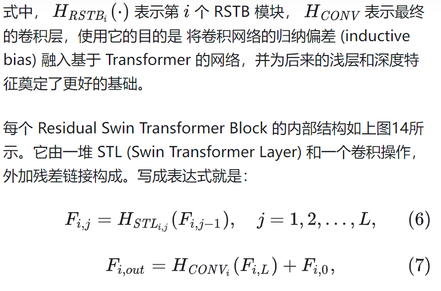
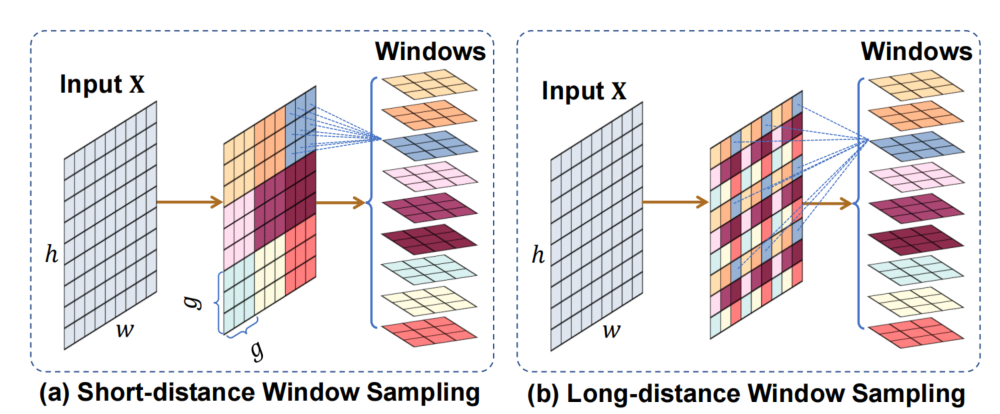
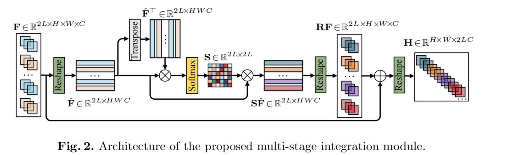
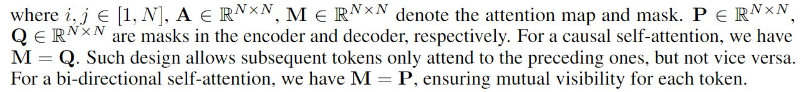
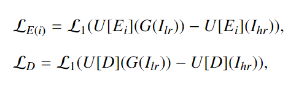

# AlexNet

是一个端到端的网络，指不对输入进行预处理（比如特征提取等），直接输入到网络中，得到输出结果。

将输入的一个很瘪很宽的图片，把高宽慢慢变少，但是深度增加。就是一个慢慢压缩空间信息的过程，到后面的结果中相当于一个像素代表了前面的一大块区域的内容。每个通道就是去识别一种特定的模式，对应一个卷积核的输出。192个卷积核就输出192个通道，识别原图中的192种模式。

是一个空间信息压缩，但是语义信息增加的过程。从一个人能看懂的图片，通过特征提取压缩成一个4096的向量，变成机器能看懂的东西

它在实际实现中使用了模型并行，alexnet的完整架构是下图这样的，但是在上图的实现中，他将模型切成了两半，分别在两块GPU上训练。

- 所以模型并行是在每个GPU上使用一样的数据；而数据并行是将数据平均切分到不同的GPU上

  

比如说第一层的完整架构是有96个卷积核对输入图片进行卷积，得到的结果应该是一张有96个通道的feature map；实际上，他将96个卷积核分在两块GPU上，两块GPU对输入图片并行卷积，各得到一张有48个通道的feature map。在第三层的时候两块GPU之间进行了通信，将二者卷积的结果在通道维度上进行了求和，但是两块GPU还是各自维护一张192个通道的feature map。最后一层将二者的向量进行拼接，得到4096的向量。

alexnet使用了两个很大的全连接层，导致整个模型非常大，放不进GPU中，还需要使用droupout来避免过拟合，这是这个模型的瓶颈。现在的CNN通常不会使用这么大的全连接层，所以droupout也不那么重要了。（但是droupout在全连接层中还是非常重要的，在RNN和attention中用的很多）

# Transformer

之前的seq2seq通常是使用rnn的，前一个时刻的隐藏状态和当前时刻的输入共同决定了当前时刻的输出和隐藏状态。但是问题是并行度很低，只能一个时刻一个时刻地计算。并且比较久远的时刻的状态容易被遗忘。

然后有人使用CNN来替换掉RNN从而减少时序的计算，但是问题是CNN的视野比较窄，对于比较长的序列难以建模，因为一张图中的两个角落的像素点要经过很多层卷积之后，信息才能融合起来。如果使用注意力机制的话，一层就能看到所有的信息。

但是**卷积比较好的一点是可以有多个输出通道，每个通道针对不同的模式，为了达到这个效果，于是transformer也是用了多头注意力机制**。

输入先经过嵌入层将单词变成向量（embedding）：

- 嵌入层就是给定任何一个词（token），学习一个向量来表示它（在transformer中维度是 512）

encoder由6个一样的层组成，每层中有两个sublayer，这个sublayer可以是多头注意力，也可以是前馈网络。**将输入和sublayer的输出做一个残差连接之后再做一个layerNorm即可**。

由于残差要求sublayer的输入和输出的形状一样，所以transformer每一层的输入输出的形状都是相同的，包括embedding层，输出的向量维度都是512. 所以调参只需要调hidden_nums和网络的层数即可

**layerNorm和batchNorm的区别是：LN是对一个样本内部求均值和方差然后做归一化，BN是对一个batch中的不同样本的同一个维度的feature之间做归一化**。由于在seq2seq中，序列的长度是不固定的，也就是样本的长度是不固定的 ，空出来的地方填0，所以如果做BN会导致均值和方差的抖动比较大（有样本的维度是0），而LN是在样本内部算的，所以不管样本是长还是短，得到的结果比较稳定。

解码器预测时的输入是上一个时刻的输出，所以解码器不应该看到后面时刻的输入，因此使用的是masked多头注意力，也就是每个query只看当前时刻之前的kv，不看之后的kv（因为**每次输入是一个序列，序列中会有多个时间步的token**，每个token同时作为qkv，每个token在做attention的时候只看该序列前面的token的kv，不考虑后面的kv）。**在实际实现中，query依然是与所有的kv计算，但是会有一个下三角矩阵mask，它将当前时刻之后计算的值换成一个非常大的负数，然后这些时刻的值经过softmax层之后就会变成0，所以结果计算value权重时就不会考虑后面的数了**。

attention就是将一个query和一系列的kv对映射到一个输出，query、key、value和输出都是向量，输出是value的加权和，所以**输出的维度和value的维度是一样的，输出的个数和query的个数是一样的**。每个value的权重是由value对应的key和query计算相似度得到的。本文使用的相似度计算方式是点乘，query和kv等长

实际计算中会有多个query，使用矩阵乘法来加速计算：输入是n个query，m个kv，qkv的向量长度都是一样的。每个query和key做内积后得到n * m的矩阵，对该矩阵做softmax（每一行内部做softmax)，然后再与value矩阵相乘就得到结果

然后解码器的masked多头注意力输出m个长为d的向量，编码器的输出是n个长为d的向量，前者作为query，后者作为kv，做一个attention，最后得到m个长为d的向量。结果中的每个向量相当于是解码器中的每个向量在编码器输出的所有向量之中选择了自己感兴趣的信息的结合。

编码器和解码器的网络的层数相同，每一层之间都要做上面的attention。

前向反馈层：**对attention输出的每个向量（也就是样本中的每个点）单独做全连接层，每个点的全连接层之间共享参数（在pytorch中实现直接输入到全连接层即可，因为当输入是3D时，pytorch的全连接层默认对最后一个维度（也就是dimension）进行计算）**。先做一次全连接，再做一次relu，再做一次全连接。attention输出的向量长度为512，第一个全连接层将其投影为2048，第二个全连接层再将其投影回512。

下面是transformer是如何抽取序列的语义信息，然后将这些信息加工成最后期望的语义空间的向量的过程。

由于attention先对所有向量的信息做了汇聚，所以后面的前向反馈层只需要对单个的向量做全连接即可。

RNN：在所有的序列点中的MLP使用相同的参数（其实就是只有一个网络），然后对序列中的每个点依次处理。

所以RNN和transformer都是使用线性层或者说MLP对语义空间进行转换，但是**不一样的是，如何传递序列的信息**：

- rnn是把上一个时刻的输出传入到下一个时刻作为输入
- transformer是通过一个attention层，在全局聚集了整个序列中的所有信息，然后再用MLP做语义的转换

transformer的贡献：人对世界的感知是多模态的，可以感知到图片文字和声音，引入了transformer后，cv、nlp、media各个领域都可以使用同样的架构来抽取特征，也可以将不同类型的输入融合起来，可以抽取到一个同样的语义空间，使得我们可以用文本图像语音来训练更大的模型

# GAN

之前的模型都是分类模型（即辨别模型），GAN是生成模型，即用来生成数据

GAN同时训练两个模型：一个生成模型G，用来捕捉数据分布。**生成模型做的事情就是对给定数据的分布进行建模，使得模型能够生成更多的数据**。还有一个辨别模型D，用来分辨一个样本是训练数据还是G生成的。一般的生成模型是尽量让拟合的分布靠近真实的分布，而GAN的生成模型是尽量让D犯错

目前的深度神经网络在辨别模型上做得不错，但是在生成模型上不行，因为我们在最大化似然函数时很困难。GAN就是不要近似似然函数，而是用别的方法来得到一个更好的模型

GAN的生成模型和辨别模型都是MLP，生成模型的输入是一个随机噪音，它负责将这个随机噪音对应的分布（通常是高斯分布）映射到任何一个我们想要拟合的分布。由于两个模型都是基于MLP的，所以训练时可以通过loss的反传计算，而不需要使用马尔科夫链 

# BERT

在CV中，很早就可以在一个比较大的数据集上训练好一个CNN，然后使用这个模型来帮助其他CV的任务。但是NLP在bert之前一直没有这么一个模型，导致不同的NLP的任务需要针对自己的任务构造模型并且训练

BERT是一个无监督的，预训练的，双向的transformer编码器，证明了在大量的无标号的数据上预训练的模型的效果反而比在较小规模的有标号数据上训练的效果好

# VIT

ViT原论文中最核心的结论是，当拥有足够多的数据进行预训练的时候，ViT的表现就会超过CNN，突破transformer缺少归纳偏置的限制，可以在下游任务中获得较好的迁移效果

但是当训练数据集不够大的时候，ViT的表现通常比同等大小的ResNets要差一些，因为Transformer和CNN相比缺少**归纳偏置（inductive bias），即一种先验知识，提前做好的假设**。CNN具有两种归纳偏置，一种是局部性（locality/two-dimensional neighborhood structure），即图片上相邻的区域具有相似的特征；一种是平移不变形（translation equivariance）， 𝑓(𝑔(𝑥))=𝑔(𝑓(𝑥)) ，其中g代表卷积操作，f代表平移操作。当CNN具有以上两种归纳偏置，就有了很多先验信息，需要相对少的数据就可以学习一个比较好的模型	

用transformer的encoder来做图像分类，实际上和bert差不多：将图片分成patch，把patch展平后经过线性层投影得到的向量作为token，输入到transformer encoder中。因为图像的不同patch之间是有顺序关系的，所以还需要对patch加上位置编码。如果要做图像分类，还需要在patch序列的最前面加上一个CLS符号，由于做的是self-attention，所以CLS在encoder中会结合所有其他patch的信息，输出一个向量，作为对图像的整体特征。对该向量做softmax，再接一个MLP，得到预测的类别（其实这里是借鉴了NLP的做法，也可以使用CV的传统做法，对所有patch输出的向量做一个全局平均池化（即平均），得到整个图片的整体特征的向量）

一个ViT block可以分为以下几个步骤

1. patch embedding：例如输入图片大小为224x224，将图片分为固定大小的patch，patch大小为16x16，则每张图像会生成224x224/16x16=196个patch，即输入序列长度为**196**，每个patch维度16x16x3=**768**，线性投射层的维度为768xN (N=768)，因此输入通过线性投射层之后的维度依然为196x768，即一共有196个token，每个token的维度是768。这里还需要加上一个特殊字符cls，因此最终的维度是**197x768**。到目前为止，已经通过patch embedding将一个视觉问题转化为了一个seq2seq问题
2. positional encoding（standard learnable 1D position embeddings）：ViT同样需要加入位置编码，位置编码可以理解为一张表，表一共有N行，N的大小和输入序列长度相同，每一行代表一个向量，向量的维度和输入序列embedding的维度相同（768）。注意位置编码的操作是sum，而不是concat。加入位置编码信息之后，维度依然是**197x768**
3. LN/multi-head attention/LN：LN输出维度依然是197x768。多头自注意力时，先将输入映射到q，k，v，如果只有一个头，qkv的维度都是197x768，如果有12个头（768/12=64），则qkv的维度是197x64，一共有12组qkv，最后再将12组qkv的输出拼接起来，输出维度是197x768，然后在过一层LN，维度依然是**197x768**
4. MLP：将维度放大再缩小回去，197x768放大为197x3072，再缩小变为**197x768**

最后会将特殊字符cls对应的输出作为encoder的最终输出 ，代表最终的image presentation（另一种做法是不加cls字符，对所有的tokens的输出做一个平均）

## Pyramid Vision Transformer

ViT的结构和原版Transformer一样是柱状结构的 。这就意味着，ViT 只适用于简单的分类任务，很难应用到像素级的密集预测任务，因为：(1) ViT 的输出特征图是单一尺度且低分辨率的；(2) 当输入图像分辨率稍稍增加时（例如800 x 800），计算代价会急剧增加

并且不符合计算机视觉中的CNN backbone的金字塔设计模式：

1. feature map的分辨率随着网络加深，逐渐减小；
2. feature map的channel数随着网络加深，逐渐增大。

和VIT相比，PVT使用更小粒度的path作为模型的输入从而得到更高分辨率的特征图；使用 **progressive shrinking pyramid** 结构可以不断减少输入序列长度从而降低计算代价；使用 **spatial-reduction attention (SRA) layer**，在学习更高分辨率特征的同时进一步降低计算代价

对第一个 stage，输入图像大小 𝐻×𝑊×3 ，切分为  个 patches，每个 patch 大小为 4×4×3 ，过一个 linear projection layer 得到大小为 的 embedded patches，然后加上位置编码送入 L1 层 Transformer encoder，输出的patchs还是，将其 reshape 之后得到大小为 𝐻/4×w/4×𝐶1 的特征 𝐹1

## CvT (Convolutional vision Transformer)

尽管ViT已经成功应用在了各个视觉任务，但是和相同尺寸的CNN相比，性能还是要弱一些，尤其是在中小数据集上进行训练时。也就是说ViT相比于CNN过度依赖超大型数据集，其原因是ViT缺少CNN的一些特性

作者就尝试将convolution和ViT进行结合，同时保留两者的优势，让模型既有自注意力操作全局信息的融合能力，又有卷积操作的优良特征（局部感受野，共享卷积权重，空间下采样），最终的效果是CvT相比于ResNet以及ViT,DeiT，有更少的参数量，需要更少训练资源，同时还有更好的性能

并且CvT去掉 Transformer 的位置编码。因为引入了 Convolutional Projection 和 Convolutional Token Embedding，让模型具备了和 CNN 相同的局部空间关系的表示能力（the ability to model local spatial relationships），换句话说就是，**卷积的zero-padding操作可以暗含位置信息**

参考CNN的层级结构，模型一共设计了三个stage，每个stage有两个部分:

1. **Convolutional Token Embedding**层,其设计目标是为了可以在每个阶段都减小 token 的数量，也就是减小 feature resolution；也可以在每个阶段都扩大 token width，也就是扩大 feature dimension。

   假设前一层的输出维度是 ，先通过 Convolutional Token Embedding 的卷积操作得到，再把它 flatten 成一个 的张量并执行 Layer Normalization 操作，得到的结果进入下面的第 𝑖 个 stage 的 Transformer Block 的操作

2. **Convolutional Transformer Blocks**：

   

   其中Convolutional Projection 是对 Transformer Block 中第一步如何计算得到 Q,K,V 进行修改，**用卷积取代了linear projection**：token 首先 reshape 成 2D 的 token map，再分别通过3个 **Depthwise-separable Convolution** (kernel =𝑠×𝑠) 变成 query，key 和 value 值。最后再把这些 query，key 和 value 值通过 flatten 操作得到真正的1-D query，key 和 value 值

   - 所谓Depthwise-separable Convolution指的是：比如一个张量有c个通道，那么就用c个形状为s * s * 1的卷积核，每个核负责对一个通道进行卷积。而正常的卷积是：用c个形状为s * s * c的卷积核，每个卷积核对所有通道一起卷积，得到一个通道中的一个像素。

   

## CPVT

**位置编码可以设置为可学习的，也可以设置为不可学习的正弦函数。**

结果发现：在使用位置编码的情况下，无论是使用可学习的位置编码 (learnable)，还是固定的位置编码 (sin-cos)，其训练的模型性能是差不多的。但是使用相对位置编码后性能会有下降，不使用位置编码性能会大幅下降。证明位置编码对于Vision Transformer的重要性。

**所以我们需要一种新的位置编码策略，既能解决传统位置编码不可变长度的局限性，又能起到位置编码的作用。**

CVPT就是为了解决这个问题，即：**灵活地把位置信息引入Transformer中**。之前工作的位置编码一般是预定义好并与输入无关 (predefined and inputagnostic)，CVPT位置编码是即时的 (on-the-fly)，就是需要多长的编码就立刻有多长的编码。

CVPT能自动生成一种包含位置信息的编码PEG，提升Transformer模型的性能。通过这样做，Transformer可以处理任意大小的输入图像，而无需双三次插值。

## swin transformer

之前的vit只能用在图片分类上，而swin transformer希望能够成为cv的通用的骨干网络，也就是在各种任务上都能取得比较好的效果

并且之前的 VIT是将输入的图片切割成统一大小的patch，然后在整个过程中patch的大小是不变的，难以处理多尺寸的特征。但是对于cv中的很多任务，比如检测和分割，多尺寸的特征是很重要的。

同时，在VIT中，它的自注意力始终都是对整张图片进行的，所以它的计算复杂度是与图像的尺寸**平方倍**的增长，对于清晰度较高的图片，计算复杂度难以承受。

所以为了降低计算复杂度，swin transformer选择在小窗口内计算自注意力，那么整张图的计算复杂度就会与图片的大小是**线性**的关系。 

**还需要做一步叫做Linear Embedding的步骤，**对每个向量都做**一个线性变换（即全连接层）**，变换后的维度为 𝐶 ，这里我们称其为 Linear Embedding。这一步之后得到的张量维度是： 𝐻/4×𝑊/4×𝐶 。

在下图中经过patch partition和linear embedding之后，输入从224 * 224 * 3变成了56 * 56 * 96，**swin Transformer块与之前的Transformer块一样，输入和输出张量的形状不变**，输出的张量也是56 * 56	 * 96

在后面几个stage中，swin transformer使用了一个patch merging的操作来对标卷积网络中的池化操作：假设patch merging的步长为1，那么就是每隔一个元素选取一个点，一次选取出来的点合在一起作为一个patch；将整张图按照这个方式选取出来的所有patch在通道维度上合并，那么得到的新的图就是长宽减半，通道数翻四倍；卷积网络的传统是，经过一个block后长宽减半，通道数翻倍，所以这里还要使用一个1 * 1的卷积，把通道数降为2倍。

所以**整个swin Transformer的网络与传统的卷积网络一样，每经过一个stage，张量的长宽减半，通道数翻倍**。

**每个 Stage 都会改变张量的维度，形成一种层次化的表征。**因此，这种层次化的表征可以方便地替换为各种视觉任务的骨干网络。

swin transformer最后的输出没有像VIT一样使用CLS，而是直接将最终的feature map做全局平均池化，将7 * 7大小的张量取平均拉直成1了。然后再经过一个线性层（分类器）变成1 * 1000，做完softmax之后就得到图片分类的结果

### swin Transformer块

一个swin Transformer块由两个Transformer组成，其中一个 Swin Transformer Block 由一个带两层 MLP 的 **Shifted Window-based MSA** 组成，另一个 Swin Transformer Block 由一个带两层 MLP 的 **Window-based MSA** 组成。在每个 MSA 模块和每个 MLP 之前使用 LayerNorm(LN) 层，并在每个 MSA 和 MLP之后使用残差连接。

可以看到 **Swin Transformer Block 和 ViT Block 的区别就在于将 ViT 的多头注意力机制 MSA 替换为了 Shifted Window-based MSA 和 Window-based MSA**。

### **Window-based MSA**：

基于滑动窗口的自注意力：为了减少计算量，将整个图片分成很多个窗口，具体的，对于最开始的56 * 56的feature map，将其切割成7 *7 的窗口，窗口中的每个元素作为一个patch（也就是最小的计算单元token）。所有的自注意力的计算都是在这个7 * 7 的小窗口中进行的，序列长度永远是49，在这64个窗口中分别计算自注意力

**self-attention的计算复杂度**：

基于滑动窗口的self-attention的计算复杂度：先计算每个窗口中的复杂度，将上面的h和w替换成m即可，然后再计算整张图的计算复杂度，一张图中有h / m * w / m个窗口，所以得到结果为：

而M的大小是7，h*w的大小是56 * 56，所以结果差了上千倍

当一张图片比较大时，hw会非常大，所以普通的MSA的计算复杂度主要与hw成平方的关系，而W-MSA中的M^2远远小于h * w，所以W-MSA与hw成线性的关系

### 移动窗口

为了让不同窗口之间的信息能够交互，还使用了移动窗口。先在图中划分窗口计算一次attention，然后将窗口分区向右下角移动几格，将图片划分成新的窗口们，再计算一次attention。

如下图，假如窗口大小是4，将窗口分区向右下角移动两格之后得到新的划分方式，这样在新的窗口中计算的attention就跨越了上一层的窗口间的boundary

在swin transformer中，先用一个block使用窗口SA，再用一个block使用移动窗口SA，所以swin transformer中都是两个block一起使用

但是这样会导致出现九个窗口，并且九个窗口中的序列长度还都不一样，难以计算。所以解决方法是循环位移，将左上角的碎片移到右下角，凑成完整的窗口，就得到4个大小一样的窗口，然后对每个窗口计算masked self-attention，计算完毕后再将图片恢复成原来的形状

具体的masked self-attention：由于拼接起来的块的信息来自于不同的区域，不能将他们合在一起做self-attention，所以本文采用的方式是对每个区域构造一个掩码，每个窗口中还是照常做self-attention，掩码将窗口中不同区域之间的attention结果变成一个非常大的数值，经过softmax层后就变成了0.

# MAE（masked autoencoder）

masked来自于bert中的masked，也就是将输入序列中的一部分token mask掉，做完形填空（由于相比于文字，图片的信息比较冗余，所以MAE是随机遮住**大量**的patch）

具体来说，将输入没有被盖住的patch输入到encoder（即VIT）中，得到每一个patch对应的特征，再将被盖住的patch重新放回原来的位置（其实就是位置信息），没有被盖住的patch就替换为VIT提取的特征，输入到decoder中。decoder负责把里面的像素信息重构出来，最后得到原始的图片。

这是预训练的过程，如果将它拿来做下游任务的话，只需要encoder就行了，不需要decoder，并且不需要把输入的图片切成patch和做掩码，直接输入到encoder中，对特征做提取，然后用来做自己的任务

MAE和所有的autoencoder一样，encoder将输入的信号映射成一个latent 表示，decoder从这个latent表示重建出输入的信号。和经典的autoencoder不同，MAE采用了非对称的设计，encoder和decoder的输入是不一样的，encoder输入的是无掩码的patch，decoder输入的是有掩码的patch。

具体的，encoder和VIT一模一样

# 基于Transformer的SR

## **SwinIR** 

SwinIR 由三部分组成：浅层特征提取 (shallow feature extraction)、深层特征提取 (deep feature extraction) 和高质量图像重建 (high-quality image reconstruction)。

**2 深层特征提取模块 (deep feature extraction)**

**高质量图像重建模块 (high-quality image reconstruction)**

浅层特征 𝐹0 主要含有低频信息，而深层特征 𝐹DF 专注于恢复丢失的高频信息。通过长距离的跳变连接，SwinIR 可以直接将低频道信息直接传输到重建模块，这可以帮助深层特征 𝐹DF 专注于提取高频信息并稳定训练。作者使用 sub-pixel 的卷积层实现高质量图像重建模块。

## Activating More Pixels in Image Super-Resolution Transformer

提出了一种混合注意力Transformer，命名为 HAT(Hybrid Attention Transformer)。

本文发现虽然swinIR的平均指标更高，但基于transformer的swinIR的信息利用范围并不比基于CNN的RCAN方法要大，说明**shifted window机制对于建立cross-window connection并不是很有效的**。所以本文加强了滑动窗口之间的连接，这样可以改善基于窗口的self-attention方法。

HAT结合了channel attention和self-attention，意图使用前者的全局信息能力和后者强大的表达能力。此外还引入了重叠交叉注意模块（OCAB）来实现相邻窗口特征更直接的交互。

整体的网络结构与swinIR基本相同，包含3部分。**1）shallow feature extraction；2）deep feature extraction；3）image reconstruction**。对于一个给定的LR图，先经过一个convolutional layer去提取浅层特征。

early convolutional layer可以更好的学到视觉表征信息，使网络有更稳定的优化。然后经过了deep feature extraction，包括了N个residual hybrid attention groups（RHAG），和一个 3×3 的卷积层

最后重建模块利用pixel-shuffle method去进行上采样

与swinIR不同的是中间的attention block：

**Residual Hybrid Attention Group (RHAG)**。每一个RHAG包含了M个hybrid attention blocks (HAB)和一个overlapping cross-attention block（OCAB）还有一个 3×3 的卷积层。

HAB的结构：一个**channel attention block（CAB）被塞到了标准的Swin Transformer block下**的第一个LayerNorm（LN）层后面，与window-base multi-head self-attention（W-MSA）模块平行。

**CAB**是由两个标准的卷积层和一个GELU激活函数还有一个**channel attention（CA）**构成

**Overlapping Cross-Attention Block (OCAB)**：

作者引入OCAB是为了更直接地建立cross-window connections并增强window self-attention的表征能力。本文的OCAB由重叠的交叉注意（OCA）和MLP层组成，类似于标准的Swin Transformer block。

其中，γ是控制重叠大小的常数。直观上来说，标准的窗口分区，可以认为是kernel size和stride都等于窗口大小M的滑动窗口。重叠窗口分区，可以认为是kernel size为M_o，stride为M的滑动窗口。使用大小为的zero-padding用以保证重叠窗口的大小一致性。

**不像WSA一样，query/key/value都从同一个窗口特征计算，OCA从更大的感受野上计算key/value**，在该字段中可以利用更多的信息进行查询（query）。

IPT使用各种低级任务（去噪、去雨、超分等）进行预训练；EDT使用同个数据集的不同退化等级进行预训练；这些研究的重点是研究多任务预训练对目标任务的影响。相比之下，我们直接在基于同一任务的更大规模数据集（即 ImageNet ）上进行预训练。比如要训练× 4 的超分任务，就在ImageNet数据集上进行分× 4 的超分预训练，然后再在特定数据集（比如DF2K）上进行微调。所提出的策略，即相同任务预训练。作者认为这样的预训练会让训练更简单，同时带来更多的性能改进。

## Restormer:Efficient Transformer for High-Resolution Image Restoration

Contributions

- 提出了Restormer，一种编码-解码结构的Transformer，用于在高分辨率图像上进行多尺度局部/全局表示学习，而不将它们分解成局部窗口，从而利用遥远的图像上下文。
- 提出了一种使用深度卷积的多头转置注意模块(multi-Dconv head transposed attention, MDTA)，它能够聚合局部和非局部像素交互，并且足够有效地处理高分辨率图像。
- 一种新的使用深度卷积的门控前馈网络(Gated-Dconv feed-forward network, GDFN)，它执行受控的特征转换，即抑制信息量较少的特征，只允许有用的信息进一步通过网络层次结构

在Transformer块中引入了一个 multi-Dconv head ‘transposed’ attention (MDTA) block 来代替普通多头SA

- **将SA应用于通道维度而不是空间维度**
- 在计算SA之前先应用1×1 point-wise 卷积来聚合像素级跨通道上下文，然后应用 3×3 depth-wise 卷积来编码通道级空间上下文

使用Gated-Dconv Feed-Forward Network(GDFN)来代替FFN

**Progressive Learning**

- 基于CNN的恢复模型通常在固定大小的图像 patch 上进行训练

- - 然而，在裁剪的小 patch 上训练 transformer 可能不会对全局图像统计进行编码，从而在测试时在全分辨率图像上得到次优性能

- 为此，作者执行渐进式学习，其中网络在早期阶段在较小的图像 patch 上进行训练，在后期训练阶段在逐渐增大的图像 patch 上进行训练

- 通过渐进学习在混合大小的 patch 上训练的模型在测试时显示出更好的性能，其中图像可以具有不同的分辨率，这也是图像恢复中的常见情况

- 随着 patch 大小的增加，也随之减少了 batch 大小，以保持与固定 patch 训练相同的每个优化步骤的时间

## Efficient Long-Range Attention Network for Image Super-resolution

swinIR用小窗口尺寸计算 SA 限制了对图像像素间远距离依赖关系的建模能力。Restormer利用对信道空间的依赖性来计算 SA，这仍然适用于大型图像。然而，依赖通道空间建模可能会牺牲一些有用的纹理和结构空间信息，而这些信息对于再现高质量的 HR 图像非常重要

开发一种有效且高效的方法，利用简单的网络架构，利用图像的长程注意力来实现图像 SR

虽然 SwinIR 在图像 SR 方面取得了令人瞩目的成果，但其网络结构主要借鉴了 Swin 变换器，而后者是为高级视觉任务而设计的。特别是，SwinIR 的网络设计对于 SR 问题来说是多余的，而且它是在固定大小的小窗口上计算 SA，因此无法利用长距离特征依赖性。我们提出的 ELAN 不仅比 SwinIR 更高效，而且能在更大的窗口中计算 SA

# 卷积和Transformer的优劣

CNN：

- 局限性：随着卷积层的增加，feature maps上的一个像素点就包含更多的信息。这种感受野的增长依靠于卷积核大小和层数，因此，如果卷积核不算很大，层级不够多，那么其在处理有长距离依赖上的图像效果可能并不好。同样，如果最后不处理到只剩一个像素，那么feature maps上的任何一个像素点都不能处理全局信息
- 优势：局限性同时也是优势，CNN的全局信息处理能力不足，但其局部特征提取能力非常强大，这种局部特征提取的能力在处理图像中的细节和纹理等局部特征上更为有效。同时，卷积操作有助于减小参数量，因为卷积核的参数被共享，意味着同一个卷积核可以在整个输入图像的不同位置上进行特征提取。这种参数共享减少了网络的参数量，降低了过拟合的风险，并且使得模型更具有泛化能力。相比于全连接和transformer，参数量是明显减小的。

Transformer：

- Transformer在参数量和计算量上存在局限性，需要比较多的计算资源。如果图片比较大，CNN也许能轻松处理，但是Transformer就不一定了，所以才引出了后面的Swin Transformer，但是始终还会有高于CNN的计算量。因此，Transformer想要处理高分辨率的图像也还是比较有难度的。由于参数量的增多，这对数据量提出了比较高的要求，在数据较少的情况下可能并不奏效。
- 优势：和CNN一样，Transformer的局限性也可以转换成其优势，就是能够有全局信息和处理长距离依赖的能力

先用CNN提取特征，再用Transformer做后处理是比较合理的做法。先利用CNN的局部特征提取能力和参数共享特性，将一些图像先进行一个提取，降低像素量，**再用Transformer的高级抽象特征处理能力，计算全局信息，再利用全局信息去做特定的任务**（超分需要用到全局信息吗？用Transformer做超分是否意义不大？），这是一个较为可行的方案。

除了这个架构本身，Transformer还带来了预训练模型+微调的概念，还有提示学习的这个范式。而在CV界将上述机制活学活用的当属SAM(Segment Anything Model)

其中image encoder是预训练好的MAE，prompt encoder用的是CLIP，mask decoder用的是Transformer结构，可以看到SAM用了大量的Transformer架构的模型，但是对于mask的处理上，用的还是conv，也就是卷积神经网络。这又再次重复了我们上面所说的结论，就是CNN和Transformer联合起来用才是一个较好的出路。

# ViTPose++: Vision Transformer for Generic Body Pose Estimation

很多VIT都是在有监督的场景下在Imagenet上进行的预训练，但是有监督的学习过程需要大量的label，很昂贵。此外，这种预训练模型可能无法很好地泛化像 ImageNet 这样数据分布差异很大的任务。

为了给VIT提供更好的初始化，人们提出了自监督预训练方法，一个典型的例子是 MAE ，它采用了掩蔽图像建模（MIM）前置任务，灵感来自自然语言处理中成功的掩蔽语言建模前置任务（即Bert）。并且在 ImageNet 上不使用标签的 MIM 预训练模型在图像分类和下游任务中表现出更好的生成性能。在本文中，我们将重点放在姿势估计任务上，并采用带有 MIM 预训练的普通视觉变换器作为骨干。此外，我们还探讨了使用 ImageNet 进行预训练对于姿势估计任务是否必要。令人惊讶的是，使用较小的无标签姿态数据集进行预训练也能提供良好的初始化效果

我们提出了 ViTPose++，它将 FFN 层分解为任务无关专家和任务特定专家，以同时处理不同类型的人体姿态估计任务。在没有额外参数和计算的情况下，ViTPose++优于以单任务或多任务方式训练的ViTPose，并在具有挑战性的公共基准上创造了新的SOTA。

本文的基础版本是ViTPose。本文扩展了之前的研究，并做了三大改进。

1. 我们探索了 ViTPose 的更多模型大小，从参数数量、推理速度、输入分辨率和性能等多方面与代表性模型进行了全面比较。
2. 通过直接预测关键点位置及其关联，我们将 ViTPose 从自上而下范式扩展到自下而上范式。
3. ViTPose++ 是一种新型模型，可通过知识因数化处理多种类型的人体姿态估计任务。

我们采用不同的解码器设计来处理从主干网络提取的特征并回归热图，即经典解码器、简单解码器和最小解码器

经典：由两个反卷积块（deconv）组成，每个块包含一个去卷积层，然后是批量归一化和 ReLU。按照以往方法、的常见设置，每个反卷积块（deconv）首先对特征图进行 2 倍的上采样。 然后，使用 1 × 1 卷积预测层对热图进行回归

除了经典解码器之外，我们还提出了三种简化设计：经典-FP、简单解码器和最小解码器，以充分利用视觉变换器骨干网的强大表示能力。

1. 经典-FP 保留了与经典解码器相同的结构，但增加了一个随机初始化和冻结的预测层。
2. 对于简单解码器，主干网提取的特征图使用双线性插值法进行 4 倍上采样，然后输入 ReLU 激活函数和 3 × 3 卷积层来预测热图，
3. 最小解码器是最简单的设计，它只利用一个线性投影层进行热图预测

视觉变换器的一个引人入胜的特点是，随着模型大小的增加，其性能也会提高。然而，这种可扩展性是否适用于特定的下游任务，如姿势估计，仍有待进一步探索。在 ViTPose 的基础上，我们可以通过调整叠加变换器层数和特征尺寸来轻松控制其模型大小。

通用人体关键点检测的一个基本要求是，在具有不同类别人体关键点注释的多个数据集上进行训练后，能够处理不同的人体姿态估计任务。一个关键的挑战是如何处理不同姿势估计任务中身体关键点的差异

一种简单的解决方案是通过多任务学习来训练 ViTPose 模型，即使用共享主干和不同的解码器，每个解码器负责特定类型的姿态估计任务。

- 具体的，我们采用了 MoE [52] 的理念，即把 FFN 层分成一个任务无关专家和多个任务特定专家，以编码通用知识和任务特定知识。然后我们针对每种类型的身体姿态估计任务使用特定任务解码器。

- FFN的第一个线性层是共享的，输出是，N是token的个数，γ是第一个线性层上采样的倍数，C是输入FFN的通道数；

- FFN的第二个线性层被分成两部分，分成共享部分和独立部分，为所有任务复制独立部分，但在训练过程中不共享它们的权重，比如有T个不同的任务，那么独立部分就有T个线性投影层，每个投影层的权重都是单独训练的，全连接层的个数都是N；共享部分有一个线性投影层；图像**同时输入到共享部分和独立部分**，在独立部分根据图像的任务类别选择T个中的对应的线性投影层，将输入的token维度从γC映射成(1 - α)C，共享部分的线性投影层将输入的token维度从γC映射成αC，然后二者在通道维度上concat起来，就恢复到FFN输入token的通道数C

  

- α 是用于平衡共享专家和任务特定专家的分区比率，默认设置为 0.25。请注意，**共享专家的参数是使用所有数据训练的，而任务特定专家的参数仅使用相应任务的数据训练**。然后，沿通道维度将 F shared 和 F specif ic 连接起来，形成转换器模块的输出。从特定姿势估算任务的训练集中得到输入图像后，从上述变换器主干获得编码特征，然后将其输入相应的解码器以回归热图

数据集和评价指标：

- 我们采用 MS COCO 数据集来评估 ViTPose 的性能，并使用几个不同的姿势估计数据集来评估提出的 ViTPose++，例如 MS COCO [18]、AIC [56] 和 MPII，COCO-W [57] 用于包括脸部、手部和脚部在内的所有身体关键点检测，AP-10K [20] 和 APT-36K [58] 用于动物姿态估计

- 衡量标准： 我们采用平均精度（AP）作为大多数数据集的主要评估指标。计算方法是使用 0.5 到 0.95 之间的不同阈值评估对象关键点相似度（OKS）

实现细节：

- ViTPose：我们使用 ViT-S、ViT-B、ViT-L、ViT-H [8] 和 ViTAE-G [22] 作为骨干网络，并将相应的模型分别记为 ViTPose-S、ViTPose-B、ViTPose-L、ViTPose-H 和 ViTPose-G。骨干网用 MAE [17] 预先训练的权重初始化，模型在 8 个 A100 GPU 上基于 MMPose 代码库 [72] 进行训练

- ViTPose++： 我们也使用 ViT-S、ViT-B、ViT-L 和 ViT-H [8] 作为骨干网络，并将相应的模型分别表示为 ViTPose++-S、ViTPose++-B、ViTPose++-L 和 ViTPose++- H。骨干网用 MAE [17] 预先训练的权重初始化，模型在 8 个基于 MMPose 代码库 [72] 的 A100 GPU 上训练。

ViTPose的消融实验与分析：

- 结构简单性和可扩展性： 我们分别使用经典解码器和简单解码器训练 ViTPose，还使用 ResNet作为主干网和这两种解码器训练SimpleBaseline。在 SimpleBaseline 中使用简单解码器会导致 ResNet-50 和 ResNet-152 出现约 18 个 AP 的下降。然而，使用vision Transformer作为骨干和简单解码器的 ViTPose 表现良好，这说明vision Transformer有很强的解码能力，可以对线性可分离的特征进行编码，从而减轻了复杂解码器的必要性

  从表中还可以得出结论，随着模型大小的增加，ViTPose 的性能也在不断提高，这表明 ViTPose 具有出色的可扩展性

  

- 预训练方法的影响： 我们还全面考察了各种预训练方法，研究它们对姿态估计的影响，包括随机初始化、监督预训练、对比自监督预训练和遮蔽图像预训练。结果表明使用监督式或对比式自我监督方法进行预训练的ViT可能会学习到与分类相关的特征，而这些特征在姿势估计任务中的泛化能力较差。与此相反，使用遮蔽图像预训练（如 MAE [17]）可显著提高性能

  

- 输入分辨率的影响： 为了评估 ViTPose 是否能够很好地适应不同的输入分辨率，我们使用不同的输入尺寸对 ViTPose 进行了训练。结果表明ViTPose-B 的性能随着输入大小的增加而提高

  

- 注意类型的影响：为了缓解自注意力的二次计算复杂度所导致的内存不足问题，我们采用了基于窗口的注意力。结果表明：基于窗口的注意力可以缓解内存问题，但代价是由于缺乏全局上下文建模而导致性能相较于完全自注意力下降；移位窗口和池化窗口策略都能促进跨窗口信息交换以建立全局上下文模型，因此在内存增加不到 10% 的情况下，性能显著提高了 10 个 AP。当同时应用这两种机制时，性能进一步提高。并且当将窗口大小扩大时，性能也能获得提升

  

- 部分微调的影响： 为了评估视觉变换器在部分微调后是否仍能很好地进行姿态估计，我们在三种设置下对 ViTPose-B 模型进行了微调，即完全微调、冻结 MHSA 和冻结 FFN。结果表明：冻结多头自注意力微调与完全微调相比性能略有下降，而冻结FFN微调则性能大幅下降。这说明Transformer的FFN更适合任务特定建模。相比之下，多头自注意力对不同的任务并不敏感

  

ViTPose++的消融实验与分析：

- 我们可以通过为每个任务使用共享主干和单独的解码器，轻松扩展 ViTPose 以处理多种类型的人体姿态估计任务。将图像送入共享编码器网络进行特征提取，提取的特征随后被传递给相应任务的解码器，解码器负责预测特定任务的关键点。

  

-  通过改变 FFN 中专家的配置，我们考虑了 ViTPose++ 的三种变体。

  1. 独立 FFN（I-FFN）： 我们在每个转换器模块中为每个任务使用一个独立的 FFN。这样，每个 FFN 只能处理与特定姿势估计任务相对应的数据集图像。所有这些独立的 FFN 都使用 MAE 预训练模型中原始 FFN 的权重进行初始化。

  2. 独立共享 FFN（IS-FFN）： 虽然不同任务之间可能存在冲突，但它们也可能共享一些身体姿势方面的共同知识，为了对这些共同知识进行编码，我们在每个Transformer块中除了独立的 FFN 外，还引入了一个共享的 FFN。这样，每幅图像不仅会由特定任务 FFN 处理，还会由共享 FFN 处理。然后，任务专用 FFN 和共享 FFN 的输出特征相加，作为下一个转换层的输入。我们使用 MAE 预训练模型的权重对共享 FFN 进行初始化，而独立 FFN 的权重为零

  3. 部分共享 FFN（PS-FFN）： 我们还探索了另一种设计方案，即 ViTPose++ 的默认设置，用于联合编码身体姿势的常识和任务特定知识。所有任务共享FFN的第一个线性层，然后将每个 FFN 的最后一个线性层分成共享部分和独立部分，比如有T个不同的任务，那么独立部分就有T个线性层，每个线性层的权重都是单独训练的。第一个线性层的特征分别由第二层的共享部分和相应的独立部分处理。然后，输出特征沿通道维度进行concat，并作为下一个Transformer的输入。

     

实验结果表明：使用I-FFN的ViTPose++的AP最低，和仅仅在MS COCO上训练的结果相当；使用 PS-FFN 时，ViTPose++ 的 AP 值最高。然而，与单任务 ViTPose 和多任务基线相比，由于每个任务都要使用额外的 FFN，因此会带来额外的计算和参数。在 PS-FFN 设置中采用适当的分区比率 α（即 0.25）时，采用 PS-FFN 的 ViTPose++ 在性能和模型复杂度之间实现了更好的权衡

和sota方法的比较：

- 作者在 MS COCO, AIC, OCHuman,MPII, COCO-W,  AP-10 K,  APT-36 K等多个不同任务的数据集上对比了sota方法，结果表明本文的ViTPose++都是最优的

  

# CLIP

clip的迁移学习的能力非常强，预训练好的模型可以在任意一个数据集上取得不错的效果，而且还是zero shot的，也就是完全不需要在这些数据集上做任何微调。比如CLIP在不使用ImageNet数据集训练的情况下，直接zero-shot推理，就能获得和之前有监督训练好的res50取得同样的效果

CLIP的训练方式：输入的是图片和文字对，对图片和文字经过编码器得到特征，然后CLIP就是在这些特征上做对比学习，我们只知道图片和文本的配对信息，这种方式也被认为是无监督的学习

CLIP的推理方式：比如在ImageNet上做推理，先将ImageNet上的所有label扩充成句子（因为CLIP在训练时使用的就是句子，如果使用单词推理会造成性能的下降），然后经过文本编码器；再将要推理的图片经过图片编码器，然后用图片的特征去和所有的文本特征进行相似度的计算（再经过softmax得到一个概率分布），最相似的文本特征就是图像的类别。

- 这种基于prompt的学习方法比较适合研究，因为它主要是在做微调或者推理时使用的方法，对计算资源的需求比较低，但是效果却很好

传统的分类网络，是有一个固定的、提前定义好的一些物体类别的集合，然后模型预测的是这些提前定义好的类别，比如ImageNet就是1000个类，网络的分类头就只能输出这1000个类之一（**分类头：网络最后的结果经过一个全连接层再经过softmax得到一个长为1000的向量，向量元素的和为1，向量中的最大值的下标就是预测的类别**）。由于采用了这种限制性的监督信号，从而也限制了模型本身的泛化性，无法识别新的物体的类别。对于新的物体类别，唯一的方法就是每次收集新的数据，重新训练模型。

所以CLIP选择从自然语言中获取监督信号，任意给它一个照片，我们可以通过给模型喂各种文本句子，从而让CLIP识别图片中有没有我们感兴趣的物体（文本指示的物体）。因此，CLIP摆脱了训练时提供的基础类的限制。

训练的技巧：

- prompt engineering：在推理时如果只是输入单一单词有可能会出现歧义和distibustion gap的问题，于是CLIP使用了prompt 模版，将单词变成A photo of a XXX。或者对于提前知道类别的数据集，比如一个数据集中全部都是动物，就可以在prompt中加入提示

对于使用Linear Probe进行few shot微调的CLIP，甚至还不如zero-shot完全不调的CLIP，但是随着微调的力度增加，Linear probe CLIP还是超过了zero-shot的CLIP

- Linear Probe：把预训练好的整个模型都冻住，然后使用下游的数据在预训练模型的基础上再训练一个线性分类头（即全连接层）
- fine tune：把整个模型都放开，直接在下游数据上做端到端的学习。
- 在下游数据比较大的时候，微调往往是比Linear probe好很多的
- one-shot是指数据集的每个种类给它看一张图片

CLIP的局限：不是生成模型，只能从我们给定的这些prompt中做选择题，不能做到给定一个图片，生成图片的caption

CLIP的另一个作用：它可以接收一张图片和一段文字作为输入，然后计算它们之间的相似度。

# 双流网络

本文是用深度卷积神经网络做视频里的动作识别，

之前用神经网络处理视频通常是从视频中抽取一些关键帧，然后全部丢入卷积神经网络中，希望模型能够自己学到时空和运动相关的信息。但是效果很差，原因是卷积神经网络比较适合用来处理局部的特征，而不擅长学习视频中物体的移动规律（运动信息）

主要的难点在于如何同时学到静止图像中的外表信息和不同帧之间物体的移动信息（也就是视频中的时序信息）

本文的主要贡献是三个方面：

1. 提出了双流的卷积架构：时间流网络用来学运动特征，空间流网络用来学空间特征，并且**使用了光流数据来提供视频中的运动信息，不需要网络自己来学习运动信息**（数据很重要，有时给模型提供一些先验信息比魔改模型更有效，模型学不到，我们就帮它学）。最后的结果通过late fusion合并一下即可

   - 空间流的网络是用视频中的每一帧作为输入的，就是从静止的图像中做动作识别，就是相当于图像分类。实际使用的就是一个Alexnet
   - 每两帧之间提取一个光流帧，一个光流帧由两个通道组成，将所有的光流帧叠在一起输入到光流网络中。所以如果视频的帧数为L+ 1，那么时间流网络的输入张量大小的H * W * 2L
   - 最后是late fusion，将两个流的结果平均一下即可

   

2. 即使只有少量的训练数据的情况下，一个直接在光流数据上训练的神经网络也能取得很好的效果

3. 为了弥补数据集的不足，使用了多任务学习的方法，在两个数据集上同时训练一个骨干网络，不仅骨干网络训练地更好，而且在两个数据集上都能提升性能

如果在整个网络上做微调，那么就比较容易过拟合，所以使用0.9的dropout效果会更好；如果只在最后一层微调，那么就不用担心过拟合的问题，所以dropout值不需要太大

双流网络可以认为是一种多模态学习，它的两个流的输入RGB图像和光流图像就是不同的模态，长得不一样，代表的实际意义也不一样

# GPT

GPT是使用transformer的解码器，在无标号的数据上训练一个预训练模型，再在其他任务上微调。BERT是使用transformer的编码器，然后收集了更大的数据集做训练，结果效果比GPT要好很多。GPT2和GPT3就是在疯狂扩大GPT的数据和模型

openai想要解决更大的问题，比如强人工智能；而transformer和bert是为了解决比较小的问题，比如transformer是为了解决机器翻译，BERT是为了把cv的预训练模式搬到NLP上来。

预训练模式想应用到NLP上比较困难的原因是：NLP中没有像ImageNet这种大规模标好的数据集，直到GPT和BERT的出现才改变，它们**使用无标号的数据进行预训练**， 

GPT使用的是transformer的解码器，transformer的编码器和解码器最大的区别在于：编码器在输出第i个元素的时候，可以看到序列中的所有元素；但是解码器只能看到自己前面的元素。因为GPT是每次预测下一个词是什么，只能看到前面的词，所以只能使用编码器。

GPT和BERT的另一个区别是二者的目标函数不一样，GPT是预测未来，BERT是完形填空，前者的难度远大于后者

GPT在子任务上是few-shot，GPT2扩大了数据和模型的规模，并且是zero-shot

- 之前GPT做预训练的时候是在自然文本上训练的，但是在下游任务上微调时需要对输入做构造，比如加上开始符和结束符；这些符号在预训练时模型没有见过，但是在下游任务上会进行微调，所以模型又会认识这些符号。但是现在GPT2要用zero-shot，模型不能被调整了，那么构造下游任务的输入时就不能引入没见过的符号，所以输入的形式应该像自然语言，就是prompt

  

GPT3有1750亿个参数，并且在下游任务上做的是few-shot。由于模型太大，它与之前的few-shot的区别在于，它在子任务上不做任何梯度更新和微调，提供给子任务的样本和标号只做预测不做训练；希望模型能够从中抽取出有用的信息帮助自己推理；这也叫上下文的学习

# codex

codex是基于GPT的模型，使用github上的代码做了微调的

# Joint Reconstruction and Segmentation of 7T-like MR Images from 3T MRI Based on Cascaded Convolutional Neural Networks（使用级联卷积对3T MRI图像做联合重建和分割）

本文仅从3T的MRI中重建出高分辨率的类7T的MRI和对应的高质量的类7T MRI的组织分割图（tissue segmentation map），

本文的架构有两个CNN组成，一个CNN用来将输入的3T MRI映射到类7T MRI，另一个CNN用来将输入的3T MRI的组织分割图映射到类7T MRI的高质量组织分割图。这两个网络可以相互促进彼此对重建映射和组织分割映射的学习。

现有的方法是先使用重建和合成方法来提升3T MRI的分辨率和质量，然后再使用现有的分割工具如FAST对重建的高分辨率的MRI进行组织分割，将MRI大脑组织分割成白质（WM），灰质（GM）和CSF。但是这种高质量的分割策略使得分辨率提升和组织分割这两个学习任务之间的耦合性太差，

本文的方式是将图像分割和分辨率提升任务联合集成到一个统一的框架中，重建任务可以帮助组织分割任务，组织分割任务也可以帮助重建任务，使用一个框架同时提升3T MRI的分辨率和组织分割，从而得到类7T MRI和它对应的组织分割图。

在每一步中，每个CNN都输入由上一步的两个平行CNN产生的强度（intensity）和分割map

本文的架构可以通过从上一步中产生的重建图像提供更精细的上下文信息，从而训练下一步的组织分割网络

## 语义分割

语义分割是将图像中的每个像素分配给特定类别，是一个与输入图像大小相同的矩阵，每个元素（或像素）包含了一个或多个概率值，这些概率值代表相应像素属于各个可能类别的概率。

容积标签在医学成像中有多种用途，但主要是对感兴趣的区域进行科学分析。将标签分配到体素称为分割，

如果在某个语义分割任务中需要区分三个类别，那么输出的概率图的通道数通常是三。每个通道对应一个类别，表示图像中每个像素属于该类别的概率。

## 组织分割和体素标签

MRI中的组织分割（tissue segmentation）用于将MRI扫描中的不同组织类型分离和标记出来。MRI可以提供高分辨率的人体组织图像，但这些图像通常是复杂的，包含多种不同类型的组织，如脑组织、肌肉、骨骼、血管等。组织分割的目标是自动或半自动地将这些不同类型的组织区域分离开来，以便医生和研究人员可以更容易地进行定量分析、诊断和治疗规划。

MRI组织分割通常包括以下几个步骤：

1. 图像预处理：首先对MRI图像进行预处理，包括去除噪声、矫正图像的偏移和不均匀性，以提高分割的准确性。
2. 特征提取：在图像中提取用于区分不同组织的特征，这可以包括亮度、纹理、形状等特征。这些特征有助于算法识别不同组织的边界。
3. 分割算法：应用分割算法来将图像中的不同组织分离开来。常用的算法包括阈值化、区域生长、边缘检测、图像分割神经网络等
4. 后处理：对分割结果进行后处理，以去除可能的伪影或错误分割，并进一步优化分割结果的准确性。

**标签地图保持了原始体积数据的三维结构，但在每个体素的位置上包含了分类信息而不是原始的图像强度值**。

在MRI图像处理中，当我们谈论到标签具有不同的分辨率时，实际上是指标签地图（label maps）或分割地图（segmentation maps）的分辨率。这些地图是由体素标签构成的，体素标签代表了每个体素所属的组织类型或解剖结构

1. **高分辨率标签地图**：在高分辨率的标签地图中，每个体素较小，因此可以更精细地表示组织或解剖结构的界限。这意味着图像中的细节更为清晰，可以更精确地识别和分割不同的组织或结构。
2. **低分辨率标签地图**：相反，低分辨率的标签地图中每个体素较大，无法捕捉到细微的解剖细节。这可能导致组织边界不够清晰，从而影响分割的准确性。

## MRI分辨率

MRI是一个三维的图像，它的分辨率分为两个方面：

- In-plane分辨率：指MRI的一个切片内部的分辨率，即沿着图像的长度和宽度（通常是X和Y轴）的分辨率。这反映了图像在平面内部的细节程度
- through-plane分辨率：指MRI图像中不同切片之间的分辨率，通常是沿Z轴（垂直于切片平面的方向）。这涉及到MRI切片之间的距离或切片厚度。影响了对体积结构的三维表示的清晰度。如果切片之间的距离较大，可能会遗漏介于两个切片之间的解剖细节。

为了方便更快更便宜的MRI获取，MRI的全平面分辨率通常比平面内分辨率低

为了解决MRI图像在不同方向上分辨率不一致的问题，常用的方法是通过上采样技术提高图像在某些方向上的分辨率，以达到所有方向分辨率一致的状态，这种状态被称为等向性分辨率。这样处理后的图像在进行三维重建和分析时会更加准确和可靠。

- **等向性分辨率（Isotropic Resolution）**：达到等向性分辨率意味着在所有方向上（即in-plane和through-plane方向）拥有相同的分辨率。等向性图像对于三维重建和体积测量等应用尤为重要，因为它保证了在所有方向上的一致性和准确性

三维重建：

- 首先通过MRI收集身体内部的多个二维切片图像。这些切片是沿特定方向（通常是身体的轴向、冠状或矢状平面）的连续或间隔的横截面图像
- **分割**：在许多情况下，需要对图像进行分割处理，即识别并标记出图像中的不同解剖结构或病变区域。这可以是手动完成的，也可以使用自动化的图像分割算法。
- **三维模型构建**：利用处理过的二维图像，通过计算机算法将这些图像层重叠并整合，构建出一个完整的三维模型

## MRI加速（重建和超分）

MRI加速就是把MRI重建和超分换了种说法，加速是结果，重建和超分是手段

加速MRI的本质通常涉及图像的重建或超分辨率处理。在传统的MRI过程中，完整的图像数据收集是时间消耗的主要部分。为了加速核磁共振成像过程，常用的方法是对 k 空间测量进行欠采样，然后使用重建算法恢复其完全采样成像。最近主流的磁共振成像加速方法包括MRI重建和MRI超分辨率（SR）。MRI重建的目的是消除 k 空间欠采样造成的混叠伪影。MRI SR 的目的是从低分辨率（LR）图像重建高分辨率（HR）MR 图像。

MRI重建关注的是从原始数据中生成准确的图像，而MRI超分辨率则关注于提升已有图像的分辨率和清晰度。MRI重建常用于初步图像生成，而超分辨率更多应用于后处理和图像质量提升。

### 重建和超分的输入图片的获取

- 对包含伪影的图片（undersampled）重建出一个清晰的图片
  - 伪影图片的获取方式：对完全采样的K空间进行FFT可以得到完全采样的HR图片。而要想加速采样速度（笛卡尔加速），需要对K空间数据进行下采样，也就是减少采样点，获得采样不足的K空间（undersampled），下采样通常通过掩码来实现（cartesian sampling mask），再进行FFT可以获得包含伪影的、0填充的图片
- 对退化的（degraded，即降低分辨率的）图片进行超分
  - LR图片的获取方式：将完全采样的K空间的外部部分截断获取想要的LR图片的尺寸从而降低分辨率，然后对截断后的K空间进行FFT得到LR图片。这更好地模拟了真实图像的采集过程并且避免了伪影
  - 如果先对完全采样的K空间进行下采样，再对其外部进行截断，再FFT，得到的图片既包含伪影又是低分辨率的。这种图片用于之前那篇《**Task Transformer Network for Joint MRI Reconstruction and Super-Resolution**》，用来对图片进行联合超分和重建。

IXI数据集中，T2 和 PD 加权图像的原始 HR 图像大小均为 256 × 256。通过向下采样和零填充，生成 2 倍、3 倍和 4 倍向下采样的 T2 加权 LR 图像

## MRI多模态

在临床实践中，扫描仪通常会生成具有不同对比度的身体部位的精美图像，如 T1 加权、T2 加权和原吨位密度加权图像（PD）。这些对比度捕捉到的信息具有相同的基本解剖结构，因此表现出相似的结构

例如，T1 和 PD 的扫描时间明显短于 T2，因此，利用**采集时间较短的 HR（或完全采样）参考图像来重建扫描时间较长的 LR（或未完全采样）图像**是很有前途的。我们将其命名为 "引导-SR "和 "引导-重建"

# SMORE: A Self-Supervised Anti-Aliasing and Super-Resolution Algorithm for MRI Using Deep Learning

磁共振成像采集协议可分为两大类，即三维（3D）协议和二维（2D）协议[1]： 

-  三维方案在三维 k 空间中获取 MR 数据，即在三维傅里叶域中获取图像信号。三个空间分辨率与三维 k 空间中由两个相位编码方向和一个读出方向决定的覆盖频率的倒数成正比。我们将这种磁共振成像称为三维磁共振成像。
- 二维方案在切片选择后获取二维 k 空间中的磁共振数据，然后将二维图像沿其通面（through-plane direction）方向堆叠形成三维体。平面内分辨率与相位编码和读出频率范围的倒数成正比，而通面分辨率则由切片结构（即切片厚度）的全宽半最大值（FWHM）决定。我们将这种磁共振成像称为二维磁共振成像。

这两种采集的磁共振图像在视觉上存在差异，具体描述如下。

- 在二维磁共振成像中，如果切片分离不充分（也称为切片增量），相当于图像域的通平面轴采样不足，几乎总是会出现空间混叠，出现的原因是数据在通过平面方向采样时（通过切片选择过程）没有进行适当的抗锯齿处理。
- 在三维核磁共振成像中，**由于 k 空间中的高频内容没有重叠，因此不存在这种空间混叠现象**。三维磁共振成像可能会出现另一种混叠，这种混叠是由于 k 空间采样不足造成的，在图像域中表现为环绕伪影

在临床和研究实践中，获取具有较高平面内分辨率和较低通过面分辨率的磁共振图像非常普遍。在二维磁共振成像中，通面方向总是由切片选择方向确定的，而在三维磁共振成像中，通面方向通常是第二相位编码方向，它通常具有最小的 k 空间采集宽度，即最低的分辨率。

磁共振成像没有更普遍地采用 SR 方法，原因是，外部训练数据通常不可用，因为获取具有足够信噪比和各向同性体素的 HR MRI 数据非常耗时，而且容易产生运动伪影。

- "各向同性体素"是指具有在所有方向上相等的维度的体素（体积像素）。体素是构成三维图像的最小单位，类似于二维图像中的像素。各向同性体素意味着这些体素在空间中的x、y、z三个方向上的长度相等，这使得图像在各个方向上具有相同的分辨率。

所以目前在 MRI SR 方法中避免使用外部训练数据仍然是非常可取的

- 大脑幻觉（brain hallucination ）使用了额外的 HR 图像，因为在 MR 图像协议中，同时获取 LR T2 加权图像和 HR T1 加权图像是很常见的。通过低通滤波器处理 HR T1 加权图像后，就能学习 LR 特征与原始 T1 加权图像之间的映射。然后将学习到的映射应用于 LR T2 加权图像，重建 HR T2 加权图像。

自监督超分辨率方法从原始LR图像中模拟一个更低分辨率的图像（LR2），然后学习LR2到LR之间的映射，然后将此映射应用于原始 LR 图像，以估算出 HR 图像。

SMORE 仅在各向异性分辨率的图像上进行训练，从而实现超分辨率。

SMORE 与 JogSSR [33]一样，都是在平面内方向上通过变换创建的 LR 图像与原始图像之间进行回归训练。然后，它将这种回归应用于通面方向，生成自我监督超分辨率（SSR）图像。我们的方法使用最先进的 SR 深度网络 EDSR [38]，而不是锚定邻域回归，并在二维磁共振成像采集的 SSR 网络之前添加了抗锯齿网络。

- 在核磁共振成像 SSR 方法中，本文首次区分并解决了二维和三维核磁共振成像的不同要求，并提供了不同的算法。

# Joint Image and Label Self-Super-Resolution（图像和标签的联合超分）

两篇论文的主要区别之一在于《Joint Image and Label Self-Super-Resolution》使用了自我超分辨率（Self-Super-Resolution, SSR）技术。

1. **《Joint Image and Label Self-Super-Resolution》**：
   - 使用自我超分辨率（SSR）技术，这意味着它依赖于图像本身的信息来提高图像和对应标签的分辨率。
   - 不需要外部训练数据，更多地侧重于利用图像内部的信息进行学习和分辨率提升。
2. **《Joint Reconstruction and Segmentation of 7T-like MR Images from 3T MRI Based on Cascaded Convolutional Neural Networks》**：
   - 使用级联卷积神经网络（CNN）方法，旨在从3T MRI图像重建类似于7T MRI的高分辨率图像，并同时进行高精度的组织分割。
   - 聚焦于**同时改善图像重建和分割的性能**，可能需要更多的外部训练数据来优化模型性能。

**两篇论文都旨在提升医学图像的分辨率和改善组织分割的精度**，但是《Joint Image and Label Self-Super-Resolution》使用的**自我超分辨率技术**是一个显著的区别。

# SFTGAN

本文主要解决超分任务中对图像的纹理信息恢复地不好的问题，一开始的超分网络使用mse loss，导致的生成的图像比较模糊和过于光滑的纹理。后人开始改进损失函数，开始使用Perceptual Loss 和 Adversarial Loss，但是依然存在**图像的纹理信息**恢复的不好的问题。

Perceptual Loss 和 Adversarial Loss虽然能够在重建HR图像时带来更加细节的信息 (fine details)，但是**这些信息与原图的关联度不够大**，也就是不能很好地还原原图的真实类别

出现这个问题的原因是：**在重建的时候，模型无法识别这个LR的patch是哪个类别**，所以重建出来的细节只能是模棱两可的细节，而不是真实类别的细节。

要解决这个问题，只需要在重建的过程中输入这个patch（图像区域）的类别先验信息即可。

具体的，**在重建时将语义分割图（能够提供像素级的图像区域信息，每个像素点对应一个概率向量）传入模型**，我们将其称之为categorical prior，这样模型就能知道每个patch对应类别。

本文提出了**SFT模块，能够将额外的图像先验（比如语义分割概率图）有效地结合到网络中去**。

网络分为两部分：conditional network和 SR network。

- conditional network输入为语义分割图，经过4层卷积 (kernel size = 1，从而避免对不同类别区域的干扰)，输出为intermediate conditions。条件网络将输出的中间条件广播到所有的SFT层

- SR网络使用16个残差块，每个残差块中都有SFT层，这些SFT层共享intermediate conditions。SFT层中有一个Mapping function，将输入的intermediate conditions映射为一对调制参数，分别是仿射变换的尺度和平移参数。mapping function为（是输入的中间条件)：

  

  - 

    Pk是第k个类别的概率图，k是类别的总数

- 再将重建网络的中间的feature map输入SFT，经过仿射变换得到输出特征为：

  

  再将SFT层的输出输入到重建网络的下一层

- 在网络的最后再使用最近邻上采样加上一个卷积层。由于是在网络的最后再上采样，大多数的计算都在LR空间中完成，计算量比较低

除此之外，还有一个网络用于语义分割，LR图片先经过双线性插值进行上采样，再经过一个分割网络作为输入。分割网络在COCO上进行训练，在ADE上进行fine-tune。

当前基于深度学习的语义分割网络在**低分辨率数据集**上进行fine-tune后，对于大多数场景能够生成**较为满意的分割效果**。

本文算法模型在网络的训练中，**同时使用了perceptual loss和adversarial loss**，被简称为SFT-GAN。

perceptual loss衡量了feature map之间的距离，我们使用预训练好的19层VGG网络来提取feature map

# Learning Texture Transformer Network for Image Super-Resolution

图像SR的研究通常以两种形式进行，**包括单图像超分辨率（SISR）和基于参考的图像超分辨率（RefSR）**。

- 单图像超分SISR的输入是一张单独的图像，

  - 基于深度学习的SISR方法将这个问题视为密集的图像回归任务，该任务学习了在LR和HR图像之间的图像映射功能。代表的方法有：SRCNN 、VDSR、DRCN等。但是，传统的SISR通常会导致效果模糊，因为高分辨率（HR）纹理在退化过程中被过度破坏，无法恢复。尽管提出了基于生成对抗网络（GAN）的图像SR方法来缓解上述问题，但由GAN会引起幻觉和伪像。

- 而基于参考图像的超分RefSR的输入是LR图像和一张高度相似的HR参考图像。

  - 基于参考图像的超分不同于单图像超分，更注重于图像细节的还原，用一张与输入图像相似的高分辨率图像，**通过迁移参考图像中的相似高分辨率（HR）纹理来还原HR图像**。从而**图像超分问题由较为困难的纹理恢复/生成转化为了相对简单的纹理搜索与迁移**，使得超分辨率结果在视觉效果上有了显著的提升。

  - 在先前的基于参考图像的超分的工作中，SRNTT表现较好，但并没有使用注意力机制来迁移纹理特征，也就是说在基于参考图像这种方法下并没有充分体现`迁移方法`的作用。因此在SRNTT的基础上，本文提出了一种类似Transformer结构的新方法，通过**注意力**可以发现深层特征对应，从而可以传递准确的纹理特征。

    

采用attention机制是因为RNN（或者LSTM，GRU等）的计算限制为是顺序的，这一点一方面会限制模型的并行能力，因为变量t要等待t-1的结果才能开始计算，另一点是顺序计算的过程中信息会丢失，尤其是跨度比较大的情况大。

而Transformer的提出就解决了这两个问题：（1）是Attention机制将序列中的任意两个位置之间的距离是缩小为一个常量；（2）是它没有像RNN这样的顺序性，更方便做并行处理上的优化。**而这种“顺序无关性”的模型也跟图像这种数据类型比较匹配。**

此文的模型结构和上一篇MRI重建和超分的联合学习的模型结构一模一样，

- 本篇是**在LR和Ref图像上进行联合特征学习**
- 上一篇是在超分和重建上进行联合特征学习（重建图像就相当于是ref）

V就是参考图（Ref），用于纹理迁移，Q是LR上采样图的特征（LR↑），用于纹理检索，K是参考图先下采样再上采样的特征（Ref↓↑），**K的作用就是建立参考图和LR图的关联关系，评估哪些地方像，相似的地方借鉴参考图的纹理**，而作为Q的LR图本身就是GT先下采样（降低分辨率）再上采样（恢复图像的大小）的结果，所以参考图也要进行同样的操作，让K和Q在同一个domain中。

整体步骤：**首先Q在K中搜索出最相似的部分，但是K经过了模糊处理，所以用高清的V中对应部分迁移填补在LR重建图像中**。

- 首先找到LR与Ref图像之间的相关性（纹理检索），这个相关性包括最相似的位置和相似的程度，根据注意力权重使用HR版的Ref图像将高清纹理特征迁移到要重建的图像中来恢复细节部分。

网络的结构：

- DNN的可学习纹理提取器（learnable texture extractor by DNN），
- 相关性嵌入模块（a relevance embedding module），
- **用于纹理传递的硬注意力模块**（hard-attention module for texture transfe）
- **用于纹理合成的软注意力模块**（soft-attention module for texture synthesi）

纹理提取器目的是为了提取到适合图像生成任务的纹理信息。主流的方法是使用预训练好的VGG网络来提取**浅层特征**作为图像的纹理信息。

- 但是VGG网络的设计初衷是为了提取**语义信息**来完成图像分类识别，而**高级的语义信息与低层级的纹理信息有着很大的差异**。
- 此外，预训练并固定权重VGG网络缺乏灵活性，对不同任务的纹理特征提取是有差异的。

因此LTE模块提出了一种浅层的卷积神经网络，由五个卷积层和两个池化层组成。会在Transformer 的训练过程中不断更新参数。事实上，LTE网络就是从VGG网络中提取出的几层。该网络能够在训练中找到最适合图像生成任务的纹理信息

评估K（Ref↓↑）与Q（LR↑）间关联关系的任务是由Relevance Embedding完成的。这里要注意，对于一张图，通过特征提取器后首先分若干patch，然后每个patch展成一条向量。然后Q、K中的任意两个patch向量就可以用余弦相似度表示。

具体的，QKV的形状是[4,1,256,256]，patch核的形状是[3,3]，那么得到的qi和ki的形状就是[4,9,256 * 256]，qi和ki向量的长度是9，这里就是将qi和ki向量逐个内积，得到[4,256 * 256,256 * 256]的attention  map H，每个query对应一个长为256 * 256的attention vector

传统的注意力机制是根据attention map将value加权平均，但是这会导致图像恢复中的模糊。本文的方法是使用所谓的hard attention，只选取最相关的value：从每个query对应的attention vector中选取相关性最大的key的索引，根据这个索引直接选取该key对应的value。也就是根据attention vector中的相似度，对每一个LR patch qi找到与其最相似的ref patch ki。

所以得到的结果形状是[4,9,256 * 256],再unfold得到结果C，与输入的QKV形状相同

上面的hard attention得到的结果T是根据LR信息从参考图像中选取了感兴趣的信息，这完全只有参考图像的内容，而没有LR图像的内容。所以还需要把LR图像的信息结合进来。方法是将**LR图像经过DNN特征提取后的F和hard attention的图像T拼接起来**，二者的形状相同，所以我们把LR图像和T在通道维度上拼接起来，然后使用一个kernel size为1的卷积将它的通道数还原成原来的通道数

然后再使用之前得到的query的attention vector，选出每一个query对应的最大的注意力分数（之前选取的是最大注意力分数的索引），即为S，形状是[4,1,256 * 256],将其unfold成[4,1,256,256]，也就是T中的每一个patch对应的注意力分数，最后将S与FT逐元素相乘，再与F逐元素相加。

## CSFI

LR为[3,h, w]，输入text transformer中的LR_SR为[3, 4h, 4w]，ref为[3, 4h, 4w]，ref_sr是将ref先四倍下采样再四倍上采样，形状也是[3, 4h, 4w]。上图中画的三个text transformer，实际的代码中是一个text transformer，将lr_sr、ref、ref_sr输入其中，首先通过LTE（由VGG的其中几层组成）提取特征，将LR_SR和ref_sr变成[256, h, w]，还得到三个不同尺度的ref，分别是[256, h, w]，[128, 2h, 2w]，[64，h, w]。将LR_SR和ref_sr做attention得到H，用这个H与三个不同尺度的ref做hard attention（三个ref虽然尺度不同，但是可以被打成同样数目的patch，只是patch长度不一样），得到三个不同尺度的T（注意，通道数分别是256、128和64），就是上图中三个text transformer的输出。

然后再向网络中输入LR，为了和其他经过了特征提取的LR_SR、ref_sr和ref保持一致，LR也要经过一个resNet进行特征提取，将形状从[3, h, w]变成[64, h, w]，得到F。

然后**用F与最小尺度的T concat再与S做soft-attention，就得到上图中最左边的1X**，再经过一串残差块。再将1X使用pixel-shuffle，通道数不变，长宽翻倍，得到2X。

将**2X与text transformer中的中等尺度的T concat再与上采样2倍后的S做soft-attention**，就得到真正的2X。

将1X和2X进行CSFI，也就是将1X和2X分别使用双三次插值上采样和卷积来升高和降低分辨率，然后将1X和2X concat起来，再使用卷积将通道数恢复成64，得到融合后的1X和2X

还是将1X和2X通过一串残差块，再对2X也使用pixe-shuffle得到4X

**将4X与text transformer中最大尺度的T concat再与上采样4倍后的S做soft-attention**，得到真正的4X。

再将1X、2X、4X通过CSFI层，将三者融合起来后再用卷积恢复通道数，得到融合后的1X、2X、4X，最后再经过一次残差网络。形状分别是[64, h, w],[64, 2h , 2w],[64, 4h, 4w]

最后再将1X、2X、4X融合起来，方法是将1X和2X分别用双三次插值4倍和2倍上采样，再将三者在通道维度上concat，再用卷积将通道维度降为3，就得到最终超分的结果[3, 4h, 4w]

## LOSS

本文的训练损失函数由三部分组成，分别为重建损失，对抗损失和感知损失

重建损失预测结果SR与Ground Truth的L1损失。很多实验已经证明相对于 L2，L1 效果更好。CHW是HR的形状

对抗损失是GAN的损失：

感知损失：感知损失在提升视觉效果上很好用，其核心思想就是提升预测图像和目标图像的**特征空间**（feature space）中的相似度，也就是对预测图像和目标图像使用VGG提取特征后对特征计算L2范数。

本文的感知损失由传统的感知损失和另一部分组成，选取了文中训练得到的纹理提取器第j层纹理特征图，与迁移纹理特征T计算L2损失，这一项**纹理感知损失**可以**将生成图像约束为具有与T相似的纹理特征**，从而更加有效的迁移HR纹理。

# Task Transformer Network for Joint MRI Reconstruction and Super-Resolution(T2Net)

# Cross-Modality High-Frequency Transformer for MR Image Super-Resolution

采集更高分辨率的MRI会导致降低信噪比和增加扫描时间

MRI中的低频信息更容易重建，而超分高频信息，比如结构和纹理还是比较困难

与自然图像不同，我们可以通过不同的成像方式来获取多模态的MR图像，所以有很多研究尝试从T1WI图像获取先验信息来超分T2WI图像，但是现有的方法都是通过CNN来直接融合不同模态的特征，无法很好地利用跨模态的关系。

- T2WI和T1WI区别在于：有些区域在T1WI中是暗的，但是在T2WI中是亮的；除此之外，二者的结构相似

目前主流的MRI超分技术都是基于CNN的，但是CNN的视野太窄，无法接受到全局的结构和远程的上下文信息，所以本文使用的是transformer，self-attention模块可以很好地利用远程的全局信息

本文使用双重领域先验来对T2WI进行超分，分别是高频结构先验和跨模态上下文先验。

- 现在的transformer通常是直接用原始图片作为输入，但是在MRI图片超分中 ，我们发现高频域中的结构信息有很重要的作用，因为MRI中出现的器官通常在人与人之间具有相似的解剖结构，器官不同部位之间的关系是有规律的。所以我们**使用T2WI的高频图像梯度作为transformer的输入，而不是原始图像的像素**。

  所以在低分辨率T2WI输入时，还需要计算T2WI的梯度图，将这个梯度图作为结构参考输入（Iin是输入的T2WI）

  

- 另外一个先验是：当在处理LR的T2WI数据时，HR的T1WI可以提供丰富的跨模态上下文先验，因为：

  1. T1WI中包含的结构信息可以帮助推理出T2WI的结构
  2. 获取高分辨率的T1WI花费的时间更少

所以**本文使用transformer对低分辨率的T2WI图像进行超分，并且使用低分辨率的T2WI的梯度图和高分辨率的T1WI的梯度图作为引导**。

并且本文还对transformer的结构进行一些改进，使用了三种attention模块，分别是短距离窗口attention，长距离窗口attention和跨模态attention，集成在transformer块中。并且attention中还使用了inter-head（头间）的attention来更好地融合feature；在跨模态attention之前先用一个feature adaption模块将两个模态的feature对齐。

网络结构：

首先是一个Input gate，由几个卷积和RRDB组成，提取三个输入的特征

在主干中由四个stage组成，每个stage中由三个attention块组成。输入之前要先将Iin经过五个RRDB。

outputs gate基于超分分支的结果和领域先验的嵌入特征，得到**高分辨率的强度图像和梯度图像**

目标函数使用MSE和SSIM共同估计预测结果和GT之间的一致性

I是强度图像，R是梯度图像，整体的目标函数是将二者结合起来

attention的具体结构：将输入先经过LN和卷积 提取特征，然后将feature map打成patch，每个patch展平成一个向量，对这些向量进行多头注意力。比如向量长度为d，那么M头注意力就要把向量经过M个全连接层，得到M个长度为d / M的向量。

N是patch的个数，M是头的个数。

首先使用intra-head（头内的）注意力，和传统的注意力机制一样，在每一个头内部做attention，得到的是Q中的每一个patch和K中的每一个patch之间的相似度，所以每个头得到一个注意力图，形状是N * N，所有头的注意力图合起来的形状是M * N * N，最后的结果V的形状是d‘ * N * M

然后为了探索不同头之间的相关性，本文提出了一个新的attention方式，inter-head注意力，也就是在头间做attention，不同的头的同一个patch之间做attention，所以每个patch得到一个注意力图，形状是M * M，所有的patch的注意力图合起来的形状是N * M * M，最后的U的形状也是d’ * N * M（self-attention输入输出形状不变），再把U恢复成输入的X的形状即可

然后使用了窗口注意力来恢复高分辨率的梯度图。先使用短距离窗口，对每个窗口使用上面的attention模块，输入的QKV都是高频梯度图。然后使用长距离窗口，就是隔一段距离选取一个点，将所有选取的点作为窗口，对其进行attention。后者可以聚合所有的短距离窗口中的信息

第三个attention的输入是跨模态的，为了减小不同模态的数据之间的gap，本文使用了一个feature adaption模块：

- 由于X1是低分辨率的T2WI，X2是高分辨率的T1WI，为了让这两种图片对齐，先将X1经过一个卷积层和pixel shuffle，通道数不变，长宽与X2对齐。

- 结构中最重要的是对X2进行的Instance normalization，具体的，就是对X2的每个通道都计算一个平均值和方差，然后将这个通道的所有元素都减去这个平均值，再除以方差。

  

- 使用一乘一的卷积对Xh每个点进行，然后得到beta和gama，形状分别是rh * rw * 1

# Multi-Modal Transformer for Accelerated MR Imaging(MTrans)

本文是用多模态transformer来加速MRI成像，所谓加速MRI成像主要有两种方式，一种是超分，一种是重建；所以本文本质上就是用多模态transformer来进行MRI超分和重建；

在实际中，MRI 扫描器会同时采集不同模态的MRI图片，比如T1和T2、PDWI和FS-PDWI是两对有着互补结构的MRI模态。

T2WI获取时间比T1WI获取时间更长，FS-PDWI获取时间比PDWI获取时间更长

所以，由于这些模态的MRI是同时获取的，我们可以使用利用获取时间短的模态图片（auxiliary）来指导和加速获取时间长的模态图片（target）。

所以本文的主要贡献在于：

1. 使用多模态transformer应用于两种MRI成像加速任务，分别是超分和重建；加速的方式是使用获取时间短的模态图片（auxiliary）来指导和加速获取时间长的模态图片（target）。也就是说本文的多模态transformer可以对T2WI进行重建和超分，也可以对FS-PDWI进行重建和超分，分别使用T1WI和PDWI来引导。
2. 不同模态图片打成的patch大小不同，target模态输入的patch较小，用来保留更多的细节；auxiliary模态输入的patch的较大，用来获取更高层的上下文信息，从而更好地将这些信息补充给target模态；使用cross attention来融合不同模态输入的不同尺度的patch
3. 提供了一种方法获取低分辨率和有伪影的图片

在此工作中，所有数据（包括用来重建的0填充的图片和用来超分的LR图片）都是从真实的MRI K空间数据中获取的，

- 对包含伪影的图片（undersampled）重建出一个清晰的图片
  - 伪影图片的获取方式：对完全采样的K空间进行FFT可以得到完全采样的HR图片。而要想加速采样速度（笛卡尔加速），需要对K空间数据进行下采样，也就是减少采样点，获得采样不足的K空间（undersampled），再进行FFT可以获得包含伪影的、0填充的图片
- 对退化的（degraded，即降低分辨率的）图片进行超分
  - LR图片的获取方式：将完全采样的K空间的外部部分截断获取想要的LR图片的尺寸从而降低分辨率，然后对截断后的K空间进行FFT得到LR图片。这更好地模拟了真实图像的采集过程并且避免了伪影
  - 如果先对完全采样的K空间进行下采样，再对其外部进行截断，再FFT，得到的图片既包含伪影又是低分辨率的。这种图片用于之前那篇《**Task Transformer Network for Joint MRI Reconstruction and Super-Resolution**》，用来对图片进行联合超分和重建。

本文的网络的架构是：

- 两个头接受两个模态不同尺度的输入：target头接受的是0填充的或者低分辨率的小patch输入，aux头接受的是完全采样的大patch输入。每个头由3个3 * 3卷积组成，输入是1 * H * W（aux分支和重建任务的target分支的）或者1 * H / S * W / S（超分任务的target分支），输出的feature map大小是C * H * W或者C * H / S * W / S。

  aux分支输入的patch大小和数量分别为：

  

  target分支输入的patch大小和数量为：

  

  所以target的patch的大小为aux patch的四分之一。

  再将patch加上位置编码输入到级联的cross attention（transformer）模块中

- 然后中间是一个多模态的transformer，用来聚合不同的模态，具体的，**使用当前分支的feature作为q从另一个分支中搜索并转移信息**：

  - 这个多模态的transformer也由两个分支组成，每个分支都是多个串联的cross-attention。
  - 首先将两个分支位置编码的patch经过一个线性投影（LP），对齐他们的维度
  - 然后经过LN层归一化，进入cross-attention中：当前分支的feature作为q，另一个分支的feature与当前分支的feature拼接后作为kv，从另一个分支中提取信息，再与当前分支的feature拼接，再经过LP线性投影
  - 最后再经过FFN得到这一层的transformer的输出

  

- 最后是两个tail将feature映射到恢复的图片

  - 对于重建任务，每个tail包括三个卷积层；对于超分任务，添加了一个sub-pixel卷积层将输出扩充到SR的尺寸

Loss：aux分支的loss用来确保aux图像的feature可以被完全提取出来，target分支的loss用来确保恢复的结果接近SR或者完全采样的图像

本工作使用三个数据集：

1. fastMRI是裸的MRI数据集，我们从其中筛选出来PDWI和FS-PDWI图片。FS-PDWI作为aux，PDWI作为target
2. uiMRI中包含了T1WI和T2WI图片，直接使用uiMRI即可，将T1WI作为aux，将T2WI作为target
3. **Multi-coil dataset**

# Multimodal Multi-Head Convolutional Attention with Various Kernel Sizes for Medical Image Super-Resolution

在许多情况下，计算机断层扫描（CT）或磁共振成像（MRI）技术会在一次检查中捕获多个扫描（模式），这些扫描（模式）可以联合使用（以多模式方式），以进一步提高超分辨率结果的质量。

本文提出一个多模态多头卷积注意力模块，可以集成到一些超分辨率神经网络中。这个模块有多个分支，不同模态的输入低分辨率图像由独立的分支处理，并将得到的张量在通道维度上进行合并。合并后的张量作为输入提供给每个注意力头，每个注意力头都有不同的卷积核大小，先后进行卷积和 反卷积 操作。得到的张量相加后通过一个 sigmoid 层，就是注意力张量；最后，将注意力张量与之前的concat的张量逐元素相乘，网络对结果进行进一步处理，得到高分辨率（HR）图像。

- 卷积层在空间和通道维度上减少了输入的张量，通道维度上的减少率由卷积核的个数控制，空间维度的上的减少率由卷积核的大小控制。再由反卷积层将卷积层的输出恢复到原来的尺寸
- 并且不同模态的输入分支使用的卷积核的大小是不同的。

本文的主要贡献：

1. 提出了一种新的多模态多头卷积注意力机制来做多模态超分，并且在多个多模态数据集上取得了sota的效果

2. 大多数工作使用单模态超分（single-contrast super resolution (SCSR)），但是也有很多工作使用多模态超分（multi-contrast super-resolution(MCSR) ），它们都是使用高分辨率的图像（如T1WI）来对低分辨率的图像（如T2WI）超分。而本文是第一个使用多个低分辨率模态图像进行超分的。所以本文的方法在现实中应用更广，因为它不需要来自另一个模态的HR图像

3. 与纯attention架构不同，本文提出了一个比较灵活的attention模块，可以集成到任何架构的任何层中。

   我们强调，如果基线架构是为单对比度输入而设计的，那么我们可以通过复制模块前的神经分支 n 次，轻松地将架构扩展到 n 种对比度的多对比度输入

   本文将MMHCA（多模态多头卷积注意力模块）集成到两个sota超分架构中，分别是EDSR和CNN+ESPC，

   我们以相同的方式将所有注意力模块整合到两个网络中。在单对比度输入的实验中，我们在每个 “ResBlock ”之后整合模块（CSAM、CBAM、MHCA）。对于多对比度输入的实验，我们复制了在上采样层之前结束的子网络，创建了子网络的副本（每个副本都有自己的可学习权重）。然后，我们将每个子网络的输出连接起来，并引入注意力模块（MCSAM、MCBAM、MMHCA）
   
   然后在三个数据集上做实验，结果表明在三个数据集上，**MMHCA为两个神经网络带来了显著的性能提升，他们的性能提升高于其他的注意力模块（CSAM和CBAM），并且EDSR+MMHCA的整体性能优于其他的神经网络，比如SRCNN、VDSR、CSN和T2Net**
   
   - 对于 MHCA/MMHCA，我们发现，最佳配置是基于 h = 3 个头和 r = 0.5 的通道缩减率。这种配置使用的内核大小分别为：h1 1 × 1、h2 3 × 3 和 h3 5 × 5。

当放大系数为 2 倍时，EDSR 模型的 PSNR 为 39.81，SSIM 为 0.9865。当我们在单对比度网络中添加 MHCA 模块时，PSNR 和 SSIM 分别上升到 40.11 和 0.9871。加入 MMHCA 后，性能进一步提高，超过了 MCSAM 和 MCBAM。这证实了我们的假设：即来自多对比度 LR 图像的信息是有用的。当采用 EDSR 作为基础模型时，MMHCA+ 的性能显著提高，普遍优于最先进的方法

医学图像超分可以分为两类：

1. 一种是增加单个CT或者MRI切片（2D）的分辨率
2. 一种增加整个3维扫描的分辨率

IXI数据集包含3D的多模态MRI扫描，每个扫描包含三种模态，即T1WI、T2WI和PD，每个扫描有96个分辨率为240 * 240的切片。

# Multi-Contrast MRI Super-Resolution via a Multi-Stage Integration Network(MINet)

本文也是使用高分辨率的T1WI来辅助超分低分辨率的T2WI。两个图片分别由两个独立的卷积分支处理

公式2中的逗号表示T1和T2的feature进行连接后再经过F，从而实现递进的特征融合，在网络的每一级都可以将T1WI的信息集成到T2WI中。

不同于现有的方法只使用最后一级的表征用于超分，本文的网络将每一级产生的中间feature都存储起来，然后将他们concat，**通过本文提出的多级集成模块**（multi-stage integration module）Fint，该模块学习了每一级feature之间的关系，并且将这些feature调整，得到H。

并且本文还对最后一级产生的表征使用了通道空间注意力模块（channel-spatial attention module），就是使用一个3D卷积产生attention map，联合捕获了通道和空间维度上的特征。然后再和输入逐元素相乘

最后将T2WI分支通过空间通道注意力模块产生的结果、中间feature通过多级集成模块产生的结果、和输入的feature相加，再通过卷积就得到最终T2WI的重建结果（超分结果）。同时也能顺带计算出T1WI的重建结果

## Multi-Stage Integration Module

此多级集成模块（MSIM）旨在学习每一级的feature之间的关系。一共有L级，每一级有两个中间结果，分别是T1WI分支的和T2WI分支的，所以输入MSIM的feature形状为2L * H * W * C。

首先将每一个中间结果展平成一维的，那么输入的形状就变成了2L * HWC。然后对其做self attention，也就是将每一行和其他的所有行依次相乘，得到attention map，再与自己相乘。再将结果重新reshape成输入的形状。

用这种方法，模型能够通过探索多模态多级feature之间的关系，从而学到更多全局的feature信息

# Synthetic Low-Field MRI Super-Resolution Via Nested U-Net Architecture

本文是使用一个U-net++网络对低场的MRI图像进行单图超分，所谓低场的MRI图像是用64mT的扫描仪得到的图像，常规的是3T。所以得到的图像质量较差。实际上和之前的超分没有区别，换了个名词而已。

之前的很多工作都是做3D的MRI超分或者是多模态的超分，但是本文聚焦于单图超分，因为这需要更少的计算资源并且有更高的准确性（因为有更多的数据集），并且医生们大多使用2D的MRI进行分析，而不是3D的

并且本文的网络不是直接预测SR，而是输出LR和SR之间的差异，然后将差异加到输入的LR上。这样可以降低网络的计算量，因为只需要学习更少的像素

首先是对HR的MRI进行下采样，常用的下采样方式是对水平和垂直方向放缩同样的尺度，但是这会导致生成的图像比较扭曲；本文发现在水平和垂直方向使用非对称的放缩会更好，分别使用1.5和5的factor

网络的架构是在Unet的基础上做了修改，使用Unet的好处是可以更好地定位和识别边界，所以很适合用来进行分割的任务

本文的unet和标准的unet最大的区别就是多了skip connection。标准unet中，encoder得到的feature map直接输入到decoder中，而本文的unet在encoder和decoder之间还有多个卷积层，让encoder输出的feature map更接近decoder的 feature map，从而提升准确度。

这些卷积层使用的是VGG 块，每个块由一个relu和两个卷积层组成，

并且本文提出了一个新的超分损失函数，NLMSE

# Channel Splitting Network for Single MR Image Super-Resolution

对于Mr图像，训练具有大量参数和极深结构的深度模型通常比较困难，因为高质量和有效的训练样本相对稀缺和不可获得。

一方面，结构较浅、参数较少的模型易于训练，但其SR性能通常不令人满意；另一方面，结构较深、参数较多的模型有望提高SR性能，但用Mr图像进行充分训练更困难。残差学习是一种缓解模型训练困难的有效方法，它已被广泛证明有助于特征重用和模型收敛，从而使建立非常深的模型成为可能。然而，残差学习策略仍然不足以训练一个非常深的结构和大量的参数的用于MRI的网络，比如EDSR

之前的方法只是使用深度学习技术来处理Mr图像的SR任务，而没有考虑自然图像和医学图像之间的差异。

由于缺乏高质量和有效的训练样本，深度模型容易欠拟合或过拟合，医学图像的问题更加严重。然而，目前**许多模型对不同通道上的层次特征的处理是相等价的，这对模型对层次特征的处理没有帮助**。本文所提出的CSN模型旨在区分地处理分层特征，减少模型的表征负担，以适应Mr训练样本的退化

为此，我们提出了一种新的通道分裂网络（CSN），用于二维Mr图像超分辨率的任务，它主要由一系列级联信道分割块（CSBs）组成，将层次特征分为残差分支和密集分支两个分支，并具有不同的信息传输方式，有助于模型明确地区分不同的特征

**残差分支能够促进特性重用，而密集分支则有利于新特性的探索**。此外，我们还采用了**merge-and-run mapping**，以促进不同分支之间的信息集成。

通道分裂有助于增加网络的深度和处理层次特征的多样性。

我们没有将上一层的feature map完全传输到下一层，而是将feature map分成两个不同的部分（分支）

多流网络在图像SR社区中被广泛采用，通过组装来自不同流（路径）的信息来提高模型的性能

- 这些方法与所提出的CSN模型有根本的不同，它们通过重用前面的特征来形成多流结构，而我们的CSN网络通过将前面的特征分割成不同的分支来构建多流结构

所提出的CSN模型的总体结构如图2所示。与其他图像SR的深度模型类似，它主要包括特征提取、非线性映射和图像恢复三个部分。首先，利用特征提取网络（FEN）将输入的图像x表示为一组浅层特征。然后将这些浅层特征传输到非线性映射网络（NMN）中，该网络包含一系列堆叠的通道分裂块（CSB）。随后，将所有csb的层次特征concat在一起，生成NMN的最终输出。这个操作也被称为全局特征融合（GFF）[32]。最后，将收集到的深度层次特征输入图像重建网络（IRN），生成整个CSN模型的最终HR预测y

FEN包含两个3×3的conv层，中间是一个1×1的conv层。

- 1×1conv层表示对前面的3×3conv层提取的特征进行点对点线性变换。这一1×1conv层被认为有助于进一步提高所提取的特征的鲁棒性，因为不同通道上的特征也包含空间信息

图像重建：该阶段包括两个相关部分：局部特征xi（每个CSB块的输出）的全局融合和基于融合特征的HR图像的恢复。

- 为了融合局部特征，首先将所有csb的输出连接成单个张量

*Channel Splitting Block*：

- 多流结构，它整合了不同感受野下的互补信息。**残差学习支持特征重用，密集学习支持新的特征探索**，这两者对学习良好的表征都很重要。我们提出了一个两路通道分裂块（CSB），以以不同的传播机制合并不同的信息。如图2(b)所示，所提出的CSB的显著特点是通道的分裂和合并，以及残差学习和密集学习的融合。

- 将输入的Tensor沿通道维度切分成两半，分别是下（密集）分支和上（残余）分支的输入，分别在上下分支上采用残差学习和密集学习。红色箭头表示密集连接

  - 在DenseNet中，每个层都会与前面所有层在channel维度上连接（concat）在一起（这里各个层的特征图大小是相同的，后面会有说明），并作为下一层的输入。

    

    

- 相应地，在每个CSB的末尾存在一个通道合并操作

这有助于模型以有针对性的方式处理具有不同属性的层次结构特征。此外，这也是保持模型参数的规模、增加网络深度的一种有效方法。

信道分裂有助于增加网络的深度和处理层次特征的多样性

多层次残差学习：通常情况下，LR图像和相应的HR图像在很大程度上共享相同的信息，因此，明确地允许模型学习原始LR输入和HR输出之间的残差是有益的。但是，由于LR图像和HR图像的大小不同，因此不能直接获得它们之间的残差。我们采用LR图像的双边插值版本来匹配HR图像的大小，并使用它来近似原始LR图像和HR图像之间的残差。这是通过简单地**将插值后的图像添加到整个网络的最后一个卷积层的输出中**来实现的，我们称之为外部跳跃连接（ESC）

损失函数：y是输入对应的HR图片，计算y和csn网络输出结果的L1 loss

实验：训练样本的退化可能会导致一些模型的训练失败，特别是对于那些结构极深和大量参数的模型，如EDSR。为了解决这个问题，我们通过将三维体积的96个切片作为一个二维样本的96个通道来训练EDSR。这可以有效地避免训练失败的问题，但以降低精度为代价。

从HR图像获取退化的LR图像的方法：

- 双三次插值：简单地缩小HR图像的大小
- 截断退化（TD）：HR图像的k空间截断是一个模拟真实图像采集过程的过程

实验结果：

- CSB块：信道分裂和MAR映射都能显著提高模型的性能。CSN-R3D3的性能略优于CSN-R3R3和CSN-D3D3。但值得注意的是，模型参数R3R3>R3D3>D3D3，并且这些网络的深度是相同的，**这意味着混合不同的分支结构确实有助于提高模型的性能**。

  模型性能R3R5>R5D3>R3D5>D3D5>R3D3。然而，前四个结构的参数大约是CSN-R3D3的1.6倍，我们可以假设，它们对CSN-R3D3上的性能提高主要是由于模型参数的增加。

- ESC：无论使用哪种插值方法，ESC都有助于稳定的模型训练。因此，ESC可以减少训练失败的可能性

# 看论文要抓住重点，要看它的bashline是什么，加的模块又是什么

# Adapting LLaMA Decoder to Vision Transformer

不同于仅使用编码器的VIT，即自注意力不使用因果掩码，并且采用NAT生成方式，illama使用的是解码器，

这项研究探讨了像 LLaMA 这样最初为大型语言模型而设计的纯解码器transformer能否适用于计算机视觉领域。

- transformer的编码器和解码器基本上都由注意力模块和 MLP 模块组成，每个模块之后都有一个残差连接。它们的主要区别在于自我注意的掩码方案。

  

  

  即下三角掩码矩阵，有了这个掩码矩阵，每个标记都能获得其之前所有标记的关注得分。

- 除了自注意力的掩码方案之外，decoder和encoder的另一个区别是二者的生成模式不一样，编码器使用的NAT，而解码器使用的是AT。AT是分步计算，下一次模型的输入是上一次模型的输出，而NAT是一次性并行生成所有的输出token。我们的iLLama使用的是NAT解码器，从而适合视觉任务

网络的具体架构：

- ransformer 中的 FFN 结构在 ViT 和 LLaMa 中的实现方式不同，即多层感知器（MLP）和 SwiGLU。MLP 由两个连续的线性映射组成，并插入了一个 GELU  函数。同时，SwiGLU 结合了三个线性映射，并集成了 SiLU 函数。我们用 SwiGLU 取代了每个 Transformer 块中的 MLP
- transformer需要归一化层来实现稳定训练，即 ViT 中的层归一化（LN）和 LLaMA 中的均方根层归一化（RMSNorm）。我们用 RMSNorms 取代了网络中的所有 LN

我们发现直接对自我注意力应用**因果掩码（causal mask）**会带来注意力崩溃问题，训练损失无法收敛。因为因果掩码**限制了类标记访问图像的全局信息**，类标记对所有其他图像标记的注意力得分都为零。我们将这种情况称为注意力崩溃问题，它会导致类标记与其他图像patch之间失去联系，从而阻碍网络的优化

- 我们采用**后序列类标记（post-sequence class token）**技术将**类标记（class token）**重新定位到图像标记后面，以克服这一难题，因此，因果掩码可以保持类标记与其他类标记之间的注意力分数

  

标准的 ViT 使用可学习位置嵌入（LPE）来保留位置信息，通常将其直接添加到补丁嵌入（patch embedding）中。同时，旋转位置嵌入（RoPE） 被广泛应用于 LLM ，它在每个区块的注意力范围内发挥作用。由于 LPE 只在所有转换器区块前起一次作用，因此保留它不会破坏每个区块内与 LLaMA 的对齐，所以**我们同时引入了LPE和RoPE**，提升了性能，所以两种位置嵌入不是多余的，而是协同作用，有助于提高网络性能。

此外，我们还探索了几种针对因果掩码transformer的训练技术，在观察事物时，人类首先会广泛地捕捉整体联系，然后缩小范围，关注具体事物。受此启发，我们开发了一种**软掩码（soft mask）**方法，在训练开始时是双向自注意力，然后**逐渐**向自注意力引入因果掩码，最后完全变成因果自注意力，以促进优化行为。

经过这样的修改，我们提出了一种内部**带有因果自注意力的非自回归（NAT）解码器视觉transformer**，命名为图像 LLaMA（iLLaMA），在结构上类似于 LLaMA，可以实现直接监督学习。**iLLaMA 的性能可与仅使用编码器的同类产品相媲美**（如visionLLaMa），仅需 570 万个参数就能达到 75.1% 的 ImageNet top-1 准确率。将模型扩展到 310M 并在 ImageNet-21K 上进行预训练后，准确率进一步提高到 86.0%，超过了 VisionLLaMA 的最佳结果

实验结果：实验结果表明，iLLaMA 在保持纯解码器设计的同时，与仅使用编码器的同类产品（即 ViT、VisionLLaMA）相比，具有良好、可靠的性能

下表显示了 iLLaMA 与其他强大视觉基线的比较，包括 ConvNets（ConvNeXt 、ConvNeXt-V2 ）、视觉转换器（ViT、Swin Transformer）、MLP（PoolFormer、VanillaNet）以及最新的受语言模型启发的模型（AIM 、VisionLLaMA）。

- 在扩展的 ImageNet-21K 数据集上进行全面的预训练后，iLLaMA-B 模型在不足 1 亿个参数的 ImageNet-1K 数据集上实现了超过 85.0% 的准确率，大大超过了 ViT-B 的 84.0%。当扩展到更大的 iLLaMA-L 时，准确率达到 86.0%，超过了在 ImageNet-21K 上预先训练的 ViT-L 和在 DFN-2B+ 数据集上预先训练的 AIM-7B。据我们所知，这展示了 LLaMA 类型架构的 SOTA 性能

并且，对注意力图谱（attention map）的频谱分析表明，与双向注意力图谱相比，因果自我注意力图谱的等级更高，从而可以学习复杂的图像表征。

下图中提供了 iLLaMA 和 ViT 模型的块比较。

- VisionLLaMA 使用 SwiGLU 和 AS2D RoPE 构建 LLaMA 风格的架构。
- 与此不同的是，我们在 LLaMA 的基础上进一步使用了 RMSNorm、修正的因果自注意和 1D RoPE 来取代层归一化、双向自注意，并提出了两个关键策略，即 PS [cls] 和 soft mask，以帮助我们的 iLLaMA 进行优化。我们还保留了 ViT 的可学习位置嵌入功能。

# VisionLLaMA

提出了 VisionLLaMA，一种类似于 LLaMA 的视觉transformer架构，以减少语言和视觉之间的架构差异。

**本文研究了两种广为人知的视觉架构方案（常规结构和金字塔结构）**，并评估它们在监督和自监督学习场景下的性能。此外，本文还提出了 AS2DRoPE（即自动缩放 2D RoPE），它将旋转位置编码从 1D 扩展到 2D，并利用插值缩放来适应任意分辨率。

在精确的评估下，VisionLLaMA 在图像生成、分类、语义分割和目标检测等许多代表性任务中明显优于当前主流且被精确微调过的视觉 transformer。大量实验表明，VisionLLaMA 与现有视觉 transformer 相比具有更快的收敛速度和更好的性能。

**常规 Transformer**：

本文提出的常规 VisionLLaMA **遵循 ViT 的流程，并且尽可能保留 LLaMA 的架构设计**。对于一张图像，首先将其变换并展平为一个序列，然后在序列的开头添加一个类别 token，整个序列通过 L 个 VisionLLaMA block 进行处理。**与 ViT 不同，VisionLLaMA 不向输入序列添加位置编码，因为 VisionLLaMA 的 block 包含位置编码**。具体来说，该 block 与标准的 ViT block 有两点不同：**具有位置编码（RoPE）的自注意力和 SwiGLU 激活。本文仍然使用 LayerNorm 而不是 RMSNorm**，因为本文通过实验发现前者表现更好。

**金字塔结构 Transformer**：

# Meta-SR: A magnification-arbitrary network for super-resolution

如果我们想用单个模型解决任意比例因子的超分辨率问题，就必须为每个比例因子设置一组上采样filter的权重

受元学习的启发，我们提出了一种网络，用于动态预测每个比例因子的filter们的权重。因此，我们不再需要存储每个比例因子的权重。与存储每个比例因子的权重相比，存储小的权重预测网络更为方便。

我们的 Meta-SR 有两个模块，即特征学习模块（RDN）和Meta-upscale模块。meta-upscale模块的提出是为了取代典型的升维模块。对于生成的 HR 图像上的每个像素（i，j），我们根据比例因子 r 将其投影到 LR 图像上。LR图像上的投影坐标为，

我们的元缩放（Meta-upscale）模块将与坐标和缩放相关的向量作为输入，并预测滤波器（filter）的权重。对于生成的 SR 图像上的每个像素 (i，j)，LR 图像上相应坐标处（通过上面的投影公式计算得到）的feature与filters 的权重之间会进行卷积运算，以生成 (i，j) 上的像素值。通过这种方式，我们的元缩放模块可以用一个模型放大任意比例因子的特征图。实际上，我们的元缩放模块可以通过取代典型的缩放模块（upscale module），与之前的大多数方法[36, 35, 18]结合使用

- 对于使用单一模型实现任意比例因子的超分辨率，我们的 Meta-SR 优于**基于适当缩放输入图像或输出图像或对特征图进行插值**的方法

权重预测是神经网络中的一种元学习策略 [17]。神经网络的权重是由另一个神经网络预测的，而不是直接从训练数据集中学习的。

在我们的meta SR 中，特征学习模块提取低分辨率图像的特征，meta upscale模块以任意比例因子对特征图进行upscale处理

# Dural Arbitrary Scale Super resolution for Multi contrast MRI

现有的多对比度辅助超分方法对参考图像的分辨率有严格限制，在很大程度上限制了它们的应用。此外，现有的多对比度 SR 方法大多只适用于固定的尺度因子，并将不同的尺度因子视为独立的任务。例如，它们针对每个整数比例因子（×2、×4）都要训练一个模型，所以对任意比例 SR 使用这些固定模型是不够的。此外，在实际医疗应用中，放射科医生通常会随意放大磁共振图像，以查看病变的局部细节。因此，迫切需要一种高效、新颖的方法，在单一模型中实现任意比例因子的超分辨率。

我们提出了一个任意比例多对比 MRI SR 框架。具体来说，我们将隐式神经表征引入多对比 MRI SR，并**将任意尺度 SR 的概念扩展到参考图像域**。

1. 我们提出了一种采用隐式神经表征的多对比 MRI SR 新范例，称为 Dual-ArbNet。它允许在任何分辨率的参考图像上进行任意比例的 SR。
2. 我们引入了一种称为 Cur-Random 的课程学习 [2] 策略，以提高网络的稳定性、泛化和多对比度融合性能。
3. 我们的大量实验证明了我们方法的有效性。我们的 Dual-ArbNet 在两个基准数据集（fastMRI [26] 和 IXI）上的表现优于几种最先进的方法。

image encoder：

- image encoder：代表输入的target或者ref图像，将它们分别经过RDN（密集残差）后再上采样Star倍或者Sref倍，最后二者的feature map都被上采样到HR的大小。此方法可以处理任意比例超分的目标图像和任意分辨率的参考图像（Dual-Arb）

- implicit decoder：对输入的target feature计算一个类似于位置编码的张量（相当于是计算上采样后的目标网格与插值后的原始网格之间的相对偏移，也就是先计算出输入尺寸的每个像素的坐标的map，然后将它插值成SR大小，再计算出SR尺寸的每个像素的坐标map，将二者相减），还要将ref的超分比例和输入图像的超分比例广播成和target feature形状一样的张量，将这三个张量在通道维度上concat（得到syn_inp）。然后使用插值将x和ref上采样到HR的大小（通道维度也增加），将这三个张量通过decoder的网络

  

  - 在decoder的网络中，也要先把x和ref在通道维度上拼接，输入fusion branch，fusion branch由残差块组成，每经过一个残差块，将得到的结果在通道维度上分成两半，一半给ref的分支，另一半给target的分支；ref和target的分支称为implicit decoding function，将位置编码syn_inp复制两份，一份通过ref分支的网络，一份通过target分支的网络，由Conv+sin组成，每个conv块的结果与fusion branch的一个块的结果进行逐元素相乘，作为下一个conv+sin块的输入。

    target分支的最终输出就是最终的超分结果

    

### 训练

课程学习在提高模型生成和收敛速度方面显示出强大的能力。它模仿人类的学习过程，允许模型从简单样本开始，逐渐过渡到复杂样本。因此我们引入了课程学习来训练我们的模型，并将其命名为 "Cur- Random"。这种训练策略分为三个阶段，包括热身、预学习和全面训练。虽然我们的图像编码器可以输入任意分辨率的参考图像，但在实际应用中，更常见的是使用 LR-ref（尺寸为target LR）或 HR-ref（尺寸为target HR）。因此，我们使用这两种尺寸的参考图像作为我们的设置

在预热阶段，我们将SR scale设为整数（2×、3× 和 4×），并使用 HR-Ref 来稳定训练过程。然后，在预学习阶段，我们使用任意比例的目标图像和 HR 参考图像，通过学习纹理丰富的 HR 图像来快速提高网络的迁移能力。最后，在全训练阶段，我们对参考图像和目标图像进行随机比例训练，从而进一步提高网络的泛化能力。

我们使用了两个公共数据集，包括 fastMRI（以 PD 为参考，以 FS-PD 为目标）和 IXI 数据集（以 PD 为参考，以 T2 为目标）。所有复值图像（omplex-valued images）都被裁剪为 24 的整数倍（作为测试尺度的最小公倍数）。我们采用常用的下采样处理方法来裁剪 k 空间。具体来说，我们首先使用傅立叶变换将原始图像转换为 k 空间。然后，只保留中央低频区域的数据，裁剪掉所有高频信息。最后使用反傅里叶变换将下采样数据转换到图像域，生成 LR 图像

由于 McMRSR 和 WavTrans的 SR 比例分别为 2× 和 4×，因此在测试 1.5× 时使用2x的模型，然后对结果进行向下采样。在测试 6× 和 8× 时使用4x的模型，然后对结果向上采样，在测试 3× 时使用4x的模型，然后将结果向下采样。（问题：如何获得任意分辨率的label？）

六倍以上的是分布外的比例，六倍以下的是分布内的比例

# Exploiting Diffusion Prior for Real-World Image Super-Resolution

将扩散模型用于超分辨率（SR）有一个难点，它要求生成的内容具有较高的图像精确性，这与扩散模型的随机性形成了鲜明对比。解决上述难题的常见方法是从头开始训练 SR 模型。这些方法将低分辨率（LR）图像作为额外输入，以限制输出空间。虽然这些方法取得了显著的成功，但它们往往需要大量的计算资源来训练扩散模型。此外，从头开始训练网络可能会破坏合成模型中捕捉到的生成先验，从而导致最终网络的性能不理想。

另一种方法是：在预训练合成模型的反向扩散过程中加入约束条件。这一范例避免了模型训练的需要，同时利用了先验融合。

# 分割引导的超分

语义引导方法证明了语义先验的可靠性。这些方法可分为两种：损失级语义引导方法和特征级语义引导方法。

- 损失级语义引导方法。为了利用语义先验，一些研究致力于利用语义感知损失作为原始视觉任务的额外目标函数。在图像去噪[28]、图像超分辨率[1]、低照度图像增强[58]等研究中，研究人员直接利用语义分割损失作为额外的约束条件来指导训练过程。
- 特征级语义引导方法。与损失级语义引导方法相比，特征级语义引导方法侧重于从语义分割网络中提取中介特征，并在特征表示空间中引入语义先验，与图像特征相结合。类似的工作还有图像复原[23]、图像衍生[24]、图像超分辨率[40]、低照度图像增强[8]、深度估计[10, 19]等

我们提出了一种语义感知框架，以充分利用损失级和特征级的语义信息，包括两种语义引导损失和一个语义感知嵌入模块。具体来说，与 LLIE 任务中的语义引导方法[8, 26, 58]相比，我们的 SKF 在充当通用框架方面更具吸引力。

在文献[27]（2019：SROBB: targeted perceptual loss for single image super-resolution）中，语义信息被用来指导 SR 网络在重要区域生成纹理，并在物体边界生成更清晰的线条。文献[35]（2018：Recovering realistic texture in image super-resolution by deep spatial feature transform.）和[22]（2019：Component semantic prior guided generative adversarial network for face super resolution.）提出了利用 SS 概率图在特征图层面积极引导 SR 网络的条件网络。文献[35]显示，这些条件会对生成的纹理产生强烈的影响，从而生成更逼真的纹理，而且更适合半实物。虽然 [27] 显示 CNN 可以学习到一些分类信息，但 [28] （2020：Benefiting from multitask learning to improve single image super-resolution.）提出可以通过将 SR 视为多任务问题来学习更多分类信息，即添加一个预测语义图的并行网络头。然后，共享骨干网被迫学习准确分割所需的分类信息，这对 SR 头有利。与我们的工作关系最密切的是 [40]（2021：collaborative network for super-resolution and semantic segmentation of remote sensing images.），它使用多任务学习来联合执行 SS 和 SR，并通过自适应加权来控制 SS 和 SR 性能之间的平衡。然而，当 SR 任务被赋予最高权重时，其性能并未从语义信息中获益多少，而且随着 SS 任务被赋予更多优先权，其性能还会进一步下降。

### Semantic Segmentation Guided Real-World Super-Resolution

SS 模型可以从输入图像的低噪声和高细节水平中获益，而这可以通过精心训练的 SR 模型来实现。同时，SS 模型的准确性还可用于指导 SR 网络生成更高质量的图像。基于这一假设，我们构建了 SSG-RWSR 结构，使 **SS 网络完全依赖于 SR 输出**，这与**使用单独语义头**的文献 [28] 不同，因为我们的SS和SR这两个网络是紧密联系在一起的。在真实图像的训练过程中，**输入的 LR 图像会依次经过 SR 和 SS 网络的处理。然后利用 SS 损失来优化 SR 和 SS 模型**。这意味着 SR 模型在生成最适合分割任务的 HR 图像方面会越来越好，此外，SS 模型会不断适应改进后的输入图像，以进一步优化分割精度。

### Collaborative Network for Super-Resolution and Semantic Segmentation of Remote Sensing Images

多任务学习（MTL）已被广泛应用于解决多种业务问题的单一模型中。在这项工作中，我们设计了一种协作网络，可同时解决超分辨率语义分割和超分辨率图像重建问题。该算法以低分辨率的图像作为输入，获得高分辨率语义分割和超分辨率重建结果。

所有现有的先进的SS模型都使用高分辨率图像作为输入，但我们探索了一种使用相对低分辨率图像作为输入以获得高分辨率分割图像的模型。

训练多任务模型的一个重要挑战是设置损失函数。在同时学习语义分割和超分辨率任务时，一种天真的想法是不同任务的损失加权和，其表达式如下

我们测试了不同权重对模型性能的影响，使用 F1 分数和峰值信噪比（PSNR）来评估语义分割和超分辨率任务的性能。如图所示，网络性能在很大程度上受权重的影响。

本文的主要贡献如下

1. 我们设计了一个基于编码器-解码器结构的框架--ColNet，在共享编码器和部分解码器的基础上，用于同时学习超分辨率语义分割和超分辨率图像重建任务，与单任务模型相比，该框架能取得更好的性能。
2. 在 MTL 中，关键之一是设计每个任务的权重损失。手动调节超参数的成本很高，所以我们为不同的任务设置了自适应动态权重，当我们学习语义分割任务时，超分辨率任务被视为辅助任务，反之亦然。

### Benefiting from multitask learning to improve single image super-resolution

Recovering realistic texture in image super-resolution by deep spatial feature transform.提出的 SISR 方法与我们的工作更为相关。他们使用额外的分割网络来估算概率图作为先验知识，并将其用于超分辨率网络。该网络根据先验估计生成中间条件，并将这些条件广播给超分辨率网络。然而，**在本文中，我们并没有额外的分辨网络，相反，我们的超分辨率方法是建立在多任务端到端深度网络上**，通过共享特征提取参数来学习语义信息。我们添加了额外的分割输出，使同一 SR 解码器学会分割输入图像并生成恢复图像。这种方法背后的直觉是，模型可以同时利用两个任务的特征，这样的模型在训练过程中，在对图像进行超分辨率处理的同时，会被迫探索分类信息，**语义分割任务的学习内容有助于提高 SR 任务的质量**。因此，**与现有的内容感知 SR 方法不同，本文提出的方法在测试时不需要任何语义信息，分割标签仅在训练阶段使用，运行时不需要额外的分割标签作为输入**。

# Semantic-Aware-Low-Light-Image-Enhancement

提出了一个语义感知图像增强框架，名为 SKF。SKF 通过 SE 模块、SCH loss 和 SA loss 将语义先验纳入增强网络，以保持色彩一致性和视觉细节。SE 模块通过语义特征表示，使图像特征获得丰富的空间信息。SCH loss 为保持色彩一致性提供了有效的语义感知区域约束。SA loss 将全局和局部对抗损失与语义优先级相结合，以寻找目标伪造区域，并生成自然的结果。广泛的实验表明，我们的 SKF 在所有六种基准方法中都取得了优异的性能，而 LLFlow-L-SKF 则优于所有竞争者。

# A residual dense vision transformer for medical image super-resolution with segmentation-based perceptual loss fine-tuning

本文的方法分两个阶段进行训练，

1. 第一个阶段：基于L1损失进行训练，将LR输入上面的RSDT超分网络，将超分的结果和HR计算L1 loss训练超分网络

2. 第二个阶段：用分割网络U-net对超分的结果进行分割（U-net提前用相同的数据集训练好），然后和label计算感知损失。计算方法是超分的结果和hr原图输入U-net后，某些层的特征图之间的L1 loss

   

   其中，U[Ei] 表示编码器的第 i 个块，U[D] 表示解码器

   然后感知损失和超分网络的L1损失一起构成完整的损失函数，使用这个损失函数再对RSDT网络进行微调。为了确保基于U-Net 的分割感知损失在微调阶段占主导地位，比例因子 α 设为 1，λ 设为 10

本文的评价指标除了使用SSIM和PSNR之外，还使用了下游分割任务的Dice作为评价指标，分别要计算整体的Dice和白质、灰质、和脑脊液四个部分的Dice

# Semantic-Aware Knowledge Guidance for Arbitrary Scale Multi-Contrast MRI Super-Resolution

## abstract

Super-resolution plays an essential role in medical imaging because it provides an alternative way to achieve high spatial resolutions and image quality with no extra acquisition costs. In the medical scenario, to fully visualize the lesion, radiologists are accustomed to zooming the MR images at arbitrary scales rather than using a fixed scale, as used by most MRI SR methods. However, existing arbitrary scale super-resolution methods mainly learn the mapping relationships among modal pixels from low resolution to high resolution,without taking into account the semantic information of different regions, lacking the learning of high-level semantic features, resulting in a lack of understanding and utilization of semantic information, such as reconstructed objects, object attributes, and spatial relationships between two objects. To address these issue, we propose an arbitrary scale mri super-resolution method based on  semantic perception. We concentrate on incorporating semantic knowledge from three key aspects: a semantic-aware embedding module that wisely integrates semantic priors in feature representation space, a convolutional attention module that  integrates the adjacent slices and semantic priors of each slice in a volume, a semantic-guided perceptual loss that improve image quality of desired aspects by incorporating prior knowledge of medical image segmentation. Extensive experiments in two public MRI datasets demonstrate that our method outperforms state-of-the-art approaches under different scale factors and has great potential in clinical practice.

## Introduction

Magnetic Resonance Imaging (MRI) is one of the most widely used medical imaging modalities, as it is non-invasive and capable of providing superior soft tissue contrast without causing ionizing radiation. However, it is challenging to acquire high-resolution MR images in practical applications [8] due to the inherent shortcomings of the systems [19,23] and the inevitable motion artifacts of the subjects during long acquisition sessions.

Technically, image super-resolution is a process to recover an image of high-resolution (HR) from low-resolution (LR) versions.
Depending on the number of input and output images. It is a promising way to improve the quality of MR images without upgrading hardware facilities. Clinically, multi-contrast MR images, e.g., T1, T2 and PD weighted images are obtained from different pulse sequences [14,21], which can provide complementary information to each other [3,7]. Although weighted images reflect the same anatomy, they excel at demonstrating different physiological and pathological features. Different time is required to acquire images with different contrast. In this regard, it is promising to leverage an HR reference image with a shorter acquisition time to reconstruct the modality with a longer scanning time. Recently, some efforts have been dedicated to multi-contrast MRI SR reconstruction. Zeng et al. proposed a deep convolution neural network to perform single- and multi-contrast
SR reconstruction [27]. Dar et al. concatenated information from two modalities into the generator of a generative adversarial network(GAN) [6], and Lyu et al. introduced a GAN-based progressive network to reconstruct multi-contrast MR images [15]. Feng et al. used a multi-stage feature fusion mechanism for multi-contrast SR [7]. Li et al. adopted a multi-scale context matching and aggregation scheme to gradually and interactively aggregate multi-scale matched features [12]. Furthermore, in practical medical applications, it is common for radiologists to zoom in on MR images at will to see localized details of the lesion, Thus, there is a need to achieve super-resolution of arbitrary scale factors in a single model.

In recent years, several methods have been explored for arbitrary scale super-resolution tasks on natural images, such as Meta-SR [9] ,Arb-SR [24], Dual-ArbNet [99].

1. J. Zhang, Y. Chi, J. Lyu, W. Yang, Y. Tian, Dual arbitrary scale super-resolution for multi-contrast mri, in: International Conference on Medical Image Computing and Computer-Assisted Intervention, Springer, 2023, pp. 282–292

3. Chen, W., Zhao, J., Wen, Y., Xie, B., Zhou, X., Guo, L., Yang, L., Wang, J., Dai, Y., Zhou, D.: Accuracy of 3-t mri using susceptibility-weighted imaging to detect meniscal tears of the knee. Knee Surgery, Sports Traumatology, Arthroscopy 23,
198–204 (2015)

4. Chen, Y., Liu, S., Wang, X.: Learning continuous image representation with local
implicit image function. In: Proceedings of the IEEE/CVF conference on computer
vision and pattern recognition. pp. 8628–8638 (2021)

5. Chen, Z., Zhang, H.: Learning implicit fields for generative shape modeling. In:
Proceedings of the IEEE/CVF Conference on Computer Vision and Pattern Recog-
nition. pp. 5939–5948 (2019)

6. Dar, S.U., Yurt, M., Shahdloo, M., Ildız, M.E., Tınaz, B., Cukur, T.: Prior-guided
image reconstruction for accelerated multi-contrast mri via generative adversarial
networks. IEEE Journal of Selected Topics in Signal Processing 14(6), 1072–1087
(2020)

7. Feng, C.M., Fu, H., Yuan, S., Xu, Y.: Multi-contrast mri super-resolution via a multi-stage integration network. In: Medical Image Computing and Computer Assisted Intervention–MICCAI 2021: 24th International Conference, Strasbourg, France, September 27–October 1, 2021, Proceedings, Part VI 24. pp. 140–149. Springer (2021)

8. Feng, C.M., Wang, K., Lu, S., Xu, Y., Li, X.: Brain mri super-resolution using coupled-projection residual network. Neurocomputing 456, 190–199 (2021)

9. Hu, X., Mu, H., Zhang, X., Wang, Z., Tan, T., Sun, J.: Meta-sr: A magnification-
arbitrary network for super-resolution. In: Proceedings of the IEEE/CVF confer-
ence on computer vision and pattern recognition. pp. 1575–1584 (2019)

10. Jiang, C., Sud, A., Makadia, A., Huang, J., Nießner, M., Funkhouser, T., et al.:
Local implicit grid representations for 3d scenes. In: Proceedings of the IEEE/CVF
Conference on Computer Vision and Pattern Recognition. pp. 6001–6010 (2020)

12. Li, G., Lv, J., Tian, Y., Dou, Q., Wang, C., Xu, C., Qin, J.: Transformer-empowered
multi-scale contextual matching and aggregation for multi-contrast mri super-
resolution. In: Proceedings of the IEEE/CVF Conference on Computer Vision and
Pattern Recognition. pp. 20636–20645 (2022)

14. Liu, X., Wang, J., Sun, H., Chandra, S.S., Crozier, S., Liu, F.: On the regularization of feature fusion and mapping for fast mr multi-contrast imaging via iterative networks. Magnetic resonance imaging 77, 159–168 (2021)

15. Lyu, Q., Shan, H., Steber, C., Helis, C., Whitlow, C., Chan, M., Wang, G.: Multi-
contrast super-resolution mri through a progressive network. IEEE transactions on
medical imaging 39(9), 2738–2749 (2020)

16. Mescheder, L., Oechsle, M., Niemeyer, M., Nowozin, S., Geiger, A.: Occupancy
networks: Learning 3d reconstruction in function space. In: Proceedings of the
IEEE/CVF conference on computer vision and pattern recognition. pp. 4460–4470
(2019)

17. Nguyen, Q.H., Beksi, W.J.: Single image super-resolution via a dual interactive
implicit neural network. In: Proceedings of the IEEE/CVF Winter Conference on
Applications of Computer Vision. pp. 4936–4945 (2023)

18. Park, J.J., Florence, P., Straub, J., Newcombe, R., Lovegrove, S.: Deepsdf: Learning
continuous signed distance functions for shape representation. In: Proceedings of
the IEEE/CVF conference on computer vision and pattern recognition. pp. 165–
174 (2019)

19. Plenge, E., Poot, D.H., Bernsen, M., Kotek, G., Houston, G., Wielopolski, P.,van der Weerd, L., Niessen, W.J., Meijering, E.: Super-resolution methods in mri: can they improve the trade-off between resolution, signal-to-noise ratio, and acquisition time? Magnetic resonance in medicine 68(6), 1983–1993 (2012)

20. Sitzmann, V., Martel, J., Bergman, A., Lindell, D., Wetzstein, G.: Implicit neural
representations with periodic activation functions. Advances in Neural Information
Processing Systems 33, 7462–7473 (2020)

21. Sun, H., Cleary, J.O., Glarin, R., Kolbe, S.C., Ordidge, R.J., Moffat, B.A., Pike, G.B.: Extracting more for less: multi-echo mp2rage for simultaneous t1-weighted imaging, t1 mapping, mapping, swi, and qsm from a single acquisition. Magnetic
resonance in medicine 83(4), 1178–1191 (2020)

22. Tan, C., Zhu, J., Lio’, P.: Arbitrary scale super-resolution for brain mri images. In:
Artificial Intelligence Applications and Innovations: 16th IFIP WG 12.5 Interna-
tional Conference, AIAI 2020, Neos Marmaras, Greece, June 5–7, 2020, Proceed-
ings, Part I. pp. 165–176. Springer (2020)

23. Van Reeth, E., Tham, I.W., Tan, C.H., Poh, C.L.: Super-resolution in magnetic resonance imaging: a review. Concepts in Magnetic Resonance Part A 40(6), 306–325 (2012)

24. Wang, L., Wang, Y., Lin, Z., Yang, J., An, W., Guo, Y.: Learning a single network
for scale-arbitrary super-resolution. In: Proceedings of the IEEE/CVF interna-
tional conference on computer vision. pp. 4801–4810 (2021)

27. Zeng, K., Zheng, H., Cai, C., Yang, Y., Zhang, K., Chen, Z.: Simultaneous single and multi-contrast super-resolution for brain mri images based on a convolutional neural network. Computers in biology and medicine 99, 133–141 (2018)
